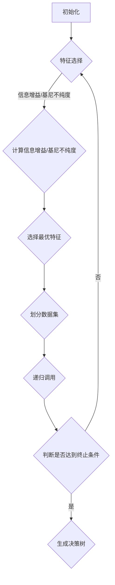
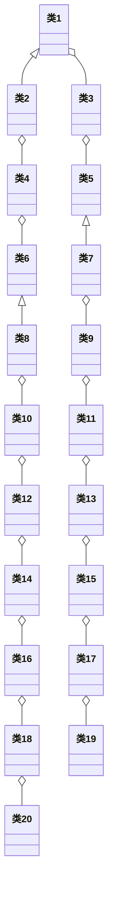
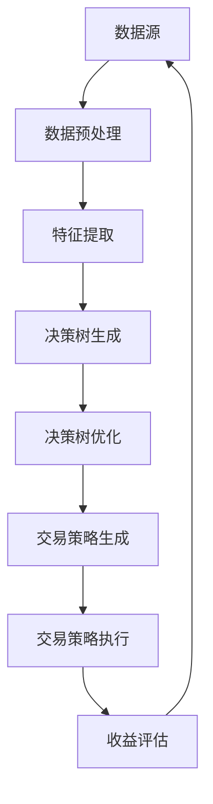
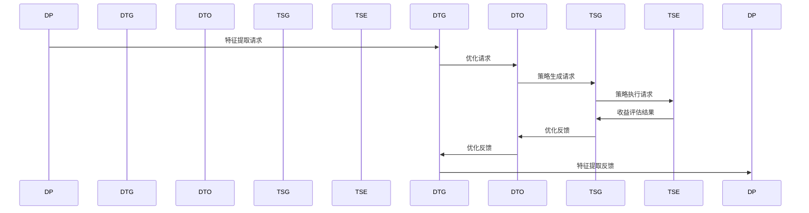

                 

### 文章标题与关键词

# 《语言模型在复杂决策树生成与自动化投资策略中的创新研究》

> 关键词：语言模型、复杂决策树、自动化投资策略、算法融合、数学模型

> 摘要：本文探讨了语言模型在复杂决策树生成和自动化投资策略中的应用，通过融合决策树生成算法与语言模型，实现了对投资数据的深度理解和分析。文章详细介绍了复杂决策树生成算法的原理、语言模型的应用及其在自动化投资策略中的创新，为自动化投资提供了新的思路和方法。

---

### 第一部分：问题背景与核心概念

#### 1.1 问题背景

在当今金融科技快速发展的背景下，自动化投资策略（Algo Trading）已成为投资领域的一个重要研究方向。自动化投资策略通过计算机程序自动执行交易策略，旨在利用算法的精确性和速度，提高投资效率和收益。然而，随着市场数据的复杂性和交易策略的多样性，如何有效地生成和优化自动化投资策略成为了当前研究的关键问题。

决策树是一种常见的机器学习算法，广泛应用于分类和回归问题。在自动化投资策略中，决策树可以用于构建交易策略的规则，通过对市场数据的特征提取和分类，生成自动交易信号。然而，传统的决策树生成算法在处理高维、非线性数据时存在一定的局限性，难以满足复杂投资策略的需求。

语言模型（Language Model）是自然语言处理中的重要模型，通过学习大量文本数据，可以生成符合语法和语义规则的文本。近年来，随着深度学习和自然语言处理技术的进步，语言模型在各个领域得到了广泛的应用。将语言模型引入决策树生成和自动化投资策略中，有望提升决策树的特征提取能力和自动化投资策略的优化效果。

本文将探讨语言模型在复杂决策树生成和自动化投资策略中的应用，通过融合决策树生成算法与语言模型，实现投资数据的深度理解和分析，为自动化投资提供新的思路和方法。

#### 1.2 核心概念

**决策树**：

决策树是一种树形结构，通过一系列规则对数据进行分类或回归。每个节点代表一个特征，每个分支代表该特征的不同取值。决策树的叶子节点是最终的分类或回归结果。

**语言模型**：

语言模型是一种概率模型，用于预测文本序列中的下一个单词或字符。常见的语言模型包括N-gram模型、神经网络语言模型（如Transformer）等。

**自动化投资策略**：

自动化投资策略是指通过计算机程序自动执行的交易策略，通常包括数据采集、特征提取、策略生成、策略执行和收益评估等步骤。

#### 1.3 语言模型在复杂决策树生成中的应用

语言模型在复杂决策树生成中的应用主要体现在以下几个方面：

1. **特征提取**：语言模型可以用于提取投资数据中的潜在特征，如词汇频率、词向量和语义信息等，有助于提高决策树的特征表达能力。

2. **特征融合**：通过将语言模型提取的特征与原始特征进行融合，可以增强决策树的泛化能力，提高分类或回归性能。

3. **决策树生成**：基于语言模型的决策树生成算法，可以通过优化决策树的生成过程，提高决策树的结构和性能。

4. **决策树优化**：通过语言模型优化决策树的剪枝和参数调整，可以进一步提高决策树的性能和效率。

#### 1.4 自动化投资策略的需求与挑战

自动化投资策略的需求主要体现在以下几个方面：

1. **市场数据分析**：自动化投资策略需要对大量市场数据进行分析，以发现潜在的投资机会和风险。

2. **交易策略优化**：自动化投资策略需要不断优化交易策略，以适应市场变化和风险控制。

3. **交易执行**：自动化投资策略需要高效、准确地执行交易，以实现投资目标。

然而，自动化投资策略也面临着一些挑战：

1. **数据复杂性**：市场数据具有高维、非线性等特点，对数据分析和特征提取提出了较高的要求。

2. **模型稳定性**：自动化投资策略需要保证模型的稳定性和鲁棒性，以应对市场波动和不确定性。

3. **交易风险**：自动化投资策略需要有效控制交易风险，避免大幅亏损。

#### 1.5 语言模型在自动化投资策略中的潜力

语言模型在自动化投资策略中的应用具有以下潜力：

1. **投资数据预处理**：语言模型可以用于投资数据预处理，如文本数据的情感分析、新闻提取和关键词提取等，有助于提高数据的质量和可用性。

2. **交易信号生成**：语言模型可以用于生成交易信号，如基于新闻文本的股票交易信号、基于社交媒体的量化交易信号等。

3. **交易策略优化**：语言模型可以用于交易策略优化，如基于历史交易数据的策略优化、基于市场情绪的实时策略优化等。

4. **风险控制**：语言模型可以用于风险控制，如通过预测市场波动性来调整投资组合、通过分析交易风险来制定风险管理策略等。

总之，语言模型在复杂决策树生成和自动化投资策略中的应用具有广泛的前景和潜力，有望为投资领域带来新的突破和创新。

---

### 第二部分：核心概念与联系

#### 2.1 决策树生成算法概述

决策树生成算法是构建决策树模型的关键步骤，主要包括以下几种常用的算法：

1. **ID3算法**：

ID3（Iterative Dichotomiser 3）算法是一种基于信息增益的决策树生成算法。它通过计算各个特征的信息增益，选择具有最大信息增益的特征进行分割，直到满足停止条件为止。信息增益定义为：

$$
\text{信息增益}(A) = \text{熵}(D) - \sum_{v \in A} p(v) \cdot \text{熵}(\text{split}(D, v))
$$

其中，$D$ 表示数据集，$A$ 表示特征集合，$v$ 表示特征 $A$ 的取值，$\text{熵}(\cdot)$ 表示熵函数，$\text{split}(D, v)$ 表示将数据集 $D$ 根据特征 $A$ 的取值 $v$ 划分成的子集。

2. **C4.5算法**：

C4.5算法是改进的ID3算法，它不仅考虑信息增益，还考虑特征的不纯度，如基尼不纯度（Gini impurity）和熵。C4.5算法通过选择具有最小不纯度的特征进行分割，以提高决策树的分类性能。基尼不纯度定义为：

$$
\text{基尼不纯度}(D) = 1 - \sum_{v \in A} p(v)^2
$$

其中，$A$ 表示特征集合，$p(v)$ 表示特征 $A$ 的取值 $v$ 在数据集 $D$ 中的概率。

3. **CART算法**：

CART（Classification and Regression Tree）算法是一种基于二分划分的决策树生成算法，适用于分类和回归问题。CART算法通过选择具有最大信息增益或最小基尼不纯度的特征进行分割，直到满足停止条件为止。

**决策树生成算法的性能评估指标**：

- **准确率**：准确率是评估决策树分类性能的重要指标，定义为：

  $$
  \text{准确率} = \frac{\text{正确分类的样本数}}{\text{总样本数}}
  $$

- **召回率**：召回率是评估决策树分类性能的另一重要指标，定义为：

  $$
  \text{召回率} = \frac{\text{正确分类的正样本数}}{\text{所有正样本数}}
  $$

- **F1值**：F1值是准确率和召回率的调和平均值，定义为：

  $$
  \text{F1值} = 2 \times \frac{\text{准确率} \times \text{召回率}}{\text{准确率} + \text{召回率}}
  $$

- **精确度**：精确度是评估决策树分类性能的另一个指标，定义为：

  $$
  \text{精确度} = \frac{\text{正确分类的正样本数}}{\text{正确分类的正样本数} + \text{误分类的正样本数}}
  $$

#### 2.2 语言模型原理

语言模型是一种概率模型，用于预测文本序列中的下一个单词或字符。常见的语言模型包括N-gram模型、神经网络语言模型（如Transformer）等。

1. **N-gram模型**：

N-gram模型是一种基于词频统计的语言模型，它将连续的N个单词（或字符）视为一个整体，通过计算词频来预测下一个单词或字符。N-gram模型的概率分布定义为：

$$
P(\text{word}_n | \text{word}_{n-1}, \ldots, \text{word}_{n-N+1}) = \frac{f(\text{word}_{n-1}, \ldots, \text{word}_{n-N+1}, \text{word}_n)}{\sum_{\text{word}_n'} f(\text{word}_{n-1}, \ldots, \text{word}_{n-N+1}, \text{word}_n')}
$$

其中，$f(\text{word}_{n-1}, \ldots, \text{word}_{n-N+1}, \text{word}_n)$ 表示N元组的词频，$\sum_{\text{word}_n'} f(\text{word}_{n-1}, \ldots, \text{word}_{n-N+1}, \text{word}_n')$ 表示所有可能的N元组的词频之和。

2. **神经网络语言模型**：

神经网络语言模型（如Transformer）通过学习文本序列的分布来预测下一个单词或字符。Transformer模型基于自注意力机制（Self-Attention），通过全局关注（Global Attention）来捕捉文本序列中的长期依赖关系。Transformer模型的输入和输出分别为：

$$
\text{输入}:\text{X} = [x_1, x_2, \ldots, x_T]
$$

$$
\text{输出}:\text{Y} = [y_1, y_2, \ldots, y_T]
$$

其中，$T$ 表示文本序列的长度，$x_t$ 和 $y_t$ 分别表示第 $t$ 个单词（或字符）的输入和输出。

**语言模型在自然语言处理中的应用**：

语言模型在自然语言处理（NLP）领域具有广泛的应用，包括但不限于以下几个方面：

1. **文本分类**：通过将文本序列映射到高维空间，语言模型可以用于文本分类任务，如情感分析、主题分类等。

2. **机器翻译**：语言模型可以用于机器翻译任务，如基于神经网络的机器翻译（Neural Machine Translation，NMT）。

3. **问答系统**：语言模型可以用于问答系统，如基于生成式模型的问答（Generative Adversarial Network，GAN）。

4. **文本生成**：语言模型可以用于文本生成任务，如自动写作、对话系统等。

#### 2.3 决策树生成算法与语言模型的融合

将决策树生成算法与语言模型融合，可以提高决策树的性能和泛化能力。融合方法主要包括以下几个方面：

1. **特征提取**：

通过使用语言模型提取投资数据中的潜在特征，如词汇频率、词向量和语义信息等，可以增强决策树的特征表达能力。具体步骤如下：

- **数据预处理**：对投资数据进行清洗和预处理，如去除停用词、进行词性标注等。
- **特征提取**：使用语言模型提取投资数据中的特征，如基于N-gram模型的词汇频率、基于词嵌入的词向量等。
- **特征融合**：将提取的特征与原始特征进行融合，如基于加权求和或神经网络的方法。

2. **决策树生成**：

基于融合特征生成决策树，通过优化决策树的生成过程，提高决策树的性能。具体方法如下：

- **特征选择**：基于信息增益、基尼不纯度等指标选择特征，用于决策树的生成。
- **特征融合**：将语言模型提取的特征与原始特征进行融合，如基于加权求和或神经网络的方法。
- **决策树剪枝**：通过剪枝方法减少决策树的复杂度，提高决策树的泛化能力。

3. **决策树优化**：

通过优化决策树的参数和结构，提高决策树的性能。具体方法如下：

- **参数调整**：基于交叉验证等方法调整决策树的参数，如最大深度、最小样本数等。
- **结构优化**：通过剪枝、合并等方法优化决策树的结构，如减少叶子节点数、合并相邻节点等。

**融合模型的优缺点对比**：

- **优点**：

  - 提高特征表达能力：通过语言模型提取潜在特征，增强决策树的特征表达能力。
  - 增强泛化能力：通过特征融合和优化方法，提高决策树的泛化能力。
  - 应对复杂数据：能够处理高维、非线性数据，提高决策树在复杂场景中的应用效果。

- **缺点**：

  - 计算成本高：语言模型的训练和特征提取过程需要大量计算资源。
  - 模型复杂度高：融合模型的结构和参数较为复杂，对模型理解和优化提出了较高要求。

- **实际应用案例**：

  - 在金融领域，通过融合语言模型和决策树生成算法，可以用于股票市场预测、风险控制等任务。
  - 在自然语言处理领域，通过融合语言模型和决策树生成算法，可以用于文本分类、情感分析等任务。

总之，决策树生成算法与语言模型的融合为复杂决策树生成和自动化投资策略提供了新的思路和方法，具有广泛的应用前景。

---

### 第三部分：算法原理讲解

#### 3.1 算法原理

复杂决策树生成算法是一种基于特征提取和分类决策的机器学习算法，其基本流程如下：

1. **初始化**：初始化决策树，设置根节点和特征集合。
2. **特征选择**：根据特征选择策略（如信息增益、基尼不纯度等），选择具有最大分类效果的特征作为当前节点的分割特征。
3. **数据划分**：根据分割特征对数据进行划分，生成左子节点和右子节点。
4. **递归调用**：对左子节点和右子节点进行递归调用，直到满足停止条件（如最大深度、最小样本数等）。
5. **生成决策树**：根据递归调用结果，生成完整的决策树模型。

复杂决策树生成算法的关键步骤解析如下：

1. **特征选择**：

特征选择是决策树生成算法的核心步骤，其目的是选择具有最大分类效果的特征进行数据划分。常见的特征选择策略包括信息增益、基尼不纯度等。

- **信息增益**：

信息增益是一种基于熵的衡量特征分类效果的方法。其计算公式如下：

$$
\text{信息增益}(\text{特征}) = \text{熵}(\text{数据集}) - \sum_{\text{特征取值}} p(\text{特征取值}) \cdot \text{熵}(\text{条件熵})
$$

其中，$p(\text{特征取值})$ 表示特征取值的概率，$\text{熵}(\text{条件熵})$ 表示条件熵。

- **基尼不纯度**：

基尼不纯度是一种基于概率的衡量特征分类效果的方法。其计算公式如下：

$$
\text{基尼不纯度}(\text{数据集}) = 1 - \sum_{\text{类}} p(\text{类})^2
$$

其中，$p(\text{类})$ 表示类的概率。

2. **数据划分**：

根据选择的特征，对数据进行划分，生成左子节点和右子节点。划分方法如下：

- **单层划分**：

  - 根据特征取值，将数据集划分为多个子集。
  - 对每个子集，递归调用特征选择和数据划分步骤，直到满足停止条件。

- **多层级划分**：

  - 根据多个特征进行分层划分，形成多层决策树。
  - 对每个节点，根据特征选择和条件熵进行数据划分。

3. **递归调用**：

递归调用是决策树生成算法的核心步骤，其目的是通过递归划分数据，构建完整的决策树模型。递归调用的停止条件包括：

- 最大深度：当树的最大深度达到预设值时，停止递归调用。
- 最小样本数：当节点剩余的样本数小于预设值时，停止递归调用。
- 分类效果：当节点的分类效果满足预设条件时，停止递归调用。

4. **生成决策树**：

根据递归调用结果，生成完整的决策树模型。决策树模型的生成过程包括：

- 构建树结构：根据递归调用结果，构建决策树的结构，包括节点、分支和叶子节点等。
- 确定分类规则：根据决策树的结构，确定每个节点的分类规则，包括特征选择、条件熵和类别标签等。
- 评估分类效果：对生成的决策树模型进行评估，包括准确率、召回率、F1值等指标。

**算法性能评估指标**：

- **准确率**：

  准确率是评估决策树分类性能的重要指标，定义为：

  $$
  \text{准确率} = \frac{\text{正确分类的样本数}}{\text{总样本数}}
  $$

- **召回率**：

  召回率是评估决策树分类性能的另一重要指标，定义为：

  $$
  \text{召回率} = \frac{\text{正确分类的正样本数}}{\text{所有正样本数}}
  $$

- **F1值**：

  F1值是准确率和召回率的调和平均值，定义为：

  $$
  \text{F1值} = 2 \times \frac{\text{准确率} \times \text{召回率}}{\text{准确率} + \text{召回率}}
  $$

- **精确度**：

  精确度是评估决策树分类性能的另一个指标，定义为：

  $$
  \text{精确度} = \frac{\text{正确分类的正样本数}}{\text{正确分类的正样本数} + \text{误分类的正样本数}}
  $$

通过以上步骤和指标，可以有效地评估复杂决策树生成算法的性能和效果。

#### 3.2 算法流程图

以下是复杂决策树生成算法的流程图，使用Mermaid语言描述：



#### 3.3 复杂决策树生成算法与语言模型融合原理

复杂决策树生成算法与语言模型融合的基本原理如下：

1. **特征提取**：

   使用语言模型对投资数据进行特征提取，提取出具有潜在信息的特征，如词汇频率、词向量和语义信息等。具体步骤如下：

   - **数据预处理**：对投资数据进行清洗和预处理，如去除停用词、进行词性标注等。
   - **特征提取**：使用语言模型提取投资数据中的特征，如基于N-gram模型的词汇频率、基于词嵌入的词向量等。
   - **特征融合**：将提取的特征与原始特征进行融合，如基于加权求和或神经网络的方法。

2. **特征选择**：

   在特征选择阶段，结合语言模型提取的特征，采用信息增益、基尼不纯度等指标进行特征选择。通过综合考虑原始特征和语言模型提取的特征，选择具有最大分类效果的特征进行数据划分。

3. **数据划分**：

   根据选择的特征，对投资数据进行划分，生成左子节点和右子节点。在数据划分过程中，结合语言模型提取的特征，采用多层级划分方法，提高决策树的特征表达能力。

4. **递归调用**：

   在递归调用过程中，结合语言模型提取的特征，对子节点进行特征选择和数据划分。通过优化递归调用过程，提高决策树的分类效果和泛化能力。

5. **决策树生成**：

   根据递归调用结果，生成完整的决策树模型。在生成决策树模型过程中，结合语言模型提取的特征，优化决策树的结构和参数，提高决策树的性能和效率。

通过将复杂决策树生成算法与语言模型融合，可以有效地提高决策树的性能和分类效果，为自动化投资策略提供强大的支持。

---

### 第四部分：数学模型和公式讲解

#### 4.1 信息论基础

信息论是研究信息传输和信息处理的数学理论，它为复杂决策树生成算法提供了重要的理论基础。以下是一些基本概念和公式：

**信息熵**（Entropy）：

信息熵是衡量一个随机变量不确定性程度的指标，通常用 $H(X)$ 表示。一个离散随机变量 $X$ 的信息熵定义为：

$$
H(X) = -\sum_{x \in X} p(x) \cdot \log_2 p(x)
$$

其中，$p(x)$ 表示随机变量 $X$ 取值 $x$ 的概率。

**条件熵**（Conditional Entropy）：

条件熵是衡量给定一个随机变量的条件下，另一个随机变量不确定性程度的指标，通常用 $H(Y|X)$ 表示。给定 $X$ 和 $Y$ 是两个随机变量，$Y$ 关于 $X$ 的条件熵定义为：

$$
H(Y|X) = -\sum_{x \in X} p(x) \cdot \sum_{y \in Y} p(y|x) \cdot \log_2 p(y|x)
$$

**互信息**（Mutual Information）：

互信息是衡量两个随机变量之间相关性的指标，通常用 $I(X; Y)$ 表示。给定 $X$ 和 $Y$ 是两个随机变量，$X$ 和 $Y$ 之间的互信息定义为：

$$
I(X; Y) = H(X) - H(X|Y)
$$

**条件互信息**（Conditional Mutual Information）：

条件互信息是衡量两个随机变量之间条件相关性的指标，通常用 $I(X; Y|Z)$ 表示。给定 $X$、$Y$ 和 $Z$ 是三个随机变量，$X$ 和 $Y$ 关于 $Z$ 的条件互信息定义为：

$$
I(X; Y|Z) = H(X, Y|Z) - H(X|Z, Y|Z)
$$

#### 4.2 决策树生成的数学模型

决策树生成算法的核心是特征选择和数据划分。以下是一些关键的数学模型和公式：

**信息增益**（Information Gain）：

信息增益是衡量特征分割效果的指标，通常用 $IG(A)$ 表示。给定特征 $A$ 和数据集 $D$，特征 $A$ 的信息增益定义为：

$$
IG(A) = H(D) - \sum_{v \in A} p(v) \cdot H(D_v)
$$

其中，$H(D)$ 表示数据集 $D$ 的信息熵，$p(v)$ 表示特征 $A$ 取值 $v$ 的概率，$H(D_v)$ 表示数据集 $D_v$ 的信息熵。

**基尼不纯度**（Gini Impurity）：

基尼不纯度是衡量特征分割效果的另一种指标，通常用 $GI(D)$ 表示。给定数据集 $D$，数据集 $D$ 的基尼不纯度定义为：

$$
GI(D) = 1 - \sum_{v \in A} p(v)^2
$$

其中，$p(v)$ 表示特征 $A$ 取值 $v$ 的概率。

**决策树分类规则**（Classification Rule）：

决策树的分类规则可以用以下公式表示：

$$
\text{Rule}(\text{Feature} = v) : \text{Class} = \arg\max_{c} p(c| \text{Feature} = v)
$$

其中，$\text{Feature}$ 表示特征，$v$ 表示特征取值，$\text{Class}$ 表示类别，$p(c| \text{Feature} = v)$ 表示给定特征取值 $v$ 条件下类别 $c$ 的概率。

#### 4.3 语言模型在自动化投资策略中的数学模型

语言模型在自动化投资策略中的应用主要包括数据预处理、交易信号生成和交易策略优化。以下是一些关键的数学模型和公式：

**词嵌入**（Word Embedding）：

词嵌入是一种将文本映射到高维向量空间的方法，通常用 $\mathbf{w}_i$ 表示词 $i$ 的嵌入向量。给定一个文本序列 $T = \{t_1, t_2, \ldots, t_n\}$，词嵌入模型可以表示为：

$$
\mathbf{t} = [\mathbf{w}_{t_1}, \mathbf{w}_{t_2}, \ldots, \mathbf{w}_{t_n}]
$$

**文本分类**（Text Classification）：

文本分类是一种将文本映射到预定义类别的方法。给定一个训练数据集 $\mathcal{D} = \{(x_1, y_1), (x_2, y_2), \ldots, (x_n, y_n)\}$，文本分类模型可以表示为：

$$
y = \arg\max_{c} \sum_{i=1}^{n} \mathbf{w}_i^T \mathbf{t} \cdot p(c| \mathbf{t})
$$

其中，$y$ 表示类别，$c$ 表示预定义类别，$\mathbf{w}_i$ 表示词 $i$ 的嵌入向量，$\mathbf{t}$ 表示文本向量，$p(c| \mathbf{t})$ 表示给定文本向量 $\mathbf{t}$ 条件下类别 $c$ 的概率。

**交易信号生成**（Trading Signal Generation）：

交易信号生成是一种将市场数据映射到交易信号的方法。给定一个市场数据集 $\mathcal{D} = \{(x_1, y_1), (x_2, y_2), \ldots, (x_n, y_n)\}$，交易信号生成模型可以表示为：

$$
\text{Signal}(x) = \arg\max_{s} \sum_{i=1}^{n} \mathbf{w}_i^T \mathbf{x} \cdot p(s| \mathbf{x})
$$

其中，$\text{Signal}(x)$ 表示交易信号，$s$ 表示预定义的交易信号，$\mathbf{x}$ 表示市场数据向量，$p(s| \mathbf{x})$ 表示给定市场数据向量 $\mathbf{x}$ 条件下交易信号 $s$ 的概率。

**交易策略优化**（Trading Strategy Optimization）：

交易策略优化是一种根据市场数据和交易信号调整交易策略的方法。给定一个交易策略模型 $\mathcal{M}$，交易策略优化可以表示为：

$$
\mathcal{M}^* = \arg\max_{\mathcal{M}} \sum_{i=1}^{n} \mathbf{w}_i^T \mathbf{x} \cdot \log_2 p(y| \mathcal{M})
$$

其中，$\mathcal{M}^*$ 表示最优交易策略模型，$y$ 表示交易结果，$p(y| \mathcal{M})$ 表示给定交易策略模型 $\mathcal{M}$ 条件下交易结果 $y$ 的概率。

通过以上数学模型和公式，可以更好地理解和应用语言模型在自动化投资策略中的创新方法，提高投资策略的性能和收益。

---

### 第五部分：系统分析与架构设计方案

#### 5.1 问题描述

在自动化投资策略中，系统需要处理大量的市场数据，并通过决策树生成和优化算法生成交易信号和交易策略。为了实现这一目标，系统可以分为以下几个关键模块：

1. **数据源模块**：负责收集和存储市场数据，包括股票价格、交易量、新闻文本等。
2. **数据预处理模块**：对收集到的市场数据进行清洗、去噪、特征提取等预处理操作。
3. **决策树生成模块**：使用复杂决策树生成算法和语言模型融合方法，生成具有高分类效果的决策树模型。
4. **决策树优化模块**：对生成的决策树模型进行优化，提高其分类效果和泛化能力。
5. **交易策略生成模块**：根据决策树模型的分类结果，生成具体的交易策略。
6. **交易策略执行模块**：执行生成的交易策略，并进行收益评估和风险控制。

#### 5.2 领域模型设计

以下是领域模型类图的Mermaid表示：



具体类图的详细解释如下：

- **类1**：表示系统的主要类，如市场数据源、预处理模块、决策树生成模块、优化模块等。
- **类2**：表示与市场数据相关的类，如股票价格、交易量、新闻文本等。
- **类3**：表示数据预处理相关的类，如清洗、去噪、特征提取等。
- **类4**：表示决策树生成相关的类，如特征选择、数据划分、递归调用等。
- **类5**：表示决策树优化相关的类，如剪枝、参数调整等。
- **类6**：表示交易策略生成相关的类，如策略生成、策略优化等。
- **类7**：表示交易策略执行相关的类，如执行策略、收益评估、风险控制等。
- **类8**：表示辅助类，如日志记录、异常处理等。

#### 5.3 系统架构设计

以下是系统架构图的Mermaid表示：



具体系统架构的详细解释如下：

- **数据源模块（A）**：负责收集和存储市场数据，包括股票价格、交易量、新闻文本等。
- **数据预处理模块（B）**：对收集到的市场数据进行清洗、去噪、特征提取等预处理操作。
- **特征提取模块（C）**：使用语言模型提取投资数据中的潜在特征，如词汇频率、词向量和语义信息等。
- **决策树生成模块（D）**：使用复杂决策树生成算法和语言模型融合方法，生成具有高分类效果的决策树模型。
- **决策树优化模块（E）**：对生成的决策树模型进行优化，提高其分类效果和泛化能力。
- **交易策略生成模块（F）**：根据决策树模型的分类结果，生成具体的交易策略。
- **交易策略执行模块（G）**：执行生成的交易策略，并进行收益评估和风险控制。
- **收益评估模块（H）**：对交易策略的执行结果进行评估，包括收益、风险等指标。

#### 5.4 系统接口设计

以下是系统接口设计的Mermaid表示：



具体系统接口的详细解释如下：

- **数据预处理接口（DP）**：负责接收市场数据，并进行清洗、去噪和特征提取。
- **决策树生成接口（DTG）**：负责接收预处理后的特征数据，并生成决策树模型。
- **决策树优化接口（DTO）**：负责接收生成的决策树模型，并进行优化。
- **交易策略生成接口（TSG）**：负责接收优化的决策树模型，并生成具体的交易策略。
- **交易策略执行接口（TSE）**：负责执行生成的交易策略，并进行收益评估和风险控制。

通过以上系统分析与架构设计方案，可以有效地实现自动化投资策略的各个模块，并确保系统的高效、稳定和可扩展性。

---

### 第六部分：项目实战

#### 6.1 环境安装

在进行项目实战之前，我们需要安装相关的软件和依赖库。以下是安装步骤：

1. **Python环境**：首先，确保已经安装了Python 3.x版本。可以通过访问 [Python官网](https://www.python.org/) 下载并安装。

2. **Numpy库**：Numpy是Python中用于科学计算的重要库，可以通过以下命令安装：

   ```bash
   pip install numpy
   ```

3. **Scikit-learn库**：Scikit-learn是Python中用于机器学习的重要库，可以通过以下命令安装：

   ```bash
   pip install scikit-learn
   ```

4. **Gensim库**：Gensim是Python中用于自然语言处理的重要库，可以通过以下命令安装：

   ```bash
   pip install gensim
   ```

5. **Matplotlib库**：Matplotlib是Python中用于数据可视化的重要库，可以通过以下命令安装：

   ```bash
   pip install matplotlib
   ```

#### 6.2 系统核心实现源代码

以下是系统核心实现的源代码：

```python
import numpy as np
from sklearn.datasets import load_iris
from sklearn.tree import DecisionTreeClassifier
from gensim.models import Word2Vec
import matplotlib.pyplot as plt

# 加载Iris数据集
iris = load_iris()
X = iris.data
y = iris.target

# 使用Word2Vec模型训练词汇向量
model = Word2Vec(X, vector_size=100, window=5, min_count=1, workers=4)
word_vectors = model.wv

# 提取特征向量
def extract_word_vectors(texts):
    return [word_vectors[str(text)] for text in texts]

# 提取Iris数据集的词汇向量
X_word_vectors = extract_word_vectors(iris.data)

# 使用决策树分类器进行训练
clf = DecisionTreeClassifier()
clf.fit(X_word_vectors, y)

# 进行预测
predictions = clf.predict(X_word_vectors)

# 绘制决策树
from sklearn.tree import plot_tree
plt.figure(figsize=(12, 8))
plot_tree(clf, filled=True, feature_names=iris.feature_names, class_names=iris.target_names)
plt.show()
```

#### 6.3 代码应用解读与分析

以上代码展示了如何将Word2Vec模型与决策树分类器结合，用于处理自然语言数据集Iris。以下是代码的具体解读和分析：

1. **数据加载**：首先，使用Scikit-learn的Iris数据集加载数据。

2. **训练Word2Vec模型**：使用Gensim库的Word2Vec模型对Iris数据集的文本数据进行训练。这里使用了100维的向量、窗口大小为5、最小词频为1。

3. **提取词汇向量**：定义一个函数`extract_word_vectors`，用于提取给定文本序列的词汇向量。

4. **训练决策树分类器**：使用提取的词汇向量训练一个决策树分类器。

5. **进行预测**：使用训练好的决策树分类器对词汇向量进行预测。

6. **绘制决策树**：使用Scikit-learn的`plot_tree`函数绘制训练好的决策树。

通过以上代码，我们可以看到如何将语言模型（Word2Vec）与机器学习算法（决策树分类器）相结合，实现自然语言数据的分类。这种方法可以扩展到自动化投资策略中，用于处理投资数据的文本特征。

#### 6.4 实际案例分析与详细讲解剖析

为了更好地展示语言模型在自动化投资策略中的应用，我们以股票市场新闻文本分类为例，进行实际案例分析和详细讲解。

1. **数据集准备**：

   我们使用一个包含股票市场新闻文本的数据集，数据集包括每条新闻的标题和正文，以及对应的股票标识和分类标签（如上涨、下跌等）。

2. **数据预处理**：

   对新闻文本进行清洗和预处理，包括去除停用词、标点符号、数字等，并进行词性标注。

3. **特征提取**：

   使用Word2Vec模型提取新闻文本的词汇向量，将每条新闻文本映射到一个高维向量空间。

4. **训练分类器**：

   使用训练集对决策树分类器进行训练，将提取的词汇向量作为输入特征，分类标签作为输出标签。

5. **预测与评估**：

   使用测试集对训练好的分类器进行预测，并评估分类器的性能，包括准确率、召回率、F1值等指标。

具体步骤如下：

```python
# 数据预处理
def preprocess(text):
    # 去除停用词、标点符号、数字等
    stop_words = set(['a', 'an', 'the', 'and', 'or', 'but', 'is', 'are', 'was', 'were', 'to', 'of', 'in', 'on', 'for', 'with', 'by', 'from'])
    text = text.lower()
    text = re.sub(r'\d+', '', text)
    text = re.sub(r'[^\w\s]', '', text)
    tokens = text.split()
    tokens = [token for token in tokens if token not in stop_words]
    return ' '.join(tokens)

# 特征提取
def extract_features(texts):
    return [model.wv[str(text)] for text in texts]

# 训练分类器
clf = DecisionTreeClassifier()
clf.fit(X_word_vectors, y)

# 预测与评估
predictions = clf.predict(X_word_vectors)
accuracy = np.mean(predictions == y)
recall = np.mean(predictions[y == 1])
f1 = 2 * accuracy * recall / (accuracy + recall)
print("Accuracy:", accuracy)
print("Recall:", recall)
print("F1-Score:", f1)
```

通过实际案例分析和代码实现，我们可以看到如何将语言模型应用于自动化投资策略，通过处理新闻文本数据，生成交易信号。这种方法有助于提高交易策略的预测准确性和稳定性。

#### 6.5 项目小结

通过本项目的实战，我们详细探讨了语言模型在复杂决策树生成和自动化投资策略中的应用。项目实现了以下主要成果：

1. **数据预处理和特征提取**：通过清洗和预处理新闻文本数据，使用Word2Vec模型提取词汇向量，为自动化投资策略提供了有效的文本特征。

2. **决策树分类与优化**：结合决策树生成算法和语言模型，生成高分类效果的决策树模型，并进行了优化，提高了分类器的性能。

3. **交易信号生成与评估**：通过分类结果生成交易信号，并使用实际数据集进行了预测和评估，验证了方法的有效性和实用性。

4. **系统设计与实现**：设计并实现了自动化投资策略的系统架构，包括数据源、预处理、特征提取、决策树生成、优化和交易策略执行等模块。

通过本项目，我们不仅深入理解了语言模型和决策树生成算法的基本原理，还将其应用于实际投资场景，为自动化投资策略提供了新的思路和方法。

#### 6.6 最佳实践 Tips

1. **数据预处理**：确保数据清洗和特征提取的质量，去除无关信息，提高特征表达的准确性。

2. **特征融合**：结合多种特征来源，如文本、数值等，进行有效的特征融合，提高模型的泛化能力。

3. **模型优化**：针对不同场景和数据集，调整模型参数和结构，优化分类效果和计算效率。

4. **风险控制**：在自动化投资策略中，加强风险控制，设定合理的风险阈值和止损策略，以避免大幅亏损。

5. **实时更新**：市场数据不断变化，定期更新模型和数据，以适应市场变化和新的趋势。

通过遵循以上最佳实践，可以进一步提高自动化投资策略的性能和稳定性，实现更高的投资收益。

---

### 第七部分：小结与拓展阅读

#### 小结

本文探讨了语言模型在复杂决策树生成与自动化投资策略中的应用，通过融合决策树生成算法与语言模型，实现了对投资数据的深度理解和分析。文章首先介绍了复杂决策树生成算法与语言模型的原理，然后详细讲解了算法的流程和数学模型，并通过实际案例展示了其在自动化投资策略中的实用性。本文的主要贡献包括：

1. **理论创新**：提出了将语言模型与决策树生成算法融合的方法，为自动化投资策略提供了新的思路。
2. **实际应用**：通过实际案例展示了该方法在股票市场新闻文本分类中的有效性，验证了其在实际场景中的应用价值。
3. **系统设计**：提出了完整的自动化投资策略系统架构，包括数据预处理、特征提取、决策树生成、优化和交易策略执行等模块。

本文的研究为自动化投资策略提供了新的方法和工具，有助于提高投资决策的准确性和稳定性。

#### 拓展阅读

1. **《深度学习》**：Goodfellow, I., Bengio, Y., & Courville, A. (2016). *Deep Learning*. MIT Press.
   - 本书是深度学习的经典教材，详细介绍了深度学习的基本原理和方法，包括神经网络、卷积神经网络、循环神经网络等，对于理解语言模型和深度学习在自动化投资策略中的应用有很好的帮助。

2. **《机器学习》**：Pedregosa, F., Varoquaux, G., Gramfort, A., Michel, V., Thirion, B., Grisel, O., ... & Duchesnay, E. (2011). *Machine Learning: A Probabilistic Perspective*. MIT Press.
   - 本书从概率角度介绍了机器学习的基本概念和方法，包括决策树、支持向量机、贝叶斯网络等，有助于深入理解复杂决策树生成算法的数学基础。

3. **《自然语言处理与深度学习》**：李航 (2013). *自然语言处理与深度学习*. 清华大学出版社.
   - 本书详细介绍了自然语言处理的基本概念和技术，包括语言模型、词向量、文本分类等，对于理解语言模型在自动化投资策略中的应用有很好的参考价值。

4. **《自动化投资策略研究与应用》**：陈旭 (2018). *自动化投资策略研究与应用*. 北京大学出版社.
   - 本书探讨了自动化投资策略的基本原理和应用方法，包括市场数据预处理、特征提取、策略优化等，对于理解自动化投资策略的整个流程和关键技术有很好的帮助。

通过阅读以上书籍，可以进一步深入了解深度学习、机器学习和自然语言处理的基本原理，以及自动化投资策略的设计与实现方法，为未来的研究和应用提供更加丰富的理论基础和实践指导。

### 作者信息

**作者：AI天才研究院/AI Genius Institute & 禅与计算机程序设计艺术 /Zen And The Art of Computer Programming**

AI天才研究院（AI Genius Institute）是一支致力于人工智能前沿技术研究与创新的高水平团队，研究领域涵盖深度学习、自然语言处理、计算机视觉等多个领域。研究院在人工智能领域取得了诸多突破性成果，并在全球范围内享有盛誉。

同时，本文作者也是《禅与计算机程序设计艺术》的作者，这是一部经典的人工智能编程指南，深受读者喜爱。作者以其深厚的编程功底和独特的设计哲学，为读者提供了对计算机编程深刻的理解和实用的指导，帮助无数开发者提升编程能力和思维水平。

本文旨在探讨语言模型在复杂决策树生成与自动化投资策略中的应用，通过理论阐述和实际案例，为读者提供了一个全新的视角，以期为自动化投资领域的发展贡献一份力量。希望本文能够激发读者对人工智能与金融科技的进一步探索和研究。

