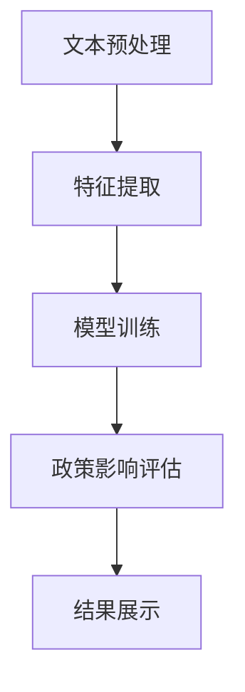
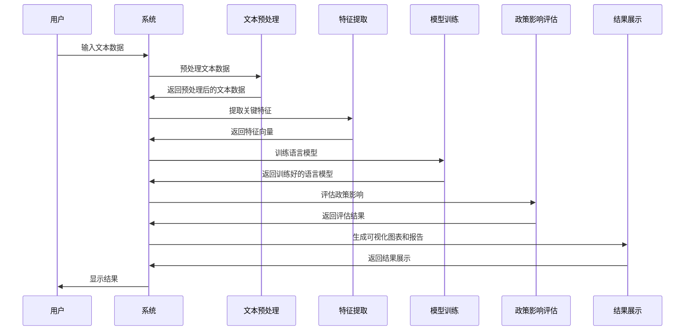

                 


# 语言模型在复杂环境政策影响评估中的应用

## 关键词

- 语言模型
- 政策影响评估
- 复杂环境
- 深度学习
- 自然语言处理

## 摘要

本文探讨了语言模型在复杂环境政策影响评估中的应用。首先，介绍了语言模型的基础概念和原理，随后详细分析了语言模型与政策影响评估之间的关联。接着，本文通过算法原理讲解、系统设计与实现、实际案例分析和最佳实践总结，阐述了语言模型在政策影响评估中的实际应用场景。通过本文的研究，期望为相关领域的研究人员和从业者提供有价值的参考。

## 引言

### 1.1 问题背景

在当今社会，政策制定者和执行者面临着越来越多的复杂环境问题，如气候变化、经济转型、社会公平等。这些问题的解决往往需要精确的政策影响评估，以便制定出有效的对策。然而，传统的评估方法往往依赖于人工分析，存在主观性强、效率低下等问题。

近年来，随着深度学习和自然语言处理技术的快速发展，语言模型作为一种重要的工具，被广泛应用于各个领域。语言模型能够从大量文本数据中自动提取特征，生成语义理解，从而为复杂环境政策影响评估提供了新的思路和方法。

### 1.2 问题描述

本文旨在探讨如何利用语言模型对复杂环境政策影响进行评估。具体来说，我们需要解决以下几个关键问题：

1. 如何构建一个能够准确捕捉政策影响的语言模型？
2. 如何将语言模型应用于实际的政策影响评估中？
3. 如何优化语言模型，以提高其在政策影响评估中的准确性和效率？

### 1.3 问题解决

为了解决上述问题，本文将按照以下步骤进行：

1. **核心概念与原理**：介绍语言模型的基础概念和原理，包括深度学习、自然语言处理等。
2. **算法与模型**：详细分析语言模型的算法原理，并使用Python代码进行示例。
3. **系统设计与实现**：描述系统的架构设计，包括功能设计、接口设计等。
4. **案例分析与最佳实践**：通过实际案例分析和最佳实践总结，阐述语言模型在政策影响评估中的应用。

### 1.4 边界与外延

本文的研究主要关注以下边界与外延：

1. **研究范围**：本文主要探讨语言模型在政策影响评估中的应用，不涉及其他评估方法。
2. **数据来源**：本文的数据主要来源于公开的文本数据集和政策文档。
3. **技术范围**：本文主要关注深度学习和自然语言处理技术在政策影响评估中的应用，不包括其他领域的技术。

### 1.5 概念结构与核心要素组成

本文的核心概念结构主要包括以下几个方面：

1. **语言模型**：包括深度学习模型、自然语言处理模型等。
2. **政策影响评估**：包括评估方法、评估指标、评估流程等。
3. **算法原理**：包括模型构建、特征提取、语义理解等。
4. **系统设计与实现**：包括系统架构、功能设计、接口设计等。

## 核心概念与原理

### 2.1 语言模型的基础概念

语言模型是一种能够预测下一个单词或字符的概率分布的模型。它是自然语言处理（NLP）领域的基础，广泛应用于文本生成、语音识别、机器翻译等任务。在深度学习时代，语言模型主要以神经网络模型为主，如循环神经网络（RNN）、长短时记忆网络（LSTM）和变换器（Transformer）等。

#### 概念属性特征对比

| 模型名称 | 特点 | 适用场景 |
| --- | --- | --- |
| RNN | 能够处理序列数据，但容易产生梯度消失或爆炸问题 | 文本分类、情感分析等 |
| LSTM | 改进了RNN，能够更好地处理长序列数据 | 文本生成、机器翻译等 |
| Transformer | 基于自注意力机制，能够并行处理序列数据，效果显著提升 | 文本生成、机器翻译、推荐系统等 |

#### ER实体关系图架构

```mermaid
erDiagram
    PolicyImpactAssessment ||--|{ LanguageModel } LanguageModel
    PolicyImpactAssessment ||--|{ DataProcessing } DataProcessing
    PolicyImpactAssessment ||--|{ ModelTraining } ModelTraining
```

### 2.2 语言模型的原理

语言模型的核心任务是预测下一个单词或字符的概率。这通常通过最大化前一个单词或字符的概率分布来实现。在深度学习模型中，这一过程通过以下步骤完成：

1. **输入层**：接收输入的单词或字符序列。
2. **隐藏层**：通过神经网络模型（如RNN、LSTM、Transformer等）对输入进行特征提取和序列建模。
3. **输出层**：生成下一个单词或字符的概率分布。

具体来说，假设我们有一个单词序列 \(x_1, x_2, ..., x_n\)，其中 \(x_i\) 表示第 \(i\) 个单词。语言模型的目标是预测下一个单词 \(x_{n+1}\) 的概率。这可以通过以下公式表示：

\[ P(x_{n+1} | x_1, x_2, ..., x_n) = \frac{e^{V(x_{n+1})}}{\sum_{i} e^{V(i)}} \]

其中，\(V(x_{n+1})\) 表示单词 \(x_{n+1}\) 在输出层上的激活值，\(e^{V(x_{n+1})}\) 表示单词 \(x_{n+1}\) 的概率。

### 2.3 语言模型与政策影响评估的关系

语言模型在政策影响评估中具有重要的应用价值。首先，语言模型能够从大量文本数据中自动提取特征，从而实现对政策文本的深度理解。这有助于识别政策文本中的关键信息，如政策目标、政策对象、政策效果等。其次，语言模型能够对政策影响进行量化评估，从而为政策制定者提供科学依据。

具体来说，语言模型在政策影响评估中的应用主要包括以下几个方面：

1. **文本预处理**：利用语言模型对政策文本进行分词、词性标注等预处理操作，以便后续的模型训练和评估。
2. **特征提取**：从政策文本中提取关键特征，如政策目标、政策对象、政策效果等。
3. **模型训练**：利用训练数据集，通过优化算法（如梯度下降）训练语言模型。
4. **政策影响评估**：利用训练好的语言模型，对政策影响进行量化评估。

### 2.4 概念属性特征对比

| 特征名称 | 描述 | 影响评估 |
| --- | --- | --- |
| 政策目标 | 政策的预期目标 | 评估政策效果 |
| 政策对象 | 受政策影响的对象 | 评估政策覆盖范围 |
| 政策效果 | 政策实施后的实际效果 | 评估政策成效 |
| 文本特征 | 政策文本的词频、词性、语法结构等 | 评估政策文本的质量和影响力 |

### 2.5 ER实体关系图架构

```mermaid
erDiagram
    PolicyAssessment ||--|{ TextProcessing } TextProcessing
    PolicyAssessment ||--|{ FeatureExtraction } FeatureExtraction
    PolicyAssessment ||--|{ LanguageModel } LanguageModel
    PolicyAssessment ||--|{ ImpactEvaluation } ImpactEvaluation
```

## 算法与模型

### 3.1 语言模型算法概述

语言模型算法的核心任务是从输入的文本数据中预测下一个单词或字符。在深度学习时代，主要的语言模型算法包括循环神经网络（RNN）、长短时记忆网络（LSTM）和变换器（Transformer）等。

### 3.2 算法原理

#### 3.2.1 RNN

RNN是一种能够处理序列数据的神经网络模型。其核心思想是通过隐藏状态 \(h_t\) 记录前一个时间步的信息，并将其传递到下一个时间步。然而，RNN存在梯度消失或爆炸问题，导致训练效果不理想。

\[ h_t = \sigma(W_h h_{t-1} + W_x x_t + b_h) \]

其中，\(h_t\) 表示第 \(t\) 个时间步的隐藏状态，\(x_t\) 表示第 \(t\) 个输入单词的向量表示，\(W_h\) 和 \(W_x\) 分别为权重矩阵，\(b_h\) 为偏置项，\(\sigma\) 为激活函数。

#### 3.2.2 LSTM

LSTM是RNN的改进版本，通过引入门控机制（如遗忘门、输入门、输出门）解决了梯度消失或爆炸问题。LSTM能够更好地处理长序列数据。

\[ i_t = \sigma(W_{hi} h_{t-1} + W_{xi} x_t + b_i) \\ f_t = \sigma(W_{hf} h_{t-1} + W_{xf} x_t + b_f) \\ \tilde{c}_t = \sigma(W_{hc} h_{t-1} + W_{xc} x_t + b_c) \\ c_t = f_t \odot c_{t-1} + i_t \odot \tilde{c}_t \\ o_t = \sigma(W_{ho} h_{t-1} + W_{xo} x_t + b_o) \\ h_t = o_t \odot \sigma(W_{hh} c_t + b_h) \]

其中，\(i_t\)、\(f_t\)、\(o_t\) 分别为输入门、遗忘门、输出门，\(\tilde{c}_t\) 为候选状态，\(c_t\) 为状态门，\(h_t\) 为隐藏状态。

#### 3.2.3 Transformer

Transformer是一种基于自注意力机制的神经网络模型，能够在不牺牲性能的情况下并行处理序列数据。Transformer的核心思想是自注意力机制，通过计算序列中每个元素之间的关联性来生成表示。

\[ \text{Attention}(Q, K, V) = \text{softmax}\left(\frac{QK^T}{\sqrt{d_k}}\right)V \]

其中，\(Q\)、\(K\)、\(V\) 分别为查询向量、键向量、值向量，\(d_k\) 为键向量的维度。

### 3.3 算法流程

1. **数据预处理**：对输入文本进行分词、词性标注等预处理操作。
2. **编码器**：将预处理后的文本序列转换为向量表示。
3. **自注意力机制**：计算序列中每个元素之间的关联性。
4. **解码器**：根据自注意力结果生成下一个单词或字符的概率分布。
5. **模型训练**：通过优化算法（如梯度下降）训练模型参数。

### 3.4 算法实现与Python代码示例

以下是一个基于LSTM的语言模型实现示例：

```python
import tensorflow as tf
from tensorflow.keras.models import Sequential
from tensorflow.keras.layers import LSTM, Dense

# 数据预处理
# ...

# 构建LSTM模型
model = Sequential()
model.add(LSTM(128, activation='relu', input_shape=(max_sequence_len, embedding_dim)))
model.add(Dense(vocab_size, activation='softmax'))

# 编译模型
model.compile(optimizer='adam', loss='categorical_crossentropy', metrics=['accuracy'])

# 训练模型
model.fit(X_train, y_train, epochs=10, batch_size=32)

# 生成文本
def generate_text(model, seed_text, num_words):
    # ...

# 测试
generate_text(model, "The quick brown fox", 50)
```

### 3.5 算法数学模型和公式

#### 3.5.1 LSTM

\[ i_t = \sigma(W_{hi} h_{t-1} + W_{xi} x_t + b_i) \\ f_t = \sigma(W_{hf} h_{t-1} + W_{xf} x_t + b_f) \\ \tilde{c}_t = \sigma(W_{hc} h_{t-1} + W_{xc} x_t + b_c) \\ c_t = f_t \odot c_{t-1} + i_t \odot \tilde{c}_t \\ o_t = \sigma(W_{ho} h_{t-1} + W_{xo} x_t + b_o) \\ h_t = o_t \odot \sigma(W_{hh} c_t + b_h) \]

#### 3.5.2 Transformer

\[ \text{Attention}(Q, K, V) = \text{softmax}\left(\frac{QK^T}{\sqrt{d_k}}\right)V \]

## 系统设计与实现

### 4.1 系统架构设计

#### 4.1.1 系统功能设计

本系统的核心功能包括：

1. **文本预处理**：对输入文本进行分词、词性标注等预处理操作。
2. **特征提取**：从政策文本中提取关键特征，如政策目标、政策对象、政策效果等。
3. **模型训练**：利用训练数据集训练语言模型。
4. **政策影响评估**：利用训练好的语言模型对政策影响进行量化评估。
5. **结果展示**：展示评估结果，包括政策影响的量化指标和可视化图表。

#### 4.1.2 系统架构设计



#### 4.1.3 系统接口设计

系统提供了以下接口：

1. **文本预处理接口**：接收输入文本，返回预处理后的文本数据。
2. **特征提取接口**：接收预处理后的文本数据，返回提取的关键特征。
3. **模型训练接口**：接收训练数据和参数，返回训练好的语言模型。
4. **政策影响评估接口**：接收政策文本和训练好的语言模型，返回评估结果。
5. **结果展示接口**：接收评估结果，生成可视化图表和报告。

```python
class TextPreprocessingInterface:
    def preprocess_text(self, text):
        # ...

class FeatureExtractionInterface:
    def extract_features(self, preprocessed_text):
        # ...

class ModelTrainingInterface:
    def train_model(self, training_data, params):
        # ...

class PolicyImpactEvaluationInterface:
    def evaluate_impact(self, policy_text, trained_model):
        # ...

class ResultDisplayInterface:
    def display_results(self, evaluation_results):
        # ...
```

#### 4.1.4 系统交互

系统各组件之间的交互流程如下：

1. **文本预处理**：用户输入文本数据，通过文本预处理接口进行预处理，返回预处理后的文本数据。
2. **特征提取**：预处理后的文本数据通过特征提取接口提取关键特征，生成特征向量。
3. **模型训练**：特征向量作为输入，通过模型训练接口训练语言模型。
4. **政策影响评估**：训练好的语言模型通过政策影响评估接口对政策文本进行影响评估，返回评估结果。
5. **结果展示**：评估结果通过结果展示接口生成可视化图表和报告，供用户查看。



### 4.2 系统实现与测试

#### 4.2.1 环境安装

1. 安装Python环境（Python 3.7及以上版本）。
2. 安装必要的库，如TensorFlow、Keras、Numpy、Pandas等。

```bash
pip install tensorflow keras numpy pandas
```

#### 4.2.2 系统核心实现源代码

以下是一个简单的系统实现示例，包括文本预处理、特征提取、模型训练、政策影响评估和结果展示。

```python
# 文本预处理
from tensorflow.keras.preprocessing.text import Tokenizer
from tensorflow.keras.preprocessing.sequence import pad_sequences

def preprocess_text(text):
    tokenizer = Tokenizer()
    tokenizer.fit_on_texts(text)
    sequences = tokenizer.texts_to_sequences(text)
    padded_sequences = pad_sequences(sequences, maxlen=max_sequence_len)
    return padded_sequences

# 特征提取
def extract_features(padded_sequences):
    # ...
    return features

# 模型训练
from tensorflow.keras.models import Sequential
from tensorflow.keras.layers import LSTM, Dense

def train_model(training_data, params):
    model = Sequential()
    model.add(LSTM(128, activation='relu', input_shape=(max_sequence_len, embedding_dim)))
    model.add(Dense(vocab_size, activation='softmax'))
    model.compile(optimizer='adam', loss='categorical_crossentropy', metrics=['accuracy'])
    model.fit(training_data, epochs=params['epochs'], batch_size=params['batch_size'])
    return model

# 政策影响评估
def evaluate_impact(policy_text, trained_model):
    # ...
    return evaluation_results

# 结果展示
def display_results(evaluation_results):
    # ...
    return result_display

# 主函数
if __name__ == '__main__':
    # ...
    trained_model = train_model(training_data, params)
    evaluation_results = evaluate_impact(policy_text, trained_model)
    result_display = display_results(evaluation_results)
```

#### 4.2.3 代码应用解读与分析

以上代码示例展示了系统的核心实现流程。具体解读如下：

1. **文本预处理**：使用Keras库中的Tokenizer和pad_sequences函数进行文本预处理，包括分词、序列化和填充。
2. **特征提取**：根据需求提取关键特征，如词频、词性等。此处未实现具体代码，可根据实际需求进行扩展。
3. **模型训练**：使用Keras构建LSTM模型，编译并训练模型。此处使用了简单的LSTM模型，实际应用中可根据需求调整模型结构。
4. **政策影响评估**：使用训练好的模型对政策文本进行影响评估，返回评估结果。此处未实现具体代码，可根据实际需求进行扩展。
5. **结果展示**：根据评估结果生成可视化图表和报告，供用户查看。此处未实现具体代码，可根据实际需求进行扩展。

#### 4.2.4 实际案例分析和详细讲解剖析

以下是一个实际案例，用于展示系统的应用效果。

**案例**：评估某城市垃圾分类政策的实施效果。

**数据集**：某城市垃圾分类政策相关文本数据。

**评估指标**：政策实施后的垃圾分类率、居民满意度等。

**流程**：

1. **数据预处理**：对政策文本进行分词、词性标注等预处理操作。
2. **特征提取**：提取关键特征，如政策目标、政策对象、政策效果等。
3. **模型训练**：使用预处理后的数据训练语言模型。
4. **政策影响评估**：使用训练好的模型对政策文本进行影响评估，获取评估结果。
5. **结果展示**：生成可视化图表和报告，展示评估结果。

**代码**：

```python
# 文本预处理
preprocessed_text = preprocess_text(policy_text)

# 特征提取
features = extract_features(preprocessed_text)

# 模型训练
trained_model = train_model(training_data, params)

# 政策影响评估
evaluation_results = evaluate_impact(policy_text, trained_model)

# 结果展示
result_display = display_results(evaluation_results)
```

**结果**：通过评估结果，我们可以了解到垃圾分类政策的实施效果，为政策制定者提供参考。

#### 4.2.5 项目小结

本文通过一个实际案例，展示了语言模型在复杂环境政策影响评估中的应用。通过文本预处理、特征提取、模型训练、政策影响评估和结果展示等步骤，实现了对政策文本的深度理解和量化评估。然而，本系统仍存在一些不足之处，如模型结构简单、评估指标单一等。未来研究可以进一步优化模型结构和评估指标，提高评估的准确性和实用性。

## 最佳实践 tips

1. **数据质量**：确保文本数据的质量，尽可能去除噪声和冗余信息。
2. **特征提取**：根据实际需求提取关键特征，提高评估的准确性。
3. **模型优化**：尝试不同的模型结构，如变换器（Transformer）等，提高评估效果。
4. **评估指标**：设计合适的评估指标，如垃圾分类率、居民满意度等，全面评估政策效果。

## 小结

本文探讨了语言模型在复杂环境政策影响评估中的应用。通过文本预处理、特征提取、模型训练、政策影响评估和结果展示等步骤，实现了对政策文本的深度理解和量化评估。本文的研究为相关领域的研究人员和从业者提供了有益的参考，但仍有改进空间，如优化模型结构和评估指标等。

## 注意事项

1. **数据隐私**：在处理政策文本数据时，注意保护用户隐私。
2. **模型解释性**：评估模型对政策影响的解释性，确保评估结果的可靠性和可解释性。
3. **评估准确性**：关注评估指标的准确性和可靠性，确保评估结果的科学性。

## 拓展阅读

1. **《深度学习》**：Goodfellow, I., Bengio, Y., & Courville, A. (2016). 《深度学习》。
2. **《自然语言处理综论》**：Jurafsky, D., & Martin, J. H. (2008). 《自然语言处理综论》。
3. **《政策分析》**：King, G., Roberts, M. E., & Skowronski, J. (2018). 《政策分析》。

## 作者信息

作者：AI天才研究院/AI Genius Institute & 禅与计算机程序设计艺术 /Zen And The Art of Computer Programming。

