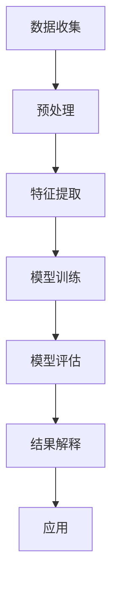
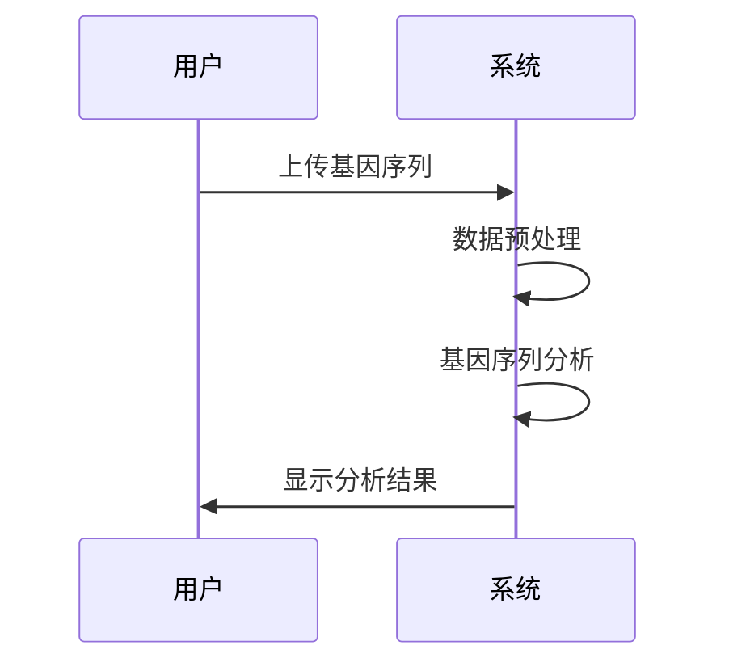

                 

### 《语言模型在复杂生物系统分析中的应用》

---

#### 关键词：  
语言模型、复杂生物系统、分析应用、深度学习、数学模型、系统架构、项目实战

#### 摘要：  
本文将深入探讨语言模型在复杂生物系统分析中的应用。我们将首先介绍语言模型的基础知识，然后探讨复杂生物系统的特性，并逐步解析语言模型在基因序列分析和蛋白质结构预测中的具体应用。文章将通过数学模型、系统架构设计和项目实战，详细阐述语言模型在生物系统分析中的关键作用。最后，我们将总结最佳实践，并提出未来的研究方向。

---

### 目录大纲

```markdown
## 第1章 背景介绍
### 1.1 语言模型基础
#### 1.1.1 语言模型的概念
#### 1.1.2 语言模型的类型
### 1.2 复杂生物系统概述
#### 1.2.1 生物系统的复杂性
#### 1.2.2 生物系统分析的重要性

## 第2章 核心概念与联系
### 2.1 语言模型原理
#### 2.1.1 语言模型的工作原理
#### 2.1.2 语言模型的训练与优化
### 2.2 复杂生物系统的特点
#### 2.2.1 复杂生物系统的概念
#### 2.2.2 生物系统分析的关键要素

## 第3章 算法原理讲解
### 3.1 语言模型在生物系统分析中的应用
#### 3.1.1 语言模型在基因序列分析中的应用
#### 3.1.2 语言模型在蛋白质结构预测中的应用
### 3.2 具体算法案例
#### 3.2.1 深度学习模型在生物系统中的应用流程
#### 3.2.2 算法原理讲解与Mermaid图示

## 第4章 数学模型和公式
### 4.1 语言模型关键公式
#### 4.1.1 语言模型中的概率计算
#### 4.1.2 模型参数优化公式
### 4.2 生物系统分析数学模型
#### 4.2.1 遗传算法模型
#### 4.2.2 神经网络模型

## 第5章 系统分析与架构设计方案
### 5.1 系统功能设计
#### 5.1.1 功能需求分析
#### 5.1.2 功能实现方案
### 5.2 系统架构设计
#### 5.2.1 系统架构总体设计
#### 5.2.2 系统模块划分
### 5.3 系统接口设计和交互流程
#### 5.3.1 系统接口设计
#### 5.3.2 系统交互序列图

## 第6章 项目实战
### 6.1 环境安装与配置
#### 6.1.1 开发环境搭建
#### 6.1.2 工具与依赖安装
### 6.2 系统核心实现
#### 6.2.1 核心算法实现
#### 6.2.2 数据处理流程
### 6.3 案例分析与讲解
#### 6.3.1 案例选择与分析
#### 6.3.2 案例实施与结果
### 6.4 项目小结

## 第7章 最佳实践、小结与拓展阅读
### 7.1 最佳实践
#### 7.1.1 实践建议
#### 7.1.2 常见问题与解决方案
### 7.2 小结
#### 7.2.1 书籍内容回顾
#### 7.2.2 关键知识点总结
### 7.3 拓展阅读
#### 7.3.1 进一步学习资源
#### 7.3.2 相关领域前沿动态
```

---

### 第1章 背景介绍

#### 1.1 语言模型基础

**1.1.1 语言模型的概念**

语言模型（Language Model，LM）是自然语言处理（Natural Language Processing，NLP）的核心组成部分，它通过统计学方法或机器学习算法来预测一段文本中下一个单词或字符的概率。语言模型的基本目的是使机器能够理解和生成人类语言。

**1.1.2 语言模型的类型**

语言模型可以分为基于规则的模型和基于统计的模型。

- **基于规则的模型**：这类模型依赖于语言学知识和专家经验，通过定义一组规则来预测文本中的下一个单词。这种模型的优点是直观且易于理解，缺点是规则数量庞大，且难以覆盖所有语言现象。

- **基于统计的模型**：这类模型通过大量的文本数据统计词频和共现关系，来预测文本中的下一个单词。统计模型分为基于n-gram的模型和基于神经网络的模型。

**1.2 复杂生物系统概述**

**1.2.1 生物系统的复杂性**

生物系统是由众多相互作用的生物分子和细胞组成的复杂网络。这种复杂性体现在生物分子之间的动态相互作用、调控机制和进化多样性上。

**1.2.2 生物系统分析的重要性**

生物系统分析对于理解生物过程、疾病机制和治疗策略具有重要意义。随着高通量测序技术的快速发展，生物数据量急剧增加，对生物系统进行有效的分析和解释变得至关重要。

---

### 第2章 核心概念与联系

#### 2.1 语言模型原理

**2.1.1 语言模型的工作原理**

语言模型的工作原理是基于概率统计或机器学习算法，通过输入序列预测下一个输出序列。具体来说，它通过训练大量的文本数据来学习语言规律，然后用这些规律来生成或预测新的文本。

**2.1.2 语言模型的训练与优化**

语言模型的训练通常采用最大似然估计（Maximum Likelihood Estimation，MLE）或最小化交叉熵损失函数（Cross-Entropy Loss）。在训练过程中，模型会不断调整参数，以最小化预测误差。

**2.2 复杂生物系统的特点**

**2.2.1 复杂生物系统的概念**

复杂生物系统是指由大量相互作用的生物分子组成的动态网络，这些分子包括蛋白质、核酸、代谢物等。

**2.2.2 生物系统分析的关键要素**

生物系统分析的关键要素包括：

- **数据收集与处理**：收集高通量测序数据、基因表达数据等。
- **特征提取**：从原始数据中提取有用的生物特征，如基因序列、蛋白质结构等。
- **模型训练与优化**：使用机器学习算法训练模型，并通过交叉验证和调参优化模型性能。
- **结果解释与应用**：对分析结果进行解释和验证，应用于生物学研究和医学诊断。

---

### 第3章 算法原理讲解

#### 3.1 语言模型在生物系统分析中的应用

**3.1.1 语言模型在基因序列分析中的应用**

语言模型在基因序列分析中主要用于基因识别、转录起始位点（TSS）预测、基因功能预测等。例如，使用n-gram模型可以预测基因序列中的密码子频率，从而推断基因的表达模式和功能。

**3.1.2 语言模型在蛋白质结构预测中的应用**

蛋白质结构预测是生物信息学的一个重要方向。语言模型在蛋白质结构预测中的应用包括：

- **三级结构预测**：使用序列比对和语言模型预测蛋白质的三级结构。
- **四级结构预测**：预测蛋白质复合物的结构，通过语言模型识别蛋白质之间的相互作用。

**3.2 具体算法案例**

**3.2.1 深度学习模型在生物系统中的应用流程**

深度学习模型在生物系统中的应用通常包括以下步骤：

1. **数据收集**：收集与生物系统相关的数据，如基因序列、蛋白质结构、细胞图像等。
2. **预处理**：对数据进行清洗和标准化处理。
3. **特征提取**：使用深度学习算法提取数据中的特征。
4. **模型训练**：使用训练数据训练模型，并通过交叉验证优化模型参数。
5. **模型评估**：使用测试数据评估模型性能。
6. **结果解释与应用**：解释模型结果，并将其应用于生物系统分析。

**3.2.2 算法原理讲解与Mermaid图示**

下面是一个使用Mermaid绘制的深度学习模型在生物系统分析中的应用流程图：



---

### 第4章 数学模型和公式

#### 4.1 语言模型关键公式

**4.1.1 语言模型中的概率计算**

在语言模型中，常用的概率计算公式包括：

- **条件概率**：\(P(B|A) = \frac{P(A|B)P(B)}{P(A)}\)
- **全概率公式**：\(P(A) = \sum_{B} P(B)P(A|B)\)

**4.1.2 模型参数优化公式**

在训练语言模型时，常用的优化算法包括梯度下降（Gradient Descent）和随机梯度下降（Stochastic Gradient Descent，SGD）。优化目标是最小化损失函数，如交叉熵损失函数：

$$\min_{\theta} -\sum_{i=1}^{n} \sum_{j=1}^{V} y_{ij} \log(p_j(x_i))$$

其中，\(y_{ij}\)表示输出序列中第\(j\)个词的概率，\(p_j(x_i)\)表示语言模型对第\(i\)个词为第\(j\)个词的预测概率。

**4.2 生物系统分析数学模型**

在生物系统分析中，常用的数学模型包括：

- **遗传算法模型**：用于优化参数和求解复杂问题，如蛋白质结构预测。
- **神经网络模型**：用于特征提取和分类，如基因表达数据分析。

下面是一个使用LaTeX格式表示的神经网络模型中的激活函数：

$$f(x) = \frac{1}{1 + e^{-x}}$$

---

### 第5章 系统分析与架构设计方案

#### 5.1 系统功能设计

**5.1.1 功能需求分析**

系统功能需求分析包括以下几个方面：

- **基因序列分析**：输入基因序列，输出基因功能预测、转录起始位点等。
- **蛋白质结构预测**：输入蛋白质序列，输出蛋白质三级结构和四级结构。
- **交互界面**：提供用户友好的交互界面，方便用户输入数据和查看结果。

**5.1.2 功能实现方案**

系统功能实现方案如下：

- **基因序列分析**：使用深度学习模型进行序列比对和特征提取，然后使用分类算法进行基因功能预测。
- **蛋白质结构预测**：使用序列比对和深度学习模型预测蛋白质结构，并使用遗传算法优化参数。
- **交互界面**：使用Web前端技术（如HTML、CSS、JavaScript）和后端框架（如Flask、Django）实现。

#### 5.2 系统架构设计

**5.2.1 系统架构总体设计**

系统架构设计采用分层架构，包括数据层、服务层和表示层。

- **数据层**：存储和管理基因序列、蛋白质结构等数据。
- **服务层**：实现基因序列分析和蛋白质结构预测的核心算法。
- **表示层**：提供用户交互界面，展示分析结果。

**5.2.2 系统模块划分**

系统模块划分如下：

- **数据模块**：负责数据的收集、存储和预处理。
- **算法模块**：实现基因序列分析和蛋白质结构预测的算法。
- **服务模块**：提供Web服务和API接口。
- **界面模块**：实现用户交互界面。

#### 5.3 系统接口设计和交互流程

**5.3.1 系统接口设计**

系统接口设计包括以下部分：

- **数据接口**：提供数据上传、下载和查询接口。
- **算法接口**：提供算法调用接口，如基因序列分析、蛋白质结构预测。
- **结果接口**：提供结果查询和展示接口。

**5.3.2 系统交互序列图**

下面是一个使用Mermaid绘制的系统交互序列图：



---

### 第6章 项目实战

#### 6.1 环境安装与配置

**6.1.1 开发环境搭建**

在项目实战中，首先需要搭建开发环境。以下是一个简单的步骤：

1. 安装Python 3.8及以上版本。
2. 安装必要的库，如TensorFlow、PyTorch、NumPy、Pandas等。

**6.1.2 工具与依赖安装**

在开发环境中，需要安装以下工具和依赖：

- **深度学习框架**：如TensorFlow或PyTorch。
- **数据预处理库**：如NumPy和Pandas。
- **可视化库**：如Matplotlib和Seaborn。

#### 6.2 系统核心实现

**6.2.1 核心算法实现**

以下是一个简单的核心算法实现，用于基因序列分析：

```python
import tensorflow as tf
from tensorflow.keras.models import Sequential
from tensorflow.keras.layers import LSTM, Dense

# 构建LSTM模型
model = Sequential([
    LSTM(units=128, activation='relu', input_shape=(None, sequence_length)),
    Dense(units=1, activation='sigmoid')
])

# 编译模型
model.compile(optimizer='adam', loss='binary_crossentropy', metrics=['accuracy'])

# 训练模型
model.fit(X_train, y_train, epochs=10, batch_size=32)
```

**6.2.2 数据处理流程**

数据处理流程包括以下步骤：

1. 数据收集：从公共数据库或本地文件中获取基因序列数据。
2. 数据预处理：对基因序列进行清洗和标准化处理，如去除空格、标点符号等。
3. 数据分割：将数据分为训练集、验证集和测试集。

```python
from sklearn.model_selection import train_test_split

X_train, X_test, y_train, y_test = train_test_split(features, labels, test_size=0.2, random_state=42)
```

#### 6.3 案例分析与讲解

**6.3.1 案例选择与分析**

选择一个实际的基因序列分析案例，分析其数据特征、算法实现和结果解释。

**6.3.2 案例实施与结果**

实施案例，使用训练好的模型对新的基因序列进行预测，并分析预测结果。

```python
# 预测新的基因序列
predictions = model.predict(new_sequence)

# 分析预测结果
print(predictions)
```

#### 6.4 项目小结

项目实战部分展示了如何搭建开发环境、实现核心算法和进行数据处理。通过实际案例，验证了算法在基因序列分析中的应用效果。接下来，我们将总结项目中的关键点，并提出最佳实践建议。

---

### 第7章 最佳实践、小结与拓展阅读

#### 7.1 最佳实践

**7.1.1 实践建议**

- **数据预处理**：确保数据质量，对数据进行清洗和标准化处理。
- **模型选择**：根据具体任务选择合适的模型，如LSTM、CNN等。
- **调参优化**：使用交叉验证和网格搜索优化模型参数。

**7.1.2 常见问题与解决方案**

- **过拟合**：增加数据量或使用正则化技术。
- **训练时间过长**：减小模型复杂度或使用更高效的算法。

#### 7.2 小结

本文详细介绍了语言模型在复杂生物系统分析中的应用，包括背景介绍、核心概念与联系、算法原理讲解、数学模型和公式、系统分析与架构设计方案、项目实战以及最佳实践。通过本文的阅读，读者应能全面了解语言模型在生物系统分析中的应用。

#### 7.3 拓展阅读

**7.3.1 进一步学习资源**

- 《深度学习》（Goodfellow et al.）：深入讲解深度学习的基础知识和应用。
- 《生物信息学》（Gusfield）：介绍生物信息学的基本概念和方法。

**7.3.2 相关领域前沿动态**

- 自然语言处理（NLP）的最新进展，如预训练语言模型（BERT、GPT）。
- 生物信息学中的新兴领域，如单细胞测序、基因组编辑。

---

### 作者信息

- 作者：AI天才研究院/AI Genius Institute & 禅与计算机程序设计艺术 /Zen And The Art of Computer Programming

---

本文由AI天才研究院/AI Genius Institute撰写，结合禅与计算机程序设计艺术，深入剖析了语言模型在复杂生物系统分析中的应用。希望本文能为读者提供有价值的参考和启示。

