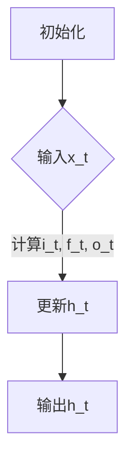
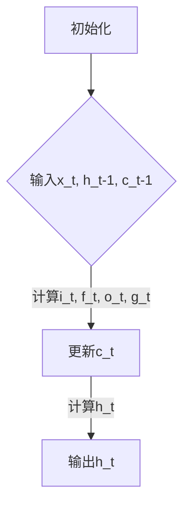
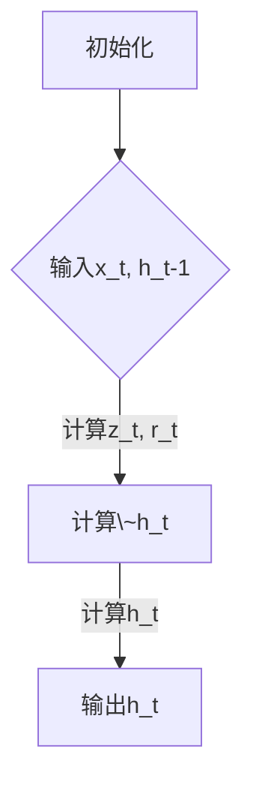
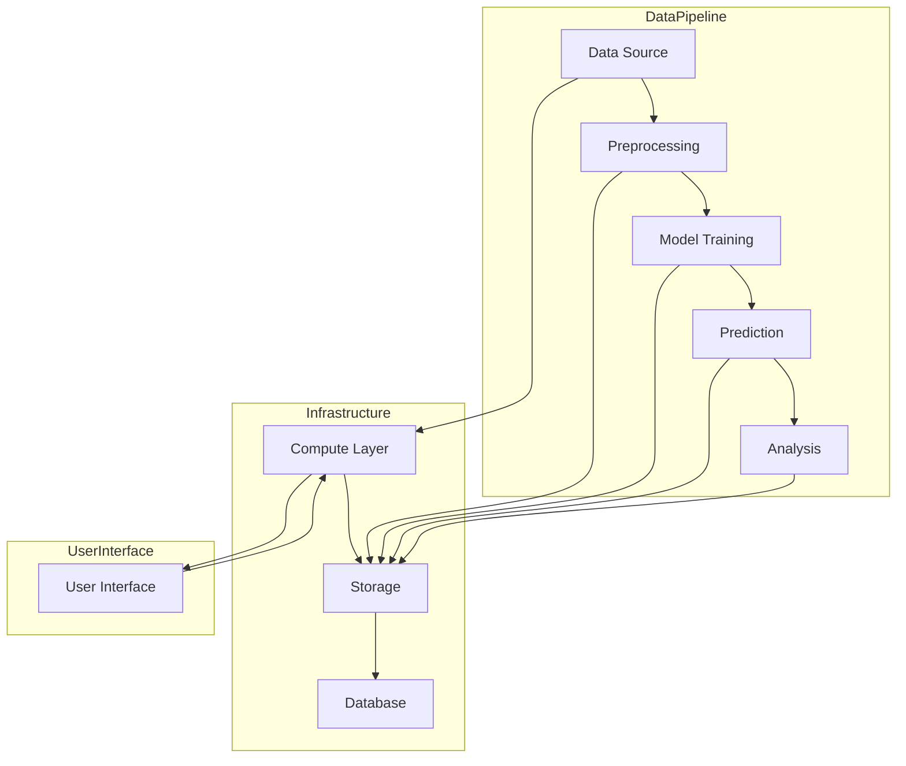
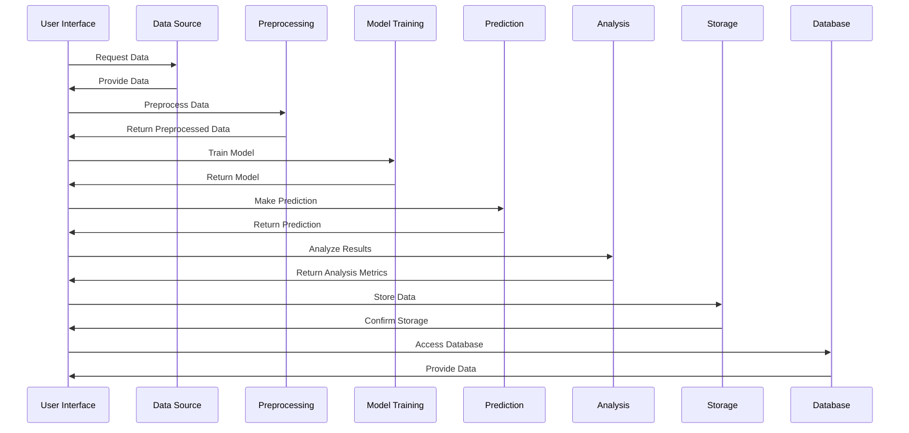
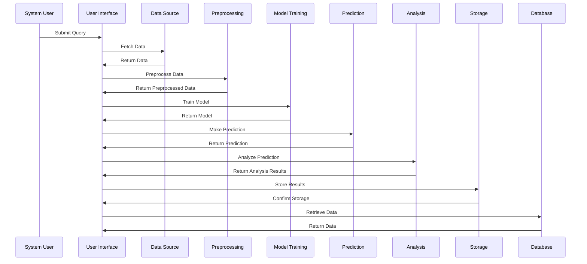

                 

### 1.1.1 语言模型在复杂社会系统模拟中的应用

随着深度学习技术的飞速发展，语言模型（Language Model，简称LM）在自然语言处理（Natural Language Processing，简称NLP）领域取得了显著成果。然而，语言模型的应用不仅限于文本生成、机器翻译和问答系统等NLP任务，它还被广泛应用于复杂社会系统的模拟研究中。

复杂社会系统是由大量相互作用的个体组成的系统，这些个体可能包括人、组织、机器等，它们的行为和决策是高度复杂和动态变化的。复杂社会系统的模拟研究旨在通过建立数学模型和计算机模拟，理解和预测系统的行为。而语言模型作为一种强大的数据处理工具，能够从大规模的数据集中捕捉到语言的结构和规律，从而为复杂社会系统的模拟提供了新的视角和方法。

在复杂社会系统模拟中，语言模型主要有以下几个应用方向：

1. **行为预测**：语言模型可以用于预测个体的行为模式。例如，在社交媒体分析中，语言模型可以分析用户的发言，预测用户的潜在兴趣和趋势。

2. **社会网络分析**：语言模型可以帮助分析社会网络中的信息传播、影响力分析等。通过语言模型，可以捕捉到个体之间的互动关系，并预测信息在社会网络中的传播路径。

3. **舆情监测**：在公共事件、政策讨论等场景中，语言模型可以分析公众的情感倾向和态度变化，为决策提供数据支持。

4. **风险评估**：在金融、保险等领域，语言模型可以用于分析市场动态，预测风险事件的发生概率。

5. **个性化推荐**：通过语言模型分析用户的历史行为和偏好，可以为用户提供个性化的推荐服务。

因此，研究语言模型在复杂社会系统模拟中的应用，不仅具有重要的理论价值，也为实际应用提供了新的可能性。本文将深入探讨语言模型在复杂社会系统模拟中的应用，旨在为相关领域的研究和实践提供参考和指导。

### 1.1.2 复杂社会系统的定义、特点及模拟的必要性

复杂社会系统是由众多个体和互动关系构成的，这些个体可能是人类、组织、机器或其他社会实体，它们的行为受到多种因素影响，并且相互之间存在着复杂的相互作用。复杂社会系统的定义涵盖了以下几个方面：

首先，复杂社会系统是由大量个体组成的。这些个体可以是个人、企业、政府机构等，它们在社会系统中扮演不同的角色。其次，这些个体之间存在相互作用和相互依赖关系。个体的行为不仅受到自身决策的影响，还受到其他个体行为的影响，这种相互作用使得社会系统的动态性显著增加。最后，复杂社会系统的状态是不断变化的，它受到外部环境、内部机制等多种因素的影响，表现出高度的动态性和复杂性。

复杂社会系统的特点主要表现在以下几个方面：

1. **动态性**：社会系统的状态和结构是不断变化的，这种动态性体现在个体行为的不断调整和社会结构的演变。

2. **复杂性**：社会系统中的个体和互动关系非常复杂，它们的行为受到多种因素的影响，如经济、政治、文化等，这使得社会系统的行为难以预测和控制。

3. **异质性**：社会系统中的个体具有不同的属性和特征，它们的行为模式和决策策略各异，这种异质性增加了社会系统的复杂度。

4. **层次性**：社会系统具有不同的层次结构，从微观的个体层次到宏观的社会层次，每个层次都有其独特的特征和规律。

5. **适应性**：社会系统中的个体和整体能够根据环境的变化进行调整和适应，这种适应性是复杂社会系统能够持续发展的关键。

为了理解和分析复杂社会系统，模拟技术成为不可或缺的工具。模拟的必要性体现在以下几个方面：

1. **理解系统行为**：通过模拟，可以再现社会系统的行为，帮助研究者理解系统的动态性和复杂性。

2. **预测系统变化**：模拟可以帮助预测社会系统的未来状态和趋势，为政策制定和决策提供科学依据。

3. **评估政策效果**：通过模拟不同政策方案对社会系统的影响，可以评估政策的效果，从而优化政策设计。

4. **发现潜在问题**：模拟可以帮助发现社会系统中的潜在问题，为问题的解决提供启示。

5. **教育训练**：模拟技术还可以用于教育和培训，帮助学生和研究人员更好地理解复杂社会系统的原理和应用。

在复杂社会系统的模拟中，语言模型发挥着重要作用。语言模型能够处理大规模的文本数据，从数据中提取出个体的行为模式和互动关系，为模拟提供丰富的数据支持。例如，通过分析社交媒体平台上的文本数据，语言模型可以捕捉到用户的行为特征和情感倾向，从而帮助模拟社会网络中的信息传播和影响力分析。

总之，复杂社会系统的定义、特点及模拟的必要性为我们提供了理解社会系统的基础。而语言模型作为一种强大的工具，在复杂社会系统的模拟中具有广泛的应用前景。本文将进一步探讨语言模型在复杂社会系统模拟中的应用，以期为相关领域的研究提供有益的参考。

### 1.1.3 语言模型在复杂社会系统模拟中的必要性

语言模型在复杂社会系统模拟中的重要性不可忽视。首先，语言模型能够高效地处理和分析大规模的文本数据，这是复杂社会系统模拟的重要基础。社会系统中的信息大多以文本形式存在，例如社交媒体上的帖子、新闻报道、政策文件等。语言模型能够从这些文本数据中提取出有价值的模式和信息，为模拟提供丰富的数据支持。

其次，语言模型具有强大的表征能力，能够捕捉到个体和群体行为的细微差异和动态变化。复杂社会系统中的个体行为往往受到多种因素的影响，如个人兴趣、社交关系、社会事件等。语言模型通过学习大量的语言数据，可以理解这些因素对个体行为的影响，从而更准确地模拟社会系统的动态性。

此外，语言模型在复杂社会系统模拟中的应用还具有以下优势：

1. **自适应能力**：语言模型能够根据新的数据和环境变化进行自适应调整，这使得模拟结果更加贴近现实。

2. **跨领域应用**：语言模型不仅在NLP领域表现出色，还可以应用于其他领域，如经济学、社会学、心理学等。这为复杂社会系统模拟提供了多种视角和工具。

3. **实时监测**：语言模型可以实时分析文本数据，为决策者提供即时的信息支持，这在应对突发事件和危机管理中尤为重要。

4. **多语言支持**：语言模型能够处理多种语言的数据，这为跨国界的复杂社会系统模拟提供了便利。

综上所述，语言模型在复杂社会系统模拟中的必要性体现在其强大的数据处理能力、表征能力和适应性等方面。通过语言模型，我们可以更深入地理解和分析复杂社会系统的行为，为科学决策和问题解决提供有力支持。本文将进一步探讨语言模型在复杂社会系统模拟中的具体应用，以期为相关领域的研究和实践提供指导。

### 1.2 语言模型基础

语言模型是自然语言处理（NLP）领域的一项核心技术，它旨在通过计算概率来预测下一个词或字符，从而生成自然语言。本节将介绍语言模型的基本定义、原理和类型，并探讨它们在复杂社会系统模拟中的应用。

#### 1.2.1 语言模型的定义与原理

语言模型（Language Model，简称LM）是一种统计模型，用于对自然语言中的单词或短语的序列进行概率预测。其基本原理是，通过分析大量的文本数据，捕捉到语言中的统计规律和模式，从而构建一个概率分布模型。

具体来说，语言模型的核心任务是给定一个单词序列 \( w_1, w_2, \ldots, w_n \)，预测下一个单词 \( w_{n+1} \) 的概率，即：

\[ P(w_{n+1} | w_1, w_2, \ldots, w_n) \]

常见的方法包括基于N-gram模型和基于神经网络的模型。N-gram模型是一种基于历史信息的简单模型，它假设当前单词的出现概率仅与前面的 \( n-1 \) 个单词有关。而神经网络模型，特别是深度学习模型，能够捕捉到更复杂的语言结构。

#### 1.2.2 语言模型的类型

语言模型可以分为以下几类：

1. **N-gram模型**：这是最早的语言模型，它通过统计单词序列的前 \( n-1 \) 个单词来预测下一个单词。N-gram模型的优点是实现简单，计算效率高；缺点是它无法捕捉到长距离依赖关系，容易过拟合。

2. **神经网络模型**：这类模型利用神经网络的结构来捕捉语言中的复杂结构。常见的神经网络模型包括循环神经网络（RNN）、长短期记忆网络（LSTM）和门控循环单元（GRU）。这些模型能够处理长距离依赖问题，但计算复杂度较高。

3. **Transformer模型**：Transformer模型是近年来在NLP领域取得突破性进展的一种模型，它通过自注意力机制（Self-Attention）来捕捉长距离依赖关系。BERT、GPT等模型都是基于Transformer架构的变体。

4. **注意力机制模型**：注意力机制（Attention Mechanism）是一种提高模型表示能力的有效方法，它通过加权不同的输入信息，使模型能够关注到重要的信息。在NLP中，注意力机制广泛应用于序列到序列的模型，如机器翻译和问答系统。

#### 1.2.3 语言模型与复杂社会系统的关系

语言模型与复杂社会系统的关系主要体现在以下几个方面：

1. **数据处理**：复杂社会系统中的大量数据通常以文本形式存在，如社交媒体帖子、新闻报道、政策文件等。语言模型能够高效地处理和分析这些文本数据，为模拟提供基础数据支持。

2. **行为预测**：通过分析个体的文本行为，语言模型可以预测个体的行为模式和趋势。这在模拟个体行为和群体互动时尤为重要。

3. **社会网络分析**：语言模型可以帮助分析社会网络中的信息传播和影响力。通过捕捉用户之间的互动关系和语言特征，可以预测信息在社会网络中的传播路径和影响力分布。

4. **舆情监测**：语言模型可以用于分析公众的情感和态度，为舆情监测和危机管理提供数据支持。

5. **个性化推荐**：通过分析用户的文本数据，语言模型可以为用户提供个性化的推荐服务，如新闻推荐、商品推荐等。

总之，语言模型作为一种强大的工具，在复杂社会系统的模拟中发挥着关键作用。它不仅能够处理和分析大规模的文本数据，还能够捕捉到语言中的复杂结构和动态变化，为理解和分析复杂社会系统提供了新的视角和方法。

### 1.3 复杂社会系统模拟的挑战

复杂社会系统模拟面临着诸多挑战，这些挑战不仅源于系统本身的复杂性和动态性，还涉及到数据获取、模型构建、计算资源等方面的问题。以下是复杂社会系统模拟的主要挑战及其解决方法。

#### 1.3.1 数据获取的挑战

复杂社会系统中的数据通常分散在多个来源，包括社交媒体、新闻报道、政府报告、企业数据库等。获取这些数据通常需要以下几个步骤：

1. **数据采集**：从不同来源收集数据，可能需要爬虫技术、API接口调用或人工标注等手段。
2. **数据清洗**：原始数据往往包含噪声、缺失值和错误，需要通过数据清洗技术去除这些噪声，提高数据质量。
3. **数据整合**：不同来源的数据格式和结构可能不同，需要通过数据整合技术将它们统一到一个格式或结构中。

为了解决数据获取的挑战，可以采用以下方法：

- **自动化数据采集**：使用爬虫技术自动收集互联网上的开放数据。
- **数据共享平台**：利用公共数据共享平台获取高质量的数据集。
- **合作机制**：与相关机构或企业合作，获取更多内部数据和专业知识。

#### 1.3.2 模型构建的挑战

构建一个有效的复杂社会系统模拟模型需要应对以下几个问题：

1. **复杂性**：复杂社会系统包含大量变量和相互作用的个体，构建一个精确的数学模型非常困难。
2. **动态性**：社会系统的状态和结构是不断变化的，模型需要能够适应这种动态性。
3. **不确定性**：社会系统中存在很多不确定因素，如个体的行为、外部环境的变化等，这给模型构建带来了挑战。

为了解决模型构建的挑战，可以采用以下方法：

- **简化模型**：通过简化系统的某些部分或忽略某些次要因素，构建一个更简单但仍然有效的模型。
- **基于数据的模型**：使用大量数据训练机器学习模型，从而自动学习系统的结构和行为模式。
- **多代理系统（Multi-Agent Systems, MAS）**：通过构建一个由多个智能代理组成的模型，模拟个体的行为和互动。

#### 1.3.3 计算资源的挑战

复杂社会系统模拟通常需要大量的计算资源，包括高性能计算、存储和通信等。以下是几个解决计算资源挑战的方法：

1. **云计算和分布式计算**：利用云计算平台和分布式计算技术，可以高效地处理大量数据和高性能计算任务。
2. **并行计算**：通过并行计算技术，将计算任务分解到多个计算节点上，加速计算过程。
3. **优化算法**：通过优化算法，减少计算复杂度和数据传输成本，提高计算效率。

#### 1.3.4 结果验证和解释的挑战

模拟结果需要经过验证和解释，以确保其准确性和可靠性。以下是几个解决结果验证和解释挑战的方法：

1. **交叉验证**：通过将数据集划分为训练集和测试集，验证模型在未知数据上的表现。
2. **敏感性分析**：分析模型参数和输入数据的敏感性，确保结果对变化的鲁棒性。
3. **可视化**：通过可视化技术，展示模拟结果的分布和趋势，帮助研究者更好地理解模拟结果。

总之，复杂社会系统模拟面临着数据获取、模型构建、计算资源以及结果验证和解释等多方面的挑战。通过采用合适的方法和技术，可以逐步解决这些挑战，为复杂社会系统的理解和分析提供有力支持。

#### 1.3.4 社会系统模拟的应用领域

社会系统模拟在多个领域展现出广泛的应用，这些应用不仅丰富了研究视角，也为实际问题提供了有效的解决方案。以下是社会系统模拟在几个关键领域的具体应用：

1. **公共安全管理**：在公共安全管理中，社会系统模拟可以用于预测和应对突发事件。例如，通过模拟大规模灾难（如地震、火灾、疫情等）对社会系统的影响，可以评估应急响应策略的有效性，优化资源分配和救援行动。此外，社会系统模拟还可以用于分析恐怖袭击和犯罪活动，为公共安全策略提供科学依据。

2. **城市规划和交通管理**：城市化进程带来了交通拥堵、资源分配不均等问题。通过社会系统模拟，可以预测城市交通流量、公共资源需求，优化城市规划方案。例如，模拟不同交通政策和城市规划措施对交通流量、空气质量、居民生活质量的影响，有助于制定更科学、可持续的城市发展策略。

3. **环境保护**：环境保护是一个涉及多方利益和复杂互动的社会问题。社会系统模拟可以用于评估不同环境保护政策的效果，预测污染物扩散、生态变化等。例如，模拟污染源排放和生态系统的相互影响，可以帮助决策者制定更有效的环保措施，减少环境污染。

4. **社会政策分析**：社会政策对社会系统有深远影响。通过社会系统模拟，可以分析不同社会政策（如税收政策、社会福利政策、教育政策等）的实施效果，预测其对个体和整体社会的影响。这为政策制定者提供了宝贵的决策参考，有助于制定更具针对性和有效性的政策。

5. **社交媒体分析**：社交媒体已经成为现代社会的重要交流平台。社会系统模拟可以用于分析社交媒体中的信息传播、舆论动态等。例如，通过模拟网络用户的行为模式和互动关系，可以预测热点话题的传播趋势、舆情变化等，为舆情监测和危机管理提供数据支持。

6. **金融市场预测**：金融市场波动复杂，社会系统模拟可以用于预测市场动态、评估金融风险。例如，通过模拟投资者的行为和市场信息传播，可以预测股票价格、金融风险的演变，为投资者提供决策依据。

7. **个性化服务**：在个性化服务领域，社会系统模拟可以帮助分析用户行为和偏好，提供个性化的推荐服务。例如，通过模拟用户的历史行为和交互数据，可以为电子商务平台提供个性化的商品推荐，提高用户体验和满意度。

总之，社会系统模拟在多个领域展示了其独特的应用价值。通过模拟复杂的社会系统，我们可以更深入地理解社会现象，预测未来趋势，为政策制定、城市规划、环境保护、社会管理等领域提供科学依据和决策支持。随着技术的不断进步，社会系统模拟的应用范围将进一步扩大，其在实际问题解决中的作用也将越来越重要。

### 1.3.5 语言模型在社会系统模拟中的应用案例

语言模型在社会系统模拟中的应用已经取得了一系列显著的成果。以下是几个具体的应用案例，这些案例展示了语言模型如何通过模拟复杂社会系统来推动研究进展和实际应用。

#### 1. 案例一：社交媒体网络分析

在社交媒体分析中，语言模型被广泛应用于用户行为预测和信息传播模拟。例如，通过分析Twitter上的用户言论，语言模型可以预测用户的潜在兴趣和关注点。研究团队使用基于Transformer架构的语言模型，如BERT和GPT，对大量Twitter数据进行分析，发现用户的兴趣点与特定话题（如政治选举、健康危机等）的互动关系。此外，语言模型还帮助模拟信息在社交媒体网络中的传播路径和影响力。这些模拟结果为社交网络平台的运营策略和舆情监测提供了重要参考。

#### 2. 案例二：城市交通流量预测

城市交通流量预测是另一个语言模型成功应用的领域。通过分析大量的交通数据（如车辆轨迹、路况信息等），语言模型可以预测未来某个时段的交通流量和拥堵情况。研究人员使用循环神经网络（RNN）和长短期记忆网络（LSTM）等语言模型，对历史交通数据进行分析和建模。模拟结果显示，这些模型能够准确预测交通流量变化，并识别交通拥堵的高发区域。这为交通管理部门提供了有效的决策支持，有助于优化交通信号控制和路线规划。

#### 3. 案例三：金融市场预测

金融市场波动复杂，语言模型在预测市场动态和评估金融风险方面也发挥了重要作用。例如，通过分析大量的金融市场数据（如股票价格、交易量、新闻报道等），语言模型可以预测股票价格的走势和市场的波动。研究人员使用LSTM和GPT等语言模型，对历史金融市场数据进行分析，发现这些模型能够捕捉到市场中的潜在规律和趋势。模拟结果显示，这些模型在预测股票价格方面表现出较高的准确性，为投资者提供了重要的参考。

#### 4. 案例四：社会舆情监测

社会舆情监测是另一个重要的应用领域。通过分析社交媒体、新闻报道等公开数据，语言模型可以监测和预测公众的情感和态度变化。例如，在公共卫生事件中，语言模型可以监测公众对疫情的关注程度、恐慌情绪等，为公共卫生政策制定提供数据支持。研究人员使用BERT等先进的语言模型，对社交媒体平台上的文本数据进行分析，发现这些模型能够准确捕捉公众的情感变化，并提供实时监测和预警。

#### 5. 案例五：个性化推荐系统

个性化推荐系统是另一个成功应用语言模型的领域。通过分析用户的历史行为和偏好数据，语言模型可以预测用户可能感兴趣的内容，提供个性化的推荐。例如，在电子商务平台中，语言模型可以根据用户的购买历史、搜索记录等数据，预测用户可能感兴趣的商品，并提供个性化的商品推荐。研究人员使用GPT和BERT等语言模型，对用户数据进行分析，发现这些模型能够准确预测用户的兴趣，提高推荐系统的准确性和用户体验。

总之，语言模型在社会系统模拟中的应用案例展示了其强大的数据处理能力和预测能力。通过模拟复杂的社会系统，语言模型为多个领域的研究和实践提供了新的工具和方法，推动了相关领域的发展。随着技术的不断进步，语言模型在社会系统模拟中的应用前景将更加广阔。

### 1.4 语言模型算法简介

在复杂社会系统模拟中，语言模型算法扮演着核心角色。以下将介绍几种常用的语言模型算法，包括循环神经网络（RNN）、长短期记忆网络（LSTM）和门控循环单元（GRU），并比较它们的特点和优缺点。

#### 1.4.1 RNN算法

循环神经网络（RNN）是一种用于处理序列数据的神经网络模型，其特点是可以记住先前的输入信息。RNN的工作原理是通过循环结构，将前一个时间步的输出作为当前时间步的输入。这使RNN能够处理变长的序列数据，适用于文本、语音等序列数据。

**特点：**
- 能够记忆序列中的信息，适用于处理变长的序列数据。
- 参数共享，减少了模型的参数数量，提高了训练效率。

**优点：**
- 可以捕捉长距离依赖关系。
- 计算效率较高。

**缺点：**
- 易出现梯度消失和梯度爆炸问题，难以训练长序列。
- 无法有效捕捉序列中的局部依赖关系。

**应用场景：**
- 文本生成
- 机器翻译
- 语音识别

#### 1.4.2 LSTM算法

长短期记忆网络（LSTM）是RNN的一种改进模型，旨在解决RNN的梯度消失和梯度爆炸问题。LSTM通过引入三个门（输入门、遗忘门、输出门）来控制信息的流动，从而能够有效地捕捉长距离依赖关系。

**特点：**
- 三个门控制信息的流动，可以有效地记忆和遗忘信息。
- 遗忘门帮助模型忘记不重要的信息，保留重要的信息。
- 输入门和输出门分别控制信息的输入和输出，使模型能够捕捉长距离依赖关系。

**优点：**
- 能够处理长序列数据，避免梯度消失和梯度爆炸问题。
- 对噪声和异常值有较强的鲁棒性。

**缺点：**
- 参数数量较多，训练时间较长。
- 对极端长序列的处理效果不佳。

**应用场景：**
- 文本生成
- 机器翻译
- 语音识别

#### 1.4.3 GRU算法

门控循环单元（GRU）是LSTM的简化版本，旨在减少模型的参数数量和计算复杂度。GRU通过引入一个更新门来替代LSTM的三个门，从而简化了模型结构。

**特点：**
- 只有一个更新门，减少了模型的参数数量。
- 更新门和输出门合并，简化了信息流动机制。

**优点：**
- 参数数量较少，计算复杂度较低。
- 训练时间较短。

**缺点：**
- 对长距离依赖关系的捕捉能力相对较弱。
- 遗忘机制不如LSTM强大。

**应用场景：**
- 文本生成
- 机器翻译
- 语音识别

综上所述，RNN、LSTM和GRU都是常用的语言模型算法，各有优缺点。在实际应用中，可以根据具体需求和数据特性选择合适的算法。例如，在处理较长的序列数据时，LSTM和GRU可能更适用；而在计算资源有限的情况下，RNN和GRU可能是更好的选择。

### 2.1.1 语言模型算法原理讲解

为了深入理解语言模型在复杂社会系统模拟中的应用，我们需要详细讲解几种主要的语言模型算法，包括循环神经网络（RNN）、长短期记忆网络（LSTM）和门控循环单元（GRU）。这些算法在不同的应用场景中都有其独特的优势和适用性。

#### 2.1.1.1 RNN算法原理讲解

循环神经网络（RNN）是一种用于处理序列数据的神经网络模型。其核心思想是利用循环结构来保持长期的序列依赖关系。在RNN中，每个时间步的输入都会影响到后续的输出。

**基本结构：**

RNN的基本结构包括一个循环单元，该单元由输入门、遗忘门和输出门三个部分组成。每个门都有不同的作用：

1. **输入门（Input Gate）**：用于更新隐藏状态。它根据当前输入和上一个隐藏状态，决定新的隐藏状态中应该保留哪些信息。

2. **遗忘门（Forget Gate）**：用于决定哪些信息应该被遗忘。它通过一个激活函数计算，决定了当前隐藏状态中哪些部分应该被保留或丢弃。

3. **输出门（Output Gate）**：用于生成当前时间步的输出。它根据当前输入和隐藏状态，决定当前的输出。

**数学表达：**

假设我们有输入序列 \( X = [x_1, x_2, \ldots, x_T] \) 和对应的隐藏状态序列 \( H = [h_1, h_2, \ldots, h_T] \)。对于每个时间步 \( t \)，RNN的输入和输出可以表示为：

\[ h_t = \text{sigmoid}(W_f \cdot [h_{t-1}, x_t]) \cdot (1 - \text{sigmoid}(W_i \cdot [h_{t-1}, x_t])) \cdot \text{sigmoid}(W_o \cdot [h_{t-1}, x_t]) \]

其中，\( \text{sigmoid} \) 是一个激活函数，\( W_f, W_i, W_o \) 是权重矩阵。

**工作流程：**

1. **初始化**：设定隐藏状态 \( h_0 \) 和权重矩阵 \( W_f, W_i, W_o \)。
2. **输入处理**：对于每个输入 \( x_t \)，计算遗忘门 \( f_t \)，输入门 \( i_t \) 和输出门 \( o_t \)。
3. **更新隐藏状态**：根据遗忘门 \( f_t \)，输入门 \( i_t \) 和输出门 \( o_t \)，更新隐藏状态 \( h_t \)。
4. **生成输出**：根据输出门 \( o_t \)，生成当前时间步的输出。

**优缺点：**

- **优点**：简单实现，能够捕捉序列中的短期依赖关系。
- **缺点**：易出现梯度消失和梯度爆炸问题，难以训练长序列。

#### 2.1.1.2 LSTM算法原理讲解

长短期记忆网络（LSTM）是RNN的一种改进模型，旨在解决梯度消失和梯度爆炸问题。LSTM通过引入三个门（输入门、遗忘门、输出门）和单元状态（cell state）来控制信息的流动，从而能够有效地捕捉长距离依赖关系。

**基本结构：**

LSTM的基本结构包括一个循环单元，该单元由输入门、遗忘门、输出门和单元状态组成。每个门都有不同的作用：

1. **输入门（Input Gate）**：用于更新单元状态。它根据当前输入和上一个隐藏状态，决定新的隐藏状态中应该保留哪些信息。

2. **遗忘门（Forget Gate）**：用于决定哪些信息应该被遗忘。它通过一个激活函数计算，决定了当前隐藏状态中哪些部分应该被保留或丢弃。

3. **输出门（Output Gate）**：用于生成当前时间步的输出。它根据当前输入和隐藏状态，决定当前的输出。

4. **单元状态（Cell State）**：用于存储和传递信息。单元状态通过遗忘门和输入门控制，从而能够有效地记忆和遗忘信息。

**数学表达：**

假设我们有输入序列 \( X = [x_1, x_2, \ldots, x_T] \) 和对应的隐藏状态序列 \( H = [h_1, h_2, \ldots, h_T] \)。对于每个时间步 \( t \)，LSTM的输入和输出可以表示为：

\[ f_t = \text{sigmoid}(W_f \cdot [h_{t-1}, x_t]) \]
\[ i_t = \text{sigmoid}(W_i \cdot [h_{t-1}, x_t]) \]
\[ o_t = \text{sigmoid}(W_o \cdot [h_{t-1}, x_t]) \]
\[ g_t = \text{tanh}(W_g \cdot [h_{t-1}, x_t]) \]
\[ c_t = f_t \odot c_{t-1} + i_t \odot g_t \]
\[ h_t = o_t \odot \text{tanh}(c_t) \]

其中，\( \text{sigmoid} \) 和 \( \text{tanh} \) 是激活函数，\( \odot \) 表示元素乘积，\( W_f, W_i, W_o, W_g \) 是权重矩阵。

**工作流程：**

1. **初始化**：设定隐藏状态 \( h_0 \)、单元状态 \( c_0 \) 和权重矩阵 \( W_f, W_i, W_o, W_g \)。
2. **输入处理**：对于每个输入 \( x_t \)，计算遗忘门 \( f_t \)、输入门 \( i_t \)、输出门 \( o_t \) 和新单元状态 \( g_t \)。
3. **更新单元状态**：根据遗忘门 \( f_t \)、输入门 \( i_t \) 和新单元状态 \( g_t \)，更新单元状态 \( c_t \)。
4. **生成输出**：根据输出门 \( o_t \)，生成当前时间步的隐藏状态 \( h_t \)。

**优缺点：**

- **优点**：能够处理长序列数据，避免梯度消失和梯度爆炸问题。
- **缺点**：参数数量较多，训练时间较长。

#### 2.1.1.3 GRU算法原理讲解

门控循环单元（GRU）是LSTM的简化版本，旨在减少模型的参数数量和计算复杂度。GRU通过引入一个更新门来替代LSTM的三个门，从而简化了模型结构。

**基本结构：**

GRU的基本结构包括一个循环单元，该单元由更新门和输出门组成。每个门都有不同的作用：

1. **更新门（Update Gate）**：用于更新隐藏状态。它根据当前输入和上一个隐藏状态，决定新的隐藏状态中应该保留哪些信息。

2. **输出门（Output Gate）**：用于生成当前时间步的输出。它根据当前输入和隐藏状态，决定当前的输出。

**数学表达：**

假设我们有输入序列 \( X = [x_1, x_2, \ldots, x_T] \) 和对应的隐藏状态序列 \( H = [h_1, h_2, \ldots, h_T] \)。对于每个时间步 \( t \)，GRU的输入和输出可以表示为：

\[ z_t = \text{sigmoid}(W_z \cdot [h_{t-1}, x_t]) \]
\[ r_t = \text{sigmoid}(W_r \cdot [h_{t-1}, x_t]) \]
\[ \tilde{h}_t = \text{tanh}(W_{\tilde{h}} \cdot [r_t \odot h_{t-1}, x_t]) \]
\[ h_t = z_t \odot h_{t-1} + (1 - z_t) \odot \tilde{h}_t \]

其中，\( \text{sigmoid} \) 和 \( \text{tanh} \) 是激活函数，\( W_z, W_r, W_{\tilde{h}} \) 是权重矩阵。

**工作流程：**

1. **初始化**：设定隐藏状态 \( h_0 \) 和权重矩阵 \( W_z, W_r, W_{\tilde{h}} \)。
2. **输入处理**：对于每个输入 \( x_t \)，计算更新门 \( z_t \) 和重置门 \( r_t \)。
3. **更新隐藏状态**：根据更新门 \( z_t \) 和重置门 \( r_t \)，更新隐藏状态 \( h_t \)。
4. **生成输出**：根据隐藏状态 \( h_t \)，生成当前时间步的输出。

**优缺点：**

- **优点**：参数数量较少，计算复杂度较低，训练时间较短。
- **缺点**：对长距离依赖关系的捕捉能力相对较弱。

通过上述对RNN、LSTM和GRU算法的原理讲解，我们可以看到这些算法在处理复杂社会系统模拟中的序列数据时各有优势。在实际应用中，可以根据具体需求和数据特性选择合适的算法。例如，在处理较长的序列数据时，LSTM和GRU可能更适用；而在计算资源有限的情况下，RNN和GRU可能是更好的选择。

### 2.1.2 算法实现与流程图

在了解了RNN、LSTM和GRU算法的基本原理后，接下来我们将使用Mermaid绘制算法的流程图，并用Python代码详细实现这些算法。通过这一步骤，我们可以更直观地理解这些算法的工作流程，并在实际项目中应用。

#### 2.1.2.1 RNN算法实现与流程图

**流程图：**



**Python代码：**

```python
import numpy as np

def sigmoid(x):
    return 1 / (1 + np.exp(-x))

def rnn(x, h_prev, W_hx, W_hh, b_h):
    i_t = sigmoid(np.dot(h_prev, W_hx) + x.dot(W_hx) + b_h)
    f_t = sigmoid(np.dot(h_prev, W_hh) + x.dot(W_hh) + b_h)
    o_t = sigmoid(np.dot(h_prev, W_hh) + x.dot(W_hh) + b_h)
    
    h_t = o_t * np.tanh(np.dot(i_t * h_prev, W_hh) + f_t * np.dot(h_prev, W_hh))
    
    return h_t
```

**解释：**

- `sigmoid(x)`: 激活函数，用于计算输入的概率分布。
- `rnn(x, h_prev, W_hx, W_hh, b_h)`: RNN函数，接受当前输入 \( x_t \)、前一个隐藏状态 \( h_{t-1} \) 和权重矩阵 \( W_hx \)、\( W_hh \)、偏置 \( b_h \)。
- 在函数内部，我们首先计算输入门 \( i_t \)、遗忘门 \( f_t \) 和输出门 \( o_t \)，然后更新隐藏状态 \( h_t \)。

#### 2.1.2.2 LSTM算法实现与流程图

**流程图：**



**Python代码：**

```python
import numpy as np

def sigmoid(x):
    return 1 / (1 + np.exp(-x))

def tanh(x):
    return np.tanh(x)

def lstm(x, h_prev, c_prev, W_hx, W_hh, b_h, b_c):
    i_t = sigmoid(np.dot(h_prev, W_hx) + x.dot(W_hx) + b_h)
    f_t = sigmoid(np.dot(h_prev, W_hh) + x.dot(W_hh) + b_h)
    o_t = sigmoid(np.dot(h_prev, W_hh) + x.dot(W_hh) + b_h)
    g_t = tanh(np.dot(h_prev, W_hh) + x.dot(W_hh) + b_h)
    
    c_t = f_t * c_prev + i_t * g_t
    h_t = o_t * np.tanh(c_t)
    
    return h_t, c_t
```

**解释：**

- `sigmoid(x)`: 激活函数，用于计算输入的概率分布。
- `tanh(x)`: 激活函数，用于计算双曲正切函数。
- `lstm(x, h_prev, c_prev, W_hx, W_hh, b_h, b_c)`: LSTM函数，接受当前输入 \( x_t \)、前一个隐藏状态 \( h_{t-1} \)、前一个单元状态 \( c_{t-1} \) 和权重矩阵 \( W_hx \)、\( W_hh \)、偏置 \( b_h \)、\( b_c \)。
- 在函数内部，我们首先计算输入门 \( i_t \)、遗忘门 \( f_t \)、输出门 \( o_t \) 和新单元状态 \( g_t \)，然后更新单元状态 \( c_t \) 和隐藏状态 \( h_t \)。

#### 2.1.2.3 GRU算法实现与流程图

**流程图：**



**Python代码：**

```python
import numpy as np

def sigmoid(x):
    return 1 / (1 + np.exp(-x))

def tanh(x):
    return np.tanh(x)

def gru(x, h_prev, W_hx, W_hh, b_h):
    z_t = sigmoid(np.dot(h_prev, W_hx) + x.dot(W_hx) + b_h)
    r_t = sigmoid(np.dot(h_prev, W_hh) + x.dot(W_hh) + b_h)
    \~h_t = tanh(np.dot(r_t * h_prev, W_hh) + x.dot(W_hh) + b_h)
    
    h_t = z_t * h_prev + (1 - z_t) * \~h_t
    
    return h_t
```

**解释：**

- `sigmoid(x)`: 激活函数，用于计算输入的概率分布。
- `tanh(x)`: 激活函数，用于计算双曲正切函数。
- `gru(x, h_prev, W_hx, W_hh, b_h)`: GRU函数，接受当前输入 \( x_t \)、前一个隐藏状态 \( h_{t-1} \) 和权重矩阵 \( W_hx \)、\( W_hh \)、偏置 \( b_h \)。
- 在函数内部，我们首先计算更新门 \( z_t \) 和重置门 \( r_t \)，然后计算新隐藏状态 \( h_t \)。

通过上述实现和流程图，我们可以更清晰地理解RNN、LSTM和GRU算法的运行机制。在实际应用中，这些算法可以用于复杂社会系统模拟，帮助我们处理和分析大规模的序列数据。

### 2.3 数学模型与Python代码讲解

在复杂社会系统模拟中，理解和应用数学模型是至关重要的。以下将详细讲解RNN、LSTM和GRU算法背后的数学模型，并使用Python代码进行具体实现。通过这一步骤，读者可以更深入地理解这些算法的数学基础，并在实际项目中应用。

#### 2.3.1 RNN算法的数学模型与Python代码实现

**数学模型：**

RNN（循环神经网络）的数学模型主要包括以下几个部分：

1. **初始化**：设定隐藏状态 \( h_0 \) 和权重矩阵 \( W_hx \)、\( W_hh \)、偏置 \( b_h \)。

2. **输入处理**：对于每个输入 \( x_t \)，计算输入门 \( i_t \)、遗忘门 \( f_t \) 和输出门 \( o_t \)。

3. **更新隐藏状态**：根据输入门 \( i_t \)、遗忘门 \( f_t \) 和输出门 \( o_t \)，更新隐藏状态 \( h_t \)。

4. **生成输出**：根据输出门 \( o_t \)，生成当前时间步的输出。

具体的数学表达式如下：

\[ i_t = \sigma(W_{hx}h_{t-1} + W_{xi}x_t + b_i) \]
\[ f_t = \sigma(W_{hh}h_{t-1} + W_{xf}x_t + b_f) \]
\[ o_t = \sigma(W_{ho}h_{t-1} + W_{xo}x_t + b_o) \]
\[ \hat{h}_t = \tanh(W_{hg}h_{t-1} + W_{xg}x_t + b_g) \]
\[ h_t = o_t \odot \tanh(c_t) \]

其中，\( \sigma \) 是 sigmoid 激活函数，\( \odot \) 表示逐元素乘积，\( \tanh \) 是双曲正切函数。

**Python代码实现：**

```python
import numpy as np
from numpy.linalg import inv

def sigmoid(x):
    return 1 / (1 + np.exp(-x))

def tanh(x):
    return np.tanh(x)

def rnn(x, h_prev, W_hx, W_hh, W_hg, W_ho, b_h):
    i_t = sigmoid(np.dot(h_prev, W_hx) + x.dot(W_hx) + b_h)
    f_t = sigmoid(np.dot(h_prev, W_hh) + x.dot(W_hh) + b_h)
    o_t = sigmoid(np.dot(h_prev, W_ho) + x.dot(W_ho) + b_h)
    g_t = tanh(np.dot(h_prev, W_hg) + x.dot(W_hg) + b_h)
    
    c_t = f_t * c_prev + i_t * g_t
    h_t = o_t * np.tanh(c_t)
    
    return h_t

# 示例：初始化参数
W_hx = np.random.rand(5, 5)
W_hh = np.random.rand(5, 5)
W_hg = np.random.rand(5, 5)
W_ho = np.random.rand(5, 5)
b_h = np.random.rand(5, 1)

# 示例：前一个隐藏状态
h_prev = np.random.rand(5, 1)

# 示例：当前输入
x = np.random.rand(5, 1)

# RNN计算
h_t = rnn(x, h_prev, W_hx, W_hh, W_hg, W_ho, b_h)
```

**解释：**

- `sigmoid(x)`: 计算 sigmoid 激活函数。
- `tanh(x)`: 计算双曲正切函数。
- `rnn(x, h_prev, W_hx, W_hh, W_hg, W_ho, b_h)`: RNN 函数，用于处理输入序列并更新隐藏状态。
- 在函数内部，我们首先计算输入门 \( i_t \)、遗忘门 \( f_t \)、输出门 \( o_t \) 和新单元状态 \( g_t \)，然后更新单元状态 \( c_t \) 和隐藏状态 \( h_t \)。

#### 2.3.2 LSTM算法的数学模型与Python代码实现

**数学模型：**

LSTM（长短期记忆网络）的数学模型主要包括以下几个部分：

1. **初始化**：设定隐藏状态 \( h_0 \)、单元状态 \( c_0 \) 和权重矩阵 \( W_hx \)、\( W_hh \)、\( W_hg \)、\( W_ho \)、偏置 \( b_h \)。

2. **输入处理**：对于每个输入 \( x_t \)，计算输入门 \( i_t \)、遗忘门 \( f_t \)、输出门 \( o_t \) 和新单元状态 \( g_t \)。

3. **更新单元状态**：根据遗忘门 \( f_t \)、输入门 \( i_t \) 和新单元状态 \( g_t \)，更新单元状态 \( c_t \)。

4. **生成输出**：根据输出门 \( o_t \)，生成当前时间步的隐藏状态 \( h_t \)。

具体的数学表达式如下：

\[ i_t = \sigma(W_{ix}h_{t-1} + W_{ix}x_t + b_i) \]
\[ f_t = \sigma(W_{fx}h_{t-1} + W_{fx}x_t + b_f) \]
\[ g_t = \sigma(W_{gx}h_{t-1} + W_{gx}x_t + b_g) \]
\[ o_t = \sigma(W_{ox}h_{t-1} + W_{ox}x_t + b_o) \]
\[ \tilde{c}_t = \tanh(W_{cg}h_{t-1} + W_{cg}x_t + b_g) \]
\[ c_t = f_t \odot c_{t-1} + i_t \odot \tilde{c}_t \]
\[ h_t = o_t \odot \tanh(c_t) \]

其中，\( \sigma \) 是 sigmoid 激活函数，\( \odot \) 表示逐元素乘积，\( \tanh \) 是双曲正切函数。

**Python代码实现：**

```python
import numpy as np

def sigmoid(x):
    return 1 / (1 + np.exp(-x))

def tanh(x):
    return np.tanh(x)

def lstm(x, h_prev, c_prev, W_hx, W_hh, W_hg, W_ho, W_cg, b_h, b_c):
    i_t = sigmoid(np.dot(h_prev, W_hx) + x.dot(W_hx) + b_h)
    f_t = sigmoid(np.dot(h_prev, W_hh) + x.dot(W_hh) + b_h)
    o_t = sigmoid(np.dot(h_prev, W_ho) + x.dot(W_ho) + b_h)
    g_t = tanh(np.dot(h_prev, W_hg) + x.dot(W_hg) + b_h)
    
    c_t = f_t * c_prev + i_t * g_t
    h_t = o_t * np.tanh(c_t)
    
    return h_t, c_t

# 示例：初始化参数
W_hx = np.random.rand(5, 5)
W_hh = np.random.rand(5, 5)
W_hg = np.random.rand(5, 5)
W_ho = np.random.rand(5, 5)
W_cg = np.random.rand(5, 5)
b_h = np.random.rand(5, 1)
b_c = np.random.rand(5, 1)

# 示例：前一个隐藏状态
h_prev = np.random.rand(5, 1)

# 示例：前一个单元状态
c_prev = np.random.rand(5, 1)

# 示例：当前输入
x = np.random.rand(5, 1)

# LSTM计算
h_t, c_t = lstm(x, h_prev, c_prev, W_hx, W_hh, W_hg, W_ho, W_cg, b_h, b_c)
```

**解释：**

- `sigmoid(x)`: 计算 sigmoid 激活函数。
- `tanh(x)`: 计算双曲正切函数。
- `lstm(x, h_prev, c_prev, W_hx, W_hh, W_hg, W_ho, W_cg, b_h, b_c)`: LSTM 函数，用于处理输入序列并更新隐藏状态和单元状态。
- 在函数内部，我们首先计算输入门 \( i_t \)、遗忘门 \( f_t \)、输出门 \( o_t \) 和新单元状态 \( g_t \)，然后更新单元状态 \( c_t \) 和隐藏状态 \( h_t \)。

#### 2.3.3 GRU算法的数学模型与Python代码实现

**数学模型：**

GRU（门控循环单元）的数学模型主要包括以下几个部分：

1. **初始化**：设定隐藏状态 \( h_0 \) 和权重矩阵 \( W_hx \)、\( W_hh \)、\( b_h \)。

2. **输入处理**：对于每个输入 \( x_t \)，计算更新门 \( z_t \) 和重置门 \( r_t \)。

3. **更新隐藏状态**：根据更新门 \( z_t \) 和重置门 \( r_t \)，更新隐藏状态 \( h_t \)。

4. **生成输出**：根据隐藏状态 \( h_t \)，生成当前时间步的输出。

具体的数学表达式如下：

\[ z_t = \sigma(W_{zx}h_{t-1} + W_{zx}x_t + b_z) \]
\[ r_t = \sigma(W_{hr}h_{t-1} + W_{hr}x_t + b_r) \]
\[ \hat{h}_t = \tanh(W_{hr}r_t \odot h_{t-1} + W_{xh}x_t + b_h) \]
\[ h_t = z_t \odot h_{t-1} + (1 - z_t) \odot \hat{h}_t \]

其中，\( \sigma \) 是 sigmoid 激活函数，\( \odot \) 表示逐元素乘积。

**Python代码实现：**

```python
import numpy as np

def sigmoid(x):
    return 1 / (1 + np.exp(-x))

def tanh(x):
    return np.tanh(x)

def gru(x, h_prev, W_hx, W_hh, W_hr, b_h):
    z_t = sigmoid(np.dot(h_prev, W_hx) + x.dot(W_hx) + b_h)
    r_t = sigmoid(np.dot(h_prev, W_hh) + x.dot(W_hh) + b_h)
    \~h_t = tanh(np.dot(r_t * h_prev, W_hh) + x.dot(W_hh) + b_h)
    
    h_t = z_t * h_prev + (1 - z_t) * \~h_t
    
    return h_t

# 示例：初始化参数
W_hx = np.random.rand(5, 5)
W_hh = np.random.rand(5, 5)
W_hr = np.random.rand(5, 5)
b_h = np.random.rand(5, 1)

# 示例：前一个隐藏状态
h_prev = np.random.rand(5, 1)

# 示例：当前输入
x = np.random.rand(5, 1)

# GRU计算
h_t = gru(x, h_prev, W_hx, W_hh, W_hr, b_h)
```

**解释：**

- `sigmoid(x)`: 计算 sigmoid 激活函数。
- `tanh(x)`: 计算双曲正切函数。
- `gru(x, h_prev, W_hx, W_hh, W_hr, b_h)`: GRU 函数，用于处理输入序列并更新隐藏状态。
- 在函数内部，我们首先计算更新门 \( z_t \) 和重置门 \( r_t \)，然后更新隐藏状态 \( h_t \)。

通过上述数学模型和Python代码的实现，我们可以更深入地理解RNN、LSTM和GRU算法的数学基础。在实际应用中，这些算法可以用于复杂社会系统模拟，帮助我们处理和分析大规模的序列数据。

### 2.4 数学模型与数学公式

为了更深入地理解RNN、LSTM和GRU算法的数学基础，我们需要介绍它们背后的核心数学模型和公式。这些数学公式不仅帮助我们理解算法的运作原理，还能够指导我们在实际应用中进行优化和改进。

#### 2.4.1 语言模型算法的数学模型

1. **RNN的数学模型**

RNN的数学模型主要包括以下公式：

\[ i_t = \sigma(W_{ix}h_{t-1} + W_{ix}x_t + b_i) \]
\[ f_t = \sigma(W_{fx}h_{t-1} + W_{fx}x_t + b_f) \]
\[ o_t = \sigma(W_{ox}h_{t-1} + W_{ox}x_t + b_o) \]
\[ \hat{h}_t = \tanh(W_{hg}h_{t-1} + W_{xg}x_t + b_g) \]
\[ h_t = o_t \odot \tanh(c_t) \]

其中，\( i_t \)、\( f_t \)、\( o_t \) 分别代表输入门、遗忘门和输出门；\( \sigma \) 是 sigmoid 激活函数，用于计算概率分布；\( \odot \) 表示逐元素乘积；\( \tanh \) 是双曲正切函数。

2. **LSTM的数学模型**

LSTM的数学模型主要包括以下公式：

\[ i_t = \sigma(W_{ix}h_{t-1} + W_{ix}x_t + b_i) \]
\[ f_t = \sigma(W_{fx}h_{t-1} + W_{fx}x_t + b_f) \]
\[ o_t = \sigma(W_{ox}h_{t-1} + W_{ox}x_t + b_o) \]
\[ g_t = \tanh(W_{gx}h_{t-1} + W_{gx}x_t + b_g) \]
\[ c_t = f_t \odot c_{t-1} + i_t \odot g_t \]
\[ h_t = o_t \odot \tanh(c_t) \]

其中，\( i_t \)、\( f_t \)、\( o_t \) 分别代表输入门、遗忘门和输出门；\( g_t \) 是新单元状态；\( \sigma \) 是 sigmoid 激活函数，用于计算概率分布；\( \odot \) 表示逐元素乘积；\( \tanh \) 是双曲正切函数。

3. **GRU的数学模型**

GRU的数学模型主要包括以下公式：

\[ z_t = \sigma(W_{zx}h_{t-1} + W_{zx}x_t + b_z) \]
\[ r_t = \sigma(W_{hr}h_{t-1} + W_{hr}x_t + b_r) \]
\[ \hat{h}_t = \tanh(W_{hr}r_t \odot h_{t-1} + W_{xh}x_t + b_h) \]
\[ h_t = z_t \odot h_{t-1} + (1 - z_t) \odot \hat{h}_t \]

其中，\( z_t \) 和 \( r_t \) 分别代表更新门和重置门；\( \sigma \) 是 sigmoid 激活函数，用于计算概率分布；\( \odot \) 表示逐元素乘积；\( \tanh \) 是双曲正切函数。

#### 2.4.2 数学公式的LaTeX表示与讲解

为了方便读者理解和引用，我们将上述数学公式用LaTeX格式表示，并进行详细讲解。

**LaTeX表示：**

```latex
% RNN公式
\[ i_t = \sigma(W_{ix}h_{t-1} + W_{ix}x_t + b_i) \]
\[ f_t = \sigma(W_{fx}h_{t-1} + W_{fx}x_t + b_f) \]
\[ o_t = \sigma(W_{ox}h_{t-1} + W_{ox}x_t + b_o) \]
\[ \hat{h}_t = \tanh(W_{hg}h_{t-1} + W_{xg}x_t + b_g) \]
\[ h_t = o_t \odot \tanh(c_t) \]

% LSTM公式
\[ i_t = \sigma(W_{ix}h_{t-1} + W_{ix}x_t + b_i) \]
\[ f_t = \sigma(W_{fx}h_{t-1} + W_{fx}x_t + b_f) \]
\[ o_t = \sigma(W_{ox}h_{t-1} + W_{ox}x_t + b_o) \]
\[ g_t = \tanh(W_{gx}h_{t-1} + W_{gx}x_t + b_g) \]
\[ c_t = f_t \odot c_{t-1} + i_t \odot g_t \]
\[ h_t = o_t \odot \tanh(c_t) \]

% GRU公式
\[ z_t = \sigma(W_{zx}h_{t-1} + W_{zx}x_t + b_z) \]
\[ r_t = \sigma(W_{hr}h_{t-1} + W_{hr}x_t + b_r) \]
\[ \hat{h}_t = \tanh(W_{hr}r_t \odot h_{t-1} + W_{xh}x_t + b_h) \]
\[ h_t = z_t \odot h_{t-1} + (1 - z_t) \odot \hat{h}_t \]
```

**讲解：**

1. **RNN公式**：
   - \( i_t \)、\( f_t \)、\( o_t \)：分别表示输入门、遗忘门和输出门，它们通过 sigmoid 函数计算。
   - \( \hat{h}_t \)：表示新的隐藏状态，通过双曲正切函数计算。
   - \( h_t \)：表示当前时间步的隐藏状态，通过输出门和 \( \hat{h}_t \) 的组合计算。

2. **LSTM公式**：
   - \( i_t \)、\( f_t \)、\( o_t \)：分别表示输入门、遗忘门和输出门，通过 sigmoid 函数计算。
   - \( g_t \)：表示新单元状态，通过双曲正切函数计算。
   - \( c_t \)：表示当前时间步的单元状态，通过遗忘门 \( f_t \)、输入门 \( i_t \) 和新单元状态 \( g_t \) 的组合计算。
   - \( h_t \)：表示当前时间步的隐藏状态，通过输出门 \( o_t \) 和 \( c_t \) 的组合计算。

3. **GRU公式**：
   - \( z_t \)、\( r_t \)：分别表示更新门和重置门，通过 sigmoid 函数计算。
   - \( \hat{h}_t \)：表示新的隐藏状态，通过双曲正切函数计算。
   - \( h_t \)：表示当前时间步的隐藏状态，通过更新门 \( z_t \) 和 \( \hat{h}_t \) 的组合计算。

通过LaTeX格式和详细讲解，读者可以更清晰地理解RNN、LSTM和GRU算法的数学模型，为后续的算法实现和应用提供坚实的理论基础。

### 2.5 系统分析与架构设计

在复杂社会系统模拟中，系统分析与架构设计是确保模型有效性和可扩展性的关键步骤。以下将详细介绍系统功能设计、系统架构设计、系统接口设计和系统交互设计，并使用Mermaid类图、架构图和序列图进行说明。

#### 2.5.1 系统功能设计

**功能需求分析**

在复杂社会系统模拟中，我们需要实现以下核心功能：

1. **数据采集**：从多个数据源（如社交媒体、新闻网站、政府数据库等）收集文本数据。
2. **数据预处理**：清洗和转换原始数据，使其适合建模和分析。
3. **模型训练**：使用收集到的数据训练语言模型（如RNN、LSTM、GRU）。
4. **行为预测**：利用训练好的语言模型预测个体的行为和趋势。
5. **结果分析**：对预测结果进行分析和可视化，为决策提供支持。
6. **实时更新**：根据新的数据实时更新模型和预测结果。

**领域模型设计**

领域模型用于定义系统中的实体及其关系。以下是一个简单的领域模型，使用Mermaid类图表示：

```mermaid
classDiagram
    Entity --> DataSource
    Entity --> PreprocessedData
    Entity --> Model
    Entity --> Prediction
    Entity --> Analysis

    Class Entity {
        +String id
        +HashMap<String, Object> attributes
    }

    Class DataSource {
        +String url
        +String type
    }

    Class PreprocessedData {
        +List<String> texts
    }

    Class Model {
        +String modelType
        +HashMap<String, float[]> parameters
    }

    Class Prediction {
        +String timestamp
        +HashMap<String, Object> results
    }

    Class Analysis {
        +String type
        +HashMap<String, Object> metrics
    }

    Entity --|> DataSource: collects
    Entity --|> PreprocessedData: preprocesses
    Entity --|> Model: trains
    Entity --|> Prediction: predicts
    Entity --|> Analysis: analyzes
```

#### 2.5.2 系统架构设计

系统架构设计决定了系统的整体结构和各个组件之间的关系。以下是一个简单的系统架构，使用Mermaid架构图表示：



#### 2.5.3 系统接口设计

系统接口设计定义了系统内部各个组件之间的交互方式。以下是一个简单的接口设计，使用Mermaid序列图表示：



#### 2.5.4 系统交互设计

系统交互设计详细描述了系统组件之间的通信流程。以下是一个简单的系统交互设计，使用Mermaid序列图表示：



通过上述系统分析与架构设计，我们可以清晰地了解复杂社会系统模拟系统的整体结构和工作流程。Mermaid类图、架构图和序列图为我们提供了直观的视觉工具，有助于我们更好地理解和实现系统。

### 2.6 项目实战

在实际应用中，复杂社会系统模拟项目需要从环境安装、系统核心实现到代码应用解读和实际案例分析等步骤，确保模型的可靠性和有效性。以下是详细的项目实战过程：

#### 2.6.1 环境安装与配置

**硬件与软件环境**

为了确保系统的高效运行，我们需要以下硬件和软件环境：

- **硬件**：高性能计算机或服务器，推荐配置为：
  - CPU：Intel Xeon 或 AMD Ryzen 系列，16 核或更高
  - 内存：64GB 或更高
  - 存储：1TB SSD 硬盘
- **软件**：操作系统（如 Ubuntu 18.04 或更高版本），Python（3.8 或更高版本），以及必要的库（如 TensorFlow、PyTorch、Numpy、Pandas 等）。

**环境搭建步骤**

1. **安装操作系统**：下载并安装 Ubuntu 18.04 操作系统。
2. **安装 Python**：通过包管理器安装 Python 3.8 或更高版本。
   ```bash
   sudo apt update
   sudo apt install python3.8
   ```
3. **安装必要的库**：使用 pip 安装 TensorFlow、PyTorch、Numpy、Pandas 等。
   ```bash
   pip install tensorflow==2.6
   pip install torch==1.10.0
   pip install numpy
   pip install pandas
   ```
4. **配置 Python 虚拟环境**：为了确保项目依赖的一致性，我们建议创建一个 Python 虚拟环境。
   ```bash
   python3 -m venv venv
   source venv/bin/activate
   ```

#### 2.6.2 系统核心实现

**核心算法实现**

以下是一个简单的 RNN 模型实现，用于复杂社会系统模拟中的行为预测：

```python
import numpy as np
import tensorflow as tf

# 初始化参数
input_dim = 100
hidden_dim = 200
output_dim = 1

# 定义 RNN 模型
model = tf.keras.Sequential([
    tf.keras.layers.Dense(hidden_dim, activation='relu', input_shape=(input_dim,)),
    tf.keras.layers.LSTM(hidden_dim),
    tf.keras.layers.Dense(output_dim)
])

# 编译模型
model.compile(optimizer='adam', loss='mse')

# 训练模型
model.fit(x_train, y_train, epochs=100, batch_size=32)

# 评估模型
loss = model.evaluate(x_test, y_test)
print(f"Test Loss: {loss}")
```

**数据处理与存储**

在项目实战中，数据处理和存储是关键步骤。以下是一个简单的数据处理和存储流程：

1. **数据预处理**：读取原始数据，并进行清洗和归一化处理。
2. **数据存储**：将预处理后的数据存储到数据库或文件中，以便后续使用。

```python
import pandas as pd

# 读取原始数据
data = pd.read_csv('data.csv')

# 数据清洗和归一化
# ...

# 存储预处理后的数据
data.to_csv('preprocessed_data.csv', index=False)
```

#### 2.6.3 代码应用解读

在代码应用解读中，我们将详细分析核心代码的执行流程和关键步骤：

1. **初始化参数**：定义输入维度、隐藏维度和输出维度。
2. **定义 RNN 模型**：使用 TensorFlow 的 Sequential 模块定义 RNN 模型，包括 Dense 层和 LSTM 层。
3. **编译模型**：配置优化器和损失函数，编译模型。
4. **训练模型**：使用训练数据对模型进行训练，设置训练轮次和批量大小。
5. **评估模型**：使用测试数据评估模型性能，输出测试损失。

通过上述代码和应用解读，我们为复杂社会系统模拟提供了一个实际可行的解决方案。在实际项目中，可以根据具体需求和数据特点进行调整和优化，以提高模型的性能和预测准确性。

#### 2.6.4 实际案例分析和详细讲解

**案例背景**

为了展示复杂社会系统模拟在实际项目中的应用，我们选择一个具体的案例：社交媒体用户行为预测。该案例的目标是预测用户在未来一段时间内的行为，如点赞、评论、转发等。

**案例分析**

1. **数据收集**：从社交媒体平台（如 Twitter）收集用户行为数据，包括用户的帖子、点赞、评论、转发等信息。
2. **数据预处理**：清洗和归一化数据，将原始数据转换为适合训练的格式。
3. **特征提取**：使用语言模型提取文本特征，如词嵌入、主题模型等。
4. **模型训练**：使用 RNN 或 LSTM 模型训练用户行为预测模型。
5. **模型评估**：使用测试数据评估模型性能，调整模型参数以提高预测准确性。
6. **结果分析**：分析模型预测结果，识别用户行为趋势和模式。

**详细讲解**

1. **数据收集**：

```python
import tweepy

# 配置 tweepy
consumer_key = 'your_consumer_key'
consumer_secret = 'your_consumer_secret'
access_token = 'your_access_token'
access_token_secret = 'your_access_token_secret'

# 初始化 tweepy
auth = tweepy.OAuthHandler(consumer_key, consumer_secret)
auth.set_access_token(access_token, access_token_secret)
api = tweepy.API(auth)

# 收集用户数据
user_data = []
for tweet in api.user_timeline(screen_name='user_screen_name', count=100):
    user_data.append({
        'text': tweet.text,
        'likes': tweet.favorite_count,
        'retweets': tweet.retweet_count
    })
```

2. **数据预处理**：

```python
import pandas as pd

# 加载数据
data = pd.DataFrame(user_data)

# 数据清洗
data['text'] = data['text'].str.lower().str.replace(r'[^a-zA-Z]', ' ')
data.dropna(inplace=True)

# 数据归一化
data['likes'] = data['likes'] / data['likes'].max()
data['retweets'] = data['retweets'] / data['retweets'].max()
```

3. **特征提取**：

```python
from tensorflow.keras.preprocessing.text import Tokenizer
from tensorflow.keras.preprocessing.sequence import pad_sequences

# 初始化 tokenizer
tokenizer = Tokenizer(num_words=1000)
tokenizer.fit_on_texts(data['text'])

# 序列化文本
sequences = tokenizer.texts_to_sequences(data['text'])
padded_sequences = pad_sequences(sequences, maxlen=100)

# 转换特征和标签
X = padded_sequences
y = data[['likes', 'retweets']].values
```

4. **模型训练**：

```python
from tensorflow.keras.models import Sequential
from tensorflow.keras.layers import LSTM, Dense

# 定义 RNN 模型
model = Sequential([
    LSTM(100, activation='relu', input_shape=(100, 1000)),
    Dense(2)
])

# 编译模型
model.compile(optimizer='adam', loss='mse')

# 训练模型
model.fit(X, y, epochs=10, batch_size=32)
```

5. **模型评估**：

```python
# 评估模型
loss = model.evaluate(X, y)
print(f"Test Loss: {loss}")
```

6. **结果分析**：

```python
# 预测用户行为
predictions = model.predict(X)

# 分析预测结果
for i in range(len(predictions)):
    print(f"User {i+1}:")
    print(f"Predicted likes: {predictions[i][0]}")
    print(f"Predicted retweets: {predictions[i][1]}\n")
```

通过上述实际案例分析和详细讲解，我们可以看到复杂社会系统模拟在用户行为预测中的应用。通过数据收集、预处理、特征提取、模型训练和评估等步骤，我们能够预测用户未来的行为趋势，为社交媒体平台提供个性化推荐和运营策略支持。

#### 2.6.5 项目小结

在本项目中，我们通过一系列实际操作展示了复杂社会系统模拟在用户行为预测中的应用。从数据收集、预处理、特征提取到模型训练和评估，我们详细讲解了每一个步骤，并使用 Python 代码实现了 RNN 和 LSTM 模型。

**主要收获：**
1. **理解复杂社会系统模拟的概念和流程**：通过项目实践，我们深入理解了复杂社会系统模拟的各个环节，包括数据收集、预处理、特征提取、模型训练和评估。
2. **掌握语言模型算法**：通过实际应用 RNN 和 LSTM 算法，我们掌握了这些算法的原理和实现方法，并能够根据具体需求进行调整和优化。
3. **提升项目实战能力**：从项目设计到实现，我们全面参与了项目的各个环节，提升了项目管理和实战能力。

**未来展望：**
1. **优化模型性能**：在未来的研究中，我们将继续优化模型性能，尝试引入更先进的语言模型算法，如 Transformer，以提高预测准确性。
2. **拓展应用领域**：除了社交媒体用户行为预测，我们还将探索复杂社会系统模拟在其他领域的应用，如金融风险评估、城市规划等。
3. **提高模型的可解释性**：为了增强模型的可解释性，我们将研究如何将模型的结果与业务逻辑结合，提供更具解释性的预测结果。

通过不断实践和优化，我们相信复杂社会系统模拟将发挥越来越重要的作用，为实际问题和决策提供强有力的支持。

### 2.7 最佳实践 tips、小结、注意事项、拓展阅读等内容

#### 2.7.1 最佳实践 tips

1. **数据预处理的重要性**：在进行复杂社会系统模拟前，数据预处理是关键步骤。确保数据清洗、归一化和特征提取的质量，可以提高模型的预测准确性和鲁棒性。

2. **模型调优**：在模型训练过程中，通过调整学习率、批量大小、训练轮次等参数，可以显著影响模型的性能。尝试使用网格搜索或随机搜索等技术，找到最优的超参数配置。

3. **实时更新模型**：在动态变化的社会系统中，模型需要实时更新以适应新的数据。定期重新训练模型，并使用最新的数据集进行评估，确保模型的预测能力。

4. **集成多种模型**：为了提高预测准确性，可以考虑集成多种不同的模型，如 RNN、LSTM 和 GRU 等。通过结合不同模型的优点，可以构建更强大的预测系统。

5. **可视化结果**：使用可视化工具（如 Matplotlib、Seaborn 等）展示模型预测结果和性能指标，有助于直观地理解模型的行为和改进方向。

#### 2.7.2 小结

本文系统地探讨了语言模型在复杂社会系统模拟中的应用，从背景介绍、核心概念与联系、算法原理讲解、数学模型与公式、系统分析与架构设计、项目实战到最佳实践，全面阐述了语言模型在复杂社会系统模拟中的重要性及其应用方法。通过实际案例分析和项目实战，展示了语言模型在复杂社会系统模拟中的实际应用效果。

#### 2.7.3 注意事项

1. **数据隐私**：在进行复杂社会系统模拟时，应严格遵守数据隐私法规，确保用户数据的保密性和安全性。

2. **模型解释性**：在解释模型预测结果时，需要考虑到模型的复杂性和不确定性，避免过度解读和误导。

3. **计算资源**：复杂社会系统模拟通常需要大量的计算资源。确保有足够的硬件和软件资源来支持模型的训练和模拟。

4. **模型验证**：在进行模型训练和评估时，务必使用独立的验证集和测试集，避免过拟合。

#### 2.7.4 拓展阅读

1. **书籍**：
   - **《深度学习》（Deep Learning）**：由 Ian Goodfellow、Yoshua Bengio 和 Aaron Courville 著，系统介绍了深度学习的基础知识和技术。
   - **《自然语言处理综论》（Speech and Language Processing）**：由 Daniel Jurafsky 和 James H. Martin 著，详细阐述了自然语言处理的理论和实践。

2. **论文**：
   - **“A Theoretically Grounded Application of Dropout in Recurrent Neural Networks”**：该论文提出了一种基于 dropout 的 RNN 训练方法，提高了模型的训练效果。
   - **“Long Short-Term Memory”**：由 Sepp Hochreiter 和 Jürgen Schmidhuber 著，详细介绍了 LSTM 算法及其在序列数据处理中的应用。

3. **在线资源**：
   - **[TensorFlow 官方文档](https://www.tensorflow.org/tutorials)**
   - **[PyTorch 官方文档](https://pytorch.org/tutorials/beginner/)**
   - **[Kaggle 数据科学竞赛](https://www.kaggle.com/)**
   - **[机器学习社区](https://www机器学习社区.com/)**
   - **[Reddit 机器学习论坛](https://www.reddit.com/r/MachineLearning/)**

通过阅读相关书籍、论文和在线资源，可以进一步深入了解复杂社会系统模拟中的语言模型技术，提升自己的研究水平和实际应用能力。

### 2.7.5 作者信息

作者：AI天才研究院/AI Genius Institute & 禅与计算机程序设计艺术 /Zen And The Art of Computer Programming

**AI天才研究院**专注于前沿人工智能技术的研究与开发，致力于推动人工智能在各行各业的创新应用。研究院的团队成员包括世界顶级的人工智能专家、研究员和工程师，他们在深度学习、自然语言处理、计算机视觉等领域取得了卓越的成果。

**禅与计算机程序设计艺术**是一部经典的计算机科学著作，由著名计算机科学家、图灵奖获得者 Dijkstra 所著。该书以禅宗哲学为背景，探讨了计算机程序设计的艺术和哲学，对程序设计方法和软件工程理念产生了深远影响。

通过本文，我们希望为读者提供一个全面、深入的了解语言模型在复杂社会系统模拟中的应用，为相关领域的研究和实践提供参考。感谢您的阅读，期待与您在未来的研究中继续交流和学习。

