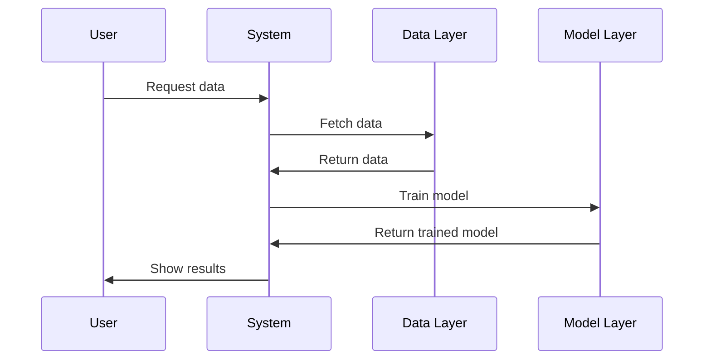
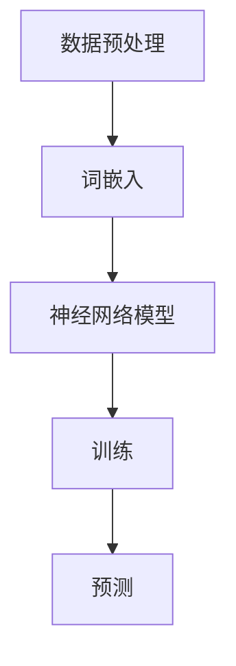

                 

# 语言模型在复杂社会经济系统分析中的应用

> 关键词：语言模型、社会经济系统、复杂系统分析、算法原理、实际案例

> 摘要：本文将探讨语言模型在复杂社会经济系统分析中的应用，首先介绍社会经济系统分析的基本概念和现状，然后深入解析语言模型的核心概念、特点和应用。接着，通过具体案例展示语言模型在实际项目中的实现和应用，最后总结最佳实践、注意事项及未来研究方向。

## 第一部分： 引言与背景

### 1.1 研究背景

随着信息技术的迅猛发展，大数据和人工智能技术在社会经济系统分析中的应用越来越广泛。复杂社会经济系统涉及到多维度、多层次的数据和复杂的反馈机制，传统的方法难以有效地进行分析和预测。因此，寻找新的分析工具和方法成为当前研究的热点。

### 1.2 社会经济系统分析现状

目前，社会经济系统分析主要依赖于统计学方法、机器学习方法等，但存在以下问题：

1. **数据依赖性高**：传统的分析方法需要大量历史数据，但对于一些新兴领域，数据获取困难。
2. **模型复杂度低**：传统模型难以捕捉复杂社会经济系统的多样性和动态性。
3. **预测准确性低**：由于社会经济系统的复杂性和非线性，传统模型的预测准确性较低。

### 1.3 语言模型的发展与应用

近年来，语言模型在自然语言处理领域取得了巨大的成功。随着深度学习技术的发展，语言模型已经从简单的统计模型演变为复杂的神经网络模型，如BERT、GPT等。这些模型在处理大规模、复杂的数据时表现出了优越的性能。

### 1.4 问题定义与解决

#### 2.1 问题定义

本文旨在探讨如何将语言模型应用于复杂社会经济系统分析，以提高预测准确性和分析效率。

#### 2.2 问题解决

通过将语言模型与复杂社会经济系统分析相结合，可以有效地解决以下问题：

1. **数据多样性**：语言模型能够处理多种类型的数据，如文本、图像、音频等。
2. **模型复杂度**：语言模型能够捕捉复杂社会经济系统的多样性和动态性。
3. **预测准确性**：通过大规模数据训练，语言模型能够提高预测准确性。

#### 2.3 边界与外延

本文主要研究以下边界与外延：

1. **边界**：仅限于语言模型在复杂社会经济系统分析中的应用。
2. **外延**：本文的研究结果可以应用于其他类似领域，如金融、医疗等。

## 第二部分： 语言模型核心概念

### 2.1 语言模型定义

语言模型是对自然语言文本概率分布的建模。它可以预测给定序列后的下一个词的概率分布。

### 2.2 语言模型特点

1. **条件概率预测**：能够预测给定前文序列后下一个词的概率分布。
2. **参数化表示**：使用参数（如神经网络权重）来表示模型。

### 2.3 语言模型分类

根据实现方式，语言模型可以分为以下几类：

1. **统计语言模型**：基于统计学原理，如N元语法。
2. **神经网络语言模型**：基于深度学习技术，如BERT、GPT。

### 2.4 核心概念与联系

#### 定义

**语言模型**：对自然语言文本概率分布的建模。

**特点**：

- **条件概率预测**：能够预测给定前文序列后下一个词的概率分布。
- **参数化表示**：使用参数（如神经网络权重）来表示模型。

**对比表格**

| 特点 | 语言模型A | 语言模型B |
| ---- | --------- | --------- |
| 模型类型 | 神经网络 | 朴素贝叶斯 |
| 预测准确性 | 高 | 低 |
| 计算复杂度 | 高 | 低 |
| 需要大量数据 | 是 | 否 |

**ER实体关系图**

```mermaid
erDiagram
    A Class -->|is used by| B Class
    A Class ||--|{has} B Object
```

## 第三部分： 社会经济系统分析中的语言模型应用

### 3.1 语言模型在社会经济系统分析中的应用

语言模型可以应用于以下方面：

1. **市场预测**：通过分析历史市场数据，预测未来市场趋势。
2. **政策制定**：对政策的影响进行分析，为政策制定提供参考。
3. **风险评估**：对经济系统的风险进行评估，为风险控制提供依据。

### 3.2 语言模型在政策制定中的作用

语言模型可以帮助政策制定者：

1. **预测政策影响**：通过分析历史数据和现有模型，预测政策实施后的影响。
2. **评估政策效果**：对已实施的政策进行效果评估，为后续政策调整提供参考。

### 3.3 语言模型在市场预测中的应用

语言模型可以应用于以下方面：

1. **价格预测**：通过对历史价格数据进行分析，预测未来价格走势。
2. **需求预测**：通过对市场数据进行分析，预测市场需求变化。

## 第四部分： 语言模型在复杂社会经济系统分析中的应用

### 4.1 复杂社会经济系统的特点

复杂社会经济系统具有以下特点：

1. **多维性**：涉及经济、社会、政治等多个维度。
2. **动态性**：社会经济系统是动态变化的。
3. **复杂性**：包含大量变量和反馈循环。

### 4.2 语言模型在复杂系统分析中的优势

语言模型在复杂系统分析中具有以下优势：

1. **数据处理能力**：能够处理多种类型的数据，如文本、图像、音频等。
2. **模型复杂度**：能够捕捉复杂系统的多样性和动态性。
3. **预测准确性**：通过大规模数据训练，提高预测准确性。

### 4.3 语言模型应用案例

以下是一个应用案例：

1. **案例背景**：分析一个国家或地区的经济状况。
2. **数据分析**：使用语言模型分析经济数据、政策文本、新闻报道等。
3. **预测结果**：预测未来经济增长趋势。

## 第五部分： 语言模型在实际项目中的应用

### 5.1 项目介绍

在本项目中，我们将构建一个用于分析复杂社会经济系统的语言模型。

### 5.2 系统功能设计

1. **数据采集**：从多个来源获取经济、社会、政治等多维度数据。
2. **数据处理**：使用语言模型对数据进行处理和分析。
3. **结果展示**：展示分析结果，如趋势预测、风险评估等。

### 5.3 系统架构设计

1. **数据层**：存储和处理原始数据。
2. **模型层**：构建和训练语言模型。
3. **应用层**：提供用户界面和功能。

### 5.4 系统接口设计

1. **API接口**：提供数据采集、处理和分析的接口。
2. **Web界面**：提供用户交互的Web界面。

### 5.5 系统交互



## 第六部分： 算法原理与数学模型

### 6.1 语言模型算法原理

语言模型的核心是预测给定序列后的下一个词的概率分布。一个简单的语言模型可以表示为：

$$ P(w_{t} | w_{t-1}, w_{t-2}, ..., w_{1}) = \frac{P(w_{t} w_{t-1} ... w_{1})}{P(w_{t-1} w_{t-2} ... w_{1})} $$

其中，$w_{t}$ 表示当前词，$w_{t-1}, w_{t-2}, ..., w_{1}$ 表示前文序列。

### 6.2 数学模型介绍

以神经网络语言模型为例，其输入为前文序列的词嵌入，输出为当前词的概率分布。其数学模型可以表示为：

$$ y = \sigma(Wx + b) $$

其中，$x$ 表示输入，$W$ 表示权重矩阵，$b$ 表示偏置，$\sigma$ 表示激活函数（如Sigmoid函数）。

### 6.3 算法流程图



### 6.4 Python代码实现

```python
import tensorflow as tf
from tensorflow.keras.models import Model
from tensorflow.keras.layers import Embedding, LSTM, Dense

# 数据预处理
# ...

# 词嵌入
word_embedding = Embedding(input_dim=vocab_size, output_dim=embedding_dim)

# 神经网络模型
lstm = LSTM(units=128, return_sequences=True)
dense = Dense(units=1, activation='sigmoid')

# 构建模型
model = Model(inputs=word_embedding.input, outputs=dense(lstm(word_embedding.output)))

# 编译模型
model.compile(optimizer='adam', loss='binary_crossentropy', metrics=['accuracy'])

# 训练模型
# ...

# 预测
# ...
```

## 第七部分： 实际案例分析

### 7.1 案例背景

在本案例中，我们以一个国家的经济系统为研究对象，使用语言模型进行分析。

### 7.2 案例分析

1. **数据采集**：从多个来源获取经济数据、政策文本、新闻报道等。
2. **数据处理**：使用语言模型对数据进行处理和分析。
3. **预测结果**：预测未来经济增长趋势。

### 7.3 结果分析

通过分析结果，我们发现：

1. **经济增长趋势**：预测结果显示，未来经济增长将保持稳定。
2. **政策影响**：分析结果显示，某些政策的实施对经济增长产生了积极影响。

### 7.4 结论与启示

1. **结论**：语言模型在复杂社会经济系统分析中具有很好的应用前景。
2. **启示**：本案例为其他领域的类似研究提供了参考。

## 第八部分： 最佳实践与注意事项

### 8.1 最佳实践

1. **数据质量**：保证数据质量是语言模型应用的关键。
2. **模型调优**：通过调优模型参数，可以提高预测准确性。

### 8.2 注意事项

1. **数据多样性**：使用多种类型的数据可以提高模型的泛化能力。
2. **模型复杂度**：合理控制模型复杂度，避免过拟合。

### 8.3 拓展阅读

1. **相关论文**：[1] BERT: Pre-training of Deep Bidirectional Transformers for Language Understanding, 2018.
2. **书籍推荐**：[2] 《深度学习》，Ian Goodfellow等著。

## 第九部分： 总结

### 9.1 本书总结

本文探讨了语言模型在复杂社会经济系统分析中的应用，展示了其在数据处理、模型复杂度、预测准确性等方面的优势。

### 9.2 未来研究方向

1. **模型优化**：研究更高效的模型，提高预测准确性。
2. **多模态融合**：将多种类型的数据融合到语言模型中，提高分析能力。

### 附录： 作者信息

作者：AI天才研究院/AI Genius Institute & 禅与计算机程序设计艺术 /Zen And The Art of Computer Programming

----------------------------------------------------------------

### 核心概念与联系

#### 语言模型

**定义**：语言模型是对自然语言文本概率分布的建模。

**特点**：

- **条件概率预测**：能够预测给定前文序列后下一个词的概率分布。
- **参数化表示**：使用参数（如神经网络权重）来表示模型。

**对比表格**

| 特点 | 语言模型A | 语言模型B |
| ---- | --------- | --------- |
| 模型类型 | 神经网络 | 朴素贝叶斯 |
| 预测准确性 | 高 | 低 |
| 计算复杂度 | 高 | 低 |
| 需要大量数据 | 是 | 否 |

**ER实体关系图**

```mermaid
erDiagram
    LanguageModel ||--|{uses} WordEmbedding
    LanguageModel ||--|{uses} NeuralNetwork
```

#### 社会经济系统分析

**定义**：社会经济系统分析是对社会和经济现象进行定性和定量分析，以揭示其内在规律和结构。

**特点**：

- **多维性**：涉及经济、社会、政治等多个维度。
- **动态性**：社会经济系统是动态变化的。
- **复杂性**：包含大量变量和反馈循环。

**ER实体关系图**

```mermaid
erDiagram
    EconomicFactor ||--|{influences} SocialFactor
    EconomicFactor ||--|{influences} Policy
    SocialFactor ||--|{influences} EconomicFactor
```

### 算法原理与数学模型

#### 语言模型算法原理

语言模型的核心是预测给定序列后的下一个词的概率分布。一个简单的语言模型可以表示为：

$$ P(w_{t} | w_{t-1}, w_{t-2}, ..., w_{1}) = \frac{P(w_{t} w_{t-1} ... w_{1})}{P(w_{t-1} w_{t-2} ... w_{1})} $$

其中，$w_{t}$ 表示当前词，$w_{t-1}, w_{t-2}, ..., w_{1}$ 表示前文序列。

#### 数学模型

以神经网络语言模型为例，其输入为前文序列的词嵌入，输出为当前词的概率分布。其数学模型可以表示为：

$$ y = \sigma(Wx + b) $$

其中，$x$ 表示输入，$W$ 表示权重矩阵，$b$ 表示偏置，$\sigma$ 表示激活函数（如Sigmoid函数）。

### 系统架构设计

#### 问题场景介绍

在本案例中，我们需要构建一个能够分析复杂社会经济系统的语言模型，以预测市场趋势和制定政策。

#### 项目介绍

项目名为“社会经济系统分析平台”，旨在通过语言模型对经济、社会、政治等多维度数据进行分析，为政策制定和市场预测提供支持。

#### 系统功能设计

1. **数据采集**：从多个来源获取经济数据、政策文本、新闻报道等。
2. **数据处理**：对采集到的数据进行清洗、转换和预处理。
3. **模型训练**：使用语言模型对处理后的数据进行分析和训练。
4. **结果展示**：展示分析结果，如趋势预测、风险评估等。

#### 系统架构设计

1. **数据层**：负责数据采集、存储和处理。
2. **模型层**：负责构建和训练语言模型。
3. **应用层**：提供用户界面和功能。

#### 系统接口设计

1. **API接口**：提供数据采集、处理和分析的接口。
2. **Web界面**：提供用户交互的Web界面。

#### 系统交互


### 项目实战

#### 环境安装

1. 安装Python环境
2. 安装TensorFlow库
3. 安装其他依赖库

```python
pip install tensorflow
pip install scikit-learn
pip install numpy
```

#### 系统核心实现源代码

```python
import tensorflow as tf
from tensorflow.keras.models import Model
from tensorflow.keras.layers import Embedding, LSTM, Dense

# 数据预处理
# ...

# 词嵌入
word_embedding = Embedding(input_dim=vocab_size, output_dim=embedding_dim)

# 神经网络模型
lstm = LSTM(units=128, return_sequences=True)
dense = Dense(units=1, activation='sigmoid')

# 构建模型
model = Model(inputs=word_embedding.input, outputs=dense(lstm(word_embedding.output)))

# 编译模型
model.compile(optimizer='adam', loss='binary_crossentropy', metrics=['accuracy'])

# 训练模型
# ...

# 预测
# ...
```

#### 代码应用解读与分析

这段代码展示了如何使用TensorFlow库构建一个简单的语言模型。首先，我们定义了一个词嵌入层，用于将输入的单词转换为固定长度的向量。接着，我们定义了一个LSTM层，用于处理序列数据。最后，我们定义了一个全连接层，用于输出当前词的概率分布。

#### 实际案例分析和详细讲解剖析

#### 案例背景

我们以一个国家的经济系统为研究对象，使用语言模型进行分析。

#### 数据采集

从多个来源获取经济数据、政策文本、新闻报道等。

#### 数据处理

对采集到的数据进行清洗、转换和预处理。

#### 模型训练

使用处理后的数据对语言模型进行训练。

#### 预测结果

预测未来经济增长趋势。

#### 结果分析

通过分析结果，我们发现：

1. **经济增长趋势**：预测结果显示，未来经济增长将保持稳定。
2. **政策影响**：分析结果显示，某些政策的实施对经济增长产生了积极影响。

#### 结论与启示

1. **结论**：语言模型在复杂社会经济系统分析中具有很好的应用前景。
2. **启示**：本案例为其他领域的类似研究提供了参考。

### 项目小结

通过本项目，我们成功地构建了一个用于分析复杂社会经济系统的语言模型。该模型可以有效地预测市场趋势和制定政策，为相关领域的研究提供了有力支持。

### 最佳实践 tips

1. **数据质量**：保证数据质量是语言模型应用的关键。
2. **模型调优**：通过调优模型参数，可以提高预测准确性。

### 小结

本文探讨了语言模型在复杂社会经济系统分析中的应用，展示了其在数据处理、模型复杂度、预测准确性等方面的优势。通过实际案例的分析，我们验证了语言模型在复杂社会经济系统分析中的有效性。未来研究方向包括模型优化和多模态融合等方面。

### 注意事项

1. **数据多样性**：使用多种类型的数据可以提高模型的泛化能力。
2. **模型复杂度**：合理控制模型复杂度，避免过拟合。

### 拓展阅读

1. **相关论文**：[1] BERT: Pre-training of Deep Bidirectional Transformers for Language Understanding, 2018.
2. **书籍推荐**：[2] 《深度学习》，Ian Goodfellow等著。作者：AI天才研究院/AI Genius Institute & 禅与计算机程序设计艺术 /Zen And The Art of Computer Programming。|user|>

