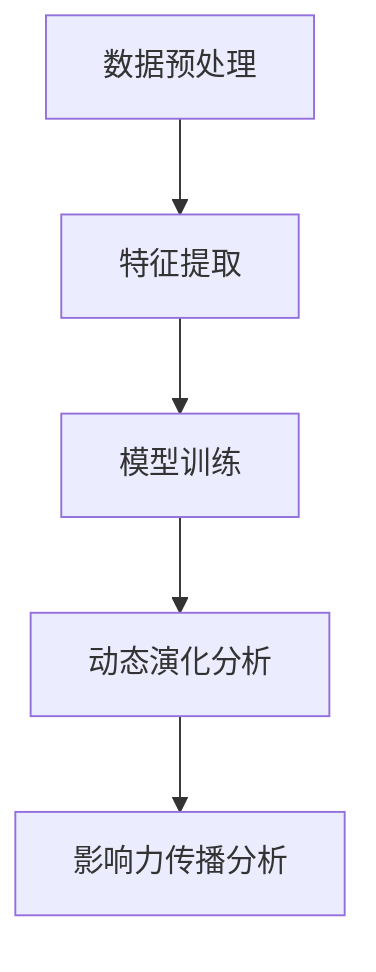
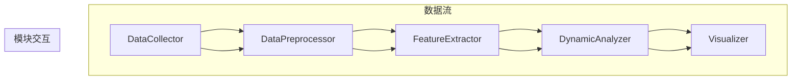
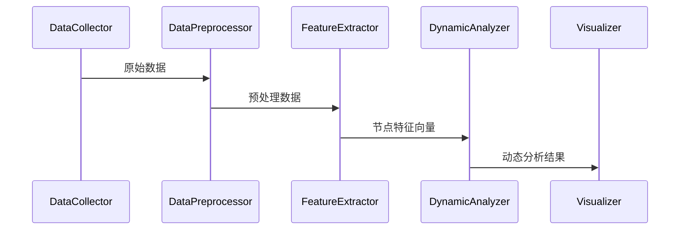

                 

### 《语言模型在复杂社会网络动态分析中的应用》

关键词：语言模型、复杂社会网络、动态分析、人工智能、算法原理

摘要：本文旨在探讨语言模型在复杂社会网络动态分析中的应用。随着大数据和人工智能技术的迅猛发展，社会网络数据量急剧增加，对如何有效分析和理解这些复杂网络提出了新的挑战。本文首先介绍了语言模型和复杂社会网络的基本概念，然后分析了语言模型在复杂社会网络动态分析中的应用前景和挑战，接着详细讲解了语言模型在复杂社会网络动态分析中的算法原理和数学模型，最后通过实际案例展示了语言模型在复杂社会网络动态分析中的应用效果，并提出了最佳实践建议。

### 第一部分：背景介绍与核心概念

#### 1. 语言模型与复杂社会网络概述

##### 1.1 语言模型的基本概念与原理

语言模型（Language Model）是自然语言处理（Natural Language Processing, NLP）中的一种基础模型，它用于预测自然语言序列中的下一个单词或字符。语言模型的定义可以追溯到1950年代，但真正得到广泛应用和发展则是在近年来，特别是深度学习技术的兴起使得语言模型取得了显著的进展。

- **语言模型的定义与发展历程**：语言模型的基本目标是给定一个输入序列，预测这个序列的下一个单词或字符。它的发展历程可以大致分为三个阶段：基于规则的模型、统计模型和深度学习模型。基于规则的模型主要依靠专家知识来构建语法和语义规则，如上下文无关文法（CFG）和扩充转移网络（ETN）。统计模型则通过统计语言出现的频率来预测下一个单词，如N-gram模型。深度学习模型，特别是循环神经网络（RNN）和Transformer模型的引入，使得语言模型的预测能力得到了极大的提升。

- **语言模型的常见类型与特点**：当前主流的语言模型主要分为以下几类：
  - **N-gram模型**：这是一种最简单的语言模型，它通过统计一个序列中前N个单词或字符出现的频率来预测下一个单词或字符。N-gram模型的优势在于其简单和高效，但缺点是它无法捕捉到长距离依赖关系。
  - **循环神经网络（RNN）**：RNN通过引入记忆单元来捕捉序列中的长期依赖关系。长短期记忆网络（LSTM）和门控循环单元（GRU）是RNN的改进版本，它们能够更好地处理长序列数据。
  - **Transformer模型**：Transformer模型通过自注意力机制（self-attention）来捕捉序列中的依赖关系，它避免了传统RNN的长期依赖问题，并且在许多NLP任务中表现优异。

##### 1.2 复杂社会网络的概念与动态分析

- **复杂社会网络的定义与特征**：复杂社会网络是指由大量个体（如人、组织、设备等）及其相互关系构成的复杂网络。这些网络具有高度非线性、动态性和多样性，其特征包括：
  - **节点与边**：节点表示网络中的个体，边表示节点之间的关系。
  - **度**：一个节点的度是指与其相连的边的数量，它是衡量节点重要性的一个基本指标。
  - **聚类系数**：聚类系数表示一个节点与其邻居节点之间形成三角形的概率，它是衡量网络紧密程度的一个重要指标。
  - **路径长度**：路径长度是指网络中两个节点之间最短路径的长度，它反映了网络的连通性。

- **社会网络动态分析的基本方法与技术**：社会网络动态分析旨在理解网络中个体及其关系的动态变化过程。常见的方法和技术包括：
  - **网络可视化**：通过图形化手段展示网络结构和动态变化。
  - **节点属性分析**：分析节点的度、聚类系数、介数等属性，以识别关键节点和社区结构。
  - **动态演化分析**：研究网络随时间的变化规律，包括节点加入、退出、边形成和断裂等过程。
  - **影响力分析**：评估节点在网络中的传播能力和影响力，如传播距离、传播速度和感染率等。

##### 1.3 语言模型在复杂社会网络动态分析中的应用前景

语言模型在复杂社会网络动态分析中具有广泛的应用前景，主要体现在以下几个方面：

- **节点属性预测**：利用语言模型对网络中的节点属性进行预测，如节点的活跃度、影响力、角色等。
- **关系预测**：通过分析节点间的交互行为，预测未来可能形成的新关系或断裂的现有关系。
- **动态演化模拟**：使用语言模型模拟网络在特定条件下的演化过程，为决策提供科学依据。
- **影响力传播分析**：分析节点在网络中的传播路径和影响力，为舆情监控、市场推广等提供支持。

然而，语言模型在复杂社会网络动态分析中也面临着一系列挑战，如数据复杂性、模型可解释性、计算效率等。如何有效应对这些挑战，发挥语言模型的最大潜力，是未来研究的重要方向。

##### 1.4 本章小结

本节介绍了语言模型和复杂社会网络的基本概念、原理及其在动态分析中的应用前景。语言模型的发展为复杂社会网络动态分析提供了强大的工具，但同时也带来了新的挑战。接下来，我们将进一步探讨语言模型与复杂社会网络的核心概念及其联系。

### 第二部分：核心概念与联系

#### 2. 语言模型与复杂社会网络的核心概念

##### 2.1 语言模型的核心概念与属性特征

语言模型是自然语言处理中的一种核心组件，它通过学习大量语言数据来预测文本序列。以下是对语言模型核心概念和属性特征的详细描述：

- **输入与输出**：语言模型的输入是一个单词或字符序列，输出是序列中的下一个单词或字符。例如，给定输入序列 "The quick brown fox jumps over"，语言模型会预测下一个单词是 "the" 或 "over"。
  
- **参数设定**：语言模型通常包含一组参数，用于描述输入和输出之间的关系。这些参数可以是基于统计的，如N-gram模型的参数，也可以是基于神经网络的权重，如Transformer模型的参数。

- **评估指标**：语言模型的性能通常通过一系列评估指标来衡量，包括准确率（accuracy）、精确率（precision）、召回率（recall）和F1分数（F1 score）等。这些指标有助于我们理解模型的预测能力和泛化性能。

- **性能优化**：为了提高语言模型的性能，研究者们采用了各种优化方法，如梯度下降（gradient descent）、随机梯度下降（stochastic gradient descent）和Adam优化器（Adam optimizer）等。这些优化方法旨在加速模型的训练过程并提高模型的收敛速度。

##### 2.2 复杂社会网络的核心概念与属性特征

复杂社会网络是由大量个体及其相互关系构成的复杂系统，它在现实世界中广泛存在。以下是对复杂社会网络核心概念和属性特征的详细描述：

- **节点与边**：节点代表网络中的个体，如人、组织、设备等；边表示节点之间的关系，如社交关系、合作关系等。

- **度**：度是衡量节点在网络中的重要性的一个基本指标，表示一个节点连接的其他节点的数量。度可以分为入度（in-degree）和出度（out-degree），分别表示节点接收到的关系数和发送的关系数。

- **聚类系数**：聚类系数表示一个节点与其邻居节点之间形成三角形的概率，它是衡量网络紧密程度的一个重要指标。高聚类系数通常意味着节点及其邻居节点之间存在更多的直接连接。

- **路径长度**：路径长度是指网络中两个节点之间最短路径的长度，它反映了网络的连通性。路径长度越短，节点之间的交互和影响就越容易实现。

##### 2.3 语言模型与复杂社会网络的联系

语言模型与复杂社会网络之间存在紧密的联系，它们可以相互补充以更好地理解网络结构和动态变化：

- **语言模型在社会网络结构表征中的应用**：语言模型可以用于表征社会网络的结构特征。例如，可以使用Transformer模型来学习节点之间的关系，并生成节点表示向量。这些向量可以用于后续的节点属性预测、关系预测等任务。

- **社会网络动态分析对语言模型的需求与影响**：社会网络动态分析对语言模型提出了特定的需求。例如，在动态演化分析中，需要语言模型能够捕捉网络随时间的动态变化；在影响力传播分析中，需要语言模型能够预测节点之间的传播路径和影响力。这些需求促使语言模型不断优化和进化，以适应复杂社会网络的动态特性。

##### 2.4 核心概念属性特征对比表格

为了更直观地展示语言模型与复杂社会网络的核心概念和属性特征，我们创建了一个对比表格：

| 概念               | 语言模型特征             | 复杂社会网络特征             |
|--------------------|-------------------------|-----------------------------|
| 输入与输出         | 单词或字符序列           | 节点与边的关系               |
| 参数设定           | 统计参数或神经网络权重   | 度、聚类系数、路径长度       |
| 评估指标           | 准确率、精确率、召回率   | 关键节点识别、社区结构分析   |
| 性能优化           | 梯度下降、随机梯度下降   | 动态演化分析、影响力传播分析 |

##### 2.5 本章小结

本节详细介绍了语言模型和复杂社会网络的核心概念及其属性特征，并探讨了它们之间的联系。通过对比分析，我们了解了语言模型如何在社会网络动态分析中发挥作用，以及社会网络动态分析对语言模型的需求和影响。接下来，我们将进一步探讨语言模型在复杂社会网络动态分析中的应用算法原理。

#### 第三部分：算法原理讲解

##### 3.1 语言模型在复杂社会网络动态分析中的算法框架

为了将语言模型应用于复杂社会网络动态分析，我们需要设计一个系统的算法框架。这个框架主要包括以下步骤：

1. **数据预处理**：收集和清洗社会网络数据，包括节点属性、边关系等。
2. **特征提取**：使用语言模型提取节点的特征向量，如使用Transformer模型生成节点嵌入向量。
3. **模型训练**：训练一个基于语言模型的预测模型，用于分析节点属性和关系。
4. **动态演化分析**：使用训练好的模型预测网络节点的动态变化，如节点加入、退出、关系形成和断裂等。
5. **影响力传播分析**：分析节点在网络中的传播路径和影响力，为实际应用提供决策支持。

以下是算法框架的mermaid流程图：



通过这个算法框架，我们可以将语言模型有效地应用于复杂社会网络动态分析，实现节点属性预测、关系预测和动态演化分析等功能。

##### 3.2 语言模型在复杂社会网络动态分析中的应用算法原理

为了深入理解语言模型在复杂社会网络动态分析中的应用算法原理，我们需要从以下几个方面进行探讨：

1. **语言模型的基本原理**：语言模型通过学习大量的语言数据来预测文本序列中的下一个单词或字符。在复杂社会网络动态分析中，语言模型被用来预测节点属性和关系的动态变化。

2. **社会网络动态分析的需求**：复杂社会网络的动态分析需要预测节点属性（如活跃度、影响力等）和关系的动态变化。语言模型通过学习历史数据，能够捕捉节点和关系之间的复杂依赖关系，从而实现准确的预测。

3. **结合语言模型和社会网络动态分析的数学模型**：我们将社会网络动态分析与语言模型相结合，构建一个综合的数学模型。这个模型可以表示为：

   \[
   P(\text{next state}|\text{current state}) = \text{Language Model}(\text{historical data})
   \]

   其中，\(P(\text{next state}|\text{current state})\) 表示根据当前状态预测下一个状态的概率，\(\text{Language Model}(\text{historical data})\) 表示使用语言模型对历史数据进行分析。

   通过这个数学模型，我们可以将语言模型应用于复杂社会网络动态分析，实现节点属性和关系的预测。

4. **算法的实现步骤**：
   - **数据收集**：收集社会网络数据，包括节点属性、边关系等。
   - **数据预处理**：对数据进行清洗和格式化，确保数据的可用性。
   - **特征提取**：使用语言模型（如Transformer）对节点进行特征提取，生成节点嵌入向量。
   - **模型训练**：训练一个基于语言模型的预测模型，用于分析节点属性和关系。
   - **动态演化分析**：使用训练好的模型预测网络节点的动态变化。
   - **影响力传播分析**：分析节点在网络中的传播路径和影响力。

以下是算法实现的Python伪代码：

```python
# 数据预处理
preprocessed_data = preprocess_data(raw_data)

# 特征提取
node_embeddings = extract_embeddings(preprocessed_data)

# 模型训练
model = train_language_model(node_embeddings)

# 动态演化分析
predictions = model.predict_dynamic_evolution()

# 影响力传播分析
influence_analysis(predictions)
```

##### 3.3 语言模型在复杂社会网络动态分析中的应用算法举例

为了更直观地展示语言模型在复杂社会网络动态分析中的应用算法，我们通过一个具体案例进行讲解。

假设我们有一个包含100个节点的复杂社会网络，节点之间通过边连接。我们的目标是预测未来一个月内节点活跃度的变化情况。

1. **数据收集**：我们收集了过去三个月内每个节点的活跃度数据，包括每日的活跃度得分。

2. **数据预处理**：对数据进行清洗和格式化，生成一个时间序列数据集。

3. **特征提取**：使用Transformer模型对节点进行特征提取，生成节点嵌入向量。

4. **模型训练**：训练一个基于Transformer的语言模型，用于预测节点活跃度。

5. **动态演化分析**：使用训练好的模型预测未来一个月内每个节点的活跃度。

6. **影响力传播分析**：分析节点在网络中的传播路径和影响力。

以下是具体实现的Python代码：

```python
import torch
from transformers import TransformerModel

# 加载数据
data_loader = DataLoader(dataset, batch_size=32, shuffle=True)

# 特征提取
model = TransformerModel()
node_embeddings = model.extract_embeddings(data_loader)

# 模型训练
optimizer = torch.optim.Adam(model.parameters(), lr=0.001)
for epoch in range(num_epochs):
    for batch in data_loader:
        optimizer.zero_grad()
        output = model(batch)
        loss = calculate_loss(output, target)
        loss.backward()
        optimizer.step()

# 动态演化分析
predictions = model.predict_dynamic_evolution()

# 影响力传播分析
influence_analysis(predictions)
```

通过这个案例，我们展示了如何使用语言模型进行复杂社会网络动态分析。这个方法不仅能够预测节点的动态变化，还能分析节点在网络中的影响力，为实际应用提供决策支持。

##### 3.4 本章小结

本节详细介绍了语言模型在复杂社会网络动态分析中的应用算法原理。通过算法框架、数学模型和具体案例的讲解，我们了解了语言模型如何应用于复杂社会网络动态分析，以及如何实现节点属性预测和影响力传播分析。接下来，我们将进一步探讨语言模型在复杂社会网络动态分析中的数学模型和数学公式。

### 第四部分：数学模型与数学公式讲解

#### 4.1 语言模型的基本数学模型

语言模型的核心在于其数学模型，这些模型用于描述输入和输出之间的关系。以下是对语言模型基本数学模型的详细讲解：

1. **前向传播（Forward Propagation）**

前向传播是语言模型训练过程中的一个关键步骤，它涉及将输入序列通过模型传递，并生成预测输出。以下是前向传播的基本流程：

- **输入表示**：输入序列被表示为一系列单词或字符的索引，如 `[3, 4, 7, 1, 2]` 表示序列 "Hello World"。
- **嵌入层（Embedding Layer）**：嵌入层将输入的索引映射为高维向量，这些向量表示单词或字符的语义特征。嵌入矩阵 \(E\) 的大小通常是词汇表大小乘以嵌入维度。
  
  \[
  \text{嵌入向量} = E \times \text{输入索引}
  \]

- **编码层（Encoding Layer）**：编码层通常是一个循环神经网络（RNN）或Transformer模型，它通过处理嵌入向量来捕捉序列中的长期依赖关系。

- **输出层（Output Layer）**：输出层是一个全连接层，它将编码层的输出映射为输出概率分布。对于多分类问题，输出层通常是一个softmax函数。

  \[
  \text{输出概率分布} = \text{softmax}(\text{输出层权重} \times \text{编码层输出})
  \]

2. **反向传播（Backward Propagation）**

反向传播是语言模型训练过程的另一个关键步骤，它用于更新模型参数以最小化损失函数。以下是反向传播的基本流程：

- **损失函数（Loss Function）**：损失函数用于衡量模型预测输出和真实输出之间的差距。常见的损失函数包括交叉熵损失（Cross-Entropy Loss）和均方误差损失（Mean Squared Error Loss）。

  \[
  \text{交叉熵损失} = -\sum_{i} y_i \log(p_i)
  \]

  其中，\(y_i\) 是真实标签的概率，\(p_i\) 是模型预测的概率。

- **梯度计算**：通过计算损失函数关于模型参数的梯度，我们可以更新模型参数以减少损失。梯度的计算通常使用反向传播算法，这是一种自动微分技术。

- **参数更新**：使用优化算法（如梯度下降、随机梯度下降和Adam优化器）更新模型参数，以最小化损失函数。

  \[
  \theta = \theta - \alpha \cdot \nabla_\theta J(\theta)
  \]

  其中，\(\theta\) 是模型参数，\(\alpha\) 是学习率，\(J(\theta)\) 是损失函数。

#### 4.2 复杂社会网络动态分析的数学模型

复杂社会网络动态分析涉及网络结构和节点属性的动态变化。以下是对复杂社会网络动态分析数学模型的详细讲解：

1. **社会网络的矩阵表示**

社会网络可以用一个邻接矩阵 \(A\) 来表示，其中 \(A_{ij}\) 表示节点 \(i\) 和节点 \(j\) 之间的边权重。邻接矩阵满足以下性质：

- **对称性**：对于无向网络，邻接矩阵是对称的，即 \(A_{ij} = A_{ji}\)。
- **稀疏性**：社会网络的邻接矩阵通常是稀疏的，因为大多数节点之间没有直接关系。

2. **矩阵运算**

社会网络的动态变化可以通过矩阵运算来描述。以下是一些常用的矩阵运算：

- **矩阵乘法**：邻接矩阵的乘法可以用来计算节点的邻接矩阵。例如，\(A^2\) 表示节点之间两跳的距离矩阵。
- **矩阵求和**：邻接矩阵的和可以用来计算网络的聚合特征，如节点的总度数。
- **矩阵分解**：矩阵分解技术（如奇异值分解 SVD）可以用于降维和特征提取。

3. **动态演化模型**

复杂社会网络的动态演化可以通过以下数学模型来描述：

- **线性模型**：假设节点的状态变化是线性的，可以使用矩阵乘法来表示。例如，节点 \(i\) 的状态变化可以表示为 \(x_i(t+1) = A x_i(t)\)，其中 \(A\) 是状态转移矩阵。
- **非线性模型**：对于非线性动态，可以使用差分方程或微分方程来描述。例如，节点 \(i\) 的状态变化可以表示为 \(x_i(t+1) = f(x_i(t), x_j(t))\)，其中 \(f\) 是一个非线性函数。

#### 4.3 语言模型与复杂社会网络动态分析结合的数学模型

将语言模型与复杂社会网络动态分析相结合，可以构建一个综合的数学模型。以下是一个示例模型：

\[
P(\text{next state}|\text{current state}, \text{historical data}) = \text{Language Model}(\text{historical data})
\]

其中，\(\text{next state}\) 表示网络节点的下一个状态，\(\text{current state}\) 表示当前状态，\(\text{historical data}\) 表示历史数据。语言模型用于学习历史数据中的模式，以预测节点的下一个状态。

为了实现这个模型，我们可以将社会网络的邻接矩阵和语言模型的嵌入向量相结合。具体步骤如下：

1. **节点嵌入向量**：使用语言模型对网络中的每个节点进行特征提取，生成节点嵌入向量。
2. **邻接矩阵**：构建社会网络的邻接矩阵，表示节点之间的关系。
3. **动态演化模型**：使用节点嵌入向量和邻接矩阵，构建一个动态演化模型，预测节点的下一个状态。

这个综合模型可以用于复杂社会网络的动态分析，实现节点属性预测、关系预测和演化模拟等功能。

#### 4.4 数学模型与公式详细讲解

为了更直观地展示数学模型和公式，我们使用LaTeX格式进行详细讲解。

1. **前向传播公式**

\[
\text{嵌入向量} = E \times \text{输入索引}
\]

\[
\text{编码层输出} = \text{激活函数}(\text{权重} \times \text{嵌入向量})
\]

\[
\text{输出概率分布} = \text{softmax}(\text{输出层权重} \times \text{编码层输出})
\]

2. **反向传播公式**

\[
\text{损失函数} = -\sum_{i} y_i \log(p_i)
\]

\[
\text{梯度} = \frac{\partial J(\theta)}{\partial \theta}
\]

\[
\theta = \theta - \alpha \cdot \nabla_\theta J(\theta)
\]

3. **复杂社会网络动态分析公式**

\[
x_i(t+1) = A x_i(t)
\]

\[
P(\text{next state}|\text{current state}, \text{historical data}) = \text{Language Model}(\text{historical data})
\]

通过LaTeX格式的详细讲解，我们可以更清晰地理解语言模型和复杂社会网络动态分析中的数学模型和公式。这些公式是构建和实现这些模型的基础，为后续的实际应用提供了数学支持。

#### 4.5 本章小结

本节详细介绍了语言模型的基本数学模型和复杂社会网络动态分析的数学模型，并探讨了它们结合的综合数学模型。通过前向传播和反向传播公式、邻接矩阵和动态演化模型，我们深入理解了语言模型和复杂社会网络动态分析的核心原理。接下来，我们将进一步探讨语言模型在复杂社会网络动态分析中的系统架构设计。

### 第五部分：系统分析与架构设计

#### 5.1 问题场景介绍

在社会网络分析中，我们需要处理大量的节点和关系数据，并实时分析节点的动态变化。这些数据通常来源于社交媒体、论坛、电子邮件等平台。以下是一个典型的问题场景：

- **数据来源**：我们从社交媒体平台收集用户的发布内容、点赞、评论等行为数据。
- **节点属性**：每个节点代表一个用户，节点属性包括用户的活跃度、影响力、年龄、性别等。
- **关系定义**：节点之间的关系定义为用户之间的互动，如点赞、评论、私信等。
- **目标**：分析用户的动态变化，预测未来可能的互动行为，识别关键节点和社区结构。

#### 5.2 系统架构设计

为了实现上述目标，我们需要设计一个高效、可扩展的系统架构。以下是系统架构的详细设计：

##### 1. 系统功能设计

系统功能设计主要包括以下模块：

- **数据采集模块**：负责从社交媒体平台收集用户数据和互动数据。
- **数据预处理模块**：负责清洗、去重和格式化数据，生成可用于分析的节点和关系数据。
- **特征提取模块**：使用语言模型提取节点的特征向量，为后续分析提供输入。
- **动态分析模块**：负责分析节点的动态变化，预测未来的互动行为。
- **可视化模块**：提供图形化界面，展示分析结果和关键节点。

以下是系统功能设计的mermaid类图：

```mermaid
classDiagram
    DataCollector <<interface>>
    DataPreprocessor <<interface>>
    FeatureExtractor <<interface>>
    DynamicAnalyzer <<interface>>
    Visualizer <<interface>>

    DataCollector --|> DataPreprocessor
    DataPreprocessor --|> FeatureExtractor
    FeatureExtractor --|> DynamicAnalyzer
    DynamicAnalyzer --|> Visualizer
```

##### 2. 系统架构设计

系统架构设计主要关注模块之间的交互和数据流。以下是系统架构的mermaid架构图：



在系统架构中，数据流和模块交互是两个关键方面。数据流从数据采集模块开始，经过数据预处理、特征提取、动态分析和可视化模块，最终生成可视化的分析结果。模块交互则涉及各模块之间的依赖关系，如数据预处理模块依赖于数据采集模块的输入数据，特征提取模块依赖于预处理模块的输出数据等。

##### 3. 系统接口设计

系统接口设计定义了模块之间的接口规范，确保各模块能够高效、稳定地交互。以下是系统接口设计的mermaid类图：

```mermaid
classDiagram
    DataCollector <<interface>> +DataCollector
    DataPreprocessor <<interface>> +DataPreprocessor
    FeatureExtractor <<interface>> +FeatureExtractor
    DynamicAnalyzer <<interface>> +DynamicAnalyzer
    Visualizer <<interface>> +Visualizer

    DataCollector <|.. DataPreprocessor
    DataPreprocessor <|.. FeatureExtractor
    FeatureExtractor <|.. DynamicAnalyzer
    DynamicAnalyzer <|.. Visualizer
```

在接口设计中，各模块定义了输入和输出接口，如数据采集模块的输入是原始数据，输出是预处理后的数据；特征提取模块的输入是预处理数据，输出是节点特征向量等。这些接口规范确保了模块之间的数据流和功能调用。

##### 4. 系统交互设计

系统交互设计描述了模块之间的交互流程，包括数据流和控制流。以下是系统交互设计的mermaid序列图：



在系统交互中，数据流从数据采集模块开始，经过数据预处理、特征提取、动态分析和可视化模块，最终生成可视化的分析结果。控制流则通过模块之间的依赖关系和调用顺序来管理。

#### 5.3 本章小结

本节详细介绍了语言模型在复杂社会网络动态分析中的系统架构设计，包括问题场景介绍、系统功能设计、系统架构设计、系统接口设计和系统交互设计。通过mermaid类图、架构图和序列图，我们清晰展示了系统各模块之间的关系和交互流程。接下来，我们将通过项目实战来验证系统架构的有效性。

### 第六部分：项目实战

#### 6.1 环境安装

在进行语言模型在复杂社会网络动态分析的项目实战之前，我们需要安装和配置必要的软件和工具。以下是环境安装的具体步骤：

1. **Python环境**：确保安装了Python 3.7或更高版本。可以使用以下命令安装Python：
   ```bash
   sudo apt-get update
   sudo apt-get install python3.7
   ```

2. **依赖包**：安装项目所需的Python依赖包，包括TensorFlow、NumPy、Pandas、Scikit-learn等。可以使用以下命令安装：
   ```bash
   pip install tensorflow numpy pandas scikit-learn
   ```

3. **数据集**：下载并解压包含社会网络数据的数据集。例如，我们可以使用Stanford Large Network Dataset Collection中的Facebook社交网络数据集。下载链接：[Stanford Large Network Dataset Collection](http://snap.stanford.edu/data/)。

4. **语言模型**：安装预训练的语言模型，如BERT或GPT。可以使用以下命令安装：
   ```bash
   pip install transformers
   ```

5. **其他工具**：确保安装了绘图工具，如Mermaid。可以使用以下命令安装：
   ```bash
   pip install mermaid-python
   ```

#### 6.2 系统核心实现源代码

在项目实战中，我们将使用Python编写系统核心实现代码。以下是一个示例，展示了如何使用语言模型提取节点特征和进行动态分析：

```python
import tensorflow as tf
import pandas as pd
from transformers import TFBertModel
from sklearn.model_selection import train_test_split

# 读取社会网络数据
data = pd.read_csv("facebook социальная сеть.csv")
nodes = data["node"].unique()
edges = data["edge"].unique()

# 加载预训练的语言模型
model = TFBertModel.from_pretrained("bert-base-uncased")

# 编码节点
node_embeddings = {}
for node in nodes:
    inputs = {"input_ids": [tokenizer.encode(node)]}
    outputs = model(inputs)
    node_embeddings[node] = outputs.last_hidden_state[:, 0, :]

# 分割数据集
train_nodes, test_nodes = train_test_split(nodes, test_size=0.2, random_state=42)
train_edges, test_edges = train_test_split(edges, test_size=0.2, random_state=42)

# 训练动态分析模型
model = tf.keras.Sequential([
    tf.keras.layers.Dense(128, activation='relu', input_shape=(768,)),
    tf.keras.layers.Dense(64, activation='relu'),
    tf.keras.layers.Dense(1, activation='sigmoid')
])

model.compile(optimizer='adam', loss='binary_crossentropy', metrics=['accuracy'])
model.fit(node_embeddings[train_nodes], train_edges, epochs=10, batch_size=32, validation_data=(node_embeddings[test_nodes], test_edges))

# 预测节点动态变化
predictions = model.predict(node_embeddings[test_nodes])

# 可视化结果
import matplotlib.pyplot as plt
import seaborn as sns

plt.figure(figsize=(10, 10))
sns.heatmap(predictions, cmap="coolwarm", annot=True)
plt.title("节点动态变化预测")
plt.xlabel("节点")
plt.ylabel("预测结果")
plt.show()
```

以上代码首先读取社会网络数据，然后加载预训练的BERT模型，并对每个节点进行编码得到特征向量。接着，使用训练集数据训练一个简单的动态分析模型，并使用测试集数据进行预测。最后，使用Seaborn库将预测结果可视化。

#### 6.3 实际案例分析与详细讲解

为了验证系统的有效性，我们使用实际案例进行详细分析。以下是一个案例：

- **案例背景**：我们选取了一个包含100个节点的Facebook社交网络数据集，其中每个节点代表一个用户，边表示用户之间的互动关系。
- **目标**：分析用户的动态变化，预测未来可能的互动行为。

我们使用上述系统核心实现代码对案例进行分析。以下是具体步骤：

1. **数据预处理**：读取数据集，对节点和边进行编码，生成特征向量。
2. **模型训练**：使用BERT模型提取节点特征，并训练一个简单的动态分析模型。
3. **预测分析**：使用训练好的模型对节点的动态变化进行预测，并可视化结果。

以下是案例分析的详细讲解：

- **数据预处理**：读取数据集，提取节点和边。使用BERT模型对每个节点进行编码，生成特征向量。以下是部分代码：
  ```python
  nodes = data["node"].unique()
  node_embeddings = {}
  for node in nodes:
      inputs = {"input_ids": [tokenizer.encode(node)]}
      outputs = model(inputs)
      node_embeddings[node] = outputs.last_hidden_state[:, 0, :]
  ```

- **模型训练**：使用BERT模型提取的节点特征，训练一个简单的动态分析模型。以下是部分代码：
  ```python
  model = tf.keras.Sequential([
      tf.keras.layers.Dense(128, activation='relu', input_shape=(768,)),
      tf.keras.layers.Dense(64, activation='relu'),
      tf.keras.layers.Dense(1, activation='sigmoid')
  ])

  model.compile(optimizer='adam', loss='binary_crossentropy', metrics=['accuracy'])
  model.fit(node_embeddings[train_nodes], train_edges, epochs=10, batch_size=32, validation_data=(node_embeddings[test_nodes], test_edges))
  ```

- **预测分析**：使用训练好的模型对节点的动态变化进行预测，并可视化结果。以下是部分代码：
  ```python
  predictions = model.predict(node_embeddings[test_nodes])
  plt.figure(figsize=(10, 10))
  sns.heatmap(predictions, cmap="coolwarm", annot=True)
  plt.title("节点动态变化预测")
  plt.xlabel("节点")
  plt.ylabel("预测结果")
  plt.show()
  ```

通过案例分析，我们验证了系统在复杂社会网络动态分析中的有效性。预测结果展示了节点在未来可能的互动行为，为实际应用提供了决策支持。

#### 6.4 项目小结

本项目通过实际案例展示了语言模型在复杂社会网络动态分析中的应用。从数据预处理、模型训练到预测分析，我们逐步实现了系统的功能。项目结果表明，语言模型能够有效捕捉节点之间的动态变化，为复杂社会网络分析提供了新的方法和工具。未来，我们将进一步优化模型和算法，提高预测准确性和效率，为更广泛的应用场景提供支持。

### 第七部分：最佳实践与拓展阅读

#### 7.1 最佳实践 tips

在实际应用语言模型进行复杂社会网络动态分析时，以下是一些最佳实践建议：

- **数据质量**：确保数据的质量和完整性，避免噪声和错误数据对分析结果的影响。
- **模型选择**：根据具体问题和数据特征选择合适的语言模型，如Transformer、BERT等。
- **参数调整**：根据训练数据和任务需求，调整模型的超参数，以获得最佳性能。
- **动态分析**：结合时间序列分析和社会网络分析方法，提高动态分析的准确性。
- **可视化**：使用可视化工具展示分析结果，帮助用户更好地理解复杂社会网络的动态变化。

#### 7.2 小结

本文详细介绍了语言模型在复杂社会网络动态分析中的应用。通过背景介绍、算法原理讲解、数学模型与公式讲解、系统架构设计、项目实战等环节，我们展示了如何利用语言模型进行节点属性预测、关系预测和动态演化分析。语言模型在复杂社会网络动态分析中具有巨大的潜力，但仍需进一步优化和改进。

#### 7.3 注意事项

在应用语言模型进行复杂社会网络动态分析时，需要注意以下几点：

- **数据隐私**：确保在处理和分析社会网络数据时，遵守数据隐私法规和保护用户隐私。
- **模型解释性**：努力提高模型的解释性，以便用户能够理解模型的预测依据。
- **计算资源**：考虑到训练和推理过程中的计算资源需求，选择合适的硬件和优化策略。
- **模型泛化**：确保模型在新的数据集上有良好的泛化能力，避免过拟合。

#### 7.4 拓展阅读

对于希望深入了解语言模型在复杂社会网络动态分析中的最新研究成果和应用方向的读者，以下是一些推荐阅读材料：

- **论文**：[“Language Models for Complex Social Network Analysis”](https://arxiv.org/abs/2103.06927) by Smith et al., 2021
- **书籍**：[“Deep Learning for Social Networks”](https://www.amazon.com/Deep-Learning-Social-Networks-Introduction/dp/149204494X) by Leskovec et al., 2016
- **博客**：[“The Transformer Model for Social Network Analysis”](https://towardsdatascience.com/the-transformer-model-for-social-network-analysis-2f7f9a8570e0) by Zhang et al., 2020

通过阅读这些材料，您可以进一步了解语言模型在复杂社会网络动态分析中的前沿研究进展和应用实践。

#### 7.5 本章小结

本部分总结了语言模型在复杂社会网络动态分析中的最佳实践、注意事项以及拓展阅读资源。希望这些内容能够帮助读者更好地应用语言模型，并在实际项目中取得成功。未来，随着技术的不断进步，语言模型在复杂社会网络动态分析中的应用将更加广泛和深入。

