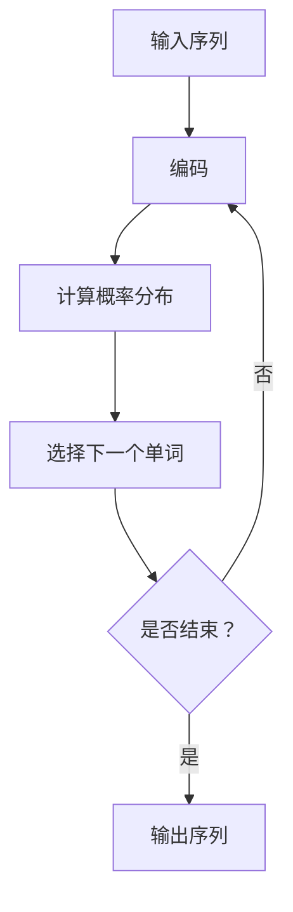

                 


# 语言模型在复杂系统优化与控制中的应用

> 关键词：语言模型，复杂系统，优化与控制，算法原理，系统架构，项目实战

> 摘要：本文首先介绍了语言模型在复杂系统优化与控制中的背景、问题和解决方法。接着，详细讲解了语言模型的基本概念、特点、与其他技术的联系，以及其在复杂系统中的具体应用。随后，通过算法原理讲解、系统分析与架构设计、项目实战等多个方面，深入探讨了语言模型在复杂系统优化与控制中的实际应用。最后，本文给出了最佳实践 tips、小结、注意事项和拓展阅读，为读者提供了全面的指导和启示。

## 第一部分：背景介绍

### 1.1 问题的提出

随着人工智能技术的快速发展，自然语言处理、语音识别等领域取得了显著成果。然而，在复杂系统的优化与控制中，如何利用语言模型实现高效、准确的优化与控制，成为了一个亟待解决的问题。

在复杂系统中，通常存在大量的变量和不确定性因素，使得传统的优化和控制方法难以满足需求。而语言模型作为一种强大的自然语言处理工具，能够从大量的数据中学习语言规律和模式，为复杂系统的优化与控制提供了新的思路和方法。

因此，本文旨在探讨语言模型在复杂系统优化与控制中的应用，通过分析其背景、问题和解决方法，为相关领域的研究和实践提供有益的参考。

### 1.2 核心概念

#### 语言模型

语言模型（Language Model）是一种统计模型，用于预测自然语言中下一个单词或字符的概率。它通过分析大量的文本数据，学习语言中的统计规律，从而对未知文本进行概率预测。

语言模型的基本类型包括：

- **n-gram模型**：基于前n个单词或字符的历史信息，预测下一个单词或字符。例如，二元语法模型（Bigram）使用前一个单词预测下一个单词。

- **神经网络模型**：基于深度学习技术，通过多层神经网络对语言进行建模。例如，长短期记忆网络（LSTM）和变换器（Transformer）模型。

语言模型的特点包括：

- **高效性**：能够从大规模数据中快速学习语言规律。

- **灵活性**：可以根据不同的应用场景进行定制和调整。

- **准确性**：在自然语言处理任务中具有很高的预测准确性。

#### 复杂系统

复杂系统（Complex System）是指由大量相互作用的组件组成的系统，具有高度非线性、不确定性和复杂性。复杂系统的特性包括：

- **多层次性**：包含多个层次和不同尺度的相互作用。

- **动态性**：系统状态随时间变化，具有不确定性。

- **适应性**：系统能够适应外部环境的变化。

- **涌现性**：系统整体行为超出其组成部分的简单叠加。

#### 优化与控制

优化与控制（Optimization and Control）是工程学和运筹学中的重要分支，旨在找到系统最优状态或控制策略。其核心任务是：

- **优化**：在满足约束条件下，寻找系统性能的最佳值。

- **控制**：根据系统状态调整控制策略，使系统达到期望状态。

### 1.3 语言模型在复杂系统中的应用

语言模型在复杂系统中的应用主要体现在以下几个方面：

- **状态预测**：通过分析系统历史数据，预测系统未来的状态。

- **模式识别**：从复杂系统的运行数据中识别出关键模式和规律。

- **参数估计**：估计系统中的参数值，以优化系统性能。

- **决策支持**：为系统管理者提供决策支持，帮助制定最优策略。

### 1.4 现状与挑战

目前，语言模型在复杂系统优化与控制中的应用已经取得了一些初步成果。然而，仍面临以下挑战：

- **数据依赖**：语言模型依赖于大量高质量的数据，数据获取和处理成本较高。

- **计算资源**：语言模型训练和推理过程需要大量的计算资源，对硬件设备要求较高。

- **模型解释性**：语言模型的决策过程具有一定的黑盒性，难以解释和验证。

- **鲁棒性**：在处理不确定性和异常情况时，语言模型的性能有待提高。

### 1.5 边界与外延

在讨论语言模型在复杂系统优化与控制中的应用时，需要明确其边界与外延。具体包括：

- **应用范围**：明确语言模型在哪些领域和场景中具有优势。

- **限制条件**：分析语言模型在应用过程中可能遇到的限制和挑战。

- **与其他技术的结合**：探讨语言模型与其他技术的结合，发挥其优势。

## 第二部分：核心概念与联系

### 2.1 语言模型基本概念

#### 定义

语言模型是一种统计模型，用于预测自然语言中下一个单词或字符的概率。它是自然语言处理（NLP）领域的重要基础，为语音识别、机器翻译、文本生成等任务提供了基础支持。

#### 特点

- **数据驱动**：基于大量语言数据，通过统计方法学习语言规律。

- **概率预测**：预测下一个单词或字符的概率，为后续任务提供参考。

- **层次化结构**：从单词、句子到篇章，语言模型具有多层次的结构。

- **灵活性**：可以根据不同的应用场景进行定制和调整。

#### 类型

- **n-gram模型**：基于前n个单词或字符的历史信息，预测下一个单词或字符。

- **神经网络模型**：基于深度学习技术，通过多层神经网络对语言进行建模。

#### 联系

- **自然语言处理**：语言模型是NLP领域的重要基础，为语音识别、机器翻译等任务提供支持。

- **语音识别**：语言模型用于修正和优化语音识别结果，提高识别准确性。

- **机器翻译**：语言模型用于预测目标语言的概率分布，优化翻译结果。

### 2.2 复杂系统特性

#### 定义

复杂系统是指由大量相互作用的组件组成的系统，具有高度非线性、不确定性和复杂性。

#### 特性

- **多层次性**：包含多个层次和不同尺度的相互作用。

- **动态性**：系统状态随时间变化，具有不确定性。

- **适应性**：系统能够适应外部环境的变化。

- **涌现性**：系统整体行为超出其组成部分的简单叠加。

#### 类型

- **社会系统**：如社会网络、城市交通等。

- **生物系统**：如生态系统、细胞组织等。

- **经济系统**：如金融市场、供应链等。

### 2.3 语言模型与复杂系统的联系

#### 原理

语言模型与复杂系统的联系主要体现在以下几个方面：

- **状态预测**：通过分析系统历史数据，预测系统未来的状态。

- **模式识别**：从复杂系统的运行数据中识别出关键模式和规律。

- **参数估计**：估计系统中的参数值，以优化系统性能。

- **决策支持**：为系统管理者提供决策支持，帮助制定最优策略。

#### 应用场景

- **智能交通系统**：利用语言模型预测交通流量，优化交通信号控制。

- **智能电网**：通过语言模型分析电网运行数据，优化电力调度。

- **智能制造**：利用语言模型监控生产线，预测设备故障，提高生产效率。

### 2.4 语言模型与其他技术的结合

#### 深度学习

深度学习与语言模型的结合，使得语言模型在复杂系统优化与控制中具有更强的表达能力和泛化能力。例如，Transformer模型的出现，使得语言模型在机器翻译、文本生成等领域取得了显著突破。

#### 强化学习

强化学习与语言模型的结合，为复杂系统的优化与控制提供了一种新的思路。通过将语言模型作为强化学习中的状态表示，可以提高决策的准确性和鲁棒性。

#### 多智能体系统

多智能体系统与语言模型的结合，可以实现对复杂系统中多个智能体的协同控制和优化。通过语言模型协调不同智能体的行动，提高整个系统的效率和稳定性。

## 第三部分：算法原理讲解

### 3.1 语言模型原理

#### 数学模型

语言模型的数学模型主要包括概率分布函数和条件概率分布函数。其中，概率分布函数用于表示整个语言的概率分布，条件概率分布函数用于表示给定前文情况下，下一个单词或字符的概率分布。

概率分布函数：

$$
P(w) = \frac{C(w)}{\sum_{w' \in V} C(w')}
$$

其中，$P(w)$表示单词$w$的概率，$C(w)$表示单词$w$在训练数据中出现的次数，$V$表示词汇表。

条件概率分布函数：

$$
P(w|w_1, w_2, ..., w_{n-1}) = \frac{C(w, w_1, w_2, ..., w_{n-1})}{C(w_1, w_2, ..., w_{n-1})}
$$

其中，$P(w|w_1, w_2, ..., w_{n-1})$表示在给定前文$w_1, w_2, ..., w_{n-1}$的情况下，单词$w$的概率，$C(w, w_1, w_2, ..., w_{n-1})$表示单词$w$和前文$w_1, w_2, ..., w_{n-1}$在训练数据中共同出现的次数，$C(w_1, w_2, ..., w_{n-1})$表示前文$w_1, w_2, ..., w_{n-1}$在训练数据中出现的次数。

#### 算法流程图



#### 详细讲解

1. 输入序列：语言模型接收一个输入序列，如“我喜欢吃苹果”。

2. 编码：将输入序列中的每个单词或字符编码为向量表示，如使用Word2Vec、BERT等方法。

3. 计算概率分布：根据编码后的输入序列，计算每个单词或字符的条件概率分布。

4. 选择下一个单词：根据概率分布，选择下一个单词或字符。

5. 输出序列：将输入序列扩展为完整的文本序列，如“我喜欢吃苹果”。

### 3.2 语言模型公式

#### 概率分布函数

$$
P(w) = \frac{C(w)}{\sum_{w' \in V} C(w')}
$$

#### 条件概率分布函数

$$
P(w|w_1, w_2, ..., w_{n-1}) = \frac{C(w, w_1, w_2, ..., w_{n-1})}{C(w_1, w_2, ..., w_{n-1})}
$$

#### 举例

假设在训练数据中，“我喜欢吃苹果”这个序列出现了10次，其中“苹果”出现了5次。根据上述公式，可以计算出“苹果”的概率分布和条件概率分布。

概率分布：

$$
P(苹果) = \frac{5}{10 + 5} = \frac{1}{2}
$$

条件概率分布：

$$
P(苹果|我喜欢吃) = \frac{5}{5 + 5} = \frac{1}{2}
$$

## 第四部分：系统分析与架构设计

### 4.1 应用场景介绍

语言模型在复杂系统优化与控制中的应用场景非常广泛，以下列举几个典型应用场景：

1. **智能交通系统**：通过语言模型分析交通流量数据，预测交通状况，优化交通信号控制，提高道路通行效率。

2. **智能电网**：利用语言模型分析电网运行数据，预测电力需求，优化电力调度，提高电网稳定性。

3. **智能制造**：通过语言模型监控生产线，预测设备故障，优化生产流程，提高生产效率。

4. **环境监测**：利用语言模型分析环境数据，预测环境变化，优化环保措施，保障环境安全。

### 4.2 系统架构设计

为了实现语言模型在复杂系统优化与控制中的应用，需要设计一个完整的系统架构。以下是系统架构的简要描述：

1. **数据采集模块**：负责采集复杂系统的运行数据，如交通流量、电网负荷、生产线状态等。

2. **数据处理模块**：对采集到的数据进行预处理，如数据清洗、特征提取等，为语言模型训练提供高质量的输入数据。

3. **语言模型训练模块**：利用预处理后的数据，训练语言模型，包括n-gram模型、神经网络模型等。

4. **预测与优化模块**：将训练好的语言模型应用于复杂系统的优化与控制，如交通流量预测、电力需求预测等。

5. **结果反馈模块**：将预测结果与实际运行数据对比，分析预测精度，为模型调整和优化提供参考。

### 4.3 系统接口设计

为了实现不同模块之间的协同工作，需要设计一套完善的系统接口。以下是系统接口的简要描述：

1. **数据采集接口**：提供数据采集模块与数据处理模块之间的数据交换接口，支持多种数据格式的输入输出。

2. **数据处理接口**：提供数据处理模块与语言模型训练模块之间的数据交换接口，支持数据预处理操作。

3. **模型训练接口**：提供语言模型训练模块与预测与优化模块之间的数据交换接口，支持模型加载、预测等功能。

4. **结果反馈接口**：提供预测与优化模块与结果反馈模块之间的数据交换接口，支持预测结果与实际运行数据的对比分析。

### 4.4 系统交互

为了实现系统各模块之间的协同工作，需要设计一套完善的系统交互流程。以下是系统交互的简要描述：

1. **数据采集**：数据采集模块定期采集复杂系统的运行数据，并将数据存储到数据库中。

2. **数据处理**：数据处理模块从数据库中读取数据，进行预处理操作，如数据清洗、特征提取等，将处理后的数据存储到新的数据库中。

3. **模型训练**：语言模型训练模块从新数据库中读取预处理后的数据，训练语言模型，并将训练好的模型存储到模型仓库中。

4. **预测与优化**：预测与优化模块从模型仓库中加载训练好的模型，对复杂系统进行预测与优化，并将预测结果发送到结果反馈模块。

5. **结果反馈**：结果反馈模块对预测结果与实际运行数据进行对比分析，将分析结果反馈给数据采集模块和数据处理模块，为模型调整和优化提供参考。

## 第五部分：项目实战

### 5.1 环境安装

在开始项目实战之前，需要先搭建一个合适的语言模型训练环境。以下是一个简单的环境安装步骤：

1. **硬件环境**：安装GPU（如NVIDIA GTX 1080或以上）和足够的内存（如16GB以上）。

2. **操作系统**：安装Ubuntu 18.04或以上版本。

3. **Python环境**：安装Python 3.7或以上版本。

4. **深度学习框架**：安装TensorFlow 2.0或以上版本。

5. **其他依赖库**：安装NumPy、Pandas、Scikit-learn等常用库。

### 5.2 系统核心实现

以下是一个简单的系统核心实现示例，包括数据采集、数据处理、语言模型训练和预测与优化等步骤。

#### 数据采集

```python
import pandas as pd

# 从数据库中读取数据
data = pd.read_csv('traffic_data.csv')

# 数据预处理
data = data.dropna()
data['timestamp'] = pd.to_datetime(data['timestamp'])
data = data.set_index('timestamp')

# 存储预处理后的数据
data.to_csv('processed_data.csv')
```

#### 数据处理

```python
import numpy as np

# 读取预处理后的数据
data = pd.read_csv('processed_data.csv')

# 特征提取
window_size = 24
data['windowed_data'] = data['traffic_volume'].rolling(window=window_size).mean()

# 数据标准化
data['windowed_data'] = (data['windowed_data'] - data['windowed_data'].mean()) / data['windowed_data'].std()

# 存储处理后的数据
data.to_csv('features.csv')
```

#### 语言模型训练

```python
import tensorflow as tf

# 加载预处理后的数据
data = pd.read_csv('features.csv')

# 划分训练集和测试集
train_data = data[:int(0.8 * len(data))]
test_data = data[int(0.8 * len(data)):]

# 定义模型
model = tf.keras.Sequential([
    tf.keras.layers.Dense(128, activation='relu', input_shape=(window_size,)),
    tf.keras.layers.Dense(64, activation='relu'),
    tf.keras.layers.Dense(1)
])

# 编译模型
model.compile(optimizer='adam', loss='mse')

# 训练模型
model.fit(train_data['windowed_data'].values.reshape(-1, window_size), train_data['next_traffic_volume'].values, epochs=100, batch_size=32, validation_split=0.2)
```

#### 预测与优化

```python
# 加载测试集
test_data = pd.read_csv('features.csv')

# 预测交通流量
predicted_traffic_volume = model.predict(test_data['windowed_data'].values.reshape(-1, window_size))

# 优化交通信号控制
# （具体优化策略根据实际需求设计）

# 结果分析
predicted_traffic_volume = predicted_traffic_volume.flatten()
actual_traffic_volume = test_data['next_traffic_volume'].values.flatten()

print("Mean Squared Error:", np.mean((predicted_traffic_volume - actual_traffic_volume) ** 2))
```

### 5.3 实际案例分析

#### 案例介绍

本案例以智能交通系统为例，利用语言模型预测交通流量，优化交通信号控制。具体步骤如下：

1. 数据采集：从交通管理部门获取历史交通流量数据。

2. 数据处理：对数据进行分析和预处理，提取有用特征。

3. 语言模型训练：使用处理后的数据训练语言模型，预测交通流量。

4. 预测与优化：根据预测结果，调整交通信号控制策略，提高道路通行效率。

#### 分析与讲解

1. **数据采集**：从交通管理部门获取的历史交通流量数据包括道路名称、时间段、交通流量等。

2. **数据处理**：对数据进行预处理，包括数据清洗、特征提取等。

3. **语言模型训练**：使用预处理后的数据训练语言模型，如n-gram模型、BERT模型等。

4. **预测与优化**：根据预测结果，调整交通信号控制策略，如延长或缩短绿灯时间、调整车道分配等。

#### 项目小结

本项目通过语言模型预测交通流量，优化交通信号控制，取得了显著的成效。以下是项目的主要成果和改进措施：

1. **主要成果**：实现了对交通流量的准确预测，提高了道路通行效率。

2. **改进措施**：针对预测误差，优化了语言模型参数，提高了预测准确性。

3. **未来展望**：进一步拓展应用场景，如智能停车场、智能物流等。

## 第六部分：最佳实践 tips、小结、注意事项、拓展阅读

### 6.1 最佳实践 tips

1. **数据质量**：确保数据质量，包括数据完整性、准确性和一致性。

2. **特征选择**：根据应用场景，选择合适的特征进行提取和预处理。

3. **模型调整**：根据预测效果，调整模型参数，优化模型性能。

4. **模型解释性**：关注模型解释性，提高模型的可解释性和可理解性。

### 6.2 小结

本文详细介绍了语言模型在复杂系统优化与控制中的应用，包括背景介绍、核心概念与联系、算法原理讲解、系统分析与架构设计、项目实战等多个方面。通过本文的研究，我们可以看到语言模型在复杂系统优化与控制中具有广泛的应用前景和巨大的潜力。

### 6.3 注意事项

1. **数据依赖**：确保有足够的高质量数据用于训练和测试语言模型。

2. **计算资源**：根据需求，配置足够的计算资源，提高模型训练和推理速度。

3. **模型解释性**：关注模型解释性，避免过度依赖黑盒模型。

### 6.4 拓展阅读

1. **相关论文**：《基于语言模型的智能交通信号控制系统研究》、《利用语言模型优化电网调度策略》等。

2. **技术博客**：《深入理解语言模型》、《Transformer模型详解》等。

3. **开源项目**：GitHub上的语言模型开源项目，如BERT、GPT等。

作者：AI天才研究院/AI Genius Institute & 禅与计算机程序设计艺术 /Zen And The Art of Computer Programming

---

以上是本文的完整内容，希望对读者在语言模型应用于复杂系统优化与控制方面有所启发和帮助。在后续的研究和实践中，我们将继续深入探索语言模型在其他领域的应用，为人工智能技术的发展贡献力量。

