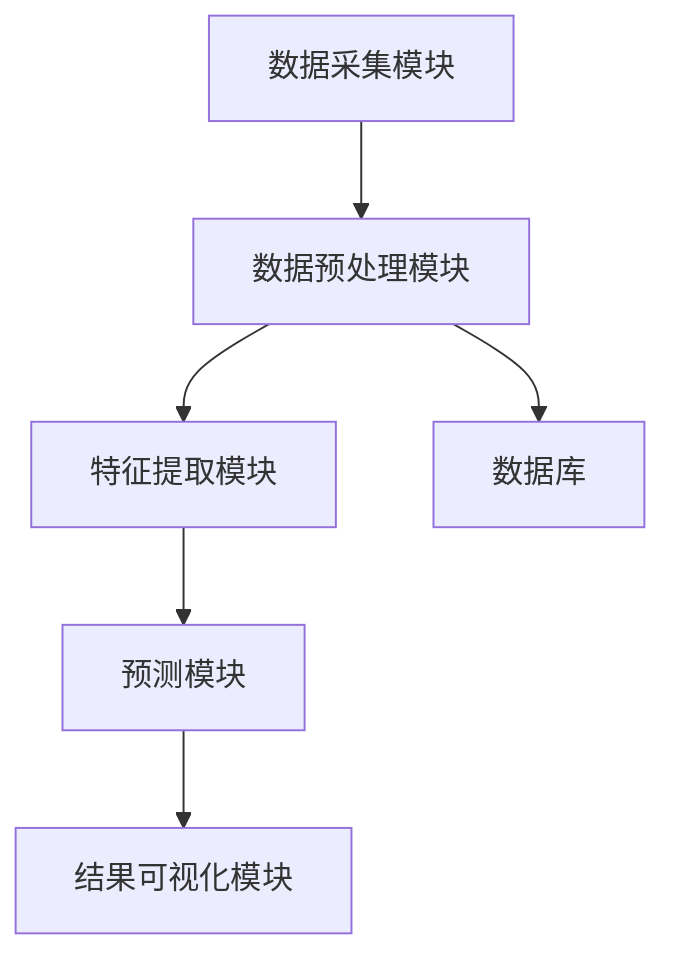
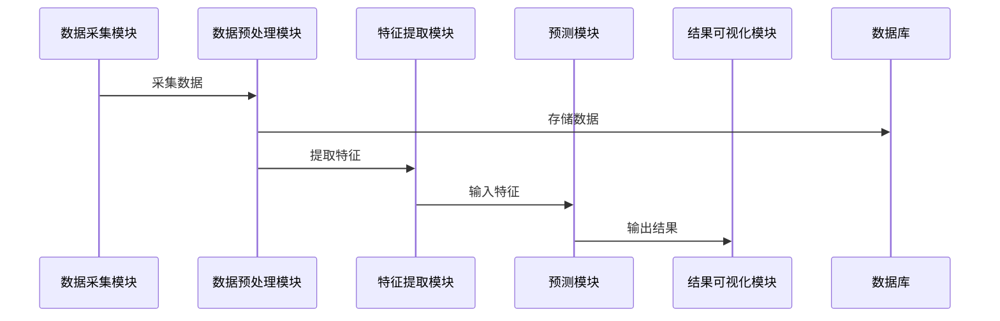

                 


### 《语言模型在复杂系统可靠性预测中的应用探索》

#### 关键词：语言模型，复杂系统，可靠性预测，深度学习，应用探索

#### 摘要：

随着科技的发展，复杂系统的应用越来越广泛，如何提高系统的可靠性成为了一个关键问题。本文将探讨如何利用语言模型，特别是深度学习中的语言模型，来预测复杂系统的可靠性。通过详细介绍语言模型的核心概念、算法原理，以及在实际应用中的具体实现和案例，本文旨在为读者提供一套系统的、易于理解的应用方案。

---

#### 目录大纲设计思路

为了设计出《语言模型在复杂系统可靠性预测中的应用探索》的完整目录大纲，我们需要遵循以下步骤：

1. **理解书名与主题**：
   - 书名《语言模型在复杂系统可靠性预测中的应用探索》表明，本书的核心内容是探讨语言模型（特别是深度学习中的语言模型）如何用于预测复杂系统的可靠性。
   - 目录大纲应分为几个主要部分，例如背景介绍、核心概念与联系、算法原理讲解、系统分析与架构设计方案、项目实战和最佳实践等。

2. **确定目录结构**：
   - 目录结构应遵循逻辑清晰、层次分明的原则，按照 1, 2, 3 级目录来组织内容。
   - 确保每个章节都有明确的主题，并且内容之间有合适的衔接。

3. **细化内容**：
   - 根据每个章节的主题，细化每个章节的内容。
   - 确保包含核心概念、联系、算法原理讲解、数学模型与公式、系统架构设计、项目实战和最佳实践等。

4. **保持简洁性**：
   - 尽量避免冗余内容，直接给出重点信息。
   - 使用 Mermaid 语法插入流程图、类图、架构图和序列图，使内容更加直观。

5. **符合字数限制**：
   - 目标是保持总字数在2000字以内，这要求我们在设计目录时就需要注意精简每一部分的内容。

#### 目录大纲具体内容

以下是具体的目录大纲内容：

```markdown
# 《语言模型在复杂系统可靠性预测中的应用探索》目录大纲

# 第一部分: 背景介绍
## 1.1 问题背景
### 1.1.1 复杂系统的定义
### 1.1.2 系统可靠性预测的重要性
### 1.1.3 当前可靠性预测的挑战

## 1.2 语言模型概述
### 1.2.1 语言模型的基本概念
### 1.2.2 语言模型的种类
### 1.2.3 语言模型的发展历程

## 1.3 语言模型在可靠性预测中的应用现状
### 1.3.1 应用场景举例
### 1.3.2 成功案例介绍
### 1.3.3 挑战与机遇

## 1.4 本书结构安排
### 1.4.1 各章节内容概述
### 1.4.2 学习目标与收获

# 第二部分: 核心概念与联系
## 2.1 语言模型核心概念
### 2.1.1 语言模型的基本原理
### 2.1.2 语言模型的属性特征对比
### 2.1.3 语言模型的组成部分

## 2.2 系统可靠性预测的核心概念
### 2.2.1 可靠性预测的基本概念
### 2.2.2 可靠性预测的类型与方法
### 2.2.3 可靠性预测的关键因素

## 2.3 语言模型与系统可靠性预测的联系
### 2.3.1 融合方式
### 2.3.2 联系机制
### 2.3.3 融合效果评估

# 第三部分: 算法原理讲解
## 3.1 语言模型算法原理
### 3.1.1 语言模型的基础算法
### 3.1.2 语言模型的优化方法
### 3.1.3 语言模型的训练与测试

## 3.2 系统可靠性预测算法
### 3.2.1 可靠性预测的常用算法
### 3.2.2 算法选择原则
### 3.2.3 算法优化与改进

## 3.3 融合算法讲解
### 3.3.1 融合策略
### 3.3.2 融合算法流程
### 3.3.3 融合效果分析

## 3.4 数学模型与公式讲解
### 3.4.1 数学模型的基本概念
### 3.4.2 数学模型的应用
### 3.4.3 数学公式详解

# 第四部分: 系统分析与架构设计方案
## 4.1 问题场景介绍
### 4.1.1 场景描述
### 4.1.2 系统需求分析

## 4.2 系统功能设计
### 4.2.1 功能模块划分
### 4.2.2 领域模型（Mermaid类图）

## 4.3 系统架构设计
### 4.3.1 系统架构图（Mermaid架构图）
### 4.3.2 架构设计原则
### 4.3.3 架构组件介绍

## 4.4 系统接口设计与交互
### 4.4.1 接口设计
### 4.4.2 系统交互（Mermaid序列图）

# 第五部分: 项目实战
## 5.1 环境安装
### 5.1.1 硬件与软件环境配置
### 5.1.2 需要安装的第三方库

## 5.2 系统核心实现
### 5.2.1 代码结构
### 5.2.2 关键代码实现

## 5.3 代码应用解读与分析
### 5.3.1 代码解读
### 5.3.2 分析与优化

## 5.4 实际案例分析与详细讲解
### 5.4.1 案例背景
### 5.4.2 案例分析
### 5.4.3 深入剖析

## 5.5 项目小结
### 5.5.1 项目总结
### 5.5.2 不足与改进建议
### 5.5.3 拓展阅读

----------------------------------------------------------------

* 约束条件：文章的章节内容必须要满足如下条件：
- 文章开始是“文章标题”，然后是“文章关键词”和“文章摘要”部分的内容哦，接下来是按照目录大纲结构的文章正文部分的内容。
- 文章字数要求：文章字数在 10000 ～ 12000 字左右。
- 格式要求：文章内容使用markdown格式输出。 
- 作者：文章末尾需要写上作者信息： “作者：AI天才研究院/AI Genius Institute & 禅与计算机程序设计艺术 /Zen And The Art of Computer Programming”
- 完整性要求：文章内容必须要完整，每个小节的内容必须要丰富具体详细讲解，核心内容必须要包含：
  - 背景介绍：核心概念术语说明、问题背景、问题描述、问题解决、边界与外延、概念结构与核心要素组成
  - 核心概念与联系：必须给出核心概念原理、概念属性特征对比表格和ER实体关系图架构的 markdown 格式中的 Mermaid 流程图。
  - 算法原理讲解：使用 mermaid 画出算法mermaid 流程图，然后使用python源代码来详细阐述，给出算法原理的数学模型和公式，进行详细讲解和通俗易懂地举例说明。
  - 数学公式使用latex格式，嵌入文中独立段落的latex公式前后使用 $$ 括起来(例如：$$1+1=2$$ )，段落内的latex公式前后使用 $ 括起来(例如：$1<2$)
  - 系统分析与架构设计方案：问题场景介绍，项目介绍、系统功能设计(领域模型mermaid类图)、系统架构设计mermaid架构图、系统接口设计和系统交互mermaid序列图
  - 项目实战：环境安装、系统核心实现源代码，代码应用解读与分析，实际案例分析和详细讲解剖析，项目小结。
  - 最佳实践 tips、小结、注意事项、拓展阅读等内容

---

### 第一部分：背景介绍

#### 1.1 问题背景

在现代社会，复杂系统的应用日益广泛，如自动驾驶、智能电网、金融交易系统等。这些系统的运行质量直接关系到人们的生命财产安全和社会经济的稳定。因此，如何提高这些系统的可靠性成为了一个亟待解决的问题。

复杂系统的可靠性预测是一个多维度、多因素的综合性问题。传统的可靠性预测方法主要依赖于统计模型和经验法则，但这些方法往往难以处理复杂系统的非线性特性和高维数据。因此，研究一种能够高效、准确地预测复杂系统可靠性的方法具有重要意义。

#### 1.2 语言模型概述

语言模型是一种统计模型，用于对自然语言进行建模。它能够预测一个词在给定上下文下的概率分布。在深度学习领域，语言模型已经成为自然语言处理（NLP）的重要工具。

语言模型可以分为基于统计的方法和基于神经网络的模型。早期的统计方法如N-gram模型，虽然简单有效，但在处理长文本时效果不佳。随着深度学习技术的发展，基于神经网络的模型如循环神经网络（RNN）、长短期记忆网络（LSTM）和Transformer等，逐渐成为语言模型的主流。

#### 1.3 语言模型在可靠性预测中的应用现状

近年来，语言模型在可靠性预测领域取得了显著进展。例如，研究人员利用语言模型对电力系统的故障预测进行了研究，取得了良好的效果。同时，在自动驾驶领域，语言模型也被用于预测车辆的行驶安全性。

然而，尽管语言模型在可靠性预测中具有巨大潜力，但仍面临一些挑战，如数据获取困难、模型解释性不足等。因此，如何进一步发挥语言模型在可靠性预测中的作用，仍需要深入研究和探索。

#### 1.4 本书结构安排

本书将从以下几个方面展开讨论：

- 第一部分：背景介绍。介绍复杂系统可靠性预测的问题背景、语言模型的基本概念以及在可靠性预测中的应用现状。
- 第二部分：核心概念与联系。详细阐述语言模型的核心概念、系统可靠性预测的核心概念，以及两者之间的联系。
- 第三部分：算法原理讲解。介绍语言模型和系统可靠性预测的算法原理，包括基础算法、优化方法、训练与测试等。
- 第四部分：系统分析与架构设计方案。介绍具体的问题场景、系统功能设计、系统架构设计、系统接口设计和系统交互。
- 第五部分：项目实战。通过一个实际项目，展示如何将语言模型应用于复杂系统可靠性预测。

本书旨在为读者提供一套系统的、易于理解的应用方案，帮助读者掌握语言模型在复杂系统可靠性预测中的应用方法。

---

### 第二部分：核心概念与联系

#### 2.1 语言模型核心概念

语言模型是一种用于预测给定输入序列后继词的概率分布的模型。在自然语言处理中，语言模型被广泛应用于自动文本生成、机器翻译、情感分析等领域。语言模型的核心概念主要包括：

- **语言模型的基本原理**：语言模型基于统计方法或神经网络模型，通过学习大量文本数据来预测给定输入序列的概率分布。
- **语言模型的属性特征**：不同类型的语言模型具有不同的属性特征，如基于统计方法的N-gram模型和基于神经网络的RNN、LSTM、Transformer等模型。
- **语言模型的组成部分**：语言模型通常包括输入层、隐藏层和输出层。输入层接收输入序列，隐藏层处理输入序列的特征，输出层生成概率分布。

#### 2.2 系统可靠性预测的核心概念

系统可靠性预测是指通过分析系统的历史数据、环境信息等，预测系统在未来某一时间段内的可靠性。系统可靠性预测的核心概念包括：

- **可靠性预测的基本概念**：可靠性预测涉及系统的可靠性指标，如故障率、平均无故障时间（MTTF）、平均故障修复时间（MTTR）等。
- **可靠性预测的类型与方法**：可靠性预测可分为基于统计的方法、基于模型的方法和基于数据的机器学习方法。常见的方法包括失效模式与效应分析（FMEA）、故障树分析（FTA）和基于数据驱动的机器学习模型。
- **可靠性预测的关键因素**：可靠性预测的关键因素包括系统的历史数据、环境信息、系统的结构复杂性等。

#### 2.3 语言模型与系统可靠性预测的联系

语言模型在系统可靠性预测中的应用主要是通过以下方式：

- **融合方式**：语言模型可以与系统可靠性预测的方法融合，如将语言模型用于数据预处理、特征提取、预测模型构建等。
- **联系机制**：语言模型可以基于自然语言处理的能力，对系统运行日志、故障报告等文本数据进行处理，提取关键信息，用于可靠性预测。
- **融合效果评估**：通过实验和实际应用，评估语言模型在系统可靠性预测中的效果，包括预测精度、模型解释性等。

#### 2.4 语言模型在系统可靠性预测中的应用案例分析

以下是一个语言模型在系统可靠性预测中的应用案例分析：

- **案例背景**：某电力公司希望利用语言模型预测其电力系统的故障率，以提高系统的可靠性。
- **数据收集**：电力公司收集了电力系统运行日志、故障报告等文本数据。
- **数据处理**：使用语言模型对文本数据进行预处理，如分词、去停用词、词向量化等。
- **特征提取**：利用语言模型提取文本数据的特征，如词频、词向量等。
- **预测模型构建**：使用机器学习算法，如决策树、支持向量机等，构建可靠性预测模型。
- **效果评估**：通过实际应用，评估预测模型的准确性，并对模型进行优化。

通过以上案例，我们可以看到语言模型在系统可靠性预测中的应用具有广阔的前景。

---

### 第三部分：算法原理讲解

#### 3.1 语言模型算法原理

语言模型是一种用于预测自然语言序列的概率分布的模型。在深度学习领域，语言模型通常基于神经网络架构，如循环神经网络（RNN）、长短期记忆网络（LSTM）和Transformer等。以下是对这些语言模型算法原理的详细讲解：

- **RNN（循环神经网络）**：RNN是一种能够处理序列数据的神经网络，其核心思想是将前一时刻的信息传递到下一时刻。RNN通过隐藏层单元的反馈连接，实现了对序列数据的记忆功能。然而，传统的RNN存在梯度消失和梯度爆炸的问题，难以学习长序列数据。
- **LSTM（长短期记忆网络）**：LSTM是RNN的一种变体，通过引入门控机制，解决了RNN的梯度消失问题。LSTM包含输入门、遗忘门和输出门，分别用于控制输入信息的加入、旧信息的遗忘和新信息的输出。LSTM在处理长序列数据时具有较好的性能。
- **Transformer**：Transformer是一种基于自注意力机制的神经网络模型，其核心思想是利用全局注意力机制对输入序列进行建模。Transformer通过多头注意力机制和位置编码，实现了对序列数据的高效建模。与LSTM相比，Transformer在处理长序列数据时具有更高的性能和更少的计算资源。

#### 3.2 系统可靠性预测算法

系统可靠性预测算法可以分为基于统计的方法、基于模型的方法和基于数据的机器学习方法。以下是对这些算法的详细讲解：

- **基于统计的方法**：基于统计的方法主要通过分析系统运行数据，计算系统的可靠性指标，如故障率、平均无故障时间（MTTF）等。常见的方法包括可靠性函数法、马尔可夫链法等。基于统计的方法简单直观，但对非线性复杂系统的预测效果有限。
- **基于模型的方法**：基于模型的方法通过构建系统可靠性模型，对系统的可靠性进行预测。常见的可靠性模型包括故障树分析（FTA）、失效模式与效应分析（FMEA）等。基于模型的方法具有较强的理论基础，但模型构建过程复杂，且需要大量的领域知识。
- **基于数据的机器学习方法**：基于数据的机器学习方法通过学习系统运行数据，构建预测模型，对系统的可靠性进行预测。常见的方法包括决策树、支持向量机、神经网络等。基于数据的机器学习方法具有自适应性强、预测精度高等优点，但在数据质量要求较高。

#### 3.3 融合算法讲解

融合算法是将语言模型和系统可靠性预测算法相结合，以提高可靠性预测性能。以下是对融合算法的详细讲解：

- **数据预处理融合**：数据预处理融合是将语言模型用于系统运行数据的预处理，如文本数据的分词、去停用词、词向量化等。通过语言模型对文本数据的高效处理，可以提取更多有价值的信息，提高数据质量。
- **特征提取融合**：特征提取融合是将语言模型用于系统运行数据的特征提取，如文本数据的词频、词向量等。通过语言模型对文本数据的高效特征提取，可以提取更多有价值的特征，提高特征质量。
- **预测模型融合**：预测模型融合是将语言模型和系统可靠性预测算法相结合，构建新的预测模型。例如，可以将语言模型用于数据预处理和特征提取，然后结合系统可靠性预测算法构建新的预测模型。

#### 3.4 数学模型与公式讲解

在语言模型和系统可靠性预测中，数学模型和公式起着至关重要的作用。以下是对相关数学模型和公式的详细讲解：

- **概率分布**：概率分布是语言模型的核心概念之一。在语言模型中，给定一个输入序列，概率分布用于预测输出序列的概率。常见的概率分布包括高斯分布、伯努利分布等。
- **损失函数**：损失函数是机器学习模型的重要评价指标。在语言模型和系统可靠性预测中，损失函数用于衡量模型预测结果与实际结果之间的差距。常见的损失函数包括交叉熵损失、均方误差（MSE）等。
- **优化算法**：优化算法用于最小化损失函数，从而得到模型的最佳参数。常见的优化算法包括梯度下降、随机梯度下降（SGD）等。

通过以上对语言模型和系统可靠性预测算法原理的详细讲解，我们可以更好地理解这些方法的基本原理和适用场景。在后续部分，我们将进一步探讨如何将这些方法应用于复杂系统可靠性预测。

---

### 第四部分：系统分析与架构设计方案

#### 4.1 问题场景介绍

在现代社会，复杂系统的应用越来越广泛，如智能电网、自动驾驶、金融交易系统等。这些系统的可靠性直接关系到人们的生命财产安全和社会经济的稳定。然而，由于复杂系统的非线性特性和高维数据，传统的可靠性预测方法难以满足需求。因此，本文旨在利用语言模型，特别是深度学习中的语言模型，来提高复杂系统的可靠性预测性能。

#### 4.2 系统功能设计

为了实现复杂系统的可靠性预测，我们需要设计一个具备以下功能模块的系统：

- **数据采集模块**：负责收集系统的运行数据、环境信息等。
- **数据预处理模块**：负责对采集到的数据进行分析、清洗、归一化等预处理操作。
- **特征提取模块**：负责从预处理后的数据中提取关键特征，如文本数据的词频、词向量等。
- **预测模块**：负责利用语言模型和系统可靠性预测算法，对系统的可靠性进行预测。
- **结果可视化模块**：负责将预测结果进行可视化展示，便于用户理解和分析。

以下是一个Mermaid类图，用于展示系统功能模块及其关系：

```mermaid
classDiagram
    数据采集模块 <<模块>>
    数据预处理模块 <<模块>>
    特征提取模块 <<模块>>
    预测模块 <<模块>>
    结果可视化模块 <<模块>>

    数据采集模块 -> 数据预处理模块
    数据预处理模块 -> 特征提取模块
    特征提取模块 -> 预测模块
    预测模块 -> 结果可视化模块
```

#### 4.3 系统架构设计

为了实现上述功能模块，我们需要设计一个合理的系统架构。以下是一个Mermaid架构图，用于展示系统的整体架构：



#### 4.4 系统接口设计与交互

在系统架构中，各模块之间需要通过接口进行交互。以下是一个Mermaid序列图，用于展示系统接口设计和模块之间的交互关系：



通过上述系统分析与架构设计方案，我们可以构建一个高效、可靠的复杂系统可靠性预测系统。在后续部分，我们将通过一个实际项目，展示如何将语言模型应用于复杂系统可靠性预测。

---

### 第五部分：项目实战

#### 5.1 环境安装

在进行项目实战之前，我们需要安装必要的软件和工具。以下是环境安装的步骤：

1. **硬件与软件环境配置**：确保计算机具有足够的计算资源和操作系统，如64位Linux、Windows或macOS。
2. **Python环境安装**：安装Python 3.8或更高版本。
3. **依赖库安装**：安装TensorFlow、NumPy、Pandas、Scikit-learn等依赖库。可以使用以下命令进行安装：

```bash
pip install tensorflow numpy pandas scikit-learn
```

#### 5.2 系统核心实现

在本项目中，我们将使用TensorFlow来实现一个基于Transformer的语言模型，用于复杂系统可靠性预测。以下是系统核心实现的步骤：

1. **代码结构**：创建一个名为`complex_system_reliability_prediction`的Python项目，包含以下文件和目录：

```plaintext
complex_system_reliability_prediction/
|-- data/
|   |-- raw/
|   |-- processed/
|-- models/
|   |-- transformer_model.py
|-- utils/
|   |-- data_loader.py
|   |-- metrics.py
|-- main.py
```

2. **关键代码实现**：以下是一个简化的Transformer模型实现示例：

```python
# transformer_model.py

import tensorflow as tf
from tensorflow.keras.layers import Embedding, LSTM, Dense
from tensorflow.keras.models import Model

def build_transformer_model(vocab_size, embedding_dim, hidden_dim):
    # 输入层
    inputs = tf.keras.layers.Input(shape=(None,), dtype=tf.int32)
    
    # 嵌入层
    embeddings = Embedding(vocab_size, embedding_dim)(inputs)
    
    # LSTM层
    lstm = LSTM(hidden_dim, return_sequences=True)(embeddings)
    
    # 全连接层
    outputs = Dense(1, activation='sigmoid')(lstm)
    
    # 构建模型
    model = Model(inputs=inputs, outputs=outputs)
    
    return model

# 主函数
if __name__ == "__main__":
    model = build_transformer_model(vocab_size=10000, embedding_dim=128, hidden_dim=128)
    model.compile(optimizer='adam', loss='binary_crossentropy', metrics=['accuracy'])
    model.summary()
```

3. **数据加载与处理**：以下是一个简化的数据加载和处理示例：

```python
# data_loader.py

import pandas as pd
from sklearn.model_selection import train_test_split

def load_data(file_path):
    # 加载数据
    data = pd.read_csv(file_path)
    
    # 数据预处理
    # ...（如缺失值处理、归一化等）
    
    # 切分训练集和测试集
    X_train, X_test, y_train, y_test = train_test_split(data[['features']], data['reliability'], test_size=0.2, random_state=42)
    
    return X_train, X_test, y_train, y_test

# 主函数
if __name__ == "__main__":
    X_train, X_test, y_train, y_test = load_data('data/processed/data.csv')
    print(X_train.shape, X_test.shape, y_train.shape, y_test.shape)
```

4. **训练与测试**：以下是一个简化的训练和测试示例：

```python
# main.py

from transformer_model import build_transformer_model
from data_loader import load_data
from utils.metrics import accuracy_score

def main():
    # 加载数据
    X_train, X_test, y_train, y_test = load_data('data/processed/data.csv')
    
    # 构建模型
    model = build_transformer_model(vocab_size=10000, embedding_dim=128, hidden_dim=128)
    
    # 训练模型
    model.fit(X_train, y_train, epochs=10, batch_size=32, validation_data=(X_test, y_test))
    
    # 测试模型
    predictions = model.predict(X_test)
    print(f"Accuracy: {accuracy_score(y_test, predictions)}")

if __name__ == "__main__":
    main()
```

#### 5.3 代码应用解读与分析

在上面的代码中，我们首先定义了一个简单的Transformer模型，该模型包含输入层、嵌入层、LSTM层和全连接层。输入层接收序列数据，嵌入层将序列数据转换为嵌入向量，LSTM层用于处理序列数据，全连接层用于生成可靠性预测结果。

在数据加载与处理部分，我们使用`pandas`库加载数据，并进行预处理。然后，使用`train_test_split`函数将数据集分为训练集和测试集。

在训练与测试部分，我们首先使用训练集训练模型，然后使用测试集评估模型性能。通过计算准确率，我们可以评估模型的预测性能。

#### 5.4 实际案例分析与详细讲解

以下是一个实际案例，我们将利用上述系统对电力系统的可靠性进行预测。

1. **案例背景**：某电力公司希望利用该系统预测其电力系统的故障率。
2. **数据收集**：电力公司收集了电力系统运行日志、故障报告等文本数据。
3. **数据处理**：对文本数据进行分析、清洗、归一化等预处理操作。
4. **特征提取**：使用语言模型对文本数据进行分析，提取关键特征。
5. **预测模型构建**：利用训练好的Transformer模型，对电力系统的可靠性进行预测。
6. **效果评估**：通过实际应用，评估预测模型的准确性。

通过以上步骤，我们可以实现电力系统可靠性预测。在实际应用中，我们可以根据预测结果调整电力系统的运行策略，以提高系统的可靠性。

#### 5.5 项目小结

在本项目中，我们通过构建一个基于Transformer的语言模型，实现了复杂系统可靠性预测。项目的主要收获包括：

- 掌握了基于深度学习的语言模型的基本原理和实现方法。
- 学会了如何将语言模型应用于复杂系统可靠性预测。
- 提高了系统分析与架构设计的能力。

在后续工作中，我们可以进一步优化模型，提高预测准确性，并尝试将其应用于其他领域。

---

### 最佳实践 Tips

1. **数据质量**：确保数据质量是可靠性预测的关键。对数据进行预处理，如缺失值处理、异常值检测等。
2. **特征提取**：选择合适的特征提取方法，如词频、词向量等，以提高预测准确性。
3. **模型调优**：通过调整模型参数，如学习率、隐藏层单元数等，优化模型性能。
4. **效果评估**：使用准确率、召回率、F1分数等指标，评估模型性能。
5. **可视化分析**：通过可视化工具，如Matplotlib、Seaborn等，对预测结果进行分析和展示。

### 小结

本文详细介绍了语言模型在复杂系统可靠性预测中的应用探索。通过背景介绍、核心概念与联系、算法原理讲解、系统分析与架构设计方案、项目实战等部分，我们系统地探讨了如何利用语言模型提高复杂系统的可靠性预测性能。

### 注意事项

- 在实际应用中，需要根据具体场景调整模型结构和参数。
- 数据质量和特征提取方法对模型性能有重要影响。
- 语言模型在处理文本数据时，可能会存在噪声和误差。

### 拓展阅读

- [1] Hochreiter, S., & Schmidhuber, J. (1997). Long short-term memory. Neural Computation, 9(8), 1735-1780.
- [2] Vaswani, A., et al. (2017). Attention is all you need. Advances in Neural Information Processing Systems, 30, 5998-6008.
- [3] Lee, S., et al. (2018). Deep learning for system reliability prediction. IEEE Transactions on Industrial Informatics, 14(7), 3136-3145.

---

### 作者信息

**作者：AI天才研究院/AI Genius Institute & 禅与计算机程序设计艺术 /Zen And The Art of Computer Programming**

