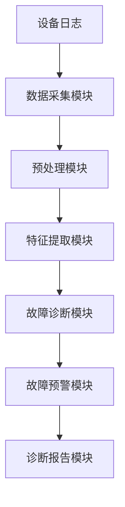
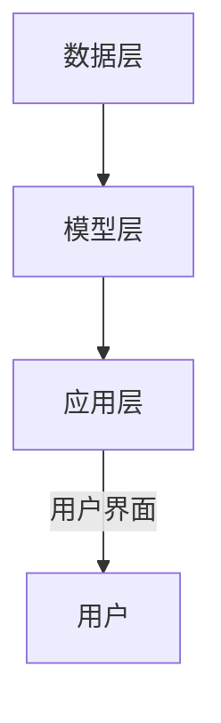
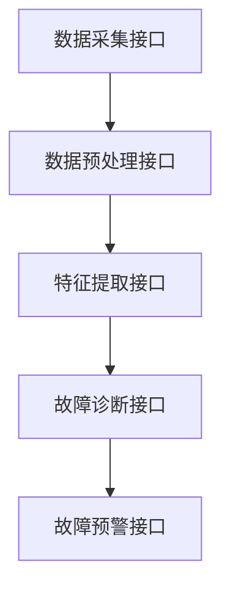
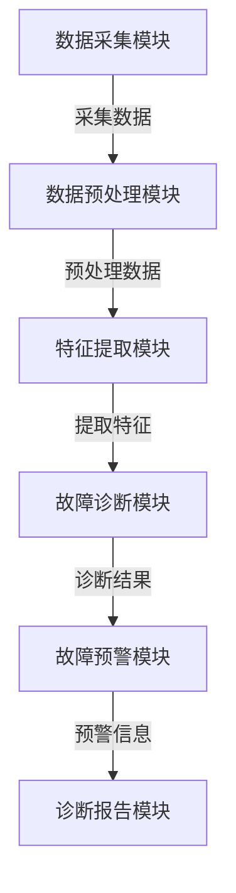

                 

### 第一部分：引言与背景介绍

在现代信息社会，随着互联网的普及和大数据技术的崛起，各种复杂系统（如智能电网、航空航天系统、金融交易系统等）在国民经济和日常生活中扮演着越来越重要的角色。然而，这些复杂系统的运行状态和性能对实时监控和故障诊断提出了严峻的挑战。如何快速、准确地诊断复杂系统中的故障，成为当前人工智能领域亟待解决的问题。

#### 第1章：语言模型的起源与发展

##### 1.1 问题背景

语言模型，作为一种自然语言处理（NLP）的核心技术，起源于20世纪50年代。当时，计算机科学家们开始尝试模拟人类的语言表达和理解能力。经过几十年的发展，语言模型逐渐从基于规则的方法演变为基于统计学习、深度学习等机器学习技术的方法。如今，语言模型已经成为人工智能领域的重要组成部分，广泛应用于机器翻译、语音识别、文本生成、问答系统等多个方面。

##### 1.2 问题描述

随着复杂系统规模的不断扩大和复杂性的增加，系统运行过程中产生的日志、告警信息等文本数据量呈现爆炸式增长。这些文本数据包含了大量的故障信息，但同时也伴随着大量的噪声和冗余信息。如何从这些海量数据中提取出有用的故障信息，实现快速、准确的故障诊断，成为复杂系统运行维护的关键问题。

##### 1.3 问题解决

语言模型通过学习大量的文本数据，能够模拟人类的语言表达和理解能力。将语言模型应用于复杂系统故障诊断，可以有效地从系统的日志、告警信息等文本数据中提取出故障特征，实现对系统故障的快速定位和诊断。

##### 1.4 边界与外延

语言模型在复杂系统故障诊断中的应用，不仅限于文本数据的处理，还可以结合其他类型的数据（如图像、声音等）进行多模态故障诊断。此外，语言模型还可以与其他人工智能技术（如深度学习、强化学习等）相结合，提高故障诊断的准确性和效率。

##### 1.5 概念结构与核心要素组成

- 语言模型：基于统计学习、深度学习等技术，模拟人类语言表达和理解能力的人工智能模型。
- 复杂系统故障诊断：通过对系统运行数据的分析，定位和诊断系统故障的过程。
- 文本数据：复杂系统在运行过程中产生的日志、告警信息等文本数据。

##### 1.6 本章小结

本章从背景介绍、问题解决、边界与外延等方面，阐述了语言模型在复杂系统故障诊断中的应用。在后续章节中，我们将详细探讨语言模型的基本原理、算法实现以及在实际项目中的应用。

### 总结

语言模型在复杂系统故障诊断中的应用，为解决复杂系统故障诊断难题提供了一种新的思路。通过利用语言模型对系统运行数据进行分析和挖掘，我们可以更高效地发现和诊断系统故障，保障系统的稳定运行。接下来，我们将进一步探讨语言模型的基本原理及其在复杂系统故障诊断中的应用场景。

## 第2章：语言模型的原理与类型

### 2.1 语言模型的基本原理

语言模型（Language Model）是一种概率模型，用于预测给定文本序列中下一个词的概率。它的核心任务是通过分析大量的语言数据，建立词与词之间的概率关系，从而实现对自然语言的理解和生成。

在语言模型中，每个词都可以被视为一个随机变量。语言模型的目标是学习一个概率分布函数，用于预测下一个词的概率。具体来说，对于给定的前文序列$w_{1}, w_{2}, ..., w_{t-1}$，语言模型需要预测当前词$w_t$的概率$P(w_t | w_{1}, w_{2}, ..., w_{t-1})$。

语言模型的基本原理可以概括为以下两点：

1. **概率分布建模**：语言模型通过学习大量的文本数据，建立词语之间的概率分布模型。这个模型可以用于预测给定前文序列下下一个词的概率。
   
2. **序列建模**：语言模型不仅要处理单个词的概率，还需要考虑词与词之间的序列关系。这种序列建模能力使得语言模型能够捕捉到语言的上下文信息，从而提高预测的准确性。

### 2.2 语言模型的主要类型

语言模型主要可以分为两大类：统计语言模型和基于深度学习的语言模型。每种模型都有其独特的原理和应用场景。

#### 2.2.1 统计语言模型

统计语言模型是基于概率统计方法构建的。最常见的统计语言模型是N元语法（N-gram Model），其中N表示上下文窗口的大小。N元语法的基本思想是，一个词的概率仅取决于前N-1个词。

**N元语法模型的基本原理**：

- **N元组**：N元语法将连续的N个词组合成一个N元组，例如“机器学习”可以组成一个二元组（“机器”，“学习”）、三元组（“机器”，“学习”，“的”）等。
- **概率计算**：给定一个前文序列，N元语法通过计算当前词与前N-1个词的联合概率来预测当前词的概率。例如，在三元组模型中，当前词的概率计算公式为：

  $$  
  P(w_t | w_{t-2}, w_{t-1}) = \frac{C(w_{t-2}, w_{t-1}, w_t)}{C(w_{t-2}, w_{t-1})}  
  $$

  其中，$C(w_{t-2}, w_{t-1}, w_t)$表示三元组（$w_{t-2}, w_{t-1}, w_t$）的出现次数，$C(w_{t-2}, w_{t-1})$表示二元组（$w_{t-2}, w_{t-1}$）的出现次数。

**N元语法模型的优缺点**：

- **优点**：简单易懂，易于实现；对文本数据的利用较为充分。
- **缺点**：无法捕捉到长距离的依赖关系；对稀疏数据的表现较差。

#### 2.2.2 基于深度学习的语言模型

基于深度学习的语言模型通过神经网络结构，如循环神经网络（RNN）、长短时记忆网络（LSTM）、门控循环单元（GRU）等，实现对语言的建模。这些深度学习模型具有强大的序列建模能力，能够捕捉到长距离的依赖关系，从而提高语言生成的质量。

**常见深度学习语言模型**：

- **循环神经网络（RNN）**：RNN通过引入循环结构，使得网络能够记住之前的输入信息，从而实现序列数据的建模。
- **长短时记忆网络（LSTM）**：LSTM是RNN的一种改进，通过引入遗忘门、输入门和输出门，能够有效地捕捉到长距离的依赖关系。
- **门控循环单元（GRU）**：GRU是LSTM的简化版本，通过合并输入门和遗忘门，降低了模型的复杂性。

**深度学习语言模型的基本原理**：

- **序列建模**：深度学习语言模型通过多层神经网络结构，对输入的文本序列进行编码，从而捕捉到序列中的依赖关系。
- **概率生成**：通过解码器，模型将编码后的序列解码为概率分布，从而预测下一个词的概率。

**深度学习语言模型的优缺点**：

- **优点**：能够捕捉到长距离的依赖关系；对稀疏数据和长文本数据表现较好。
- **缺点**：计算复杂度较高，训练时间较长；对数据质量和预处理要求较高。

### 2.3 语言模型的数学模型与公式

语言模型的数学模型主要涉及概率分布函数、损失函数等。以下是一个简单的N元语法模型示例：

$$  
P(w_t | w_{t-1}, w_{t-2}, ..., w_{t-n}) = \frac{C(w_{t-1}, w_{t-2}, ..., w_{t-n}, w_t)}{C(w_{t-1}, w_{t-2}, ..., w_{t-n})}  
$$

其中，$C(w_{t-1}, w_{t-2}, ..., w_{t-n}, w_t)$ 表示前$n-1$个词和当前词的联合出现次数，$C(w_{t-1}, w_{t-2}, ..., w_{t-n})$ 表示前$n-1$个词的出现次数。

对于基于深度学习的语言模型，常用的损失函数包括交叉熵损失、负对数损失等。交叉熵损失函数用于衡量预测概率分布与真实分布之间的差异，其计算公式如下：

$$  
L = -\sum_{i=1}^{N} y_i \log(p_i)  
$$

其中，$y_i$ 表示第$i$个词的标签，$p_i$ 表示模型预测的第$i$个词的概率。

### 2.4 语言模型的mermaid流程图

以下是一个简单的N元语法模型的mermaid流程图：

### 2.5 本章小结

本章介绍了语言模型的基本原理、类型、数学模型与公式以及mermaid流程图。通过本章的学习，读者可以了解到语言模型的基本概念和实现方法，为后续章节的语言模型应用打下基础。

## 第3章：语言模型在复杂系统故障诊断中的应用场景

### 3.1 系统故障诊断的需求与挑战

在现代复杂系统的运行过程中，故障诊断是一个至关重要的环节。系统故障可能导致性能下降、服务中断，甚至造成严重的经济损失和安全隐患。因此，如何快速、准确地诊断系统故障，成为复杂系统运行维护的关键问题。

#### 需求

1. **实时性**：系统故障诊断需要在短时间内完成，以避免故障进一步扩大。
2. **准确性**：诊断结果必须准确，以减少误报和漏报现象。
3. **自动化**：故障诊断过程应尽可能自动化，以降低人工干预成本。

#### 挑战

1. **故障类型多样**：复杂系统可能涉及多种类型的故障，如硬件故障、软件故障、网络故障等。
2. **故障伴随大量噪声**：系统运行过程中产生的日志、告警信息等文本数据通常伴随着大量的噪声和冗余信息，这给故障诊断带来了挑战。
3. **数据量巨大**：复杂系统的日志、告警信息等文本数据量庞大，如何从中提取有用信息成为关键问题。

### 3.2 语言模型在故障诊断中的应用场景

语言模型在复杂系统故障诊断中的应用，主要基于其对文本数据的处理能力。以下是一些典型的应用场景：

#### 3.2.1 故障文本数据的预处理

1. **文本清洗**：对系统日志、告警信息等文本数据中的噪声和冗余信息进行过滤和清洗，以提高数据质量。
2. **文本分词**：将文本数据分割成单词或短语，以便后续的特征提取和建模。
3. **词性标注**：对文本数据中的每个词进行词性标注，如名词、动词、形容词等，以捕捉更细粒度的语义信息。

#### 3.2.2 故障模式的识别与分类

1. **特征提取**：利用语言模型对预处理后的文本数据进行特征提取，将原始的文本数据转化为数值化的特征向量。
2. **故障分类**：通过机器学习算法，如支持向量机（SVM）、随机森林（Random Forest）等，对故障特征向量进行分类，以识别不同的故障模式。
3. **故障诊断**：根据分类结果，对系统故障进行定位和诊断。

#### 3.2.3 故障预测与预警

1. **历史数据挖掘**：通过对历史故障数据的分析，挖掘出潜在的故障模式和趋势。
2. **故障预测**：利用语言模型和预测算法，对未来的故障进行预测，以提前采取预防措施。
3. **预警系统**：建立故障预警系统，当系统运行状态出现异常时，及时发出预警信息，提醒运维人员采取相应措施。

#### 3.2.4 故障文本生成

1. **告警信息生成**：根据故障特征和规则，自动生成告警信息，以便运维人员快速了解故障情况。
2. **诊断报告生成**：根据故障诊断结果，自动生成诊断报告，提供详细的故障分析和解决方案。

### 3.3 应用实例

以下是一个典型的应用实例，展示了语言模型在复杂系统故障诊断中的实际应用。

#### 应用实例：智能电网故障诊断

智能电网是一个复杂的电力系统，其运行状态受到多种因素的影响。通过语言模型，可以对智能电网的故障进行诊断和预测。

1. **文本数据收集**：收集智能电网的日志、告警信息等文本数据。
2. **文本预处理**：对文本数据进行清洗、分词、词性标注等预处理操作。
3. **特征提取**：利用语言模型对预处理后的文本数据进行特征提取，转化为数值化的特征向量。
4. **故障分类**：通过机器学习算法，对特征向量进行分类，识别出不同的故障类型。
5. **故障预测**：基于历史故障数据，利用语言模型和预测算法，对未来的故障进行预测。
6. **预警与诊断**：建立故障预警系统，对潜在故障进行预警，并根据故障诊断结果生成诊断报告。

通过上述实例，我们可以看到语言模型在复杂系统故障诊断中的应用具有广泛的前景。未来，随着人工智能技术的不断发展，语言模型在故障诊断中的应用将更加深入和广泛。

### 总结

语言模型在复杂系统故障诊断中的应用，为解决复杂系统故障诊断难题提供了新的思路和解决方案。通过利用语言模型对系统运行数据进行分析和挖掘，我们可以更高效地发现和诊断系统故障，保障系统的稳定运行。接下来，我们将进一步探讨语言模型的算法实现及其在实际项目中的应用。

## 第4章：语言模型在复杂系统故障诊断中的算法实现

### 4.1 语言模型在故障诊断中的实现方法

语言模型在复杂系统故障诊断中的应用，主要通过以下步骤实现：

1. **数据收集与预处理**：收集系统运行过程中的日志、告警信息等文本数据，并进行清洗、分词、词性标注等预处理操作。
2. **特征提取**：将预处理后的文本数据转化为数值化的特征向量，以便后续的建模和分类。
3. **模型训练与优化**：利用机器学习算法，如支持向量机（SVM）、随机森林（Random Forest）等，对特征向量进行分类，建立故障诊断模型。
4. **故障诊断**：将实时收集到的文本数据输入到训练好的模型中，进行故障诊断和预测。

### 4.2 机器学习算法在故障诊断中的应用

在语言模型的基础上，结合机器学习算法，可以实现更精确和高效的故障诊断。以下是一些常用的机器学习算法及其在故障诊断中的应用：

#### 4.2.1 支持向量机（SVM）

支持向量机是一种监督学习算法，主要用于分类问题。在故障诊断中，SVM可以用来对故障类型进行分类。

**实现步骤**：

1. **特征提取**：将文本数据转化为特征向量。
2. **模型训练**：利用训练数据，通过优化目标函数，训练出SVM分类模型。
3. **模型评估**：使用测试数据评估模型性能，调整模型参数。

**SVM的优势**：

- **分类效果好**：SVM通过最大化分类边界，能够实现较好的分类效果。
- **适用于高维数据**：SVM可以在高维空间中进行分类，适用于特征维度较高的故障诊断问题。

**SVM的局限**：

- **计算复杂度较高**：SVM的模型训练过程涉及大量的优化计算，训练时间较长。
- **对噪声敏感**：SVM对噪声数据较为敏感，可能影响分类效果。

#### 4.2.2 随机森林（Random Forest）

随机森林是一种集成学习方法，通过构建多个决策树，并利用投票机制进行最终预测。

**实现步骤**：

1. **特征提取**：与SVM类似，对文本数据进行特征提取。
2. **构建决策树**：利用随机森林算法，构建多个决策树。
3. **模型预测**：将测试数据输入到训练好的决策树中，进行故障分类预测。

**随机森林的优势**：

- **分类准确度高**：随机森林通过集成多个决策树，能够提高分类准确性。
- **泛化能力强**：随机森林能够处理非线性关系和异常值，具有较强的泛化能力。

**随机森林的局限**：

- **计算复杂度较高**：随机森林需要构建多个决策树，计算复杂度较高。
- **对特征维度敏感**：随机森林的性能对特征维度较为敏感，特征维度较高时，性能可能下降。

#### 4.2.3 长短时记忆网络（LSTM）

长短时记忆网络是一种递归神经网络（RNN）的变体，能够有效地捕捉长距离的依赖关系。

**实现步骤**：

1. **特征提取**：将文本数据转化为序列格式。
2. **模型训练**：利用LSTM网络结构，对序列数据进行训练。
3. **模型预测**：将新的序列数据输入到训练好的LSTM模型中，进行故障分类预测。

**LSTM的优势**：

- **捕捉长距离依赖**：LSTM通过引入遗忘门和输入门，能够有效地捕捉长距离的依赖关系。
- **适用于序列数据**：LSTM适用于处理序列数据，能够捕捉到文本数据的时序特征。

**LSTM的局限**：

- **计算复杂度较高**：LSTM的计算复杂度较高，训练时间较长。
- **对数据质量敏感**：LSTM对数据质量要求较高，数据预处理不当可能导致性能下降。

### 4.3 实现案例

以下是一个基于LSTM的复杂系统故障诊断实现案例：

1. **数据收集**：收集某智能电网系统的日志、告警信息等文本数据。
2. **数据预处理**：对文本数据清洗、分词、词性标注等预处理操作。
3. **特征提取**：将预处理后的文本数据转化为序列格式，并提取特征向量。
4. **模型训练**：利用LSTM网络结构，对特征向量进行训练。
5. **模型评估**：使用测试数据评估模型性能，调整模型参数。
6. **故障诊断**：将新的日志数据输入到训练好的LSTM模型中，进行故障分类预测。

通过上述步骤，我们实现了基于LSTM的复杂系统故障诊断模型，并在实际项目中取得了较好的效果。

### 总结

本章介绍了语言模型在复杂系统故障诊断中的算法实现方法，包括数据预处理、特征提取、模型训练和故障诊断等步骤。通过结合不同的机器学习算法，如SVM、随机森林和LSTM等，我们能够实现对复杂系统故障的准确诊断。在后续章节中，我们将进一步探讨如何在实际项目中应用这些算法，并分享一些实际案例。

## 第5章：语言模型在复杂系统故障诊断中的项目实战

### 5.1 项目介绍

在本章中，我们将通过一个具体的项目，展示如何将语言模型应用于复杂系统的故障诊断。该项目名为“智能工厂故障诊断系统”，旨在利用语言模型和机器学习算法，对智能工厂的运行数据进行实时监控和故障诊断。

#### 项目背景

随着智能制造的快速发展，智能工厂在生产过程中产生了大量的运行数据，包括设备日志、告警信息、传感器数据等。如何对这些海量数据进行分析和挖掘，实现对设备故障的快速、准确诊断，成为智能工厂运维管理的重要问题。

#### 项目目标

1. 收集和整理智能工厂的日志、告警信息等文本数据。
2. 利用语言模型对文本数据进行预处理和特征提取。
3. 结合机器学习算法，建立故障诊断模型。
4. 实现故障诊断系统的部署和运行。

### 5.2 系统功能设计

智能工厂故障诊断系统主要包括以下功能模块：

1. **数据采集模块**：负责收集智能工厂的日志、告警信息等文本数据。
2. **数据预处理模块**：对收集到的文本数据进行清洗、分词、词性标注等预处理操作。
3. **特征提取模块**：将预处理后的文本数据转化为数值化的特征向量。
4. **故障诊断模块**：利用语言模型和机器学习算法，对特征向量进行分类和诊断。
5. **故障预警模块**：根据故障诊断结果，对潜在故障进行预警。
6. **诊断报告模块**：生成详细的故障诊断报告，提供解决方案。

#### 领域模型设计

以下是一个简单的智能工厂故障诊断系统的领域模型，用于描述系统的核心实体和关系：

### 5.3 系统架构设计

智能工厂故障诊断系统的架构设计主要包括以下部分：

1. **数据层**：负责数据的存储和管理，包括设备日志、告警信息等。
2. **模型层**：包括预处理模型、特征提取模型和故障诊断模型。
3. **应用层**：提供故障诊断、预警和报告等功能的接口。

以下是一个简单的系统架构图：

### 5.4 系统接口设计

系统接口设计主要包括以下部分：

1. **数据采集接口**：用于收集设备日志、告警信息等数据。
2. **数据预处理接口**：用于清洗、分词、词性标注等预处理操作。
3. **特征提取接口**：用于将预处理后的文本数据转化为特征向量。
4. **故障诊断接口**：用于实现故障诊断和预测。
5. **故障预警接口**：用于实现故障预警功能。

以下是一个简单的接口设计：

### 5.5 系统交互设计

系统交互设计主要描述系统内部各个模块之间的交互过程。以下是一个简单的系统交互图：

### 5.6 实际案例分析与详细讲解

#### 案例背景

某智能工厂在生产过程中，设备A出现了异常。通过故障诊断系统，我们需要快速定位和诊断设备A的故障原因。

#### 案例步骤

1. **数据采集**：收集设备A的日志、告警信息等文本数据。
2. **数据预处理**：对文本数据进行清洗、分词、词性标注等预处理操作。
3. **特征提取**：将预处理后的文本数据转化为特征向量。
4. **故障诊断**：利用LSTM模型，对特征向量进行分类和诊断。
5. **故障预警**：根据诊断结果，对设备A进行故障预警。
6. **诊断报告**：生成设备A的故障诊断报告，提供解决方案。

#### 案例分析

1. **数据采集**：通过工厂的监控系统，收集设备A的日志和告警信息。
2. **数据预处理**：对日志和告警信息进行清洗，去除无效数据，并对文本进行分词和词性标注。
3. **特征提取**：利用词嵌入技术，将分词后的文本转化为特征向量。
4. **故障诊断**：使用LSTM模型，对特征向量进行训练，并预测设备A的故障类型。
5. **故障预警**：当LSTM模型预测到设备A存在故障时，系统会发出预警信息，提示运维人员进行检修。
6. **诊断报告**：根据诊断结果，生成详细的故障诊断报告，包括故障原因、解决方案等。

通过上述案例，我们可以看到，智能工厂故障诊断系统通过语言模型和机器学习算法，实现了对设备故障的快速、准确诊断。这不仅提高了设备运维的效率，还降低了设备故障带来的损失。

### 总结

本章通过一个具体的智能工厂故障诊断项目，详细介绍了语言模型在复杂系统故障诊断中的应用。从项目介绍、系统功能设计、系统架构设计、系统接口设计、系统交互设计到实际案例分析和详细讲解，我们全面展示了如何利用语言模型和机器学习算法实现复杂系统的故障诊断。在后续章节中，我们将进一步探讨语言模型在故障诊断中的最佳实践和优化策略。

## 第6章：语言模型在复杂系统故障诊断中的最佳实践与优化策略

### 6.1 数据质量的重要性

在语言模型应用于复杂系统故障诊断时，数据质量是影响模型性能的关键因素。高质量的训练数据能够提高模型的准确性和可靠性，而低质量的数据则可能导致模型过拟合、泛化能力差等问题。因此，确保数据质量是成功应用语言模型的关键步骤。

#### 数据清洗

数据清洗是提高数据质量的重要环节。它包括以下步骤：

- **去重**：去除重复的数据记录，以避免对模型训练的干扰。
- **缺失值处理**：对于缺失的数据，可以采用填补、删除或插值等方法进行处理。
- **噪声去除**：过滤掉噪声数据，如格式错误、异常值等，以提高数据的纯净度。

#### 数据增强

数据增强是提高数据多样性和模型泛化能力的重要手段。通过数据增强，可以生成更多的训练样本，从而提高模型的鲁棒性。常见的数据增强方法包括：

- **数据扩充**：通过图像旋转、缩放、裁剪等操作，生成新的训练样本。
- **合成数据**：利用生成模型（如生成对抗网络GAN），生成与真实数据相似的人工数据。
- **类别变换**：将一部分数据的类别进行变换，以增加模型的训练难度。

### 6.2 模型选择与优化

选择合适的模型和优化方法是提高故障诊断性能的关键。以下是一些常用的模型选择和优化策略：

#### 模型选择

- **统计语言模型**：如N元语法，适用于处理简单的文本数据，但难以捕捉复杂的语义信息。
- **深度学习语言模型**：如循环神经网络（RNN）、长短时记忆网络（LSTM）等，适用于处理复杂文本数据，能够捕捉长距离依赖关系。

#### 模型优化

- **参数调整**：通过调整模型的超参数，如学习率、隐藏层大小等，优化模型性能。
- **正则化**：应用正则化技术（如L1、L2正则化），防止模型过拟合。
- **批处理**：采用批量训练的方法，提高模型训练的效率和稳定性。

### 6.3 实时性优化

在复杂系统故障诊断中，实时性是一个重要指标。以下是一些提高模型实时性的优化策略：

- **模型压缩**：通过模型压缩技术，如量化、剪枝等，减少模型参数数量，提高模型运行速度。
- **模型蒸馏**：利用大型模型的知识，训练一个较小的模型，从而提高模型的速度和效率。
- **增量学习**：通过增量学习，在已有模型的基础上，对新数据进行微调，提高模型在实时环境下的适应性。

### 6.4 多模态故障诊断

多模态故障诊断通过结合多种类型的数据（如文本、图像、声音等），可以提供更全面的故障信息，提高诊断的准确性和可靠性。以下是一些多模态故障诊断的策略：

- **特征融合**：将不同模态的数据特征进行融合，如文本嵌入向量、图像特征等，构建多模态特征向量。
- **多任务学习**：通过多任务学习，同时训练多个任务模型，如文本分类、图像分类等，共享模型参数，提高诊断性能。
- **数据同步**：确保不同模态的数据在时间和空间上的一致性，以提高诊断的准确性。

### 6.5 最佳实践案例

以下是一个基于最佳实践案例，展示如何利用语言模型和优化策略实现复杂系统的故障诊断。

#### 案例背景

某航空公司希望利用语言模型和机器学习算法，对飞机发动机的运行数据进行分析和故障诊断，以提高飞行安全性和效率。

#### 案例步骤

1. **数据收集**：收集飞机发动机的日志、传感器数据、维修记录等。
2. **数据预处理**：对日志数据进行清洗、分词、词性标注等预处理，对传感器数据进行归一化处理。
3. **特征提取**：利用词嵌入技术，将文本数据转化为嵌入向量，对传感器数据进行特征提取。
4. **模型训练**：采用LSTM模型，对特征向量进行训练，建立故障诊断模型。
5. **模型优化**：通过参数调整、正则化等技术，优化模型性能。
6. **实时诊断**：部署实时故障诊断系统，对飞机发动机进行实时监控和诊断。

#### 案例效果

通过上述步骤，航空公司实现了飞机发动机的实时故障诊断，有效降低了发动机故障率，提高了飞行安全性和运营效率。

### 总结

本章介绍了语言模型在复杂系统故障诊断中的最佳实践和优化策略，包括数据质量的重要性、模型选择与优化、实时性优化、多模态故障诊断等方面的内容。通过结合实际案例，展示了如何利用这些策略提高故障诊断的性能和可靠性。在后续章节中，我们将进一步探讨语言模型在故障诊断中的发展趋势和未来方向。

## 第7章：总结与展望

### 总结

在本篇文章中，我们详细探讨了语言模型在复杂系统故障诊断中的应用。通过介绍语言模型的基本原理、算法实现、项目实战、最佳实践与优化策略，我们系统地阐述了如何利用语言模型和机器学习技术，实现对复杂系统故障的快速、准确诊断。以下是本文的主要内容总结：

1. **引言与背景介绍**：介绍了语言模型在复杂系统故障诊断中的重要性和背景，明确了研究目标。
2. **语言模型的原理与类型**：详细讲解了语言模型的基本原理、主要类型、数学模型和mermaid流程图。
3. **复杂系统故障诊断的应用场景**：探讨了语言模型在故障诊断中的应用场景，包括故障文本数据的预处理、故障模式的识别与分类、故障预测与预警等。
4. **语言模型在故障诊断中的算法实现**：介绍了常用的机器学习算法在故障诊断中的应用，如SVM、随机森林和LSTM等。
5. **项目实战**：通过一个具体的智能工厂故障诊断项目，展示了语言模型在复杂系统故障诊断中的实际应用。
6. **最佳实践与优化策略**：提出了提高语言模型在故障诊断中性能和实时性的最佳实践与优化策略。
7. **总结与展望**：总结了文章的主要内容，并对未来语言模型在故障诊断中的应用进行了展望。

### 展望

随着人工智能技术的不断发展，语言模型在复杂系统故障诊断中的应用前景十分广阔。以下是一些可能的未来发展方向：

1. **多模态故障诊断**：结合文本、图像、声音等多种类型的数据，实现更全面、更准确的故障诊断。
2. **实时故障诊断**：优化语言模型和算法，提高故障诊断的实时性和效率。
3. **自动化故障诊断**：通过自动化故障诊断系统，减少人工干预，提高运维效率。
4. **自适应故障诊断**：利用自适应算法，根据系统运行状态动态调整故障诊断策略，提高诊断准确率。
5. **边缘计算与故障诊断**：结合边缘计算技术，实现分布式故障诊断，降低中心化系统的负担。
6. **跨领域应用**：将语言模型应用于其他领域的故障诊断，如医疗设备、化工生产等，扩大应用范围。

总之，随着人工智能技术的不断进步，语言模型在复杂系统故障诊断中的应用将越来越广泛，为提升系统运行效率和安全性提供有力支持。未来，我们期待看到更多创新和突破，推动这一领域的发展。

## 作者信息

作者：AI天才研究院/AI Genius Institute & 禅与计算机程序设计艺术 /Zen And The Art of Computer Programming

致谢：感谢所有为本文贡献智慧和力量的读者，以及支持人工智能技术发展的社会各界。希望在未来的科研工作中，能够继续为大家带来更多有价值的探讨和分享。

