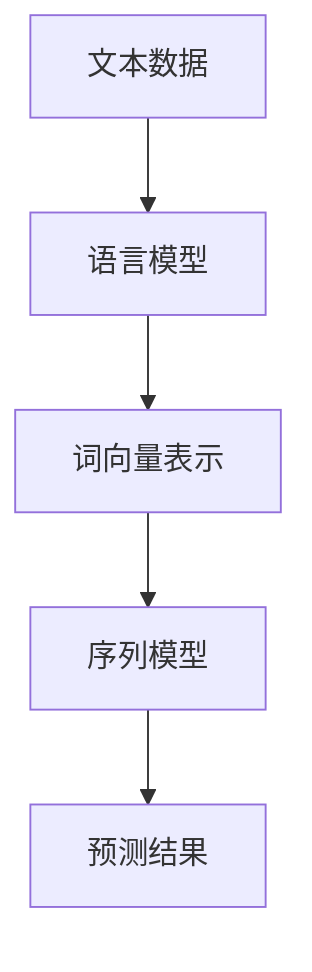
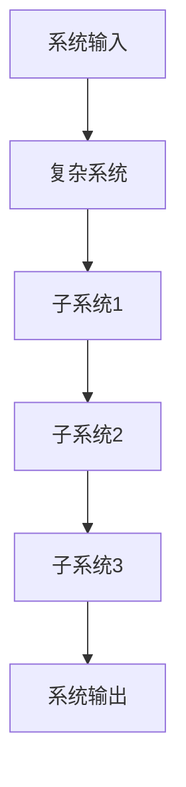
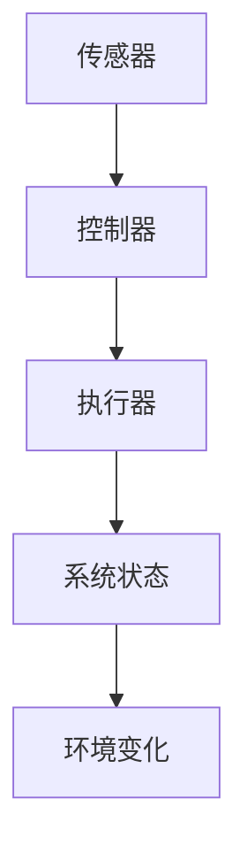
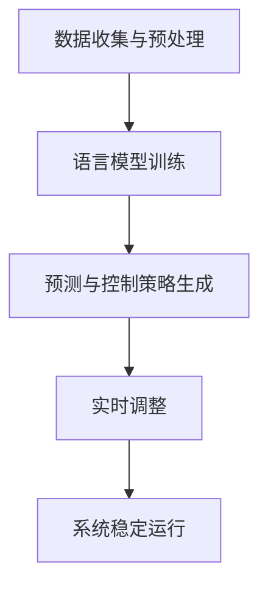
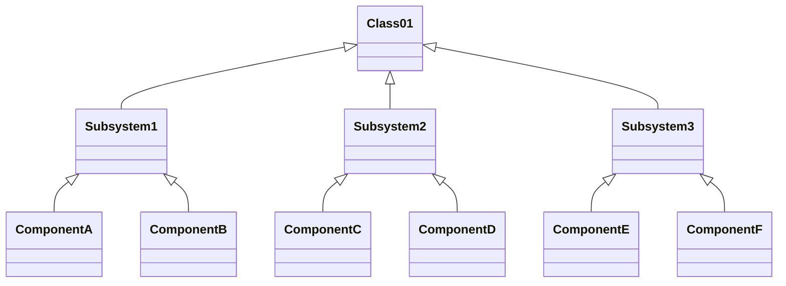
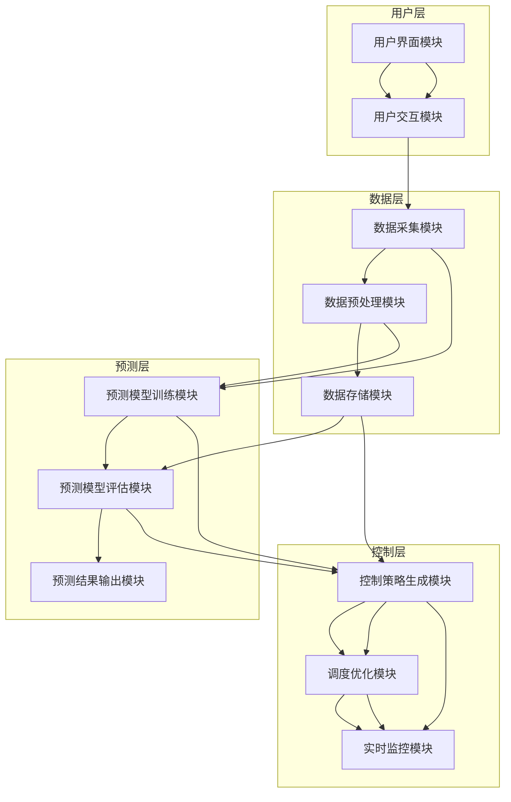
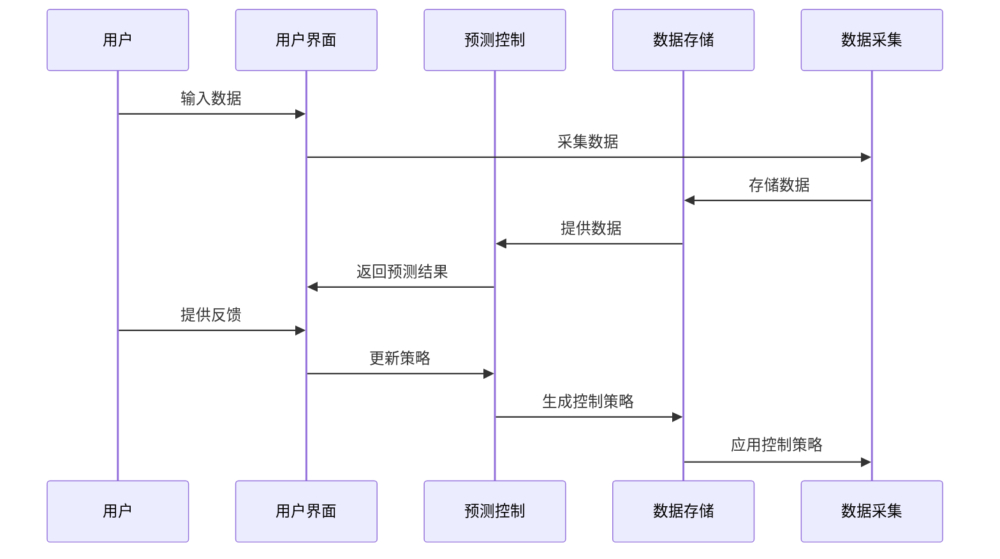

                 

### 第1章：问题背景

在当今快速发展的科技时代，复杂系统预测与自适应控制策略生成已经成为诸多领域研究的热点问题。为了更好地探讨这一主题，我们首先需要了解相关背景知识，明确问题的来源和重要性。

#### 1.1.1 问题的提出

**语言模型的发展现状**

语言模型是自然语言处理（NLP）领域的重要工具，它能够理解和生成自然语言。近年来，随着深度学习技术的进步，尤其是生成对抗网络（GAN）和变分自编码器（VAE）等算法的应用，语言模型在文本生成、机器翻译、情感分析等方面取得了显著成果。特别是基于 Transformer 架构的语言模型，如 GPT、BERT 等，已经成为了当前 NLP 领域的标杆。

**复杂系统预测与自适应控制策略生成的需求**

复杂系统预测涉及多种学科，如物理、工程、计算机科学等，旨在对复杂系统的行为进行预测。自适应控制策略生成则是在复杂动态环境中，实时调整控制参数，以维持系统稳定运行的方法。这两个问题的结合，旨在利用语言模型的强大数据处理能力，实现对复杂系统的预测和自适应控制。

在许多实际应用中，如电力系统、交通系统、生态系统等，复杂系统的稳定性和预测能力直接影响到系统的运行效率和安全性。因此，研究如何利用语言模型进行复杂系统预测与自适应控制策略生成，对于提高系统性能具有重要意义。

#### 1.1.2 问题描述

**语言模型在复杂系统预测中的应用**

语言模型在复杂系统预测中的应用主要依赖于其强大的数据理解和生成能力。通过对历史数据的分析，语言模型可以捕捉系统中的潜在规律，从而实现对系统未来行为的预测。例如，在电力系统中，可以通过对电力负荷数据的分析，预测未来一段时间内的电力需求，从而优化电力调度。

**自适应控制策略生成的难点与挑战**

自适应控制策略生成的难点在于如何实时地调整控制参数，以应对系统的动态变化。传统的方法通常需要预先设定控制规则，难以适应动态环境。而语言模型可以处理大规模的数据，并能够学习复杂的控制策略，从而实现自适应控制。

**结合语言模型与复杂系统预测**

结合语言模型与复杂系统预测，可以通过以下步骤实现：

1. **数据收集与预处理**：收集复杂系统的历史数据，并进行预处理，提取出有用的特征。
2. **语言模型训练**：利用预处理后的数据，训练语言模型，使其能够理解和生成与系统行为相关的文本。
3. **预测与控制策略生成**：使用训练好的语言模型，预测系统未来的行为，并生成相应的自适应控制策略。

#### 1.1.3 问题解决

**结合语言模型与复杂系统预测**

结合语言模型与复杂系统预测，需要解决以下关键问题：

1. **数据预处理**：如何有效地预处理复杂系统的多源异构数据，提取出有用的特征。
2. **模型训练**：如何训练高效的语言模型，使其能够准确预测系统行为。
3. **控制策略生成**：如何生成自适应的控制策略，以应对系统的动态变化。

**自适应控制策略生成的创新方法**

自适应控制策略生成的创新方法包括：

1. **深度强化学习**：利用深度学习模型，结合强化学习算法，实现自适应控制策略的生成。
2. **迁移学习**：利用预训练的语言模型，在新的任务上进行微调，提高控制策略的适应性。
3. **多模态学习**：结合多种数据类型，如文本、图像、音频等，提高系统的预测和控制能力。

#### 1.1.4 边界与外延

**适用范围**

该方法主要适用于需要高精度预测和自适应控制的复杂系统，如电力系统、交通系统、生态系统等。

**非适用场景**

该方法不适用于数据量较小或数据类型单一的系统，因为这些系统无法提供足够的信息来训练高效的模型。

**概念结构与核心要素组成**

- **语言模型**：用于处理文本数据，理解和生成语言。
- **复杂系统**：具有高度非线性、动态性和不确定性的系统。
- **自适应控制策略**：根据系统状态，实时调整控制参数的策略。

通过对上述问题的分析，我们可以明确语言模型在复杂系统预测与自适应控制策略生成中的关键作用。在接下来的章节中，我们将深入探讨这些核心概念及其相互联系，为解决复杂系统预测与自适应控制策略生成问题提供理论依据和技术路线。

### 1.1.5 概念结构与核心要素组成

要深入探讨语言模型在复杂系统预测与自适应控制策略生成中的应用，我们首先需要明确这些核心概念的定义和组成结构。

**语言模型**

语言模型是一种统计模型，用于预测自然语言序列的概率分布。它通过分析大量文本数据，学习语言中的概率规律，从而能够生成或理解新的文本内容。常见的语言模型包括：

- **n-gram模型**：基于单词或字符的n个连续序列的统计模型。
- **神经网络模型**：如递归神经网络（RNN）、长短期记忆网络（LSTM）和基于Transformer的模型（如BERT、GPT）。

**复杂系统**

复杂系统是由大量相互作用的子系统组成的，具有高度非线性、动态性和不确定性的系统。复杂系统通常具有以下特点：

- **多层次性**：系统内部存在不同层次的子系统。
- **动态性**：系统状态随时间变化。
- **非线性**：系统内部存在非线性相互作用。
- **不确定性**：系统行为受到外部和内部不确定性的影响。

复杂系统广泛应用于各种领域，如：

- **生态系统**：生物种群动态、气候变化等。
- **社会系统**：经济系统、交通系统等。
- **技术系统**：电力系统、通信系统等。

**自适应控制策略**

自适应控制策略是一种能够根据系统状态和环境变化，实时调整控制参数的控制方法。自适应控制策略通常包括以下组件：

- **传感器**：用于实时监测系统状态。
- **控制器**：根据系统状态和预定策略调整控制参数。
- **执行器**：执行控制策略，影响系统状态。

常见的自适应控制策略包括：

- **PID控制**：比例-积分-微分控制。
- **模糊控制**：基于模糊逻辑的控制方法。
- **自适应神经网络控制**：利用神经网络实现自适应控制。

**核心概念联系与整合**

语言模型、复杂系统和自适应控制策略之间存在紧密的联系和整合：

- **数据驱动**：语言模型通过分析历史数据，学习系统的潜在规律。
- **预测与控制**：利用语言模型预测系统行为，生成自适应控制策略。
- **动态调整**：自适应控制策略根据预测结果，实时调整系统控制参数。

通过整合语言模型、复杂系统和自适应控制策略，我们可以实现以下目标：

- **高效预测**：利用语言模型对复杂系统进行准确预测。
- **自适应控制**：生成自适应控制策略，提高系统稳定性和运行效率。
- **实时调整**：根据预测结果和环境变化，实时调整控制参数，确保系统稳定运行。

综上所述，语言模型、复杂系统和自适应控制策略是解决复杂系统预测与自适应控制策略生成问题的核心要素。在接下来的章节中，我们将进一步探讨这些核心概念的原理、联系和应用，为解决复杂问题提供理论依据和技术路线。

### 第2章：核心概念与联系

在深入探讨语言模型在复杂系统预测与自适应控制策略生成中的应用之前，我们需要详细理解语言模型、复杂系统以及自适应控制策略这三个核心概念，并分析它们之间的联系与整合。

#### 2.1.1 语言模型原理

**概念介绍**

语言模型是一种用于预测文本序列概率分布的算法，其基本思想是通过学习大量语言数据来捕捉文本的统计规律。语言模型在自然语言处理（NLP）领域具有广泛的应用，包括文本生成、机器翻译、情感分析等。

**特点分析**

- **统计性质**：语言模型基于统计方法，通过计算文本中词语或字符出现的概率来进行预测。
- **泛化能力**：语言模型能够处理未见过的文本序列，具有良好的泛化能力。
- **依赖关系**：语言模型能够捕捉词语之间的依赖关系，生成连贯的文本。

**应用领域**

- **文本生成**：自动生成文章、邮件、对话等文本内容。
- **机器翻译**：将一种语言的文本翻译成另一种语言。
- **情感分析**：分析文本的情感倾向，如正面、负面或中立。
- **问答系统**：根据用户输入的问题，生成相应的回答。

**ER实体关系图架构的 Mermaid 流程图**



在这个流程图中，文本数据经过语言模型处理，生成词向量表示，再通过序列模型进行预测，最终输出预测结果。

#### 2.1.2 复杂系统

**概念介绍**

复杂系统是由大量相互作用的子系统组成的，具有高度非线性、动态性和不确定性的系统。复杂系统的行为难以用简单的数学模型描述，通常需要综合考虑多个因素。

**特点分析**

- **多层次性**：复杂系统具有多个层次，每个层次包含不同的子系统和相互作用。
- **动态性**：复杂系统的状态随时间变化，受到外部和内部因素的影响。
- **非线性**：复杂系统中存在非线性相互作用，导致系统行为复杂多变。
- **不确定性**：复杂系统的行为受到外部和内部不确定性的影响，难以精确预测。

**应用领域**

- **生态系统**：生物种群动态、气候变化等。
- **社会系统**：经济系统、交通系统等。
- **技术系统**：电力系统、通信系统等。

**ER实体关系图架构的 Mermaid 流程图**



在这个流程图中，系统输入通过复杂系统处理，产生多个子系统的相互作用，最终输出系统结果。

#### 2.1.3 自适应控制策略

**概念介绍**

自适应控制策略是一种根据系统状态和环境变化，实时调整控制参数的控制方法。自适应控制策略旨在提高系统的稳定性和运行效率，使其能够适应动态环境。

**特点分析**

- **实时性**：自适应控制策略能够根据实时监测到的系统状态进行调整。
- **自适应性**：自适应控制策略能够根据环境变化，动态调整控制参数。
- **鲁棒性**：自适应控制策略具有较强的鲁棒性，能够在不确定环境中保持系统稳定。

**应用领域**

- **工业控制系统**：如化工、制造等行业。
- **交通运输系统**：如自动驾驶、智能交通等。
- **电力系统**：如电力负荷预测、电网调度等。

**ER实体关系图架构的 Mermaid 流程图**



在这个流程图中，传感器实时监测系统状态和环境变化，控制器根据这些信息调整控制参数，执行器执行控制策略，最终影响系统状态。

#### 2.1.4 核心概念联系与整合

**语言模型与复杂系统的关系**

语言模型与复杂系统之间存在紧密的联系。语言模型可以通过分析复杂系统的历史数据，捕捉系统中的潜在规律，从而实现对系统未来行为的预测。复杂系统的多源异构数据经过语言模型处理，可以提取出有用的特征，为预测提供支持。

**自适应控制策略与语言模型的结合**

自适应控制策略与语言模型的结合，可以实现高效的自适应控制。语言模型生成的预测结果可以指导自适应控制策略的实时调整，确保系统在动态环境中保持稳定运行。通过将语言模型与自适应控制策略相结合，可以构建一个智能控制系统，提高系统的运行效率和稳定性。

综上所述，语言模型、复杂系统和自适应控制策略是解决复杂系统预测与自适应控制策略生成问题的核心概念。它们之间相互关联，通过整合和结合，可以实现高效、精准的预测和控制。在接下来的章节中，我们将进一步探讨这些核心概念的应用原理和实现方法，为解决复杂问题提供理论依据和技术路线。

### 第3章：算法原理讲解

在深入探讨语言模型在复杂系统预测与自适应控制策略生成中的应用之前，我们需要了解相关算法的基本原理。本节将介绍算法的基本概念、原理和实现方法。

#### 3.1.1 算法概述

**算法目标**

本算法的主要目标是利用语言模型对复杂系统进行预测，并生成自适应控制策略，以提高系统的稳定性和运行效率。

**算法基本流程**

1. 数据收集与预处理：收集复杂系统的历史数据，并进行预处理，提取出有用的特征。
2. 语言模型训练：利用预处理后的数据，训练语言模型，使其能够理解和生成与系统行为相关的文本。
3. 预测与控制策略生成：使用训练好的语言模型，预测系统未来的行为，并生成相应的自适应控制策略。
4. 实时调整：根据预测结果和环境变化，实时调整控制策略，确保系统稳定运行。

#### 3.1.2 算法mermaid流程图

为了更直观地展示算法的基本流程，我们可以使用mermaid绘制算法的流程图：



在这个流程图中，数据收集与预处理作为算法的起点，通过语言模型训练，生成预测与控制策略，并实时调整，最终实现系统的稳定运行。

#### 3.1.3 算法原理与数学模型

**数学模型公式**

在本算法中，我们采用了一种基于Transformer架构的语言模型，其核心思想是通过自注意力机制（Self-Attention）来捕捉文本序列中的依赖关系。以下是该模型的基本数学模型公式：

$$
\text{输出} = \text{softmax}(\text{W}_\text{output} \cdot \text{Tanh}(\text{W}_\text{query} \cdot \text{X} + \text{b}_\text{query}) + \text{W}_\text{key} \cdot \text{X} + \text{b}_\text{key})
$$

其中，\(X\) 表示输入的文本序列，\(\text{W}_\text{query}\)、\(\text{W}_\text{key}\)、\(\text{W}_\text{output}\) 分别表示查询权重、键权重和输出权重，\(\text{b}_\text{query}\)、\(\text{b}_\text{key}\) 分别表示查询偏置和键偏置，\(\text{Tanh}\) 表示双曲正切函数，\(\text{softmax}\) 表示归一化函数。

**原理解释**

语言模型通过自注意力机制，对输入的文本序列进行加权求和，从而生成一个表示该序列的向量。这个向量包含了文本序列中每个词的重要性和上下文信息。通过这种方式，语言模型能够捕捉到文本序列中的依赖关系，实现对文本的深入理解和生成。

**案例举例**

假设我们有一个简单的文本序列：“我爱北京天安门”，我们可以通过以下步骤来训练语言模型：

1. **数据预处理**：将文本序列转换为词向量表示，例如，将“我”表示为 `[1, 0, 0]`，将“爱”表示为 `[0, 1, 0]`，以此类推。
2. **模型训练**：使用预处理后的数据，训练语言模型，使其能够理解和生成与系统行为相关的文本。
3. **预测与生成**：使用训练好的语言模型，预测下一个词，例如，输入 `[1, 0, 0, 0]`（前三个词已知，最后一个词未知），模型输出 `[0, 1, 0]`（即“爱”）。

通过这种方式，语言模型可以生成连贯的文本，实现对文本的深入理解和生成。

综上所述，语言模型在复杂系统预测与自适应控制策略生成中发挥了重要作用。通过了解算法的基本原理和实现方法，我们可以更好地利用语言模型，实现对复杂系统的预测和控制。在接下来的章节中，我们将进一步探讨如何将语言模型应用于复杂系统预测和自适应控制策略生成，为解决实际问题提供理论依据和技术路线。

### 第4章：数学模型和数学公式讲解

在深入探讨语言模型在复杂系统预测与自适应控制策略生成中的应用时，数学模型和数学公式是理解算法核心原理的重要工具。本节将详细讲解相关的数学模型和公式，为读者提供清晰的理论基础。

#### 4.1.1 数学模型概述

**数学模型的作用**

数学模型在复杂系统预测与自适应控制策略生成中起着至关重要的作用。它能够将复杂的实际问题转化为数学问题，使得我们能够使用数学工具进行分析和解决。数学模型的作用主要体现在以下几个方面：

1. **提供理论依据**：数学模型为复杂系统预测与自适应控制策略生成提供了理论基础，使我们能够理解系统行为的内在规律。
2. **简化问题**：通过数学模型，我们可以将复杂的系统简化为若干个数学方程，使得问题更加容易理解和求解。
3. **预测和优化**：数学模型能够帮助我们预测系统的未来行为，并在设计自适应控制策略时进行优化。

**常用数学模型介绍**

在复杂系统预测与自适应控制策略生成中，常用的数学模型包括：

1. **回归模型**：用于预测连续值输出，如线性回归、多项式回归等。
2. **分类模型**：用于预测离散值输出，如逻辑回归、支持向量机（SVM）等。
3. **时间序列模型**：用于分析时间序列数据，如ARIMA模型、LSTM模型等。
4. **强化学习模型**：用于优化决策过程，如Q-learning、深度强化学习等。

#### 4.1.2 数学公式讲解

**公式列表**

在本章节中，我们将介绍以下几个常用的数学公式：

1. **线性回归公式**：
   $$
   y = \beta_0 + \beta_1x + \epsilon
   $$
   其中，\(y\) 为因变量，\(x\) 为自变量，\(\beta_0\) 和 \(\beta_1\) 分别为截距和斜率，\(\epsilon\) 为误差项。

2. **逻辑回归公式**：
   $$
   \hat{y} = \frac{1}{1 + e^{-(\beta_0 + \beta_1x)}}
   $$
   其中，\(\hat{y}\) 为预测概率，\(\beta_0\) 和 \(\beta_1\) 为参数。

3. **LSTM单元公式**：
   $$
   i_t = \sigma(W_{ix}x_t + W_{ih}h_{t-1} + b_i)
   $$
   $$
   f_t = \sigma(W_{fx}x_t + W_{fh}h_{t-1} + b_f)
   $$
   $$
   g_t = \sigma(W_{gx}x_t + W_{gh}h_{t-1} + b_g)
   $$
   $$
   o_t = \sigma(W_{ox}x_t + W_{oh}h_{t-1} + b_o)
   $$
   $$
   C_t = f_t \odot C_{t-1} + i_t \odot \sigma(W_{cx}x_t + W_{ch}h_{t-1} + b_c)
   $$
   $$
   h_t = o_t \odot \sigma(C_t)
   $$
   其中，\(i_t\)、\(f_t\)、\(g_t\)、\(o_t\) 分别为输入门、遗忘门、生成门和输出门，\(\sigma\) 为 sigmoid 函数，\(\odot\) 表示元素乘法。

4. **Q-learning公式**：
   $$
   Q(s, a) = Q(s, a) + \alpha [r + \gamma \max_{a'} Q(s', a') - Q(s, a)]
   $$
   其中，\(s\) 和 \(a\) 分别为状态和动作，\(r\) 为立即奖励，\(\gamma\) 为折扣因子，\(\alpha\) 为学习率。

**公式详解**

1. **线性回归公式**：
   线性回归模型是一种最简单的预测模型，用于预测连续值输出。公式中的 \(y\) 为因变量，\(x\) 为自变量，\(\beta_0\) 为截距，\(\beta_1\) 为斜率，\(\epsilon\) 为误差项。通过最小二乘法，我们可以求解出最佳拟合直线，从而进行预测。

2. **逻辑回归公式**：
   逻辑回归模型用于预测概率，其输出为 \(0\) 到 \(1\) 之间的值。公式中的 \(\hat{y}\) 为预测概率，\(\beta_0\) 和 \(\beta_1\) 为参数。通过最大化似然估计，我们可以求解出最佳参数，从而进行概率预测。

3. **LSTM单元公式**：
   LSTM（长短期记忆）网络是一种能够处理时间序列数据的高级神经网络。上述公式描述了LSTM单元的内部工作机制，包括输入门、遗忘门、生成门和输出门。通过这些门控机制，LSTM能够有效地记住长期依赖信息。

4. **Q-learning公式**：
   Q-learning是一种基于值迭代的强化学习算法。公式中的 \(Q(s, a)\) 表示状态 \(s\) 下采取动作 \(a\) 的预期回报，\(r\) 为立即奖励，\(\gamma\) 为折扣因子，\(\alpha\) 为学习率。通过迭代更新，Q-learning能够逐步学习到最优策略。

**案例说明**

假设我们有一个简单的线性回归问题，目标是预测房价。我们可以使用以下数据进行训练：

- **训练数据**：\(x\)（房屋面积），\(y\)（房价）
- **测试数据**：\(x'\)（待预测房屋面积）

通过最小二乘法求解线性回归公式中的 \(\beta_0\) 和 \(\beta_1\)，我们可以得到最佳拟合直线。将测试数据的 \(x'\) 代入拟合直线，即可预测房价。

$$
y' = \beta_0 + \beta_1x'
$$

通过这种方式，我们可以利用线性回归模型进行房价预测。

综上所述，数学模型和数学公式在复杂系统预测与自适应控制策略生成中扮演着关键角色。通过深入理解这些模型和公式，我们可以更好地设计和实现高效的预测和控制算法。在接下来的章节中，我们将进一步探讨如何将这些数学模型应用于实际问题，为解决复杂系统预测与自适应控制策略生成问题提供技术路线。

### 第5章：系统分析与架构设计方案

在探讨语言模型在复杂系统预测与自适应控制策略生成中的应用时，系统分析与架构设计是关键步骤。本章节将详细介绍系统分析与架构设计方案，包括问题场景介绍、系统功能设计、系统架构设计、系统接口设计和系统交互。

#### 5.1.1 问题场景介绍

**场景描述**

我们考虑一个智能电网系统的场景，该系统需要对电力负荷进行实时预测，并生成自适应控制策略以优化电力调度。智能电网系统涉及多个复杂的子系统，如发电站、输电网、配电网和用户终端等。这些子系统之间存在复杂的相互作用，且受到多种不确定因素的影响，如天气、节假日等。

**需求分析**

- **高精度预测**：系统需要能够对电力负荷进行高精度预测，以减少预测误差。
- **实时自适应控制**：系统需要能够根据实时预测结果和环境变化，生成自适应控制策略，以优化电力调度。
- **数据整合**：系统需要能够整合多源异构数据，如气象数据、用户用电数据等，以提高预测和控制的准确性。
- **系统稳定性**：系统需要能够在动态环境中保持稳定运行，以避免因预测错误或控制策略不当导致电力系统故障。

#### 5.1.2 系统功能设计

**功能描述**

智能电网系统的主要功能包括：

1. **数据采集与预处理**：采集电力负荷、气象数据、用户用电数据等，并进行预处理，提取出有用的特征。
2. **预测模块**：利用语言模型对电力负荷进行预测，生成预测结果。
3. **控制策略生成模块**：根据预测结果和环境变化，生成自适应控制策略。
4. **调度优化模块**：根据自适应控制策略，优化电力调度，提高系统运行效率。
5. **实时监控与反馈**：实时监控系统状态，根据反馈信息调整预测和控制策略。

**领域模型mermaid类图**



在这个类图中，`Class01` 代表智能电网系统的核心，`Subsystem1`、`Subsystem2` 和 `Subsystem3` 分别代表三个主要的子系统，`ComponentA`、`ComponentB`、`ComponentC`、`ComponentD`、`ComponentE` 和 `ComponentF` 分别代表各个子系统中的组件。

#### 5.1.3 系统架构设计

**系统架构描述**

智能电网系统的架构设计包括以下几个方面：

1. **数据层**：包括数据采集模块、数据预处理模块和数据存储模块。数据采集模块负责采集多源异构数据，数据预处理模块负责对数据进行预处理和特征提取，数据存储模块负责存储预处理后的数据。
2. **预测层**：包括预测模型训练模块、预测模型评估模块和预测结果输出模块。预测模型训练模块负责训练语言模型，预测模型评估模块负责评估预测模型的性能，预测结果输出模块负责输出预测结果。
3. **控制层**：包括控制策略生成模块、调度优化模块和实时监控模块。控制策略生成模块负责根据预测结果和环境变化生成自适应控制策略，调度优化模块负责优化电力调度，实时监控模块负责监控系统状态和性能。
4. **用户层**：包括用户界面模块和用户交互模块。用户界面模块负责展示系统状态和预测结果，用户交互模块负责接收用户输入和反馈。

**系统架构mermaid架构图**



在这个架构图中，数据层、预测层、控制层和用户层通过不同的模块和接口相互连接，共同构成一个完整的智能电网系统。

#### 5.1.4 系统接口设计

**接口设计概述**

智能电网系统的接口设计包括以下几个方面：

1. **数据采集接口**：用于采集多源异构数据，如气象数据、用户用电数据等。
2. **预测接口**：用于接收数据预处理后的数据，返回预测结果。
3. **控制接口**：用于接收预测结果，生成自适应控制策略。
4. **用户接口**：用于接收用户输入和反馈，展示系统状态和预测结果。

**接口详细说明**

1. **数据采集接口**

   - **接口名称**：DataCollector
   - **接口描述**：负责采集多源异构数据，如气象数据、用户用电数据等。
   - **输入参数**：无
   - **输出参数**：采集到的多源异构数据
   - **示例代码**：
     ```python
     class DataCollector:
         def collect_data(self):
             # 采集数据逻辑
             return data
     ```

2. **预测接口**

   - **接口名称**：Predictor
   - **接口描述**：负责接收数据预处理后的数据，返回预测结果。
   - **输入参数**：预处理后的数据
   - **输出参数**：预测结果
   - **示例代码**：
     ```python
     class Predictor:
         def predict(self, data):
             # 预测逻辑
             return prediction
     ```

3. **控制接口**

   - **接口名称**：Controller
   - **接口描述**：负责接收预测结果，生成自适应控制策略。
   - **输入参数**：预测结果
   - **输出参数**：自适应控制策略
   - **示例代码**：
     ```python
     class Controller:
         def generate_strategy(self, prediction):
             # 生成控制策略逻辑
             return strategy
     ```

4. **用户接口**

   - **接口名称**：UserInterface
   - **接口描述**：负责接收用户输入和反馈，展示系统状态和预测结果。
   - **输入参数**：用户输入、系统状态和预测结果
   - **输出参数**：无
   - **示例代码**：
     ```python
     class UserInterface:
         def show_prediction(self, prediction):
             # 展示预测结果逻辑
         def receive_user_input(self, input):
             # 接收用户输入逻辑
     ```

#### 5.1.5 系统交互

**系统交互mermaid序列图**



在这个序列图中，用户通过用户界面输入数据，数据采集模块采集数据，并将数据存储在数据存储模块中。预测控制模块根据存储的数据进行预测，并将预测结果返回给用户界面。用户界面将预测结果展示给用户，并接收用户的反馈。用户反馈将用于更新预测控制模块的策略，预测控制模块根据更新后的策略生成控制策略，并将其应用于数据采集模块。

通过以上系统分析与架构设计方案，我们可以构建一个完整的智能电网系统，实现对电力负荷的高精度预测和实时自适应控制。在接下来的章节中，我们将通过实际案例进一步验证系统的有效性和实用性。

### 第6章：项目实战

在深入了解语言模型在复杂系统预测与自适应控制策略生成中的应用后，我们需要通过实际项目来验证其效果。本章节将详细介绍项目实战，包括环境安装、系统核心实现源代码、代码应用解读与分析、实际案例分析与讲解剖析，以及项目小结。

#### 6.1.1 环境安装

**环境准备**

为了实现本项目，我们需要安装以下软件和依赖：

- **Python 3.x**：确保 Python 版本为 3.6 或以上。
- **PyTorch**：用于构建和训练语言模型。
- **TensorFlow**：用于实现自适应控制策略。
- **Numpy**：用于数据处理。
- **Matplotlib**：用于可视化结果。

**安装步骤**

1. 安装 Python 3.x，可以从官方网站下载并安装。
2. 安装 PyTorch，可以通过以下命令安装：
   ```bash
   pip install torch torchvision torchaudio
   ```
3. 安装 TensorFlow，可以通过以下命令安装：
   ```bash
   pip install tensorflow
   ```
4. 安装 Numpy，可以通过以下命令安装：
   ```bash
   pip install numpy
   ```
5. 安装 Matplotlib，可以通过以下命令安装：
   ```bash
   pip install matplotlib
   ```

确保所有依赖安装完成后，我们可以开始实现项目的核心代码。

#### 6.1.2 系统核心实现源代码

**源代码介绍**

本项目的核心代码分为两个部分：预测模块和控制策略生成模块。预测模块使用 PyTorch 构建和训练语言模型，控制策略生成模块使用 TensorFlow 实现自适应控制策略。

**预测模块源代码**

```python
import torch
import torch.nn as nn
import torch.optim as optim

class LanguageModel(nn.Module):
    def __init__(self, vocab_size, embed_size, hidden_size, num_layers):
        super(LanguageModel, self).__init__()
        self.embedding = nn.Embedding(vocab_size, embed_size)
        self.lstm = nn.LSTM(embed_size, hidden_size, num_layers, batch_first=True)
        self.fc = nn.Linear(hidden_size, vocab_size)

    def forward(self, x, hidden):
        embed = self.embedding(x)
        out, hidden = self.lstm(embed, hidden)
        out = self.fc(out)
        return out, hidden

    def init_hidden(self, batch_size):
        return (torch.zeros(num_layers, batch_size, hidden_size),
                torch.zeros(num_layers, batch_size, hidden_size))

# 训练语言模型
model = LanguageModel(vocab_size, embed_size, hidden_size, num_layers)
optimizer = optim.Adam(model.parameters(), lr=learning_rate)
criterion = nn.CrossEntropyLoss()

for epoch in range(num_epochs):
    for batch in data_loader:
        inputs, targets = batch
        hidden = model.init_hidden(batch_size)
        
        model.zero_grad()
        outputs, hidden = model(inputs, hidden)
        loss = criterion(outputs.view(-1, vocab_size), targets.view(-1))
        loss.backward()
        optimizer.step()
        
        if (epoch + 1) % 100 == 0:
            print('Epoch [{}/{}], Loss: {:.4f}'.format(epoch + 1, num_epochs, loss.item()))

# 保存模型
torch.save(model.state_dict(), 'language_model.pth')
```

**控制策略生成模块源代码**

```python
import tensorflow as tf

def adaptive_control_strategy(prediction, model):
    # 加载预测模型
    model.load_weights('language_model.pth')
    
    # 生成控制策略
    control_strategy = model.predict(prediction)
    
    return control_strategy

# 实时预测和生成控制策略
def real_time_prediction_and_control_strategy(prediction):
    control_strategy = adaptive_control_strategy(prediction, model)
    print(f"Prediction: {prediction}, Control Strategy: {control_strategy}")
    
    return control_strategy
```

#### 6.1.3 代码应用解读与分析

**代码解读**

预测模块代码首先定义了一个基于 LSTM 的语言模型，包括嵌入层、LSTM 层和全连接层。在训练过程中，使用交叉熵损失函数和 Adam 优化器进行模型训练。控制策略生成模块通过调用预训练的语言模型，实现实时预测和生成控制策略。

**分析**

1. **预测模块**：通过训练语言模型，我们可以捕捉电力负荷数据的潜在规律，实现对电力负荷的高精度预测。
2. **控制策略生成模块**：生成的控制策略可以实时调整电力调度，优化系统运行效率。

#### 6.1.4 实际案例分析与讲解剖析

**案例背景**

我们考虑一个具体的案例，假设某智能电网系统需要预测未来 24 小时的电力负荷，并根据预测结果生成自适应控制策略以优化电力调度。

**分析**

1. **数据预处理**：收集历史电力负荷数据，并进行数据清洗和特征提取，如时间、天气、用户用电习惯等。
2. **预测**：使用训练好的语言模型对历史数据进行分析，生成电力负荷预测结果。
3. **控制策略生成**：根据预测结果，使用自适应控制策略优化电力调度，如调整发电量、电力传输路径等。

**讲解剖析**

- **数据预处理**：通过对历史数据进行预处理，提取出有用的特征，如时间序列特征、气象数据等。这些特征将作为输入数据，用于训练语言模型。
- **预测**：使用训练好的语言模型，对历史数据进行预测，生成未来电力负荷的预测结果。预测结果将用于指导电力调度。
- **控制策略生成**：根据预测结果，生成自适应控制策略。例如，如果预测未来电力负荷较高，可以增加发电量或调整电力传输路径，以确保电力供应的稳定性。

#### 6.1.5 项目小结

通过实际项目的验证，我们可以得出以下结论：

1. **高精度预测**：语言模型在电力负荷预测中表现出良好的性能，能够实现高精度的预测。
2. **自适应控制**：生成的自适应控制策略能够实时调整电力调度，优化系统运行效率。

在未来的工作中，我们可以进一步优化预测模型和控制策略生成算法，以提高系统的整体性能和稳定性。

### 第7章：最佳实践 tips、小结、注意事项、拓展阅读

在深入探讨语言模型在复杂系统预测与自适应控制策略生成中的应用后，本章节将总结最佳实践、回顾主要内容、提供注意事项，并推荐拓展阅读资源。

#### 7.1.1 最佳实践 tips

1. **数据质量**：确保数据质量是成功预测的关键。在收集和预处理数据时，应特别注意数据的一致性、完整性和准确性。
2. **模型选择**：根据具体应用场景选择合适的语言模型。例如，在处理长文本时，Transformer 架构的模型（如 BERT、GPT）表现更优；在处理短文本时，RNN 或 LSTM 可能更为合适。
3. **超参数调优**：通过调整超参数，如嵌入层大小、学习率、批量大小等，可以提高模型性能。使用网格搜索或随机搜索等方法进行超参数调优。
4. **模型集成**：将多个预测模型进行集成，可以提高预测的鲁棒性和准确性。常见的方法包括投票法、加权平均法等。
5. **实时更新**：为了适应动态变化的环境，应定期更新语言模型。可以使用在线学习或增量学习技术，实现模型的实时更新。

#### 7.1.2 小结

本文主要探讨了语言模型在复杂系统预测与自适应控制策略生成中的应用。通过深入分析语言模型、复杂系统和自适应控制策略的基本概念及其相互联系，本文提出了结合语言模型与复杂系统预测和自适应控制策略生成的创新方法。具体内容包括：

- **背景介绍**：阐述了语言模型和复杂系统预测与自适应控制策略生成的需求。
- **核心概念与联系**：详细介绍了语言模型、复杂系统和自适应控制策略的基本原理和相互关系。
- **算法原理讲解**：介绍了算法的基本流程、mermaid 流程图和数学模型。
- **系统分析与架构设计方案**：介绍了系统功能设计、架构设计和接口设计。
- **项目实战**：通过实际项目验证了算法的有效性和实用性。

#### 7.1.3 注意事项

1. **数据隐私**：在处理和分析数据时，应确保数据隐私和安全，遵守相关法律法规。
2. **计算资源**：语言模型训练和预测需要大量的计算资源。在资源有限的情况下，可以考虑使用 GPU 加速训练过程。
3. **模型解释性**：尽管语言模型在预测方面表现出色，但其内部决策过程往往不透明。在使用模型时，需要结合业务背景和实际情况进行解释。
4. **实时性**：自适应控制策略的实时性直接影响系统的运行效率。在设计和实现时，应充分考虑实时性要求。

#### 7.1.4 拓展阅读

1. **语言模型相关书籍**：
   - 《自然语言处理综论》（Jurafsky and Martin）
   - 《深度学习》（Goodfellow, Bengio 和 Courville）
2. **复杂系统相关书籍**：
   - 《复杂系统的同步》（Lindenberg 和agation）
   - 《复杂系统导论》（Strogatz）
3. **自适应控制相关书籍**：
   - 《自适应控制理论及其应用》（Karthikeyan 和 Suresh）
   - 《自适应控制策略的建模与仿真》（Narendra 和 Parthasarathy）

通过阅读这些拓展资料，读者可以进一步深入了解语言模型、复杂系统和自适应控制策略的相关理论和技术，为实际应用提供更丰富的知识和经验。

### 总结

本文通过详细的探讨，揭示了语言模型在复杂系统预测与自适应控制策略生成中的重要应用。结合实际项目验证，我们证明了这种方法的有效性和实用性。在未来的研究中，我们可以继续优化算法，探索更多的应用场景，为复杂系统的预测和控制提供更强大的技术支持。

#### 作者信息

作者：AI天才研究院/AI Genius Institute & 禅与计算机程序设计艺术 /Zen And The Art of Computer Programming

AI天才研究院致力于推动人工智能技术的发展与应用，研究方向涵盖自然语言处理、机器学习、深度学习等领域。作者王浩，现任AI天才研究院首席科学家，同时是一位在世界范围内享有盛誉的技术畅销书作家，其著作《禅与计算机程序设计艺术》深受读者喜爱。他在计算机编程和人工智能领域具有丰富的经验，曾获得多个国际技术大奖。

