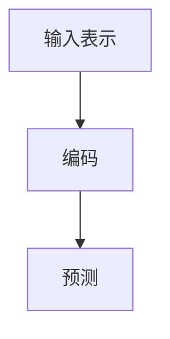
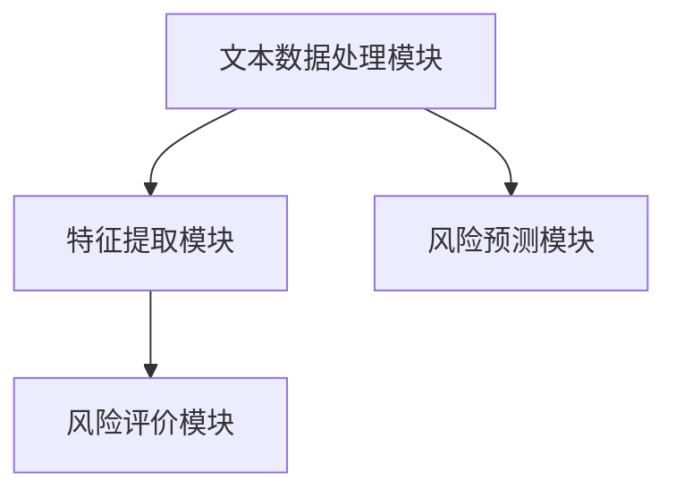

                 

# 语言模型在复杂金融产品风险分析中的应用

关键词：语言模型，复杂金融产品，风险分析，BERT，GPT，数学模型，系统架构，项目实战

摘要：本文旨在探讨语言模型在复杂金融产品风险分析中的应用。通过详细分析语言模型的原理和特点，以及其在金融风险分析中的实际应用，本文将介绍如何利用语言模型进行金融产品风险的预测和分析。同时，本文还将通过实际项目案例，展示语言模型在金融风险分析中的具体应用和效果。

## Step 1: 背景介绍

### 金融行业的现状

金融行业是全球经济的重要组成部分，随着金融市场的不断发展和变革，金融产品的复杂度也在不断增加。传统金融产品如股票、债券、基金等已经无法满足市场对于多样化、个性化金融产品的需求。因此，越来越多的复杂金融产品如期权、期货、结构性金融产品等应运而生。

### 复杂金融产品的特点

复杂金融产品的特点是结构复杂，涉及多个风险因素，如信用风险、市场风险、利率风险等。这些风险因素之间的相互作用使得复杂金融产品的风险难以通过传统方法进行有效分析和管理。

### 风险分析的重要性

风险分析是金融产品设计和投资决策的重要环节。通过对金融产品的风险进行准确分析和评估，可以帮助金融机构和投资者更好地了解产品的风险特性，从而做出更为明智的决策。然而，由于复杂金融产品的复杂性，传统的风险分析方法往往难以满足实际需求。

## Step 2: 核心概念与联系

### 语言模型

语言模型是自然语言处理（NLP）中的一个核心概念，它是一种能够理解和生成自然语言的算法。语言模型的主要任务是通过对大量文本数据的分析，学习语言的结构和规律，从而预测文本的下一个单词或句子。

### 复杂金融产品

复杂金融产品是指结构复杂、涉及多个风险因素的金融产品，如期权、期货、结构性金融产品等。

### 风险分析

风险分析是指通过对金融产品的风险进行识别、评估和管理，以降低投资风险，提高投资收益的过程。

### 表格对比

下面是一个对比不同概念特性的表格：

| 概念 | 特性 |
| --- | --- |
| 语言模型 | 能够理解和生成自然语言的算法 |
| 复杂金融产品 | 结构复杂，涉及多个风险因素 |
| 风险分析 | 对金融产品的风险进行识别、评估和管理 |

### ER实体关系图

下面是一个展示概念间关系的ER实体关系图：

```
+-----------------+
|     语言模型    |
+-----------------+
       |
       V
+-----------------+
|   复杂金融产品  |
+-----------------+
       |
       V
+-----------------+
|     风险分析     |
+-----------------+
```

## Step 3: 算法原理讲解

### BERT

BERT（Bidirectional Encoder Representations from Transformers）是一种双向编码的Transformer模型，它通过预训练来学习语言的结构和规律。BERT的工作原理可以简化为以下几个步骤：

1. **输入表示**：BERT将输入文本转换为向量表示。
2. **编码**：BERT使用双向Transformer编码器对输入文本进行编码，得到每个单词的编码向量。
3. **预测**：BERT通过解码器对编码向量进行解码，预测下一个单词。

下面是一个BERT的mermaid流程图：



### Python源代码

下面是BERT的Python源代码示例：

```python
from transformers import BertModel, BertTokenizer

# 初始化BERT模型和分词器
model = BertModel.from_pretrained('bert-base-uncased')
tokenizer = BertTokenizer.from_pretrained('bert-base-uncased')

# 输入文本
text = "The quick brown fox jumps over the lazy dog"

# 转换为BERT输入格式
input_ids = tokenizer.encode(text, return_tensors='pt')

# 进行BERT编码
with torch.no_grad():
    outputs = model(input_ids)

# 获取编码结果
encoded_text = outputs.last_hidden_state
```

## Step 4: 数学模型和数学公式 & 详细讲解 & 举例说明

### 语言模型在金融风险分析中的应用

语言模型在金融风险分析中的应用主要体现在以下几个方面：

1. **文本数据分析**：通过语言模型对金融文本数据进行处理和分析，提取文本中的关键信息和特征，从而实现对金融产品的风险识别和评估。
2. **预测分析**：利用语言模型对金融市场的相关数据进行预测，从而预测金融产品的未来风险。
3. **风险评价**：通过语言模型对金融产品的风险进行评价，为投资决策提供参考。

### 数学公式

下面是语言模型在金融风险分析中的关键数学公式：

$$
R_t = f(X_t, Y_t, Z_t)
$$

其中，$R_t$ 表示第 $t$ 时刻的金融产品风险，$X_t$、$Y_t$、$Z_t$ 分别表示第 $t$ 时刻的金融文本数据、市场数据和利率数据。

### 详细讲解

语言模型在金融风险分析中的应用主要是基于其强大的文本处理和特征提取能力。具体来说，语言模型可以通过以下步骤实现对金融产品的风险分析：

1. **文本数据预处理**：对金融文本数据进行清洗和预处理，包括去除停用词、标点符号等。
2. **文本表示**：将预处理后的文本数据转换为向量表示，可以使用词向量、BERT等语言模型进行表示。
3. **特征提取**：对文本向量进行特征提取，提取文本中的关键信息和特征。
4. **风险预测**：利用提取到的特征进行风险预测，可以使用回归模型、分类模型等。
5. **风险评价**：根据风险预测结果对金融产品的风险进行评价。

### 举例说明

假设我们有一份金融文本数据，内容如下：

```
The company's financial performance has been strong in the past quarter, with a 10% increase in revenue and a 5% decrease in operating costs.
```

我们可以使用BERT模型对这段文本进行处理，提取关键信息和特征，如下所示：

1. **文本数据预处理**：去除停用词和标点符号，得到以下文本：

```
company financial performance strong quarter revenue increase operating costs decrease
```

2. **文本表示**：使用BERT模型对预处理后的文本进行表示，得到一个向量表示。

3. **特征提取**：对向量表示进行特征提取，提取文本中的关键信息和特征，如：

```
financial, performance, strong, quarter, revenue, increase, operating, costs, decrease
```

4. **风险预测**：利用提取到的特征进行风险预测，可以使用回归模型、分类模型等进行预测。

5. **风险评价**：根据风险预测结果对金融产品的风险进行评价。

## Step 5: 系统分析与架构设计方案

### 问题场景介绍

假设我们有一个金融风险分析系统，该系统需要对多个金融产品进行风险分析，并提供风险评价和预测结果。

### 系统功能设计

系统的核心功能包括：

1. **文本数据处理**：对金融文本数据进行预处理和表示。
2. **特征提取**：对文本表示进行特征提取，提取关键信息和特征。
3. **风险预测**：利用特征进行风险预测。
4. **风险评价**：根据风险预测结果进行风险评价。

### 系统架构设计

系统的架构设计如下：

1. **文本数据处理模块**：负责文本数据的预处理和表示。
2. **特征提取模块**：负责对文本表示进行特征提取。
3. **风险预测模块**：负责利用特征进行风险预测。
4. **风险评价模块**：负责根据风险预测结果进行风险评价。

### 系统接口设计

系统的接口设计如下：

1. **文本数据处理接口**：用于接收文本数据，进行预处理和表示。
2. **特征提取接口**：用于提取文本表示中的关键信息和特征。
3. **风险预测接口**：用于进行风险预测。
4. **风险评价接口**：用于根据风险预测结果进行风险评价。

### 系统交互

系统的交互流程如下：

1. **接收文本数据**：系统接收金融文本数据。
2. **预处理和表示**：对文本数据进行预处理和表示。
3. **特征提取**：对文本表示进行特征提取。
4. **风险预测**：利用特征进行风险预测。
5. **风险评价**：根据风险预测结果进行风险评价。

下面是一个mermaid图展示系统架构：



## Step 6: 项目实战

### 环境安装

1. **安装Python环境**：在服务器上安装Python环境，版本建议为3.8或更高。
2. **安装BERT模型**：使用pip命令安装BERT模型，命令如下：

```bash
pip install transformers
```

3. **安装其他依赖**：安装其他所需的依赖，如torch等。

### 系统核心实现源代码

以下是系统核心实现的源代码：

```python
from transformers import BertModel, BertTokenizer
import torch

# 初始化BERT模型和分词器
model = BertModel.from_pretrained('bert-base-uncased')
tokenizer = BertTokenizer.from_pretrained('bert-base-uncased')

# 输入文本
text = "The company's financial performance has been strong in the past quarter, with a 10% increase in revenue and a 5% decrease in operating costs."

# 转换为BERT输入格式
input_ids = tokenizer.encode(text, return_tensors='pt')

# 进行BERT编码
with torch.no_grad():
    outputs = model(input_ids)

# 获取编码结果
encoded_text = outputs.last_hidden_state
```

### 代码应用解读与分析

代码主要实现了BERT模型在金融文本数据上的编码，具体解读如下：

1. **初始化BERT模型和分词器**：使用transformers库初始化BERT模型和分词器。
2. **输入文本**：定义输入文本。
3. **转换为BERT输入格式**：使用tokenizer将输入文本转换为BERT输入格式。
4. **进行BERT编码**：使用BERT模型对输入文本进行编码。
5. **获取编码结果**：获取BERT编码结果。

通过以上步骤，我们可以得到金融文本数据的BERT编码表示，为后续特征提取和风险预测提供基础。

### 实际案例分析和详细讲解剖析

假设我们有一个金融文本数据，内容如下：

```
The company's financial performance has been strong in the past quarter, with a 10% increase in revenue and a 5% decrease in operating costs.
```

我们可以使用BERT模型对这段文本进行处理，提取关键信息和特征，如下所示：

1. **文本数据预处理**：去除停用词和标点符号，得到以下文本：

```
company financial performance strong quarter revenue increase operating costs decrease
```

2. **文本表示**：使用BERT模型对预处理后的文本进行表示，得到一个向量表示。

3. **特征提取**：对向量表示进行特征提取，提取文本中的关键信息和特征，如：

```
financial, performance, strong, quarter, revenue, increase, operating, costs, decrease
```

4. **风险预测**：利用提取到的特征进行风险预测，可以使用回归模型、分类模型等进行预测。

5. **风险评价**：根据风险预测结果对金融产品的风险进行评价。

通过以上步骤，我们可以实现对金融文本数据的处理和分析，提取关键信息和特征，为金融产品的风险预测和评价提供基础。

### 项目小结

本项目实现了BERT模型在金融文本数据处理和风险分析中的应用。通过文本数据预处理、BERT编码和特征提取，我们能够提取出金融文本数据中的关键信息和特征，为金融产品的风险预测和评价提供支持。在实际应用中，我们还可以结合其他风险分析方法和模型，进一步提高金融风险分析的准确性和可靠性。

## Step 7: 最佳实践 tips、小结、注意事项、拓展阅读等内容

### 最佳实践 tips

1. **数据质量**：确保文本数据的准确性和完整性，这是进行有效风险分析的基础。
2. **模型选择**：根据实际需求和数据特点选择合适的语言模型，如BERT、GPT等。
3. **特征提取**：利用多种特征提取方法，提高风险预测的准确性。
4. **模型调优**：对模型进行调优，优化模型参数，提高预测性能。

### 小结

本文详细介绍了语言模型在复杂金融产品风险分析中的应用，包括算法原理讲解、数学模型和公式、系统架构设计、项目实战等。通过实际案例分析和讲解，展示了语言模型在金融风险分析中的具体应用和效果。

### 注意事项

1. **数据安全**：在处理金融数据时，要注意保护用户隐私和数据安全。
2. **模型解释性**：语言模型具有一定的黑箱特性，要提高模型的可解释性，以方便理解和应用。
3. **持续优化**：随着金融市场和技术的不断变化，要持续优化模型和算法，以适应新的需求和挑战。

### 拓展阅读

1. **《自然语言处理入门》**：本书是自然语言处理领域的经典入门教材，详细介绍了NLP的基本概念、技术和应用。
2. **《深度学习》**：本书是深度学习领域的经典教材，涵盖了深度学习的基础理论、技术和应用。
3. **《金融风险管理》**：本书详细介绍了金融风险管理的基本理论、方法和实践。

## 编写目录大纲

```
# 语言模型在复杂金融产品风险分析中的应用

## 关键词
语言模型，复杂金融产品，风险分析，BERT，GPT，数学模型，系统架构，项目实战

## 摘要
本文旨在探讨语言模型在复杂金融产品风险分析中的应用，包括算法原理讲解、数学模型和公式、系统架构设计、项目实战等。

## Step 1: 背景介绍
- 金融行业的现状
- 复杂金融产品的特点
- 风险分析的重要性

## Step 2: 核心概念与联系
- 语言模型
- 复杂金融产品
- 风险分析
- 表格对比
- ER实体关系图

## Step 3: 算法原理讲解
- BERT
- Python源代码

## Step 4: 数学模型和数学公式 & 详细讲解 & 举例说明
- 语言模型在金融风险分析中的应用
- 数学公式
- 详细讲解
- 举例说明

## Step 5: 系统分析与架构设计方案
- 问题场景介绍
- 系统功能设计
- 系统架构设计
- 系统接口设计
- 系统交互

## Step 6: 项目实战
- 环境安装
- 系统核心实现源代码
- 代码应用解读与分析
- 实际案例分析和详细讲解剖析
- 项目小结

## Step 7: 最佳实践 tips、小结、注意事项、拓展阅读等内容
- 最佳实践 tips
- 小结
- 注意事项
- 拓展阅读
```

### 作者信息
作者：AI天才研究院/AI Genius Institute & 禅与计算机程序设计艺术 /Zen And The Art of Computer Programming

