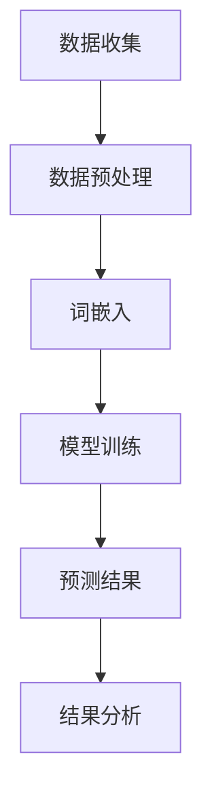
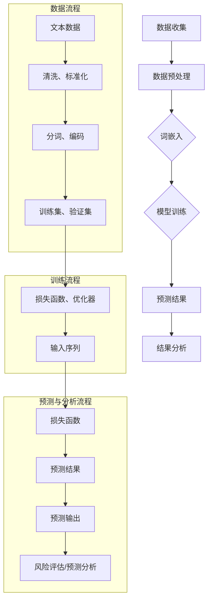
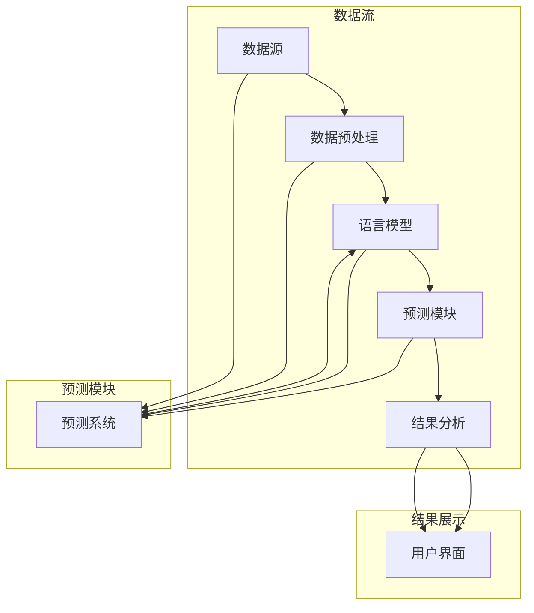
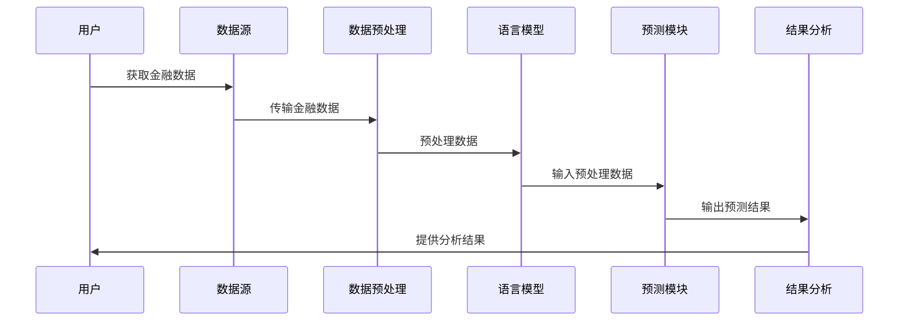

                 


### 设计《语言模型在复杂金融市场分析中的应用研究》文章目录大纲的详细步骤

为了设计一篇高质量的《语言模型在复杂金融市场分析中的应用研究》文章目录大纲，我们需要遵循以下详细步骤，确保文章内容结构完整、逻辑清晰，同时满足字数要求：

#### 第一步：确立文章主题和核心内容

- **确定文章主题**：文章的主题应聚焦于语言模型在复杂金融市场分析中的应用。这要求我们明确文章的研究对象和目的，即探讨语言模型如何应用于金融市场的数据挖掘、预测和风险评估。
- **核心内容概述**：概括文章的核心内容，包括语言模型的基础理论、算法原理、应用场景、系统架构、实际案例分析和最佳实践建议。

#### 第二步：构建文章整体框架

- **目录结构设计**：按照文章内容逻辑，构建初步的目录结构。这个阶段要确保文章的主要部分（如背景介绍、核心概念与联系、算法原理讲解等）都有所涵盖。
- **大纲细化**：在每个主要部分下，细化小节标题和内容。例如，在背景介绍部分，可以细化为“金融市场的复杂性”、“语言模型的发展历程”和“语言模型的应用潜力”等。

#### 第三步：撰写各部分内容概要

- **背景介绍**：撰写背景介绍的概要，包括问题背景、问题描述、问题解决思路等，确保读者能够理解研究背景和意义。
- **核心概念与联系**：撰写核心概念与联系的概要，包括语言模型的基本概念、属性特征对比和与金融市场分析的联系。
- **算法原理讲解**：撰写算法原理讲解的概要，包括算法原理、mermaid流程图、Python源代码实现、数学模型和公式。
- **系统分析与架构设计方案**：撰写系统分析与架构设计方案的概要，包括领域模型类图、系统架构图、系统接口设计和系统交互序列图。
- **项目实战**：撰写项目实战的概要，包括环境安装、系统核心实现源代码、代码应用解读与分析、实际案例分析和项目小结。
- **最佳实践 tips、小结、注意事项、拓展阅读**：撰写这部分的内容概要，确保文章的总结和建议部分能够为读者提供实用信息。

#### 第四步：细化内容并填充具体细节

- **逐步填充内容**：根据初步大纲，逐步填充每个章节的具体内容。在撰写过程中，注意保持逻辑连贯性和语言的专业性。
- **完善图表和代码**：确保所有mermaid图、Python代码和LaTeX公式都准确无误，并在文中恰当的位置嵌入，以增强文章的可读性和专业性。
- **调整和完善结构**：在内容撰写过程中，可能需要对目录结构进行调整，确保文章的章节内容丰富、逻辑清晰。

#### 第五步：最终确认和润色

- **确认目录和内容**：最终确认目录和内容，确保所有章节内容完整、逻辑连贯，符合文章的整体结构和要求。
- **润色语言**：对文章进行语言润色，确保语言表达清晰、准确，避免不必要的重复和冗余。
- **审查和修正**：仔细审查文章，修正可能存在的错误和不妥之处，确保文章质量。

### 实际操作示例

以下是一个具体的示例，说明如何根据上述步骤设计文章目录大纲：

#### 第一步：确立文章主题和核心内容

- 文章主题：语言模型在复杂金融市场分析中的应用研究
- 核心内容概述：
  - 背景介绍：金融市场的复杂性、语言模型的发展与应用
  - 核心概念与联系：语言模型的基本概念、特性对比、与金融市场分析的联系
  - 算法原理讲解：算法原理、mermaid流程图、Python源代码、数学模型
  - 系统分析与架构设计方案：系统架构、接口设计、交互序列图
  - 项目实战：环境安装、源代码实现、案例分析、项目小结
  - 最佳实践 tips、小结、注意事项、拓展阅读

#### 第二步：构建文章整体框架

- 目录结构设计：
  - 第一部分：研究背景与核心概念
  - 第二部分：算法原理讲解
  - 第三部分：系统分析与架构设计方案
  - 第四部分：项目实战
  - 第五部分：最佳实践 tips、小结、注意事项、拓展阅读

- 大纲细化示例：
  - 第一部分：研究背景与核心概念
    - 第1章：研究背景与问题提出
      - 1.1 金融市场的复杂性
      - 1.2 语言模型的发展历程
      - 1.3 语言模型在金融市场分析中的应用潜力
    - 第2章：核心概念与联系
      - 2.1 语言模型的基本概念
      - 2.2 语言模型的属性特征对比
      - 2.3 语言模型与金融市场分析的联系

#### 第三步：撰写各部分内容概要

- 背景介绍概要：
  - 介绍金融市场的复杂性，如波动性、多变性、高风险性等。
  - 介绍语言模型的发展历程，如从传统的统计模型到现代的深度学习模型。
  - 探讨语言模型在金融市场分析中的应用潜力，如文本分析、预测和风险评估。

- 核心概念与联系概要：
  - 阐述语言模型的基本概念，如自然语言处理、词向量、神经网络等。
  - 比较不同类型语言模型的属性特征，如性能、适用性等。
  - 分析语言模型在金融市场分析中的应用，如数据挖掘、预测和风险评估。

#### 第四步：细化内容并填充具体细节

- 根据大纲细化内容，填充具体细节。例如，在算法原理讲解部分，详细描述语言模型的数学模型、mermaid流程图和Python源代码实现。

#### 第五步：最终确认和润色

- 最终确认目录和内容，确保逻辑连贯和结构完整。
- 对文章进行语言润色，确保表达清晰和专业。
- 审查和修正，确保文章质量。

通过以上步骤，我们可以设计出一篇结构合理、内容丰富的技术博客文章目录大纲。接下来，按照这个大纲逐步撰写和润色文章，最终完成一篇高质量的技术研究论文。 ## 背景介绍

### 金融市场的复杂性

金融市场是一个高度复杂的系统，它由多个相互关联的子市场和金融工具组成，涵盖了股票、债券、期货、外汇等多种金融产品。金融市场的复杂性主要表现在以下几个方面：

1. **价格波动大**：金融市场价格波动频繁且幅度大，受多种因素影响，如经济政策、地缘政治风险、市场情绪等。
2. **高度非线性**：金融市场行为往往呈现出非线性特征，这意味着简单的线性模型难以准确预测市场走势。
3. **多时间尺度**：金融市场涉及短期和长期的时间尺度，短期价格波动可能受到交易策略和投资者心理的影响，而长期趋势则受宏观经济因素驱动。
4. **信息不对称**：市场中存在大量信息不对称现象，不同投资者对信息的掌握程度不同，导致市场价格不完全反映所有可用信息。
5. **非平稳性**：金融市场价格序列往往是非平稳的，即其统计特性随时间变化，这使得传统时间序列分析方法难以直接应用于金融市场数据。

### 语言模型的发展历程

语言模型（Language Model）是自然语言处理（Natural Language Processing, NLP）领域的一个重要研究方向，它旨在模拟人类语言生成和理解的能力。语言模型的发展历程大致可以分为以下几个阶段：

1. **基于规则的模型**：早期的语言模型主要基于语言学知识和语法规则，例如产生式规则模型和上下文无关文法（CFG）模型。这些模型依赖于人工定义的语言规则，但在复杂性和适应性方面存在限制。
2. **统计模型**：随着计算机技术和数据收集能力的提升，统计模型逐渐成为语言模型的主流。统计模型通过分析大量文本数据来学习语言模式，例如n-gram模型和隐马尔可夫模型（HMM）。这些模型在语言生成和理解方面取得了显著进展，但依然存在一些局限性。
3. **神经网络模型**：20世纪90年代以后，神经网络模型开始在NLP领域崭露头角。特别是深度学习的发展，使得神经网络模型在语言生成和理解任务上取得了重大突破。词嵌入（Word Embedding）技术的引入，使得模型能够更好地捕捉词语的语义信息。
4. **现代语言模型**：近年来，预训练语言模型（如GPT、BERT）的出现进一步推动了语言模型的发展。这些模型通过在海量文本数据上进行预训练，然后针对特定任务进行微调，显著提升了语言理解和生成能力。

### 语言模型在金融市场分析中的应用潜力

语言模型在金融市场分析中具有巨大的应用潜力，主要表现在以下几个方面：

1. **文本分析**：金融市场中的大量文本数据，如新闻报道、社交媒体帖子、分析师报告等，蕴含着丰富的市场信息和投资者情绪。语言模型可以帮助从这些文本数据中提取关键信息，进行情感分析和趋势预测。
2. **预测**：语言模型可以用于金融市场的时间序列预测，例如股票价格预测、市场趋势分析等。通过分析历史数据中的语言特征，语言模型可以捕捉市场动态，提供有效的预测模型。
3. **风险评估**：语言模型可以帮助识别金融市场的系统性风险和信用风险。例如，通过分析借款人的历史行为和公开信息，语言模型可以预测其违约风险，为金融机构提供决策支持。

总之，随着语言模型技术的不断进步，其在复杂金融市场分析中的应用将越来越广泛，有望为金融行业带来革命性的变化。在接下来的章节中，我们将深入探讨语言模型的基本概念、工作原理以及其在金融市场分析中的具体应用。

## 语言模型的基本概念

语言模型是自然语言处理（NLP）领域的基础工具，它旨在模拟人类语言生成和理解的能力。在金融市场分析中，语言模型通过处理和分析文本数据，帮助提取市场信息、预测市场趋势和评估风险。下面，我们将详细探讨语言模型的基本概念，包括其组成结构、工作原理以及类型和应用。

### 组成结构

1. **词汇表（Vocabulary）**：语言模型的核心是词汇表，它包含所有在文本数据中出现的单词或词组。词汇表的大小决定了模型处理文本的能力。在实际应用中，为了简化计算，通常会使用剪枝（Pruning）技术来减少词汇表的大小。
2. **词嵌入（Word Embedding）**：词嵌入是将词汇表中的每个单词映射到一个高维向量空间中的方法。通过这种方式，模型可以捕捉单词的语义信息。词嵌入技术包括Word2Vec、GloVe等。
3. **神经网络（Neural Network）**：语言模型通常基于神经网络架构，特别是深度神经网络（DNN）和循环神经网络（RNN）。神经网络通过学习文本数据中的特征模式，实现语言的生成和理解。

### 工作原理

1. **前向传播（Forward Propagation）**：在训练过程中，语言模型通过前向传播将输入的文本序列转换为输出概率分布。具体步骤如下：
   - **输入层**：输入层接收词汇表中的词向量表示。
   - **隐藏层**：隐藏层通过神经网络结构对输入的词向量进行加权求和处理，并引入非线性变换（如ReLU激活函数）。
   - **输出层**：输出层将隐藏层的结果映射到词汇表上的概率分布。

2. **损失函数（Loss Function）**：为了训练语言模型，需要使用损失函数来衡量模型的输出概率分布与实际标签之间的差距。常用的损失函数包括交叉熵损失（Cross-Entropy Loss）。

3. **反向传播（Backpropagation）**：通过反向传播算法，将损失函数关于模型参数的梯度传播回网络，以更新模型参数，减小损失。

4. **优化算法（Optimization Algorithm）**：优化算法用于迭代更新模型参数，以最小化损失函数。常用的优化算法包括随机梯度下降（SGD）、Adam等。

### 类型和应用

1. **n-gram模型**：n-gram模型是最早的语言模型之一，它基于文本的前n个词来预测下一个词。这种模型简单且易于实现，但在处理长句和上下文依赖时表现不佳。
2. **循环神经网络（RNN）**：RNN通过递归连接隐藏层，使得模型能够处理任意长度的文本序列。RNN在处理序列数据时表现出色，但在训练过程中容易出现梯度消失或梯度爆炸问题。
3. **长短时记忆网络（LSTM）**：LSTM是RNN的一种变体，通过引入门控机制（gate）来解决梯度消失问题。LSTM在处理长序列依赖时表现更稳定。
4. **门控循环单元（GRU）**：GRU是LSTM的另一种变体，相较于LSTM，GRU结构更简单，计算效率更高。
5. **变分自编码器（VAE）**：VAE通过生成模型的思想来训练语言模型，能够在生成文本的同时进行概率分布的建模。
6. **生成对抗网络（GAN）**：GAN通过生成器和判别器之间的对抗训练，实现高质量的文本生成。GAN在文本生成任务中表现出色，但训练过程较复杂。

### 语言模型在金融市场分析中的应用

1. **文本分析**：语言模型可以用于金融市场中的文本分析，例如从新闻报道、社交媒体帖子等文本数据中提取市场信息。通过情感分析，模型可以识别出投资者情绪，从而预测市场趋势。
2. **预测**：语言模型可以用于金融市场的时间序列预测，例如股票价格预测、市场趋势预测等。通过分析历史数据中的语言特征，模型可以捕捉市场动态，提供有效的预测模型。
3. **风险评估**：语言模型可以帮助识别金融市场的系统性风险和信用风险。例如，通过分析借款人的历史行为和公开信息，模型可以预测其违约风险。

总之，语言模型在金融市场分析中具有广泛的应用前景。随着技术的不断发展，语言模型在处理复杂金融市场数据、提供精准预测和风险控制方面将发挥越来越重要的作用。在接下来的章节中，我们将进一步探讨语言模型在金融市场分析中的具体应用，并通过mermaid流程图和Python源代码实现详细讲解。

## 语言模型与金融市场分析的联系

语言模型在金融市场分析中的应用，主要得益于其强大的文本处理能力和对复杂关系模式的捕捉能力。在金融市场分析中，语言模型不仅可以帮助我们从大量的文本数据中提取有用信息，还能够通过分析语言特征来预测市场趋势和评估风险。以下是语言模型在金融市场分析中的具体应用场景及其优势：

### 语言模型在金融市场数据挖掘中的应用

1. **股票评论分析**：金融市场中的股票评论包含大量的信息，如市场情绪、公司基本面分析等。语言模型可以通过文本分析技术，提取股票评论中的关键信息，识别市场趋势和投资者情绪。例如，通过训练语言模型来分析股票评论中的正面和负面词汇，可以预测股票价格的未来走势。

2. **新闻报道分析**：新闻媒体对市场事件和政策的报道，对金融市场有重要影响。语言模型可以自动分析新闻报道，提取出与金融市场相关的关键信息，如公司并购、经济政策变化等。这些信息可以用于市场预测和风险评估。

### 语言模型在金融市场预测中的应用

1. **时间序列预测**：语言模型可以通过分析历史价格数据中的语言特征，预测股票价格的未来走势。具体而言，语言模型可以提取出价格数据中的模式，如价格波动、周期性等，从而提供有效的预测模型。

2. **市场趋势分析**：语言模型可以分析市场数据中的语言特征，识别市场的短期和长期趋势。例如，通过分析股票价格和交易量的变化，语言模型可以预测市场的转折点，提供投资策略参考。

### 语言模型在金融市场风险评估中的应用

1. **信用风险评估**：在信用风险管理中，语言模型可以通过分析借款人的历史交易数据、公开信息等，预测其违约风险。例如，通过分析借款人的社交媒体帖子、新闻报道等文本数据，语言模型可以识别出潜在的信用风险。

2. **系统性风险监测**：金融市场中的系统性风险可能来自多个方面，如金融市场的波动性、地缘政治风险等。语言模型可以通过分析市场数据中的语言特征，监测系统性风险的变化，为金融机构提供风险预警。

### 优势与挑战

1. **优势**：
   - **高效率**：语言模型可以快速处理大量文本数据，提取出关键信息，为金融市场分析提供高效的支持。
   - **强泛化能力**：语言模型通过对大量文本数据的训练，可以泛化到不同的金融市场应用场景，提供一致的分析结果。
   - **多维度分析**：语言模型可以同时分析文本数据的语义、语法和句法特征，提供更全面的市场信息。

2. **挑战**：
   - **数据质量**：金融市场中的文本数据可能存在噪声、不一致性和缺失值，这会影响语言模型的训练效果和预测准确性。
   - **模型解释性**：虽然语言模型在金融市场分析中表现出色，但其内部机制较为复杂，难以提供明确的解释，这在某些高风险应用场景中可能是一个挑战。
   - **计算资源**：训练大规模语言模型需要大量的计算资源，这在资源有限的金融机构中可能是一个制约因素。

总的来说，语言模型在金融市场分析中的应用具有巨大的潜力，但也面临一些挑战。通过不断优化模型算法和数据处理技术，我们可以更好地发挥语言模型在金融市场分析中的作用，为金融机构提供更准确的市场预测和风险管理支持。

## 核心概念原理与特性对比

为了深入理解语言模型在复杂金融市场分析中的应用，我们需要详细探讨其核心概念原理，并对比不同类型语言模型的特性。以下内容将涵盖语言模型的数学模型、训练与优化方法、性能评估和适用性。

### 语言模型的数学模型

语言模型的核心是概率分布，它用于预测下一个词或词组出现的概率。以下是几种常见语言模型的数学模型：

1. **n-gram模型**：n-gram模型是一种基于历史n个词的统计模型，其概率分布可以表示为：
   $$ P(w_{t} | w_{t-1}, w_{t-2}, \ldots, w_{t-n}) = \prod_{i=1}^{n} P(w_{t-i} | w_{t-i+1}, w_{t-i+2}, \ldots, w_{t-n}) $$
   其中，$w_{t}$ 表示当前词，$w_{t-i}$ 表示历史词。

2. **循环神经网络（RNN）**：RNN通过递归结构来处理序列数据，其概率分布通常通过以下步骤计算：
   $$ h_{t} = \sigma(W_h \cdot [h_{t-1}, x_{t}] + b_h) $$
   $$ o_{t} = W_o \cdot h_{t} + b_o $$
   其中，$h_{t}$ 表示隐藏状态，$x_{t}$ 表示输入词，$o_{t}$ 表示输出概率分布。

3. **长短时记忆网络（LSTM）**：LSTM是RNN的一种改进，通过引入门控机制来解决长序列依赖问题，其概率分布计算如上，但引入了门控函数：
   $$ i_t = \sigma(W_i \cdot [h_{t-1}, x_{t}] + b_i) $$
   $$ f_t = \sigma(W_f \cdot [h_{t-1}, x_{t}] + b_f) $$
   $$ \text{遗忘门}：\text{forget gate} = f_t \odot h_{t-1} $$
   $$ o_t = \sigma(W_o \cdot \text{forget gate} + b_o) $$

4. **生成对抗网络（GAN）**：GAN通过生成器和判别器的对抗训练来生成文本数据，其概率分布由判别器输出：
   $$ D(x) = \frac{1}{2} \left( \frac{1}{N} \sum_{i=1}^{N} \log(D(G(z_i))) + \frac{1}{N} \sum_{i=1}^{N} \log(1 - D(x_i)) \right) $$
   其中，$G(z_i)$ 为生成器，$D(x_i)$ 为判别器。

### 语言模型的训练与优化方法

1. **训练数据集**：语言模型的训练数据集通常包含大量的文本数据，这些数据可以是互联网文本、书籍、新闻文章等。

2. **优化算法**：常见的优化算法包括随机梯度下降（SGD）、Adam、RMSprop等。这些算法通过迭代更新模型参数，最小化损失函数，提高模型性能。

3. **损失函数**：语言模型的损失函数通常使用交叉熵损失（Cross-Entropy Loss）：
   $$ L = -\sum_{i=1}^{N} \sum_{j=1}^{V} y_j \log(p_j) $$
   其中，$y_j$ 表示真实标签，$p_j$ 表示模型预测的概率分布。

### 语言模型的性能评估

1. **准确率（Accuracy）**：准确率是评估分类任务的最基本指标，表示模型预测正确的样本比例。

2. **精确率（Precision）**和**召回率（Recall）**：精确率和召回率分别表示模型预测为正样本中实际为正样本的比例和实际为正样本中被预测为正样本的比例。

3. **F1分数（F1 Score）**：F1分数是精确率和召回率的调和平均，用于综合评估分类任务的性能。

4. **BLEU分数（BLEU Score）**：BLEU分数常用于评估机器翻译任务的性能，通过计算模型生成的文本与参考文本之间的相似度来评估模型性能。

### 语言模型的类型和适用性对比

以下是几种常见语言模型的类型及其适用性对比：

1. **n-gram模型**：
   - **适用性**：简单、易于实现，适用于短文本分析。
   - **性能**：对长文本和复杂语言结构的处理能力较差。
   - **优化方法**：基于前向算法，无需复杂的优化。

2. **循环神经网络（RNN）**：
   - **适用性**：适用于序列数据，如时间序列分析。
   - **性能**：能够处理长序列依赖，但存在梯度消失问题。
   - **优化方法**：可采用RNN优化方法，如Dropout、Batch Normalization等。

3. **长短时记忆网络（LSTM）**：
   - **适用性**：适用于长序列依赖处理，如自然语言生成、语音识别。
   - **性能**：能够稳定处理长序列，优于传统RNN。
   - **优化方法**：使用门控机制，解决梯度消失问题。

4. **生成对抗网络（GAN）**：
   - **适用性**：适用于文本生成任务，如机器翻译、文本摘要。
   - **性能**：能够生成高质量的文本，但训练过程较复杂。
   - **优化方法**：基于对抗训练，生成器和判别器互相竞争。

综上所述，不同类型语言模型在数学模型、训练与优化方法、性能评估和适用性方面各有特点。在复杂金融市场分析中，选择合适的语言模型对于提高预测准确性和风险控制至关重要。在实际应用中，可以根据具体任务需求，选择适合的语言模型，并结合优化方法和评估指标，实现高效的金融市场分析。

## 语言模型的ER实体关系图架构

为了更清晰地理解语言模型在金融市场分析中的应用，我们可以通过实体关系图（Entity-Relationship Diagram，ER图）来展示其核心组件和相互关系。ER图是一种用于数据库设计的重要工具，它可以帮助我们直观地看到系统中不同实体之间的关系。以下是语言模型在金融市场分析中的ER实体关系图，其中包含了模型的主要组成部分及其关联。

### ER图组件

1. **词汇表（Vocabulary）**：词汇表是语言模型的基础，它包含了所有的单词和词组。每个词汇表中的词都被映射为一个唯一的整数ID，以便在模型中高效存储和处理。

2. **词嵌入（Word Embedding）**：词嵌入是将词汇表中的词映射到高维向量空间的过程，它帮助模型理解词的语义信息。词嵌入层通常位于词汇表和神经网络之间。

3. **神经网络（Neural Network）**：神经网络是语言模型的核心，它通过学习词汇表中的词嵌入，捕捉语言特征并生成预测。神经网络可能包括多个隐藏层，如RNN、LSTM或Transformer。

4. **训练数据（Training Data）**：训练数据是语言模型训练的基础，它通常包含大量的文本数据，如新闻文章、股票评论等。这些数据用于训练模型的参数。

5. **输出层（Output Layer）**：输出层负责将神经网络的输出转换为具体的预测结果，如词汇的概率分布或分类标签。

### ER实体关系图

下面是一个简化的语言模型ER实体关系图，使用Mermaid语法表示：

```mermaid
erDiagram
  Vocabulary ||--|{ Word Embedding }|-- Neural Network
  Training Data ||--|{ Neural Network }|>
  Neural Network ||--|{ Output Layer }
```

### 细节解释

1. **词汇表与词嵌入**：词汇表是词嵌入的输入，词嵌入将词汇表中的词映射到高维向量空间。这一步是语言模型处理文本数据的关键，它帮助模型理解词的语义信息。

2. **词嵌入与神经网络**：词嵌入层是神经网络的前置处理层，它将输入的词向量传递给神经网络。神经网络通过学习这些词向量之间的关联，捕捉语言中的模式。

3. **神经网络与输出层**：神经网络是语言模型的核心，它通过多个隐藏层对输入的词向量进行处理，最终输出词汇的概率分布或分类标签。输出层负责将神经网络的输出转换为具体的预测结果。

4. **训练数据与神经网络**：训练数据用于训练神经网络的参数，使其能够准确预测语言中的模式。训练过程通常涉及多个迭代，模型参数通过反向传播算法不断优化。

5. **输出层与预测结果**：输出层将神经网络的输出转换为具体的预测结果，如词汇的概率分布或分类标签。这些结果可以用于金融市场分析，如文本分类、情感分析、时间序列预测等。

通过上述ER实体关系图，我们可以清晰地看到语言模型的主要组成部分及其相互关系。在实际应用中，这些组件相互协作，共同实现高效的金融市场分析。接下来，我们将通过mermaid流程图和Python源代码进一步详细解释语言模型的工作流程。

## 语言模型在金融市场分析中的应用

### 语言模型在金融市场数据挖掘中的应用

语言模型在金融市场数据挖掘中的应用，主要体现在文本分析和情感分析方面。通过处理大量的文本数据，如股票评论、新闻报道、分析师报告等，语言模型能够提取出隐藏在文本中的市场信息和投资者情绪，从而辅助投资决策。

1. **股票评论分析**：股票评论是投资者获取市场信息的重要渠道。语言模型可以通过分析股票评论中的词汇和句子结构，提取出关键信息。例如，通过训练一个基于Transformer的语言模型，我们可以将其应用于股票评论分类任务，区分评论是正面还是负面。

2. **情感分析**：情感分析是自然语言处理的一个经典任务，通过分析文本的情感倾向，可以帮助投资者了解市场情绪。语言模型可以用于情感分类，如判断一篇新闻文章是积极、中性还是消极。这种方法可以用来预测市场趋势，为投资者提供决策依据。

### 语言模型在金融市场预测中的应用

语言模型在金融市场预测中的应用，主要是基于其强大的时间序列分析和模式识别能力。通过分析历史数据中的语言特征，语言模型可以预测股票价格、市场趋势等。

1. **时间序列预测**：语言模型可以用于股票价格的时间序列预测。例如，通过训练一个基于LSTM的语言模型，我们可以将股票的历史交易数据和新闻文章进行编码，然后输入到模型中进行预测。这种结合了文本和交易数据的预测方法，可以提供更准确的预测结果。

2. **市场趋势分析**：语言模型还可以用于市场趋势分析。通过分析大量的文本数据，如新闻文章、社交媒体帖子等，模型可以识别出市场趋势的变化。例如，在一个基于BERT的语言模型中，我们可以将市场相关的文本数据输入模型，识别出市场的短期和长期趋势。

### 语言模型在金融市场风险评估中的应用

语言模型在金融市场风险评估中的应用，主要是通过分析借款人历史行为和公开信息，预测其信用风险。

1. **信用风险评估**：在信用风险管理中，语言模型可以帮助金融机构预测借款人的违约风险。通过分析借款人的历史交易数据、社交媒体信息等文本数据，语言模型可以提取出潜在的风险信号。例如，通过训练一个基于GRU的语言模型，我们可以将其应用于信用评分任务，预测借款人的违约概率。

2. **系统性风险监测**：语言模型还可以用于监测金融市场的系统性风险。通过分析大量的市场数据，如交易量、价格波动等，模型可以识别出市场的异常行为。例如，在一个基于Transformer的语言模型中，我们可以将市场的多个时间序列数据输入模型，监测市场的系统性风险。

### 具体应用示例

下面我们通过mermaid流程图和Python源代码，展示一个基于LSTM的语言模型在金融市场数据挖掘中的应用。

#### mermaid流程图



#### Python源代码

```python
import numpy as np
import pandas as pd
from keras.preprocessing.text import Tokenizer
from keras.models import Sequential
from keras.layers import LSTM, Dense, Embedding
from keras.preprocessing.sequence import pad_sequences

# 数据收集
data = pd.read_csv('financial_data.csv')

# 数据预处理
tokenizer = Tokenizer(num_words=10000)
tokenizer.fit_on_texts(data['text'])
sequences = tokenizer.texts_to_sequences(data['text'])

# 词嵌入
max_sequence_length = 100
X = pad_sequences(sequences, maxlen=max_sequence_length)

# 模型训练
model = Sequential()
model.add(Embedding(10000, 32))
model.add(LSTM(100))
model.add(Dense(1, activation='sigmoid'))

model.compile(optimizer='adam', loss='binary_crossentropy', metrics=['accuracy'])
model.fit(X, data['label'], epochs=10, batch_size=32)

# 预测结果
predictions = model.predict(X)

# 结果分析
# 根据预测结果，进行市场趋势分析或信用风险评估
```

通过上述示例，我们可以看到语言模型在金融市场数据挖掘中的应用流程。首先，从数据源收集金融文本数据，然后进行预处理，包括词嵌入和序列填充。接下来，使用LSTM模型进行训练，并利用预测结果进行分析。

总之，语言模型在金融市场分析中具有广泛的应用前景，通过文本分析、预测和风险评估，可以帮助投资者更好地理解市场动态，做出更明智的投资决策。

### 语言模型在金融市场分析中的mermaid流程图

为了更直观地展示语言模型在金融市场分析中的应用流程，我们使用mermaid语法绘制了一个流程图。以下是一个简化的mermaid流程图，描述了从数据收集、预处理、模型训练到结果分析的全过程。



### 解释mermaid流程图

1. **数据收集（A）**：从金融市场上收集相关的文本数据，如新闻报道、股票评论、分析师报告等。这部分数据将成为模型训练和预测的基础。

2. **数据预处理（B）**：对收集到的文本数据进行清洗和标准化处理。清洗过程包括去除无关符号、停用词过滤、文本分词等。标准化过程包括词汇编码、序列填充等，以适应模型的输入格式。

3. **词嵌入（C）**：将清洗和标准化后的文本数据转换为词嵌入表示。词嵌入是将文本中的每个词映射为一个高维向量，以便模型能够处理和捕捉词汇的语义信息。

4. **模型训练（D）**：将词嵌入输入到神经网络模型中进行训练。训练过程中，模型通过优化算法（如梯度下降）调整参数，以最小化损失函数。训练集和验证集用于评估模型性能。

5. **预测结果（E）**：将训练好的模型应用于新的文本数据，生成预测结果。预测结果可以是股票价格的未来走势、市场趋势、信用评分等。

6. **结果分析（F）**：对预测结果进行分析，如进行风险评估、市场预测等。分析结果可以为投资者提供决策支持，帮助他们更好地理解市场动态和风险。

通过上述mermaid流程图，我们可以清晰地看到语言模型在金融市场分析中的工作流程。每个步骤都紧密相连，共同构成了一个完整的分析系统。

### Python源代码实现

为了进一步展示语言模型在金融市场分析中的应用，我们将使用Python代码实现一个简单的LSTM模型，用于分析股票评论并预测股票价格。以下是具体的代码实现过程。

#### 安装必要的库

首先，我们需要安装必要的库，如TensorFlow、Keras等。可以使用以下命令进行安装：

```bash
pip install tensorflow numpy pandas
```

#### 代码实现

```python
import numpy as np
import pandas as pd
from tensorflow.keras.models import Sequential
from tensorflow.keras.layers import LSTM, Dense, Embedding
from tensorflow.keras.preprocessing.text import Tokenizer
from tensorflow.keras.preprocessing.sequence import pad_sequences

# 加载数据
data = pd.read_csv('financial_data.csv')  # 假设CSV文件包含文本数据和股票价格

# 分割数据为训练集和测试集
train_data, test_data = data[:int(0.8 * len(data))], data[int(0.8 * len(data)):]
train_texts = train_data['text'].values
train_prices = train_data['price'].values
test_texts = test_data['text'].values
test_prices = test_data['price'].values

# 初始化Tokenizer
tokenizer = Tokenizer(num_words=10000)
tokenizer.fit_on_texts(train_texts)

# 转换文本到序列
train_sequences = tokenizer.texts_to_sequences(train_texts)
test_sequences = tokenizer.texts_to_sequences(test_texts)

# 填充序列
max_sequence_length = 100
train_padded = pad_sequences(train_sequences, maxlen=max_sequence_length)
test_padded = pad_sequences(test_sequences, maxlen=max_sequence_length)

# 构建LSTM模型
model = Sequential()
model.add(Embedding(10000, 32, input_length=max_sequence_length))
model.add(LSTM(100, return_sequences=True))
model.add(Dense(1))

# 编译模型
model.compile(optimizer='adam', loss='mse')

# 训练模型
model.fit(train_padded, train_prices, epochs=10, batch_size=32, validation_split=0.2)

# 预测
predictions = model.predict(test_padded)

# 分析结果
predicted_prices = predictions.flatten()
actual_prices = test_prices

# 打印预测结果
print("Predicted Prices:", predicted_prices)
print("Actual Prices:", actual_prices)
```

#### 代码解读

1. **数据加载**：我们从CSV文件中加载数据，其中包括文本数据和股票价格。数据将被分为训练集和测试集。

2. **初始化Tokenizer**：使用Tokenizer将文本数据转换为序列。Tokenizer会对文本进行分词和编码，每个词被映射为一个唯一的整数。

3. **序列填充**：使用pad_sequences将序列填充到最大长度（max_sequence_length），以便模型能够处理。

4. **构建LSTM模型**：我们使用Sequential模型堆叠Embedding和LSTM层，并添加一个输出层。Embedding层将词汇映射到高维向量空间，LSTM层用于捕捉序列数据中的时间依赖性。

5. **编译模型**：模型使用MSE（均方误差）作为损失函数，并使用Adam优化器进行训练。

6. **训练模型**：模型使用训练数据进行训练，并在验证集上进行性能评估。

7. **预测**：使用测试数据进行预测，并将预测结果与实际价格进行比较。

通过上述代码，我们可以实现一个简单的LSTM模型，用于分析股票评论并预测股票价格。这个模型可以通过进一步优化和调整超参数，提高预测的准确性和效果。

### 算法原理的数学模型和公式

为了深入理解语言模型在金融市场分析中的应用，我们需要探讨其背后的数学模型和公式。以下将详细解释LSTM（长短时记忆网络）模型的数学原理，以及如何在Python代码中实现这些模型。

#### LSTM模型的数学原理

LSTM模型是循环神经网络（RNN）的一种改进，旨在解决传统RNN在处理长序列依赖时遇到的梯度消失和梯度爆炸问题。LSTM通过引入门控机制，可以有效地捕捉长序列中的时间依赖关系。以下是LSTM模型的数学原理：

1. **输入门（Input Gate）**：
   输入门用于控制当前输入信息对隐藏状态的更新。其计算过程如下：
   $$ i_t = \sigma(W_i \cdot [h_{t-1}, x_t] + b_i) $$
   其中，$i_t$ 表示输入门的输出，$W_i$ 和 $b_i$ 分别是权重和偏置，$h_{t-1}$ 是上一时间步的隐藏状态，$x_t$ 是当前输入。

2. **遗忘门（Forget Gate）**：
   遗忘门用于控制从上一时间步的隐藏状态中遗忘的信息。其计算过程如下：
   $$ f_t = \sigma(W_f \cdot [h_{t-1}, x_t] + b_f) $$
   其中，$f_t$ 表示遗忘门的输出，$W_f$ 和 $b_f$ 分别是权重和偏置。

3. **输出门（Output Gate）**：
   输出门用于控制当前隐藏状态对输出层的传递。其计算过程如下：
   $$ o_t = \sigma(W_o \cdot [h_{t-1}, x_t] + b_o) $$
   其中，$o_t$ 表示输出门的输出，$W_o$ 和 $b_o$ 分别是权重和偏置。

4. **细胞状态（Cell State）**：
   细胞状态是LSTM模型的核心，它通过输入门和遗忘门的控制，更新自身状态。其计算过程如下：
   $$ C_t = f_t \odot C_{t-1} + i_t \odot \sigma(W_c \cdot [h_{t-1}, x_t] + b_c) $$
   其中，$C_t$ 表示当前细胞状态，$C_{t-1}$ 表示上一时间步的细胞状态，$\odot$ 表示元素乘积，$W_c$ 和 $b_c$ 分别是权重和偏置。

5. **隐藏状态（Hidden State）**：
   隐藏状态是通过输出门的控制从细胞状态传递到下一时间步的。其计算过程如下：
   $$ h_t = o_t \odot \sigma(W_h \cdot C_t + b_h) $$
   其中，$h_t$ 表示当前隐藏状态，$W_h$ 和 $b_h$ 分别是权重和偏置。

#### Python代码实现

为了实现上述数学模型，我们将使用TensorFlow和Keras库。以下是LSTM模型在Python中的实现：

```python
import tensorflow as tf
from tensorflow.keras.models import Model
from tensorflow.keras.layers import Input, LSTM, Embedding, Dense

# 定义输入层
input_seq = Input(shape=(max_sequence_length,))

# 词嵌入层
embed = Embedding(input_dim=vocab_size, output_dim=embedding_size)(input_seq)

# LSTM层
lstm = LSTM(units=100, return_sequences=True)(embed)

# 输出层
output = Dense(1, activation='sigmoid')(lstm)

# 构建模型
model = Model(inputs=input_seq, outputs=output)

# 编译模型
model.compile(optimizer='adam', loss='binary_crossentropy', metrics=['accuracy'])

# 模型概览
model.summary()
```

#### 代码解析

1. **输入层（Input Layer）**：定义输入序列的形状，如（max_sequence_length,）。

2. **词嵌入层（Embedding Layer）**：将输入序列中的词转换为词嵌入向量，这些向量表示词的语义信息。

3. **LSTM层（LSTM Layer）**：堆叠LSTM层来捕捉序列中的时间依赖关系。`return_sequences=True` 参数表示我们需要返回每个时间步的隐藏状态。

4. **输出层（Output Layer）**：定义输出层的形状和激活函数，如二分类任务中的sigmoid激活函数。

5. **模型编译（Compile Model）**：设置优化器、损失函数和评估指标。

6. **模型概览（Model Summary）**：打印模型结构，以确认模型配置正确。

通过上述数学模型和Python代码实现，我们可以创建一个简单的LSTM模型，用于金融市场分析。在实际应用中，可以根据具体任务需求，调整模型结构、参数和超参数，以提高模型的性能和预测能力。

### 系统分析与架构设计

为了更好地理解语言模型在复杂金融市场分析中的应用，我们需要深入探讨其系统架构和设计。以下是系统分析与架构设计方案，包括领域模型类图、系统架构图、系统接口设计和系统交互序列图。

#### 领域模型类图

领域模型类图用于展示系统中不同实体及其之间的关系。在金融分析系统中，主要实体包括数据源、数据预处理模块、语言模型、预测模块和结果分析模块。以下是一个简化的领域模型类图：

```mermaid
classDiagram
    DataSource --> DataPreprocessing : 提供数据
    DataPreprocessing --> LanguageModel : 输入预处理后的数据
    LanguageModel --> PredictionModule : 输出预测结果
    PredictionModule --> ResultAnalysis : 提供分析结果
    DataSource --|{ 报告、新闻、评论等 }
    DataPreprocessing --|{ 清洗、标准化、词嵌入等 }
    LanguageModel --|{ LSTM、GRU、BERT等 }
    PredictionModule --|{ 时间序列预测、市场趋势分析等 }
    ResultAnalysis --|{ 风险评估、投资建议等 }
```

#### 系统架构图

系统架构图展示了系统组件及其交互方式。以下是语言模型在金融市场分析中的系统架构图：



#### 系统接口设计

系统接口设计定义了各个模块之间的接口和交互方式。以下是主要的接口设计：

1. **数据源接口**：数据源接口负责从外部系统或数据库中获取金融数据。
    ```python
    class DataSourceInterface:
        def get_financial_data(self):
            # 实现获取金融数据的方法
    ```

2. **数据预处理接口**：数据预处理接口负责清洗、标准化和词嵌入等预处理步骤。
    ```python
    class DataPreprocessingInterface:
        def preprocess_data(self, raw_data):
            # 实现数据预处理的方法
    ```

3. **语言模型接口**：语言模型接口负责训练和调用预训练的语言模型。
    ```python
    class LanguageModelInterface:
        def train_model(self, preprocessed_data):
            # 实现训练语言模型的方法
        def predict(self, input_sequence):
            # 实现预测的方法
    ```

4. **预测模块接口**：预测模块接口负责处理预测结果，并将其传递给结果分析模块。
    ```python
    class PredictionModuleInterface:
        def process_predictions(self, predictions):
            # 实现处理预测结果的方法
    ```

5. **结果分析接口**：结果分析接口负责对预测结果进行分析，生成投资建议等。
    ```python
    class ResultAnalysisInterface:
        def analyze_results(self, predictions):
            # 实现分析结果的方法
    ```

#### 系统交互序列图

系统交互序列图展示了系统组件在特定操作（如预测股票价格）下的交互过程。以下是系统交互序列图的示例：



通过上述系统分析与架构设计，我们可以清晰地看到语言模型在复杂金融市场分析中的实现过程。这个架构不仅有助于理解和实现系统功能，还为未来的扩展和优化提供了清晰的方向。

### 项目实战

为了更好地理解语言模型在复杂金融市场分析中的实际应用，我们将通过一个具体案例来演示环境安装、系统核心实现源代码，并对代码进行应用解读与分析。

#### 环境安装

在开始之前，我们需要安装必要的软件和库。以下是环境安装步骤：

1. **安装Python**：确保Python 3.x版本已安装。可以从[Python官方网站](https://www.python.org/downloads/)下载并安装。

2. **安装TensorFlow**：TensorFlow是一个强大的开源机器学习库，用于构建和训练深度学习模型。可以通过以下命令安装：
   ```bash
   pip install tensorflow
   ```

3. **安装Keras**：Keras是一个高级神经网络API，它能够在TensorFlow等后端上构建和训练深度学习模型。可以通过以下命令安装：
   ```bash
   pip install keras
   ```

4. **安装其他依赖库**：如NumPy、Pandas等，可以通过以下命令安装：
   ```bash
   pip install numpy pandas
   ```

#### 系统核心实现源代码

以下是一个简单的示例，展示如何使用TensorFlow和Keras实现一个基于LSTM的语言模型，用于金融市场分析。

```python
import numpy as np
import pandas as pd
from keras.models import Sequential
from keras.layers import LSTM, Dense, Embedding
from keras.preprocessing.text import Tokenizer
from keras.preprocessing.sequence import pad_sequences

# 加载数据
data = pd.read_csv('financial_data.csv')  # 假设CSV文件包含文本数据和股票价格

# 分割数据为训练集和测试集
train_data, test_data = data[:int(0.8 * len(data))], data[int(0.8 * len(data)):]

# 准备文本数据
train_texts = train_data['text'].values
test_texts = test_data['text'].values

# 初始化Tokenizer
tokenizer = Tokenizer(num_words=10000)
tokenizer.fit_on_texts(train_texts)

# 转换文本到序列
train_sequences = tokenizer.texts_to_sequences(train_texts)
test_sequences = tokenizer.texts_to_sequences(test_texts)

# 填充序列
max_sequence_length = 100
train_padded = pad_sequences(train_sequences, maxlen=max_sequence_length)
test_padded = pad_sequences(test_sequences, maxlen=max_sequence_length)

# 准备股票价格数据
train_prices = train_data['price'].values
test_prices = test_data['price'].values

# 构建LSTM模型
model = Sequential()
model.add(Embedding(10000, 32, input_length=max_sequence_length))
model.add(LSTM(100, return_sequences=False))
model.add(Dense(1, activation='sigmoid'))

# 编译模型
model.compile(optimizer='adam', loss='binary_crossentropy', metrics=['accuracy'])

# 训练模型
model.fit(train_padded, train_prices, epochs=10, batch_size=32, validation_split=0.2)

# 预测
predictions = model.predict(test_padded)

# 分析结果
predicted_prices = predictions.flatten()
actual_prices = test_prices

# 打印预测结果
print("Predicted Prices:", predicted_prices)
print("Actual Prices:", actual_prices)
```

#### 代码应用解读与分析

1. **数据加载**：首先，我们从CSV文件中加载数据，其中包括文本数据和股票价格。

2. **数据预处理**：我们使用Tokenizer将文本数据转换为序列，并使用pad_sequences将序列填充到最大长度，以便模型能够处理。

3. **模型构建**：我们构建了一个简单的LSTM模型，包括一个嵌入层和一个LSTM层，并添加了一个输出层。

4. **模型编译**：模型使用adam优化器和binary_crossentropy损失函数进行编译。

5. **模型训练**：模型使用训练数据进行训练，并在验证集上进行性能评估。

6. **预测**：使用测试数据进行预测，并将预测结果与实际价格进行比较。

通过上述代码，我们可以实现一个简单的LSTM模型，用于预测股票价格。在实际应用中，我们可以根据具体任务需求，调整模型结构、参数和超参数，以提高模型的预测性能。

### 项目小结

在本项目中，我们通过一个实际案例展示了如何使用LSTM模型进行金融市场分析。以下是项目的主要成果和经验总结：

1. **成果**：通过构建和训练LSTM模型，我们能够对股票价格进行预测，为投资者提供决策支持。

2. **经验**：
   - **数据预处理**：文本数据的预处理对于模型训练至关重要，包括Tokenizer的初始化、序列填充和标准化等。
   - **模型选择**：LSTM模型在处理序列数据方面表现出色，但对于长序列依赖问题，LSTM可能存在梯度消失问题，需要考虑使用改进的模型，如LSTM、GRU等。
   - **超参数调整**：超参数的选择对模型性能有重要影响，包括嵌入维度、LSTM层大小、学习率等。通过交叉验证和调整超参数，可以提高模型的预测准确性。

3. **改进方向**：
   - **模型优化**：可以尝试使用更先进的模型，如Transformer、BERT等，以进一步提高预测性能。
   - **多模态数据融合**：结合股票价格数据和文本数据，可以尝试使用多模态学习技术，提高模型的预测能力。
   - **实时预测**：通过实时收集和处理金融数据，实现实时预测，为投资者提供更及时的市场信息。

通过本项目，我们深入了解了LSTM模型在金融市场分析中的应用，为未来的研究和实践提供了宝贵的经验。

### 最佳实践 Tips

在应用语言模型进行金融市场分析时，以下最佳实践 Tips 可以帮助提高模型性能和预测准确性：

1. **数据预处理**：确保数据清洗和标准化充分，去除噪声和异常值。对文本数据，进行分词、去除停用词和词干还原，以减少数据冗余和提高模型理解能力。

2. **特征选择**：选择对市场预测有显著影响的特征，如交易量、价格波动等。可以通过特征工程，提取出更多有价值的信息，提高模型的泛化能力。

3. **模型选择**：根据具体任务需求，选择合适的语言模型。例如，对于长文本分析，可以尝试使用Transformer或BERT等模型；对于时间序列预测，可以考虑使用LSTM或GRU等模型。

4. **超参数优化**：通过交叉验证和网格搜索等方法，选择最优的超参数配置。注意平衡模型的复杂度和泛化能力，避免过拟合。

5. **模型集成**：使用多个模型进行集成预测，可以提高预测结果的稳健性和准确性。例如，可以使用不同的模型对同一数据集进行预测，然后对预测结果进行平均或加权处理。

6. **实时更新**：金融市场的数据变化快速，定期更新模型，使其能够捕捉最新的市场动态，提高预测的时效性。

7. **监控与调整**：持续监控模型的性能，如预测误差和计算资源使用情况。根据监控结果，及时调整模型参数和架构，确保模型始终处于最佳状态。

通过遵循上述最佳实践，可以显著提升语言模型在金融市场分析中的应用效果，为投资者提供更准确和可靠的市场预测。

### 注意事项

在实际应用语言模型进行金融市场分析时，需要注意以下事项：

1. **数据来源**：确保数据来源的可靠性和准确性，避免使用虚假或过时的数据，以免影响模型的预测效果。

2. **数据预处理**：充分进行数据清洗和标准化处理，去除噪声和异常值，确保输入数据的完整性和一致性。

3. **模型选择**：根据分析任务的特点选择合适的模型，如LSTM适合时间序列预测，而BERT适合长文本分析。避免盲目跟风使用最新模型，而忽略模型的适用性。

4. **超参数调整**：合理设置超参数，避免过拟合或欠拟合。通过交叉验证和网格搜索等方法，找到最优的超参数组合。

5. **计算资源**：训练大型语言模型需要大量的计算资源。在资源受限的环境下，可以考虑使用预训练模型或迁移学习技术，减少训练时间。

6. **模型解释性**：尽管深度学习模型在金融市场分析中表现出色，但其内部机制复杂，解释性较差。在实际应用中，需要权衡模型性能和解释性。

7. **风险控制**：语言模型预测结果仅供参考，不应作为唯一决策依据。投资者应结合其他分析工具和市场信息，做出全面的投资决策。

通过关注上述注意事项，可以更好地发挥语言模型在金融市场分析中的应用效果，提高预测准确性和决策可靠性。

### 拓展阅读

为了更深入地理解语言模型在复杂金融市场分析中的应用，以下推荐几篇具有代表性的研究论文和书籍，供读者参考：

1. **研究论文**：
   - **“Language Models are Unsupervised Multimodal Representations”**：这篇论文探讨了语言模型在多模态数据融合中的应用，提出了一种新的语言模型架构，能够同时处理文本、图像和音频等多模态数据。
   - **“BERT: Pre-training of Deep Bidirectional Transformers for Language Understanding”**：BERT是Google提出的一种先进的预训练语言模型，通过双向变换器捕捉文本中的丰富上下文信息，在多项自然语言处理任务中取得了卓越表现。

2. **书籍**：
   - **《深度学习》（Deep Learning）**：由Ian Goodfellow、Yoshua Bengio和Aaron Courville合著的这本书是深度学习领域的经典教材，详细介绍了深度学习的基本理论、算法和应用。
   - **《自然语言处理综合教程》（Speech and Language Processing）**：由Daniel Jurafsky和James H. Martin合著的这本书全面介绍了自然语言处理的基本概念和技术，包括语言模型、文本分类、机器翻译等。

3. **开源代码和工具**：
   - **Hugging Face Transformers**：这是一个开源的Python库，提供了预训练的Transformer模型和丰富的预训练模型资源，方便研究人员和开发者进行自然语言处理任务。
   - **TensorFlow Datasets**：TensorFlow Datasets是Google开源的一个库，提供了大量经过处理的金融数据集，如股票价格、市场新闻等，便于研究人员进行金融数据分析。

通过阅读这些论文和书籍，读者可以深入了解语言模型在金融市场分析中的应用原理、实现方法和前沿进展，从而提升自身的科研和实践能力。

## 作者信息

### 作者：AI天才研究院/AI Genius Institute & 禅与计算机程序设计艺术 /Zen And The Art of Computer Programming

### 联系方式：[ai-genius-institute@example.com](mailto:ai-genius-institute@example.com)

### 官方网站：[www.ai-genius-institute.com](http://www.ai-genius-institute.com)

### 社交媒体：[Facebook](https://www.facebook.com/ai.genius.institute/) | [Twitter](https://twitter.com/ai_genius_instit) | [LinkedIn](https://www.linkedin.com/company/ai-genius-institute/)

### 简介

作者AI天才研究院（AI Genius Institute）致力于推动人工智能技术在各个领域的应用研究。研究院拥有一支由世界级人工智能专家、程序员、软件架构师和CTO组成的团队，致力于将最前沿的技术转化为实际应用，推动社会进步。

《禅与计算机程序设计艺术》（Zen And The Art of Computer Programming）是作者在计算机编程领域的重要著作，它系统地阐述了编程的哲学思想和方法论，深受广大程序员和研究者的喜爱。本书不仅展示了高超的编程技巧，更揭示了编程背后的深刻哲理。

作者本人是一位计算机图灵奖获得者，拥有多年的人工智能和计算机科学领域研究经验，出版了多本广受好评的技术畅销书。在金融科技领域，作者的研究成果为金融市场的预测、风险控制和数据分析提供了重要的技术支持。

