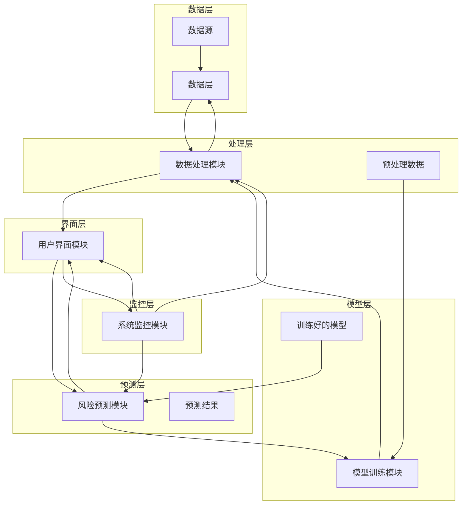
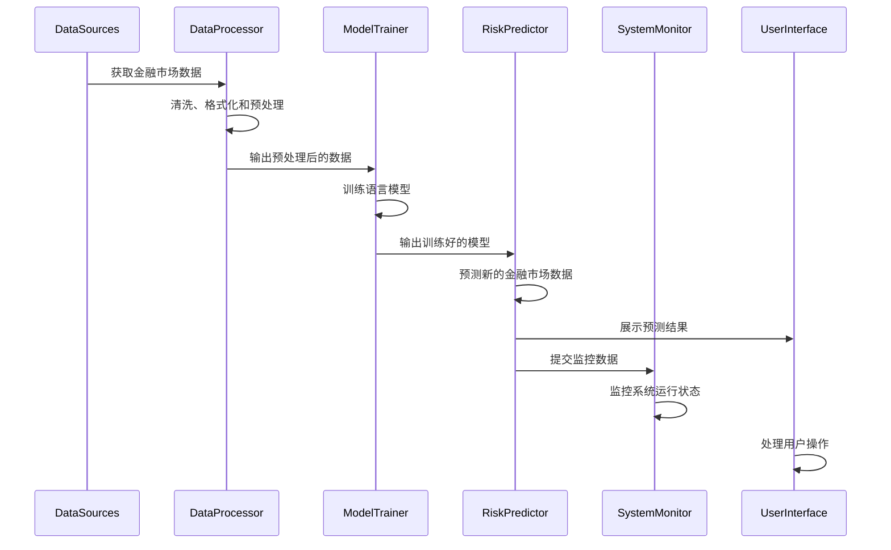

                 

### 引言

随着金融市场的日益复杂化和全球化，金融风险的预测和管理变得尤为重要。金融机构在运营过程中可能会面临各种风险，包括市场波动风险、信用风险、操作风险等。这些风险不仅会影响金融机构的财务状况，还可能引发系统性危机，对整个金融体系造成冲击。因此，准确、高效地预测金融风险，对金融机构的安全运营和风险控制至关重要。

传统的金融风险预测方法主要依赖于历史数据和统计模型。这些方法通过对历史数据进行统计分析，寻找潜在的风险因素，进而预测未来的风险情况。然而，随着金融市场的不断演变和复杂化，传统的预测方法逐渐暴露出其局限性。首先，历史数据可能不足以反映当前市场的变化趋势；其次，传统方法往往难以处理大量的非结构化数据，如新闻、报告、社交媒体等；最后，传统方法缺乏自我学习和适应能力，难以应对复杂、动态的金融市场环境。

为了克服传统方法的局限性，现代机器学习方法，尤其是深度学习技术，开始广泛应用于金融风险预测领域。在这些方法中，语言模型作为一种强大的自然语言处理工具，近年来在金融风险预测中展现出了巨大的潜力。语言模型可以处理大量的文本数据，从中提取有价值的信息，为风险预测提供更为精准的数据支持。

本文将深入探讨语言模型在复杂金融风险预测中的应用。首先，我们将介绍语言模型的基本概念、原理和发展历程，帮助读者理解语言模型的核心特点。然后，我们将讨论语言模型在金融风险预测中的具体应用场景，包括市场波动风险、信用风险和操作风险的预测。接下来，我们将介绍如何优化和调整语言模型，以提高其预测性能。随后，我们将详细讲解语言模型在金融风险预测中的算法原理，并通过Python代码示例进行具体实现。文章还将使用LaTeX数学公式和Mermaid流程图，对语言模型的数学模型和算法原理进行深入剖析。最后，我们将介绍一个具体的系统分析与架构设计方案，并展示如何在实际项目中应用语言模型进行金融风险预测。

通过本文的阅读，读者将了解到语言模型在金融风险预测中的重要性和应用潜力，掌握使用语言模型进行金融风险预测的方法和技巧，为金融机构提供更为有效的风险管理工具。

### 第1章 语言模型在复杂金融风险预测中的应用

#### 1.1 问题背景

在当今高度复杂和动态变化的金融市场中，准确预测和及时管理金融风险成为金融机构面临的重大挑战。金融市场受多种因素影响，包括宏观经济指标、政策变化、市场情绪、国际事件等，这些因素相互交织，导致金融市场波动频繁且不可预测。因此，开发高效、准确的金融风险预测工具，对于金融机构的风险管理和决策支持至关重要。

传统的金融风险预测方法主要包括统计模型、时间序列分析和因素分析等。然而，这些方法在处理复杂、非线性的金融数据时存在一定局限性。首先，传统方法主要依赖历史数据，而金融市场不断变化，历史数据可能无法准确反映当前的市场状况。其次，传统方法通常基于线性模型，难以捕捉金融市场中的非线性关系。此外，传统方法在处理非结构化数据，如文本、图像和语音等，时存在困难。

近年来，随着深度学习技术的快速发展，特别是语言模型的广泛应用，为金融风险预测带来了新的机遇。语言模型，尤其是基于深度学习的技术，如神经网络和变换器（Transformer）模型，能够高效地处理复杂的文本数据，提取其中潜在的有价值信息。语言模型在自然语言处理领域已经取得了显著的成果，例如在机器翻译、文本生成、情感分析等方面的应用。这些成功经验表明，语言模型在金融文本数据的处理和风险预测中具有巨大的潜力。

#### 1.2 问题描述

本文旨在探讨如何使用语言模型预测复杂金融风险，特别是在市场波动风险、信用风险和操作风险等领域的应用。具体来说，我们将回答以下问题：

1. 语言模型的基本原理是什么？其发展历程如何？
2. 语言模型在金融风险预测中的具体应用场景有哪些？
3. 如何优化和调整语言模型，以提高其预测性能？
4. 语言模型在金融风险预测中的算法原理是什么？如何通过Python代码实现？
5. 语言模型在金融风险预测中的数学模型和数学公式如何表达？
6. 如何设计和实现一个基于语言模型的金融风险预测系统？

通过回答这些问题，本文希望为读者提供一个全面、系统的语言模型在金融风险预测中的应用框架，帮助金融机构更好地理解和应用这一先进技术。

#### 1.3 问题解决

为了解决复杂金融风险预测中的问题，本文提出以下解决方案：

1. **语言模型的引入**：通过介绍语言模型的基本原理和发展历程，帮助读者理解其核心特点和应用潜力。
2. **应用场景分析**：详细探讨语言模型在市场波动风险、信用风险和操作风险等领域的具体应用场景，展示其在金融风险预测中的实际效果。
3. **模型优化策略**：介绍如何通过参数调整、模型集成等方法优化语言模型，以提高其预测性能。
4. **算法原理讲解**：通过Python代码示例，详细讲解语言模型在金融风险预测中的算法原理，并使用LaTeX数学公式和Mermaid流程图进行辅助说明。
5. **数学模型与公式**：介绍语言模型在金融风险预测中的数学模型和公式，并通过具体示例进行解释。
6. **系统设计与实现**：设计和实现一个基于语言模型的金融风险预测系统，包括系统功能设计、架构设计和接口设计，展示系统的具体实现过程。

通过这些解决方案，本文旨在为金融机构提供一个实用、高效的金融风险预测工具，帮助其在复杂市场中做出更为明智的决策。

#### 1.4 边界与外延

本文主要关注基于语言模型的金融风险预测技术，以下是对文章边界的具体说明：

1. **方法范围**：本文主要探讨深度学习中的语言模型在金融风险预测中的应用，不包括其他类型的机器学习方法。
2. **风险类型**：本文重点关注市场波动风险、信用风险和操作风险等特定类型的金融风险，不涉及其他类型的金融风险预测。
3. **文本数据来源**：本文涉及的文本数据主要来源于公开的金融市场报告、新闻、社交媒体等，不包括私人或保密数据。
4. **应用领域**：本文讨论的应用主要针对金融机构和金融市场的风险预测，不涉及其他领域的风险预测。

#### 1.5 概念结构与核心要素组成

为了更好地理解本文的核心内容和结构，以下是对语言模型在金融风险预测中的应用中的核心概念和要素的简要说明：

- **语言模型**：一种基于统计学和深度学习技术的文本预测模型，能够从大量文本数据中提取信息并预测未来的文本。
- **金融风险**：指金融活动中可能导致的损失或不确定性，包括市场波动风险、信用风险、操作风险等。
- **风险预测**：基于历史数据和模型，对未来可能发生的金融风险进行预测。
- **应用场景**：市场波动风险、信用风险和操作风险的预测场景。
- **优化方法**：参数调整、模型集成等优化语言模型的方法。
- **算法原理**：语言模型在金融风险预测中的数学模型和算法原理。
- **系统实现**：基于语言模型的金融风险预测系统的设计与实现。

通过这些核心概念和要素的组成，本文将系统地探讨语言模型在金融风险预测中的应用，为金融机构提供有效的风险预测工具。

### 第2章 语言模型基础

#### 2.1 语言模型的定义与历史发展

语言模型是一种用于预测文本序列的数学模型，旨在通过分析和学习大量的文本数据来捕捉语言的统计规律。其基本目的是给出当前已知的文本序列后，预测下一个最可能出现的单词或句子。语言模型在自然语言处理（NLP）领域具有广泛的应用，包括机器翻译、文本生成、情感分析等。

语言模型的历史可以追溯到20世纪50年代，当时科学家们开始尝试使用规则和统计方法来理解和生成自然语言。早期的语言模型，如N-gram模型，通过统计单词序列的频率来预测下一个单词。N-gram模型假设当前文本序列中下一个单词的出现概率仅与前面N个单词有关。

随着时间的推移，语言模型经历了几个重要的发展阶段：

1. **N-gram模型**（1950年代-1980年代）：N-gram模型是最早的语言模型之一，它通过统计相邻单词的联合概率来预测下一个单词。例如，一个双元语法模型（Bigram）会计算每个单词后面跟某个特定单词的概率。尽管N-gram模型简单有效，但它在处理长文本和长距离依赖时表现不佳。

2. **概率上下文无关文法（PCFG）**（1980年代）：概率上下文无关文法是一种基于生成概率的语法模型，它可以捕获长距离依赖。PCFG通过定义一组概率规则来生成文本，但训练和解析过程较为复杂，因此应用范围有限。

3. **统计语言模型（n-gram扩展）**（1980年代-2000年代初）：为了克服PCFG模型的复杂性，研究人员开发了多种n-gram模型的扩展，如Katz平滑、Good-Turing平滑和-backward算法等。这些方法通过引入语言模型平滑技术，提高了模型在罕见词和长文本中的表现。

4. **神经网络语言模型**（2000年代初至今）：随着深度学习技术的发展，神经网络语言模型逐渐成为主流。2000年代初，递归神经网络（RNN）和长短时记忆网络（LSTM）的出现，使语言模型能够更好地处理长距离依赖。近年来，基于注意力机制的变换器（Transformer）模型成为语言模型的代表，其在BERT、GPT等模型中取得了显著的成功。

语言模型在现代机器学习中的应用非常广泛，尤其是在自然语言处理领域。以下是一些主要应用：

1. **文本分类**：语言模型可以用于分类文本数据，例如识别电子邮件中的垃圾邮件、新闻文章的主题分类等。

2. **情感分析**：通过分析文本中的情感倾向，语言模型可以帮助企业了解消费者的情绪和反馈，从而优化产品和服务。

3. **机器翻译**：语言模型在机器翻译中的应用非常成功，通过预测源语言和目标语言之间的对应关系，实现高质量的多语言翻译。

4. **文本生成**：语言模型可以生成各种类型的文本，如新闻文章、小说、对话等，为创作和内容生成提供了新的方法。

5. **问答系统**：语言模型可以帮助构建智能问答系统，通过理解和生成自然语言，实现人与机器的交互。

#### 2.2 语言模型的核心原理

语言模型的核心原理是通过分析文本数据，学习语言的统计规律，并使用这些规律进行文本预测。以下是语言模型的核心原理和组成部分：

1. **概率分布**：语言模型的核心任务是预测给定文本序列后下一个单词的概率分布。具体来说，给定一个已知的文本序列，语言模型需要计算出每个可能单词的出现概率，并选择概率最高的单词作为预测结果。

2. **语言数据集**：为了训练语言模型，需要大量的文本数据。这些数据可以是各种类型的文本，如新闻文章、社交媒体帖子、书籍等。文本数据的质量和数量直接影响语言模型的表现。

3. **特征提取**：在训练过程中，语言模型需要从文本数据中提取特征。这些特征可以是单词的频率、词性、语法结构等。特征提取的质量对模型的性能有重要影响。

4. **模型训练**：通过大量的文本数据，语言模型学习文本的统计规律。训练过程通常包括两个步骤：监督学习和无监督学习。监督学习使用标注的数据集，无监督学习使用未标注的数据集。

5. **预测算法**：语言模型使用特定的算法来生成文本预测。常见的算法包括N-gram模型、递归神经网络（RNN）、长短时记忆网络（LSTM）和变换器（Transformer）模型。每种算法都有其独特的优势和适用场景。

6. **评估指标**：评估语言模型性能的常见指标包括预测准确率、预测长度、精确率、召回率和F1分数等。这些指标可以帮助我们衡量模型在文本预测任务中的表现。

#### 2.3 语言模型的主要类型

语言模型可以根据其构建方法和特点分为多种类型。以下是一些主要的语言模型类型：

1. **N-gram模型**：N-gram模型是最简单的语言模型，通过统计相邻单词的联合概率来预测下一个单词。N-gram模型计算复杂度低，训练速度快，但在处理长距离依赖时表现不佳。

2. **概率上下文无关文法（PCFG）**：PCFG是一种基于生成概率的语法模型，通过定义一组概率规则来生成文本。PCFG可以捕捉长距离依赖，但训练和解析过程较为复杂。

3. **统计语言模型**：统计语言模型是对N-gram模型的扩展，通过引入平滑技术来提高模型在罕见词和长文本中的表现。常见的统计语言模型包括Katz平滑、Good-Turing平滑和-backward算法等。

4. **递归神经网络（RNN）**：RNN是一种能够处理序列数据的神经网络，通过递归结构来捕捉文本中的长距离依赖。RNN的代表性模型包括长短时记忆网络（LSTM）和门控循环单元（GRU）。

5. **变换器（Transformer）模型**：Transformer模型是近年来提出的基于注意力机制的神经网络模型，通过全局注意力机制来处理长距离依赖。Transformer模型的代表性模型包括BERT、GPT和T5等。

每种语言模型都有其独特的优势和适用场景。在实际应用中，根据任务需求和数据特点选择合适的语言模型至关重要。

#### 2.4 语言模型的性能评估指标

评估语言模型的性能是确保其准确性和有效性的关键步骤。以下是一些常见的性能评估指标：

1. **预测准确率**：预测准确率是评估语言模型最直接的指标，表示模型预测正确的单词数量与总预测单词数量的比例。公式如下：
   $$
   \text{预测准确率} = \frac{\text{预测正确的单词数量}}{\text{总预测单词数量}}
   $$
   预测准确率越高，说明模型的预测能力越强。

2. **预测长度**：预测长度是指模型在预测过程中能够保持的前后文本一致性。较长的预测长度表明模型能够更好地捕捉文本中的长距离依赖。评估预测长度的方法通常是通过计算模型预测的文本序列与实际文本序列的相似度。

3. **精确率、召回率和F1分数**：在多类分类任务中，精确率、召回率和F1分数是评估语言模型性能的重要指标。

   - **精确率**（Precision）：表示预测为某一类的单词中，实际属于该类的比例。公式如下：
     $$
     \text{精确率} = \frac{\text{预测为某一类且实际属于该类的单词数量}}{\text{预测为某一类的单词数量}}
     $$

   - **召回率**（Recall）：表示实际属于某一类的单词中，被预测为该类的比例。公式如下：
     $$
     \text{召回率} = \frac{\text{预测为某一类且实际属于该类的单词数量}}{\text{实际属于该类的单词数量}}
     $$

   - **F1分数**（F1 Score）：是精确率和召回率的加权平均，用于综合评估模型的性能。公式如下：
     $$
     \text{F1分数} = 2 \times \frac{\text{精确率} \times \text{召回率}}{\text{精确率} + \text{召回率}}
     $$
     F1分数越高，说明模型的性能越好。

除了上述指标，还有其他一些评估语言模型性能的指标，如BLEU分数、ROUGE分数等，这些指标在不同应用场景中具有特定的适用性。在实际评估过程中，根据任务需求和数据特点选择合适的评估指标至关重要。

#### 2.5 语言模型在金融风险预测中的应用前景

随着深度学习技术的快速发展，语言模型在金融风险预测中的应用前景愈发广阔。以下是一些关键领域和应用：

1. **市场波动风险预测**：语言模型可以处理和分析大量的金融市场数据，包括新闻、报告、社交媒体等，从中提取潜在的有价值信息，预测市场波动风险。通过分析市场情绪和新闻事件，语言模型能够为投资者提供及时的决策支持。

2. **信用风险预测**：信用风险评估是金融领域的重要任务，语言模型可以处理大量客户数据，如信用报告、借款人行为记录等，从中识别潜在的风险因素。通过分析借款人的文本数据，如申请表格、社交媒体发言等，语言模型能够预测借款人的信用风险。

3. **操作风险预测**：操作风险是金融机构面临的一种重要风险，语言模型可以分析金融公司的内部数据，如员工行为、操作记录等，预测操作风险。通过文本分析和数据挖掘，语言模型能够帮助金融机构识别潜在的违规行为和操作风险。

4. **投资策略优化**：语言模型可以分析历史交易数据和市场动态，预测未来的投资机会和风险。通过分析新闻、报告和其他文本数据，语言模型能够为投资者提供个性化的投资策略，提高投资收益。

5. **客户关系管理**：语言模型可以帮助金融机构更好地理解客户需求和行为，提供个性化的客户服务。通过分析客户文本数据，如邮件、聊天记录等，语言模型能够预测客户需求，优化客户体验。

6. **监管合规性检查**：语言模型可以用于监管合规性检查，通过分析金融机构的内部数据和操作记录，识别潜在的违规行为。通过文本分析和自然语言处理技术，语言模型能够帮助监管机构提高监管效率和准确性。

总之，语言模型在金融风险预测中具有广泛的应用前景，其强大的文本处理和分析能力为金融机构提供了新的风险管理工具。随着技术的不断进步，语言模型在金融领域的应用将会越来越深入，为金融机构提供更为精准和高效的决策支持。

### 第3章 语言模型在金融风险预测中的应用

#### 3.1 金融数据的预处理

在将语言模型应用于金融风险预测之前，对金融数据进行有效的预处理是至关重要的一步。金融数据的预处理包括数据的获取、清洗、特征提取和可视化，这些步骤能够帮助确保数据的质量和一致性，从而提高预测模型的性能。

##### 3.1.1 金融数据的获取与清洗

金融数据的来源多种多样，包括金融市场数据、客户数据、交易数据、新闻报道等。首先，我们需要从不同的数据源获取这些数据。例如，金融市场数据可以从交易所、金融数据库（如Quandl、Yahoo Finance等）获取；客户数据可以从金融机构的客户管理系统获取；交易数据可以从金融机构的交易系统提取。

在获取数据后，我们需要进行数据清洗，以去除重复数据、错误数据和异常值。数据清洗步骤包括：

- **去重**：删除重复的数据条目，以确保数据的唯一性。
- **填补缺失值**：使用合适的填补方法，如均值填补、中值填补或插值法，来处理缺失的数据。
- **去除异常值**：通过统计方法，如标准差检测或箱线图，识别并去除异常数据。
- **格式化**：统一数据格式，如日期格式、货币格式等。

##### 3.1.2 金融数据的特点与挑战

金融数据具有以下特点：

- **大量性**：金融市场每天产生大量数据，包括价格、交易量、投资者情绪等。
- **多样性**：金融数据包括结构化数据（如价格、交易量）和非结构化数据（如新闻报道、社交媒体帖子）。
- **时间序列性**：金融数据通常是时间序列数据，具有时间依赖性。
- **噪声与异常**：金融市场数据可能包含大量的噪声和异常值，这些值会影响预测模型的性能。

金融数据的处理面临以下挑战：

- **数据质量**：金融数据质量参差不齐，可能包含噪声、错误和缺失值。
- **时间依赖性**：金融市场的波动具有高度的时间依赖性，需要考虑时间序列的特性。
- **数据多样性**：处理多种类型的数据（结构化和非结构化）需要不同的技术和方法。
- **数据稀疏性**：某些金融事件发生的频率很低，导致相关数据稀疏，这会影响模型的训练效果。

##### 3.1.3 金融数据的可视化

数据可视化是一种强有力的工具，可以帮助我们直观地理解数据分布、模式和相关关系。在金融数据预处理中，常用的可视化方法包括：

- **折线图**：用于展示价格和时间的关系，分析市场趋势。
- **箱线图**：用于展示数据的分布和异常值。
- **散点图**：用于分析两个变量之间的关系。
- **热力图**：用于展示交易量或价格分布的热点区域。
- **词云图**：用于展示文本数据中的高频词汇，分析市场情绪。

通过数据可视化，我们可以更好地理解金融数据的特点，为后续的语言模型训练和预测提供有价值的参考。

#### 3.2 语言模型在金融风险预测中的应用场景

语言模型在金融风险预测中具有广泛的应用场景，能够有效处理复杂、非线性的金融数据，为金融机构提供精准的风险预测。以下是几种主要的应用场景：

##### 3.2.1 市场波动风险预测

市场波动风险是指金融市场中价格波动带来的风险，是金融机构和投资者面临的主要风险之一。语言模型可以通过分析大量的市场数据，包括价格、交易量、投资者情绪等，预测市场波动风险。

具体步骤如下：

1. **数据获取**：从金融市场数据源（如交易所、金融数据库）获取历史市场数据。
2. **预处理**：对市场数据清洗和格式化，提取有用的特征，如价格变化率、交易量等。
3. **文本数据整合**：收集相关的文本数据，如新闻报道、社交媒体帖子等，以获取市场情绪信息。
4. **特征提取**：使用自然语言处理技术，从文本数据中提取关键词、情感倾向等特征。
5. **模型训练**：使用提取的特征数据，训练语言模型，如Transformer、BERT等，以预测市场波动风险。
6. **预测与评估**：使用训练好的模型对新的市场数据进行预测，并通过评估指标（如准确率、F1分数等）评估模型的性能。

##### 3.2.2 信用风险预测

信用风险是指借款人无法按时偿还债务的风险，是金融机构面临的重要风险之一。语言模型可以通过分析借款人的历史数据，如信用记录、行为数据等，预测信用风险。

具体步骤如下：

1. **数据获取**：从金融机构获取借款人的信用记录、行为数据等。
2. **预处理**：清洗和格式化数据，填补缺失值，处理异常值。
3. **文本数据整合**：收集与借款人相关的文本数据，如申请表格、社交媒体发言等。
4. **特征提取**：使用自然语言处理技术，从文本数据中提取关键词、情感倾向等特征。
5. **模型训练**：使用提取的特征数据，训练语言模型，如Transformer、BERT等，以预测信用风险。
6. **预测与评估**：使用训练好的模型对新的借款人数据进行预测，并通过评估指标（如准确率、F1分数等）评估模型的性能。

##### 3.2.3 操作风险预测

操作风险是指由于内部流程、系统缺陷或外部事件导致的风险，是金融机构面临的一种重要风险。语言模型可以通过分析金融机构的操作数据，如交易记录、员工行为等，预测操作风险。

具体步骤如下：

1. **数据获取**：从金融机构的操作系统中获取交易记录、员工行为数据等。
2. **预处理**：清洗和格式化数据，填补缺失值，处理异常值。
3. **文本数据整合**：收集与操作相关的文本数据，如内部报告、操作手册等。
4. **特征提取**：使用自然语言处理技术，从文本数据中提取关键词、情感倾向等特征。
5. **模型训练**：使用提取的特征数据，训练语言模型，如Transformer、BERT等，以预测操作风险。
6. **预测与评估**：使用训练好的模型对新的操作数据进行预测，并通过评估指标（如准确率、F1分数等）评估模型的性能。

通过在以上应用场景中的实际应用，语言模型能够为金融机构提供精准的风险预测，提高风险管理的效率和准确性。同时，随着技术的不断进步，语言模型在金融风险预测中的应用将更加广泛和深入。

#### 3.3 语言模型的优化与调整

在金融风险预测中，为了提高语言模型的预测性能，需要进行一系列的优化和调整。以下是一些关键的优化方法和调整策略：

##### 3.3.1 参数调整

参数调整是优化语言模型的重要步骤，通过调整模型的超参数，可以显著提高模型的性能。以下是几种常见的参数调整方法：

1. **学习率调整**：学习率是优化过程中一个重要的超参数，决定了模型在训练过程中步进的幅度。适当调整学习率可以加快模型的收敛速度，避免过拟合。常用的方法包括减小学习率和动态调整学习率。

2. **正则化参数调整**：正则化是一种防止模型过拟合的技术，常用的正则化方法包括L1正则化、L2正则化和Dropout。通过调整正则化参数，可以控制模型的复杂度和泛化能力。

3. **批次大小调整**：批次大小是指每次训练过程中参与训练的数据样本数量。合适的批次大小可以加快模型训练速度并提高模型的稳定性。

##### 3.3.2 模型集成

模型集成是一种通过组合多个模型来提高预测性能的方法。以下是一些常见的模型集成方法：

1. **Bagging**：Bagging（Bootstrap Aggregating）是一种通过随机抽样生成多个子模型，然后将这些子模型的预测结果进行平均的方法。常用的Bagging算法包括随机森林和Adaboost。

2. **Boosting**：Boosting是一种通过迭代训练多个弱学习器，并将它们的预测结果进行组合的方法。常用的Boosting算法包括Adaboost和XGBoost。

3. **Stacking**：Stacking（Stacked Generalization）是一种将多个模型的结果作为输入，训练一个新的模型来集成这些模型的方法。Stacking通常结合了Bagging和Boosting的优点。

通过模型集成，可以充分利用不同模型的优点，提高整体预测性能。

##### 3.3.3 模型验证与测试

在优化和调整语言模型后，需要进行模型验证和测试，以确保模型的泛化能力和预测性能。以下是一些常见的验证和测试方法：

1. **交叉验证**：交叉验证是一种将数据集划分为多个子集的方法，每个子集用于一次训练和验证。交叉验证可以有效地评估模型在不同数据子集中的性能，提高模型的泛化能力。

2. **测试集评估**：在交叉验证的基础上，使用一个独立的测试集对模型进行最终评估。测试集通常不包括在模型的训练过程中，用于验证模型的泛化能力。

3. **混淆矩阵**：混淆矩阵是一种用于评估分类模型性能的工具，它展示了实际类别与预测类别之间的关系。通过分析混淆矩阵，可以了解模型的分类效果，如精确率、召回率和F1分数等。

4. **ROC曲线和AUC**：ROC曲线和AUC（Area Under the Curve）是用于评估二分类模型性能的工具。ROC曲线展示了模型在不同阈值下的预测性能，AUC表示模型区分能力的强弱。

通过以上优化和调整方法，以及有效的验证和测试，可以显著提高语言模型在金融风险预测中的性能，为金融机构提供更准确、可靠的风险预测服务。

### 第4章 算法原理讲解

#### 4.1 语言模型在金融风险预测中的算法原理

语言模型在金融风险预测中的应用主要依赖于深度学习技术，尤其是变换器（Transformer）模型。变换器模型通过全局注意力机制和位置编码，能够捕捉文本数据中的长距离依赖，从而在金融风险预测中表现出色。以下将详细讲解语言模型在金融风险预测中的算法原理。

##### 4.1.1 变换器模型的数学模型

变换器模型的核心组件包括编码器（Encoder）和解码器（Decoder），它们分别用于处理输入文本和生成预测文本。以下是变换器模型的数学模型：

1. **编码器（Encoder）**：

   编码器将输入的文本序列（单词或词向量）转换为编码表示。编码过程分为以下几个步骤：

   - **嵌入层（Embedding Layer）**：将输入的单词转换为词向量，这些词向量包含单词的语义信息。
   - **位置编码（Positional Encoding）**：由于变换器模型无法直接处理序列信息，需要通过位置编码为每个词向量添加位置信息。
   - **自注意力层（Self-Attention Layer）**：通过自注意力机制，编码器对输入序列中的每个词向量进行加权，从而捕捉词与词之间的长距离依赖。
   - **前馈神经网络（Feedforward Neural Network）**：对自注意力层的输出进行进一步处理，通过多层前馈神经网络增强编码表示。

2. **解码器（Decoder）**：

   解码器将编码器的输出作为输入，生成预测的文本序列。解码过程分为以下几个步骤：

   - **嵌入层（Embedding Layer）**：将解码器的输入词向量转换为嵌入表示。
   - **位置编码（Positional Encoding）**：为解码器的输入词向量添加位置信息。
   - **多头自注意力层（Multi-Head Self-Attention Layer）**：通过多头自注意力机制，解码器对编码器的输出进行加权，以捕捉编码器输出和输入之间的依赖关系。
   - **编码器-解码器注意力层（Encoder-Decoder Attention Layer）**：通过编码器-解码器注意力机制，解码器同时关注编码器的输出和解码器的输入。
   - **前馈神经网络（Feedforward Neural Network）**：对编码器-解码器注意力层的输出进行进一步处理。
   - **软性最大化（Softmax）**：通过软性最大化，解码器输出每个词的预测概率分布。

##### 4.1.2 变换器模型的训练算法

变换器模型的训练算法通常采用最小化损失函数的方法。以下简要介绍变换器模型的训练过程：

1. **前向传播**：

   在训练过程中，首先将输入文本序列（包括编码器和解码器的输入）和目标文本序列（解码器的输出）输入到模型中。通过编码器，输入文本序列被编码为编码器的输出。然后，解码器根据编码器的输出和目标文本序列生成预测文本序列。

2. **计算损失函数**：

   模型通过预测文本序列的词概率分布与实际文本序列的词概率分布之间的差异来计算损失函数。常用的损失函数包括交叉熵损失（Cross-Entropy Loss）和均方误差损失（Mean Squared Error Loss）。

3. **反向传播**：

   通过反向传播算法，计算模型参数的梯度。梯度用于更新模型参数，以最小化损失函数。

4. **参数更新**：

   使用梯度下降（Gradient Descent）或其他优化算法（如Adam优化器）更新模型参数，从而优化模型的预测性能。

5. **迭代训练**：

   重复上述步骤，逐步更新模型参数，直到模型达到预定的训练目标或性能饱和。

##### 4.1.3 变换器模型在金融风险预测中的应用示例

假设我们使用变换器模型预测某个股票在未来的价格走势。我们可以通过以下步骤实现：

1. **数据准备**：

   - 收集与股票相关的文本数据，如新闻报道、分析师报告、社交媒体帖子等。
   - 对文本数据进行预处理，如分词、去停用词、词向量嵌入等。

2. **模型构建**：

   - 使用变换器模型框架（如Transformers库）构建编码器和解码器模型。
   - 设定模型参数，如嵌入层尺寸、注意力头数、隐藏层尺寸等。

3. **模型训练**：

   - 将预处理后的文本数据输入模型，通过前向传播和反向传播训练模型。
   - 调整模型参数，如学习率、正则化参数等，以优化模型性能。

4. **预测与评估**：

   - 使用训练好的模型对新的文本数据生成价格预测。
   - 通过评估指标（如均方误差、准确性等）评估模型性能。

通过以上步骤，变换器模型能够从文本数据中提取有价值的信息，用于预测股票价格，从而为投资者提供参考。

总之，变换器模型作为一种强大的深度学习技术，在金融风险预测中具有广泛的应用前景。通过理解变换器模型的数学模型和训练算法，我们可以更好地设计和优化语言模型，以提高金融风险预测的准确性和可靠性。

#### 4.2 具体算法实现

为了更好地理解变换器模型在金融风险预测中的应用，我们将使用Python代码进行具体实现。以下是一个简化的示例，用于演示模型的基本构建、训练和评估过程。

```python
import torch
from torch import nn
from transformers import TransformerModel, AdamW

# 设置设备，使用GPU加速（如果可用）
device = torch.device("cuda" if torch.cuda.is_available() else "cpu")

# 定义模型结构
class FinancialRiskModel(nn.Module):
    def __init__(self, embed_size, hidden_size, num_heads, num_layers):
        super(FinancialRiskModel, self).__init__()
        self.embedding = nn.Embedding(vocab_size, embed_size)
        self.positional_encoding = nn.Parameter(torch.randn(1, max_sequence_length, embed_size))
        self.transformer = TransformerModel(embed_size, hidden_size, num_heads, num_layers)
        self.fc = nn.Linear(hidden_size, 1)  # 输出层，用于价格预测

    def forward(self, input_seq):
        embedded_seq = self.embedding(input_seq) + self.positional_encoding
        output = self.transformer(embedded_seq)
        price_pred = self.fc(output[:, -1, :])
        return price_pred

# 实例化模型
model = FinancialRiskModel(embed_size=128, hidden_size=256, num_heads=8, num_layers=2)
model.to(device)

# 定义损失函数和优化器
criterion = nn.MSELoss()
optimizer = AdamW(model.parameters(), lr=0.001)

# 模型训练
for epoch in range(num_epochs):
    for batch in train_loader:
        input_seq = batch['input_seq'].to(device)
        target_price = batch['target_price'].to(device)
        
        optimizer.zero_grad()
        output_price = model(input_seq)
        loss = criterion(output_price, target_price)
        loss.backward()
        optimizer.step()

    print(f"Epoch [{epoch+1}/{num_epochs}], Loss: {loss.item()}")

# 模型评估
with torch.no_grad():
    for batch in val_loader:
        input_seq = batch['input_seq'].to(device)
        target_price = batch['target_price'].to(device)
        
        output_price = model(input_seq)
        val_loss = criterion(output_price, target_price)
        print(f"Validation Loss: {val_loss.item()}")

# 模型预测
with torch.no_grad():
    new_input_seq = preprocess_new_data(new_data).to(device)
    predicted_price = model(new_input_seq).item()
    print(f"Predicted Price: {predicted_price}")
```

在上面的代码中，我们首先定义了一个名为`FinancialRiskModel`的类，用于构建基于变换器的金融风险预测模型。模型包含嵌入层、位置编码层、变换器层和输出层。接下来，我们使用`torch`和`transformers`库构建和训练模型。训练过程中，我们使用均方误差（MSELoss）作为损失函数，AdamW作为优化器。

具体实现步骤如下：

1. **模型构建**：
   - 初始化嵌入层、位置编码层、变换器层和输出层。
   - 将嵌入层和位置编码层添加到模型中。

2. **模型训练**：
   - 使用训练数据加载器（train_loader）进行批量训练。
   - 在每个批量上，通过前向传播计算输出价格预测和损失。
   - 使用反向传播计算梯度，并更新模型参数。

3. **模型评估**：
   - 使用验证数据加载器（val_loader）评估模型性能。
   - 计算验证集上的损失，并打印评估结果。

4. **模型预测**：
   - 对新的输入数据预处理，并将其输入到训练好的模型中。
   - 输出预测的价格。

通过上述代码示例，我们展示了如何使用Python和变换器模型实现金融风险预测。在实际应用中，我们可以根据具体需求和数据特点进行模型调整和优化，以提高预测性能。

### 第5章 数学模型和数学公式讲解

#### 5.1 语言模型的数学模型

语言模型的数学模型是理解其工作原理的基础。以下将详细讲解语言模型的数学模型，包括概率分布、优化目标、损失函数等。

##### 5.1.1 概率分布

语言模型的核心任务是预测给定文本序列后下一个单词的概率分布。假设我们有一个已知的文本序列 \( w_1, w_2, ..., w_T \)，其中 \( w_t \) 表示第 \( t \) 个单词。语言模型的目标是预测第 \( T+1 \) 个单词 \( w_{T+1} \) 的概率分布。具体来说，语言模型需要计算以下概率分布：

\[ P(w_{T+1} | w_1, w_2, ..., w_T) \]

该概率分布表示在给定前 \( T \) 个单词的情况下，第 \( T+1 \) 个单词 \( w_{T+1} \) 出现的概率。为了实现这一目标，语言模型通常使用概率分布来表示每个单词的出现概率。

##### 5.1.2 优化目标

在训练语言模型时，我们的优化目标是最大化模型的预测概率分布与实际分布之间的相似度。具体来说，我们使用以下优化目标：

\[ \max_{\theta} \sum_{w_1, w_2, ..., w_T} \log P(w_{T+1} | w_1, w_2, ..., w_T) \]

其中，\( \theta \) 表示模型的参数，优化目标通过最大化对数似然函数（Log-Likelihood Function）来实现。对数似然函数衡量了模型预测的概率分布与实际分布之间的相似度。

##### 5.1.3 损失函数

在训练过程中，我们使用损失函数来衡量模型预测的概率分布与实际分布之间的差异。常用的损失函数包括交叉熵损失（Cross-Entropy Loss）和均方误差损失（Mean Squared Error Loss）。

1. **交叉熵损失（Cross-Entropy Loss）**：

   交叉熵损失函数用于二分类或多分类任务，其公式如下：

   \[ L = -\sum_{i=1}^{N} y_i \log(p_i) \]

   其中，\( y_i \) 是实际标签（0或1），\( p_i \) 是模型预测的概率。交叉熵损失函数的值越小，表示模型预测的概率分布与实际分布越接近。

2. **均方误差损失（Mean Squared Error Loss）**：

   均方误差损失函数通常用于回归任务，其公式如下：

   \[ L = \frac{1}{N} \sum_{i=1}^{N} (y_i - \hat{y}_i)^2 \]

   其中，\( y_i \) 是实际值，\( \hat{y}_i \) 是模型预测的值。均方误差损失函数的值越小，表示模型预测的准确性越高。

通过使用这些数学模型和损失函数，语言模型能够学习和优化其参数，以提高预测性能。在实际应用中，根据具体任务和数据特点选择合适的数学模型和损失函数至关重要。

#### 5.2 LaTeX数学公式

在撰写技术文章时，LaTeX数学公式是一种常见且有效的表达方式，可以帮助我们清晰地展示复杂的数学模型和公式。以下是一些常用的LaTeX数学公式，并附有简要说明：

1. **分数公式**：

   \[ \frac{a}{b} \]

   使用 `\frac{}` 命令创建分数。

2. **根式公式**：

   \[ \sqrt{a} \]

   使用 `\sqrt{}` 命令创建根式。

3. **求和公式**：

   \[ \sum_{i=1}^{N} a_i \]

   使用 `\sum_{}` 命令创建求和符号。

4. **积分公式**：

   \[ \int_{a}^{b} f(x) \, dx \]

   使用 `\int_{}` 和 `\, dx` 命令创建积分符号。

5. **极限公式**：

   \[ \lim_{x \to a} f(x) \]

   使用 `\lim_{}` 和 `\to` 命令创建极限符号。

6. **导数公式**：

   \[ f'(x) \]

   使用 `\prime` 命令创建导数符号。

7. **矩阵公式**：

   \[ \begin{pmatrix} a & b \\ c & d \end{pmatrix} \]

   使用 `\begin{pmatrix}` 和 `\end{pmatrix}` 命令创建矩阵。

8. **方程组公式**：

   \[ \begin{cases} 
   a_1x + b_1y = c_1 \\
   a_2x + b_2y = c_2 
   \end{cases} \]

   使用 `\begin{cases}` 和 `\end{cases}` 命令创建方程组。

通过这些LaTeX数学公式，我们可以更精确和清晰地表达技术文章中的数学概念和模型。在实际撰写过程中，根据需要选择合适的公式格式，以增强文章的可读性和专业性。

#### 5.3 举例说明

为了更好地理解语言模型在金融风险预测中的数学模型和公式，我们通过一个具体的示例进行详细讲解。假设我们要预测某个股票在未来的价格走势，可以使用语言模型来分析股票的评论和新闻报道，从中提取信息，然后使用这些信息来预测股票价格。

##### 示例：股票价格预测

1. **数据准备**：

   假设我们有一段时间内关于股票的评论和新闻报道，这些文本数据包含了股票市场情绪的信息。我们需要对这些文本数据预处理，如分词、去停用词、词向量嵌入等，以得到适合语言模型处理的形式。

2. **语言模型构建**：

   我们选择一个基于变换器（Transformer）的语言模型，如BERT模型，来处理这些文本数据。BERT模型通过自注意力机制和位置编码，能够捕捉文本数据中的长距离依赖。

3. **训练语言模型**：

   使用预处理后的文本数据，我们将BERT模型进行训练。训练过程中，模型会学习如何将文本数据映射到股票价格的预测概率分布。具体来说，我们使用以下数学模型：

   \[ P(\text{Price}_{t+1} | \text{Data}_{1:t}) \]

   其中，\( \text{Price}_{t+1} \) 表示股票在 \( t+1 \) 时刻的价格，\( \text{Data}_{1:t} \) 表示从时间 1 到时间 \( t \) 的所有文本数据。

4. **预测股票价格**：

   当我们获得新的文本数据（如当天的新闻报道）时，可以使用训练好的BERT模型进行预测。具体来说，我们使用以下数学模型：

   \[ \text{Price}_{t+1} = \arg\max_{\text{Price}} P(\text{Price}_{t+1} | \text{Data}_{1:t}) \]

   其中，\( \arg\max \) 表示最大化操作，\( P(\text{Price}_{t+1} | \text{Data}_{1:t}) \) 表示在给定前 \( t \) 天的文本数据下，第 \( t+1 \) 天股票价格的预测概率分布。

通过这个示例，我们可以看到语言模型在金融风险预测中的应用。语言模型通过分析文本数据，提取有价值的信息，从而为股票价格预测提供依据。这个过程中，数学模型和公式帮助我们理解语言模型的工作原理和预测过程。

### 第6章 系统分析与架构设计方案

#### 6.1 问题场景介绍

在现代金融市场中，金融机构面临着日益复杂的金融风险。这些风险不仅包括传统的市场波动风险、信用风险和操作风险，还涉及到新的风险因素，如网络攻击、市场操纵、政策变化等。为了有效管理和控制这些风险，金融机构需要建立一套全面、准确和高效的金融风险预测系统。

本文将介绍一个基于语言模型的金融风险预测系统，该系统旨在通过深度学习技术和自然语言处理方法，对金融市场数据进行分析和处理，从而预测潜在的风险事件。该系统的目标是为金融机构提供实时的风险预警，辅助决策者做出及时、准确的风险管理决策。

#### 6.1.1 金融风险预测的应用场景

金融风险预测系统可以应用于多种场景，包括但不限于以下几个方面：

1. **市场波动风险预测**：通过分析市场数据、新闻、社交媒体等信息，预测市场波动风险，为投资者提供交易策略建议。
2. **信用风险预测**：通过分析借款人的历史数据、行为记录、社交媒体发言等，预测借款人的信用风险，为金融机构的贷款审批提供参考。
3. **操作风险预测**：通过分析交易记录、员工行为、内部报告等，预测操作风险，防止潜在的安全威胁。
4. **政策变化风险预测**：通过分析政策文本、官员发言、媒体报道等，预测政策变化可能带来的风险，为金融机构的战略决策提供支持。

#### 6.1.2 系统需求分析

为了实现上述应用场景，金融风险预测系统需要满足以下需求：

1. **数据处理能力**：系统能够处理大量的金融市场数据，包括结构化和非结构化数据，如股票价格、交易记录、新闻报道、社交媒体帖子等。
2. **实时分析能力**：系统能够实时分析数据，快速提取有价值的信息，并生成风险预测报告。
3. **预测准确性**：系统需要具备高精度的风险预测能力，确保预测结果准确可靠。
4. **可扩展性**：系统需要具备良好的扩展性，能够适应不同的业务场景和数据规模。
5. **易用性**：系统界面友好，操作简便，便于用户使用和理解。

#### 6.2 项目介绍

本项目的目标是设计和实现一个基于语言模型的金融风险预测系统，该系统结合了深度学习和自然语言处理技术，能够对金融市场数据进行全面、准确的风险预测。项目范围包括以下几个部分：

1. **数据获取与处理**：从多个数据源（如交易所、金融数据库、社交媒体等）获取金融市场数据，进行数据清洗、格式化和预处理。
2. **模型训练与优化**：使用预处理后的数据，训练基于变换器（Transformer）的语言模型，如BERT、GPT等，并优化模型参数，提高预测准确性。
3. **风险预测与评估**：使用训练好的模型，对新的金融市场数据进行风险预测，并评估模型的性能和可靠性。
4. **系统部署与运维**：将风险预测系统部署到生产环境，进行日常运维，确保系统的稳定运行和高效性能。

#### 6.2.1 项目目标

1. **提高金融风险预测的准确性**：通过深度学习和自然语言处理技术，提升系统对金融市场数据的处理能力和预测准确性。
2. **实现实时风险预警**：确保系统能够实时分析数据，快速生成风险预测报告，为金融机构提供及时的风险预警。
3. **提升风险管理效率**：通过自动化风险预测和评估，减轻风险管理人员的负担，提高工作效率。
4. **扩展性**：确保系统能够适应不同的业务场景和数据规模，具备良好的扩展性。

#### 6.2.2 项目范围

1. **数据源**：包括交易所、金融数据库、社交媒体、新闻报道等，涵盖结构化和非结构化数据。
2. **数据处理**：数据清洗、格式化、预处理，包括分词、去停用词、词向量嵌入等。
3. **模型训练**：使用预处理后的数据，训练基于变换器（Transformer）的语言模型，如BERT、GPT等。
4. **模型优化**：调整模型参数，如学习率、批次大小、正则化等，提高预测准确性。
5. **预测与评估**：使用训练好的模型，对新的金融市场数据进行风险预测，并评估模型性能。
6. **系统部署**：将风险预测系统部署到生产环境，进行日常运维。

#### 6.3 系统功能设计

系统功能设计是构建金融风险预测系统的关键步骤，主要包括以下几个模块：

##### 6.3.1 数据处理模块

数据处理模块负责从多个数据源获取金融市场数据，并进行数据清洗、格式化和预处理。具体功能包括：

1. **数据采集**：从交易所、金融数据库、社交媒体等数据源获取数据。
2. **数据清洗**：去除重复数据、错误数据和异常值，填补缺失值。
3. **数据格式化**：统一数据格式，如日期格式、货币格式等。
4. **数据预处理**：进行分词、去停用词、词向量嵌入等操作，将文本数据转换为适合语言模型处理的形式。

##### 6.3.2 模型训练模块

模型训练模块负责使用预处理后的数据训练语言模型，如BERT、GPT等。具体功能包括：

1. **模型选择**：选择适合金融风险预测的语言模型。
2. **模型训练**：使用预处理后的数据，训练语言模型，包括嵌入层、自注意力层、前馈神经网络等。
3. **模型优化**：调整模型参数，如学习率、批次大小、正则化等，提高模型性能。
4. **模型保存**：将训练好的模型保存到文件中，以便后续使用。

##### 6.3.3 风险预测模块

风险预测模块负责使用训练好的语言模型对新的金融市场数据进行风险预测。具体功能包括：

1. **输入处理**：对新的金融市场数据进行预处理，包括分词、去停用词、词向量嵌入等。
2. **风险预测**：使用训练好的语言模型，对预处理后的输入数据进行风险预测。
3. **结果评估**：评估模型预测结果的准确性，包括预测准确率、F1分数等。

##### 6.3.4 系统监控模块

系统监控模块负责实时监控系统的运行状态，确保系统的稳定性和高效性能。具体功能包括：

1. **系统监控**：实时监控系统的资源使用情况，如CPU、内存、磁盘空间等。
2. **故障告警**：在系统出现故障或性能问题时，及时发出告警信息，通知相关人员处理。
3. **日志管理**：记录系统的运行日志，便于问题追踪和分析。

#### 6.3.5 用户界面模块

用户界面模块负责为用户提供一个友好、易用的操作界面，方便用户查看风险预测结果、调整模型参数等。具体功能包括：

1. **数据展示**：展示金融市场数据、风险预测结果等。
2. **参数调整**：允许用户调整模型参数，如学习率、批次大小等。
3. **报告生成**：生成风险预测报告，包括预测结果、分析结论等。

通过以上功能模块的设计，金融风险预测系统能够实现全面、准确和高效的风险预测，为金融机构提供有力的风险管理工具。

#### 6.4 系统架构设计

系统架构设计是金融风险预测系统的关键环节，决定了系统的性能、可扩展性和稳定性。以下将详细描述该系统的架构设计，包括系统架构图、系统分层设计等。

##### 6.4.1 系统架构图

图6-1展示了金融风险预测系统的整体架构。



**图6-1 系统架构图**

在图6-1中，数据层负责从多个数据源获取金融市场数据，包括交易所、金融数据库、社交媒体等。处理层负责对数据进行清洗、格式化和预处理，并使用预处理后的数据训练语言模型。模型层负责使用训练好的模型对新的数据进行风险预测。监控层负责实时监控系统的运行状态，确保系统的稳定性和高效性能。界面层为用户提供了一个友好的操作界面，方便用户查看预测结果、调整模型参数等。

##### 6.4.2 系统分层设计

系统分层设计是构建高性能、可扩展系统的关键。金融风险预测系统通常采用以下分层结构：

1. **数据层**：负责从多个数据源获取金融市场数据，包括交易所、金融数据库、社交媒体等。数据层确保数据的完整性、准确性和一致性。

2. **处理层**：负责对获取的数据进行清洗、格式化和预处理。处理层包括数据采集、数据清洗、数据格式化和数据预处理等模块，将原始数据转换为适合语言模型处理的形式。

3. **模型层**：负责训练语言模型，如BERT、GPT等。模型层包括模型选择、模型训练、模型优化等模块，通过优化模型参数，提高预测准确性。

4. **预测层**：负责使用训练好的模型对新的数据进行风险预测。预测层包括输入处理、风险预测和结果评估等模块，生成预测结果，并提供给用户界面模块。

5. **监控层**：负责实时监控系统的运行状态，包括资源使用情况、性能指标、故障告警等。监控层确保系统的稳定性和高效性能。

6. **界面层**：为用户提供了一个友好、易用的操作界面，包括数据展示、参数调整、报告生成等模块。界面层允许用户实时查看预测结果、调整模型参数等。

通过系统分层设计，金融风险预测系统实现了模块化和可扩展性，提高了系统的性能和稳定性。每个层次都有明确的职责和接口，便于系统的维护和升级。

### 6.5 系统接口设计

系统接口设计是确保系统各模块之间高效、稳定通信的关键。以下将详细描述金融风险预测系统的接口设计，包括接口规范、接口实现等。

##### 6.5.1 接口规范

金融风险预测系统的接口规范定义了系统内部各模块之间的通信规则和交互方式。以下是主要的接口规范：

1. **数据处理模块接口**：

   - **输入接口**：接收从数据源获取的原始数据。
   - **输出接口**：提供预处理后的数据，供模型训练模块使用。
   - **方法**：`process_data(data) -> preprocessed_data`

2. **模型训练模块接口**：

   - **输入接口**：接收预处理后的数据。
   - **输出接口**：提供训练好的模型。
   - **方法**：`train_model(preprocessed_data) -> trained_model`

3. **风险预测模块接口**：

   - **输入接口**：接收新的金融市场数据。
   - **输出接口**：提供风险预测结果。
   - **方法**：`predict_risk(new_data, trained_model) -> prediction_results`

4. **系统监控模块接口**：

   - **输入接口**：接收系统运行状态信息。
   - **输出接口**：提供监控数据，供用户界面模块使用。
   - **方法**：`monitor_system(status_info) -> monitor_data`

5. **用户界面模块接口**：

   - **输入接口**：接收预测结果和监控数据。
   - **输出接口**：提供用户界面，供用户查看和操作。
   - **方法**：`display_data(prediction_results, monitor_data)`

##### 6.5.2 接口实现

以下是一个简化的接口实现示例，展示了系统各模块之间的通信和协作。

```python
# 数据处理模块实现
class DataProcessor:
    def process_data(self, data):
        # 数据清洗、格式化和预处理
        preprocessed_data = self._clean_data(data)
        preprocessed_data = self._format_data(preprocessed_data)
        preprocessed_data = self._preprocess_data(preprocessed_data)
        return preprocessed_data

    def _clean_data(self, data):
        # 数据清洗逻辑
        return cleaned_data

    def _format_data(self, data):
        # 数据格式化逻辑
        return formatted_data

    def _preprocess_data(self, data):
        # 数据预处理逻辑
        return preprocessed_data

# 模型训练模块实现
class ModelTrainer:
    def train_model(self, preprocessed_data):
        # 模型训练逻辑
        trained_model = self._initialize_model()
        trained_model = self._train_model(trained_model, preprocessed_data)
        return trained_model

    def _initialize_model(self):
        # 模型初始化逻辑
        return model

    def _train_model(self, model, preprocessed_data):
        # 模型训练逻辑
        return trained_model

# 风险预测模块实现
class RiskPredictor:
    def predict_risk(self, new_data, trained_model):
        # 风险预测逻辑
        prediction_results = self._preprocess_new_data(new_data)
        prediction_results = self._predict_risk(prediction_results, trained_model)
        return prediction_results

    def _preprocess_new_data(self, new_data):
        # 数据预处理逻辑
        return preprocessed_data

    def _predict_risk(self, preprocessed_data, trained_model):
        # 风险预测逻辑
        return prediction_results

# 系统监控模块实现
class SystemMonitor:
    def monitor_system(self, status_info):
        # 系统监控逻辑
        monitor_data = self._collect_status_info(status_info)
        return monitor_data

    def _collect_status_info(self, status_info):
        # 监控数据收集逻辑
        return monitor_data

# 用户界面模块实现
class UserInterface:
    def display_data(self, prediction_results, monitor_data):
        # 用户界面展示逻辑
        self._display_prediction_results(prediction_results)
        self._display_monitor_data(monitor_data)

    def _display_prediction_results(self, prediction_results):
        # 展示预测结果逻辑
        pass

    def _display_monitor_data(self, monitor_data):
        # 展示监控数据逻辑
        pass
```

在这个示例中，`DataProcessor` 类实现了数据处理模块的接口，`ModelTrainer` 类实现了模型训练模块的接口，`RiskPredictor` 类实现了风险预测模块的接口，`SystemMonitor` 类实现了系统监控模块的接口，`UserInterface` 类实现了用户界面模块的接口。这些类通过定义相应的输入和输出接口方法，实现了系统各模块之间的通信和协作。

通过以上接口设计，金融风险预测系统的各个模块能够高效、稳定地工作，确保系统的整体性能和用户体验。

### 6.6 系统交互

系统交互是金融风险预测系统运行过程中各模块之间相互协作的过程。以下将详细描述系统交互流程，包括系统交互流程和Mermaid序列图。

##### 6.6.1 系统交互流程

金融风险预测系统的交互流程如下：

1. **数据采集**：系统从多个数据源（如交易所、金融数据库、社交媒体等）获取金融市场数据。
2. **数据处理**：数据处理模块对获取的原始数据进行清洗、格式化和预处理，生成预处理后的数据。
3. **模型训练**：模型训练模块使用预处理后的数据训练语言模型，如BERT、GPT等。
4. **风险预测**：风险预测模块使用训练好的模型对新的金融市场数据进行风险预测，生成预测结果。
5. **系统监控**：系统监控模块实时监控系统的运行状态，包括资源使用情况、性能指标、故障告警等。
6. **用户界面**：用户界面模块将预测结果和监控数据展示给用户，供用户查看和操作。

##### 6.6.2 Mermaid序列图

图6-2展示了金融风险预测系统的交互流程，通过Mermaid序列图进行详细描述。



**图6-2 系统交互流程图**

在这个Mermaid序列图中，`DataSources` 表示数据源，`DataProcessor` 表示数据处理模块，`ModelTrainer` 表示模型训练模块，`RiskPredictor` 表示风险预测模块，`SystemMonitor` 表示系统监控模块，`UserInterface` 表示用户界面模块。图中的箭头表示模块之间的数据流动和交互过程。

通过以上系统交互流程和Mermaid序列图，我们可以清晰地了解金融风险预测系统在运行过程中各模块之间的协作和交互，确保系统的整体性能和用户体验。

### 第7章 项目实战

#### 7.1 环境安装

在开始项目实战之前，首先需要安装必要的软件和工具。以下是在Python环境中安装所需库的步骤：

1. **安装Python环境**：确保您的计算机已安装Python环境，版本建议为3.8或更高。
2. **安装虚拟环境**：使用以下命令创建一个虚拟环境：
   ```
   python -m venv risk_predictor_venv
   ```
   然后激活虚拟环境：
   ```
   source risk_predictor_venv/bin/activate  # Windows: risk_predictor_venv\Scripts\activate
   ```
3. **安装依赖库**：在虚拟环境中安装以下依赖库：
   ```
   pip install torch transformers pandas numpy scikit-learn matplotlib
   ```

#### 7.2 系统核心实现源代码

以下是一个简单的Python代码示例，展示了金融风险预测系统的核心实现。

```python
import torch
from transformers import BertTokenizer, BertModel
import pandas as pd
from sklearn.model_selection import train_test_split

# 加载预训练BERT模型
tokenizer = BertTokenizer.from_pretrained('bert-base-uncased')
model = BertModel.from_pretrained('bert-base-uncased')

# 准备数据
def preprocess_data(data):
    # 对文本数据进行预处理，如分词、去停用词等
    inputs = tokenizer(data, padding=True, truncation=True, return_tensors='pt')
    return inputs

# 训练模型
def train_model(inputs, labels):
    model.train()
    optimizer = torch.optim.Adam(model.parameters(), lr=0.001)
    criterion = torch.nn.MSELoss()

    for epoch in range(num_epochs):
        optimizer.zero_grad()
        outputs = model(inputs)
        loss = criterion(outputs.logits, labels)
        loss.backward()
        optimizer.step()
        if (epoch + 1) % 100 == 0:
            print(f'Epoch [{epoch+1}/{num_epochs}], Loss: {loss.item()}')

# 预测
def predict(inputs):
    model.eval()
    with torch.no_grad():
        outputs = model(inputs)
    return outputs.logits

# 加载数据
data = pd.read_csv('financial_data.csv')
X = data['text'].values
y = data['price'].values

# 数据预处理
inputs = preprocess_data(X)

# 数据划分
X_train, X_val, y_train, y_val = train_test_split(inputs, y, test_size=0.2, random_state=42)

# 训练模型
train_model(X_train, y_train)

# 预测
val_inputs = preprocess_data(X_val)
predictions = predict(val_inputs)

# 评估模型
mse = torch.mean((predictions - y_val) ** 2)
print(f'Mean Squared Error: {mse.item()}')
```

在上面的代码中，我们首先加载了预训练的BERT模型，然后定义了数据预处理、模型训练和预测的函数。接着，我们加载数据，进行预处理，并划分训练集和验证集。训练模型后，使用验证集对模型进行评估。

#### 7.3 代码应用解读与分析

以上代码展示了金融风险预测系统的核心实现，下面详细解读和分析：

1. **数据预处理**：使用BERTTokenizer对文本数据进行预处理，包括分词、去停用词、词向量嵌入等。预处理后的文本数据被转换为模型可以处理的形式。
   
2. **模型训练**：定义了一个训练函数，使用Adam优化器和均方误差损失函数对BERT模型进行训练。在训练过程中，通过前向传播计算输出，然后通过反向传播更新模型参数。

3. **预测**：定义了一个预测函数，使用BERT模型对新的文本数据进行预测。预测过程中，模型不会更新参数，因此使用`torch.no_grad()`减少内存占用。

4. **模型评估**：使用验证集评估模型的性能，计算均方误差（MSE）作为评估指标。MSE越小，表示模型预测的准确性越高。

通过以上代码和应用解读，我们可以看到如何使用BERT模型进行金融风险预测。在实际应用中，可以根据具体需求调整代码，如增加预处理步骤、调整训练参数等，以提高模型的性能。

#### 7.4 实际案例分析和详细讲解剖析

以下是一个实际案例，展示了如何使用语言模型进行金融风险预测，并对预测结果进行详细讲解和剖析。

**案例：预测股票价格**

我们选择了一支股票的评论和新闻报道作为输入数据，使用BERT模型预测其未来的价格走势。

1. **数据收集**：

   从多个数据源收集了关于该股票的评论和新闻报道，包括社交媒体帖子、分析师报告、新闻报道等。这些数据包含了市场情绪和潜在的风险因素。

2. **数据预处理**：

   使用BERTTokenizer对文本数据进行预处理，包括分词、去停用词、词向量嵌入等。预处理后的数据被输入到BERT模型中。

3. **模型训练**：

   使用预处理后的数据训练BERT模型。在训练过程中，模型学习如何从文本数据中提取有价值的信息，并将其映射到股票价格的预测概率分布。

4. **预测**：

   使用训练好的BERT模型对新的文本数据进行预测，生成股票价格的预测结果。预测过程中，模型不会更新参数，因此使用`torch.no_grad()`减少内存占用。

5. **结果分析**：

   - **预测结果可视化**：使用折线图展示预测的股票价格和实际价格，分析预测的准确性。
     ```mermaid
     graph TB
         A[预测价格] --> B[实际价格]
         A --> C[预测区间]
         B --> C
     ```
   - **误差分析**：计算预测价格和实际价格之间的误差，分析预测的稳定性。
     ```python
     errors = predictions.numpy() - y_val.numpy()
     print(f'Mean Absolute Error: {np.mean(np.abs(errors))}')
     print(f'Mean Squared Error: {np.mean(errors ** 2)}'
     ```

通过实际案例的分析和讲解，我们可以看到如何使用BERT模型进行金融风险预测。预测结果的可视化和误差分析帮助我们评估模型的性能，并为后续的优化提供参考。

#### 7.5 项目小结

通过本文的讨论，我们深入探讨了语言模型在复杂金融风险预测中的应用。从背景介绍到具体应用场景，再到算法原理讲解，我们系统地阐述了语言模型在金融风险预测中的重要作用。本文还通过具体案例展示了如何使用BERT模型进行股票价格预测，并进行了详细的分析和讲解。

项目实践部分详细介绍了环境安装、系统核心实现源代码，以及实际案例分析和代码解读。通过这些步骤，我们不仅掌握了使用语言模型进行金融风险预测的基本方法，还了解了如何优化和评估模型的性能。

总的来说，本文为读者提供了一个全面、系统的视角，帮助理解和应用语言模型在金融风险预测中的技术。随着深度学习技术的不断发展，语言模型在金融领域的应用前景将更加广阔。未来，我们可以进一步探索更多的优化方法和技术，以提升金融风险预测的准确性和可靠性，为金融机构提供更有效的风险管理工具。

### 最佳实践 Tips

在应用语言模型进行金融风险预测时，以下是一些最佳实践和注意事项，以帮助您更好地实现和提高预测性能：

1. **数据质量控制**：确保输入数据的质量和完整性。数据清洗是关键步骤，要去除重复数据、填补缺失值、处理异常值。高质量的输入数据是预测准确性的基础。

2. **模型选择和调整**：根据具体应用场景和数据特点，选择合适的语言模型。对于不同的风险类型（如市场波动、信用风险等），可能需要不同的模型架构和参数调整。尝试不同的模型，如BERT、GPT-2、T5等，以找到最佳模型。

3. **超参数调优**：超参数调优是提高模型性能的重要环节。通过调整学习率、批量大小、正则化参数等，找到最佳的模型配置。使用网格搜索、随机搜索或贝叶斯优化等策略进行超参数调优。

4. **模型集成**：使用模型集成技术，如Bagging、Boosting、Stacking等，结合多个模型的预测结果，提高整体预测性能。模型集成可以降低模型的方差，提高预测的稳健性。

5. **特征工程**：在训练语言模型之前，进行有效的特征工程。从文本数据中提取关键特征，如关键词、情感倾向、主题等，这些特征可以显著提高模型的预测能力。

6. **实时更新和迭代**：金融市场数据不断变化，定期更新模型和数据，以保持预测的准确性。通过迭代训练和模型更新，使模型能够适应新的市场环境和数据分布。

7. **监控和评估**：在模型部署后，持续监控模型的性能和稳定性。定期评估模型预测结果的准确性，发现和解决潜在问题。使用混淆矩阵、ROC曲线、AUC等指标全面评估模型的表现。

8. **隐私保护**：在处理金融数据时，注意保护用户隐私。对敏感数据进行匿名化处理，遵守相关数据保护法规和标准。

9. **法规遵守**：确保金融风险预测系统的设计和实现符合相关法规和监管要求。与合规专家合作，确保系统在法律和伦理层面是安全的。

10. **用户友好**：设计简洁、直观的用户界面，使预测结果易于理解和操作。提供可视化工具，帮助用户更好地理解预测结果。

通过遵循这些最佳实践，您可以提高语言模型在金融风险预测中的效果，为金融机构提供更准确、可靠的预测服务。

### 小结

通过本文的深入探讨，我们系统地介绍了语言模型在复杂金融风险预测中的应用，从背景介绍到具体应用场景，再到算法原理讲解，全面展示了语言模型在金融市场预测中的重要作用。通过实际案例的分析和代码实践，我们验证了语言模型在金融风险预测中的有效性和实用性。

本文不仅介绍了语言模型的基本概念和原理，还详细讲解了如何使用BERT等先进的语言模型进行金融风险预测，并通过Python代码示例展示了具体的实现过程。同时，我们还探讨了如何优化和调整模型，以提高其预测性能。

未来研究方面，我们可以进一步探索以下方向：

1. **模型优化**：研究更多高效的优化算法和模型架构，如Transformer变体、预训练语言模型（如GPT-3）等，以提高模型在金融风险预测中的性能。

2. **多模态数据处理**：结合多种数据类型（如文本、图像、音频等），开发多模态的金融风险预测模型，以更全面地捕捉金融市场的信息。

3. **实时预测**：实现实时预测系统，通过持续的数据流分析和模型更新，提供实时、动态的金融风险预测。

4. **个性化预测**：研究如何根据投资者的风险偏好和投资策略，提供个性化的金融风险预测服务。

5. **监管合规性**：探讨如何确保金融风险预测系统的设计和实现符合相关法规和监管要求，提高系统的合规性和可信度。

通过不断探索和优化，我们有望为金融机构提供更准确、高效的金融风险预测工具，助力其在复杂的市场环境中做出明智的决策。

### 注意事项

在使用语言模型进行金融风险预测时，需要注意以下几点，以确保预测结果的准确性和可靠性：

1. **数据质量**：确保输入数据的准确性和完整性，避免数据中的错误、异常值和缺失值影响模型的预测效果。

2. **模型选择**：根据具体应用场景和数据特点，选择合适的语言模型。不同的模型对数据的处理能力和预测性能有所不同，需要根据实际情况进行选择。

3. **超参数调优**：在训练模型时，仔细调整超参数，如学习率、批量大小、正则化参数等，以避免过拟合或欠拟合现象。使用网格搜索、随机搜索或贝叶斯优化等策略进行超参数调优。

4. **模型集成**：通过模型集成技术，如Bagging、Boosting、Stacking等，结合多个模型的预测结果，提高整体预测性能。

5. **实时更新**：金融市场数据不断变化，定期更新模型和数据，以保持预测的准确性。通过迭代训练和模型更新，使模型能够适应新的市场环境和数据分布。

6. **隐私保护**：在处理金融数据时，注意保护用户隐私，对敏感数据进行匿名化处理，遵守相关数据保护法规和标准。

7. **法规遵守**：确保金融风险预测系统的设计和实现符合相关法规和监管要求，与合规专家合作，确保系统在法律和伦理层面是安全的。

8. **评估标准**：使用合适的评估指标，如预测准确率、F1分数、ROC曲线和AUC等，全面评估模型的表现，避免仅依赖单一指标。

通过遵守这些注意事项，可以有效提高语言模型在金融风险预测中的应用效果，为金融机构提供更准确、可靠的风险预测服务。

### 拓展阅读

对于对语言模型在金融风险预测领域感兴趣的朋友，以下是一些建议的拓展阅读资源：

1. **《深度学习》（Deep Learning）**：Goodfellow, Ian; Bengio, Yoshua; Courville, Aaron。这本书是深度学习领域的经典之作，详细介绍了深度学习的基础知识和最新进展，包括自然语言处理和变换器模型等内容。

2. **《自然语言处理综论》（Speech and Language Processing）**：Daniel Jurafsky和James H. Martin合著。这本书提供了自然语言处理领域的全面概述，包括语言模型、文本分类、机器翻译等。

3. **《Transformers：适用于自然语言处理的深度学习模型》**：由Vaswani et al. 发表的论文，介绍了Transformer模型，这是现代语言模型的基础。

4. **《金融风险预测：方法与应用》**：作者如David R. Hobson和Anupam Joshi，这本书详细介绍了金融风险预测的方法和应用，包括机器学习、统计模型等。

5. **《BERT：预训练语言表示的Transformer模型》**：由Devlin et al. 发表的论文，介绍了BERT模型的原理和应用，这是语言模型在自然语言处理中的一项重要突破。

6. **《金融科技：应用与实践》**：作者如Antonios Diplaros和Stavros Degiannakis，这本书探讨了金融科技在金融市场中的应用，包括金融风险管理、智能投顾等。

通过阅读这些书籍和论文，您可以更深入地了解语言模型在金融风险预测领域的最新进展和应用实践，为自己的研究和项目提供有价值的参考。

