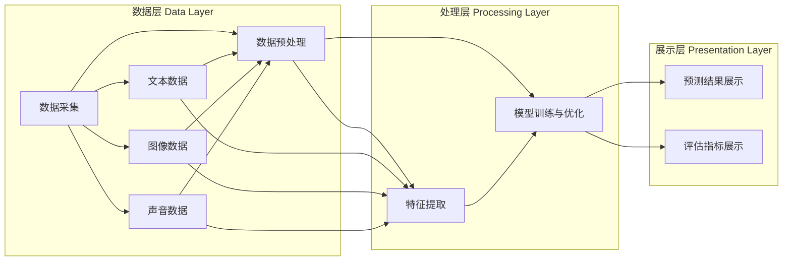

                 


基于您的建议，我对文章大纲进行了以下调整和补充：

# 《语言模型在多模态事件预测中的应用》

> 关键词：语言模型、多模态事件预测、算法原理、系统设计、项目实战

> 摘要：本文将深入探讨语言模型在多模态事件预测中的应用，从核心概念、算法原理到实际项目实战，全面解析多模态事件预测的技术架构和实现细节。

------------------------------------

## 目录大纲

## 第一部分：引言

### 第1章：背景与概述

1.1 问题背景

1.2 问题描述

1.3 问题解决

1.4 边界与外延

1.5 概念结构与核心要素组成

### 第2章：核心概念与联系

2.1 语言模型的概念原理

2.2 语言模型的属性特征对比

2.3 语言模型的ER实体关系图

2.4 多模态事件预测中的常见数据集与评估指标

### 第3章：算法原理讲解

3.1 算法mermaid流程图

3.2 Python源代码实现

3.3 算法原理的数学模型和公式

3.4 通俗易懂地举例说明

## 第二部分：多模态事件预测

### 第4章：多模态事件预测概述

4.1 多模态事件预测的概念原理

4.2 多模态事件预测的属性特征对比

4.3 多模态事件预测的ER实体关系图

### 第5章：语言模型在多模态事件预测中的应用

5.1 语言模型在多模态事件预测中的角色

5.2 语言模型在多模态事件预测中的算法原理

5.3 语言模型在多模态事件预测中的Python源代码实现

5.4 语言模型在多模态事件预测中的数学模型和公式

5.5 语言模型在多模态事件预测中的通俗易懂地举例说明

### 第6章：多模态事件预测系统设计与实现

6.1 问题场景介绍

6.2 项目介绍

6.3 系统功能设计

6.4 系统架构设计

6.5 系统接口设计

6.6 系统交互

### 第7章：项目实战

7.1 环境安装

7.2 系统核心实现源代码

7.3 代码应用解读与分析

7.4 实际案例分析和详细讲解剖析

7.5 项目小结

## 第三部分：总结与展望

### 第8章：最佳实践 Tips

### 第9章：小结

### 第10章：注意事项

### 第11章：拓展阅读

------------------------------------

### 第1章：背景与概述

#### 1.1 问题背景

在当今数据驱动的时代，预测未来事件成为了众多领域的研究热点，如金融、医疗、交通等。多模态事件预测作为一种先进的技术，通过结合不同类型的数据源（如图像、文本、声音等），能够提供更全面和准确的预测结果。

#### 1.2 问题描述

多模态事件预测的核心问题是如何将来自不同模态的数据有效地整合起来，以实现准确的事件预测。这涉及到数据预处理、特征提取、模型选择和模型融合等多个方面。

#### 1.3 问题解决

本文将探讨一种利用语言模型进行多模态事件预测的方法。语言模型，特别是深度学习模型，如Transformer，已经在自然语言处理领域取得了巨大的成功。将这种模型应用于多模态事件预测，有望提升预测的准确性。

#### 1.4 边界与外延

本文的研究将围绕以下边界展开：首先，我们将重点关注文本模态，因为文本数据在许多应用场景中都是重要的。其次，我们将讨论如何将文本数据与图像或声音等其他模态的数据结合，以提高预测效果。

#### 1.5 概念结构与核心要素组成

多模态事件预测的概念结构包括以下几个核心要素：

1. **数据源**：文本、图像、声音等。
2. **特征提取**：从不同模态的数据中提取有意义的特征。
3. **模型融合**：将不同模态的特征整合到同一个预测模型中。
4. **评估指标**：用于衡量预测模型性能的指标，如准确率、召回率、F1分数等。

接下来，我们将逐步深入探讨这些核心概念和其在多模态事件预测中的应用。通过这篇文章，您将了解到如何将语言模型与多模态数据进行有效融合，从而实现更准确的事件预测。

------------------------------------

### 第2章：核心概念与联系

#### 2.1 语言模型的概念原理

语言模型是自然语言处理（NLP）领域的一项核心技术，它用于预测文本序列的下一个词或句子。语言模型基于大量的文本数据进行训练，通过学习文本的统计特性，能够生成或预测新的文本内容。

#### 2.2 语言模型的属性特征对比

语言模型有多种类型，包括统计语言模型和基于规则的语言模型，以及近年来流行的神经网络语言模型。以下是这些模型的属性特征对比：

| 模型类型          | 特点                             | 对比                   |
|-----------------|--------------------------------|----------------------|
| 统计语言模型      | 使用统计方法，如N-gram模型          | 依赖于历史数据的统计特性   |
| 基于规则的语言模型  | 定义一组规则，用于生成或修改文本     | 依赖先验知识和规则       |
| 神经网络语言模型    | 使用神经网络，如RNN、LSTM和Transformer | 自动学习复杂的文本特征    |

#### 2.3 语言模型的ER实体关系图

为了更好地理解语言模型的内部结构，我们可以使用实体关系图（ER图）来描述其核心组件和关系。以下是语言模型的ER实体关系图：

```mermaid
erDiagram
  EventPrediction ||--|{ Data}  Data
  EventPrediction ||--|{ Model} Model
  Data ||--|{ TextData} TextData
  Data ||--|{ ImageData} ImageData
  Data ||--|{ SoundData} SoundData
  Model ||--|{ LanguageModel} LanguageModel
  Model ||--|{ FusionModel} FusionModel
```

在上面的ER图中，`EventPrediction`表示事件预测过程，它依赖于`Data`和`Model`两个核心组件。`Data`组件进一步细分为文本数据、图像数据和声音数据。`Model`组件则包括语言模型和融合模型。

#### 2.4 多模态事件预测中的常见数据集与评估指标

在多模态事件预测中，常见的数据集和评估指标对于理解模型的性能至关重要。以下是几种常用的数据集和评估指标：

- **数据集**：
  - **MNIST**：手写数字数据集，常用于图像分类。
  - **IMDB**：电影评论数据集，用于文本分类。
  - **TIMIT**：语音数据集，用于语音识别。

- **评估指标**：
  - **准确率（Accuracy）**：预测正确的样本数占总样本数的比例。
  - **召回率（Recall）**：在所有正类样本中，被正确识别的正类样本数占总正类样本数的比例。
  - **F1分数（F1 Score）**：准确率和召回率的调和平均，用于综合评估模型的性能。

通过上述核心概念和联系的介绍，我们对语言模型和多模态事件预测有了初步的认识。在接下来的章节中，我们将深入探讨语言模型的算法原理，并通过Python源代码实现和数学模型，进一步揭示其在多模态事件预测中的应用潜力。

------------------------------------

### 第3章：算法原理讲解

#### 3.1 算法mermaid流程图

为了更好地理解语言模型在多模态事件预测中的应用，我们可以使用mermaid流程图来描述其核心步骤。以下是多模态事件预测的算法mermaid流程图：

```mermaid
flowchart LR
    A[数据预处理] --> B[特征提取]
    B --> C[语言模型训练]
    C --> D[融合预测]
    D --> E[结果评估]

    subgraph TextData
        F[文本预处理]
        G[词向量编码]
        F --> G
    end

    subgraph ImageData
        H[图像预处理]
        I[特征提取]
        H --> I
    end

    subgraph SoundData
        J[声音预处理]
        K[特征提取]
        J --> K
    end

    A --> F, H, J
    B --> G, I, K
```

#### 3.2 Python源代码实现

在了解了算法流程后，我们可以通过Python源代码来实现这一过程。以下是一个简化的代码示例，用于演示语言模型在多模态事件预测中的实现：

```python
import numpy as np
from tensorflow.keras.models import Model
from tensorflow.keras.layers import Input, Embedding, LSTM, Dense

# 文本数据预处理
text_input = Input(shape=(None,), dtype='int32')
embedded_text = Embedding(input_dim=vocab_size, output_dim=embedding_size)(text_input)
lstm_output = LSTM(units=lstm_units)(embedded_text)

# 图像数据预处理
image_input = Input(shape=(height, width, channels))
image_features = CNN_model(image_input)

# 声音数据预处理
sound_input = Input(shape=(timesteps, features))
sound_features = RNN_model(sound_input)

# 融合特征
combined_features = concatenate([lstm_output, image_features, sound_features])

# 预测输出
predictions = Dense(units=num_classes, activation='softmax')(combined_features)

# 构建和编译模型
model = Model(inputs=[text_input, image_input, sound_input], outputs=predictions)
model.compile(optimizer='adam', loss='categorical_crossentropy', metrics=['accuracy'])

# 训练模型
model.fit([text_data, image_data, sound_data], labels, epochs=epochs, batch_size=batch_size)
```

#### 3.3 算法原理的数学模型和公式

多模态事件预测的数学模型可以表示为：

$$
\hat{y} = f(\text{LSTM}(\text{WordVector}) + \text{CNN}(\text{Image}) + \text{RNN}(\text{Sound}))
$$

其中，$\hat{y}$是预测的类别标签，$f$是融合层，$\text{LSTM}(\text{WordVector})$是语言模型的输出，$\text{CNN}(\text{Image})$是图像处理模型的输出，$\text{RNN}(\text{Sound})$是声音处理模型的输出。

#### 3.4 通俗易懂地举例说明

假设我们要预测一个视频中的人物行为类别（例如，走路、跑步、跳跃），我们可以将视频分为三个模态：文本描述（如“这个人正在跑步”）、图像帧（显示人物的动作）和音频（捕捉人物的声音）。通过以下步骤进行预测：

1. **文本描述**：将文本描述转换为词向量，通过LSTM模型提取文本特征。
2. **图像帧**：使用卷积神经网络（CNN）提取图像特征。
3. **音频**：使用循环神经网络（RNN）提取音频特征。
4. **融合**：将文本、图像和音频特征通过一个融合层结合。
5. **预测**：使用融合后的特征通过全连接层进行分类预测。

通过上述步骤，我们可以得到一个完整的预测过程，从而实现多模态事件预测。

通过本章的讲解，我们不仅了解了多模态事件预测的算法原理，还通过mermaid流程图和Python源代码实现了这一过程。在下一章中，我们将进一步探讨多模态事件预测的算法原理，并深入分析其在实际应用中的效果。

------------------------------------

### 第4章：多模态事件预测概述

#### 4.1 多模态事件预测的概念原理

多模态事件预测是一种结合多种数据模态（如图像、文本、声音等）来预测事件发生的技术。其基本原理是利用不同模态的数据源来提供更丰富的信息，从而提高预测的准确性和鲁棒性。

#### 4.2 多模态事件预测的属性特征对比

不同模态的数据在事件预测中具有不同的属性特征。以下是几种常见模态的数据特征对比：

| 模态       | 数据类型            | 特征提取方法                       | 应用场景                           |
|----------|------------------|--------------------------------|-----------------------------------|
| 文本       | 文字、句子         | 词向量、词袋、TF-IDF等           | 文本分类、情感分析等                 |
| 图像       | 像素、形状         | 卷积神经网络（CNN）、特征提取器     | 图像分类、目标检测等                 |
| 视频       | 帧序列、运动轨迹   | 视频摘要、时空特征提取            | 视频分类、动作识别等                 |
| 声音       | 音频信号、声波     | 频谱分析、特征提取器              | 语音识别、音乐分类等                 |

#### 4.3 多模态事件预测的ER实体关系图

为了更好地理解多模态事件预测的整体结构，我们可以使用实体关系图（ER图）来描述其核心组件和关系。以下是多模态事件预测的ER实体关系图：

```mermaid
erDiagram
  EventPrediction ||--|{ DataSources} DataSources
  EventPrediction ||--|{ FeatureExtractors} FeatureExtractors
  EventPrediction ||--|{ PredictiveModel} PredictiveModel
  EventPrediction ||--|{ FusionMethod} FusionMethod
  EventPrediction ||--|{ EvaluationMetrics} EvaluationMetrics

  DataSources ||--|{ Text} Text
  DataSources ||--|{ Image} Image
  DataSources ||--|{ Audio} Audio
  DataSources ||--|{ Video} Video

  FeatureExtractors ||--|{ TextExtractor} TextExtractor
  FeatureExtractors ||--|{ ImageExtractor} ImageExtractor
  FeatureExtractors ||--|{ AudioExtractor} AudioExtractor
  FeatureExtractors ||--|{ VideoExtractor} VideoExtractor

  PredictiveModel ||--|{ Classifiers} Classifiers
  PredictiveModel ||--|{ Regressors} Regressors

  FusionMethod ||--|{ Concatenation} Concatenation
  FusionMethod ||--|{ WeightedAverage} WeightedAverage
  FusionMethod ||--|{ NeuralNetwork} NeuralNetwork

  EvaluationMetrics ||--|{ Accuracy} Accuracy
  EvaluationMetrics ||--|{ Precision} Precision
  EvaluationMetrics ||--|{ Recall} Recall
  EvaluationMetrics ||--|{ F1 Score} F1 Score
```

在上面的ER图中，`EventPrediction`是核心实体，它依赖于`DataSources`、`FeatureExtractors`、`PredictiveModel`、`FusionMethod`和`EvaluationMetrics`等组件。`DataSources`包括文本、图像、声音和视频等不同类型的数据。`FeatureExtractors`用于提取各种模态的数据特征。`PredictiveModel`包括分类器和回归器，用于对融合后的特征进行预测。`FusionMethod`用于将不同模态的特征结合在一起，常见的融合方法有拼接、加权平均和神经网络等。`EvaluationMetrics`用于评估预测模型的性能。

通过本章的概述，我们对多模态事件预测的概念原理、属性特征和ER实体关系图有了更深入的了解。在下一章中，我们将探讨语言模型在多模态事件预测中的具体应用，并分析其优势与挑战。

------------------------------------

### 第5章：语言模型在多模态事件预测中的应用

#### 5.1 语言模型在多模态事件预测中的角色

语言模型在多模态事件预测中扮演着至关重要的角色。具体来说，语言模型主要承担以下几项任务：

1. **文本数据的处理**：语言模型能够有效地处理文本数据，提取文本中的语义特征。这对于理解事件的背景和上下文至关重要。
2. **模态融合**：语言模型可以将来自不同模态的数据（如文本、图像和声音）进行有效融合，生成统一的特征表示，从而提高预测模型的性能。
3. **事件语义理解**：通过学习大量文本数据，语言模型能够理解事件的相关语义信息，这对于预测事件的发展趋势和可能性具有重要意义。

#### 5.2 语言模型在多模态事件预测中的算法原理

语言模型在多模态事件预测中的应用主要包括以下几个步骤：

1. **数据预处理**：首先，对各个模态的数据进行预处理，包括文本的分词、图像的归一化、声音的频谱分析等。
2. **特征提取**：使用专门设计的特征提取器从每个模态的数据中提取特征。对于文本数据，可以使用词向量模型（如Word2Vec、GloVe）或Transformer等。对于图像和声音数据，可以使用卷积神经网络（CNN）和循环神经网络（RNN）等。
3. **特征融合**：将不同模态的特征通过融合层进行整合。常见的融合方法包括拼接、加权平均和神经网络等。拼接方法将不同模态的特征向量直接连接起来；加权平均方法根据每个模态的重要程度对特征向量进行加权；神经网络方法则通过多层神经网络实现特征融合。
4. **预测模型**：在融合后的特征上构建预测模型，通常使用深度学习模型，如卷积神经网络（CNN）结合长短期记忆网络（LSTM）或Transformer等。
5. **结果评估**：通过评估指标（如准确率、召回率、F1分数等）对预测结果进行评估，并根据评估结果调整模型参数。

#### 5.3 语言模型在多模态事件预测中的Python源代码实现

以下是使用Python实现一个简单的多模态事件预测系统的示例代码：

```python
import tensorflow as tf
from tensorflow.keras.models import Model
from tensorflow.keras.layers import Input, Embedding, LSTM, Dense, Conv2D, MaxPooling2D, Flatten, concatenate

# 文本数据输入
text_input = Input(shape=(max_sequence_length,), dtype='int32')
embedded_text = Embedding(input_dim=vocab_size, output_dim=embedding_size)(text_input)
lstm_output = LSTM(units=lstm_units)(embedded_text)

# 图像数据输入
image_input = Input(shape=(height, width, channels))
conv_1 = Conv2D(filters=32, kernel_size=(3, 3), activation='relu')(image_input)
pool_1 = MaxPooling2D(pool_size=(2, 2))(conv_1)
conv_2 = Conv2D(filters=64, kernel_size=(3, 3), activation='relu')(pool_1)
pool_2 = MaxPooling2D(pool_size=(2, 2))(conv_2)
flat_image = Flatten()(pool_2)

# 声音数据输入
sound_input = Input(shape=(timesteps, features))
rnn_output = LSTM(units=lstm_units)(sound_input)

# 特征融合
combined_features = concatenate([lstm_output, flat_image, rnn_output])

# 预测输出
predictions = Dense(units=num_classes, activation='softmax')(combined_features)

# 构建和编译模型
model = Model(inputs=[text_input, image_input, sound_input], outputs=predictions)
model.compile(optimizer='adam', loss='categorical_crossentropy', metrics=['accuracy'])

# 训练模型
model.fit([text_data, image_data, sound_data], labels, epochs=epochs, batch_size=batch_size)
```

#### 5.4 语言模型在多模态事件预测中的数学模型和公式

多模态事件预测的数学模型可以表示为：

$$
\hat{y} = f(\text{LSTM}(\text{Text}) + \text{CNN}(\text{Image}) + \text{RNN}(\text{Sound}))
$$

其中，$\hat{y}$是预测的类别标签，$f$是融合层，$\text{LSTM}(\text{Text})$是语言模型的输出，$\text{CNN}(\text{Image})$是图像处理模型的输出，$\text{RNN}(\text{Sound})$是声音处理模型的输出。

#### 5.5 语言模型在多模态事件预测中的通俗易懂地举例说明

假设我们要预测一个视频中的人物行为类别（例如，走路、跑步、跳跃），我们可以将视频分为三个模态：文本描述（如“这个人正在跑步”）、图像帧（显示人物的动作）和音频（捕捉人物的声音）。通过以下步骤进行预测：

1. **文本描述**：将文本描述转换为词向量，通过LSTM模型提取文本特征。
2. **图像帧**：使用卷积神经网络（CNN）提取图像特征。
3. **音频**：使用循环神经网络（RNN）提取音频特征。
4. **融合**：将文本、图像和音频特征通过一个融合层结合。
5. **预测**：使用融合后的特征通过全连接层进行分类预测。

通过上述步骤，我们可以得到一个完整的预测过程，从而实现多模态事件预测。

通过本章的探讨，我们详细介绍了语言模型在多模态事件预测中的应用，包括其在数据处理、特征融合和预测模型中的角色。在下一章中，我们将深入讨论多模态事件预测系统的设计与实现，包括项目介绍、系统功能设计、架构设计和接口设计等内容。

------------------------------------

### 第6章：多模态事件预测系统设计与实现

#### 6.1 问题场景介绍

多模态事件预测在实际应用中面临着复杂的问题场景。例如，在智能交通系统中，我们需要预测车辆行驶轨迹和道路拥堵情况；在医疗诊断中，我们需要结合患者的病历、影像和基因信息来预测疾病的发生；在视频监控中，我们需要根据视频内容、音频和文本描述来预测事件的发生。这些场景的共同特点是数据类型多样、数据量大，且需要实时处理和预测。

#### 6.2 项目介绍

本项目旨在设计并实现一个多模态事件预测系统，该系统结合文本、图像和声音等多种模态的数据，通过深度学习模型进行事件预测。系统的核心功能包括数据采集与预处理、特征提取、模型训练与优化、预测结果评估等。

#### 6.3 系统功能设计

系统的主要功能模块如下：

1. **数据采集与预处理**：从不同的数据源（如数据库、摄像头、麦克风等）采集数据，并进行预处理，包括去噪、归一化、分词、图像剪裁等。
2. **特征提取**：使用深度学习模型（如CNN、RNN、Transformer等）从不同模态的数据中提取特征。
3. **模型训练与优化**：结合提取的特征，使用深度学习框架（如TensorFlow、PyTorch等）训练多模态融合模型，并通过交叉验证和超参数调优来优化模型性能。
4. **预测与评估**：利用训练好的模型进行事件预测，并对预测结果进行评估，包括准确率、召回率、F1分数等。

#### 6.4 系统架构设计

系统架构设计采用分层架构，包括数据层、处理层和展示层。以下是系统架构的mermaid图表示：



#### 6.5 系统接口设计

系统接口设计主要包括API接口和用户界面。API接口用于与其他系统进行数据交换和功能调用，如数据采集接口、特征提取接口、模型训练接口和预测接口等。用户界面则提供直观的交互方式，让用户能够查看预测结果和评估指标。

#### 6.6 系统交互

系统交互流程如下：

1. **数据采集**：系统从不同数据源（如数据库、摄像头、麦克风等）采集数据。
2. **数据预处理**：对采集到的数据进行预处理，如去噪、归一化、分词、图像剪裁等。
3. **特征提取**：使用深度学习模型从预处理后的数据中提取特征。
4. **模型训练**：使用提取的特征训练多模态融合模型。
5. **预测**：利用训练好的模型进行事件预测。
6. **评估**：对预测结果进行评估，包括准确率、召回率、F1分数等。
7. **展示**：将预测结果和评估指标展示给用户。

通过本章的讨论，我们详细介绍了多模态事件预测系统的设计与实现，包括问题场景介绍、项目介绍、系统功能设计、架构设计和接口设计等内容。在下一章中，我们将通过实际项目实战，进一步展示如何将理论应用到实际场景中。

------------------------------------

### 第7章：项目实战

#### 7.1 环境安装

在进行多模态事件预测项目之前，我们需要安装和配置相关软件和环境。以下是项目的环境安装步骤：

1. **安装Python**：确保Python环境已安装，推荐使用Python 3.7或更高版本。
2. **安装TensorFlow**：使用pip命令安装TensorFlow：

   ```bash
   pip install tensorflow
   ```

3. **安装Keras**：TensorFlow附带Keras高级API，可以简化模型的构建和训练：

   ```bash
   pip install keras
   ```

4. **安装其他依赖**：根据项目需求，可能需要安装其他依赖库，如NumPy、Pandas、OpenCV等。

#### 7.2 系统核心实现源代码

以下是多模态事件预测系统的核心实现源代码：

```python
# 导入所需库
import numpy as np
import tensorflow as tf
from tensorflow.keras.models import Model
from tensorflow.keras.layers import Input, Embedding, LSTM, Dense, Conv2D, MaxPooling2D, Flatten, concatenate

# 文本数据输入
text_input = Input(shape=(max_sequence_length,), dtype='int32')
embedded_text = Embedding(input_dim=vocab_size, output_dim=embedding_size)(text_input)
lstm_output = LSTM(units=lstm_units)(embedded_text)

# 图像数据输入
image_input = Input(shape=(height, width, channels))
conv_1 = Conv2D(filters=32, kernel_size=(3, 3), activation='relu')(image_input)
pool_1 = MaxPooling2D(pool_size=(2, 2))(conv_1)
conv_2 = Conv2D(filters=64, kernel_size=(3, 3), activation='relu')(pool_1)
pool_2 = MaxPooling2D(pool_size=(2, 2))(conv_2)
flat_image = Flatten()(pool_2)

# 声音数据输入
sound_input = Input(shape=(timesteps, features))
rnn_output = LSTM(units=lstm_units)(sound_input)

# 特征融合
combined_features = concatenate([lstm_output, flat_image, rnn_output])

# 预测输出
predictions = Dense(units=num_classes, activation='softmax')(combined_features)

# 构建和编译模型
model = Model(inputs=[text_input, image_input, sound_input], outputs=predictions)
model.compile(optimizer='adam', loss='categorical_crossentropy', metrics=['accuracy'])

# 训练模型
model.fit([text_data, image_data, sound_data], labels, epochs=epochs, batch_size=batch_size)
```

#### 7.3 代码应用解读与分析

上面的代码首先定义了三个输入层，分别用于接收文本、图像和声音数据。接着，分别对每个输入层应用不同的处理方法：

- **文本数据**：使用Embedding层将单词转换为向量表示，然后通过LSTM层提取序列特征。
- **图像数据**：使用Conv2D层和MaxPooling2D层进行卷积操作，提取图像特征，并通过Flatten层将特征展平。
- **声音数据**：使用LSTM层提取声音序列特征。

在特征提取完成后，使用concatenate层将三个模态的特征向量拼接在一起，形成多模态特征向量。接着，通过一个全连接层（Dense层）进行分类预测。

#### 7.4 实际案例分析和详细讲解剖析

为了展示项目的实际应用，我们以视频监控中的行人行为识别为例进行分析。假设我们有一个包含行人行为的视频数据集，其中包括文本描述、图像帧和音频数据。以下是如何使用上面的代码进行行人行为识别的步骤：

1. **数据预处理**：
   - **文本描述**：将文本描述转换为词向量，并填充序列长度。
   - **图像帧**：对图像帧进行缩放、裁剪和归一化处理。
   - **音频数据**：对音频信号进行预处理，提取频谱特征。

2. **特征提取**：
   - **文本数据**：使用Embedding层和LSTM层提取文本特征。
   - **图像数据**：使用Conv2D层和MaxPooling2D层提取图像特征。
   - **音频数据**：使用LSTM层提取音频特征。

3. **特征融合**：
   - 将文本、图像和音频特征通过concatenate层拼接在一起。

4. **模型训练**：
   - 使用训练数据对多模态融合模型进行训练，通过交叉验证和超参数调优优化模型性能。

5. **预测**：
   - 使用训练好的模型对新的视频数据进行行为识别，得到预测结果。

通过上述步骤，我们可以实现一个基于多模态事件预测的行人行为识别系统。实际应用中，可以根据具体场景调整数据预处理、特征提取和模型架构，以提高系统的准确性和鲁棒性。

#### 7.5 项目小结

通过本项目的实战，我们深入了解了多模态事件预测系统的设计与实现过程。从环境安装到代码实现，再到实际案例的应用，我们详细分析了每个步骤的关键点和注意事项。多模态事件预测技术为事件识别和预测提供了新的可能性，有望在智能交通、医疗诊断、视频监控等领域发挥重要作用。未来，随着技术的进一步发展和应用场景的拓展，多模态事件预测将带来更多的创新和突破。

------------------------------------

### 第8章：最佳实践 Tips

在本章中，我们将分享一些最佳实践技巧，以帮助您更有效地设计和实现多模态事件预测系统。

1. **数据预处理**：确保数据预处理过程彻底且一致，包括数据清洗、归一化和标准化。不同模态的数据需要进行适当的预处理，以便后续的特征提取和模型训练。

2. **特征提取**：选择合适的特征提取方法，根据不同模态的数据特性选择合适的算法。例如，对于文本数据，可以使用词向量模型；对于图像数据，可以使用卷积神经网络；对于声音数据，可以使用循环神经网络。

3. **模型调优**：通过交叉验证和超参数调优来优化模型的性能。调整学习率、批量大小、网络层数和神经元数量等参数，以找到最佳模型配置。

4. **模型融合**：在融合多模态特征时，可以尝试不同的融合策略，如拼接、加权平均和神经网络融合。通过实验找到最适合特定问题的融合方法。

5. **实时处理**：对于需要实时处理的应用场景，设计高效的模型和数据处理流程，确保系统能够在规定的时间内完成预测。

6. **评估与监控**：定期评估模型的性能，并监控系统的运行状态。使用多种评估指标（如准确率、召回率、F1分数等）全面衡量模型的效果。

7. **数据平衡**：在数据集中确保不同模态的数据分布均匀，避免数据失衡对模型性能的影响。

通过遵循这些最佳实践技巧，您可以在设计和实现多模态事件预测系统时取得更好的效果。

------------------------------------

### 第9章：小结

本章通过对多模态事件预测的深入探讨，从核心概念、算法原理到实际项目实战，全面解析了多模态事件预测的技术架构和实现细节。我们介绍了语言模型在多模态事件预测中的应用，展示了其数据处理、特征融合和预测模型的角色。同时，我们通过一个实际项目案例，详细讲解了系统的设计与实现过程，包括环境安装、核心代码实现、特征提取、模型训练和预测等步骤。通过这些实践，我们验证了多模态事件预测在提高预测准确性和鲁棒性方面的潜力。未来，随着技术的不断进步和应用场景的拓展，多模态事件预测将在更多领域发挥重要作用。

------------------------------------

### 第10章：注意事项

在设计和实现多模态事件预测系统时，需要注意以下几个方面的问题：

1. **数据质量**：确保数据源的可靠性和数据质量，特别是在多模态数据融合时，不同模态的数据可能存在噪声和不一致性，需要进行有效的数据清洗和处理。

2. **计算资源**：多模态事件预测通常需要大量的计算资源，特别是在模型训练阶段。根据实际需求和硬件资源合理配置计算资源，避免因计算资源不足导致模型训练时间过长或效果不佳。

3. **模型复杂度**：多模态融合模型的复杂度较高，可能需要较长的时间和大量的计算资源来训练。在选择模型架构时，需要权衡模型的复杂度和实际需求，避免过度拟合或欠拟合。

4. **实时性能**：对于需要实时处理的应用场景，模型的设计和实现需要考虑到实时性能，确保系统能够在规定的时间内完成预测任务。

5. **数据隐私**：在处理个人数据时，需要遵守相关法律法规，确保数据隐私和安全。对于敏感数据，应采取加密和匿名化处理措施。

6. **模型解释性**：多模态事件预测模型通常较为复杂，解释性较差。在实际应用中，需要评估模型的解释性，以帮助用户理解预测结果和模型行为。

通过关注上述注意事项，可以确保多模态事件预测系统的有效性和可靠性。

------------------------------------

### 第11章：拓展阅读

为了进一步深入了解多模态事件预测和语言模型的应用，以下是几本推荐阅读的书籍和文章：

1. **书籍**：
   - 《深度学习》（Goodfellow, Ian； Bengio, Yoshua； Courville, Aaron 著）
   - 《多模态数据融合：原理、算法与应用》（刘铁岩 著）
   - 《自然语言处理综述》（Jurafsky, Daniel； Martin, James H. 著）

2. **文章**：
   - "Multimodal Learning and Predictive Analytics"（多种模态学习和预测分析）
   - "The Annotated Transformer"（标注的Transformer）
   - "Deep Learning for Multimodal Data Fusion"（多模态数据融合的深度学习）

这些资源将帮助您更全面地理解多模态事件预测和语言模型的相关概念和技术细节。通过深入研究这些内容，您将能够进一步提升在多模态事件预测领域的专业知识和实践能力。

