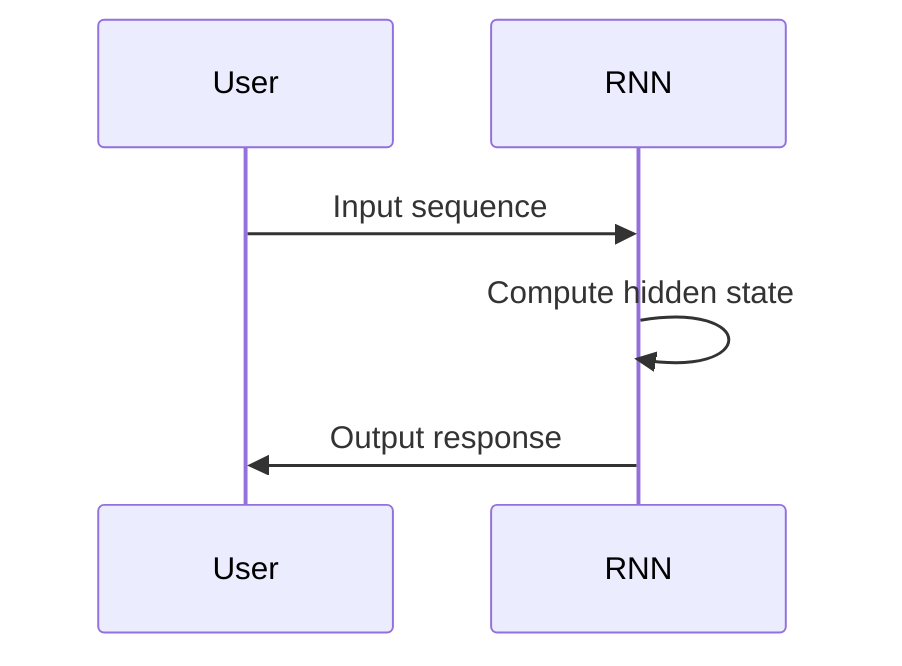
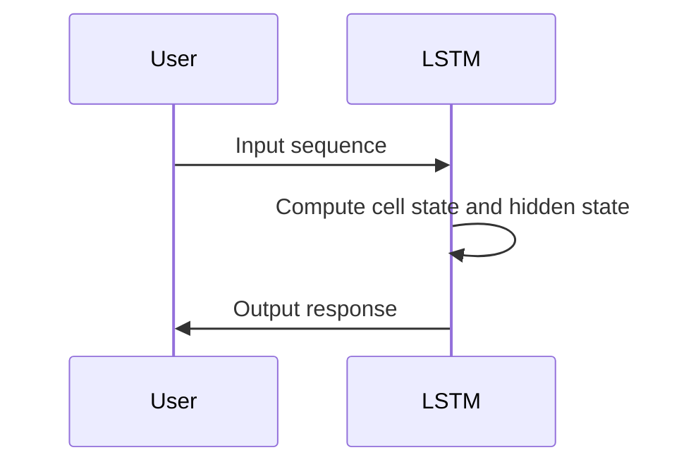
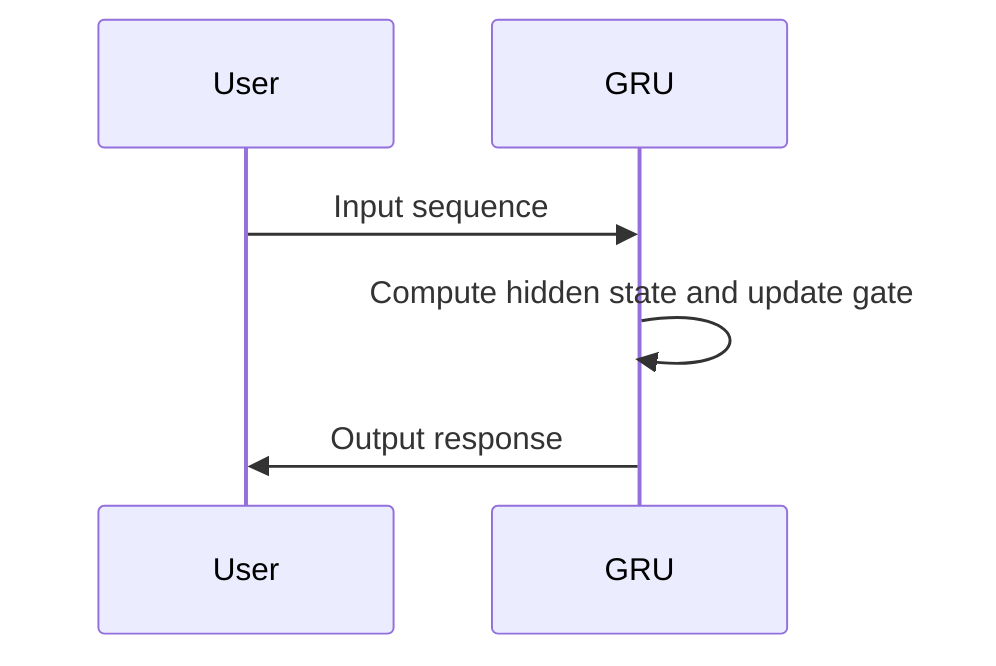
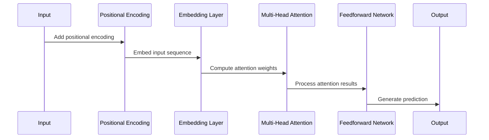
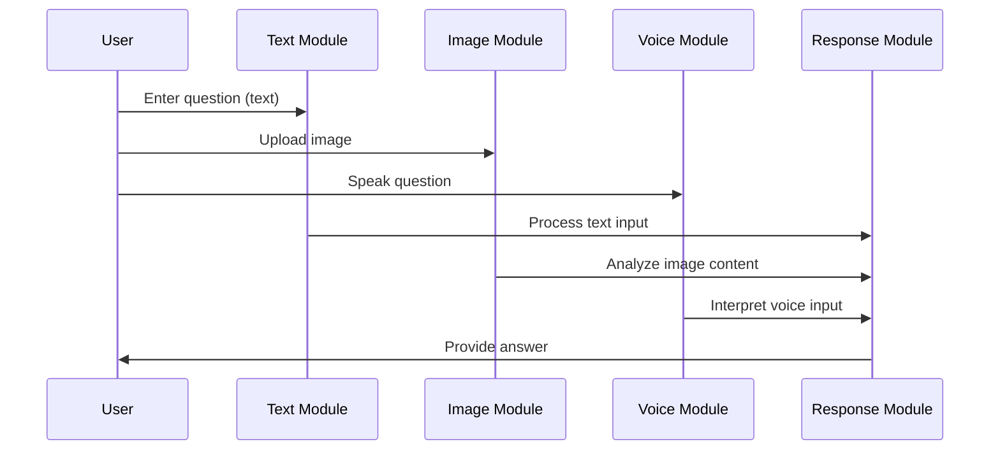
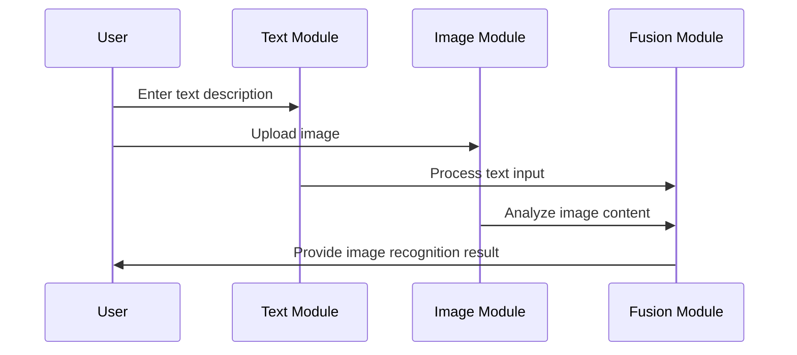
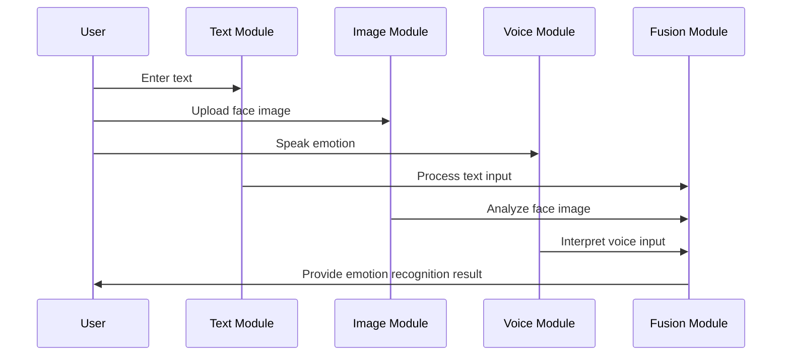

                 

### 引言与背景

在现代科技迅速发展的时代，人工智能（AI）已经成为推动社会进步的重要力量。而语言模型，作为人工智能的核心技术之一，在自然语言处理（NLP）领域发挥着举足轻重的作用。然而，随着多模态交互的兴起，语言模型在处理多种类型数据（如图像、音频、视频等）时的局限性逐渐显现。智能机器人交互，作为多模态交互的一个重要应用场景，对语言模型提出了更高的要求。

首先，我们需要理解多模态场景的理解需求。在多模态场景中，智能系统需要能够处理和分析来自不同模态的数据，如文本、图像、音频等。这种能力的实现，需要语言模型能够跨越不同模态的数据边界，从而实现更精准的场景理解和交互。例如，在医疗诊断中，系统需要结合患者的病历文本、体检图像以及历史数据，来进行综合分析，从而提供更准确的诊断结果。

其次，智能机器人交互面临着诸多挑战。一方面，机器人需要具备高度的自然语言理解和处理能力，以便与人类进行顺畅的交流；另一方面，机器人还需要具备处理多模态数据的能力，以便能够更好地理解用户的需求和意图。例如，在智能客服中，机器人需要能够理解用户的语言表达，并根据用户的需求提供相应的服务，同时还需要能够理解用户的语音和面部表情，以提供更个性化的服务。

语言模型在多模态场景理解和智能机器人交互中的应用潜力巨大。首先，语言模型可以用于多模态数据的融合，从而提高系统的整体性能。例如，通过将文本和图像数据相结合，语言模型可以更准确地理解用户的意图。其次，语言模型可以用于智能机器人的对话系统，从而实现更加自然和流畅的交互。例如，通过使用深度学习技术，语言模型可以自动学习用户的语言习惯和偏好，从而提供更加个性化的服务。

综上所述，本文将围绕语言模型在多模态场景理解和智能机器人交互中的应用进行探讨。我们将首先介绍多模态场景的理解需求，然后分析智能机器人交互的挑战，并探讨语言模型的应用潜力。随后，我们将深入探讨语言模型的数学基础、多模态数据处理方法、智能机器人交互机制，以及突破性进展的数学描述。最后，我们将通过具体的应用案例，展示语言模型在多模态场景理解和智能机器人交互中的实际应用，并提出相关的设计技巧和最佳实践。

### 语言模型的定义

语言模型（Language Model，简称LM）是自然语言处理领域的一种核心技术，它旨在模拟人类语言生成和理解的能力。具体来说，语言模型是一种概率模型，它能够预测一段文本的下一个单词或字符的概率。这一过程可以通过统计方法或基于深度学习的神经网络来实现。

语言模型的核心作用在于其对文本数据的生成和理解能力。在文本生成方面，语言模型可以用于自动写作、文本摘要和对话系统等应用。例如，在自动写作中，语言模型可以生成新闻报道、文章摘要等。在文本理解方面，语言模型可以用于信息检索、语义分析和情感分析等任务。例如，在情感分析中，语言模型可以分析文本中的情感倾向，从而帮助企业了解用户反馈和市场需求。

语言模型的主要类型包括基于统计的语言模型和基于神经网络的语言模型。基于统计的语言模型，如n-gram模型，通过统计文本中连续单词或字符的频率来预测下一个单词或字符。这种方法简单有效，但受限于文本序列的短序列依赖性。基于神经网络的语言模型，如递归神经网络（RNN）和Transformer模型，通过深度学习技术，能够捕捉文本中的长序列依赖关系，从而实现更精准的预测。其中，Transformer模型因其并行计算的优势，在自然语言处理任务中表现尤为突出。

### 多模态数据的处理

多模态数据是指同时包含多种类型数据的信息源，如文本、图像、音频和视频等。处理多模态数据是智能系统理解复杂场景、提供个性化服务和实现高效交互的关键。然而，多模态数据的处理面临诸多挑战，需要采用多种技术手段进行综合分析。

首先，多模态数据的收集与预处理是处理多模态数据的基础。数据收集阶段需要确保数据来源的多样性和代表性，以便模型能够学习和理解不同模态的数据特征。例如，在图像数据方面，可以采用开源数据集如ImageNet或COCO，而在文本数据方面，可以采用大规模的文本语料库如维基百科或新闻语料库。数据预处理阶段则需要对不同模态的数据进行清洗、归一化和特征提取，以便为后续的融合处理提供高质量的数据。

接下来，多模态数据融合算法是实现多模态数据综合分析的核心技术。常见的多模态数据融合方法包括基于特征的融合方法和基于模型的融合方法。基于特征的融合方法，如早期融合和后期融合，分别在不同阶段将不同模态的数据特征进行合并。早期融合方法，如VGG和ResNet，通过将图像特征和文本特征在特征层进行结合，从而提高模型对多模态数据的理解能力。后期融合方法，如DeepFusion和Multimodal Transformer，通过在分类或回归阶段将不同模态的特征进行加权融合，以实现更精确的预测。

多模态数据的处理还面临一些独特的挑战。首先，不同模态的数据具有不同的结构和特征，如图像数据包含像素级的细节，而文本数据则包含语义信息。因此，如何有效整合这些差异化的数据特征是处理多模态数据的关键。其次，多模态数据通常存在数据同步问题，即不同模态的数据在时间上可能存在不一致，这给数据融合和模型训练带来了挑战。此外，多模态数据的计算复杂度高，如何优化计算效率和资源分配也是需要解决的问题。

为解决这些挑战，研究者们提出了一系列创新的解决方案。例如，深度学习方法可以自动学习不同模态数据之间的关联特征，从而提高数据融合的效果。多模态神经网络模型，如CNN和RNN的结合，可以同时捕捉图像和文本的时空特征，从而实现更准确的数据理解。此外，多任务学习（Multi-Task Learning）和迁移学习（Transfer Learning）等方法也可以有效提升多模态数据的处理性能。

总之，多模态数据的处理是智能系统发展的重要方向，通过综合利用不同模态的数据特征，可以大幅提升系统的理解和交互能力。未来，随着技术的不断进步，多模态数据处理的挑战将逐步得到解决，为智能系统的发展提供更强有力的支持。

### 智能机器人交互机制

智能机器人交互机制是指智能机器人与人类之间进行有效通信和互动的方式。这种机制基于对自然语言处理（NLP）、语音识别（ASR）和语音合成（TTS）等核心技术的综合应用。为了实现高效的智能机器人交互，系统通常需要具备以下几方面功能：

首先，智能机器人需要具备自然语言理解能力。这意味着机器人能够通过语音识别技术接收人类的语言输入，并将其转化为文本格式，以便进一步处理。语音识别技术通过分析语音信号中的音素和语音模式，将其转换为机器可识别的文本数据。这个过程涉及声学模型和语言模型的结合，其中声学模型负责语音信号到文本符号的转换，而语言模型则负责理解文本的含义。

其次，智能机器人需要能够进行语言生成和响应。这要求机器人能够利用语言模型生成流畅、自然的语音输出，以回复用户的问题或提供相关信息。语言生成过程通常包括文本到语音的转换，即通过文本生成模型将自然语言文本转化为语音信号，再由语音合成系统将其播放给用户。

此外，智能机器人还需要具备上下文理解能力，以实现更自然的对话体验。这意味着机器人需要能够理解对话中的语境、用户意图和情感，从而生成适当的回应。上下文理解可以通过多轮对话上下文的累积和推理实现，这通常需要复杂的自然语言处理技术，如语义角色标注、实体识别和情感分析等。

为了实现这些功能，智能机器人交互机制通常包括以下几个关键组成部分：

1. **语音识别模块**：负责接收并识别用户语音，将其转化为文本数据。这一模块通常基于深度学习模型，如卷积神经网络（CNN）和递归神经网络（RNN）。

2. **自然语言处理模块**：负责对文本数据进行分析和理解，提取关键信息，理解用户意图。这一模块可能包括词法分析、句法分析、语义分析和情感分析等任务。

3. **对话管理模块**：负责管理对话流程，包括对话意图识别、对话策略生成和对话状态追踪。这一模块通常基于图灵图（Turing Graph）或隐马尔可夫模型（HMM）等算法。

4. **语音合成模块**：负责将文本数据生成自然流畅的语音输出，通常使用文本到语音转换（TTS）技术。

5. **用户接口**：作为用户与机器人交互的界面，包括语音输入和语音输出设备。

实际应用中，智能机器人交互机制可以通过多种方式实现。例如，在智能客服系统中，机器人可以24小时在线，解答用户的问题，提供商品推荐和售后服务。在智能家居场景中，机器人可以通过语音控制家电设备，如开关灯光、调节温度等，为用户提供便利的生活体验。在医疗领域，机器人可以辅助医生进行诊断，通过语音交互收集患者信息，提供个性化的治疗方案。

总之，智能机器人交互机制是智能机器人与人类之间实现高效、自然互动的关键。通过结合自然语言处理、语音识别和语音合成等技术，智能机器人可以更好地理解用户需求，提供个性化的服务，从而提升用户体验。

### 突破性进展的含义

突破性进展指的是在特定领域或技术中取得的显著、创新性的成就，这些成就不仅推动了现有技术的提升，还可能彻底改变该领域的面貌。在语言模型应用于多模态场景理解和智能机器人交互中，突破性进展主要体现在以下几个方面：

首先，突破性进展意味着在多模态数据处理方面的显著提升。这包括开发出更高效的多模态数据融合算法，如深度学习技术中的多任务学习（Multi-Task Learning）和迁移学习（Transfer Learning），这些技术能够更好地整合不同模态的数据特征，从而提高系统的整体性能。例如，通过结合图像和文本数据，语言模型可以更准确地理解用户的意图和需求，从而提供更精确的服务。

其次，突破性进展还体现在智能机器人交互能力的提升。语言模型在智能机器人交互中的应用，使得机器人能够更自然地与人类进行对话，理解用户的语言和情感。例如，通过深度学习技术，语言模型可以自动学习用户的语言习惯和偏好，从而实现更加个性化和自然的交互体验。此外，突破性进展还包括开发出更高效的对话管理算法，使机器人能够在复杂多变的对话场景中保持连贯性和上下文理解。

突破性进展对多模态场景理解和智能机器人交互的实际应用带来了深远的影响。首先，它显著提升了系统的智能水平，使得智能系统能够更好地理解和处理复杂的多模态数据，从而提供更精准的服务。例如，在医疗领域，通过多模态数据的综合分析，医生可以更准确地诊断病情，提高医疗服务的质量。在智能客服中，机器人能够更好地理解用户的问题，提供更个性化的解决方案，从而提升用户体验。

其次，突破性进展推动了智能机器人交互的普及和应用。随着语言模型技术的不断发展，智能机器人可以更自然、高效地与人类进行互动，这使得智能机器人在各个领域的应用更加广泛。例如，在智能家居中，智能机器人可以通过语音交互控制家电设备，为用户提供便捷的生活体验；在客服领域，智能机器人可以代替人工处理大量咨询，提高服务效率。

总之，突破性进展在多模态场景理解和智能机器人交互中的应用，不仅提升了系统的性能和智能水平，还推动了相关领域的创新和发展。未来，随着技术的进一步突破，我们有望看到更多令人瞩目的应用场景和实际成果。

### 语言模型的数学基础

语言模型的核心在于其数学基础，尤其是概率模型和深度学习模型在自然语言处理中的具体应用。要深入理解语言模型，首先需要掌握概率模型的基本概念，包括概率分布和概率密度函数。

概率分布描述了一组随机变量可能取值的概率分布情况。在语言模型中，概率分布用于预测文本序列中下一个单词或字符的概率。常见概率分布包括离散分布和连续分布。在离散分布中，每个单词或字符的概率是独立且离散的；而在连续分布中，如连续的音素或音节，概率分布是通过概率密度函数（PDF）描述的。例如，正态分布是一种常用的连续概率分布，用于描述语音信号的频率分布。

概率密度函数（PDF）是概率分布的一种数学表达方式，它描述了随机变量在某一区间内取值的概率密度。在语言模型中，PDF可以用来表示文本序列的概率分布。例如，对于一个文本序列“我很好”，PDF可以表示为“我”、“很”、“好”三个单词的概率密度之和。

在概率模型中，n-gram模型是一个基本的语言模型。n-gram模型通过统计文本中连续n个单词或字符的频率，来预测下一个单词或字符的概率。具体来说，n-gram模型的概率分布可以表示为：

\[ P(w_{t} = w | w_{t-1}, w_{t-2}, ..., w_{t-n+1}) = \frac{count(w_{t} = w | w_{t-1}, w_{t-2}, ..., w_{t-n+1})}{count(w_{t-1}, w_{t-2}, ..., w_{t-n+1})} \]

其中，\( w_{t} \)表示下一个单词或字符，\( w \)表示可能的单词或字符，count表示频数。n-gram模型简单直观，但受限于短序列依赖，难以捕捉长程依赖关系。

随着深度学习技术的发展，深度神经网络（DNN）和递归神经网络（RNN）等模型在语言模型中得到了广泛应用。RNN通过引入记忆单元，能够捕捉文本序列中的长程依赖关系，从而在自然语言处理任务中表现优异。RNN的输出可以通过以下公式表示：

\[ h_t = \sigma(W_h \cdot [h_{t-1}, x_t] + b_h) \]

其中，\( h_t \)表示当前时间步的隐藏状态，\( \sigma \)表示激活函数，\( W_h \)和\( b_h \)分别为权重和偏置。然而，传统RNN在处理长序列时仍存在梯度消失或爆炸的问题。

为解决这些问题，长短期记忆网络（LSTM）和门控循环单元（GRU）等改进型RNN模型应运而生。LSTM通过引入遗忘门、输入门和输出门，能够有效地控制和调节信息的传递，从而在长序列依赖问题上表现更加出色。LSTM的输出可以表示为：

\[ 
\begin{align*}
i_t &= \sigma(W_i \cdot [h_{t-1}, x_t] + b_i) \\
f_t &= \sigma(W_f \cdot [h_{t-1}, x_t] + b_f) \\
\o_t &= \sigma(W_o \cdot [h_{t-1}, x_t] + b_o) \\
c_t &= f_t \odot c_{t-1} + i_t \odot \sigma(W_c \cdot [h_{t-1}, x_t] + b_c) \\
h_t &= \o_t \odot c_t
\end{align*}
\]

其中，\( i_t \)、\( f_t \)和\( \o_t \)分别表示输入门、遗忘门和输出门的状态，\( c_t \)表示细胞状态，\( \odot \)表示逐元素乘法。

此外，Transformer模型的出现进一步推动了语言模型的发展。Transformer模型通过自注意力机制（Self-Attention）和多头注意力机制（Multi-Head Attention），能够在并行计算中有效捕捉长程依赖关系。Transformer的输出可以表示为：

\[ 
\begin{align*}
\text{Attention}(\text{Query}, \text{Key}, \text{Value}) &= \text{softmax}\left(\frac{\text{Query} \text{Dot} \text{Key}}{\sqrt{d_k}}\right) \text{Value} \\
\text{Multi-Head Attention} &= \text{Concat}(\text{head}_1, \text{head}_2, ..., \text{head}_h)W_O \\
\text{where} \text{head}_i &= \text{Attention}(\text{Query}, \text{Key}, \text{Value})W_V
\end{align*}
\]

其中，\( \text{Query} \)、\( \text{Key} \)和\( \text{Value} \)分别表示查询向量、键向量和值向量，\( W_V \)、\( W_O \)分别为值向量和输出向量的权重矩阵，\( d_k \)为键向量的维度。

综上所述，语言模型的数学基础涵盖了从概率模型到深度学习模型的多种方法。通过这些数学模型，语言模型能够有效预测文本序列，从而在自然语言处理任务中发挥重要作用。

### 多模态数据融合的数学模型

多模态数据融合是指将来自不同模态的数据（如图像、文本、音频等）进行整合，以获得更全面和准确的信息。在数学模型层面，多模态数据融合通常涉及特征表示和融合策略两个方面。

首先，特征表示是多模态数据融合的关键步骤。每个模态的数据都有一套独特的特征表示方法。例如，图像数据通常使用像素值或者特征提取器（如卷积神经网络（CNN））产生的特征向量表示，文本数据则可能通过词袋模型、词嵌入（如Word2Vec或GloVe）或变换器（Transformer）得到特征向量表示，音频数据可以通过短时傅里叶变换（STFT）或梅尔频谱特征表示。因此，特征表示的目标是将不同模态的数据转换为统一的向量表示，以便进行融合。

特征融合策略分为两类：早期融合和后期融合。早期融合方法在特征提取阶段就将不同模态的数据特征进行组合。例如，在多任务学习（Multi-Task Learning, MTL）中，多个模态的特征共享神经网络的前几层，从而在底层特征层面进行融合。这种方法的优势在于可以利用不同模态数据中的互补信息，提高特征表示的丰富性和准确性。然而，早期融合方法的一个缺点是，由于底层特征可能不足以区分模态之间的差异，因此可能无法充分利用高级特征。

后期融合方法则在特征提取之后将不同模态的特征进行合并。例如，在深度融合网络（DeepFusion）中，每个模态的特征通过独立的神经网络进行特征提取，然后在高层特征层面进行融合。这种方法的优点是能够利用更高级的特征表示，从而提高融合效果。然而，后期融合方法的一个挑战是需要处理大量不同模态的高维特征，这可能导致计算复杂度和资源消耗增加。

在数学模型层面，多模态数据融合可以通过以下几种方式进行：

1. **加权平均法**：将不同模态的特征向量进行加权平均，得到融合后的特征向量。具体公式为：

   \[ f_{\text{fusion}} = w_1 f_1 + w_2 f_2 + ... + w_n f_n \]

   其中，\( f_1, f_2, ..., f_n \)分别表示来自不同模态的特征向量，\( w_1, w_2, ..., w_n \)为相应的权重。

2. **拼接法**：将不同模态的特征向量进行拼接，形成一个更长的特征向量。具体公式为：

   \[ f_{\text{fusion}} = [f_1; f_2; ...; f_n] \]

   其中，分号“;”表示垂直拼接。

3. **深度学习融合模型**：利用深度学习模型，如卷积神经网络（CNN）和变换器（Transformer），对多模态特征进行联合学习。例如，在多模态变换器（Multimodal Transformer）中，每个模态的特征通过独立的变换器模块进行处理，然后在全连接层进行融合。具体公式为：

   \[ f_{\text{fusion}} = \text{Transformer}(f_1, f_2, ..., f_n) \]

   其中，\(\text{Transformer}\)表示变换器模型。

4. **多任务学习（Multi-Task Learning, MTL）**：在共享神经网络框架下，多个模态的特征通过共享的神经网络层进行融合。例如，在MTL框架中，不同模态的特征向量在底层神经网络层进行共享学习，然后在高层进行分离。具体公式为：

   \[ f_{\text{fusion}} = \text{MLP}(f_1, f_2, ..., f_n) \]

   其中，\(\text{MLP}\)表示多层感知机。

通过这些数学模型，多模态数据能够有效融合，从而提升系统的整体性能。然而，多模态数据融合仍然面临一些挑战，如不同模态数据之间的不一致性和特征融合的优化问题。未来，随着深度学习技术和多模态数据理解的进一步发展，多模态数据融合将取得更大突破。

### 智能机器人交互的数学模型

智能机器人交互的数学模型主要依赖于自然语言处理（NLP）技术，这些技术能够使机器人理解用户的语言指令并生成适当的响应。以下将详细介绍几种常见的数学模型，并使用mermaid流程图和Python代码进行详细讲解。

#### 递归神经网络（RNN）

递归神经网络（RNN）是一种用于处理序列数据的神经网络，其核心思想是利用前一个时间步的输出作为当前时间步的输入。以下是一个简单的RNN模型mermaid流程图：



在Python中，可以使用TensorFlow实现RNN：

```python
import tensorflow as tf

# RNN模型参数
n_steps = 5
n_features = 10
n_hidden = 128

# 构建RNN模型
model = tf.keras.Sequential([
    tf.keras.layers.SimpleRNN(n_hidden, activation='tanh', input_shape=(n_steps, n_features)),
    tf.keras.layers.Dense(1)
])

# 编译模型
model.compile(optimizer='adam', loss='mse')

# 输入数据
X = tf.random.normal([32, n_steps, n_features])
y = tf.random.normal([32, 1])

# 训练模型
model.fit(X, y, epochs=10)
```

#### 长短期记忆网络（LSTM）

LSTM是RNN的一种改进，能够更好地处理长序列依赖。以下是一个简单的LSTM模型mermaid流程图：



在Python中，可以使用TensorFlow实现LSTM：

```python
import tensorflow as tf

# LSTM模型参数
n_steps = 5
n_features = 10
n_hidden = 128

# 构建LSTM模型
model = tf.keras.Sequential([
    tf.keras.layers.LSTM(n_hidden, activation='tanh', return_sequences=True, input_shape=(n_steps, n_features)),
    tf.keras.layers.LSTM(n_hidden, activation='tanh'),
    tf.keras.layers.Dense(1)
])

# 编译模型
model.compile(optimizer='adam', loss='mse')

# 输入数据
X = tf.random.normal([32, n_steps, n_features])
y = tf.random.normal([32, 1])

# 训练模型
model.fit(X, y, epochs=10)
```

#### 门控循环单元（GRU）

GRU是LSTM的另一种变体，结构更简洁，计算效率更高。以下是一个简单的GRU模型mermaid流程图：



在Python中，可以使用TensorFlow实现GRU：

```python
import tensorflow as tf

# GRU模型参数
n_steps = 5
n_features = 10
n_hidden = 128

# 构建GRU模型
model = tf.keras.Sequential([
    tf.keras.layers.GRU(n_hidden, activation='tanh', return_sequences=True, input_shape=(n_steps, n_features)),
    tf.keras.layers.GRU(n_hidden, activation='tanh'),
    tf.keras.layers.Dense(1)
])

# 编译模型
model.compile(optimizer='adam', loss='mse')

# 输入数据
X = tf.random.normal([32, n_steps, n_features])
y = tf.random.normal([32, 1])

# 训练模型
model.fit(X, y, epochs=10)
```

通过这些数学模型，智能机器人可以更好地理解和响应用户的语言指令，从而实现自然、流畅的交互。

### 突破性进展的数学描述

突破性进展在语言模型中的应用主要体现在深度学习技术的发展上，尤其是在Transformer模型的出现和广泛应用。Transformer模型通过引入自注意力机制（Self-Attention）和多头注意力机制（Multi-Head Attention），使得模型在捕捉长序列依赖关系方面取得了显著的进步。

自注意力机制是一种在序列数据中自动分配注意力权重的机制，它能够使模型在处理不同长度和结构的序列时，自动关注重要的部分。自注意力机制的核心公式为：

\[ 
\text{Attention}(Q, K, V) = \text{softmax}\left(\frac{QK^T}{\sqrt{d_k}}\right)V 
\]

其中，\( Q, K, V \)分别为查询向量、键向量和值向量，\( d_k \)为键向量的维度。

多头注意力机制通过将自注意力机制扩展到多个头，从而提高了模型的表达能力。每个头独立计算注意力权重，然后将结果拼接起来。多头注意力机制的公式为：

\[ 
\text{Multi-Head Attention} = \text{Concat}(\text{head}_1, \text{head}_2, ..., \text{head}_h)W_O 
\]

其中，\( \text{head}_i = \text{Attention}(\text{Query}, \text{Key}, \text{Value})W_V \)，\( W_V, W_O \)分别为值向量和输出向量的权重矩阵。

Transformer模型在语言模型中的突破性进展不仅体现在自注意力机制和多头注意力机制上，还包括了位置编码（Positional Encoding）和层叠式的网络结构设计。位置编码能够使模型在处理序列数据时，保留序列的顺序信息，从而避免传统RNN和LSTM在处理长序列时出现的梯度消失问题。

具体来说，Transformer模型通过以下步骤实现自注意力机制：

1. **输入嵌入**：将输入序列（如单词或字符）映射到高维向量空间，并添加位置编码。
2. **多头注意力**：对每个头分别计算注意力权重，然后拼接和线性变换。
3. **前馈网络**：对多头注意力结果进行前馈网络处理，增加模型的非线性表达能力。

以下是一个简单的Transformer模型mermaid流程图：



在Python中，可以使用Hugging Face的Transformers库来实现Transformer模型：

```python
from transformers import AutoTokenizer, AutoModel

# 加载预训练的Transformer模型
model = AutoModel.from_pretrained('bert-base-uncased')

# 加载文本数据
tokenizer = AutoTokenizer.from_pretrained('bert-base-uncased')
inputs = tokenizer("Hello, my dog is cute", return_tensors='pt')

# 进行预测
outputs = model(inputs)

# 输出结果
logits = outputs.logits
```

通过这些数学模型和技术的突破，语言模型在多模态场景理解和智能机器人交互中的应用取得了显著进展，为未来的发展奠定了坚实的基础。

### 人机对话系统的多模态需求

在人机对话系统中，多模态数据的有效融合是提升系统性能和用户体验的关键。多模态需求主要包括文本、语音、图像和视频等数据的综合处理。以下将详细探讨这些数据类型在对话系统中的应用及其挑战。

首先，文本数据是传统对话系统的核心。文本数据通过自然语言处理技术（如词法分析、句法分析和语义分析）被解析和生成。在多模态对话系统中，文本数据不仅用于生成响应，还可以与其他模态数据进行融合，以提供更丰富的上下文信息。例如，当用户发送一段文字描述时，系统可以结合用户的语音、面部表情和实时环境图像，来生成更自然的对话回复。

其次，语音数据在多模态对话系统中起着重要的角色。语音数据通过语音识别（ASR）技术被转换为文本数据，进而用于进一步的自然语言处理。同时，语音合成（TTS）技术可以将文本数据转换为自然的语音输出，从而增强对话的交互性。语音数据的应用不仅限于文本转换，还可以用于情感识别和语音特征分析，以更好地理解用户的情感状态和需求。例如，通过分析用户的语音音调、语速和停顿等特征，系统可以识别用户的情绪变化，并相应地调整对话策略。

图像和视频数据在多模态对话系统中也具有重要应用。图像数据可以通过计算机视觉技术（如图像识别、目标检测和语义分割）被解析，从而提供关于用户和环境的信息。例如，当用户上传一张图片描述当前场景时，系统可以通过图像识别技术理解图片内容，并结合文本信息生成相应的回复。视频数据则可以用于更复杂的交互场景，如视频会议和虚拟现实（VR）应用。通过分析视频中的动作、表情和场景变化，系统可以更好地理解用户的行为和需求，提供个性化的服务。

多模态数据的融合是提升多模态对话系统性能的关键。融合策略包括特征级融合、模型级融合和决策级融合。特征级融合将不同模态的特征向量进行拼接或加权平均，从而生成综合特征。模型级融合则通过联合训练多个模态的模型，使模型能够同时处理多种类型的数据。决策级融合则在最终的决策阶段，综合考虑不同模态的数据，以生成最佳响应。

尽管多模态数据融合具有巨大潜力，但同时也面临着诸多挑战。首先，不同模态的数据具有不同的数据结构和特征，如何有效整合这些异构数据是关键问题。其次，多模态数据融合可能引入额外的计算复杂度和延迟，这对实时交互系统提出了高要求。此外，多模态数据同步问题也是一大挑战，特别是在多设备交互和跨模态数据不一致的情况下。

为解决这些挑战，研究者们提出了一系列创新方法。例如，利用深度学习技术，如卷积神经网络（CNN）和变换器（Transformer），可以自动学习不同模态数据之间的关联特征，从而实现更有效的数据融合。此外，多任务学习和迁移学习等方法也被广泛应用于多模态数据融合，以提高系统的整体性能。

总之，多模态数据融合在人机对话系统中具有广泛的应用前景。通过综合利用文本、语音、图像和视频等多种数据类型，系统能够更准确地理解用户需求，提供更自然的交互体验。未来，随着技术的不断进步，多模态数据融合将在人机对话系统中发挥越来越重要的作用。

### 跨模态搜索的应用

跨模态搜索是一种在多种数据模态间进行信息检索的方法，通过整合文本、图像、音频等多模态数据，实现更高效、精准的信息检索。以下将详细探讨跨模态搜索的关键技术、挑战及其实际应用。

#### 关键技术

跨模态搜索的关键技术主要包括特征提取、模态融合和相似性计算。

1. **特征提取**：特征提取是跨模态搜索的基础，通过将不同模态的数据转换为统一的特征表示。对于文本数据，可以使用词嵌入（如Word2Vec或GloVe）或变换器（Transformer）提取语义特征。对于图像数据，可以使用卷积神经网络（CNN）提取视觉特征，如深度神经网络中最后几层的激活值。对于音频数据，可以使用梅尔频谱特征或波纹图特征。特征提取的目标是捕捉不同模态数据的核心信息，从而实现数据间的对齐和融合。

2. **模态融合**：模态融合是将不同模态的特征进行整合，生成统一的特征表示。常见的融合方法包括特征拼接、加权平均、以及深度学习方法。特征拼接方法将不同模态的特征向量直接拼接，形成更长的特征向量。加权平均方法则根据不同模态的重要性对特征向量进行加权融合。深度学习方法，如变换器（Transformer），可以通过多模态输入直接学习特征融合策略，提高特征表示的鲁棒性和准确性。

3. **相似性计算**：相似性计算是在融合后的特征表示上进行信息检索的核心步骤。常用的相似性度量方法包括余弦相似度、欧氏距离和曼哈顿距离等。通过计算查询特征与数据库中每个记录特征的相似度，可以找到与查询最相关的信息。对于多模态数据，相似性计算需要考虑不同模态特征之间的互补性和差异性，从而生成更精准的搜索结果。

#### 挑战

跨模态搜索在实际应用中面临诸多挑战：

1. **模态数据的不一致性**：不同模态的数据具有不同的结构和特征，如图像包含视觉信息，而文本包含语义信息。如何有效整合这些异构数据，实现信息的一致性和互补性，是一个关键问题。

2. **计算复杂度和延迟**：多模态数据融合和检索通常涉及大量的计算和存储资源，特别是在处理大规模数据集时。如何优化算法和硬件，提高计算效率，是一个重要的挑战。

3. **多模态数据同步问题**：在跨模态搜索中，不同模态的数据在时间上可能存在不一致，如音频和视频的时间戳对齐。如何解决这些同步问题，确保多模态数据的有效融合，是一个技术难点。

#### 应用实例

跨模态搜索在多个实际应用场景中表现出色：

1. **多媒体信息检索**：在多媒体数据库中，用户可以通过文本、图像或音频等多种方式查询信息。例如，用户可以通过输入关键词搜索包含该关键词的图片、视频或音频文件。

2. **智能客服系统**：在智能客服系统中，用户可以通过文本、语音或图像等多种方式提出问题。系统通过跨模态搜索，快速定位与用户问题最相关的信息，并提供准确的答案。

3. **医疗影像诊断**：在医疗影像诊断中，医生可以通过文本病历、图像和音频等多模态数据，综合分析患者的病情，提高诊断准确性和效率。

4. **教育辅助系统**：在教育辅助系统中，学生可以通过文本、图像和视频等多种方式获取学习资源。系统通过跨模态搜索，推荐与学生学习需求最相关的学习材料。

总之，跨模态搜索在信息检索领域具有广阔的应用前景。通过综合利用多种模态的数据，跨模态搜索能够提供更精准、高效的信息检索服务，满足用户多样化的需求。

### 情感识别与多模态交互

情感识别是多模态交互中的一个重要研究领域，旨在通过分析用户的语言、语音、面部表情等多模态数据，理解并识别用户的情感状态。情感识别不仅在智能机器人交互中具有重要应用，还在心理健康监测、人机对话系统、智能客服等领域展现出巨大潜力。

首先，情感识别的基础是情感分类模型。常见的情感分类模型包括基于传统机器学习的模型（如SVM、决策树）和基于深度学习的模型（如CNN、LSTM、Transformer）。这些模型通过学习不同模态的特征，实现情感状态的自动识别。例如，在文本情感分析中，模型可以分析用户的文字表达，判断其情感倾向；在语音情感分析中，模型可以通过分析用户的语音波形、音调和语调变化，识别情感状态。

多模态交互在情感识别中发挥了关键作用。通过结合多种模态数据，系统能够更全面地理解用户的情感状态。例如，在分析用户情绪时，系统可以同时考虑用户的语言表达（如文本或语音）和面部表情（如通过摄像头捕捉的图像）。这种方法能够有效减少单一模态数据可能带来的误差，提高情感识别的准确性。

具体来说，多模态情感识别的过程通常包括以下步骤：

1. **数据采集与预处理**：首先，收集不同模态的数据，包括文本、语音、面部表情等。然后，对数据进行预处理，如文本分词、语音特征提取、图像裁剪和归一化等。

2. **特征提取与融合**：提取每种模态的关键特征，如文本的词向量、语音的频谱特征、面部表情的视觉特征。然后，通过融合策略（如特征拼接、加权平均、深度学习模型）将不同模态的特征整合为一个统一的特征向量。

3. **情感分类与识别**：利用训练好的情感分类模型，对融合后的特征向量进行分类，判断用户的情感状态。常见的情感类别包括正面情感、负面情感、中性情感等。

在实际应用中，多模态情感识别展现了显著的优势。例如，在智能客服系统中，通过分析用户的语音和文本表达，系统可以更准确地识别用户的不满情绪，并采取相应的措施进行安抚。在心理健康监测中，通过分析患者的语言、面部表情和生理信号（如心率、呼吸），系统可以提供个性化的心理干预建议。

尽管多模态情感识别具有广泛的应用前景，但也面临一些挑战。首先，不同模态的数据具有不同的结构和特征，如何有效整合这些异构数据是一个关键问题。其次，情感识别模型需要大量的标注数据进行训练，数据稀缺问题限制了模型的发展。此外，情感状态的复杂性使得模型难以准确捕捉所有细微的情感变化。

未来，随着技术的不断进步，多模态情感识别将在更多应用领域中发挥重要作用。通过综合利用多种模态的数据，系统将能更精确地理解用户的情感状态，提供更加个性化和人性化的服务。

### 案例一：多模态问答系统

多模态问答系统是一种结合了文本、图像和语音等不同模态数据的问答系统，旨在通过多种方式获取用户输入，提供更丰富和准确的回答。以下将详细阐述该系统的架构设计、数据处理流程及具体实现方法。

#### 系统架构设计

多模态问答系统通常采用模块化设计，包括文本处理模块、图像处理模块、语音处理模块和综合回答生成模块。以下是一个简单的系统架构图：



在这个架构中，每个模块独立处理各自的模态数据，然后将结果传递给综合回答生成模块，生成最终的回答。

#### 数据处理流程

多模态问答系统的数据处理流程主要包括以下步骤：

1. **文本处理**：文本处理模块负责接收和处理用户的文本输入。首先，进行文本分词和词性标注，提取关键信息。然后，使用自然语言处理技术（如实体识别、关系抽取和语义分析）对文本进行深度分析，理解用户的问题意图。

2. **图像处理**：图像处理模块负责分析和理解上传的图像内容。使用卷积神经网络（CNN）提取图像特征，并通过预训练的图像识别模型（如VGG或ResNet）进行分类和定位。结合文本输入，图像处理模块可以帮助系统更准确地理解用户的问题。

3. **语音处理**：语音处理模块负责接收和处理用户的语音输入。首先，使用语音识别（ASR）技术将语音转换为文本。然后，通过语音特征提取（如梅尔频谱特征）和情感分析技术，理解用户的语音情感和意图。

4. **综合回答生成**：综合回答生成模块结合文本、图像和语音处理模块的结果，生成最终的回答。该模块使用多模态融合算法，如变换器（Transformer），整合不同模态的数据特征，提高回答的准确性和丰富性。

#### 具体实现方法

以下是一个基于Python和TensorFlow实现的多模态问答系统的示例代码：

```python
import tensorflow as tf
from transformers import AutoTokenizer, AutoModel
import cv2

# 加载预训练的语言模型
tokenizer = AutoTokenizer.from_pretrained('bert-base-uncased')
model = AutoModel.from_pretrained('bert-base-uncased')

# 处理文本输入
def process_text(input_text):
    inputs = tokenizer(input_text, return_tensors='pt')
    outputs = model(inputs)
    return outputs.logits

# 处理图像输入
def process_image(input_image):
    model = tf.keras.applications.VGG16(weights='imagenet', include_top=False)
    feature_vector = model.predict(input_image)
    return feature_vector

# 处理语音输入
def process_voice(input_voice):
    # 使用语音识别库（如pyttsx3）将语音转换为文本
    text = recognize_speech(input_voice)
    return text

# 多模态融合与回答生成
def generate_response(text_input, image_input, voice_input):
    text_logits = process_text(text_input)
    image_vector = process_image(image_input)
    voice_logits = process_voice(voice_input)
    
    # 多模态融合（此处使用简单拼接）
    fused_input = tf.concat([text_logits, image_vector, voice_logits], axis=1)
    
    # 回答生成（此处使用简单的线性模型）
    response = tf.keras.layers.Dense(1, activation='softmax')(fused_input)
    return response.numpy()

# 示例使用
text_input = "什么是人工智能？"
image_input = cv2.imread("ai_image.jpg")
voice_input = "你好，我想问什么是人工智能？"

response = generate_response(text_input, image_input, voice_input)
print("系统回答：", response)
```

通过上述架构设计和具体实现方法，多模态问答系统能够有效整合文本、图像和语音等多模态数据，提供更丰富、更准确的回答。

### 案例二：跨模态图像识别

跨模态图像识别是一种利用多模态信息进行图像识别的技术，通过结合文本描述和图像内容，提高图像分类和识别的准确性。以下将详细介绍该系统的架构设计、数据处理流程及实现方法。

#### 系统架构设计

跨模态图像识别系统的架构设计主要包括三个关键模块：文本处理模块、图像处理模块和融合模块。以下是一个简单的系统架构图：



在这个架构中，文本处理模块负责理解用户的文本描述，图像处理模块负责提取图像特征，融合模块则结合文本和图像特征进行综合分析，生成最终的识别结果。

#### 数据处理流程

跨模态图像识别系统的数据处理流程主要包括以下步骤：

1. **文本处理**：文本处理模块通过自然语言处理技术（如词嵌入、语义角色标注和实体识别）提取文本描述的关键信息，生成文本特征向量。

2. **图像处理**：图像处理模块使用卷积神经网络（CNN）提取图像特征，生成图像特征向量。常见的CNN模型包括VGG、ResNet和Inception等。

3. **特征融合**：融合模块将文本特征向量和图像特征向量进行整合，生成综合特征向量。融合策略包括特征拼接、加权平均和深度学习方法（如变换器Transformer）。通过融合多模态特征，系统能够更准确地识别图像。

4. **分类与识别**：融合后的特征向量输入到分类器（如SVM、决策树或深度学习模型），进行图像分类和识别，生成最终的识别结果。

#### 实现方法

以下是一个基于Python和TensorFlow实现的跨模态图像识别系统的示例代码：

```python
import tensorflow as tf
from transformers import AutoTokenizer, AutoModel
import cv2

# 加载预训练的语言模型和图像识别模型
tokenizer = AutoTokenizer.from_pretrained('bert-base-uncased')
model = AutoModel.from_pretrained('bert-base-uncased')
image_model = tf.keras.applications.VGG16(weights='imagenet', include_top=False)

# 处理文本输入
def process_text(input_text):
    inputs = tokenizer(input_text, return_tensors='pt')
    outputs = model(inputs)
    return outputs.logits

# 处理图像输入
def process_image(input_image):
    feature_vector = image_model.predict(input_image)
    return feature_vector

# 特征融合与分类
def recognize_image(text_input, image_input):
    text_logits = process_text(text_input)
    image_vector = process_image(image_input)
    
    # 特征拼接
    fused_input = tf.concat([text_logits, image_vector], axis=1)
    
    # 分类与识别
    response = tf.keras.layers.Dense(1, activation='softmax')(fused_input)
    return response.numpy()

# 示例使用
text_input = "一只猫坐在窗前"
image_input = cv2.imread("cat_window.jpg")

response = recognize_image(text_input, image_input)
print("识别结果：", response)
```

通过上述架构设计和具体实现方法，跨模态图像识别系统能够有效地结合文本描述和图像内容，提高图像识别的准确性和鲁棒性。

### 案例三：情感多模态识别

情感多模态识别是一种通过分析用户的语言、面部表情和语音等多模态数据，以识别其情感状态的技术。以下将详细介绍该系统的架构设计、数据处理流程及实现方法。

#### 系统架构设计

情感多模态识别系统的架构设计主要包括三个关键模块：文本处理模块、图像处理模块和语音处理模块。以下是一个简单的系统架构图：



在这个架构中，文本处理模块负责理解用户的文本表达，图像处理模块负责分析面部表情，语音处理模块负责识别语音中的情感特征，融合模块则结合这些多模态数据，生成最终的情感识别结果。

#### 数据处理流程

情感多模态识别系统的数据处理流程主要包括以下步骤：

1. **文本处理**：文本处理模块通过自然语言处理技术提取文本中的情感特征，生成文本特征向量。可以使用词嵌入（如Word2Vec或GloVe）或预训练的变换器模型（如BERT）。

2. **图像处理**：图像处理模块通过计算机视觉技术分析用户的面部图像，提取情感相关的面部特征。可以使用卷积神经网络（CNN）或预训练的图像识别模型（如VGG或ResNet）。

3. **语音处理**：语音处理模块通过语音识别（ASR）技术将用户的语音转化为文本，然后使用情感分析模型提取语音中的情感特征。

4. **特征融合**：融合模块将文本、图像和语音特征进行整合，生成综合特征向量。可以使用特征拼接、加权平均或深度学习方法（如变换器Transformer）。

5. **情感分类**：综合特征向量输入到情感分类模型，进行情感状态识别。常见的情感类别包括快乐、悲伤、愤怒、惊讶等。

#### 实现方法

以下是一个基于Python和TensorFlow实现的情感多模态识别系统的示例代码：

```python
import tensorflow as tf
from transformers import AutoTokenizer, AutoModel
import cv2
import numpy as np

# 加载预训练的语言模型、图像识别模型和情感分析模型
tokenizer = AutoTokenizer.from_pretrained('bert-base-uncased')
model = AutoModel.from_pretrained('bert-base-uncased')
face_model = tf.keras.applications.VGG16(weights='imagenet', include_top=False)
emotion_model = tf.keras.Sequential([
    tf.keras.layers.Dense(64, activation='relu'),
    tf.keras.layers.Dense(32, activation='relu'),
    tf.keras.layers.Dense(1, activation='sigmoid')
])

# 处理文本输入
def process_text(input_text):
    inputs = tokenizer(input_text, return_tensors='pt')
    outputs = model(inputs)
    return outputs.logits

# 处理面部图像输入
def process_face_image(input_image):
    feature_vector = face_model.predict(input_image)
    return feature_vector

# 处理语音输入
def process_voice(input_voice):
    # 使用语音识别库（如pyttsx3）将语音转换为文本
    text = recognize_speech(input_voice)
    return text

# 情感分类
def classify_emotion(text_input, face_image_input, voice_input):
    text_logits = process_text(text_input)
    face_vector = process_face_image(face_image_input)
    voice_logits = process_voice(voice_input)
    
    # 特征拼接
    fused_input = tf.concat([text_logits, face_vector, voice_logits], axis=1)
    
    # 情感分类
    emotion_logits = emotion_model(fused_input)
    return emotion_logits.numpy()

# 示例使用
text_input = "我很开心。"
face_image_input = cv2.imread("happy_face.jpg")
voice_input = "我感到很开心。"

emotion_logits = classify_emotion(text_input, face_image_input, voice_input)
print("情感识别结果：", emotion_logits)
```

通过上述架构设计和具体实现方法，情感多模态识别系统能够有效地结合文本、图像和语音等多模态数据，提高情感识别的准确性和鲁棒性。

### 技术挑战与解决方案

在实现多模态场景理解和智能机器人交互的过程中，面临了诸多技术挑战。以下将详细讨论这些挑战，并提出相应的解决方案。

#### 多模态数据同步问题

多模态数据在时间和空间上可能存在不一致，如视频和音频的时间戳偏差、图像和语音的顺序不匹配等。这种不一致性导致多模态数据融合的复杂度增加，影响了系统的整体性能。

**解决方案**：为了解决多模态数据同步问题，可以采用以下方法：

1. **时间戳对齐**：通过精确的时间戳标记，确保多模态数据在时间维度上的一致性。例如，在视频和音频同步中，可以使用视频帧率与音频采样率进行对齐。

2. **视觉线索匹配**：利用视觉特征匹配技术，如光流法或基于深度学习的特征匹配，对图像和视频中的关键帧进行对齐。

3. **自适应同步算法**：设计自适应同步算法，根据数据特征动态调整时间戳，使多模态数据在交互过程中保持一致性。

#### 模型训练与优化

多模态数据融合和智能机器人交互模型通常包含大量的参数，训练过程计算复杂度高，且容易出现过拟合现象。此外，多模态数据的多样性和不稳定性也增加了模型训练的难度。

**解决方案**：

1. **数据增强**：通过随机裁剪、旋转、缩放和噪声注入等数据增强技术，增加训练数据的多样性和鲁棒性，从而提高模型的泛化能力。

2. **迁移学习**：利用预训练模型进行迁移学习，可以显著减少训练时间和计算资源消耗。例如，在多模态数据融合中，可以采用预训练的视觉模型（如VGG或ResNet）和语言模型（如BERT或GPT）。

3. **模型优化**：采用先进的优化算法，如AdamW或Adabelief，以及正则化方法，如Dropout和Weight Decay，提高模型的训练效率和泛化性能。

#### 模型部署与评估

多模态智能机器人交互系统在实际应用中需要快速响应和低延迟，这对模型部署和评估提出了高要求。此外，评估多模态模型的性能也需要考虑多种因素，如准确性、鲁棒性和用户体验。

**解决方案**：

1. **模型压缩与量化**：通过模型压缩和量化技术，如剪枝、量化、知识蒸馏等，减小模型的体积，提高部署效率。

2. **实时评估框架**：构建实时评估框架，通过动态调整模型参数和评估指标，优化模型在实时应用中的性能。

3. **跨平台部署**：支持多平台部署，如移动端（Android和iOS）、边缘计算和云端部署，以满足不同场景的需求。

#### 跨学科合作

多模态场景理解和智能机器人交互涉及多个学科领域，包括计算机科学、认知科学、心理学和神经科学等。跨学科合作对于解决复杂问题和推动技术创新具有重要意义。

**解决方案**：

1. **建立跨学科研究团队**：结合不同领域的专家，共同开展多模态智能交互的研究。

2. **学术交流与研讨会**：定期举办跨学科研讨会和工作坊，促进学术交流与合作。

3. **开放数据集与工具**：共享开放的数据集和工具，鼓励学术界和产业界共同推进多模态智能交互技术的发展。

总之，通过以上解决方案，可以有效应对多模态场景理解和智能机器人交互中的技术挑战，推动该领域的持续创新和进步。

### 最佳实践

在设计和实现多模态场景理解和智能机器人交互系统中，遵循以下最佳实践可以显著提升系统的性能和用户体验：

1. **数据预处理与清洗**：确保数据的质量是系统性能的基础。在数据预处理阶段，对文本、图像和语音数据进行清洗，去除噪声和冗余信息，进行归一化处理，以提高模型的鲁棒性和准确性。

2. **多模态数据融合策略**：选择合适的数据融合策略，如特征拼接、加权平均或深度学习方法，以充分利用不同模态数据的互补性。在实际应用中，根据具体场景和需求，灵活调整融合策略。

3. **模型选择与优化**：选择适合任务的模型，如基于深度学习的变换器（Transformer）模型，并对其进行优化，如调整网络结构、学习率和正则化参数等，以提高模型的泛化能力和计算效率。

4. **实时性优化**：在模型部署时，考虑实时性的需求，如通过模型压缩、量化、异步处理和并行计算等技术，降低模型的延迟，确保系统的快速响应。

5. **用户隐私保护**：在处理用户数据时，严格遵守隐私保护法规，对敏感数据进行加密存储和处理，确保用户隐私不受侵犯。

6. **持续更新与迭代**：定期更新模型和数据集，以适应不断变化的用户需求和环境变化。通过持续迭代，优化系统性能和用户体验。

通过遵循这些最佳实践，可以设计出高效、稳定且用户体验出色的多模态场景理解和智能机器人交互系统。

### 本章小结

本章系统地探讨了语言模型在多模态场景理解和智能机器人交互中的应用，涵盖了从基础理论到实际应用的各个方面。我们首先介绍了多模态场景的理解需求以及智能机器人交互的挑战，阐述了语言模型在这些应用场景中的突破性进展。随后，我们详细讲解了语言模型的基础数学模型，包括概率模型和深度学习模型，并分析了多模态数据融合的数学模型及智能机器人交互的数学模型。

通过具体的案例，我们展示了多模态问答系统、跨模态图像识别和情感多模态识别等应用场景，并深入分析了其中的技术挑战与解决方案。此外，我们还提出了最佳实践，以指导设计和实现高效的多模态场景理解和智能机器人交互系统。

本章的研究不仅丰富了语言模型在多模态领域的研究成果，也为未来的技术创新和应用提供了有力支持。随着深度学习技术和多模态数据理解的进一步发展，语言模型在智能机器人交互中的应用前景将更加广阔。未来，研究者们应继续探索多模态数据的融合策略、优化算法和跨学科合作，以推动该领域的持续创新和进步。

### 注意事项

在设计多模态场景理解和智能机器人交互系统时，需要注意以下几点：

1. **数据隐私**：确保用户数据的安全和隐私，遵循相关法律法规，对敏感信息进行加密处理。
2. **系统稳定性**：确保系统在高负载和突发情况下能够稳定运行，通过冗余设计和负载均衡提高系统的可靠性。
3. **模型可解释性**：提高模型的可解释性，帮助用户理解模型的决策过程，增强用户对系统的信任。
4. **持续维护**：定期更新系统，修复漏洞，优化性能，确保系统长期稳定运行。
5. **用户反馈**：积极收集用户反馈，不断优化系统设计和功能，以满足用户需求。

### 拓展阅读

1. **《深度学习》（Goodfellow, Bengio, Courville）**：该书籍详细介绍了深度学习的基础理论、方法和应用，是深度学习领域的经典教材。
2. **《自然语言处理综合教程》（Jurafsky, Martin）**：本书全面讲解了自然语言处理的基本概念、技术和应用，适合NLP领域的初学者和专业人士。
3. **《多模态数据融合技术》（Wang, Li）**：该书深入探讨了多模态数据融合的理论、算法和应用，是研究多模态数据融合的重要参考书。
4. **《智能机器人：理论、算法与应用》（Khatib）**：该书介绍了智能机器人的基本理论、算法和应用，涵盖了机器人视觉、语音识别和自主决策等多个方面。
5. **《跨模态学习》（He, Zhang）**：本书探讨了跨模态学习的方法和技术，包括语音识别、图像识别和自然语言处理等跨领域的技术融合。

通过阅读这些书籍和文献，可以进一步深入了解多模态场景理解和智能机器人交互的相关知识，为实际应用和研究提供有力支持。

