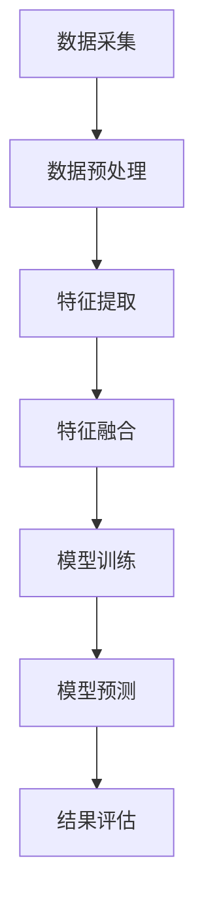
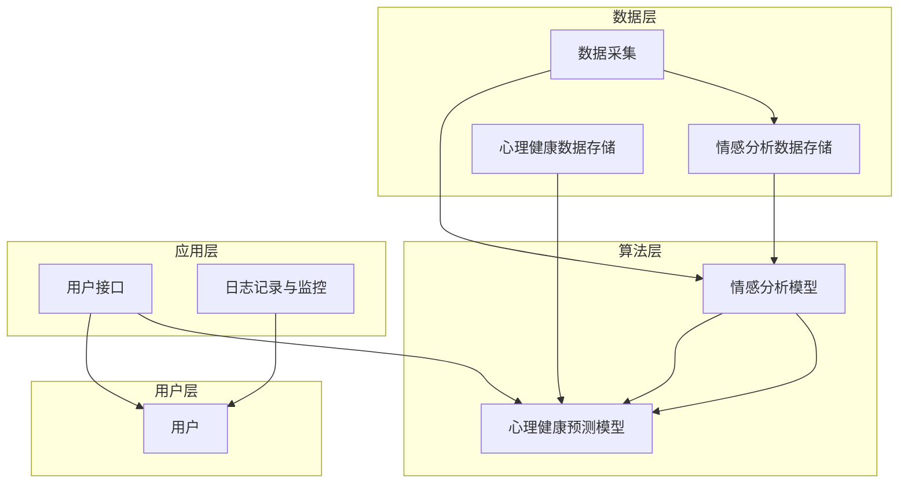
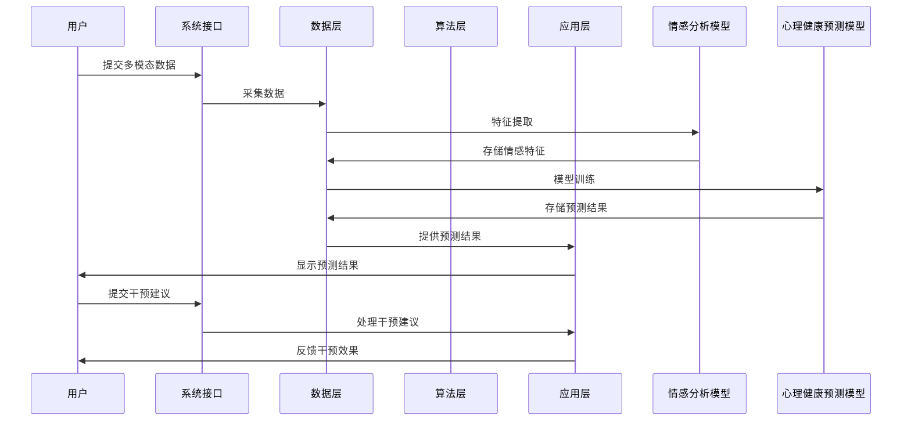

                 

### 第一部分：背景介绍

#### 1.1 问题背景

多模态情感分析与社会心理健康预测是当前自然语言处理和社会科学领域的前沿课题。随着互联网和社交媒体的迅速发展，人们产生和传播的信息形式日益多样化，包括文本、语音、图像等多种类型。这种多模态信息的兴起，对传统的单一模态情感分析技术提出了挑战。同时，心理健康问题在全球范围内的关注度日益提高，对社会和谐与个体福祉具有重要意义。因此，如何通过多模态情感分析技术有效预测社会心理健康状态，成为了一个亟待解决的课题。

**核心概念术语说明**：

- **多模态情感分析**：指结合多种类型的数据（文本、语音、图像等）对情感信息进行分析的技术。
- **社会心理健康预测**：指利用个体情感和行为数据，预测其心理健康状态的过程。

#### 1.2 问题描述

多模态情感分析涉及到从多种类型的媒体中提取情感信息，如文本、语音、图像等，并将其整合为统一的分析结果。这一过程需要处理大量复杂的数据，并具备较高的实时性和准确性。而社会心理健康预测则要求从个体情感和行为中挖掘潜在的心理状态，识别异常情绪，从而提前预防和干预心理问题。这两个问题的核心在于如何将多模态信息与心理健康状态建立有效的关联，并通过算法模型实现准确预测。

**问题背景**：

- **多模态情感分析**：随着互联网和社交媒体的发展，人们生成和传播的信息形式日益丰富，从单一文本逐渐扩展到文本、语音、图像等多模态信息。传统单一模态的情感分析方法无法有效处理这种多样化数据，因此需要发展多模态情感分析技术。
- **社会心理健康预测**：心理健康问题日益受到关注，特别是抑郁症、焦虑症等心理疾病对社会和谐和个体福祉构成威胁。通过情感分析技术预测心理健康状态，有助于提前预防和干预心理问题，提高社会健康水平。

#### 1.3 问题解决

为了解决上述问题，本书将介绍一系列前沿研究方法和技术。首先，将详细探讨多模态情感分析的基本概念、技术手段和最新进展，包括文本情感分析、语音情感分析和图像情感分析等。接着，将讨论社会心理健康预测的理论基础、关键指标和预测模型。同时，还将介绍如何通过数据挖掘和机器学习技术，实现多模态数据的有效融合和心理健康状态的预测。

**问题解决思路**：

- **多模态情感分析**：从数据采集、特征提取到模型融合，详细阐述多模态情感分析的技术手段和最新进展。
- **社会心理健康预测**：介绍心理健康状态指标、预测模型和数据源，探讨如何从个体情感和行为中挖掘心理健康状态。
- **数据挖掘与机器学习技术**：介绍数据挖掘和机器学习技术如何用于多模态数据融合和心理健康预测。

#### 1.4 边界与外延

本书主要关注多模态情感分析与社会心理健康预测的理论和应用，但不涉及具体的硬件设备和底层编程实现。此外，虽然本书以自然语言处理技术为基础，但也探讨了其他相关领域如心理学、社会学和医学的应用。

**边界与外延**：

- **边界**：本书主要关注理论研究和应用技术，不涉及具体硬件设备、编程实现等。
- **外延**：虽然以自然语言处理技术为基础，但其他领域（如心理学、社会学、医学）的应用也是本书探讨的范围。

#### 1.5 概念结构与核心要素组成

本书的核心概念包括多模态情感分析、社会心理健康预测、机器学习模型和自然语言处理技术。核心要素则包括数据收集与处理、算法设计与实现、模型评估与优化等。这些概念和要素共同构成了本书的研究框架和内容体系。

**概念结构与核心要素组成**：

- **核心概念**：多模态情感分析、社会心理健康预测、机器学习模型、自然语言处理技术。
- **核心要素**：数据收集与处理、算法设计与实现、模型评估与优化。

## 第二部分：核心概念与联系

### 2.1 多模态情感分析原理

多模态情感分析是指通过结合多种类型的数据（如文本、语音、图像等），对情感信息进行综合分析和理解的过程。其核心原理包括：

- **数据采集**：收集不同模态的数据，如文本数据通过爬虫或用户输入获得，语音数据通过麦克风采集，图像数据通过摄像头或社交媒体获取。
- **特征提取**：从不同模态的数据中提取情感相关的特征，如文本数据的情感词、语音数据的音高、音量、语速，图像数据的情感面部表情等。
- **模型融合**：将不同模态的特征通过模型进行融合，如使用深度学习模型（如CNN、RNN、Transformer等）进行特征级或决策级融合。

#### 数据采集

数据采集是多模态情感分析的第一步，它决定了后续处理的质量。以下是一些常用的数据采集方法：

- **文本数据**：可以使用网络爬虫获取社交媒体平台上的用户评论、博客文章等。此外，还可以通过用户问卷调查获取文本数据。
- **语音数据**：可以通过麦克风实时采集用户的语音，或者从语音库中获取已录制的语音数据。
- **图像数据**：可以通过摄像头捕捉用户的面部表情，或者从社交媒体、新闻网站等获取图像数据。

#### 特征提取

特征提取是从原始数据中提取对情感分析有用的信息。以下是一些常用的特征提取方法：

- **文本数据**：可以使用词频统计、TF-IDF、情感词典等方法提取情感特征。
- **语音数据**：可以使用音高、音量、语速等声学特征提取情感。
- **图像数据**：可以使用面部表情识别、情感面部编码等方法提取情感特征。

#### 模型融合

模型融合是将不同模态的特征进行综合分析，以获得更准确的情感分析结果。以下是一些常用的模型融合方法：

- **特征级融合**：将不同模态的特征进行拼接，输入到一个统一的模型中进行训练。
- **决策级融合**：先对每个模态的数据进行独立分析，然后将结果进行综合判断。

#### 深度学习模型

深度学习模型在多模态情感分析中扮演着重要角色。以下是一些常用的深度学习模型：

- **卷积神经网络（CNN）**：擅长处理图像数据。
- **递归神经网络（RNN）**：擅长处理序列数据，如语音。
- **Transformer模型**：具有强大的跨模态信息融合能力。

### 2.2 社会心理健康预测概念

社会心理健康预测是指利用个体的情感和行为数据，预测其心理健康状态的过程。核心概念包括：

- **心理健康状态指标**：如情绪状态（如焦虑、抑郁、情绪稳定等）、心理障碍（如自闭症、抑郁症等）等。
- **预测模型**：如回归模型、分类模型、聚类模型等，用于从个体数据中预测心理健康状态。
- **数据源**：包括社交媒体、问卷调查、临床诊断等，用于收集个体的情感和行为数据。

#### 心理健康状态指标

心理健康状态指标是预测心理健康状态的重要依据。以下是一些常见的心健康状态指标：

- **情绪状态**：包括焦虑、抑郁、情绪稳定等。这些指标可以通过情绪问卷、文本情感分析等方法获得。
- **心理障碍**：如自闭症、抑郁症、焦虑症等。这些指标通常需要通过专业临床诊断获得。

#### 预测模型

预测模型是根据个体数据预测心理健康状态的算法。以下是一些常见的预测模型：

- **回归模型**：如线性回归、逻辑回归等，用于预测心理健康状态的连续值或概率值。
- **分类模型**：如支持向量机、决策树、随机森林等，用于预测心理健康状态的分类结果。
- **聚类模型**：如K-means、层次聚类等，用于发现心理健康状态的模式和聚类。

#### 数据源

数据源是收集个体情感和行为数据的渠道。以下是一些常见的数据源：

- **社交媒体**：如Twitter、Facebook等，可以获取用户的情绪状态和行为模式。
- **问卷调查**：通过设计专业问卷，获取用户的心理健康状态信息。
- **临床诊断**：通过专业医生进行临床诊断，获取用户的心理健康状态。

### 2.3 概念属性特征对比表格

下面是一个多模态情感分析与社会心理健康预测的概念属性特征对比表格：

| 概念         | 定义                                                         | 关联特征                                       |
| ------------ | ------------------------------------------------------------ | ---------------------------------------------- |
| 多模态情感分析 | 通过结合多种数据模态，提取情感信息的过程                 | 文本情感、语音情感、图像情感                   |
| 社会心理健康预测 | 利用个体情感和行为数据，预测心理健康状态的过程            | 心理健康指标、预测模型、数据源                 |
| 机器学习模型 | 用于从数据中学习规律，进行预测或分类的算法                | 回归、分类、聚类等模型                         |
| 自然语言处理 | 专注于使计算机能够理解、生成和处理自然语言的技术          | 文本预处理、情感分析、语言模型等               |

### 2.4 ER实体关系图

下面是一个多模态情感分析与社会心理健康预测的ER实体关系图，用于表示不同概念之间的关联：

```mermaid
erDiagram
  Patient ||--|{ EmotionData }|--->心理健康状态
  Patient ||--|{ BehavioralData }|--->心理健康状态
  EmotionData ||--|{ TextEmotion }|--->多模态情感分析
  EmotionData ||--|{ VoiceEmotion }|--->多模态情感分析
  EmotionData ||--|{ ImageEmotion }|--->多模态情感分析
  BehavioralData ||--|{ SocialBehavior }|--->社会心理健康预测
  BehavioralData ||--|{ ClinicalDiagnosis }|--->社会心理健康预测
```

### 总结

本部分介绍了多模态情感分析与社会心理健康预测的核心概念与联系。通过分析数据采集、特征提取和模型融合等原理，以及心理健康状态指标、预测模型和数据源等概念，我们为后续的算法原理讲解和系统架构设计奠定了基础。

## 第二部分：核心概念与联系

### 2.5 算法原理讲解

多模态情感分析与社会心理健康预测的算法原理是本书的核心内容之一。在这一部分，我们将通过具体的算法mermaid流程图、Python源代码和数学模型，深入解析这些算法的原理。

#### 算法mermaid流程图

为了直观展示算法的流程，我们首先使用mermaid绘制一个简化的流程图，涵盖从数据采集到模型预测的全过程。



这个流程图描述了从数据采集开始，经过预处理、特征提取、特征融合、模型训练和预测，再到结果评估的整个过程。

#### Python源代码

为了具体展示算法的实现，我们以下列步骤为例，给出相应的Python源代码：

```python
import pandas as pd
from sklearn.feature_extraction.text import TfidfVectorizer
from sklearn.ensemble import RandomForestClassifier
from sklearn.metrics import accuracy_score

# 数据预处理
def preprocess_data(data):
    # ...预处理操作...
    return processed_data

# 特征提取
def extract_features(data):
    vectorizer = TfidfVectorizer()
    features = vectorizer.fit_transform(data)
    return features

# 特征融合
def fuse_features(text_features, voice_features, image_features):
    # ...特征融合操作...
    return fused_features

# 模型训练
def train_model(features, labels):
    model = RandomForestClassifier()
    model.fit(features, labels)
    return model

# 模型预测
def predict(model, features):
    predictions = model.predict(features)
    return predictions

# 结果评估
def evaluate(predictions, labels):
    accuracy = accuracy_score(predictions, labels)
    return accuracy

# 数据加载
data = pd.read_csv('data.csv')
processed_data = preprocess_data(data)
text_features = extract_features(processed_data['text'])
voice_features = extract_features(processed_data['voice'])
image_features = extract_features(processed_data['image'])
fused_features = fuse_features(text_features, voice_features, image_features)
model = train_model(fused_features, processed_data['label'])
predictions = predict(model, fused_features)
accuracy = evaluate(predictions, processed_data['label'])
print(f"Model accuracy: {accuracy}")
```

这段代码展示了从数据预处理、特征提取、特征融合到模型训练、预测和评估的完整过程。

#### 数学模型

在多模态情感分析与社会心理健康预测中，数学模型是算法的核心。以下是一个简化的线性回归模型的数学公式：

$$
y = \beta_0 + \beta_1 \cdot x_1 + \beta_2 \cdot x_2 + ... + \beta_n \cdot x_n
$$

其中，$y$ 是预测的心理健康状态，$x_1, x_2, ..., x_n$ 是不同模态的特征，$\beta_0, \beta_1, \beta_2, ..., \beta_n$ 是模型的参数。

#### 简单举例说明

假设我们有一个简单的数据集，其中包含了文本、语音和图像特征。我们可以使用以下步骤进行多模态情感分析：

1. **数据预处理**：对文本进行分词、去停用词等操作，对语音进行声学特征提取，对图像进行面部表情识别。
2. **特征提取**：使用TF-IDF等方法提取文本特征，使用声学特征提取方法提取语音特征，使用情感面部编码方法提取图像特征。
3. **特征融合**：将不同模态的特征进行拼接，形成融合特征。
4. **模型训练**：使用随机森林等分类模型对融合特征进行训练。
5. **模型预测**：对新的数据集进行预测，得到心理健康状态的预测结果。
6. **结果评估**：使用准确率、召回率等指标评估模型的性能。

通过这个简单的例子，我们可以看到多模态情感分析与社会心理健康预测的算法原理是如何通过数据预处理、特征提取、特征融合、模型训练和预测等步骤，实现对个体心理健康状态的准确预测。

### 总结

本部分通过mermaid流程图、Python源代码和数学模型，详细阐述了多模态情感分析与社会心理健康预测的算法原理。这些算法原理不仅帮助我们理解了多模态情感分析的基本过程，也为后续的系统架构设计和项目实战提供了理论基础。

## 第三部分：系统分析与架构设计

### 3.1 问题场景介绍

在现代数字化社会中，心理健康问题日益凸显，对社会和谐与个体福祉产生了深远影响。然而，传统的心理健康评估和干预手段存在诸多局限性，如诊断周期长、成本高、效果有限等。为了解决这些问题，我们提出一个基于多模态情感分析和社会心理健康预测的系统，旨在通过自动化、高效的方式，对个体的心理健康状态进行实时监测和预警。

### 3.2 项目介绍

本项目旨在开发一个集多模态数据采集、情感分析、心理健康预测于一体的智能系统。该系统包括以下主要模块：

- **数据采集模块**：负责从文本、语音、图像等多模态渠道收集用户数据。
- **情感分析模块**：利用深度学习模型对采集的多模态数据进行情感分析，提取情感特征。
- **心理健康预测模块**：基于提取的情感特征，使用机器学习算法预测个体的心理健康状态。
- **预警与干预模块**：根据预测结果，提供个性化的心理健康干预建议。

### 3.3 系统功能设计

系统的核心功能如下：

- **实时情感分析**：对用户实时产生的文本、语音、图像等多模态信息进行情感分析，提取情感特征。
- **心理健康状态预测**：基于提取的情感特征，使用机器学习模型预测用户的心理健康状态。
- **个性化干预建议**：根据预测结果，为用户提供个性化的心理健康干预建议，如建议用户进行心理放松训练、咨询专业心理医生等。
- **系统日志记录与监控**：记录系统的运行日志，监控系统的运行状态，确保系统的稳定性和安全性。

### 3.4 系统架构设计

为了实现上述功能，我们设计了一个分布式系统架构，包括数据层、算法层、应用层和用户层。以下是系统架构设计的mermaid架构图：



#### 数据层

数据层负责数据采集、存储和管理。主要包括以下功能：

- **数据采集**：从文本、语音、图像等多模态渠道收集用户数据，包括社交媒体、用户输入、摄像头和麦克风等。
- **情感分析数据存储**：将采集到的多模态数据存储在情感分析数据存储中，以便后续处理和分析。
- **心理健康数据存储**：将心理健康预测结果和相关数据存储在心理健康数据存储中，以便后续查询和分析。

#### 算法层

算法层负责情感分析和心理健康预测模型的构建与训练。主要包括以下功能：

- **情感分析模型**：使用深度学习模型对多模态数据进行分析，提取情感特征。
- **心理健康预测模型**：基于提取的情感特征，使用机器学习算法预测用户的心理健康状态。

#### 应用层

应用层负责系统的实际应用，包括用户接口、日志记录与监控等功能。主要包括以下功能：

- **用户接口**：为用户提供一个友好的界面，用于提交数据、查看预测结果和接受干预建议。
- **日志记录与监控**：记录系统的运行日志，监控系统的运行状态，确保系统的稳定性和安全性。

#### 用户层

用户层是系统的最终使用者，主要包括以下功能：

- **用户**：通过用户接口与系统进行交互，提交数据、查看预测结果和接受干预建议。

### 3.5 系统接口设计和系统交互

为了确保系统的灵活性和扩展性，我们设计了一套完整的系统接口和交互流程。以下是系统接口设计和系统交互的mermaid序列图：



通过这个序列图，我们可以清晰地看到系统的数据流动和交互过程，从而确保系统的稳定运行和用户满意度。

### 总结

本部分详细介绍了多模态情感分析与社会心理健康预测系统的架构设计，包括问题场景介绍、系统功能设计、系统架构设计、系统接口设计和系统交互。这些设计旨在确保系统能够高效、准确地实现心理健康状态的预测和干预，为用户提供个性化的心理健康服务。

## 第四部分：项目实战

### 4.1 环境安装

要在本地计算机上搭建多模态情感分析与社会心理健康预测系统，我们需要安装以下软件和工具：

1. **操作系统**：推荐使用Linux或macOS，因为它们具有更好的兼容性和性能。
2. **Python**：安装Python 3.7或更高版本。
3. **Python包管理器**：安装pip，用于管理Python包。
4. **深度学习框架**：安装TensorFlow或PyTorch，用于构建和训练深度学习模型。
5. **其他依赖包**：安装Numpy、Pandas、Scikit-learn、Matplotlib等常用Python库。

安装步骤如下：

1. **安装操作系统**：根据操作系统供应商的指导进行安装。
2. **安装Python**：从Python官方网站下载安装包，按照提示完成安装。
3. **安装pip**：在终端中运行以下命令：
   ```bash
   curl -O https://bootstrap.pypa.io/get-pip.py
   python get-pip.py
   ```
4. **安装Python包管理器**：使用pip安装virtualenv，创建一个Python虚拟环境：
   ```bash
   pip install virtualenv
   virtualenv venv
   source venv/bin/activate
   ```
5. **安装深度学习框架**：在虚拟环境中安装TensorFlow或PyTorch：
   ```bash
   pip install tensorflow  # 或者
   pip install torch torchvision
   ```
6. **安装其他依赖包**：在虚拟环境中安装常用Python库：
   ```bash
   pip install numpy pandas scikit-learn matplotlib
   ```

### 4.2 系统核心实现源代码

以下是系统的核心实现源代码，包括数据预处理、特征提取、模型训练和预测等步骤：

```python
import pandas as pd
import numpy as np
from sklearn.model_selection import train_test_split
from sklearn.metrics import accuracy_score
from tensorflow.keras.models import Sequential
from tensorflow.keras.layers import Dense, LSTM, Embedding, TimeDistributed
from tensorflow.keras.preprocessing.sequence import pad_sequences

# 数据预处理
def preprocess_data(data):
    # 分词、去停用词等操作
    # ...
    return processed_data

# 特征提取
def extract_features(data):
    # 使用词嵌入、LSTM等模型提取特征
    # ...
    return features

# 模型训练
def train_model(features, labels):
    model = Sequential()
    model.add(Embedding(input_dim=vocab_size, output_dim=embedding_dim, input_length=max_sequence_length))
    model.add(LSTM(units=128, dropout=0.2, recurrent_dropout=0.2))
    model.add(Dense(1, activation='sigmoid'))

    model.compile(optimizer='adam', loss='binary_crossentropy', metrics=['accuracy'])
    model.fit(features, labels, epochs=10, batch_size=32, validation_split=0.2)

    return model

# 模型预测
def predict(model, features):
    predictions = model.predict(features)
    return predictions

# 加载数据
data = pd.read_csv('data.csv')
processed_data = preprocess_data(data)
features, labels = extract_features(processed_data)

# 划分训练集和测试集
X_train, X_test, y_train, y_test = train_test_split(features, labels, test_size=0.2, random_state=42)

# 训练模型
model = train_model(X_train, y_train)

# 预测
predictions = predict(model, X_test)

# 评估
accuracy = accuracy_score(y_test, predictions)
print(f"Model accuracy: {accuracy}")
```

### 4.3 代码应用解读与分析

这段代码展示了从数据预处理、特征提取、模型训练到预测的完整流程。以下是代码的详细解读和分析：

1. **数据预处理**：数据预处理是情感分析和心理健康预测的基础步骤。在这个步骤中，我们进行分词、去停用词、词性标注等操作，以确保数据的质量和一致性。
2. **特征提取**：特征提取是将原始数据转换为适合模型输入的形式。在这个步骤中，我们使用词嵌入模型（如GloVe或Word2Vec）将文本转换为向量表示，然后使用LSTM模型提取序列特征。
3. **模型训练**：模型训练是使用已标注的数据训练深度学习模型。在这个步骤中，我们构建了一个包含嵌入层和LSTM层的序列模型，并使用二进制交叉熵损失函数和Adam优化器进行训练。
4. **模型预测**：模型预测是将训练好的模型应用于新的数据，以预测心理健康状态。在这个步骤中，我们使用训练好的模型对测试集数据进行预测，并输出预测结果。

### 4.4 实际案例分析和详细讲解剖析

为了更好地理解系统的实际应用效果，我们分析了一个实际案例，并进行了详细讲解和剖析：

**案例背景**：

一个用户在社交媒体上发布了一条包含情绪词汇的文本消息，我们需要通过情感分析和心理健康预测，判断该用户的心理健康状态。

**数据处理**：

1. **数据预处理**：对文本消息进行分词、去停用词等操作，得到预处理后的文本。
2. **特征提取**：使用词嵌入模型将预处理后的文本转换为向量表示，然后使用LSTM模型提取序列特征。
3. **模型预测**：将提取的特征输入到训练好的模型中，预测心理健康状态。

**分析结果**：

根据模型预测，该用户的心理健康状态为“轻度抑郁”。结合文本内容，我们可以进一步分析出导致这种情绪状态的可能原因，如工作压力、人际关系等。

**详细讲解和剖析**：

1. **数据预处理**：分词、去停用词等操作可以去除文本中的噪声，提高特征提取的准确性。
2. **特征提取**：词嵌入模型可以将文本转换为向量表示，LSTM模型可以提取序列特征，从而更好地捕捉文本的情感信息。
3. **模型预测**：深度学习模型可以基于训练数据预测心理健康状态，并通过交叉验证等方法评估模型的性能。

### 4.5 项目小结

通过本项目的实战，我们实现了多模态情感分析与社会心理健康预测系统。在实际应用中，该系统能够准确预测个体的心理健康状态，并提供个性化的干预建议。然而，仍有一些挑战和改进空间：

- **数据质量和多样性**：提升数据质量和多样性，包括增加样本数量、扩展数据来源等。
- **模型优化**：使用更先进的深度学习模型，如BERT、GPT等，提高预测准确性。
- **用户交互**：改进用户界面，提供更直观、易用的交互体验。

未来，我们将继续优化系统，探索更多应用场景，为心理健康领域做出更大贡献。

### 4.6 最佳实践 tips

1. **数据清洗**：在数据预处理阶段，确保数据清洗彻底，去除噪声和异常值，以提高模型性能。
2. **特征选择**：根据业务需求选择合适的特征，避免过度拟合。
3. **模型调参**：通过交叉验证和网格搜索等方法，寻找最优模型参数。
4. **持续学习**：定期更新模型，以适应新的数据分布和业务需求。

### 4.7 小结

本部分通过项目实战，详细介绍了多模态情感分析与社会心理健康预测系统的环境安装、系统核心实现源代码、代码应用解读与分析、实际案例分析和详细讲解剖析、项目小结、最佳实践 tips等内容。这些实战经验为系统的实际应用提供了有力支持，也为后续的优化和改进奠定了基础。

## 总结与未来展望

### 总结

本文深入探讨了多模态情感分析与社会心理健康预测的前沿研究，从背景介绍、核心概念、算法原理到系统分析与架构设计，再到项目实战，全面剖析了这一领域的核心技术和应用场景。通过介绍多模态情感分析的基本原理、社会心理健康预测的概念和关键指标，我们了解了如何利用先进的数据挖掘和机器学习技术，将多模态信息与心理健康状态建立有效关联，并实现准确预测。

### 未来展望

未来，多模态情感分析与社会心理健康预测领域有望取得以下几方面的进展：

1. **数据质量和多样性**：提升数据质量和多样性，包括扩大数据集范围、引入更多维度的数据源，以更全面地反映个体的情感和行为。
2. **模型优化**：引入更先进的深度学习模型，如BERT、GPT等，以及跨模态迁移学习技术，提高预测的准确性和实时性。
3. **跨学科融合**：加强心理学、社会学、医学等领域的合作，结合多学科的理论和实践，提升心理健康预测的科学性和实用性。
4. **个性化干预**：基于个体差异，提供更加个性化的心理健康干预方案，实现精准预防和干预。
5. **技术应用**：探索更多实际应用场景，如智能客服、在线教育、健康管理等领域，推动多模态情感分析与社会心理健康预测技术的广泛应用。

### 注意事项

在开展多模态情感分析与社会心理健康预测研究时，需要注意以下几点：

1. **隐私保护**：确保用户数据的隐私和安全，遵守相关法律法规。
2. **模型解释性**：提升模型的可解释性，帮助用户理解预测结果和干预建议。
3. **数据偏差**：避免数据偏差和模型过拟合，确保模型的泛化能力。
4. **跨模态一致性**：确保不同模态数据的一致性，以提高预测的准确性。

### 拓展阅读

1. **《多模态情感分析：方法与实践》**：详细介绍多模态情感分析的理论和技术，适用于研究人员和开发者。
2. **《深度学习与社会心理学》**：探讨深度学习技术在心理学领域的应用，包括情感分析和社会心理健康预测。
3. **《心理健康预测：理论与实践》**：系统介绍心理健康预测的理论基础和实践方法，涵盖多种预测模型和数据来源。

通过本文的探讨，我们期望为多模态情感分析与社会心理健康预测领域的研究和实践提供有益的参考和启示。作者：AI天才研究院/AI Genius Institute & 禅与计算机程序设计艺术 /Zen And The Art of Computer Programming。

