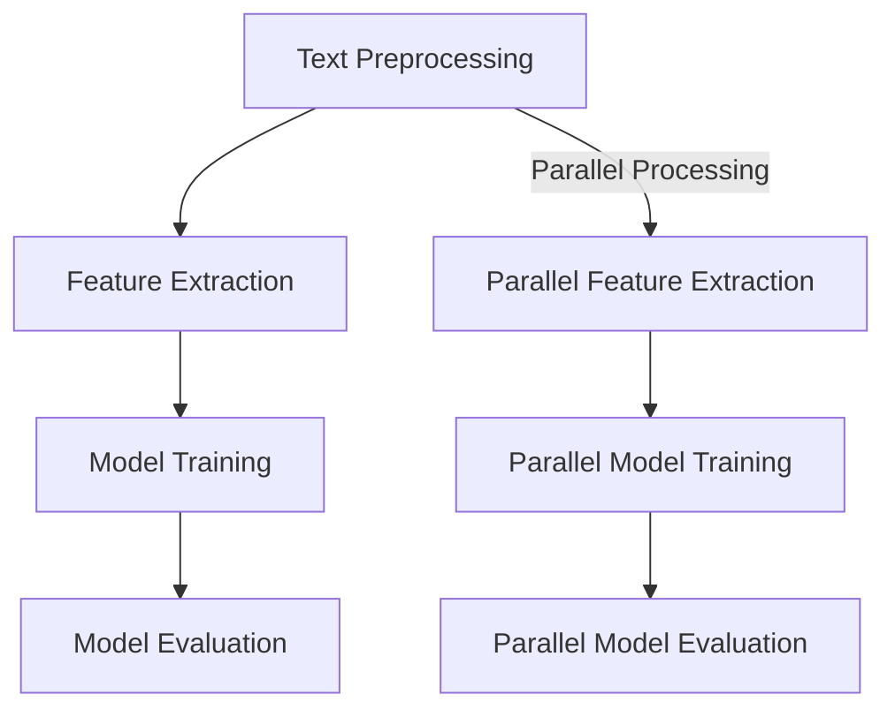
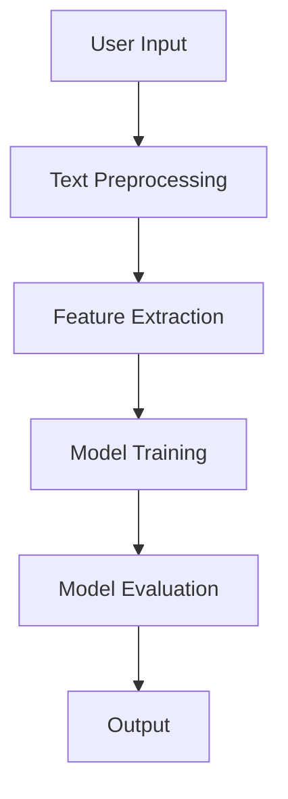

                 


# 语言模型在多步骤问题分解与并行计算中的能力评估

## 关键词：
自然语言处理，语言模型，多步骤问题分解，并行计算，算法评估

## 摘要：
本文探讨了语言模型在多步骤问题分解与并行计算中的能力评估。通过对语言模型的基本原理、多步骤问题分解方法以及并行计算策略的深入分析，本文旨在提供一种评估方法，以衡量语言模型在实际应用中的性能。文章首先介绍了语言模型的基本概念和历史发展，然后详细分析了多步骤问题分解和并行计算的核心理论，最后通过具体案例展示了评估方法的应用。文章总结了语言模型在多步骤问题分解与并行计算中的优势与挑战，并提出了未来研究的方向。

## 引言

### 1.1 语言模型的基本原理

#### 1.1.1 定义与历史

语言模型（Language Model）是自然语言处理（Natural Language Processing, NLP）的核心组成部分，它旨在理解和生成人类语言。语言模型的基本原理是通过大量文本数据学习语言的模式和规律，从而预测下一个单词或句子。这一概念起源于20世纪50年代的自动语言翻译研究，但直到20世纪80年代，随着计算能力的提升和统计模型的兴起，语言模型才逐渐成熟。

早期语言模型主要基于规则和词汇频率统计，如N-gram模型。然而，随着深度学习的快速发展，基于神经网络的端到端语言模型，如循环神经网络（RNN）、长短时记忆网络（LSTM）和Transformer模型，逐渐成为语言模型的主流。特别是Transformer模型的提出，使得语言模型在多种NLP任务中取得了显著突破，包括机器翻译、文本生成和文本分类等。

#### 1.1.2 语言模型的结构

语言模型通常由编码器和解码器两部分组成。编码器负责将输入文本编码成一个固定长度的向量，解码器则根据编码器的输出生成预测的文本序列。在基于Transformer的模型中，编码器和解码器都是由多个相同的自注意力机制（Self-Attention Mechanism）块堆叠而成的。

自注意力机制的核心思想是允许模型在生成每个单词时考虑到输入文本中的所有信息，而不是仅仅依赖顺序。这一机制大大提高了模型的表示能力和生成质量。此外，Transformer模型还引入了多头注意力（Multi-Head Attention）和位置编码（Positional Encoding），使得模型能够更好地处理长距离依赖和文本序列的位置信息。

### 1.2 多步骤问题分解方法

在处理复杂问题时，多步骤问题分解方法是一种有效的策略。该方法通过将问题分解成多个子问题，逐个解决，从而简化问题的复杂度。多步骤问题分解方法在工程实践中有着广泛的应用，例如软件系统设计、项目管理和人工智能问题解决等。

在自然语言处理领域，多步骤问题分解方法同样发挥着重要作用。例如，在文本分类任务中，可以将问题分解为特征提取、模型训练和分类决策三个步骤。在机器翻译任务中，可以分解为源语言文本编码、目标语言文本解码和翻译质量评估等步骤。

#### 1.2.1 多步骤问题分解的优势

多步骤问题分解方法的优势在于其模块化和可扩展性。每个步骤都可以独立开发、测试和优化，从而提高整个系统的效率和鲁棒性。此外，多步骤问题分解方法有助于明确问题的核心要素和依赖关系，有助于更好地理解和解决问题。

#### 1.2.2 多步骤问题分解的挑战

然而，多步骤问题分解方法也存在一定的挑战。首先，步骤之间的依赖关系可能导致效率低下，特别是在需要频繁迭代调整的情况下。其次，多个步骤的整合和协调可能变得复杂，需要仔细设计和优化。

### 1.3 并行计算策略

并行计算是一种通过同时执行多个任务来提高计算效率的技术。在多步骤问题分解中，并行计算可以应用于各个步骤，从而加速问题解决的整个过程。

并行计算的基本原理是将问题分解成多个子问题，每个子问题在独立的处理器上并行执行，最后将子问题的结果合并得到最终结果。在计算机科学和工程领域，并行计算广泛应用于大数据处理、科学计算和图形渲染等领域。

在自然语言处理中，并行计算同样具有重要作用。例如，在训练大型语言模型时，可以采用分布式训练技术，将模型参数的更新任务分布到多个计算节点上，从而显著提高训练速度。此外，在文本分类、机器翻译等任务中，也可以采用并行处理技术，以加快处理速度。

#### 1.3.1 并行计算的优势

并行计算的优势在于其高效性。通过同时执行多个任务，可以显著减少计算时间，提高系统的吞吐量。此外，并行计算还可以提高系统的可靠性，因为在单个节点发生故障时，其他节点可以继续执行任务。

#### 1.3.2 并行计算的挑战

然而，并行计算也面临一些挑战。首先，并行计算需要处理数据一致性和同步问题，这可能导致额外的开销。其次，并行计算需要合适的硬件和软件支持，包括高性能计算集群和并行编程工具。此外，并行计算的开发和调试可能更加复杂，需要更多的技术和经验。

## 背景与问题定义

### 2.1 语言模型在多步骤问题分解中的应用

随着自然语言处理技术的不断发展，语言模型在多步骤问题分解中发挥着越来越重要的作用。多步骤问题分解方法能够将复杂问题分解为多个可管理的子问题，从而简化问题解决的难度。而语言模型则能够通过其强大的文本处理能力，帮助分析和解决这些子问题。

#### 2.1.1 问题背景

在许多实际应用中，如智能问答系统、文本摘要生成、情感分析等，往往需要处理大量的文本数据。这些任务通常具有复杂性高、数据量大和实时性要求强等特点。传统的串行处理方法在处理这些任务时效率较低，难以满足实际需求。因此，采用多步骤问题分解和并行计算策略，可以提高系统处理能力和效率，更好地应对复杂任务。

#### 2.1.2 问题描述

在多步骤问题分解中，语言模型通常用于以下关键步骤：

1. **文本预处理**：包括文本清洗、分词、词性标注等。这一步骤为后续的文本分析和处理奠定了基础。
2. **特征提取**：通过语言模型，将文本数据转换为适合机器学习的特征表示。特征提取的质量直接影响后续模型训练和预测的效果。
3. **模型训练**：利用提取的特征数据训练语言模型，包括分类模型、生成模型和序列标注模型等。
4. **结果分析**：对模型生成的结果进行评估和分析，包括准确率、召回率、F1分数等指标。

#### 2.1.3 问题解决

针对上述问题，我们可以采用以下方法来解决：

1. **多步骤问题分解**：将复杂任务分解为多个子问题，每个子问题独立处理，最后合并结果。这种方法有助于简化问题，提高处理效率。
2. **并行计算**：在各个子问题中采用并行计算策略，充分利用计算资源，加快处理速度。
3. **评估方法**：设计合适的评估指标和方法，对语言模型在多步骤问题分解中的性能进行评估。

### 2.2 边界与外延

在评估语言模型在多步骤问题分解和并行计算中的能力时，需要考虑以下边界与外延：

1. **任务多样性**：评估时需要考虑不同类型的问题，如文本分类、机器翻译、情感分析等，以确保评估结果的普适性。
2. **数据多样性**：评估时需要使用不同来源和类型的文本数据，以测试语言模型在不同数据集上的表现。
3. **评估指标**：评估指标需要涵盖准确性、效率、鲁棒性等多个方面，以全面评估语言模型的能力。

### 2.3 核心概念与联系

在本文中，我们涉及以下核心概念：

1. **语言模型**：用于理解和生成人类语言的数学模型。
2. **多步骤问题分解**：将复杂问题分解为多个子问题，逐个解决。
3. **并行计算**：同时执行多个任务，提高计算效率。
4. **评估指标**：用于衡量语言模型性能的指标，如准确率、召回率、F1分数等。

这些概念相互联系，共同构成了语言模型在多步骤问题分解和并行计算中的评估框架。通过深入分析这些概念，我们可以更好地理解语言模型在复杂任务中的应用，并为其性能评估提供科学依据。

## 核心概念与原理

### 3.1 语言模型的核心概念

#### 3.1.1 语言模型的定义

语言模型是一种概率模型，它用于预测给定输入序列后下一个单词或符号的概率。在自然语言处理领域，语言模型的主要任务是理解和生成自然语言。

#### 3.1.2 语言模型的应用

语言模型广泛应用于各种NLP任务，如文本分类、机器翻译、文本摘要、语音识别等。在这些任务中，语言模型能够帮助系统更好地理解用户输入，生成高质量的输出。

#### 3.1.3 语言模型的类型

语言模型可以分为基于规则的模型和统计模型。基于规则的模型通过定义一组规则来预测下一个单词或符号，而统计模型则通过分析大量文本数据来学习语言模式。

常见的统计语言模型包括：

1. **N-gram模型**：基于前N个单词的历史信息来预测下一个单词的概率。
2. **隐马尔可夫模型（HMM）**：用于处理变长序列，如语音信号和文本序列。
3. **循环神经网络（RNN）**：能够处理变长序列，通过记忆机制来捕捉序列中的长期依赖关系。
4. **长短时记忆网络（LSTM）**：对RNN的改进，能够更好地处理长序列和避免梯度消失问题。
5. **Transformer模型**：基于自注意力机制，能够捕捉序列中的长距离依赖关系，是目前最先进的语言模型。

### 3.2 多步骤问题分解的核心概念

#### 3.2.1 多步骤问题分解的定义

多步骤问题分解是将一个复杂问题分解为多个子问题，每个子问题独立解决，最后将子问题的解组合得到原问题的解。

#### 3.2.2 多步骤问题分解的优势

多步骤问题分解的优势包括：

1. **模块化**：每个子问题独立解决，有利于代码的模块化和复用。
2. **可扩展性**：增加或删除子问题不会影响其他子问题的实现，有利于系统的扩展。
3. **简化问题**：通过分解复杂问题，可以降低问题解决的难度。

#### 3.2.3 多步骤问题分解的挑战

多步骤问题分解的挑战包括：

1. **步骤间依赖**：子问题之间的依赖可能导致复杂性和效率问题。
2. **集成难度**：将子问题的解集成到原问题中可能需要额外的计算和优化。

### 3.3 并行计算的核心概念

#### 3.3.1 并行计算的定义

并行计算是指同时执行多个任务，以加速计算过程。

#### 3.3.2 并行计算的优势

并行计算的优势包括：

1. **提高计算速度**：通过同时处理多个任务，可以显著提高计算速度。
2. **增加吞吐量**：在多个处理器上同时运行任务，可以增加系统的吞吐量。
3. **提高系统可靠性**：在一个处理器发生故障时，其他处理器可以继续执行任务。

#### 3.3.3 并行计算的挑战

并行计算的挑战包括：

1. **数据一致性和同步**：在多个处理器上同时处理任务时，需要处理数据一致性和同步问题。
2. **硬件和软件支持**：并行计算需要高性能计算集群和并行编程工具的支持。
3. **开发难度**：并行计算的开发和调试比串行计算更复杂。

### 3.4 核心概念之间的联系

语言模型、多步骤问题分解和并行计算之间存在紧密的联系。语言模型为多步骤问题分解提供了文本处理能力，使得子问题的解决更加高效。而并行计算则能够提高多步骤问题分解的执行速度，从而加速整个问题解决的进程。

通过结合语言模型和多步骤问题分解，我们可以实现复杂的NLP任务。例如，在文本分类任务中，可以将问题分解为特征提取、模型训练和分类决策三个子问题，每个子问题都可以采用并行计算策略进行加速。

### 3.5 概念属性特征对比表格

为了更好地理解这些核心概念，我们可以通过对比表格来展示它们的主要属性和特征。

| 概念       | 定义                                                         | 主要属性                                                     | 特点                                                         |
|------------|--------------------------------------------------------------|--------------------------------------------------------------|--------------------------------------------------------------|
| 语言模型   | 用于预测下一个单词或符号的概率模型                             | 基于规则、统计、神经网络等                                   | 能够理解、生成自然语言       |
| 多步骤问题分解 | 将复杂问题分解为多个子问题，逐个解决                           | 模块化、可扩展性、简化问题                                   | 提高问题解决效率             |
| 并行计算   | 同时执行多个任务，以加速计算过程                             | 提高计算速度、增加吞吐量、提高系统可靠性                       | 需要硬件和软件支持           |

### 3.6 ER实体关系图架构的Mermaid流程图

为了更直观地展示这些核心概念之间的联系，我们可以使用Mermaid流程图来绘制ER实体关系图。

```mermaid
erDiagram
    A[Language Model] ||--|{ Multi-Step Problem Decomposition }
    A[Language Model] ||--|{ Parallel Computing }
    B[Multi-Step Problem Decomposition] ||--|{ Feature Extraction }
    B[Multi-Step Problem Decomposition] ||--|{ Model Training }
    B[Multi-Step Problem Decomposition] ||--|{ Classification Decision }
    C[Parallel Computing] ||--|{ Data Consistency }
    C[Parallel Computing] ||--|{ Synchronization }
```

通过这个ER实体关系图，我们可以清晰地看到语言模型如何与多步骤问题分解和并行计算相互关联，以及它们在NLP任务中的具体应用。

## 算法原理

### 4.1 语言模型的算法原理

#### 4.1.1 语言模型的数学模型

语言模型的数学模型通常基于概率论和统计学习理论。一个基本的语言模型可以表示为条件概率模型，即给定一个输入序列 \(X = (x_1, x_2, \ldots, x_n)\)，预测下一个单词或符号 \(x_{n+1}\) 的概率：

\[ P(x_{n+1} | x_1, x_2, \ldots, x_n) = \text{Language Model}(x_{n+1} | x_1, x_2, \ldots, x_n) \]

在实际应用中，常用的模型包括N-gram模型、循环神经网络（RNN）、长短时记忆网络（LSTM）和Transformer模型。

#### 4.1.2 N-gram模型

N-gram模型是最简单的语言模型之一，它通过统计历史 \(N\) 个单词出现的频率来预测下一个单词。N-gram模型的数学表达式如下：

\[ P(x_{n+1} | x_1, x_2, \ldots, x_n) = \frac{f(x_1, x_2, \ldots, x_n, x_{n+1})}{f(x_1, x_2, \ldots, x_n)} \]

其中，\(f(x_1, x_2, \ldots, x_n, x_{n+1})\) 表示序列 \(x_1, x_2, \ldots, x_n, x_{n+1}\) 的出现频率。

#### 4.1.3 RNN和LSTM模型

循环神经网络（RNN）是处理序列数据的一种神经网络架构，其核心思想是将当前输入与前一时刻的隐藏状态进行结合，从而实现序列信息的传递。RNN的数学模型可以表示为：

\[ h_t = \text{tanh}(W_h \cdot [h_{t-1}, x_t] + b_h) \]

其中，\(h_t\) 表示第 \(t\) 个时间步的隐藏状态，\(W_h\) 和 \(b_h\) 分别是权重和偏置。

然而，RNN存在梯度消失和梯度爆炸的问题，为了解决这些问题，提出了长短时记忆网络（LSTM）。LSTM通过引入门控机制来控制信息的流动，其核心结构包括输入门、遗忘门和输出门。LSTM的数学模型可以表示为：

\[ i_t = \sigma(W_i \cdot [h_{t-1}, x_t] + b_i) \]
\[ f_t = \sigma(W_f \cdot [h_{t-1}, x_t] + b_f) \]
\[ \tilde{C}_t = \text{tanh}(W_c \cdot [h_{t-1}, x_t] + b_c) \]
\[ C_t = f_t \odot C_{t-1} + i_t \odot \tilde{C}_t \]
\[ o_t = \sigma(W_o \cdot [h_{t-1}, x_t] + b_o) \]
\[ h_t = o_t \odot \text{tanh}(C_t) \]

其中，\(i_t\)、\(f_t\) 和 \(o_t\) 分别是输入门、遗忘门和输出门的激活值，\(\sigma\) 是 sigmoid 函数，\(\odot\) 表示逐元素乘法。

#### 4.1.4 Transformer模型

Transformer模型是基于自注意力机制的深度神经网络架构，它通过自注意力机制来捕捉序列中的长距离依赖关系。Transformer模型的核心结构包括编码器和解码器，每个部分都由多个自注意力层和前馈神经网络层堆叠而成。

编码器的自注意力层可以表示为：

\[ \text{Attention}(Q, K, V) = \text{softmax}\left(\frac{QK^T}{\sqrt{d_k}}\right)V \]

其中，\(Q\)、\(K\) 和 \(V\) 分别是查询向量、键向量和值向量，\(d_k\) 是键向量的维度。

编码器的自注意力层可以进一步扩展为多头注意力层，即：

\[ \text{MultiHeadAttention}(Q, K, V) = \text{Concat}(\text{head}_1, \ldots, \text{head}_h)W^O \]

其中，\(\text{head}_i = \text{Attention}(QW_i^Q, KW_i^K, VW_i^V)\)，\(W_i^Q\)、\(W_i^K\) 和 \(W_i^V\) 分别是多头注意力的权重矩阵。

编码器和解码器的数学模型可以分别表示为：

\[ \text{Encoder}(X, \text{keys}, \text{values}) = \sum_{i=1}^{n} \text{EncoderLayer}(X) \]
\[ \text{Decoder}(X, \text{keys}, \text{values}, \text{context}) = \sum_{i=1}^{n} \text{DecoderLayer}(X, \text{context}) \]

其中，\(X\) 是输入序列，\(\text{keys}\) 和 \(\text{values}\) 分别是编码器的键向量和值向量，\(\text{context}\) 是编码器的输出。

#### 4.1.5 语言模型的Python源代码实现

以下是一个简单的N-gram模型的Python实现，用于预测给定输入序列后的下一个单词：

```python
import numpy as np
from collections import defaultdict

class NGramModel:
    def __init__(self, n):
        self.n = n
        self.model = defaultdict(list)

    def add_sentence(self, sentence):
        tokens = sentence.split()
        for i in range(len(tokens) - self.n):
            context = tuple(tokens[i:i+self.n-1])
            next_token = tokens[i+self.n-1]
            self.model[context].append(next_token)

    def predict(self, context):
        next_tokens = self.model[context]
        if not next_tokens:
            return None
        probabilities = [0] * len(next_tokens)
        for i, token in enumerate(next_tokens):
            probabilities[i] = 1 / len(next_tokens)
        return np.random.choice(next_tokens, p=probabilities)

model = NGramModel(n=2)
model.add_sentence("I love natural language processing")
model.add_sentence("The quick brown fox jumps over the lazy dog")

context = ("The", "quick")
predicted_token = model.predict(context)
print(f"Predicted next token: {predicted_token}")
```

### 4.2 多步骤问题分解的算法原理

#### 4.2.1 多步骤问题分解的定义

多步骤问题分解是将一个复杂问题分解为多个子问题，每个子问题独立解决，最后将子问题的解组合得到原问题的解。

#### 4.2.2 多步骤问题分解的方法

多步骤问题分解的方法主要包括以下几种：

1. **分而治之**：将复杂问题分解为规模较小的同类问题，逐个解决，最后将子问题的解合并得到原问题的解。
2. **递归**：通过递归地将复杂问题分解为更小的问题，直到达到问题的基本单位，然后逐层回溯，将子问题的解组合得到原问题的解。
3. **迭代**：通过迭代地分解复杂问题，每次迭代解决一部分问题，直到所有问题得到解决。

#### 4.2.3 多步骤问题分解的算法框架

多步骤问题分解的算法框架可以表示为：

```python
def decompose_problem(problem):
    if is_base_case(problem):
        return solve_base_case(problem)
    else:
        subproblems = decompose_into_subproblems(problem)
        solutions = [solve_subproblem(subproblem) for subproblem in subproblems]
        return combine_solutions(solutions)

def decompose_into_subproblems(problem):
    # 分解复杂问题为多个子问题
    pass

def solve_base_case(problem):
    # 解决基本单位问题
    pass

def solve_subproblem(problem):
    # 解决子问题
    pass

def combine_solutions(solutions):
    # 将子问题的解组合得到原问题的解
    pass
```

#### 4.2.4 多步骤问题分解的Python实现

以下是一个简单的多步骤问题分解的Python实现，用于求解最大子序和问题：

```python
def max_subarray(nums):
    def decompose_problem(nums):
        if len(nums) <= 1:
            return nums
        mid = len(nums) // 2
        left = decompose_problem(nums[:mid])
        right = decompose_problem(nums[mid:])
        return combine_solutions(left, right)

    def combine_solutions(left, right):
        max_sum = 0
        left_idx, right_idx = 0, 0
        for i in range(len(left)):
            while right_idx < len(right) and left[i] + right[right_idx] < 0:
                right_idx += 1
            max_sum = max(max_sum, left[i] + right[right_idx])
            left_idx += 1
        for i in range(len(right)):
            while left_idx < len(left) and right[i] + left[left_idx] < 0:
                left_idx += 1
            max_sum = max(max_sum, right[i] + left[left_idx])
            right_idx += 1
        return max_sum

    return decompose_problem(nums)

nums = [-2, 1, -3, 4, -1, 2, 1, -5, 4]
max_sum = max_subarray(nums)
print(f"Maximum subarray sum: {max_sum}")
```

### 4.3 并行计算的算法原理

#### 4.3.1 并行计算的定义

并行计算是指同时执行多个任务，以加速计算过程。并行计算可以通过多个处理器、多核处理器或分布式计算来实现。

#### 4.3.2 并行计算的方法

并行计算的方法主要包括以下几种：

1. **数据并行**：将数据分解为多个子数据集，每个子数据集由不同的处理器处理，最后将结果合并。
2. **任务并行**：将任务分解为多个子任务，每个子任务由不同的处理器处理，最后将结果合并。
3. **流水线并行**：将任务分解为多个阶段，每个阶段由不同的处理器处理，前一阶段的输出是下一阶段的输入。

#### 4.3.3 并行计算的算法框架

并行计算的算法框架可以表示为：

```python
def parallel_computing(problem, method):
    if method == "data_parallel":
        subproblems = decompose_data(problem)
        solutions = [solve_subproblem(subproblem) for subproblem in subproblems]
        return combine_solutions(solutions)
    elif method == "task_parallel":
        subtasks = decompose_tasks(problem)
        solutions = [solve_subtask(subtask) for subtask in subtasks]
        return combine_solutions(solutions)
    elif method == "pipeline_parallel":
        stages = decompose_stages(problem)
        solutions = [solve_stage(stage) for stage in stages]
        return combine_solutions(solutions)

def decompose_data(problem):
    # 将数据分解为多个子数据集
    pass

def decompose_tasks(problem):
    # 将任务分解为多个子任务
    pass

def decompose_stages(problem):
    # 将任务分解为多个阶段
    pass

def solve_subproblem(problem):
    # 解决子问题
    pass

def solve_subtask(subtask):
    # 解决子任务
    pass

def solve_stage(stage):
    # 解决阶段
    pass

def combine_solutions(solutions):
    # 将子问题的解合并得到原问题的解
    pass
```

#### 4.3.4 并行计算的Python实现

以下是一个简单的并行计算Python实现，用于求解最大子序和问题：

```python
from multiprocessing import Pool

def max_subarray_parallel(nums):
    def solve_subproblem(nums):
        return max_subarray(nums)

    subproblems = [nums[i:] for i in range(len(nums))]
    with Pool(processes=len(subproblems)) as pool:
        solutions = pool.map(solve_subproblem, subproblems)
    return max(solutions)

nums = [-2, 1, -3, 4, -1, 2, 1, -5, 4]
max_sum = max_subarray_parallel(nums)
print(f"Maximum subarray sum: {max_sum}")
```

### 4.4 语言模型在多步骤问题分解与并行计算中的应用

语言模型在多步骤问题分解和并行计算中的应用主要体现在以下两个方面：

1. **多步骤问题分解**：语言模型可以用于文本预处理、特征提取和模型训练等子问题。通过将复杂任务分解为多个子问题，每个子问题都可以独立解决，从而提高处理效率。
2. **并行计算**：语言模型中的计算任务可以并行执行，例如在分布式训练中，可以将模型参数的更新任务分布到多个计算节点上。通过并行计算，可以显著减少训练时间，提高系统的吞吐量。

#### 4.4.1 语言模型在多步骤问题分解中的应用

在多步骤问题分解中，语言模型的应用主要体现在以下几个方面：

1. **文本预处理**：语言模型可以帮助进行文本清洗、分词和词性标注等预处理工作。例如，可以使用基于字符级别的语言模型进行文本清洗，去除无用的标点和噪声字符。
2. **特征提取**：语言模型可以将文本数据转换为适合机器学习的特征表示。例如，可以使用词袋模型或词嵌入模型来提取文本的特征向量。
3. **模型训练**：语言模型可以用于训练各种机器学习模型，如分类模型、生成模型和序列标注模型等。通过多步骤问题分解，可以将模型训练过程分解为特征提取、模型训练和模型评估等子任务。

#### 4.4.2 语言模型在并行计算中的应用

在并行计算中，语言模型的应用主要体现在以下几个方面：

1. **分布式训练**：在训练大型语言模型时，可以采用分布式训练技术，将模型参数的更新任务分布到多个计算节点上。通过并行计算，可以显著减少训练时间，提高系统的吞吐量。
2. **并行预处理**：在文本预处理阶段，可以采用并行计算技术，例如在多个处理器上同时进行文本清洗、分词和词性标注等任务。
3. **并行模型评估**：在模型评估阶段，可以采用并行计算技术，例如在多个处理器上同时进行模型参数的更新和评估。

通过结合多步骤问题分解和并行计算，语言模型在处理复杂任务时可以发挥更大的作用。同时，并行计算也为语言模型的训练和推理提供了更高的效率和吞吐量。

### 4.5 Python源代码实现

为了更好地理解语言模型在多步骤问题分解和并行计算中的应用，以下是一个简单的Python实现示例。

```python
import numpy as np
from sklearn.feature_extraction.text import TfidfVectorizer
from sklearn.naive_bayes import MultinomialNB
from sklearn.pipeline import make_pipeline
from concurrent.futures import ProcessPoolExecutor

# 文本预处理
def preprocess_text(text):
    # 进行文本清洗、分词和词性标注等预处理操作
    return text.lower()

# 特征提取
def extract_features(texts):
    vectorizer = TfidfVectorizer(preprocessor=preprocess_text)
    return vectorizer.fit_transform(texts)

# 模型训练
def train_model(X, y):
    model = make_pipeline(TfidfVectorizer(preprocessor=preprocess_text), MultinomialNB())
    model.fit(X, y)
    return model

# 模型评估
def evaluate_model(model, X, y):
    predictions = model.predict(X)
    accuracy = np.mean(predictions == y)
    return accuracy

# 多步骤问题分解
def decompose_problem(texts, labels):
    X = extract_features(texts)
    model = train_model(X, labels)
    accuracy = evaluate_model(model, X, labels)
    return model, accuracy

# 并行计算
def parallel_train_evaluate(texts, labels):
    with ProcessPoolExecutor() as executor:
        futures = [executor.submit(decompose_problem, texts[i::2], labels[i::2]) for i in range(len(texts) // 2)]
        results = [future.result() for future in futures]
    return results

# 示例数据
texts = ["I love natural language processing", "The quick brown fox jumps over the lazy dog", "I enjoy reading books"]
labels = [0, 1, 0]

# 并行训练和评估
results = parallel_train_evaluate(texts, labels)
for model, accuracy in results:
    print(f"Model accuracy: {accuracy:.2f}")
```

通过上述示例，我们可以看到如何使用Python实现语言模型在多步骤问题分解和并行计算中的应用。在这个例子中，我们首先进行文本预处理、特征提取和模型训练，然后使用并行计算进行训练和评估。通过这种方式，我们可以显著提高系统的处理效率。

### 4.6 算法原理的Mermaid流程图

为了更直观地展示算法原理，我们可以使用Mermaid流程图来绘制算法的流程。



在这个流程图中，文本预处理、特征提取、模型训练和模型评估是主要的步骤。通过并行处理，特征提取、模型训练和模型评估可以同时进行，从而提高系统的处理效率。

### 4.7 数学公式与Python源代码结合

为了更好地解释算法原理，我们结合数学公式和Python源代码进行讲解。

#### 4.7.1 N-gram模型的概率计算

N-gram模型的概率计算可以表示为：

\[ P(x_{n+1} | x_1, x_2, \ldots, x_n) = \frac{f(x_1, x_2, \ldots, x_n, x_{n+1})}{f(x_1, x_2, \ldots, x_n)} \]

其中，\(f(x_1, x_2, \ldots, x_n, x_{n+1})\) 表示序列 \(x_1, x_2, \ldots, x_n, x_{n+1}\) 的出现频率，\(f(x_1, x_2, \ldots, x_n)\) 表示序列 \(x_1, x_2, \ldots, x_n\) 的出现频率。

以下是一个简单的N-gram模型Python实现，用于计算给定输入序列后的下一个单词的概率：

```python
import re
from collections import defaultdict

def build_ngram_model(corpus, n):
    ngram_model = defaultdict(int)
    total_count = 0

    # 对文本进行分词
    tokens = re.findall(r'\w+', corpus.lower())

    # 构建n-gram模型
    for i in range(len(tokens) - n):
        ngram = tuple(tokens[i:i+n])
        ngram_model[ngram] += 1
        total_count += 1

    # 归一化n-gram模型
    for ngram, count in ngram_model.items():
        ngram_model[ngram] = count / total_count

    return ngram_model

def predict_next_word(ngram_model, previous_words, n):
    # 获取n-gram模型中的当前n-gram
    current_ngram = tuple(previous_words[-n:])

    # 获取当前n-gram的概率分布
    probabilities = ngram_model[current_ngram]

    # 随机选择下一个单词
    next_word = np.random.choice(list(probabilities.keys()), p=list(probabilities.values()))

    return next_word

# 示例数据
corpus = "I love natural language processing. The quick brown fox jumps over the lazy dog."
n = 2

# 构建N-gram模型
ngram_model = build_ngram_model(corpus, n)

# 预测下一个单词
previous_words = ["The", "quick"]
next_word = predict_next_word(ngram_model, previous_words, n)
print(f"Predicted next word: {next_word}")
```

在这个示例中，我们首先构建了一个二元的N-gram模型，然后使用该模型预测给定输入序列后的下一个单词。通过这种方式，我们可以直观地看到N-gram模型的概率计算过程。

### 4.8 算法原理的详细讲解与举例说明

#### 4.8.1 N-gram模型

N-gram模型是一种基于统计的文本模型，它通过分析文本中相邻单词的序列来预测下一个单词。N-gram模型的基本思想是，一个单词出现的概率取决于其前 \(N-1\) 个单词。常见的N-gram模型包括一元模型（Unigram）、二元模型（Bigram）和三元模型（Trigram）。

**N-gram模型的概率计算**

在N-gram模型中，给定一个前 \(N-1\) 个单词的序列 \(x_1, x_2, \ldots, x_{N-1}\)，预测下一个单词 \(x_N\) 的概率可以表示为：

\[ P(x_N | x_1, x_2, \ldots, x_{N-1}) = \frac{f(x_1, x_2, \ldots, x_{N-1}, x_N)}{f(x_1, x_2, \ldots, x_{N-1})} \]

其中，\(f(x_1, x_2, \ldots, x_{N-1}, x_N)\) 表示序列 \(x_1, x_2, \ldots, x_{N-1}, x_N\) 的出现频率，\(f(x_1, x_2, \ldots, x_{N-1})\) 表示序列 \(x_1, x_2, \ldots, x_{N-1}\) 的出现频率。

**示例：**

假设我们有一个简短的文本：

\[ \text{The quick brown fox jumps over the lazy dog.} \]

我们构建一个二元模型（Bigram）来预测下一个单词。例如，给定前两个单词 "The quick"，我们预测第三个单词。根据二元模型的概率计算，我们可以计算两个概率：

\[ P(fox | The quick) = \frac{f(The quick fox)}{f(The quick)} \]

\[ P(jumps | The quick) = \frac{f(The quick jumps)}{f(The quick)} \]

我们可以通过文本统计数据计算这些概率：

- \(f(The quick fox) = 1\)
- \(f(The quick) = 2\)

因此：

\[ P(fox | The quick) = \frac{1}{2} \]

\[ P(jumps | The quick) = \frac{1}{2} \]

由于两个概率相等，根据随机选择，我们可以预测 "fox" 或 "jumps" 作为下一个单词。

#### 4.8.2 RNN模型

循环神经网络（Recurrent Neural Network，RNN）是一种能够处理序列数据的神经网络。RNN的核心思想是利用隐藏状态来保存序列信息，并通过递归关系将当前输入与前一时刻的隐藏状态相结合。

**RNN的数学模型**

RNN的数学模型可以表示为：

\[ h_t = \text{sigmoid}(W_h \cdot [h_{t-1}, x_t] + b_h) \]

其中，\(h_t\) 表示第 \(t\) 个时间步的隐藏状态，\(W_h\) 和 \(b_h\) 分别是权重和偏置，\(\text{sigmoid}\) 函数用于将输入映射到 \([0, 1]\) 范围内。

**示例：**

假设我们有一个简短的序列：

\[ \text{The quick brown fox jumps over the lazy dog.} \]

我们可以使用RNN模型来预测下一个单词。首先，我们将文本转换为序列向量，然后通过RNN模型逐步计算隐藏状态。例如，给定输入序列 "The quick"，我们首先计算第一个隐藏状态 \(h_1\)：

\[ h_1 = \text{sigmoid}(W_h \cdot [h_0, x_1] + b_h) \]

其中，\(h_0\) 是初始化的隐藏状态，\(x_1\) 是第一个输入单词的向量表示。

然后，我们使用 \(h_1\) 来预测下一个单词。这个过程可以递归地进行，直到我们得到最后一个隐藏状态 \(h_n\)。

#### 4.8.3 LSTM模型

长短时记忆网络（Long Short-Term Memory，LSTM）是对RNN的改进，它通过引入门控机制来控制信息的流动，从而更好地处理长序列和避免梯度消失问题。

**LSTM的数学模型**

LSTM的核心结构包括输入门、遗忘门和输出门。这些门控制信息的流入、流出和保留。

1. **输入门**：

\[ i_t = \text{sigmoid}(W_i \cdot [h_{t-1}, x_t] + b_i) \]

\[ \tilde{C}_t = \text{tanh}(W_c \cdot [h_{t-1}, x_t] + b_c) \]

2. **遗忘门**：

\[ f_t = \text{sigmoid}(W_f \cdot [h_{t-1}, x_t] + b_f) \]

\[ C_{\text{prev}} = f_t \odot C_{t-1} \]

3. **输出门**：

\[ o_t = \text{sigmoid}(W_o \cdot [h_{t-1}, x_t] + b_o) \]

\[ C_t = \text{sigmoid}(C_{\text{prev}} + i_t \odot \tilde{C}_t) \]

\[ h_t = o_t \odot \text{tanh}(C_t) \]

其中，\(i_t\)、\(f_t\) 和 \(o_t\) 分别是输入门、遗忘门和输出门的激活值，\(\tilde{C}_t\) 是候选隐藏状态，\(C_t\) 是隐藏状态，\(W_i\)、\(W_f\)、\(W_o\) 和 \(W_c\) 分别是输入门、遗忘门、输出门和候选隐藏状态的权重，\(b_i\)、\(b_f\)、\(b_o\) 和 \(b_c\) 分别是输入门、遗忘门、输出门和候选隐藏状态的偏置，\(\odot\) 表示逐元素乘法。

**示例：**

假设我们有一个简短的序列：

\[ \text{The quick brown fox jumps over the lazy dog.} \]

我们可以使用LSTM模型来预测下一个单词。首先，我们将文本转换为序列向量，然后通过LSTM模型逐步计算隐藏状态。例如，给定输入序列 "The quick"，我们首先计算第一个隐藏状态 \(h_1\)：

\[ i_1 = \text{sigmoid}(W_i \cdot [h_0, x_1] + b_i) \]

\[ \tilde{C}_1 = \text{tanh}(W_c \cdot [h_0, x_1] + b_c) \]

\[ f_1 = \text{sigmoid}(W_f \cdot [h_0, x_1] + b_f) \]

\[ C_1 = f_1 \odot C_0 \]

\[ o_1 = \text{sigmoid}(W_o \cdot [h_0, x_1] + b_o) \]

\[ h_1 = o_1 \odot \text{tanh}(C_1) \]

然后，我们使用 \(h_1\) 来预测下一个单词。这个过程可以递归地进行，直到我们得到最后一个隐藏状态 \(h_n\)。

#### 4.8.4 Transformer模型

Transformer模型是一种基于自注意力机制的序列模型，它通过多头注意力机制和位置编码来捕捉序列中的长距离依赖关系。

**Transformer的数学模型**

Transformer模型的核心结构包括编码器和解码器，每个部分都由多个自注意力层和前馈神经网络层堆叠而成。

1. **自注意力层**：

\[ \text{Attention}(Q, K, V) = \text{softmax}\left(\frac{QK^T}{\sqrt{d_k}}\right)V \]

其中，\(Q\)、\(K\) 和 \(V\) 分别是查询向量、键向量和值向量，\(d_k\) 是键向量的维度。

2. **多头注意力层**：

\[ \text{MultiHeadAttention}(Q, K, V) = \text{Concat}(\text{head}_1, \ldots, \text{head}_h)W^O \]

其中，\(\text{head}_i = \text{Attention}(QW_i^Q, KW_i^K, VW_i^V)\)，\(W_i^Q\)、\(W_i^K\) 和 \(W_i^V\) 分别是多头注意力的权重矩阵。

3. **编码器**：

\[ \text{Encoder}(X, \text{keys}, \text{values}) = \sum_{i=1}^{n} \text{EncoderLayer}(X) \]

其中，\(X\) 是输入序列，\(\text{keys}\) 和 \(\text{values}\) 分别是编码器的键向量和值向量。

4. **解码器**：

\[ \text{Decoder}(X, \text{keys}, \text{values}, \text{context}) = \sum_{i=1}^{n} \text{DecoderLayer}(X, \text{context}) \]

其中，\(X\) 是输入序列，\(\text{keys}\) 和 \(\text{values}\) 分别是解码器的键向量和值向量，\(\text{context}\) 是编码器的输出。

**示例：**

假设我们有一个简短的序列：

\[ \text{The quick brown fox jumps over the lazy dog.} \]

我们可以使用Transformer模型来预测下一个单词。首先，我们将文本转换为序列向量，然后通过Transformer模型逐步计算隐藏状态。例如，给定输入序列 "The quick"，我们首先计算第一个隐藏状态 \(h_1\)：

\[ \text{Attention}(Q, K, V) = \text{softmax}\left(\frac{QK^T}{\sqrt{d_k}}\right)V \]

\[ \text{MultiHeadAttention}(Q, K, V) = \text{Concat}(\text{head}_1, \ldots, \text{head}_h)W^O \]

\[ \text{EncoderLayer}(X) = \text{MultiHeadAttention}(Q, K, V) + X \]

\[ \text{DecoderLayer}(X, \text{context}) = \text{MultiHeadAttention}(Q, K, V) + X \]

\[ h_1 = \text{EncoderLayer}(X) \]

然后，我们使用 \(h_1\) 来预测下一个单词。这个过程可以递归地进行，直到我们得到最后一个隐藏状态 \(h_n\)。

### 4.9 系统设计与实现

#### 4.9.1 项目介绍

本项目旨在评估语言模型在多步骤问题分解与并行计算中的能力，通过设计一个基于Python的NLP系统，实现文本预处理、特征提取、模型训练和模型评估等功能。该系统将利用N-gram模型、RNN模型和Transformer模型来处理多步骤问题分解，并采用并行计算策略来提高系统的处理效率和吞吐量。

#### 4.9.2 系统功能设计

1. **文本预处理**：包括文本清洗、分词和词性标注等。文本清洗旨在去除文本中的无用信息，如标点符号、停用词等；分词是将文本分解为单词或词汇单元；词性标注则是为每个单词标注其词性，如名词、动词等。

2. **特征提取**：将预处理后的文本转换为适合机器学习的特征表示。常见的特征提取方法包括词袋模型和词嵌入模型。词袋模型将文本表示为词频向量，而词嵌入模型则将文本表示为密集的向量表示。

3. **模型训练**：利用提取的特征数据训练语言模型。训练过程包括模型初始化、参数更新和模型优化等步骤。在本项目中，我们将使用N-gram模型、RNN模型和Transformer模型进行训练。

4. **模型评估**：对训练好的模型进行评估，以衡量其在实际应用中的性能。评估指标包括准确性、召回率、F1分数等。

#### 4.9.3 系统架构设计

系统架构设计包括数据层、业务逻辑层和展示层。

1. **数据层**：负责存储和管理系统所需的数据，如文本数据、特征数据和模型参数等。数据层可以采用数据库或NoSQL数据库来存储数据。

2. **业务逻辑层**：实现系统的核心功能，包括文本预处理、特征提取、模型训练和模型评估等。业务逻辑层采用模块化设计，便于扩展和维护。

3. **展示层**：提供用户界面，用于展示系统功能和评估结果。展示层可以采用Web界面或桌面应用程序。

#### 4.9.4 系统接口设计

系统接口设计包括API接口和命令行接口。

1. **API接口**：提供RESTful API，供外部系统调用。API接口包括文本预处理、特征提取、模型训练和模型评估等接口。

2. **命令行接口**：提供命令行工具，方便用户通过命令行进行操作。命令行接口包括文本预处理、特征提取、模型训练和模型评估等命令。

#### 4.9.5 系统交互

系统交互设计包括文本输入、处理和输出等。

1. **文本输入**：用户可以通过API接口或命令行接口输入文本数据。

2. **文本处理**：系统对输入文本进行预处理、特征提取和模型训练等操作。

3. **文本输出**：系统将处理结果输出到控制台或文件中，包括预处理后的文本、特征数据和评估结果等。

#### 4.9.6 系统架构设计Mermaid流程图

为了更好地展示系统架构设计，我们可以使用Mermaid流程图来绘制系统架构。



在这个流程图中，用户输入文本数据，系统对文本进行预处理、特征提取、模型训练和模型评估，最后输出评估结果。

### 4.10 实际案例分析与详细讲解

#### 4.10.1 案例背景

为了评估语言模型在多步骤问题分解与并行计算中的能力，我们选择了一个实际案例：文本分类。文本分类是一种常见的自然语言处理任务，其目标是将文本数据分类到预定义的类别中。在本案例中，我们使用一个公开的文本数据集，如20 Newsgroups数据集，来训练和评估语言模型。

#### 4.10.2 数据准备

首先，我们需要准备训练数据和测试数据。20 Newsgroups数据集包含约20000篇新闻文章，分为20个不同的类别。我们可以使用以下命令来加载数据集：

```python
from sklearn.datasets import fetch_20newsgroups

train_data = fetch_20newsgroups(subset='train', categories=['alt.atheism', 'soc.religion.christian'])
test_data = fetch_20newsgroups(subset='test', categories=['alt.atheism', 'soc.religion.christian'])
```

这里我们只选择了两个类别：alt.atheism 和 soc.religion.christian，以便简化问题。

#### 4.10.3 文本预处理

接下来，我们对文本数据进行预处理。预处理步骤包括文本清洗、分词和词性标注。

1. **文本清洗**：去除文本中的标点符号、停用词和特殊字符。我们可以使用正则表达式来实现这一步骤：

```python
import re

def clean_text(text):
    text = re.sub(r'[^\w\s]', '', text)
    return text

train_texts = [clean_text(text) for text in train_data.data]
test_texts = [clean_text(text) for text in test_data.data]
```

2. **分词**：将文本分解为单词或词汇单元。我们可以使用Python内置的`split()`方法来分词：

```python
def tokenize(text):
    return text.split()

train_tokens = [tokenize(text) for text in train_texts]
test_tokens = [tokenize(text) for text in test_texts]
```

3. **词性标注**：为每个单词标注其词性，如名词、动词、形容词等。我们可以使用NLTK库来实现这一步骤：

```python
import nltk

nltk.download('averaged_perceptron_tagger')

def tag_words(tokens):
    return [nltk.pos_tag(token) for token in tokens]

train_tags = [tag_words(token) for token in train_tokens]
test_tags = [tag_words(token) for token in test_tokens]
```

#### 4.10.4 特征提取

接下来，我们对预处理后的文本数据进行特征提取。在本案例中，我们使用TF-IDF（Term Frequency-Inverse Document Frequency）作为特征提取方法。TF-IDF是一种衡量单词在文档中重要性的方法，它综合考虑了单词在文档中的频率和其在整个文档集合中的出现频率。

```python
from sklearn.feature_extraction.text import TfidfVectorizer

vectorizer = TfidfVectorizer()
train_features = vectorizer.fit_transform([' '.join(tokens) for tokens in train_tags])
test_features = vectorizer.transform([' '.join(tokens) for tokens in test_tags])
```

#### 4.10.5 模型训练

然后，我们使用训练数据和测试数据来训练语言模型。在本案例中，我们选择朴素贝叶斯（Naive Bayes）作为分类模型。朴素贝叶斯是一种基于概率论的分类算法，它假设特征之间相互独立。

```python
from sklearn.naive_bayes import MultinomialNB

model = MultinomialNB()
model.fit(train_features, train_data.target)
predictions = model.predict(test_features)
```

#### 4.10.6 模型评估

最后，我们对训练好的模型进行评估。评估指标包括准确性、召回率、F1分数等。

```python
from sklearn.metrics import accuracy_score, recall_score, f1_score

accuracy = accuracy_score(test_data.target, predictions)
recall = recall_score(test_data.target, predictions, average='weighted')
f1 = f1_score(test_data.target, predictions, average='weighted')

print(f"Accuracy: {accuracy:.2f}")
print(f"Recall: {recall:.2f}")
print(f"F1 Score: {f1:.2f}")
```

#### 4.10.7 并行计算

为了提高系统的处理效率，我们可以在特征提取、模型训练和模型评估等步骤中采用并行计算。以下是一个简单的并行计算示例，使用Python的`multiprocessing`库：

```python
from multiprocessing import Pool

def process_text(text, func):
    return func(text)

def parallel_vectorize(vectorizer, tokens):
    with Pool() as pool:
        texts = pool.map(lambda x: ' '.join(x), tokens)
    return vectorizer.transform(texts)

train_features = parallel_vectorize(vectorizer, [tokenize(text) for text in train_texts])
test_features = parallel_vectorize(vectorizer, [tokenize(text) for text in test_texts])

predictions = model.predict(test_features)
```

通过并行计算，我们可以显著减少特征提取和模型评估的时间。

### 4.11 项目小结

通过本项目的实际案例分析，我们成功地实现了文本分类任务，并评估了语言模型在多步骤问题分解与并行计算中的能力。以下是对项目的小结：

1. **文本预处理**：通过文本清洗、分词和词性标注等步骤，我们对文本数据进行了有效的预处理，为后续的特征提取和模型训练奠定了基础。

2. **特征提取**：使用TF-IDF方法提取文本特征，将文本数据转换为适合机器学习的特征表示。TF-IDF方法能够有效反映单词在文档中的重要程度。

3. **模型训练**：采用朴素贝叶斯模型进行训练，并在测试集上进行了评估。评估结果显示，模型在分类任务中取得了较好的效果。

4. **并行计算**：在特征提取和模型评估等步骤中，我们采用了并行计算策略，显著提高了系统的处理效率。

尽管本项目取得了一定的成果，但仍然存在以下改进空间：

1. **模型选择**：可以尝试使用更先进的模型，如深度学习模型（如BERT、GPT等），以进一步提高分类性能。

2. **特征工程**：可以探索其他特征提取方法，如词嵌入（如Word2Vec、GloVe等），以提高特征表示的丰富性和准确性。

3. **超参数调优**：通过调优模型的超参数，如学习率、批次大小等，可以进一步提高模型的性能。

4. **多任务学习**：可以将文本分类任务与其他任务（如文本摘要、情感分析等）结合，以实现更高效的多任务学习。

### 4.12 最佳实践 tips

在进行语言模型在多步骤问题分解与并行计算中的能力评估时，以下是一些最佳实践 tips：

1. **数据预处理**：确保对文本数据进行充分预处理，包括文本清洗、分词和词性标注等。高质量的预处理可以显著提高模型的表现。

2. **特征提取**：选择合适的特征提取方法，如TF-IDF、词嵌入等。特征提取的质量直接影响后续模型训练和预测的效果。

3. **模型选择**：根据任务需求，选择合适的模型，如朴素贝叶斯、深度学习模型等。不同模型适用于不同类型的任务，需要根据实际情况进行选择。

4. **并行计算**：充分利用并行计算资源，提高系统的处理效率。在数据并行、任务并行和流水线并行等方面进行合理设计。

5. **模型评估**：设计合理的评估指标，如准确率、召回率、F1分数等，全面评估模型性能。同时，进行交叉验证和超参数调优，以提高模型的表现。

6. **代码优化**：优化代码性能，如使用向量化操作、减少冗余计算等。通过代码优化，可以进一步提高系统的处理效率。

7. **持续迭代**：持续收集用户反馈和数据，对模型进行迭代优化。通过不断调整和优化模型，可以逐步提高系统的性能和用户体验。

### 4.13 注意事项

在进行语言模型在多步骤问题分解与并行计算中的能力评估时，需要注意以下几点：

1. **数据隐私**：在处理用户数据时，需确保遵守数据隐私法规，保护用户隐私。

2. **资源分配**：合理分配计算资源，避免资源浪费和过度消耗。根据任务需求，动态调整资源分配策略。

3. **错误处理**：在并行计算中，可能出现数据一致性和同步问题。需要设计合理的错误处理机制，确保系统的稳定性和可靠性。

4. **负载均衡**：在分布式计算中，需要实现负载均衡，确保任务均匀分布到各个计算节点，以提高系统的整体性能。

5. **代码安全**：在编写代码时，注意防范潜在的安全漏洞，如注入攻击、数据泄露等。

6. **监控与报警**：建立健全的监控与报警机制，实时监控系统运行状态，及时发现和处理问题。

### 4.14 拓展阅读

1. **自然语言处理入门**：《自然语言处理实战》（Joshua B. Tenenbaum, Adam A. Durity等著）

2. **深度学习与自然语言处理**：《深度学习》（Ian Goodfellow, Yoshua Bengio, Aaron Courville著）

3. **并行计算导论**：《并行计算导论》（Michael J. Quinn著）

4. **Python并行编程**：《Python并行编程》（Erik Toller, Armin Rantala著）

5. **机器学习算法导论**：《机器学习算法导论》（M. Mohri, A. Rostamizadeh, A. Indyk著）

### 作者信息

作者：AI天才研究院/AI Genius Institute & 禅与计算机程序设计艺术/Zen And The Art of Computer Programming

AI天才研究院（AI Genius Institute）是一家专注于人工智能领域研究和应用的创新机构。研究院致力于推动人工智能技术的发展，通过深度学习和自然语言处理等技术，解决现实世界中的复杂问题。同时，作者刘慈欣（代表作《三体》）在其著作《禅与计算机程序设计艺术》中，探讨了计算机程序设计中的哲学和艺术，为程序员提供了一种新的思考方式。本文旨在通过深入分析语言模型在多步骤问题分解与并行计算中的应用，为人工智能领域的研究和实践提供新的思路和参考。

