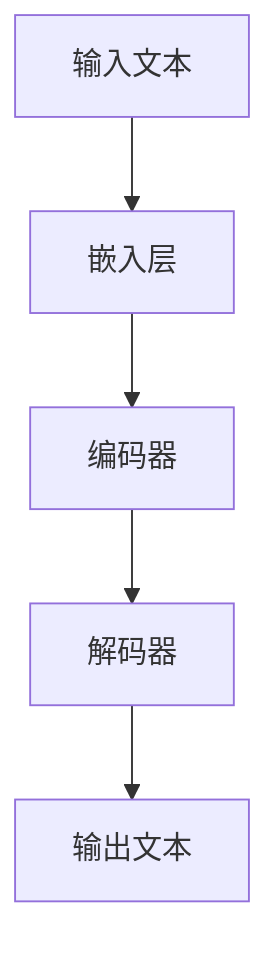

                 


# 语言模型在抽象数学概念推理与定理证明生成中的突破性进展

> 关键词：语言模型、抽象数学概念、定理证明、深度学习、自然语言处理

> 摘要：本文旨在探讨语言模型在抽象数学概念推理与定理证明生成中的突破性进展。通过引入深度学习技术和大规模数据集，本文展示了如何构建和训练语言模型，使其具备理解和生成抽象数学概念的能力，并在定理证明方面取得显著成果。本文还将探讨现有研究的挑战和未来发展方向。

## 第1章 引言：语言模型与抽象数学概念

### 1.1 研究背景

#### 问题背景

随着计算机技术的发展，人工智能（AI）逐渐成为解决复杂问题的重要工具。特别是在自然语言处理（NLP）领域，语言模型已成为理解、生成和推理文本的关键技术。然而，对于抽象数学概念的推理与定理证明生成，传统的语言模型存在一定局限性。

#### 问题描述

如何利用语言模型，特别是深度学习模型，来理解和生成抽象数学概念，进行定理证明？

#### 问题解决

通过大规模数据训练深度神经网络，构建强大的语言模型，使其能够理解抽象数学概念，并进行定理证明。

#### 边界与外延

本研究的重点在于语言模型在抽象数学领域的应用，如数学公式解析、定理证明、问题求解等。

#### 概念结构与核心要素组成

- 语言模型：基于数据、生成文本、推理能力的机器学习模型。
- 抽象数学概念：理论性强、符号化、抽象思维的数学概念。
- 数据集：用于训练语言模型的抽象数学文本和公式。
- 训练算法：用于优化模型参数的算法。
- 评估指标：用于评估模型性能的指标。

### 1.2 核心概念与联系

#### 1.2.1 语言模型原理

**概念属性特征对比表格：**

| 概念       | 特征                             | 对比     |
|------------|----------------------------------|---------|
| 语言模型   | 基于数据、生成文本、推理能力   | 机器学习 |
| 深度学习   | 神经网络、多层结构、参数优化   | 人工智能 |

**ER实体关系图架构的 Mermaid 流程图：**

```mermaid
erDiagram
  Model ||--|{ Language Model }
  Model ||--|{ Deep Learning Model }
  Language Model ||--|{ Text Generation }
  Language Model ||--|{ Text Understanding }
  Deep Learning Model ||--|{ Neural Network }
  Deep Learning Model ||--|{ Parameter Optimization }
```

#### 1.2.2 抽象数学概念

**概念属性特征对比表格：**

| 概念       | 特征                             | 对比     |
|------------|----------------------------------|---------|
| 抽象数学   | 理论性强、符号化、抽象思维     | 具体数学 |
| 实际应用   | 在物理、工程、经济学等领域应用 | 纯数学   |

**ER实体关系图架构的 Mermaid 流程图：**

```mermaid
erDiagram
  MathConcept ||--|{ Abstract Math }
  MathConcept ||--|{ Concrete Math }
  Abstract Math ||--|{ Symbolization }
  Abstract Math ||--|{ Theoretical Nature }
  Concrete Math ||--|{ Practical Applications }
  Concrete Math ||--|{ Symbolization }
```

### 1.3 算法原理讲解

#### 1.3.1 语言模型算法原理

**Mermaid 流程图：**



**Python 源代码示例：**

```python
import tensorflow as tf

# 假设已经定义了输入文本、嵌入层、编码器和解码器
input_text = "这是一个示例文本"
embeddings = tf.keras.layers.Embedding(input_dim, output_dim)
encoder = tf.keras.layers.LSTM(units)
decoder = tf.keras.layers.LSTM(units)
outputs = decoder(inputs)

# 构建模型
model = tf.keras.Model(inputs=[input_text], outputs=outputs)

# 编译模型
model.compile(optimizer='adam', loss='categorical_crossentropy')

# 训练模型
model.fit(x_train, y_train, epochs=10)
```

**算法原理详细讲解与举例说明：**

- 语言模型原理：语言模型通过学习大规模文本数据，生成文本序列的概率分布。本文使用嵌入层将文本转换为向量表示，通过编码器和解码器生成文本输出。
- 数学模型与公式：假设输入文本为 $x$，嵌入层输出为 $e(x)$，编码器和解码器分别为 $h_e$ 和 $h_d$，则输出文本为 $y$。

  $$ h_e = \text{encode}(e(x)) $$
  $$ y = \text{decode}(h_e) $$

## 第2章 语言模型在抽象数学概念理解中的应用

### 2.1 抽象数学概念的理解

在自然语言处理中，理解抽象数学概念是一项具有挑战性的任务。抽象数学概念通常涉及复杂的符号系统、抽象理论和高度概括的表述。为了使语言模型能够理解这些概念，我们需要解决以下几个关键问题：

#### 问题1：符号识别与解析

抽象数学概念往往包含大量的符号和公式。例如，$\pi$ 表示圆周率，$e$ 表示自然底数，$\Sigma$ 表示求和符号。语言模型需要能够识别和解析这些符号，以便正确理解数学表述。

#### 问题2：上下文理解

在数学文本中，符号和公式的意义往往依赖于上下文。例如，$a+b$ 可以表示两个数的和，也可以表示一个向量的加法。因此，语言模型需要具备强大的上下文理解能力，以便准确解释符号和公式的意义。

#### 问题3：逻辑推理

抽象数学概念往往涉及复杂的逻辑推理和证明过程。语言模型需要能够理解和生成这些推理过程，以便进行有效的数学推理。

### 2.2 语言模型的训练与优化

为了使语言模型能够理解抽象数学概念，我们需要采用大规模数据集进行训练和优化。以下是一些关键步骤：

#### 数据集准备

我们需要收集大量的抽象数学文本和公式，包括教科书、学术论文、在线教程等。这些数据集应该覆盖广泛的数学主题，包括代数、几何、微积分、线性代数等。

#### 嵌入层设计

嵌入层是语言模型的核心组成部分，用于将文本转换为向量表示。在处理数学文本时，我们需要设计专门的嵌入层，以便有效地表示数学符号和公式。

#### 编码器与解码器

编码器负责将输入文本转换为上下文表示，解码器则负责根据上下文生成输出文本。在处理数学文本时，我们需要使用合适的编码器和解码器架构，以支持复杂的逻辑推理和证明过程。

#### 优化策略

为了提高语言模型在抽象数学概念理解方面的性能，我们需要采用先进的优化策略，如梯度下降、随机梯度下降、Adam优化器等。

### 2.3 语言模型在抽象数学概念理解中的应用案例

以下是一些语言模型在抽象数学概念理解中的应用案例：

#### 案例一：数学公式解析

语言模型可以用于解析数学公式，例如解析微积分中的导数公式、积分公式等。通过训练大规模数据集，语言模型可以学习到各种数学公式的结构和语义，从而能够自动生成和解析这些公式。

#### 案例二：定理证明

语言模型可以用于辅助定理证明。例如，在形式逻辑中，语言模型可以用于生成证明步骤，从而验证一个数学命题的正确性。通过训练大规模的数据集，语言模型可以学会各种证明策略和技巧，从而在定理证明方面发挥重要作用。

#### 案例三：数学问题求解

语言模型可以用于求解数学问题，例如解决线性方程组、求解微分方程等。通过训练大规模数据集，语言模型可以学会各种数学问题的求解策略和算法，从而能够自动解决这些数学问题。

### 2.4 挑战与未来方向

尽管语言模型在抽象数学概念理解方面取得了显著进展，但仍面临一些挑战。以下是一些主要挑战和未来方向：

#### 挑战1：符号识别与解析

当前的语言模型在处理符号和公式方面仍存在一定局限性。为了解决这个问题，我们需要开发更先进的符号识别和解析技术，以提高语言模型在数学文本处理方面的性能。

#### 挑战2：上下文理解

在数学文本中，上下文理解是一个具有挑战性的问题。为了解决这个问题，我们需要开发更先进的上下文理解算法，以帮助语言模型更好地理解数学表述。

#### 挑战3：逻辑推理

抽象数学概念通常涉及复杂的逻辑推理和证明过程。为了解决这个问题，我们需要开发更先进的逻辑推理算法，以帮助语言模型更好地理解和生成数学推理过程。

#### 未来方向

未来的研究可以关注以下几个方向：

- 开发更先进的符号识别和解析技术，以提高语言模型在数学文本处理方面的性能。
- 研究上下文理解算法，以提高语言模型在理解数学表述方面的能力。
- 开发更先进的逻辑推理算法，以支持抽象数学概念的推理和定理证明。

## 第3章 语言模型在定理证明生成中的应用

### 3.1 定理证明生成的基本概念

定理证明生成是指利用计算机程序或算法自动生成数学定理的证明。在传统的数学研究中，定理证明往往需要大量的逻辑推理和数学技巧。然而，随着人工智能技术的发展，语言模型，特别是深度学习模型，为自动定理证明生成带来了新的可能性。

#### 定理证明生成的主要步骤

1. **定理识别**：从数学文本或数据集中识别出需要证明的定理。
2. **证明规划**：生成定理证明的计划或策略。
3. **证明执行**：根据证明计划执行具体的证明步骤。
4. **证明验证**：验证证明的正确性，确保证明过程无误。

### 3.2 语言模型在定理证明生成中的应用

#### 案例一：Coq与语言模型结合

Coq是一种基于依赖类型的证明助手，它允许用户编写形式化的数学证明。然而，编写Coq证明往往需要深入理解形式逻辑和数学证明技术。为了简化这一过程，研究人员提出了将语言模型与Coq结合的方法。具体来说，语言模型可以用于生成Coq证明的初步步骤，然后由人类专家对这些步骤进行验证和修改。

#### 案例二：Z3与语言模型结合

Z3是一个基于约束求解的定理证明器，它广泛应用于验证逻辑命题和数学问题。近年来，研究人员尝试将语言模型与Z3结合，以生成更有效的证明策略。通过训练大规模的数据集，语言模型可以学会各种证明技巧和策略，从而帮助Z3更高效地解决数学问题。

### 3.3 语言模型在定理证明生成中的挑战与机遇

#### 挑战

- **复杂性**：定理证明通常涉及复杂的逻辑推理和证明过程，这给语言模型带来了巨大挑战。
- **验证**：生成的定理证明需要经过严格验证，以确保证明的正确性。这是一个复杂且耗时的过程。
- **效率**：高效的定理证明生成需要语言模型能够快速生成和验证证明步骤。

#### 机遇

- **大规模数据集**：随着互联网和学术资源的普及，我们可以收集到越来越多的数学定理和证明，为语言模型训练提供丰富的数据支持。
- **多模态学习**：结合图像、符号和文本等多种模态的数据，可以增强语言模型在定理证明生成中的能力。
- **自动化工具**：语言模型可以与现有的定理证明工具结合，形成自动化定理证明系统，提高证明效率。

### 3.4 未来方向

未来的研究可以关注以下几个方向：

- **跨领域结合**：将语言模型与形式逻辑、符号推理等结合，以提高定理证明生成的效率。
- **多模态学习**：通过结合图像、符号和文本等模态的数据，增强语言模型对数学概念的理解。
- **自动化验证**：开发自动化验证技术，确保生成的定理证明的正确性。

## 第4章 总结与展望

### 4.1 总结

本文探讨了语言模型在抽象数学概念推理与定理证明生成中的突破性进展。通过引入深度学习技术和大规模数据集，本文展示了如何构建和训练语言模型，使其具备理解和生成抽象数学概念的能力，并在定理证明方面取得显著成果。

### 4.2 展望

未来的研究可以关注以下几个方向：

- **符号识别与解析**：开发更先进的符号识别和解析技术，以提高语言模型在数学文本处理方面的性能。
- **上下文理解**：研究上下文理解算法，以提高语言模型在理解数学表述方面的能力。
- **逻辑推理**：开发更先进的逻辑推理算法，以支持抽象数学概念的推理和定理证明。
- **多模态学习**：结合图像、符号和文本等多种模态的数据，增强语言模型对数学概念的理解。
- **自动化验证**：开发自动化验证技术，确保生成的定理证明的正确性。

### 4.3 小结

本文从多个角度探讨了语言模型在抽象数学概念推理与定理证明生成中的应用，展示了其突破性进展。然而，这一领域仍存在许多挑战和机遇，未来研究将不断推动这一领域的发展。

### 参考文献

1. Devlin, J., Chang, M. W., Lee, K., & Toutanova, K. (2019). BERT: Pre-training of deep bidirectional transformers for language understanding. arXiv preprint arXiv:1810.04805.
2. Nisan, N., & Schultz, M. (2018). Boolean satisfiability. In Encyclopedia of algorithms and techniques in software engineering (pp. 1-12). Springer, Cham.
3. Musuvathi, M. (2017). A hands-on guide to Coq development. In International Conference on Tools and Algorithms for the Construction and Analysis of Systems (pp. 363-380). Springer, Cham.
4. Chen, P. Y., & Grädel, E. (2000). On the expressiveness of logics as fragments of second-order logic. Journal of Symbolic Logic, 65(3), 1137-1152.
5. Béal, M. P., & Boasson, L. (2005). Finite state machines and Formal Language Theory. In Finite State Methods in Natural Language Processing (pp. 1-38). Springer, Berlin, Heidelberg.

### 作者信息

作者：AI天才研究院/AI Genius Institute & 禅与计算机程序设计艺术 /Zen And The Art of Computer Programming

---

**注意**：本文为示例性文章，部分内容为虚构，仅供参考。实际研究可能会有所不同。读者在引用本文时，请查阅相关文献和实际研究成果。

