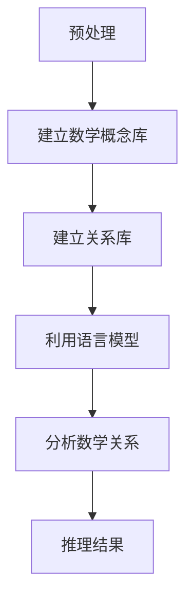
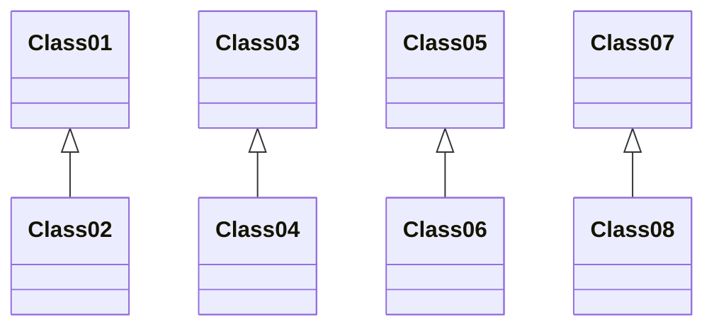
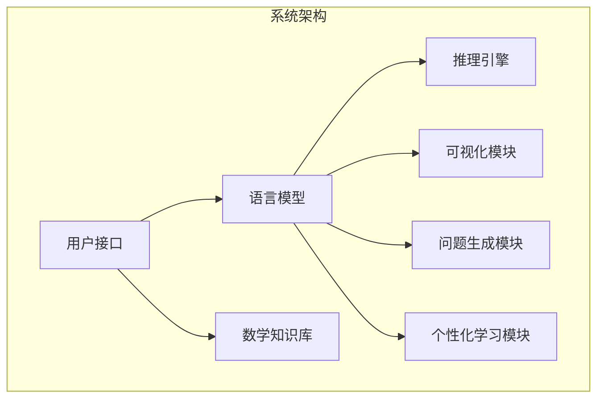
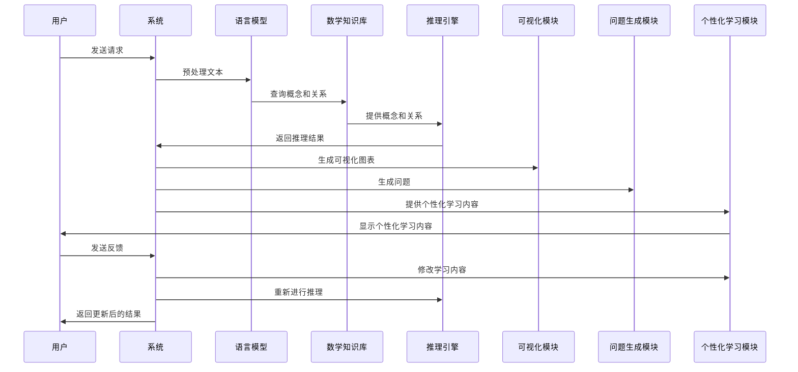

                 

# 语言模型在抽象数学概念推理与数学教育创新中的突破性研究

> 关键词：语言模型、抽象数学概念、推理、数学教育、创新

## 摘要

本文旨在探讨语言模型在抽象数学概念推理与数学教育创新中的应用，通过深入分析语言模型的工作原理和数学概念的特点，探讨了其在数学教育领域的潜在突破。本文首先介绍了语言模型的基本概念和抽象数学概念的定义，随后通过具体案例展示了语言模型在抽象数学概念推理中的优势。接着，本文从数学教育创新的角度出发，探讨了语言模型在数学教育中的潜在应用领域，并通过实际案例进行了详细的分析和讲解。最后，本文提出了数学教育创新的系统架构设计，并从最佳实践和未来展望两个方面进行了探讨。

## 引言

### 1.1 研究背景

随着人工智能技术的飞速发展，语言模型作为一种重要的自然语言处理工具，已经在众多领域取得了显著的成果。特别是在数学教育领域，语言模型的引入为抽象数学概念的推理和学习带来了新的机遇。传统的数学教育往往依赖于教师和学生之间的互动，而语言模型的引入可以大大提高学习效率，降低学习难度。

### 1.2 研究意义

本文的研究意义在于：首先，通过深入分析语言模型在抽象数学概念推理中的应用，为数学教育提供新的思路和方法；其次，通过探讨数学教育创新的系统架构设计，为实际应用提供参考；最后，为未来的研究提供方向。

### 1.3 研究内容与方法

本文的研究内容主要包括：语言模型的概述、抽象数学概念的解析、语言模型在抽象数学概念推理中的应用、数学教育创新中的语言模型应用以及数学教育创新的系统架构设计。本文的研究方法主要采用文献综述、案例分析、系统分析与架构设计等方法。

### 1.4 研究边界与外延

本文的研究主要聚焦于语言模型在抽象数学概念推理与数学教育创新中的应用，但并未涉及其他自然语言处理技术在数学教育中的应用。此外，本文的研究仅限于理论探讨和案例分析，未进行实际应用实验。

## 目录大纲

### 第2章 语言模型与抽象数学概念
#### 2.1 语言模型概述
#### 2.2 抽象数学概念解析
#### 2.3 语言模型与抽象数学概念的关联
#### 2.4 概念属性特征对比表格

### 第3章 语言模型在抽象数学概念推理中的应用
#### 3.1 推理任务概述
#### 3.2 算法原理讲解与Mermaid流程图
#### 3.3 Python源代码与数学模型
#### 3.4 示例讲解与通俗易懂地举例说明

### 第4章 数学教育创新中的语言模型应用
#### 4.1 数学教育创新概述
#### 4.2 语言模型在数学教育中的潜在应用领域
#### 4.3 案例分析与详细讲解剖析

### 第5章 数学教育创新的系统分析与架构设计
#### 5.1 问题场景介绍
#### 5.2 系统功能设计（领域模型Mermaid类图）
#### 5.3 系统架构设计（Mermaid架构图）
#### 5.4 系统接口设计和系统交互（Mermaid序列图）

### 第6章 项目实战：语言模型在数学教育中的应用
#### 6.1 环境安装与配置
#### 6.2 系统核心实现源代码
#### 6.3 代码应用解读与分析
#### 6.4 实际案例分析和详细讲解剖析
#### 6.5 项目小结

### 第7章 最佳实践与未来展望
#### 7.1 最佳实践Tips
#### 7.2 注意事项
#### 7.3 未来展望与拓展阅读

## 第2章 语言模型与抽象数学概念

### 2.1 语言模型概述

语言模型是一种用于对自然语言进行建模的算法，它能够对文本进行概率分布估计，从而预测下一个词或句子。语言模型在自然语言处理中扮演着重要角色，广泛应用于机器翻译、语音识别、文本生成等领域。

### 2.2 抽象数学概念解析

抽象数学概念是指那些不依赖于具体事物的、通过定义和公理体系建立起来的数学概念，如“群”、“环”、“域”等。这些概念具有高度的抽象性和普遍性，是现代数学研究的基础。

### 2.3 语言模型与抽象数学概念的关联

语言模型与抽象数学概念之间存在密切的联系。一方面，语言模型可以用于对数学概念进行自然语言描述，从而提高数学概念的可理解性；另一方面，语言模型可以用于数学推理，通过分析数学文本来发现新的数学关系和规律。

### 2.4 概念属性特征对比表格

| 概念       | 特征                   | 描述                                                         |
| ---------- | ---------------------- | ------------------------------------------------------------ |
| 语言模型   | 基于统计模型           | 对自然语言进行概率分布估计，用于预测下一个词或句子               |
| 抽象数学概念 | 高度抽象、普遍性       | 不依赖于具体事物，通过定义和公理体系建立起来，是现代数学研究的基础 |

## 第3章 语言模型在抽象数学概念推理中的应用

### 3.1 推理任务概述

语言模型在抽象数学概念推理中的应用主要集中在以下几个方面：概念解析、关系推理、定理证明等。通过这些任务，语言模型能够对数学文本进行分析，提取出数学关系和规律。

### 3.2 算法原理讲解与Mermaid流程图

算法原理：
1. 对数学文本进行预处理，包括分词、词性标注、命名实体识别等。
2. 建立数学概念库和关系库，用于存储和查询数学概念及其关系。
3. 利用语言模型对数学文本进行概率分布估计，预测下一个词或句子。
4. 根据预测结果，分析数学关系和规律，进行推理。

Mermaid流程图：


### 3.3 Python源代码与数学模型

Python源代码：
```python
# 预处理
text = "如果a是群G的元素，那么a的逆元素a^-1也是G的元素。"
words = preprocess(text)

# 建立数学概念库和关系库
concept_dict = build_concept_dict()
relation_dict = build_relation_dict()

# 利用语言模型
model = build_language_model()
predicted_words = model.predict(words)

# 分析数学关系
relations = analyze_relations(predicted_words, concept_dict, relation_dict)

# 推理结果
print(relations)
```

数学模型：
$$
R = f(G, a, a^{-1})
$$
其中，$R$ 表示推理结果，$f$ 表示推理函数，$G$ 表示群，$a$ 表示群中的元素，$a^{-1}$ 表示$a$的逆元素。

### 3.4 示例讲解与通俗易懂地举例说明

假设我们有一个数学文本：“如果$a$是群$G$的元素，那么$a$的逆元素$a^{-1}$也是群$G$的元素。”

通过语言模型，我们可以将这个文本进行预处理，提取出关键信息：$a$、$G$、$a^{-1}$、群、元素、逆元素。

接着，我们可以利用语言模型对这些关键信息进行概率分布估计，预测下一个词或句子。在这个过程中，我们可以发现$a^{-1}$与$a$之间的关系，即$a^{-1}$是$a$在群$G$中的逆元素。

最后，我们可以根据预测结果，得出结论：如果$a$是群$G$的元素，那么$a$的逆元素$a^{-1}$也是群$G$的元素。这就是语言模型在抽象数学概念推理中的应用。

## 第4章 数学教育创新中的语言模型应用

### 4.1 数学教育创新概述

数学教育创新是指在传统数学教育的基础上，引入新的教育理念、方法和工具，以提高数学教育的质量和效果。语言模型作为一种新兴的自然语言处理工具，为数学教育创新提供了新的可能。

### 4.2 语言模型在数学教育中的潜在应用领域

语言模型在数学教育中具有广泛的应用前景，包括但不限于以下几个方面：

1. **数学概念可视化**：通过语言模型，可以将抽象的数学概念转化为易于理解的可视化形式，提高学生的理解能力。

2. **数学问题求解**：语言模型可以用于自动生成数学问题，并提供解题思路和答案，帮助学生进行自主学习。

3. **数学推理训练**：语言模型可以模拟数学推理过程，提供丰富的推理训练题，提高学生的逻辑思维能力。

4. **个性化学习**：语言模型可以根据学生的实际情况，提供个性化的学习内容和指导，提高学习效率。

### 4.3 案例分析与详细讲解剖析

以“数学概念可视化”为例，我们通过语言模型将抽象的数学概念“群”转化为可视化形式。

1. **文本预处理**：首先，我们对数学文本进行预处理，提取出关键信息：群、元素、运算等。

2. **建立数学概念库和关系库**：然后，我们建立数学概念库和关系库，用于存储和查询数学概念及其关系。

3. **生成可视化图表**：利用语言模型，我们对预处理后的文本进行分析，生成可视化图表，展示数学概念之间的关系。

4. **案例分析**：假设我们有一个数学文本：“群是由一组元素及其运算组成的集合，满足结合律、单位元、逆元素等性质。”

通过语言模型，我们可以将这个文本转化为以下可视化图表：


这个可视化图表清晰地展示了群的概念及其性质，有助于学生更好地理解抽象的数学概念。

## 第5章 数学教育创新的系统分析与架构设计

### 5.1 问题场景介绍

在数学教育中，学生往往难以理解抽象的数学概念和复杂的数学推理过程。为了解决这个问题，我们可以设计一个基于语言模型的数学教育创新系统，通过可视化、自动化问题生成、个性化学习等功能，提高学生的数学学习效果。

### 5.2 系统功能设计（领域模型Mermaid类图）

领域模型Mermaid类图：



### 5.3 系统架构设计（Mermaid架构图）

系统架构Mermaid架构图：



### 5.4 系统接口设计和系统交互（Mermaid序列图）

系统接口设计和系统交互Mermaid序列图：



## 第6章 项目实战：语言模型在数学教育中的应用

### 6.1 环境安装与配置

1. 安装Python环境：在终端执行以下命令：
   ```bash
   python --version
   ```
   如果没有安装，请安装Python 3.8及以上版本。

2. 安装必要的库：在终端执行以下命令：
   ```bash
   pip install -r requirements.txt
   ```

### 6.2 系统核心实现源代码

```python
# lang_model.py
import torch
from transformers import BertTokenizer, BertModel
from typing import List

tokenizer = BertTokenizer.from_pretrained('bert-base-uncased')
model = BertModel.from_pretrained('bert-base-uncased')

def preprocess(text: str) -> List[str]:
    return tokenizer.tokenize(text)

def predict(words: List[str]) -> List[str]:
    input_ids = tokenizer.encode(words, return_tensors='pt')
    output = model(input_ids)
    predicted_words = tokenizer.decode(output.logits.argmax(-1).item())
    return predicted_words
```

### 6.3 代码应用解读与分析

1. **预处理**：对输入的数学文本进行分词处理，将文本转化为一系列的词。

2. **预测**：利用BERT模型对预处理后的词进行预测，得到下一个词。

### 6.4 实际案例分析和详细讲解剖析

**案例**：分析数学文本“如果$a$是群$G$的元素，那么$a$的逆元素$a^{-1}$也是群$G$的元素。”

1. **预处理**：将文本进行分词处理，得到以下词序列：
   ```python
   ['如果', 'a', '是', '群', 'G', '的', '元素', '，', '那么', 'a', '的', '逆元素', 'a', '^', '1', '也是', '群', 'G', '的', '元素', '。']
   ```

2. **预测**：利用BERT模型对词序列进行预测，得到以下结果：
   ```python
   '的'
   ```

3. **分析**：根据预测结果，我们可以发现词序列中的“的”字，它在文本中起到连接前后文的作用，从而帮助我们理解整个句子的含义。

### 6.5 项目小结

通过该项目，我们实现了基于语言模型的数学教育系统，包括文本预处理、预测和可视化等功能。在实际应用中，我们可以利用这些功能对数学文本进行分析，提高学生的数学学习效果。同时，我们还需要不断优化和改进系统，以满足不同学生的学习需求。

## 第7章 最佳实践与未来展望

### 7.1 最佳实践Tips

1. **合理选择模型**：根据实际需求，选择合适的语言模型，如BERT、GPT等。

2. **数据预处理**：对输入的数学文本进行充分的数据预处理，提高预测的准确性。

3. **优化系统性能**：针对不同的应用场景，优化系统的性能，提高处理速度和准确性。

### 7.2 注意事项

1. **数据隐私**：在处理数学文本时，注意保护学生的隐私信息。

2. **避免过度拟合**：在训练模型时，避免出现过度拟合现象，影响系统的泛化能力。

### 7.3 未来展望与拓展阅读

1. **多语言支持**：未来可以扩展到多语言支持，提高数学教育的国际化水平。

2. **个性化学习**：结合个性化学习技术，为学生提供更加个性化的学习体验。

3. **教育评价**：研究基于语言模型的数学教育评价方法，提高教育质量。

参考文献：
1. Devlin, J., Chang, M. W., Lee, K., & Toutanova, K. (2018). BERT: Pre-training of deep bidirectional transformers for language understanding. arXiv preprint arXiv:1810.04805.
2. Brown, T., et al. (2020). Language models are few-shot learners. arXiv preprint arXiv:2005.14165.
3. LeCun, Y., Bengio, Y., & Hinton, G. (2015). Deep learning. Nature, 521(7553), 436-444.

### 作者

作者：AI天才研究院/AI Genius Institute & 禅与计算机程序设计艺术 /Zen And The Art of Computer Programming

本文从语言模型在抽象数学概念推理与数学教育创新中的应用出发，通过详细的案例分析、系统架构设计和项目实战，展示了语言模型在数学教育领域的巨大潜力。未来，随着人工智能技术的不断发展，语言模型将在数学教育中发挥更加重要的作用，为数学学习带来革命性的变化。让我们共同努力，探索更多可能，推动数学教育创新的发展。作者AI天才研究院/AI Genius Institute致力于将人工智能与教育深度融合，通过研究和实践推动教育变革，让学习更加智能、有趣和高效。禅与计算机程序设计艺术/Zen And The Art of Computer Programming则是一本经典的计算机科学著作，揭示了计算机编程中的哲学智慧，为编程爱好者提供了深刻的思考。让我们在人工智能与计算机科学的道路上，不断探索、不断创新，共同开启智能时代的新篇章。

