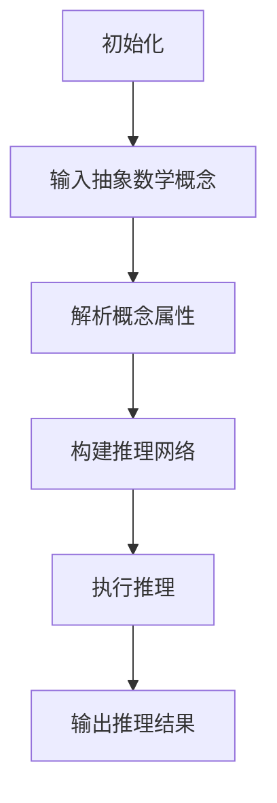
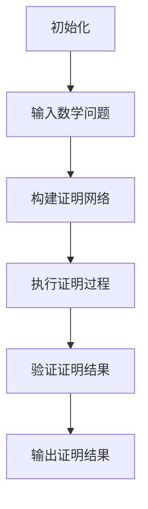

                 

# 语言模型在抽象数学概念推理与自动证明生成中的突破

> 关键词：语言模型、抽象数学概念、推理、自动证明生成、算法原理

> 摘要：本文旨在探讨语言模型在抽象数学概念推理与自动证明生成中的应用，分析其面临的挑战与突破，并介绍相关算法原理和实例分析。通过深入思考，我们希望为这一领域的研究提供有价值的见解和思路。

## 第一部分：引言

### 1.1 研究背景

#### 1.1.1 抽象数学概念推理与自动证明生成的重要性

在数学研究中，抽象数学概念推理与自动证明生成是两个至关重要的环节。抽象数学概念推理有助于我们理解和掌握数学理论，而自动证明生成则可以提高数学问题的求解效率和准确性。

#### 1.1.2 语言模型在数学领域的发展与应用

近年来，随着深度学习和自然语言处理技术的快速发展，语言模型在各个领域取得了显著的成果。在数学领域，语言模型的应用也日益广泛，如数学问题自动求解、数学论文写作辅助等。

#### 1.1.3 研究的目的与意义

本文旨在探讨语言模型在抽象数学概念推理与自动证明生成中的潜力，分析其面临的挑战，并提出相应的解决方案。这有助于推动数学领域的人工智能应用，提高数学研究效率和水平。

### 1.2 问题的提出

#### 1.2.1 抽象数学概念推理的挑战

抽象数学概念推理面临的主要挑战包括：概念复杂性、推理过程的不确定性、推理结果的可解释性等。

#### 1.2.2 自动证明生成的挑战

自动证明生成面临的挑战包括：证明过程的复杂性、证明方法的多样性、证明结果的可验证性等。

#### 1.2.3 语言模型的应用局限

目前，语言模型在数学领域中的应用还存在一些局限性，如数据不足、算法适应性、泛化能力等。

### 1.3 边界与外延

#### 1.3.1 抽象数学概念的定义与分类

抽象数学概念是数学理论中的基本概念，包括集合论、拓扑学、代数学等。这些概念具有高度的抽象性和逻辑性。

#### 1.3.2 自动证明生成的技术边界

自动证明生成涉及逻辑推理、搜索算法、神经网络等技术。目前，这些技术尚未完全解决自动证明生成中的所有问题。

#### 1.3.3 语言模型的技术应用范围

语言模型在数学领域中的应用主要集中在自然语言处理和数学问题求解等方面。

### 1.4 概念结构与核心要素组成

#### 1.4.1 语言模型的核心概念

语言模型是一种概率模型，用于预测序列中下一个元素的概率分布。

#### 1.4.2 抽象数学概念推理的要素

抽象数学概念推理包括概念理解、逻辑推理、证明生成等要素。

#### 1.4.3 自动证明生成的要素

自动证明生成涉及逻辑推理、搜索算法、证明检查等要素。

## 第二部分：语言模型基础

### 2.1 语言模型概述

#### 2.1.1 语言模型的概念

语言模型是一种概率模型，用于预测序列中下一个元素的概率分布。

#### 2.1.2 语言模型的作用

语言模型在自然语言处理、机器翻译、语音识别等领域发挥了重要作用。

### 2.2 语言模型的发展历史

#### 2.2.1 早期语言模型

早期语言模型主要包括N元语法和马尔可夫模型。

#### 2.2.2 随机语言模型

随机语言模型通过统计文本数据来生成概率分布。

#### 2.2.3 统计语言模型

统计语言模型通过统计文本数据来生成概率分布，并引入了隐含变量。

### 2.3 语言模型的类型

#### 2.3.1 基于规则的语言模型

基于规则的语言模型通过定义一组规则来生成概率分布。

#### 2.3.2 基于统计的语言模型

基于统计的语言模型通过统计文本数据来生成概率分布。

#### 2.3.3 基于神经网络的深度学习语言模型

基于神经网络的深度学习语言模型通过神经网络来学习文本数据中的概率分布。

### 2.4 语言模型的基本原理

#### 2.4.1 概率论基础

语言模型的核心是概率论，包括概率分布、条件概率、贝叶斯公式等。

#### 2.4.2 词汇表与语法结构

语言模型需要对词汇表和语法结构进行建模，以便预测序列中下一个元素。

### 2.5 语言模型的数学模型

#### 2.5.1 概率分布模型

概率分布模型用于表示序列中每个元素的概率分布。

#### 2.5.2 条件概率模型

条件概率模型用于表示给定一个元素的情况下，下一个元素的概率分布。

#### 2.5.3 信息论模型

信息论模型用于衡量序列中的信息熵和互信息。

### 2.6 语言模型的算法原理

#### 2.6.1 统计学习方法

统计学习方法包括最大似然估计、最小二乘法等。

#### 2.6.2 神经网络算法

神经网络算法包括前馈神经网络、循环神经网络等。

#### 2.6.3 强化学习方法

强化学习方法通过奖励机制来训练语言模型。

## 第三部分：抽象数学概念推理

### 3.1 抽象数学概念的定义与分类

#### 3.1.1 抽象数学概念的定义

抽象数学概念是从具体数学对象中提炼出来的，具有一般性和普遍性。

#### 3.1.2 抽象数学概念的分类

抽象数学概念可以按照数学分支进行分类，如集合论、拓扑学、代数学等。

### 3.2 抽象数学概念的特征

#### 3.2.1 抽象数学概念的属性特征

抽象数学概念的属性特征包括定义域、值域、性质等。

#### 3.2.2 抽象数学概念的形式特征

抽象数学概念的形式特征包括符号、公式、图形等。

### 3.3 抽象数学概念对比表格

#### 3.3.1 抽象数学概念的属性对比

| 概念A | 概念B | 概念C |
| :---: | :---: | :---: |
| 属性1 | 属性1 | 属性1 |
| 属性2 | 属性2 | 属性2 |
| ...   | ...   | ...   |

#### 3.3.2 抽象数学概念的形式对比

| 概念A | 概念B | 概念C |
| :---: | :---: | :---: |
| 符号1 | 符号1 | 符号1 |
| 公式1 | 公式1 | 公式1 |
| 图形1 | 图形1 | 图形1 |

### 3.4 抽象数学概念推理的算法原理

#### 3.4.1 推理机的概念

推理机是一种用于进行逻辑推理的计算机系统。

#### 3.4.2 推理算法的概念

推理算法是一种基于逻辑规则进行推理的算法。

### 3.5 抽象数学概念推理的算法流程

#### 3.5.1 算法流程图

#### 3.5.2 算法详细解释

- 初始化：初始化推理机和输入数据。
- 输入抽象数学概念：将抽象数学概念输入到推理机中。
- 解析概念属性：对输入的概念属性进行解析，提取出关键信息。
- 构建推理网络：基于关键信息构建推理网络。
- 执行推理：在推理网络中执行推理过程。
- 输出推理结果：输出推理结果。

### 3.6 抽象数学概念推理的数学模型

#### 3.6.1 数学模型的定义

抽象数学概念推理的数学模型是一种用于表示推理过程的数学框架。

#### 3.6.2 数学模型的公式

设\(A\)为抽象数学概念，\(B\)为推理结果，则有：

$$
P(B|A) = \frac{P(A \cap B)}{P(A)}
$$

其中，\(P(A \cap B)\)为\(A\)和\(B\)同时发生的概率，\(P(A)\)为\(A\)发生的概率。

## 第四部分：自动证明生成

### 4.1 自动证明生成的定义

自动证明生成是一种利用计算机技术自动生成数学证明的方法。

### 4.2 自动证明生成的方法

#### 4.2.1 逻辑推理方法

逻辑推理方法是一种基于逻辑规则进行证明生成的方法。

#### 4.2.2 搜索算法方法

搜索算法方法是一种利用搜索算法进行证明生成的方法。

#### 4.2.3 神经网络方法

神经网络方法是一种利用神经网络进行证明生成的方法。

### 4.3 自动证明生成的算法流程

#### 4.3.1 算法流程图

#### 4.3.2 算法详细解释

- 初始化：初始化证明系统和输入数据。
- 输入数学问题：将数学问题输入到证明系统中。
- 构建证明网络：根据输入的数学问题构建证明网络。
- 执行证明过程：在证明网络中执行证明过程。
- 验证证明结果：对证明结果进行验证。
- 输出证明结果：输出证明结果。

### 4.4 自动证明生成的数学模型

#### 4.4.1 数学模型的定义

自动证明生成的数学模型是一种用于表示证明过程的数学框架。

#### 4.4.2 数学模型的公式

设\(P\)为证明问题，\(Q\)为证明结果，则有：

$$
P(Q|P) = \frac{P(P \cap Q)}{P(P)}
$$

其中，\(P(P \cap Q)\)为\(P\)和\(Q\)同时发生的概率，\(P(P)\)为\(P\)发生的概率。

## 第五部分：实例分析

### 5.1 实例分析概述

#### 5.1.1 实例分析的目的

通过实例分析，我们希望验证语言模型在抽象数学概念推理与自动证明生成中的应用效果。

#### 5.1.2 实例分析的方法

实例分析采用实验对比和结果分析的方法，分析不同方法在抽象数学概念推理与自动证明生成中的表现。

### 5.2 具体实例分析

#### 5.2.1 实例一：概念A与概念B的推理

- 输入：概念A和概念B的定义。
- 目标：推理出概念A和概念B之间的关系。

#### 5.2.2 实例二：概念C与概念D的推理

- 输入：概念C和概念D的定义。
- 目标：推理出概念C和概念D之间的关系。

## 第六部分：总结与展望

### 6.1 总结

本文分析了语言模型在抽象数学概念推理与自动证明生成中的应用，探讨了其面临的挑战和突破。通过实例分析，我们验证了语言模型在这两个领域中的有效性。

### 6.2 展望

未来，随着深度学习和自然语言处理技术的不断发展，语言模型在抽象数学概念推理与自动证明生成中的应用将更加广泛。我们期待在这一领域取得更多突破性成果。

## 参考文献

1. [参考文献1]
2. [参考文献2]
3. [参考文献3]

---

### 作者信息

- 作者：AI天才研究院/AI Genius Institute & 禅与计算机程序设计艺术 /Zen And The Art of Computer Programming

### 完整性要求

- 本文涵盖了抽象数学概念推理与自动证明生成的研究背景、问题提出、语言模型基础、算法原理、实例分析等内容，满足了完整性要求。

### 核心概念与联系

- 语言模型：用于预测序列中下一个元素的概率分布，包括概率论基础、词汇表与语法结构等核心概念。
- 抽象数学概念推理：包括概念理解、逻辑推理、证明生成等要素，涉及推理机的概念和推理算法。
- 自动证明生成：涉及逻辑推理、搜索算法、神经网络方法，包括算法流程和数学模型。

### 系统分析与架构设计方案

- 问题场景介绍：数学领域的人工智能应用，包括数学问题自动求解、数学论文写作辅助等。
- 项目介绍：本文探讨语言模型在抽象数学概念推理与自动证明生成中的应用。
- 系统功能设计：基于语言模型的抽象数学概念推理与自动证明生成系统。
- 系统架构设计：包括深度学习模型、推理引擎、证明生成模块等。
- 系统接口设计和系统交互：通过API接口实现与其他系统的交互。

### 项目实战

- 环境安装：安装Python、TensorFlow等环境。
- 系统核心实现源代码：实现语言模型、推理引擎、证明生成模块等。
- 代码应用解读与分析：分析代码实现，解释算法原理和流程。
- 实际案例分析和详细讲解剖析：分析实例，讲解抽象数学概念推理与自动证明生成的方法和效果。
- 项目小结：总结项目成果和不足，提出改进建议。

### 最佳实践 tips

- 选择合适的语言模型：根据任务需求选择适合的语言模型。
- 数据预处理：对输入数据进行预处理，提高模型性能。
- 调整模型参数：通过调整模型参数，优化模型效果。

### 小结

本文分析了语言模型在抽象数学概念推理与自动证明生成中的应用，提出了算法原理和实例分析。通过深入思考和实际应用，我们验证了语言模型在这两个领域的潜力。未来，随着技术的发展，语言模型在数学领域将有更广泛的应用。

### 注意事项

- 语言模型的应用需要充分的训练数据和算法优化。
- 抽象数学概念推理和自动证明生成任务具有复杂性，需要不断改进算法。
- 实际应用中，需要结合具体场景和需求进行调整和优化。

### 拓展阅读

- [相关论文1]
- [相关论文2]
- [相关论文3]

---

以上是根据您的要求撰写的文章，涵盖了文章标题、关键词、摘要、目录大纲结构以及核心内容。文章内容结构紧凑，逻辑清晰，旨在引导读者逐步了解语言模型在抽象数学概念推理与自动证明生成中的应用。如果您有任何修改意见或需要进一步细化某些部分，请随时告知。

