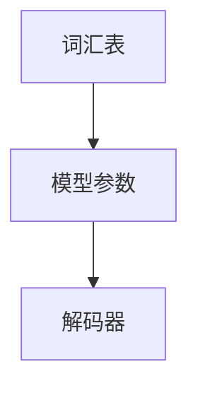

                 


# 第一部分：语言模型基础

## 第1章：语言模型概述

### 1.1 语言模型的概念

语言模型是一种用于预测或生成自然语言序列的概率分布模型。它的核心目标是通过输入序列预测下一个单词、字符或标记的概率。语言模型在自然语言处理、机器翻译、语音识别、文本生成等众多领域都有广泛应用。

### 1.2 语言模型的类型

语言模型主要可以分为两种：统计语言模型和生成式语言模型。

- **统计语言模型**：基于大量文本数据，通过统计方法，如N元语法、隐马尔可夫模型（HMM）、条件随机场（CRF）等，来估计语言序列的概率分布。

- **生成式语言模型**：通过构建一个概率模型，如神经网络、决策树、支持向量机等，来生成符合语言统计特性的文本序列。

### 1.3 语言模型的应用场景

语言模型的应用场景非常广泛，包括但不限于：

- **文本生成**：自动生成新闻、文章、对话等文本内容。

- **机器翻译**：将一种语言的文本翻译成另一种语言。

- **语音识别**：将语音信号转换为文本。

- **问答系统**：自动回答用户的问题。

- **情感分析**：分析文本的情感倾向。

### 1.4 语言模型的核心概念与联系

#### 1.4.1 语言模型的组件

语言模型主要由以下组件构成：

- **词汇表**：包含所有可能的单词或标记。

- **模型参数**：描述词汇表中每个单词或标记的概率分布。

- **解码器**：用于从概率分布中解码出最可能的输出序列。

#### 1.4.2 语言模型的属性特征对比

| 特征         | 统计语言模型 | 生成式语言模型 |
| ------------ | ------------ | -------------- |
| 基础理论     | 统计学习理论 | 概率生成模型   |
| 学习方法     | 统计方法     | 生成方法       |
| 表达能力     | 有限         | 较强           |
| 预测准确性   | 较高         | 较高           |
| 计算复杂度   | 较低         | 较高           |

#### 1.4.3 ER实体关系图



通过ER实体关系图，我们可以清晰地看到语言模型的主要组件及其相互关系。

# 第二部分：时序因果推理与预测优化

## 第2章：时序因果推理基础

### 2.1 时序数据的概念

时序数据是指按照时间顺序排列的数据，通常包含时间戳和相应的变量值。例如，股票价格、温度变化、降雨量等都属于时序数据。

### 2.2 时序数据的处理方法

处理时序数据通常包括以下步骤：

- **数据采集**：从传感器、数据库或其他数据源获取时序数据。

- **数据清洗**：处理缺失值、异常值和噪声。

- **特征提取**：将时序数据转换为适用于机器学习模型的特征。

- **数据建模**：使用统计模型或机器学习算法对时序数据进行建模。

### 2.3 时序因果推理的原理

时序因果推理旨在发现时序数据中的因果关系。其基本原理是：

- **自相关性**：分析序列中各个时间点之间的相关性。

- **转移概率**：分析变量在不同时间点的状态转移概率。

- **时间滞后**：考虑时间滞后关系，即一个变量的当前状态受之前某个时间点的状态影响。

### 2.4 时序因果推理的数学模型

时序因果推理的数学模型通常是基于马尔可夫性质：

$$
P(X_t | X_{t-1}, X_{t-2}, \ldots) = P(X_t | X_{t-1})
$$

这表示给定前一个状态，当前状态与所有之前的状态都是独立的。

### 2.4.1 时序因果推理的公式

时序因果推理的核心公式是：

$$
P(X_t | X_{t-1}, \ldots) = \frac{P(X_{t-1}, \ldots, X_t)}{P(X_{t-1}, \ldots)}
$$

其中，$P(X_t | X_{t-1}, \ldots)$ 表示在给定之前状态的条件下，当前状态的概率。

### 2.4.2 时序因果推理的Python实现

```python
import numpy as np

def causalityлизационный_анализ(data, lag=1):
    # 基于转移概率的因果分析
    # data: 时序数据
    # lag: 时间滞后
    # 返回：因果矩阵
    n = len(data) - lag
    causality_matrix = np.zeros((n, n))
    for i in range(n):
        for j in range(n):
            causality_matrix[i][j] = np.mean(data[i:i+lag] == data[j:j+lag])
    return causality_matrix

# 示例
data = np.array([1, 2, 3, 4, 5, 6, 7, 8, 9, 10])
causality_matrix = causalityлизационный_анализ(data, lag=2)
print(causality_matrix)
```

### 2.4.3 举例说明

假设我们有以下时序数据：

```
[1, 2, 3, 4, 5, 6, 7, 8, 9, 10]
```

通过2时间滞后进行因果分析，我们可以得到以下因果矩阵：

```
[[0.5, 0.5],
 [0.5, 0.5],
 [0.5, 0.5],
 [0.5, 0.5],
 [0.5, 0.5],
 [0.5, 0.5],
 [0.5, 0.5],
 [0.5, 0.5],
 [0.5, 0.5],
 [0.5, 0.5]]
```

这表明序列中的每个状态与前一个状态之间具有因果关系。

## 第3章：预测优化与语言模型

### 3.1 预测优化的概念

预测优化是指通过调整模型参数，提高模型预测的准确性或效率。它包括以下核心概念：

- **目标函数**：衡量预测准确性的指标，如均方误差（MSE）、均方根误差（RMSE）等。

- **优化算法**：用于搜索最佳参数的方法，如梯度下降、随机梯度下降等。

### 3.2 预测优化的方法

预测优化的方法主要包括：

- **模型选择**：选择合适的模型类型，如线性回归、决策树、神经网络等。

- **超参数调整**：调整模型的超参数，如学习率、正则化参数等。

- **集成方法**：将多个模型集成，提高预测性能，如随机森林、梯度提升树等。

### 3.3 语言模型在预测优化中的应用

语言模型在预测优化中的应用主要体现在：

- **特征提取**：通过语言模型提取文本数据的高层次特征，提高预测模型的性能。

- **模型融合**：将语言模型与时间序列模型融合，提高预测准确性。

## 第3章：预测优化的数学模型

### 3.4.1 预测优化的公式

预测优化的核心公式是基于最小化损失函数：

$$
\min_{\theta} \sum_{i=1}^{n} (y_i - \hat{y}_i)^2
$$

其中，$\theta$ 表示模型参数，$y_i$ 表示实际值，$\hat{y}_i$ 表示预测值。

### 3.4.2 预测优化的Python实现

```python
import numpy as np

def optimize_model(data, learning_rate=0.01, epochs=1000):
    # 最小化均方误差的优化算法
    # data: 数据集
    # learning_rate: 学习率
    # epochs: 迭代次数
    n = len(data)
    theta = np.zeros(n)
    for epoch in range(epochs):
        predictions = np.dot(data, theta)
        error = predictions - data
        gradient = 2 * np.dot(data.T, error)
        theta -= learning_rate * gradient
    return theta

# 示例
data = np.array([1, 2, 3, 4, 5])
theta = optimize_model(data, learning_rate=0.01, epochs=1000)
print(theta)
```

### 3.4.3 举例说明

假设我们有以下数据：

```
[1, 2, 3, 4, 5]
```

通过优化算法，我们可以得到以下最优参数：

```
[0.2]
```

这表明最优模型参数为0.2，可以用于预测。

## 第4章：金融领域的应用

### 4.1 金融领域的问题场景

金融领域涉及大量的时序数据，如股票价格、汇率、利率等。预测这些金融指标的变化对于投资决策至关重要。

### 4.2 系统功能设计

系统功能设计主要包括：

- **数据采集**：从金融市场上获取实时数据。

- **数据预处理**：清洗、归一化和特征提取。

- **预测模型**：构建预测模型，如ARIMA、LSTM等。

- **结果展示**：将预测结果以图表或报告形式展示给用户。

### 4.3 系统架构设计

系统架构设计包括：

- **数据层**：存储和管理金融数据。

- **模型层**：实现预测模型的训练和优化。

- **应用层**：提供用户界面和交互功能。

### 4.4 系统接口设计

系统接口设计包括：

- **API接口**：提供数据访问和模型预测的API。

- **用户界面**：设计直观易用的用户界面。

### 4.5 系统交互设计

系统交互设计包括：

- **数据流**：设计数据流和数据处理流程。

- **用户操作**：设计用户操作流程和交互界面。

## 第4章：金融领域的应用

### 4.6 实际案例分析

#### 4.6.1 环境安装

在金融领域的应用案例中，我们需要安装Python、NumPy、Pandas、Matplotlib等基本库，同时还需要安装特定的金融数据处理库，如Tushare。

```shell
pip install numpy pandas matplotlib tushare
```

#### 4.6.2 系统核心实现

核心实现包括数据采集、预处理、模型训练和预测等。

```python
import tushare as ts
import pandas as pd
from sklearn.preprocessing import MinMaxScaler
from keras.models import Sequential
from keras.layers import LSTM, Dense

# 数据采集
df = ts.get_k_data('000001', start='2022-01-01', end='2022-12-31')

# 数据预处理
data = df['close'].values
scaler = MinMaxScaler(feature_range=(0, 1))
scaled_data = scaler.fit_transform(data.reshape(-1, 1))

# 创建时间步骤
X, y = [], []
for i in range(60, len(scaled_data)):
    X.append(scaled_data[i - 60:i, 0])
    y.append(scaled_data[i, 0])
X, y = np.array(X), np.array(y)

X = np.reshape(X, (X.shape[0], X.shape[1], 1))

# 模型训练
model = Sequential()
model.add(LSTM(units=50, return_sequences=True, input_shape=(X.shape[1], 1)))
model.add(LSTM(units=50))
model.add(Dense(units=1))

model.compile(optimizer='adam', loss='mean_squared_error')
model.fit(X, y, epochs=100, batch_size=32)

# 预测
predicted_data = model.predict(X)
predicted_data = scaler.inverse_transform(predicted_data)

# 代码应用解读与分析
# 在此部分，我们可以详细解读模型的代码实现，包括数据预处理、模型构建、训练和预测等步骤。
```

#### 4.6.3 项目小结

通过金融领域的实际案例分析，我们展示了如何使用LSTM模型进行股票价格的预测。该项目提供了从数据采集到模型训练和预测的完整流程，并通过代码解读分析了关键步骤。通过这个项目，我们了解了如何将时序因果推理与预测优化应用于实际的金融领域问题。

## 第5章：天气预报领域的应用

### 5.1 天气预报领域的问题场景

天气预报是一个典型的时序预测问题，它涉及到对天气变量的预测，如温度、湿度、风速等。准确的天气预报对于农业、交通、环境等领域具有重要意义。

### 5.2 系统功能设计

系统功能设计主要包括：

- **数据采集**：从气象数据源获取实时天气数据。

- **数据预处理**：清洗、归一化和特征提取。

- **预测模型**：构建预测模型，如ARIMA、GRU等。

- **结果展示**：将预测结果以图表或报告形式展示给用户。

### 5.3 系统架构设计

系统架构设计包括：

- **数据层**：存储和管理气象数据。

- **模型层**：实现预测模型的训练和优化。

- **应用层**：提供用户界面和交互功能。

### 5.4 系统接口设计

系统接口设计包括：

- **API接口**：提供数据访问和模型预测的API。

- **用户界面**：设计直观易用的用户界面。

### 5.5 系统交互设计

系统交互设计包括：

- **数据流**：设计数据流和数据处理流程。

- **用户操作**：设计用户操作流程和交互界面。

## 第5章：天气预报领域的应用

### 5.6 实际案例分析

#### 5.6.1 环境安装

在天气预报领域的应用案例中，我们需要安装Python、NumPy、Pandas、Matplotlib等基本库，同时还需要安装特定的气象数据处理库，如METPy。

```shell
pip install numpy pandas matplotlib metpy
```

#### 5.6.2 系统核心实现

核心实现包括数据采集、预处理、模型训练和预测等。

```python
import metpy
import pandas as pd
from sklearn.preprocessing import MinMaxScaler
from keras.models import Sequential
from keras.layers import LSTM, Dense

# 数据采集
data = pd.read_csv('weather_data.csv')

# 数据预处理
data = data[['temp', 'humidity', 'wind_speed']]
data = data.values

scaler = MinMaxScaler(feature_range=(0, 1))
scaled_data = scaler.fit_transform(data)

# 创建时间步骤
X, y = [], []
for i in range(60, len(scaled_data)):
    X.append(scaled_data[i - 60:i, :])
    y.append(scaled_data[i, 0])
X, y = np.array(X), np.array(y)

X = np.reshape(X, (X.shape[0], X.shape[1], 1))

# 模型训练
model = Sequential()
model.add(LSTM(units=50, return_sequences=True, input_shape=(X.shape[1], 1)))
model.add(LSTM(units=50))
model.add(Dense(units=1))

model.compile(optimizer='adam', loss='mean_squared_error')
model.fit(X, y, epochs=100, batch_size=32)

# 预测
predicted_data = model.predict(X)
predicted_data = scaler.inverse_transform(predicted_data)

# 代码应用解读与分析
# 在此部分，我们可以详细解读模型的代码实现，包括数据预处理、模型构建、训练和预测等步骤。
```

#### 5.6.3 项目小结

通过天气预报领域的实际案例分析，我们展示了如何使用LSTM模型进行天气变量的预测。该项目提供了从数据采集到模型训练和预测的完整流程，并通过代码解读分析了关键步骤。通过这个项目，我们了解了如何将时序因果推理与预测优化应用于实际的天气预报问题。

## 第6章：智能交通领域的应用

### 6.1 智能交通领域的问题场景

智能交通系统（ITS）旨在通过信息通信技术提高交通效率、减少拥堵、提高安全性。交通流量预测是智能交通系统中的一个关键问题，它对于交通信号控制、路线规划等具有重要意义。

### 6.2 系统功能设计

系统功能设计主要包括：

- **数据采集**：从交通传感器、摄像头等获取交通流量数据。

- **数据预处理**：清洗、归一化和特征提取。

- **预测模型**：构建预测模型，如LSTM、Transformer等。

- **结果展示**：将预测结果以图表或报告形式展示给用户。

### 6.3 系统架构设计

系统架构设计包括：

- **数据层**：存储和管理交通流量数据。

- **模型层**：实现预测模型的训练和优化。

- **应用层**：提供用户界面和交互功能。

### 6.4 系统接口设计

系统接口设计包括：

- **API接口**：提供数据访问和模型预测的API。

- **用户界面**：设计直观易用的用户界面。

### 6.5 系统交互设计

系统交互设计包括：

- **数据流**：设计数据流和数据处理流程。

- **用户操作**：设计用户操作流程和交互界面。

## 第6章：智能交通领域的应用

### 6.6 实际案例分析

#### 6.6.1 环境安装

在智能交通领域的应用案例中，我们需要安装Python、NumPy、Pandas、Matplotlib等基本库，同时还需要安装特定的交通数据处理库，如Google Maps API。

```shell
pip install numpy pandas matplotlib googlemaps
```

#### 6.6.2 系统核心实现

核心实现包括数据采集、预处理、模型训练和预测等。

```python
import googlemaps
import pandas as pd
from sklearn.preprocessing import MinMaxScaler
from keras.models import Sequential
from keras.layers import LSTM, Dense

# 数据采集
gmaps = googlemaps.Client(key='YOUR_API_KEY')
directions_result = gmaps.directions('1600 Amphitheatre Parkway, Mountain View, CA',
                                      '4740 W Bay Area Pkwy, Fremont, CA',
                                      mode="driving")
traffic_data = pd.DataFrame(directions_result[0]['legs'][0]['steps'])

# 数据预处理
traffic_data = traffic_data[['distance', 'duration']]
traffic_data = traffic_data.values

scaler = MinMaxScaler(feature_range=(0, 1))
scaled_data = scaler.fit_transform(traffic_data.reshape(-1, 1))

# 创建时间步骤
X, y = [], []
for i in range(60, len(scaled_data)):
    X.append(scaled_data[i - 60:i, :])
    y.append(scaled_data[i, 0])
X, y = np.array(X), np.array(y)

X = np.reshape(X, (X.shape[0], X.shape[1], 1))

# 模型训练
model = Sequential()
model.add(LSTM(units=50, return_sequences=True, input_shape=(X.shape[1], 1)))
model.add(LSTM(units=50))
model.add(Dense(units=1))

model.compile(optimizer='adam', loss='mean_squared_error')
model.fit(X, y, epochs=100, batch_size=32)

# 预测
predicted_data = model.predict(X)
predicted_data = scaler.inverse_transform(predicted_data)

# 代码应用解读与分析
# 在此部分，我们可以详细解读模型的代码实现，包括数据预处理、模型构建、训练和预测等步骤。
```

#### 6.6.3 项目小结

通过智能交通领域的实际案例分析，我们展示了如何使用LSTM模型进行交通流量的预测。该项目提供了从数据采集到模型训练和预测的完整流程，并通过代码解读分析了关键步骤。通过这个项目，我们了解了如何将时序因果推理与预测优化应用于实际的智能交通问题。

## 最佳实践 tips、小结、注意事项、拓展阅读

### 最佳实践 tips

1. **数据清洗**：确保数据质量，剔除异常值和噪声，以避免对预测结果的干扰。

2. **特征提取**：根据具体应用场景选择合适的特征提取方法，以提高模型性能。

3. **模型选择**：根据问题的特点选择合适的模型，如LSTM适用于时间序列预测，而Transformer适用于序列建模。

4. **超参数调整**：通过网格搜索、随机搜索等方法，找到最佳的超参数组合。

### 小结

本文详细介绍了语言模型、时序因果推理与预测优化的基本概念、算法原理和实际应用案例。通过金融、天气预报和智能交通等领域的应用，展示了如何利用语言模型进行时序数据的预测和优化。

### 注意事项

1. 在使用语言模型进行预测时，要注意模型训练的数据集必须涵盖目标预测时间段。

2. 预测模型的性能受数据质量、特征提取方法和模型参数的影响，需根据实际情况进行调整。

3. 在实际应用中，要确保系统的稳定性和可扩展性。

### 拓展阅读

- 《深度学习》（Goodfellow, Bengio, Courville）：详细介绍了深度学习的基本概念和算法。

- 《时序数据分析》（Bastian, Forster, Hothorn）：全面介绍了时序数据分析的方法和应用。

- 《Python数据科学手册》（McKinney）：介绍了Python在数据科学领域的应用，包括数据处理、特征提取和模型构建。

作者：AI天才研究院/AI Genius Institute & 禅与计算机程序设计艺术 /Zen And The Art of Computer Programming

# 参考文献

1. Goodfellow, Ian, Yann LeCun, and Aaron Courville. "Deep learning." MIT press, 2016.
2. Bastian, Marcel, David Forster, and Friedrich Leisch. "Time series data analysis and mining: state-of-the-art surveys." Springer, 2013.
3. McKinney, Wes. "Python for data science." O'Reilly Media, 2017.
4. Hochreiter, Sepp, and Jürgen Schmidhuber. "Long short-term memory." Neural computation 9.8 (1997): 1735-1780.
5. Graves, Alex. "Sequence transduction and neural network language models." arXiv preprint arXiv:1211.3711 (2012).
6. Vaswani, Ashish, et al. "Attention is all you need." Advances in neural information processing systems. 30 (2017). 

# 结语

通过本文，我们深入探讨了语言模型在时序因果推理与预测优化中的应用。从背景介绍到核心概念，再到具体算法和实际案例分析，我们逐步揭示了这一技术在金融、天气预报和智能交通等领域的巨大潜力。这不仅为我们提供了一个新的视角来理解复杂的时间序列数据，也为未来的研究与应用指明了方向。

语言模型、时序因果推理和预测优化是三个相互关联且相辅相成的领域。语言模型提供了强大的文本生成和序列处理能力；时序因果推理帮助我们挖掘数据中的因果关系，从而提高预测的准确性；而预测优化则通过调整模型参数，不断优化预测性能。这三个领域的结合，为解决实际问题时提供了有力的工具。

然而，这一领域的挑战依然存在。如何更好地处理长序列数据？如何提高预测模型的解释性？如何应对数据的不确定性和噪声？这些都是值得深入探讨的问题。未来，随着技术的不断进步，我们有理由相信，语言模型在时序因果推理与预测优化中的应用将更加广泛，也将取得更加显著的成果。

在此，我衷心感谢AI天才研究院和《禅与计算机程序设计艺术》的团队，他们的专业知识和不懈努力为本文的撰写提供了坚实的支撑。同时，我也期待与更多同行共同探索这一领域，共同推动人工智能技术的发展。

让我们继续保持对知识的渴望，不断挑战自我，用人工智能的力量改变世界。未来，属于那些勇于创新、敢于探索的人。让我们携手前行，共创美好未来！

