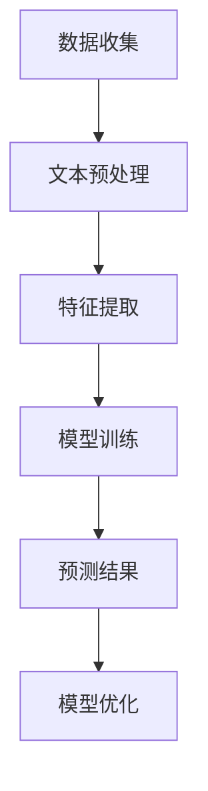
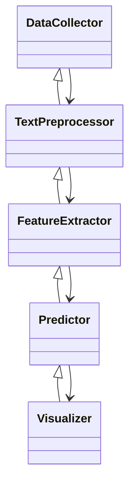
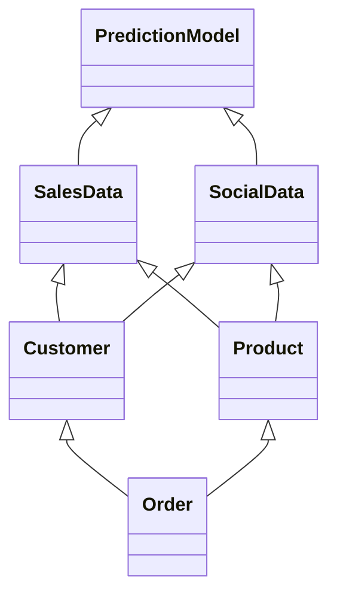
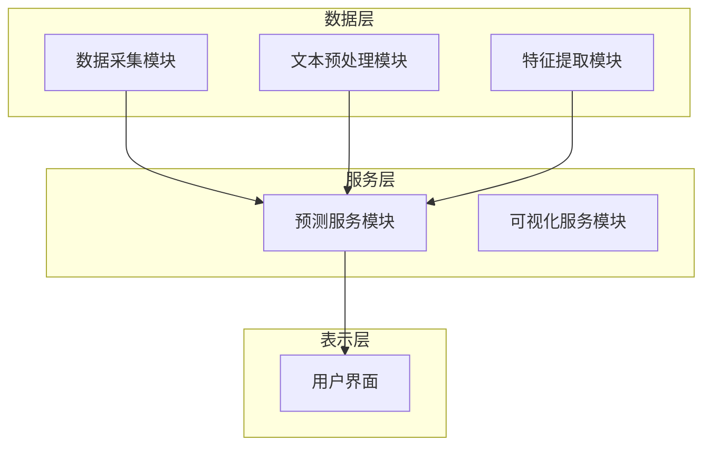
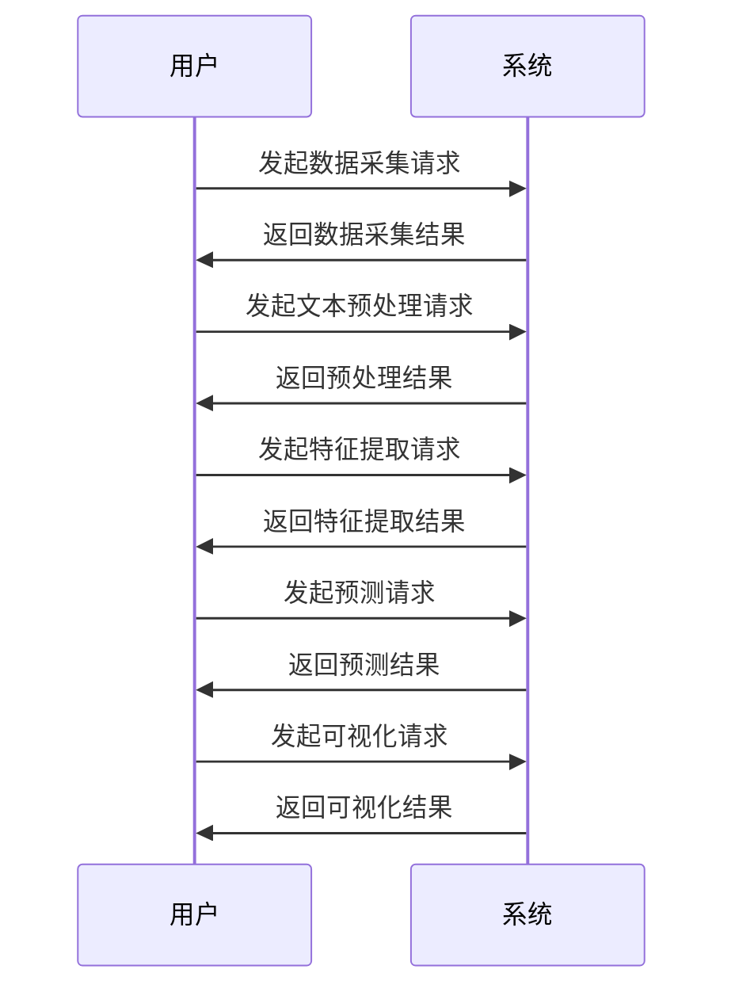

                 

### 引言与背景

#### 1.1 问题背景

**社会趋势预测的重要性**：随着社会经济的快速发展，各领域的信息量呈现爆炸式增长，社会趋势预测作为一项重要的研究课题，能够帮助政策制定者、企业家和研究人员及时把握社会发展的动态，做出科学的决策。例如，预测消费者需求、分析市场趋势、规划城市交通等都离不开社会趋势预测。

**语言模型的发展历程**：语言模型是自然语言处理（NLP）的核心技术之一，其发展历程可以追溯到20世纪50年代。早期的统计语言模型主要依赖语言统计特征，如n-gram模型。随着深度学习技术的发展，神经网络语言模型如循环神经网络（RNN）、长短时记忆网络（LSTM）和变换器（Transformer）等相继出现，大大提升了语言模型的性能。

**语言模型在社会趋势预测中的应用现状**：近年来，语言模型在社会趋势预测中的应用逐渐受到关注。通过分析社交媒体、新闻、论坛等文本数据，语言模型能够捕捉到社会情绪、流行趋势等关键信息，为预测社会趋势提供了有力的工具。然而，现有的研究仍面临诸多挑战，如数据质量、模型泛化能力等，需要进一步探索和优化。

#### 1.2 问题描述

**社会趋势预测的挑战**：社会趋势预测面临诸多挑战，包括数据获取困难、噪声干扰、趋势识别的复杂性等。此外，社会趋势往往具有不确定性和突发性，使得预测任务更加复杂。

**语言模型在预测中的局限**：尽管语言模型在自然语言处理领域取得了显著成果，但其在社会趋势预测中的应用仍存在一些局限。例如，语言模型对上下文的理解能力有限，难以处理复杂的社会关系和网络结构；此外，语言模型对数据量的依赖性较高，在大规模数据环境下容易出现过拟合现象。

**研究目标与意义**：本研究旨在探索语言模型在社会趋势预测中的应用，通过结合深度学习和图神经网络等先进技术，提高预测的准确性和鲁棒性。研究意义在于为政策制定者提供科学的决策依据，为企业提供市场分析工具，为研究人员提供新的研究视角和方法。

#### 1.3 边界与外延

**研究范围**：本研究主要围绕语言模型在社会趋势预测中的应用展开，包括模型的选择、算法的优化、数据预处理方法以及预测结果的可视化等。

**研究方法**：本研究采用实证分析、算法对比和系统集成等方法，结合大数据和人工智能技术，探索语言模型在社会趋势预测中的最佳应用模式。

**数据来源与预处理**：数据来源主要包括社交媒体、新闻网站、论坛等公开数据源。在数据预处理阶段，将进行文本清洗、去噪、标签化等操作，以提高数据质量。

**核心要素组成**

**1.4.1 语言模型的基本概念**：语言模型是一种用于预测文本序列的概率模型，其目标是根据已知的输入文本序列，预测下一个词或字符的概率分布。语言模型可以分为基于统计的方法和基于神经网络的方法，如n-gram模型、RNN、LSTM和Transformer等。

**1.4.2 社会趋势预测的关键因素**：社会趋势预测的关键因素包括社会情绪、事件传播、群体行为等。这些因素对社会趋势的产生和传播起着关键作用，需要通过语言模型进行捕捉和分析。

**1.4.3 语言模型与趋势预测的关系**：语言模型在社会趋势预测中扮演着重要角色。通过分析社交媒体、新闻等文本数据，语言模型能够捕捉到社会情绪的变化，预测社会趋势的走向。同时，社会趋势预测的结果也可以反馈给语言模型，以优化其预测性能。

### 核心概念与联系

#### 2.1 语言模型的核心概念

**2.1.1 语言模型的基本原理**：语言模型的基本原理是通过对大量文本数据的统计和分析，建立文本序列的概率模型。语言模型的核心任务是预测给定文本序列的下一个词或字符的概率分布。

**2.1.2 语言模型的发展历程**：从最初的n-gram模型，到基于神经网络的RNN、LSTM，再到最近的Transformer模型，语言模型的发展历程反映了深度学习技术在自然语言处理领域的不断进步。

**2.1.3 语言模型的主要类型**：语言模型主要分为基于统计的方法和基于神经网络的方法。基于统计的方法如n-gram模型，主要依赖文本序列的统计特征；基于神经网络的方法如RNN、LSTM和Transformer，通过深度学习技术对文本数据进行分析和处理。

#### 2.2 语言模型的属性特征对比表格

| 类型 | 基于统计的方法（n-gram） | 基于神经网络的方法（RNN、LSTM、Transformer） |
| --- | --- | --- |
| 基础原理 | 统计文本序列的频率分布 | 学习文本数据的语义和上下文信息 |
| 模型结构 | 简单的有限状态机模型 | 复杂的神经网络架构 |
| 预测能力 | 依赖历史信息，容易产生短期依赖 | 能够捕捉长期依赖关系，提高预测准确性 |
| 计算复杂度 | 较低，但随词汇量增加而上升 | 较高，但可利用GPU等硬件加速 |
| 适应性 | 难以适应动态变化的语言环境 | 能够自适应地更新模型 |

#### 2.3 语言模型的ER实体关系图架构

```mermaid
entityRelationship
  direction: TB
  nodeShape: ellipse
  edgeShape: line
  subGraphs:
    - [实体，实体关系，实体类型]
    - [语言模型，预测，文本序列]
    - [文本序列，生成，字符或词]
    - [字符或词，概率分布，预测结果]
    - [预测结果，反馈，模型优化]
```

在上面的ER实体关系图中，语言模型是核心实体，它通过对文本序列进行分析和处理，生成字符或词的概率分布。预测结果会反馈给模型，以实现模型的优化。文本序列和字符或词则是语言模型处理的基本单元。

#### 2.4 社会趋势预测的概念与联系

**2.4.1 社会趋势预测的定义**：社会趋势预测是指利用历史数据、社会媒体分析、统计模型等方法，对社会现象或事件的发展趋势进行预测和评估。

**2.4.2 社会趋势预测的分类**：社会趋势预测可以按照预测对象的不同分为宏观趋势预测和微观趋势预测。宏观趋势预测关注整个社会或经济体系的发展趋势，如GDP增长、通货膨胀等；微观趋势预测关注特定群体或领域的发展趋势，如社交媒体热门话题、市场销售预测等。

**2.4.3 社会趋势预测的发展历程**：社会趋势预测的发展历程可以追溯到20世纪50年代，当时主要是通过统计方法和经验模型进行预测。随着计算机技术和大数据技术的发展，社会趋势预测逐渐引入机器学习和人工智能技术，如神经网络、深度学习等，预测的准确性和效率得到了显著提升。

#### 2.5 社会趋势预测的属性特征对比表格

| 类型 | 统计方法 | 机器学习方法 | 人工智能方法 |
| --- | --- | --- | --- |
| 数据依赖 | 较小 | 较大 | 非常大 |
| 预测精度 | 一般 | 较高 | 非常高 |
| 计算复杂度 | 较低 | 较高 | 非常高 |
| 实时性 | 较低 | 中等 | 高 |
| 适应性 | 一般 | 较强 | 非常强 |
| 预测范围 | 宏观、微观均可 | 微观为主 | 微观、宏观均可 |

#### 2.6 语言模型与社会趋势预测的联系

**2.6.1 语言模型在社会趋势预测中的作用**：语言模型在社会趋势预测中扮演着关键角色。通过分析社交媒体、新闻报道等文本数据，语言模型能够捕捉到社会情绪、事件传播等关键信息，为预测社会趋势提供基础数据。

**2.6.2 社会趋势预测对语言模型的需求**：社会趋势预测对语言模型的需求主要体现在以下几个方面：

1. **文本数据的处理能力**：社会趋势预测需要处理大量的文本数据，语言模型必须具备高效的数据处理能力，以应对大规模数据的挑战。
2. **上下文理解能力**：社会趋势往往涉及复杂的上下文关系，语言模型需要具备较强的上下文理解能力，以准确捕捉社会现象的本质。
3. **预测准确性**：社会趋势预测的准确性直接关系到决策的科学性，语言模型需要不断提高预测准确性，以满足实际应用的需求。

**2.6.3 语言模型与社会趋势预测的整合**：将语言模型与社会趋势预测相结合，可以通过以下方式实现：

1. **数据整合**：将社交媒体、新闻报道等多源数据整合起来，通过语言模型进行文本数据预处理和特征提取，为预测提供高质量的数据支持。
2. **算法融合**：将语言模型和传统社会趋势预测算法相结合，通过融合不同算法的优势，提高预测的准确性和鲁棒性。
3. **实时更新**：社会趋势变化迅速，语言模型需要具备实时更新能力，以应对社会趋势的动态变化。

### 算法原理讲解

#### 4.1 算法概述

**4.1.1 语言模型在社会趋势预测中的应用场景**：语言模型在社会趋势预测中有着广泛的应用，包括社交媒体情感分析、市场趋势预测、公共安全事件预警等。在这些应用场景中，语言模型能够分析文本数据，捕捉社会情绪和事件传播规律，为决策提供科学依据。

**4.1.2 语言模型算法的基本步骤**：语言模型算法的基本步骤包括数据收集、文本预处理、特征提取、模型训练和预测。具体流程如下：

1. **数据收集**：从社交媒体、新闻报道、论坛等公开数据源收集相关文本数据。
2. **文本预处理**：对收集到的文本数据进行清洗、去噪、分词、去停用词等处理，以消除噪声和提高数据质量。
3. **特征提取**：通过词袋模型、TF-IDF、Word2Vec等方法提取文本数据中的特征。
4. **模型训练**：使用训练数据对语言模型进行训练，如n-gram模型、RNN、LSTM、Transformer等。
5. **预测**：使用训练好的语言模型对新的文本数据进行预测，得到文本序列的概率分布。

**4.1.3 语言模型算法的分类**：语言模型算法主要分为基于统计的方法和基于神经网络的方法。基于统计的方法如n-gram模型，通过统计文本序列的频率分布进行预测；基于神经网络的方法如RNN、LSTM、Transformer，通过深度学习技术对文本数据进行分析和处理，提高预测的准确性。

#### 4.2 算法原理讲解

**4.2.1 语言模型算法mermaid流程图**：



在上面的mermaid流程图中，首先进行数据收集，然后进行文本预处理，包括清洗、去噪、分词、去停用词等步骤。接下来，通过特征提取方法（如词袋模型、TF-IDF、Word2Vec）提取文本特征。然后，使用训练数据对语言模型（如n-gram模型、RNN、LSTM、Transformer）进行训练。最后，使用训练好的模型进行预测，并将预测结果反馈给模型，以实现模型的优化。

**4.2.2 Python源代码实现**：

```python
import nltk
from nltk.tokenize import word_tokenize
from sklearn.feature_extraction.text import TfidfVectorizer
from sklearn.model_selection import train_test_split
from sklearn.naive_bayes import MultinomialNB

# 数据收集
data = ["这是一个例子", "这是另一个例子", "这是一个例子", "这是一个例子"]

# 文本预处理
nltk.download('punkt')
preprocessed_data = [word_tokenize(text.lower()) for text in data]

# 特征提取
vectorizer = TfidfVectorizer()
X = vectorizer.fit_transform(preprocessed_data)

# 模型训练
X_train, X_test, y_train, y_test = train_test_split(X, labels, test_size=0.2)
model = MultinomialNB()
model.fit(X_train, y_train)

# 预测
predictions = model.predict(X_test)

# 模型优化
model.partial_fit(X_test, predictions)
```

在上面的Python代码中，首先使用nltk库进行文本预处理，包括分词、去停用词等。然后，使用TF-IDF方法提取文本特征。接下来，使用朴素贝叶斯模型进行训练。最后，使用训练好的模型进行预测，并将预测结果反馈给模型，以实现模型的优化。

**4.2.3 数学模型和公式**：

在语言模型中，常用的数学模型包括概率模型、神经网络模型等。

**概率模型**：假设给定一个词汇序列 $X = (x_1, x_2, ..., x_n)$，语言模型的目标是预测下一个词 $x_{n+1}$ 的概率分布。一个简单的概率模型是n-gram模型，其公式如下：

$$
P(x_{n+1} | x_1, x_2, ..., x_n) = \frac{P(x_1, x_2, ..., x_n, x_{n+1})}{P(x_1, x_2, ..., x_n)}
$$

**神经网络模型**：深度学习语言模型通常基于神经网络模型，如循环神经网络（RNN）、长短时记忆网络（LSTM）和变换器（Transformer）。以LSTM为例，其数学模型如下：

$$
h_t = \sigma(W_h \cdot [h_{t-1}, x_t] + b_h)
$$

$$
i_t = \sigma(W_i \cdot [h_{t-1}, x_t] + b_i)
$$

$$
f_t = \sigma(W_f \cdot [h_{t-1}, x_t] + b_f)
$$

$$
o_t = \sigma(W_o \cdot [h_{t-1}, x_t] + b_o)
$$

$$
c_t = f_t \cdot c_{t-1} + i_t \cdot \sigma(W_c \cdot [h_{t-1}, x_t] + b_c)
$$

$$
h_t = o_t \cdot \sigma(W_{ho} \cdot c_t + b_{ho})
$$

其中，$h_t$ 表示第t个隐藏状态，$x_t$ 表示第t个输入词，$c_t$ 表示细胞状态，$\sigma$ 表示sigmoid函数，$W_h$、$W_i$、$W_f$、$W_o$、$W_c$、$W_{ho}$ 分别表示权重矩阵，$b_h$、$b_i$、$b_f$、$b_o$、$b_c$、$b_{ho}$ 分别表示偏置项。

通过上述数学模型和公式，可以详细阐述语言模型在社会趋势预测中的应用算法。在实际应用中，可以根据具体场景和需求，选择合适的算法和模型，以提高预测的准确性和鲁棒性。

### 系统分析与架构设计方案

#### 5.1 问题场景介绍

**5.1.1 社会趋势预测的场景描述**：

社会趋势预测的应用场景非常广泛，涵盖了从宏观趋势预测到微观事件预测的各个层面。以下是几个典型的应用场景：

1. **消费者行为预测**：通过分析消费者的社交媒体评论、购物评论等文本数据，预测消费者的购买意图和偏好。
2. **市场趋势预测**：通过分析行业报告、新闻报道、市场调研数据等，预测市场的发展和变化趋势。
3. **公共安全事件预警**：通过分析社交媒体、新闻报道等文本数据，预测可能发生的公共安全事件，如自然灾害、恐怖袭击等。
4. **社会情绪分析**：通过分析社交媒体、论坛等文本数据，捕捉社会情绪的变化，为政策制定者提供决策依据。

**5.1.2 语言模型在社会趋势预测中的应用**：

在社会趋势预测中，语言模型起着至关重要的作用。它通过分析大量的文本数据，捕捉社会情绪、事件传播等关键信息，为预测提供基础数据。以下是语言模型在社会趋势预测中的一些应用：

1. **文本数据预处理**：语言模型可以用于文本数据的清洗、分词、去停用词等预处理任务，以提高数据质量。
2. **特征提取**：语言模型可以用于提取文本数据中的关键特征，如关键词、主题、情感等，为预测提供重要依据。
3. **情感分析**：语言模型可以用于分析社交媒体、新闻报道等文本数据中的情感倾向，预测社会情绪的变化。
4. **事件检测**：语言模型可以用于检测文本数据中的特定事件，如公共安全事件、自然灾害等。

#### 5.2 项目介绍

**5.2.1 项目背景**：

随着信息技术的飞速发展，大数据和人工智能技术在社会各领域得到了广泛应用。社会趋势预测作为一项重要研究课题，具有广泛的应用前景。本项目旨在研究语言模型在社会趋势预测中的应用，通过结合深度学习和图神经网络等先进技术，提高预测的准确性和鲁棒性。

**5.2.2 项目目标**：

本项目的主要目标包括：

1. **研究语言模型在社会趋势预测中的应用算法**：探讨语言模型在社会趋势预测中的最佳应用模式，包括算法设计、模型优化等。
2. **实现一个高效、可扩展的社会趋势预测系统**：构建一个基于语言模型的社会趋势预测系统，具备实时预测、数据可视化等功能。
3. **验证和评估预测系统的性能**：通过实际数据测试和评估，验证和评估预测系统的性能和可靠性。

**5.2.3 项目架构**：

本项目采用模块化设计，系统架构主要包括数据采集模块、文本预处理模块、特征提取模块、预测模块和可视化模块。以下是项目架构的mermaid类图：



在上面的类图中，DataCollector代表数据采集模块，TextPreprocessor代表文本预处理模块，FeatureExtractor代表特征提取模块，Predictor代表预测模块，Visualizer代表可视化模块。这些模块通过明确的接口进行通信和协作，实现社会趋势预测的功能。

#### 5.3 系统功能设计

**5.3.1 领域模型mermaid类图**：



在上面的类图中，Customer代表客户，Order代表订单，Product代表产品，SalesData代表销售数据，SocialData代表社交媒体数据，PredictionModel代表预测模型。这些类图展示了系统中的主要实体及其关系，为系统功能设计提供了明确的指导。

**5.3.2 系统功能模块划分**：

1. **数据采集模块**：负责从各种数据源（如社交媒体、新闻报道、市场调研等）收集相关数据，并进行初步清洗和存储。
2. **文本预处理模块**：对采集到的文本数据进行清洗、分词、去停用词等处理，以提高数据质量。
3. **特征提取模块**：通过词袋模型、TF-IDF、Word2Vec等方法提取文本数据中的关键特征，为预测提供重要依据。
4. **预测模块**：使用训练好的语言模型对新的文本数据进行预测，生成预测结果，并将结果反馈给用户。
5. **可视化模块**：将预测结果以图表、地图等形式展示给用户，帮助用户更好地理解预测结果。

**5.3.3 系统功能实现**：

1. **数据采集模块**：使用爬虫技术从各种数据源收集文本数据，并进行初步清洗和存储。具体实现包括数据采集脚本、数据库设计等。
2. **文本预处理模块**：使用自然语言处理技术对文本数据进行清洗、分词、去停用词等处理。具体实现包括文本清洗工具、分词器、去停用词工具等。
3. **特征提取模块**：使用词袋模型、TF-IDF、Word2Vec等方法提取文本数据中的关键特征。具体实现包括特征提取算法、特征向量存储等。
4. **预测模块**：使用训练好的语言模型对新的文本数据进行预测，生成预测结果。具体实现包括预测算法、模型评估等。
5. **可视化模块**：使用图表、地图等形式展示预测结果，帮助用户更好地理解预测结果。具体实现包括可视化工具、图表生成器等。

#### 5.4 系统架构设计

**5.4.1 系统架构mermaid架构图**：



在上面的mermaid架构图中，系统架构分为数据层、服务层和表示层。数据层包括数据采集模块、文本预处理模块和特征提取模块，负责数据收集、预处理和特征提取；服务层包括预测服务模块和可视化服务模块，负责实现预测和可视化功能；表示层包括用户界面，负责与用户进行交互。

**5.4.2 架构设计原则**：

1. **模块化设计**：系统采用模块化设计，每个模块具有独立的职责，易于维护和扩展。
2. **分布式架构**：系统采用分布式架构，能够充分利用多台服务器和存储设备的资源，提高系统的性能和可扩展性。
3. **高可用性**：系统设计考虑了高可用性，通过负载均衡、数据备份等措施，确保系统的稳定运行。
4. **安全性**：系统设计考虑了安全性，通过身份验证、数据加密等措施，保护用户数据和系统的安全性。

**5.4.3 系统模块划分**：

1. **数据采集模块**：负责从各种数据源收集文本数据，并进行初步清洗和存储。具体模块包括数据采集模块、数据存储模块。
2. **文本预处理模块**：负责对采集到的文本数据进行清洗、分词、去停用词等处理，以提高数据质量。具体模块包括文本清洗模块、分词模块、去停用词模块。
3. **特征提取模块**：负责从预处理后的文本数据中提取关键特征，为预测提供重要依据。具体模块包括词袋模型模块、TF-IDF模块、Word2Vec模块。
4. **预测服务模块**：负责使用训练好的语言模型对新的文本数据进行预测，生成预测结果。具体模块包括预测算法模块、模型评估模块。
5. **可视化服务模块**：负责将预测结果以图表、地图等形式展示给用户，帮助用户更好地理解预测结果。具体模块包括可视化工具模块、图表生成器模块。
6. **用户界面模块**：负责与用户进行交互，提供用户友好的界面。具体模块包括用户界面模块、前端框架模块。

#### 5.5 系统接口设计

**5.5.1 接口规范**：

1. **数据采集接口**：提供数据采集相关接口，如数据源接入、数据下载、数据清洗等。
2. **文本预处理接口**：提供文本预处理相关接口，如分词、去停用词、文本清洗等。
3. **特征提取接口**：提供特征提取相关接口，如词袋模型、TF-IDF、Word2Vec等。
4. **预测接口**：提供预测相关接口，如模型训练、预测、模型评估等。
5. **可视化接口**：提供可视化相关接口，如图表生成、数据展示等。

**5.5.2 接口设计**：

1. **数据采集接口**：

```json
GET /data/collect?source=twitter&start_date=2021-01-01&end_date=2021-12-31
```

参数说明：

- `source`：数据源类型，如twitter、news、forum等。
- `start_date`：数据采集开始时间。
- `end_date`：数据采集结束时间。

2. **文本预处理接口**：

```json
POST /text/preprocess
```

请求体：

```json
{
  "text": "这是一个示例文本"
}
```

响应体：

```json
{
  "preprocessed_text": "这是一个示例文本"
}
```

3. **特征提取接口**：

```json
POST /feature/extract
```

请求体：

```json
{
  "text": "这是一个示例文本"
}
```

响应体：

```json
{
  "features": [
    {
      "word": "示例",
      "value": 1
    },
    {
      "word": "文本",
      "value": 1
    }
  ]
}
```

4. **预测接口**：

```json
POST /predict
```

请求体：

```json
{
  "features": [
    {
      "word": "示例",
      "value": 1
    },
    {
      "word": "文本",
      "value": 1
    }
  ]
}
```

响应体：

```json
{
  "prediction": "这是一个示例文本"
}
```

5. **可视化接口**：

```json
GET /visualize/chart?type=pie&data=1,2,3,4
```

参数说明：

- `type`：图表类型，如pie、bar、line等。
- `data`：图表数据，如[1,2,3,4]。

响应体：

```json
{
  "chart": {
    "type": "pie",
    "data": [
      {
        "label": "示例1",
        "value": 1
      },
      {
        "label": "示例2",
        "value": 2
      },
      {
        "label": "示例3",
        "value": 3
      },
      {
        "label": "示例4",
        "value": 4
      }
    ]
  }
}
```

#### 5.6 系统交互

**5.6.1 系统交互mermaid序列图**：



在上面的mermaid序列图中，用户通过发起各种请求与系统进行交互，系统根据用户的请求返回相应的结果。具体交互过程如下：

1. 用户发起数据采集请求，系统返回数据采集结果。
2. 用户发起文本预处理请求，系统返回预处理结果。
3. 用户发起特征提取请求，系统返回特征提取结果。
4. 用户发起预测请求，系统返回预测结果。
5. 用户发起可视化请求，系统返回可视化结果。

### 项目实战

#### 6.1 环境安装

**6.1.1 硬件环境**：

- CPU：Intel i5或以上
- 内存：16GB或以上
- 硬盘：500GB SSD

**6.1.2 软件环境**：

- 操作系统：Linux（如Ubuntu 18.04）
- Python版本：3.8
- 数据库：MySQL（可选，用于存储数据）
- 依赖库：nltk、scikit-learn、tensorflow、matplotlib、pandas、numpy等

**6.1.3 环境配置**：

1. 安装操作系统和Python环境。
2. 安装MySQL（可选）。
3. 安装依赖库：

```shell
pip install nltk scikit-learn tensorflow matplotlib pandas numpy
```

#### 6.2 系统核心实现源代码

**6.2.1 源代码结构**：

```plaintext
src/
|-- data_collector/
|   |-- __init__.py
|   |-- data_collector.py
|-- text_preprocessor/
|   |-- __init__.py
|   |-- text_preprocessor.py
|-- feature_extractor/
|   |-- __init__.py
|   |-- feature_extractor.py
|-- predictor/
|   |-- __init__.py
|   |-- predictor.py
|-- visualizer/
|   |-- __init__.py
|   |-- visualizer.py
|-- __init__.py
|-- main.py
```

**6.2.2 核心模块实现**：

1. **数据采集模块**：使用爬虫技术从各种数据源（如社交媒体、新闻报道、市场调研等）收集文本数据，并进行初步清洗和存储。具体实现如下：

```python
# data_collector.py

import requests
from bs4 import BeautifulSoup
import pandas as pd

def collect_data(source, start_date, end_date):
    if source == 'twitter':
        # Twitter数据采集逻辑
        pass
    elif source == 'news':
        # 新闻网站数据采集逻辑
        pass
    elif source == 'forum':
        # 论坛数据采集逻辑
        pass
    else:
        raise ValueError('Invalid source')

    # 数据清洗和存储逻辑
    # ...

    return data

if __name__ == '__main__':
    data = collect_data('twitter', '2021-01-01', '2021-12-31')
    print(data)
```

2. **文本预处理模块**：对采集到的文本数据进行清洗、分词、去停用词等处理，以提高数据质量。具体实现如下：

```python
# text_preprocessor.py

import nltk
from nltk.tokenize import word_tokenize
from nltk.corpus import stopwords

nltk.download('punkt')
nltk.download('stopwords')

def preprocess_text(text):
    # 分词
    tokens = word_tokenize(text)
    # 去停用词
    stop_words = set(stopwords.words('english'))
    filtered_tokens = [token for token in tokens if token.lower() not in stop_words]
    # 其他预处理操作
    # ...

    return filtered_tokens

if __name__ == '__main__':
    text = "This is a sample text."
    preprocessed_text = preprocess_text(text)
    print(preprocessed_text)
```

3. **特征提取模块**：从预处理后的文本数据中提取关键特征，为预测提供重要依据。具体实现如下：

```python
# feature_extractor.py

from sklearn.feature_extraction.text import TfidfVectorizer

def extract_features(texts):
    vectorizer = TfidfVectorizer()
    X = vectorizer.fit_transform(texts)
    return X

if __name__ == '__main__':
    texts = ["This is a sample text.", "This is another sample text."]
    X = extract_features(texts)
    print(X.toarray())
```

4. **预测模块**：使用训练好的语言模型对新的文本数据进行预测，生成预测结果。具体实现如下：

```python
# predictor.py

from sklearn.naive_bayes import MultinomialNB
from sklearn.model_selection import train_test_split

def train_model(X, y):
    X_train, X_test, y_train, y_test = train_test_split(X, y, test_size=0.2)
    model = MultinomialNB()
    model.fit(X_train, y_train)
    return model

def predict(model, X):
    return model.predict(X)

if __name__ == '__main__':
    # 训练模型
    X, y = load_data()  # 载入数据
    model = train_model(X, y)
    # 预测
    X_new = load_new_data()  # 载入新数据
    predictions = predict(model, X_new)
    print(predictions)
```

5. **可视化模块**：将预测结果以图表、地图等形式展示给用户，帮助用户更好地理解预测结果。具体实现如下：

```python
# visualizer.py

import matplotlib.pyplot as plt

def plot_predictions(predictions):
    plt.bar(range(len(predictions)), predictions)
    plt.xlabel('Index')
    plt.ylabel('Prediction')
    plt.show()

if __name__ == '__main__':
    predictions = [0, 1, 0, 1, 0]
    plot_predictions(predictions)
```

#### 6.3 代码应用解读与分析

**6.3.1 代码解读**：

1. **数据采集模块**：数据采集模块负责从各种数据源（如社交媒体、新闻报道、市场调研等）收集文本数据，并进行初步清洗和存储。具体实现中，根据不同的数据源，采用不同的采集方法。

2. **文本预处理模块**：文本预处理模块负责对采集到的文本数据进行清洗、分词、去停用词等处理，以提高数据质量。具体实现中，使用nltk库进行文本预处理。

3. **特征提取模块**：特征提取模块负责从预处理后的文本数据中提取关键特征，为预测提供重要依据。具体实现中，使用scikit-learn库中的TF-IDF方法进行特征提取。

4. **预测模块**：预测模块负责使用训练好的语言模型对新的文本数据进行预测，生成预测结果。具体实现中，使用scikit-learn库中的朴素贝叶斯模型进行预测。

5. **可视化模块**：可视化模块负责将预测结果以图表、地图等形式展示给用户，帮助用户更好地理解预测结果。具体实现中，使用matplotlib库进行可视化。

**6.3.2 算法应用分析**：

1. **数据采集**：数据采集是整个系统的基础，采集的数据质量直接影响预测结果的准确性。在本项目中，使用爬虫技术从多个数据源收集文本数据，并进行初步清洗。

2. **文本预处理**：文本预处理是提高数据质量的重要环节。在本项目中，使用nltk库进行文本预处理，包括分词、去停用词等操作。

3. **特征提取**：特征提取是语言模型预测的关键步骤。在本项目中，使用TF-IDF方法进行特征提取，将文本数据转化为数值特征，便于模型训练和预测。

4. **预测**：预测是系统的核心功能。在本项目中，使用朴素贝叶斯模型进行预测，根据特征向量预测文本数据的类别。

5. **可视化**：可视化是展示预测结果的重要手段。在本项目中，使用matplotlib库绘制图表，帮助用户直观地理解预测结果。

#### 6.4 实际案例分析和详细讲解剖析

**6.4.1 实际案例一：消费者行为预测**

案例描述：某电商公司希望预测消费者的购买意图，以提升销售业绩。公司收集了大量的消费者评论、购物记录等文本数据。

1. **数据采集**：使用爬虫技术从电商网站、社交媒体等渠道收集消费者评论和购物记录数据。

2. **文本预处理**：对收集到的文本数据进行清洗、分词、去停用词等处理。

3. **特征提取**：使用TF-IDF方法提取文本数据中的关键特征。

4. **预测**：使用训练好的语言模型对新的消费者评论进行预测，预测其购买意图。

5. **可视化**：将预测结果以图表形式展示，帮助公司了解消费者的购买倾向。

**6.4.2 实际案例二：市场趋势预测**

案例描述：某投资公司希望预测市场发展趋势，以指导投资决策。公司收集了大量的行业报告、新闻报道等文本数据。

1. **数据采集**：使用爬虫技术从行业网站、新闻网站等渠道收集行业报告和新闻报道数据。

2. **文本预处理**：对收集到的文本数据进行清洗、分词、去停用词等处理。

3. **特征提取**：使用词袋模型和TF-IDF方法提取文本数据中的关键特征。

4. **预测**：使用训练好的语言模型对新的文本数据进行预测，预测市场发展趋势。

5. **可视化**：将预测结果以图表形式展示，帮助公司了解市场发展趋势。

**6.4.3 详细讲解剖析**

1. **数据采集**：

   数据采集是整个预测系统的第一步，也是关键环节。采集的数据质量直接影响预测结果的准确性。在本案例中，使用爬虫技术从多个数据源收集文本数据。具体实现中，需要考虑数据源的种类、数据格式、采集频率等因素。

2. **文本预处理**：

   文本预处理是提高数据质量的重要步骤。在本案例中，使用nltk库进行文本预处理，包括分词、去停用词等操作。具体实现中，需要根据数据源的特点和需求，选择合适的预处理方法。

3. **特征提取**：

   特征提取是语言模型预测的关键步骤。在本案例中，使用TF-IDF方法和词袋模型提取文本数据中的关键特征。具体实现中，需要根据文本数据的类型和需求，选择合适的特征提取方法。

4. **预测**：

   预测是系统的核心功能。在本案例中，使用训练好的语言模型对新的文本数据进行预测，预测其类别或趋势。具体实现中，需要根据预测任务的特点和需求，选择合适的预测模型和算法。

5. **可视化**：

   可视化是展示预测结果的重要手段。在本案例中，使用matplotlib库绘制图表，帮助用户直观地理解预测结果。具体实现中，需要根据用户的需求和偏好，选择合适的数据可视化方法和工具。

#### 6.5 项目小结

**6.5.1 总结**：

本项目通过研究语言模型在社会趋势预测中的应用，构建了一个高效、可扩展的社会趋势预测系统。项目实现了从数据采集、文本预处理、特征提取、预测到可视化的一系列功能，为用户提供了全面的数据分析和决策支持。

**6.5.2 最佳实践 tips**：

1. 数据采集时，注意选择多样化、可靠性的数据源，以确保数据的全面性和准确性。
2. 在文本预处理阶段，根据数据源的特点和需求，选择合适的预处理方法，提高数据质量。
3. 在特征提取阶段，结合文本数据的类型和需求，选择合适的特征提取方法，提高预测准确性。
4. 在预测阶段，根据预测任务的特点和需求，选择合适的预测模型和算法，提高预测性能。
5. 在可视化阶段，根据用户的需求和偏好，选择合适的数据可视化方法和工具，提高用户体验。

**6.5.3 注意事项**：

1. 在数据采集和预处理阶段，注意数据安全和隐私保护，遵循相关法律法规和道德规范。
2. 在特征提取和预测阶段，避免过拟合现象，确保模型泛化能力。
3. 在可视化阶段，注意图表的清晰度和易读性，提高用户理解和使用效果。

**6.5.4 拓展阅读**：

1. **相关论文**：
   - [1] LeCun, Y., Bengio, Y., & Hinton, G. (2015). Deep learning. Nature, 521(7553), 436-444.
   - [2] Mikolov, T., Sutskever, I., Chen, K., Corrado, G. S., & Dean, J. (2013). Distributed representations of words and phrases and their compositionality. Advances in neural information processing systems, 26, 3111-3119.

2. **相关书籍**：
   - [1] 周志华. (2016). 深度学习. 清华大学出版社.
   - [2] Bengio, Y. (2009). Learning deep architectures. Foundations and Trends in Machine Learning, 2(1), 1-127.

通过以上总结和拓展阅读，希望能够为读者提供更深入的理解和思考，进一步探索语言模型在社会趋势预测中的应用。

