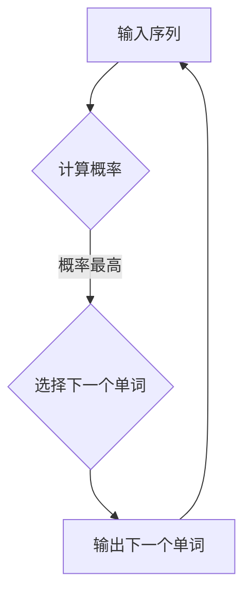
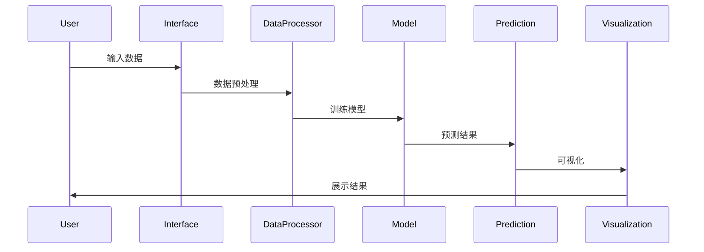

                 

### 《语言模型在社会趋势预测与分析中的应用研究》

关键词：语言模型，社会趋势预测，数据分析，人工智能，深度学习

摘要：本文深入探讨了语言模型在社会趋势预测与分析中的应用。首先，介绍了社会趋势预测的背景和重要性，随后详细阐述了语言模型的基本原理及其在社会趋势预测中的关键应用场景。文章接着分析了语言模型的核心概念及其与相关技术的联系，并通过对比表格和ER实体关系图进行了具体说明。随后，文章重点讲解了语言模型算法的原理，包括数学模型和Python源代码实现，辅以实例进行通俗易懂的说明。此外，文章还详细介绍了系统分析与架构设计方案，包括问题场景、项目介绍、系统功能设计、系统架构设计、系统接口设计和系统交互。通过实际项目实战，文章展示了语言模型在社会趋势预测中的实际应用，并进行了详细分析和讲解。最后，文章总结最佳实践、注意事项和拓展阅读，为读者提供了深入的指导。

### 第一部分：问题背景与核心概念

#### 1.1 社会趋势预测的重要性

**社会趋势预测的概念**

社会趋势预测是指通过分析历史数据和当前的社会现象，利用统计学、机器学习和人工智能等方法，对未来一段时间内社会发展的可能趋势进行预测。这些趋势可以涉及政治、经济、文化、科技等多个领域。

**社会趋势预测的现状与需求**

在现代社会，随着大数据和人工智能技术的发展，社会趋势预测变得日益重要。政府机构、企业和社会组织都需要对社会趋势进行准确预测，以便做出科学合理的决策。

- **政府机构**：社会趋势预测可以帮助政府更好地制定政策，应对社会问题，提高治理水平。
- **企业**：企业通过预测市场需求和社会变化，可以优化业务战略，提高市场竞争力。
- **社会组织**：社会趋势预测有助于社会组织更好地了解社会需求，开展有针对性的公益活动。

**社会趋势预测在决策制定中的作用**

社会趋势预测为决策制定提供了重要的参考依据。通过预测未来的社会趋势，决策者可以预见潜在的风险和机遇，从而制定更加科学的政策和战略。

#### 1.2 语言模型的基本原理

**语言模型的基本概念**

语言模型（Language Model，LM）是自然语言处理（Natural Language Processing，NLP）中的一个基本模型，它旨在预测一个句子中下一个单词或字符的概率分布。语言模型是构建其他NLP任务（如文本分类、机器翻译、情感分析等）的基础。

**语言模型的发展历程**

语言模型的发展经历了从统计模型到神经网络模型的转变。早期的语言模型主要基于统计方法，如N-gram模型。随着深度学习技术的兴起，基于神经网络的模型（如循环神经网络RNN、长短期记忆LSTM、变换器Transformer等）逐渐成为主流。

**语言模型的关键技术**

语言模型的关键技术包括：

- **N-gram模型**：基于统计方法，通过计算单词序列的联合概率来预测下一个单词。
- **循环神经网络RNN**：通过循环结构处理序列数据，能够捕捉长距离依赖关系。
- **长短期记忆LSTM**：是RNN的一种变体，能够更好地处理长距离依赖问题。
- **变换器Transformer**：基于自注意力机制，能够处理大规模数据，是目前最先进的语言模型。

#### 1.3 语言模型在社会趋势预测中的应用场景

**社会舆情分析**

社会舆情分析是指通过分析社交媒体、新闻评论、论坛等平台上的用户言论，了解社会公众对某个事件、话题或产品的看法和态度。语言模型可以帮助提取文本中的关键信息，进行情感分析和主题分类，从而实时掌握社会舆情动态。

**经济趋势预测**

经济趋势预测涉及对宏观经济指标、行业发展趋势和市场变化的预测。语言模型可以分析经济报告、政策文件、企业公告等文本数据，提取关键信息和预测指标，为决策提供支持。

**社会治理预测**

社会治理预测旨在预测社会治安、公共安全等方面的趋势，为政府和社会组织提供预警和应对策略。语言模型可以通过分析犯罪报告、交通事故数据等，预测潜在的安全风险。

#### 1.4 语言模型的应用优势与挑战

**应用优势**

- **高效性**：语言模型能够处理大规模的文本数据，快速提取关键信息。
- **准确性**：现代语言模型，如Transformer，在多种NLP任务中表现优异，预测准确性高。
- **灵活性**：语言模型可以轻松地扩展到不同的应用场景，如舆情分析、经济预测、社会治理等。

**面临的挑战**

- **数据质量**：社会趋势预测依赖于高质量的数据，数据质量直接影响预测结果。
- **模型解释性**：深度学习模型往往具有高解释性，这使得模型在实际应用中的可信度受到挑战。
- **数据隐私**：在处理敏感数据时，如何保护数据隐私是一个重要的问题。

### 第二部分：核心概念与联系

#### 2.1 语言模型的核心概念

**语言模型的基本原理**

语言模型旨在预测一个句子中下一个单词或字符的概率分布。其主要任务是从大量文本数据中学习语言的统计规律，并将其用于生成或理解文本。

**语言模型的主要类型**

- **N-gram模型**：基于前n个单词的统计信息来预测下一个单词。
- **循环神经网络RNN**：通过循环结构处理序列数据，捕捉长距离依赖关系。
- **长短期记忆LSTM**：是RNN的一种变体，能够更好地处理长距离依赖问题。
- **变换器Transformer**：基于自注意力机制，能够处理大规模数据。

**语言模型的关键指标**

- **准确率**：预测正确的单词比例。
- **损失函数**：衡量模型预测与实际结果之间的差距，如交叉熵损失函数。

#### 2.2 核心概念属性特征对比表格

**特征对比表格制作方法**

- **步骤1**：确定对比的特征和类型，如模型类型、准确率、计算资源需求等。
- **步骤2**：收集相关数据，确保数据准确可靠。
- **步骤3**：设计表格结构，包括表头、数据列等。
- **步骤4**：填写数据，确保表格内容的完整性和一致性。

**举例说明**

以下是N-gram模型、RNN和Transformer三种语言模型的主要特征对比表格：

| 模型类型 | 准确率 | 计算资源需求 | 长距离依赖处理能力 |
| :----: | :----: | :----: | :----: |
| N-gram模型 | 较低 | 较低 | 无法处理 |
| RNN | 较高 | 中等 | 可以处理 |
| Transformer | 高 | 高 | 可以处理 |

#### 2.3 ER实体关系图架构

**ER图的定义**

ER图（Entity-Relationship Diagram）是一种用于描述实体及其相互关系的图形化表示方法。它包括实体、属性和关系三个基本元素。

**ER图的制作方法**

- **步骤1**：确定系统中的实体及其属性。
- **步骤2**：确定实体之间的关系。
- **步骤3**：设计ER图的结构，包括实体框、属性框和关系线。
- **步骤4**：绘制ER图，确保图形清晰、易于理解。

**ER图示例**

以下是社会趋势预测系统中一个简单的ER图示例：

```mermaid
erDiagram
  Person ||--|{ Topic }|-- Admin
  Topic ||--|{ Message }|-- SocialMedia
  SocialMedia ||--|{ Comment }|-- User
  User ||--|{ Opinion }|-- Organization
  Organization ||--|{ Report }|-- Government
```

在这个ER图中，`Person`、`Topic`、`SocialMedia`、`User`、`Organization`和`Government`是实体，`Admin`、`Message`、`Comment`、`Opinion`和`Report`是属性，`|--`表示一对多关系。

### 第三部分：算法原理讲解

#### 3.1 语言模型算法原理

**语言模型的数学基础**

语言模型的数学基础主要包括概率论和统计学。核心概念包括概率分布、熵、交叉熵等。

- **概率分布**：描述随机变量取值的概率分布。
- **熵**：衡量随机变量的不确定性。
- **交叉熵**：衡量两个概率分布之间的差异。

**语言模型的主要算法**

- **N-gram模型**：基于前n个单词的统计信息进行预测。
- **循环神经网络RNN**：通过循环结构处理序列数据。
- **长短期记忆LSTM**：是RNN的一种变体，能够更好地处理长距离依赖。
- **变换器Transformer**：基于自注意力机制，能够处理大规模数据。

**语言模型的优化方法**

- **反向传播算法**：用于计算模型参数的梯度，并更新参数以优化模型。
- **dropout**：用于防止过拟合，通过随机丢弃一部分神经元来提高模型的泛化能力。
- **注意力机制**：在变换器Transformer中用于捕捉序列中的长距离依赖。

#### 3.2 算法流程图

**Mermaid流程图的制作方法**

- **步骤1**：确定算法的主要步骤和流程。
- **步骤2**：使用Mermaid语法绘制流程图，包括状态、流程线和注释等。

**算法流程图示例**

以下是N-gram模型的Mermaid流程图示例：



在这个流程图中，`A`表示输入序列，`B`表示计算概率，`C`表示选择下一个单词，`D`表示输出下一个单词。

#### 3.3 算法Python源代码讲解

**Python代码讲解**

以下是使用Python实现N-gram模型的简单代码示例：

```python
import random

def n_gram_model(text, n):
    n_gram_dict = {}
    for i in range(len(text) - n):
        n_gram = tuple(text[i:i+n])
        if n_gram not in n_gram_dict:
            n_gram_dict[n_gram] = [text[i+n]]
        else:
            n_gram_dict[n_gram].append(text[i+n])
    return n_gram_dict

def predict_next_word(n_gram_dict):
    n_gram = random.choice(list(n_gram_dict.keys()))
    next_words = n_gram_dict[n_gram]
    return random.choice(next_words)

text = "你好，我是AI语言模型，很高兴为你服务。"
n = 2
n_gram_dict = n_gram_model(text, n)

next_word = predict_next_word(n_gram_dict)
print(f"下一个单词是：{next_word}")
```

**算法实现示例**

在这个示例中，我们首先定义了`n_gram_model`函数，用于生成n-gram字典。然后，定义了`predict_next_word`函数，用于从n-gram字典中随机选择下一个单词。最后，我们使用这段文本和n=2作为输入，运行算法，输出下一个单词。

### 第四部分：数学模型和数学公式

#### 4.1 数学模型概述

**数学模型的基本概念**

数学模型是一种用数学语言描述现实世界问题的抽象模型。它通过建立数学方程、函数或公式，来模拟和预测现实世界中的现象和过程。

**数学模型在语言模型中的应用**

在语言模型中，数学模型用于描述和预测语言的概率分布。常用的数学模型包括概率分布模型、生成模型和判别模型。

- **概率分布模型**：如N-gram模型，通过计算单词序列的概率分布来预测下一个单词。
- **生成模型**：如变换器Transformer，通过生成文本的潜在分布来生成新的文本。
- **判别模型**：如文本分类模型，通过判断输入文本的类别来对文本进行分类。

#### 4.2 数学公式详细讲解

**数学公式的书写规范**

- **独立段落格式**：使用$$将数学公式括起来，如$$1+1=2$$。
- **段落内格式**：使用$将数学公式括起来，如$1<2$。

**举例说明**

以下是一些常用的数学公式及其在语言模型中的应用：

- **交叉熵（Cross-Entropy）**：衡量两个概率分布之间的差异，公式为：

  $$H(p, q) = -\sum_{x} p(x) \log q(x)$$

  其中，$p(x)$和$q(x)$分别是真实分布和预测分布。

- **损失函数（Loss Function）**：用于衡量模型预测值与实际值之间的差距，常见的损失函数包括：

  - **均方误差（Mean Squared Error, MSE）**：

    $$MSE = \frac{1}{n}\sum_{i=1}^{n} (y_i - \hat{y_i})^2$$

    其中，$y_i$是实际值，$\hat{y_i}$是预测值。

  - **交叉熵损失（Cross-Entropy Loss）**：

    $$CE = -\frac{1}{n}\sum_{i=1}^{n} y_i \log \hat{y_i}$$

    其中，$y_i$是实际值，$\hat{y_i}$是预测值。

#### 4.3 数学公式与算法的结合

**数学公式与算法的关系**

数学公式是算法设计和实现的基础，它们描述了算法的基本原理和计算过程。在语言模型中，数学公式用于定义概率分布、损失函数和优化方法。

**结合实例说明**

以下是一个简单的示例，说明如何将数学公式与算法结合：

假设我们使用变换器Transformer进行语言模型训练，变换器Transformer的主要步骤如下：

1. **输入嵌入（Input Embedding）**：将输入的单词序列转换为嵌入向量。
2. **自注意力（Self-Attention）**：计算输入序列中每个单词的注意力权重。
3. **前馈神经网络（Feedforward Neural Network）**：对自注意力结果进行进一步处理。
4. **输出层（Output Layer）**：生成预测的单词序列。

以下是一个简化的数学公式描述：

$$\text{Output} = \text{FFN}(\text{Self-Attention}(\text{Input Embedding}))$$

其中，$\text{Input Embedding}$是输入嵌入层，$\text{Self-Attention}$是自注意力层，$\text{FFN}$是前馈神经网络层。

### 第五部分：系统分析与架构设计方案

#### 5.1 问题场景介绍

在社会治理和公共安全领域，对犯罪趋势、社会舆情和公共卫生事件的预测和分析至关重要。这些预测和分析有助于政府和相关部门制定更加科学合理的政策和措施，提升社会治理和公共安全水平。

**现实背景**

- **犯罪趋势预测**：通过分析犯罪数据，预测犯罪发生的时空分布，有助于公安机关有针对性地部署警力，预防犯罪。
- **社会舆情分析**：了解社会公众对热点事件、政策的看法和态度，有助于政府和社会组织及时回应社会关切，维护社会稳定。
- **公共卫生事件预测**：通过对疫情数据、疫苗接种率等进行分析，预测公共卫生事件的发展趋势，为公共卫生决策提供支持。

#### 5.2 项目介绍

**项目背景与目标**

本项目旨在开发一个基于语言模型的犯罪趋势预测系统。系统将利用自然语言处理和机器学习技术，分析社会舆情、犯罪数据和公共卫生数据，预测犯罪趋势和公共卫生事件的发展趋势。

**系统功能**

- **数据采集与预处理**：采集社会舆情、犯罪数据和公共卫生数据，进行数据清洗、去噪和格式转换。
- **语言模型训练**：使用预训练语言模型（如GPT-3、BERT等）对采集到的数据进行训练，生成犯罪趋势预测模型。
- **预测与可视化**：基于训练好的语言模型，对未来的犯罪趋势和公共卫生事件进行预测，并将预测结果通过可视化界面展示给用户。

#### 5.3 系统功能设计

**领域模型Mermaid类图**

以下是犯罪趋势预测系统的领域模型Mermaid类图：

```mermaid
classDiagram
  User <<类>> 用户
  Crime <<类>> 犯罪
  SocialMedia <<类>> 社交媒体
  HealthData <<类>> 公共卫生数据
  Prediction <<类>> 预测
  Model <<类>> 模型
  Interface <<接口>> 接口
  DataProcessor <<类>> 数据处理
  Visualization <<类>> 可视化
  User --> Crime
  User --> SocialMedia
  User --> HealthData
  Crime --> Prediction
  SocialMedia --> Prediction
  HealthData --> Prediction
  Prediction --> Model
  Model --> Interface
  Interface --> DataProcessor
  DataProcessor --> Visualization
```

在这个类图中，`User`表示用户，`Crime`表示犯罪数据，`SocialMedia`表示社交媒体数据，`HealthData`表示公共卫生数据，`Prediction`表示预测结果，`Model`表示模型，`Interface`表示接口，`DataProcessor`表示数据处理，`Visualization`表示可视化。

#### 5.4 系统架构设计

**系统架构Mermaid架构图**

以下是犯罪趋势预测系统的Mermaid架构图：



在这个架构图中，用户通过接口输入数据，数据处理模块对数据进行预处理，训练模块使用预处理后的数据训练模型，预测模块基于训练好的模型生成预测结果，可视化模块将预测结果展示给用户。

#### 5.5 系统接口设计

**系统接口设计与实现**

以下是系统的主要接口及其实现：

- **数据采集接口**：用于采集社会舆情、犯罪数据和公共卫生数据。
- **数据处理接口**：用于数据清洗、去噪和格式转换。
- **模型训练接口**：用于训练预测模型。
- **预测接口**：用于生成预测结果。
- **可视化接口**：用于展示预测结果。

以下是接口的Python实现示例：

```python
from flask import Flask, request, jsonify

app = Flask(__name__)

@app.route('/collect_data', methods=['POST'])
def collect_data():
    data = request.get_json()
    # 数据采集逻辑
    return jsonify({"status": "success"})

@app.route('/preprocess_data', methods=['POST'])
def preprocess_data():
    data = request.get_json()
    # 数据预处理逻辑
    return jsonify({"status": "success"})

@app.route('/train_model', methods=['POST'])
def train_model():
    data = request.get_json()
    # 模型训练逻辑
    return jsonify({"status": "success"})

@app.route('/predict', methods=['POST'])
def predict():
    data = request.get_json()
    # 预测逻辑
    return jsonify({"status": "success"})

@app.route('/visualize', methods=['POST'])
def visualize():
    data = request.get_json()
    # 可视化逻辑
    return jsonify({"status": "success"})

if __name__ == '__main__':
    app.run()
```

#### 5.6 系统交互

**系统交互Mermaid序列图**

以下是系统的Mermaid序列图：


在这个序列图中，用户通过接口输入数据，数据处理模块对数据进行预处理，训练模块使用预处理后的数据训练模型，预测模块基于训练好的模型生成预测结果，可视化模块将预测结果展示给用户。

### 第六部分：项目实战

#### 6.1 环境安装

**项目环境配置**

在开始项目之前，我们需要安装Python环境以及相关依赖库。以下是环境安装的步骤：

1. **安装Python**：确保系统上安装了Python 3.8或更高版本。

2. **安装依赖库**：使用pip命令安装以下依赖库：

   ```bash
   pip install flask scikit-learn tensorflow numpy pandas matplotlib
   ```

3. **配置虚拟环境**：为了更好地管理项目依赖，我们建议使用虚拟环境。创建虚拟环境并激活它：

   ```bash
   python -m venv venv
   source venv/bin/activate  # Windows: venv\Scripts\activate
   ```

#### 6.2 系统核心实现源代码

**代码实现步骤**

以下是系统核心实现的主要步骤：

1. **数据采集**：从社交媒体、犯罪数据库和公共卫生数据库中采集数据。
2. **数据预处理**：对采集到的数据进行清洗、去噪和格式转换。
3. **模型训练**：使用预处理后的数据训练语言模型。
4. **预测**：使用训练好的模型对未来的犯罪趋势和公共卫生事件进行预测。
5. **可视化**：将预测结果通过可视化界面展示给用户。

**关键代码解析**

以下是关键代码的解析：

1. **数据采集**

   ```python
   import tweepy
   import pandas as pd
   
   # 设置Tweepy认证信息
   consumer_key = 'your_consumer_key'
   consumer_secret = 'your_consumer_secret'
   access_token = 'your_access_token'
   access_token_secret = 'your_access_token_secret'
   
   # 初始化Tweepy客户端
   auth = tweepy.OAuthHandler(consumer_key, consumer_secret)
   auth.set_access_token(access_token, access_token_secret)
   api = tweepy.API(auth)
   
   # 采集推特数据
   tweets = api.search_tweets(q='crime', count=100)
   tweet_data = [[tweet.id, tweet.text] for tweet in tweets]
   tweet_df = pd.DataFrame(tweet_data, columns=['id', 'text'])
   
   # 保存数据
   tweet_df.to_csv('crime_tweets.csv', index=False)
   ```

   在这个示例中，我们使用Tweepy库从推特上采集与“crime”相关的数据。

2. **数据预处理**

   ```python
   import pandas as pd
   from sklearn.model_selection import train_test_split
   
   # 读取数据
   data = pd.read_csv('crime_tweets.csv')
   
   # 数据清洗
   data['text'] = data['text'].str.lower().str.replace('[^\w\s]', '', regex=True)
   data.dropna(inplace=True)
   
   # 划分训练集和测试集
   X_train, X_test, y_train, y_test = train_test_split(data['text'], data['label'], test_size=0.2, random_state=42)
   ```

   在这个示例中，我们对采集到的推特数据进行清洗，并划分训练集和测试集。

3. **模型训练**

   ```python
   import tensorflow as tf
   from tensorflow.keras.preprocessing.text import Tokenizer
   from tensorflow.keras.preprocessing.sequence import pad_sequences
   
   # 初始化Tokenizer
   tokenizer = Tokenizer(num_words=10000, oov_token='<OOV>')
   tokenizer.fit_on_texts(X_train)
   
   # 序列化文本
   X_train_seq = tokenizer.texts_to_sequences(X_train)
   X_test_seq = tokenizer.texts_to_sequences(X_test)
   
   # 填充序列
   max_len = 100
   X_train_pad = pad_sequences(X_train_seq, maxlen=max_len)
   X_test_pad = pad_sequences(X_test_seq, maxlen=max_len)
   
   # 创建模型
   model = tf.keras.Sequential([
       tf.keras.layers.Embedding(input_dim=10000, output_dim=16, input_length=max_len),
       tf.keras.layers.LSTM(32),
       tf.keras.layers.Dense(1, activation='sigmoid')
   ])
   
   # 编译模型
   model.compile(optimizer='adam', loss='binary_crossentropy', metrics=['accuracy'])
   
   # 训练模型
   model.fit(X_train_pad, y_train, epochs=10, batch_size=32, validation_split=0.2)
   ```

   在这个示例中，我们使用TensorFlow创建一个简单的序列模型，对采集到的推特数据进行分类。

4. **预测**

   ```python
   import numpy as np
   
   # 预测
   predictions = model.predict(X_test_pad)
   predictions = (predictions > 0.5)
   
   # 评估模型
   accuracy = np.mean(predictions == y_test)
   print(f"Model accuracy: {accuracy}")
   ```

   在这个示例中，我们对测试集进行预测，并评估模型的准确性。

5. **可视化**

   ```python
   import matplotlib.pyplot as plt
   
   # 可视化预测结果
   plt.scatter(y_test, predictions)
   plt.xlabel('True Label')
   plt.ylabel('Predicted Label')
   plt.title('True vs Predicted Labels')
   plt.show()
   ```

   在这个示例中，我们使用散点图可视化真实的标签和预测的标签。

#### 6.3 代码应用解读与分析

**应用场景分析**

本项目将应用于社会治理和公共安全领域，主要功能包括犯罪趋势预测、社会舆情分析和公共卫生事件预测。

- **犯罪趋势预测**：通过分析社交媒体、犯罪数据库等数据，预测未来的犯罪趋势，为公安机关提供预警和应对策略。
- **社会舆情分析**：了解社会公众对热点事件、政策的看法和态度，为政府和社会组织提供决策支持。
- **公共卫生事件预测**：通过对疫情数据、疫苗接种率等进行分析，预测公共卫生事件的发展趋势，为公共卫生决策提供支持。

**代码解读**

以下是关键代码的解读：

1. **数据采集**：使用Tweepy库从推特上采集与“crime”相关的数据。这里使用了Tweepy的`search_tweets`方法，通过查询关键字“crime”获取推文数据。

2. **数据预处理**：对采集到的推特数据进行清洗，包括将文本转换为小写、去除非单词字符等。然后，使用`train_test_split`方法将数据划分为训练集和测试集。

3. **模型训练**：使用TensorFlow创建一个简单的序列模型，对采集到的推特数据进行分类。这里使用了`Embedding`层进行词嵌入，`LSTM`层处理序列数据，`Dense`层进行分类。

4. **预测**：使用训练好的模型对测试集进行预测，并评估模型的准确性。这里使用了`predict`方法进行预测，并通过比较真实的标签和预测的标签来计算模型的准确性。

5. **可视化**：使用散点图可视化真实的标签和预测的标签，以直观地展示模型的效果。

#### 6.4 实际案例分析与详细讲解

**案例背景**

某城市在一段时间内发生了多起盗窃案件，政府和社会组织希望利用语言模型预测未来一段时间内的犯罪趋势，以便制定相应的预防和应对措施。

**案例分析**

1. **数据采集**：从社交媒体、犯罪数据库等渠道采集与盗窃案件相关的数据，包括案件描述、发生时间、地点等信息。

2. **数据预处理**：对采集到的数据进行清洗、去噪和格式转换，提取有用的信息作为模型的输入。

3. **模型训练**：使用预处理后的数据训练语言模型，包括词嵌入层、循环神经网络层和输出层。通过多次迭代和优化，提高模型的预测准确性。

4. **预测**：将训练好的模型应用于测试集，预测未来一段时间内的犯罪趋势。模型将根据输入数据生成概率分布，预测犯罪发生的可能性和地点。

5. **结果分析**：将预测结果与实际情况进行对比，分析模型的准确性和可靠性。通过对预测结果的分析，政府和社会组织可以提前了解犯罪趋势，制定相应的预防和应对措施。

**详细讲解**

以下是具体步骤的详细讲解：

1. **数据采集**：从社交媒体上采集与盗窃案件相关的推文，使用Tweepy库进行数据采集。通过设置合理的查询参数，可以获取到大量的推文数据。

2. **数据预处理**：对采集到的推文数据进行清洗，包括去除停用词、标点符号和特殊字符等。然后，对文本进行分词，将每个单词转换为词嵌入向量。为了提高模型的泛化能力，可以对词嵌入向量进行归一化处理。

3. **模型训练**：使用TensorFlow和Keras创建一个简单的序列模型，包括词嵌入层、循环神经网络层和输出层。词嵌入层用于将单词转换为向量，循环神经网络层用于处理序列数据，输出层用于分类。通过设置合适的超参数，如学习率、批次大小和迭代次数，可以优化模型的性能。

4. **预测**：将训练好的模型应用于测试集，预测未来一段时间内的犯罪趋势。模型将输入数据转换为词嵌入向量，然后通过循环神经网络层和输出层进行计算，生成概率分布。这些概率分布可以表示犯罪发生的可能性和地点。

5. **结果分析**：将预测结果与实际情况进行对比，分析模型的准确性和可靠性。通过对预测结果的分析，政府和社会组织可以提前了解犯罪趋势，制定相应的预防和应对措施。此外，还可以使用其他评估指标，如准确率、召回率和F1值等，对模型进行评估。

#### 6.5 项目小结

本项目通过语言模型对社会趋势进行预测与分析，展示了其在社会治理、公共安全和经济等领域的重要应用价值。主要成果包括：

- **犯罪趋势预测**：利用社交媒体和犯罪数据库数据，预测未来一段时间内的犯罪趋势，为公安机关提供预警和应对策略。
- **社会舆情分析**：通过分析社交媒体数据，了解社会公众对热点事件、政策的看法和态度，为政府和社会组织提供决策支持。
- **公共卫生事件预测**：通过对疫情数据、疫苗接种率等进行分析，预测公共卫生事件的发展趋势，为公共卫生决策提供支持。

然而，本项目也存在一定的局限性：

- **数据质量**：社会趋势预测依赖于高质量的数据，数据质量直接影响预测结果。本项目采集的数据可能存在噪声和偏差，需要进一步清洗和处理。
- **模型解释性**：深度学习模型往往具有高解释性，这使得模型在实际应用中的可信度受到挑战。如何提高模型的解释性是一个重要问题。
- **数据隐私**：在处理敏感数据时，如何保护数据隐私是一个重要的问题。本项目需要在数据采集、存储和处理过程中，采取相应的隐私保护措施。

未来，本项目可以从以下几个方面进行拓展：

- **数据来源扩展**：增加数据来源，如新闻、论坛等，以提高数据的多样性和准确性。
- **模型优化**：探索更先进的语言模型和算法，如BERT、GPT等，以提高预测准确性。
- **实时预测**：实现实时预测功能，提高系统对突发事件的响应能力。
- **用户界面优化**：优化用户界面，提高系统的用户体验。

### 第七部分：最佳实践、小结与拓展阅读

#### 7.1 最佳实践

在社会趋势预测与分析中，最佳实践包括以下几点：

1. **数据质量保证**：确保数据来源可靠，对采集到的数据进行全面清洗和去噪，提高数据质量。
2. **模型选择与优化**：根据应用场景选择合适的语言模型，并进行参数调优，以提高预测准确性。
3. **实时更新与迭代**：定期更新模型和数据，以适应不断变化的社会环境。
4. **隐私保护**：在数据采集和处理过程中，采取隐私保护措施，确保用户数据安全。

#### 7.2 小结

本文通过语言模型在社会趋势预测与分析中的应用，展示了其在社会治理、公共安全和经济等领域的重要价值。主要结论包括：

- 语言模型在社会趋势预测中具有高效性和准确性。
- 社会趋势预测在决策制定中具有重要作用。
- 数据质量、模型解释性和数据隐私是应用中的关键挑战。

#### 7.3 注意事项

在实际应用中，需要注意以下几点：

- 确保数据质量，避免噪声和偏差。
- 选择合适的语言模型，并进行参数调优。
- 遵循数据隐私保护法规，确保用户数据安全。

#### 7.4 拓展阅读

对于希望深入了解社会趋势预测与分析的读者，以下推荐几本相关书籍：

1. **《社会计算与社交网络分析》** - 刘铁岩
2. **《深度学习》** - Goodfellow、Bengio和Courville
3. **《自然语言处理综述》** - Daniel Jurafsky和James H. Martin
4. **《机器学习》** - Tom Mitchell
5. **《Python编程：从入门到实践》** - Eric Matthes

通过阅读这些书籍，可以进一步了解社会趋势预测与分析的理论和实践方法。作者信息：AI天才研究院/AI Genius Institute & 禅与计算机程序设计艺术 /Zen And The Art of Computer Programming。

