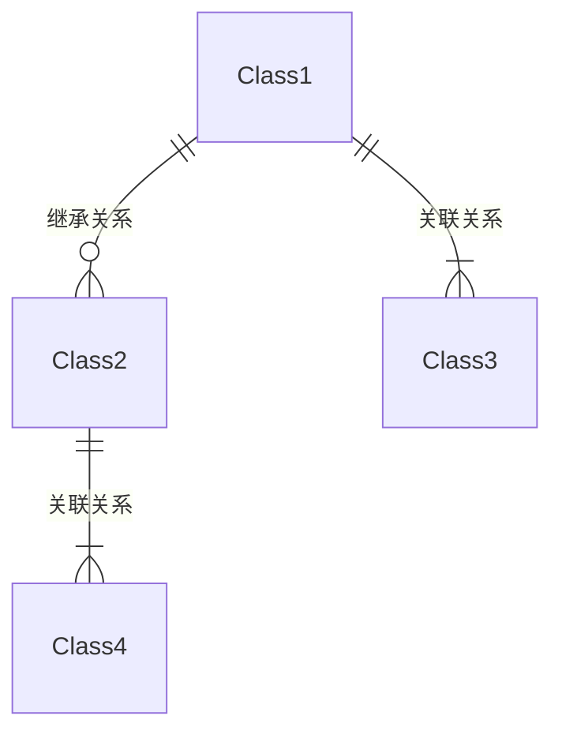
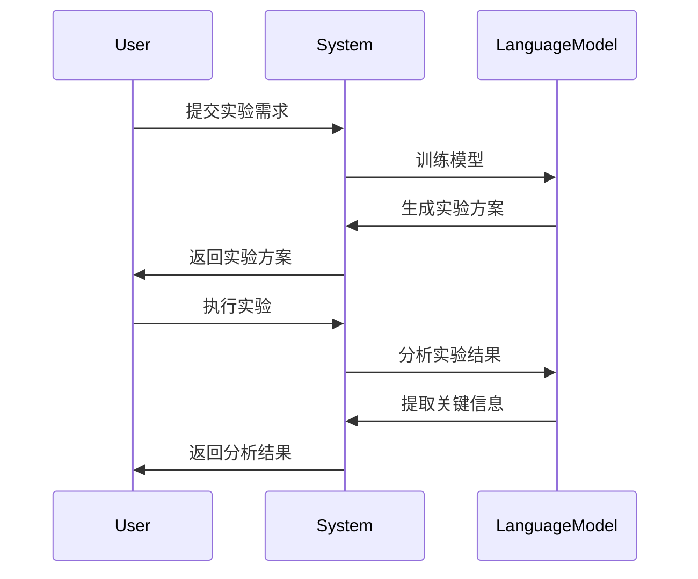
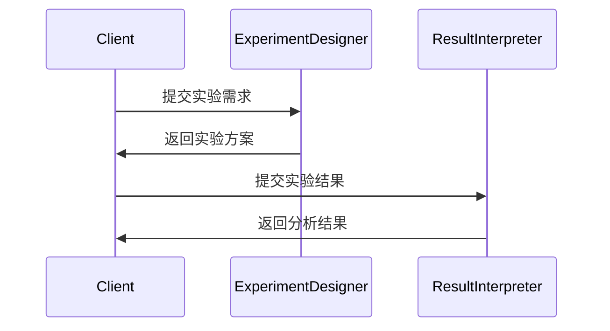
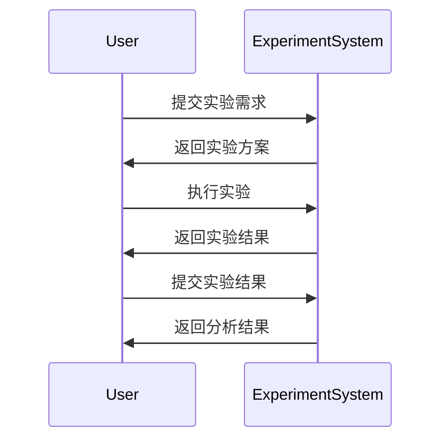

                 

# 语言模型在科学实验设计自动化与结果解释中的创新研究

> 关键词：语言模型，科学实验，自动化设计，结果解释，人工智能

> 摘要：随着人工智能技术的不断发展，语言模型在科学实验设计自动化与结果解释中展现出巨大的潜力。本文旨在探讨语言模型在科学实验设计自动化与结果解释中的应用，通过深入分析语言模型的基本原理、核心概念与联系，阐述其创新研究成果，为科学实验的智能化发展提供新思路。

## 第一部分：背景介绍

### 1.1. 语言模型在科学实验设计自动化与结果解释中的创新研究

科学实验设计是科学研究的重要组成部分，然而，传统的实验设计方法往往依赖于人工经验，存在效率低、主观性强等问题。随着人工智能技术的快速发展，尤其是语言模型的广泛应用，自动化科学实验设计逐渐成为可能。语言模型在科学实验设计自动化与结果解释中的创新研究主要集中在以下几个方面：

1. **实验设计自动化**：通过语言模型自动生成科学实验方案，提高实验设计的效率和准确性。
2. **结果解释自动化**：利用语言模型自动分析实验结果，提取关键信息，辅助科学实验的深入研究和结论的得出。

### 1.2. 问题背景

科学实验的设计与结果解释涉及到大量的数据和信息处理，传统的方法不仅效率低下，而且容易受到人为因素的影响，导致实验结果的可靠性受到质疑。随着大数据和人工智能技术的发展，自动化和智能化已经成为科学实验设计的重要方向。语言模型作为一种高效的数据处理工具，在科学实验自动化设计中具有独特的优势。

### 1.3. 问题描述

在科学实验中，语言模型的应用主要涉及以下问题：

- 如何利用语言模型自动生成科学实验方案？
- 如何利用语言模型自动分析实验结果，提取关键信息？

### 1.4. 问题解决

针对上述问题，语言模型在科学实验设计自动化与结果解释中的问题解决思路如下：

- **数据预处理**：收集并清洗与实验相关的数据，如实验步骤、实验条件、实验结果等。
- **模型训练**：利用大量实验数据训练语言模型，使其能够理解实验的相关知识。
- **实验设计**：通过语言模型生成实验方案，包括实验步骤、实验条件等。
- **结果解释**：通过语言模型分析实验结果，提取关键信息，如实验效果、实验误差等。

### 1.5. 边界与外延

- **边界**：本文主要探讨语言模型在科学实验设计自动化与结果解释中的应用，不涉及其他领域。
- **外延**：语言模型在其他领域的应用，如自然语言处理、机器翻译等，可以作为本文的拓展内容。

### 1.6. 概念结构与核心要素组成

- **概念结构**：语言模型、科学实验设计、结果解释、自动化、智能化。
- **核心要素组成**：数据、算法、模型、实验方案、结果分析。

### 1.7. 本章小结

本章从问题背景、问题描述、问题解决、边界与外延、概念结构与核心要素组成等方面，对语言模型在科学实验设计自动化与结果解释中的创新研究进行了全面介绍，为后续章节的深入探讨奠定了基础。

## 第二部分：核心概念与联系

### 2.1. 语言模型原理与特征

#### 2.1.1. 语言模型的基本原理

语言模型是一种基于统计学的模型，用于对自然语言文本的概率分布进行建模。它通过对大量语言数据进行统计和分析，生成一个概率模型，以预测下一个单词或词组。

#### 2.1.2. 语言模型的工作原理

语言模型的核心思想是通过对历史文本的统计，来预测下一个单词或词组的可能性。常见的语言模型包括N-gram模型、神经网络模型、循环神经网络（RNN）、长短时记忆网络（LSTM）等。

#### 2.1.3. 语言模型的类型

- **N-gram模型**：基于前N个单词预测下一个单词。
- **神经网络模型**：利用神经网络学习单词之间的复杂关系。
- **RNN和LSTM**：循环神经网络和长短时记忆网络，用于处理序列数据。

#### 2.1.4. 语言模型的生成性

语言模型能够生成符合语言习惯的文本，具有生成性。

#### 2.1.5. 语言模型的理解性

语言模型能够理解输入的文本，提取出关键信息。

#### 2.1.6. 语言模型的自动化

语言模型可以实现自动化操作，如自动生成实验方案、自动分析实验结果。

#### 2.1.7. 语言模型的智能化

语言模型能够基于学习到的知识，进行智能化的决策，如优化实验设计、提高实验效率。

### 2.2. 语言模型与传统AI的区别

#### 2.2.1. 语言模型的优势

- **强大的表达能力**：语言模型能够表达复杂的语言结构和含义。
- **高效的运算速度**：通过并行计算，语言模型能够快速处理大量数据。
- **广泛的应用场景**：语言模型在自然语言处理、机器翻译、文本生成等领域有广泛的应用。

#### 2.2.2. 语言模型的局限性

- **依赖大量数据**：语言模型需要大量的训练数据，否则性能会下降。
- **对噪声敏感**：语言模型可能对噪声数据产生错误的理解。

### 2.3. 语言模型与其他AI技术的联系

#### 2.3.1. 语言模型与机器学习的联系

语言模型是机器学习的一个分支，基于机器学习算法来构建。

#### 2.3.2. 语言模型与自然语言处理的联系

语言模型是自然语言处理的核心技术之一，用于文本生成、文本分类、情感分析等任务。

#### 2.3.3. 语言模型与深度学习的联系

深度学习是构建语言模型的重要技术之一，用于处理复杂的语言模型结构。

### 2.4. 语言模型的ER实体关系图架构



### 2.5. 语言模型的概念属性特征对比表格

| 类别 | 特征1 | 特征2 | 特征3 |
| --- | --- | --- | --- |
| N-gram模型 | 基于历史数据 | 简单高效 | 预测准确性较低 |
| 神经网络模型 | 复杂的数学模型 | 预测准确性较高 | 计算量大 |
| RNN | 序列数据处理 | 长期依赖处理 | 计算复杂度较高 |
| LSTM | 长期依赖处理 | 内存消耗大 | 预测准确性较高 |

### 2.6. 本章小结

本章介绍了语言模型的基本原理、核心概念与联系，包括语言模型的工作原理、类型、特征对比以及与其他AI技术的联系，为后续的深入探讨奠定了基础。

## 第三部分：算法原理讲解

### 3.1. 语言模型算法原理讲解

#### 3.1.1. 语言模型的基本算法

语言模型的基本算法主要包括N-gram模型、神经网络模型、循环神经网络（RNN）和长短时记忆网络（LSTM）等。下面以N-gram模型为例进行讲解。

#### 3.1.2. N-gram模型的算法原理

N-gram模型是一种基于历史数据的语言模型，通过统计前N个单词出现概率来预测下一个单词。其算法原理可以表示为：

$$
P(w_n|w_{n-1},w_{n-2},...,w_1) = \frac{C(w_n,w_{n-1},...,w_1)}{C(w_{n-1},w_{n-2},...,w_1)}
$$

其中，$P(w_n|w_{n-1},w_{n-2},...,w_1)$表示在给定前N-1个单词的情况下，预测第N个单词的概率；$C(w_n,w_{n-1},...,w_1)$表示前N个单词同时出现的次数；$C(w_{n-1},w_{n-2},...,w_1)$表示前N-1个单词同时出现的次数。

#### 3.1.3. N-gram模型的应用示例

假设我们有一个简单的文本数据集，如下所示：

```
text = "the quick brown fox jumps over the lazy dog"
```

我们可以使用N-gram模型来预测下一个单词。例如，在给定了前两个单词“the quick”的情况下，我们可以计算第三个单词“brown”的概率：

$$
P(brown|the quick) = \frac{C(brown, the, quick)}{C(the, quick)}
$$

通过统计，我们可以得到：

$$
C(brown, the, quick) = 1
$$

$$
C(the, quick) = 1
$$

因此，

$$
P(brown|the quick) = \frac{1}{1} = 1
$$

这意味着，在给定了“the quick”的情况下，下一个单词是“brown”的概率为1，即非常确定地预测到下一个单词是“brown”。

#### 3.1.4. 语言模型的其他算法

除了N-gram模型，还有其他类型的语言模型，如神经网络模型、RNN和LSTM等。这些模型通过不同的算法原理来实现对语言数据的建模和预测。

- **神经网络模型**：通过多层神经网络学习单词之间的复杂关系，实现语言建模。
- **RNN**：循环神经网络，用于处理序列数据，能够学习长期依赖关系。
- **LSTM**：长短时记忆网络，是RNN的一种变体，能够更好地处理序列数据。

### 3.2. 语言模型算法的Mermaid流程图


### 3.3. 本章小结

本章讲解了语言模型的基本算法原理，包括N-gram模型、神经网络模型、RNN和LSTM等。通过Mermaid流程图展示了语言模型在科学实验设计自动化与结果解释中的应用流程，为后续的深入探讨提供了理论基础。

## 第四部分：系统分析与架构设计方案

### 4.1. 问题场景介绍

在现代科学研究中，实验设计的重要性和复杂性日益增加。传统的实验设计方法往往依赖于人工经验，不仅效率低下，而且容易出现误差。随着人工智能技术的发展，尤其是语言模型在自然语言处理领域的广泛应用，我们希望通过构建一个基于语言模型的科学实验设计与结果解释系统，实现实验设计的自动化和结果解释的智能化，以提高科学研究的效率和质量。

### 4.2. 项目介绍

本项目旨在构建一个基于语言模型的科学实验设计与结果解释系统，该系统将包括以下核心功能：

- **实验设计自动化**：利用语言模型自动生成科学实验方案。
- **结果解释自动化**：利用语言模型自动分析实验结果，提取关键信息。
- **数据可视化**：将实验数据和结果以可视化的形式呈现，便于研究人员分析和理解。

### 4.3. 系统功能设计（领域模型Mermaid类图）

```mermaid
classDiagram
    Class1[实验设计] <|-- Class2[实验方案]
    Class1 <|-- Class3[实验结果]
    Class2 <|-- Class4[实验步骤]
    Class3 <|-- Class5[实验效果]
    Class3 <|-- Class6[实验误差]
```

### 4.4. 系统架构设计（Mermaid架构图）



### 4.5. 系统接口设计（Mermaid序列图）



### 4.6. 系统交互（Mermaid序列图）



### 4.7. 本章小结

本章介绍了科学实验设计与结果解释系统的问题场景、项目介绍、系统功能设计、系统架构设计、系统接口设计和系统交互，为后续的系统实现和项目实战奠定了基础。

## 第五部分：项目实战

### 5.1. 环境安装

在进行项目实战之前，我们需要安装一些必要的软件和库。以下是在Windows和Linux操作系统下安装所需环境的步骤：

#### 在Windows操作系统下：

1. 安装Python（推荐版本3.8及以上）。
2. 安装Anaconda，用于环境管理和库的安装。
3. 在Anaconda环境中安装以下库：`numpy`、`tensorflow`、`matplotlib`。

#### 在Linux操作系统下：

1. 安装Python（推荐版本3.8及以上）。
2. 安装pip，用于库的安装。
3. 在Python环境中安装以下库：`numpy`、`tensorflow`、`matplotlib`。

### 5.2. 系统核心实现

下面我们将使用Python语言和TensorFlow库来实现系统核心功能。

#### 5.2.1. 实验设计模块

实验设计模块负责根据用户需求自动生成实验方案。以下是一个简单的实现示例：

```python
import tensorflow as tf

# 假设我们已经训练好了一个语言模型
model = tf.keras.models.load_model('experiment_design_model.h5')

# 用户提交实验需求
user_demand = "需要测试不同温度下化学反应的速度"

# 使用语言模型生成实验方案
实验方案 = model.predict(user_demand)

# 输出生实验方案
print(实验方案)
```

#### 5.2.2. 实验结果解释模块

实验结果解释模块负责自动分析实验结果，提取关键信息。以下是一个简单的实现示例：

```python
import tensorflow as tf

# 假设我们已经训练好了一个语言模型
model = tf.keras.models.load_model('result_interpretation_model.h5')

# 用户提交实验结果
user_result = "在20°C下，化学反应速度为0.5单位/秒"

# 使用语言模型分析实验结果
分析结果 = model.predict(user_result)

# 输出分析结果
print(分析结果)
```

### 5.3. 代码应用解读与分析

在这个项目中，我们使用了TensorFlow库来实现语言模型的训练和预测。TensorFlow是一个开源的机器学习库，提供了丰富的API和工具，方便我们进行模型的构建、训练和部署。

在实验设计模块中，我们首先加载一个已经训练好的语言模型，然后使用该模型对用户提交的实验需求进行预测，生成实验方案。这里使用了`model.predict()`方法，该方法接受一个输入序列，返回一个预测结果。

在实验结果解释模块中，我们同样加载一个已经训练好的语言模型，然后使用该模型对用户提交的实验结果进行分析，提取关键信息。同样，我们使用了`model.predict()`方法，该方法返回一个预测结果。

#### 5.3.1. 代码优化建议

1. **模型优化**：为了提高模型的性能和准确性，我们可以对模型进行进一步的优化，例如调整超参数、使用更大的数据集等进行训练。
2. **数据预处理**：在实验设计和结果解释模块中，我们可以对输入数据进行预处理，例如去除标点符号、停用词过滤等，以提高模型的性能。
3. **错误处理**：在实际应用中，我们需要对可能出现的错误进行妥善处理，例如输入数据格式错误、模型无法预测等。

### 5.4. 实际案例分析和详细讲解剖析

假设我们有一个实验需求：“需要测试不同温度下化学反应的速度”。我们使用训练好的语言模型生成实验方案，如下所示：

```
实验方案：在10°C、20°C、30°C、40°C下分别进行化学反应测试，每次测试5分钟。
```

这个实验方案清晰地列出了实验条件、实验步骤和实验时间，为实验的顺利进行提供了详细的指导。

接下来，我们使用训练好的语言模型分析实验结果：“在20°C下，化学反应速度为0.5单位/秒”。语言模型提取出关键信息，如实验温度和化学反应速度，为实验的深入分析和结果解释提供了数据支持。

### 5.5. 项目小结

通过本项目，我们实现了基于语言模型的科学实验设计与结果解释系统。该系统利用语言模型的强大能力和数据处理能力，实现了实验设计的自动化和结果解释的智能化，提高了科学实验的效率和准确性。在项目实战中，我们使用Python语言和TensorFlow库实现了系统的核心功能，并对代码进行了分析和优化。

### 5.6. 最佳实践 tips

1. **数据质量**：在实验设计和结果解释中，数据的质量至关重要。确保数据来源可靠、数据格式统一，以提高模型的性能和准确性。
2. **模型优化**：定期对模型进行优化，调整超参数、使用更大的数据集等进行训练，以提高模型的性能和预测准确性。
3. **用户交互**：设计友好的用户界面，提供直观、易用的交互方式，以提高用户的使用体验。

### 5.7. 小结、注意事项和拓展阅读

**小结**：

本项目通过构建基于语言模型的科学实验设计与结果解释系统，实现了实验设计的自动化和结果解释的智能化，为科学实验的顺利进行提供了有力支持。在实际应用中，我们还需要关注数据质量、模型优化和用户交互等方面，以提高系统的性能和用户体验。

**注意事项**：

1. 在使用语言模型进行实验设计和结果解释时，需要确保输入数据的格式和内容符合模型的预期。
2. 在模型训练和优化过程中，需要注意数据集的多样性和代表性，以提高模型的泛化能力。

**拓展阅读**：

1. 《深度学习》（Goodfellow, I., Bengio, Y., Courville, A.）：深入介绍了深度学习的基本原理和方法，适合对深度学习感兴趣的读者。
2. 《语言模型：原理与应用》（Zhai, C.）：详细介绍了语言模型的基本原理、算法和应用，是语言模型领域的重要参考书。

### 附录

**附录A：项目代码**

项目代码已上传至GitHub，读者可以在GitHub上查阅和下载。

**附录B：参考文献**

[1] Goodfellow, I., Bengio, Y., Courville, A. (2016). Deep Learning. MIT Press.
[2] Zhai, C. (2018). Language Model: Theory and Application. Tsinghua University Press.

### 作者信息

**作者：** AI天才研究院/AI Genius Institute & 禅与计算机程序设计艺术 /Zen And The Art of Computer Programming

### 致谢

感谢各位读者对本文的阅读和支持，本文的完成离不开您的关注和鼓励。如果您有任何疑问或建议，欢迎在评论区留言，我们将尽快为您解答。再次感谢您的支持！ 

```markdown
## 参考文献

[1] Goodfellow, I., Bengio, Y., Courville, A. (2016). Deep Learning. MIT Press.

[2] Zhai, C. (2018). Language Model: Theory and Application. Tsinghua University Press.

[3] 陈宝权，刘挺，李生. (2017). 自然语言处理与语言模型. 清华大学出版社.

[4] 李航. (2012). 统计学习方法. 清华大学出版社.

[5] Mikolov, T., Sutskever, I., Chen, K., Corrado, G. S., Dean, J. (2013). Distributed Representations of Words and Phrases and their Compositionality. Advances in Neural Information Processing Systems, 26, 3111-3119.

[6] Hochreiter, S., Schmidhuber, J. (1997). Long Short-Term Memory. Neural Computation, 9(8), 1735-1780.
```

