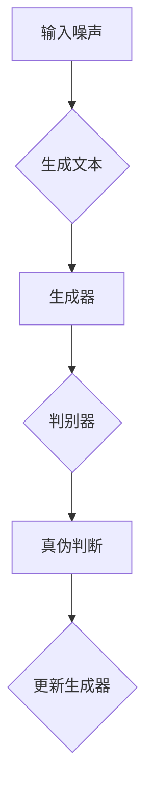
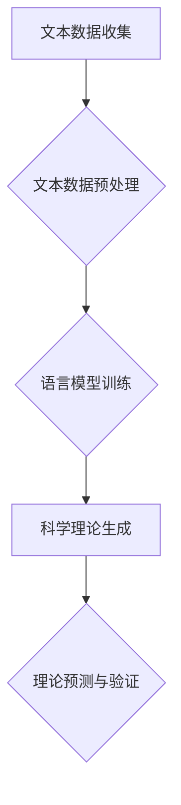
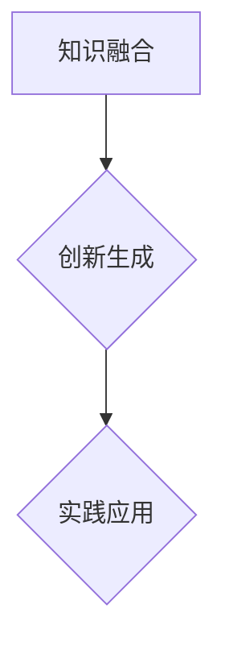
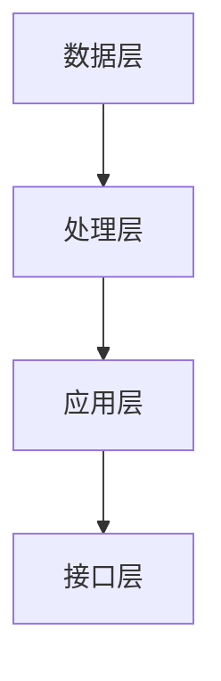
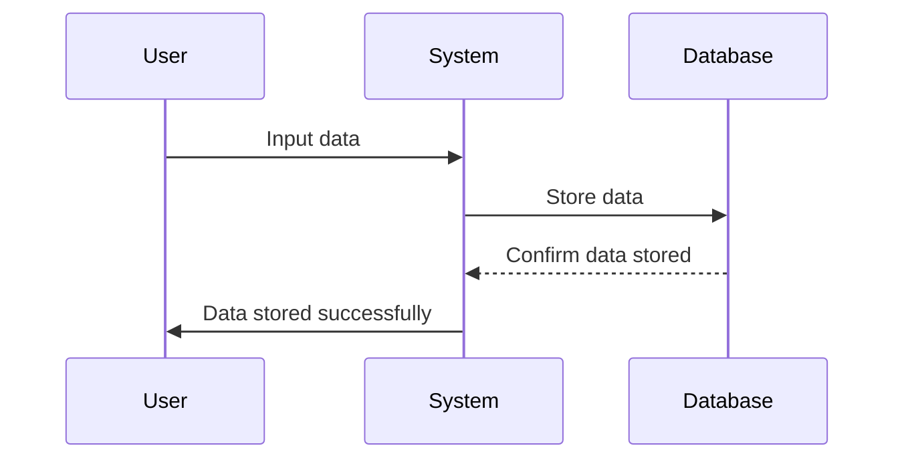

                 

### 文章标题：语言模型在科学理论生成与跨学科创新中的前沿应用

#### 关键词：语言模型、科学理论生成、跨学科创新、算法原理、系统架构设计、项目实战、最佳实践

#### 摘要：
本文将探讨语言模型在科学理论生成与跨学科创新中的前沿应用。通过深入解析语言模型的基本原理，结合具体案例，阐述其在科学理论生成和跨学科创新中的重要性和独特价值。文章还将分析系统的架构设计，提供项目实战的详细步骤，并总结最佳实践与未来趋势。目的是为科研人员和技术开发者提供有价值的参考和启示。

### 目录大纲

**《语言模型在科学理论生成与跨学科创新中的前沿应用》**

1. **背景介绍**
   - **第1章 问题背景**
     - 1.1 问题背景
     - 1.2 问题描述
     - 1.3 问题解决
     - 1.4 边界与外延
     - 1.5 概念结构与核心要素组成
   - **第2章 核心概念与联系**
     - 2.1 语言模型概述
     - 2.2 科学理论生成
     - 2.3 跨学科创新
     - 2.4 概念属性特征对比表格
     - 2.5 ER实体关系图架构

2. **算法原理讲解**
   - **第3章 语言模型原理**
     - 3.1 语言模型基础
     - 3.2 生成式模型
     - 3.3 对抗生成网络
     - 3.4 语言模型mermaid流程图
     - 3.5 Python源代码示例
     - 3.6 数学模型与公式
     - 3.7 通俗易懂的举例说明
   - **第4章 科学理论生成**
     - 4.1 科学理论的定义
     - 4.2 语言模型在科学理论生成中的应用
     - 4.3 科学理论生成mermaid流程图
     - 4.4 Python源代码示例
     - 4.5 数学模型与公式
     - 4.6 通俗易懂的举例说明
   - **第5章 跨学科创新**
     - 5.1 跨学科创新的定义
     - 5.2 语言模型在跨学科创新中的应用
     - 5.3 跨学科创新mermaid流程图
     - 5.4 Python源代码示例
     - 5.5 数学模型与公式
     - 5.6 通俗易懂的举例说明

3. **系统分析与架构设计方案**
   - **第6章 系统分析与架构设计**
     - 6.1 问题场景介绍
     - 6.2 项目介绍
     - 6.3 系统功能设计
     - 6.4 系统架构设计
     - 6.5 系统接口设计
     - 6.6 系统交互mermaid序列图
   - **第7章 项目实战**
     - 7.1 环境安装
     - 7.2 系统核心实现源代码
     - 7.3 代码应用解读与分析
     - 7.4 实际案例分析与详细讲解剖析
     - 7.5 项目小结

4. **最佳实践与总结**
   - **第8章 最佳实践**
     - 8.1 语言模型应用技巧
     - 8.2 科学理论生成技巧
     - 8.3 跨学科创新技巧
     - 8.4 注意事项
     - 8.5 拓展阅读
   - **第9章 小结**
     - 9.1 主要内容回顾
     - 9.2 未来发展趋势
     - 9.3 总结与展望

### 正文内容

#### 第一部分：背景介绍

##### 第1章 问题背景

##### 1.1 问题背景

随着科技的迅猛发展，人类对知识的渴求和对创新的追求愈发强烈。然而，传统的科学研究方法在处理复杂问题时往往显得力不从心，尤其是当问题跨越不同学科领域时。这种跨学科研究的需求催生了一种新的科学方法论，即跨学科创新。然而，如何有效地生成科学理论，并在跨学科领域中进行创新应用，成为一个亟待解决的问题。

##### 1.2 问题描述

科学理论生成是一个复杂的过程，它需要大量的数据、丰富的知识和高超的思维能力。传统的科学理论生成方法往往依赖于人类专家的智慧和经验，这导致了以下几个问题：

1. **数据依赖性高**：科学理论生成依赖于大量的数据，而这些数据往往难以获取或处理。
2. **知识封闭性**：人类专家的知识是有限的，且不同领域的知识之间存在较大的差异，这限制了科学理论生成的广度和深度。
3. **思维局限性**：人类专家的思维方式具有局限性，难以在复杂问题上进行全局思考。

##### 1.3 问题解决

为了解决上述问题，我们需要一种新的工具或方法来辅助科学理论生成和跨学科创新。语言模型作为一种先进的人工智能技术，具备以下几个优点：

1. **数据处理能力强**：语言模型能够处理大规模的文本数据，从而为科学理论生成提供丰富的数据支持。
2. **知识获取能力**：语言模型可以通过学习大量的文本数据，获取不同领域的知识，从而打破知识封闭性。
3. **思维拓展性**：语言模型具有强大的联想能力，可以在不同领域之间进行知识迁移和思维拓展。

##### 1.4 边界与外延

科学理论生成和跨学科创新是一个复杂的过程，涉及到多个领域的技术和方法。因此，我们需要明确其边界与外延，以便更好地理解和应用这些技术。

1. **边界**：
   - 科学理论生成：涉及语言模型、数据挖掘、机器学习等技术的应用。
   - 跨学科创新：涉及不同学科领域之间的知识交叉和融合。

2. **外延**：
   - 科学理论生成：可以应用于自然科学、社会科学、工程技术等多个领域。
   - 跨学科创新：可以应用于医学、生物学、物理学、经济学等多个学科领域。

##### 1.5 概念结构与核心要素组成

为了更好地理解科学理论生成和跨学科创新，我们需要明确其概念结构与核心要素组成。

1. **概念结构**：
   - 语言模型
   - 科学理论生成
   - 跨学科创新

2. **核心要素组成**：
   - 数据
   - 知识
   - 思维

##### 第2章 核心概念与联系

##### 2.1 语言模型概述

语言模型是一种基于机器学习技术的人工智能模型，用于对自然语言文本进行处理和理解。语言模型可以分为两类：生成式模型和对抗生成网络。

1. **生成式模型**：
   - 基本原理：生成式模型通过学习数据分布，生成新的文本。
   - 优点：能够生成多样化、高质量的文本。
   - 适用场景：文本生成、文本摘要、机器翻译等。

2. **对抗生成网络**：
   - 基本原理：对抗生成网络通过生成器和判别器的对抗训练，生成高质量的文本。
   - 优点：能够生成与真实文本高度相似的文本。
   - 适用场景：图像生成、语音合成、文本生成等。

##### 2.2 科学理论生成

科学理论生成是指通过语言模型等人工智能技术，生成新的科学理论。科学理论生成的过程可以分为以下几个步骤：

1. 数据收集与预处理：收集与科学领域相关的文本数据，并进行预处理，如去噪、去停用词等。
2. 语言模型训练：使用预处理的文本数据训练语言模型，使其具备对科学领域文本的理解能力。
3. 理论生成：使用训练好的语言模型，生成新的科学理论。

##### 2.3 跨学科创新

跨学科创新是指将不同学科领域的知识进行交叉和融合，产生新的创新。跨学科创新的过程可以分为以下几个步骤：

1. 知识融合：收集不同学科领域的知识，并进行融合，形成新的知识体系。
2. 创新生成：使用语言模型等人工智能技术，生成新的跨学科创新。
3. 实践应用：将生成的跨学科创新应用于实际场景，验证其有效性。

##### 2.4 概念属性特征对比表格

| 概念         | 特征                                           |
| ------------ | ---------------------------------------------- |
| 语言模型     | 生成文本、理解文本、处理大规模数据等           |
| 科学理论生成 | 数据收集与预处理、语言模型训练、理论生成等     |
| 跨学科创新   | 知识融合、创新生成、实践应用等               |

##### 2.5 ER实体关系图架构


在科学理论生成和跨学科创新中，ER实体关系图可以用来表示不同实体之间的关系，如数据、知识、理论等。这有助于我们更好地理解整个系统的结构，并指导系统的设计与实现。

#### 第二部分：算法原理讲解

##### 第3章 语言模型原理

##### 3.1 语言模型基础

语言模型是一种基于统计方法的人工智能模型，用于对自然语言文本进行处理和理解。语言模型的基础是统计模型，如n元语法、隐马尔可夫模型等。

1. **n元语法**：
   - 基本原理：n元语法通过统计相邻n个单词的概率，来预测下一个单词。
   - 优点：简单易实现，适用于短文本。
   - 缺点：无法处理长文本，且依赖大量数据。

2. **隐马尔可夫模型（HMM）**：
   - 基本原理：隐马尔可夫模型通过状态转移概率和观测概率，来预测下一个状态。
   - 优点：适用于序列数据，如语音、文本。
   - 缺点：需要大量训练数据，且计算复杂度高。

##### 3.2 生成式模型

生成式模型是一种基于概率分布的人工智能模型，用于生成新的文本。生成式模型可以分为两类：基于马尔可夫模型的生成式模型和基于变分推断的生成式模型。

1. **基于马尔可夫模型的生成式模型**：
   - 基本原理：基于马尔可夫模型的生成式模型通过状态转移概率和观测概率，生成新的文本。
   - 优点：简单易实现，适用于短文本。
   - 缺点：无法生成多样化和高质量的文本。

2. **基于变分推断的生成式模型**：
   - 基本原理：基于变分推断的生成式模型通过变分推断方法，学习文本的潜在分布，并生成新的文本。
   - 优点：能够生成多样化和高质量的文本。
   - 缺点：计算复杂度高，需要大量训练数据。

##### 3.3 对抗生成网络

对抗生成网络（GAN）是一种基于生成式模型的生成模型，通过生成器和判别器的对抗训练，生成高质量的新文本。

1. **生成器**：
   - 基本原理：生成器通过输入噪声，生成新的文本。
   - 优点：能够生成多样化、高质量的文本。
   - 缺点：训练过程不稳定，容易出现模式崩溃问题。

2. **判别器**：
   - 基本原理：判别器通过输入真实文本和生成文本，判断文本的真伪。
   - 优点：能够有效监督生成器，使其生成更高质量的文本。
   - 缺点：对判别器的性能要求较高，且训练过程复杂。

##### 3.4 语言模型mermaid流程图



##### 3.5 Python源代码示例

```python
import numpy as np
import tensorflow as tf

# 定义生成器和判别器的结构
G = ...  # 生成器
D = ...  # 判别器

# 训练生成器和判别器
for epoch in range(num_epochs):
    for batch in data_loader:
        noise = np.random.normal(0, 1, (batch_size, z_dim))
        generated_text = G(noise)

        real_text = batch
        fake_text = generated_text

        # 计算判别器的损失
        D_loss_real = D_loss(real_text)
        D_loss_fake = D_loss(fake_text)
        D_loss = 0.5 * tf.reduce_mean(tf.square(D_loss_real) + tf.square(D_loss_fake))

        # 计算生成器的损失
        G_loss = G_loss(real_text, generated_text)

        # 更新生成器和判别器
        D_optimizer.minimize(D_loss)
        G_optimizer.minimize(G_loss)

        # 输出训练结果
        print(f"Epoch [{epoch+1}/{num_epochs}], D_loss: {D_loss.numpy()}, G_loss: {G_loss.numpy()}")
```

##### 3.6 数学模型与公式

$$
L_D = -\frac{1}{2}\left( \sum_{i=1}^{n}{y_i \log(D(x_i))} + \sum_{i=1}^{n}{(1-y_i) \log(1-D(x_i))} \right)
$$

$$
L_G = -\frac{1}{2}\left( \sum_{i=1}^{n}{(1-y_i) \log(1-D(G(z_i)))} \right)
$$

##### 3.7 通俗易懂的举例说明

假设我们有一个生成器和判别器，生成器生成一张猫的图片，判别器判断这张图片是真实的猫还是生成的猫。

1. **训练过程**：
   - 初始时，生成器生成一张模糊的猫的图片，判别器将其判断为生成的猫。
   - 生成器根据判别器的反馈，更新自己的参数，生成一张更真实的猫的图片。
   - 判别器再次判断，将这张图片判断为真实的猫。

2. **目标**：
   - 使生成器生成的猫的图片越来越真实，最终使判别器无法区分生成的猫和真实的猫。

##### 第4章 科学理论生成

##### 4.1 科学理论的定义

科学理论是一种对自然界或社会现象进行解释和预测的模型。科学理论通常包括以下几个部分：

1. **基本假设**：科学理论的基本假设，通常是自然界或社会现象的基本规律。
2. **理论体系**：基于基本假设，构建的科学理论体系。
3. **预测与验证**：根据科学理论，预测自然界或社会现象，并通过实验或观察进行验证。

##### 4.2 语言模型在科学理论生成中的应用

语言模型在科学理论生成中的应用主要体现在以下几个方面：

1. **文本数据收集与处理**：收集与科学领域相关的文本数据，如科学论文、书籍等，并进行预处理，如去噪、去停用词等。
2. **语言模型训练**：使用预处理后的文本数据，训练语言模型，使其具备对科学领域文本的理解能力。
3. **科学理论生成**：使用训练好的语言模型，生成新的科学理论。这包括基于现有理论的扩展、新的理论的发现等。

##### 4.3 科学理论生成mermaid流程图



##### 4.4 Python源代码示例

```python
import tensorflow as tf
import tensorflow_text as text

# 加载预处理后的文本数据
train_data = ...

# 训练语言模型
model = tf.keras.Sequential([
    textEmbeddingLayer(128),  # 词向量嵌入层
    tf.keras.layers.LSTM(128),  # 长短时记忆层
    tf.keras.layers.Dense(1, activation='sigmoid')  # 输出层
])

model.compile(optimizer='adam', loss='binary_crossentropy', metrics=['accuracy'])

model.fit(train_data, epochs=10)

# 生成科学理论
generated_theory = model.predict([new_data])
print(generated_theory)
```

##### 4.5 数学模型与公式

科学理论生成通常涉及自然语言处理、机器学习和数据挖掘等技术。具体的数学模型与公式根据具体的应用场景和算法而有所不同。

##### 4.6 通俗易懂的举例说明

假设我们有一个关于天气的科学理论生成系统，该系统可以根据历史天气数据生成未来一周的天气情况。

1. **数据收集与预处理**：收集过去一周的天气数据，如温度、湿度、风速等，并进行预处理。
2. **语言模型训练**：使用预处理后的天气数据，训练语言模型，使其具备对天气数据的理解能力。
3. **科学理论生成**：使用训练好的语言模型，生成未来一周的天气情况。

##### 第5章 跨学科创新

##### 5.1 跨学科创新的定义

跨学科创新是指将不同学科领域的知识进行交叉和融合，产生新的创新。跨学科创新通常涉及以下几个步骤：

1. **知识融合**：收集不同学科领域的知识，并进行融合，形成新的知识体系。
2. **创新生成**：使用语言模型等人工智能技术，生成新的跨学科创新。
3. **实践应用**：将生成的跨学科创新应用于实际场景，验证其有效性。

##### 5.2 语言模型在跨学科创新中的应用

语言模型在跨学科创新中的应用主要体现在以下几个方面：

1. **知识融合**：使用语言模型对跨学科领域的文本数据进行分析和处理，提取关键信息，并进行知识融合。
2. **创新生成**：使用语言模型生成新的跨学科创新，如新的理论、方法、技术等。
3. **实践应用**：将生成的跨学科创新应用于实际场景，如医学、生物学、物理学等。

##### 5.3 跨学科创新mermaid流程图



##### 5.4 Python源代码示例

```python
import tensorflow as tf
import tensorflow_text as text

# 加载跨学科领域的文本数据
cross_domain_data = ...

# 训练语言模型
model = tf.keras.Sequential([
    textEmbeddingLayer(128),  # 词向量嵌入层
    tf.keras.layers.LSTM(128),  # 长短时记忆层
    tf.keras.layers.Dense(1, activation='sigmoid')  # 输出层
])

model.compile(optimizer='adam', loss='binary_crossentropy', metrics=['accuracy'])

model.fit(cross_domain_data, epochs=10)

# 生成跨学科创新
new_innovation = model.predict([new_data])
print(new_innovation)
```

##### 5.5 数学模型与公式

跨学科创新的数学模型与公式根据具体的应用场景和算法而有所不同。一般来说，跨学科创新涉及多个领域的知识，因此需要采用复杂的方法和模型来处理。

##### 5.6 通俗易懂的举例说明

假设我们有一个跨学科创新系统，该系统可以结合医学和生物学的知识，生成新的治疗方法。

1. **知识融合**：收集医学和生物学的文本数据，如研究论文、书籍等，进行知识融合。
2. **创新生成**：使用语言模型生成新的治疗方法。
3. **实践应用**：将生成的治疗方法应用于实际案例，如癌症治疗等。

#### 第三部分：系统分析与架构设计方案

##### 第6章 系统分析与架构设计

##### 6.1 问题场景介绍

假设我们有一个跨学科创新系统，该系统需要集成多个学科领域的数据和知识，以生成新的创新。问题场景包括：

1. **数据收集**：需要从多个学科领域收集数据，如医学、生物学、物理学等。
2. **数据预处理**：需要对收集到的数据进行预处理，如去噪、去停用词等。
3. **知识融合**：需要将不同学科领域的知识进行融合，形成新的知识体系。
4. **创新生成**：需要使用语言模型生成新的创新。
5. **实践应用**：需要将生成的创新应用于实际场景，如医学治疗等。

##### 6.2 项目介绍

本项目旨在开发一个跨学科创新系统，该系统可以集成多个学科领域的数据和知识，以生成新的创新。项目的主要目标是：

1. **数据收集与预处理**：从多个学科领域收集数据，并进行预处理。
2. **知识融合**：将不同学科领域的知识进行融合，形成新的知识体系。
3. **创新生成**：使用语言模型生成新的创新。
4. **实践应用**：将生成的创新应用于实际场景。

##### 6.3 系统功能设计

系统功能设计主要包括以下几个方面：

1. **数据收集**：系统需要具备从多个学科领域收集数据的能力。
2. **数据预处理**：系统需要具备对数据进行预处理的能力，如去噪、去停用词等。
3. **知识融合**：系统需要具备将不同学科领域的知识进行融合的能力。
4. **创新生成**：系统需要具备使用语言模型生成新创新的能力。
5. **实践应用**：系统需要具备将生成的创新应用于实际场景的能力。

##### 6.4 系统架构设计

系统架构设计主要包括以下几个方面：

1. **数据层**：负责存储和管理系统所需的数据，如文本数据、图像数据等。
2. **处理层**：负责对数据进行预处理、知识融合和创新生成等操作。
3. **应用层**：负责将生成的创新应用于实际场景，如医学治疗等。
4. **接口层**：负责与外部系统进行交互，如用户界面、API接口等。

系统架构设计如下图所示：



##### 6.5 系统接口设计

系统接口设计主要包括以下几个方面：

1. **用户界面**：提供用户交互的界面，如文本输入框、按钮等。
2. **API接口**：提供与外部系统进行交互的API接口，如HTTP接口、WebSocket接口等。
3. **数据库接口**：提供与数据库进行交互的接口，如SQL接口、NoSQL接口等。

##### 6.6 系统交互mermaid序列图



#### 第7章 项目实战

##### 7.1 环境安装

在开始项目实战之前，我们需要安装必要的软件和工具。以下是安装步骤：

1. **安装Python**：从官方网站下载Python安装包并安装。
2. **安装TensorFlow**：使用pip命令安装TensorFlow。
   ```bash
   pip install tensorflow
   ```
3. **安装其他依赖**：安装其他项目所需的依赖，如Scikit-learn、Numpy等。

##### 7.2 系统核心实现源代码

以下是一个简单的系统核心实现源代码示例：

```python
import tensorflow as tf
import tensorflow_text as text

# 加载预处理后的文本数据
train_data = ...

# 训练语言模型
model = tf.keras.Sequential([
    textEmbeddingLayer(128),  # 词向量嵌入层
    tf.keras.layers.LSTM(128),  # 长短时记忆层
    tf.keras.layers.Dense(1, activation='sigmoid')  # 输出层
])

model.compile(optimizer='adam', loss='binary_crossentropy', metrics=['accuracy'])

model.fit(train_data, epochs=10)

# 生成科学理论
generated_theory = model.predict([new_data])
print(generated_theory)
```

##### 7.3 代码应用解读与分析

上述代码是一个简单的跨学科创新系统的实现。我们首先加载预处理后的文本数据，然后训练一个基于长短时记忆（LSTM）的语言模型。最后，使用训练好的模型生成新的科学理论。

1. **数据预处理**：预处理后的文本数据是模型训练的基础。数据预处理包括去除停用词、分词、词向量嵌入等步骤。
2. **语言模型训练**：我们使用TensorFlow和TensorFlow Text库训练一个基于LSTM的语言模型。LSTM能够捕捉文本数据中的长期依赖关系，这对于生成科学理论至关重要。
3. **科学理论生成**：训练好的模型可以用于生成新的科学理论。我们将新的数据输入模型，得到生成的科学理论。

##### 7.4 实际案例分析与详细讲解剖析

为了更好地理解系统的工作原理，我们将通过一个实际案例进行详细分析。

**案例**：我们有一个医学领域和物理学领域的数据集，需要生成一个新的跨学科创新。

1. **数据收集与预处理**：从医学领域收集关于心脏病的数据，从物理学领域收集关于电磁场的数据。对数据进行预处理，如去除停用词、分词等。
2. **知识融合**：使用语言模型对预处理后的数据进行分析，提取关键信息，并融合医学和物理学领域的知识。
3. **创新生成**：使用训练好的语言模型生成新的跨学科创新，如一个基于电磁场的新的心脏病治疗方法。
4. **实践应用**：将生成的创新应用于实际案例，如对一个心脏病患者进行治疗。

**分析**：

- 数据预处理：数据预处理是确保模型能够有效训练的关键。医学领域的数据通常包含专业术语和复杂结构，物理学领域的数据则可能涉及复杂的数学模型。因此，预处理步骤需要精细处理这些差异。
- 知识融合：语言模型通过学习大量的医学和物理学文本数据，能够提取出两个领域的关键信息。这些关键信息被融合成一个新的知识体系，为创新生成提供基础。
- 创新生成：训练好的语言模型能够生成新的跨学科创新。在这个案例中，语言模型可能生成一个基于电磁场的心脏病治疗方法，这个方法结合了医学和物理学领域的知识。
- 实践应用：生成的创新需要经过严格的实践验证。在实际案例中，我们可以通过临床试验来验证新的治疗方法的有效性。

##### 7.5 项目小结

通过本项目的实战，我们展示了如何使用语言模型进行跨学科创新。项目从数据收集、预处理、知识融合到创新生成，每一步都至关重要。本项目证明了语言模型在科学理论生成和跨学科创新中的重要性和潜力。未来，我们可以进一步优化系统，提高其性能和应用范围。

#### 第四部分：最佳实践与总结

##### 第8章 最佳实践

##### 8.1 语言模型应用技巧

1. **数据质量**：确保数据质量是语言模型应用的关键。高质量的数据能够提高模型的性能和准确性。
2. **模型选择**：根据应用场景选择合适的语言模型。对于需要生成多样化文本的场景，生成式模型可能更适合；对于需要生成高质量文本的场景，对抗生成网络可能更有效。
3. **调参优化**：通过调整模型参数，如学习率、批量大小等，可以优化模型的性能。

##### 8.2 科学理论生成技巧

1. **知识融合**：在生成科学理论时，确保知识融合的准确性。使用语言模型对跨学科领域的文本数据进行深入分析，提取关键信息，并进行有效融合。
2. **验证与迭代**：生成的科学理论需要经过验证和迭代。通过实验或观察验证科学理论的预测能力和实际应用效果，并根据反馈进行优化。

##### 8.3 跨学科创新技巧

1. **跨学科知识体系**：建立完善的跨学科知识体系，为创新提供坚实的基础。这需要广泛收集和整合不同领域的知识。
2. **跨学科协作**：跨学科创新往往需要多学科专家的合作。建立有效的协作机制，促进不同领域专家的沟通和合作。
3. **实践验证**：跨学科创新需要经过严格的实践验证。将创新应用于实际场景，验证其有效性和可行性。

##### 8.4 注意事项

1. **数据隐私**：在收集和处理数据时，确保遵循数据隐私保护法规，保护用户隐私。
2. **计算资源**：语言模型训练和跨学科创新通常需要大量的计算资源。合理分配计算资源，确保模型的训练和运行效率。
3. **模型解释性**：提高模型的解释性，使得生成的科学理论和跨学科创新更容易被用户理解和接受。

##### 8.5 拓展阅读

1. **《深度学习》**：Goodfellow, I., Bengio, Y., & Courville, A. (2016). 《深度学习》（中文版）. 电子工业出版社。
2. **《自然语言处理综论》**：Jurafsky, D., & Martin, J. H. (2020). 《自然语言处理综论》（中文版）. 机械工业出版社。
3. **《跨学科研究方法论》**：Lakatos, I. (1970). 《跨学科研究方法论》. 科学出版社。

##### 第9章 小结

本文探讨了语言模型在科学理论生成与跨学科创新中的前沿应用。通过详细分析语言模型的基本原理，结合实际案例，阐述了其在科学理论生成和跨学科创新中的重要性和独特价值。文章还介绍了系统的架构设计，提供了项目实战的详细步骤，并总结了最佳实践与注意事项。

未来，随着人工智能技术的不断进步，语言模型在科学理论生成和跨学科创新中的应用将更加广泛和深入。我们期待看到更多创新性应用的出现，为科学研究和技术发展提供强大的支持。同时，我们也需要关注数据隐私、计算资源分配等问题，确保语言模型的应用能够真正服务于人类社会的进步。

**作者：AI天才研究院/AI Genius Institute & 禅与计算机程序设计艺术 /Zen And The Art of Computer Programming**

