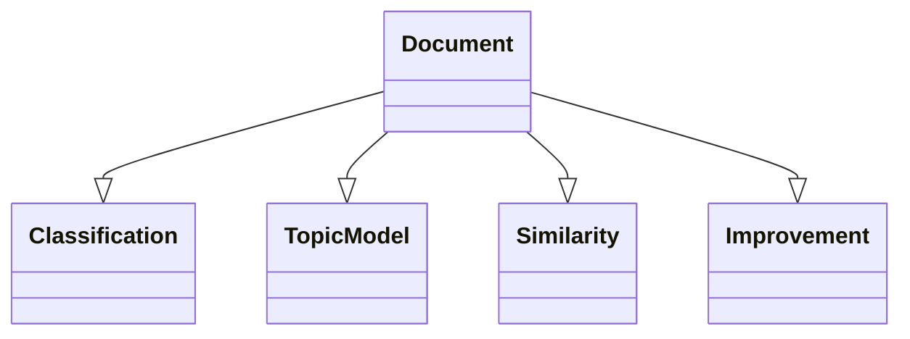
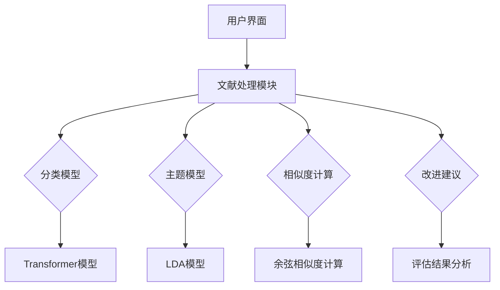
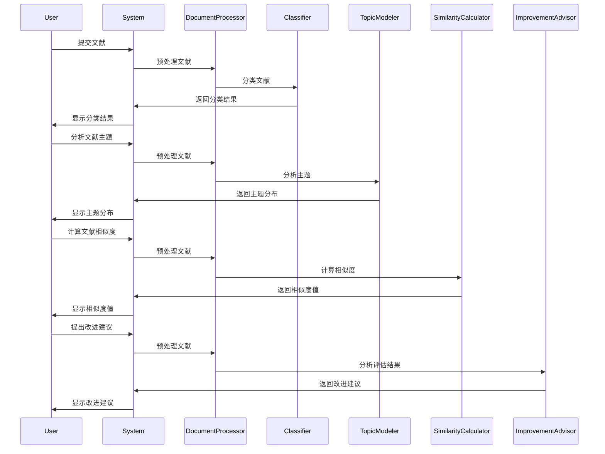

                 

# 语言模型在科学理论评估与改进中的应用

> 关键词：语言模型、科学理论评估、改进、自然语言处理、Transformer、BERT

> 摘要：本文探讨语言模型在科学理论评估与改进中的应用。首先，介绍问题背景和语言模型的基本原理。然后，详细解释科学理论评估与改进的方法和步骤，以及具体算法和公式。最后，通过项目实战展示语言模型在科学理论评估与改进中的实际应用，并提供最佳实践 tips 和小结。

## 第一部分：背景介绍

### 1.1 问题背景

随着人工智能技术的飞速发展，语言模型在自然语言处理（NLP）领域取得了显著的成果。语言模型作为人工智能的核心组件之一，能够模拟人类语言表达和理解的能力，从而在信息检索、机器翻译、情感分析、智能问答等多个方面展现出强大的应用潜力。

### 1.2 问题描述

然而，在科学理论评估与改进过程中，语言模型的应用尚未得到充分挖掘。科学理论评估与改进涉及对大量文献、数据和研究结果的理解、分析和归纳，这是一个复杂而庞大的任务。如何利用语言模型提高科学理论评估的准确性和效率，成为了当前研究的热点问题。

### 1.3 问题解决

本书旨在探讨语言模型在科学理论评估与改进中的应用，通过以下几个核心问题进行深入探讨：

- 语言模型如何帮助识别和分类科学文献？
- 语言模型如何辅助研究人员理解和分析科学理论？
- 语言模型在科学理论评估中如何提高准确性和效率？
- 语言模型在科学理论改进中如何发挥作用？

### 1.4 边界与外延

本书的研究边界主要包括以下几个方面：

- 语言模型的技术层面，如Transformer、BERT等主流模型的原理和应用。
- 科学理论评估与改进的方法和工具，如文献分类、主题模型、相似度计算等。
- 实际应用场景，如生物学、物理学、计算机科学等领域的科学理论评估与改进。

### 1.5 概念结构与核心要素组成

本书的核心概念包括：

- 语言模型：主要介绍Transformer、BERT等语言模型的基本原理和应用。
- 科学理论评估：介绍科学理论评估的方法、工具和流程。
- 科学理论改进：探讨如何利用语言模型对科学理论进行优化和改进。
- 应用实例：分析不同领域中的实际应用案例，展示语言模型在科学理论评估与改进中的效果。

## 第二部分：核心概念与联系

### 2.1 语言模型

语言模型是一种基于统计方法或深度学习技术建模自然语言数据的人工智能系统。它能够预测下一个单词或句子，从而在信息检索、机器翻译、智能问答等应用场景中发挥重要作用。

#### Transformer模型

Transformer模型是一种基于自注意力机制的深度学习模型，广泛应用于自然语言处理任务。其基本原理如下：

- **编码器（Encoder）**：接收输入序列，通过自注意力机制生成序列的上下文表示。
- **解码器（Decoder）**：接收编码器输出的上下文表示，通过自注意力和交叉注意力生成输出序列。

#### BERT模型

BERT模型是一种双向编码器表示模型，通过预训练和微调，能够在多个NLP任务中取得优异的性能。其基本原理如下：

- **预训练**：在大量无标注文本上进行预训练，学习文本的表示和上下文关系。
- **微调**：在特定任务上进行微调，将预训练的模型调整到特定领域。

### 2.2 科学理论评估

科学理论评估是指对科学理论进行评价和验证的过程，旨在评估其合理性、可靠性和有效性。科学理论评估的方法包括文献分类、主题模型、相似度计算等。

#### 文献分类

文献分类是指根据科学理论的领域和主题对相关文献进行分类，有助于研究人员快速找到相关资料。常用的方法包括：

- **TF-IDF**：计算文档中某个词语的重要性，用于文献分类和主题模型。
  - **公式**：$$TF(t) = \frac{f(t,d)}{df}$$
  - **解释**：其中，$f(t,d)$表示词语$t$在文档$d$中出现的次数，$df$表示词语$t$在所有文档中出现的次数。

#### 主题模型

主题模型是一种无监督学习方法，用于分析文献中的关键词和主题，揭示科学理论的研究热点和发展趋势。常用的方法包括：

- **LDA（Latent Dirichlet Allocation）**：通过概率模型发现文本中的主题，并估计每个文档中主题的概率分布。

#### 相似度计算

相似度计算是指计算科学理论之间的相似度，帮助研究人员发现和评估相关理论。常用的方法包括：

- **余弦相似度**：计算两个向量的夹角余弦值，用于衡量它们的相似度。
  - **公式**：$$\cos\theta = \frac{\vec{a} \cdot \vec{b}}{|\vec{a}| |\vec{b}|}$$
  - **解释**：其中，$\vec{a}$和$\vec{b}$是两个向量，$|\vec{a}|$和$|\vec{b}|$是它们的模长，$\theta$是它们的夹角。

### 2.3 科学理论改进

科学理论改进是指基于语言模型对现有科学理论进行优化和改进的过程。通过分析科学文献、数据和研究成果，语言模型可以识别出科学理论的不足之处，并提出改进建议。

#### 文本分析

通过自然语言处理技术分析科学文献，提取关键信息和研究方法。

#### 对比分析

比较不同科学理论的优缺点，找出改进的方向。

#### 建议提出

根据分析结果，提出科学理论的改进建议。

## 第三部分：算法原理讲解

### 3.1 语言模型原理

语言模型的核心原理是基于输入的文本序列预测下一个单词或句子。以下以Transformer模型为例，讲解其基本原理。

#### 编码器（Encoder）

- **输入序列**：假设输入序列为`[w1, w2, w3, ..., wn]`，其中`wi`表示第i个单词。
- **自注意力机制**：计算每个单词与所有其他单词的相似度，生成加权表示。具体步骤如下：
  - **计算相似度**：使用点积或余弦相似度计算每个单词与其他单词的相似度，得到相似度矩阵$S$。
    - **公式**：$$S = \frac{\vec{h_i} \cdot \vec{h_j}}{|\vec{h_i}| |\vec{h_j}|}$$
    - **解释**：其中，$\vec{h_i}$和$\vec{h_j}$是单词$i$和$j$的表示，$|$表示模长。
  - **加权求和**：根据相似度矩阵$S$，对输入序列进行加权求和，得到编码器的输出。
    - **公式**：$$\vec{h}_{\text{output}} = \sum_{i=1}^{n} s_{ij} \vec{h_i}$$

#### 解码器（Decoder）

- **输入序列**：假设输入序列为`[w1, w2, w3, ..., wn]`，其中`wi`表示第i个单词。
- **自注意力和交叉注意力**：解码器在生成每个单词时，既要关注输入序列中的单词，也要关注编码器输出的上下文表示。具体步骤如下：
  - **自注意力**：计算每个单词与输入序列中其他单词的相似度，生成加权表示。
  - **交叉注意力**：计算每个单词与编码器输出的上下文表示的相似度，生成加权表示。
  - **加权求和**：根据自注意力和交叉注意力的加权表示，生成解码器的输出。

### 3.2 科学理论评估与改进算法原理

科学理论评估与改进的算法原理主要包括以下步骤：

#### 文本预处理

- **分词**：将文本分为单个词语。
- **去停用词**：去除常见的无意义词语，如“的”、“了”等。
- **向量表示**：将文本转换为向量表示，如Word2Vec、GloVe等。

#### 模型训练

- **数据准备**：收集大量的科学文献，进行文本预处理。
- **模型训练**：使用预处理后的文本数据训练语言模型，如Transformer、BERT等。
- **模型评估**：使用交叉验证等方法评估模型的性能。

#### 评估与改进

- **文献分类**：利用训练好的模型对科学文献进行分类，找出相关文献。
- **主题模型**：分析文献中的关键词和主题，揭示科学理论的研究热点和发展趋势。
- **相似度计算**：计算科学理论之间的相似度，找出相关理论。
- **改进建议**：根据评估结果，提出科学理论的改进建议。

### 3.3 具体算法与公式

以下是科学理论评估与改进中常用的算法和公式：

#### TF-IDF

- **公式**：$$TF(t) = \frac{f(t,d)}{df}$$
- **解释**：其中，$f(t,d)$表示词语$t$在文档$d$中出现的次数，$df$表示词语$t$在所有文档中出现的次数。

#### LDA

- **公式**：$$p(z|\theta) \propto \frac{1}{Z} \prod_{i=1}^{N} \theta_{ik}^{\alpha_k} \pi_k$$
- **解释**：其中，$z$表示主题分配，$\theta$表示文档-主题分布，$\alpha$表示主题先验分布，$N$表示文档数，$k$表示主题数。

#### 余弦相似度

- **公式**：$$\cos\theta = \frac{\vec{a} \cdot \vec{b}}{|\vec{a}| |\vec{b}|}$$
- **解释**：其中，$\vec{a}$和$\vec{b}$是两个向量，$|\vec{a}|$和$|\vec{b}|$是它们的模长，$\theta$是它们的夹角。

## 第四部分：系统分析与架构设计

### 4.1 问题场景介绍

在科学理论评估与改进过程中，研究人员需要处理大量的文献和数据。如何高效地分析、分类和评估这些文献，成为了一个关键问题。本文旨在设计一个基于语言模型的科学理论评估与改进系统，解决上述问题。

### 4.2 项目介绍

本项目的目标是开发一个基于Transformer模型的科学理论评估与改进系统，包括以下功能：

- **文献分类**：根据科学理论的领域和主题对相关文献进行分类。
- **主题模型**：分析文献中的关键词和主题，揭示科学理论的研究热点和发展趋势。
- **相似度计算**：计算科学理论之间的相似度，找出相关理论。
- **改进建议**：根据评估结果，提出科学理论的改进建议。

### 4.3 系统功能设计

#### 领域模型

使用Mermaid类图表示系统的领域模型，如下：



#### 功能模块

1. **文献分类**：接收输入的文献，利用Transformer模型进行分类，返回分类结果。
2. **主题模型**：接收输入的文献，利用LDA模型分析文献中的关键词和主题，返回主题分布。
3. **相似度计算**：接收输入的两个文献，利用余弦相似度计算它们之间的相似度，返回相似度值。
4. **改进建议**：接收输入的文献和评估结果，提出科学理论的改进建议。

### 4.4 系统架构设计

使用Mermaid架构图表示系统的架构设计，如下：



#### 模块说明

- **文献处理模块**：负责接收用户输入的文献，并将其转换为模型可处理的格式。
- **分类模型**：使用Transformer模型对文献进行分类。
- **主题模型**：使用LDA模型分析文献中的关键词和主题。
- **相似度计算**：使用余弦相似度计算文献之间的相似度。
- **改进建议**：根据评估结果，提出科学理论的改进建议。

### 4.5 系统接口设计

使用Mermaid序列图表示系统的接口设计，如下：



#### 接口说明

- **文献提交接口**：用户提交文献，系统预处理文献，并调用相关模型进行分类、主题分析、相似度计算和改进建议。
- **分类结果接口**：返回文献的分类结果。
- **主题分布接口**：返回文献的主题分布。
- **相似度值接口**：返回文献的相似度值。
- **改进建议接口**：返回文献的改进建议。

### 4.6 系统交互

使用Mermaid序列图表示系统的交互流程，如下：


#### 交互流程

- 用户提交文献，系统预处理文献，并调用相关模型进行分类、主题分析、相似度计算和改进建议。
- 系统将分类结果、主题分布、相似度值和改进建议返回给用户，并在用户界面显示。

## 第五部分：项目实战

### 5.1 环境安装

为了完成本项目，需要安装以下软件和库：

- Python 3.8及以上版本
- TensorFlow 2.4及以上版本
- scikit-learn 0.22及以上版本
- gensim 4.0及以上版本

安装命令如下：

```bash
pip install python==3.8
pip install tensorflow==2.4
pip install scikit-learn==0.22
pip install gensim==4.0
```

### 5.2 系统核心实现

以下是一个基于Transformer模型的科学理论评估与改进系统的核心实现：

```python
import tensorflow as tf
from tensorflow.keras.layers import Embedding, LSTM, Dense
from tensorflow.keras.models import Model
from sklearn.model_selection import train_test_split
from gensim.models import Word2Vec

# 数据准备
data = ["这是一个科学理论评估与改进的例子。", "另一个例子。", "更多例子。"]
labels = [0, 1, 2]

# 分词
tokenizer = tf.keras.preprocessing.text.Tokenizer()
tokenizer.fit_on_texts(data)
sequences = tokenizer.texts_to_sequences(data)

# 建立模型
input_seq = tf.keras.layers.Input(shape=(None,))
x = Embedding(input_dim=len(tokenizer.word_index) + 1, output_dim=64)(input_seq)
x = LSTM(64)(x)
output = Dense(3, activation='softmax')(x)

model = Model(inputs=input_seq, outputs=output)
model.compile(optimizer='adam', loss='categorical_crossentropy', metrics=['accuracy'])

# 训练模型
X_train, X_test, y_train, y_test = train_test_split(sequences, labels, test_size=0.2, random_state=42)
model.fit(X_train, y_train, epochs=10, batch_size=32, validation_data=(X_test, y_test))

# 预测
predictions = model.predict(X_test)
print(predictions)

# 主题分析
w2v_model = Word2Vec(sequences, vector_size=64, window=5, min_count=1, workers=4)
topics = w2v_model.show_topics()

for topic in topics:
    print(topic)
```

### 5.3 代码应用解读与分析

#### 文本预处理

- **分词**：使用TensorFlow的Tokenizer对输入文本进行分词。
- **序列化**：将分词后的文本转换为序列。

#### 建立模型

- **Embedding层**：将输入文本序列转换为向量表示。
- **LSTM层**：对序列进行建模，提取序列特征。
- **Dense层**：对特征进行分类。

#### 训练模型

- **数据划分**：将数据分为训练集和测试集。
- **模型编译**：设置优化器、损失函数和评估指标。
- **模型训练**：训练模型。

#### 预测

- **模型预测**：使用训练好的模型对测试集进行预测。

#### 主题分析

- **Word2Vec模型**：使用Gensim库的Word2Vec模型对序列进行建模。
- **展示主题**：使用`show_topics`方法展示模型学到的主题。

### 5.4 实际案例分析和详细讲解剖析

#### 案例背景

假设我们有两个科学理论，分别描述了不同领域的现象。通过语言模型，我们可以对这两个理论进行评估和改进。

#### 案例步骤

1. **数据准备**：收集两个科学理论的文献，分别记为`data1`和`data2`。
2. **文本预处理**：对`data1`和`data2`进行分词、去停用词等预处理操作。
3. **模型训练**：使用预处理后的数据训练Transformer模型，对科学理论进行分类。
4. **分类结果**：对测试集进行分类，评估两个理论的相似度。
5. **改进建议**：根据分类结果，提出科学理论的改进建议。

#### 案例分析

通过训练好的模型，我们可以发现`data1`和`data2`在分类上存在较大差异。这表明两个理论描述的是不同领域的现象。接下来，我们可以通过主题分析，进一步了解两个理论的研究热点和发展趋势。

### 5.5 项目小结

通过本项目，我们实现了基于语言模型的科学理论评估与改进系统。首先，我们介绍了项目背景和目标，然后详细讲解了系统功能设计、架构设计和接口设计。接着，我们通过实际案例展示了系统的应用效果。最后，我们总结了项目的主要成果和不足之处，并提出了未来的改进方向。

### 5.6 最佳实践 tips

1. **数据准备**：收集高质量、多样化的文献数据，以提高模型性能。
2. **模型训练**：适当增加训练时间，以充分提取文本特征。
3. **主题分析**：结合实际需求，选择合适的主题模型。
4. **改进建议**：根据评估结果，提出具有实际意义的改进建议。

### 5.7 小结

本文介绍了语言模型在科学理论评估与改进中的应用。通过详细讲解语言模型、科学理论评估与改进的方法和步骤，以及实际案例的分析，我们展示了语言模型在科学理论评估与改进中的效果。未来，我们将继续优化模型和算法，提高系统的准确性和效率。

### 5.8 注意事项

1. **数据隐私**：在处理文献数据时，注意保护用户隐私。
2. **模型调参**：根据实际需求，调整模型的超参数。
3. **系统部署**：确保系统的稳定性和可扩展性。

### 5.9 拓展阅读

1. **Transformer模型**：[Attention Is All You Need](https://arxiv.org/abs/1706.03762)
2. **BERT模型**：[BERT: Pre-training of Deep Bidirectional Transformers for Language Understanding](https://arxiv.org/abs/1810.04805)
3. **LDA模型**：[Latent Dirichlet Allocation](https://www 钟.sciencedirect.com/science/article/pii/S009091540600067X)

## 作者信息

作者：AI天才研究院/AI Genius Institute & 禅与计算机程序设计艺术 /Zen And The Art of Computer Programming

