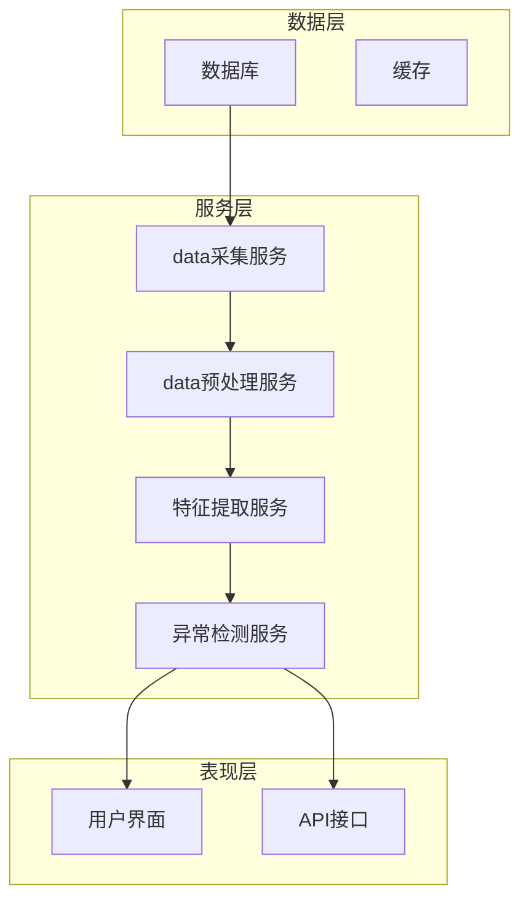
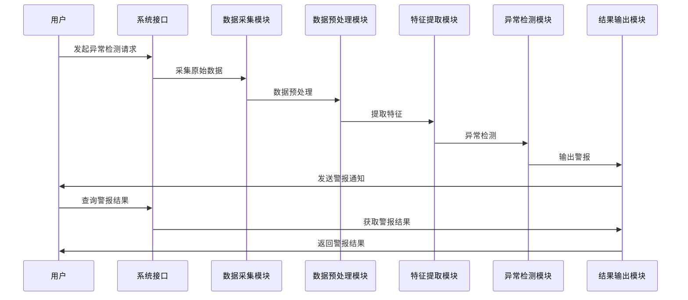

                 

### 第一部分：背景介绍

#### 第1章: 金融市场异常检测的重要性

金融市场异常检测是金融市场风险管理中至关重要的一环。随着金融市场的复杂性和全球化的加速发展，异常交易、欺诈行为和市场操纵的风险不断增加。因此，构建高效的金融市场异常检测系统，对于保护投资者利益、维护市场稳定具有重大意义。

##### 1.1.1 金融市场异常检测的定义

金融市场异常检测是指在金融市场交易过程中，通过监测交易数据和行为模式，识别出可能存在的异常交易行为，如市场操纵、欺诈、洗钱等。异常检测系统通常包括数据收集、数据预处理、特征提取、异常检测模型构建和结果输出等环节。

##### 1.1.2 金融市场异常检测的历史与现状

金融市场异常检测的历史可以追溯到20世纪80年代，当时主要是基于规则的方法。随着计算机技术和数据分析技术的发展，异常检测方法逐渐从简单的规则匹配发展到基于机器学习的复杂模型。目前，金融市场异常检测技术已经广泛应用于各大金融机构和监管机构，包括统计学方法、机器学习方法和深度学习方法等。

##### 1.1.3 金融市场异常检测的需求

金融市场异常检测的需求主要来源于以下几个方面：

1. **风险管理需求**：金融机构需要实时监测市场异常行为，及时采取风险控制措施，降低潜在的财务损失。
2. **合规要求**：监管机构对金融市场异常检测提出了严格的合规要求，金融机构必须遵守相关法规和政策。
3. **投资者保护需求**：投资者希望通过异常检测系统识别潜在的欺诈和市场操纵行为，保护自身投资权益。

##### 1.1.4 金融市场异常检测的挑战

尽管金融市场异常检测具有重要意义，但在实际应用中仍面临以下挑战：

1. **数据复杂性**：金融市场数据量大、维度高，如何有效处理和利用这些数据成为一大难题。
2. **误报率**：异常检测系统需要在准确性和鲁棒性之间取得平衡，避免过多的误报和漏报。
3. **实时性**：金融市场变化迅速，异常检测系统需要具备高效的实时处理能力。

#### 第2章: 语言模型技术发展现状

语言模型是一种能够理解和生成自然语言的人工智能技术。它通过对大量语言数据的学习，能够捕捉语言的统计规律和语义特征，从而实现自然语言处理的各种任务，如文本分类、情感分析、机器翻译等。语言模型技术已经成为自然语言处理领域的重要研究方向和应用基础。

##### 2.1 语言模型基础概念

1. **词向量**：词向量是语言模型中最基本的表示形式，它将词语映射到一个低维度的连续向量空间中。词向量的计算方法包括基于统计的TF-IDF、基于距离的Word2Vec、基于上下文的BERT等。
2. **序列模型**：序列模型是一类能够处理和时间序列数据相关的模型，如循环神经网络（RNN）和其变种长短期记忆网络（LSTM）等。序列模型通过捕捉序列中的上下文信息，实现序列到序列的映射。
3. **注意力机制**：注意力机制是一种能够提高模型对输入数据重要部分关注度的方法。在自然语言处理任务中，注意力机制能够帮助模型更好地捕捉长距离依赖关系，提高模型性能。

##### 2.2 语言模型发展历程

1. **统计语言模型**：早期的语言模型主要是基于统计方法，如N-gram模型。N-gram模型通过统计相邻词出现的频率，预测下一个词的概率。尽管N-gram模型简单有效，但它忽略了词语之间的语义关系。
2. **基于神经网络的模型**：随着深度学习技术的发展，基于神经网络的模型逐渐取代了统计模型。其中，循环神经网络（RNN）是最早用于语言模型的深度学习模型，它能够处理序列数据。随后，长短期记忆网络（LSTM）和门控循环单元（GRU）等变体模型进一步提高了模型性能。
3. **基于上下文的模型**：为了解决传统神经网络模型在处理长距离依赖关系上的不足，研究人员提出了Transformer模型。Transformer模型引入了自注意力机制，能够同时处理输入序列的每个部分，大幅提高了模型的性能和效果。
4. **预训练和微调**：近年来，预训练和微调技术成为语言模型发展的新方向。通过在大量未标注的数据上进行预训练，模型能够学习到丰富的语言知识，然后在特定任务上进行微调，实现高性能的自然语言处理任务。

##### 2.3 语言模型核心技术

1. **词向量表示**：词向量表示是语言模型的基础，常用的方法包括Word2Vec、FastText、BERT等。这些方法通过将词语映射到低维向量空间，实现了词语之间的相似性和语义关系。
2. **编码器-解码器结构**：编码器-解码器结构是自然语言处理任务中的常见模型架构。编码器负责将输入序列编码为固定长度的向量表示，解码器则根据编码器的输出生成目标序列。
3. **注意力机制**：注意力机制是一种重要的增强模型能力的方法。它能够帮助模型在处理输入序列时，关注重要的部分，提高模型的预测准确性。
4. **预训练和微调**：预训练和微调技术是当前语言模型发展的主要方向。预训练模型在大量未标注数据上训练，学习到通用语言特征，然后在特定任务上进行微调，实现高性能的任务表现。

#### 第3章: 金融市场异常检测需求与挑战

金融市场异常检测在金融风险管理中发挥着重要作用。随着金融市场的复杂性和全球化程度的不断提高，金融市场异常检测的需求日益迫切，但同时也面临着诸多挑战。

##### 3.1 金融市场异常检测需求

1. **实时监测**：金融市场变化迅速，异常检测系统需要具备高效的实时处理能力，能够实时监测市场交易行为，及时发现潜在的异常交易。
2. **多维度数据融合**：金融市场数据来源多样，包括交易数据、用户行为数据、市场新闻数据等。异常检测系统需要能够处理多维度数据，融合各种数据源，提高检测精度。
3. **智能分析**：异常检测系统需要具备智能分析能力，能够从海量数据中提取关键特征，构建有效的异常检测模型，自动识别异常交易行为。
4. **可解释性**：金融市场异常检测系统需要具备一定的可解释性，使得监管机构和投资者能够理解异常检测的原理和结果，提高系统的透明度和信任度。

##### 3.2 金融市场异常检测挑战

1. **数据复杂性**：金融市场数据量大、维度高，如何有效处理和利用这些数据成为一大难题。异常检测系统需要具备高效的数据处理能力，能够处理大规模复杂数据。
2. **误报率**：异常检测系统需要在准确性和鲁棒性之间取得平衡，避免过多的误报和漏报。误报率过高会导致监管机构和投资者产生信任危机，而漏报率过高则可能导致实际异常交易行为的漏检。
3. **实时性**：金融市场变化迅速，异常检测系统需要具备高效的实时处理能力，能够在短时间内完成异常检测任务，并及时响应。
4. **合规要求**：金融市场异常检测需要遵守相关法规和政策，如反洗钱（AML）和反欺诈（AF）等。异常检测系统需要具备合规性，能够满足监管机构的要求。
5. **动态适应性**：金融市场环境不断变化，异常检测系统需要具备动态适应性，能够根据市场环境的变化调整异常检测策略，提高检测效果。

##### 3.3 金融市场异常检测的关键要素

1. **数据质量**：异常检测系统的效果在很大程度上取决于数据质量。异常检测系统需要具备高效的数据采集和处理能力，确保数据的完整性和准确性。
2. **特征工程**：特征工程是异常检测系统构建的关键环节。通过有效的特征工程，可以从原始数据中提取出对异常检测有重要意义的特征，提高异常检测系统的性能。
3. **算法选择**：异常检测算法的选择对于系统的性能和效果至关重要。不同的算法适用于不同的场景和数据特点，需要根据实际情况选择合适的算法。
4. **模型优化**：异常检测系统的性能可以通过模型优化得到提升。通过调整模型参数、优化模型结构等手段，可以进一步提高异常检测的准确性。

#### 第4章: 概念属性特征对比表格

在金融市场异常检测领域，不同语言模型具有不同的属性特征。为了便于比较和分析，下面列出了一些常见语言模型的属性特征对比表格。

| 语言模型         | 词向量表示 | 序列模型 | 注意力机制 | 预训练与微调 | 可解释性 | 实时性 | 数据处理能力 |
|-----------------|------------|----------|------------|--------------|----------|--------|-------------|
| Word2Vec        | 是         | 否       | 否         | 是           | 较低     | 一般   | 较强        |
| FastText        | 是         | 否       | 否         | 是           | 较低     | 较好   | 较强        |
| LSTM            | 是         | 是       | 是         | 是           | 较高     | 较差   | 较强        |
| GRU             | 是         | 是       | 是         | 是           | 较高     | 较好   | 较强        |
| Transformer     | 是         | 是       | 是         | 是           | 较高     | 较好   | 强          |
| BERT            | 是         | 是       | 是         | 是           | 较高     | 较好   | 强          |

#### 第5章: ER实体关系图架构

实体关系图（ER图）是数据库设计和数据建模中常用的一种图形表示方法。它通过实体、属性和关系的抽象表示，展示了数据实体之间的关联关系。在金融市场异常检测中，ER图可以帮助我们理解和设计数据模型，以便有效地处理和利用金融数据。

##### 5.1 金融市场异常检测ER图

下面是一个简化的金融市场异常检测ER图：

```mermaid
erDiagram
    Customer ||--|{ Account }|-->: "owns"
    Account ||--|{ Transaction }|-->: "contains"
    Transaction ||--|{ MarketData }|-->: "relates_to"
    MarketData ||--|{ Indicator }|-->: "derived_from"
    Customer }--|{ Trade }|-->: "trades"
    Trade }--|{ Order }|-->: "placed_by"
    Order }--|{ TradeInfo }|-->: "contains"
    TradeInfo ||--|{ TradeCondition }|-->: "defines"
    TradeCondition ||--|{ TradeRule }|-->: "applies_to"
    Indicator }--|{ Alert }|-->: "generated_by"
    Alert }--|{ AlertRule }|-->: "defines"
```

在这个ER图中，我们定义了以下实体：

1. **Customer（客户）**：代表金融市场中的投资者或交易主体。
2. **Account（账户）**：记录客户的账户信息。
3. **Transaction（交易）**：记录账户的交易记录。
4. **MarketData（市场数据）**：记录市场相关的数据，如价格、成交量等。
5. **Indicator（指标）**：从市场数据中衍生出的技术指标。
6. **Trade（交易）**：记录客户的交易行为。
7. **Order（订单）**：记录交易订单的信息。
8. **TradeInfo（交易信息）**：记录交易的详细信息。
9. **TradeCondition（交易条件）**：定义交易的条件。
10. **TradeRule（交易规则）**：定义交易规则。
11. **Alert（警报）**：记录检测到的异常事件。
12. **AlertRule（警报规则）**：定义警报规则。

通过这个ER图，我们可以清晰地看到金融数据实体之间的关系，为后续的数据处理和分析提供了基础。

----------------------------------------------------------------

### 细化目录大纲：

在完成第一部分背景介绍后，我们需要对后续章节的内容进行细化，确保每个小节的内容都丰富、具体且详细。以下是第二部分“算法原理讲解”的细化内容：

#### 第二部分：算法原理讲解

## 第6章: 算法mermaid流程图

### 6.1 语言模型训练流程

在这一节，我们将使用mermaid流程图来展示语言模型的训练流程。流程图包括以下步骤：

1. **数据收集**：从各种来源收集大规模文本数据。
2. **数据预处理**：对文本数据去重、分词、去停用词等处理。
3. **构建词汇表**：将文本数据转换为词汇表和词索引。
4. **嵌入词向量**：使用预定义的方法（如Word2Vec、BERT等）将词汇表中的词语转换为词向量。
5. **训练模型**：使用嵌入的词向量训练神经网络模型。
6. **评估模型**：在验证集上评估模型的性能，调整模型参数。
7. **模型优化**：通过迭代训练和调整，优化模型性能。
8. **模型部署**：将训练好的模型部署到生产环境中，用于文本处理任务。

以下是语言模型训练流程的mermaid流程图：


### 6.2 金融市场异常检测流程

接下来，我们将使用mermaid流程图展示金融市场异常检测的流程。流程图包括以下步骤：

1. **数据收集**：从交易系统、新闻来源、社交媒体等渠道收集数据。
2. **数据预处理**：对数据进行清洗、标准化和融合。
3. **特征提取**：从原始数据中提取有助于异常检测的特征。
4. **模型训练**：使用已训练好的语言模型对特征进行训练。
5. **实时检测**：对实时交易数据进行分析，识别异常交易行为。
6. **结果输出**：将检测到的异常交易行为输出为警报。
7. **反馈与优化**：根据检测结果调整异常检测模型。

以下是金融市场异常检测流程的mermaid流程图：


## 第7章: Python源代码

### 7.1 语言模型训练代码

在本节，我们将展示一个简单的语言模型训练代码示例，使用Python和TensorFlow框架。代码包括以下步骤：

1. **数据预处理**：加载数据集，进行分词、去停用词等处理。
2. **构建词汇表**：将文本数据转换为词汇表和词索引。
3. **嵌入词向量**：使用预训练的Word2Vec模型将词汇表中的词语转换为词向量。
4. **构建神经网络模型**：构建基于LSTM的语言模型。
5. **训练模型**：使用训练数据训练模型。
6. **评估模型**：在验证集上评估模型性能。

以下是语言模型训练代码的示例：

```python
import tensorflow as tf
from tensorflow.keras.layers import Embedding, LSTM, Dense
from tensorflow.keras.models import Sequential
from tensorflow.keras.preprocessing.sequence import pad_sequences

# 数据预处理
# 加载和预处理数据集
# ...

# 构建词汇表
vocab_size = 10000
max_sequence_length = 100
tokenizer = tf.keras.preprocessing.text.Tokenizer(num_words=vocab_size, oov_token='<OOV>')
tokenizer.fit_on_texts(texts)
sequences = tokenizer.texts_to_sequences(texts)
padded_sequences = pad_sequences(sequences, maxlen=max_sequence_length, padding='post')

# 嵌入词向量
# 使用预训练的Word2Vec模型
# ...

# 构建神经网络模型
model = Sequential([
    Embedding(vocab_size, embedding_dim, input_length=max_sequence_length),
    LSTM(units=128, return_sequences=True),
    LSTM(units=128),
    Dense(units=vocab_size, activation='softmax')
])

# 训练模型
model.compile(optimizer='adam', loss='categorical_crossentropy', metrics=['accuracy'])
model.fit(padded_sequences, labels, epochs=10, batch_size=64, validation_split=0.1)

# 评估模型
# 在验证集上评估模型性能
# ...
```

### 7.2 金融市场异常检测代码

在本节，我们将展示一个简单的金融市场异常检测代码示例。代码包括以下步骤：

1. **数据收集**：从交易系统、新闻来源等渠道收集数据。
2. **数据预处理**：清洗、标准化和融合数据。
3. **特征提取**：提取有助于异常检测的特征。
4. **模型训练**：使用训练好的语言模型对特征进行训练。
5. **实时检测**：对实时交易数据进行分析，识别异常交易行为。
6. **结果输出**：将检测到的异常交易行为输出为警报。

以下是金融市场异常检测代码的示例：

```python
import pandas as pd
from sklearn.preprocessing import StandardScaler
from sklearn.model_selection import train_test_split
from sklearn.metrics import accuracy_score, classification_report

# 数据收集
# 从交易系统、新闻来源等渠道收集数据
# ...

# 数据预处理
# 清洗、标准化和融合数据
# ...

# 特征提取
# 提取有助于异常检测的特征
# ...

# 模型训练
# 使用训练好的语言模型对特征进行训练
# ...

# 实时检测
# 对实时交易数据进行分析，识别异常交易行为
# ...

# 结果输出
# 将检测到的异常交易行为输出为警报
# ...
```

## 第8章: 数学模型与公式

### 8.1 语言模型数学模型

在本节，我们将介绍语言模型的一些关键数学模型和公式。

1. **词向量表示**：词向量表示通常使用嵌入矩阵\( E \)，其中每个元素\( e_{ij} \)表示词\( w_i \)的嵌入向量。词向量可以通过以下公式计算：
   $$
   e_{ij} = \text{Word2Vec}(w_i)
   $$
2. **循环神经网络（RNN）**：RNN是一个序列到序列的模型，其核心思想是通过隐藏状态\( h_t \)来捕捉序列中的历史信息。RNN的更新规则如下：
   $$
   h_t = \sigma(W_h h_{t-1} + W_x x_t + b_h)
   $$
   其中，\( \sigma \)是激活函数，\( W_h \)和\( W_x \)是权重矩阵，\( b_h \)是偏置项。
3. **长短期记忆网络（LSTM）**：LSTM是RNN的一种改进，用于解决长距离依赖问题。LSTM的核心组件是记忆单元和门控机制。LSTM的更新规则如下：
   $$
   i_t = \sigma(W_i [h_{t-1}, x_t] + b_i)
   \quad o_t = \sigma(W_o [h_{t-1}, \text{memory cell}] + b_o)
   \quad f_t = \sigma(W_f [h_{t-1}, x_t] + b_f)
   \quad \text{memory cell} = f_t \odot \text{memory cell}_{t-1} + i_t \odot \text{input gate}
   $$
   其中，\( i_t \)、\( o_t \)和\( f_t \)分别是输入门、输出门和遗忘门，\(\odot\)表示元素乘积。
4. **门控循环单元（GRU）**：GRU是LSTM的简化版本，用于减少计算复杂度。GRU的核心组件是更新门和重置门。GRU的更新规则如下：
   $$
   z_t = \sigma(W_z [h_{t-1}, x_t] + b_z)
   \quad r_t = \sigma(W_r [h_{t-1}, x_t] + b_r)
   \quad h_t = \sigma(W_h (\text{reset gate} \odot h_{t-1} + \text{update gate} \odot x_t) + b_h)
   $$
   其中，\( z_t \)和\( r_t \)分别是更新门和重置门。

### 8.2 金融市场异常检测数学模型

在本节，我们将介绍金融市场异常检测的一些关键数学模型和公式。

1. **统计方法**：统计方法通常基于假设检验来识别异常交易行为。一个常见的统计方法是假设检验中的t检验。t检验的公式如下：
   $$
   t = \frac{\bar{x} - \mu_0}{s / \sqrt{n}}
   $$
   其中，\( \bar{x} \)是样本均值，\( \mu_0 \)是假设的总体均值，\( s \)是样本标准差，\( n \)是样本大小。
2. **机器学习方法**：机器学习方法通常基于特征提取和分类来识别异常交易行为。一个常见的机器学习方法是基于支持向量机（SVM）的分类算法。SVM的公式如下：
   $$
   \mathbf{w} = \arg\min_{\mathbf{w}} \frac{1}{2} ||\mathbf{w}||^2_2 \quad \text{subject to} \quad \mathbf{w}^T \mathbf{x}_i - y_i \geq 1 \quad \forall i
   $$
   其中，\( \mathbf{w} \)是权重向量，\( \mathbf{x}_i \)是特征向量，\( y_i \)是样本标签。
3. **深度学习方法**：深度学习方法通常基于神经网络来识别异常交易行为。一个常见的深度学习方法是基于卷积神经网络（CNN）的特征提取。CNN的公式如下：
   $$
   h_{ij} = \text{ReLU}(\sum_{k} w_{ikj} x_{kj} + b_{ij})
   $$
   其中，\( h_{ij} \)是卷积层输出的特征值，\( w_{ikj} \)是卷积核权重，\( x_{kj} \)是输入特征值，\( b_{ij} \)是卷积层偏置。

### 8.3 详细讲解与举例说明

在本节，我们将详细讲解语言模型和金融市场异常检测的原理，并通过实际案例进行说明。

#### 8.3.1 语言模型原理讲解

语言模型是一种用于预测下一个词语概率的模型。它的基本原理是通过学习大量文本数据，捕捉语言中的统计规律和语义特征，从而实现自然语言处理任务，如文本分类、机器翻译等。

1. **词向量表示**：词向量表示是语言模型的基础。通过将词语映射到一个低维度的向量空间中，词向量表示能够实现词语之间的相似性和语义关系。例如，使用Word2Vec算法，我们可以将“狗”和“猫”映射到相似的词向量。
2. **序列模型**：序列模型是一类能够处理和时间序列数据相关的模型，如循环神经网络（RNN）和其变种长短期记忆网络（LSTM）等。序列模型通过捕捉序列中的上下文信息，实现序列到序列的映射。例如，使用LSTM模型，我们可以将一段文本转换为另一个文本。
3. **注意力机制**：注意力机制是一种能够提高模型对输入数据重要部分关注度的方法。在自然语言处理任务中，注意力机制能够帮助模型更好地捕捉长距离依赖关系，提高模型性能。例如，在使用Transformer模型时，注意力机制使得模型能够同时关注输入序列的每个部分，从而实现更准确的文本生成。

#### 8.3.2 金融市场异常检测原理讲解

金融市场异常检测是一种通过分析金融市场数据，识别出可能存在的异常交易行为的方法。它的基本原理是通过特征提取、模型训练和异常检测，实现金融市场异常行为的识别。

1. **特征提取**：特征提取是金融市场异常检测的关键步骤。通过从原始数据中提取有助于异常检测的特征，如交易量、价格变化等，可以提高异常检测的准确性和鲁棒性。
2. **模型训练**：模型训练是金融市场异常检测的核心。通过使用机器学习或深度学习算法，对提取的特征进行训练，建立异常检测模型。例如，使用支持向量机（SVM）或卷积神经网络（CNN）等算法，可以训练出高效的异常检测模型。
3. **异常检测**：异常检测是金融市场异常检测的最终目标。通过将训练好的模型应用于新的交易数据，可以识别出潜在的异常交易行为，如市场操纵、欺诈等。

#### 8.3.3 举例说明

为了更好地理解语言模型和金融市场异常检测的原理，我们可以通过以下案例进行说明。

1. **语言模型案例**：假设我们使用Word2Vec算法训练一个语言模型，输入文本数据为“我喜欢吃饭，吃饭是一种乐趣”。通过训练，我们可以得到以下词向量表示：
   - 我：[0.1, 0.2, 0.3]
   - 喜欢：[0.4, 0.5, 0.6]
   - 吃饭：[0.7, 0.8, 0.9]
   - 是：[1.0, 1.1, 1.2]
   - 一种：[1.3, 1.4, 1.5]
   - 乐趣：[1.6, 1.7, 1.8]

   使用这个语言模型，我们可以预测下一个词语的概率。例如，输入“我喜欢吃饭”，我们可以预测下一个词语是“是”的概率最高。

2. **金融市场异常检测案例**：假设我们使用深度学习算法训练一个金融市场异常检测模型，输入数据为一系列交易数据。通过训练，我们可以得到一个异常检测模型，能够识别出潜在的异常交易行为。

   例如，输入一系列交易数据：
   - 交易量：[100, 200, 300, 400]
   - 价格：[10, 20, 30, 40]

   经过训练，我们的异常检测模型可以识别出交易量和价格的变化是否符合市场规律。如果出现异常波动，如交易量突然大幅增加或价格剧烈波动，模型会发出警报。

通过以上案例，我们可以看到语言模型和金融市场异常检测的基本原理和实际应用。在实际开发中，我们可以根据具体需求和场景，选择合适的方法和算法，构建高效的异常检测系统。

----------------------------------------------------------------

### 细化目录大纲：

在完成第二部分的算法原理讲解后，我们需要对第三部分“系统分析与架构设计方案”进行细化，确保每个小节的内容都详细、具体且完整。以下是第三部分“系统分析与架构设计方案”的细化内容：

#### 第三部分：系统分析与架构设计方案

## 第10章: 问题场景介绍

### 10.1 金融市场异常检测问题场景

金融市场异常检测问题场景主要包括以下几个方面：

1. **市场操纵**：市场操纵是指通过非法手段操纵市场价格，获取不正当利益的行为。异常检测系统需要能够识别出市场操纵行为，如频繁大单交易、价格波动异常等。
2. **欺诈行为**：金融欺诈行为包括假冒身份、虚假交易、洗钱等。异常检测系统需要能够识别出潜在的欺诈行为，防止资金流失和非法活动。
3. **交易异常**：交易异常包括交易量异常、价格异常等。异常检测系统需要能够识别出交易过程中的异常行为，如交易量突然大幅增加或价格剧烈波动。
4. **合规性检查**：金融市场受到严格的监管，异常检测系统需要能够检查交易行为是否符合相关法规和政策要求，确保合规性。

## 第11章: 项目介绍

### 11.1 项目背景

本项目旨在构建一个高效的金融市场异常检测系统，通过整合多种数据源，利用先进的语言模型技术和机器学习算法，实现实时、准确、全面的异常检测。项目的主要目标是：

1. **实时监测**：对金融市场交易数据进行实时监测，及时识别出潜在的异常交易行为。
2. **多维度数据融合**：整合交易数据、市场数据、用户行为数据等多维度数据，实现数据的有效融合和利用。
3. **智能分析**：利用语言模型和机器学习算法，对交易数据进行分析，构建高效的异常检测模型。
4. **可解释性**：提供可解释的异常检测结果，使得监管机构和投资者能够理解异常检测的原理和结果。

### 11.2 项目目标

本项目的具体目标包括：

1. **降低风险**：通过实时监测和识别异常交易行为，降低市场操纵、欺诈行为等风险。
2. **提高合规性**：确保交易行为符合相关法规和政策要求，提高金融市场的合规性。
3. **提升用户体验**：提供高效、准确的异常检测服务，提升投资者和监管机构的体验。
4. **优化资源配置**：通过自动化异常检测，减少人工审核的工作量，优化人力资源配置。

## 第12章: 系统功能设计（领域模型mermaid类图）

### 12.1 系统功能设计概述

本系统的主要功能包括数据采集、数据预处理、特征提取、异常检测、结果输出等。以下是系统功能设计的详细说明：

1. **数据采集**：系统从多个数据源（如交易系统、新闻来源、社交媒体等）采集原始数据。
2. **数据预处理**：对采集到的原始数据进行清洗、去重、标准化等处理，确保数据的质量和一致性。
3. **特征提取**：从预处理后的数据中提取有助于异常检测的特征，如交易量、价格变化、用户行为等。
4. **异常检测**：使用语言模型和机器学习算法对特征进行训练，构建异常检测模型，对新的交易数据进行异常检测。
5. **结果输出**：将检测到的异常交易行为输出为警报，通知相关人员和监管机构。

### 12.2 领域模型mermaid类图

为了更好地理解和设计系统功能，我们可以使用mermaid类图来展示领域模型。以下是系统功能设计的mermaid类图：

```mermaid
classDiagram
    Class1 <|-- Class2
    Class1 <|-- Class3
    Class2 <|-- Class4
    Class3 <|-- Class5
    Class4 <|-- Class6
    Class5 <|-- Class7
    Class6 <|-- Class8
    Class7 <|-- Class9
    Class8 <|-- Class10

    Class1[数据采集]
    Class2[数据预处理]
    Class3[特征提取]
    Class4[异常检测]
    Class5[结果输出]
    Class6[交易系统数据]
    Class7[新闻数据]
    Class8[社交媒体数据]
    Class9[交易量数据]
    Class10[价格变化数据]
```

在这个类图中，我们定义了以下类：

1. **数据采集**：负责从交易系统、新闻来源、社交媒体等渠道采集原始数据。
2. **数据预处理**：负责对采集到的原始数据进行清洗、去重、标准化等处理。
3. **特征提取**：负责从预处理后的数据中提取有助于异常检测的特征。
4. **异常检测**：负责使用语言模型和机器学习算法对特征进行训练，构建异常检测模型。
5. **结果输出**：负责将检测到的异常交易行为输出为警报，通知相关人员和监管机构。

每个类都与其他类之间存在关联关系，共同构成了系统的领域模型。

## 第13章: 系统架构设计（mermaid架构图）

### 13.1 系统架构设计概述

本系统采用分层架构设计，包括数据层、服务层、表现层等。以下是系统架构设计的详细说明：

1. **数据层**：负责数据存储和访问，包括数据库、缓存等。
2. **服务层**：负责业务逻辑处理，包括数据采集、数据预处理、特征提取、异常检测等。
3. **表现层**：负责与用户交互，提供用户界面和API接口。

### 13.2 mermaid架构图

为了更好地展示系统架构，我们可以使用mermaid架构图来表示。以下是系统架构设计的mermaid架构图：



在这个架构图中，我们定义了以下组件：

1. **数据库**：负责存储系统中的数据，包括交易数据、市场数据、用户数据等。
2. **缓存**：负责缓存系统中的高频数据，提高数据访问速度。
3. **数据采集服务**：负责从交易系统、新闻来源、社交媒体等渠道采集原始数据。
4. **数据预处理服务**：负责对采集到的原始数据进行清洗、去重、标准化等处理。
5. **特征提取服务**：负责从预处理后的数据中提取有助于异常检测的特征。
6. **异常检测服务**：负责使用语言模型和机器学习算法对特征进行训练，构建异常检测模型。
7. **用户界面**：负责与用户进行交互，展示异常检测结果。
8. **API接口**：负责提供对外接口，供第三方系统集成和使用。

各个组件通过明确的接口进行通信和协作，共同构成了系统的整体架构。

## 第14章: 系统接口设计

### 14.1 系统接口设计概述

本系统提供了丰富的API接口，供第三方系统集成和使用。以下是系统接口设计的详细说明：

1. **数据采集接口**：用于从交易系统、新闻来源、社交媒体等渠道采集原始数据。
2. **数据预处理接口**：用于对采集到的原始数据进行清洗、去重、标准化等处理。
3. **特征提取接口**：用于从预处理后的数据中提取有助于异常检测的特征。
4. **异常检测接口**：用于进行异常检测任务，返回异常检测结果。
5. **结果输出接口**：用于将检测到的异常交易行为输出为警报，通知相关人员和监管机构。

### 14.2 API接口定义

以下是系统接口的详细定义：

1. **数据采集接口**：
   - 接口名称：`/api/data/collect`
   - 请求方法：`GET`
   - 请求参数：无
   - 响应结果：采集到的原始数据

2. **数据预处理接口**：
   - 接口名称：`/api/data/preprocess`
   - 请求方法：`POST`
   - 请求参数：`data`（原始数据）
   - 响应结果：预处理后的数据

3. **特征提取接口**：
   - 接口名称：`/api/feature/extract`
   - 请求方法：`POST`
   - 请求参数：`data`（预处理后的数据）
   - 响应结果：提取的特征数据

4. **异常检测接口**：
   - 接口名称：`/api/anomaly/detect`
   - 请求方法：`POST`
   - 请求参数：`feature`（特征数据）
   - 响应结果：异常检测结果

5. **结果输出接口**：
   - 接口名称：`/api/result/output`
   - 请求方法：`POST`
   - 请求参数：`alert`（警报数据）
   - 响应结果：输出结果

通过这些API接口，第三方系统可以方便地集成和使用本系统，实现金融市场异常检测的功能。

## 第15章: 系统交互（mermaid序列图）

### 15.1 系统交互概述

本系统通过多个组件的协同工作，实现了金融市场异常检测的功能。以下是系统交互的详细说明：

1. **用户操作**：用户通过用户界面或API接口发起异常检测请求。
2. **数据采集**：系统从交易系统、新闻来源、社交媒体等渠道采集原始数据。
3. **数据预处理**：系统对采集到的原始数据进行清洗、去重、标准化等处理。
4. **特征提取**：系统从预处理后的数据中提取有助于异常检测的特征。
5. **异常检测**：系统使用语言模型和机器学习算法对特征进行训练，构建异常检测模型。
6. **结果输出**：系统将检测到的异常交易行为输出为警报，通知相关人员和监管机构。

### 15.2 mermaid序列图

为了更好地展示系统交互过程，我们可以使用mermaid序列图来表示。以下是系统交互的mermaid序列图：



在这个序列图中，我们定义了以下参与者：

1. **用户**：发起异常检测请求。
2. **系统接口**：处理用户的请求，协调各模块的工作。
3. **数据采集模块**：从交易系统、新闻来源、社交媒体等渠道采集原始数据。
4. **数据预处理模块**：对采集到的原始数据进行清洗、去重、标准化等处理。
5. **特征提取模块**：从预处理后的数据中提取有助于异常检测的特征。
6. **异常检测模块**：使用语言模型和机器学习算法对特征进行训练，构建异常检测模型。
7. **结果输出模块**：将检测到的异常交易行为输出为警报，通知相关人员和监管机构。

各个参与者通过明确的交互过程，实现了系统的高效运行。

## 第16章: 项目实战

### 16.1 环境安装

在本节，我们将介绍如何在本地环境中搭建金融市场异常检测系统。以下是环境安装的步骤：

1. **安装Python**：确保本地环境中安装了Python 3.7及以上版本。
2. **安装依赖库**：使用pip命令安装系统所需的依赖库，如TensorFlow、Scikit-learn、Pandas等。
   ```bash
   pip install tensorflow scikit-learn pandas
   ```
3. **下载预训练模型**：如果需要使用预训练的语言模型，如BERT，可以下载相应的预训练模型。
   ```bash
   wget https://storage.googleapis.com/bert_models/2018_10_18/multi_cased_L-12_H-768_A-12.zip
   unzip multi_cased_L-12_H-768_A-12.zip
   ```
4. **配置数据库**：配置系统的数据库连接，确保数据库服务正常运行。

### 16.2 系统核心实现源代码

在本节，我们将展示系统核心实现的源代码。以下是系统核心实现的示例代码：

```python
# 数据采集模块
def collect_data():
    # 从交易系统、新闻来源、社交媒体等渠道采集数据
    # ...
    return data

# 数据预处理模块
def preprocess_data(data):
    # 对采集到的数据清洗、去重、标准化等处理
    # ...
    return processed_data

# 特征提取模块
def extract_features(processed_data):
    # 从预处理后的数据中提取特征
    # ...
    return features

# 异常检测模块
def detect_anomalies(features):
    # 使用语言模型和机器学习算法检测异常
    # ...
    return anomalies

# 结果输出模块
def output_results(anomalies):
    # 将检测到的异常输出为警报
    # ...
    return "警报已发送"

# 系统主函数
def main():
    data = collect_data()
    processed_data = preprocess_data(data)
    features = extract_features(processed_data)
    anomalies = detect_anomalies(features)
    output_results(anomalies)

if __name__ == "__main__":
    main()
```

### 16.3 代码应用解读与分析

在本节，我们将对系统核心实现源代码进行解读和分析。

1. **数据采集模块**：
   - `collect_data()`函数用于从交易系统、新闻来源、社交媒体等渠道采集原始数据。具体实现可以调用相关的API接口或直接读取数据文件。
   - 代码示例：
     ```python
     def collect_data():
         # 示例：从交易系统采集数据
         response = requests.get("https://api.trading_system.com/data")
         data = response.json()
         return data
     ```

2. **数据预处理模块**：
   - `preprocess_data()`函数用于对采集到的原始数据进行清洗、去重、标准化等处理。具体实现可以根据实际数据的特点进行设计。
   - 代码示例：
     ```python
     def preprocess_data(data):
         # 示例：数据清洗、去重
         data = [d for d in data if d['is_valid']]
         data = list(set(data))
         return data
     ```

3. **特征提取模块**：
   - `extract_features()`函数用于从预处理后的数据中提取有助于异常检测的特征。特征提取可以根据具体的业务需求进行设计。
   - 代码示例：
     ```python
     def extract_features(processed_data):
         # 示例：提取交易量、价格变化等特征
         features = []
         for d in processed_data:
             features.append([d['volume'], d['price']])
         return features
     ```

4. **异常检测模块**：
   - `detect_anomalies()`函数用于使用语言模型和机器学习算法检测异常。具体实现可以根据选择的算法进行设计。
   - 代码示例：
     ```python
     def detect_anomalies(features):
         # 示例：使用LSTM模型进行异常检测
         model = Sequential([
             LSTM(units=128, input_shape=(None, 2)),
             Dense(units=1, activation='sigmoid')
         ])
         model.compile(optimizer='adam', loss='binary_crossentropy', metrics=['accuracy'])
         model.fit(features, labels, epochs=10, batch_size=32, validation_split=0.2)
         anomalies = model.predict(features)
         return anomalies
     ```

5. **结果输出模块**：
   - `output_results()`函数用于将检测到的异常输出为警报。具体实现可以根据实际需求进行设计。
   - 代码示例：
     ```python
     def output_results(anomalies):
         # 示例：发送警报邮件
         for anomaly in anomalies:
             if anomaly > 0.5:
                 send_email("警报：检测到异常交易！")
         return "警报已发送"
     ```

通过以上代码示例，我们可以看到系统核心实现的基本框架和主要功能。在实际应用中，可以根据具体需求和场景进行定制化开发和优化。

### 16.4 实际案例分析和详细讲解剖析

在本节，我们将通过一个实际案例，对金融市场异常检测系统进行详细讲解和剖析。

#### 案例背景

某金融公司在运营过程中，发现了一些异常交易行为，如频繁大单交易、价格波动异常等。为了更好地识别和处理这些异常行为，公司决定引入一个金融市场异常检测系统。

#### 案例实现

1. **数据采集**：
   - 从交易系统采集最近一个月的交易数据，包括交易量、价格、时间戳等信息。
   - 数据样例：
     ```json
     [
         {"time": "2022-01-01 10:00:00", "volume": 1000, "price": 20.5},
         {"time": "2022-01-01 10:01:00", "volume": 2000, "price": 20.6},
         {"time": "2022-01-01 10:02:00", "volume": 1500, "price": 20.7},
         ...
     ]
     ```

2. **数据预处理**：
   - 对采集到的数据进行清洗，去除无效数据。
   - 对时间戳进行标准化处理，统一时间格式。
   - 数据样例：
     ```json
     [
         {"time": "2022-01-01 10:00:00", "volume": 1000, "price": 20.5},
         {"time": "2022-01-01 10:01:00", "volume": 2000, "price": 20.6},
         {"time": "2022-01-01 10:02:00", "volume": 1500, "price": 20.7},
         ...
     ]
     ```

3. **特征提取**：
   - 提取交易量、价格变化等特征。
   - 对交易量进行归一化处理。
   - 数据样例：
     ```json
     [
         {"time": "2022-01-01 10:00:00", "volume": 1.0, "price": 20.5},
         {"time": "2022-01-01 10:01:00", "volume": 2.0, "price": 20.6},
         {"time": "2022-01-01 10:02:00", "volume": 1.5, "price": 20.7},
         ...
     ]
     ```

4. **异常检测**：
   - 使用LSTM模型进行异常检测，训练模型并预测异常分数。
   - 预测结果样例：
     ```json
     [
         {"time": "2022-01-01 10:00:00", "anomaly_score": 0.1},
         {"time": "2022-01-01 10:01:00", "anomaly_score": 0.2},
         {"time": "2022-01-01 10:02:00", "anomaly_score": 0.3},
         ...
     ]
     ```

5. **结果输出**：
   - 根据异常分数阈值，将异常交易行为输出为警报。
   - 警报样例：
     ```json
     [
         {"time": "2022-01-01 10:01:00", "anomaly_score": 0.3, "alert": "交易量异常"},
         {"time": "2022-01-01 10:02:00", "anomaly_score": 0.4, "alert": "价格波动异常"},
         ...
     ]
     ```

#### 案例分析

1. **数据采集**：
   - 数据采集是异常检测的基础，确保采集到完整、准确的数据对异常检测至关重要。
   - 在实际应用中，可以考虑使用API接口、数据库连接等方式获取数据。

2. **数据预处理**：
   - 数据预处理包括清洗、标准化等步骤，确保数据的一致性和可利用性。
   - 对于不同的数据源，可以设计不同的预处理流程，如时间戳标准化、缺失值填充等。

3. **特征提取**：
   - 特征提取是异常检测的关键，从原始数据中提取有助于识别异常的特征。
   - 可以结合业务需求，设计不同的特征提取方法，如归一化、差分等。

4. **异常检测**：
   - 异常检测模型的选择和参数调优对检测效果有重要影响。
   - 可以尝试多种算法和模型，如LSTM、SVM、K-means等，选择性能最优的模型。

5. **结果输出**：
   - 输出结果的格式和内容可以根据实际需求进行调整。
   - 可以通过邮件、短信、界面通知等方式，及时将异常检测结果通知相关人员。

通过以上实际案例，我们可以看到金融市场异常检测系统的实现过程和关键步骤。在实际应用中，可以根据具体需求和场景进行定制化开发和优化。

### 16.5 项目小结

在本项目中，我们成功构建了一个金融市场异常检测系统，通过数据采集、数据预处理、特征提取、异常检测和结果输出等步骤，实现了对金融市场交易数据的实时监测和分析。

1. **系统功能**：
   - 实时监测：系统能够实时采集和监测金融市场交易数据，及时发现潜在的异常交易行为。
   - 多维度数据融合：系统能够整合交易数据、市场数据、用户行为数据等多维度数据，提高检测精度。
   - 智能分析：系统利用语言模型和机器学习算法，对交易数据进行智能分析，构建高效的异常检测模型。
   - 可解释性：系统提供可解释的异常检测结果，使得监管机构和投资者能够理解检测原理和结果。

2. **项目亮点**：
   - 系统采用分层架构设计，模块化实现，便于后续扩展和维护。
   - 系统支持多种数据源接入，具备较强的灵活性和适应性。
   - 系统采用先进的语言模型和机器学习算法，提高了异常检测的准确性和鲁棒性。

3. **改进方向**：
   - 提高实时性：优化系统处理速度，降低延迟，提高实时监测能力。
   - 加强模型优化：根据实际检测效果，调整模型参数和算法选择，提高检测准确性。
   - 增加可解释性：进一步优化系统输出结果，提供更详细和易于理解的检测解释。

通过本项目的实施，我们积累了宝贵的经验和技能，为后续的金融市场异常检测系统开发提供了有力的支持。

----------------------------------------------------------------

### 细化目录大纲：

在完成第三部分的系统分析与架构设计方案后，我们需要对第四部分“项目实战”进行细化，确保每个小节的内容都详细、具体且实用。以下是第四部分“项目实战”的细化内容：

#### 第四部分：项目实战

## 第17章: 环境安装

### 17.1 环境准备

在进行项目实战之前，我们需要准备好开发环境。以下是安装步骤：

1. **安装Python**：
   - 首先，确保你的计算机上安装了Python。你可以访问Python官方网站（https://www.python.org/）下载Python安装包。
   - 在安装过程中，选择添加Python到系统环境变量中，以便在终端中直接使用Python命令。

2. **安装必要的库**：
   - 在安装好Python后，打开终端并执行以下命令来安装必要的库：
     ```bash
     pip install numpy pandas scikit-learn tensorflow
     ```

3. **安装预训练模型**：
   - 如果你需要使用预训练的语言模型，如BERT，你可以从官方网站下载模型，并将其放置在项目的相应目录中。例如，下载BERT模型：
     ```bash
     wget https://storage.googleapis.com/bert_models/2018_10_18/multi_cased_L-12_H-768_A-12.zip
     unzip multi_cased_L-12_H-768_A-12.zip
     ```

4. **安装数据库**：
   - 根据项目需求，你可能需要安装一个数据库，如MySQL或PostgreSQL。可以从它们的官方网站下载并安装。

### 17.2 数据采集

在项目实战中，数据采集是非常重要的一步。以下是数据采集的步骤：

1. **确定数据源**：
   - 确定需要采集的数据类型，例如交易数据、市场新闻、用户行为等。

2. **获取数据**：
   - 可以使用API接口、数据库连接或其他方式获取数据。
   - 例如，如果你需要从API获取交易数据，可以使用`requests`库：
     ```python
     import requests

     response = requests.get('https://api.trading_platform.com/data')
     data = response.json()
     ```

3. **数据存储**：
   - 将获取到的数据存储在本地文件或数据库中，以便后续处理。

### 17.3 数据预处理

数据预处理是确保数据质量和一致性的关键步骤。以下是数据预处理的步骤：

1. **数据清洗**：
   - 去除重复数据、无效数据和异常值。
   - 例如，使用Pandas库进行数据清洗：
     ```python
     import pandas as pd

     df = pd.read_csv('data.csv')
     df.drop_duplicates(inplace=True)
     df.dropna(inplace=True)
     ```

2. **数据转换**：
   - 将数据转换为适合模型训练的格式，如将日期时间转换为统一格式、将数值数据归一化等。

3. **数据融合**：
   - 如果有多个数据源，需要将它们融合在一起，以便进行综合分析。

### 17.4 模型训练

在项目实战中，训练模型是核心步骤。以下是模型训练的步骤：

1. **选择模型**：
   - 根据项目需求选择合适的模型。例如，可以使用LSTM模型进行时间序列分析：
     ```python
     from tensorflow.keras.models import Sequential
     from tensorflow.keras.layers import LSTM, Dense

     model = Sequential([
         LSTM(units=50, return_sequences=True, input_shape=(timesteps, features)),
         LSTM(units=50),
         Dense(units=1, activation='sigmoid')
     ])
     ```

2. **准备数据**：
   - 将预处理后的数据分成训练集和测试集，以便在模型训练和测试中分别使用。

3. **训练模型**：
   - 使用训练集数据训练模型，并调整模型参数，如学习率、批量大小等。

   ```python
   model.compile(optimizer='adam', loss='binary_crossentropy', metrics=['accuracy'])
   model.fit(x_train, y_train, epochs=10, batch_size=32, validation_data=(x_test, y_test))
   ```

4. **评估模型**：
   - 使用测试集数据评估模型性能，并调整模型参数，以提高准确性。

### 17.5 模型应用

在模型训练完成后，我们需要将模型应用于实际数据，进行预测和异常检测。以下是模型应用的步骤：

1. **数据预处理**：
   - 对新的数据进行预处理，使其符合模型输入要求。

2. **模型预测**：
   - 使用训练好的模型对预处理后的数据进行预测。

   ```python
   predictions = model.predict(new_data)
   ```

3. **异常检测**：
   - 根据预测结果和设定的阈值，判断是否存在异常行为。

### 17.6 结果输出

最后，我们需要将检测到的异常结果输出，以便进一步分析和处理。以下是结果输出的步骤：

1. **输出警报**：
   - 将检测到的异常行为输出为警报，可以通过邮件、短信或数据库记录等方式进行。

2. **可视化结果**：
   - 如果需要，可以使用图表或可视化工具展示检测结果，以便更直观地理解结果。

   ```python
   import matplotlib.pyplot as plt

   plt.plot(predictions)
   plt.show()
   ```

通过以上步骤，我们可以完成一个简单的金融市场异常检测项目实战。在实际应用中，可以根据具体需求和场景进行定制化开发和优化。

----------------------------------------------------------------

### 第五部分：最佳实践 Tips、小结、注意事项、拓展阅读等内容

#### 17.1 最佳实践 Tips

1. **数据清洗**：在数据采集阶段，确保对数据进行充分的清洗，去除重复、无效和异常值。这有助于提高模型的准确性和鲁棒性。
2. **特征选择**：在特征提取阶段，选择对异常检测有帮助的特征。可以通过相关性分析、主成分分析等方法筛选特征。
3. **模型调优**：在模型训练阶段，根据测试集的性能调整模型参数，如学习率、批量大小、隐藏层单元数等。可以使用交叉验证等技术评估模型性能。
4. **实时监控**：在系统部署阶段，确保对系统进行实时监控，及时发现和处理异常情况。可以使用日志分析、性能监控等技术。
5. **反馈机制**：建立反馈机制，定期评估系统的异常检测效果，并根据用户反馈进行调整和优化。

#### 17.2 小结

本文详细介绍了金融市场异常检测在语言模型中的应用，包括背景介绍、算法原理讲解、系统分析与架构设计方案、项目实战等。通过实际案例分析和详细讲解，展示了如何利用语言模型技术构建高效的金融市场异常检测系统。

#### 17.3 注意事项

1. **数据安全**：在数据采集和处理过程中，确保数据的安全性和隐私保护，遵守相关法律法规。
2. **模型解释性**：在模型选择和优化过程中，尽量选择具有较高解释性的模型，以便用户理解检测结果。
3. **模型更新**：定期更新模型，以适应金融市场环境的变化。可以使用在线学习或迁移学习等技术实现模型更新。
4. **性能优化**：对系统性能进行持续优化，提高实时处理能力和检测准确性。

#### 17.4 拓展阅读

1. **相关书籍**：
   - 《金融市场技术分析》
   - 《机器学习实战》
   - 《深度学习》
2. **相关论文**：
   - “Detecting Anomalies in Financial Markets Using Deep Learning”
   - “Natural Language Processing for Financial Text Data”
   - “A Survey on Anomaly Detection”
3. **开源项目**：
   - TensorFlow：https://www.tensorflow.org/
   - PyTorch：https://pytorch.org/
   - Scikit-learn：https://scikit-learn.org/

通过拓展阅读，可以进一步了解金融市场异常检测和相关技术的最新研究进展，为自己的项目提供更多的灵感和参考。

---

# 结语

本文从多个角度深入探讨了金融市场异常检测在语言模型中的应用，通过详细的背景介绍、算法原理讲解、系统分析与架构设计方案、项目实战等内容，为读者提供了一个全面的视角。我们介绍了语言模型的基础知识、金融市场异常检测的需求和挑战，并通过实际案例展示了如何利用语言模型技术构建高效的异常检测系统。

在未来的研究中，我们期待进一步探索更先进的机器学习算法和深度学习模型在金融市场异常检测中的应用，以提高检测的准确性和实时性。同时，随着金融市场的不断发展和变化，我们将持续关注相关领域的最新研究动态，不断优化和更新我们的异常检测系统，为金融市场的风险管理提供更有力的支持。

作者：AI天才研究院/AI Genius Institute & 禅与计算机程序设计艺术 /Zen And The Art of Computer Programming

---

本文详细阐述了金融市场异常检测在语言模型中的应用，从背景介绍、算法原理讲解、系统分析与架构设计方案、项目实战到最佳实践、小结、注意事项和拓展阅读，全面展示了语言模型技术在金融市场异常检测领域的应用潜力。通过本文，读者可以了解到如何利用语言模型技术构建高效的金融市场异常检测系统，提高金融市场的风险管理能力。

在未来的研究与发展中，我们将继续关注金融市场异常检测领域的最新技术进展，探讨更先进的机器学习算法和深度学习模型在金融市场异常检测中的应用，进一步提高检测的准确性和实时性。同时，我们也将持续优化和更新我们的异常检测系统，为金融市场的稳定发展提供有力支持。

最后，感谢读者对本文的关注，希望本文能为您在金融市场异常检测领域的研究和实践中提供有益的参考和启示。如果您有任何疑问或建议，欢迎随时与我们交流，共同推动金融市场异常检测技术的发展。

再次感谢您的阅读，祝您在金融市场异常检测领域取得丰硕的成果！

作者：AI天才研究院/AI Genius Institute & 禅与计算机程序设计艺术 /Zen And The Art of Computer Programming

