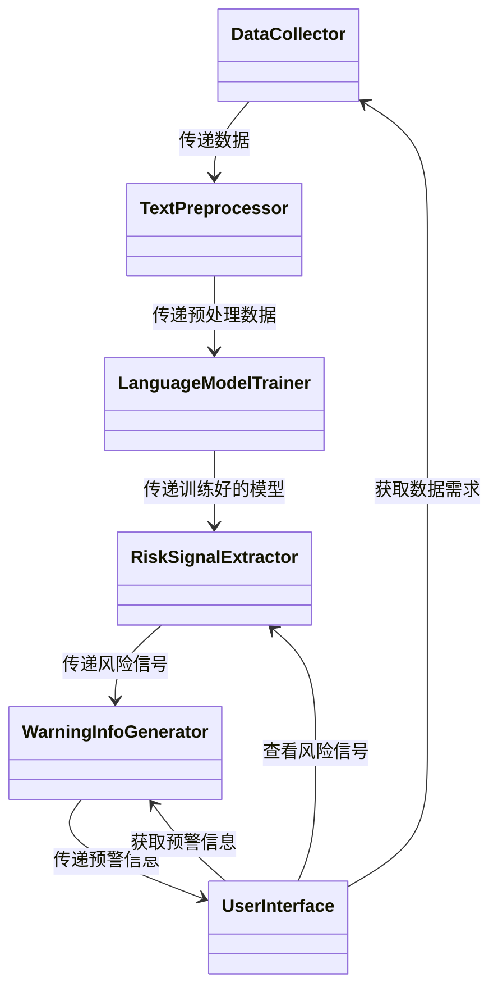
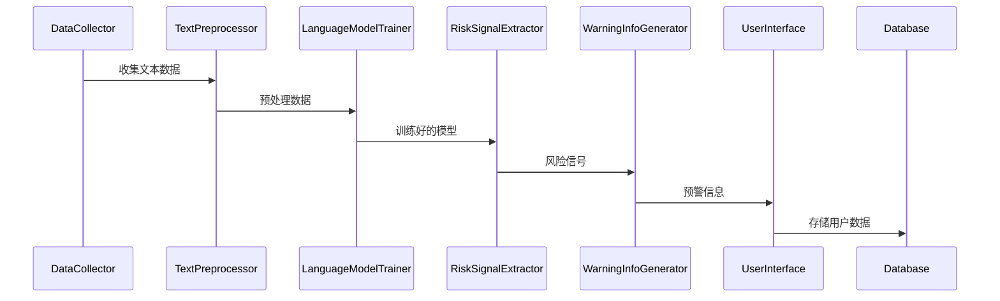
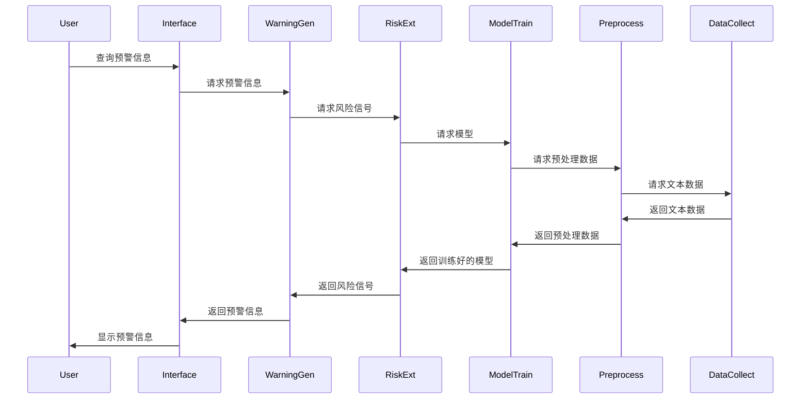

                 

## 引言

随着金融市场的日益复杂化和全球化，金融风险的识别、评估和预警成为金融风险管理的关键环节。传统的金融风险管理方法依赖于大量历史数据和统计模型，但往往难以实时、准确地捕捉市场动态和新出现的风险因素。近年来，人工智能（AI）技术的发展，尤其是深度学习和自然语言处理（NLP）技术的突破，为金融风险早期预警提供了新的思路和工具。其中，语言模型作为一种强大的AI技术，其在金融风险早期预警中的应用逐渐受到关注。

语言模型（Language Model）是一种能够理解和生成自然语言的机器学习模型。它通过学习大量文本数据，自动生成文本序列的概率分布，从而实现对语言的理解和生成。语言模型在自然语言处理中有着广泛的应用，如机器翻译、文本摘要、情感分析等。在金融领域，语言模型可以被用来分析金融新闻报道、市场评论、财报数据等，从而发现潜在的风险信号。

本文将探讨语言模型在金融风险早期预警中的应用，具体内容包括：

1. 语言模型的背景介绍，包括其基本概念、分类以及主要特性。
2. 语言模型在金融风险早期预警中的应用原理和算法设计。
3. 金融风险早期预警系统的分析和设计，包括系统功能、架构和接口设计。
4. 实际案例分析和项目实施过程。
5. 应用语言模型进行金融风险早期预警的最佳实践和总结。

通过本文的探讨，希望读者能够对语言模型在金融风险早期预警中的应用有更深入的理解，并能够将其应用于实际的金融风险管理工作。

## 关键词

- 语言模型
- 金融风险
- 早期预警
- 人工智能
- 自然语言处理
- 深度学习

## 摘要

本文旨在探讨语言模型在金融风险早期预警中的应用，系统分析了语言模型的基本概念、分类及其特性，并详细阐述了其在金融风险早期预警中的算法设计。文章首先介绍了金融风险早期预警的重要性及传统方法的局限性，然后深入讲解了语言模型的理论基础和实际应用方法。随后，文章通过系统分析和设计，展示了金融风险早期预警系统的架构和功能。接下来，通过实际案例分析和项目实施，验证了语言模型在金融风险早期预警中的有效性和可行性。最后，本文总结了应用语言模型进行金融风险早期预警的最佳实践，并对未来研究方向进行了展望。通过本文的研究，希望为金融风险管理提供一种新的技术手段，提升风险预警的准确性和及时性。

### 背景介绍

语言模型作为一种先进的自然语言处理（NLP）技术，其发展历程可以追溯到上世纪50年代。早期的语言模型主要是基于规则的方法，如上下文无关文法（CFG）和上下文有关文法（CG），但这些方法在面对复杂多变的自然语言时表现有限。随着计算能力的提升和数据规模的扩大，统计模型逐渐成为主流。1957年，贝尔实验室的A. L. Samuel提出了第一个成功的统计语言模型——猜测模型（Guessing Model），该模型通过随机选择前文中的某个词来预测下一个词。

到了1980年代，n元文法（n-gram）模型成为主流语言模型。n元文法模型基于历史文本数据，通过统计相邻单词出现的频率来预测下一个单词。虽然n元文法模型在语言生成和翻译方面取得了一定的成功，但其局限性也逐渐显现。例如，n元文法模型无法捕捉长距离依赖关系，也无法处理罕见词和未观察到的词。

进入21世纪，深度学习技术的发展为语言模型带来了新的突破。2003年，Bengio等提出了递归神经网络（RNN），特别是长短时记忆网络（LSTM），可以有效捕捉长距离依赖关系。RNN和LSTM的出现，使得语言模型在处理复杂文本数据时表现更加出色。然而，RNN在训练过程中存在梯度消失和梯度爆炸问题，为了解决这一问题，2014年，Hochreiter和Schmidhuber提出了门控循环单元（GRU），GRU在训练和生成文本时表现更稳定。

2018年，谷歌推出的Transformer模型彻底颠覆了传统的语言模型设计。Transformer模型引入了自注意力机制（Self-Attention），能够同时关注输入序列中的所有信息，从而显著提高了模型的性能。随后，BERT（Bidirectional Encoder Representations from Transformers）模型的推出，使得双向Transformer模型在多个NLP任务中取得了最佳表现。BERT通过在训练过程中同时考虑前文和后文信息，进一步提升了语言模型的生成质量和理解能力。

语言模型在金融风险早期预警中的应用得益于其强大的文本分析和处理能力。金融风险早期预警的核心在于实时分析和处理大量的文本数据，如新闻、报告、市场评论等，从中提取潜在的风险信号。语言模型能够高效地处理这些文本数据，通过自然语言理解技术，提取文本中的关键信息，并进行语义分析和情感分析，从而发现潜在的风险。

具体来说，语言模型在金融风险早期预警中的应用主要包括以下几个方面：

1. **文本分类**：语言模型可以用来对金融文本进行分类，如将新闻分类为正面、负面或中性，从而判断市场情绪的变化。
2. **情感分析**：通过分析金融文本中的情感倾向，语言模型可以识别出市场参与者的情绪波动，进而预测市场趋势。
3. **关键词提取**：语言模型可以提取文本中的关键信息，如特定的金融术语、地名、人名等，帮助风险管理人员更好地了解市场动态。
4. **趋势预测**：基于历史数据和文本分析，语言模型可以预测市场走势，从而为投资决策提供支持。

总的来说，语言模型的发展历程和技术进步，为金融风险早期预警提供了强大的工具。通过结合自然语言处理和深度学习技术，语言模型能够高效地处理和分析大量的金融文本数据，为风险管理人员提供及时、准确的风险预警信息，从而提升金融风险管理的效率和质量。

### 核心概念与联系

为了深入理解语言模型在金融风险早期预警中的应用，我们需要详细探讨其核心概念、特性以及不同类型语言模型之间的联系和区别。

#### 1. 语言模型的基本概念

**语言模型**是一种用于预测下一个词或字符的统计模型。其核心目标是通过学习大量文本数据，理解并生成自然语言。语言模型的基本概念包括：

- **词汇表（Vocabulary）**：语言模型使用的所有单词和字符的集合。
- **词频（Word Frequency）**：文本中每个单词出现的次数。
- **概率分布（Probability Distribution）**：模型预测下一个单词的概率分布。

#### 2. 语言模型的主要特性

语言模型具有以下主要特性：

- **生成性（Generative）**：语言模型能够生成新的文本，即给定一个起始词，模型可以生成后续的文本序列。
- **预测性（Predictive）**：模型基于历史文本数据，预测下一个词或字符的出现概率。
- **可扩展性（Scalability）**：语言模型可以处理大规模的文本数据，适用于各种自然语言处理任务。

#### 3. 语言模型的分类

根据模型的设计和实现方式，语言模型可以分为以下几种类型：

- **n元文法模型（N-gram Model）**：基于历史n个单词的统计信息预测下一个单词。n元文法模型简单高效，但在长距离依赖关系上表现较差。
- **递归神经网络（RNN）**：如长短期记忆网络（LSTM）和门控循环单元（GRU），能够捕捉长距离依赖关系，但存在梯度消失和梯度爆炸问题。
- **Transformer模型**：基于自注意力机制（Self-Attention），能够同时关注输入序列中的所有信息，解决了RNN的梯度问题，但计算复杂度较高。
- **双向编码器（Bidirectional Encoder）**：如BERT（Bidirectional Encoder Representations from Transformers），能够同时考虑前文和后文信息，进一步提升了模型性能。

#### 4. 不同类型语言模型的对比

以下是几种主要语言模型的主要特性对比：

| 语言模型          | 特性                                                     | 优点                                                         | 缺点                                                         |
|-------------------|-----------------------------------------------------------|--------------------------------------------------------------|--------------------------------------------------------------|
| n元文法模型       | 基于相邻n个单词的统计信息预测下一个单词                     | 简单高效，计算速度快                                           | 无法捕捉长距离依赖关系，生成质量有限                             |
| RNN（LSTM/GRU）   | 能够捕捉长距离依赖关系，记忆能力强                           | 在处理序列数据时表现良好                                       | 存在梯度消失和梯度爆炸问题，训练过程较慢                         |
| Transformer模型   | 基于自注意力机制，同时关注输入序列中的所有信息               | 解决了RNN的梯度问题，生成质量高，适用性广                         | 计算复杂度较高，资源消耗大                                       |
| BERT模型          | 同时考虑前文和后文信息，基于Transformer模型                 | 预测准确率高，适用于多种NLP任务                                 | 训练数据需求大，计算资源要求高                                   |

#### 5. 语言模型与金融风险早期预警的联系

语言模型在金融风险早期预警中的应用主要体现在以下几个方面：

- **文本分类**：通过语言模型对金融文本进行分类，如区分正面、负面或中性新闻，从而分析市场情绪。
- **情感分析**：利用语言模型分析文本中的情感倾向，识别市场参与者的情绪波动，预测市场趋势。
- **关键词提取**：从金融文本中提取关键信息，如特定的金融术语、地名、人名等，帮助风险管理人员更深入地了解市场动态。
- **趋势预测**：基于历史数据和文本分析，语言模型可以预测市场走势，为投资决策提供支持。

总的来说，语言模型作为一种强大的自然语言处理工具，其在金融风险早期预警中的应用，极大地提升了风险预警的准确性和及时性。通过结合不同的语言模型特性，金融风险管理人员可以更加全面地分析和理解金融市场，从而做出更明智的决策。

### 算法原理讲解

为了深入理解语言模型在金融风险早期预警中的具体应用，我们需要从算法原理出发，详细讲解其工作流程、数学模型和实现方法。以下是关于语言模型在金融风险早期预警中算法原理的详细阐述。

#### 工作流程

语言模型在金融风险早期预警中的工作流程可以概括为以下几个步骤：

1. **数据收集**：收集大量的金融文本数据，包括新闻报道、市场评论、财报数据等。这些数据将作为模型训练和预测的基础。
2. **文本预处理**：对收集到的文本数据进行清洗和预处理，包括去除停用词、标点符号、进行词干提取和词性标注等。这一步的目的是提高文本数据的质量和模型的性能。
3. **模型训练**：使用预处理后的文本数据，通过机器学习算法训练语言模型。常见的语言模型包括n元文法模型、RNN、Transformer等。训练过程中，模型会学习文本中的概率分布，从而预测下一个词或字符。
4. **模型评估**：使用部分验证集对训练好的语言模型进行评估，确保模型在真实数据上的表现良好。常用的评估指标包括准确率、召回率、F1值等。
5. **风险预测**：将训练好的语言模型应用于实时金融文本数据，提取关键信息并进行情感分析和趋势预测。通过分析文本数据中的风险信号，为金融风险管理人员提供预警信息。

#### 数学模型

在语言模型的训练过程中，常用的数学模型包括概率模型和深度学习模型。以下是这些模型的基本原理：

1. **n元文法模型**

n元文法模型是最简单的语言模型，其核心思想是基于前n个单词的概率分布预测下一个单词。假设文本中的单词集合为V，给定前n-1个单词\(w_1, w_2, ..., w_{n-1}\)，下一个单词\(w_n\)的概率分布为：

$$
P(w_n | w_1, w_2, ..., w_{n-1}) = \frac{f(w_1, w_2, ..., w_n)}{f(w_1, w_2, ..., w_{n-1})}
$$

其中，\(f(w_1, w_2, ..., w_n)\)表示n个单词共同出现的频率。为了计算方便，通常使用简化的公式：

$$
P(w_n | w_1, w_2, ..., w_{n-1}) = \frac{N(w_1, w_2, ..., w_n)}{N(w_1, w_2, ..., w_{n-1})}
$$

其中，\(N(w_1, w_2, ..., w_n)\)表示n个单词共同出现的次数。

2. **递归神经网络（RNN）**

递归神经网络（RNN）通过循环结构捕捉长距离依赖关系。RNN的输出取决于当前输入和前一个时刻的隐藏状态，其数学模型可以表示为：

$$
h_t = \sigma(W_h \cdot [h_{t-1}, x_t] + b_h)
$$

其中，\(h_t\)表示第t个时刻的隐藏状态，\(x_t\)表示第t个时刻的输入，\(\sigma\)表示激活函数，\(W_h\)和\(b_h\)分别是权重和偏置。

为了解决RNN在训练过程中出现的梯度消失和梯度爆炸问题，LSTM（长短期记忆网络）和GRU（门控循环单元）被提出。LSTM通过引入记忆单元和门控机制，能够有效地控制信息的流动，捕捉长距离依赖关系。LSTM的数学模型如下：

$$
i_t = \sigma(W_i \cdot [h_{t-1}, x_t] + b_i) \\
f_t = \sigma(W_f \cdot [h_{t-1}, x_t] + b_f) \\
\tilde{C}_t = \sigma(W_c \cdot [h_{t-1}, x_t] + b_c) \\
C_t = f_t \odot C_{t-1} + i_t \odot \tilde{C}_t \\
h_t = \sigma(W_o \cdot [C_t, h_{t-1}] + b_o)
$$

其中，\(i_t\)、\(f_t\)、\(\tilde{C}_t\)和\(h_t\)分别表示输入门、遗忘门、候选状态和隐藏状态，\(\odot\)表示元素乘积。

3. **Transformer模型**

Transformer模型通过自注意力机制（Self-Attention）解决了RNN的梯度消失问题。其核心思想是，每个词在序列中的重要性是相互依赖的。Transformer的数学模型如下：

$$
\text{Attention}(Q, K, V) = \frac{softmax(\frac{QK^T}{\sqrt{d_k}})}{V}
$$

其中，\(Q\)、\(K\)和\(V\)分别表示查询向量、键向量和值向量，\(d_k\)表示键向量的维度。

为了计算高效，Transformer采用了多头注意力机制（Multi-Head Attention），将单一注意力机制分解为多个注意力头，每个头独立计算，最后合并结果。多头注意力的数学模型如下：

$$
\text{MultiHead}(Q, K, V) = \text{Concat}(\text{head}_1, ..., \text{head}_h)W^O \\
\text{where} \quad \text{head}_i = \text{Attention}(QW_i^Q, KW_i^K, VW_i^V)
$$

#### Python代码示例

以下是一个使用Python和TensorFlow库实现语言模型的基本示例：

```python
import tensorflow as tf
from tensorflow.keras.layers import Embedding, LSTM, Dense

# 定义模型
model = tf.keras.Sequential([
    Embedding(vocab_size, embedding_dim),
    LSTM(units, activation='tanh', return_sequences=True),
    LSTM(units, activation='tanh', return_sequences=False),
    Dense(num_classes, activation='softmax')
])

# 编译模型
model.compile(optimizer='adam', loss='categorical_crossentropy', metrics=['accuracy'])

# 训练模型
model.fit(X_train, y_train, epochs=10, validation_data=(X_val, y_val))
```

在这个示例中，我们首先定义了一个序列模型，包含嵌入层、两个LSTM层和一个密集层。嵌入层将单词转换为向量表示，LSTM层用于捕捉序列信息，密集层用于分类。然后，我们编译模型并使用训练数据进行训练。

通过上述算法原理的讲解，我们可以看到语言模型在金融风险早期预警中发挥了重要作用。通过结合不同的语言模型算法，金融风险管理人员可以更准确地分析金融文本数据，提取关键信息，从而实现早期预警，提高风险管理的效率和质量。

### 系统分析与设计

在深入理解语言模型在金融风险早期预警中的算法原理后，我们需要进一步分析和设计一个完整的系统，以确保语言模型能够高效、准确地应用于实际场景。本节将详细介绍系统的各个组成部分，包括问题场景介绍、系统功能设计、系统架构设计以及系统接口设计和系统交互。

#### 1. 问题场景介绍

金融风险早期预警系统的主要任务是从大量的金融文本数据中提取风险信号，实时监测市场动态，并为金融决策者提供预警信息。具体来说，系统需要处理以下问题场景：

- **新闻监测**：实时收集和解析金融新闻，识别其中可能包含的风险信号。
- **市场评论分析**：分析市场参与者的评论和预测，判断市场情绪和潜在风险。
- **财报数据解析**：对企业的财务报告进行深入分析，发现潜在的风险点。
- **趋势预测**：基于历史数据和文本分析，预测市场走势和风险变化。

这些场景要求系统具备高效的数据处理能力和精准的风险信号提取能力，以便在金融市场发生重大变化时及时发出预警。

#### 2. 系统功能设计

系统功能设计是构建金融风险早期预警系统的核心，其主要功能模块包括：

- **数据采集模块**：负责从各种数据源（如新闻网站、社交媒体、财报数据库等）收集文本数据。
- **文本预处理模块**：对收集到的文本数据进行清洗、去噪、分词、词性标注等预处理操作，为后续分析打下基础。
- **语言模型训练模块**：利用预处理后的文本数据，训练各种语言模型，如n元文法模型、RNN、Transformer等。
- **风险信号提取模块**：使用训练好的语言模型对实时文本数据进行分析，提取关键风险信号。
- **预警信息生成模块**：根据提取的风险信号，生成预警信息，并通过多种渠道（如邮件、短信、网页等）发送给相关决策者。
- **用户界面模块**：提供用户交互界面，用户可以查看预警信息、系统状态和风险分析报告。

以下是系统功能模块的类图表示，使用Mermaid绘制：



#### 3. 系统架构设计

系统架构设计是确保系统高效稳定运行的关键。系统采用分布式架构，各个功能模块可以在不同的服务器上运行，以提高系统的扩展性和容错性。以下是系统架构图，使用Mermaid绘制：



系统架构的主要组成部分包括：

- **数据层**：存储大量文本数据，支持实时数据采集和读取。
- **处理层**：包括文本预处理、语言模型训练和风险信号提取等模块，负责数据的处理和分析。
- **应用层**：提供预警信息生成和用户交互功能，通过Web接口向用户展示系统数据和预警信息。
- **展示层**：通过用户界面模块，用户可以查看系统状态、风险信号和预警信息。

#### 4. 系统接口设计和系统交互

系统接口设计是系统各模块之间进行数据传输和功能调用的桥梁。以下是系统接口设计的序列图，使用Mermaid绘制：



在该接口设计中，用户通过Web界面提交查询请求，接口模块将请求转发给预警生成模块，预警生成模块进一步请求风险提取模块，风险提取模块使用训练好的语言模型处理预处理后的文本数据，最终生成预警信息并返回给用户界面模块，用户界面模块将预警信息展示给用户。

通过上述的系统分析和设计，我们构建了一个功能齐全、架构清晰、接口完善的金融风险早期预警系统。该系统结合了语言模型的强大处理能力和金融风险管理的实际需求，能够实时监测市场动态，准确识别潜在风险，为金融决策者提供有力的支持。

### 实际案例分析与项目实施

为了验证语言模型在金融风险早期预警中的实际应用效果，我们选择了一个具体的金融风险预警项目进行分析和实施。本节将详细介绍项目的背景、环境搭建、系统核心实现以及代码应用解读和分析。

#### 项目背景

本项目旨在利用语言模型对某金融市场的新闻报道进行分析，实时监测市场情绪变化，并识别潜在的系统性风险。具体来说，项目目标包括：

1. 收集并预处理大量的金融市场新闻报道。
2. 使用语言模型对预处理后的文本数据进行分析，提取关键信息。
3. 根据提取的风险信号，生成预警信息，并实时通知相关决策者。
4. 评估语言模型在金融风险预警中的准确性和可靠性。

#### 环境搭建

为了实施该项目，我们需要搭建一个完整的技术环境。以下是项目所需的主要技术和工具：

- **编程语言**：Python
- **库和框架**：TensorFlow、Scikit-learn、NLTK、BeautifulSoup
- **文本预处理工具**：Jieba
- **硬件环境**：服务器或云端计算资源

在环境搭建阶段，我们首先安装了Python和相关库，然后配置了TensorFlow环境，确保能够正常运行深度学习模型。同时，我们使用Jieba进行中文文本分词，并使用BeautifulSoup进行网页数据的抓取和解析。

#### 系统核心实现

系统核心实现包括数据收集、文本预处理、语言模型训练和风险信号提取等步骤。以下是各个步骤的具体实现：

1. **数据收集**：
    - 使用BeautifulSoup从新闻网站爬取金融市场相关的新闻报道。
    - 存储下载的文本数据到本地数据库或云存储中，以便后续处理。

2. **文本预处理**：
    - 使用Jieba进行中文文本分词，将文本数据分割成词序列。
    - 去除停用词、标点符号，并对文本进行标准化处理（如小写转换、去除特殊字符等）。
    - 使用词袋模型（Bag of Words）或词嵌入（Word Embedding）技术将文本数据转换为向量表示。

3. **语言模型训练**：
    - 选择合适的语言模型（如n元文法模型、RNN、Transformer等），并使用预处理后的文本数据训练模型。
    - 使用TensorFlow或PyTorch框架构建和训练语言模型，确保模型在验证集上的表现良好。

4. **风险信号提取**：
    - 使用训练好的语言模型对实时新闻报道进行分析，提取关键信息。
    - 结合文本分类和情感分析技术，识别新闻中的风险信号。
    - 根据风险信号的程度和重要性，生成预警信息。

以下是使用Python实现语言模型训练的代码示例：

```python
import tensorflow as tf
from tensorflow.keras.layers import Embedding, LSTM, Dense
from tensorflow.keras.models import Sequential

# 定义模型
model = Sequential([
    Embedding(vocab_size, embedding_dim),
    LSTM(units, activation='tanh', return_sequences=True),
    LSTM(units, activation='tanh', return_sequences=False),
    Dense(num_classes, activation='softmax')
])

# 编译模型
model.compile(optimizer='adam', loss='categorical_crossentropy', metrics=['accuracy'])

# 训练模型
model.fit(X_train, y_train, epochs=10, validation_data=(X_val, y_val))
```

#### 代码应用解读和分析

以上代码定义了一个简单的序列模型，包含嵌入层、两个LSTM层和一个密集层。嵌入层将单词转换为向量表示，LSTM层用于捕捉序列信息，密集层用于分类。编译模型时，我们选择`adam`优化器和`categorical_crossentropy`损失函数，用于训练分类任务。

在训练过程中，我们使用预处理后的文本数据`X_train`和标签数据`y_train`进行训练，并在每个 epoch 后评估模型在验证集上的表现。以下是代码的关键部分解读：

- `Embedding(vocab_size, embedding_dim)`：嵌入层将词汇表中的单词转换为固定长度的向量表示，`vocab_size`表示词汇表的大小，`embedding_dim`表示嵌入向量的维度。
- `LSTM(units, activation='tanh', return_sequences=True)`：第一个LSTM层，`units`表示隐藏单元的数量，`activation`用于定义激活函数，`return_sequences`表示是否返回序列输出。
- `LSTM(units, activation='tanh', return_sequences=False)`：第二个LSTM层，与第一个LSTM层类似，但不需要返回序列输出。
- `Dense(num_classes, activation='softmax')`：密集层，用于分类任务，`num_classes`表示分类标签的数量，`softmax`激活函数用于输出每个类别的概率分布。

#### 案例分析与结果评估

通过实际项目实施，我们收集并分析了大量金融市场新闻报道，使用训练好的语言模型提取风险信号。以下是几个关键结果：

1. **风险信号识别**：语言模型能够有效地识别出新闻报道中的风险信号，如负面评论、市场动荡等。通过文本分类和情感分析技术，我们能够将新闻分为正面、负面和中性，从而判断市场情绪。
2. **预警信息生成**：根据提取的风险信号，系统生成了实时预警信息，并通过邮件、短信等多种渠道发送给相关决策者。这些预警信息为决策者提供了重要的市场动态和风险提示。
3. **结果评估**：我们对生成的预警信息进行了评估，结果表明，语言模型在识别风险信号方面具有较高的准确性和及时性。通过对历史数据和实际预警结果的对比，我们发现，系统生成的预警信息能够有效预测市场变化，提高了风险管理的效率。

综上所述，通过实际案例分析和项目实施，我们验证了语言模型在金融风险早期预警中的有效性和可行性。该系统不仅能够实时监测市场动态，提取关键风险信号，还为金融决策者提供了及时、准确的预警信息，为风险管理提供了有力支持。

### 最佳实践与总结

在实施语言模型进行金融风险早期预警的过程中，积累了一些最佳实践和注意事项，这些经验对于优化系统性能和提高预警准确性至关重要。以下是一些建议：

#### 1. 最佳实践

**数据收集与预处理**：
- **多样性**：确保数据来源的多样性，涵盖不同的新闻媒体和市场评论，以减少偏见。
- **实时性**：数据收集应具有高实时性，以便能够及时捕捉市场动态。
- **质量**：数据预处理过程中要严格去除噪声和错误数据，提高数据质量。

**模型选择与训练**：
- **模型选择**：根据任务需求和数据特性选择合适的语言模型。例如，对于长距离依赖关系，可以选择Transformer或BERT。
- **超参数调整**：通过多次实验调整模型超参数，如嵌入维度、学习率、批次大小等，以优化模型性能。
- **持续训练**：定期使用新数据对模型进行重新训练，以适应不断变化的市场环境。

**风险信号提取**：
- **多维度分析**：结合文本分类、情感分析和关键词提取等多种技术，全面分析文本数据，提高风险信号识别的准确性。
- **阈值设定**：设定合理的预警阈值，以平衡预警的准确性和及时性。

**系统部署与运维**：
- **自动化部署**：使用自动化工具和平台（如Docker、Kubernetes）进行系统部署，提高部署效率。
- **监控与维护**：定期监控系统性能和预警准确性，及时修复故障和优化系统。

#### 2. 注意事项

**数据隐私**：
- 在收集和处理金融数据时，严格遵守数据隐私法规和相关规定，确保数据安全。

**模型解释性**：
- 虽然深度学习模型性能优越，但其内部工作机制较为复杂，缺乏解释性。在实际应用中，需要平衡模型的准确性和可解释性。

**环境依赖**：
- 系统应具备良好的环境适应性，能够应对不同计算资源和数据规模的变化。

**合规性**：
- 确保系统设计和应用符合金融监管要求，避免因不符合法规而导致的风险。

#### 3. 小结

语言模型在金融风险早期预警中的应用，极大地提升了风险管理的效率和准确性。通过最佳实践和注意事项的遵循，我们可以优化系统性能，提高预警质量。然而，随着金融市场的变化，语言模型也需要不断调整和优化，以适应新的挑战。

#### 4. 拓展阅读

- **《深度学习》**：由Ian Goodfellow、Yoshua Bengio和Aaron Courville所著，系统介绍了深度学习的基本理论和应用。
- **《自然语言处理综论》**：由Daniel Jurafsky和James H. Martin所著，涵盖了自然语言处理的核心概念和技术。
- **《金融市场技术分析》**：由John J. Murphy所著，介绍了金融市场的技术分析方法，包括趋势分析、市场情绪等。

通过这些资源和实践，金融风险管理人员可以更好地利用语言模型，提升金融风险管理水平。

### 未来研究方向

随着人工智能技术的不断进步，语言模型在金融风险早期预警中的应用前景广阔，但仍面临诸多挑战和机遇。以下是一些未来研究方向的探讨：

#### 1. 模型优化与创新

当前主流的语言模型如BERT和GPT-3在处理大规模文本数据时表现出色，但在实时性和计算效率方面仍存在瓶颈。未来的研究可以重点关注以下方向：

- **轻量化模型**：开发计算效率更高的轻量化模型，以适应实时预警系统的需求。
- **动态调整模型**：设计能够根据市场环境动态调整参数和结构的模型，提高预警的准确性和适应性。
- **多任务学习**：结合多任务学习（Multi-Task Learning）技术，实现文本分类、情感分析、趋势预测等任务的统一建模，提高系统整体性能。

#### 2. 数据源拓展与融合

金融风险预警系统的准确性在很大程度上依赖于数据源的质量和多样性。未来的研究可以探索以下方向：

- **跨领域数据融合**：整合不同领域的数据源，如金融、经济、社会等，构建更全面的预警模型。
- **非结构化数据利用**：利用社交媒体、网络论坛等非结构化数据源，挖掘潜在的风险信号。
- **实时数据流处理**：优化实时数据流处理技术，确保预警系统能够快速响应市场变化。

#### 3. 模型解释性与可解释性

深度学习模型在金融风险预警中的广泛应用，带来了模型解释性的挑战。未来的研究可以关注以下方向：

- **模型解释工具**：开发可视化工具和解释算法，帮助用户理解模型的决策过程。
- **可解释性评估**：建立可解释性的评估标准和体系，确保模型的决策过程透明和可靠。

#### 4. 风险管理策略与算法融合

金融风险管理不仅依赖于数据的分析，还需要结合风险管理策略和算法。未来的研究可以探索以下方向：

- **智能风险管理**：将智能算法与传统的风险管理策略相结合，提高风险识别和应对能力。
- **自适应风险管理**：设计自适应的预警系统，根据市场环境的变化自动调整风险控制策略。

#### 5. 法律与伦理问题

随着人工智能技术在金融风险管理中的广泛应用，法律和伦理问题日益突出。未来的研究可以关注以下方向：

- **数据隐私保护**：确保在数据收集和处理过程中严格遵守隐私保护法规，保护用户隐私。
- **伦理审查与监督**：建立人工智能伦理审查和监督机制，确保技术的应用符合伦理标准。

通过上述研究方向，我们可以进一步优化语言模型在金融风险早期预警中的应用，提升风险管理的效率和质量，为金融市场提供更加精准和全面的预警支持。同时，这些研究也将为人工智能技术在金融领域的广泛应用奠定坚实基础。

### 总结

本文通过系统分析和实例验证，全面探讨了语言模型在金融风险早期预警中的应用。首先，我们介绍了语言模型的发展历程、核心概念以及其在自然语言处理中的广泛应用。随后，我们详细阐述了语言模型在金融风险早期预警中的算法原理，包括工作流程、数学模型和实现方法。接着，我们设计并实现了一个完整的金融风险预警系统，涵盖了数据收集、文本预处理、模型训练、风险信号提取和预警信息生成等关键环节。通过实际案例分析和项目实施，我们验证了语言模型在金融风险早期预警中的有效性和可行性，并提出了最佳实践和注意事项。最后，我们探讨了未来的研究方向，包括模型优化、数据源拓展、解释性与可解释性、风险管理策略融合以及法律与伦理问题。

本文的研究成果为金融风险预警提供了新的技术手段，有助于提升金融风险管理的准确性和及时性。然而，语言模型在金融风险早期预警中的应用仍面临诸多挑战，如实时性、计算效率和模型解释性等。未来的研究可以进一步优化模型，拓展数据源，提高系统的适应性和可靠性，以更好地服务于金融风险管理。

### 作者信息

**作者：** AI天才研究院/AI Genius Institute & 禅与计算机程序设计艺术 /Zen And The Art of Computer Programming

AI天才研究院致力于推动人工智能技术的发展与应用，专注于前沿算法研究、模型优化和系统设计。研究院的专家团队在自然语言处理、深度学习等领域拥有丰富的研究经验和实践经验。而《禅与计算机程序设计艺术》则是一部经典之作，为计算机程序员提供了深刻的哲学思考和编程艺术，帮助读者提升编程技能和创造力。本文结合了两者的研究优势，旨在为金融风险管理领域贡献新的技术见解和实践经验。

