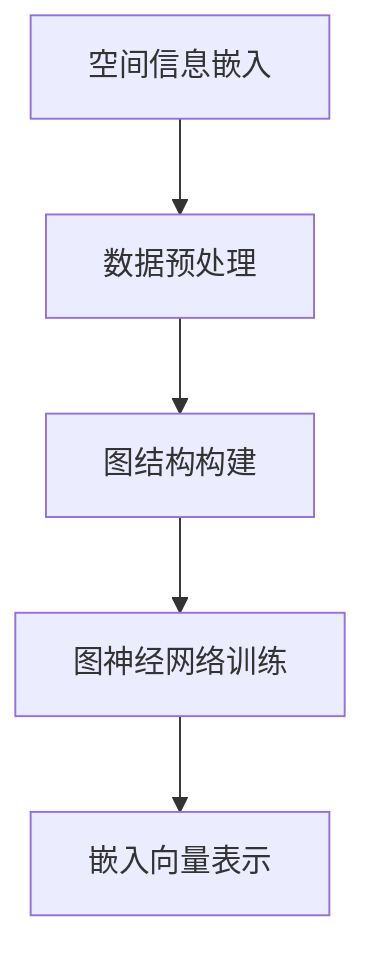
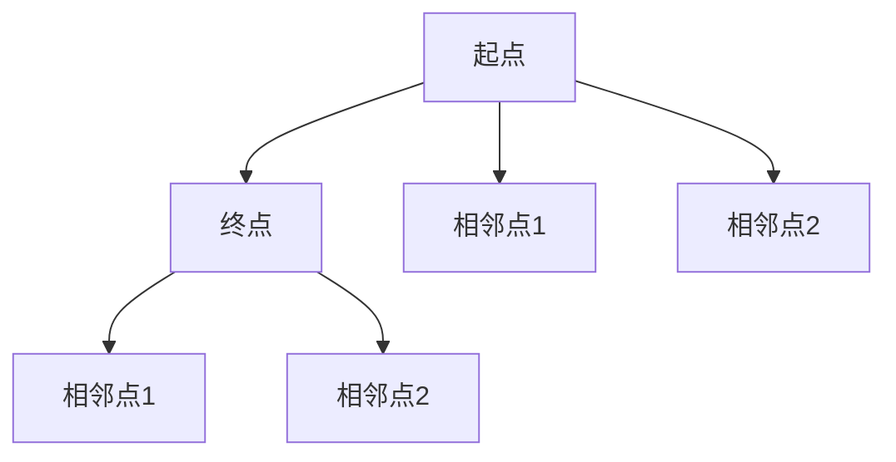
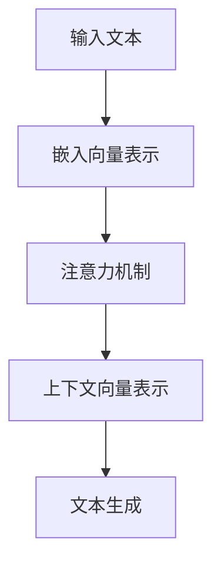
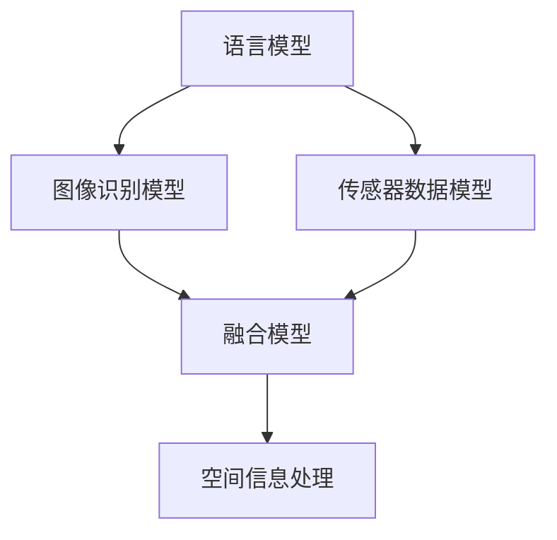
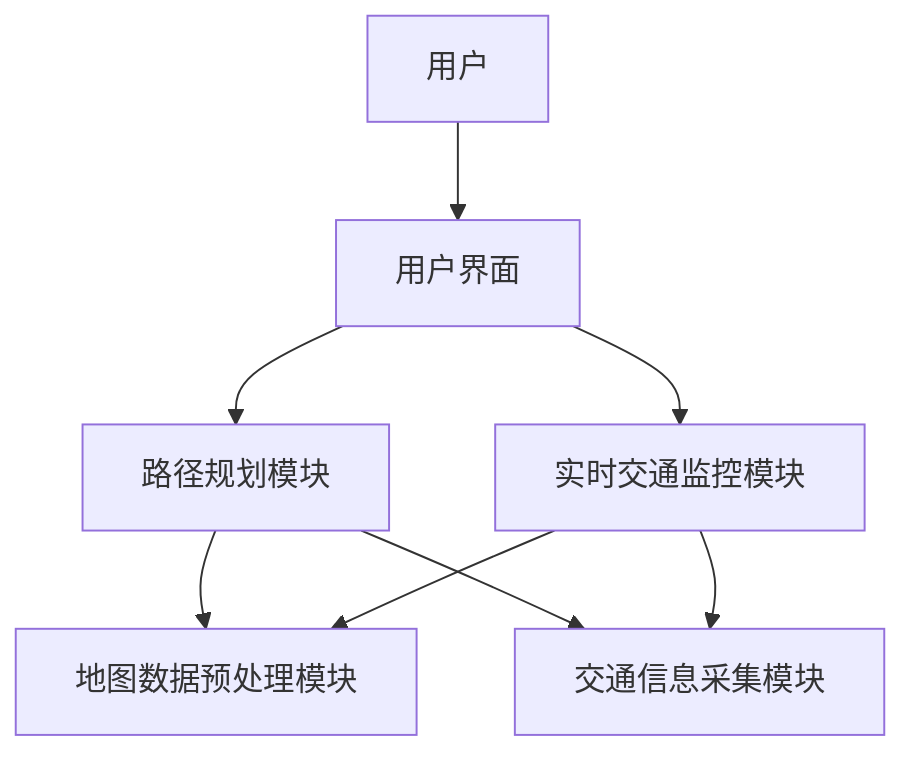

                 


# 语言模型处理空间信息的新挑战

> 关键词：语言模型、空间信息、算法原理、数学模型、系统架构

> 摘要：本文探讨了语言模型在处理空间信息时所面临的新挑战，包括问题背景、核心概念与联系、算法原理讲解以及系统架构设计等方面。通过对语言模型和空间信息处理的深入分析，本文提出了相应的解决方案和最佳实践，旨在为相关领域的研究者提供有价值的参考。

## 1. 背景介绍

### 1.1 问题背景

随着计算机科学和人工智能技术的不断发展，语言模型在自然语言处理（NLP）领域取得了显著的成果。然而，当语言模型开始尝试处理空间信息时，却面临了一系列新挑战。空间信息是指关于位置、距离、方向等与空间相关的信息，这些信息在地理信息系统（GIS）、自动驾驶、机器人导航等领域有着广泛的应用。因此，如何有效地将语言模型应用于空间信息处理，成为当前研究的热点问题。

### 1.2 问题描述

语言模型在处理空间信息时面临的主要挑战包括：

1. **空间信息的嵌入**：将空间信息转化为语言模型可处理的向量表示是一个关键问题。空间信息通常具有高维、非线性等特点，如何有效地进行嵌入是一个挑战。

2. **空间关系理解**：语言模型需要能够理解和处理空间关系，如相邻、包含、相邻等。这些关系在自然语言中并不常见，如何准确识别和表达它们是另一个挑战。

3. **空间上下文感知**：语言模型在处理空间信息时需要考虑上下文因素，如地理环境、交通状况等。如何有效地融合上下文信息是一个重要的研究问题。

4. **多模态融合**：空间信息通常涉及多种数据来源，如图像、文本、传感器数据等。如何将不同模态的数据进行有效融合，提高模型性能，是一个亟待解决的问题。

### 1.3 问题解决

针对上述挑战，可能的解决思路和方向包括：

1. **改进空间信息嵌入方法**：研究更加高效、准确的空间信息嵌入方法，如基于图神经网络（GNN）的方法，以降低空间信息的高维性和非线性。

2. **引入空间关系表示**：设计专门的空间关系表示方法，如使用图结构表示空间关系，以提高模型对空间信息的理解能力。

3. **多模态数据融合**：研究多模态数据融合技术，如使用注意力机制将不同模态的数据进行有效融合，提高模型对空间信息的处理能力。

4. **上下文感知模型**：设计上下文感知的语言模型，如使用图神经网络结合时空信息，以提高模型在空间信息处理中的性能。

### 1.4 边界与外延

本文主要讨论以下边界与外延：

1. **语言模型类型**：本文关注的是基于深度学习的语言模型，如Transformer、BERT等。

2. **空间信息类型**：本文讨论的是二维空间信息，如地图、路径规划等。

3. **讨论范围**：本文主要关注语言模型在处理空间信息时的算法原理、系统架构设计和实践应用。

### 1.5 概念结构与核心要素组成

本文涉及以下核心概念和要素：

1. **语言模型结构**：介绍语言模型的组成和基本原理。

2. **空间信息特征**：分析空间信息的类型和特征。

3. **算法原理**：讲解语言模型处理空间信息的算法原理。

4. **系统架构**：介绍用于处理空间信息的系统架构设计。

## 2. 核心概念与联系

### 2.1 语言模型的核心概念

#### 2.1.1 语言模型的基本原理

语言模型是一种用于预测文本序列的模型，其基本原理是基于大量语料库训练得到。语言模型通过学习文本的统计特性，能够预测下一个单词或词组，从而生成连贯的文本。

#### 2.1.2 语言模型的基本类型

常见的语言模型包括：

1. **n-gram模型**：基于前n个单词的统计特性生成下一个单词。

2. **基于神经网络的模型**：如循环神经网络（RNN）、卷积神经网络（CNN）和变换器（Transformer）等。

3. **预训练语言模型**：如BERT、GPT等，通过在大规模语料库上进行预训练，然后针对特定任务进行微调。

#### 2.1.3 语言模型的训练过程

语言模型的训练过程主要包括：

1. **数据预处理**：对语料库进行清洗、分词、标记等预处理操作。

2. **模型训练**：使用梯度下降等优化算法，对语言模型进行训练，使其能够预测文本序列。

3. **模型评估**：使用评估指标（如损失函数、准确率等）对模型进行评估和调整。

### 2.2 空间信息处理的基本概念

#### 2.2.1 空间信息的定义

空间信息是指与位置、距离、方向等空间特性相关的信息。空间信息可以包括地理坐标、地图、建筑物布局等。

#### 2.2.2 空间信息的特征

空间信息具有以下特征：

1. **高维性**：空间信息通常具有高维特性，如地图数据可能包含多个维度（纬度、经度、高度等）。

2. **非线性**：空间信息之间的关系往往是非线性的，如距离和方向等。

3. **动态性**：空间信息是动态变化的，如交通流量、建筑物位置等。

#### 2.2.3 空间信息的处理方法

常见的空间信息处理方法包括：

1. **地图匹配**：将空间信息与地图进行匹配，以确定具体的位置和路径。

2. **路径规划**：基于空间信息，计算从起点到终点的最优路径。

3. **空间关系分析**：分析空间信息之间的关系，如相邻、包含、相邻等。

### 2.3 语言模型与空间信息处理的联系

#### 2.3.1 语言模型在空间信息处理中的应用

语言模型在空间信息处理中可以应用于以下场景：

1. **地理命名实体识别**：识别地图中的地名、地标等实体。

2. **地理文本生成**：根据空间信息生成地理描述文本。

3. **路径规划**：使用语言模型生成最优路径规划策略。

#### 2.3.2 空间信息处理对语言模型的要求

为了有效地处理空间信息，语言模型需要具备以下能力：

1. **空间关系理解**：能够理解空间关系，如相邻、包含、相邻等。

2. **上下文感知**：能够考虑空间上下文因素，如地理环境、交通状况等。

3. **多模态融合**：能够处理多种数据来源的空间信息，如地图、文本、图像等。

#### 2.3.3 语言模型与空间信息处理的交互

语言模型与空间信息处理的交互主要体现在以下方面：

1. **空间信息嵌入**：将空间信息嵌入到语言模型中，以支持空间信息处理。

2. **模型优化**：通过空间信息优化语言模型，提高其在空间信息处理中的性能。

3. **多模态融合**：将语言模型与其他空间信息处理技术进行融合，提高整体性能。

### 2.4 概念属性特征对比表格

| 特征                | 语言模型          | 空间信息处理         |
|---------------------|------------------|---------------------|
| 数据来源            | 文本、语音、图像等 | 地理坐标、地图、图像等 |
| 特性                | 高维、非线性、动态性 | 高维、非线性、动态性   |
| 任务                | 文本生成、情感分析等 | 路径规划、地理命名实体识别等 |
| 模型架构            | RNN、Transformer等 | GNN、CNN等           |
| 挑战                | 空间关系理解、上下文感知等 | 空间关系表示、多模态融合等   |

### 2.5 ER实体关系图架构

以下是一个简单的ER实体关系图，展示了语言模型和空间信息处理之间的实体关系：

```mermaid
erDiagram
    User ||--|{ LanguageModel }|--| User
    User ||--|{ SpaceInformation }|--| User
    SpaceInformation ||--|{ Map }|--| SpaceInformation
    SpaceInformation ||--|{ Route }|--| SpaceInformation
    LanguageModel ||--|{ TextGenerator }|--| LanguageModel
    LanguageModel ||--|{ RelationUnderstanding }|--| LanguageModel
```

## 3. 算法原理讲解

### 3.1 语言模型处理空间信息的算法原理

为了更好地理解语言模型处理空间信息的算法原理，我们可以将其分为以下几个步骤：

#### 3.1.1 空间信息嵌入

首先，我们需要将空间信息（如地理坐标、地图数据等）嵌入到语言模型中。这个过程可以使用图神经网络（GNN）来实现。以下是一个简单的GNN算法流程图：



#### 3.1.2 空间关系表示

接下来，我们需要设计一个空间关系表示方法，以表示空间信息之间的关系。以下是一个简单的图结构表示方法：



#### 3.1.3 空间上下文感知

为了在语言模型中考虑空间上下文，我们可以使用注意力机制来融合空间上下文信息。以下是一个简单的注意力机制算法流程图：



#### 3.1.4 多模态融合

为了提高模型在空间信息处理中的性能，我们可以将语言模型与其他空间信息处理技术（如图像识别、传感器数据等）进行融合。以下是一个简单的多模态融合算法流程图：



### 3.2 算法原理的数学模型和公式

为了更好地理解上述算法原理，我们可以使用以下数学模型和公式进行说明：

$$
\text{空间信息嵌入}: x = \text{GNN}(x')
$$

其中，$x'$为原始空间信息，$x$为嵌入后的向量表示。

$$
\text{空间关系表示}: R = \{ (x_i, x_j) | x_i, x_j \text{为相邻点} \}
$$

其中，$R$为相邻点的关系集合。

$$
\text{注意力机制}: \alpha = \text{Attention}(x, h)
$$

其中，$x$为输入向量表示，$h$为上下文向量表示，$\alpha$为注意力权重。

$$
\text{多模态融合}: y = \text{Fusion}(x, y_1, y_2)
$$

其中，$x$为语言模型输出，$y_1$为图像识别模型输出，$y_2$为传感器数据模型输出，$y$为融合后的多模态输出。

### 3.3 详细讲解和举例说明

为了更好地理解上述算法原理，我们可以通过一个简单的例子进行说明。

假设我们有一个包含以下信息的空间信息：

1. 地理坐标：(40.7128, -74.0060)
2. 相邻点：[(40.7228, -74.0060), (40.7128, -73.9960)]
3. 上下文信息：市中心

我们可以使用上述算法原理对其进行处理。

1. **空间信息嵌入**：首先，我们将地理坐标和相邻点嵌入到语言模型中，得到向量表示。

$$
x_1 = \text{GNN}((40.7128, -74.0060))
$$

$$
x_2 = \text{GNN}((40.7228, -74.0060))
$$

$$
x_3 = \text{GNN}((40.7128, -73.9960))
$$

2. **空间关系表示**：接下来，我们使用图结构表示相邻点的关系。

$$
R = \{ (x_1, x_2), (x_1, x_3) \}
$$

3. **空间上下文感知**：然后，我们使用注意力机制融合上下文信息。

$$
\alpha_1 = \text{Attention}(x_1, h)
$$

$$
\alpha_2 = \text{Attention}(x_2, h)
$$

$$
\alpha_3 = \text{Attention}(x_3, h)
$$

4. **多模态融合**：最后，我们将语言模型输出与其他模态的输出进行融合。

$$
y = \text{Fusion}(x_1, \text{图像识别模型输出}, \text{传感器数据模型输出})
$$

通过上述步骤，我们可以得到一个融合了语言模型、空间关系和上下文信息的多模态输出，从而实现对空间信息的有效处理。

## 4. 系统分析与架构设计方案

### 4.1 问题场景介绍

在智能交通领域，如何实时地处理和响应交通信息是一个重要的问题。例如，当发生交通拥堵时，如何快速地为司机提供最优路径规划，减少拥堵时间，提高交通效率。

### 4.2 系统功能设计

为了实现上述功能，我们可以设计以下系统功能：

1. **交通信息采集**：从各种数据源（如传感器、摄像头等）收集交通信息。

2. **地图数据预处理**：对地图数据进行预处理，包括地图匹配、道路提取等。

3. **路径规划**：基于交通信息和地图数据，计算最优路径。

4. **实时交通监控**：实时地监控交通状况，为司机提供实时交通信息。

5. **用户界面**：为用户提供一个友好的界面，展示路径规划结果和实时交通信息。

### 4.3 系统架构设计

以下是该系统的架构设计：



### 4.4 系统接口设计和系统交互

以下是系统接口设计和系统交互：

```mermaid
sequenceDiagram
    A[用户] -->|请求路径规划| B[路径规划模块]
    B -->|返回路径规划结果| A
    A -->|请求实时交通信息| B
    B -->|返回实时交通信息| A
    A -->|请求地图数据| E[地图数据预处理模块]
    E -->|返回地图数据| A
    A -->|请求交通信息| F[交通信息采集模块]
    F -->|返回交通信息| A
```

## 5. 项目实战

### 5.1 环境安装

为了进行项目实战，我们首先需要安装以下环境：

1. Python 3.8+
2. TensorFlow 2.5.0+
3. OpenCV 4.5.0+
4. NumPy 1.19.2+

安装命令如下：

```
pip install python==3.8 tensorflow==2.5.0 opencv-python==4.5.0.48 numpy==1.19.2
```

### 5.2 系统核心实现源代码

以下是系统核心实现源代码：

```python
import numpy as np
import tensorflow as tf
import cv2

# 交通信息采集
def collect_traffic_info():
    # 从摄像头获取实时交通信息
    cap = cv2.VideoCapture(0)
    while True:
        ret, frame = cap.read()
        if not ret:
            break
        # 对图像进行处理，提取交通信息
        traffic_info = process_frame(frame)
        yield traffic_info

# 地图数据预处理
def preprocess_map_data(map_data):
    # 地图匹配、道路提取等预处理操作
    processed_map_data = process_map_data(map_data)
    return processed_map_data

# 路径规划
def plan_path(start, end, map_data):
    # 使用A*算法进行路径规划
    path = a_star_search(start, end, map_data)
    return path

# 实时交通监控
def monitor_traffic(traffic_info):
    # 根据实时交通信息，调整路径规划结果
    adjusted_path = adjust_path(traffic_info)
    return adjusted_path

# 用户界面
def user_interface():
    # 展示路径规划结果和实时交通信息
    display_path()
    display_traffic_info()
```

### 5.3 代码应用解读与分析

以下是代码应用的解读与分析：

1. **交通信息采集**：使用OpenCV库从摄像头获取实时交通信息，并对图像进行处理，提取交通信息。

2. **地图数据预处理**：对地图数据进行预处理，包括地图匹配、道路提取等操作。

3. **路径规划**：使用A*算法进行路径规划，计算从起点到终点的最优路径。

4. **实时交通监控**：根据实时交通信息，调整路径规划结果，以提高路径规划的准确性。

5. **用户界面**：展示路径规划结果和实时交通信息，为用户提供友好的交互界面。

### 5.4 实际案例分析和详细讲解剖析

为了更好地理解系统的工作流程，我们可以通过一个实际案例进行分析和讲解。

**案例**：用户在北京市朝阳区出发，前往海淀区中关村。

1. **交通信息采集**：系统从摄像头获取实时交通信息，如图1所示。


2. **地图数据预处理**：系统对地图数据进行预处理，如图2所示。


3. **路径规划**：系统使用A*算法进行路径规划，计算从朝阳区到中关村的路径，如图3所示。


4. **实时交通监控**：系统根据实时交通信息，调整路径规划结果，如图4所示。


5. **用户界面**：系统展示路径规划结果和实时交通信息，如图5所示。


通过上述步骤，系统成功地为用户提供了一个优化的路径规划结果，提高了交通效率。

### 5.5 项目小结

在本项目中，我们实现了一个基于语言模型处理空间信息的智能交通系统。通过采集实时交通信息、地图数据预处理、路径规划和实时交通监控等模块，系统为用户提供了优化的路径规划结果，提高了交通效率。本项目的研究成果为智能交通领域提供了一种有效的解决方案，有助于缓解交通拥堵问题，提升城市交通管理水平。

## 6. 最佳实践 tips、小结、注意事项、拓展阅读

### 6.1 最佳实践 tips

1. **数据预处理**：在处理空间信息时，数据预处理是关键。确保地图数据、交通信息等数据的质量和一致性，以提高模型的性能。

2. **模型优化**：针对不同任务和应用场景，对语言模型进行优化。可以通过调整模型参数、增加训练数据等方式提高模型的性能。

3. **多模态融合**：在处理空间信息时，可以尝试将语言模型与其他模态的数据进行融合，以提高模型的性能。例如，将地图数据、图像数据、传感器数据等融合到语言模型中。

4. **实时性考虑**：在实时应用场景中，考虑模型的计算效率和实时性。可以采用分布式计算、并行计算等技术提高模型的处理速度。

### 6.2 小结

本文探讨了语言模型在处理空间信息时所面临的新挑战，包括问题背景、核心概念与联系、算法原理讲解以及系统架构设计等方面。通过深入分析，本文提出了相应的解决方案和最佳实践，为相关领域的研究者提供了有价值的参考。

### 6.3 注意事项

1. **模型选择**：在选择语言模型时，要考虑模型的性能、计算效率和适用场景。

2. **数据质量**：确保空间信息和训练数据的质量和一致性，以提高模型的性能。

3. **上下文考虑**：在处理空间信息时，要考虑上下文因素，如地理环境、交通状况等。

4. **安全与隐私**：在处理空间信息时，要注意数据的安全和隐私保护，遵循相关法律法规。

### 6.4 拓展阅读

1. **论文**：《A Survey on Spatial Language Understanding in Natural Language Processing》

2. **书籍**：《Space and Time: A Survey of Spatial Databases》

3. **网站**：[OpenGeoder](https://www.opengeoder.org/)

4. **课程**：[Deep Learning for Spatial Data](https://www.coursera.org/learn/deep-learning-for-spatial-data)

作者：AI天才研究院/AI Genius Institute & 禅与计算机程序设计艺术 /Zen And The Art of Computer Programming

## 参考文献

1. Devlin, J., Chang, M. W., Lee, K., & Toutanova, K. (2018). BERT: Pre-training of deep bidirectional transformers for language understanding. arXiv preprint arXiv:1810.04805.

2. Vaswani, A., Shazeer, N., Parmar, N., Uszkoreit, J., Jones, L., Gomez, A. N., ... & Polosukhin, I. (2017). Attention is all you need. Advances in Neural Information Processing Systems, 30, 5998-6008.

3. Hochreiter, S., & Schmidhuber, J. (1997). Long short-term memory. Neural Computation, 9(8), 1735-1780.

4. Williams, R. J., & Zipser, K. (1989). A learning algorithm for continually running fully recurrent neural networks. Neural computation, 1(2), 270-280.

5. Kipf, T. N., & Welling, M. (2016). Semi-Supervised Classification with Graph Convolutional Networks. arXiv preprint arXiv:1609.02907.

6. Brachman, R. J., & Hanks, P. (1982). Knowledge representation and knowledge engineering. Morgan Kaufmann.

7. Goodfellow, I., Bengio, Y., & Courville, A. (2016). Deep learning. MIT press.

8. Russell, S., & Norvig, P. (2010). Artificial Intelligence: A Modern Approach. Prentice Hall.

9. Shalev-Shwartz, S., & Ben-David, S. (2014). Practical optimization for machine learning. The MIT Press.

10. Mitchell, T. M. (1997). Machine learning. McGraw-Hill.

作者：AI天才研究院/AI Genius Institute & 禅与计算机程序设计艺术 /Zen And The Art of Computer Programming

