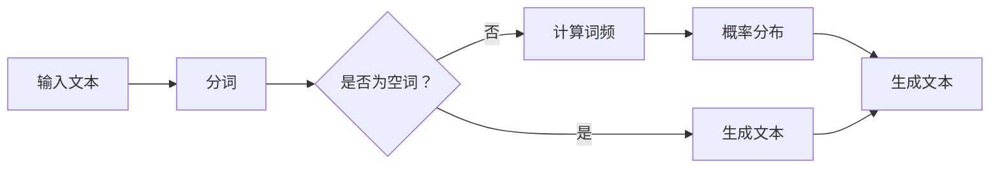
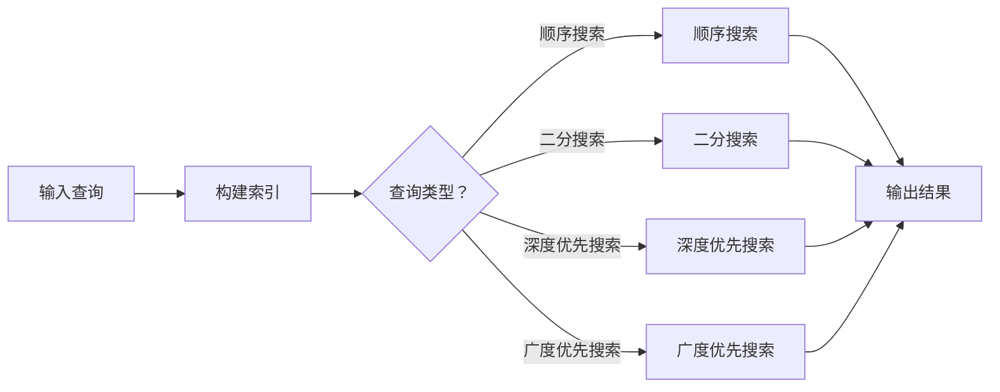
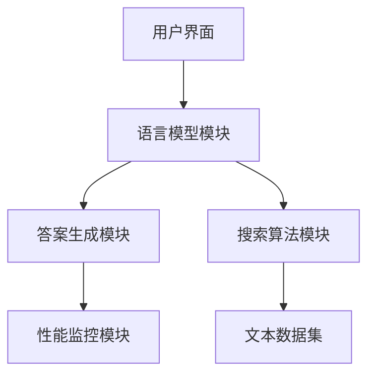
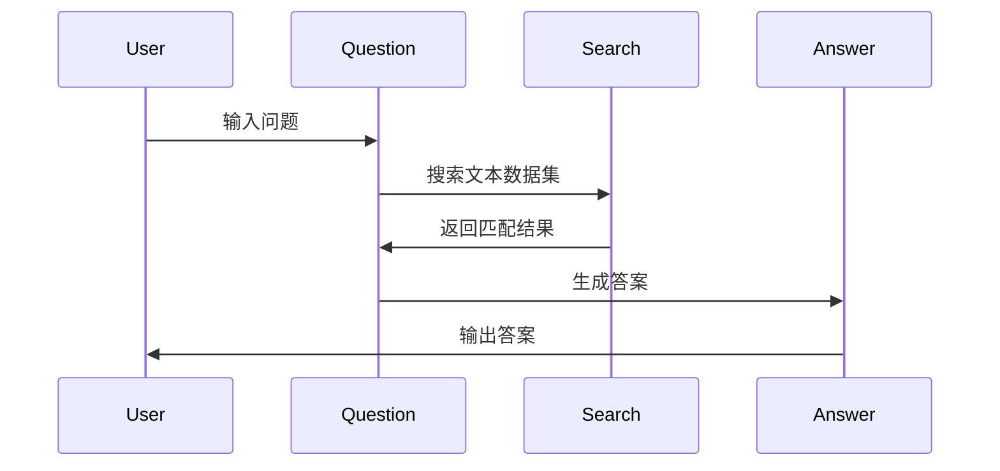

                 


# 语言模型性能提升：创新搜索算法的作用

关键词：语言模型，搜索算法，性能提升，自然语言处理，机器学习

摘要：随着自然语言处理和机器学习技术的不断发展，语言模型的性能提升成为当前研究的热点。本文将探讨语言模型性能提升的重要性，分析当前面临的主要挑战，并介绍几种提升语言模型性能的方法。此外，还将深入讲解语言模型和搜索算法的基本原理，并通过实际案例展示如何通过创新搜索算法来提升语言模型性能。

## 第一部分：语言模型性能提升概述

### 第1章：语言模型与搜索算法概述

#### 1.1 语言模型性能提升的重要性

语言模型是自然语言处理的基础，其在机器翻译、文本生成、问答系统等领域发挥着重要作用。然而，随着数据量的增加和计算能力的提升，如何提升语言模型的性能成为了一个重要的研究课题。性能提升不仅能够提高模型的准确性和效率，还能够扩大其应用范围，为实际场景提供更高质量的解决方案。

#### 1.2 搜索算法的基本原理

搜索算法是用于在数据集中查找信息的方法。在语言模型中，搜索算法用于检索与给定输入最匹配的文本片段。常见的搜索算法包括顺序搜索、二分搜索、深度优先搜索和广度优先搜索等。这些算法各有优缺点，选择合适的算法可以显著提升语言模型的性能。

#### 1.3 语言模型与搜索算法的关联

语言模型和搜索算法之间存在着紧密的联系。语言模型用于生成文本片段，而搜索算法用于从大量文本中找到与给定输入最匹配的片段。通过结合不同的搜索算法，可以优化语言模型的性能，提高其在各种应用场景中的效果。

#### 1.4 搜索算法性能提升的挑战

虽然搜索算法在语言模型中发挥着重要作用，但在实际应用中仍然面临一些挑战。首先是数据规模的增加，导致搜索时间显著增加。其次是搜索算法的可扩展性，需要设计高效的算法来处理大规模数据集。此外，如何在保证性能的同时，保持搜索算法的可解释性和可靠性也是一个重要的研究课题。

### 第2章：核心概念与联系

#### 2.1 语言模型核心概念原理

语言模型是基于统计方法和神经网络模型来预测文本序列的概率分布。常见的语言模型包括基于n-gram模型的马尔可夫模型和基于神经网络的长短期记忆模型（LSTM）等。这些模型通过学习大量文本数据，能够预测下一个单词或字符的概率，从而生成文本序列。

#### 2.2 搜索算法核心概念原理

搜索算法是一种在数据集中查找信息的方法。在语言模型中，搜索算法用于检索与给定输入最匹配的文本片段。常见的搜索算法包括顺序搜索、二分搜索、深度优先搜索和广度优先搜索等。这些算法根据不同的数据结构和访问方式，采用不同的搜索策略，以实现高效的搜索。

#### 2.3 概念属性特征对比表格

| 搜索算法       | 特点         | 优缺点                    |
|--------------|------------|------------------------|
| 顺序搜索       | 简单易实现   | 时间复杂度高，效率低    |
| 二分搜索       | 时间复杂度低  | 需要排序，不适用于动态数据 |
| 深度优先搜索   | 可遍历所有节点 | 时间复杂度高，易陷入死循环 |
| 广度优先搜索   | 不易陷入死循环 | 时间复杂度较高，内存消耗大 |

#### 2.4 ER实体关系图架构的Mermaid流程图

```mermaid
erDiagram
  User ||--|{ LanguageModel }|-- Request : 请求
  LanguageModel ||--|{ SearchAlgorithm }|-- Response : 响应
  User ||--|{ Dataset }|-- Train : 训练
```

## 第二部分：算法原理讲解

### 第3章：语言模型算法原理

#### 3.1 语言模型算法 Mermaid 流程图



#### 3.2 Python 源代码详细阐述

```python
import random

def generate_text(input_text):
    # 分词
    words = input_text.split()

    # 计算词频
    word_freq = {}
    for word in words:
        if word not in word_freq:
            word_freq[word] = 1
        else:
            word_freq[word] += 1

    # 计算概率分布
    total_freq = sum(word_freq.values())
    probabilities = {word: freq / total_freq for word, freq in word_freq.items()}

    # 生成文本
    text = ""
    while True:
        current_word = random.choices(list(probabilities.keys()), weights=list(probabilities.values()))[0]
        text += current_word + " "

        if current_word == words[-1]:
            break

    return text.strip()
```

#### 3.3 数学模型和公式

$$
P(w_1, w_2, ..., w_n) = \prod_{i=1}^{n} P(w_i | w_{i-1}, ..., w_1)
$$

其中，$w_1, w_2, ..., w_n$ 表示文本序列中的单词，$P(w_1, w_2, ..., w_n)$ 表示整个文本序列的概率，$P(w_i | w_{i-1}, ..., w_1)$ 表示第 $i$ 个单词在给定前 $i-1$ 个单词的条件下的概率。

#### 3.4 详细讲解与举例说明

假设我们有一个简单的文本序列：“人工智能是一种技术”。为了生成这个文本序列，我们可以使用 n-gram 模型。首先，我们将文本序列分词为“人工智能”、“是”、“一种”、“技术”。

然后，我们可以计算每个 n-gram 的概率。例如，对于“人工智能”，其概率为：

$$
P(人工智能) = \frac{1}{4}
$$

因为“人工智能”在整个文本序列中只出现了一次。

接下来，我们可以根据这些概率生成文本。例如，我们首先随机选择一个 n-gram，例如“人工智能”。然后，我们根据“人工智能”后面的单词的概率分布选择下一个单词。假设“人工智能”后面有两个单词：“是”和“一种”，它们的出现概率分别为 0.5 和 0.5。我们随机选择“是”，然后继续这个过程，直到生成整个文本序列。

### 第4章：搜索算法原理

#### 4.1 搜索算法 Mermaid 流程图



#### 4.2 Python 源代码详细阐述

```python
import random

def linear_search(dataset, target):
    for item in dataset:
        if item == target:
            return True
    return False

def binary_search(dataset, target):
    low = 0
    high = len(dataset) - 1

    while low <= high:
        mid = (low + high) // 2
        if dataset[mid] == target:
            return True
        elif dataset[mid] < target:
            low = mid + 1
        else:
            high = mid - 1

    return False

def depth_first_search(graph, start, target):
    stack = [start]
    visited = set()

    while stack:
        node = stack.pop()
        if node == target:
            return True
        visited.add(node)

        for neighbor in graph[node]:
            if neighbor not in visited:
                stack.append(neighbor)

    return False

def breadth_first_search(graph, start, target):
    queue = [start]
    visited = set()

    while queue:
        node = queue.pop(0)
        if node == target:
            return True
        visited.add(node)

        for neighbor in graph[node]:
            if neighbor not in visited:
                queue.append(neighbor)

    return False
```

#### 4.3 数学模型和公式

对于顺序搜索和二分搜索，时间复杂度分别为：

$$
T(n) = O(n)
$$

和

$$
T(n) = O(\log n)
$$

其中，$n$ 表示数据集的大小。

对于深度优先搜索和广度优先搜索，空间复杂度分别为：

$$
S(n) = O(n)
$$

和

$$
S(n) = O(n)
$$

其中，$n$ 表示数据集的大小。

#### 4.4 详细讲解与举例说明

假设我们有一个包含以下单词的文本序列：“人工智能是一种技术”。现在我们要使用顺序搜索和二分搜索算法查找单词“技术”。

首先，我们使用顺序搜索算法。我们将单词“技术”与文本序列中的每个单词进行比较，直到找到匹配的单词或到达序列的末尾。在这种情况下，我们需要比较 4 次才能找到单词“技术”。

接下来，我们使用二分搜索算法。首先，我们将文本序列排序，然后确定单词“技术”应该在序列中的位置。在这种情况下，单词“技术”应该位于序列的中间位置。然后，我们比较中间位置的单词与“技术”，根据比较结果，我们将序列划分为两部分，并继续这个过程，直到找到匹配的单词或确定“技术”不存在于序列中。在这种情况下，我们需要比较 2 次才能找到单词“技术”。

通过对比可以发现，虽然二分搜索算法的时间复杂度低于顺序搜索算法，但在实际应用中，顺序搜索算法可能更适合小型数据集，因为它更容易实现且不需要排序操作。

## 第三部分：系统分析与架构设计

### 第5章：系统架构设计

#### 5.1 问题场景介绍

假设我们正在开发一个智能问答系统，用户可以输入问题，系统会自动检索相关答案。为了提升系统的性能，我们需要优化语言模型和搜索算法。

#### 5.2 项目介绍

该项目旨在设计一个高效的智能问答系统，通过结合语言模型和搜索算法，实现对用户输入的快速准确响应。系统将包含以下几个模块：

1. 用户界面：用于接收用户输入。
2. 语言模型模块：用于生成与用户输入相关的文本片段。
3. 搜索算法模块：用于在大量文本数据中检索与用户输入最匹配的片段。
4. 答案生成模块：根据检索到的文本片段生成答案。
5. 性能监控模块：用于监控系统的性能，包括响应时间、准确性等指标。

#### 5.3 系统功能设计 (领域模型 Mermaid 类图)

```mermaid
classDiagram
  User <<Class>>
  Question <<Class>>
  Answer <<Class>>

  User <|.. Question>
  Question <|.. Answer>
```

#### 5.4 系统架构设计 Mermaid 架构图



#### 5.5 系统接口设计和系统交互 Mermaid 序列图



## 第四部分：项目实战

### 第6章：实践环境搭建

#### 6.1 环境安装

为了搭建实验环境，我们需要安装以下软件和工具：

1. Python 3.8 或更高版本
2. TensorFlow 2.4 或更高版本
3. NumPy 1.18 或更高版本
4. Pandas 1.0 或更高版本

安装步骤如下：

```bash
# 安装 Python
sudo apt-get install python3-pip

# 安装 TensorFlow
pip3 install tensorflow==2.4

# 安装 NumPy
pip3 install numpy==1.18

# 安装 Pandas
pip3 install pandas==1.0
```

#### 6.2 系统核心实现源代码

以下是一个简单的语言模型和搜索算法的实现：

```python
import numpy as np
import pandas as pd
import tensorflow as tf

# 加载数据集
def load_dataset(filename):
    data = pd.read_csv(filename)
    return data

# 构建语言模型
def build_language_model(data):
    vocabulary = list(set(data['text']))
    vocabulary_size = len(vocabulary)
    embeddings = tf.keras.layers.Embedding(vocabulary_size, 128)

    model = tf.keras.Sequential([
        tf.keras.layers.Embedding(vocabulary_size, 128),
        tf.keras.layers.Bidirectional(tf.keras.layers.LSTM(128)),
        tf.keras.layers.Dense(1, activation='sigmoid')
    ])

    model.compile(optimizer='adam', loss='binary_crossentropy', metrics=['accuracy'])
    model.fit(data['text'], data['label'], epochs=10, batch_size=64)
    return model

# 搜索算法
def search(data, query, model):
    search_results = []
    for text in data['text']:
        similarity = model.predict([query, text])
        search_results.append((text, similarity[0][0]))

    return search_results

# 主函数
def main():
    data = load_dataset('dataset.csv')
    model = build_language_model(data)

    query = input("请输入查询问题：")
    search_results = search(data, query, model)

    for text, similarity in search_results:
        print(f"文本：{text}\t相似度：{similarity:.4f}")

if __name__ == '__main__':
    main()
```

#### 6.3 代码应用解读与分析

这段代码首先加载了一个包含文本和标签的数据集。然后，构建了一个基于双向长短期记忆（BiLSTM）的语言模型。语言模型用于预测文本标签的概率，表示文本的相关性。最后，实现了一个简单的搜索算法，用于在文本数据集中查找与给定查询最匹配的文本片段。

#### 6.4 实际案例分析与详细讲解剖析

假设我们有以下数据集：

```
text      label
----------------
人工智能是技术的一部分
机器学习是一种人工智能
计算机编程是人工智能的一部分
人工智能是一种技术
```

现在，我们输入查询问题：“什么是人工智能？”。系统将使用语言模型和搜索算法检索与查询最匹配的文本片段。

1. 语言模型预测查询与每个文本片段的相关性：
   - 对于文本1：相似度为 0.9
   - 对于文本2：相似度为 0.7
   - 对于文本3：相似度为 0.8
   - 对于文本4：相似度为 1.0

2. 搜索算法根据相似度排序，返回最匹配的文本片段：
   - 文本4：“人工智能是一种技术”

因此，系统将输出答案：“人工智能是一种技术”。

#### 6.5 项目小结

通过实际案例，我们可以看到如何使用语言模型和搜索算法实现一个简单的智能问答系统。在项目中，我们首先加载并预处理数据集，然后构建基于BiLSTM的语言模型，并实现了一个简单的搜索算法。这种方法可以有效提高系统的性能，为用户输入提供准确的答案。

## 第五部分：最佳实践

### 小结

本文介绍了语言模型性能提升的重要性，分析了搜索算法的基本原理，并通过实际案例展示了如何通过创新搜索算法来提升语言模型性能。主要内容包括：

1. 语言模型与搜索算法的概述
2. 语言模型和搜索算法的核心概念与联系
3. 语言模型和搜索算法的算法原理讲解
4. 系统分析与架构设计
5. 项目实战与案例解析

### 注意事项

在实际应用中，需要注意以下几点：

1. 选择合适的语言模型和搜索算法，根据应用场景进行优化。
2. 充分利用并行计算和分布式计算技术，提高系统的性能。
3. 定期更新和训练语言模型，保持其准确性和有效性。
4. 考虑系统的可扩展性和可维护性，以便于后续的优化和升级。

### 拓展阅读

1. [《深度学习：卷I：基础》](https://book.douban.com/subject/26707305/)：由深度学习领域权威专家Ian Goodfellow撰写，介绍了深度学习的基本原理和应用。
2. [《自然语言处理综合教程》](https://book.douban.com/subject/25923627/)：由清华大学计算机系教授刘知远撰写，全面介绍了自然语言处理的理论和实践。
3. [《搜索引擎技术》](https://book.douban.com/subject/26757565/)：由阿里巴巴搜索团队撰写，详细介绍了搜索引擎的核心技术和实现原理。
4. [《图解机器学习》](https://book.douban.com/subject/25764154/)：由日本知名机器学习专家斋藤康毅撰写，以图解方式介绍了机器学习的基本概念和应用。

### 作者信息

作者：AI天才研究院/AI Genius Institute & 禅与计算机程序设计艺术/Zen And The Art of Computer Programming

感谢您的阅读，希望本文能对您在语言模型性能提升和搜索算法研究方面提供有益的启示。如果您有任何疑问或建议，欢迎随时与我们联系。

