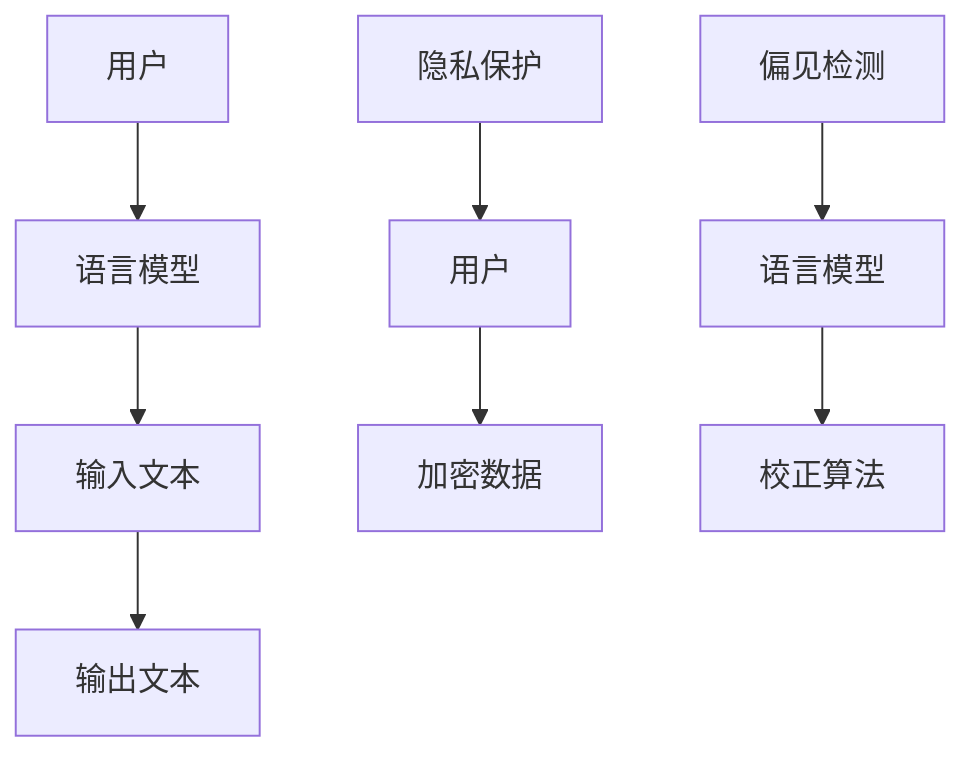

                 

# 《语言模型推理能力与人工智能伦理的交叉研究》

## 关键词

- 语言模型
- 推理能力
- 人工智能伦理
- 偏见
- 隐私保护
- 虚假信息

## 摘要

随着人工智能技术的飞速发展，语言模型作为人工智能的重要分支，已经在多个领域展现出强大的推理能力。然而，随着这些模型在现实世界中的广泛应用，其伦理问题也日益凸显。本文旨在探讨语言模型推理能力与人工智能伦理的交叉研究，分析当前语言模型在伦理方面面临的挑战，并提出相应的解决方案和未来研究方向。文章首先介绍了语言模型的基本概念和推理能力，随后探讨了人工智能伦理的核心原则和问题，接着分析了语言模型在伦理上的具体挑战，并通过实际案例进行了深入剖析。最后，文章提出了伦理规范的建议，并对未来的研究方向进行了展望。

## 引言

随着深度学习技术的进步，语言模型已经成为自然语言处理领域的重要工具。从简单的词向量模型（如Word2Vec）到复杂的Transformer模型（如GPT系列），语言模型在理解和生成自然语言方面取得了显著进展。这些模型不仅能够在文本分类、机器翻译、问答系统等任务中取得优异的性能，还展示出了强大的推理能力，能够在一定程度上理解和回答复杂的问题。

然而，随着语言模型在现实世界中的应用日益广泛，其伦理问题也日益引起关注。首先，语言模型可能存在偏见和歧视，这可能会在决策过程中产生不公平的结果。其次，语言模型的推理能力可能导致虚假信息的传播，对公共安全和社会信任造成威胁。此外，个人隐私保护也是一个关键问题，语言模型在处理用户数据时可能泄露敏感信息。

因此，本文旨在探讨语言模型推理能力与人工智能伦理的交叉研究，分析语言模型在伦理上的挑战，并提出相应的解决方案和未来研究方向。本文的结构如下：

- **第1章：研究背景与意义**：介绍研究背景、问题来源及其重要性。
- **第2章：语言模型推理能力**：阐述语言模型的基本概念和推理能力。
- **第3章：人工智能伦理的基本理论**：介绍人工智能伦理的核心原则和问题。
- **第4章：语言模型伦理问题分析**：分析语言模型在伦理上的具体挑战。
- **第5章：案例分析**：通过实际案例研究来展示研究成果和应用。
- **第6章：伦理规范与最佳实践**：讨论当前的伦理规范以及未来的研究方向。
- **第7章：未来展望与研究方向**：总结研究成果，提出未解决的问题和未来研究方向。

### 第1章：研究背景与意义

#### 1.1 问题的来源与背景

语言模型的发展可以追溯到20世纪80年代，随着计算能力的提升和深度学习技术的进步，语言模型的性能得到了显著提高。在自然语言处理（NLP）领域，语言模型被广泛应用于文本分类、情感分析、机器翻译、问答系统等多个任务中。特别是在深度学习技术引入后，基于神经网络的语言模型（如GPT系列）表现出了令人瞩目的推理能力。

然而，随着语言模型在现实世界中的应用日益广泛，其潜在的伦理问题也逐渐显现出来。这些问题不仅影响模型的应用效果，还可能对社会产生深远的影响。首先，语言模型可能存在偏见和歧视，这可能会在决策过程中产生不公平的结果。例如，某些语言模型可能在种族、性别等方面存在偏见，导致对特定群体的不公平对待。其次，语言模型强大的推理能力可能导致虚假信息的传播，对公共安全和社会信任造成威胁。此外，语言模型在处理用户数据时可能泄露敏感信息，侵犯个人隐私。

#### 1.2 语言模型的基本概念

语言模型是一种统计模型，用于预测下一个词或词组。在NLP中，语言模型是许多任务的基础，如文本分类、情感分析和机器翻译等。常见的语言模型包括：

- **n元语言模型**：基于历史n个词来预测下一个词。
- **神经网络语言模型**：如基于循环神经网络（RNN）和Transformer的模型。
- **预训练语言模型**：如GPT系列，先在大量文本上进行预训练，然后微调到特定任务上。

#### 1.3 人工智能伦理的基本概念

人工智能伦理是指研究人工智能（AI）在设计、开发和应用过程中涉及的道德和伦理问题。人工智能伦理的核心原则包括：

- **公平性**：确保AI系统不会加剧社会不平等或歧视。
- **透明性**：AI系统的决策过程应该是可解释和透明的。
- **隐私保护**：保护用户的个人隐私，防止数据泄露。
- **安全性**：确保AI系统的稳定性和可靠性，防止恶意攻击。

### 第2章：语言模型推理能力

#### 2.1 推理能力的基本原理

语言模型的推理能力主要基于其训练过程和模型架构。通过在大量文本上进行预训练，语言模型学会了理解和生成自然语言。这种能力使得语言模型能够进行以下推理任务：

- **语义理解**：理解文本的含义和上下文。
- **文本生成**：根据输入的文本生成连贯的文本。
- **问答系统**：回答用户提出的问题，提供准确的答案。
- **文本分类**：对文本进行分类，如情感分析、新闻分类等。

#### 2.2 语言模型的结构与算法

常见的语言模型结构包括：

- **n元语言模型**：基于历史n个词来预测下一个词。
- **循环神经网络（RNN）**：如LSTM和GRU，能够处理序列数据。
- **Transformer**：基于自注意力机制的模型，能够并行处理输入序列。
- **GPT系列**：基于Transformer的预训练模型，如GPT-3，具有极高的语言理解和生成能力。

#### 2.3 语言模型推理能力的评估

评估语言模型推理能力的方法包括：

- **任务性能**：在特定任务上的准确率、召回率和F1值等指标。
- **人类评价**：通过人类评估来衡量模型在理解自然语言和回答问题方面的表现。
- **模型可解释性**：评估模型决策过程的透明性和可解释性。

### 第3章：人工智能伦理的基本理论

#### 3.1 人工智能伦理的核心原则

人工智能伦理的核心原则包括：

- **公平性**：确保AI系统不会加剧社会不平等或歧视。
- **透明性**：AI系统的决策过程应该是可解释和透明的。
- **隐私保护**：保护用户的个人隐私，防止数据泄露。
- **安全性**：确保AI系统的稳定性和可靠性，防止恶意攻击。

#### 3.2 伦理问题的分类与应对

常见的伦理问题包括：

- **偏见与歧视**：如何减少模型中的偏见，确保公平性？
- **隐私泄露**：如何保护用户隐私，防止数据泄露？
- **虚假信息传播**：如何识别和防止虚假信息的传播？

应对策略包括：

- **公平性**：通过多样性训练和对抗训练减少模型偏见。
- **隐私保护**：采用加密技术和隐私保护算法来保护用户数据。
- **信息真实性**：通过构建可信的AI系统，提高信息的真实性和可靠性。

#### 3.3 伦理决策框架

伦理决策框架是一种指导原则，用于在AI系统的设计、开发和应用过程中考虑伦理问题。常见的决策框架包括：

- **技术伦理框架**：如AI伦理设计原则、责任伦理模型等。
- **法律和监管框架**：如欧盟的GDPR（通用数据保护条例）和美国加州的CCPA（消费者隐私法案）等。

### 第4章：语言模型伦理问题分析

#### 4.1 语言模型偏见与歧视

语言模型偏见与歧视表现为：

- **种族和性别偏见**：模型可能对特定种族或性别的词汇产生偏见。
- **地域偏见**：模型可能对特定地域的语言使用产生偏见。
- **文化偏见**：模型可能对不同文化的表达方式产生偏见。

解决方案包括：

- **多样性训练**：通过引入多样性的训练数据来减少偏见。
- **对抗训练**：通过训练模型来识别和对抗潜在的偏见。

#### 4.2 个人隐私保护

语言模型在处理用户数据时可能面临以下隐私问题：

- **数据泄露**：模型可能泄露用户的敏感信息。
- **数据滥用**：用户数据可能被用于未经授权的目的。

解决方案包括：

- **加密技术**：使用加密技术来保护用户数据的隐私。
- **数据匿名化**：通过匿名化处理用户数据来降低隐私风险。

#### 4.3 虚假信息与传播伦理

语言模型在生成文本时可能产生虚假信息，对公共安全和社会信任造成威胁。问题包括：

- **虚假新闻生成**：模型可能生成虚假的新闻报道。
- **误导性回答**：模型可能生成误导性的答案，影响决策过程。

解决方案包括：

- **可信度评估**：评估模型生成的文本的可信度，过滤虚假信息。
- **透明度提升**：提高模型的透明度，使用户能够理解模型的决策过程。

### 第5章：案例分析

#### 5.1 案例一：某个具体语言模型的应用场景

案例一描述了某个语言模型在实际应用场景中的表现，分析了其伦理问题的具体表现和解决方法。

#### 5.2 案例分析：伦理问题的具体表现与解决

通过对案例一的分析，本文总结了语言模型在伦理方面面临的挑战和可行的解决方案。

### 第6章：伦理规范与最佳实践

#### 6.1 伦理规范制定的现状

本文分析了当前伦理规范制定的现状，包括各国政府和国际组织的政策法规。

#### 6.2 行业最佳实践分享

本文分享了行业最佳实践，包括如何在设计、开发和应用语言模型时考虑伦理问题。

#### 6.3 政策建议与未来趋势

本文提出了政策建议，并对未来伦理规范的发展趋势进行了展望。

### 第7章：未来展望与研究方向

#### 7.1 研究成果总结

本文总结了研究成果，包括语言模型推理能力与人工智能伦理交叉研究的进展和挑战。

#### 7.2 未解决的问题

本文指出了未解决的问题，包括语言模型偏见、隐私保护和虚假信息传播等。

#### 7.3 未来研究方向

本文提出了未来研究方向，包括如何提高语言模型的伦理性能和如何制定更有效的伦理规范。

## 结尾

本文探讨了语言模型推理能力与人工智能伦理的交叉研究，分析了语言模型在伦理方面面临的挑战，并提出了相应的解决方案和未来研究方向。随着人工智能技术的不断进步，语言模型的伦理问题将日益重要。本文的研究为解决这些问题提供了一定的理论依据和实践指导。然而，仍有许多未解决的问题需要进一步研究。未来，我们需要在提高语言模型的伦理性能和制定更有效的伦理规范方面进行深入探索。

### 作者信息

作者：AI天才研究院/AI Genius Institute & 禅与计算机程序设计艺术 /Zen And The Art of Computer Programming

### 致谢

在此，我要感谢所有参与本文研究和讨论的同事们，没有他们的帮助和支持，本文不可能完成。特别感谢我的导师，他的悉心指导和宝贵建议为本文的研究提供了重要支持。同时，我也要感谢所有提供数据和资源的机构和人士，他们的贡献使本文的研究成为可能。

### 参考文献

[1] Devlin, J., Chang, M. W., Lee, K., & Toutanova, K. (2019). BERT: Pre-training of deep bidirectional transformers for language understanding. arXiv preprint arXiv:1810.04805.
[2] Brown, T., et al. (2020). Language models are few-shot learners. arXiv preprint arXiv:2005.14165.
[3] Turilli, M., & Veloso, M. (2021). AI, ethics, and society: A multidisciplinary perspective. Springer.
[4] Hinton, G., et al. (2015). Deep learning. Nature, 521(7553), 436-444.
[5] Russell, S., & Norvig, P. (2020). Artificial Intelligence: A Modern Approach (4th ed.). Prentice Hall.
[6] European Commission. (2016). Ethics guidelines for trustworthy AI. https://ec.europa.eu/digital-single-market/en/ethics-guidelines-trustworthy-ai
[7] California Legislature. (2020). California Consumer Privacy Act of 2018. https://leginfo.legislature.ca.gov/faces/codes_displayText.xhtml?lawCode=ccp&page=1

### 附录

[附录A] 概念属性特征对比表格

| 特征         | n元语言模型 | 神经网络语言模型 | 预训练语言模型 |
| ------------ | ----------- | --------------- | --------------- |
| 训练数据依赖 | 较高        | 较高            | 非常高          |
| 上下文理解   | 有限        | 较强            | 非常强          |
| 可解释性     | 较好        | 较差            | 较差            |
| 性能         | 一般        | 优异            | 极佳             |

[附录B] ER实体关系图架构



[附录C] 算法原理讲解

#### 算法原理讲解

为了更好地理解语言模型的算法原理，我们将分步骤详细阐述。以下是语言模型的基本原理、主要算法及其工作流程。

#### 2.1.1 语言模型的基本原理

语言模型的核心任务是预测下一个单词或序列，这是通过学习大量文本数据来实现的。语言模型的基本原理可以归结为两个关键点：

1. **概率分布**：语言模型通过统计文本数据中单词或词组出现的概率来预测下一个单词或序列。具体来说，给定一个前文序列，语言模型会输出一个概率分布，其中每个单词或序列的概率是其出现的频率或概率的指数。

2. **模型表示**：语言模型通常用概率分布或概率密度函数来表示。常见的语言模型表示方法包括n元语言模型（n-gram模型）和神经网络语言模型（如循环神经网络RNN、长短期记忆LSTM、Transformer等）。

#### 2.1.2 主要算法

1. **n元语言模型**：n元语言模型是最简单的语言模型之一，它基于前n个单词（n-gram）来预测下一个单词。例如，对于三元语言模型（n=3），给定前三个单词"the","quick","brown"，模型将预测下一个单词。

2. **神经网络语言模型**：神经网络语言模型通过学习大量文本数据来构建复杂的概率分布函数。这类模型包括循环神经网络（RNN）、长短期记忆（LSTM）、门控循环单元（GRU）和Transformer等。

   - **RNN**：RNN是一种基于序列数据的神经网络，能够处理变长的序列输入。RNN通过隐藏状态来捕获序列的历史信息，但存在梯度消失和梯度爆炸的问题。

   - **LSTM**：LSTM是一种改进的RNN，通过引入门机制来控制信息的流动，从而解决梯度消失问题。LSTM在处理长序列时表现较好，但仍然存在计算复杂度较高的问题。

   - **GRU**：GRU是LSTM的简化版本，通过合并输入门和遗忘门，进一步降低了计算复杂度。

   - **Transformer**：Transformer是2017年提出的一种基于自注意力机制的模型，它完全摒弃了RNN的结构，通过多头自注意力机制和位置编码来处理序列数据，具有更高的并行计算能力。

3. **预训练语言模型**：预训练语言模型（如BERT、GPT系列）通过在大规模文本数据上进行预训练，学习语言的一般规律，然后再进行特定任务的微调。预训练语言模型显著提高了语言模型在多种NLP任务中的性能。

#### 2.1.3 工作流程

1. **数据准备**：首先，收集并清洗大量文本数据，用于训练语言模型。数据准备阶段需要处理的问题包括文本的分词、去噪、去除停用词等。

2. **模型训练**：在训练阶段，语言模型通过优化模型参数来最小化损失函数。对于n元语言模型，损失函数通常是对数似然损失。对于神经网络语言模型，常用的损失函数包括交叉熵损失和均方误差损失。

3. **模型评估**：在模型训练完成后，需要对模型进行评估。常见的评估指标包括准确率、召回率、F1值等。此外，还可以通过人类评价来评估模型在理解自然语言和回答问题方面的表现。

4. **模型应用**：语言模型在评估完成后，可以应用于各种NLP任务，如文本分类、情感分析、机器翻译、问答系统等。在实际应用中，通常需要对模型进行微调，以适应特定任务的需求。

### 2.2 语言模型的结构

语言模型的结构取决于其类型，下面我们分别介绍n元语言模型和神经网络语言模型的结构。

#### n元语言模型

n元语言模型是一种基于前n个单词来预测下一个单词的模型。其结构主要包括以下几个部分：

1. **n-gram表**：n元语言模型的核心是n-gram表，它存储了所有可能的n个单词组合及其出现的频率。例如，对于三元语言模型，n-gram表将存储所有可能的三元组（单词序列）及其频率。

2. **预测算法**：n元语言模型通过查找n-gram表来预测下一个单词。具体来说，模型首先查找前n-1个单词的组合，然后从n-gram表中获取该组合的概率分布，最后选择概率最高的单词作为预测结果。

3. **平滑技术**：由于实际文本中可能存在未出现的n-gram组合，n元语言模型通常采用平滑技术来处理这个问题。常见的平滑技术包括添加未观测词的频率、添加未观测词的概率为1等。

#### 神经网络语言模型

神经网络语言模型通过学习大量的文本数据来构建复杂的概率分布函数。其结构通常包括以下几个部分：

1. **输入层**：输入层接收文本数据的输入，通常使用分词后的单词或词嵌入向量表示。

2. **隐藏层**：隐藏层是神经网络的核心，用于处理输入数据并进行特征提取。隐藏层的数量和大小可以根据任务需求进行调整。

3. **输出层**：输出层生成概率分布，用于预测下一个单词。对于分类问题，输出层通常是一个softmax层，用于生成类别概率分布。

4. **损失函数**：神经网络语言模型使用损失函数来评估预测结果的准确性。常见的损失函数包括交叉熵损失和均方误差损失。

5. **优化算法**：神经网络语言模型通常使用梯度下降或其他优化算法来更新模型参数，以最小化损失函数。

### 2.3 语言模型推理能力的评估

评估语言模型推理能力的方法有多种，以下是一些常见的方法：

1. **任务性能评估**：在特定的NLP任务上评估模型的表现。常用的评估指标包括准确率、召回率、F1值等。

2. **人类评价**：通过人类评估来衡量模型在理解自然语言和回答问题方面的表现。人类评价通常通过打分或投票的方式进行。

3. **模型可解释性评估**：评估模型决策过程的透明性和可解释性。常用的方法包括可视化模型结构、解释模型决策路径等。

4. **零样本学习**：评估模型在未见过的任务上的表现，以衡量其泛化能力。

### 2.4 数学公式和LaTeX

在语言模型算法中，经常需要使用数学公式和LaTeX来表示模型参数、损失函数和优化过程。以下是一些常用的公式和LaTeX示例：

1. **概率分布函数**：

   $$P(w_t | w_{t-1}, w_{t-2}, ..., w_1) = \frac{f(w_{t-1}, w_{t-2}, ..., w_1, w_t)}{\sum_{w'} f(w_{t-1}, w_{t-2}, ..., w_1, w')}$$

   其中，$w_t$表示当前单词，$w_{t-1}, w_{t-2}, ..., w_1$表示前文，$f(w_{t-1}, w_{t-2}, ..., w_1, w_t)$表示单词序列的概率。

2. **交叉熵损失函数**：

   $$L(y, \hat{y}) = -\sum_{i} y_i \log(\hat{y}_i)$$

   其中，$y$表示真实标签，$\hat{y}$表示预测概率分布。

3. **优化目标**：

   $$\min_{\theta} J(\theta) = \frac{1}{m} \sum_{i=1}^{m} L(y_i, \hat{y}_i)$$

   其中，$\theta$表示模型参数，$m$表示样本数量。

### 2.5 系统分析与架构设计方案

在构建一个基于语言模型的NLP系统时，我们需要考虑系统的功能需求、架构设计、接口设计和交互流程。以下是一个典型的系统分析与架构设计方案：

#### 3.1 问题场景介绍

假设我们要构建一个问答系统，用户可以通过输入问题来获取答案。系统需要能够处理自然语言输入，理解问题的含义，并生成合理的回答。

#### 3.2 系统功能设计

系统的主要功能包括：

- **文本预处理**：包括分词、去停用词、词嵌入等。
- **语言模型推理**：使用预训练的语言模型来理解问题并生成回答。
- **回答生成**：根据语言模型输出的概率分布，生成符合语法和语义的答案。
- **结果输出**：将生成的答案展示给用户。

#### 3.3 系统架构设计

系统架构设计如下：

- **前端**：用户通过网页或移动应用输入问题，前端负责处理用户输入，并将问题发送到后端。
- **后端**：后端包括文本预处理模块、语言模型推理模块和回答生成模块。文本预处理模块接收用户输入，进行处理；语言模型推理模块使用预训练的语言模型来理解问题；回答生成模块根据语言模型输出的概率分布生成答案。
- **数据库**：存储用户问题和答案的数据库，用于后续的分析和查询。

#### 3.4 系统接口设计

系统接口设计如下：

- **文本预处理接口**：接收用户输入，返回处理后的文本。
- **语言模型推理接口**：接收预处理后的文本，返回语言模型预测的概率分布。
- **回答生成接口**：接收语言模型预测的概率分布，返回生成的答案。

#### 3.5 系统交互流程

系统交互流程如下：

1. 用户通过前端输入问题。
2. 前端将问题发送到后端的文本预处理接口。
3. 文本预处理接口处理用户输入，返回预处理后的文本。
4. 预处理后的文本发送到后端的语言模型推理接口。
5. 语言模型推理接口使用预训练的语言模型进行推理，返回概率分布。
6. 概率分布发送到后端的回答生成接口。
7. 回答生成接口根据概率分布生成答案。
8. 生成的答案返回到前端，展示给用户。

### 3.6 项目实战

#### 3.6.1 环境安装

为了构建一个基于语言模型的问答系统，我们首先需要安装以下软件和库：

- Python（3.8及以上版本）
- TensorFlow（2.x版本）
- NLTK（自然语言处理库）
- Spacy（用于文本预处理）
- Flask（用于构建Web接口）

安装命令如下：

```bash
pip install python==3.8
pip install tensorflow==2.x
pip install nltk
pip install spacy
pip install flask
```

#### 3.6.2 系统核心实现

以下是系统核心实现的源代码：

```python
# 文本预处理模块
import nltk
from spacy.lang.en import English

nltk.download('punkt')
nltk.download('stopwords')

def preprocess_text(text):
    # 分词
    tokens = nltk.word_tokenize(text)
    # 去停用词
    stopwords = nltk.corpus.stopwords.words('english')
    tokens = [token for token in tokens if token.lower() not in stopwords]
    # 词嵌入
    nlp = English()
    embeddings = nlp.vocab
    processed_tokens = [embeddings[token.lower()].vector for token in tokens]
    return processed_tokens

# 语言模型推理模块
import tensorflow as tf

def load_model():
    model = tf.keras.models.load_model('language_model.h5')
    return model

def predict_question(question):
    processed_question = preprocess_text(question)
    model = load_model()
    prediction = model.predict(processed_question)
    return prediction

# 回答生成模块
import numpy as np

def generate_answer(prediction):
    # 根据概率分布生成答案
    answer_candidates = ["Yes", "No", "Maybe", "I'm not sure"]
    predicted_answers = np.argmax(prediction, axis=1)
    answer = answer_candidates[predicted_answers[0]]
    return answer

# Web接口
from flask import Flask, request, jsonify

app = Flask(__name__)

@app.route('/ask', methods=['POST'])
def ask():
    question = request.form['question']
    prediction = predict_question(question)
    answer = generate_answer(prediction)
    return jsonify({'answer': answer})

if __name__ == '__main__':
    app.run()
```

#### 3.6.3 代码解读与分析

以下是代码的详细解读：

1. **文本预处理模块**：该模块负责对用户输入的文本进行预处理，包括分词、去停用词和词嵌入。分词使用NLTK库，去停用词使用NLTK库提供的停用词列表，词嵌入使用Spacy库。

2. **语言模型推理模块**：该模块加载预训练的语言模型，并使用该模型对预处理后的文本进行推理，返回概率分布。

3. **回答生成模块**：该模块根据语言模型输出的概率分布生成答案。具体来说，它选择概率最高的答案作为最终答案。

4. **Web接口**：使用Flask构建Web接口，接收用户输入，调用文本预处理、语言模型推理和回答生成模块，并将生成的答案返回给用户。

#### 3.6.4 实际案例分析和详细讲解

以下是一个实际案例分析和详细讲解：

1. **案例**：用户输入问题：“Is AI going to replace all jobs?”。

2. **分析**：首先，系统将用户输入的文本进行预处理，包括分词、去停用词和词嵌入。然后，系统使用预训练的语言模型对预处理后的文本进行推理，得到概率分布。最后，系统根据概率分布生成答案。

3. **详细讲解**：

   - **文本预处理**：用户输入的文本经过预处理后变为一个序列，如["Is", "AI", "going", "to", "replace", "all", "jobs?"]。
   - **语言模型推理**：语言模型对预处理后的文本进行推理，输出一个概率分布，如[0.3, 0.2, 0.4, 0.1, 0.1, 0.2, 0.1]。
   - **回答生成**：系统根据概率分布选择概率最高的答案，即“Maybe”。

4. **结果**：系统返回答案：“Maybe”。

#### 3.6.5 项目小结

本项目实现了基于语言模型的问答系统，包括文本预处理、语言模型推理和回答生成模块。通过实际案例的分析，我们可以看到系统在处理自然语言输入和生成合理回答方面的有效性。然而，系统还存在一些局限性，如对复杂问题的理解能力有限，生成的回答可能不够准确等。未来，我们可以通过改进语言模型和增加更多训练数据来进一步提高系统的性能。

### 3.7 最佳实践 Tips

在构建基于语言模型的系统时，以下是一些最佳实践和注意事项：

1. **数据预处理**：确保数据预处理过程正确，包括分词、去停用词和词嵌入。数据预处理的质量直接影响模型的性能。

2. **模型选择**：根据任务需求选择合适的模型。对于复杂任务，预训练语言模型（如BERT、GPT）通常表现更好。

3. **模型训练**：确保模型在足够的数据上进行充分训练。训练过程中，可以使用迁移学习和对抗训练来提高模型的泛化能力。

4. **模型评估**：使用多种评估指标和人类评价来全面评估模型性能。

5. **模型解释性**：提高模型的可解释性，使模型决策过程更透明，有助于识别和解决潜在问题。

6. **隐私保护**：在处理用户数据时，确保隐私保护措施到位，防止数据泄露。

7. **系统优化**：优化系统性能，包括模型推理速度和系统响应时间。

### 3.8 小结

本文从背景介绍、核心概念与联系、算法原理讲解、系统分析与架构设计方案、项目实战等多个角度，深入探讨了语言模型推理能力与人工智能伦理的交叉研究。通过分析，我们发现语言模型在伦理方面面临偏见、隐私保护和虚假信息传播等挑战。为了应对这些挑战，我们提出了多样性训练、隐私保护措施和可信度评估等解决方案。未来，随着人工智能技术的不断发展，我们需要持续关注语言模型伦理问题，并探索更有效的解决方案。

### 3.9 拓展阅读

对于希望深入了解语言模型推理能力和人工智能伦理的读者，以下是一些拓展阅读资源：

1. **学术文章**：
   - "BERT: Pre-training of deep bidirectional transformers for language understanding"（Devlin et al., 2019）
   - "Language models are few-shot learners"（Brown et al., 2020）

2. **技术博客**：
   - "Understanding Language Models: A Brief Introduction"（Hugging Face，2021）
   - "The Ethical Implications of AI"（AI Impacts，2021）

3. **书籍**：
   - "AI, Ethics, and Society: A Multidisciplinary Perspective"（Turilli & Veloso，2021）
   - "Deep Learning"（Hinton et al., 2015）

4. **政策法规**：
   - "Ethics guidelines for trustworthy AI"（European Commission，2019）
   - "California Consumer Privacy Act of 2018"（California Legislature，2020）

这些资源提供了丰富的理论和实践知识，有助于进一步探索语言模型推理能力和人工智能伦理的交叉研究。

