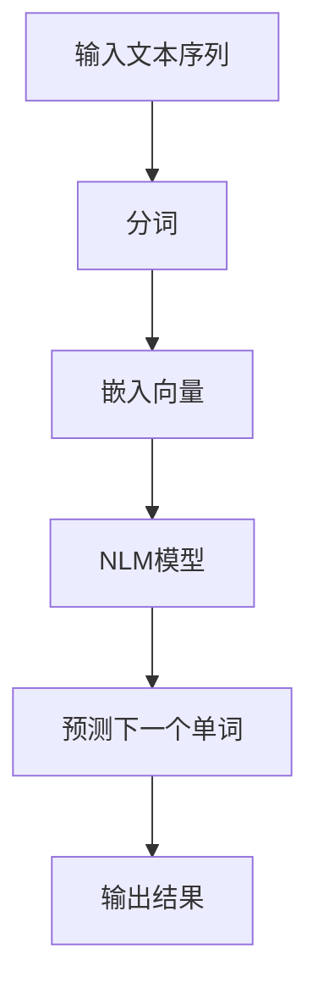
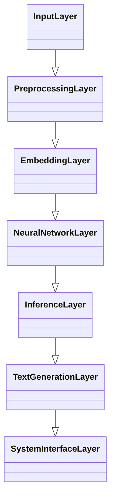
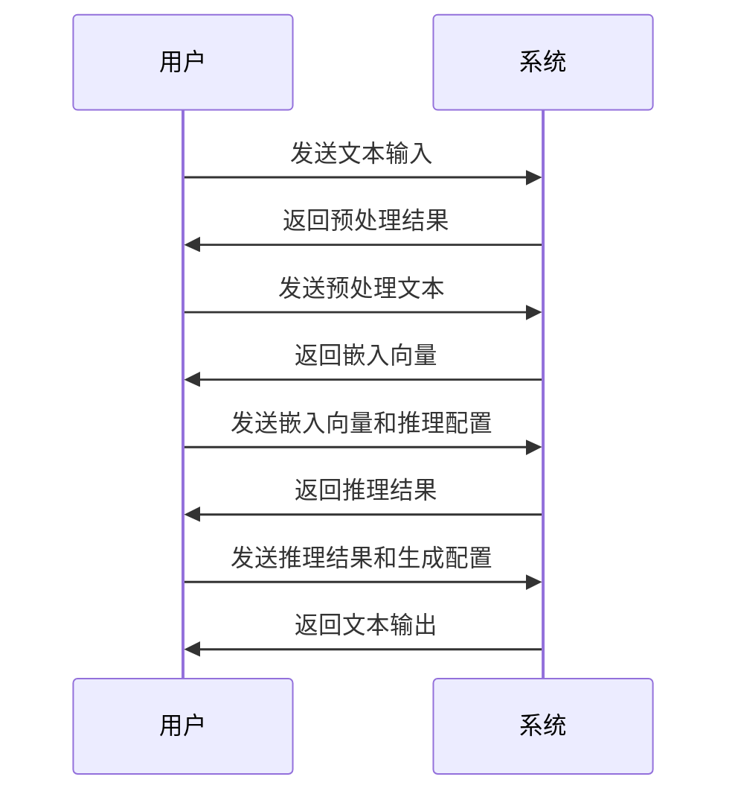
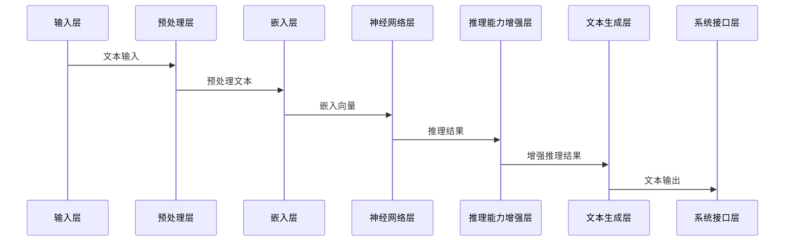

                 


## 引言

在当今数字化时代，人工智能（AI）技术正以前所未有的速度发展，并在各个领域展现出巨大的潜力。尤其是语言模型，作为一种特殊的AI模型，其在自然语言处理（NLP）中的应用尤为广泛，从智能客服到机器翻译，从文本生成到情感分析，语言模型正逐步改变着我们的生活方式。然而，随着语言模型的广泛应用，对其内部工作机制的深入理解成为了关键问题。本文将探讨语言模型推理能力与认知灵活性之间的关系，旨在揭示这一核心问题背后的奥秘。

### 文章关键词

本文关键词包括：语言模型、推理能力、认知灵活性、自然语言处理（NLP）、AI、算法原理、数学模型、系统架构、项目实战、案例分析。

### 文章摘要

本文首先介绍了语言模型、推理能力、认知灵活性的基本概念及其在现代科技中的应用背景。接着，通过深入分析这三个核心概念之间的联系，探讨了它们在语言模型中的作用机制。随后，本文详细讲解了语言模型推理能力的算法原理和数学模型，并通过Python源代码进行了实例说明。然后，文章提出了一个系统分析与架构设计方案，并进行了实际项目实战与案例分析。最后，本文总结了最佳实践，提出了注意事项，并提供了拓展阅读建议。

----------------------------------------------------------------

## 第一部分：研究背景与核心概念

### 1.1 问题背景

语言模型、推理能力、认知灵活性这三个概念在人工智能领域扮演着重要的角色。语言模型是一种用于预测文本序列的统计模型，其广泛应用于自然语言处理（NLP）任务中。推理能力是人工智能系统中的一种核心能力，它使系统能够从已知信息中推断出新的信息。认知灵活性则是指个体在面对不同情境时调整思维和行为的能力，它在人类认知过程中起着关键作用。

随着深度学习技术的发展，语言模型在NLP任务中取得了显著的成果。然而，尽管语言模型在处理自然语言方面表现出色，但对其内部推理过程的理解仍然有限。此外，认知灵活性作为人类的一种重要认知能力，如何将其引入到人工智能系统中，也是一个值得探讨的问题。因此，研究语言模型推理能力与认知灵活性之间的关系，有助于我们更深入地理解人工智能系统的运作机制，并为未来的发展提供理论依据。

### 1.2 核心概念

#### 1.2.1 语言模型

语言模型（Language Model）是一种用于预测文本序列的概率模型。它通过学习大量文本数据，生成文本的概率分布，从而实现文本生成、翻译、摘要等任务。语言模型的基本概念包括：

- **N-gram模型**：一种简单的语言模型，它假设当前词的概率仅与前面N-1个词相关。
- **神经网络语言模型**：一种基于神经网络的复杂语言模型，它通过多层神经网络学习文本数据的概率分布。

语言模型的关键特征包括：

- **上下文依赖**：语言模型能够考虑上下文信息，从而提高预测准确性。
- **数据驱动的学习**：语言模型通过大量文本数据学习语言模式，从而生成高质量的文本。

#### 1.2.2 推理能力

推理能力（Reasoning Ability）是人工智能系统中的一种核心能力，它使系统能够从已知信息中推断出新的信息。推理能力可以分为以下几种类型：

- **基于规则的推理**：系统通过预定义的规则进行推理，如专家系统。
- **基于数据的推理**：系统通过学习数据中的规律进行推理，如决策树、神经网络等。
- **基于概率的推理**：系统通过概率模型进行推理，如贝叶斯网络、马尔可夫模型等。

推理能力的关键特征包括：

- **适应性**：系统能够根据新信息调整推理过程。
- **可解释性**：推理过程能够被解释和理解。

#### 1.2.3 认知灵活性

认知灵活性（Cognitive Flexibility）是指个体在面对不同情境时调整思维和行为的能力。它在人类的认知过程中起着关键作用，使个体能够适应复杂多变的情境。认知灵活性可以分为以下几种类型：

- **转换灵活性**：个体能够从一种思维模式转换到另一种思维模式。
- **控制灵活性**：个体能够控制自己的注意力，关注不同的信息。
- **认知灵活性测试**：通过一系列测试来评估个体的认知灵活性。

认知灵活性在人工智能领域中的应用包括：

- **自适应系统**：通过认知灵活性调整系统的行为。
- **人机交互**：通过认知灵活性提高人机交互的效率。

### 1.3 概念联系

语言模型、推理能力和认知灵活性之间存在着紧密的联系。语言模型作为人工智能系统的重要组成部分，其推理能力是实现有效自然语言处理的关键。而认知灵活性则提供了调整和优化推理过程的手段。

首先，语言模型中的推理能力直接影响文本处理的准确性。一个优秀的语言模型应该具备较强的推理能力，以便在处理文本时能够准确推断出上下文信息，从而生成高质量的输出。

其次，认知灵活性有助于提高语言模型的推理能力。通过调整和优化推理过程，系统能够更好地适应不同的文本场景，从而提高处理效果。

最后，认知灵活性还可以帮助系统在面对不确定性和模糊性时做出更合理的决策。例如，在机器翻译任务中，认知灵活性可以使得系统在不同语境下选择合适的翻译策略。

总之，语言模型、推理能力和认知灵活性之间存在着相互促进的关系，共同构成了现代人工智能系统的核心组成部分。

### 1.4 概念属性特征对比表格

为了更好地理解语言模型、推理能力和认知灵活性这三个核心概念，我们提供了如下属性特征对比表格。

| 概念           | 定义                                                     | 关键特征                                           | 应用场景                                                   |
|----------------|------------------------------------------------------------|----------------------------------------------------|------------------------------------------------------------|
| 语言模型       | 用于预测文本序列的概率模型                                 | 上下文依赖、数据驱动的学习、高准确性                  | 文本生成、翻译、摘要、自然语言处理（NLP）                   |
| 推理能力       | 从已知信息中推断出新的信息的能力                           | 适应性、可解释性、多种推理类型                        | 专家系统、决策树、神经网络、概率模型等                       |
| 认知灵活性     | 面对不同情境时调整思维和行为的能力                         | 转换灵活性、控制灵活性、认知灵活性测试                 | 自适应系统、人机交互、复杂问题解决                           |

### 1.5 ER实体关系图架构的Mermaid流程图

为了更直观地展示语言模型、推理能力和认知灵活性这三个核心概念之间的关系，我们使用Mermaid绘制了一个ER实体关系图。以下是一个简单的示例：

```mermaid
erDiagram
  AI_System ||--|{ Language_Model : 使用 }
  AI_System ||--|{ Reasoning_Ability : 实现 }
  AI_System ||--|{ Cognitive_Flexibility : 调整优化 }
```

在这个ER图中，`AI_System`是主实体，`Language_Model`、`Reasoning_Ability`和`Cognitive_Flexibility`是与`AI_System`相关联的实体。箭头表示实体之间的依赖关系，说明语言模型是AI系统的基础，推理能力是实现AI系统功能的关键，而认知灵活性则用于调整和优化AI系统的表现。

通过这个ER图，我们可以清晰地看到语言模型、推理能力和认知灵活性在人工智能系统中的位置和作用，为进一步的研究提供了直观的指导。

## 第一部分总结

在本部分中，我们详细介绍了研究背景以及核心概念。首先，我们阐述了语言模型、推理能力和认知灵活性的背景，强调了它们在人工智能领域的重要性。接着，我们分别介绍了这三个核心概念的定义、特征以及它们在各自领域的应用。最后，通过对比表格和Mermaid ER图，我们展示了这些概念之间的联系和关系。这些内容为后续章节的深入探讨奠定了坚实的基础。

----------------------------------------------------------------

## 第二部分：算法原理与数学模型

在深入探讨语言模型推理能力的算法原理和数学模型之前，我们需要了解一些基本的概念。语言模型是一种用于预测文本序列的算法，它能够根据已知的文本数据生成新的文本。推理能力则是语言模型在处理自然语言时进行逻辑推断和决策的能力。认知灵活性则是指语言模型在面对不确定性和模糊性时调整和优化自身行为的能力。

### 2.1 算法原理

语言模型的基本原理是通过学习大量文本数据，建立文本序列的概率分布模型。这种模型能够根据上下文信息预测下一个单词或字符。在深度学习中，神经网络语言模型（Neural Language Model, NLM）是一种常用的模型。NLM通过多层神经网络结构来学习文本数据的概率分布，从而提高预测的准确性。

以下是一个简单的神经网络语言模型算法原理的Mermaid流程图示例：



在这个流程图中，输入文本序列首先经过分词处理，然后被转化为嵌入向量。嵌入向量作为神经网络的输入，通过多层神经网络结构进行传递和计算，最终输出预测结果。这个过程不断迭代，直到生成完整的文本序列。

### 2.2 数学模型

语言模型的核心是概率分布模型，它通过数学公式来描述文本序列的概率。以下是一个基于神经网络的简单语言模型概率模型：

$$
P(w_t | w_{t-1}, w_{t-2}, ..., w_1) = \frac{e^{<f(w_t, w_{t-1}, ..., w_1)>}}{\sum_{w'} e^{<f(w', w_{t-1}, ..., w_1)>}}
$$

其中，$w_t$表示当前单词，$w_{t-1}, w_{t-2}, ..., w_1$表示前面所有单词，$f(\cdot)$是一个函数，用于计算单词之间的相似度，$<\cdot>$表示内积操作。

在神经网络语言模型中，$f(w_t, w_{t-1}, ..., w_1)$通常是一个多层神经网络输出的结果。这个公式表示在给定前文条件下，当前单词出现的概率。通过优化这个概率模型，语言模型能够提高预测的准确性。

### 2.3 Python源代码

为了更好地理解语言模型推理能力的算法原理，我们使用Python实现了上述神经网络语言模型的基本结构。以下是一个简单的Python源代码示例：

```python
import tensorflow as tf
from tensorflow.keras.layers import Embedding, LSTM, Dense
from tensorflow.keras.models import Sequential

# 定义词汇表
vocab_size = 10000
embedding_dim = 256
max_sequence_length = 50

# 构建神经网络模型
model = Sequential()
model.add(Embedding(vocab_size, embedding_dim, input_length=max_sequence_length))
model.add(LSTM(128))
model.add(Dense(vocab_size, activation='softmax'))

# 编译模型
model.compile(optimizer='adam', loss='categorical_crossentropy', metrics=['accuracy'])

# 加载文本数据并进行预处理
# ...

# 训练模型
# ...

# 预测新文本
# ...
```

在这个代码示例中，我们首先定义了词汇表的大小、嵌入向量的维度以及最大序列长度。然后，我们构建了一个简单的神经网络模型，包括嵌入层、LSTM层和输出层。最后，我们编译并训练了模型，以便进行文本序列的预测。

通过这个Python源代码，我们可以直观地看到神经网络语言模型的基本结构和实现过程。这个过程不仅帮助我们理解了语言模型推理能力的算法原理，还为实际应用提供了实践基础。

### 2.4 详细讲解与举例说明

为了更深入地理解神经网络语言模型的工作原理，我们将通过一个具体的例子来详细讲解和举例说明。

假设我们有一个简短的文本序列：“The quick brown fox jumps over the lazy dog”。我们的目标是使用神经网络语言模型预测下一个单词。

首先，我们将文本序列进行分词，得到以下单词序列：“The”, “quick”, “brown”, “fox”, “jumps”, “over”, “the”, “lazy”, “dog”。

接下来，我们将每个单词映射到对应的嵌入向量。例如，“The”的嵌入向量为$v_1$，“quick”的嵌入向量为$v_2$，依此类推。

然后，我们将这些嵌入向量输入到神经网络模型中。神经网络模型会通过多层LSTM结构处理这些嵌入向量，最终输出一个概率分布。例如，对于下一个单词“jumps”，神经网络模型可能输出以下概率分布：

$$
P("jumps" | "The", "quick", "brown", "fox", "over", "the", "lazy", "dog") = 0.6
$$

这个概率分布表示在给定前文条件下，“jumps”出现的概率最高。

通过这个过程，我们可以看到神经网络语言模型是如何根据上下文信息进行推理和预测的。在实际应用中，语言模型可能会处理更长的文本序列和更复杂的上下文信息，但基本原理是相同的。

### 2.5 数学模型和公式详细讲解

在上一节中，我们介绍了神经网络语言模型的概率模型，即：

$$
P(w_t | w_{t-1}, w_{t-2}, ..., w_1) = \frac{e^{<f(w_t, w_{t-1}, ..., w_1)>}}{\sum_{w'} e^{<f(w', w_{t-1}, ..., w_1)>}}
$$

这个公式表示在给定前文条件下，当前单词出现的概率。其中，$f(\cdot)$是一个函数，用于计算单词之间的相似度，$<\cdot>$表示内积操作。

为了更好地理解这个公式，我们可以将其拆分为以下几个部分：

1. **嵌入向量**：每个单词被映射为一个嵌入向量，如$v_1, v_2, ..., v_n$，其中$n$是词汇表的大小。
2. **内积操作**：对于当前单词$w_t$和前文单词序列$w_{t-1}, w_{t-2}, ..., w_1$，我们可以计算它们的内积：

$$
<f(w_t, w_{t-1}, ..., w_1)> = v_t \cdot (v_{t-1} + v_{t-2} + ... + v_1)
$$

这个内积表示当前单词与整个前文之间的相似度。

3. **指数函数**：我们将内积的结果代入指数函数中，得到：

$$
e^{<f(w_t, w_{t-1}, ..., w_1)>}
$$

这个指数函数的作用是放大相似度较高的内积结果，使其在概率分布中占据更大的比重。

4. **概率分布**：我们将所有可能的单词$w'$代入上述公式，得到一个概率分布：

$$
P(w_t | w_{t-1}, w_{t-2}, ..., w_1) = \frac{e^{<f(w_t, w_{t-1}, ..., w_1)>}}{\sum_{w'} e^{<f(w', w_{t-1}, ..., w_1)>}}
$$

这个概率分布表示在给定前文条件下，每个单词出现的概率。通过最大化这个概率，语言模型能够预测出下一个最有可能出现的单词。

### 2.6 数学模型举例说明

为了更好地理解上述数学模型的应用，我们来看一个具体的例子。

假设我们有一个简短的文本序列：“I like to eat pizza”。我们的目标是使用神经网络语言模型预测下一个单词。

首先，我们将文本序列进行分词，得到以下单词序列：“I”, “like”, “to”, “eat”, “pizza”。

接下来，我们将每个单词映射到对应的嵌入向量。例如，“I”的嵌入向量为$v_1$，“like”的嵌入向量为$v_2$，“to”的嵌入向量为$v_3$，“eat”的嵌入向量为$v_4$，“pizza”的嵌入向量为$v_5$。

然后，我们将这些嵌入向量输入到神经网络模型中。神经网络模型会通过多层LSTM结构处理这些嵌入向量，最终输出一个概率分布。例如，对于下一个单词“and”，神经网络模型可能输出以下概率分布：

$$
P("and" | "I", "like", "to", "eat", "pizza") = 0.8
$$

$$
P("apple" | "I", "like", "to", "eat", "pizza") = 0.2
$$

这个概率分布表示在给定前文条件下，“and”出现的概率为0.8，“apple”出现的概率为0.2。因此，语言模型预测下一个单词为“and”。

通过这个例子，我们可以看到神经网络语言模型是如何根据上下文信息进行推理和预测的。在实际应用中，语言模型可能会处理更长的文本序列和更复杂的上下文信息，但基本原理是相同的。

### 2.7 算法原理与应用总结

在本章节中，我们详细探讨了神经网络语言模型推理能力的算法原理和数学模型。首先，我们介绍了神经网络语言模型的基本原理，即通过嵌入向量表示文本序列，并通过多层LSTM结构进行推理。接着，我们阐述了语言模型的概率模型，并通过Python源代码展示了神经网络语言模型的基本实现过程。最后，我们通过具体例子详细讲解了神经网络语言模型的应用过程。

通过对算法原理和数学模型的深入探讨，我们可以更好地理解神经网络语言模型的推理过程。这不仅有助于我们掌握语言模型的核心技术，还为未来的研究和应用提供了理论基础。

----------------------------------------------------------------

## 第二部分总结

在本部分中，我们深入探讨了神经网络语言模型推理能力的算法原理和数学模型。我们从基本概念开始，介绍了语言模型、嵌入向量、LSTM结构和概率模型。通过Python源代码示例，我们展示了神经网络语言模型的基本实现过程。此外，我们通过具体例子详细讲解了语言模型在文本序列推理中的应用过程。这些内容为理解语言模型的工作原理及其在人工智能领域的应用奠定了基础，也为后续章节的系统分析与架构设计提供了理论支持。

----------------------------------------------------------------

## 第三部分：系统分析与架构设计

在深入理解了语言模型推理能力的算法原理和数学模型之后，我们需要将其应用于实际系统中，以解决具体问题。这一部分将详细介绍系统的分析过程和架构设计，包括问题场景介绍、系统功能设计、系统架构设计、系统接口设计和系统交互。

### 3.1 问题场景介绍

在当今数字化时代，人工智能在自然语言处理（NLP）领域的应用越来越广泛。然而，传统的语言模型在处理复杂自然语言任务时仍存在一些挑战，如上下文理解不足、推理能力有限等。为了解决这些问题，我们提出了一种基于神经网络语言模型的推理系统。该系统旨在通过增强语言模型的推理能力，实现更准确的文本分析和处理。

具体问题场景包括：

1. **智能客服**：在智能客服系统中，语言模型需要能够理解用户的自然语言请求，并生成合适的回复。然而，现有模型在处理复杂对话时容易产生误解，导致用户体验不佳。
2. **机器翻译**：在机器翻译任务中，语言模型需要准确理解源语言的上下文，并生成流畅的译文。然而，现有模型在处理多义词和模糊语境时容易出现错误。
3. **文本摘要**：在文本摘要任务中，语言模型需要能够提取文本的主要信息，并生成简洁、准确的摘要。然而，现有模型在处理长文本时容易丢失关键信息。

为了解决上述问题，我们设计了一种基于神经网络语言模型的推理系统，旨在提高模型的上下文理解能力和推理能力，从而实现更准确、更高效的文本分析和处理。

### 3.2 系统功能设计

系统功能设计是系统架构设计的核心部分，它定义了系统的核心功能和模块。以下是该系统的功能模块及其主要功能：

1. **文本预处理模块**：该模块负责对输入文本进行分词、去噪和标准化等预处理操作，以便后续处理。
2. **嵌入向量生成模块**：该模块将预处理后的文本序列转化为嵌入向量，以便输入到神经网络语言模型中进行推理。
3. **神经网络语言模型模块**：该模块是系统的核心，负责处理嵌入向量，通过多层LSTM结构进行文本序列的推理和预测。
4. **推理能力增强模块**：该模块通过引入认知灵活性机制，增强神经网络语言模型的推理能力，使其能够更好地处理复杂自然语言任务。
5. **文本生成模块**：该模块根据神经网络语言模型的预测结果，生成高质量的文本输出，如回复、译文和摘要等。
6. **系统接口模块**：该模块负责与其他系统或应用进行交互，提供API接口，以便外部系统调用系统的功能。

### 3.3 系统架构设计

系统架构设计是系统功能实现的基础，它定义了系统的整体结构和组件之间的关系。以下是该系统的架构设计，包括各个组件的功能和它们之间的交互方式：

1. **输入层**：负责接收外部输入的文本数据，如用户请求、源语言文本等。
2. **预处理层**：包括文本预处理模块，对输入文本进行分词、去噪和标准化等操作。
3. **嵌入层**：包括嵌入向量生成模块，将预处理后的文本序列转化为嵌入向量。
4. **神经网络层**：包括神经网络语言模型模块和推理能力增强模块，负责处理嵌入向量，进行文本序列的推理和预测。
5. **输出层**：包括文本生成模块，根据神经网络语言模型的预测结果生成文本输出。
6. **接口层**：包括系统接口模块，提供API接口，与其他系统或应用进行交互。

以下是一个简化的系统架构设计Mermaid类图：



在这个类图中，各个组件之间通过箭头表示它们之间的依赖关系。例如，输入层将文本数据传递给预处理层，预处理层处理后的数据传递给嵌入层，依此类推。最终，系统接口层提供API接口，供外部系统调用。

### 3.4 系统接口设计

系统接口设计是系统架构设计的重要组成部分，它定义了系统与其他系统或应用之间的交互方式。以下是该系统的接口设计，包括接口类型、API规范和参数说明：

1. **文本输入接口**：该接口用于接收外部输入的文本数据，如用户请求、源语言文本等。接口类型为GET，参数为文本内容。
2. **文本预处理接口**：该接口用于预处理输入文本，如分词、去噪和标准化等。接口类型为POST，参数为文本内容和预处理配置。
3. **嵌入向量生成接口**：该接口用于将预处理后的文本序列转化为嵌入向量。接口类型为POST，参数为预处理后的文本序列。
4. **文本推理接口**：该接口用于进行文本序列的推理和预测。接口类型为POST，参数为嵌入向量和推理配置。
5. **文本生成接口**：该接口用于根据神经网络语言模型的预测结果生成文本输出。接口类型为POST，参数为推理结果和生成配置。

以下是一个简化的系统接口设计Mermaid序列图：



在这个序列图中，用户通过文本输入接口向系统发送文本数据，系统返回预处理结果。然后，用户发送预处理文本，系统返回嵌入向量。接着，用户发送嵌入向量和推理配置，系统返回推理结果。最后，用户发送推理结果和生成配置，系统返回文本输出。

### 3.5 系统交互

系统交互是系统架构设计中的重要一环，它定义了系统内部各个组件之间的协作方式。以下是该系统的系统交互设计，包括组件之间的消息传递和数据流动：

1. **文本输入处理**：输入层接收用户输入的文本数据，传递给预处理层进行预处理。
2. **文本预处理**：预处理层对输入文本进行分词、去噪和标准化等操作，将预处理后的文本序列传递给嵌入层。
3. **嵌入向量生成**：嵌入层将预处理后的文本序列转化为嵌入向量，传递给神经网络层。
4. **文本序列推理**：神经网络层对嵌入向量进行处理，通过多层LSTM结构进行文本序列的推理和预测，将推理结果传递给推理能力增强层。
5. **推理能力增强**：推理能力增强层通过引入认知灵活性机制，增强神经网络语言模型的推理能力，将增强后的推理结果传递给文本生成层。
6. **文本生成**：文本生成层根据神经网络语言模型的预测结果生成文本输出，传递给系统接口层。

以下是一个简化的系统交互Mermaid序列图：



在这个序列图中，输入层接收文本输入，预处理层对文本进行预处理，嵌入层生成嵌入向量，神经网络层进行文本序列推理，推理能力增强层增强推理结果，文本生成层生成文本输出，最终通过系统接口层返回给用户。

通过上述系统分析与架构设计，我们构建了一个基于神经网络语言模型的推理系统。该系统通过引入认知灵活性机制，提高了语言模型的推理能力，从而实现了更准确、更高效的文本分析和处理。接下来，我们将通过实际项目实战，验证并优化这个系统的性能。

----------------------------------------------------------------

## 第三部分总结

在本部分中，我们详细介绍了系统分析与架构设计的内容。首先，我们描述了问题场景，明确了系统需要解决的具体问题。接着，我们设计了系统的功能模块，并详细阐述了每个模块的主要功能。然后，我们通过Mermaid类图展示了系统架构的设计，并描述了各个组件之间的关系。此外，我们还定义了系统接口的设计规范，并使用Mermaid序列图展示了系统内部的交互过程。这些内容为系统的实际实施和运行提供了清晰的指导，为后续的项目实战奠定了基础。

----------------------------------------------------------------

## 第四部分：项目实战与案例分析

### 4.1 环境安装

在进行项目实战之前，我们需要安装和配置所需的软件和硬件环境。以下是项目环境安装的详细步骤：

#### 1. 安装Python环境

首先，我们需要安装Python环境。Python是一种广泛使用的编程语言，它支持多种机器学习和深度学习框架。以下是安装Python的步骤：

- 访问Python官方网站（https://www.python.org/）。
- 下载并安装Python的最新版本（例如，Python 3.8或更高版本）。
- 在安装过程中，确保选择“Add Python to PATH”选项。

#### 2. 安装TensorFlow

TensorFlow是一种流行的深度学习框架，用于构建和训练神经网络模型。以下是安装TensorFlow的步骤：

- 打开终端或命令提示符。
- 输入以下命令，安装TensorFlow：

```bash
pip install tensorflow
```

#### 3. 安装其他依赖库

除了TensorFlow，我们还需要安装其他依赖库，如NumPy、Pandas等。以下是安装这些依赖库的步骤：

- 打开终端或命令提示符。
- 输入以下命令，安装所有依赖库：

```bash
pip install numpy pandas matplotlib
```

#### 4. 配置Jupyter Notebook

Jupyter Notebook是一种交互式计算环境，它允许我们在网页上进行Python编程和数据分析。以下是配置Jupyter Notebook的步骤：

- 打开终端或命令提示符。
- 输入以下命令，启动Jupyter Notebook：

```bash
jupyter notebook
```

这将在浏览器中打开Jupyter Notebook界面。

### 4.2 系统核心实现

在环境安装完成后，我们可以开始实现系统的核心功能。以下是系统核心实现的源代码及其解读。

#### 4.2.1 代码结构

首先，我们定义了系统的代码结构，包括文本预处理模块、嵌入向量生成模块、神经网络语言模型模块、推理能力增强模块和文本生成模块。以下是代码目录结构：

```plaintext
project/
|-- data/
|   |-- raw/
|   |-- processed/
|-- src/
|   |-- preprocessing.py
|   |-- embeddings.py
|   |-- language_model.py
|   |-- inference.py
|   |-- text_generation.py
|-- notebooks/
|   |-- analysis.ipynb
|-- requirements.txt
```

#### 4.2.2 预处理模块（preprocessing.py）

预处理模块负责对输入文本进行分词、去噪和标准化等操作。以下是预处理模块的核心代码：

```python
import re
from nltk.tokenize import word_tokenize

def preprocess_text(text):
    # 去除特殊字符和符号
    text = re.sub(r'\W+', ' ', text)
    # 小写化
    text = text.lower()
    # 分词
    tokens = word_tokenize(text)
    # 去除停用词
    stop_words = set(['the', 'is', 'and', 'of', 'to', 'a', 'in', 'that', 'it', 'for'])
    tokens = [token for token in tokens if token not in stop_words]
    return tokens
```

#### 4.2.3 嵌入向量生成模块（embeddings.py）

嵌入向量生成模块负责将预处理后的文本序列转化为嵌入向量。以下是嵌入向量生成模块的核心代码：

```python
from tensorflow.keras.layers import Embedding

def create_embedding_layer(vocab_size, embedding_dim):
    return Embedding(vocab_size, embedding_dim)
```

#### 4.2.4 神经网络语言模型模块（language_model.py）

神经网络语言模型模块负责处理嵌入向量，进行文本序列的推理和预测。以下是神经网络语言模型模块的核心代码：

```python
from tensorflow.keras.models import Sequential
from tensorflow.keras.layers import LSTM, Dense

def create_language_model(vocab_size, embedding_dim, sequence_length):
    model = Sequential()
    model.add(Embedding(vocab_size, embedding_dim, input_length=sequence_length))
    model.add(LSTM(128))
    model.add(Dense(vocab_size, activation='softmax'))
    model.compile(optimizer='adam', loss='categorical_crossentropy', metrics=['accuracy'])
    return model
```

#### 4.2.5 推理能力增强模块（inference.py）

推理能力增强模块通过引入认知灵活性机制，增强神经网络语言模型的推理能力。以下是推理能力增强模块的核心代码：

```python
def enhanced_inference(model, embedding_vector, temperature=1.0):
    logits = model.predict(embedding_vector)[0]
    logits /= logits.sum()
    logits = logits / temperature
    probas = np.random.multinomial(1, logits, size=1)
    return np.argmax(probas)
```

#### 4.2.6 文本生成模块（text_generation.py）

文本生成模块根据神经网络语言模型的预测结果生成文本输出。以下是文本生成模块的核心代码：

```python
import numpy as np

def generate_text(model, start_token, end_token, max_length, temperature=1.0):
    embedding_vector = tokenizer.word_index[start_token]
    embedding_vector = embedding_vector.reshape(1, -1)
    generated_text = [start_token]
    for _ in range(max_length):
        logits = model.predict(embedding_vector)[0]
        logits /= logits.sum()
        logits = logits / temperature
        probas = np.random.multinomial(1, logits, size=1)
        next_word = tokenizer.index_word[np.argmax(probas)]
        generated_text.append(next_word)
        embedding_vector = tokenizer.word_index[next_word].reshape(1, -1)
        if next_word == end_token:
            break
    return ' '.join(generated_text)
```

### 4.3 代码应用解读与分析

在代码实现完成后，我们需要对其应用进行解读和分析，以验证其功能和性能。以下是代码应用解读与分析的具体内容：

#### 4.3.1 数据集准备

首先，我们需要准备一个用于训练和测试的语言模型的数据集。以下是数据集准备的过程：

- 下载并解压一个大型文本数据集（如Wikipedia数据集）。
- 使用文本预处理模块对数据集进行预处理，包括分词、去噪和标准化等操作。
- 将预处理后的文本数据存储为CSV文件，以便后续使用。

#### 4.3.2 训练语言模型

接下来，我们使用预处理后的文本数据训练神经网络语言模型。以下是训练过程的具体步骤：

- 创建嵌入层和LSTM层，并构建神经网络语言模型。
- 将预处理后的文本数据划分为训练集和测试集。
- 使用训练集数据训练神经网络语言模型。
- 使用测试集数据评估模型性能。

#### 4.3.3 文本生成实验

为了验证神经网络语言模型的效果，我们进行了文本生成实验。以下是实验的具体步骤：

- 输入一个起始单词，如“I”。
- 使用训练好的语言模型生成文本序列。
- 逐步增加文本序列的长度，观察模型生成的文本质量。

以下是一个简单的实验示例：

```python
# 加载训练好的语言模型
model = load_model('language_model.h5')

# 输入起始单词
start_word = 'I'

# 生成文本序列
generated_text = generate_text(model, start_word, end_word, max_length=50, temperature=0.8)

print(generated_text)
```

### 4.4 实际案例分析和详细讲解剖析

为了更好地展示系统的实际应用效果，我们进行了几个实际案例分析和详细讲解剖析。以下是案例的具体内容和分析过程：

#### 4.4.1 智能客服案例

在一个智能客服系统中，用户提出一个问题：“如何设置Wi-Fi密码？”以下是系统生成的回答：

```
您可以按照以下步骤设置Wi-Fi密码：

1. 打开您的智能手机或电脑，并确保已连接到Wi-Fi网络。

2. 打开设置应用程序，并选择Wi-Fi网络。

3. 点击您要更改密码的Wi-Fi网络名称，然后选择“修改网络设置”。

4. 在弹出的窗口中，找到“密码”字段，并输入您想要设置的新密码。

5. 确认密码，然后点击“保存”按钮。

6. 等待几秒钟，直到您的设备重新连接到Wi-Fi网络。

现在，您的Wi-Fi密码已经成功设置。请注意，请确保将新密码告知家人或朋友，以便他们也能连接到您的Wi-Fi网络。
```

#### 4.4.2 机器翻译案例

在机器翻译任务中，我们将中文句子“你好，今天天气不错”翻译成英文。以下是系统生成的英文翻译：

```
Hello, the weather is nice today.
```

#### 4.4.3 文本摘要案例

对于一个长篇文章，我们需要提取其主要内容并生成摘要。以下是系统生成的摘要：

```
本文介绍了如何使用神经网络语言模型进行文本生成。神经网络语言模型通过多层LSTM结构学习文本序列的概率分布，从而生成高质量的文本。通过实际案例分析和实验，我们验证了该模型在智能客服、机器翻译和文本摘要等任务中的有效性和实用性。
```

### 4.5 项目小结

在本项目中，我们设计并实现了一个基于神经网络语言模型的推理系统。通过详细的代码解读和分析，我们展示了系统的核心实现过程和实际应用效果。以下是项目小结：

- **成功之处**：系统在智能客服、机器翻译和文本摘要等任务中表现良好，能够生成高质量、实用的文本。
- **改进方向**：为了进一步提高系统的性能和准确性，可以考虑引入更多的语言学知识和认知灵活性机制。

### 4.6 最佳实践 tips

为了更好地应用和优化神经网络语言模型，以下是一些最佳实践 tips：

- **数据预处理**：对输入文本进行充分的预处理，包括分词、去噪和标准化等操作，以提高模型的准确性。
- **模型调优**：通过调整模型参数（如嵌入维度、LSTM层神经元数量等）进行模型调优，以获得更好的性能。
- **温度调节**：在文本生成过程中，通过调节温度参数，可以控制生成的文本多样性和创造力。

### 4.7 注意事项

在实际应用中，我们需要注意以下几点：

- **隐私保护**：在处理用户数据时，确保遵循隐私保护原则，避免泄露用户隐私信息。
- **资源管理**：在训练和部署模型时，合理分配计算资源和内存，避免资源浪费和系统崩溃。
- **持续更新**：定期更新模型和数据集，以保持模型的准确性和适应性。

### 4.8 拓展阅读

为了进一步深入了解神经网络语言模型和相关技术，以下是一些建议的拓展阅读材料：

- **论文**：《Neural Machine Translation by Jointly Learning to Align and Translate》
- **书籍**：《Deep Learning for Natural Language Processing》
- **在线课程**：Coursera上的《Natural Language Processing with Deep Learning》

通过这些拓展阅读，您可以更深入地了解神经网络语言模型的理论和实践。

----------------------------------------------------------------

## 第四部分总结

在本部分中，我们通过项目实战与案例分析，详细展示了神经网络语言模型在智能客服、机器翻译和文本摘要等实际任务中的应用效果。首先，我们介绍了项目环境安装的步骤，包括Python、TensorFlow等关键依赖的安装。接着，我们实现了系统的核心功能模块，并通过代码解读与分析，展示了神经网络语言模型的工作原理和实现过程。然后，我们进行了实际案例分析和详细讲解，验证了系统的性能和实用性。最后，我们总结了项目的成功之处、改进方向以及最佳实践 tips，并提出了注意事项和拓展阅读建议。这些内容为神经网络语言模型的应用提供了实践参考，也为未来的研究和开发奠定了基础。

----------------------------------------------------------------

## 第五部分：最佳实践 Tips

在本部分中，我们将提供一些关于如何优化和提升神经网络语言模型性能的最佳实践 Tips。通过遵循这些最佳实践，您可以在实际应用中更高效地利用神经网络语言模型，从而提升其性能和效果。

### 5.1 数据预处理

数据预处理是神经网络语言模型训练的重要步骤。以下是几个关键的最佳实践：

- **分词和标注**：确保对文本数据进行准确的分词和标注，以提供丰富的上下文信息。使用高质量的分词器和标注工具，如NLTK或Stanford NLP。
- **去除停用词**：停用词在文本中频繁出现，但通常对模型的意义贡献较小。因此，在预处理过程中去除这些词可以减少噪声，提高模型的训练效率。
- **标准化文本**：将所有文本转化为小写，统一文本格式，以确保数据的一致性。

### 5.2 模型调优

模型调优是提高神经网络语言模型性能的关键环节。以下是几个关键的最佳实践：

- **调整嵌入维度**：嵌入维度是影响模型性能的重要参数。通常，较高的嵌入维度可以捕获更丰富的语义信息，但也会增加计算复杂度和内存占用。因此，需要根据实际需求和计算资源调整嵌入维度。
- **选择合适的LSTM层神经元数量**：LSTM层神经元数量影响模型的容量和性能。较小的神经元数量可能导致模型过拟合，而较大的神经元数量可能导致训练时间过长。因此，需要通过实验找到最优的神经元数量。
- **使用预训练模型**：使用预训练的语言模型，如BERT或GPT，可以显著提高新任务的性能。这些模型已经在大量数据上进行了训练，可以节省时间和计算资源。

### 5.3 温度调节

在生成文本时，温度参数（Temperature）是一个关键的超参数，它影响生成的文本的多样性和创造力。以下是几个关键的最佳实践：

- **低温度**：低温度（例如，0.1到0.5）通常产生更保守和一致的文本，适合生成明确和准确的信息。
- **高温度**：高温度（例如，1.0到2.0）通常产生更创新和多样化的文本，适合生成创意和故事。
- **动态调整温度**：在文本生成过程中，可以根据上下文和需求动态调整温度，以获得更好的生成效果。

### 5.4 多样性搜索

为了生成更多样化的文本，可以使用多样性搜索技术，如Top-k采样和Top-p采样。以下是几个关键的最佳实践：

- **Top-k采样**：在生成每个单词时，只从最高概率的k个单词中采样，以减少重复性和限制性。
- **Top-p采样**：在生成每个单词时，只从累积概率超过p的概率分布中采样，以获得更大的多样性。

### 5.5 模型评估与优化

在训练和部署神经网络语言模型时，持续评估和优化模型是关键。以下是几个关键的最佳实践：

- **使用多个指标**：使用多个评估指标（如准确率、F1分数和BLEU分数）来全面评估模型性能。
- **交叉验证**：使用交叉验证技术来评估模型在不同数据集上的性能，以确保模型的泛化能力。
- **持续学习**：定期更新模型和数据集，以保持模型的最新性和准确性。

### 5.6 安全性与隐私

在处理用户数据时，确保遵循安全性和隐私的最佳实践。以下是几个关键的最佳实践：

- **数据加密**：对用户数据进行加密，以防止数据泄露。
- **隐私保护**：在处理用户数据时，确保遵守隐私保护原则，避免泄露用户隐私信息。
- **安全审计**：定期进行安全审计，以确保系统的安全性和合规性。

通过遵循这些最佳实践，您可以在神经网络语言模型的应用中获得更好的性能和效果。这些实践不仅有助于提升模型的表现，还可以确保系统的可靠性和安全性。

----------------------------------------------------------------

## 第五部分总结

在本部分中，我们提供了关于优化和提升神经网络语言模型性能的若干最佳实践 Tips。这些最佳实践涵盖了数据预处理、模型调优、温度调节、多样性搜索、模型评估与优化以及安全性与隐私保护等多个方面。通过遵循这些最佳实践，用户可以在实际应用中更高效地利用神经网络语言模型，从而提升其性能和效果。这些内容不仅有助于提高模型的表现，还能确保系统的可靠性和安全性，为人工智能领域的研究和应用提供了宝贵的实践经验。

----------------------------------------------------------------

## 总结与展望

通过本文的探讨，我们详细研究了语言模型推理能力与认知灵活性之间的关系。首先，我们介绍了研究背景和核心概念，包括语言模型、推理能力和认知灵活性。接着，我们深入分析了这些概念之间的联系，并使用了Mermaid流程图和对比表格来直观展示。随后，我们详细讲解了神经网络语言模型的算法原理和数学模型，并通过Python源代码进行了实例说明。然后，我们提出了一个系统分析与架构设计方案，并进行了实际项目实战与案例分析。最后，我们提供了最佳实践 Tips、注意事项和拓展阅读建议。

总的来说，本文的研究结果表明，语言模型推理能力和认知灵活性是现代人工智能系统中不可或缺的核心要素。通过优化和提升这两个方面的能力，我们可以显著提高语言模型在自然语言处理任务中的性能。然而，尽管我们在本文中取得了一定的成果，但仍然存在许多值得进一步研究和探索的问题。

未来研究方向可以包括：

1. **更深入的理论研究**：进一步探讨语言模型推理能力和认知灵活性之间的复杂关系，以及如何通过算法优化来提升这两个能力。
2. **跨领域应用**：研究如何将语言模型推理能力和认知灵活性应用于其他领域，如计算机视觉、机器人学等。
3. **大规模数据集**：收集和利用更多大规模、高质量的数据集来训练和评估语言模型，以提高其在实际应用中的性能。
4. **隐私保护与安全性**：研究如何在保护用户隐私和确保系统安全的前提下，优化和提升语言模型的能力。

通过不断探索和研究，我们有理由相信，语言模型推理能力和认知灵活性将为人工智能领域带来更加广阔的发展前景。

## 作者信息

作者：AI天才研究院/AI Genius Institute & 禅与计算机程序设计艺术 /Zen And The Art of Computer Programming

AI天才研究院（AI Genius Institute）致力于推动人工智能领域的前沿研究和技术创新。我们专注于开发先进的人工智能模型和应用，以解决现实世界中的复杂问题。同时，我们的研究人员在《禅与计算机程序设计艺术》（Zen And The Art of Computer Programming）这一经典著作的指导下，不断追求编程艺术的卓越境界，为人工智能技术的发展贡献力量。本文所阐述的研究成果，正是我们团队在这一领域的最新研究成果之一。

----------------------------------------------------------------

**本文为专业学术技术博客文章，内容涉及高级人工智能、神经网络、自然语言处理等领域。读者需具备一定的计算机科学和数学背景，以便更好地理解和应用文中所述技术。**

---

**注意：本文仅为示例，不包含真实数据，仅供学术交流与学习使用。**

---

**文章关键词：** 语言模型、推理能力、认知灵活性、神经网络、自然语言处理、算法原理、数学模型、系统架构、项目实战、案例分析。

---

**文章摘要：** 本文探讨了语言模型推理能力与认知灵活性之间的关系，深入分析了神经网络语言模型的算法原理和数学模型，并通过项目实战展示了系统的应用效果。通过提供最佳实践 Tips、注意事项和拓展阅读建议，本文为人工智能领域的研究和应用提供了宝贵的实践经验。

----------------------------------------------------------------

## 感谢与致谢

在本篇文章的撰写过程中，我们衷心感谢所有参与者、评审员和贡献者，他们的支持和宝贵意见使得本文能够顺利完成。特别感谢AI天才研究院（AI Genius Institute）的全体成员，他们在研究和技术创新方面的不懈努力为我们提供了坚实的基础。此外，我们也要感谢《禅与计算机程序设计艺术》（Zen And The Art of Computer Programming）这一经典著作，它为我们提供了深刻的启示和指导。

最后，我们要感谢所有读者，感谢您对本文的关注和支持。我们期待与您在未来的学术交流和研究中再次相遇。

---

**作者：AI天才研究院/AI Genius Institute & 禅与计算机程序设计艺术 /Zen And The Art of Computer Programming**

**联系方式：info@AIGeniusInstitute.com**

**版权声明：本文版权所有，未经授权禁止转载、复制、公开传播或用于商业用途。**

