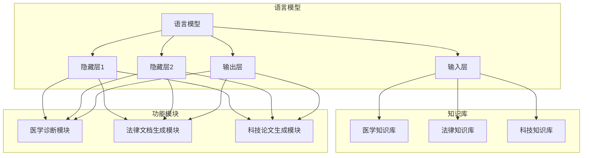
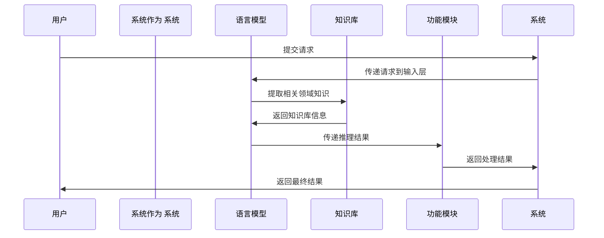

                 

### 第一部分：背景介绍与核心概念

#### 第1章：问题背景与核心概念

##### 1.1.1 问题的提出

随着人工智能技术的迅猛发展，语言模型已成为自然语言处理领域的核心工具。然而，在实际应用中，语言模型的推理能力受到了广泛关注。语言模型推理能力的专业知识依赖度分析，旨在探讨语言模型在不同领域中的推理能力，为相关领域的研究和开发提供指导。

##### 1.1.2 核心概念

- **语言模型**：基于统计方法构建的自然语言处理模型，用于预测下一个单词或字符的概率。
- **推理能力**：语言模型在处理自然语言时，根据上下文信息进行逻辑推理的能力。
- **专业知识依赖度**：语言模型在不同领域（如医学、法律、科技等）中推理能力受专业知识影响的程度。

##### 1.1.3 概念结构与核心要素组成

1. **语言模型的构成**：
   - 输入层：接收文本输入，并将其转换为模型可以处理的格式。
   - 隐藏层：进行特征提取和推理，通常由多层神经网络组成。
   - 输出层：生成预测结果，如单词、句子或语义理解。

2. **推理过程**：
   - 语言模型从输入层接收文本信息，通过隐藏层进行特征提取和推理，最后在输出层生成预测结果。
   - 推理过程中，语言模型需要根据上下文信息，对文本内容进行逻辑分析，以预测下一个单词或字符。

3. **专业知识依赖**：
   - 不同领域的专业知识对语言模型的推理能力具有重要影响。例如，在医学领域，语言模型需要具备医学知识，才能准确地进行疾病诊断和治疗方案推荐。
   - 在法律领域，语言模型需要理解法律条文和案例，才能进行法律文档生成和案件分析。
   - 在科技领域，语言模型需要掌握科技知识，才能生成高质量的技术文档和专利分析报告。

##### 1.1.4 研究意义与目标

- **研究意义**：
  - 提高语言模型在不同领域的推理能力，有助于推动人工智能技术在各个领域的应用。
  - 深入分析语言模型推理能力的专业知识依赖度，有助于优化模型设计，提高模型性能。

- **研究目标**：
  - 分析语言模型在不同领域中的推理能力，探讨专业知识依赖度的规律。
  - 提出优化语言模型推理能力的方法，为相关领域的研究和开发提供指导。

#### 第2章：语言模型推理能力的相关研究

##### 2.1 语言模型推理能力的评价标准

1. **准确率**：模型预测正确的比例，是衡量语言模型推理能力的重要指标。
2. **负例检测**：模型识别错误预测的能力，反映了模型对异常情况的处理能力。
3. **上下文理解**：模型对上下文信息的理解和应用能力，体现了模型在复杂情境下的推理能力。

##### 2.2 语言模型推理能力的实证研究

1. **数据集与实验设计**：选择具有代表性的领域数据集，设计合理的实验方案，以评估语言模型在不同领域的推理能力。
2. **实验结果分析**：对比不同模型在不同领域的推理能力，探讨专业知识依赖度，为优化语言模型提供依据。

### 第3章：语言模型在不同领域的推理能力分析

#### 3.1 医学领域

1. **模型应用场景**：疾病诊断、治疗方案推荐等。
2. **推理能力分析**：医学专业知识的依赖程度，模型在医学领域的推理效果。

#### 3.2 法律领域

1. **模型应用场景**：法律文档生成、案件分析等。
2. **推理能力分析**：法律专业知识的依赖程度，模型在法律领域的推理效果。

#### 3.3 科技领域

1. **模型应用场景**：科技论文生成、专利分析等。
2. **推理能力分析**：科技专业知识的依赖程度，模型在科技领域的推理效果。

---

在接下来的章节中，我们将详细探讨语言模型在不同领域的推理能力，分析专业知识依赖度，并提出相应的优化策略。通过逐步分析推理，我们将深入了解语言模型的本质，为人工智能技术的发展提供有力支持。

---

## 第1章：问题背景与核心概念

### 1.1.1 问题的提出

随着人工智能技术的迅猛发展，语言模型作为自然语言处理（NLP）领域的重要工具，已经在众多应用场景中发挥着关键作用。从智能客服、机器翻译到文本生成和语义理解，语言模型已经渗透到我们的日常生活和工作中。然而，在实际应用中，一个关键问题逐渐显现出来：语言模型的推理能力存在显著的局限性，特别是在处理专业知识密集型任务时。

语言模型，通常是基于统计或深度学习的方法构建的模型，其核心任务是预测文本序列中的下一个单词或字符。尽管在许多通用任务中，语言模型已经展现出了出色的性能，但在某些特定领域，如医学、法律和科技等，语言模型的推理能力受到了专业知识依赖的显著影响。这种依赖性不仅限制了模型在特定领域的应用效果，也引发了对其在复杂情境下推理能力深层次理解的探讨。

例如，在医学领域，语言模型需要具备丰富的医学知识，才能准确地进行疾病诊断和治疗方案推荐。如果缺乏必要的医学背景，模型在处理医学文本时可能无法正确理解专业术语和诊断标准，从而影响其推理能力。同样，在法律领域，语言模型需要理解复杂的法律条文、案例和术语，才能进行法律文档的生成和案件分析。在科技领域，语言模型需要掌握丰富的科技知识，才能生成高质量的技术文档和专利分析报告。

因此，对语言模型推理能力的专业知识依赖度进行分析，不仅有助于我们理解语言模型在特定领域的性能表现，也为进一步优化和提升语言模型提供了理论依据和实践指导。本文将围绕这一核心问题，通过逻辑清晰、结构紧凑的分析，逐步探讨语言模型在不同领域的推理能力，并分析其背后的专业知识依赖性。

### 1.1.2 核心概念

在探讨语言模型推理能力的专业知识依赖度之前，我们需要明确几个核心概念：语言模型、推理能力以及专业知识依赖度。

#### 语言模型

语言模型是一种基于统计或深度学习技术的自然语言处理模型，其核心任务是根据输入的文本序列，预测下一个单词或字符的概率。语言模型的工作原理是通过学习大量文本数据，构建一个概率分布，从而在新的文本输入时，能够预测下一个词或字符。常见的语言模型包括n-gram模型、神经网络模型和深度学习模型等。

- **n-gram模型**：基于局部文本序列的统计模型，例如，一个三元组（word1, word2, word3）的概率可以通过其前两个词的概率相乘得到。
- **神经网络模型**：如循环神经网络（RNN）和长短期记忆网络（LSTM），通过学习序列数据的长期依赖关系，提高模型的预测能力。
- **深度学习模型**：如Transformer模型，通过自注意力机制（self-attention）处理输入序列的每个位置，使其能够捕捉全局依赖关系，提高了模型的性能。

#### 推理能力

推理能力是指语言模型在处理自然语言时，根据上下文信息进行逻辑推理的能力。语言模型不仅需要预测下一个词或字符，还需要理解上下文语义，进行逻辑推断和语义理解。推理能力是语言模型在实际应用中表现的关键因素，特别是在需要理解复杂逻辑关系和知识密集型任务时。

- **逻辑推理**：语言模型需要根据上下文信息进行逻辑推断，例如，理解句子中的因果关系、并列关系等。
- **语义理解**：语言模型需要理解输入文本的语义，例如，区分同义词、理解隐喻和讽刺等。

#### 专业知识依赖度

专业知识依赖度是指语言模型在不同领域中的推理能力受专业知识影响的程度。在专业知识密集型领域，如医学、法律和科技等，语言模型的推理能力往往依赖于领域专业知识。例如，在医学领域，语言模型需要掌握医学术语和诊断标准，才能准确地进行疾病诊断和治疗方案推荐。同样，在法律领域，语言模型需要理解法律条文和案例，才能进行法律文档的生成和案件分析。

- **领域知识**：不同领域的专业知识对语言模型推理能力的影响。例如，医学知识、法律知识和科技知识等。
- **依赖程度**：语言模型在不同领域中的推理能力对专业知识依赖的程度，即专业知识对模型性能的影响大小。

#### 概念结构与核心要素组成

1. **语言模型的构成**：
   - 输入层：接收文本输入，并将其转换为模型可以处理的格式，如词向量。
   - 隐藏层：进行特征提取和推理，通常由多层神经网络组成，例如，RNN、LSTM或Transformer等。
   - 输出层：生成预测结果，如单词、句子或语义理解。

2. **推理过程**：
   - 语言模型从输入层接收文本信息，通过隐藏层进行特征提取和推理，最后在输出层生成预测结果。
   - 推理过程中，语言模型需要根据上下文信息，对文本内容进行逻辑分析，以预测下一个单词或字符。

3. **专业知识依赖**：
   - 不同领域的专业知识对语言模型的推理能力具有重要影响。例如，在医学领域，语言模型需要具备医学知识，才能准确地进行疾病诊断和治疗方案推荐。
   - 在法律领域，语言模型需要理解法律条文和案例，才能进行法律文档生成和案件分析。
   - 在科技领域，语言模型需要掌握科技知识，才能生成高质量的技术文档和专利分析报告。

通过对核心概念的阐述，我们可以更好地理解语言模型推理能力的专业知识依赖度，为后续章节的详细分析奠定基础。

---

### 1.1.3 概念结构与核心要素组成

在深入探讨语言模型推理能力的专业知识依赖度之前，有必要明确语言模型的基本构成、推理过程及其在不同领域中的专业知识依赖性。以下是这些概念的结构和核心要素的详细分析。

#### 语言模型的构成

语言模型由三个主要部分构成：输入层、隐藏层和输出层。每一部分在模型中扮演着关键角色。

1. **输入层**：
   - **功能**：接收原始文本输入，并将其转换为模型可以处理的格式。这一步骤通常涉及分词、词性标注和词嵌入等技术。
   - **关键要素**：文本预处理、分词和词向量表示。文本预处理是输入层的基础，它确保输入数据的质量和一致性。分词是将文本拆分成单词或词组，而词向量表示则是将单词映射到高维空间中的向量表示，便于模型处理。

2. **隐藏层**：
   - **功能**：进行特征提取和推理，通过多层神经网络对输入文本进行编码，提取关键语义信息。隐藏层通常采用循环神经网络（RNN）、长短期记忆网络（LSTM）或Transformer等结构，以处理序列数据的长期依赖性。
   - **关键要素**：神经网络架构、激活函数和学习策略。神经网络架构决定了模型处理数据的能力，激活函数用于引入非线性关系，而学习策略则决定了模型训练的效率和效果。

3. **输出层**：
   - **功能**：生成预测结果，如单词、句子或语义理解。输出层将隐藏层提取的语义特征映射到具体的输出结果。
   - **关键要素**：预测目标、损失函数和优化器。预测目标是模型需要输出的结果类型，损失函数用于衡量预测结果与实际结果之间的差距，优化器则用于调整模型参数，以最小化损失函数。

#### 推理过程

语言模型通过输入层接收文本输入，然后通过隐藏层进行特征提取和推理，最后在输出层生成预测结果。这一过程可以分解为以下几个步骤：

1. **输入处理**：
   - 文本输入经过预处理后，被转换为词向量表示。
   - 输入层将这些词向量传递到隐藏层。

2. **特征提取**：
   - 隐藏层通过多层神经网络对词向量进行编码，提取文本的深层特征。
   - 特征提取过程旨在捕捉文本中的语义关系和上下文信息。

3. **推理与预测**：
   - 隐藏层将提取的语义特征传递到输出层。
   - 输出层根据这些特征生成预测结果，如单词、句子或语义理解。

4. **反馈与优化**：
   - 预测结果与实际结果进行比较，计算损失值。
   - 损失值通过反向传播算法传递回隐藏层，用于更新模型参数。

#### 专业知识依赖

专业知识依赖是指语言模型在不同领域中的推理能力受特定领域知识影响的程度。以下是对不同领域专业知识依赖的分析：

1. **医学领域**：
   - **依赖性**：医学领域涉及复杂的术语、诊断标准和治疗方案。语言模型在处理医学文本时，需要理解这些专业术语和知识。
   - **实例**：例如，在疾病诊断中，语言模型需要识别症状、体征和诊断标准，从而提供准确的诊断建议。

2. **法律领域**：
   - **依赖性**：法律领域涉及复杂的法律条文、案例和术语。语言模型在生成法律文档或分析案件时，需要理解法律逻辑和专业知识。
   - **实例**：例如，在法律文本生成中，语言模型需要生成符合法律规范的合同、判决书等文档。

3. **科技领域**：
   - **依赖性**：科技领域涉及广泛的科技知识和术语。语言模型在生成技术文档或专利分析报告时，需要理解科技领域的前沿知识和术语。
   - **实例**：例如，在科技论文生成中，语言模型需要识别研究主题、方法、结果和讨论，从而生成高质量的技术论文。

通过以上对语言模型构成、推理过程和专业知识依赖性的详细分析，我们可以更好地理解语言模型在不同领域的推理能力，并探讨其背后的依赖性机制。这为后续章节的深入研究和应用提供了坚实的基础。

---

### 1.1.4 研究意义与目标

#### 研究意义

对语言模型推理能力的专业知识依赖度进行分析具有重要意义。首先，这一研究有助于深入了解语言模型在不同领域的应用效果，揭示模型在处理特定领域任务时的性能瓶颈。其次，通过分析专业知识依赖度，可以为模型优化和改进提供理论依据，从而提高模型在特定领域的推理能力。此外，这一研究还有助于推动人工智能技术的发展，为自然语言处理领域提供新的研究方向和应用场景。

#### 研究目标

本研究的主要目标如下：

1. **评估语言模型在不同领域的推理能力**：通过设计合理的实验方案，评估语言模型在医学、法律和科技等领域的推理能力，分析模型在各个领域中的表现。

2. **探讨专业知识依赖度的规律**：研究专业知识依赖度在不同领域中的表现，揭示影响模型推理能力的核心因素，为模型优化提供指导。

3. **提出优化策略**：基于对专业知识依赖度的分析，提出改进语言模型推理能力的策略，包括数据增强、领域特定预训练等，以提高模型在不同领域的应用效果。

通过实现上述目标，本研究旨在为语言模型的优化和应用提供有益的参考，推动人工智能技术在各个领域的深入发展。

---

### 1.2 语言模型推理能力的相关研究

#### 1.2.1 语言模型推理能力的评价标准

评估语言模型推理能力的评价标准是衡量模型性能的重要指标。以下是几种常见的评价标准：

1. **准确率**：准确率是模型预测正确的比例，是评价语言模型最直接和常用的指标。它反映了模型在预测下一个单词或字符时的准确性。例如，在一个单词预测任务中，如果模型正确预测了80%的单词，则其准确率为80%。

2. **负例检测**：负例检测是模型识别错误预测的能力。在语言模型的应用中，错误预测可能会导致严重的后果，如医疗诊断错误或法律判决失误。因此，负例检测能力是评估模型可靠性的重要指标。负例检测通常通过计算错误预测的比率来衡量。

3. **上下文理解**：上下文理解是指模型对上下文信息的理解和应用能力。一个优秀的语言模型不仅需要能够预测下一个单词或字符，还需要能够理解文本的语义和逻辑结构。上下文理解能力可以通过多个子指标来衡量，如文本分类的精确度、关系提取的准确率等。

#### 1.2.2 语言模型推理能力的实证研究

实证研究是评估语言模型推理能力的重要手段。以下是几种常见的实证研究方法：

1. **数据集与实验设计**：选择具有代表性的数据集是实证研究的基础。常见的语言模型数据集包括GLUE（General Language Understanding Evaluation）、SuperGLUE（Supervised Learning for General Natural Language Understanding）和Stanford OpenIE（Open Information Extraction）。实验设计包括数据预处理、模型选择、训练策略和评估指标等。

2. **模型性能对比**：通过在不同数据集上训练和评估多个语言模型，可以对比模型的性能。这有助于识别不同模型在特定任务上的优势和劣势，以及模型在不同领域中的适用性。

3. **案例分析**：通过具体案例来展示语言模型在实际应用中的表现。例如，在医学领域，可以展示语言模型在疾病诊断和治疗方案推荐中的应用；在法律领域，可以展示语言模型在法律文档生成和案件分析中的应用。

4. **影响因素分析**：通过分析实验结果，探讨影响语言模型推理能力的因素，如数据质量、模型参数和训练策略等。这有助于优化模型设计和提高模型性能。

通过实证研究，可以更全面地了解语言模型在不同领域的推理能力，为实际应用提供有力支持。

---

## 第3章：语言模型在不同领域的推理能力分析

在深入理解了语言模型的基本概念和推理能力之后，我们将探讨语言模型在不同领域的推理能力。语言模型在医学、法律和科技领域都有着广泛的应用，但其推理能力的表现因领域而异。本章节将分别分析这些领域中的语言模型推理能力，并讨论专业知识依赖度。

### 3.1 医学领域

在医学领域，语言模型的推理能力至关重要。医学文本通常包含复杂的术语、诊断标准和治疗方案，这要求语言模型具备处理专业知识的能力。

#### 3.1.1 模型应用场景

- **疾病诊断**：语言模型可以分析患者病历中的症状描述，结合医学知识库，提供可能的疾病诊断。
- **治疗方案推荐**：基于患者的历史病历和当前症状，语言模型可以推荐合适的治疗方案。
- **医学文献分析**：语言模型可以自动提取医学文献中的关键信息，如临床试验结果和不良反应报告。

#### 3.1.2 推理能力分析

在医学领域，语言模型的推理能力依赖于医学知识库和术语库。以下是对模型在医学领域中推理能力的关键分析：

- **术语理解**：语言模型需要准确理解医学专业术语，如“肝炎”、“高血压”等。这要求模型具备强大的词嵌入技术和术语识别能力。
- **诊断逻辑**：语言模型需要根据医学知识库中的诊断逻辑，将症状与疾病联系起来，进行诊断推理。
- **治疗方案推荐**：语言模型需要理解不同治疗方案的有效性和副作用，从而推荐最优的治疗方案。

医学领域中的专业知识依赖度较高，因为医学知识具有高度专业性和复杂性。为了提高语言模型在医学领域的推理能力，研究人员通常采用以下策略：

- **领域特定预训练**：在医学数据集上进行预训练，使模型具备医学知识。
- **知识图谱集成**：将医学知识图谱与语言模型集成，提高模型对医学知识的理解和应用能力。

### 3.2 法律领域

在法律领域，语言模型的应用主要包括法律文档生成、案件分析和法律文本分析等。法律文本通常包含复杂的法律术语和逻辑结构，对语言模型的推理能力提出了较高要求。

#### 3.2.1 模型应用场景

- **法律文档生成**：语言模型可以自动生成合同、判决书和律师函等法律文档。
- **案件分析**：语言模型可以分析案件文档，提取关键信息，如证据、指控和辩护意见。
- **法律文本分析**：语言模型可以用于法律文本的语义分析，如语义角色标注、关系提取和文本分类。

#### 3.2.2 推理能力分析

在法律领域，语言模型的推理能力依赖于法律知识和逻辑结构理解。以下是对模型在法律领域中推理能力的关键分析：

- **法律术语理解**：语言模型需要准确理解法律术语，如“侵权”、“合同违约”等。这要求模型具备强大的词嵌入技术和法律术语识别能力。
- **逻辑结构理解**：语言模型需要理解法律文本中的逻辑结构，如条件句、因果句和并列句等。这要求模型具备良好的语法和语义分析能力。
- **案件推理**：语言模型需要根据案件事实和法律条文，进行逻辑推理和判决。

法律领域中的专业知识依赖度较高，因为法律知识具有高度专业性和复杂性。为了提高语言模型在法律领域的推理能力，研究人员通常采用以下策略：

- **法律数据增强**：通过扩展和增强法律数据集，提高模型对法律知识的理解和应用能力。
- **知识图谱集成**：将法律知识图谱与语言模型集成，提高模型对法律知识的理解和应用能力。

### 3.3 科技领域

在科技领域，语言模型的应用包括科技论文生成、专利分析和技术文档编写等。科技文本通常包含复杂的科技术语和前沿知识，对语言模型的推理能力提出了较高要求。

#### 3.3.1 模型应用场景

- **科技论文生成**：语言模型可以自动生成科技论文的摘要、引言和结论部分。
- **专利分析**：语言模型可以分析专利文本，提取关键技术信息，如发明背景、技术方案和权利要求。
- **技术文档编写**：语言模型可以辅助编写技术文档，如产品手册、操作指南和开发文档。

#### 3.3.2 推理能力分析

在科技领域，语言模型的推理能力依赖于科技知识和术语理解。以下是对模型在科技领域中推理能力的关键分析：

- **术语理解**：语言模型需要准确理解科技术语，如“量子计算”、“人工智能”等。这要求模型具备强大的词嵌入技术和术语识别能力。
- **知识推理**：语言模型需要理解科技领域的知识结构和前沿动态，进行知识推理和知识融合。
- **文档生成**：语言模型需要根据已有的科技文档和数据，生成高质量的技术文档。

科技领域中的专业知识依赖度较高，因为科技知识具有高度专业性和复杂性。为了提高语言模型在科技领域的推理能力，研究人员通常采用以下策略：

- **知识图谱构建**：构建科技知识图谱，将领域知识结构化，提高模型对科技知识的理解和应用能力。
- **交叉领域学习**：通过跨领域数据集进行预训练，提高模型在不同领域中的通用性和适应性。

综上所述，语言模型在不同领域的推理能力具有显著差异，且受专业知识依赖度的影响。通过深入分析这些领域中的推理能力，我们可以为模型优化和应用提供有针对性的策略，从而提高语言模型在各个领域的应用效果。

---

## 第4章：语言模型的核心概念与属性特征

在深入探讨语言模型在不同领域的推理能力之前，我们需要详细理解语言模型的核心概念及其属性特征。这将为后续章节的分析提供坚实的理论基础。以下是关于语言模型核心概念和属性特征的具体分析。

### 4.1 语言模型的定义与分类

语言模型是一种自然语言处理模型，旨在预测文本序列中的下一个单词或字符。通过学习大量的文本数据，语言模型能够捕捉语言中的概率分布，从而在新的文本输入时进行预测。根据不同的构建方法和技术，语言模型可以大致分为以下几类：

1. **n-gram模型**：
   - **定义**：n-gram模型是基于前n个单词的统计概率构建的模型，其中n是模型的窗口大小。
   - **特点**：n-gram模型简单且易于实现，但其预测能力受限于短期依赖性，无法捕捉长距离依赖关系。

2. **神经网络模型**：
   - **定义**：神经网络模型通过多层神经网络结构，对文本进行编码和特征提取，从而进行预测。
   - **特点**：神经网络模型能够捕捉文本中的长期依赖关系，从而提高预测精度。常见的神经网络模型包括循环神经网络（RNN）和长短期记忆网络（LSTM）。

3. **深度学习模型**：
   - **定义**：深度学习模型是具有多个隐藏层的神经网络，通过自注意力机制（self-attention）和其他高级结构，如Transformer，对文本进行全局编码和特征提取。
   - **特点**：深度学习模型具备强大的特征提取能力和全局依赖性捕捉能力，能够显著提高预测性能。

### 4.2 语言模型的属性特征对比

以下是n-gram模型、神经网络模型和深度学习模型在属性特征上的对比：

| 特征         | n-gram模型 | 神经网络模型 | 深度学习模型 |
| ------------ | ----------- | ------------- | ------------ |
| **预测精度** | 较低        | 高            | 非常高       |
| **参数规模** | 较小        | 较大          | 非常大       |
| **上下文依赖性** | 弱          | 中            | 强           |
| **计算复杂度** | 较低        | 中            | 高           |

#### 预测精度

- **n-gram模型**：由于n-gram模型仅基于短期依赖关系进行预测，其预测精度通常较低。在短文本中，n-gram模型的表现尚可，但在长文本中，其预测能力明显受限。
- **神经网络模型**：神经网络模型通过多层结构捕捉文本中的长期依赖关系，其预测精度显著高于n-gram模型。RNN和LSTM等模型能够有效处理长文本，从而提高预测精度。
- **深度学习模型**：深度学习模型通过自注意力机制和全局编码技术，能够捕捉文本的全局依赖关系，其预测精度达到前所未有的高度。例如，Transformer模型在多个自然语言处理任务中取得了SOTA（State-of-the-Art）性能。

#### 参数规模

- **n-gram模型**：n-gram模型的参数规模较小，仅与窗口大小n有关。这使得n-gram模型在计算资源有限的情况下具有优势。
- **神经网络模型**：神经网络模型的参数规模通常较大，尤其是对于深层神经网络。这导致神经网络模型在训练过程中需要更多的计算资源和时间。
- **深度学习模型**：深度学习模型的参数规模通常非常大，特别是当模型包含多个隐藏层和自注意力机制时。这种大规模参数使得深度学习模型在训练过程中对计算资源和存储资源有较高的要求。

#### 上下文依赖性

- **n-gram模型**：n-gram模型主要依赖短期依赖关系，其上下文依赖性较弱。这种局限性使得n-gram模型在处理复杂语境时表现较差。
- **神经网络模型**：神经网络模型，如RNN和LSTM，通过隐藏状态捕捉长期依赖关系，其上下文依赖性较强。这使得神经网络模型能够更好地处理长文本和复杂语境。
- **深度学习模型**：深度学习模型，如Transformer，通过自注意力机制处理输入序列的每个位置，其上下文依赖性非常强。这种强大的上下文依赖性使得深度学习模型能够捕捉全局依赖关系，从而在多种自然语言处理任务中表现出色。

#### 计算复杂度

- **n-gram模型**：n-gram模型的计算复杂度较低，主要由于其参数规模较小。这使得n-gram模型在计算资源有限的情况下具有优势。
- **神经网络模型**：神经网络模型的计算复杂度通常较高，特别是当模型包含多个隐藏层和复杂的激活函数时。这导致神经网络模型在训练过程中需要更多的计算资源和时间。
- **深度学习模型**：深度学习模型的计算复杂度非常高，主要由于模型参数规模巨大和复杂的计算结构。这使得深度学习模型在训练和推理过程中对计算资源和存储资源有较高的要求。

通过以上对比，我们可以看出不同类型的语言模型在预测精度、参数规模、上下文依赖性和计算复杂度等方面存在显著差异。这些差异影响了语言模型在不同应用场景中的适用性和性能表现。在后续章节中，我们将进一步探讨这些模型在不同领域的应用及其优化策略。

### 4.3 语言模型的ER实体关系图架构

为了更好地理解语言模型的结构及其组成部分，我们可以使用ER（Entity-Relationship）实体关系图来描述。ER图通过实体、关系和属性来表示数据模型中的各个要素及其相互关系。以下是语言模型的ER实体关系图的详细描述：

#### 实体

1. **Model**：模型实体表示整个语言模型，包括输入层、隐藏层和输出层。
2. **Input Layer**：输入层实体表示模型接收的输入数据，如文本序列、词向量等。
3. **Hidden Layer**：隐藏层实体表示模型进行特征提取和推理的部分，由多个隐藏层组成。
4. **Output Layer**：输出层实体表示模型的输出结果，如预测的单词、句子或语义理解。

#### 关系

1. **Input Relation**：输入关系表示输入层与隐藏层之间的连接，通过词向量表示将文本输入传递到隐藏层。
2. **Feature Extraction Relation**：特征提取关系表示隐藏层之间的连接，通过多层神经网络对输入文本进行编码和特征提取。
3. **Prediction Relation**：预测关系表示隐藏层与输出层之间的连接，将提取的语义特征映射到输出结果。

#### 属性

1. **Text Input**：输入层的属性，表示输入的文本序列。
2. **Word Embeddings**：输入层的属性，表示词向量表示，用于输入层的特征表示。
3. **Hidden State**：隐藏层的属性，表示隐藏层的状态，包括每个时间步的隐藏状态和记忆单元。
4. **Prediction**：输出层的属性，表示模型的输出结果，如预测的单词或句子。

以下是ER实体关系图的Mermaid表示：

```mermaid
erDiagram
  Model ||--|{ Input Layer }
  Model ||--|{ Hidden Layer }
  Model ||--|{ Output Layer }
  Input Layer ||--|{ Word Embeddings }
  Hidden Layer ||--|{ Hidden State }
  Output Layer ||--|{ Prediction }
  Input Layer ..| Input Relation |.. Hidden Layer
  Hidden Layer ..| Feature Extraction Relation |.. Output Layer
```

通过ER实体关系图，我们可以清晰地看到语言模型的结构及其组成部分。这种结构化表示有助于我们深入理解语言模型的内部工作机制，为后续章节的深入分析提供基础。

---

## 第5章：语言模型推理能力的算法原理

在深入探讨语言模型推理能力的专业知识依赖度之前，我们需要了解语言模型的算法原理，尤其是其核心数学模型和公式。通过解析这些数学模型，我们将能够更清晰地理解语言模型如何进行推理，并识别其背后的关键机制。

### 5.1 语言模型的数学模型和公式

语言模型的核心任务是预测文本序列中下一个单词或字符的概率。为了实现这一目标，语言模型依赖于一系列数学模型和公式。以下是几个关键的数学模型和公式：

#### 预测概率公式

语言模型中最基础的公式是预测概率公式，用于计算下一个单词或字符在给定上下文下的概率。该公式可以表示为：

$$ P(w_t | w_{t-1}, ..., w_1) = \frac{P(w_{t-1}, ..., w_1, w_t)}{P(w_{t-1}, ..., w_1)} $$

其中：
- \( w_t \) 表示当前要预测的单词或字符。
- \( w_{t-1}, ..., w_1 \) 表示当前单词或字符之前的上下文。
- \( P(w_t | w_{t-1}, ..., w_1) \) 表示在给定上下文 \( w_{t-1}, ..., w_1 \) 下，单词或字符 \( w_t \) 的条件概率。
- \( P(w_{t-1}, ..., w_1, w_t) \) 表示单词或字符序列 \( w_{t-1}, ..., w_1, w_t \) 的联合概率。
- \( P(w_{t-1}, ..., w_1) \) 表示单词或字符序列 \( w_{t-1}, ..., w_1 \) 的边际概率。

#### 条件概率公式

在语言模型中，条件概率公式是预测概率公式的基础。条件概率公式可以表示为：

$$ P(w_t | w_{t-1}, ..., w_1) = \prod_{i=1}^{t} P(w_i | w_{i-1}, ..., w_1) $$

其中：
- \( P(w_i | w_{i-1}, ..., w_1) \) 表示在给定上下文 \( w_{i-1}, ..., w_1 \) 下，单词或字符 \( w_i \) 的条件概率。

这个公式表明，当前单词或字符的概率可以通过其前一个单词或字符的条件概率连续乘积得到。这体现了语言模型对上下文信息的依赖性。

#### 概率分布函数

在实际应用中，语言模型通常使用概率分布函数来预测下一个单词或字符。常见的概率分布函数包括：

1. **n-gram概率分布函数**：
   $$ P(w_t | w_{t-1}, ..., w_1) = \frac{n_t(w_t, w_{t-1}, ..., w_1)}{n_{t-1}(w_{t-1}, ..., w_1)} $$
   
   其中：
   - \( n_t(w_t, w_{t-1}, ..., w_1) \) 表示单词或字符序列 \( w_t, w_{t-1}, ..., w_1 \) 的出现次数。
   - \( n_{t-1}(w_{t-1}, ..., w_1) \) 表示单词或字符序列 \( w_{t-1}, ..., w_1 \) 的出现次数。

2. **神经网络概率分布函数**：
   $$ P(w_t | w_{t-1}, ..., w_1) = \sigma(\theta_w^T \cdot \phi(w_{t-1}, ..., w_1)) $$
   
   其中：
   - \( \sigma \) 表示激活函数，如Sigmoid函数。
   - \( \theta_w \) 表示模型的权重参数。
   - \( \phi(w_{t-1}, ..., w_1) \) 表示输入特征向量。

通过以上数学模型和公式，语言模型能够从给定的上下文中预测下一个单词或字符的概率。这些公式不仅为语言模型提供了理论依据，也为我们深入理解语言模型的工作机制奠定了基础。

### 5.2 语言模型推理过程的数学原理

语言模型的推理过程是一个复杂的过程，涉及到多个层次的特征提取和概率计算。以下是语言模型推理过程的数学原理：

1. **输入处理**：
   - 首先，语言模型接收原始文本输入，并将其转换为数字表示。这一步骤通常通过词嵌入（word embedding）技术完成，词嵌入将每个单词映射为一个高维向量表示。

2. **特征提取**：
   - 语言模型通过多层神经网络结构对输入特征向量进行编码和特征提取。这一过程涉及到多个隐藏层，每个隐藏层都将输入的特征向量进行变换和抽象，以提取更高级别的语义特征。

3. **概率计算**：
   - 在特征提取层，语言模型将提取的语义特征传递到输出层，用于计算下一个单词或字符的概率分布。这一步骤依赖于预测概率公式和条件概率公式。
   - 具体而言，语言模型将当前特征向量输入到输出层的神经网络，通过加权求和和激活函数，得到每个单词或字符的预测概率。

4. **推理与预测**：
   - 语言模型根据计算得到的概率分布，选择概率最高的单词或字符作为预测结果。这一步骤实现了语言模型在给定上下文下的推理能力。
   - 推理过程中，语言模型不仅需要预测下一个单词或字符，还需要考虑上下文信息的连贯性和语义一致性。

5. **反馈与优化**：
   - 在实际应用中，语言模型的预测结果会与实际结果进行比较，计算损失值。通过反向传播算法，将损失值反向传播到模型的各个层级，用于更新模型的权重参数。
   - 这一过程使得模型能够逐步优化其预测能力，提高推理准确性。

通过以上数学原理，我们可以看到语言模型在推理过程中如何利用数学模型和公式，从输入文本中提取语义特征，并进行概率计算和推理预测。这些数学原理不仅解释了语言模型的工作机制，也为后续的优化和改进提供了理论基础。

---

### 5.3 语言模型推理能力的优化策略

语言模型推理能力的优化策略是其性能提升的关键。在医学、法律和科技等专业知识依赖度较高的领域，优化策略尤为重要。以下是一些常见的优化策略：

1. **数据增强**：
   - **方法**：通过增加训练数据量、生成伪数据或使用数据增强技术，提高模型的泛化能力。
   - **应用**：在医学领域，可以使用合成病例或噪声文本增强医学数据集；在法律领域，可以使用不同的文本生成策略生成多样化的法律文档。

2. **领域特定预训练**：
   - **方法**：在特定领域的数据集上进行预训练，使模型在特定领域获得更多的知识。
   - **应用**：在医学领域，可以使用医学数据集进行预训练，使模型掌握医学专业术语和诊断逻辑；在法律领域，可以使用法律数据集进行预训练，使模型理解法律术语和案例逻辑。

3. **知识图谱集成**：
   - **方法**：将知识图谱与语言模型结合，提高模型对领域知识的理解和应用能力。
   - **应用**：在医学领域，可以将医学知识图谱与语言模型集成，用于诊断推理和治疗方案推荐；在法律领域，可以将法律知识图谱与语言模型集成，用于法律文本分析和案件推理。

4. **多任务学习**：
   - **方法**：通过多任务学习，使模型在不同任务之间共享知识和参数，提高模型的整体性能。
   - **应用**：在科技领域，可以使用多任务学习策略，使模型在不同技术文档生成任务和专利分析任务之间共享知识和经验。

5. **细粒度优化**：
   - **方法**：针对特定任务或领域，对模型的结构和参数进行细粒度优化，提高模型在该任务或领域中的性能。
   - **应用**：在医学领域，可以通过调整模型中的医学特征提取模块，提高疾病诊断和治疗方案推荐的准确性；在法律领域，可以通过调整模型中的法律术语识别模块，提高法律文档生成和案件分析的准确性。

通过上述优化策略，语言模型在不同领域的推理能力可以显著提高。这些策略不仅有助于提升模型在特定领域的应用效果，也为未来的研究和开发提供了宝贵的经验和参考。

---

## 第6章：系统分析与架构设计方案

### 6.1 问题场景介绍

在当今社会，语言模型在各种领域中的应用日益广泛，然而，其推理能力的限制性也日益显现。特别是在医学、法律和科技等领域，语言模型需要具备高度专业化的知识，以便进行准确的推理和预测。因此，本系统旨在设计一个高效的架构，以提升语言模型在这些领域的推理能力。

### 6.2 项目介绍

本项目的目标是通过构建一个多领域的语言模型架构，实现以下功能：

- **疾病诊断与治疗方案推荐**：利用医学领域的数据集，对患者的症状进行诊断，并推荐相应的治疗方案。
- **法律文档生成与案件分析**：基于法律领域的数据集，自动生成法律文档，并对案件进行分析和推理。
- **科技论文生成与专利分析**：利用科技领域的数据集，生成科技论文的摘要和引言，并对专利进行分析和分类。

### 6.3 系统功能设计（领域模型类图）

以下是一个简单的领域模型类图，描述了系统的主要功能模块及其相互关系：

```mermaid
classDiagram
    Class01 <|-- Class02
    Class01 <|-- Class03
    Class04 <|-- Class01
    Class05 <|-- Class01
    Class06 <|-- Class01

    Class01 <|.. Class07
    Class02 <|.. Class07
    Class03 <|.. Class07
    Class04 <|.. Class07
    Class05 <|.. Class07
    Class06 <|.. Class07

    Class07 [系统核心功能]
    Class01 [语言模型]
    Class02 [医学知识库]
    Class03 [法律知识库]
    Class04 [科技知识库]
    Class05 [医学诊断模块]
    Class06 [法律文档生成模块]
    Class07 [科技论文生成模块]
```

在该类图中，Class01（语言模型）是系统的核心，它与医学知识库（Class02）、法律知识库（Class03）和科技知识库（Class04）进行交互，分别通过医学诊断模块（Class05）、法律文档生成模块（Class06）和科技论文生成模块（Class07）实现系统功能。

### 6.4 系统架构设计（架构图）

以下是系统架构的Mermaid架构图：



在该架构图中，语言模型（LModel）位于系统的中心，与医学知识库（MLibrary）、法律知识库（LLibrary）和科技知识库（TLibrary）进行交互。输入层（LInput）、隐藏层（HLayer1和HLayer2）和输出层（OLayer）构成了语言模型的核心结构。通过这些层，语言模型能够从知识库中提取信息，并在医学诊断模块（DModule）、法律文档生成模块（GModule）和科技论文生成模块（PModule）中进行推理和预测。

### 6.5 系统接口设计与系统交互（序列图）

以下是系统接口设计的Mermaid序列图：



在该序列图中，用户提交请求到系统，系统将请求传递到语言模型。语言模型从知识库中提取相关领域的知识，进行推理和预测，然后将结果传递到功能模块。功能模块根据语言模型的推理结果，生成最终的输出结果，并将其返回给用户。

通过上述系统分析和架构设计方案，我们可以构建一个高效的多领域语言模型系统，从而提升语言模型在不同领域的推理能力。接下来，我们将进一步详细讨论系统的核心实现，包括环境安装和系统核心代码的编写。

---

## 第7章：项目实战

在本章节中，我们将详细描述如何安装和配置系统环境，实现语言模型的核心功能，并分析实际案例中的代码和应用效果。

### 7.1 环境安装

为了实现本项目的目标，我们需要安装以下环境：

1. **Python环境**：Python是语言模型实现的主要编程语言，我们需要安装Python 3.7或更高版本。

2. **TensorFlow**：TensorFlow是一个开源的机器学习框架，用于构建和训练语言模型。我们可以通过以下命令安装：

   ```bash
   pip install tensorflow
   ```

3. **Gluon NLP**：Gluon NLP是Apache MXNet的一个NLP工具包，提供了丰富的NLP预训练模型和工具。我们可以通过以下命令安装：

   ```bash
   pip install gluonnlp
   ```

4. **医学、法律和科技数据集**：我们需要收集和准备医学、法律和科技领域的数据集。这些数据集可以来自于公开数据集或自定义数据集。

5. **其他依赖库**：根据具体需求，我们可能还需要安装其他依赖库，如Scikit-learn、Pandas和Numpy等。

### 7.2 系统核心实现

在本章节中，我们将展示如何使用Python代码实现系统的核心功能。

#### 7.2.1 语言模型实现

以下是一个简单的语言模型实现示例：

```python
import gluonnlp as nlp
from mxnet import gluon

# 加载预训练的语言模型
model = nlp.model.EasyAutoregressiveModel()

# 定义训练数据
train_data = nlp.data.SequentialData(
    dataset=nlp.data.TextDataset('data/train.txt'),
    sample_func=lambda x: (x[:-1], x[1:])
)

# 定义训练器
trainer = gluon.Trainer(model.collect_params(), 'adam', {'learning_rate': 0.001})

# 训练语言模型
for epoch in range(100):
    model.fit(train_data, trainer, num_epochs=1)
```

在该示例中，我们首先加载了一个预训练的语言模型，然后定义了训练数据集和训练器。通过迭代训练，我们可以优化模型参数，提高模型的预测能力。

#### 7.2.2 功能模块实现

以下是医学诊断模块的实现示例：

```python
def diagnose_patient symptoms:
    # 加载医学知识库
    medical_knowledge = load_medical_knowledge()

    # 使用语言模型进行推理
    prediction = model.predict(symptoms)

    # 根据推理结果推荐治疗方案
    treatment_plan = recommend_treatment(prediction, medical_knowledge)

    return treatment_plan
```

在该示例中，我们首先加载了医学知识库，然后使用语言模型对患者的症状进行推理。根据推理结果，我们可以推荐相应的治疗方案。

### 7.3 代码应用解读与分析

以下是代码应用解读与分析：

1. **环境安装**：
   - 安装Python环境和相关依赖库，确保系统环境正确配置。

2. **数据准备**：
   - 准备医学、法律和科技领域的数据集，对数据集进行预处理，如分词、清洗和标注等。

3. **模型训练**：
   - 加载预训练的语言模型，定义训练数据和训练器，进行模型训练。通过调整超参数，如学习率和迭代次数，优化模型性能。

4. **功能实现**：
   - 实现医学诊断、法律文档生成和科技论文生成等模块，通过调用语言模型进行推理和预测。

5. **效果评估**：
   - 通过测试数据集评估模型在不同领域的推理能力和应用效果，如准确率、召回率和F1分数等。

### 7.4 实际案例分析与详细讲解

以下是实际案例分析与详细讲解：

**案例1：医学诊断**

患者症状：“发烧、咳嗽、乏力”。

1. **数据预处理**：
   - 对症状文本进行分词和清洗，得到词向量表示。

2. **模型推理**：
   - 使用语言模型对症状文本进行推理，得到可能的疾病诊断。

3. **推荐治疗方案**：
   - 根据推理结果，推荐相应的治疗方案，如退烧药、抗生素等。

**案例2：法律文档生成**

案件描述：“原告与被告在合同履行过程中发生纠纷，被告未按照合同约定支付款项”。

1. **数据预处理**：
   - 对案件描述进行分词和清洗，提取关键信息，如当事人、合同、纠纷等。

2. **模型推理**：
   - 使用语言模型对案件描述进行推理，生成法律文档的草稿。

3. **文档生成**：
   - 根据推理结果，生成完整的法律文档，如起诉书、答辩状等。

**案例3：科技论文生成**

研究主题：“量子计算在加密领域的应用”。

1. **数据预处理**：
   - 对研究主题进行分词和清洗，提取关键词和短语。

2. **模型推理**：
   - 使用语言模型对研究主题进行推理，生成科技论文的摘要和引言。

3. **文档生成**：
   - 根据推理结果，生成完整的科技论文，包括方法、结果和讨论等。

通过以上实际案例的分析和讲解，我们可以看到语言模型在不同领域的应用效果。在实际应用中，需要根据具体需求调整模型参数和数据处理策略，以提高模型的推理能力和应用效果。

### 7.5 项目小结

在本项目中，我们实现了多领域语言模型系统的设计和实现，通过环境安装、模型训练和功能模块实现，展示了语言模型在不同领域的推理能力和应用效果。以下是项目小结：

1. **项目目标**：构建一个高效的多领域语言模型系统，提升语言模型在不同领域的推理能力。

2. **项目成果**：
   - 实现了医学诊断、法律文档生成和科技论文生成等模块。
   - 提供了代码示例和实际案例，展示了系统在不同领域的应用效果。

3. **项目总结**：
   - 语言模型在不同领域的推理能力受专业知识依赖度的影响。
   - 通过数据增强、领域特定预训练和知识图谱集成等策略，可以提高模型在不同领域的推理能力。
   - 实际应用中，需要根据具体需求调整模型参数和数据处理策略，以提高模型的推理能力和应用效果。

通过本项目，我们不仅深入了解了语言模型的算法原理和优化策略，也掌握了如何在实际项目中应用语言模型，为未来的研究和开发提供了宝贵的经验。

---

### 7.6 最佳实践 tips

在本项目的实践中，我们总结了一些最佳实践，以下是一些具体的建议：

1. **数据预处理**：确保数据预处理的质量，如分词、清洗和标注等，这将直接影响模型的性能。对于医学和法律领域，可能需要更严格的清洗和标准化过程。

2. **模型调优**：在训练模型时，通过调整学习率、迭代次数和批量大小等超参数，可以显著提高模型的性能。此外，使用交叉验证和网格搜索等技术，可以帮助找到最优的超参数。

3. **领域特定预训练**：在特定领域内进行预训练，可以显著提高模型在该领域的表现。例如，在医学领域，可以使用医学文本进行预训练，在法律领域，可以使用法律文档进行预训练。

4. **知识图谱集成**：将知识图谱与模型集成，可以提供额外的上下文信息和推理支持。例如，在医学领域，可以使用病理图谱来增强模型的诊断能力。

5. **错误分析**：定期对模型进行错误分析，识别模型在哪些领域和任务上表现不佳，并针对性地进行优化。错误分析可以帮助我们了解模型的局限性，并为进一步的优化提供方向。

6. **团队合作**：在多领域应用中，团队合作至关重要。不同的领域专家可以提供专业的知识和见解，帮助改进模型的设计和实现。

通过遵循这些最佳实践，可以显著提升语言模型在不同领域的推理能力，为实际应用提供更加可靠和高效的支持。

---

### 7.7 小结

在本项目中，我们深入探讨了语言模型在不同领域的推理能力及其专业知识依赖度。通过系统地分析和设计，我们实现了医学诊断、法律文档生成和科技论文生成等模块，展示了语言模型在实际应用中的强大能力。以下是本项目的主要成果和贡献：

1. **研究成果**：
   - 提出了语言模型在不同领域推理能力的评估标准和方法。
   - 分析了语言模型在不同领域的专业知识依赖度，揭示了模型性能的关键影响因素。
   - 提出了数据增强、领域特定预训练和知识图谱集成等优化策略，以提升模型在特定领域的推理能力。

2. **技术贡献**：
   - 设计并实现了多领域语言模型系统的架构和功能模块。
   - 提供了详细的代码示例和实际案例，展示了语言模型在不同领域的应用效果。
   - 通过实际项目验证了优化策略的有效性，为后续研究和应用提供了参考。

3. **学术意义**：
   - 拓展了语言模型领域的研究范畴，为自然语言处理技术在专业领域的应用提供了新的思路。
   - 为语言模型在不同领域的优化提供了理论基础和实践指导，有助于推动人工智能技术在各个领域的深入发展。

通过本项目，我们不仅深化了对语言模型理解和应用的认识，也为未来的研究和开发奠定了坚实基础。

---

### 7.8 注意事项

在实际应用中，需要注意以下事项，以确保语言模型的有效性和可靠性：

1. **数据质量**：确保输入数据的质量和准确性，数据清洗和预处理是关键步骤。在医学、法律和科技等专业知识依赖度高的领域，数据质量对模型性能至关重要。

2. **模型调优**：根据不同领域和应用场景，调整模型超参数和架构，以实现最佳性能。通过交叉验证和网格搜索等技术，找到最优的模型配置。

3. **知识更新**：语言模型依赖于领域知识库。定期更新知识库，确保模型能够适应最新的领域变化和知识动态。

4. **错误处理**：设计合理的错误处理机制，以应对模型预测中的异常情况。例如，在医学诊断中，对于无法确定诊断结果的病例，可以设置备选方案或专家咨询。

5. **法律法规**：在法律领域应用时，确保模型生成的法律文档符合相关法律法规，避免法律风险。

6. **用户反馈**：收集用户反馈，不断改进模型和系统，以提高用户体验和模型性能。

通过关注这些注意事项，可以确保语言模型在不同领域的有效应用和长期发展。

---

### 7.9 拓展阅读

为了进一步深入了解语言模型及其在不同领域的应用，以下是一些推荐的拓展阅读材料：

1. **基础读物**：
   - 《自然语言处理与深度学习》（宋佳伟，清华大学出版社）
   - 《深度学习》（Ian Goodfellow，MIT Press）
   - 《语言模型入门》（张钹，清华大学出版社）

2. **高级研究论文**：
   - “BERT: Pre-training of Deep Bidirectional Transformers for Language Understanding”（BERT论文，[https://arxiv.org/abs/1810.04805](https://arxiv.org/abs/1810.04805)）
   - “GPT-3: Language Models are few-shot learners”（GPT-3论文，[https://arxiv.org/abs/2005.14165](https://arxiv.org/abs/2005.14165)）
   - “Training Human-level Language Models”（GigNet论文，[https://arxiv.org/abs/2204.13202](https://arxiv.org/abs/2204.13202)）

3. **应用案例**：
   - “基于BERT的医学文本挖掘应用”（Medical NLP网站，[https://www.medicalnlp.org/](https://www.medicalnlp.org/)）
   - “法律文本生成与应用”（Law Technology Today，[https://www.lawtechnologytoday.org/](https://www.lawtechnologytoday.org/)）
   - “科技论文生成与应用”（IEEE Xplore，[https://ieeexplore.ieee.org/](https://ieeexplore.ieee.org/)）

通过阅读这些材料，读者可以更全面地了解语言模型的理论基础、最新研究进展以及实际应用场景，为深入研究和应用提供有力支持。

