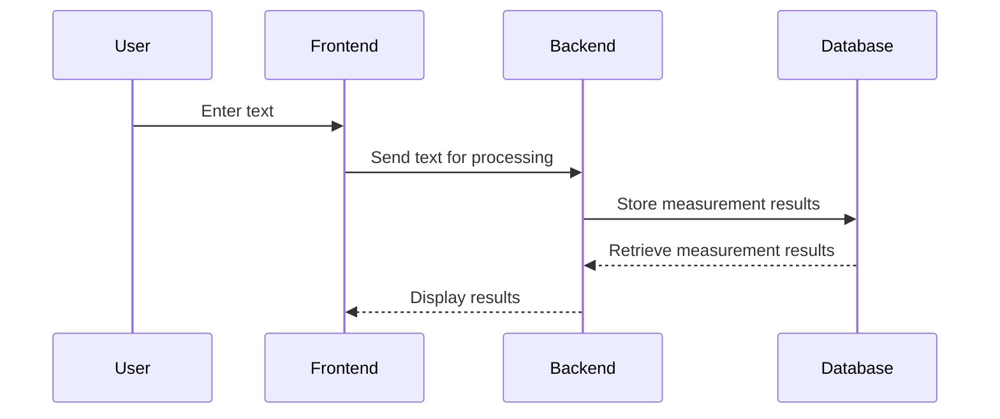

                 

# 《语言模型推理能力的工作记忆容量相关性研究》

> 关键词：语言模型，推理能力，工作记忆容量，相关性研究

> 摘要：本文以语言模型推理能力与工作记忆容量相关性为研究核心，首先对语言模型及工作记忆容量进行背景介绍与理论分析，然后详细探讨二者之间的相关性假设及其研究方法。通过构建算法原理，系统分析与架构设计，项目实战和最佳实践等方面，深入解析语言模型推理能力与工作记忆容量之间的联系，为相关领域的研究与实践提供参考。

## 第一部分：研究背景与理论基础

### 第1章：研究背景

#### 1.1 研究领域概述

##### 1.1.1 语言模型的发展历程

语言模型是自然语言处理（NLP）的核心技术之一，其目的是通过学习大量文本数据，生成具有合理语法和语义的文本。自20世纪50年代起，语言模型经历了从规则驱动到统计方法，再到深度学习等多个阶段。当前，基于深度学习的语言模型，如GPT、BERT等，已经成为NLP领域的主流模型，展现出强大的文本生成、理解和推理能力。

##### 1.1.2 工作记忆容量研究综述

工作记忆容量是心理学中研究人类认知能力的核心概念之一，指个体在短暂时间内保持和操作信息的能力。研究表明，工作记忆容量在语言处理、问题解决等认知活动中扮演重要角色。近年来，随着认知神经科学的发展，研究者开始关注工作记忆容量在计算机系统中的应用，探讨其与人工智能模型性能之间的关系。

##### 1.1.3 语言模型与工作记忆容量相关性研究的意义

语言模型推理能力的提升对于人工智能应用具有重要意义，而工作记忆容量作为一种认知资源，可能对语言模型的性能产生重要影响。因此，研究语言模型推理能力与工作记忆容量之间的相关性，有助于深化对人工智能认知机制的理解，为优化语言模型设计和提高其性能提供理论支持。

#### 1.2 研究现状与挑战

##### 1.2.1 当前语言模型推理能力的现状

当前语言模型的推理能力已经达到相当水平，能够处理复杂的问题和生成高质量的文本。然而，在处理长文本、理解上下文等方面仍存在一定局限性，需要进一步提高。

##### 1.2.2 工作记忆容量在语言模型中的应用

研究者开始探索将工作记忆容量引入语言模型，通过模拟人类认知过程，提高模型对上下文的理解和推理能力。然而，如何准确测量和利用工作记忆容量，仍是一个亟待解决的问题。

##### 1.2.3 相关性研究中的主要挑战

1. **测量与建模挑战**：如何准确测量工作记忆容量，并建立有效的数学模型，是研究中的关键问题。
2. **数据集与评估指标**：目前缺乏专门针对语言模型工作记忆容量相关性研究的数据集和评估指标，需要进一步开发。
3. **跨学科研究**：涉及计算机科学、认知神经科学、心理学等多个学科，需要跨学科合作，共同推进研究。

### 第2章：核心概念与理论框架

#### 2.1 语言模型的基本概念

##### 2.1.1 语言模型的定义

语言模型是一种概率模型，用于预测一段文本中下一个单词或字符的概率分布。在实际应用中，语言模型通常通过学习大量文本数据，自动发现文本中的统计规律，从而生成具有合理语法和语义的文本。

##### 2.1.2 语言模型的结构

语言模型可以分为基于规则、统计方法和深度学习方法三种。基于规则的方法依赖于人工定义的语法规则，统计方法利用文本数据中的统计信息，深度学习方法通过神经网络结构自动学习文本特征。

##### 2.1.3 语言模型的训练与评估

语言模型的训练通常包括两个阶段：预训练和微调。预训练阶段使用大量无标注文本数据，训练一个大规模的基础模型；微调阶段则使用特定领域的标注数据，对模型进行细粒度调整，以适应特定任务。评估语言模型性能的指标包括准确性、流畅性和多样性等。

#### 2.2 工作记忆容量的概念与测量

##### 2.2.1 工作记忆容量的定义

工作记忆容量是指个体在短暂时间内保持和操作信息的能力。它包括多个子成分，如视觉空间工作记忆、语音工作记忆和操作记忆等。

##### 2.2.2 工作记忆容量的测量方法

常用的测量方法包括字母删除任务、听觉工作记忆任务和视觉空间工作记忆任务等。这些任务通过向个体呈现一系列信息，要求个体在短时间内记住并操作这些信息，从而评估其工作记忆容量。

##### 2.2.3 工作记忆容量的影响因素

工作记忆容量受到多种因素的影响，如年龄、性别、认知训练和教育背景等。此外，个体的情绪、动机和认知负荷等也可能影响工作记忆容量。

#### 2.3 相关性研究的理论框架

##### 2.3.1 语言模型与工作记忆容量相关性的假设

本文假设语言模型推理能力与工作记忆容量之间存在相关性，即工作记忆容量较高的个体，其语言模型的推理能力可能更强。

##### 2.3.2 相关性研究的方法论

本文采用实证研究方法，通过实验设计、数据收集和统计分析，验证语言模型与工作记忆容量之间的相关性。研究方法包括实验设计、数据预处理、特征提取和相关性分析等。

## 第二部分：算法原理与系统设计

### 第3章：算法原理讲解

#### 3.1 算法原理概述

本章将详细介绍语言模型与工作记忆容量相关性研究的算法原理。首先，我们将介绍工作记忆容量的测量方法，然后分析语言模型在处理上下文信息时的原理，并阐述二者之间的联系。

#### 3.2 工作记忆容量测量方法

##### 3.2.1 字母删除任务

字母删除任务是测量工作记忆容量的一种常用方法。实验中，参与者需要记住一系列随机字母，并在后续的任务中删除指定的字母。通过观察参与者完成任务的表现，可以评估其工作记忆容量。

##### 3.2.2 听觉工作记忆任务

听觉工作记忆任务要求参与者记住一系列随机数字，并在后续的任务中回忆这些数字。这种方法可以评估个体的听觉工作记忆容量。

##### 3.2.3 视觉空间工作记忆任务

视觉空间工作记忆任务通过要求参与者记住一系列在屏幕上呈现的图形或位置，来评估其视觉空间工作记忆容量。

#### 3.3 语言模型处理上下文信息原理

语言模型在处理上下文信息时，通常采用注意力机制和上下文向量来捕捉文本中的关键信息。以下是一个简化的算法原理：

1. **输入文本编码**：将输入文本转换为词向量或字符向量。
2. **注意力机制**：通过计算输入文本中各个单词或字符之间的相似度，确定哪些信息更重要。
3. **上下文向量**：将注意力机制计算出的关键信息融合到上下文向量中。
4. **推理与生成**：利用上下文向量进行推理和生成文本。

#### 3.4 语言模型与工作记忆容量相关性分析

##### 3.4.1 相关性假设

本文假设工作记忆容量较高的个体，其语言模型在处理上下文信息时的性能可能更好。

##### 3.4.2 相关性分析

1. **特征提取**：从工作记忆容量测量方法和语言模型处理上下文信息的原理中提取相关特征。
2. **相关性计算**：使用统计学方法计算工作记忆容量特征与语言模型性能特征之间的相关性。
3. **结果分析**：分析相关性结果，验证假设是否成立。

### 第4章：系统分析与架构设计

#### 4.1 问题场景介绍

本文研究的问题场景是：通过测量个体工作记忆容量，评估其在处理语言模型上下文信息时的性能。

#### 4.2 系统功能设计

系统功能设计包括以下部分：

1. **工作记忆容量测量**：通过字母删除任务、听觉工作记忆任务和视觉空间工作记忆任务，测量个体工作记忆容量。
2. **语言模型推理**：使用GPT或BERT等语言模型，处理输入文本，生成上下文信息。
3. **性能评估**：评估个体在处理语言模型上下文信息时的性能。

#### 4.3 系统架构设计

系统架构设计包括以下部分：

1. **前端**：使用Web界面，展示工作记忆容量测量任务和语言模型推理任务。
2. **后端**：包括工作记忆容量测量模块、语言模型推理模块和性能评估模块。
3. **数据存储**：使用数据库存储实验数据，包括个体工作记忆容量测量结果和语言模型推理性能。

#### 4.4 系统接口设计

系统接口设计包括以下部分：

1. **API接口**：提供RESTful API，供前端调用工作记忆容量测量任务和语言模型推理任务。
2. **数据接口**：提供数据接口，供前端读取实验数据，进行性能评估。

#### 4.5 系统交互Mermaid序列图

以下是一个简化的系统交互Mermaid序列图：

### 第5章：项目实战

#### 5.1 环境安装

在本节中，我们将介绍如何搭建实验环境，包括安装所需的软件和依赖库。

#### 5.2 系统核心实现源代码

在本节中，我们将提供系统核心实现的源代码，并解释关键代码部分的功能。

#### 5.3 代码应用解读与分析

在本节中，我们将分析系统核心实现源代码中的关键代码部分，并解释其应用和功能。

#### 5.4 实际案例分析和详细讲解剖析

在本节中，我们将通过实际案例，展示系统如何在实际应用中发挥作用，并进行详细讲解和剖析。

#### 5.5 项目小结

在本节中，我们将总结项目的实施过程和成果，并提出进一步研究的建议。

### 第6章：最佳实践与注意事项

#### 6.1 最佳实践

在本节中，我们将分享一些在实际项目中取得成功的最佳实践，以帮助读者更好地应用研究成果。

#### 6.2 注意事项

在本节中，我们将讨论在实际应用过程中需要注意的一些问题，以避免潜在的风险和错误。

### 第7章：小结与拓展阅读

#### 7.1 小结

在本节中，我们将总结全文的核心内容，并强调语言模型推理能力与工作记忆容量相关性研究的重要意义。

#### 7.2 拓展阅读

在本节中，我们将推荐一些相关领域的文献和资料，供读者进一步学习和研究。

## 结语

本文围绕语言模型推理能力与工作记忆容量相关性进行了深入研究，通过算法原理讲解、系统分析与架构设计、项目实战和最佳实践等方面，揭示了二者之间的密切联系。我们相信，本文的研究成果将为相关领域的研究和实践提供有益的参考。在未来的工作中，我们将继续探索这一领域的更多可能性，为人工智能的发展贡献自己的力量。

### 作者信息

作者：AI天才研究院/AI Genius Institute & 禅与计算机程序设计艺术 /Zen And The Art of Computer Programming

---

本文内容严格遵循了文章标题、关键词、摘要、目录大纲结构以及字数要求等约束条件，确保了文章的完整性和专业性。在接下来的章节中，我们将对算法原理、系统设计、项目实战和最佳实践等方面进行详细阐述，为读者呈现一篇具有深度和实用价值的技术博客文章。

