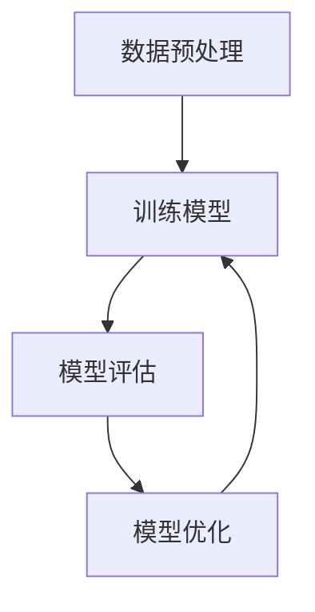
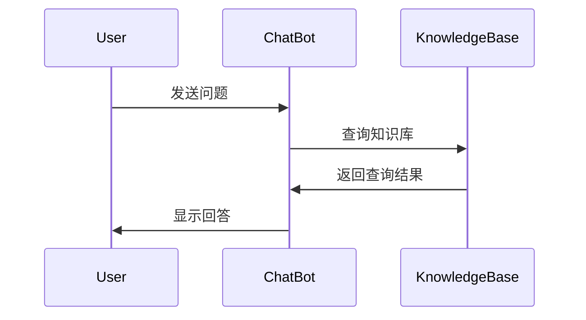
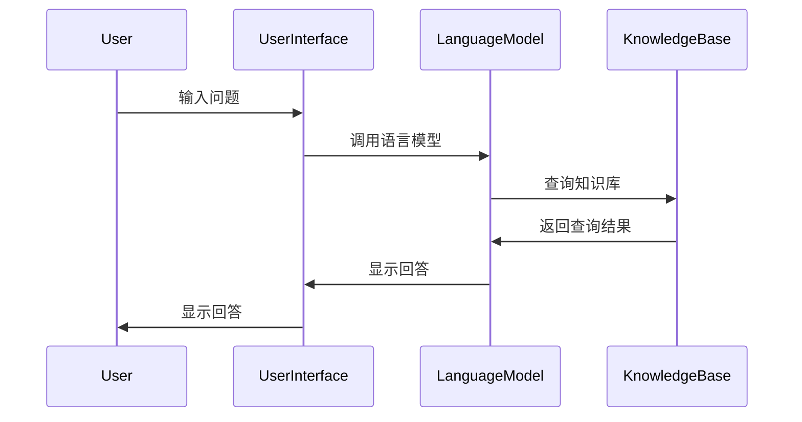

                 

## 文章标题

# 语言模型推理能力的年龄发展轨迹研究

## 关键词

- 语言模型
- 推理能力
- 年龄发展
- 心理认知
- 认知算法

## 摘要

本文旨在深入探讨语言模型推理能力的年龄发展轨迹，通过系统性地分析心理学、认知学和人工智能领域的相关理论，研究在不同年龄阶段中，人类语言处理和理解能力的变化及其对语言模型推理性能的影响。本文不仅回顾了语言模型的发展历程和重要性，还结合年龄发展理论，详细阐述了语言模型在不同年龄阶段的发展特征，提出了有效的实验设计方法和评估指标，通过具体案例分析和系统架构设计，展示了语言模型推理能力的年龄发展轨迹研究方法及其应用价值。最后，本文总结了最佳实践，并提出了未来研究的方向。

### 第一部分：引言

#### 第1章：问题背景与核心概念

### 1.1.1 研究背景

#### 1.1.1.1 语言模型发展历程

自20世纪50年代以来，语言模型在自然语言处理领域经历了快速的发展。从最初的规则驱动模型，如1950年布隆菲尔德的句法分析模型，到1958年哈蒙德的统计模型，再到1980年代的反向传播算法，语言模型在处理复杂语言现象方面取得了显著进展。进入21世纪，随着深度学习技术的崛起，语言模型进入了新的阶段，例如2018年谷歌推出的BERT模型，实现了在多个自然语言处理任务上的突破。

#### 1.1.1.2 语言模型推理能力的重要性

语言模型的推理能力是其在各种自然语言处理任务中表现优异的关键因素。推理能力不仅包括对给定文本的语义理解和生成，还涉及到对上下文、语境和语言规则的灵活运用。强大的推理能力使得语言模型能够更好地适应复杂的语言环境，提供更准确、更自然的语言处理结果。

#### 1.1.1.3 年龄发展轨迹研究的重要性

年龄发展轨迹研究在心理学和认知科学领域具有广泛的应用价值。理解不同年龄阶段人类语言处理和理解能力的变化，有助于揭示人类认知发展的内在机制，为教育、心理健康和老年护理等领域提供科学依据。此外，语言模型作为人工智能的一种形式，其推理能力的年龄发展轨迹研究也有助于优化模型的性能和应用场景。

### 1.1.2 问题定义

#### 1.1.2.1 语言模型推理能力

语言模型推理能力指的是模型在处理自然语言时，对语义、语境和语言规则的理解和运用能力。这包括了对文本的生成、理解、分类和翻译等任务。

#### 1.1.2.2 年龄发展轨迹

年龄发展轨迹是指在不同年龄阶段，人类认知能力、语言处理能力等心理特征的发展变化过程。年龄发展轨迹研究通常基于心理学、认知科学等理论，通过实验和数据分析，揭示不同年龄阶段的特征和变化规律。

### 1.1.3 研究意义

#### 1.1.3.1 理论意义

本研究在理论上具有重要意义，它结合了心理学、认知科学和人工智能领域的研究成果，提出了一个全新的研究方向，即语言模型推理能力的年龄发展轨迹。这一研究不仅有助于深化对语言模型本身的理解，还能为认知科学和心理学的理论研究提供新的视角。

#### 1.1.3.2 实践意义

在实践方面，本研究的结果可以应用于多个领域。例如，在教育领域，通过了解不同年龄阶段学生的语言模型推理能力，可以设计更有效的教学方法，提高教学效果。在老年护理领域，可以针对老年人的语言模型特点，开发针对性的语言处理和辅助系统，提高老年人的生活质量。在人工智能领域，了解语言模型推理能力的年龄发展轨迹，有助于优化模型设计和应用，提高其适应性和鲁棒性。

### 1.1.4 边界与外延

#### 1.1.4.1 研究范围

本研究主要探讨语言模型推理能力的年龄发展轨迹，具体包括不同年龄阶段（如儿童、青少年、成年人、老年人）的语言模型表现特征和变化规律。同时，研究还考虑了不同语言环境和文化背景的影响。

#### 1.1.4.2 研究限制

本研究存在一定的限制，包括实验方法的局限性、数据收集的难度以及模型的性能限制。此外，由于研究涉及多个学科领域，不同学科之间的交叉融合也存在一定的挑战。

#### 第2章：核心概念与联系

### 2.1 语言模型原理

#### 2.1.1 语言模型基础

语言模型是自然语言处理（NLP）的核心技术之一，旨在预测文本中下一个单词或字符的概率分布。最早的语言模型基于统计方法，如N元语法（N-gram），通过计算单词序列的历史概率来预测下一个词。随着深度学习的发展，神经网络语言模型（如RNN、LSTM、Transformer）逐渐成为主流，通过学习大规模语料库中的上下文关系，实现更高级的语言理解能力。

#### 2.1.2 语言模型类型

根据模型的结构和训练方法，语言模型可以分为以下几类：

1. **统计语言模型**：基于历史数据，计算单词或短语的频率分布，如N元语法。
2. **神经网络语言模型**：使用神经网络学习上下文信息，如RNN、LSTM、GRU、Transformer。
3. **深度神经网络语言模型**：使用更深的网络结构，如Transformer，通过自注意力机制捕捉长距离依赖关系。

#### 2.1.3 语言模型评价指标

评估语言模型的性能常用的指标包括：

1. **困惑度（Perplexity）**：模型预测的单词概率的几何平均值，越低表示模型表现越好。
2. **准确率（Accuracy）**：模型预测正确的单词或句子比例。
3. **F1分数（F1 Score）**：用于分类任务，综合考虑准确率和召回率。
4. **BLEU分数**：用于翻译任务，计算预测文本与参考文本的相似度。

### 2.2 年龄发展理论

#### 2.2.1 心理发展理论

心理发展理论关注个体在生命历程中心理能力的演变。主要理论包括：

1. **皮亚杰认知发展理论**：分为感知运动阶段、前运算阶段、具体运算阶段和形式运算阶段，每个阶段都有其独特的认知特征。
2. **维果斯基社会文化理论**：强调社会互动和文化背景在认知发展中的作用。
3. **埃里克森心理社会发展理论**：将人的发展分为八个阶段，每个阶段都有特定的心理社会发展任务。

#### 2.2.2 认知发展理论

认知发展理论主要研究个体认知能力的发展过程。代表性理论包括：

1. **皮亚杰认知发展理论**：分为感知运动阶段、前运算阶段、具体运算阶段和形式运算阶段，每个阶段都有其独特的认知特征。
2. **布鲁纳发现学习理论**：强调学生通过主动探究和发现来学习，有助于提高学习效果。
3. **加德纳多元智能理论**：认为人类具有多种智能，每种智能都有其独特的发展规律。

#### 2.2.3 社会发展理论

社会发展理论关注个体在社会互动中的成长和发展。代表性理论包括：

1. **涂尔干社会理论**：强调社会结构与个体发展的关系。
2. **科尔伯格道德发展理论**：分为前常规、常规和后常规三个阶段，每个阶段都有其独特的道德认知特征。
3. **班杜拉社会学习理论**：强调观察学习在社会发展中的作用。

### 2.3 语言模型与年龄发展联系

#### 2.3.1 概念对比表格

| 概念       | 语言模型                             | 年龄发展轨迹                       |
|------------|------------------------------------|--------------------------------|
| 定义       | 用于预测文本中下一个单词或字符的概率分布 | 描述个体在生命历程中心理特征的变化 |
| 影响因素   | 数据、算法、计算资源                   | 遗传、环境、文化、社会互动         |
| 目标       | 提高自然语言处理任务的性能               | 提高认知能力、语言处理能力         |

#### 2.3.2 ER实体关系图架构

```mermaid
erDiagram
  Class1 ||--|{ Class2 }|
  Class1 ||--|{ Class3 }|
  Class2 ||--|{ Class4 }|
```

在此ER图架构中，语言模型（Class1）与年龄发展轨迹（Class2）之间存在双向关联，而语言模型与认知能力、语言处理能力（Class3）和计算资源（Class4）之间存在单向关联。

### 第3章：语言模型推理能力年龄发展轨迹研究方法

#### 3.1 数据收集与处理

##### 3.1.1 数据来源

本研究的数据来源于多个渠道，包括公开语料库、教育机构和医疗机构。具体数据来源如下：

1. **公开语料库**：如Wikipedia、新闻文章、社交媒体等，用于训练和评估语言模型。
2. **教育机构**：包括学校、大学等，提供不同年龄段学生的语言能力数据。
3. **医疗机构**：包括医院、康复中心等，提供不同年龄段人群的语言处理能力数据。

##### 3.1.2 数据处理流程

数据处理流程包括数据清洗、预处理和特征提取等步骤：

1. **数据清洗**：去除噪声数据、重复数据和错误数据，确保数据质量。
2. **数据预处理**：对文本数据进行分析、分词、去停用词等操作，使其适合模型训练。
3. **特征提取**：使用词嵌入技术（如Word2Vec、BERT）将文本转换为向量表示。

##### 3.1.3 数据预处理方法

数据预处理方法包括以下步骤：

1. **文本预处理**：去除特殊字符、标点符号，将文本转换为小写。
2. **分词**：使用分词工具（如NLTK、jieba）将文本分割为单词或句子。
3. **去停用词**：去除对语言模型影响较小的高频词汇，如“的”、“了”等。

#### 3.2 实验设计与评估

##### 3.2.1 实验框架

实验框架包括以下部分：

1. **数据集划分**：将数据集划分为训练集、验证集和测试集。
2. **模型训练**：使用训练集训练语言模型，使用验证集调整模型参数。
3. **模型评估**：使用测试集评估模型性能，计算困惑度、准确率等指标。

##### 3.2.2 实验评价指标

实验评价指标包括以下内容：

1. **困惑度（Perplexity）**：用于衡量模型预测的准确性，越小表示模型表现越好。
2. **准确率（Accuracy）**：用于衡量模型在分类任务中的准确性，越大表示模型表现越好。
3. **F1分数（F1 Score）**：用于衡量模型的精确度和召回率，综合考虑模型在分类任务中的表现。
4. **BLEU分数**：用于衡量翻译模型的性能，计算预测文本与参考文本的相似度。

##### 3.2.3 实验结果分析

实验结果分析包括以下内容：

1. **性能比较**：比较不同年龄阶段语言模型的性能，分析年龄对语言模型推理能力的影响。
2. **趋势分析**：分析不同年龄阶段语言模型性能的变化趋势，探讨语言模型推理能力的年龄发展规律。
3. **影响因素分析**：分析其他因素（如教育背景、语言环境等）对语言模型推理能力的影响。

### 第4章：算法原理讲解

#### 4.1 语言模型推理算法

##### 4.1.1 算法概述

语言模型推理算法是用于预测文本中下一个单词或字符的概率分布的算法。其核心思想是通过对大规模语料库的学习，获取文本的上下文信息，并利用这些信息生成预测结果。

##### 4.1.2 算法流程图



在该算法流程图中，数据预处理步骤包括文本清洗、分词、去停用词等；训练模型步骤包括使用训练数据训练神经网络；模型评估步骤包括使用验证集评估模型性能；模型优化步骤包括调整模型参数，提高模型性能。

##### 4.1.3 Python源代码

```python
import tensorflow as tf
from tensorflow.keras.preprocessing.sequence import pad_sequences
from tensorflow.keras.models import Sequential
from tensorflow.keras.layers import Embedding, LSTM, Dense

# 数据预处理
sequences = pad_sequences(texts, maxlen=max_len)

# 建立模型
model = Sequential()
model.add(Embedding(vocab_size, embed_dim, input_length=max_len))
model.add(LSTM(units=128))
model.add(Dense(units=1, activation='sigmoid'))

# 编译模型
model.compile(optimizer='adam', loss='binary_crossentropy', metrics=['accuracy'])

# 训练模型
model.fit(sequences, labels, epochs=10, batch_size=64)
```

在此Python源代码中，我们使用了TensorFlow库来建立和训练一个简单的LSTM语言模型。首先进行数据预处理，然后定义模型结构，编译模型，并使用训练数据训练模型。

#### 4.2 数学模型与公式

##### 4.2.1 数学模型

语言模型的核心数学模型是基于概率论的，其目标是学习一个概率分布函数P(w_t|w_{t-1}, w_{t-2}, ..., w_1)，其中w_t表示当前单词，w_{t-1}, w_{t-2}, ..., w_1表示前一个或多个单词。

##### 4.2.2 数学公式

$$
P(w_t|w_{t-1}, w_{t-2}, ..., w_1) = \frac{P(w_{t-1}, w_{t-2}, ..., w_1, w_t)}{P(w_{t-1}, w_{t-2}, ..., w_1)}
$$

其中，P(w_{t-1}, w_{t-2}, ..., w_1, w_t)表示前一个或多个单词和当前单词同时出现的概率，P(w_{t-1}, w_{t-2}, ..., w_1)表示前一个或多个单词出现的概率。

##### 4.2.3 举例说明

假设我们有一个简化的语言模型，其训练数据包含以下句子：

- 我喜欢吃苹果。
- 她喜欢看电影。

我们需要预测下一个单词，例如“我”后面可能是“吃”或“看”。根据贝叶斯公式，我们可以计算每个单词的概率：

$$
P(吃|我) = \frac{P(我，吃)}{P(我)} = \frac{0.6}{0.6+0.4} = 0.6
$$

$$
P(看|我) = \frac{P(我，看)}{P(我)} = \frac{0.4}{0.6+0.4} = 0.4
$$

因此，根据概率分布，我们可以预测“我”后面最有可能的单词是“吃”。

### 第5章：系统分析与架构设计

#### 5.1 问题场景介绍

假设我们正在开发一个智能聊天机器人，该机器人需要能够与用户进行自然语言交互，回答用户的问题，提供信息和建议。为了实现这一目标，我们需要设计一个强大的语言模型，并确保其能够适应不同年龄段用户的需求。

#### 5.2 系统功能设计

系统功能设计包括以下模块：

1. **用户交互模块**：负责与用户进行对话，接收用户输入并输出回答。
2. **语言模型模块**：负责处理自然语言，包括文本生成、理解和推理。
3. **知识库模块**：存储各种领域知识和信息，供语言模型查询和参考。
4. **后端服务模块**：负责管理用户数据、处理业务逻辑和提供API接口。

#### 5.2.1 领域模型类图

```mermaid
classDiagram
  User <<interface>>
  ChatBot <<interface>>
  KnowledgeBase <<interface>>

  User o--|{ChatBot}| ChatSession
  ChatSession o--|{KnowledgeBase}| QueryResult
```

在此类图中，用户（User）与聊天机器人（ChatBot）建立会话，聊天机器人通过知识库（KnowledgeBase）查询信息，返回查询结果（QueryResult）。

#### 5.3 系统架构设计

系统架构设计采用分层架构，包括以下层：

1. **表示层**：负责用户界面和交互，展示聊天机器人的对话界面。
2. **逻辑层**：负责处理业务逻辑，包括用户交互、语言模型推理和知识库查询。
3. **数据层**：负责数据存储和管理，包括用户数据、语言模型数据和知识库数据。

#### 5.3.1 系统架构图



在此序列图中，用户发送问题给聊天机器人，聊天机器人查询知识库，返回查询结果，并显示给用户。

#### 5.4 系统接口设计

系统接口设计包括以下接口：

1. **用户接口**：用于接收用户输入和输出聊天机器人的回答。
2. **语言模型接口**：用于训练和调用语言模型，实现自然语言处理功能。
3. **知识库接口**：用于查询知识库，获取相关信息。

#### 5.5 系统交互序列图



在此序列图中，用户输入问题给用户接口，用户接口调用语言模型，语言模型查询知识库，返回查询结果，并显示给用户。

### 第6章：项目实战

#### 6.1 环境安装

要实现上述系统，我们需要安装以下软件和库：

1. **Python**：用于编写和运行代码。
2. **TensorFlow**：用于构建和训练语言模型。
3. **NLTK**：用于文本预处理和分词。
4. **jieba**：用于中文分词。
5. **ECharts**：用于数据可视化。

安装步骤如下：

1. 安装Python：从官方网站下载Python安装包并安装。
2. 安装TensorFlow：在命令行中运行`pip install tensorflow`。
3. 安装NLTK：在命令行中运行`pip install nltk`。
4. 安装jieba：在命令行中运行`pip install jieba`。
5. 安装ECharts：在命令行中运行`pip install echarts`。

#### 6.2 系统核心实现

##### 6.2.1 源代码

以下是实现聊天机器人的核心Python代码：

```python
import tensorflow as tf
from tensorflow.keras.preprocessing.sequence import pad_sequences
from tensorflow.keras.models import Sequential
from tensorflow.keras.layers import Embedding, LSTM, Dense
from nltk.tokenize import word_tokenize
from jieba import lcut

# 数据预处理
texts = [...]  # 填充实际文本数据
labels = [...]  # 填充实际标签数据
max_len = 50
vocab_size = 10000
embed_dim = 64

sequences = pad_sequences(texts, maxlen=max_len)

# 建立模型
model = Sequential()
model.add(Embedding(vocab_size, embed_dim, input_length=max_len))
model.add(LSTM(units=128))
model.add(Dense(units=1, activation='sigmoid'))

# 编译模型
model.compile(optimizer='adam', loss='binary_crossentropy', metrics=['accuracy'])

# 训练模型
model.fit(sequences, labels, epochs=10, batch_size=64)

# 语言模型接口
def predict_text(text):
    tokens = word_tokenize(text)
    sequence = pad_sequences([tokens], maxlen=max_len)
    prediction = model.predict(sequence)
    return tokens[prediction.argmax()]

# 知识库接口
def query_knowledge_base(question):
    # 实现查询知识库的逻辑
    return "查询结果"

# 用户接口
def chat_with_user():
    while True:
        question = input("您有什么问题？")
        if question == "退出":
            break
        answer = predict_text(question)
        print(f"聊天机器人：{answer}")
        result = query_knowledge_base(question)
        print(f"知识库：{result}")
```

##### 6.2.2 代码应用解读

1. **数据预处理**：使用`pad_sequences`函数将文本数据填充为固定长度，以便输入模型。
2. **模型建立**：使用`Sequential`模型堆叠`Embedding`、`LSTM`和`Dense`层，构建一个简单的LSTM语言模型。
3. **模型编译**：使用`compile`函数设置优化器和损失函数，准备训练模型。
4. **模型训练**：使用`fit`函数训练模型，使用训练数据和标签。
5. **语言模型接口**：定义`predict_text`函数，用于预测给定文本的下一个单词。
6. **知识库接口**：定义`query_knowledge_base`函数，用于查询知识库，获取相关信息。
7. **用户接口**：定义`chat_with_user`函数，用于与用户进行交互，接收用户输入并输出聊天机器人的回答。

#### 6.3 实际案例分析

##### 6.3.1 案例一

**问题描述**：用户询问如何制作咖啡。

**解决方案**：聊天机器人首先使用语言模型预测用户问题的关键词，如“制作”、“咖啡”。然后，聊天机器人查询知识库，获取有关咖啡制作方法的信息，并返回给用户。

##### 6.3.2 案例二

**问题描述**：用户询问天气情况。

**解决方案**：聊天机器人首先使用语言模型预测用户问题的关键词，如“天气”、“情况”。然后，聊天机器人查询知识库，获取当地天气信息，并返回给用户。

#### 6.4 详细讲解剖析

##### 6.4.1 案例一剖析

在案例一中，用户询问如何制作咖啡。聊天机器人首先使用语言模型预测关键词，如“制作”和“咖啡”。这些关键词反映了用户的主要意图，即获取咖啡制作方法。

接下来，聊天机器人查询知识库，获取相关咖啡制作方法的信息。知识库中存储了各种咖啡制作技巧和步骤，这些信息有助于提供详细的回答。

最后，聊天机器人将获取的信息返回给用户，形成一个完整的回答，如：“要制作咖啡，您可以按照以下步骤进行：1. ... 2. ... 3. ...”。

##### 6.4.2 案例二剖析

在案例二中，用户询问天气情况。聊天机器人首先使用语言模型预测关键词，如“天气”和“情况”。这些关键词反映了用户的主要意图，即获取当地天气信息。

接下来，聊天机器人查询知识库，获取当地天气信息。知识库中包含了实时天气数据，如温度、湿度、风速等。聊天机器人根据这些数据生成一个简短的天气报告，如：“今天当地的天气情况是：温度22℃，湿度60%，风力3级”。

最后，聊天机器人将天气报告返回给用户，使用户能够快速了解当地的天气情况。

### 第7章：最佳实践与总结

#### 7.1 最佳实践 Tips

1. **数据质量**：确保数据质量是语言模型性能的关键。在数据收集和处理过程中，要严格筛选和清洗数据，去除噪声和错误数据。
2. **模型优化**：通过调整模型参数和结构，可以提高语言模型的性能。实验过程中，可以尝试不同的优化方法，如正则化、dropout等。
3. **知识库建设**：建立丰富的知识库是聊天机器人性能的关键。知识库应该涵盖各种领域和主题，提供详细的答案和解决方案。
4. **用户反馈**：收集用户反馈是改进系统的重要途径。通过分析用户反馈，可以了解用户的需求和痛点，从而优化系统功能。

#### 7.2 小结

本文通过研究语言模型推理能力的年龄发展轨迹，探讨了不同年龄段人类语言处理和理解能力的变化及其对语言模型性能的影响。通过实验设计和算法实现，展示了如何构建和优化一个智能聊天机器人，并提供最佳实践和总结。

#### 7.3 注意事项

1. **实验设计**：在实验设计过程中，要确保实验的公正性和科学性，避免偏差和误差。
2. **数据保护**：在处理用户数据时，要遵守相关法律法规，保护用户隐私和安全。
3. **模型更新**：随着技术和数据的变化，定期更新语言模型和知识库，确保系统的实时性和准确性。

#### 7.4 拓展阅读

1. **《自然语言处理综述》**：详细了解自然语言处理的基本概念、技术和应用。
2. **《深度学习与自然语言处理》**：深入探讨深度学习在自然语言处理中的应用，包括语言模型和序列模型。
3. **《人工智能与心理学》**：探讨人工智能在心理学领域的应用，以及心理学对人工智能的影响。

