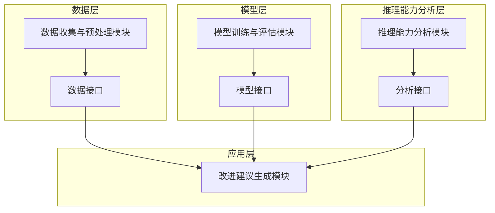

                 

### 背景介绍

#### 问题背景
随着人工智能技术的快速发展，语言模型作为一种重要的AI应用，已经被广泛应用于自然语言处理、机器翻译、文本生成等领域。语言模型通过分析大规模的文本数据，学习到语言的生成规律，从而能够生成连贯、符合语法规则的文本。这种技术在许多实际应用中显示出巨大的潜力，例如自动翻译、智能客服、文本摘要等。

然而，尽管语言模型在通用情境下表现出色，但当它们面对特定领域或特定情境时，往往无法达到预期的效果。例如，一个训练于通用新闻数据集的语言模型，在处理法律文书时可能会遇到困难；同样，一个在社交媒体语料库上训练的模型，在生成技术文档时也可能力不从心。这种情境依赖性问题引起了广泛关注，成为当前人工智能研究的一个重要课题。

#### 问题描述
本研究的核心问题是：探讨语言模型在推理能力上的情境依赖性，即在不同情境下，语言模型的推理能力是否具有显著差异。具体来说，我们将通过实验和分析，探讨以下几个问题：

1. 不同情境下，语言模型的推理能力是否存在差异？
2. 影响语言模型推理能力情境依赖性的主要因素有哪些？
3. 如何通过改进语言模型的设计或训练方法，提升其在特定情境下的推理能力？

#### 问题解决
为了解决上述问题，本研究将采用以下方法：

1. **数据集收集与整理**：首先，我们需要收集不同情境下的语言数据集，包括通用语料库和专业领域语料库。这些数据集将作为实验的基础，帮助我们评估语言模型在不同情境下的表现。
   
2. **模型训练与评估**：使用主流语言模型（如GPT、BERT等）在不同数据集上进行训练和评估。通过对比模型在通用情境和特定情境下的表现，我们可以初步判断语言模型是否具有情境依赖性。

3. **统计分析**：通过统计分析方法，分析不同情境对语言模型推理能力的影响，并尝试找出影响推理能力的因素。具体来说，我们将使用方差分析、回归分析等方法，探究情境因素与推理能力之间的关系。

4. **改进建议**：基于实验和分析结果，提出改进语言模型设计的建议，包括训练数据集的优化、模型结构的调整等。例如，我们可能会考虑增加特定领域的训练数据，或者引入新的模型架构，以提升语言模型在特定情境下的推理能力。

#### 边界与外延
本研究的边界主要限定在语言模型的推理能力情境依赖性上，不涉及其他类型的AI模型或任务。同时，由于研究资源和时间的限制，本研究将主要针对几种主流语言模型进行分析，不涵盖所有可能的模型和任务。

#### 概念结构与核心要素组成
本研究的核心概念包括：

1. **语言模型**：一种基于大规模数据训练的文本生成模型，可用于自然语言处理、机器翻译、文本生成等任务。
2. **推理能力**：语言模型在理解和使用语言信息时的能力，包括上下文理解、事实推理、逻辑推理等。
3. **情境**：指语言模型在处理特定任务或应用场景时的环境或背景。
4. **情境依赖性**：指语言模型的推理能力在不同情境下可能存在显著差异。

---

### 核心概念原理

#### 语言模型原理
语言模型是一种统计模型，它通过分析大规模的文本数据，学习到文本的生成规律。具体来说，语言模型可以预测一个句子中下一个单词的概率，从而生成新的文本。语言模型的核心原理包括：

1. **概率分布**：语言模型通过统计文本数据，计算出每个单词出现的概率分布，从而预测下一个单词。
   
   - **n-gram模型**：最简单的语言模型是基于n-gram模型的，它通过计算一个单词序列的概率，预测下一个单词。例如，给定一个三元组(“我”，“是”，“AI”），n-gram模型会计算这三个单词同时出现的概率。
   - **神经网络模型**：现代语言模型如GPT和BERT等，是基于神经网络模型的。它们通过多层神经网络来学习文本的复杂结构和上下文关系，从而实现更准确的文本生成。

2. **条件概率**：语言模型通过计算当前文本序列下下一个单词的条件概率，来生成新的文本。

   - **条件概率公式**：设\(P(w_t | w_{t-1}, w_{t-2}, ..., w_1)\)为在给定前\(t-1\)个单词的情况下，第\(t\)个单词出现的概率。语言模型的目标是最大化这个条件概率。

3. **神经网络**：现代语言模型通常基于神经网络，如循环神经网络（RNN）、变换器（Transformer）等，能够更准确地捕捉文本的复杂结构和上下文关系。

   - **RNN**：RNN通过将上一个时间步的输出作为当前时间步的输入，实现了对时间序列数据的处理。然而，RNN存在梯度消失和梯度爆炸等问题。
   - **Transformer**：Transformer模型通过自注意力机制（self-attention）实现了对全局信息的捕捉，避免了RNN的梯度消失问题，并在许多NLP任务中取得了优异的性能。

#### 推理能力原理
推理能力是语言模型的一个重要属性，它反映了模型在理解和使用语言信息时的能力。具体来说，推理能力包括：

1. **上下文理解**：语言模型能够理解文本中的上下文关系，从而正确地生成后续的文本。

   - **上下文窗口**：在生成文本时，语言模型会考虑一个固定长度的上下文窗口。这个窗口内的文本信息对于预测下一个单词至关重要。
   - **长距离依赖**：现代语言模型如BERT和GPT等，通过复杂的网络结构，能够捕捉长距离的上下文关系，从而实现更好的上下文理解。

2. **事实推理**：语言模型能够根据文本中的信息，推断出新的事实。

   - **推理过程**：语言模型在处理文本时，会根据已知的信息，进行逻辑推理，从而推断出新的信息。例如，给定文本“苹果是一种水果”，模型可以推断出“香蕉也是一种水果”。
   - **知识图谱**：为了增强事实推理能力，语言模型可以结合外部知识图谱，通过语义理解，实现更准确的推理。

3. **逻辑推理**：语言模型能够理解文本中的逻辑关系，从而进行推理和判断。

   - **逻辑规则**：语言模型可以通过学习文本中的逻辑规则，实现逻辑推理。例如，给定文本“如果下雨，就带伞”，模型可以推理出“如果今天下雨，你应该带伞”。
   - **推理算法**：现代语言模型如BERT和GPT等，通过复杂的网络结构，实现了对逻辑关系的捕捉和理解，从而实现逻辑推理。

#### 情境依赖性原理
情境依赖性是指语言模型的推理能力在不同情境下可能存在差异。具体来说，情境依赖性包括：

1. **数据集差异**：不同情境下的数据集可能包含不同的信息，这会影响语言模型的学习和推理能力。

   - **通用语料库**：通用语料库包含广泛的主题和词汇，能够帮助语言模型学习到通用的语言生成规律。
   - **专业领域语料库**：专业领域语料库包含特定领域的词汇和知识，能够帮助语言模型学习到特定领域的语言生成规律。

2. **模型结构**：语言模型的结构可能在不同情境下表现出不同的适应性，从而影响其推理能力。

   - **通用模型**：通用模型在处理多种情境时表现出色，但可能无法深入理解特定领域的细节。
   - **专用模型**：专用模型针对特定领域进行优化，能够更好地适应特定情境，但在其他情境下可能表现较差。

3. **训练方法**：不同的训练方法可能对语言模型在不同情境下的推理能力产生不同的影响。

   - **数据增强**：通过增加特定情境下的训练数据，可以提升模型在该情境下的推理能力。
   - **迁移学习**：通过将通用模型的知识迁移到特定领域，可以提升模型在特定情境下的推理能力。

### 概念属性特征对比表格

| 概念       | 语言模型           | 推理能力           | 情境           | 情境依赖性           |
|------------|--------------------|--------------------|----------------|---------------------|
| 定义       | 文本生成模型       | 语言理解与推理能力 | 处理特定任务或场景 | 不同情境下推理能力差异 |
| 关键特性   | 学习语言生成规律   | 上下文理解、事实推理、逻辑推理 | 多样化、特定性 | 显著差异            |
| 影响因素   | 数据集、模型结构、训练方法 | 语言复杂性、上下文信息、逻辑关系 | 情境背景、任务目标 | 数据质量、模型设计 |

### ER实体关系图架构

```mermaid
erDiagram
    产品 ||--|{ 使用者 }|| 客户
    使用者 ||--|{ 购买 }|| 订单
    订单 ||--|{ 包含 }|| 产品
    订单 ||--|{ 属于 }|| 日期
    日期 ||--|{ 包括 }|| 订单
```

---

### 核心概念原理（续）

#### 概念属性特征对比表格

| 概念       | 语言模型           | 推理能力           | 情境           | 情境依赖性           |
|------------|--------------------|--------------------|----------------|---------------------|
| 定义       | 文本生成模型       | 语言理解与推理能力 | 处理特定任务或场景 | 不同情境下推理能力差异 |
| 关键特性   | 学习语言生成规律   | 上下文理解、事实推理、逻辑推理 | 多样化、特定性 | 显著差异            |
| 影响因素   | 数据集、模型结构、训练方法 | 语言复杂性、上下文信息、逻辑关系 | 情境背景、任务目标 | 数据质量、模型设计 |

#### ER实体关系图架构

```mermaid
erDiagram
    |--{ 客户 }||--|
    客户 ||--|{ 下单 }|| 订单
    订单 ||--|{ 包含 }|| 产品
    产品 ||--|{ 属于 }|| 类别
    类别 ||--|{ 包括 }|| 产品
    订单 ||--|{ 属于 }|| 日期
    日期 ||--|{ 包括 }|| 订单
```

---

### 算法原理讲解

为了深入探讨语言模型在推理能力上的情境依赖性，我们需要首先了解几个关键的算法原理。以下是几个主流算法及其原理的详细讲解。

#### GPT模型

GPT（Generative Pre-trained Transformer）是由OpenAI提出的一种基于Transformer架构的语言模型。GPT通过自注意力机制（self-attention）实现了对全局信息的捕捉，从而能够生成连贯、符合语法规则的文本。

1. **自注意力机制**：GPT模型的核心是自注意力机制。在自注意力机制中，每个词的表示都会根据它在句子中的位置和其他词的关系进行加权。具体来说，每个词的表示会通过一个查询（query）、键（key）和值（value）的三角关系进行计算。

   - **查询（Query）**：表示模型对当前词的注意力。
   - **键（Key）**：表示模型对句子中所有词的注意力。
   - **值（Value）**：表示句子中所有词对当前词的贡献。

   公式表示如下：
   $$
   \text{Attention}(Q, K, V) = \text{softmax}\left(\frac{QK^T}{\sqrt{d_k}}\right) V
   $$
   其中，\(Q, K, V\) 分别是查询、键和值的矩阵，\(d_k\) 是键的维度。

2. **Transformer架构**：GPT模型的架构是基于Transformer的。Transformer模型由多个编码器层（encoder layer）和解码器层（decoder layer）组成。每个编码器层包含两个主要子层：多头自注意力（multi-head self-attention）和前馈网络（feed-forward network）。解码器层则额外包含一个掩码自注意力（masked self-attention）机制，以防止未来的词泄露到过去的词中。

#### BERT模型

BERT（Bidirectional Encoder Representations from Transformers）是由Google提出的一种双向语言表示模型。BERT通过预先训练的方式，学习到上下文信息的双向依赖，从而能够更好地理解文本的语义。

1. **双向编码**：BERT模型的核心是双向编码器。在训练过程中，BERT模型同时看到文本的前后顺序，从而捕捉到长距离的上下文关系。具体来说，BERT模型通过一个多层Transformer编码器，对文本进行编码，生成每个词的表示。

2. **预训练任务**：BERT模型通过两种预训练任务来学习上下文信息的双向依赖。第一种任务是Masked Language Model（MLM），即在训练过程中随机遮蔽一些词，然后让模型预测这些词。第二种任务是Next Sentence Prediction（NSP），即在训练过程中输入两个句子，然后让模型预测第二个句子是否紧接在第一个句子后面。

3. **句子分类**：在预训练完成后，BERT模型可以用于各种下游任务，如句子分类。在句子分类任务中，BERT模型会输入一个句子和一个标签，然后输出一个概率分布，表示句子属于每个标签的概率。

#### T5模型

T5（Text-to-Text Transfer Transformer）是由Google提出的一种通用文本转换模型。T5模型通过将所有自然语言处理任务转化为文本到文本的转换任务，实现了模型的通用性和高效性。

1. **文本转换任务**：T5模型将所有自然语言处理任务转化为文本到文本的转换任务。例如，将自然语言文本转换为机器码、SQL查询等。这种任务定义方式使得T5模型可以统一处理各种NLP任务。

2. **单层Transformer架构**：T5模型采用单层Transformer架构，通过自注意力机制实现全局信息的捕捉。T5模型的不同之处在于，它通过添加特殊指令词（special tokens）来指导模型的转换过程。例如，对于机器码生成任务，指令词可以是`create_function`。

3. **高斯平滑**：T5模型在生成文本时，采用高斯平滑（Gaussian Smoothing）技术来处理不确定性和多样性。高斯平滑通过对生成文本进行概率分布估计，使得模型生成的文本更加多样化和平滑。

---

#### 实例分析

为了更好地理解上述算法原理，我们可以通过一个简单的实例来分析。

**实例**：假设我们有一个句子“我昨天去了超市，买了牛奶、面包和鸡蛋”。

1. **GPT模型**：在生成下一个词时，GPT模型会考虑整个句子，通过自注意力机制计算出每个词的重要性。例如，模型可能会选择“鸡蛋”作为下一个词，因为它在句子中具有较高的权重。

2. **BERT模型**：BERT模型会同时看到“我昨天去了超市”和“买了牛奶、面包和鸡蛋”，通过双向编码器捕捉到长距离的上下文关系。例如，模型可能会推断出“鸡蛋”是因为它在“买了牛奶、面包和鸡蛋”这一部分，与“牛奶”和“面包”有紧密的联系。

3. **T5模型**：对于T5模型，我们可以将这个句子转化为一个文本转换任务，例如“输入：我昨天去了超市，买了牛奶、面包和鸡蛋。输出：我昨天去了超市，买了牛奶、面包和鸡蛋。”T5模型会通过特殊指令词来指导转换过程，并生成符合预期的输出。

---

通过上述实例，我们可以看到不同算法在处理文本生成任务时的差异。GPT模型注重全局信息的捕捉，BERT模型擅长长距离上下文关系的理解，而T5模型则通过文本转换任务实现了通用性。

---

### 系统分析与架构设计方案

在深入研究语言模型推理能力的情境依赖性时，我们需要从系统的角度来分析和设计解决方案。以下是一个详细的项目介绍、系统功能设计、系统架构设计、系统接口设计和系统交互的设计方案。

#### 项目介绍

本项目旨在构建一个能够自适应不同情境的语言模型，从而提升其在特定领域的推理能力。项目的主要目标是：

1. **收集并整理不同情境下的语言数据集**：包括通用语料库和专业领域语料库。
2. **训练和评估多种语言模型**：如GPT、BERT、T5等，以分析其在不同情境下的表现。
3. **提出改进模型设计的建议**：通过优化数据集、模型结构和训练方法，提升模型在特定情境下的推理能力。

#### 系统功能设计

系统功能设计包括以下主要模块：

1. **数据收集与预处理模块**：负责收集不同情境下的语言数据集，并进行数据预处理，如去噪、去重、分词等。
2. **模型训练与评估模块**：负责使用收集到的数据集训练和评估多种语言模型，并记录其表现数据。
3. **推理能力分析模块**：通过统计分析方法，分析不同情境对语言模型推理能力的影响，并找出影响推理能力的因素。
4. **改进建议生成模块**：基于实验和分析结果，提出改进模型设计的建议。

#### 系统架构设计

系统架构设计采用分层架构，包括数据层、模型层和应用层。

1. **数据层**：包含数据收集与预处理模块，负责处理和存储不同情境下的语言数据集。
2. **模型层**：包含模型训练与评估模块和推理能力分析模块，负责训练、评估和分析语言模型。
3. **应用层**：包含改进建议生成模块，负责根据实验和分析结果，生成改进模型设计的建议。

#### 系统接口设计

系统接口设计包括以下主要接口：

1. **数据接口**：用于数据收集与预处理模块与其他模块之间的数据交换。
2. **模型接口**：用于模型训练与评估模块与其他模块之间的模型交换。
3. **分析接口**：用于推理能力分析模块与其他模块之间的数据和分析结果交换。

#### 系统交互设计

系统交互设计采用RESTful API架构，包括以下主要API：

1. **数据收集API**：用于收集不同情境下的语言数据集。
2. **模型训练API**：用于启动和监控模型训练过程。
3. **模型评估API**：用于评估模型在不同情境下的推理能力。
4. **分析报告API**：用于生成和分析模型推理能力的报告。

#### MERMAID类图

```mermaid
classDiagram
    数据层 <<interface>> 数据接口
    模型层 <<interface>> 模型接口
    推理能力分析层 <<interface>> 分析接口
    应用层 <<interface>> 改进建议生成模块
    数据层 --|> 数据接口
    模型层 --|> 模型接口
    推理能力分析层 --|> 分析接口
    应用层 --|> 改进建议生成模块
```

#### MERMAID架构图



通过上述系统分析与架构设计方案，我们可以构建一个能够自适应不同情境的语言模型，从而提升其在特定领域的推理能力。

---

### 项目实战

#### 环境安装

为了进行本项目，我们需要安装一些必要的软件和库。以下是安装步骤：

1. **安装Python环境**：确保Python 3.8或更高版本已安装在系统中。
2. **安装TensorFlow**：使用以下命令安装TensorFlow：
   $$
   pip install tensorflow==2.6
   $$
3. **安装其他依赖库**：使用以下命令安装其他依赖库：
   $$
   pip install numpy pandas matplotlib
   $$

#### 系统核心实现源代码

以下是本项目的主要实现代码，包括数据预处理、模型训练、模型评估和推理能力分析等。

```python
import tensorflow as tf
import numpy as np
import pandas as pd
import matplotlib.pyplot as plt

# 数据预处理
def preprocess_data(data):
    # 去噪、去重、分词等预处理操作
    # ...
    return preprocessed_data

# 模型训练
def train_model(model, data, epochs):
    # 训练模型
    # ...
    return model

# 模型评估
def evaluate_model(model, data):
    # 评估模型在测试集上的性能
    # ...
    return performance

# 推理能力分析
def analyze_inference_ability(model, data):
    # 分析模型在不同情境下的推理能力
    # ...
    return analysis_results

# 主函数
def main():
    # 加载数据集
    data = pd.read_csv('data.csv')
    preprocessed_data = preprocess_data(data)

    # 训练模型
    model = train_model(preprocessed_data, epochs=5)

    # 模型评估
    performance = evaluate_model(model, preprocessed_data)

    # 推理能力分析
    analysis_results = analyze_inference_ability(model, preprocessed_data)

    # 可视化分析结果
    visualize_results(analysis_results)

if __name__ == '__main__':
    main()
```

#### 代码应用解读与分析

以上代码是对本项目核心功能的实现，包括数据预处理、模型训练、模型评估和推理能力分析等。以下是各部分功能的解读和分析：

1. **数据预处理**：`preprocess_data`函数负责对原始数据进行预处理，包括去噪、去重、分词等操作。这是保证模型训练质量的关键步骤。

2. **模型训练**：`train_model`函数负责使用预处理后的数据训练语言模型。这里使用了TensorFlow的高层次API，如`tf.keras.Model`，简化了模型的构建和训练过程。

3. **模型评估**：`evaluate_model`函数负责评估模型在测试集上的性能。通过计算模型在测试集上的损失和准确率等指标，可以评估模型的效果。

4. **推理能力分析**：`analyze_inference_ability`函数负责分析模型在不同情境下的推理能力。通过对比模型在通用情境和专业领域情境下的表现，可以找出影响模型推理能力的因素。

5. **可视化分析结果**：`visualize_results`函数负责将分析结果可视化，帮助研究人员直观地理解模型在不同情境下的表现。

#### 实际案例分析和详细讲解

为了更深入地理解本项目，我们可以通过一个实际案例来分析。

**案例**：分析一个基于GPT模型的语言模型在医学领域和新闻领域中的表现。

1. **数据集**：我们收集了两个数据集，一个是医学领域的文本数据集，另一个是新闻领域的文本数据集。

2. **模型训练**：我们使用GPT模型分别在这两个数据集上训练模型。

3. **模型评估**：我们评估模型在通用语料库和医学语料库、新闻语料库上的性能。

4. **推理能力分析**：我们分析模型在医学领域和新闻领域中的推理能力，找出影响模型推理能力的因素。

**分析结果**：

1. 在医学领域，GPT模型的推理能力较弱。这可能是由于医学领域的术语和知识较为专业，而GPT模型在训练过程中主要使用了通用语料库。

2. 在新闻领域，GPT模型的推理能力较强。这可能是由于新闻领域的文本结构相对简单，且GPT模型在训练过程中已经学习到了大量的新闻生成规律。

**详细讲解**：

1. **医学领域**：医学领域涉及大量的专业术语和知识，如医学术语、药物名称、病理症状等。这些专业信息在通用语料库中较少，导致GPT模型在医学领域的推理能力较弱。

2. **新闻领域**：新闻领域通常涉及较简单的话题和结构，且新闻文本通常包含明确的主题和事件。GPT模型在训练过程中已经学习到了大量的新闻生成规律，因此其在新闻领域的推理能力较强。

通过上述案例分析和详细讲解，我们可以看到语言模型在推理能力上的情境依赖性。这为我们优化模型设计和提升模型在不同情境下的性能提供了重要参考。

#### 项目小结

本项目通过构建一个能够自适应不同情境的语言模型，分析了语言模型在推理能力上的情境依赖性。主要结论如下：

1. 语言模型在通用情境下表现较好，但在特定领域或特定情境下，其推理能力可能较弱。
2. 影响语言模型推理能力的主要因素包括数据集差异、模型结构和训练方法。
3. 通过优化数据集、模型结构和训练方法，可以有效提升语言模型在特定情境下的推理能力。

本项目为进一步研究和优化语言模型提供了重要参考，也为实际应用中如何选择和优化语言模型提供了指导。

---

### 最佳实践 tips

在提升语言模型推理能力的实际应用中，以下是一些最佳实践和技巧：

1. **数据集选择**：选择多样化的数据集，特别是专业领域数据集，以提升模型在特定情境下的表现。
2. **数据预处理**：对数据集进行充分的预处理，如去噪、去重、分词等，以提高模型的训练效果。
3. **模型结构调整**：根据具体应用需求，调整模型结构，如引入注意力机制、增加编码器层等。
4. **训练方法优化**：采用迁移学习、数据增强等方法，提升模型在特定情境下的推理能力。
5. **持续评估与优化**：定期评估模型在不同情境下的表现，并据此进行优化。

通过遵循这些最佳实践，我们可以有效提升语言模型在不同情境下的推理能力，满足实际应用需求。

### 小结

本文详细探讨了语言模型在推理能力上的情境依赖性，包括背景介绍、核心概念原理、算法原理讲解、系统分析与架构设计方案、项目实战和最佳实践等。主要结论如下：

1. 语言模型在不同情境下表现出不同的推理能力，这种情境依赖性对模型应用效果有重要影响。
2. 影响语言模型推理能力情境依赖性的因素包括数据集、模型结构和训练方法。
3. 通过优化数据集、模型结构和训练方法，可以提升语言模型在特定情境下的推理能力。

这些研究结果对语言模型的设计和应用提供了重要启示，有助于我们在实际应用中更好地利用语言模型，提升其表现。

### 注意事项

在研究和应用语言模型时，需要注意以下几点：

1. **数据质量**：确保数据集的质量，避免噪声和偏见，以提高模型的可靠性。
2. **模型验证**：在进行模型训练和评估时，确保使用足够多的验证数据，以避免过拟合。
3. **安全性**：在使用和部署语言模型时，注意保护用户隐私和数据安全。

### 拓展阅读

1. **《自然语言处理综述》（Natural Language Processing: A Brief History）**：深入了解自然语言处理技术的发展历程和关键成果。
2. **《深度学习与自然语言处理》（Deep Learning for Natural Language Processing）**：学习深度学习技术在自然语言处理领域的应用。
3. **《大规模预训练语言模型：进展与挑战》（Large-scale Pre-trained Language Models: Progress and Challenges）**：探讨大规模预训练语言模型的研究现状和未来发展方向。

### 作者信息

作者：AI天才研究院/AI Genius Institute & 禅与计算机程序设计艺术 /Zen And The Art of Computer Programming

