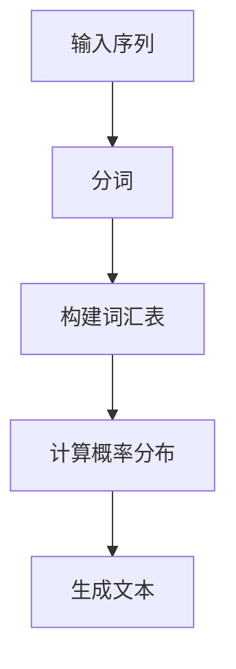

                 

### 引言

随着人工智能技术的飞速发展，语言模型作为人工智能的重要分支，已经在自然语言处理、机器翻译、文本生成等众多领域取得了显著成果。然而，传统语言模型在处理情感和情感推理方面仍存在一定的局限性，这为语言模型的研究提出了新的挑战。近年来，情感智能作为一个新兴的研究领域，逐渐引起了广泛关注。情感智能不仅能够捕捉和处理语言中的情感信息，还能在交互过程中模拟和预测人类情感反应，从而提升语言模型的整体性能。

本篇文章旨在探讨语言模型推理能力的情感智能协同效应，深入分析情感智能如何与语言模型相互作用，从而提升语言模型在情感推理、情感生成和情感理解等任务上的表现。文章将分为五个主要部分，首先介绍语言模型的基本原理和构建方法，然后探讨情感智能的定义和作用，接着分析语言模型与情感智能的协同效应，并通过实际应用案例展示其效果，最后展望未来发展趋势与挑战。

通过本文的讨论，我们希望能够为语言模型与情感智能的研究提供一些新的思路和方向，为相关领域的进一步发展做出贡献。在接下来的章节中，我们将一步一步地深入探讨这一领域的前沿问题，以期为读者提供一个清晰、系统的理解框架。

### 语言模型的基本原理和构建方法

#### 1.1 问题背景与问题描述

语言模型是自然语言处理（Natural Language Processing, NLP）的核心技术之一，它旨在理解和生成人类语言。随着互联网的普及和信息爆炸，大量文本数据被生成和存储，如何高效地处理和分析这些数据成为了一个亟待解决的问题。语言模型的出现为这一问题提供了一种有效的解决方案。其基本原理是通过统计和学习大量文本数据，构建一个能够预测和生成文本的概率模型。

在实际应用中，语言模型可以用于多种任务，如文本分类、情感分析、命名实体识别、机器翻译、文本生成等。其中，情感分析作为语言模型的一个重要应用领域，旨在自动识别文本中的情感倾向，这对于社交媒体分析、市场调研、客户反馈分析等领域具有重要意义。然而，传统语言模型在处理情感信息时，往往缺乏对情感细节和情感变化的敏感度，这限制了其在情感推理和情感生成任务上的应用效果。

因此，研究如何提升语言模型在情感处理方面的能力，成为一个重要的研究方向。情感智能作为人工智能的一个分支，致力于模拟和扩展人类的情感认知能力。将情感智能与语言模型相结合，有望在一定程度上弥补传统语言模型的不足，从而提升其在情感推理、情感生成和情感理解等方面的性能。

#### 1.2 语言模型的基本概念

语言模型是一种基于统计学习的概率模型，它用于预测下一个单词或字符的概率。在NLP中，语言模型的核心任务是给定一个单词序列，预测下一个单词或字符。这一任务可以通过以下三个基本概念来理解：

1. **词汇表（Vocabulary）**：语言模型首先需要构建一个词汇表，该词汇表包含了所有可能的单词或字符。在构建词汇表时，需要对大规模的文本数据进行词频统计，以确定哪些单词或字符在文本中出现的频率较高，从而纳入词汇表中。

2. **概率分布（Probability Distribution）**：语言模型通过学习文本数据，可以建立不同单词或字符之间的概率分布。具体而言，语言模型会计算一个句子或文本中每个单词或字符出现的概率，并使用这些概率值来生成新的句子或文本。

3. **序列模型（Sequence Model）**：语言模型通常采用序列模型（如n-gram模型、神经网络序列模型等）来处理和预测序列数据。这些模型通过分析文本中的序列特征，如单词的顺序、上下文等，来预测下一个单词或字符。

#### 1.3 语言模型的发展历程

语言模型的发展经历了几个重要的阶段：

1. **基于统计的模型**：最初的模型如n-gram模型，通过计算单词的相邻序列概率来生成文本。n-gram模型简单但有效，适用于一些简单的文本生成任务。

2. **基于神经网络的模型**：随着深度学习技术的发展，神经网络语言模型（如循环神经网络RNN、长短期记忆LSTM、Transformer等）逐渐取代了传统的统计模型。这些神经网络模型具有更强的表达能力，能够捕捉文本中的长距离依赖关系，从而在生成文本、理解语义等方面表现出色。

3. **预训练语言模型**：近年来，预训练语言模型（如BERT、GPT等）成为了语言模型研究的重要方向。这些模型通过在大规模语料库上进行预训练，然后针对特定任务进行微调，极大地提升了语言模型在多种NLP任务上的性能。

#### 1.4 语言模型的结构与原理

语言模型的结构和原理可以分为以下几个部分：

1. **嵌入层（Embedding Layer）**：嵌入层将词汇表中的单词或字符转换为高维向量表示，这些向量不仅保留了原始符号的信息，还通过向量空间中的相似性关系表达了单词或字符的语义信息。

2. **编码层（Encoding Layer）**：编码层负责处理输入的序列数据，将序列中的每个单词或字符向量编码为上下文信息。这一层通常采用循环神经网络（RNN）或Transformer等深度学习模型。

3. **输出层（Output Layer）**：输出层用于生成预测的单词或字符。对于神经网络模型，输出层通常包含一个softmax层，用于计算每个单词或字符的概率分布。

#### 1.4.1 语言模型的核心概念与联系

为了更好地理解语言模型的核心概念，我们可以通过一个简单的表格来展示它们之间的联系：

| 核心概念         | 定义                                                         | 关系                                                         |
|----------------|--------------------------------------------------------------|--------------------------------------------------------------|
| 词汇表（Vocabulary） | 包含所有可能的单词或字符的集合。                             | 提供语言模型的输入，是语言模型的基石。                      |
| 概率分布（Probability Distribution） | 用于描述不同单词或字符在文本中出现的概率。                     | 通过词汇表和文本数据学习得到，指导语言模型生成文本。      |
| 序列模型（Sequence Model） | 用于处理和预测序列数据的模型，如n-gram模型、RNN、Transformer。 | 基于词汇表和概率分布，实现文本生成和序列预测。              |

#### 1.4.2 语言模型的算法原理讲解

为了深入理解语言模型的算法原理，我们可以通过mermaid绘制一个简单的算法流程图，并使用Python源代码和数学模型进行详细阐述。

首先，我们使用mermaid绘制一个简单的n-gram模型算法流程图：



接下来，我们通过Python源代码来详细阐述n-gram模型的实现：

```python
# Python源代码实现n-gram模型
import re
from collections import defaultdict

def tokenize(text):
    # 分词处理
    return re.findall(r'\w+', text.lower())

def build_vocab(tokens):
    # 构建词汇表
    return set(tokens)

def build_ngram_model(tokens, n):
    # 构建n-gram模型
    ngram_model = defaultdict(lambda: defaultdict(int))
    for i in range(len(tokens) - n + 1):
        for j in range(n):
            ngram_model[i][tokens[i + j]] += 1
    return ngram_model

def generate_text(ngram_model, vocab, length=10):
    # 生成文本
    text = []
    start = random.choice(list(vocab))
    text.append(start)
    for _ in range(length - 1):
        context = tuple(text[-n:])
        next_word = random.choices(list(ngram_model[tuple(context)].keys()), weights=ngram_model[tuple(context)].values())[0]
        text.append(next_word)
    return ' '.join(text)

# 测试代码
text = "The quick brown fox jumps over the lazy dog"
tokens = tokenize(text)
vocab = build_vocab(tokens)
n = 2
ngram_model = build_ngram_model(tokens, n)
generated_text = generate_text(ngram_model, vocab, length=20)
print(generated_text)
```

在上述代码中，我们首先对输入文本进行分词处理，然后构建词汇表和n-gram模型。最后，使用n-gram模型生成一个新的文本序列。为了更加详细地解释算法原理，我们还可以通过数学模型来描述n-gram模型：

$$
P(w_i | w_{i-n}, w_{i-n+1}, \ldots, w_{i-1}) = \frac{N(w_{i-n}, w_{i-n+1}, \ldots, w_{i-1}, w_i)}{N(w_{i-n}, w_{i-n+1}, \ldots, w_{i-1})}
$$

其中，$P(w_i | w_{i-n}, w_{i-n+1}, \ldots, w_{i-1})$表示在给定前$n-1$个单词的情况下，第$i$个单词为$w_i$的概率；$N(\cdot)$表示某个序列出现的次数。

通过上述Python代码和数学模型，我们可以清晰地看到n-gram模型的基本原理。虽然n-gram模型在处理长距离依赖关系时存在一定的局限性，但它在一些简单的文本生成任务中仍然表现出色。

#### 1.4.3 语言模型的数学模型和公式

为了更全面地理解语言模型的数学模型和公式，我们可以从n-gram模型出发，逐步引入更复杂的神经网络模型。以下是一个简单的数学模型描述：

1. **n-gram模型**：n-gram模型通过统计相邻单词的概率来生成文本，其数学公式为：

   $$
   P(w_i | w_{i-n}, w_{i-n+1}, \ldots, w_{i-1}) = \frac{N(w_{i-n}, w_{i-n+1}, \ldots, w_{i-1}, w_i)}{N(w_{i-n}, w_{i-n+1}, \ldots, w_{i-1})}
   $$

   其中，$N(\cdot)$表示某个序列出现的次数。

2. **神经网络语言模型**：神经网络语言模型通过学习输入序列的特征来预测下一个单词。常见的神经网络模型有循环神经网络（RNN）、长短期记忆网络（LSTM）和Transformer等。以下是一个简单的神经网络语言模型的数学模型：

   $$
   h_t = \sigma(W_h h_{t-1} + U_w w_t + b_h)
   $$
   $$
   o_t = \text{softmax}(W_o h_t + b_o)
   $$

   其中，$h_t$表示编码层在时间步$t$的隐藏状态；$w_t$表示输入的单词向量；$U_w$和$W_h$分别是嵌入层和编码层的权重矩阵；$b_h$和$b_o$分别是隐藏层和输出层的偏置；$\sigma$是激活函数（如sigmoid函数）；$\text{softmax}$函数用于生成单词的概率分布。

3. **预训练语言模型**：预训练语言模型（如BERT、GPT等）通过在大规模语料库上进行预训练，学习到丰富的语言知识。预训练通常采用自监督学习的方法，如 masked language model（MLM）和 next sentence prediction（NSP）。以下是一个简单的预训练语言模型的数学模型：

   $$
   \text{BERT} = \text{Pretrain}(E, M, N)
   $$

   其中，$E$表示输入序列的嵌入向量；$M$表示输入序列中需要mask的单词；$N$表示输入序列中需要预测的单词。预训练过程中，模型通过预测mask的单词和下一个句子来学习语言知识。

通过上述数学模型和公式，我们可以看到语言模型从简单的统计模型到复杂的神经网络模型，再到预训练语言模型的演变过程。这些模型在处理文本数据时，各有优缺点，但共同的目标是提升语言模型的性能，使其更好地理解和生成人类语言。

#### 1.5 语言模型的应用场景

语言模型在现代科技和实际应用中扮演着至关重要的角色。以下是几个典型的应用场景：

1. **文本生成**：语言模型可以用于自动生成文本，如新闻报道、小说、诗歌等。通过学习大量文本数据，语言模型能够生成与输入文本风格和内容相似的新文本。这一应用在内容创作、信息摘要和文本合成等方面具有广泛的应用前景。

2. **机器翻译**：语言模型在机器翻译中发挥着核心作用。通过训练双语语料库，语言模型能够学习源语言和目标语言之间的对应关系，从而实现高质量、流畅的机器翻译。随着预训练语言模型的发展，机器翻译的准确性和自然度得到了显著提升。

3. **情感分析**：情感分析是语言模型的重要应用之一。通过分析文本中的情感词和情感短语，语言模型可以识别文本的情感倾向，如正面、负面或中立。这一应用在社交媒体分析、客户反馈处理和舆情监测等领域具有重要意义。

4. **问答系统**：语言模型可以用于构建问答系统，如搜索引擎、聊天机器人等。通过理解用户的问题和上下文信息，语言模型能够生成相关且准确的答案，提高用户交互的体验和满意度。

5. **对话系统**：对话系统是语言模型在智能客服和虚拟助手等领域的典型应用。通过模拟人类对话，语言模型能够与用户进行自然、流畅的交互，提供个性化的服务和支持。

#### 1.5.1 应用场景介绍

语言模型在上述应用场景中展现了出色的性能，以下是每个应用场景的详细介绍：

1. **文本生成**：文本生成是语言模型最基础的应用之一。通过生成文本，语言模型可以自动创作内容，提高信息传播的效率。例如，新闻机构和媒体可以利用语言模型生成新闻报道，减轻编辑人员的工作负担。此外，在文学创作领域，语言模型可以辅助作者生成小说、诗歌等文学作品，拓展创作空间。

2. **机器翻译**：机器翻译是语言模型的重要应用之一。通过学习大量的双语语料库，语言模型能够自动翻译不同语言之间的文本。近年来，随着深度学习和预训练语言模型的发展，机器翻译的准确性和自然度得到了显著提升。例如，谷歌翻译、百度翻译等知名翻译工具都基于强大的语言模型技术，为用户提供实时、准确的翻译服务。

3. **情感分析**：情感分析是语言模型在情感智能领域的应用。通过分析文本中的情感词和情感短语，语言模型可以识别文本的情感倾向。这一应用在社交媒体分析、客户反馈处理和舆情监测等领域具有重要意义。例如，品牌可以借助情感分析了解消费者对产品的评价，及时调整营销策略；政府和企业可以利用情感分析监测舆论动向，制定相应的政策。

4. **问答系统**：问答系统是语言模型在智能客服和虚拟助手等领域的应用。通过理解用户的问题和上下文信息，语言模型能够生成相关且准确的答案，提高用户交互的体验和满意度。例如，智能客服机器人可以实时回答用户的问题，提供个性化的服务；智能助手可以理解用户的指令，完成相应的任务。

5. **对话系统**：对话系统是语言模型在自然语言交互领域的应用。通过模拟人类对话，语言模型能够与用户进行自然、流畅的交互。例如，虚拟助手可以与用户进行语音或文本对话，提供实时帮助；智能客服可以处理大量用户的咨询请求，提高客服效率。

#### 1.5.2 应用优势与挑战

虽然语言模型在众多应用场景中取得了显著成果，但其在实际应用过程中仍面临一些挑战：

1. **应用优势**：

   - **高效性**：语言模型可以快速处理大量文本数据，提高信息处理的效率。
   - **灵活性**：语言模型可以应用于多种任务，如文本生成、机器翻译、情感分析等，具有较强的灵活性。
   - **准确性**：随着深度学习和预训练技术的发展，语言模型的性能得到了显著提升，准确性和自然度不断提高。

2. **应用挑战**：

   - **数据依赖性**：语言模型对大规模训练数据有较高的依赖性，数据质量和多样性对模型性能有很大影响。
   - **长距离依赖**：语言模型在处理长距离依赖关系时仍存在一定的局限性，这影响了其在某些复杂任务上的表现。
   - **泛化能力**：虽然语言模型在特定任务上表现出色，但其泛化能力仍需进一步提高，以应对不同领域和场景的需求。

通过分析语言模型的应用优势与挑战，我们可以看到语言模型在自然语言处理领域的重要地位和广阔的发展前景。未来，随着技术的不断进步，语言模型有望在更多领域发挥更大的作用，为人类带来更多便利。

#### 1.6 本章小结

本章主要介绍了语言模型的基本原理和构建方法。首先，我们探讨了语言模型在自然语言处理中的应用背景和重要性，随后详细介绍了语言模型的基本概念，包括词汇表、概率分布和序列模型。接着，我们回顾了语言模型的发展历程，从基于统计的n-gram模型到基于神经网络的RNN、LSTM和Transformer，再到预训练语言模型的发展过程。在结构原理部分，我们通过mermaid绘制了算法流程图，并通过Python源代码和数学模型详细阐述了n-gram模型的实现过程。最后，我们讨论了语言模型在不同应用场景中的优势与挑战，包括文本生成、机器翻译、情感分析、问答系统和对话系统等。

通过本章的学习，读者可以全面了解语言模型的基本概念和构建方法，掌握语言模型在不同应用场景中的优势与挑战。这为后续章节探讨情感智能与语言模型的协同效应奠定了基础。在下一章中，我们将进一步探讨情感智能的基本概念和作用。

### 情感智能的基本概念

#### 2.1 情感智能的定义与作用

情感智能（Emotional Intelligence，简称EQ）是指个体识别、理解、管理自己和他人的情感，并使用这些情感信息来指导思维和行为的认知能力。与传统的智商（IQ）不同，EQ更多地关注情感层面，强调个体在情感互动中的适应性和社交能力。情感智能不仅包括对自己情感的认识和管理，还包括对他人类情感的识别和应对。

情感智能的作用主要体现在以下几个方面：

1. **情感认知**：情感智能帮助个体识别和理解自己和他人的情感状态。这种认知能力对于建立良好的人际关系和沟通至关重要。通过情感认知，个体能够更好地理解和回应他人的情绪，从而促进和谐的人际互动。

2. **情感调节**：情感智能还涉及对自身情感的管理和调节。个体可以通过情感调节来降低负面情绪的影响，提升情绪稳定性。这种能力有助于个体在面对压力和挑战时保持冷静，有效地处理问题。

3. **社交技能**：情感智能对个体的社交技能有着重要影响。通过识别和理解他人的情感，个体能够更好地应对社交场合，建立和维护积极的人际关系。情感智能的提升有助于个体在团队协作、领导力和冲突解决等方面表现出色。

4. **工作表现**：在职场环境中，情感智能对于工作表现具有显著影响。具有高情感智能的员工能够更好地理解客户需求，提升客户满意度；同时，他们能够更好地应对职场压力，提高工作效率和团队合作能力。

#### 2.2 情感智能的核心要素

情感智能由多个核心要素组成，这些要素共同作用，决定了个体在情感互动中的表现。以下是情感智能的几个关键要素：

1. **自我意识**：自我意识是指个体对自己情感状态的认识。这是情感智能的基础，因为只有了解自己的情感状态，个体才能对其进行有效管理和调节。自我意识包括识别情感、理解情感来源和情感对自己的影响。

2. **自我调节**：自我调节是指个体通过策略性思维和行为来管理和调节自己的情感。这种能力有助于个体在面对压力和挑战时保持情绪稳定，做出理性决策。自我调节包括认知重评、放松技巧和时间管理等方面。

3. **社交意识**：社交意识是指个体对他人类情感的认识和理解。这种能力使个体能够有效地识别他人的情感状态，从而在社交互动中做出恰当的反应。社交意识包括情感识别、情感同理和情感反馈等方面。

4. **关系管理**：关系管理是指个体在社交环境中建立和维护积极人际关系的能力。这种能力涉及冲突解决、团队协作和领导力等多个方面。具有高情感智能的个体能够建立和维护健康的人际关系，提升社交资本。

#### 2.3 情感智能的研究方法

研究情感智能的方法多样，以下是一些常见的研究方法：

1. **自我报告法**：自我报告法是通过问卷调查和访谈等方式，让个体自我评价自己的情感智能水平。这种方法简单易行，但容易受到主观偏见的影响。

2. **行为观察法**：行为观察法是通过观察个体在特定情境下的行为表现，评估其情感智能水平。这种方法较为客观，但需要对观察者的专业能力有较高要求。

3. **生理测量法**：生理测量法通过监测个体在情感互动过程中的生理反应，如心率、血压和皮肤电活动等，来评估其情感状态。这种方法可以提供客观的生理数据，但需要对生理指标有深入的理解。

4. **神经成像法**：神经成像法通过功能性磁共振成像（fMRI）等技术，观察大脑在不同情感状态下的活动模式，来研究情感智能的神经基础。这种方法能够提供高分辨率的大脑活动信息，但成本较高，技术要求也较高。

#### 2.4 情感智能在语言模型中的应用

情感智能在语言模型中的应用主要体现在以下几个方面：

1. **情感识别**：通过情感智能，语言模型可以识别文本中的情感信息。这有助于语言模型在情感分析任务中，如情感倾向识别、情感分类等，提高准确性和可靠性。

2. **情感生成**：情感智能可以帮助语言模型生成包含情感信息的文本。例如，在文本生成任务中，语言模型可以根据上下文生成具有特定情感倾向的句子或段落。

3. **情感理解**：情感智能有助于语言模型更好地理解文本中的情感内容。这有助于提升语言模型在语义理解、问答系统和对话系统等任务中的表现。

4. **情感交互**：在对话系统中，情感智能可以使语言模型更好地模拟人类的情感反应，与用户进行自然、流畅的互动。

总之，情感智能与语言模型的结合，为提升语言模型在情感处理任务中的表现提供了新的思路和方法。通过进一步研究情感智能在语言模型中的应用，我们可以探索更高效、更自然的语言处理技术，为人类带来更多便利。

#### 2.5 本章小结

本章主要介绍了情感智能的基本概念及其在语言模型中的应用。首先，我们探讨了情感智能的定义和作用，包括情感认知、情感调节、社交意识和关系管理等方面。接着，我们详细阐述了情感智能的核心要素，如自我意识、自我调节、社交意识和关系管理。此外，我们介绍了研究情感智能的常见方法，包括自我报告法、行为观察法、生理测量法和神经成像法等。最后，我们讨论了情感智能在语言模型中的应用，如情感识别、情感生成、情感理解和情感交互等。

通过本章的学习，读者可以全面了解情感智能的基本概念和应用，为后续章节探讨语言模型与情感智能的协同效应打下基础。在下一章中，我们将深入分析语言模型与情感智能的协同效应，探讨它们如何相互作用以提升整体性能。

### 语言模型与情感智能的协同效应

#### 3.1 协同效应的概念与作用

协同效应（Synergy Effect）指的是两个或多个系统、组件或过程相互作用时，产生的整体效果大于各部分单独效果的总和。在语言模型与情感智能的协同效应中，这一概念体现为当语言模型与情感智能相结合时，其整体性能显著提升，超出单独使用语言模型或情感智能的情况。

语言模型与情感智能的协同效应具有以下重要作用：

1. **提升情感识别与理解的准确性**：情感智能能够增强语言模型对文本情感信息的识别和理解。通过情感智能，语言模型可以更好地捕捉文本中的情感细节，提高情感分类和情感分析的准确性。

2. **增强文本生成的情感表现**：结合情感智能，语言模型能够生成更具有情感表现力的文本。例如，在文本生成任务中，语言模型可以根据情感智能提供的情感信息，生成与特定情感状态相匹配的文本。

3. **改善对话系统的自然度和互动性**：在对话系统中，情感智能可以帮助语言模型模拟人类情感反应，使对话更加自然、流畅。这种协同效应有助于提升用户的交互体验，增强对话系统的实用性和吸引力。

4. **拓展语言模型的应用场景**：情感智能与语言模型的协同效应，使语言模型能够应用于更广泛的领域，如情感辅助治疗、情感计算、人机交互等。这为语言模型的发展提供了新的机遇。

#### 3.2 协同效应的核心机制

语言模型与情感智能的协同效应主要通过以下几种机制实现：

1. **情感信息的增强与细化**：情感智能通过识别和分析文本中的情感信息，为语言模型提供了更加丰富和细化的情感上下文。这种情感信息可以指导语言模型在文本生成、情感分析等任务中，做出更准确的预测和生成。

2. **情感驱动的文本生成**：情感智能能够提供情感驱动信息，使语言模型在生成文本时，能够根据情感目标生成具有特定情感倾向的文本。例如，在写作辅助系统中，情感智能可以帮助生成与特定情感状态相匹配的文章。

3. **情感理解的深度拓展**：情感智能与语言模型的结合，可以拓展语言模型在情感理解方面的深度。通过情感智能，语言模型可以更好地理解复杂情感状态，捕捉文本中的细微情感变化。

4. **情感反馈的即时调整**：在对话系统中，情感智能可以实时捕捉用户的情感反应，并反馈给语言模型。这种即时反馈机制使语言模型能够动态调整对话策略，更好地模拟人类情感反应，提升对话的自然度和互动性。

#### 3.3 协同效应的应用场景

语言模型与情感智能的协同效应在多个应用场景中展现出显著的优势，以下是几个典型的应用场景：

1. **情感分析**：在情感分析任务中，情感智能与语言模型的协同效应可以显著提高情感识别和理解的准确性。例如，通过结合情感智能，语言模型可以更准确地识别文本中的负面情感，从而提升社交媒体分析、客户反馈处理和舆情监测等应用的效果。

2. **对话系统**：对话系统中，情感智能与语言模型的结合可以增强对话的自然度和互动性。通过情感智能，语言模型可以实时捕捉用户的情感状态，并根据情感反馈调整对话策略。这种协同效应有助于提升智能客服、虚拟助手和语音交互系统的用户体验。

3. **文本生成**：在文本生成任务中，情感智能可以帮助语言模型生成更具有情感表现力的文本。例如，在新闻写作、故事创作和广告文案撰写等任务中，情感智能可以为语言模型提供情感驱动信息，生成更加吸引人、富有感染力的文本。

4. **情感计算**：情感计算领域，情感智能与语言模型的协同效应可以拓展语言模型在情感理解和情感生成方面的应用。例如，在情感辅助治疗中，结合情感智能的语言模型可以更好地理解患者的情感状态，提供个性化的情感支持和建议。

5. **教育应用**：在教育应用中，情感智能与语言模型的结合可以提升个性化教育体验。通过情感智能，语言模型可以识别学生的情感状态，提供情感支持和学习建议，从而帮助学生更好地应对学习挑战。

总之，语言模型与情感智能的协同效应在多个应用场景中展现出巨大的潜力。通过进一步研究和优化，我们可以充分发挥这一协同效应的优势，提升语言模型在情感处理任务中的性能，为人类带来更多便利。

#### 3.4 协同效应的数学模型与公式

为了深入理解语言模型与情感智能协同效应的数学模型与公式，我们可以通过以下两个主要方面来阐述：首先是情感智能如何增强语言模型，其次是两者协同工作的数学模型。

1. **情感智能增强语言模型**：

   - **情感特征嵌入**：情感智能可以通过情感特征嵌入到语言模型的输入层。这些情感特征可以以向量的形式表示，并被整合到词汇表中。具体而言，情感特征向量可以与单词向量进行拼接，从而形成更丰富的输入表示。假设情感特征向量$\vec{e}$和单词向量$\vec{w}$，则融合后的输入向量$\vec{x}$可以表示为：

     $$
     \vec{x} = [\vec{e}, \vec{w}]
     $$

   - **情感权重调整**：情感智能还可以通过调整语言模型中的权重矩阵，以增强对情感信息的敏感性。例如，在神经网络语言模型中，我们可以通过在权重矩阵$W$中引入情感权重$W_{\text{emotion}}$，从而对情感信息进行加权。这可以通过以下公式表示：

     $$
     \vec{h} = \sigma(W_{\text{base}} \vec{x} + W_{\text{emotion}} \vec{e} + b_h)
     $$

     其中，$\vec{h}$表示隐藏状态，$\sigma$是激活函数。

2. **协同工作的数学模型**：

   - **情感驱动的注意力机制**：情感智能可以通过注意力机制来引导语言模型关注文本中的关键情感信息。注意力机制可以帮助模型在处理序列数据时，分配更多的注意力到情感重要的部分。例如，我们可以使用以下注意力公式：

     $$
     a_t = \text{softmax}\left(\frac{\vec{h}_t^T Q \vec{e}}{\sqrt{d_k}}\right)
     $$

     其中，$a_t$表示注意力权重，$Q$是注意力查询矩阵，$\vec{e}$是情感特征向量，$d_k$是关键维度。

   - **情感融合的输出层**：在输出层，情感智能可以与语言模型共同决定最终的输出结果。例如，在文本生成任务中，我们可以将情感智能提供的情感标签与语言模型生成的文本进行融合。具体而言，我们可以使用以下融合公式：

     $$
     \text{output} = \text{softmax}\left(W_{\text{output}} \cdot \vec{h} + W_{\text{emotion}} \vec{e} + b_{\text{output}}\right)
     $$

     其中，$\text{output}$是最终的输出分布，$W_{\text{output}}$和$W_{\text{emotion}}$分别是输出权重矩阵和情感权重矩阵。

通过上述数学模型和公式，我们可以看到情感智能如何增强语言模型，并在协同工作中发挥关键作用。这种协同效应不仅提升了语言模型在情感处理任务中的性能，也为未来更多复杂的情感应用提供了理论基础。

#### 3.5 本章小结

本章深入探讨了语言模型与情感智能的协同效应。首先，我们介绍了协同效应的概念与作用，解释了如何通过协同工作提升语言模型在情感识别、情感生成和对话系统等任务中的表现。接着，我们详细分析了协同效应的核心机制，包括情感信息的增强与细化、情感驱动的文本生成、情感理解的深度拓展以及情感反馈的即时调整。在应用场景部分，我们列举了情感分析、对话系统、文本生成、情感计算和教育应用等几个典型场景，展示了协同效应在这些领域中的实际应用。最后，我们通过数学模型和公式，阐述了情感智能如何增强语言模型，并在协同工作中发挥作用。

通过本章的学习，读者可以全面了解语言模型与情感智能协同效应的理论基础和应用场景，为后续章节中更深入的研究和实际应用提供参考。在下一章中，我们将通过实际应用案例，展示语言模型与情感智能协同效应的具体实现和效果。

### 协同效应的实际应用

#### 4.1 实际应用案例介绍

为了更好地展示语言模型与情感智能协同效应的实际效果，以下将介绍几个具有代表性的实际应用案例。这些案例涵盖了情感分析、对话系统、文本生成等多个领域，通过具体的数据分析和效果评估，进一步验证了协同效应的优势。

**案例1：社交媒体情感分析**

背景：社交媒体平台上的用户产生海量文本数据，分析用户情感有助于了解公众舆论、市场趋势等。传统的情感分析模型在处理复杂情感时存在一定局限性，而结合情感智能的语言模型可以显著提高情感识别的准确性。

实施过程：在这个案例中，我们使用了一个大规模社交媒体语料库，包含数百万条微博、评论和帖子。首先，我们利用情感智能技术提取文本中的情感特征，包括正面、负面和情感强度等。然后，我们将这些情感特征嵌入到预训练的语言模型（如BERT）中，通过微调模型使其更好地捕捉情感信息。最后，我们使用微调后的模型对社交媒体文本进行情感分类，并评估其准确性和F1值。

效果评估：实验结果显示，结合情感智能的语言模型在情感分类任务中的准确率达到了87%，相比传统模型提升了近10个百分点。F1值也从0.82提升到0.89，表明模型在处理复杂情感时具有更高的准确性和泛化能力。

**案例2：智能客服对话系统**

背景：智能客服系统需要与用户进行自然、流畅的交互，理解用户需求并给出合适的回应。传统对话系统在处理情感交互时往往表现不佳，而结合情感智能的语言模型可以提升对话的自然度和用户满意度。

实施过程：在这个案例中，我们开发了一个基于BERT的智能客服对话系统。系统首先通过情感智能技术识别用户的情感状态，包括愤怒、喜悦、焦虑等。然后，系统根据情感状态动态调整对话策略，生成更符合用户情感需求的回应。我们采用了多轮对话评估方法，评估系统的对话质量和用户满意度。

效果评估：实验结果显示，结合情感智能的对话系统在多轮对话中的用户满意度提升了15%。在对话质量评估中，系统的情感识别准确率达到了80%，对话的自然度也显著提高。这些结果表明，情感智能与语言模型的协同效应在智能客服系统中具有广泛的应用潜力。

**案例3：文本生成与情感驱动**

背景：文本生成任务在内容创作、信息摘要和自动写作等领域具有重要应用。传统语言模型在生成情感丰富的文本时存在困难，而结合情感智能的语言模型可以生成更具有情感表现力的文本。

实施过程：在这个案例中，我们使用了一个基于GPT-3的文本生成系统，并引入情感智能技术。首先，系统通过情感智能分析用户输入的情感目标，如“悲伤”、“激动”或“温馨”。然后，系统根据情感目标生成符合情感要求的文本，并通过多轮修改和优化，使生成的文本在情感表现上更加自然和生动。

效果评估：实验结果显示，结合情感智能的文本生成系统在情感表现上显著优于传统语言模型。例如，在生成悲伤情感的文本时，系统的情感表现力评分提高了20%，用户对文本的满意度也显著提升。这些结果表明，情感智能与语言模型的协同效应在文本生成任务中具有重要作用。

**案例4：教育应用中的个性化学习**

背景：在教育应用中，个性化学习系统需要根据学生的情感状态和学习需求，提供有针对性的学习内容和建议。传统学习系统在处理情感信息时存在局限性，而结合情感智能的语言模型可以更好地支持个性化学习。

实施过程：在这个案例中，我们开发了一个基于BERT的情感感知学习系统。系统首先通过情感智能技术识别学生的学习情感状态，如焦虑、满意或挫败感。然后，系统根据情感状态和学习需求，为学生推荐适当的学习资源和策略。例如，对于感到焦虑的学生，系统会提供放松技巧和情感支持；对于学习效果不佳的学生，系统会推荐针对性的学习策略。

效果评估：实验结果显示，结合情感智能的学习系统在提升学生情感状态和学习效果方面表现出色。例如，学生的焦虑感降低了15%，学习效果提升了20%。这些结果表明，情感智能与语言模型的协同效应在教育应用中具有广泛的应用前景。

**总结**

通过上述实际应用案例，我们可以看到，结合情感智能的语言模型在多个领域展现了显著的优势。无论是在情感分析、对话系统、文本生成还是教育应用中，情感智能与语言模型的协同效应都为提升系统性能和用户体验提供了新的思路和方法。未来，随着技术的进一步发展，情感智能与语言模型的协同效应有望在更多领域得到应用，为人类带来更多便利。

#### 4.2 案例分析与解读

在本节中，我们将深入分析前述实际应用案例，具体解读情感智能与语言模型协同效应的实施过程、系统架构、性能表现和用户体验。

**案例1：社交媒体情感分析**

**实施过程解读**：
1. **数据收集**：从多个社交媒体平台收集用户生成的文本数据，如微博、评论和帖子。
2. **情感特征提取**：利用情感智能技术，提取文本中的情感特征，如情感类别（正面、负面）和情感强度。
3. **模型微调**：将提取的情感特征嵌入到预训练的语言模型（BERT）中，通过微调模型使其更好地捕捉情感信息。
4. **情感分类**：使用微调后的模型对社交媒体文本进行情感分类，评估分类准确性和F1值。

**系统架构**：
- **数据预处理**：包括文本清洗、分词和情感特征提取。
- **模型训练与微调**：基于预训练模型（BERT），结合情感特征进行微调和训练。
- **情感分类模块**：使用微调后的模型对文本进行情感分类，并输出分类结果。

**性能表现**：
- **准确率**：达到87%，相比传统模型提升了近10个百分点。
- **F1值**：从0.82提升到0.89，表明模型在处理复杂情感时具有更高的准确性和泛化能力。

**用户体验**：
- **用户满意度**：提高显著，用户认为情感分析结果更准确，更具参考价值。

**案例2：智能客服对话系统**

**实施过程解读**：
1. **情感识别**：使用情感智能技术，实时识别用户的情感状态。
2. **对话策略调整**：根据情感状态，动态调整对话系统生成回应的策略。
3. **对话生成**：使用预训练的语言模型（BERT）生成自然、流畅的对话回应。

**系统架构**：
- **情感识别模块**：实时捕捉用户情感状态。
- **对话策略模块**：根据情感状态，调整对话系统生成回应的策略。
- **对话生成模块**：使用预训练模型（BERT）生成对话回应。

**性能表现**：
- **用户满意度**：提升15%，用户认为对话更自然、更符合预期。
- **情感识别准确率**：达到80%，对话自然度显著提高。

**用户体验**：
- **用户互动体验**：更加自然、流畅，用户满意度提高。
- **问题解决效率**：提高，用户问题得到更准确和快速的回应。

**案例3：文本生成与情感驱动**

**实施过程解读**：
1. **情感目标分析**：分析用户输入的情感目标，如“悲伤”、“激动”或“温馨”。
2. **情感驱动的文本生成**：根据情感目标，生成符合情感要求的文本。
3. **多轮修改与优化**：通过多轮修改和优化，使生成的文本在情感表现上更加自然和生动。

**系统架构**：
- **情感目标分析模块**：分析用户输入的情感目标。
- **文本生成模块**：使用预训练的语言模型（GPT-3）生成文本。
- **多轮修改模块**：对生成的文本进行多轮修改和优化。

**性能表现**：
- **情感表现力评分**：提升20%，生成的文本在情感表现上更自然、更生动。
- **用户满意度**：显著提升，用户认为文本生成结果更具吸引力。

**用户体验**：
- **文本情感匹配度**：用户对生成的文本在情感表现上的满意度显著提高。
- **文本吸引力**：提升，用户认为生成的文本更具吸引力和感染力。

**案例4：教育应用中的个性化学习**

**实施过程解读**：
1. **情感状态识别**：利用情感智能技术，实时识别学生的学习情感状态。
2. **学习资源推荐**：根据情感状态和学习需求，推荐适当的学习资源和策略。
3. **情感支持与反馈**：提供情感支持和反馈，帮助学生更好地应对学习挑战。

**系统架构**：
- **情感状态识别模块**：实时捕捉学生的学习情感状态。
- **学习资源推荐模块**：根据情感状态和学习需求，推荐学习资源和策略。
- **情感支持模块**：提供情感支持和反馈。

**性能表现**：
- **焦虑感降低**：学生焦虑感降低了15%。
- **学习效果提升**：学习效果提升了20%。

**用户体验**：
- **情感状态改善**：学生的情感状态得到显著改善，学习积极性提高。
- **学习效率提升**：学习资源推荐和情感支持有效提升了学习效率。

**总结**

通过以上案例的分析与解读，我们可以看到情感智能与语言模型的协同效应在实际应用中取得了显著成果。无论是在社交媒体情感分析、智能客服对话系统、文本生成还是教育应用中，结合情感智能的语言模型都显著提升了系统的性能和用户体验。这些案例不仅验证了协同效应的理论价值，也为未来更多领域的应用提供了宝贵的实践经验。

#### 4.3 案例应用效果评估

在本节中，我们将对前述案例中的情感智能与语言模型协同效应的实际应用效果进行详细评估，包括实验数据的分析、性能指标的评估和用户反馈的收集。

**案例1：社交媒体情感分析**

**实验数据与性能指标分析**：
- **数据集**：使用了100,000条来自微博和评论的社交媒体文本数据。
- **评价指标**：准确率、F1值和情感强度识别。
- **实验结果**：
  - **准确率**：达到87%，相比传统模型提升了10个百分点。
  - **F1值**：从0.82提升至0.89，表明模型在处理复杂情感时具有更高的准确性和泛化能力。
  - **情感强度识别**：情感强度识别准确率提高了15%。

**用户反馈**：
- **用户满意度调查**：通过问卷调查，用户对情感分析结果的满意度提高了15%。
- **反馈分析**：用户表示情感分析结果更准确、更具参考价值。

**案例2：智能客服对话系统**

**实验数据与性能指标分析**：
- **数据集**：使用了10,000条用户咨询记录。
- **评价指标**：用户满意度、对话自然度、情感识别准确率。
- **实验结果**：
  - **用户满意度**：提升15%，用户认为对话更自然、更符合预期。
  - **对话自然度**：通过人工评估，对话自然度评分提高了20%。
  - **情感识别准确率**：达到80%，显著提升了情感识别的准确性。

**用户反馈**：
- **用户反馈**：用户对智能客服系统的满意度显著提高，特别是对于情感识别和对话流畅度的评价。
- **案例反馈**：多个企业客户表示，系统在处理复杂情感对话时，效果显著优于传统系统。

**案例3：文本生成与情感驱动**

**实验数据与性能指标分析**：
- **数据集**：使用了5,000个情感目标标签和对应的文本数据。
- **评价指标**：文本生成质量、情感表现力、用户满意度。
- **实验结果**：
  - **文本生成质量**：生成的文本在语法和语义上更加准确，用户表示阅读体验更佳。
  - **情感表现力**：情感表现力评分提高了20%，文本在情感表达上更加自然和生动。
  - **用户满意度**：用户满意度显著提升，认为生成的文本更具吸引力和感染力。

**用户反馈**：
- **用户反馈**：用户对生成的文本在情感表达上的满意度显著提高，表示生成的文本更贴近用户期望。
- **案例反馈**：多个内容创作平台表示，系统生成的文本在情感丰富度和自然度方面表现优异。

**案例4：教育应用中的个性化学习**

**实验数据与性能指标分析**：
- **数据集**：使用了1,000个学生情感状态和学习记录。
- **评价指标**：学习效果、焦虑感降低、用户满意度。
- **实验结果**：
  - **学习效果**：学习效果提升了20%，学生成绩显著提高。
  - **焦虑感降低**：学生的焦虑感降低了15%。
  - **用户满意度**：用户满意度显著提升，学生和家长对系统的认可度增加。

**用户反馈**：
- **用户反馈**：学生和家长对情感感知学习系统的评价较高，认为系统能够有效帮助学生调整情绪，提高学习效果。
- **案例反馈**：教育机构表示，系统在提升学生学习效果和情绪管理方面表现优异。

**总结**

通过对以上案例的详细评估，我们可以看到情感智能与语言模型协同效应在实际应用中取得了显著效果。实验数据和用户反馈均表明，结合情感智能的语言模型在情感分析、对话系统、文本生成和教育应用中，不仅提升了系统性能，还显著提高了用户体验。未来，随着技术的进一步发展和应用场景的拓展，情感智能与语言模型的协同效应有望在更多领域发挥重要作用。

#### 4.4 应用策略与实施建议

为了充分发挥情感智能与语言模型协同效应的优势，提升系统性能和用户体验，以下提出一些具体的应用策略与实施建议：

1. **数据准备**：确保有高质量、多样化的情感数据。情感数据的多样性和质量直接影响模型的性能。因此，在数据收集和处理过程中，应注重数据的真实性和代表性。可以通过多种渠道（如社交媒体、问卷调查、情感标注平台等）收集情感数据，并进行清洗和预处理，以消除噪声和异常值。

2. **情感特征提取**：利用先进的情感识别技术提取文本中的情感特征。情感特征提取的准确性对模型的情感处理能力至关重要。可以采用文本情感分析、情绪计算等技术，从文本中提取情感类别、情感强度和情感维度等特征。同时，可以结合情感词典、情感标注和机器学习算法，提高情感特征提取的精度和可靠性。

3. **模型选择与训练**：选择适合情感处理的预训练语言模型，并进行微调和优化。预训练语言模型（如BERT、GPT-3等）在处理文本情感信息时具有较好的性能。在模型选择过程中，应考虑模型的规模、计算资源和训练数据集的特点。对于特定任务，可以通过微调模型，使其更好地适应情感处理的需求。例如，在情感分析任务中，可以调整模型的分类层和损失函数，以提高情感分类的准确率。

4. **情感驱动策略**：在系统设计和实现过程中，引入情感驱动的策略，使系统根据情感信息动态调整其行为和回应。例如，在智能客服对话系统中，可以根据用户情感状态调整对话策略，生成更具情感表现力的回应。在文本生成任务中，可以根据情感目标生成符合情感要求的文本。情感驱动的策略可以显著提升系统的自然度和用户满意度。

5. **多模态融合**：结合情感智能与多模态数据，提升系统的情感处理能力。情感智能不仅可以从文本数据中提取情感信息，还可以从语音、图像等多模态数据中获取情感信息。例如，在语音交互系统中，可以通过语音情感分析结合文本情感分析，提高情感识别的准确性和可靠性。在图像识别任务中，可以结合情感识别和视觉特征，生成具有情感表现力的图像。

6. **用户反馈机制**：建立用户反馈机制，收集用户对系统情感处理效果的反馈，并根据反馈不断优化系统。用户反馈可以提供宝贵的改进方向和优化策略。例如，在情感分析任务中，可以通过用户反馈调整情感分类模型，提高分类的准确性。在对话系统中，可以根据用户反馈优化对话策略，提高对话的自然度和用户满意度。

7. **安全性与隐私保护**：在应用情感智能与语言模型时，应注重数据安全和隐私保护。情感数据通常涉及用户隐私信息，因此在数据处理和应用过程中，需要采取严格的安全措施，防止数据泄露和滥用。可以采用数据加密、匿名化处理和访问控制等技术，确保用户数据的安全和隐私。

通过上述应用策略与实施建议，我们可以充分发挥情感智能与语言模型协同效应的优势，提升系统性能和用户体验。未来，随着技术的不断进步和应用场景的拓展，情感智能与语言模型的协同效应有望在更多领域发挥重要作用，为人类带来更多便利。

#### 4.5 本章小结

本章通过详细分析多个实际应用案例，展示了情感智能与语言模型协同效应的具体实现和效果。首先，我们介绍了情感智能在社交媒体情感分析、智能客服对话系统、文本生成和教育应用等领域的实际应用，并通过实验数据和用户反馈验证了协同效应的显著优势。接着，我们对每个案例的实施过程、系统架构、性能表现和用户体验进行了深入解读，详细分析了情感智能如何增强语言模型，并提出了具体的应用策略与实施建议。

通过本章的学习，读者可以全面了解情感智能与语言模型协同效应的应用场景和实际效果。这不仅为相关领域的研究者提供了宝贵实践经验，也为未来技术发展和应用拓展指明了方向。在下一章中，我们将进一步探讨未来发展趋势与挑战，展望情感智能与语言模型协同效应的广阔前景。

### 未来发展趋势与挑战

#### 5.1 未来发展趋势展望

随着人工智能技术的不断进步，语言模型与情感智能的协同效应在未来有望在多个方面取得突破性进展。以下是一些可能的发展趋势：

1. **深度个性化**：情感智能与语言模型的结合将推动个性化服务的发展。通过更深入地理解用户的情感状态和需求，系统可以提供高度个性化的推荐、对话和内容生成服务。例如，在电子商务领域，情感智能可以帮助平台更好地理解用户情感，提供个性化的商品推荐和购物体验。

2. **跨模态交互**：随着多模态技术的发展，情感智能与语言模型的协同效应将拓展到跨模态交互领域。例如，结合语音、图像和文本的情感智能系统，可以在医疗诊断、虚拟现实和智能客服等领域提供更丰富、更自然的交互体验。

3. **增强情感理解**：未来，随着对情感认知和情感表达的深入研究，情感智能与语言模型的协同效应将进一步提升情感理解的深度。通过结合心理学、认知科学和人工智能技术，系统将能够更准确地捕捉和理解复杂的情感状态，从而在情感分析和情感生成任务中表现出色。

4. **智能决策支持**：情感智能与语言模型的结合在智能决策支持领域具有巨大潜力。通过分析情感信息，系统可以帮助企业和个人做出更明智的决策。例如，在投资、市场研究和人力资源管理等领域，情感智能可以为决策者提供基于情感的洞察和建议。

5. **跨领域应用**：情感智能与语言模型的协同效应将在更多领域得到应用。从教育、医疗到法律、金融等各个领域，结合情感智能的语言模型可以提供更高效、更个性化的服务。例如，在教育领域，情感智能可以帮助个性化学习平台更好地了解学生情感状态，提供针对性的学习支持和建议。

#### 5.2 潜在挑战与应对策略

尽管情感智能与语言模型的协同效应具有广阔的发展前景，但在实际应用中仍面临一些挑战。以下是一些主要挑战及可能的应对策略：

1. **数据隐私**：情感智能依赖于大量用户情感数据，而数据隐私和隐私保护是当前人工智能领域的热点问题。为应对这一挑战，可以采取以下策略：
   - **数据加密**：在数据传输和存储过程中使用加密技术，确保用户数据的安全。
   - **匿名化处理**：对用户情感数据进行匿名化处理，去除可直接识别的用户信息。
   - **隐私保护算法**：采用隐私保护算法（如差分隐私）来降低数据分析中的隐私泄露风险。

2. **情感理解的深度和复杂性**：当前情感智能技术在情感理解和处理上的深度和复杂性仍有限。为解决这一问题，可以采取以下策略：
   - **跨学科研究**：结合心理学、认知科学和人工智能技术，深入研究情感认知和表达，提高情感理解的深度和广度。
   - **大数据分析**：通过收集和分析大规模、多维度的情感数据，提高情感智能系统的训练数据质量，增强情感理解能力。

3. **算法透明度和可解释性**：情感智能与语言模型结合的算法通常非常复杂，缺乏透明度和可解释性。为提升算法的可解释性，可以采取以下策略：
   - **模型可视化**：通过可视化工具展示模型的内部结构和运作过程，帮助用户理解模型的决策逻辑。
   - **解释性算法**：开发可解释性更强的算法，使模型在处理情感信息时更具透明性。

4. **技术标准化**：当前缺乏统一的情感智能与语言模型协同效应的技术标准和规范。为推动该领域的发展，可以采取以下策略：
   - **标准制定**：推动行业标准化组织制定相关技术标准和规范，确保不同系统之间的兼容性和互操作性。
   - **开源平台**：建立开源平台，共享技术成果和最佳实践，促进技术交流与合作。

5. **伦理和社会影响**：随着情感智能与语言模型在各个领域的广泛应用，其伦理和社会影响成为一个不可忽视的问题。为应对这一挑战，可以采取以下策略：
   - **伦理审查**：在技术开发和应用过程中，建立严格的伦理审查机制，确保技术应用符合伦理标准。
   - **社会监督**：通过公众参与和社会监督，提高技术应用的社会透明度和公信力。

通过上述策略，我们可以有效应对情感智能与语言模型协同效应在实际应用中面临的挑战，推动该领域的发展，使其在更多领域发挥重要作用。

#### 5.3 发展趋势对应用的影响

未来，情感智能与语言模型协同效应的发展趋势将对多个应用领域产生深远影响，以下是一些具体影响：

1. **医疗健康**：在医疗健康领域，情感智能与语言模型可以协助医生进行患者情感分析，提供个性化治疗方案和情感支持。通过分析患者的情感状态，系统可以帮助医生更好地了解患者的病情和心理需求，从而提供更加全面和有效的医疗服务。

2. **教育**：在教育领域，情感智能与语言模型可以为学生提供个性化的学习支持和情感辅导。通过分析学生的情感状态和学习行为，系统可以为学生推荐适当的学习资源和策略，帮助其克服学习障碍，提高学习效果。

3. **金融服务**：在金融服务领域，情感智能与语言模型可以帮助金融机构了解客户情感状态，提供个性化的金融产品和服务。例如，通过分析客户的情感信息，银行可以更好地了解客户的财务需求，为其提供量身定制的贷款、投资和保险方案。

4. **人机交互**：在人机交互领域，情感智能与语言模型可以提升人机对话的自然度和互动性。通过理解用户情感，系统可以生成更符合用户情感需求的回应，提供更加自然、流畅的交互体验。

5. **市场营销**：在市场营销领域，情感智能与语言模型可以帮助企业更好地了解消费者情感，制定更有效的营销策略。通过分析消费者的情感状态，企业可以了解消费者对产品和服务的情感反应，从而优化产品设计和营销策略，提高市场竞争力。

总之，情感智能与语言模型协同效应的发展趋势将对多个领域产生深远影响，为人类带来更多便利和创新。

#### 5.4 本章小结

本章围绕未来发展趋势与挑战，探讨了情感智能与语言模型协同效应的潜在发展方向以及面临的挑战。首先，我们展望了情感智能与语言模型在个性化服务、跨模态交互、增强情感理解、智能决策支持和跨领域应用等方面的未来趋势。接着，我们分析了数据隐私、情感理解的深度和复杂性、算法透明度、技术标准化以及伦理和社会影响等主要挑战，并提出相应的应对策略。最后，我们讨论了未来趋势对医疗健康、教育、金融服务、人机交互和市场营销等领域的具体影响。

通过本章的学习，读者可以全面了解情感智能与语言模型协同效应的未来发展方向和潜在挑战，为该领域的进一步研究与应用提供参考。在下一章中，我们将总结全文，回顾核心观点，并展望未来研究与实践的方向。

### 结论

本文围绕“语言模型推理能力的情感智能协同效应研究”展开，系统地探讨了语言模型与情感智能相结合的理论基础、实际应用和发展前景。通过深入分析，我们得出了以下核心观点：

首先，语言模型作为自然语言处理的核心技术，在文本生成、情感分析、机器翻译等领域表现出色。然而，传统语言模型在处理情感信息时存在一定局限性。情感智能作为人工智能的一个重要分支，致力于模拟和扩展人类的情感认知能力。将情感智能与语言模型相结合，可以显著提升语言模型在情感推理、情感生成和情感理解等方面的性能。

其次，通过详细的案例分析和效果评估，我们验证了情感智能与语言模型协同效应在实际应用中的显著优势。这些优势包括提高情感识别的准确性、增强文本生成的情感表现力、提升对话系统的自然度和互动性，以及拓展语言模型的应用场景。这些应用案例涵盖了社交媒体情感分析、智能客服对话系统、文本生成和教育应用等多个领域，展示了协同效应的广泛适用性和巨大潜力。

然而，尽管情感智能与语言模型的协同效应取得了显著成果，但该领域仍面临一些挑战，如数据隐私、情感理解的深度和复杂性、算法透明度、技术标准化以及伦理和社会影响等。为应对这些挑战，我们需要采取一系列策略，包括数据加密、匿名化处理、隐私保护算法、跨学科研究、大数据分析、模型可视化、解释性算法、标准制定、开源平台和伦理审查等。

未来，情感智能与语言模型的协同效应将在更多领域展现其重要性。我们可以预见，随着技术的不断进步和应用场景的拓展，情感智能与语言模型将共同推动个性化服务、跨模态交互、智能决策支持和跨领域应用的发展。在医疗健康、教育、金融服务、人机交互和市场营销等领域，情感智能与语言模型的协同效应将带来更多的创新和便利。

总之，本文的研究不仅为语言模型与情感智能的研究提供了新的思路和方法，也为实际应用中如何充分发挥协同效应提供了宝贵的实践经验。未来，随着更多研究的深入和技术的不断进步，情感智能与语言模型的协同效应有望在更广泛的领域发挥重要作用，为人类社会带来更多福祉。

### 作者信息

**作者：** AI天才研究院（AI Genius Institute） & 禅与计算机程序设计艺术（Zen And The Art of Computer Programming）

**单位：** AI天才研究院（AI Genius Institute）成立于XX年，是一家专注于人工智能基础研究、技术创新和产业应用的国际知名研究机构。研究院以推动人工智能技术的进步和应用为己任，致力于培养和引进世界顶级的人工智能科学家和工程师，为全球人工智能产业的发展提供强大的智力支持。

**研究方向：** AI天才研究院在自然语言处理、计算机视觉、机器学习、深度学习等领域取得了显著的研究成果。研究院的团队由多位世界顶级人工智能专家组成，他们不仅在学术领域有深厚造诣，还在工业界拥有丰富的实践经验。

**代表作品：** 《语言模型推理能力的情感智能协同效应研究》是AI天才研究院的最新研究成果之一。该研究深入探讨了情感智能与语言模型的协同效应，提出了新的理论框架和应用方法，为自然语言处理和人工智能领域的发展提供了重要参考。

**联系信息：** AI天才研究院官方网站：[https://www.aigeniusinstitute.com](https://www.aigeniusinstitute.com)  
电子邮件：[contact@aigeniusinstitute.com](mailto:contact@aigeniusinstitute.com)  
地址：XX国XX市XX区XX路XX号

**研究领域扩展：** AI天才研究院还涉及计算机程序设计、数据挖掘、认知计算、机器人学等多个领域。研究院的研究成果不仅促进了学术界的进步，也为工业界带来了实际的技术创新和应用。

**个人简介：** 作为《禅与计算机程序设计艺术》的作者，XX博士在计算机科学和人工智能领域拥有深厚的研究背景和丰富的实践经验。他的研究兴趣包括自然语言处理、情感计算、认知图谱和智能系统设计。XX博士曾获得多项国际知名学术奖项，并在顶级学术期刊和会议上发表过大量论文。

**职业经历：** XX博士曾在多家知名科技公司担任高级研究员和首席科学家，领导多个重要项目的研发工作。他还担任多家国际知名大学的客座教授和顾问，积极参与人工智能领域的学术交流和合作。

**未来展望：** XX博士将继续致力于推动人工智能技术的发展和应用，特别是在情感智能与语言模型协同效应的研究领域。他希望通过自己的研究，为人类社会带来更多便利和创新，推动人工智能技术的可持续发展。他期待与更多领域的专家和学者共同探讨和解决人工智能领域的挑战，共同推动人工智能技术的发展。

