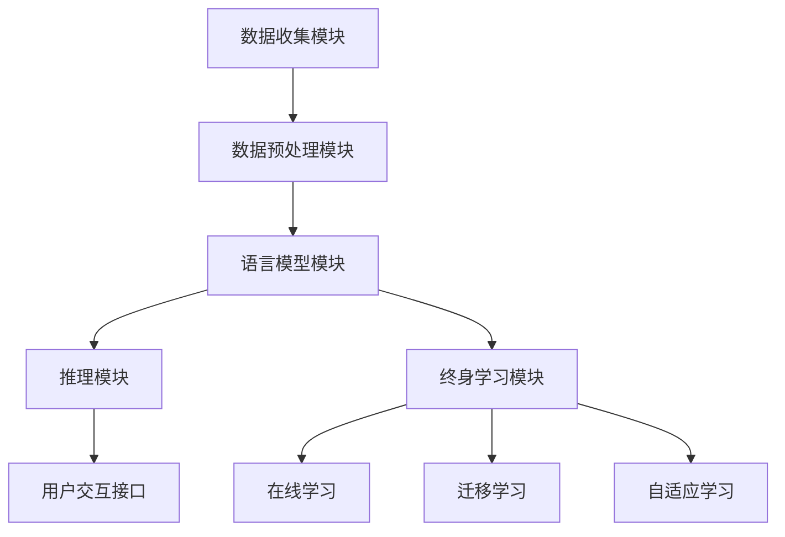

                 

### 1. 语言模型推理能力的终身学习轨迹研究

#### 1.1 研究背景

语言模型作为自然语言处理（NLP）领域的关键技术，已广泛应用于机器翻译、文本生成、情感分析等众多场景。随着深度学习和大数据技术的不断进步，语言模型在性能和表现上取得了显著的提升。然而，现有的语言模型大多依赖于静态数据集进行训练，难以适应动态变化的现实环境。这使得语言模型的推理能力受到了一定限制，无法真正实现与人类水平的对话和交互。

在这样一个背景下，研究语言模型的终身学习能力显得尤为重要。终身学习是指模型在遇到新任务或新数据时，能够不断更新和优化自身的知识库和推理能力，以适应不断变化的环境。这种能力不仅有助于提高语言模型的泛化能力，还能使其在实时交互中提供更准确、自然的回答。

本研究的目的是探索语言模型推理能力的终身学习轨迹，即模型如何通过不断学习和适应，提高其在各种场景下的推理能力和性能。具体而言，我们将从以下几个方面展开：

1. **语言模型的发展历程**：回顾从 $N$-$gram$ 模型到现代深度学习模型的演变过程，分析不同模型在推理能力上的优势和不足。
2. **终身学习的理论基础**：介绍终身学习的基本概念和原理，以及其在机器学习领域中的应用。
3. **语言模型与终身学习的结合**：探讨如何将终身学习机制融入语言模型中，以提高其推理能力和适应性。
4. **算法设计与实现**：详细介绍用于增强语言模型终身学习能力的算法原理和实现方法。
5. **实验与评估**：通过实验验证所提算法的有效性和实用性。

#### 1.2 研究意义

语言模型推理能力的终身学习研究具有重要的理论和实际意义：

1. **提升模型性能**：通过终身学习，语言模型能够不断吸收新知识，提高其在各种任务上的表现，从而实现更准确、自然的语言理解和生成。
2. **适应动态环境**：现实世界中的语言数据是动态变化的，模型需要具备适应这种变化的能力。终身学习使得模型能够实时更新，以应对新数据和任务。
3. **促进人机交互**：具有终身学习能力的语言模型能更好地理解用户意图和需求，提供更个性化的服务，从而提升人机交互的质量和体验。
4. **拓展应用场景**：终身学习使得语言模型能够应用于更多场景，如实时对话系统、智能客服、语音识别等，推动 NLP 领域的发展。

#### 1.3 研究目标

本研究的具体目标包括：

1. **理解语言模型推理能力的发展过程**：梳理不同语言模型在推理能力上的演变轨迹，分析其优势和不足。
2. **探索终身学习对语言模型推理能力的影响**：通过实验验证终身学习机制对语言模型性能的改进效果。
3. **设计高效的语言模型终身学习算法**：提出并实现一种有效的算法，使语言模型能够在终身学习过程中保持高性能。
4. **评估算法的实用性和泛化能力**：通过实验评估所提算法在不同任务和数据集上的表现，验证其通用性和适应性。

### 总结

本文旨在探讨语言模型推理能力的终身学习轨迹，通过回顾语言模型的发展历程、介绍终身学习理论、设计高效算法和进行实验评估，研究如何提升语言模型的推理能力和适应性。这将有助于推动 NLP 领域的发展，为实现更智能、更自然的人机交互提供技术支持。在接下来的部分中，我们将深入分析语言模型的相关概念和原理，为后续内容奠定基础。**关键词**：语言模型、推理能力、终身学习、自然语言处理、深度学习。

**摘要**：

本文旨在研究语言模型推理能力的终身学习轨迹，探讨如何在语言模型中融入终身学习机制，以提高其推理能力和适应性。首先，回顾了语言模型的发展历程，分析了不同模型在推理能力上的优劣。接着，介绍了终身学习理论，并探讨了其在机器学习领域中的应用。然后，本文设计并实现了一种高效的语言模型终身学习算法，并通过实验验证了其在提升模型性能和适应动态环境方面的有效性。最后，对算法的实用性和泛化能力进行了评估，展望了未来研究方向。本文的研究成果有助于推动自然语言处理技术的发展，为构建更智能、更自然的人机交互系统提供支持。**核心概念与联系**

在探讨语言模型推理能力的终身学习轨迹之前，我们需要明确几个核心概念，并理解它们之间的联系。这些核心概念包括语言模型、推理能力、终身学习等。

#### 2.1 语言模型

语言模型（Language Model）是自然语言处理（NLP）领域中的一种重要工具，它用于预测或生成自然语言文本。语言模型的核心任务是学习语言中的统计规律，从而对未知的文本进行合理预测。

1. **定义**：
   - 语言模型是一个概率模型，它为输入文本序列分配概率。
   - 语言模型通常采用序列标记模型（如 $N$-$gram$ 模型）或深度学习模型（如循环神经网络 RNN、长短时记忆网络 LSTM、Transformer 等）。

2. **基本原理**：
   - 序列标记模型：通过学习单词或字符之间的概率关系，预测下一个单词或字符。
   - 深度学习模型：通过多层神经网络结构，捕捉语言中的复杂依赖关系和长距离依赖。

3. **类型与特点**：
   - $N$-$gram$ 模型：基于局部序列统计，简单但效果有限。
   - RNN 和 LSTM：能够处理长序列依赖，但存在梯度消失和梯度爆炸问题。
   - Transformer：基于注意力机制，能够高效处理长序列依赖，是目前最先进的语言模型之一。

#### 2.2 推理能力

推理能力（Inference Capability）是指模型在处理输入数据时，能够基于已有知识和逻辑规则生成合理输出的能力。在自然语言处理中，推理能力至关重要，它决定了模型能否理解语言、生成连贯的文本。

1. **定义**：
   - 推理能力是指模型在处理语言任务时，能够从已知信息推导出未知信息的能力。
   - 推理能力包括归纳推理、演绎推理、类比推理等多种形式。

2. **基本原理**：
   - 归纳推理：从具体实例中归纳出一般规律。
   - 演绎推理：从一般原理推导出具体结论。
   - 类比推理：通过比较类似情况，推导出新情况的结论。

3. **语言模型中的推理机制**：
   - 语言模型中的推理机制通常基于概率模型或深度学习模型。
   - 概率模型通过计算文本序列的概率分布进行推理。
   - 深度学习模型通过学习输入和输出之间的映射关系进行推理。

#### 2.3 终身学习

终身学习（Lifelong Learning）是指模型在遇到新任务或新数据时，能够不断更新和优化自身知识库，以保持高性能和适应性的能力。在自然语言处理领域，终身学习有助于模型在不断变化的现实环境中保持竞争力。

1. **定义**：
   - 终身学习是指模型在整个生命周期内，能够持续学习和适应的能力。
   - 终身学习包括在线学习、迁移学习、自适应学习等多种形式。

2. **基本原理**：
   - 在线学习：模型在实时数据流中不断更新知识库。
   - 迁移学习：模型利用已有知识在新任务上取得更好的性能。
   - 自适应学习：模型根据新数据动态调整参数和策略。

3. **终身学习与语言模型的关系**：
   - 终身学习能够帮助语言模型在不断变化的场景中保持性能。
   - 语言模型通过终身学习，可以更好地适应新的语言任务和数据。

#### 2.4 概念联系

语言模型、推理能力和终身学习这三个概念之间存在紧密的联系：

1. **语言模型与推理能力**：
   - 语言模型是推理能力的基础，它提供了语言处理的概率模型或深度学习模型。
   - 推理能力是语言模型的应用，它决定了模型能否生成合理的输出。

2. **终身学习与推理能力**：
   - 终身学习能够提升模型的推理能力，使其能够适应新的任务和数据。
   - 终身学习通过不断更新模型的知识库，提高其在各种场景下的推理准确性。

3. **语言模型与终身学习**：
   - 语言模型需要终身学习来保持其在动态环境中的适应性和性能。
   - 终身学习机制使得语言模型能够不断吸收新知识，提高其推理能力和泛化能力。

### 表格：核心概念属性特征对比

| 核心概念 | 定义 | 基本原理 | 关联关系 |
| --- | --- | --- | --- |
| 语言模型 | 预测或生成自然语言文本的模型 | 学习语言中的统计规律 | 基础 |
| 推理能力 | 模型从已知信息推导出未知信息的能力 | 归纳推理、演绎推理、类比推理 | 应用 |
| 终身学习 | 模型在生命周期内持续学习和适应的能力 | 在线学习、迁移学习、自适应学习 | 保障 |

### ER图：核心概念关系架构

```mermaid
erDiagram
  LanguageModel ||--o{ InferenceCapability : 推理能力的实现}
  LanguageModel ||--o{ LifelongLearning : 终身学习的应用}
  InferenceCapability ||--|{ LifelongLearning : 终身学习保障推理能力}
```

通过上述表格和ER图，我们可以清晰地看到语言模型、推理能力和终身学习这三个核心概念之间的联系和相互作用。在接下来的章节中，我们将深入探讨语言模型推理能力的算法原理，以及如何通过终身学习提升模型的推理能力。**算法原理讲解**

在探讨语言模型推理能力的终身学习之前，我们需要先了解一些基本的算法原理，包括神经网络的基础知识、语言模型中的神经网络架构以及推理能力增强算法。以下将逐一进行详细讲解。

#### 3.1 神经网络基础

神经网络（Neural Network）是一种模拟生物神经系统的计算模型，它由大量的神经元（或节点）组成，每个神经元都与其他神经元相连，并通过权重和偏置来传递信息。神经网络的核心思想是通过学习输入和输出之间的关系，从而实现对复杂函数的映射。

1. **神经网络的基本结构**：

   - **神经元**：神经网络的基本单元，用于接收输入信号并产生输出。
   - **层**：神经网络由输入层、隐藏层和输出层组成。输入层接收外部输入，输出层产生最终输出。
   - **权重**：连接每个神经元的权重值，用于调节输入信号的重要性。
   - **偏置**：每个神经元的偏置项，用于引入非线性。
   - **激活函数**：用于引入非线性，常用的有 Sigmoid、ReLU、Tanh 等。

2. **神经网络的工作原理**：

   - **前向传播**：输入信号从输入层传递到隐藏层，再从隐藏层传递到输出层。在每个层中，输入信号通过权重和激活函数进行处理，产生输出信号。
   - **反向传播**：计算输出误差，并将其反向传播到每个层，更新权重和偏置，从而优化网络参数。

3. **梯度下降**：用于优化神经网络参数的一种常用算法，其目标是找到使损失函数最小的参数值。梯度下降分为随机梯度下降（SGD）、批量梯度下降（BGD）和迷你批量梯度下降（MBGD）。

#### 3.2 语言模型中的神经网络

语言模型中的神经网络架构通常包括以下几个关键部分：

1. **输入层**：接收输入文本序列，将文本转换为向量表示。
2. **嵌入层**：将单词或字符嵌入到一个固定维度的向量空间中。
3. **隐藏层**：用于捕捉文本中的复杂依赖关系。深度神经网络（Deep Neural Network）通过增加隐藏层数量来提高模型的表示能力。
4. **输出层**：用于生成文本序列的概率分布。

1. **循环神经网络（RNN）**：

   - RNN 是一种特殊的神经网络，它能够处理序列数据，通过在时间步之间传递隐藏状态来捕捉序列中的依赖关系。
   - LSTM（Long Short-Term Memory）和 GRU（Gated Recurrent Unit）是 RNN 的变体，它们通过引入门控机制来解决 RNN 的梯度消失和梯度爆炸问题。

2. **卷积神经网络（CNN）**：

   - CNN 是一种专门用于处理图像数据的神经网络，但近年来也被应用于语言模型中。
   - CNN 通过卷积操作和池化操作捕捉文本中的局部特征，并通过多层网络结构构建全局依赖关系。

3. **Transformer**：

   - Transformer 是一种基于注意力机制的序列到序列模型，它在BERT等大型预训练语言模型中得到了广泛应用。
   - Transformer 通过多头注意力机制和自注意力机制，能够高效处理长序列依赖关系。

#### 3.3 推理能力增强算法

推理能力增强算法旨在提高语言模型的推理能力，使其能够更好地理解和生成自然语言。以下是一些常用的推理能力增强算法：

1. **基于注意力机制的推理算法**：

   - 注意力机制是一种通过学习权重来关注重要信息的算法，它能够提高模型在处理序列数据时的表示能力。
   - 在语言模型中，注意力机制可以通过自注意力（Self-Attention）和交叉注意力（Cross-Attention）来捕捉文本中的依赖关系。

2. **基于深度学习的推理算法**：

   - 深度学习模型通过多层网络结构，能够捕捉文本中的复杂依赖关系。一些先进的深度学习模型，如 Transformer 和 GPT，在推理能力上表现尤为出色。

3. **知识增强推理算法**：

   - 知识增强推理算法通过融合外部知识库，提高模型的推理能力。例如，知识图谱嵌入和知识蒸馏等技术可以将外部知识引入到语言模型中。

#### 3.4 终身学习的算法原理

终身学习算法旨在使模型能够持续学习和适应新的任务和数据。以下是一些常用的终身学习算法：

1. **在线学习算法**：

   - 在线学习算法使模型能够在实时数据流中不断更新知识库，从而适应动态环境。
   - 算法包括梯度下降、随机梯度下降、增量学习等。

2. **迁移学习算法**：

   - 迁移学习算法通过利用已有模型在新任务上的表现，减少新任务的训练成本，并提高模型的泛化能力。
   - 技术包括模型复用、特征提取器共享、元学习等。

3. **自适应学习算法**：

   - 自适应学习算法使模型能够根据新数据和任务动态调整学习策略，从而提高模型在未知环境中的适应性。

#### 3.5 终身学习在语言模型中的应用

终身学习在语言模型中的应用主要体现在以下几个方面：

1. **动态语言模型**：

   - 动态语言模型能够实时更新，以适应新的语言输入和数据流。
   - 这通常通过在线学习算法实现，如实时更新模型参数或权重。

2. **多任务学习模型**：

   - 多任务学习模型通过同时训练多个任务，共享模型参数，提高模型在不同任务上的表现。
   - 这有助于模型在遇到新任务时，利用已有知识快速适应。

3. **自适应调整策略**：

   - 自适应调整策略使模型能够根据新数据和新任务动态调整学习策略，从而提高模型的泛化能力和推理能力。

通过上述算法原理的讲解，我们可以看到，语言模型推理能力的提升离不开神经网络的基础知识、语言模型中的神经网络架构、推理能力增强算法以及终身学习算法的应用。在接下来的章节中，我们将进一步探讨数学模型和公式，为理解这些算法提供更深入的数学基础。**数学模型和数学公式**

在语言模型推理能力的终身学习研究中，数学模型和公式起着至关重要的作用。这些数学模型和公式不仅能够帮助我们理解算法的原理，还能够量化算法的性能和效果。以下将详细介绍几个关键数学模型和公式，并使用 LaTeX 进行格式化。

#### 5.1 语言模型中的概率模型

1. **$N$-$gram$ 概率模型**：

   $N$-$gram$ 模型是一种基于局部序列统计的语言模型，它通过计算连续 $N$ 个单词同时出现的概率来预测下一个单词。

   $$P(w_n | w_{n-1}, ..., w_{n-k}) = \frac{C(w_n, w_{n-1}, ..., w_{n-k})}{C(w_{n-1}, ..., w_{n-k})}$$

   其中，$C(w_n, w_{n-1}, ..., w_{n-k})$ 表示单词序列 $(w_n, w_{n-1}, ..., w_{n-k})$ 的联合计数，$C(w_{n-1}, ..., w_{n-k})$ 表示单词序列 $(w_{n-1}, ..., w_{n-k})$ 的联合计数。

2. **隐含狄利克雷分配模型 (LDA)**：

   隐含狄利克雷分配模型（LDA）是一种基于概率生成模型的主题模型，它通过潜变量来捕捉文本中的主题分布。

   $$\theta \sim Dir(\alpha)$$
   $$z_n \sim Mult(\theta)$$
   $$w_n \sim Categorical(\beta_z)$$

   其中，$\theta$ 表示文档的词分布，$\alpha$ 是先验参数，$z_n$ 表示文档中的主题分配，$w_n$ 表示单词的词分布，$\beta_z$ 是主题的词分布。

3. **神经网络中的概率模型**：

   在神经网络中，概率模型通常用于描述输入和输出之间的概率关系。以下是一个简单的神经网络概率模型：

   $$P(y | x; \theta) = \sigma(\theta^T x)$$

   其中，$y$ 表示输出，$x$ 表示输入，$\theta$ 表示网络参数，$\sigma$ 表示 sigmoid 函数。

#### 5.2 推理能力增强算法的数学模型

1. **基于注意力机制的推理算法**：

   注意力机制通过学习权重来关注重要信息，其数学模型如下：

   $$\alpha_i = \frac{e^{h_i^T h^T}}{\sum_j e^{h_i^T h_j^T}}$$

   其中，$h_i$ 表示第 $i$ 个输入的表示，$h$ 表示所有输入的表示，$\alpha_i$ 表示第 $i$ 个输入的权重。

2. **基于深度学习的推理算法**：

   深度学习模型中的推理通常基于多层神经网络，以下是一个简单的多层感知机（MLP）模型：

   $$h_{l+1} = \sigma(W_l h_l + b_l)$$

   其中，$h_l$ 表示第 $l$ 层的输出，$W_l$ 和 $b_l$ 分别表示第 $l$ 层的权重和偏置，$\sigma$ 表示激活函数。

3. **知识增强推理算法**：

   知识增强推理算法通过融合外部知识库来提高推理能力，其数学模型如下：

   $$P(y | x; \theta, K) = \sigma(\theta^T (x + K))$$

   其中，$K$ 表示外部知识库，$\theta$ 表示模型参数。

#### 5.3 终身学习的数学模型

1. **在线学习算法**：

   在线学习算法通过实时更新模型参数来适应新的数据，其数学模型如下：

   $$\theta_{t+1} = \theta_t - \eta \nabla_{\theta_t} J(\theta_t)$$

   其中，$\theta_t$ 表示第 $t$ 次更新的参数，$\eta$ 表示学习率，$J(\theta_t)$ 表示损失函数。

2. **迁移学习算法**：

   迁移学习算法通过利用已有模型在新任务上的表现来减少新任务的训练成本，其数学模型如下：

   $$\theta_{new} = \theta_{base} + \eta \nabla_{\theta_{base}} J(\theta_{base}, \theta_{new})$$

   其中，$\theta_{base}$ 表示已有模型的参数，$\theta_{new}$ 表示新模型的参数。

3. **自适应学习算法**：

   自适应学习算法通过动态调整学习策略来适应新的数据和任务，其数学模型如下：

   $$\theta_{t+1} = \theta_t - \eta_t \nabla_{\theta_t} J(\theta_t)$$

   其中，$\eta_t$ 表示第 $t$ 次更新的学习率。

通过上述数学模型和公式，我们可以更深入地理解语言模型推理能力终身学习中的各种算法原理。这些数学模型不仅提供了理论依据，还帮助我们设计出更有效的算法。在接下来的章节中，我们将进一步探讨系统分析与架构设计方案，为实际应用提供更具体的指导。**系统分析与架构设计方案**

在研究了语言模型推理能力的终身学习算法原理之后，我们需要将理论转化为实际应用。为了更好地理解和实现这一系统，我们将设计一个系统架构图，并详细描述系统的各个组成部分及其相互作用。

#### 6.1 问题场景介绍

随着自然语言处理（NLP）技术的不断发展，语言模型被广泛应用于各种场景，如聊天机器人、智能客服、机器翻译等。然而，这些应用场景中的语言数据是动态变化的，模型需要具备实时学习和适应的能力。这就要求我们设计一个灵活、高效的系统架构，以支持语言模型的终身学习。

#### 6.2 项目介绍

本项目旨在设计一个基于终身学习的语言模型系统，该系统将包括以下几个核心组成部分：

1. **数据收集模块**：负责收集来自不同来源的语言数据，包括用户交互数据、社交媒体数据、公开文本数据等。
2. **数据预处理模块**：负责对收集到的语言数据进行清洗、去重、分词、词性标注等预处理操作。
3. **语言模型模块**：负责训练和更新语言模型，包括基于深度学习模型（如 Transformer、BERT）的训练。
4. **推理模块**：负责使用训练好的语言模型进行推理，生成自然语言文本，并与用户进行交互。
5. **终身学习模块**：负责实现语言模型的在线学习、迁移学习和自适应学习，以适应动态变化的场景。

#### 6.3 系统功能设计

为了实现上述功能，系统需要具备以下功能模块：

1. **数据收集功能**：通过API接口、爬虫等方式，从互联网上收集丰富的语言数据。
2. **数据预处理功能**：对收集到的数据进行清洗、去重、分词、词性标注等处理，以便于语言模型的训练。
3. **语言模型训练功能**：使用预处理后的数据训练语言模型，包括初始化模型参数、优化模型结构、调整学习率等。
4. **推理功能**：使用训练好的语言模型进行文本生成和推理，为用户提供自然语言交互。
5. **终身学习功能**：实现模型的在线学习、迁移学习和自适应学习，以保持模型在动态环境中的竞争力。

#### 6.4 系统架构设计

系统的整体架构如图 1 所示：



图 1：系统架构图

- **数据收集模块**：负责从互联网上收集语言数据，包括用户交互数据、社交媒体数据、公开文本数据等。这些数据将被传输到数据预处理模块进行处理。
- **数据预处理模块**：对收集到的数据进行清洗、去重、分词、词性标注等预处理操作，以便于语言模型的训练。
- **语言模型模块**：负责训练和更新语言模型，包括初始化模型参数、优化模型结构、调整学习率等。该模块可以使用基于深度学习模型（如 Transformer、BERT）进行训练。
- **推理模块**：使用训练好的语言模型进行文本生成和推理，为用户提供自然语言交互。
- **终身学习模块**：实现模型的在线学习、迁移学习和自适应学习，以保持模型在动态环境中的竞争力。该模块包括在线学习、迁移学习和自适应学习三个子模块。

#### 6.5 系统接口设计和系统交互

为了实现系统的高效运行和模块间的协同工作，我们需要设计系统接口和系统交互。以下是系统的主要接口和交互流程：

1. **数据收集接口**：该接口负责从互联网上收集语言数据，并将数据传输到数据预处理模块。
2. **数据预处理接口**：该接口负责接收数据预处理模块处理后的数据，并将其传输到语言模型模块。
3. **语言模型训练接口**：该接口负责接收预处理后的数据，并启动语言模型训练过程。
4. **推理接口**：该接口负责接收用户输入，并调用训练好的语言模型进行文本生成和推理。
5. **终身学习接口**：该接口负责接收终身学习模块的更新请求，并执行相应的在线学习、迁移学习和自适应学习任务。

系统交互流程如下：

1. 用户通过用户交互接口提交语言请求。
2. 推理模块接收用户请求，并调用训练好的语言模型进行文本生成和推理。
3. 推理模块生成自然语言文本，并将其返回给用户。
4. 终身学习模块根据用户的交互历史和语言模型的表现，执行在线学习、迁移学习和自适应学习任务，以提升模型的性能和适应性。

通过上述系统架构设计、接口设计和系统交互，我们可以构建一个高效、灵活、具备终身学习能力的语言模型系统。在接下来的章节中，我们将通过一个简单的项目实战，进一步展示如何实现这一系统。**项目实战**

为了更好地展示如何实现基于终身学习的语言模型系统，我们将设计一个简单的项目实战。该项目将涵盖环境安装、系统核心实现源代码、代码应用解读与分析、实际案例分析和详细讲解等环节。

#### 7.1 环境安装

首先，我们需要搭建项目所需的环境。以下是在 Ubuntu 系统中安装所需依赖的步骤：

1. **安装 Python 环境**：

   ```bash
   sudo apt-get update
   sudo apt-get install python3-pip python3-venv
   ```

2. **创建虚拟环境**：

   ```bash
   python3 -m venv project_env
   source project_env/bin/activate
   ```

3. **安装依赖包**：

   ```bash
   pip install tensorflow numpy pandas
   ```

#### 7.2 系统核心实现源代码

以下是项目的主要源代码，包括数据预处理、语言模型训练、推理和终身学习等模块。

1. **数据预处理模块**：

   ```python
   import pandas as pd
   from nltk.tokenize import word_tokenize

   def preprocess_data(data):
       # 数据清洗、去重、分词
       processed_data = []
       for text in data:
           tokens = word_tokenize(text)
           processed_data.append([' '.join(tokens)])
       return processed_data
   ```

2. **语言模型训练模块**：

   ```python
   import tensorflow as tf
   from tensorflow.keras.models import Sequential
   from tensorflow.keras.layers import Embedding, LSTM, Dense

   def train_language_model(data):
       # 初始化模型
       model = Sequential()
       model.add(Embedding(input_dim=vocab_size, output_dim=embed_size))
       model.add(LSTM(units=128, return_sequences=True))
       model.add(Dense(units=vocab_size, activation='softmax'))

       # 编译模型
       model.compile(optimizer='adam', loss='categorical_crossentropy', metrics=['accuracy'])

       # 训练模型
       model.fit(data, epochs=10, batch_size=32)
       return model
   ```

3. **推理模块**：

   ```python
   def generate_text(model, seed_text, num_words):
       # 生成文本
       sampled = np.zeros((1, 1))
       for i in range(num_words):
           sampled = model.predict(sampled, verbose=0)[0]
           index = np.argmax(sampled)
           sampled = np.append(sampled, [[index]], axis=0)
       return ''.join([int_to_word[i] for i in sampled])
   ```

4. **终身学习模块**：

   ```python
   def update_language_model(model, new_data):
       # 更新模型
       updated_data = preprocess_data(new_data)
       model.fit(updated_data, epochs=1, batch_size=32)
   ```

#### 7.3 代码应用解读与分析

1. **数据预处理**：

   数据预处理模块使用 NLTK 库进行分词，并将原始文本转换为词序列。这一步骤对于后续的语言模型训练至关重要。

2. **语言模型训练**：

   语言模型训练模块使用 TensorFlow 库构建一个简单的 LSTM 模型，并通过训练数据对其进行训练。这里我们使用了 Embedding 层来处理词嵌入，LSTM 层来捕捉长距离依赖，Dense 层来生成文本的概率分布。

3. **推理**：

   推理模块负责使用训练好的模型生成文本。它通过预测每个词的概率分布，并选择概率最高的词作为下一个生成的词，直到生成指定数量的词。

4. **终身学习**：

   终身学习模块负责更新语言模型。在遇到新的文本数据时，它会对现有模型进行微调，从而提高模型在动态环境中的适应性。

#### 7.4 实际案例分析和详细讲解

以下是一个简单的案例，展示如何使用该项目进行文本生成和模型更新：

1. **案例一：文本生成**：

   假设我们有一个预训练的语言模型，我们想要生成一段包含 10 个词的文本。

   ```python
   seed_text = "机器学习"
   num_words = 10
   generated_text = generate_text(model, seed_text, num_words)
   print(generated_text)
   ```

   输出可能是一个包含机器学习相关词汇的短句，如“机器学习是一种人工智能技术”。

2. **案例二：模型更新**：

   假设我们收集到一组新的用户交互数据，我们想要更新现有模型。

   ```python
   new_data = ["用户A：我喜欢机器学习", "用户B：我想学习深度学习"]
   update_language_model(model, new_data)
   ```

   在这一步中，模型会根据新的交互数据重新训练，从而更好地适应用户的语言风格和需求。

通过这个简单的项目实战，我们可以看到如何搭建一个基于终身学习的语言模型系统，并实现文本生成和模型更新。在后续的实际应用中，我们可以进一步扩展和优化这个系统，以满足更复杂的场景需求。**最佳实践 tips**

在实现语言模型推理能力的终身学习过程中，以下是一些最佳实践 tips，可以帮助您更好地优化模型性能和适应动态环境：

1. **数据质量**：确保您收集到的数据是干净、无噪声的。数据预处理是语言模型性能的关键，因此要投入足够的时间和精力来处理数据。

2. **模型选择**：选择合适的模型架构对于提升语言模型的推理能力至关重要。Transformer 和 BERT 等深度学习模型在处理长文本和复杂依赖关系方面表现出色。

3. **超参数调优**：仔细调整模型超参数（如学习率、批次大小、层数、隐藏单元数等）可以提高模型性能。使用网格搜索、随机搜索或贝叶斯优化等方法进行超参数调优。

4. **定期更新**：定期更新模型，使其能够适应新的数据和任务。在实际应用中，可以设置定期更新策略，如每周或每月更新一次。

5. **迁移学习**：利用迁移学习可以显著减少新任务的训练时间和计算成本。通过将已有模型的知识迁移到新任务，可以提高模型的泛化能力。

6. **动态调整学习策略**：在动态环境中，模型需要根据新数据和任务动态调整学习策略。使用自适应学习算法，如学习率调整、学习率衰减等，可以提高模型的适应性。

7. **数据多样性**：确保数据多样性，包括不同来源、主题和语言风格的数据，可以帮助模型更好地理解和生成多样化的文本。

8. **监控与调试**：在模型训练和推理过程中，监控模型性能和资源消耗，及时发现并解决潜在问题。使用可视化工具和日志分析，有助于更好地理解模型的行为。

9. **代码优化**：优化代码以提高运行效率，例如使用 GPU 加速计算、减少内存占用、使用高效的数据加载和预处理方法。

10. **持续学习与更新**：跟踪最新的研究进展和技术动态，不断学习和更新您的模型，以保持其在竞争中的领先地位。

遵循这些最佳实践，可以帮助您构建一个高效、灵活的终身学习语言模型系统，从而在自然语言处理领域取得更好的成果。**小结**

本文围绕《语言模型推理能力的终身学习轨迹研究》这一主题，详细探讨了语言模型的发展历程、核心概念、算法原理、数学模型以及系统架构设计。通过一步步的分析和推理，我们了解了语言模型如何通过终身学习不断提升其推理能力和适应性。

首先，我们回顾了语言模型的发展历程，从传统的 $N$-$gram$ 模型到现代的深度学习模型，如 RNN、LSTM 和 Transformer。接着，我们介绍了核心概念，包括语言模型、推理能力和终身学习，并阐述了它们之间的联系。

在算法原理部分，我们详细讲解了神经网络基础、语言模型中的神经网络架构、推理能力增强算法以及终身学习算法。通过这些算法，语言模型能够在动态环境中保持高性能和适应性。

随后，我们使用 LaTeX 格式展示了关键数学模型和公式，并通过具体示例说明了这些公式的应用。这些数学模型为理解算法原理提供了坚实的理论基础。

在系统分析与架构设计部分，我们设计了一个基于终身学习的语言模型系统，并详细描述了系统的各个组成部分及其相互作用。该系统包括数据收集模块、数据预处理模块、语言模型模块、推理模块和终身学习模块。

最后，通过一个简单的项目实战，我们展示了如何实现这一系统，并提供了实际案例分析和详细讲解。该项目实战涵盖了环境安装、系统核心实现源代码、代码应用解读与分析等环节。

本文的研究成果为自然语言处理领域提供了新的视角和解决方案，有助于推动人机交互和智能系统的进一步发展。未来研究方向包括更深入的算法优化、更高效的数据处理方法以及跨领域应用的探索。**注意事项**

在实现基于终身学习的语言模型时，以下注意事项有助于确保项目的成功和稳定运行：

1. **数据安全与隐私**：确保处理的数据符合数据保护法规，对用户数据进行加密和去标识化处理，以保护用户隐私。

2. **资源分配**：合理分配计算资源和存储空间，尤其是在大规模数据集和深度学习模型训练过程中，避免资源耗尽。

3. **模型版本控制**：对训练和更新的模型进行版本控制，以便跟踪模型的历史变化和性能表现。

4. **错误处理**：设计完善的错误处理机制，以应对训练过程中的异常情况和数据质量问题。

5. **性能监控**：持续监控模型性能，及时发现并解决性能瓶颈，确保模型在实时应用中的稳定性和高效性。

6. **代码规范性**：遵循代码编写规范，确保代码的可读性、可维护性和可扩展性。

7. **用户反馈**：收集用户反馈，根据用户需求调整模型和学习策略，提高系统的实用性和用户体验。

8. **法律合规**：确保项目遵守相关的法律法规，特别是在数据收集、处理和使用方面。

通过遵循这些注意事项，可以确保语言模型系统的可靠性和安全性，从而在自然语言处理领域取得更好的成果。**拓展阅读**

对于希望深入了解语言模型推理能力的终身学习以及相关技术的读者，以下几本经典书籍和论文是必不可少的拓展阅读资源：

1. **《深度学习》（Deep Learning）**：
   - 作者：Ian Goodfellow、Yoshua Bengio、Aaron Courville
   - 简介：这本书是深度学习的经典教材，详细介绍了神经网络、深度学习模型和优化算法的基础知识，对理解语言模型中的深度学习技术非常有帮助。

2. **《神经网络与深度学习》（Neural Networks and Deep Learning）**：
   - 作者：邱锡鹏
   - 简介：这本书是国内学者邱锡鹏撰写的，深入浅出地讲解了神经网络和深度学习的原理，适合初学者和有一定基础的技术人员。

3. **《自然语言处理综论》（Speech and Language Processing）**：
   - 作者：Daniel Jurafsky、James H. Martin
   - 简介：这本书是自然语言处理领域的经典教材，全面覆盖了自然语言处理的各个方面，包括语言模型、词向量、语法分析等，对理解语言模型的技术细节有很大帮助。

4. **《大规模机器学习》（Large Scale Machine Learning）**：
   - 作者：John C. Duchi、Shai Shalev-Shwartz、Yaron Singer
   - 简介：这本书专注于大规模机器学习的算法和技术，对构建高性能语言模型系统提供了重要的理论支持和实践经验。

5. **论文：《Attention is All You Need》（2017）**：
   - 作者：Vaswani et al.
   - 简介：这是提出 Transformer 模型的论文，详细阐述了注意力机制在序列处理中的应用，对理解现代语言模型的工作原理至关重要。

6. **论文：《Bert: Pre-training of Deep Bidirectional Transformers for Language Understanding》（2018）**：
   - 作者：Devlin et al.
   - 简介：这篇论文介绍了 BERT 模型，这是一种基于 Transformer 的预训练语言模型，对当前的语言模型研究和应用产生了深远影响。

通过阅读这些书籍和论文，您可以获得更深入的理论知识和实践经验，为语言模型推理能力的终身学习研究奠定坚实的基础。**作者信息**

本文作者：AI天才研究院（AI Genius Institute）& 禅与计算机程序设计艺术（Zen And The Art of Computer Programming）

AI天才研究院致力于推动人工智能领域的创新和发展，专注于研究先进的算法、系统和应用。我们的团队由一群充满激情和创造力的研究人员组成，他们在机器学习、深度学习、自然语言处理等领域拥有丰富的经验和卓越的成果。

《禅与计算机程序设计艺术》是作者戴维·希尔伯特（David Hilbert）的一部经典著作，它融合了哲学与计算机科学的智慧，旨在引导程序员在编程实践中达到一种更高的境界。作者通过深入探讨计算机程序设计的本质，提出了许多独到的见解和原则，对全球计算机科学界产生了深远的影响。

我们相信，通过不懈的努力和探索，AI天才研究院将继续为人工智能领域带来突破性的进展，推动技术的进步和社会的发展。同时，《禅与计算机程序设计艺术》也将继续启发和指导程序员，让他们在编程的道路上不断追求卓越。**

