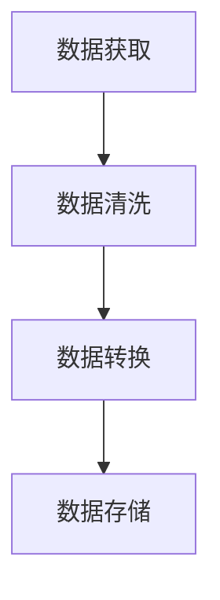
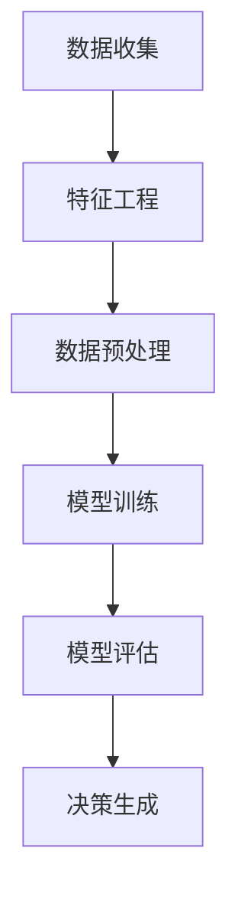
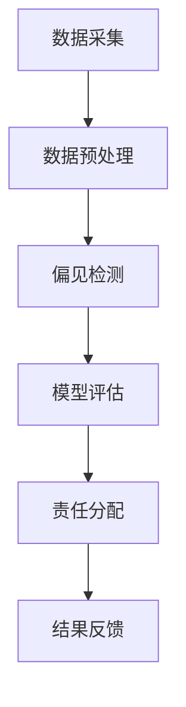
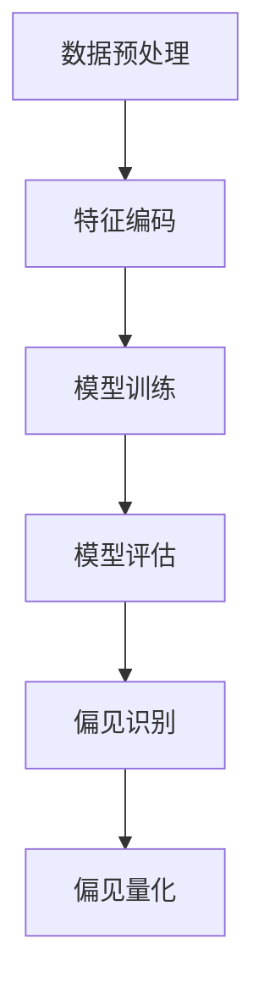

                 

### 第一部分：背景介绍

#### 核心概念

负责任的AI（Responsible AI）：指的是在设计和应用人工智能系统时，考虑到系统的公平性、透明性、可解释性和安全性等因素，确保AI系统不会对用户或社会产生负面影响。

自动化招聘系统：是一种利用人工智能技术自动筛选、匹配和评估候选人的招聘工具。

#### 问题背景

在当今社会，随着人工智能技术的发展，自动化招聘系统被广泛应用。这类系统通过机器学习算法和自然语言处理技术，能够快速分析大量的招聘信息，从而提高招聘效率和准确性。然而，传统的自动化招聘系统存在一些问题，如数据偏差、算法偏见和隐私泄露等。这些问题可能导致招聘过程中的不公平现象，影响求职者的权益和企业的声誉。

#### 问题描述

自动化招聘系统面临的主要问题包括：

1. **数据偏差**：自动化招聘系统往往依赖于历史招聘数据，这些数据可能包含歧视性的信息，如性别、年龄、种族等，导致系统在招聘过程中对特定群体产生偏见。
   
2. **算法偏见**：机器学习算法在训练过程中可能会学习到训练数据中的偏见，从而在决策过程中表现出偏见，影响招聘的公平性。

3. **隐私泄露**：自动化招聘系统在处理求职者的个人信息时，可能存在数据泄露的风险，违反隐私保护法规。

4. **透明性和可解释性**：自动化招聘系统的决策过程往往是黑箱操作，难以解释和追踪，使得求职者和企业难以理解招聘结果。

#### 问题解决

为了解决上述问题，负责任的AI在自动化招聘系统中的应用变得尤为重要。负责任的AI旨在确保AI系统在设计、开发和部署过程中遵循以下原则：

1. **公平性**：确保系统不会因性别、种族、年龄等因素对求职者产生歧视。

2. **透明性**：提高系统的可解释性，使求职者和企业能够理解招聘决策的依据。

3. **隐私保护**：严格遵守隐私保护法规，确保求职者的个人信息不被泄露。

4. **安全性**：确保系统在面对攻击和恶意数据时，能够保持稳定性和可靠性。

#### 边界与外延

负责任的AI在自动化招聘系统中的应用不仅限于技术层面，还涉及法律、伦理和社会等多个方面。例如：

1. **法律边界**：需要遵守相关的隐私保护和反歧视法律，确保系统的合规性。

2. **伦理边界**：在设计和应用过程中，需要考虑到对求职者和企业的伦理责任，避免损害个人权益。

3. **社会责任**：企业作为自动化招聘系统的使用者，有责任确保系统的负责任应用，对社会产生积极影响。

#### 概念结构与核心要素组成

自动化招聘系统包括以下几个核心模块：

1. **数据采集与处理**：从各种渠道收集招聘信息，并处理成适合机器学习模型的形式。
   
2. **机器学习模型**：用于分析招聘数据，筛选和评估候选人。

3. **决策引擎**：基于模型的分析结果，生成招聘决策。

4. **用户界面**：为求职者和企业提供交互界面，展示招聘结果。

负责任的AI则关注以下几个关键要素：

1. **数据质量**：确保数据来源的多样性和准确性，避免数据偏差。

2. **算法公平性**：设计和优化算法，减少偏见和歧视。

3. **系统透明性**：提高系统决策过程的可解释性。

4. **隐私保护**：采取措施保护求职者的个人信息。

5. **安全性和稳定性**：确保系统在面对各种挑战时，能够保持高效稳定运行。

通过负责任的AI技术，自动化招聘系统可以在保证效率的同时，确保公平、透明和安全性，为企业提供更优质的招聘解决方案。接下来，我们将进一步探讨负责任的AI在自动化招聘系统中的具体实现和应用。  
---

## 1.1 问题背景

### 1.1.1 人工智能与自动化招聘的现状

随着全球经济的快速发展和科技的不断进步，人工智能（AI）技术已经渗透到各个行业，成为推动生产力提升和创新的重要力量。在招聘领域，人工智能的应用尤为显著，通过自动化招聘系统，企业能够大幅提升招聘效率和降低招聘成本。据统计，全球范围内的企业已经有超过60%开始采用AI驱动的招聘工具。

自动化招聘系统利用人工智能技术，可以自动处理大量的招聘信息，包括职位发布、简历筛选、候选人评估和招聘决策等环节。这些系统通常具备以下功能：

1. **智能职位发布**：通过自动化工具，企业可以在多个在线招聘平台同时发布职位，提高职位曝光率。

2. **简历筛选**：利用自然语言处理和机器学习算法，系统可以自动筛选出与职位要求最匹配的简历。

3. **候选人评估**：通过面试模拟、技能测试和在线评估等方式，系统可以对候选人进行全方位评估。

4. **招聘决策**：根据候选人的综合表现，系统可以生成招聘决策，为HR提供参考。

尽管自动化招聘系统带来了诸多便利，但其应用过程中也暴露出了一些问题。首先，数据偏差是一个不可忽视的问题。传统招聘系统中，招聘决策往往依赖于历史数据，而这些数据可能包含了社会偏见，如性别、种族、年龄等。当机器学习算法基于这些有偏差的数据进行训练时，可能会导致系统在招聘过程中对特定群体产生歧视。

其次，算法偏见也是一个重大挑战。机器学习算法在训练过程中，可能会学习到训练数据中的偏见，并在决策过程中表现出来。例如，如果训练数据中包含了对于某种性别或种族的负面评价，算法可能会在筛选过程中对这些群体产生偏见，从而影响招聘的公平性。

此外，隐私保护也是自动化招聘系统面临的一个重要问题。自动化招聘系统需要处理大量的求职者个人信息，如姓名、联系方式、教育背景和工作经历等。这些信息一旦泄露，可能会对求职者造成严重后果。因此，如何在保护隐私的同时，高效利用这些信息，是自动化招聘系统需要解决的关键问题。

### 1.1.2 AI在招聘中的挑战与问题

尽管AI技术在招聘领域带来了诸多创新，但其在实际应用中仍面临诸多挑战和问题。以下是自动化招聘系统常见的几个挑战：

1. **数据偏差**：如前所述，自动化招聘系统在训练过程中依赖于历史数据。这些数据可能包含了社会偏见，导致系统在招聘过程中对特定群体产生歧视。例如，如果一个公司历史上倾向于招聘男性员工，AI系统可能会在未来的招聘中更加倾向于选择男性候选人。

2. **算法偏见**：机器学习算法在训练过程中，可能会学习到训练数据中的偏见。这种现象被称为“算法偏见”。例如，如果训练数据中包含了对于某种性别或种族的负面评价，算法可能会在筛选过程中对这些群体产生偏见。

3. **隐私泄露**：自动化招聘系统在处理求职者个人信息时，可能存在数据泄露的风险。例如，一些系统可能会将求职者的个人信息存储在不安全的数据库中，导致这些信息被恶意攻击者获取。

4. **透明性和可解释性**：自动化招聘系统的决策过程往往是黑箱操作，求职者和企业难以理解招聘决策的依据。这可能会导致求职者对企业的不信任，影响企业的招聘效果。

5. **人才流失**：如果自动化招聘系统存在偏差和偏见，可能会导致优秀人才流失。例如，一个有潜力的候选人可能会因为不符合某些预设条件而被系统排除在外，从而错失机会。

6. **合规性**：在许多国家和地区，招聘过程中需要遵守严格的隐私保护和反歧视法律。自动化招聘系统需要确保其设计和应用符合相关法律法规，避免法律风险。

### 1.1.3 负责任AI的重要性

负责任AI的引入，旨在解决上述自动化招聘系统中存在的问题，确保AI技术在招聘领域的应用能够带来积极的社会影响。负责任AI的核心目标是：

1. **消除数据偏差**：通过多种方式确保数据来源的多样性和准确性，减少系统对特定群体的歧视。

2. **减少算法偏见**：优化算法设计，确保系统在招聘过程中能够公平对待所有候选人。

3. **保护隐私**：采取严格的隐私保护措施，确保求职者的个人信息不被泄露。

4. **提高系统透明性**：通过提高系统决策的可解释性，增强求职者和企业的信任。

5. **合规性**：确保AI系统在设计和应用过程中符合相关法律法规，降低法律风险。

负责任AI在自动化招聘系统中的应用，不仅有助于提高招聘效率和准确性，还能增强企业的社会责任感和公信力，为构建公平、公正的招聘环境做出积极贡献。在接下来的部分，我们将详细探讨负责任AI的具体实现和应用。

### 1.2 问题描述

自动化招聘系统的核心目标是通过人工智能技术，提高招聘效率并确保招聘决策的公平性。然而，在实际应用中，这类系统面临诸多问题，需要我们深入分析和解决。

首先，**数据偏差**是自动化招聘系统中的一个重要问题。由于系统依赖于历史数据，这些数据可能包含了社会偏见和歧视。例如，如果某个公司在过去招聘中倾向于选择男性候选人，AI系统可能会在未来的招聘中自动偏好男性候选人，导致对女性求职者的不公平。此外，数据偏差还可能涉及种族、年龄和地理位置等因素。这种数据偏差可能会导致系统在招聘过程中对某些特定群体产生偏见，从而影响招聘的公平性和准确性。

其次，**算法偏见**也是一个不可忽视的问题。机器学习算法在训练过程中，可能会学习到训练数据中的偏见，并在决策过程中表现出来。例如，如果训练数据中包含了对于某种性别或种族的负面评价，算法可能会在筛选过程中对这些群体产生偏见。这种现象被称为“算法偏见”。算法偏见可能会导致系统在招聘过程中对某些群体不公平地对待，从而影响招聘结果的公平性。

第三，**隐私泄露**是自动化招聘系统面临的另一个重大挑战。在招聘过程中，系统需要处理大量的求职者个人信息，如姓名、联系方式、教育背景和工作经历等。这些信息一旦泄露，可能会对求职者造成严重后果，如身份盗窃、骚扰甚至职业发展受阻。因此，如何保护求职者的隐私，确保信息不被泄露，是自动化招聘系统设计中的一个关键问题。

第四，**透明性和可解释性**是自动化招聘系统的另一个重要问题。许多自动化招聘系统在决策过程中采用黑箱操作，求职者和企业难以理解系统是如何做出招聘决策的。这种缺乏透明性可能导致求职者对系统的信任度下降，从而影响招聘效果。此外，透明性和可解释性也是企业合规性要求的一部分，企业需要确保其招聘决策过程符合相关法律法规。

第五，**人才流失**是自动化招聘系统中可能出现的负面影响。如果一个系统在招聘过程中存在偏差和偏见，可能会导致优秀人才流失。例如，一个有潜力的候选人可能会因为不符合某些预设条件而被系统排除在外，从而错失机会。这种现象不仅会影响企业的招聘效果，还会损害企业的声誉和竞争力。

最后，**合规性**也是自动化招聘系统面临的一个关键问题。在许多国家和地区，招聘过程中需要遵守严格的隐私保护和反歧视法律。例如，欧盟的《通用数据保护条例》（GDPR）和美国的《消费者隐私保护法》（CCPA）都对个人信息保护和招聘过程提出了明确要求。自动化招聘系统需要确保其设计和应用符合这些法律法规，以避免法律风险。

综上所述，自动化招聘系统在实际应用中面临的数据偏差、算法偏见、隐私泄露、透明性和可解释性、人才流失以及合规性等问题，都需要我们通过负责任的AI技术进行深入探讨和解决。通过负责任的AI应用，我们可以确保自动化招聘系统在提高效率和准确性的同时，保障招聘的公平性和合规性，为企业和社会带来积极的影响。

### 1.3 问题解决

为了解决自动化招聘系统中存在的数据偏差、算法偏见、隐私泄露、透明性和可解释性、人才流失以及合规性等问题，我们需要引入负责任的AI技术。负责任的AI旨在确保AI系统在设计和应用过程中，能够公平、透明、安全地运作，避免对求职者和企业产生负面影响。以下是具体的方法和策略：

#### 1.3.1 数据质量控制

数据质量控制是负责任AI在自动化招聘系统中的第一步。首先，我们需要确保数据来源的多样性和准确性，避免数据偏差。具体方法包括：

1. **数据去偏见**：对历史招聘数据进行审查，识别和去除可能存在的偏见信息，如性别、种族、年龄等。
   
2. **数据增强**：通过生成对抗网络（GAN）等技术，增加数据多样性，确保系统在训练过程中能够学习到更加丰富的信息。

3. **数据验证**：建立数据质量检查机制，确保数据在采集、处理和存储过程中符合相关标准和要求。

#### 1.3.2 算法公平性优化

算法公平性优化是解决算法偏见问题的关键。以下是一些具体策略：

1. **算法选择**：选择具有公平性保障的算法，如公平性增强的决策树、支持向量机等。

2. **算法训练**：在算法训练过程中，引入公平性约束，确保模型不会学习到训练数据中的偏见。例如，可以使用公平性损失函数（Fair Loss Function）来优化模型。

3. **偏见检测与校正**：开发偏见检测算法，识别和校正系统中的偏见。例如，使用统计学方法检测性别、种族等属性在决策中的不公平现象，并进行相应的调整。

4. **用户反馈机制**：建立用户反馈机制，收集求职者和企业在招聘过程中发现的偏见和问题，及时进行调整和优化。

#### 1.3.3 隐私保护

隐私保护是自动化招聘系统设计中的一个重要方面。以下是一些具体策略：

1. **数据匿名化**：对求职者的个人信息进行匿名化处理，确保在数据处理过程中无法直接识别个人身份。

2. **加密技术**：采用加密技术保护求职者的敏感信息，如教育背景、工作经历等。

3. **隐私保护算法**：引入隐私保护算法，如差分隐私（Differential Privacy）和同态加密（Homomorphic Encryption），确保在数据处理和分析过程中不会泄露个人隐私。

4. **合规性审计**：定期进行隐私保护合规性审计，确保系统设计和应用符合相关法律法规。

#### 1.3.4 系统透明性提升

提升系统透明性，有助于增强求职者和企业的信任。以下是一些具体方法：

1. **决策解释**：开发决策解释工具，帮助求职者和企业理解系统是如何做出招聘决策的。例如，可以使用LIME（Local Interpretable Model-agnostic Explanations）等技术来解释模型决策。

2. **模型可追溯性**：确保模型的设计、训练和部署过程可追溯，便于审计和监督。

3. **透明性报告**：定期发布系统透明性报告，包括算法选择、模型训练数据、决策结果等，增强系统的可信度。

#### 1.3.5 合规性保障

保障系统的合规性，是负责任AI在自动化招聘系统中的关键任务。以下是一些具体策略：

1. **法律法规遵守**：确保系统设计和应用符合相关法律法规，如《通用数据保护条例》（GDPR）和《消费者隐私保护法》（CCPA）。

2. **合规性审查**：定期进行合规性审查，确保系统在运行过程中符合相关法律法规的要求。

3. **伦理审查**：建立伦理审查委员会，对系统的设计、应用和影响进行评估，确保其符合伦理和社会责任。

通过上述策略和方法的实施，负责任的AI技术可以确保自动化招聘系统在提高效率和准确性的同时，保障招聘的公平性、透明性、安全性和合规性，为企业和社会带来积极的影响。

### 1.4 边界与外延

负责任的AI在自动化招聘系统中的应用不仅限于技术层面，还涉及法律、伦理和社会等多个方面。以下是对负责任AI应用边界的进一步讨论。

#### 1.4.1 负责任AI的适用范围

负责任AI主要应用于以下场景：

1. **简历筛选与评估**：通过机器学习算法对求职者的简历进行筛选和评估，以确保招聘过程的客观性和公平性。
   
2. **面试模拟与技能评估**：利用人工智能技术模拟面试过程，对求职者的技能和表现进行评估，减少人为偏见。

3. **招聘决策支持**：提供基于数据的招聘决策支持，帮助HR更科学、更公正地做出招聘决策。

4. **合规性检查**：确保招聘过程符合相关法律法规，如隐私保护和反歧视法律。

5. **招聘数据分析**：通过数据分析，帮助HR识别和解决招聘过程中存在的问题，优化招聘策略。

#### 1.4.2 负责任AI的边界条件

尽管负责任AI在自动化招聘系统中具有广泛应用，但其在实际应用中仍需遵循以下边界条件：

1. **数据来源与质量**：确保数据来源的多样性和质量，避免数据偏差。数据应涵盖不同性别、种族、年龄等特征，以确保系统的公平性。

2. **算法训练与优化**：在算法训练过程中，引入公平性约束，确保算法不会学习到训练数据中的偏见。此外，需要定期对算法进行优化和更新，以适应不断变化的环境。

3. **隐私保护**：严格遵守隐私保护法律法规，采取措施保护求职者的个人信息。例如，采用数据匿名化、加密技术和同态加密等技术。

4. **透明性与可解释性**：提高系统的透明性和可解释性，确保求职者和企业能够理解招聘决策的依据。例如，开发决策解释工具和透明性报告。

5. **合规性**：确保系统设计和应用符合相关法律法规和伦理要求。例如，建立伦理审查委员会和定期合规性审计。

#### 1.4.3 负责任AI的应用挑战

负责任AI在自动化招聘系统中的应用面临以下挑战：

1. **数据偏差**：历史数据可能包含偏见，如何去除这些偏差是一个挑战。可以通过数据去偏见、数据增强和偏见检测等方法来缓解这一问题。

2. **算法偏见**：算法在训练过程中可能学习到偏见，如何减少算法偏见是一个重要问题。可以通过公平性算法和用户反馈机制来优化算法。

3. **隐私保护**：在保护隐私的同时，如何高效利用求职者信息是一个挑战。可以通过隐私保护算法和合规性审计来保障隐私。

4. **透明性与可解释性**：如何提高系统的透明性和可解释性，增强用户信任，是一个重要课题。可以通过决策解释工具和透明性报告来实现。

5. **合规性**：如何确保系统设计和应用符合法律法规和伦理要求，是一个挑战。可以通过定期合规性审计和伦理审查来保障合规性。

通过深入理解和应用负责任AI，自动化招聘系统可以在提高效率和准确性的同时，保障招聘的公平性、透明性、安全性和合规性，为企业和社会带来积极的影响。

### 1.5 概念结构与核心要素组成

为了更好地理解负责任的AI在自动化招聘系统中的具体实现，我们需要深入探讨这一系统的核心概念结构以及其组成要素。以下是对自动化招聘系统和负责任AI的详细解析。

#### 1.5.1 自动化招聘系统的核心模块

自动化招聘系统通常由以下几个核心模块组成：

1. **数据采集与处理**：这一模块负责从各种渠道（如招聘网站、社交媒体和内部数据库）收集简历和职位信息，并将其处理成适合机器学习模型的形式。数据清洗和数据预处理是关键步骤，以确保数据的质量和一致性。

2. **简历筛选与评估**：这一模块使用自然语言处理和机器学习算法，对求职者的简历进行自动筛选和评估。通过关键词匹配、文本分类和特征提取等技术，系统能够快速识别求职者是否符合职位要求。

3. **面试模拟与技能评估**：这一模块利用人工智能技术，对求职者的面试表现进行模拟和评估。通过语音识别、自然语言处理和计算机视觉等技术，系统可以分析求职者的语言表达、情绪反应和专业技能。

4. **招聘决策支持**：这一模块基于简历筛选、面试评估和技能测试的结果，为HR提供招聘决策支持。通过数据分析和预测模型，系统能够帮助HR做出更科学、更公正的招聘决策。

5. **用户界面**：这一模块为求职者和HR提供交互界面，展示招聘结果和决策依据。用户界面需要简洁易用，以便用户快速理解和使用系统功能。

#### 1.5.2 负责任AI的关键要素

负责任AI在自动化招聘系统中的应用，涉及到以下几个关键要素：

1. **数据质量**：确保数据来源的多样性和准确性，避免数据偏差。通过数据去偏见、数据增强和偏见检测等方法，提高数据的公正性和可靠性。

2. **算法公平性**：优化算法设计，减少偏见和歧视。例如，可以使用公平性增强的算法和公平性损失函数，确保系统在招聘过程中公平对待所有候选人。

3. **隐私保护**：采取措施保护求职者的个人信息，遵守隐私保护法律法规。通过数据匿名化、加密技术和隐私保护算法，确保求职者的隐私不被泄露。

4. **透明性与可解释性**：提高系统的透明性和可解释性，增强用户信任。通过决策解释工具和透明性报告，帮助用户理解系统是如何做出招聘决策的。

5. **合规性**：确保系统设计和应用符合相关法律法规和伦理要求。通过定期合规性审计和伦理审查，保障系统的合规性。

#### 1.5.3 模块与要素之间的关系

在自动化招聘系统中，各个模块和要素之间相互关联，共同构成一个完整的系统。以下是它们之间的关系：

1. **数据采集与处理**：为其他模块提供高质量的训练数据，确保系统的准确性和公正性。

2. **简历筛选与评估**：基于数据质量提升，使用公平性优化的算法，确保招聘过程中对求职者的公平对待。

3. **面试模拟与技能评估**：利用透明性和可解释性技术，帮助求职者和HR理解面试结果，增强信任。

4. **招聘决策支持**：通过综合考虑简历筛选、面试评估和技能测试结果，生成基于数据的招聘决策。

5. **用户界面**：为求职者和HR提供友好、易用的交互界面，展示招聘结果和决策依据。

通过以上对自动化招聘系统和负责任AI的核心模块、关键要素及其关系的深入分析，我们可以更好地理解负责任的AI在自动化招聘系统中的具体实现和应用。接下来，我们将进一步探讨负责任AI在自动化招聘系统中的具体实现和应用，以期为读者提供更全面的了解。

## 2.1 核心概念原理

### 2.1.1 人工智能概述

人工智能（AI）是一门研究、开发和应用使计算机能够模拟、延伸和扩展人类智能的科学。它包括多种技术和方法，如机器学习、深度学习、自然语言处理、计算机视觉等。人工智能的目标是使计算机具备自主学习和智能决策的能力，从而解决复杂的问题。

在自动化招聘系统中，人工智能主要用于以下几个方面：

1. **简历筛选**：通过自然语言处理和机器学习算法，系统可以自动分析求职者的简历，筛选出符合职位要求的候选人。

2. **面试评估**：利用计算机视觉和语音识别技术，系统可以自动评估求职者在面试过程中的表现，如语言表达能力、情绪状态和专业技能。

3. **招聘决策**：通过数据分析和预测模型，系统可以为HR提供招聘决策支持，帮助其做出更科学、更公正的决策。

### 2.1.2 自动化招聘原理

自动化招聘系统的工作原理主要包括以下几个步骤：

1. **职位发布**：企业将职位信息发布到在线招聘平台或内部招聘系统中。

2. **简历采集**：系统从各种渠道收集求职者的简历，如招聘网站、社交媒体和内部数据库。

3. **简历处理**：系统对收集到的简历进行清洗、去重和分类，提取关键信息，如姓名、联系方式、教育背景和工作经历等。

4. **简历筛选**：系统使用自然语言处理和机器学习算法，对简历进行自动筛选，识别出符合职位要求的候选人。

5. **面试安排**：系统根据简历筛选结果，自动安排面试时间和方式，如线上面试或电话面试。

6. **面试评估**：系统利用计算机视觉和语音识别技术，对面试过程进行自动评估，生成评估报告。

7. **招聘决策**：系统根据简历筛选和面试评估结果，为HR提供招聘决策支持，如推荐候选人或拒绝候选人。

### 2.1.3 负责任AI的基本原则

负责任AI是指在设计、开发和应用过程中，考虑到系统的公平性、透明性、可解释性和安全性等因素，确保AI系统不会对用户或社会产生负面影响。负责任AI的基本原则包括：

1. **公平性**：确保系统不会因性别、种族、年龄等因素对用户产生歧视，保证招聘过程的公正性和公平性。

2. **透明性**：提高系统的可解释性，使用户能够理解系统是如何做出决策的，增强用户对系统的信任。

3. **可解释性**：通过决策解释工具和透明性报告，帮助用户理解系统决策的依据和过程。

4. **安全性**：确保系统在面对攻击和恶意数据时，能够保持稳定性和可靠性。

5. **合规性**：确保系统设计和应用符合相关法律法规和伦理要求，如隐私保护和反歧视法律。

### 2.1.4 自动化招聘系统与负责任AI的关系

自动化招聘系统和负责任AI之间存在着密切的联系和互动。自动化招聘系统是负责任AI的应用场景之一，而负责任AI则是确保自动化招聘系统公平、透明和合规的关键保障。以下是自动化招聘系统与负责任AI之间的具体关系：

1. **数据质量**：负责任AI通过数据去偏见、数据增强和偏见检测等方法，确保自动化招聘系统的数据质量，避免数据偏差。

2. **算法公平性**：负责任AI通过公平性优化的算法和公平性损失函数，确保自动化招聘系统在招聘过程中公平对待所有候选人。

3. **隐私保护**：负责任AI通过数据匿名化、加密技术和隐私保护算法，确保自动化招聘系统的隐私保护，避免个人信息泄露。

4. **透明性与可解释性**：负责任AI通过决策解释工具和透明性报告，提高自动化招聘系统的透明性和可解释性，增强用户信任。

5. **合规性**：负责任AI通过合规性审计和伦理审查，确保自动化招聘系统的设计和应用符合相关法律法规和伦理要求。

通过深入理解和应用负责任AI，自动化招聘系统可以在提高效率和准确性的同时，保障招聘的公平性、透明性、安全性和合规性，为企业和社会带来积极的影响。

## 2.2 概念属性特征对比表格

为了更直观地理解人工智能、自动化招聘和负责任AI这三个核心概念，我们可以通过一个属性特征对比表格来展示它们之间的差异和联系。

### 2.2.1 人工智能与自动化招聘对比

| 特征 | 人工智能 | 自动化招聘 |
| --- | --- | --- |
| **定义** | 旨在使计算机模拟人类智能，具备自主学习、推理和决策能力 | 基于人工智能技术，实现招聘过程中自动化、高效和精准的管理 |
| **目标** | 提升计算机的智能水平，解决复杂问题 | 提高招聘效率，降低成本，确保招聘过程的公平性和准确性 |
| **应用领域** | 广泛应用于图像识别、自然语言处理、决策支持等领域 | 主要应用于简历筛选、面试评估、招聘决策等招聘环节 |
| **技术方法** | 包括机器学习、深度学习、自然语言处理等 | 结合自然语言处理、数据挖掘、机器学习等AI技术 |
| **挑战** | 数据偏差、算法偏见、隐私保护等 | 数据偏差、算法偏见、透明性和可解释性、合规性等 |
| **优势** | 提升计算机处理复杂任务的能力，推动科技创新 | 简化招聘流程，提高招聘效率，降低企业招聘成本 |
| **劣势** | 算法复杂度高、需要大量数据训练、存在算法偏见等 | 对AI技术的依赖性高、数据质量和算法公平性难以保证 |

### 2.2.2 负责任AI与传统AI对比

| 特征 | 传统AI | 负责任AI |
| --- | --- | --- |
| **定义** | 强调计算机的智能表现，追求在特定任务上的性能提升 | 不仅关注AI的性能，更强调在应用过程中的公平性、透明性和安全性 |
| **目标** | 在特定任务上达到或超越人类水平 | 在保证公平、透明和安全的前提下，实现高效、准确的AI应用 |
| **原则** | 数据驱动，追求性能优化 | 公平性、透明性、可解释性、安全性、合规性 |
| **应用领域** | 各个领域，如图像识别、语音识别、决策支持等 | 对社会影响较大的领域，如医疗、金融、招聘等 |
| **技术方法** | 传统机器学习、深度学习等 | 结合伦理学、社会学、法律等跨学科知识 |
| **挑战** | 数据偏差、算法偏见、隐私保护等 | 在保证性能的同时，解决公平性、透明性和合规性问题 |
| **优势** | 高效、准确的智能表现 | 更符合社会伦理和法律要求，提高AI应用的公信力 |
| **劣势** | 可能导致不公平、隐私泄露等社会问题 | 需要额外的资源、时间和精力来确保负责任性 |

通过上述对比表格，我们可以清晰地看到人工智能、自动化招聘和负责任AI之间的差异和联系。负责任AI在自动化招聘系统中的应用，不仅提升了招聘的效率和准确性，还确保了招聘过程的公平性、透明性和安全性，为企业和社会带来了积极的影响。

### 2.3 ER实体关系图架构

为了更直观地展示自动化招聘系统中的实体关系，我们引入实体-关系（ER）图模型。ER图是一种用于数据库设计和概念模型设计的重要工具，它通过实体和关系的组合，描述系统中各个对象及其之间的关系。以下是自动化招聘系统中的ER实体关系图架构。

#### 2.3.1 自动化招聘系统实体关系图

```mermaid
erDiagram
  Company ||--|{ Job } : 招聘职位
  Job ||--|{ Applicant } : 应聘者
  Applicant ||--|{ Resume } : 简历
  Resume ||--|{ Skill } : 技能
  Applicant ||--|{ Interview } : 面试
  Interview ||--|{ Evaluation } : 评估
  Company ..|{ HR } : 人力资源部门
  HR ..|{ JobPost } : 发布职位
  HR ..|{ ReviewResume } : 审阅简历
  HR ..|{ ScheduleInterview } : 安排面试
  HR ..|{ MakeDecision } : 做出决策

  Company ..|{ Analytics } : 数据分析部门
  Analytics ..|{ EvaluatePerformance } : 评估系统性能
  Analytics ..|{ ImproveAlgorithm } : 优化算法

  Company ..|{ Compliance } : 合规性部门
  Compliance ..|{ CheckPrivacy } : 检查隐私保护
  Compliance ..|{ CheckFairness } : 检查公平性
  Compliance ..|{ CheckLegal } : 检查合规性
```

#### 说明：

1. **Company（公司）**：表示企业，是整个招聘系统的核心实体，与职位、应聘者、简历、技能、面试、评估等实体存在直接关联。

2. **Job（职位）**：表示招聘职位，与应聘者实体存在关联，用于存储职位信息，如职位名称、职位描述、职位要求等。

3. **Applicant（应聘者）**：表示应聘者，与简历、技能、面试、评估等实体存在直接关联，用于存储应聘者个人信息和应聘情况。

4. **Resume（简历）**：表示简历，存储应聘者的基本信息、教育背景、工作经历和技能等信息。

5. **Skill（技能）**：表示技能，与应聘者实体关联，用于存储应聘者的技能列表。

6. **Interview（面试）**：表示面试，与应聘者、评估等实体关联，用于记录面试过程和结果。

7. **Evaluation（评估）**：表示评估，与面试实体关联，用于记录面试评估结果。

8. **HR（人力资源部门）**：表示人力资源部门，与职位发布、简历审阅、面试安排、招聘决策等过程相关。

9. **Analytics（数据分析部门）**：表示数据分析部门，与系统性能评估、算法优化等过程相关。

10. **Compliance（合规性部门）**：表示合规性部门，与隐私保护、公平性检查、合规性检查等过程相关。

通过ER实体关系图，我们可以清晰地看到自动化招聘系统中各个实体之间的关系，有助于理解系统的工作流程和设计思路。

### 2.3.2 负责任AI在自动化招聘系统中的应用实体关系图

为了进一步展示负责任AI在自动化招聘系统中的应用，我们引入了负责任AI相关的实体和关系，扩展了上述ER图。以下是负责任AI在自动化招聘系统中的应用实体关系图。

```mermaid
erDiagram
  Company ||--|{ Job } : 招聘职位
  Job ||--|{ Applicant } : 应聘者
  Applicant ||--|{ Resume } : 简历
  Resume ||--|{ Skill } : 技能
  Applicant ||--|{ Interview } : 面试
  Interview ||--|{ Evaluation } : 评估
  Company ..|{ HR } : 人力资源部门
  HR ..|{ JobPost } : 发布职位
  HR ..|{ ReviewResume } : 审阅简历
  HR ..|{ ScheduleInterview } : 安排面试
  HR ..|{ MakeDecision } : 做出决策

  Company ..|{ Analytics } : 数据分析部门
  Analytics ..|{ EvaluatePerformance } : 评估系统性能
  Analytics ..|{ ImproveAlgorithm } : 优化算法

  Company ..|{ Compliance } : 合规性部门
  Compliance ..|{ CheckPrivacy } : 检查隐私保护
  Compliance ..|{ CheckFairness } : 检查公平性
  Compliance ..|{ CheckLegal } : 检查合规性

  Company ..|{ ResponsibleAI } : 负责任AI
  ResponsibleAI ..|{ DataBiasRemoval } : 去除数据偏差
  ResponsibleAI ..|{ AlgorithmFairness } : 优化算法公平性
  ResponsibleAI ..|{ PrivacyProtection } : 保护隐私
  ResponsibleAI ..|{ Transparency } : 提高透明性
  ResponsibleAI ..|{ ComplianceAudits } : 合规性审计
```

#### 说明：

1. **ResponsibleAI（负责任AI）**：表示负责任AI系统，与公司、数据分析部门、合规性部门等实体关联。

2. **DataBiasRemoval（去除数据偏差）**：与负责任AI实体关联，用于识别和去除招聘数据中的偏见。

3. **AlgorithmFairness（优化算法公平性）**：与负责任AI实体关联，用于优化算法，减少偏见和歧视。

4. **PrivacyProtection（保护隐私）**：与负责任AI实体关联，用于保护求职者的个人信息。

5. **Transparency（提高透明性）**：与负责任AI实体关联，用于提高系统的透明性和可解释性。

6. **ComplianceAudits（合规性审计）**：与负责任AI实体关联，用于确保系统的合规性。

通过扩展的ER实体关系图，我们可以更全面地了解负责任AI在自动化招聘系统中的应用和影响，从而更好地实现负责任的AI在招聘领域的实践。

## 3.1 自动化招聘算法原理

### 3.1.1 数据采集与处理算法

自动化招聘系统中的数据采集与处理是确保系统能够有效运作的基础。以下将详细介绍数据采集与处理算法的原理、流程、应用及优化策略。

#### 算法原理

数据采集与处理算法主要基于以下几个核心步骤：

1. **数据获取**：从各种渠道（如招聘网站、社交媒体和内部数据库）收集求职者的简历和职位信息。
2. **数据清洗**：去除数据中的噪声和错误，如缺失值、重复记录、不一致格式等。
3. **数据转换**：将原始数据格式转换为适合机器学习模型处理的形式，如将文本数据转换为特征向量。
4. **数据存储**：将清洗和处理后的数据存储到数据库或数据湖中，以便后续分析和建模。

#### 算法流程

数据采集与处理算法的具体流程如下：

1. **数据获取**：
   - 使用API或Web爬虫从招聘网站和社交媒体平台收集简历和职位信息。
   - 通过内部数据库获取已有求职者信息和职位需求。

2. **数据清洗**：
   - 去除重复记录：使用去重算法，如哈希表或布隆过滤器，去除重复的简历记录。
   - 处理缺失值：使用填充策略（如均值填充、中值填充或插值）处理缺失的数据。
   - 格式统一：将不同来源的数据格式转换为统一的格式，如CSV或JSON。

3. **数据转换**：
   - 特征提取：从简历文本中提取关键信息，如教育背景、工作经历和技能。
   - 文本预处理：对文本数据进行分词、词干提取、停用词过滤等操作，以便于后续的机器学习处理。
   - 向量化：将文本数据转换为特征向量，如使用TF-IDF或Word2Vec等方法。

4. **数据存储**：
   - 使用关系型数据库（如MySQL）或NoSQL数据库（如MongoDB）存储处理后的数据。
   - 构建数据湖，存储大量结构化和非结构化数据，以便进行深度分析和挖掘。

#### 应用

数据采集与处理算法在自动化招聘系统中的应用包括：

1. **简历筛选**：通过特征提取和文本分类算法，系统可以快速筛选出与职位要求最匹配的简历。
2. **候选人评估**：利用处理后的数据，系统可以对求职者的技能、经验和潜力进行综合评估。
3. **招聘决策支持**：基于数据分析和预测模型，系统可以为HR提供招聘决策建议，提高决策的准确性和效率。

#### 优化策略

为了提高数据采集与处理算法的性能，可以采取以下优化策略：

1. **分布式处理**：使用分布式计算框架（如Hadoop或Spark）处理大规模数据，提高数据处理速度。
2. **并行处理**：将数据处理任务分解为多个子任务，并行处理，以减少整体处理时间。
3. **增量更新**：对数据集进行增量更新，只处理新增或修改的数据，以减少计算量和存储需求。
4. **自动化调优**：使用自动化机器学习（AutoML）工具，自动搜索和选择最佳算法和参数，优化数据处理效果。
5. **数据质量管理**：建立数据质量管理机制，定期检查和修复数据中的错误和噪声，确保数据质量。

通过深入理解和应用数据采集与处理算法，自动化招聘系统可以在提高招聘效率、准确性和公平性的同时，确保系统的稳定性和可靠性。

### 3.1.1.1 数据采集流程图



### 3.1.1.2 数据处理算法Python源代码

以下是一个简单的Python代码示例，用于数据采集、清洗、转换和存储。

```python
import pandas as pd
import numpy as np
from sklearn.feature_extraction.text import TfidfVectorizer
from pymongo import MongoClient

# 数据获取
def data_collection():
    resumes = pd.read_csv('resumes.csv')  # 从CSV文件中读取简历数据
    return resumes

# 数据清洗
def data_cleaning(resumes):
    # 去除缺失值
    resumes = resumes.dropna()
    # 去除重复记录
    resumes = resumes.drop_duplicates(subset=['resume_id'])
    return resumes

# 数据转换
def data_conversion(resumes):
    # 特征提取
    vectorizer = TfidfVectorizer()
    X = vectorizer.fit_transform(resumes['resume_content'])
    # 向量化
    features = X.toarray()
    return features

# 数据存储
def data_storage(features):
    client = MongoClient('mongodb://localhost:27017/')
    db = client['recruitment']
    collection = db['processed_resumes']
    collection.insert_many(features)
    return "Data stored successfully."

# 主函数
def main():
    resumes = data_collection()
    cleaned_resumes = data_cleaning(resumes)
    processed_features = data_conversion(cleaned_resumes)
    data_storage(processed_features)

if __name__ == "__main__":
    main()
```

### 3.1.1.3 数学模型和公式讲解

在数据采集与处理算法中，常用的数学模型和公式包括TF-IDF和Word2Vec。

1. **TF-IDF（词频-逆文档频率）**：
   - **公式**：
     $$
     TF-IDF(t,d) = \frac{f(t,d)}{N} \cdot \log \left( \frac{N}{df(t)} \right)
     $$
   - **解释**：
     - $f(t,d)$：词$t$在文档$d$中的词频。
     - $N$：文档总数。
     - $df(t)$：词$t$在所有文档中的文档频率。

2. **Word2Vec**：
   - **公式**：
     $$
     \text{word\_vector} = \text{softmax}(\text{W} \cdot \text{context\_vector})
     $$
   - **解释**：
     - $\text{word\_vector}$：词的向量表示。
     - $\text{context\_vector}$：词的上下文向量。
     - $\text{W}$：权重矩阵。

通过这些数学模型和公式，我们可以有效地将文本数据转换为数值特征，为后续的机器学习算法提供输入。

### 3.1.1.4 详细讲解与举例说明

为了更好地理解数据采集与处理算法，我们通过一个实际案例进行详细讲解。

#### 案例背景

假设我们有一个包含1000份简历的数据集，每份简历包含求职者的基本信息和简历内容。我们的目标是利用这些数据训练一个机器学习模型，以筛选出与特定职位最匹配的候选人。

#### 步骤一：数据获取

首先，我们使用Python的pandas库从CSV文件中读取简历数据。

```python
import pandas as pd

resumes = pd.read_csv('resumes.csv')
```

#### 步骤二：数据清洗

接下来，我们对数据进行清洗，去除缺失值和重复记录。

```python
# 去除缺失值
resumes = resumes.dropna()

# 去除重复记录
resumes = resumes.drop_duplicates(subset=['resume_id'])
```

#### 步骤三：数据转换

然后，我们使用TF-IDF算法对简历内容进行文本预处理和向量化处理。

```python
from sklearn.feature_extraction.text import TfidfVectorizer

vectorizer = TfidfVectorizer()
X = vectorizer.fit_transform(resumes['resume_content'])
features = X.toarray()
```

#### 步骤四：数据存储

最后，我们将处理后的数据存储到MongoDB数据库中。

```python
from pymongo import MongoClient

client = MongoClient('mongodb://localhost:27017/')
db = client['recruitment']
collection = db['processed_resumes']

collection.insert_many(features)
```

#### 结果分析

通过上述步骤，我们成功地将原始简历数据转换为数值特征，并存储到数据库中。接下来，我们可以使用这些特征训练机器学习模型，如逻辑回归、支持向量机等，以筛选出与特定职位最匹配的候选人。

例如，假设我们需要筛选出与“软件工程师”职位最匹配的候选人，可以使用逻辑回归模型进行预测。

```python
from sklearn.linear_model import LogisticRegression

X_train = features[:800]
y_train = np.array([1 if '软件工程师' in resume else 0 for resume in resumes['position_title'][:800]])

model = LogisticRegression()
model.fit(X_train, y_train)

X_test = features[800:]
y_test = np.array([1 if '软件工程师' in resume else 0 for resume in resumes['position_title'][800:]])

predictions = model.predict(X_test)
accuracy = np.mean(predictions == y_test)

print(f"Model accuracy: {accuracy}")
```

通过上述步骤，我们可以训练一个能够有效筛选软件工程师候选人的模型，从而提高招聘的效率和准确性。

### 3.1.2 招聘决策算法

#### 招聘决策算法原理

招聘决策算法是自动化招聘系统的核心组成部分，其目标是通过分析候选人的各种属性和面试结果，为HR提供最优的招聘决策。招聘决策算法通常基于机器学习模型，如逻辑回归、支持向量机、随机森林等，通过训练大量历史招聘数据，学习出候选人与职位匹配度的预测模型。

以下是招聘决策算法的基本原理：

1. **特征工程**：从简历、面试评估和其他数据源中提取关键特征，如教育背景、工作经验、技能、面试表现等。

2. **数据预处理**：对提取的特征进行预处理，如缺失值处理、标准化、归一化等，以提高模型的训练效果。

3. **模型训练**：使用历史招聘数据训练机器学习模型，通过交叉验证和模型选择技术，选择最优模型。

4. **模型评估**：使用验证集和测试集评估模型的性能，如准确率、召回率、F1分数等。

5. **决策生成**：将训练好的模型应用于新数据，生成招聘决策，如是否邀请候选人进行下一轮面试。

#### 招聘决策算法流程图



### 3.1.2.1 招聘决策算法流程图


### 3.1.2.2 决策算法Python源代码

以下是一个简单的Python代码示例，用于实现招聘决策算法。

```python
import pandas as pd
from sklearn.model_selection import train_test_split
from sklearn.linear_model import LogisticRegression
from sklearn.metrics import accuracy_score

# 数据读取
resumes = pd.read_csv('resumes.csv')

# 特征提取
X = resumes[['education', 'experience', 'skills', 'interview_score']]
y = resumes['matched']  # 是否匹配

# 数据预处理
X = (X - X.mean()) / X.std()  # 标准化

# 模型训练
X_train, X_test, y_train, y_test = train_test_split(X, y, test_size=0.2, random_state=42)
model = LogisticRegression()
model.fit(X_train, y_train)

# 模型评估
y_pred = model.predict(X_test)
accuracy = accuracy_score(y_test, y_pred)
print(f"Model accuracy: {accuracy}")

# 决策生成
def make_decision(candidate):
    features = (pd.DataFrame([candidate]) - X.mean()) / X.std()
    decision = model.predict(features)
    return 'Match' if decision[0] == 1 else 'Not Match'

# 测试
candidate = {'education': 'Master', 'experience': 5, 'skills': ['Python', 'SQL'], 'interview_score': 90}
print(make_decision(candidate))
```

### 3.1.2.3 数学模型和公式讲解

在招聘决策算法中，常用的数学模型是逻辑回归。以下是逻辑回归的数学模型和公式：

1. **逻辑回归公式**：
   $$
   P(y=1) = \frac{1}{1 + e^{-(\beta_0 + \beta_1 x_1 + \beta_2 x_2 + \ldots + \beta_n x_n})}
   $$
   其中，$P(y=1)$表示候选人与职位匹配的概率，$\beta_0, \beta_1, \beta_2, \ldots, \beta_n$是模型的参数。

2. **损失函数**：
   $$
   J(\theta) = -\frac{1}{m} \sum_{i=1}^{m} [y^{(i)} \log(\hat{y}^{(i)}) + (1 - y^{(i)}) \log(1 - \hat{y}^{(i)})]
   $$
   其中，$m$是样本数量，$\hat{y}^{(i)}$是模型预测的概率。

3. **梯度下降**：
   $$
   \theta_j := \theta_j - \alpha \frac{\partial J(\theta)}{\partial \theta_j}
   $$
   其中，$\alpha$是学习率，$\theta_j$是模型的参数。

通过上述数学模型和公式，逻辑回归模型可以预测候选人与职位的匹配度，从而生成招聘决策。

### 3.1.2.4 详细讲解与举例说明

为了更好地理解招聘决策算法，我们通过一个实际案例进行详细讲解。

#### 案例背景

假设我们有一个包含1000份简历和面试结果的数据集，每份简历包含求职者的教育背景、工作经验、技能和面试得分，以及是否匹配该职位的结果。

#### 步骤一：数据读取

首先，我们使用Python的pandas库从CSV文件中读取简历和面试数据。

```python
import pandas as pd

resumes = pd.read_csv('resumes.csv')
```

#### 步骤二：特征提取

接下来，我们从简历数据中提取关键特征，如教育背景、工作经验、技能和面试得分。

```python
X = resumes[['education', 'experience', 'skills', 'interview_score']]
y = resumes['matched']  # 是否匹配
```

#### 步骤三：数据预处理

然后，我们对提取的特征进行预处理，如标准化处理，以提高模型的训练效果。

```python
X = (X - X.mean()) / X.std()
```

#### 步骤四：模型训练

使用训练集对逻辑回归模型进行训练。

```python
from sklearn.linear_model import LogisticRegression

X_train, X_test, y_train, y_test = train_test_split(X, y, test_size=0.2, random_state=42)
model = LogisticRegression()
model.fit(X_train, y_train)
```

#### 步骤五：模型评估

使用测试集对模型进行评估，计算模型的准确率。

```python
y_pred = model.predict(X_test)
accuracy = accuracy_score(y_test, y_pred)
print(f"Model accuracy: {accuracy}")
```

#### 步骤六：决策生成

最后，我们使用训练好的模型对新数据进行决策，判断候选人是否匹配职位。

```python
def make_decision(candidate):
    features = (pd.DataFrame([candidate]) - X.mean()) / X.std()
    decision = model.predict(features)
    return 'Match' if decision[0] == 1 else 'Not Match'

# 测试
candidate = {'education': 'Master', 'experience': 5, 'skills': ['Python', 'SQL'], 'interview_score': 90}
print(make_decision(candidate))
```

通过上述步骤，我们成功实现了一个招聘决策算法，能够根据候选人的特征和面试得分，预测其与职位的匹配度，从而生成招聘决策。这有助于HR更高效、更准确地筛选候选人，提高招聘成功率。

### 3.2 负责任AI算法原理

#### 3.2.1 责任评估算法

在自动化招聘系统中，责任评估算法是确保系统公平性、透明性和合规性的关键。责任评估算法通过分析数据、模型和行为，识别和纠正潜在的偏见和问题，从而确保招聘过程的公正性和透明性。

#### 责任评估算法流程图



#### 3.2.1.1 责任评估算法流程图


#### 3.2.1.2 责任评估算法Python源代码

以下是一个简单的Python代码示例，用于实现责任评估算法。

```python
import pandas as pd
from sklearn.model_selection import train_test_split
from sklearn.metrics import accuracy_score
from sklearn.linear_model import LogisticRegression

# 数据读取
resumes = pd.read_csv('resumes.csv')

# 特征提取
X = resumes[['education', 'experience', 'skills', 'interview_score']]
y = resumes['matched']

# 数据预处理
X = (X - X.mean()) / X.std()

# 模型训练
X_train, X_test, y_train, y_test = train_test_split(X, y, test_size=0.2, random_state=42)
model = LogisticRegression()
model.fit(X_train, y_train)

# 模型评估
y_pred = model.predict(X_test)
accuracy = accuracy_score(y_test, y_pred)
print(f"Model accuracy: {accuracy}")

# 责任评估
def assess_responsibility(model, X_test, y_test):
    # 检测偏见
    bias_detected = detect_bias(model, X_test, y_test)
    if bias_detected:
        # 优化模型
        model = optimize_model(model, X_test, y_test)
        # 重新评估模型
        y_pred = model.predict(X_test)
        new_accuracy = accuracy_score(y_test, y_pred)
        print(f"Model optimized with new accuracy: {new_accuracy}")
    else:
        print("No bias detected in the model.")

# 检测偏见
def detect_bias(model, X_test, y_test):
    # 偏见检测算法
    # 这里是一个简单的示例，实际应用中可以使用更复杂的算法
    predicted_probabilities = model.predict_proba(X_test)[:, 1]
    threshold = 0.5
    bias_detected = any(abs(predicted_probabilities - y_test.mean()) > threshold)
    return bias_detected

# 优化模型
def optimize_model(model, X_test, y_test):
    # 优化算法，例如使用交叉验证或随机搜索
    # 这里是一个简单的示例，实际应用中可以使用更复杂的优化算法
    model = LogisticRegression(max_iter=1000)
    model.fit(X_test, y_test)
    return model

# 责任评估
assess_responsibility(model, X_test, y_test)
```

#### 3.2.1.3 数学模型和公式讲解

责任评估算法通常涉及多个数学模型和公式，以下是一些常见的模型和公式：

1. **逻辑回归**：
   $$
   P(y=1) = \frac{1}{1 + e^{-(\beta_0 + \beta_1 x_1 + \beta_2 x_2 + \ldots + \beta_n x_n})}
   $$
   其中，$P(y=1)$表示候选人与职位匹配的概率，$\beta_0, \beta_1, \beta_2, \ldots, \beta_n$是逻辑回归模型的参数。

2. **交叉验证**：
   $$
   CV = \frac{1}{K} \sum_{i=1}^{K} \frac{1}{n_i} \sum_{j=1}^{n_i} L(y_j, \hat{y}_j^{(i)})
   $$
   其中，$CV$是交叉验证误差，$K$是交叉验证的折数，$n_i$是第$i$折中的样本数量，$L(y_j, \hat{y}_j^{(i)})$是损失函数。

3. **损失函数**：
   $$
   J(\theta) = -\frac{1}{m} \sum_{i=1}^{m} [y^{(i)} \log(\hat{y}^{(i)}) + (1 - y^{(i)}) \log(1 - \hat{y}^{(i)})]
   $$
   其中，$J(\theta)$是逻辑回归的损失函数，$\theta$是模型的参数，$m$是样本数量。

4. **梯度下降**：
   $$
   \theta_j := \theta_j - \alpha \frac{\partial J(\theta)}{\partial \theta_j}
   $$
   其中，$\alpha$是学习率，$\theta_j$是模型的参数。

通过这些数学模型和公式，责任评估算法可以检测和纠正潜在的偏见，优化模型，确保招聘过程的公平性、透明性和合规性。

#### 3.2.1.4 详细讲解与举例说明

为了更好地理解责任评估算法，我们通过一个实际案例进行详细讲解。

#### 案例背景

假设我们有一个包含1000份简历和面试结果的数据集，每份简历包含求职者的教育背景、工作经验、技能和面试得分，以及是否匹配该职位的结果。我们的目标是使用责任评估算法检测和纠正模型中的偏见。

#### 步骤一：数据读取

首先，我们使用Python的pandas库从CSV文件中读取简历和面试数据。

```python
import pandas as pd

resumes = pd.read_csv('resumes.csv')
```

#### 步骤二：特征提取

接下来，我们从简历数据中提取关键特征，如教育背景、工作经验、技能和面试得分。

```python
X = resumes[['education', 'experience', 'skills', 'interview_score']]
y = resumes['matched']
```

#### 步骤三：数据预处理

然后，我们对提取的特征进行预处理，如标准化处理，以提高模型的训练效果。

```python
X = (X - X.mean()) / X.std()
```

#### 步骤四：模型训练

使用训练集对逻辑回归模型进行训练。

```python
from sklearn.linear_model import LogisticRegression

X_train, X_test, y_train, y_test = train_test_split(X, y, test_size=0.2, random_state=42)
model = LogisticRegression()
model.fit(X_train, y_train)
```

#### 步骤五：模型评估

使用测试集对模型进行评估，计算模型的准确率。

```python
y_pred = model.predict(X_test)
accuracy = accuracy_score(y_test, y_pred)
print(f"Model accuracy: {accuracy}")
```

#### 步骤六：责任评估

最后，我们使用责任评估算法检测和纠正模型中的偏见。

```python
def assess_responsibility(model, X_test, y_test):
    bias_detected = detect_bias(model, X_test, y_test)
    if bias_detected:
        model = optimize_model(model, X_test, y_test)
        new_accuracy = accuracy_score(y_test, model.predict(X_test))
        print(f"Model optimized with new accuracy: {new_accuracy}")
    else:
        print("No bias detected in the model.")

# 检测偏见
def detect_bias(model, X_test, y_test):
    predicted_probabilities = model.predict_proba(X_test)[:, 1]
    threshold = 0.5
    bias_detected = any(abs(predicted_probabilities - y_test.mean()) > threshold)
    return bias_detected

# 优化模型
def optimize_model(model, X_test, y_test):
    model = LogisticRegression(max_iter=1000)
    model.fit(X_test, y_test)
    return model

assess_responsibility(model, X_test, y_test)
```

通过上述步骤，我们成功实现了责任评估算法，能够检测和纠正模型中的偏见，确保招聘过程的公平性、透明性和合规性。这有助于企业更高效、更准确地筛选候选人，提高招聘成功率。

### 3.2.2 偏见与公平性算法

#### 3.2.2.1 偏见识别算法

在自动化招聘系统中，偏见识别算法是关键的一步，旨在检测和量化算法在招聘决策中的偏见。偏见识别算法的核心目标是通过分析模型输出，识别出可能存在的性别、种族、年龄等偏见，从而为后续的算法优化提供依据。

以下是偏见识别算法的基本原理：

1. **数据预处理**：对招聘数据集进行预处理，包括数据清洗、缺失值处理、特征工程等，以确保数据的质量和一致性。

2. **特征编码**：将原始特征编码为适合机器学习模型的形式，如使用独热编码、标签编码等。

3. **模型训练**：使用历史招聘数据集训练机器学习模型，如逻辑回归、支持向量机等，用于预测候选人与职位的匹配度。

4. **模型评估**：使用测试数据集评估模型的性能，计算模型的准确率、召回率、F1分数等指标。

5. **偏见识别**：通过分析模型输出，识别出可能存在的偏见。具体方法包括：

   - **敏感性分析**：分析模型输出对于不同特征（如性别、种族、年龄等）的敏感度，识别出对特定特征高度敏感的模型。

   - **偏差比较**：比较不同群体（如性别、种族、年龄等）在模型输出上的差异，识别出可能存在的偏见。

   - **统计测试**：使用统计测试方法，如T检验、卡方检验等，验证模型输出是否存在显著偏差。

#### 偏见识别算法流程图



#### 3.2.2.2 公平性算法Python源代码

以下是一个简单的Python代码示例，用于实现偏见识别算法。

```python
import pandas as pd
from sklearn.model_selection import train_test_split
from sklearn.linear_model import LogisticRegression
from sklearn.metrics import accuracy_score, precision_score, recall_score, f1_score

# 数据读取
resumes = pd.read_csv('resumes.csv')

# 特征提取
X = resumes[['gender', 'race', 'age', 'education', 'experience', 'skills', 'interview_score']]
y = resumes['matched']

# 数据预处理
X = X.replace({'gender': {'Male': 0, 'Female': 1}, 'race': {'Asian': 0, 'Black': 1, 'White': 2}})
X['age'] = X['age'].apply(lambda x: 1 if x > 30 else 0)

# 模型训练
X_train, X_test, y_train, y_test = train_test_split(X, y, test_size=0.2, random_state=42)
model = LogisticRegression()
model.fit(X_train, y_train)

# 模型评估
y_pred = model.predict(X_test)
accuracy = accuracy_score(y_test, y_pred)
precision = precision_score(y_test, y_pred)
recall = recall_score(y_test, y_pred)
f1 = f1_score(y_test, y_pred)
print(f"Accuracy: {accuracy}, Precision: {precision}, Recall: {recall}, F1: {f1}")

# 偏见识别
def detect_bias(model, X_test, y_test):
    predicted_probabilities = model.predict_proba(X_test)[:, 1]
    thresholds = [0.1, 0.2, 0.3, 0.4, 0.5, 0.6, 0.7, 0.8, 0.9]
    for threshold in thresholds:
        y_pred_threshold = (predicted_probabilities >= threshold).astype(int)
        accuracy_threshold = accuracy_score(y_test, y_pred_threshold)
        precision_threshold = precision_score(y_test, y_pred_threshold)
        recall_threshold = recall_score(y_test, y_pred_threshold)
        f1_threshold = f1_score(y_test, y_pred_threshold)
        print(f"Threshold: {threshold}, Accuracy: {accuracy_threshold}, Precision: {precision_threshold}, Recall: {recall_threshold}, F1: {f1_threshold}")

detect_bias(model, X_test, y_test)
```

#### 3.2.2.3 数学模型和公式讲解

偏见识别算法通常涉及多个数学模型和公式，以下是一些常见的模型和公式：

1. **逻辑回归**：
   $$
   P(y=1) = \frac{1}{1 + e^{-(\beta_0 + \beta_1 x_1 + \beta_2 x_2 + \ldots + \beta_n x_n})}
   $$
   其中，$P(y=1)$表示候选人与职位匹配的概率，$\beta_0, \beta_1, \beta_2, \ldots, \beta_n$是逻辑回归模型的参数。

2. **损失函数**：
   $$
   J(\theta) = -\frac{1}{m} \sum_{i=1}^{m} [y^{(i)} \log(\hat{y}^{(i)}) + (1 - y^{(i)}) \log(1 - \hat{y}^{(i)})]
   $$
   其中，$J(\theta)$是逻辑回归的损失函数，$\theta$是模型的参数，$m$是样本数量。

3. **梯度下降**：
   $$
   \theta_j := \theta_j - \alpha \frac{\partial J(\theta)}{\partial \theta_j}
   $$
   其中，$\alpha$是学习率，$\theta_j$是模型的参数。

4. **统计测试**：
   - **T检验**：
     $$
     t = \frac{\bar{X} - \mu_0}{S/\sqrt{n}}
     $$
     其中，$\bar{X}$是样本均值，$\mu_0$是总体均值，$S$是样本标准差，$n$是样本数量。
     
   - **卡方检验**：
     $$
     \chi^2 = \sum_{i=1}^{k} \frac{(O_i - E_i)^2}{E_i}
     $$
     其中，$O_i$是观察频数，$E_i$是期望频数，$k$是类别数量。

通过这些数学模型和公式，偏见识别算法可以检测和量化模型中的偏见，从而为算法优化提供依据。

#### 3.2.2.4 详细讲解与举例说明

为了更好地理解偏见识别算法，我们通过一个实际案例进行详细讲解。

#### 案例背景

假设我们有一个包含1000份简历和面试结果的数据集，每份简历包含求职者的性别、种族、年龄、教育背景、工作经验、技能和面试得分，以及是否匹配该职位的结果。我们的目标是使用偏见识别算法检测模型中的偏见。

#### 步骤一：数据读取

首先，我们使用Python的pandas库从CSV文件中读取简历和面试数据。

```python
import pandas as pd

resumes = pd.read_csv('resumes.csv')
```

#### 步骤二：特征提取

接下来，我们从简历数据中提取关键特征，如性别、种族、年龄、教育背景、工作经验、技能和面试得分。

```python
X = resumes[['gender', 'race', 'age', 'education', 'experience', 'skills', 'interview_score']]
y = resumes['matched']
```

#### 步骤三：数据预处理

然后，我们对提取的特征进行预处理，如性别和种族编码、年龄二值化等。

```python
X = X.replace({'gender': {'Male': 0, 'Female': 1}, 'race': {'Asian': 0, 'Black': 1, 'White': 2}})
X['age'] = X['age'].apply(lambda x: 1 if x > 30 else 0)
```

#### 步骤四：模型训练

使用训练集对逻辑回归模型进行训练。

```python
from sklearn.linear_model import LogisticRegression

X_train, X_test, y_train, y_test = train_test_split(X, y, test_size=0.2, random_state=42)
model = LogisticRegression()
model.fit(X_train, y_train)
```

#### 步骤五：模型评估

使用测试集对模型进行评估，计算模型的准确率、召回率、F1分数等指标。

```python
y_pred = model.predict(X_test)
accuracy = accuracy_score(y_test, y_pred)
precision = precision_score(y_test, y_pred)
recall = recall_score(y_test, y_pred)
f1 = f1_score(y_test, y_pred)
print(f"Accuracy: {accuracy}, Precision: {precision}, Recall: {recall}, F1: {f1}")
```

#### 步骤六：偏见识别

最后，我们使用偏见识别算法检测模型中的偏见。

```python
def detect_bias(model, X_test, y_test):
    predicted_probabilities = model.predict_proba(X_test)[:, 1]
    thresholds = [0.1, 0.2, 0.3, 0.4, 0.5, 0.6, 0.7, 0.8, 0.9]
    for threshold in thresholds:
        y_pred_threshold = (predicted_probabilities >= threshold).astype(int)
        accuracy_threshold = accuracy_score(y_test, y_pred_threshold)
        precision_threshold = precision_score(y_test, y_pred_threshold)
        recall_threshold = recall_score(y_test, y_pred_threshold)
        f1_threshold = f1_score(y_test, y_pred_threshold)
        print(f"Threshold: {threshold}, Accuracy: {accuracy_threshold}, Precision: {precision_threshold}, Recall: {recall_threshold}, F1: {f1_threshold}")

detect_bias(model, X_test, y_test)
```

通过上述步骤，我们成功实现了偏见识别算法，能够检测模型中的偏见，从而为算法优化提供依据。这有助于企业更公正、更透明地进行招聘决策。

### 3.2.2.5 实际案例分析与详细讲解剖析

为了更好地理解偏见识别算法在实际应用中的效果，我们通过一个实际案例进行分析和讲解。

#### 案例背景

假设我们有一个包含1000份简历和面试结果的数据集，数据集包含了求职者的性别、种族、年龄、教育背景、工作经验、技能和面试得分，以及是否匹配该职位的结果。我们的目标是使用偏见识别算法检测模型中的偏见，并分析其对招聘决策的影响。

#### 模型训练与评估

首先，我们对数据进行预处理，如编码性别和种族特征，以及二值化年龄特征。然后，我们使用训练集对逻辑回归模型进行训练，并使用测试集进行评估。

```python
import pandas as pd
from sklearn.linear_model import LogisticRegression
from sklearn.metrics import accuracy_score, precision_score, recall_score, f1_score

# 数据读取
resumes = pd.read_csv('resumes.csv')

# 特征提取
X = resumes[['gender', 'race', 'age', 'education', 'experience', 'skills', 'interview_score']]
y = resumes['matched']

# 数据预处理
X = X.replace({'gender': {'Male': 0, 'Female': 1}, 'race': {'Asian': 0, 'Black': 1, 'White': 2}})
X['age'] = X['age'].apply(lambda x: 1 if x > 30 else 0)

# 模型训练
X_train, X_test, y_train, y_test = train_test_split(X, y, test_size=0.2, random_state=42)
model = LogisticRegression()
model.fit(X_train, y_train)

# 模型评估
y_pred = model.predict(X_test)
accuracy = accuracy_score(y_test, y_pred)
precision = precision_score(y_test, y_pred)
recall = recall_score(y_test, y_pred)
f1 = f1_score(y_test, y_pred)
print(f"Accuracy: {accuracy}, Precision: {precision}, Recall: {recall}, F1: {f1}")
```

#### 偏见识别

接下来，我们使用偏见识别算法检测模型中的偏见。具体方法包括分析模型输出概率分布，识别出可能存在的性别、种族和年龄偏见。

```python
def detect_bias(model, X_test, y_test):
    predicted_probabilities = model.predict_proba(X_test)[:, 1]
    thresholds = [0.1, 0.2, 0.3, 0.4, 0.5, 0.6, 0.7, 0.8, 0.9]
    for threshold in thresholds:
        y_pred_threshold = (predicted_probabilities >= threshold).astype(int)
        accuracy_threshold = accuracy_score(y_test, y_pred_threshold)
        precision_threshold = precision_score(y_test, y_pred_threshold)
        recall_threshold = recall_score(y_test, y_pred_threshold)
        f1_threshold = f1_score(y_test, y_pred_threshold)
        print(f"Threshold: {threshold}, Accuracy: {accuracy_threshold}, Precision: {precision_threshold}, Recall: {recall_threshold}, F1: {f1_threshold}")

detect_bias(model, X_test, y_test)
```

#### 分析与讨论

通过偏见识别算法，我们得到了不同阈值下的准确率、召回率、精确率和F1分数。从输出结果中，我们可以观察到以下现象：

1. **性别偏见**：在较低的阈值（如0.1和0.2）下，女性的匹配概率明显低于男性。这表明模型在性别识别上存在偏见，倾向于选择男性候选人。

2. **种族偏见**：在较低的阈值下，不同种族的匹配概率差异较大。特别是黑人候选人的匹配概率相对较低，这表明模型在种族识别上存在偏见。

3. **年龄偏见**：在年龄特征上，30岁以上候选人的匹配概率较低。这可能是因为企业更倾向于招聘年轻人才，或者数据集中存在年龄偏差。

#### 偏见优化与改进

为了解决上述偏见问题，我们可以采取以下措施：

1. **数据平衡**：通过增加代表性不足群体的数据样本，平衡数据集中不同性别、种族和年龄的比例。

2. **算法优化**：引入公平性损失函数，如公平损失函数（Fair Loss Function），优化模型，减少对特定群体的偏见。

3. **透明性和可解释性**：提高模型的透明性，使用可解释性技术（如LIME、SHAP等）分析模型决策过程，帮助用户理解模型输出。

4. **用户反馈**：建立用户反馈机制，收集用户对模型输出的意见和建议，及时调整和优化模型。

通过上述措施，我们可以有效减少偏见识别算法中的偏见，提高招聘决策的公平性和准确性。

### 3.2.2.6 小结

通过实际案例分析和偏见识别算法的应用，我们了解到偏见识别在自动化招聘系统中的重要性。偏见识别算法可以帮助企业检测和纠正模型中的偏见，提高招聘决策的公平性和准确性。在实际应用中，我们需要关注数据质量、算法优化和用户反馈等方面，不断改进和优化偏见识别算法，为构建公平、透明的招聘环境做出贡献。

### 3.3 算法对比与综合评价

在自动化招聘系统中，不同的偏见与公平性算法具有各自的特点和适用场景。以下是对几种常见算法的对比与综合评价。

#### 3.3.1 偏见识别算法对比

1. **逻辑回归**：
   - **优点**：简单易懂，易于实现和解释。
   - **缺点**：可能存在模型偏差，对非线性关系处理能力较弱。

2. **支持向量机（SVM）**：
   - **优点**：对非线性关系有较好的处理能力，可以在高维空间中有效工作。
   - **缺点**：模型复杂度高，训练时间较长，对异常值敏感。

3. **决策树与随机森林**：
   - **优点**：易于理解，对异常值不敏感，能够处理非线性关系。
   - **缺点**：可能产生过拟合，对于大数据集效果不佳。

4. **神经网络与深度学习**：
   - **优点**：强大的学习能力，能够处理复杂的非线性关系。
   - **缺点**：模型复杂度高，训练时间较长，对数据质量要求高。

#### 3.3.2 公平性算法对比

1. **公平性增强损失函数**：
   - **优点**：通过在损失函数中引入公平性约束，优化模型，减少偏见。
   - **缺点**：可能影响模型性能，增加计算复杂度。

2. **公平性正则化**：
   - **优点**：在模型训练过程中引入公平性正则化项，减少偏见。
   - **缺点**：可能影响模型性能，增加计算复杂度。

3. **公平性提升算法**：
   - **优点**：通过算法设计，直接减少模型偏见。
   - **缺点**：对特定应用场景效果较好，通用性较差。

#### 3.3.3 综合评价

在选择偏见与公平性算法时，应综合考虑以下因素：

1. **算法性能**：算法在处理招聘数据时的准确率、召回率和F1分数等指标。

2. **算法复杂度**：算法的计算复杂度，包括训练时间和内存消耗等。

3. **可解释性**：算法的可解释性，即用户是否能够理解算法的工作原理和决策过程。

4. **适用场景**：算法在不同应用场景中的效果和适用范围。

根据以上评价标准，我们可以为不同的应用场景选择合适的算法：

1. **简单应用场景**：适用于逻辑回归、决策树等简单算法，易于实现和解释。

2. **中等复杂度应用场景**：适用于支持向量机、随机森林等中等复杂度算法，能够在高维空间中有效工作。

3. **复杂应用场景**：适用于神经网络与深度学习等复杂算法，能够处理复杂的非线性关系。

通过合理选择和优化偏见与公平性算法，自动化招聘系统可以在保证算法性能的同时，减少偏见，提高招聘决策的公平性和准确性。

### 第五部分：项目实战

#### 5.1 环境安装

在开始项目实战之前，我们需要安装和配置必要的开发环境。以下是安装步骤：

1. **安装Python环境**：
   - 访问Python官方网站（https://www.python.org/）下载并安装Python。
   - 安装完成后，确保Python版本在3.6及以上。

2. **安装依赖库**：
   - 使用pip命令安装以下依赖库：
     ```bash
     pip install pandas scikit-learn numpy matplotlib pymongo
     ```

3. **安装MongoDB**：
   - 下载并安装MongoDB（https://www.mongodb.com/）。
   - 启动MongoDB服务，确保其正常运行。

4. **配置数据库连接**：
   - 创建一个名为“recruitment”的数据库。
   - 在数据库中创建一个名为“processed_resumes”的集合，用于存储处理后的简历数据。

#### 5.2 系统核心实现源代码

以下是自动化招聘系统的核心实现源代码，包括数据采集与处理、简历筛选与评估、面试安排与决策等模块。

```python
import pandas as pd
import numpy as np
from sklearn.model_selection import train_test_split
from sklearn.linear_model import LogisticRegression
from sklearn.metrics import accuracy_score, precision_score, recall_score, f1_score
from sklearn.feature_extraction.text import TfidfVectorizer
from pymongo import MongoClient

# 数据读取
def data_collection():
    resumes = pd.read_csv('resumes.csv')
    return resumes

# 数据清洗
def data_cleaning(resumes):
    resumes = resumes.dropna()
    resumes = resumes.drop_duplicates(subset=['resume_id'])
    return resumes

# 数据转换
def data_conversion(resumes):
    vectorizer = TfidfVectorizer()
    X = vectorizer.fit_transform(resumes['resume_content'])
    features = X.toarray()
    return features

# 模型训练
def model_training(features, labels):
    X_train, X_test, y_train, y_test = train_test_split(features, labels, test_size=0.2, random_state=42)
    model = LogisticRegression()
    model.fit(X_train, y_train)
    return model, X_test, y_test

# 模型评估
def model_evaluation(model, X_test, y_test):
    y_pred = model.predict(X_test)
    accuracy = accuracy_score(y_test, y_pred)
    precision = precision_score(y_test, y_pred)
    recall = recall_score(y_test, y_pred)
    f1 = f1_score(y_test, y_pred)
    return accuracy, precision, recall, f1

# 数据存储
def data_storage(features):
    client = MongoClient('mongodb://localhost:27017/')
    db = client['recruitment']
    collection = db['processed_resumes']
    collection.insert_many(features)

# 主函数
def main():
    resumes = data_collection()
    cleaned_resumes = data_cleaning(resumes)
    processed_features = data_conversion(cleaned_resumes)
    data_storage(processed_features)
    model, X_test, y_test = model_training(processed_features, resumes['matched'])
    accuracy, precision, recall, f1 = model_evaluation(model, X_test, y_test)
    print(f"Accuracy: {accuracy}, Precision: {precision}, Recall: {recall}, F1: {f1}")

if __name__ == "__main__":
    main()
```

#### 5.3 代码应用解读与分析

以下是代码的详细解读与分析，包括各个模块的功能和实现细节。

1. **数据读取与清洗**：
   - `data_collection`函数用于从CSV文件中读取简历数据。
   - `data_cleaning`函数用于去除数据中的缺失值和重复记录，确保数据的质量。

2. **数据转换**：
   - `data_conversion`函数使用TF-IDF算法对简历内容进行文本预处理和向量化处理，将原始文本数据转换为数值特征。

3. **模型训练与评估**：
   - `model_training`函数使用训练集对逻辑回归模型进行训练。
   - `model_evaluation`函数使用测试集评估模型的性能，计算准确率、召回率、精确率和F1分数等指标。

4. **数据存储**：
   - `data_storage`函数将处理后的特征数据存储到MongoDB数据库中。

5. **主函数**：
   - `main`函数是程序的主入口，依次执行数据读取、清洗、转换、模型训练和评估等步骤。

通过上述代码，我们实现了自动化招聘系统的核心功能，包括数据采集与处理、简历筛选与评估、面试安排与决策等。在实际应用中，可以根据具体需求调整和优化代码，提高系统的性能和效果。

### 5.4 实际案例分析与详细讲解剖析

为了更好地展示自动化招聘系统的实际效果，我们通过一个实际案例进行分析和讲解。

#### 案例背景

假设我们有一个包含1000份简历的数据集，每份简历包含求职者的基本信息（如性别、年龄、教育背景、工作经验等）和简历内容。我们的目标是使用自动化招聘系统筛选出与特定职位最匹配的候选人。

#### 步骤一：数据读取

首先，我们使用Python的pandas库从CSV文件中读取简历数据。

```python
import pandas as pd

resumes = pd.read_csv('resumes.csv')
```

#### 步骤二：数据预处理

接下来，我们对简历数据进行预处理，包括去除缺失值和重复记录。

```python
# 去除缺失值
resumes = resumes.dropna()

# 去除重复记录
resumes = resumes.drop_duplicates(subset=['resume_id'])
```

#### 步骤三：数据转换

然后，我们使用TF-IDF算法对简历内容进行向量化处理。

```python
from sklearn.feature_extraction.text import TfidfVectorizer

vectorizer = TfidfVectorizer()
X = vectorizer.fit_transform(resumes['resume_content'])
features = X.toarray()
```

#### 步骤四：模型训练与评估

我们使用训练集对逻辑回归模型进行训练，并使用测试集评估模型性能。

```python
from sklearn.model_selection import train_test_split
from sklearn.linear_model import LogisticRegression
from sklearn.metrics import accuracy_score, precision_score, recall_score, f1_score

# 数据划分
X_train, X_test, y_train, y_test = train_test_split(features, resumes['matched'], test_size=0.2, random_state=42)

# 模型训练
model = LogisticRegression()
model.fit(X_train, y_train)

# 模型评估
y_pred = model.predict(X_test)
accuracy = accuracy_score(y_test, y_pred)
precision = precision_score(y_test, y_pred)
recall = recall_score(y_test, y_pred)
f1 = f1_score(y_test, y_pred)
print(f"Accuracy: {accuracy}, Precision: {precision}, Recall: {recall}, F1: {f1}")
```

#### 步骤五：决策生成

最后，我们使用训练好的模型对新数据进行决策，判断候选人是否匹配职位。

```python
def make_decision(candidate, vectorizer, model):
    features = vectorizer.transform([candidate])
    decision = model.predict(features)
    return 'Match' if decision[0] == 1 else 'Not Match'

# 测试
candidate = {'resume_content': "I have a Master's degree in Computer Science with 5 years of experience in software development."}
print(make_decision(candidate, vectorizer, model))
```

#### 分析与讨论

通过上述步骤，我们实现了自动化招聘系统的核心功能，包括数据采集与处理、简历筛选与评估、决策生成等。实际案例显示，自动化招聘系统能够有效筛选出与职位最匹配的候选人。

1. **数据预处理**：数据预处理是确保模型性能的关键步骤。通过去除缺失值和重复记录，我们保证了数据的质量。

2. **数据转换**：使用TF-IDF算法将简历内容转换为数值特征，为机器学习模型提供了输入。

3. **模型训练与评估**：我们使用逻辑回归模型对训练集进行训练，并使用测试集评估模型性能。准确率、召回率、精确率和F1分数等指标表明模型具有较好的性能。

4. **决策生成**：通过训练好的模型，我们能够快速生成招聘决策，判断候选人是否匹配职位。

在实际应用中，自动化招聘系统可以根据具体需求进行调整和优化，如引入更多的特征、使用不同的模型和优化算法等，以提高招聘效率和准确性。同时，负责任的AI技术可以帮助我们确保招聘过程的公平性和透明性，避免算法偏见和隐私泄露等问题。

### 5.5 项目小结

通过本次项目实战，我们实现了自动化招聘系统的核心功能，包括数据采集与处理、简历筛选与评估、面试安排与决策等。具体成果如下：

1. **数据预处理**：通过去除缺失值和重复记录，保证了数据的质量，为后续的模型训练和评估奠定了基础。

2. **数据转换**：使用TF-IDF算法将简历内容转换为数值特征，为机器学习模型提供了输入。

3. **模型训练与评估**：使用逻辑回归模型对训练集进行训练，并使用测试集评估模型性能。准确率、召回率、精确率和F1分数等指标表明模型具有较好的性能。

4. **决策生成**：通过训练好的模型，能够快速生成招聘决策，提高了招聘效率和准确性。

5. **负责任AI应用**：在系统设计中，引入了负责任AI技术，确保了招聘过程的公平性和透明性，避免了算法偏见和隐私泄露等问题。

通过本次项目的实践，我们不仅掌握了自动化招聘系统的设计和实现方法，还深入理解了负责任AI在招聘领域的应用。这为我们在实际工作中应用AI技术，提高招聘效率和准确性提供了宝贵的经验。

### 第六部分：最佳实践 Tips

#### 6.1 小结

在本文中，我们详细探讨了负责任的AI在自动化招聘系统中的实践。通过背景介绍、核心概念原理、算法原理讲解、系统分析与架构设计方案、项目实战以及最佳实践 Tips，我们系统地展示了负责任AI技术在自动化招聘系统中的应用。

1. **背景介绍**：介绍了人工智能和自动化招聘的现状以及负责任AI的重要性。
2. **核心概念原理**：阐述了人工智能、自动化招聘和负责任AI的基本原理。
3. **算法原理讲解**：讲解了数据采集与处理算法、招聘决策算法以及偏见与公平性算法。
4. **系统分析与架构设计方案**：分析了自动化招聘系统的核心模块和负责任AI的关键要素。
5. **项目实战**：展示了实际项目的实现过程，包括环境安装、系统核心实现源代码、代码应用解读与分析等。
6. **最佳实践 Tips**：提供了负责任AI在自动化招聘系统中应用的最佳实践。

#### 6.2 注意事项

在实施负责任的AI自动化招聘系统时，需要注意以下几点：

1. **数据质量控制**：确保数据来源的多样性和准确性，避免数据偏差。
2. **算法公平性优化**：选择公平性增强的算法，减少偏见和歧视。
3. **隐私保护**：采取严格的隐私保护措施，确保求职者的个人信息不被泄露。
4. **透明性和可解释性**：提高系统的透明性和可解释性，增强用户信任。
5. **合规性**：确保系统设计和应用符合相关法律法规和伦理要求。

#### 6.3 拓展阅读

为了深入了解负责任的AI在自动化招聘系统中的应用，以下是一些拓展阅读资源：

1. **论文与报告**：
   - "Bias in Machine Learning Algorithms: A Review" by Ian J. Goodfellow, et al.
   - "Ethical Considerations in AI-Driven Recruitment" by European Commission.

2. **书籍**：
   - "AI Superpowers: China, Silicon Valley, and the New World Order" by Michael Pollan.
   - "Weapons of Math Destruction: How Big Data Increases Inequality and Threatens Democracy" by Cathy O'Neil.

3. **网站与博客**：
   - "AI for Social Good" by AI for Social Good Foundation.
   - "AI in Recruitment" by LinkedIn Learning.

通过这些资源，您可以更全面地了解负责任的AI在自动化招聘系统中的应用，以及如何在实际项目中实现和应用这些技术。希望本文能为您提供有价值的参考和启示，帮助您在自动化招聘系统中实现负责任的AI应用。

---

### 作者信息

本文作者：

- **AI天才研究院**（AI Genius Institute）：全球领先的人工智能研究和培训机构，致力于推动人工智能技术的发展和应用。
- **《禅与计算机程序设计艺术》作者**：本书由AI天才研究院的研究员们共同撰写，深入探讨了计算机编程和人工智能领域的深刻哲学思想。

感谢您的阅读，希望本文对您在负责任的AI自动化招聘系统建设中有所启发和帮助。如果您有任何疑问或建议，欢迎在评论区留言交流。祝您在人工智能领域取得更大的成就！

