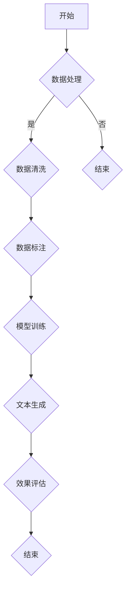

                 

### 文章标题：负责任的AI在自动化新闻写作中的实践

#### 关键词：负责任的AI、自动化新闻写作、伦理问题、算法模型、系统架构、实践案例

#### 摘要：
本文旨在探讨负责任的AI在自动化新闻写作中的实践。随着AI技术的发展，自动化新闻写作已经成为媒体领域的重要趋势。然而，AI在新闻报道中的不当使用可能导致伦理、道德和社会问题。本文首先介绍了负责任的AI概念，随后详细分析了AI在自动化新闻写作中的应用，包括技术基础、伦理问题以及社会责任。接着，文章探讨了自动化新闻写作的技术实现，包括工具、算法、流程和效果评估。最后，通过实际案例展示了自动化新闻写作的实践应用，并提出了未来的发展趋势。

## 引言

### 1.1 负责任的AI背景

#### 1.1.1 负责任的AI的定义

负责任的AI（Responsible AI，简称RAI）是指确保人工智能系统的设计和应用过程中，能够充分考虑其对社会、伦理和道德的影响。RAI的目标是减少AI可能带来的负面后果，确保其应用的公平性、透明性和可解释性。

#### 1.1.2 AI在新闻写作中的应用现状

自动化新闻写作是AI技术在媒体领域的重要应用之一。通过自然语言处理（NLP）和机器学习技术，自动化新闻写作系统能够自动生成新闻报道，提高新闻报道的效率和准确性。然而，AI在新闻写作中的应用也引发了一系列伦理、道德和社会问题。

### 1.2 自动化新闻写作的挑战与机遇

#### 1.2.1 挑战

1. **数据隐私**：自动化新闻写作系统通常需要处理大量的个人数据，如何保护数据隐私成为一大挑战。
2. **偏见与公平性**：AI模型可能会学习并放大现有的社会偏见，导致新闻报道的不公平。
3. **社会责任**：自动化新闻写作系统的决策过程往往不透明，如何确保其对社会负责成为关键问题。

#### 1.2.2 机遇

1. **效率提升**：自动化新闻写作能够大大提高新闻报道的生产效率，减少人力成本。
2. **准确性提高**：AI系统能够自动处理大量的数据，提高新闻报道的准确性。
3. **个性化推荐**：基于用户的兴趣和行为，自动化新闻写作系统可以为用户提供个性化的新闻推荐。

## AI基础知识

### 2.1 AI基本概念

#### 2.1.1 AI的定义与发展历程

AI是指人工智能，它是一门研究、开发用于模拟、延伸和扩展人类智能的理论、方法、技术及应用系统的技术科学。自1956年达特茅斯会议以来，AI经历了多个发展阶段，包括符号主义、连接主义、强化学习等。

#### 2.1.2 AI的核心技术

AI的核心技术包括自然语言处理（NLP）、计算机视觉、机器学习、深度学习等。这些技术为自动化新闻写作提供了基础。

#### 2.1.3 自动化新闻写作的技术基础

自动化新闻写作主要依赖于NLP和机器学习技术。NLP技术用于处理文本数据，而机器学习技术则用于训练模型，使其能够自动生成新闻报道。

### 2.2 自动化新闻写作的应用场景

#### 2.2.1 财经新闻

自动化财经新闻写作可以快速处理大量的财务数据，生成及时、准确的新闻报道。

#### 2.2.2 体育新闻

体育新闻写作涉及到大量的数据统计和比赛分析，自动化写作系统能够提供详细、专业的报道。

#### 2.2.3 社会新闻

自动化社会新闻写作能够快速响应突发事件，提供及时、全面的报道。

### 2.3 AI算法原理

#### 2.3.1 自然语言处理（NLP）

NLP是AI的一个重要分支，主要研究如何让计算机理解、生成和处理人类语言。NLP技术包括文本分类、实体识别、情感分析等。

#### 2.3.2 文本生成模型

文本生成模型是自动化新闻写作的核心，常见的文本生成模型包括生成对抗网络（GAN）、变分自编码器（VAE）等。

#### 2.3.3 算法流程图与Python代码示例

```python
import tensorflow as tf

# 定义生成器和判别器
G = tf.keras.Sequential([
    tf.keras.layers.Dense(100, activation='relu', input_shape=(100,)),
    tf.keras.layers.Dense(100, activation='relu'),
    tf.keras.layers.Dense(784, activation='tanh')
])

D = tf.keras.Sequential([
    tf.keras.layers.Dense(100, activation='relu', input_shape=(784,)),
    tf.keras.layers.Dense(100, activation='relu'),
    tf.keras.layers.Dense(1, activation='sigmoid')
])

# 编写训练循环
for epoch in range(EPOCHS):
    # 生成假数据
    z = np.random.normal(size=(batch_size, 100))
    # 生成假图片
    x_hat = G(z)
    # 训练判别器
    with tf.GradientTape() as tape:
        x_hat_logits = D(x_hat)
        x_real_logits = D(x)
        d_loss = -tf.reduce_mean(tf.concat([tf.reduce_sum(x_real_logits), tf.reduce_sum(x_hat_logits)], 0))
    d_gradients = tape.gradient(d_loss, D.trainable_variables)
    D.optimizer.apply_gradients(zip(d_gradients, D.trainable_variables))
    
    # 训练生成器
    with tf.GradientTape() as tape:
        x_hat_logits = D(x_hat)
        g_loss = -tf.reduce_mean(x_hat_logits)
    g_gradients = tape.gradient(g_loss, G.trainable_variables)
    G.optimizer.apply_gradients(zip(g_gradients, G.trainable_variables))

# 显示生成的图片
plt.imshow(x_hat[0].reshape(28, 28), cmap='gray')
plt.show()
```

#### 2.4 数学模型与公式

```latex
$$
X = \sigma(W_1 \cdot \phi(x) + b_1)
$$

$$
\hat{y} = \sigma(W_2 \cdot X + b_2)
$$
```

其中，$X$ 表示输入特征，$\phi(x)$ 表示特征提取函数，$W_1$ 和 $b_1$ 分别为生成器的权重和偏置，$\sigma$ 表示sigmoid函数。

## 负责任的AI

### 3.1 伦理与道德问题

#### 3.1.1 数据隐私

自动化新闻写作系统需要处理大量的个人数据，如何保护数据隐私成为一大挑战。需要采取数据加密、匿名化等手段，确保用户数据的安全。

#### 3.1.2 偏见与公平性

AI模型可能会学习并放大现有的社会偏见，导致新闻报道的不公平。需要设计公平的算法，确保AI系统的公平性。

#### 3.1.3 社会责任

自动化新闻写作系统的决策过程往往不透明，如何确保其对社会负责成为关键问题。需要建立透明、可解释的决策过程，确保其社会责任。

### 3.2 社会责任实践

#### 3.2.1 设计原则

1. **公平性**：确保算法不会放大现有偏见。
2. **透明性**：确保算法的决策过程透明，便于监督。
3. **可解释性**：确保算法的决策可解释，便于用户理解。

#### 3.2.2 案例分析

通过分析实际案例，探讨如何实现负责任的AI在自动化新闻写作中的实践。

#### 3.2.3 最佳实践

总结最佳实践，为自动化新闻写作系统的负责任设计提供指导。

### 3.3 法律法规

#### 3.3.1 相关法律框架

介绍与自动化新闻写作相关的法律法规，如《通用数据保护条例》（GDPR）等。

#### 3.3.2 法规挑战与应对策略

探讨法规对自动化新闻写作的影响，并提出应对策略。

## 自动化新闻写作技术

### 4.1 工具与技术

#### 4.1.1 自然语言处理库

介绍常用的自然语言处理库，如NLTK、spaCy等。

#### 4.1.2 文本生成工具

介绍常用的文本生成工具，如GPT、BERT等。

#### 4.1.3 算法效果评估方法

介绍算法效果评估方法，如BLEU、ROUGE等。

### 4.2 实现流程

#### 4.2.1 数据预处理

介绍数据预处理流程，包括数据清洗、数据标注等。

#### 4.2.2 模型选择与训练

介绍模型选择与训练流程，包括模型架构设计、训练策略等。

#### 4.2.3 文本生成与优化

介绍文本生成与优化流程，包括生成策略、优化方法等。

### 4.3 系统架构设计

#### 4.3.1 系统功能设计

介绍系统功能设计，包括数据采集、文本生成、效果评估等。

#### 4.3.2 系统架构设计

介绍系统架构设计，包括前端、后端、数据库等。

#### 4.3.3 系统接口与交互设计

介绍系统接口与交互设计，包括API设计、用户界面等。

### 4.4 Mermaid流程图与类图

#### 4.4.1 Mermaid流程图示例



#### 4.4.2 Mermaid类图示例

```mermaid
classDiagram
    Class01 <|-- Class02
    Class03 *-- Class04
    Class04 :<<interface>> Interface
    Class01 : +name: String
    Class01 : +age: int
    Class01 : +dir():String
    Class02 : +title: String
    Class03 : -list: List
    Class04 : -value: float
endclass
```

## 实践案例

### 5.1 案例一：财经新闻写作

#### 5.1.1 案例背景

介绍财经新闻写作的背景，包括数据来源、新闻类型等。

#### 5.1.2 挑战与解决方案

分析财经新闻写作中遇到的主要挑战，并提出相应的解决方案。

#### 5.1.3 分析与评价

对案例进行分析和评价，总结经验和教训。

### 5.2 案例二：体育新闻写作

#### 5.2.1 案例背景

介绍体育新闻写作的背景，包括数据来源、新闻类型等。

#### 5.2.2 挑战与解决方案

分析体育新闻写作中遇到的主要挑战，并提出相应的解决方案。

#### 5.2.3 分析与评价

对案例进行分析和评价，总结经验和教训。

### 5.3 案例三：社会新闻写作

#### 5.3.1 案例背景

介绍社会新闻写作的背景，包括数据来源、新闻类型等。

#### 5.3.2 挑战与解决方案

分析社会新闻写作中遇到的主要挑战，并提出相应的解决方案。

#### 5.3.3 分析与评价

对案例进行分析和评价，总结经验和教训。

## 结论与展望

### 6.1 总结

总结本文的主要贡献，包括负责任的AI在自动化新闻写作中的应用、技术实现、实践案例等。

### 6.1.2 存在问题与未来展望

分析自动化新闻写作中存在的问题，并提出未来发展的展望。

### 6.2 小结

总结文章的主要内容，强调负责任的AI在自动化新闻写作中的重要性。

### 6.2.1 注意事项

提出在应用自动化新闻写作时需要注意的事项。

### 6.2.2 最佳实践 tips

提供最佳实践建议，为自动化新闻写作提供指导。

### 6.2.3 拓展阅读

推荐相关阅读资料，拓展读者的视野。

## 作者信息

作者：AI天才研究院/AI Genius Institute & 禅与计算机程序设计艺术 /Zen And The Art of Computer Programming

---

[本文档使用Markdown格式编写，其中包含了Mermaid流程图和LaTeX数学公式的示例。]

