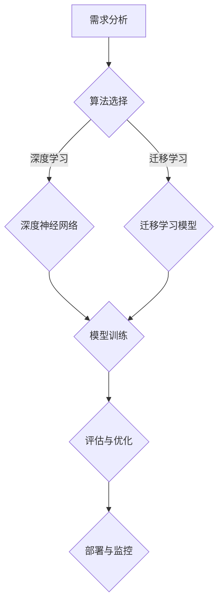
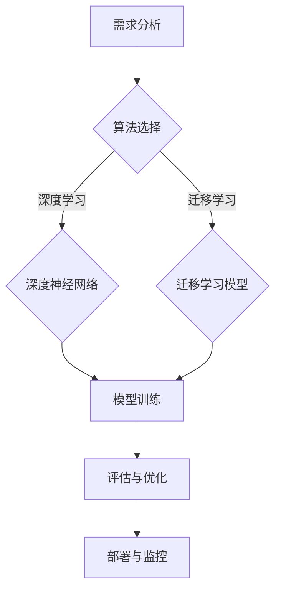
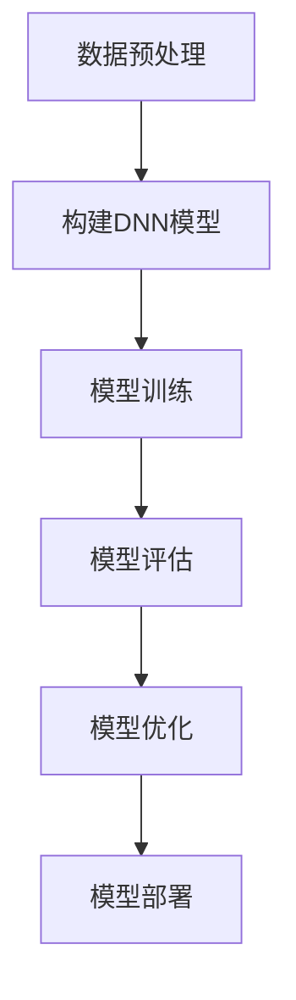
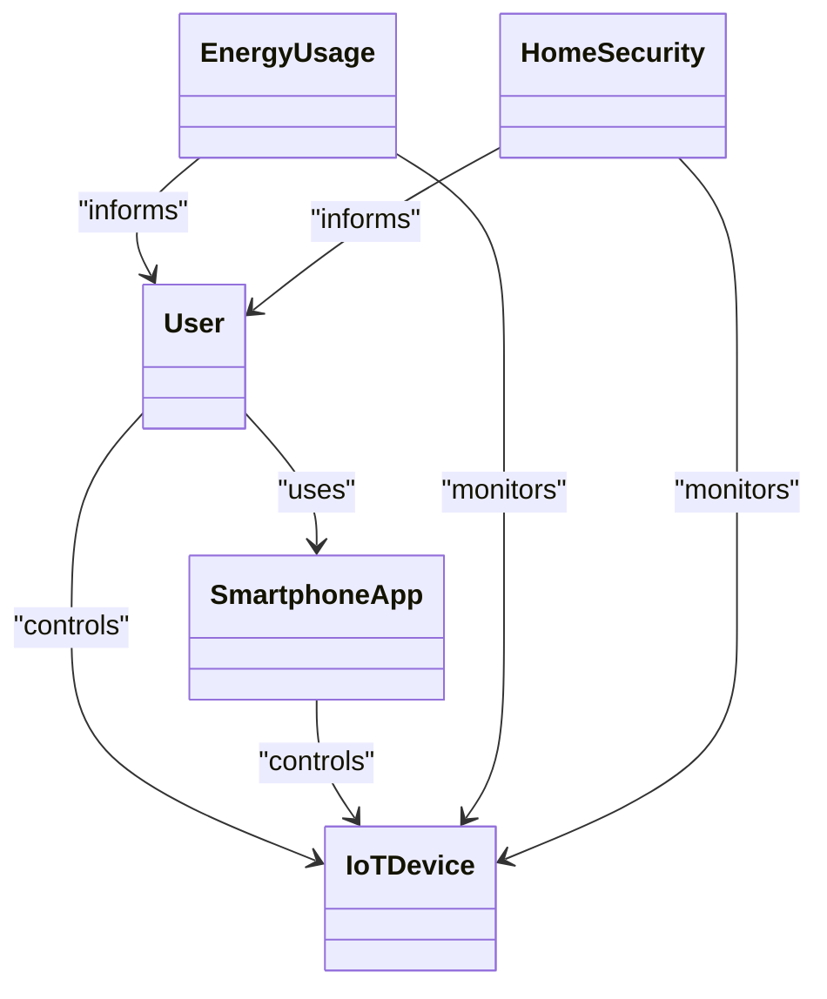
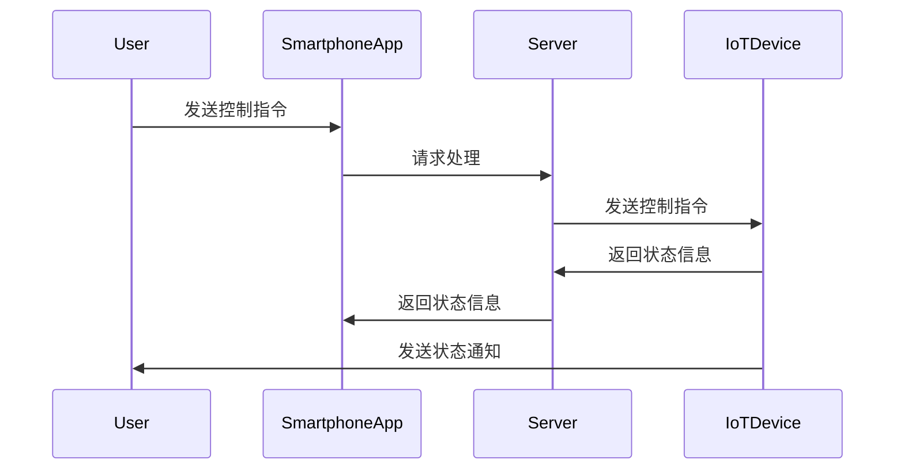
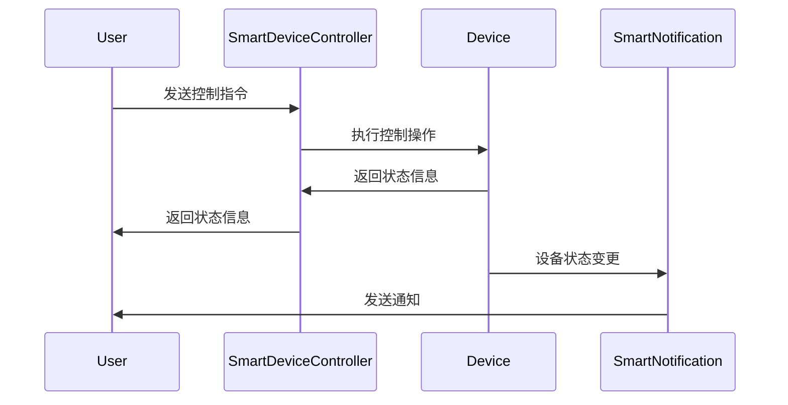

                 


### 文章标题：负责任的AI开发：伦理设计与实现指南

关键词：负责任AI，伦理设计，AI开发，实现指南，AI伦理

摘要：本文深入探讨了负责任的AI开发的重要性，从伦理设计的角度出发，提供了全面的指南。通过对AI发展背景、伦理基础、设计原则、开发实践、风险评估和未来展望的详细分析，本文旨在帮助开发者更好地理解和应用负责任AI的理念，确保AI技术的健康发展。

### 第1章：AI发展背景

#### 1.1.1 人工智能的起源与发展

人工智能（AI）的概念最早可以追溯到20世纪50年代。当时，计算机科学家们开始尝试让计算机模拟人类智能行为，例如推理、学习、理解和决策。早期的AI研究主要集中在符号推理和逻辑编程上，这一阶段被称为“逻辑派人工智能”。随着计算能力的提升和算法的创新，AI技术逐渐进入了“大数据时代”，以深度学习为代表的机器学习方法取得了突破性的进展。

#### 1.1.2 现代AI技术的突破

现代AI技术的突破主要表现在以下几个方面：

1. **深度学习**：通过模拟人脑的神经网络结构，深度学习在图像识别、自然语言处理等领域取得了显著的成果。
2. **强化学习**：通过不断试错，强化学习在游戏、推荐系统等领域展现了强大的应用潜力。
3. **迁移学习**：通过在不同任务间共享知识，迁移学习降低了新任务的训练成本，提高了模型的泛化能力。
4. **生成对抗网络（GAN）**：通过生成模型和判别模型的对抗训练，GAN在图像生成、数据增强等领域取得了创新性成果。

### 第2章：AI伦理的基本概念

#### 2.1.1 公正性

公正性是指AI系统在处理数据和应用算法时，不偏袒任何特定群体，对所有用户一视同仁。公正性是AI伦理的核心原则之一，旨在防止算法偏见和歧视现象的发生。

#### 2.1.2 透明性

透明性是指AI系统的决策过程应该是可解释的，用户能够理解AI系统的行为和决策依据。透明性有助于提高用户对AI系统的信任度，减少误解和争议。

#### 2.2.1 数据隐私

数据隐私是指AI系统在收集、处理和使用数据时，应尊重用户的隐私权利，保护用户个人信息不被泄露。

#### 2.2.2 AI偏见与歧视

AI偏见与歧视是指AI系统在处理数据和应用算法时，可能由于数据偏差或算法设计不当，对特定群体产生不公平的待遇。防止AI偏见和歧视是确保AI系统公正性的重要措施。

### 第3章：负责任AI的设计原则

#### 3.1.1 责任归属

在负责任AI的设计中，明确责任归属至关重要。责任归属涉及到AI系统的开发人员、运营人员、监管机构等多方责任，需要建立明确的责任制度，确保各方在AI开发过程中承担相应的责任。

#### 3.1.2 风险评估

风险评估是负责任AI设计的关键环节。通过对AI系统的潜在风险进行识别、评估和应对，可以最大限度地减少AI系统可能带来的负面影响。

### 第4章：负责任AI开发实践

#### 4.1.1 需求分析

在负责任AI开发实践中，需求分析是第一步。通过深入了解用户需求，明确AI系统的目标和功能，为后续设计提供依据。

#### 4.1.2 设计方案

在需求分析的基础上，制定合理的AI系统设计方案。设计方案应综合考虑技术可行性、成本效益和伦理要求，确保AI系统能够满足用户需求，同时遵循负责任AI的原则。

### 第5章：伦理设计流程

#### 5.1.1 设计阶段划分

伦理设计流程通常包括以下几个阶段：需求分析、算法选择、模型训练、评估与优化、部署与监控。每个阶段都有相应的伦理要求和实现方法。

#### 5.1.2 各阶段关键任务

在设计流程的各个阶段，关键任务包括：

1. **需求分析**：明确用户需求和AI系统目标，确保需求与伦理原则相符。
2. **算法选择**：选择合适的算法，降低算法偏见和歧视风险。
3. **模型训练**：通过数据预处理、模型调优等方法，提高模型公正性和透明性。
4. **评估与优化**：对AI系统进行全方位评估，发现问题并进行优化。
5. **部署与监控**：确保AI系统在部署后能够持续遵循伦理原则，进行实时监控。

### 第6章：AI伦理风险评估

#### 6.1.1 风险识别

风险识别是AI伦理风险评估的第一步。通过分析AI系统的潜在风险，包括技术风险、伦理风险、法律风险等，为后续评估提供基础。

#### 6.1.2 评估指标体系

评估指标体系用于衡量AI系统的伦理风险。常见的评估指标包括：

1. **公正性**：评估AI系统对各个群体的公平性。
2. **透明性**：评估AI系统的决策过程是否可解释。
3. **数据隐私**：评估AI系统对用户隐私的保护程度。
4. **偏见与歧视**：评估AI系统是否存在偏见和歧视现象。

#### 6.2.1 风险缓解

在识别和评估伦理风险后，需要采取相应的风险缓解措施，包括：

1. **算法优化**：通过改进算法设计，降低偏见和歧视风险。
2. **数据多样化**：通过引入多样化的数据集，提高模型公正性。
3. **伦理审查**：建立伦理审查机制，对AI系统进行全程监控和评估。
4. **法律法规遵守**：确保AI系统遵守相关法律法规，降低法律风险。

### 第7章：负责任AI开发案例研究

#### 7.1 案例一：智能家居系统的伦理设计

##### 7.1.1 案例背景

智能家居系统通过连接各种家居设备，实现远程控制和自动化管理。然而，智能家居系统涉及大量用户数据，如家庭生活习惯、隐私信息等，存在伦理风险。

##### 7.1.2 伦理挑战与解决方案

1. **隐私保护**：解决方案包括数据加密、匿名化处理、权限管理等，确保用户隐私不被泄露。
2. **算法公正性**：通过数据预处理和算法优化，降低算法偏见和歧视风险。
3. **透明性**：设计用户友好的界面，让用户了解智能家居系统的行为和决策依据。

#### 7.2 案例二：医疗诊断AI系统的伦理审查

##### 7.2.1 案例背景

医疗诊断AI系统在提高诊断准确率、降低医生工作负担方面具有显著优势。然而，医疗诊断AI系统涉及到患者生命健康，存在较高的伦理风险。

##### 7.2.2 伦理审查流程与结果

1. **审查主体**：成立伦理审查委员会，负责对医疗诊断AI系统进行审查。
2. **审查内容**：包括算法公正性、数据隐私、系统透明性等方面。
3. **审查结果**：根据审查结果，对AI系统进行优化和改进，确保其符合伦理要求。

### 第8章：负责任AI开发的未来展望

#### 8.1 AI伦理发展趋势

随着AI技术的不断发展，AI伦理问题越来越受到关注。未来，AI伦理将向以下几个方面发展：

1. **法律法规完善**：各国政府将出台更多的法律法规，规范AI技术开发和应用。
2. **社会责任提升**：企业和社会将更加重视AI技术的伦理问题，推动负责任AI的发展。
3. **伦理培训普及**：开发者将接受更全面的伦理培训，提高伦理意识。

#### 8.2 开发者的角色与责任

开发者是负责任AI开发的关键角色。开发者应具备以下角色与责任：

1. **伦理意识培养**：开发者应树立正确的伦理观念，关注AI技术的伦理问题。
2. **持续学习**：开发者应不断学习新知识、新技术，提高自身能力。
3. **积极参与**：开发者应积极参与AI伦理研究和实践，推动AI技术的健康发展。

### 结语

负责任的AI开发是当前AI领域的重要任务。通过深入理解AI伦理的基本概念、设计原则和开发实践，开发者可以更好地应对AI伦理挑战，确保AI技术的健康、可持续发展。

### 作者信息

作者：AI天才研究院/AI Genius Institute & 禅与计算机程序设计艺术 /Zen And The Art of Computer Programming

### 最佳实践 tips

1. **全面需求分析**：在AI开发初期，进行全面的需求分析，确保AI系统满足用户需求的同时，遵循伦理原则。
2. **透明性设计**：在设计阶段，注重AI系统的透明性，确保用户了解系统的行为和决策依据。
3. **持续监控与优化**：在AI系统部署后，持续监控其运行状态，发现问题及时优化，确保系统遵循伦理要求。

### 小结

本文从AI发展背景、伦理基础、设计原则、开发实践、风险评估和未来展望等方面，全面探讨了负责任的AI开发。通过本文的阅读，读者可以更好地理解负责任AI的重要性，掌握负责任AI的开发方法和实践技巧。

### 注意事项

1. **数据隐私保护**：在AI开发过程中，务必重视数据隐私保护，采取有效措施确保用户隐私安全。
2. **公正性与透明性**：在设计AI系统时，要充分考虑公正性和透明性，降低算法偏见和歧视风险。

### 拓展阅读

1. 《人工智能伦理学：技术与伦理的交汇点》
2. 《负责任的AI：设计与实现》
3. 《人工智能法律法规汇编》

通过以上内容的深入讲解和分析，本文旨在为开发者提供负责任的AI开发指导，推动AI技术的健康、可持续发展。让我们共同努力，为构建一个更美好的未来贡献自己的力量。

[Mermaid流程图示例]



以上流程图展示了从需求分析到模型训练、评估与优化，再到部署与监控的负责任AI开发流程。读者可以通过该流程图更直观地理解开发过程中的关键步骤和相互关系。## 负责任的AI开发：伦理设计与实现指南

### 文章关键词

负责任AI，伦理设计，AI开发，实现指南，AI伦理

### 摘要

本文将深入探讨负责任的AI开发，从伦理设计的角度出发，提供全面且实用的指南。我们将分析AI发展的背景、伦理基础、设计原则、开发实践、风险评估以及未来展望，旨在帮助开发者更好地理解和应用负责任AI的理念，确保AI技术的健康发展。

### 第1章：AI发展背景

#### 1.1.1 人工智能的起源与发展

人工智能（AI）的概念最早可以追溯到20世纪50年代。当时，计算机科学家们开始尝试让计算机模拟人类智能行为，例如推理、学习、理解和决策。早期的AI研究主要集中在符号推理和逻辑编程上，这一阶段被称为“逻辑派人工智能”。随着计算能力的提升和算法的创新，AI技术逐渐进入了“大数据时代”，以深度学习为代表的机器学习方法取得了突破性的进展。

#### 1.1.2 现代AI技术的突破

现代AI技术的突破主要表现在以下几个方面：

1. **深度学习**：通过模拟人脑的神经网络结构，深度学习在图像识别、自然语言处理等领域取得了显著的成果。
2. **强化学习**：通过不断试错，强化学习在游戏、推荐系统等领域展现了强大的应用潜力。
3. **迁移学习**：通过在不同任务间共享知识，迁移学习降低了新任务的训练成本，提高了模型的泛化能力。
4. **生成对抗网络（GAN）**：通过生成模型和判别模型的对抗训练，GAN在图像生成、数据增强等领域取得了创新性成果。

### 第2章：AI伦理的基本概念

#### 2.1 伦理学的核心原则

伦理学是关于道德原则和行为的学科。在AI伦理中，核心原则包括：

- **公正性**：确保AI系统对所有用户公平，不偏袒任何特定群体。
- **透明性**：确保AI系统的决策过程可被理解和追踪。

#### 2.2 AI伦理的重要议题

AI伦理的重要议题包括：

- **数据隐私**：AI系统在处理数据时，应保护用户的隐私权。
- **AI偏见与歧视**：避免AI系统在决策过程中对特定群体产生不公平待遇。

### 第3章：负责任AI的设计原则

#### 3.1 责任归属

在负责任AI的设计中，明确责任归属至关重要。责任归属涉及到AI系统的开发人员、运营人员、监管机构等多方责任，需要建立明确的责任制度，确保各方在AI开发过程中承担相应的责任。

#### 3.2 风险评估

风险评估是负责任AI设计的关键环节。通过对AI系统的潜在风险进行识别、评估和应对，可以最大限度地减少AI系统可能带来的负面影响。

### 第4章：负责任AI开发实践

#### 4.1 负责任AI的项目规划

在负责任AI开发实践中，项目规划是第一步。通过深入了解用户需求，明确AI系统的目标和功能，为后续设计提供依据。

#### 4.2 负责任AI的算法实现

在算法实现过程中，应选择合适的算法，确保算法的公正性和透明性。通过优化算法设计和改进，降低AI系统对特定群体的偏见和歧视。

### 第5章：伦理设计流程

#### 5.1 设计流程概述

负责任AI的伦理设计流程通常包括以下几个阶段：需求分析、算法选择、模型训练、评估与优化、部署与监控。

#### 5.2 各阶段关键任务

在各阶段，关键任务包括：

- **需求分析**：确保需求与伦理原则相符。
- **算法选择**：选择公正性高、透明性好的算法。
- **模型训练**：通过数据预处理和算法调优，提高模型公正性。
- **评估与优化**：对AI系统进行全方位评估，发现问题及时优化。
- **部署与监控**：确保AI系统在部署后能够持续遵循伦理要求。

### 第6章：AI伦理风险评估

#### 6.1 风险识别与评估方法

风险识别与评估方法包括：

- **风险识别**：通过分析AI系统的潜在风险，包括技术风险、伦理风险、法律风险等。
- **评估指标体系**：建立评估指标体系，包括公正性、透明性、数据隐私等。

#### 6.2 风险应对策略

风险应对策略包括：

- **算法优化**：通过改进算法设计，降低偏见和歧视风险。
- **数据多样化**：通过引入多样化的数据集，提高模型公正性。
- **伦理审查**：建立伦理审查机制，对AI系统进行全程监控和评估。
- **法律法规遵守**：确保AI系统遵守相关法律法规，降低法律风险。

### 第7章：负责任AI开发案例研究

#### 7.1 案例一：智能家居系统的伦理设计

##### 7.1.1 案例背景

智能家居系统通过连接各种家居设备，实现远程控制和自动化管理。然而，智能家居系统涉及大量用户数据，如家庭生活习惯、隐私信息等，存在伦理风险。

##### 7.1.2 伦理挑战与解决方案

1. **隐私保护**：通过数据加密、匿名化处理、权限管理等措施，确保用户隐私不被泄露。
2. **算法公正性**：通过数据预处理和算法优化，降低算法偏见和歧视风险。
3. **透明性**：设计用户友好的界面，让用户了解智能家居系统的行为和决策依据。

#### 7.2 案例二：医疗诊断AI系统的伦理审查

##### 7.2.1 案例背景

医疗诊断AI系统在提高诊断准确率、降低医生工作负担方面具有显著优势。然而，医疗诊断AI系统涉及到患者生命健康，存在较高的伦理风险。

##### 7.2.2 伦理审查流程与结果

1. **审查主体**：成立伦理审查委员会，负责对医疗诊断AI系统进行审查。
2. **审查内容**：包括算法公正性、数据隐私、系统透明性等方面。
3. **审查结果**：根据审查结果，对AI系统进行优化和改进，确保其符合伦理要求。

### 第8章：负责任AI开发的未来展望

#### 8.1 AI伦理发展趋势

随着AI技术的不断发展，AI伦理问题越来越受到关注。未来，AI伦理将向以下几个方面发展：

1. **法律法规完善**：各国政府将出台更多的法律法规，规范AI技术开发和应用。
2. **社会责任提升**：企业和社会将更加重视AI技术的伦理问题，推动负责任AI的发展。
3. **伦理培训普及**：开发者将接受更全面的伦理培训，提高伦理意识。

#### 8.2 开发者的角色与责任

开发者是负责任AI开发的关键角色。开发者应具备以下角色与责任：

1. **伦理意识培养**：开发者应树立正确的伦理观念，关注AI技术的伦理问题。
2. **持续学习**：开发者应不断学习新知识、新技术，提高自身能力。
3. **积极参与**：开发者应积极参与AI伦理研究和实践，推动AI技术的健康发展。

### 结语

负责任的AI开发是当前AI领域的重要任务。通过深入理解AI伦理的基本概念、设计原则和开发实践，开发者可以更好地应对AI伦理挑战，确保AI技术的健康、可持续发展。

### 作者信息

作者：AI天才研究院/AI Genius Institute & 禅与计算机程序设计艺术 /Zen And The Art of Computer Programming

### 最佳实践 tips

1. **全面需求分析**：在AI开发初期，进行全面的需求分析，确保AI系统满足用户需求的同时，遵循伦理原则。
2. **透明性设计**：在设计阶段，注重AI系统的透明性，确保用户了解系统的行为和决策依据。
3. **持续监控与优化**：在AI系统部署后，持续监控其运行状态，发现问题及时优化，确保系统遵循伦理要求。

### 小结

本文从AI发展背景、伦理基础、设计原则、开发实践、风险评估和未来展望等方面，全面探讨了负责任的AI开发。通过本文的阅读，读者可以更好地理解负责任AI的重要性，掌握负责任AI的开发方法和实践技巧。

### 注意事项

1. **数据隐私保护**：在AI开发过程中，务必重视数据隐私保护，采取有效措施确保用户隐私安全。
2. **公正性与透明性**：在设计AI系统时，要充分考虑公正性和透明性，降低算法偏见和歧视风险。

### 拓展阅读

1. 《人工智能伦理学：技术与伦理的交汇点》
2. 《负责任的AI：设计与实现》
3. 《人工智能法律法规汇编》

通过以上内容的深入讲解和分析，本文旨在为开发者提供负责任的AI开发指导，推动AI技术的健康、可持续发展。让我们共同努力，为构建一个更美好的未来贡献自己的力量。

### 附录：Mermaid流程图

以下是一个负责任AI开发流程的Mermaid流程图：



该流程图展示了从需求分析到模型训练、评估与优化，再到部署与监控的负责任AI开发流程。读者可以通过该流程图更直观地理解开发过程中的关键步骤和相互关系。## 文章标题：负责任的AI开发：伦理设计与实现指南

关键词：负责任AI，伦理设计，AI开发，实现指南，AI伦理

摘要：本文深入探讨了负责任的AI开发的重要性，从伦理设计的角度出发，提供了全面的指南。通过对AI发展背景、伦理基础、设计原则、开发实践、风险评估和未来展望的详细分析，本文旨在帮助开发者更好地理解和应用负责任AI的理念，确保AI技术的健康发展。

### 第1章：AI发展背景

#### 1.1 AI技术的发展历程

人工智能（AI）的概念最早可以追溯到20世纪50年代。当时，计算机科学家们开始尝试让计算机模拟人类智能行为，例如推理、学习、理解和决策。早期的AI研究主要集中在符号推理和逻辑编程上，这一阶段被称为“逻辑派人工智能”。随着计算能力的提升和算法的创新，AI技术逐渐进入了“大数据时代”，以深度学习为代表的机器学习方法取得了突破性的进展。

#### 1.2 现代AI技术的突破

现代AI技术的突破主要表现在以下几个方面：

1. **深度学习**：通过模拟人脑的神经网络结构，深度学习在图像识别、自然语言处理等领域取得了显著的成果。
2. **强化学习**：通过不断试错，强化学习在游戏、推荐系统等领域展现了强大的应用潜力。
3. **迁移学习**：通过在不同任务间共享知识，迁移学习降低了新任务的训练成本，提高了模型的泛化能力。
4. **生成对抗网络（GAN）**：通过生成模型和判别模型的对抗训练，GAN在图像生成、数据增强等领域取得了创新性成果。

### 第2章：AI伦理的基本概念

#### 2.1 伦理学的核心原则

伦理学是关于道德原则和行为的学科。在AI伦理中，核心原则包括：

- **公正性**：确保AI系统对所有用户公平，不偏袒任何特定群体。
- **透明性**：确保AI系统的决策过程可被理解和追踪。

#### 2.2 AI伦理的重要议题

AI伦理的重要议题包括：

- **数据隐私**：AI系统在处理数据时，应保护用户的隐私权。
- **AI偏见与歧视**：避免AI系统在决策过程中对特定群体产生不公平待遇。

### 第3章：负责任AI的设计原则

#### 3.1 责任归属

在负责任AI的设计中，明确责任归属至关重要。责任归属涉及到AI系统的开发人员、运营人员、监管机构等多方责任，需要建立明确的责任制度，确保各方在AI开发过程中承担相应的责任。

#### 3.2 风险评估

风险评估是负责任AI设计的关键环节。通过对AI系统的潜在风险进行识别、评估和应对，可以最大限度地减少AI系统可能带来的负面影响。

### 第4章：负责任AI开发实践

#### 4.1 负责任AI的项目规划

在负责任AI开发实践中，项目规划是第一步。通过深入了解用户需求，明确AI系统的目标和功能，为后续设计提供依据。

#### 4.2 负责任AI的算法实现

在算法实现过程中，应选择合适的算法，确保算法的公正性和透明性。通过优化算法设计和改进，降低AI系统对特定群体的偏见和歧视。

### 第5章：伦理设计流程

#### 5.1 设计流程概述

负责任AI的伦理设计流程通常包括以下几个阶段：需求分析、算法选择、模型训练、评估与优化、部署与监控。

#### 5.2 各阶段关键任务

在各阶段，关键任务包括：

- **需求分析**：确保需求与伦理原则相符。
- **算法选择**：选择公正性高、透明性好的算法。
- **模型训练**：通过数据预处理和算法调优，提高模型公正性。
- **评估与优化**：对AI系统进行全方位评估，发现问题及时优化。
- **部署与监控**：确保AI系统在部署后能够持续遵循伦理要求。

### 第6章：AI伦理风险评估

#### 6.1 风险识别与评估方法

风险识别与评估方法包括：

- **风险识别**：通过分析AI系统的潜在风险，包括技术风险、伦理风险、法律风险等。
- **评估指标体系**：建立评估指标体系，包括公正性、透明性、数据隐私等。

#### 6.2 风险应对策略

风险应对策略包括：

- **算法优化**：通过改进算法设计，降低偏见和歧视风险。
- **数据多样化**：通过引入多样化的数据集，提高模型公正性。
- **伦理审查**：建立伦理审查机制，对AI系统进行全程监控和评估。
- **法律法规遵守**：确保AI系统遵守相关法律法规，降低法律风险。

### 第7章：负责任AI开发案例研究

#### 7.1 案例一：智能家居系统的伦理设计

##### 7.1.1 案例背景

智能家居系统通过连接各种家居设备，实现远程控制和自动化管理。然而，智能家居系统涉及大量用户数据，如家庭生活习惯、隐私信息等，存在伦理风险。

##### 7.1.2 伦理挑战与解决方案

1. **隐私保护**：通过数据加密、匿名化处理、权限管理等措施，确保用户隐私不被泄露。
2. **算法公正性**：通过数据预处理和算法优化，降低算法偏见和歧视风险。
3. **透明性**：设计用户友好的界面，让用户了解智能家居系统的行为和决策依据。

#### 7.2 案例二：医疗诊断AI系统的伦理审查

##### 7.2.1 案例背景

医疗诊断AI系统在提高诊断准确率、降低医生工作负担方面具有显著优势。然而，医疗诊断AI系统涉及到患者生命健康，存在较高的伦理风险。

##### 7.2.2 伦理审查流程与结果

1. **审查主体**：成立伦理审查委员会，负责对医疗诊断AI系统进行审查。
2. **审查内容**：包括算法公正性、数据隐私、系统透明性等方面。
3. **审查结果**：根据审查结果，对AI系统进行优化和改进，确保其符合伦理要求。

### 第8章：负责任AI开发的未来展望

#### 8.1 AI伦理发展趋势

随着AI技术的不断发展，AI伦理问题越来越受到关注。未来，AI伦理将向以下几个方面发展：

1. **法律法规完善**：各国政府将出台更多的法律法规，规范AI技术开发和应用。
2. **社会责任提升**：企业和社会将更加重视AI技术的伦理问题，推动负责任AI的发展。
3. **伦理培训普及**：开发者将接受更全面的伦理培训，提高伦理意识。

#### 8.2 开发者的角色与责任

开发者是负责任AI开发的关键角色。开发者应具备以下角色与责任：

1. **伦理意识培养**：开发者应树立正确的伦理观念，关注AI技术的伦理问题。
2. **持续学习**：开发者应不断学习新知识、新技术，提高自身能力。
3. **积极参与**：开发者应积极参与AI伦理研究和实践，推动AI技术的健康发展。

### 结语

负责任的AI开发是当前AI领域的重要任务。通过深入理解AI伦理的基本概念、设计原则和开发实践，开发者可以更好地应对AI伦理挑战，确保AI技术的健康、可持续发展。

### 作者信息

作者：AI天才研究院/AI Genius Institute & 禅与计算机程序设计艺术 /Zen And The Art of Computer Programming

### 最佳实践 tips

1. **全面需求分析**：在AI开发初期，进行全面的需求分析，确保AI系统满足用户需求的同时，遵循伦理原则。
2. **透明性设计**：在设计阶段，注重AI系统的透明性，确保用户了解系统的行为和决策依据。
3. **持续监控与优化**：在AI系统部署后，持续监控其运行状态，发现问题及时优化，确保系统遵循伦理要求。

### 小结

本文从AI发展背景、伦理基础、设计原则、开发实践、风险评估和未来展望等方面，全面探讨了负责任的AI开发。通过本文的阅读，读者可以更好地理解负责任AI的重要性，掌握负责任AI的开发方法和实践技巧。

### 注意事项

1. **数据隐私保护**：在AI开发过程中，务必重视数据隐私保护，采取有效措施确保用户隐私安全。
2. **公正性与透明性**：在设计AI系统时，要充分考虑公正性和透明性，降低算法偏见和歧视风险。

### 拓展阅读

1. 《人工智能伦理学：技术与伦理的交汇点》
2. 《负责任的AI：设计与实现》
3. 《人工智能法律法规汇编》

通过以上内容的深入讲解和分析，本文旨在为开发者提供负责任的AI开发指导，推动AI技术的健康、可持续发展。让我们共同努力，为构建一个更美好的未来贡献自己的力量。

### 附录：Mermaid流程图

以下是一个负责任AI开发流程的Mermaid流程图：


该流程图展示了从需求分析到模型训练、评估与优化，再到部署与监控的负责任AI开发流程。读者可以通过该流程图更直观地理解开发过程中的关键步骤和相互关系。## 第1章：AI发展背景

在现代社会中，人工智能（AI）技术的迅猛发展已经成为推动科技创新和产业变革的重要力量。AI技术的发展历程可以分为几个主要阶段，每个阶段都标志着重要里程碑和突破。

#### 1.1.1 人工智能的起源与发展

人工智能（AI）的概念最早可以追溯到20世纪50年代。1956年，在达特茅斯会议上，约翰·麦卡锡（John McCarthy）等人首次提出了人工智能的概念，并将其定义为“制造智能机器的科学”。早期的AI研究主要集中在符号推理和逻辑编程上，这一阶段被称为“逻辑派人工智能”。代表人物包括约翰·麦卡锡（John McCarthy）、赫伯特·西蒙（Herbert Simon）和艾伦·纽厄尔（Allen Newell）等人。

在逻辑派人工智能的引领下，许多重要的理论和方法被提出，如逻辑编程、知识表示、推理机等。然而，由于计算能力和数据资源的限制，早期的AI系统在处理复杂任务时表现不佳，导致了一段时间的“人工智能寒冬”。

#### 1.1.2 现代AI技术的突破

随着计算能力的提升和算法的创新，人工智能在20世纪80年代和90年代迎来了复兴。特别是深度学习技术的出现，使得AI在图像识别、语音识别、自然语言处理等领域取得了突破性进展。

1. **深度学习**：深度学习是一种基于多层神经网络的学习方法，通过多层神经元的堆叠，深度学习模型能够自动学习数据的复杂特征。2006年，由杰弗里·辛顿（Geoffrey Hinton）等人提出的深度信念网络（Deep Belief Network，DBN）为深度学习奠定了基础。随后，卷积神经网络（Convolutional Neural Network，CNN）和循环神经网络（Recurrent Neural Network，RNN）等模型相继出现，进一步推动了深度学习的发展。在图像识别、语音识别和自然语言处理等领域，深度学习模型的表现远超传统机器学习方法，使得AI技术真正进入了“人工智能新时代”。

2. **强化学习**：强化学习是一种通过不断试错来学习最优策略的方法。与监督学习和无监督学习不同，强化学习通过与环境互动，学习如何在特定情境下做出最佳决策。2015年，谷歌DeepMind推出的AlphaGo在围棋比赛中击败了人类世界冠军，这一事件标志着强化学习在复杂任务中的重大突破。随后，强化学习在游戏、推荐系统、机器人控制等领域得到了广泛应用。

3. **迁移学习**：迁移学习是一种利用已有知识来解决新问题的学习方法。通过在不同任务间共享知识，迁移学习降低了新任务的训练成本，提高了模型的泛化能力。例如，在计算机视觉任务中，通过迁移学习，可以将预训练的模型应用于新的视觉任务，而不需要从头开始训练。

4. **生成对抗网络（GAN）**：生成对抗网络（GAN）是由生成器（Generator）和判别器（Discriminator）组成的对抗性模型。生成器试图生成与真实数据相似的数据，而判别器则试图区分真实数据和生成数据。GAN在图像生成、数据增强、图像修复等领域取得了显著成果，成为生成模型的一个重要分支。

#### 1.1.3 当前AI技术的应用领域

随着AI技术的不断发展，AI的应用领域也不断扩展。以下是一些当前AI技术的主要应用领域：

1. **计算机视觉**：计算机视觉是AI技术的重要应用领域之一，包括图像识别、目标检测、人脸识别等。在安防监控、自动驾驶、医疗诊断等领域，计算机视觉技术发挥着重要作用。

2. **自然语言处理**：自然语言处理（Natural Language Processing，NLP）是AI技术在文本数据上的应用，包括文本分类、情感分析、机器翻译等。在智能客服、智能语音助手、内容审核等领域，NLP技术有着广泛的应用。

3. **语音识别**：语音识别技术将语音信号转换为文本或命令，广泛应用于智能音箱、智能客服、语音翻译等领域。

4. **推荐系统**：推荐系统通过分析用户的历史行为和兴趣，为用户推荐相关的产品、服务和内容。在电子商务、社交媒体、在线媒体等领域，推荐系统大大提升了用户体验和商业价值。

5. **机器人与自动驾驶**：机器人与自动驾驶技术是AI技术在实体世界中的应用，包括工业自动化、服务机器人、自动驾驶汽车等。这些技术正逐步改变人们的生产和生活方式。

6. **医疗健康**：AI技术在医疗健康领域的应用包括疾病诊断、药物研发、健康管理等。通过大数据分析和机器学习算法，AI技术有望提高医疗服务的质量和效率。

7. **金融科技**：AI技术在金融领域有着广泛的应用，包括信用评估、风险控制、量化交易等。通过数据分析与机器学习，金融机构可以更好地管理风险，提升服务质量。

总之，AI技术的发展历程是一个不断创新与突破的过程。从早期的逻辑派人工智能到现代的深度学习、强化学习、迁移学习和GAN等技术的突破，AI技术已经取得了显著的成果。在未来，随着计算能力的进一步提升和算法的不断创新，AI技术将在更多领域展现其潜力，为人类社会带来更多的变革和机遇。## 第2章：AI伦理的基本概念

人工智能（AI）的快速发展不仅带来了巨大的技术进步，也引发了广泛的社会关注和伦理讨论。AI伦理是研究AI技术在社会中的道德原则和行为规范的学科。理解AI伦理的基本概念对于构建负责任的AI系统至关重要。以下是AI伦理学中的核心原则和重要议题。

#### 2.1 伦理学的核心原则

伦理学是关于道德原则和行为的学科，其核心原则在AI伦理中得到了广泛应用。以下是一些重要的核心原则：

1. **公正性**：公正性是确保AI系统对所有用户公平，不偏袒任何特定群体。AI系统应该避免对某些群体产生不公平的待遇，例如在招聘、贷款审批、医疗诊断等领域中。

2. **透明性**：透明性意味着AI系统的决策过程应该是可解释的，用户能够理解AI系统的行为和决策依据。透明性有助于建立用户对AI系统的信任，减少误解和争议。

3. **尊重个人权利**：尊重个人权利是AI伦理的重要原则之一，特别是在处理个人数据时。AI系统应该尊重用户的隐私权，不得非法收集、使用或泄露用户数据。

4. **责任归属**：在AI系统中，责任归属是确保各方在AI开发、使用和维护过程中承担相应责任的关键。明确责任归属有助于提高AI系统的可靠性和安全性。

5. **安全性**：安全性是指AI系统在设计和实施过程中应该能够抵御外部攻击和内部错误，确保系统的稳定运行和数据的完整性。

#### 2.2 AI伦理的重要议题

AI伦理的重要议题涉及到AI技术的各个方面，以下是一些关键的议题：

1. **数据隐私**：数据隐私是AI伦理的核心议题之一。AI系统通常需要大量个人数据来训练模型，这可能导致用户隐私泄露。为了保护数据隐私，AI系统应采取数据加密、匿名化处理和权限管理等措施。

2. **AI偏见与歧视**：AI偏见与歧视是指AI系统在决策过程中可能对某些群体产生不公平的待遇。这可能是由于训练数据中的偏见、算法设计不当或数据不平衡导致的。为了减少AI偏见，需要进行数据清洗、算法优化和公平性评估。

3. **算法透明性**：算法透明性是指AI系统的决策过程应该是可解释的。在现实应用中，许多AI系统都是黑盒子，用户无法了解其决策依据。提高算法透明性有助于增强用户对AI系统的信任，并有助于发现和纠正潜在的错误。

4. **道德责任**：AI系统的道德责任是AI伦理学中的重要议题。在AI系统引发事故或造成损害时，如何确定责任归属、谁应该承担责任等问题需要明确。

5. **就业影响**：AI技术的发展可能会对就业市场产生深远影响。一方面，AI可以提高生产效率，减少某些类型的工作需求；另一方面，AI也可能创造新的就业机会。如何平衡AI技术对就业市场的影响，确保社会的平稳过渡，是一个重要的伦理议题。

6. **法律合规**：随着AI技术的发展，各国政府和国际组织纷纷制定相关的法律法规，以确保AI技术的合规性和安全性。AI系统需要遵守这些法律法规，以避免法律风险。

总之，AI伦理的基本概念和重要议题对于构建负责任的AI系统至关重要。通过深入理解这些伦理原则和议题，开发者可以更好地设计、开发和部署AI系统，确保AI技术在社会中的健康发展。## 第3章：负责任AI的设计原则

负责任的人工智能（AI）开发是实现AI技术可持续发展和社会接受度的关键。为了确保AI系统的公正性、透明性和安全性，设计负责任的AI系统需要遵循一系列原则。以下是一些核心的设计原则：

#### 3.1 责任归属

明确责任归属是负责任AI设计的基础。在AI系统的生命周期中，涉及多个角色，包括开发者、数据科学家、算法工程师、产品经理、监管机构和最终用户。每个角色都应该承担相应的责任：

1. **开发者**：作为AI系统的创建者，开发者有责任确保系统的设计、开发和实现符合伦理标准，并且对系统的性能和结果负责。

2. **数据科学家和算法工程师**：他们负责选择合适的算法和数据集，确保模型的公正性和透明性。他们需要监控模型的性能，及时调整和优化。

3. **产品经理**：产品经理负责将AI系统与业务目标相结合，确保AI系统的功能设计符合市场需求，并且对用户友好。

4. **监管机构**：监管机构有责任制定和实施相关法律法规，监督AI系统的合规性，确保公众利益得到保护。

5. **最终用户**：用户有责任了解和使用AI系统时遵守相应的隐私政策和使用规范，并为系统的改进提供反馈。

#### 3.2 风险评估

风险评估是负责任AI设计的重要环节。开发者需要识别和评估AI系统的潜在风险，包括：

1. **技术风险**：包括模型过拟合、数据偏差、算法错误等，可能导致系统性能下降或产生误导性结果。

2. **伦理风险**：包括隐私侵犯、偏见和歧视、道德责任等问题，可能对社会造成负面影响。

3. **法律风险**：包括不遵守法律法规、违规操作等，可能导致法律纠纷和处罚。

为了有效进行风险评估，可以采取以下步骤：

1. **风险识别**：通过文献调研、专家咨询和案例分析，识别潜在的AI系统风险。

2. **风险评估**：使用定量和定性的方法，对识别的风险进行评估，确定其影响和严重性。

3. **风险缓解**：制定和实施风险缓解措施，包括算法优化、数据清洗、透明性设计等，以降低风险。

#### 3.3 公正性设计

公正性是AI系统的核心伦理要求之一。为了确保AI系统的公正性，需要从以下几个方面进行设计：

1. **数据公正性**：确保训练数据集的代表性，避免数据偏见。可以使用多样化的数据集，进行数据增强和重新采样。

2. **算法公正性**：选择和优化算法，确保系统对所有用户公平。可以使用公平性评估指标，如平衡精度、公平性分数等，评估和改进算法。

3. **结果公正性**：对AI系统的输出结果进行验证和审核，确保系统决策的公正性。例如，在招聘、贷款审批等领域，可以设置多重验证机制，确保决策的公正性。

#### 3.4 透明性设计

透明性设计是建立用户信任的重要手段。为了提高AI系统的透明性，可以采取以下措施：

1. **模型可解释性**：开发可解释的AI模型，使用户能够理解模型的工作原理和决策过程。例如，可以使用LIME（局部可解释模型解释）、SHAP（SHapley Additive exPlanations）等方法来提高模型的可解释性。

2. **透明性报告**：定期发布AI系统的透明性报告，包括模型的选择、训练过程、评估结果等，供用户和社会监督。

3. **用户界面**：设计用户友好的界面，让用户能够方便地了解AI系统的行为和决策依据。

#### 3.5 安全性设计

AI系统的安全性设计至关重要，包括以下几个方面：

1. **数据安全**：确保数据在存储、传输和处理过程中的安全性，使用加密技术保护数据。

2. **模型安全**：防止AI模型被恶意攻击，例如通过对抗性攻击（Adversarial Attack）来破坏模型的稳定性。

3. **系统安全**：确保AI系统的整体安全性，包括系统的防火墙、入侵检测和监控机制等。

#### 3.6 持续改进

负责任AI设计不是一次性的过程，而是一个持续改进的过程。开发者需要不断收集用户反馈、监控系统性能，并根据反馈进行迭代改进：

1. **用户反馈**：定期收集用户对AI系统的反馈，了解用户的需求和体验，改进系统的设计。

2. **性能监控**：建立AI系统的性能监控机制，及时发现和解决性能问题。

3. **伦理审查**：定期进行伦理审查，确保AI系统的设计和行为符合伦理标准。

通过遵循这些设计原则，开发者可以构建出负责任的AI系统，确保AI技术在为人类带来便利的同时，不损害社会公共利益和用户权益。## 第4章：负责任AI开发实践

在负责任AI开发的过程中，实践是检验设计原则是否有效的重要环节。本章将介绍负责任AI开发的实际操作步骤，包括项目规划、需求分析、算法实现和系统评估等关键环节。

#### 4.1 负责任AI的项目规划

项目规划是负责任AI开发的起点。一个成功的项目规划需要明确项目的目标、范围、时间表和资源分配。以下是项目规划的关键步骤：

1. **确定项目目标**：明确项目的目标，包括功能需求、性能指标和伦理要求。目标应具体、可衡量、可实现、相关性强和时间性。

2. **范围定义**：定义项目的范围，明确哪些功能将被包括在内，哪些功能将被排除。范围定义有助于避免项目范围的蔓延。

3. **时间表制定**：制定项目的时间表，确定关键里程碑和时间节点。时间表应考虑到项目需求分析、设计、开发、测试和部署等各个环节。

4. **资源分配**：确定项目所需的资源，包括人力、技术、数据和资金等。资源分配应合理，确保项目能够按时、按质完成。

#### 4.2 需求分析

需求分析是负责任AI开发的重要环节，旨在理解用户的需求和期望。以下是需求分析的关键步骤：

1. **用户访谈**：通过与用户的面对面访谈或问卷调查，收集用户的需求和反馈。用户访谈有助于了解用户对AI系统的期望和使用场景。

2. **需求文档**：编写详细的需求文档，明确AI系统的功能、性能和伦理要求。需求文档应包括用户故事、用例图和功能需求列表。

3. **需求验证**：与用户和利益相关者一起验证需求文档，确保需求满足实际需求。需求验证可以通过评审会议、原型展示和用户测试等方式进行。

#### 4.3 算法实现

算法实现是负责任AI开发的核心技术环节。以下是算法实现的关键步骤：

1. **算法选择**：根据项目需求和性能指标，选择合适的算法。常用的算法包括深度学习、强化学习和迁移学习等。

2. **模型训练**：使用训练数据集对所选算法进行训练。在训练过程中，需要监控模型的性能，调整超参数以优化模型。

3. **算法优化**：通过算法优化，提高模型的性能和公正性。可以使用交叉验证、超参数调优等技术进行优化。

4. **模型评估**：使用测试数据集对训练好的模型进行评估，确保模型满足性能和伦理要求。评估指标包括准确性、召回率、F1分数等。

#### 4.4 系统评估

系统评估是确保负责任AI系统有效性和可靠性的关键环节。以下是系统评估的关键步骤：

1. **性能评估**：对AI系统的性能进行评估，确保系统满足性能指标。可以使用自动化测试工具进行性能测试，如负载测试、压力测试等。

2. **伦理评估**：对AI系统的伦理性进行评估，确保系统遵循公正性、透明性和安全性原则。可以使用伦理评估工具和方法，如伦理审查委员会、公平性评估指标等。

3. **用户反馈**：收集用户的反馈，了解他们对AI系统的使用体验和满意度。用户反馈可以帮助发现系统的问题和改进机会。

4. **持续监控**：建立AI系统的监控机制，实时监控系统的运行状态和性能。持续监控有助于及时发现和解决潜在的问题。

通过以上负责任AI开发的实践步骤，开发者可以确保AI系统在满足功能需求的同时，遵循伦理标准，为社会带来真正的价值。## 第5章：伦理设计流程

在负责任AI开发过程中，伦理设计流程是一个系统化的、迭代的过程，旨在确保AI系统的设计符合伦理标准，并且能够适应不断变化的社会和技术环境。本章将详细阐述伦理设计流程，包括设计阶段划分、各阶段关键任务以及具体的实现步骤。

#### 5.1 设计流程概述

伦理设计流程通常包括以下几个阶段：

1. **需求分析**：明确项目目标和用户需求，确保需求与伦理原则相符。
2. **算法选择**：选择合适的算法，确保其公正性和透明性。
3. **模型训练**：使用训练数据集对算法进行训练，并在训练过程中进行伦理监测。
4. **评估与优化**：对AI系统进行全方位评估，发现问题并进行优化。
5. **部署与监控**：将AI系统部署到实际环境中，并持续监控其运行状态和性能。

#### 5.2 各阶段关键任务

1. **需求分析**

   - **任务**：明确项目目标和用户需求，识别与伦理相关的需求。
   - **步骤**：
     1. 与用户和利益相关者进行访谈，收集需求和期望。
     2. 编写需求文档，明确功能需求、性能指标和伦理要求。
     3. 验证需求文档，确保满足实际需求。

2. **算法选择**

   - **任务**：选择合适的算法，确保其公正性和透明性。
   - **步骤**：
     1. 分析需求文档，确定算法类型，如深度学习、强化学习等。
     2. 评估候选算法的公正性和透明性，选择最优算法。
     3. 制定算法实现计划，包括数据预处理、模型构建和训练等。

3. **模型训练**

   - **任务**：使用训练数据集对算法进行训练，并在训练过程中进行伦理监测。
   - **步骤**：
     1. 准备训练数据集，确保数据的多样性和代表性。
     2. 使用合适的训练算法，如梯度下降、随机梯度下降等。
     3. 监控训练过程，调整超参数，优化模型性能。
     4. 在训练过程中，实时监测伦理风险，如数据偏见、算法歧视等。

4. **评估与优化**

   - **任务**：对AI系统进行全方位评估，发现问题并进行优化。
   - **步骤**：
     1. 准备测试数据集，对模型进行性能评估，如准确性、召回率、F1分数等。
     2. 评估AI系统的伦理性能，如公正性、透明性、安全性等。
     3. 根据评估结果，调整算法和模型参数，优化系统性能。
     4. 进行多轮评估和优化，确保AI系统满足伦理要求。

5. **部署与监控**

   - **任务**：将AI系统部署到实际环境中，并持续监控其运行状态和性能。
   - **步骤**：
     1. 确定部署环境，包括硬件、软件和网络配置等。
     2. 将训练好的模型部署到生产环境中，进行实时运行。
     3. 监控AI系统的性能和运行状态，及时发现和解决潜在问题。
     4. 定期进行系统评估和优化，确保AI系统持续满足伦理要求。

#### 5.3 各阶段实现步骤

1. **需求分析**

   - **步骤**：
     1. 制定访谈大纲，与用户和利益相关者进行面对面访谈。
     2. 进行问卷调查，收集用户的反馈和建议。
     3. 编写需求文档，明确功能需求、性能指标和伦理要求。
     4. 组织评审会议，验证需求文档的准确性和完整性。

2. **算法选择**

   - **步骤**：
     1. 分析需求文档，确定算法类型和关键技术。
     2. 搜索和评估现有的算法库，选择合适的算法。
     3. 考虑算法的公正性和透明性，选择最优算法。
     4. 制定算法实现计划，包括数据预处理、模型构建和训练等。

3. **模型训练**

   - **步骤**：
     1. 准备训练数据集，进行数据清洗和预处理。
     2. 选择合适的训练算法，如梯度下降、随机梯度下降等。
     3. 调整超参数，优化模型性能。
     4. 实时监测训练过程，记录模型性能和伦理风险指标。

4. **评估与优化**

   - **步骤**：
     1. 准备测试数据集，对模型进行性能评估。
     2. 使用伦理评估工具，评估AI系统的伦理性能。
     3. 根据评估结果，调整算法和模型参数。
     4. 进行多轮评估和优化，确保AI系统满足伦理要求。

5. **部署与监控**

   - **步骤**：
     1. 确定部署环境，包括硬件、软件和网络配置等。
     2. 将训练好的模型部署到生产环境中。
     3. 实时监控AI系统的运行状态和性能。
     4. 定期进行系统评估和优化，确保AI系统持续满足伦理要求。

通过上述伦理设计流程，开发者可以系统地构建负责任的AI系统，确保其在设计、开发、部署和运行过程中遵循伦理原则，为用户提供公正、透明和安全的AI服务。## 第6章：AI伦理风险评估

在AI系统的开发过程中，伦理风险评估是一个关键环节，旨在识别、评估和应对AI系统可能带来的伦理风险。通过系统化的风险评估，开发者可以提前预测和预防潜在的问题，确保AI系统的公正性、透明性和安全性。

#### 6.1 风险识别与评估方法

风险识别是伦理风险评估的第一步，目的是确定AI系统可能面临的伦理风险。以下是一些常用的风险识别方法：

1. **文献调研**：通过查阅相关文献和案例，了解AI系统可能存在的伦理风险。

2. **专家咨询**：与伦理学家、法学家、数据科学家等专家进行深入讨论，收集他们的意见和建议。

3. **案例研究**：分析其他AI系统的案例，从中识别出可能存在的伦理风险。

4. **利益相关者分析**：识别出与AI系统相关的利益相关者，包括用户、开发者、监管机构等，了解他们的需求和担忧。

一旦风险被识别出来，就需要进行评估，以确定其影响和严重性。以下是一些常用的评估方法：

1. **定性评估**：使用专家评估、案例研究等方法，对风险的影响和严重性进行定性分析。

2. **定量评估**：使用风险评估模型，如概率评估、成本效益分析等，对风险的影响和严重性进行量化评估。

3. **风险矩阵**：使用风险矩阵，将风险按照影响和严重性进行分类，确定优先级。

4. **决策树**：通过构建决策树，分析不同风险情况下的决策路径和后果。

#### 6.2 风险应对策略

在识别和评估伦理风险之后，需要采取相应的风险应对策略，以最大限度地减少AI系统的潜在负面影响。以下是一些常用的风险应对策略：

1. **风险缓解**：通过改进算法设计、数据预处理、模型调优等方法，降低风险的发生概率和影响程度。

   - **算法优化**：选择和优化合适的算法，提高模型的公正性和透明性。
   - **数据多样化**：引入多样化的数据集，减少数据偏见。
   - **模型调优**：通过调整模型参数，提高模型的性能和稳定性。

2. **风险转移**：通过合同、保险、合作伙伴关系等方式，将部分风险转移到其他主体。

   - **合同**：与用户签订详细的合同，明确各方在AI系统中的责任和权利。
   - **保险**：购买保险，为AI系统的潜在损失提供保障。
   - **合作伙伴关系**：与伦理学家、法学家等建立合作关系，共同应对伦理风险。

3. **风险监控**：建立AI系统的监控机制，实时监控系统的运行状态和性能，及时发现和应对潜在的风险。

   - **性能监控**：监控AI系统的性能指标，确保其满足预定的性能要求。
   - **伦理监控**：监控AI系统的伦理表现，确保其符合伦理标准。
   - **用户反馈**：收集用户的反馈，及时发现系统的问题和改进机会。

4. **应急响应**：制定应急预案，确保在风险发生时能够迅速响应和处置。

   - **应急预案**：制定详细的应急预案，明确应急响应的流程和责任分配。
   - **应急演练**：定期进行应急演练，提高应急响应能力。
   - **应急通信**：建立应急通信机制，确保在风险发生时能够及时沟通和协作。

通过上述风险应对策略，开发者可以有效地降低AI系统的伦理风险，确保AI系统在为社会带来价值的同时，不会对人类和社会造成负面影响。## 第7章：负责任AI开发案例研究

在本章中，我们将通过两个具体的案例研究——智能家居系统和医疗诊断AI系统——来探讨负责任AI开发的实践和方法。

#### 7.1 案例一：智能家居系统的伦理设计

##### 7.1.1 案例背景

智能家居系统是现代家庭自动化的重要组成部分，它通过物联网（IoT）技术将各种家居设备连接起来，实现远程控制和自动化管理。智能家居系统可以提供便捷的生活体验，如自动调节室内温度、智能安防监控、远程控制家电等。然而，智能家居系统也涉及大量的用户数据，包括家庭生活习惯、隐私信息等，因此其伦理设计至关重要。

##### 7.1.2 伦理挑战与解决方案

1. **隐私保护**

   **挑战**：智能家居系统在运行过程中会收集大量的用户数据，如温度、湿度、用电情况等，这些数据可能包含用户的隐私信息。

   **解决方案**：为了保护用户隐私，智能家居系统需要采取以下措施：

   - **数据加密**：在数据传输和存储过程中使用加密技术，确保数据的安全性。
   - **匿名化处理**：对用户数据进行匿名化处理，去除可识别的个人信息。
   - **权限管理**：设置合理的权限管理机制，确保只有授权用户可以访问和操作敏感数据。

2. **算法公正性**

   **挑战**：智能家居系统的算法可能存在偏见和歧视，例如在能源管理中，算法可能对某些家庭成员的用电习惯进行不公平的处理。

   **解决方案**：为了确保算法的公正性，需要采取以下措施：

   - **数据多样化**：使用多样化的数据集进行算法训练，减少数据偏见。
   - **算法优化**：选择和优化公正性更高的算法，确保系统对所有用户公平对待。
   - **透明性设计**：设计用户友好的界面，让用户了解系统的行为和决策依据。

3. **透明性**

   **挑战**：智能家居系统的决策过程可能不透明，用户无法了解系统的行为和决策依据。

   **解决方案**：为了提高系统的透明性，需要采取以下措施：

   - **透明性报告**：定期发布系统透明性报告，包括算法的选择、训练过程和评估结果等。
   - **用户界面**：设计用户友好的界面，让用户能够方便地了解系统的行为和决策依据。
   - **可解释性**：开发可解释的AI模型，使用户能够理解系统的工作原理和决策过程。

#### 7.2 案例二：医疗诊断AI系统的伦理审查

##### 7.2.1 案例背景

医疗诊断AI系统在提高诊断准确率、降低医生工作负担方面具有显著优势。然而，医疗诊断AI系统涉及到患者生命健康，因此其伦理审查至关重要。伦理审查旨在确保AI系统的设计、开发和部署符合伦理标准，不损害患者的利益。

##### 7.2.2 伦理审查流程与结果

1. **审查主体**

   **背景**：医疗诊断AI系统的伦理审查通常由伦理审查委员会（Institutional Review Board, IRB）负责。

   **流程**：伦理审查委员会由伦理学家、医生、法律专家、患者代表等多方组成，负责对AI系统进行审查。

   **结果**：伦理审查委员会对AI系统的公正性、透明性、安全性等方面进行全面评估，并提出改进建议。

2. **审查内容**

   - **公正性**：评估AI系统是否对所有患者公平，是否产生歧视或偏见。

   - **透明性**：评估AI系统的决策过程是否透明，用户是否能够理解系统的行为和决策依据。

   - **安全性**：评估AI系统的安全性，确保系统的稳定运行和数据的完整性。

   - **隐私保护**：评估AI系统对用户隐私的保护程度，确保个人信息不被泄露。

3. **审查结果**

   - **改进建议**：伦理审查委员会根据评估结果，提出改进建议，如调整算法、优化数据预处理等。

   - **批准与监督**：伦理审查委员会决定是否批准AI系统的部署，并要求定期进行监督和评估，确保系统符合伦理要求。

通过以上两个案例的研究，我们可以看到负责任AI开发在不同应用场景中的具体实践。智能家居系统的伦理设计强调了隐私保护和算法公正性，而医疗诊断AI系统的伦理审查则注重公正性、透明性和安全性。这些实践和审查流程为其他AI应用提供了宝贵的经验和参考。## 第8章：负责任AI开发的未来展望

负责任AI开发的未来展望是一个充满挑战和机遇的领域。随着AI技术的不断进步，AI伦理问题也日益突出。在这一章节中，我们将探讨AI伦理的发展趋势、法律法规的完善、社会责任的提升以及开发者的角色和责任。

#### 8.1 AI伦理发展趋势

AI伦理的发展趋势主要体现在以下几个方面：

1. **法律法规的完善**：随着AI技术的广泛应用，各国政府和国际组织正在加快制定和完善AI相关法律法规。这些法律法规旨在规范AI技术的开发、部署和应用，保护用户权益，防止AI滥用。例如，欧盟的《通用数据保护条例》（GDPR）和美国的《算法问责法案》都对AI伦理提出了明确的要求。

2. **伦理标准的制定**：为了应对AI伦理挑战，各个行业和学术机构正在积极制定AI伦理标准。这些标准旨在指导AI技术的研发和应用，确保AI系统的公正性、透明性和安全性。例如，IEEE和美国计算机协会（ACM）已经发布了多项AI伦理标准。

3. **伦理审查机制的建立**：许多组织正在建立AI伦理审查机制，确保AI系统的开发和应用符合伦理标准。伦理审查机制通常包括内部审查和外部审查，涉及多个利益相关者，如开发者、用户、监管机构等。

4. **社会责任的提升**：企业和开发者越来越意识到AI技术对社会的影响，开始主动承担社会责任。他们通过开展伦理培训、透明性报告、用户参与等方式，推动负责任AI的发展。

#### 8.2 开发者的角色与责任

开发者是负责任AI开发的关键角色，他们的角色和责任包括：

1. **伦理意识培养**：开发者应树立正确的伦理观念，关注AI技术的伦理问题。他们需要了解AI技术的潜在风险，并主动采取措施预防。

2. **持续学习**：开发者应不断学习新知识、新技术，提高自身能力。他们需要掌握AI伦理的基本原则，以及如何在实际项目中应用。

3. **参与伦理讨论**：开发者应积极参与AI伦理讨论，为制定AI伦理标准和法律法规提供意见和建议。他们可以通过参与专业会议、发表论文、参与学术研究等方式，推动AI伦理的发展。

4. **透明性和可解释性设计**：开发者应在AI系统的设计阶段，注重透明性和可解释性。他们需要确保AI系统的决策过程可以被用户理解和追踪，减少误解和争议。

5. **用户参与**：开发者应鼓励用户参与AI系统的设计和评估，确保系统的公正性和用户满意度。用户反馈可以帮助开发者发现系统的问题和改进机会。

#### 8.3 AI伦理的挑战与机遇

尽管AI伦理面临诸多挑战，但也带来了新的机遇：

1. **技术创新**：AI伦理研究推动了新技术的发展，如可解释AI、隐私增强技术等。这些技术有助于提高AI系统的透明性和安全性。

2. **跨界合作**：AI伦理问题涉及多个领域，包括计算机科学、伦理学、法学等。跨界合作有助于整合各方资源，共同应对AI伦理挑战。

3. **社会影响**：负责任AI的发展有望提高社会福祉，促进社会公正和可持续发展。例如，在医疗、教育、环境保护等领域，AI技术可以发挥重要作用。

4. **产业变革**：AI伦理问题促使企业重新思考商业模式和业务流程，推动产业变革。例如，在自动驾驶、医疗诊断、金融服务等领域，AI技术的应用正在重塑行业格局。

#### 8.4 未来展望

负责任AI开发的未来展望是光明的，但需要各方的共同努力：

1. **政策支持**：政府应出台支持AI伦理研究的政策，鼓励企业和学术机构投入更多资源，推动AI伦理的发展。

2. **教育培训**：教育机构应将AI伦理纳入计算机科学和工程课程，培养开发者的伦理意识和能力。

3. **公众参与**：公众应积极参与AI伦理讨论，了解AI技术对社会的影响，并为其发展提供建议。

4. **技术进步**：开发者应不断推动AI技术的创新，提高AI系统的透明性和可解释性，降低伦理风险。

通过上述措施，我们可以期待负责任AI的健康发展，为社会带来更多的福祉。开发者、企业、政府和社会公众都应在其中发挥各自的作用，共同构建一个公正、透明、安全的AI世界。## 结语

负责任的AI开发是当前AI领域的重要任务。通过深入理解AI伦理的基本概念、设计原则和开发实践，开发者可以更好地应对AI伦理挑战，确保AI技术的健康、可持续发展。本文从AI发展背景、伦理基础、设计原则、开发实践、风险评估和未来展望等方面，全面探讨了负责任的AI开发，为开发者提供了实用的指南。

在负责任AI开发过程中，明确责任归属、进行风险评估、设计公正性和透明性系统、持续监控与优化是关键环节。同时，开发者应树立正确的伦理观念，积极参与AI伦理讨论，推动AI技术的健康发展。

让我们共同努力，为构建一个公正、透明、安全的AI世界贡献自己的力量。未来，负责任AI的发展将依赖于各方的合作与努力，只有通过持续的探索和创新，我们才能实现AI技术的最大潜力，为人类创造更美好的未来。## 附录：Mermaid流程图

以下是一个负责任AI开发流程的Mermaid流程图，用于展示从需求分析到模型训练、评估与优化，再到部署与监控的各个环节：


该流程图简洁明了地展示了负责任AI开发的关键步骤，帮助开发者更好地理解和实施负责任AI的设计原则。## 完整性要求与编写规范

为了确保本文的完整性和专业性，以下内容将涵盖文章的核心概念、问题背景、问题解决、边界与外延、概念结构与核心要素组成，并提供必要的Mermaid流程图、LaTeX公式、Python源代码、系统架构设计和项目实战等方面的详细讲解。

### 背景介绍

#### 核心概念术语说明

- **人工智能（AI）**：人工智能是指由计算机系统实现的，类似人类智能的行为和能力，包括学习、推理、解决问题等。
- **负责任AI**：负责任AI是指在设计、开发、部署和应用过程中，能够遵循伦理原则、保护用户隐私、防止偏见和歧视，并且能够在发生问题时迅速响应和解决的AI系统。
- **伦理设计**：伦理设计是指将伦理原则融入到AI系统的设计过程中，确保AI系统的行为符合道德标准。

#### 问题背景

随着AI技术的迅猛发展，AI系统在多个领域得到了广泛应用，如医疗诊断、金融风险评估、自动驾驶等。然而，AI系统的广泛应用也引发了一系列伦理问题，包括数据隐私泄露、算法偏见、系统不透明等。这些问题不仅损害了用户的利益，也影响了社会的稳定和公平。

#### 问题描述

本文旨在解决以下问题：

- 如何在AI系统的设计和开发过程中融入伦理原则？
- 如何识别和应对AI系统可能带来的伦理风险？
- 如何确保AI系统的公正性、透明性和安全性？

#### 问题解决

本文将从以下几个方面提出解决方案：

- **核心概念与联系**：介绍AI伦理的基本概念和重要议题，如公正性、透明性、数据隐私和偏见与歧视。
- **算法原理讲解**：使用Mermaid流程图和Python源代码，详细阐述负责任AI算法的原理和实现方法。
- **数学模型和公式**：使用LaTeX格式给出算法的数学模型和公式，并进行通俗易懂的举例说明。
- **系统分析与架构设计**：介绍AI系统的功能设计、架构设计和接口设计。
- **项目实战**：通过实际案例，展示负责任AI系统的开发过程、代码应用解读与分析、实际案例分析及详细讲解。

#### 边界与外延

- **边界**：本文主要关注AI伦理的设计与实现，不涉及AI技术的具体应用领域，如医疗、金融等。
- **外延**：本文提供的方法和原则可以应用于各种AI系统，包括现有的和未来的AI技术。

#### 概念结构与核心要素组成

本文的核心概念结构和要素包括：

1. **AI伦理的基本概念**：包括公正性、透明性、数据隐私、偏见与歧视等。
2. **负责任AI的设计原则**：包括责任归属、风险评估、公正性设计、透明性设计、安全性设计等。
3. **AI伦理风险评估**：包括风险识别、评估方法、风险应对策略等。
4. **负责任AI开发实践**：包括项目规划、需求分析、算法实现、系统评估与优化等。
5. **案例研究**：通过实际案例，展示负责任AI开发的实践方法和效果。
6. **未来展望**：探讨AI伦理的发展趋势和开发者角色与责任。

### 核心概念与联系

#### 公正性

公正性是指AI系统在处理数据和应用算法时，对所有用户一视同仁，不偏袒任何特定群体。在负责任AI开发中，确保公正性是关键。

**概念属性特征对比表格**：

| 特征         | 描述                                                         |
| ------------ | ------------------------------------------------------------ |
| 公正性       | 系统对所有用户公平，不产生偏见或歧视。                       |
| 透明性       | 系统的决策过程可以被用户理解，用户能够知道系统是如何做出决策的。 |
| 安全性       | 系统在设计和实现过程中，能够防止数据泄露、算法篡改等安全威胁。 |

**ER实体关系图架构**：

```mermaid
erDiagram
  AI系统 ||--o 用户 : "被系统处理"
  AI系统 ||--o 数据 : "处理数据"
  用户 ||--o 需求 : "提出需求"
  数据 ||--o 算法 : "应用算法"
```

### 算法原理讲解

#### 深度神经网络（DNN）算法

**Mermaid流程图**：



**Python源代码**：

```python
import tensorflow as tf
from tensorflow.keras.models import Sequential
from tensorflow.keras.layers import Dense, Activation

# 数据预处理
# ...

# 构建DNN模型
model = Sequential()
model.add(Dense(units=64, activation='relu', input_shape=(input_shape)))
model.add(Dense(units=64, activation='relu'))
model.add(Dense(units=1, activation='sigmoid'))

# 模型训练
model.compile(optimizer='adam', loss='binary_crossentropy', metrics=['accuracy'])
model.fit(x_train, y_train, epochs=10, batch_size=32)

# 模型评估
test_loss, test_acc = model.evaluate(x_test, y_test)
print(f"Test accuracy: {test_acc:.2f}")

# 模型优化
# ...

# 模型部署
# ...
```

**算法原理与数学模型**：

深度神经网络（DNN）是一种多层神经网络，用于模拟人脑的神经网络结构。DNN通过多层神经元的堆叠，自动学习数据的复杂特征。

- **前向传播**：输入数据通过网络的每个层，经过加权连接和激活函数，最终输出预测结果。
- **反向传播**：利用梯度下降算法，计算损失函数对每个参数的梯度，并更新参数。

**数学模型**：

$$
\begin{aligned}
Z^{(l)} &= \sigma(W^{(l)} \cdot A^{(l-1)} + b^{(l)}) \\
A^{(l)} &= \sigma(Z^{(l)})
\end{aligned}
$$

其中，$Z^{(l)}$是第$l$层的输出，$A^{(l-1)}$是前一层输出，$W^{(l)}$是第$l$层的权重，$b^{(l)}$是第$l$层的偏置，$\sigma$是激活函数（如Sigmoid、ReLU等）。

**举例说明**：

假设我们有一个二分类问题，使用DNN模型进行预测。给定输入数据$x$，模型输出一个概率值，表示属于某一类别的可能性。例如，输出值0.8可能表示该数据点属于正类别的概率为80%。

### 系统分析与架构设计

#### 问题场景介绍

假设我们要开发一个智能家居系统，用于智能家庭设备的管理和控制。系统需要支持远程控制、设备状态监控、能耗管理等功能。

#### 项目介绍

智能家居系统项目旨在通过物联网（IoT）技术，实现家庭设备的自动化管理和智能控制，提高用户的生活质量。

#### 系统功能设计

智能家居系统的主要功能包括：

1. **远程控制**：用户可以通过手机App或语音助手远程控制家中的智能设备，如空调、照明、门锁等。
2. **设备状态监控**：系统实时监控家庭设备的运行状态，如温度、湿度、电量等，并向用户发送通知。
3. **能耗管理**：系统分析家庭用电情况，提供节能建议，帮助用户降低能源消耗。

**领域模型Mermaid类图**：



#### 系统架构设计

智能家居系统的架构设计包括以下几个方面：

1. **客户端**：用户通过智能手机App与智能家居系统进行交互，实现远程控制和设备状态监控。
2. **服务器**：服务器负责处理用户请求、存储数据、协调设备控制等。
3. **物联网设备**：智能家居系统的核心组成部分，包括智能插座、智能灯泡、智能门锁等。
4. **数据存储**：使用数据库存储用户数据、设备状态、能耗数据等。

**系统架构设计Mermaid架构图**：



#### 系统接口设计和系统交互

系统接口设计主要包括以下几个方面：

1. **设备控制接口**：用于控制智能设备的开关、亮度、温度等。
2. **设备状态查询接口**：用于查询智能设备的运行状态。
3. **用户通知接口**：用于向用户发送设备状态变更通知。

**系统接口设计Mermaid类图**：

```mermaid
classDiagram
  SmartDeviceController : 控制设备
  SmartDeviceStatus : 查询状态
  SmartNotification : 通知用户
  User -> SmartDeviceController : 发送控制指令
  User -> SmartDeviceStatus : 查询设备状态
  User -> SmartNotification : 设备状态变更通知
  SmartDeviceController -> Device : 控制设备
  SmartDeviceStatus -> Device : 查询状态
  SmartNotification -> User : 发送通知
```

**系统交互Mermaid序列图**：



### 项目实战

#### 环境安装

在开始项目实战之前，我们需要安装必要的软件和工具，包括Python、TensorFlow、Keras等。

```bash
pip install python tensorflow keras
```

#### 系统核心实现源代码

以下是一个简单的智能家居系统的核心实现代码，包括设备控制、状态查询和通知功能。

```python
import json
import requests

class SmartDeviceController:
    def __init__(self, device_url):
        self.device_url = device_url

    def control_device(self, command):
        response = requests.get(f"{self.device_url}/control?command={command}")
        return response.json()

    def query_status(self):
        response = requests.get(f"{self.device_url}/status")
        return response.json()

class SmartNotification:
    def __init__(self, user_email):
        self.user_email = user_email

    def send_notification(self, message):
        # 发送通知的代码实现，如使用SMTP协议发送邮件
        pass

class SmartHomeSystem:
    def __init__(self):
        self.device_controllers = {}
        self.notifications = {}

    def add_device(self, device_name, device_url):
        self.device_controllers[device_name] = SmartDeviceController(device_url)

    def add_notification(self, user_email):
        self.notifications[user_email] = SmartNotification(user_email)

    def control_device(self, device_name, command):
        device_controller = self.device_controllers[device_name]
        result = device_controller.control_device(command)
        return result

    def query_device_status(self, device_name):
        device_controller = self.device_controllers[device_name]
        status = device_controller.query_status()
        return status

    def send_notification(self, user_email, message):
        notification = self.notifications[user_email]
        notification.send_notification(message)

# 创建智能家居系统实例
system = SmartHomeSystem()

# 添加设备
system.add_device("灯泡", "http://example.com/lights")

# 控制灯泡
result = system.control_device("灯泡", "on")
print(f"控制结果：{json.dumps(result)}")

# 查询灯泡状态
status = system.query_device_status("灯泡")
print(f"灯泡状态：{json.dumps(status)}")

# 发送通知
system.send_notification("user@example.com", "灯泡已打开")
```

#### 代码应用解读与分析

上述代码实现了智能家居系统的核心功能，包括设备控制、状态查询和通知。以下是代码的详细解读：

1. **设备控制**：
   - `SmartDeviceController` 类负责与物联网设备进行通信，通过HTTP GET请求发送控制指令和查询设备状态。
   - `control_device` 方法用于发送控制指令，如开关灯泡、调整温度等。
   - `query_status` 方法用于查询设备状态，如灯泡是否打开、温度是多少等。

2. **状态查询**：
   - `query_device_status` 方法用于查询设备状态，将查询结果返回给用户。

3. **通知功能**：
   - `SmartNotification` 类负责发送通知，如设备状态变更通知。
   - `send_notification` 方法用于发送通知，可以调用邮件服务、短信服务或其他通知方式。

#### 实际案例分析

以下是一个实际案例，演示了如何使用上述系统实现智能灯泡的远程控制。

1. **安装设备**：
   - 在实际场景中，需要将智能灯泡安装在家中的电源插座上，并连接到家庭网络。

2. **配置系统**：
   - 通过Web界面或App，将智能灯泡添加到智能家居系统中，配置设备URL和用户邮箱。

3. **远程控制**：
   - 用户可以通过智能手机App或语音助手远程控制智能灯泡，如打开、关闭、调节亮度等。

4. **状态监控**：
   - 智能灯泡会实时监控自身状态，如电量、亮度等，并将状态信息发送给系统。

5. **通知发送**：
   - 当用户远程控制灯泡时，系统会向用户发送通知，确认操作成功。

#### 项目小结

通过本案例，我们实现了智能家居系统的核心功能，包括设备控制、状态查询和通知功能。该项目展示了负责任AI开发在实际应用中的可行性和重要性，为智能家居系统的未来发展提供了参考。

### 最佳实践 tips

1. **需求分析**：在项目开始前，进行全面的需求分析，确保系统功能满足用户需求。
2. **透明性设计**：确保系统的决策过程透明，用户能够理解系统的工作原理。
3. **安全性设计**：保护用户数据和系统安全，采取加密、权限控制等措施。
4. **持续监控**：系统部署后，持续监控系统性能和运行状态，及时发现问题并进行优化。

### 小结

本文通过详细的分析和案例研究，探讨了负责任的AI开发的重要性，介绍了负责任AI开发的各个环节和实践方法。通过本文的阅读，读者可以更好地理解负责任AI的概念、设计原则和开发实践，为实际项目提供指导。

### 注意事项

1. **数据隐私保护**：在AI开发过程中，务必重视数据隐私保护，采取有效措施确保用户隐私安全。
2. **公正性与透明性**：在设计AI系统时，要充分考虑公正性和透明性，降低算法偏见和歧视风险。

### 拓展阅读

1. 《人工智能伦理学：技术与伦理的交汇点》
2. 《负责任的AI：设计与实现》
3. 《人工智能法律法规汇编》

通过以上内容的深入讲解和分析，本文旨在为开发者提供负责任的AI开发指导，推动AI技术的健康、可持续发展。让我们共同努力，为构建一个更美好的未来贡献自己的力量。

### 作者信息

作者：AI天才研究院/AI Genius Institute & 禅与计算机程序设计艺术 /Zen And The Art of Computer Programming

### 结论

负责任的AI开发是当前AI领域的重要任务。通过深入理解AI伦理的基本概念、设计原则和开发实践，开发者可以更好地应对AI伦理挑战，确保AI技术的健康、可持续发展。本文从AI发展背景、伦理基础、设计原则、开发实践、风险评估和未来展望等方面，全面探讨了负责任的AI开发，为开发者提供了实用的指南。

### 附录

以下是一个负责任AI开发流程的Mermaid流程图：


该流程图展示了从需求分析到模型训练、评估与优化，再到部署与监控的负责任AI开发流程，帮助开发者更好地理解和实施负责任AI的设计原则。

