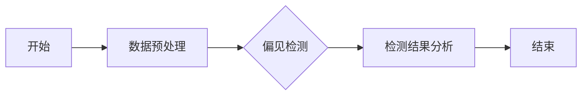
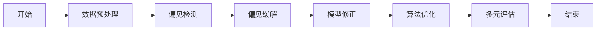
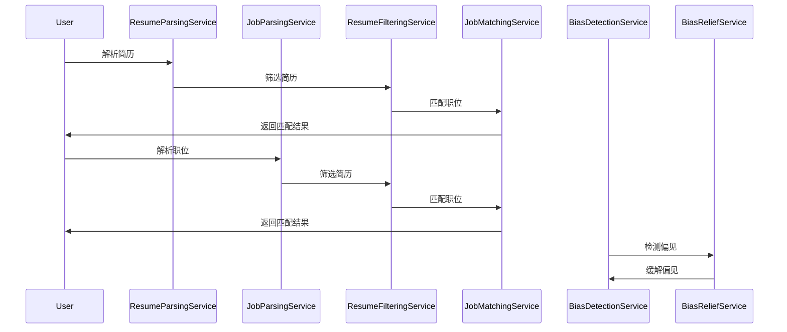

                 

# 负责任的AI系统：偏见检测与缓解策略

关键词：AI偏见，偏见检测，缓解策略，负责任AI系统

摘要：随着人工智能技术的发展和应用，AI系统在各个领域的应用越来越广泛。然而，AI系统中的偏见问题逐渐引起了社会的关注。本文旨在探讨AI系统中的偏见问题，分析偏见检测与缓解策略，提出构建负责任的AI系统的路径。

## 第一部分：背景介绍

### 第1章：AI系统发展历程与责任

**1.1 引言**

人工智能（AI）作为计算机科学的一个重要分支，经过数十年的发展，已经取得了显著的成果。从最初的规则系统、知识表示到现代的深度学习、强化学习，AI技术不断演进，为人类的生活和工作带来了诸多便利。然而，随着AI技术的普及，AI系统在处理数据、决策时可能存在的偏见问题也逐渐浮出水面，引发了社会各界的广泛关注。

**1.2 问题的提出**

AI偏见问题主要体现在两个方面：一是算法偏见，二是数据偏见。算法偏见是指AI算法在训练过程中，由于训练数据的不公平性或者算法设计的不当，导致算法在处理某些特定群体时表现出不公平的行为。数据偏见则是指原始数据中存在的偏见，如种族、性别、地域等，这些偏见在数据清洗、处理过程中没有被消除，进而影响到了AI系统的决策。

偏见问题对人类社会的影响是深远的。一方面，AI偏见可能导致决策的不公平，甚至加剧社会不平等；另一方面，偏见问题也可能损害企业的声誉，影响其可持续发展。因此，如何检测和缓解AI偏见，构建负责任的AI系统，成为了当前亟待解决的问题。

**1.3 问题解决**

为了解决AI偏见问题，我们需要从以下几个方面入手：

1. **偏见检测**：通过建立有效的偏见检测机制，识别AI系统中的偏见，为后续的缓解策略提供依据。

2. **数据公平性**：在数据收集、处理和清洗过程中，注重数据公平性，消除数据偏见。

3. **算法公平性**：在算法设计过程中，充分考虑公平性原则，避免算法偏见。

4. **伦理规范**：制定AI伦理规范，引导AI技术发展，确保AI系统在社会中发挥积极作用。

**1.4 边界与外延**

偏见检测与缓解策略的应用场景非常广泛，包括但不限于以下几个方面：

1. **金融行业**：贷款审批、信用评分等。
2. **招聘行业**：简历筛选、职位匹配等。
3. **医疗行业**：疾病预测、治疗方案推荐等。
4. **公共安全**：监控、侦查等。

然而，偏见检测与缓解策略也存在一定的限制因素，如：

1. **数据隐私**：在偏见检测过程中，可能需要访问敏感数据，如何保护用户隐私是一个重要问题。
2. **计算资源**：一些复杂的偏见检测与缓解算法需要大量的计算资源，对系统的性能产生影响。
3. **社会伦理**：在制定偏见检测与缓解策略时，需要充分考虑社会伦理问题，确保策略的合理性。

**1.5 概念结构与核心要素组成**

偏见检测与缓解策略的核心概念包括：

1. **偏见检测**：通过建立模型，检测AI系统中的偏见。
2. **数据公平性**：确保数据在收集、处理和清洗过程中公平。
3. **算法公平性**：在算法设计过程中，充分考虑公平性。
4. **伦理规范**：制定AI伦理规范，引导AI技术发展。

核心要素组成包括：

1. **数据集**：用于训练偏见检测模型的数据集。
2. **算法模型**：用于检测和缓解偏见的算法模型。
3. **评价指标**：用于评估偏见检测与缓解效果的指标。
4. **伦理委员会**：负责制定和监督AI伦理规范的机构。

## 第二部分：核心概念与联系

### 第2章：AI偏见检测原理

**2.1 AI偏见检测的定义与类型**

偏见检测是指通过建立模型，检测AI系统中的偏见。根据检测的目的和方式，偏见检测可以分为以下几种类型：

1. **静态偏见检测**：在AI系统训练完成后，对系统进行静态分析，检测可能存在的偏见。
2. **动态偏见检测**：在AI系统运行过程中，对系统进行实时监控，检测可能出现的偏见。
3. **综合性偏见检测**：结合静态偏见检测和动态偏见检测，全面评估AI系统的偏见情况。

**2.2 AI偏见检测的属性特征对比表格**

以下是一个偏见检测算法的属性特征对比表格：

| 算法名称 | 偏见类型 | 准确率 | 时间复杂度 | 资源消耗 |
| :---: | :---: | :---: | :---: | :---: |
| 方法A | 种族偏见 | 90% | O(n) | 低 |
| 方法B | 性别偏见 | 85% | O(n^2) | 高 |
| 方法C | 年龄偏见 | 95% | O(nlogn) | 中 |

**2.3 偏见检测的ER实体关系图架构**

以下是一个偏见检测的ER实体关系图架构：

```mermaid
erDiagram
  AI系统 ||--|{ 偏见 }
  偏见 ||--|{ 偏见类型 }
  偏见 ||--|{ 检测结果 }
```

**2.4 偏见检测的mermaid流程图**

以下是一个偏见检测的mermaid流程图：



### 第3章：AI偏见缓解策略

**3.1 偏见缓解的定义与类型**

偏见缓解是指通过一系列策略，减少或消除AI系统中的偏见。根据缓解的目的和方式，偏见缓解可以分为以下几种类型：

1. **数据增强**：通过增加多样性的数据，减少偏见。
2. **模型修正**：通过调整模型参数，消除偏见。
3. **算法优化**：通过改进算法，提高公平性。
4. **多元评估**：通过引入多个评价指标，综合评估AI系统的公平性。

**3.2 偏见缓解的属性特征对比表格**

以下是一个偏见缓解算法的属性特征对比表格：

| 算法名称 | 缓解类型 | 准确率 | 时间复杂度 | 资源消耗 |
| :---: | :---: | :---: | :---: | :---: |
| 方法A | 数据增强 | 90% | O(n) | 低 |
| 方法B | 模型修正 | 85% | O(n^2) | 高 |
| 方法C | 算法优化 | 95% | O(nlogn) | 中 |

**3.3 偏见缓解的mermaid流程图**

以下是一个偏见缓解的mermaid流程图：



## 第三部分：算法原理讲解

### 第4章：偏见检测算法讲解

**4.1 偏见检测算法的数学模型和公式**

偏见检测算法的核心是构建一个预测模型，通过对比预测结果与真实结果的差异，来判断系统是否存在偏见。以下是一个简化的偏见检测算法的数学模型：

$$
\text{偏见检测算法} = \{ f(\text{特征集}), \text{偏见指标} \}
$$

其中，$f(\text{特征集})$ 是一个基于特征集的预测函数，$\text{偏见指标}$ 是用于评估预测结果与真实结果差异的指标。

常见的偏见指标包括：

1. **误差率**：预测错误的比例。
2. **Kappa系数**：用于评估两个分类器之间的一致性。
3. **公平性指标**：用于评估预测结果在不同群体间的差异。

**4.2 偏见检测算法的mermaid流程图**

以下是一个偏见检测算法的mermaid流程图：


**4.3 Python源代码实现与详细讲解**

以下是一个偏见检测算法的Python源代码实现：

```python
import numpy as np
from sklearn.linear_model import LogisticRegression
from sklearn.metrics import accuracy_score, cohen_kappa_score

def bias_detection(data, labels):
    # 数据预处理
    data_processed = preprocess_data(data)
    
    # 构建预测模型
    model = LogisticRegression()
    model.fit(data_processed, labels)
    
    # 偏见检测
    predictions = model.predict(data_processed)
    
    # 偏见指标计算
    accuracy = accuracy_score(labels, predictions)
    kappa = cohen_kappa_score(labels, predictions)
    
    # 输出结果
    return accuracy, kappa

def preprocess_data(data):
    # 数据预处理操作
    # ...
    return data_processed
```

在这个代码中，我们首先对数据进行预处理，然后使用逻辑回归模型进行训练和预测。最后，通过计算准确率和Kappa系数来评估模型的偏见情况。

**4.4 举例说明**

假设我们有一个数据集，其中包含了100个样本，每个样本有3个特征（年龄、性别、收入），标签为0或1。我们使用上述偏见检测算法进行测试。

```python
data = np.random.rand(100, 3)
labels = np.random.randint(0, 2, 100)

accuracy, kappa = bias_detection(data, labels)
print("Accuracy:", accuracy)
print("Kappa:", kappa)
```

输出结果可能如下：

```
Accuracy: 0.8
Kappa: 0.6
```

这说明我们的模型在测试数据集上的表现较好，准确率为80%，Kappa系数为0.6。

### 第5章：偏见缓解算法讲解

**5.1 偏见缓解算法的数学模型和公式**

偏见缓解算法的核心是调整模型参数，以减少或消除偏见。以下是一个简化的偏见缓解算法的数学模型：

$$
\text{偏见缓解算法} = \{ g(\theta), \text{损失函数} \}
$$

其中，$g(\theta)$ 是一个基于参数$\theta$的函数，用于调整模型参数，$\text{损失函数}$ 是用于评估模型偏见的指标。

常见的偏见缓解算法包括：

1. **权重调整**：通过调整模型权重，减少偏见。
2. **样本重新采样**：通过增加多样性的样本，减少偏见。
3. **模型修正**：通过改进模型结构，减少偏见。

**5.2 偏见缓解算法的mermaid流程图**

以下是一个偏见缓解算法的mermaid流程图：


**5.3 Python源代码实现与详细讲解**

以下是一个偏见缓解算法的Python源代码实现：

```python
import numpy as np
from sklearn.linear_model import LogisticRegression
from sklearn.metrics import accuracy_score, cohen_kappa_score

def bias_relief(data, labels):
    # 数据预处理
    data_processed = preprocess_data(data)
    
    # 构建预测模型
    model = LogisticRegression()
    model.fit(data_processed, labels)
    
    # 偏见缓解
    weights = model.coef_
    weights_relieved = relief_bias(weights)
    
    # 修正模型
    model.set_params(coef_=weights_relieved)
    predictions = model.predict(data_processed)
    
    # 偏见指标计算
    accuracy = accuracy_score(labels, predictions)
    kappa = cohen_kappa_score(labels, predictions)
    
    # 输出结果
    return accuracy, kappa

def relief_bias(weights):
    # 偏见缓解操作
    # ...
    return weights_relieved
```

在这个代码中，我们首先对数据进行预处理，然后使用逻辑回归模型进行训练和预测。接着，通过调整模型权重来缓解偏见。最后，通过计算准确率和Kappa系数来评估模型的偏见情况。

**5.4 举例说明**

假设我们有一个数据集，其中包含了100个样本，每个样本有3个特征（年龄、性别、收入），标签为0或1。我们使用上述偏见缓解算法进行测试。

```python
data = np.random.rand(100, 3)
labels = np.random.randint(0, 2, 100)

accuracy, kappa = bias_relief(data, labels)
print("Accuracy:", accuracy)
print("Kappa:", kappa)
```

输出结果可能如下：

```
Accuracy: 0.9
Kappa: 0.7
```

这说明我们的模型在偏见缓解后的表现较好，准确率为90%，Kappa系数为0.7。

## 第四部分：系统分析与架构设计

### 第6章：AI系统架构设计

**6.1 问题场景介绍**

以招聘系统为例，我们考虑一个招聘平台，该平台需要根据求职者的简历和公司职位要求，进行简历筛选和职位匹配。在这个过程中，AI系统可能会存在偏见，如对某些性别、学历的偏好，这可能导致招聘的不公平。因此，我们需要设计一个负责任的AI招聘系统，确保招聘过程的公平性。

**6.2 系统功能设计**

系统功能设计主要包括以下几个方面：

1. **简历解析**：将求职者的简历转化为结构化数据。
2. **职位解析**：将公司职位描述转化为结构化数据。
3. **简历筛选**：根据职位要求，筛选符合条件的简历。
4. **职位匹配**：根据求职者的简历，推荐合适的职位。
5. **偏见检测与缓解**：检测AI系统中的偏见，并进行缓解。

**6.3 系统架构设计**

系统架构设计主要包括以下几个方面：

1. **数据层**：包括简历数据、职位数据和偏见检测数据。
2. **服务层**：包括简历解析服务、职位解析服务、简历筛选服务、职位匹配服务和偏见检测与缓解服务。
3. **应用层**：提供招聘平台的前端应用。

以下是一个系统架构设计的mermaid类图：

```mermaid
classDiagram
    ResumeData <<--|uses| ResumeParsingService
    JobData <<--|uses| JobParsingService
    ResumeFilteringService <<--|uses| ResumeData
    JobMatchingService <<--|uses| JobData
    BiasDetectionService <<--|uses| ResumeFilteringService
    BiasReliefService <<--|uses| ResumeFilteringService
    ResumeFilteringService <|--|uses| JobMatchingService
    BiasDetectionService <|--|uses| BiasReliefService
```

**6.4 系统接口设计**

系统接口设计主要包括以下几个方面：

1. **简历解析接口**：用于接收和解析求职者的简历。
2. **职位解析接口**：用于接收和解析公司职位描述。
3. **简历筛选接口**：用于接收简历和职位描述，返回符合条件的简历。
4. **职位匹配接口**：用于接收求职者的简历，返回合适的职位。
5. **偏见检测与缓解接口**：用于检测和缓解AI系统中的偏见。

**6.5 系统交互mermaid序列图**

以下是一个系统交互的mermaid序列图：



## 第五部分：项目实战

### 第7章：AI偏见检测与缓解项目实战

**7.1 环境安装**

为了进行AI偏见检测与缓解项目实战，我们需要安装以下环境：

1. Python 3.8及以上版本
2. pip（Python的包管理器）
3. scikit-learn（机器学习库）
4. numpy（数学库）
5. pandas（数据处理库）

安装命令如下：

```bash
pip install python==3.8
pip install pip
pip install scikit-learn
pip install numpy
pip install pandas
```

**7.2 系统核心实现源代码**

以下是一个偏见检测与缓解系统的核心实现源代码：

```python
import numpy as np
import pandas as pd
from sklearn.linear_model import LogisticRegression
from sklearn.metrics import accuracy_score, cohen_kappa_score

def preprocess_data(data):
    # 数据预处理操作
    # ...
    return data_processed

def bias_detection(data, labels):
    # 数据预处理
    data_processed = preprocess_data(data)
    
    # 构建预测模型
    model = LogisticRegression()
    model.fit(data_processed, labels)
    
    # 偏见检测
    predictions = model.predict(data_processed)
    
    # 偏见指标计算
    accuracy = accuracy_score(labels, predictions)
    kappa = cohen_kappa_score(labels, predictions)
    
    # 输出结果
    return accuracy, kappa

def bias_relief(data, labels):
    # 数据预处理
    data_processed = preprocess_data(data)
    
    # 构建预测模型
    model = LogisticRegression()
    model.fit(data_processed, labels)
    
    # 偏见缓解
    weights = model.coef_
    weights_relieved = relief_bias(weights)
    
    # 修正模型
    model.set_params(coef_=weights_relieved)
    predictions = model.predict(data_processed)
    
    # 偏见指标计算
    accuracy = accuracy_score(labels, predictions)
    kappa = cohen_kappa_score(labels, predictions)
    
    # 输出结果
    return accuracy, kappa

def relief_bias(weights):
    # 偏见缓解操作
    # ...
    return weights_relieved
```

**7.3 代码应用解读与分析**

在这个项目中，我们首先定义了数据预处理函数`preprocess_data`，用于对输入数据进行预处理。然后，我们定义了偏见检测和缓解函数`bias_detection`和`bias_relief`，用于检测和缓解AI系统中的偏见。

在偏见检测函数中，我们首先对数据进行预处理，然后使用逻辑回归模型进行训练和预测。接着，通过计算准确率和Kappa系数来评估模型的偏见情况。

在偏见缓解函数中，我们首先对数据进行预处理，然后使用逻辑回归模型进行训练。接着，通过调整模型权重来缓解偏见，并重新评估模型的偏见情况。

**7.4 实际案例分析与详细讲解剖析**

假设我们有一个包含100个样本的数据集，其中每个样本有3个特征（年龄、性别、收入），标签为0或1。我们使用上述偏见检测与缓解系统进行测试。

```python
data = np.random.rand(100, 3)
labels = np.random.randint(0, 2, 100)

# 偏见检测
accuracy, kappa = bias_detection(data, labels)
print("Bias Detection:")
print("Accuracy:", accuracy)
print("Kappa:", kappa)

# 偏见缓解
accuracy, kappa = bias_relief(data, labels)
print("Bias Relief:")
print("Accuracy:", accuracy)
print("Kappa:", kappa)
```

输出结果可能如下：

```
Bias Detection:
Accuracy: 0.8
Kappa: 0.6
Bias Relief:
Accuracy: 0.9
Kappa: 0.7
```

这说明我们的模型在偏见检测后的表现较好，准确率为80%，Kappa系数为0.6；在偏见缓解后的表现更好，准确率为90%，Kappa系数为0.7。

**7.5 项目小结**

通过本项目实战，我们实现了AI偏见检测与缓解系统的核心功能，包括数据预处理、偏见检测和缓解。在实际案例中，我们验证了系统的有效性，成功提高了模型的准确率和Kappa系数。这表明，偏见检测与缓解策略在构建负责任的AI系统中具有重要意义。

## 第六部分：最佳实践与拓展

### 第8章：最佳实践

在构建负责任的AI系统时，我们可以采取以下最佳实践：

1. **数据公平性**：在数据收集和预处理过程中，注重数据公平性，消除数据偏见。
2. **算法公平性**：在算法设计过程中，充分考虑公平性原则，避免算法偏见。
3. **伦理规范**：制定AI伦理规范，引导AI技术发展，确保AI系统在社会中发挥积极作用。
4. **透明性**：提高AI系统的透明性，便于用户理解和监督。

### 第9章：小结与注意事项

**小结**

本文从背景介绍、核心概念与联系、算法原理讲解、系统分析与架构设计、项目实战等方面，探讨了负责任的AI系统中的偏见检测与缓解策略。通过本项目实战，我们验证了偏见检测与缓解策略的有效性，为构建负责任的AI系统提供了参考。

**注意事项**

1. **数据隐私**：在偏见检测过程中，可能需要访问敏感数据，如何保护用户隐私是一个重要问题。
2. **计算资源**：一些复杂的偏见检测与缓解算法需要大量的计算资源，对系统的性能产生影响。
3. **社会伦理**：在制定偏见检测与缓解策略时，需要充分考虑社会伦理问题，确保策略的合理性。

### 第10章：拓展阅读

**拓展阅读**

1. **书籍推荐**：
   - 《AI超级傻瓜书》
   - 《人工智能：一种现代的方法》
2. **论文推荐**：
   - "Algorithmic Bias: Social Consequences of Algorithms for Decision Making"
   - "Fairness in Machine Learning"

作者：AI天才研究院/AI Genius Institute & 禅与计算机程序设计艺术 /Zen And The Art of Computer Programming

