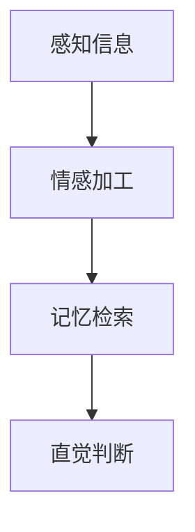
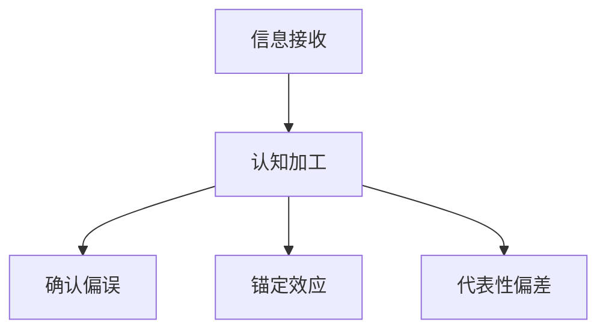
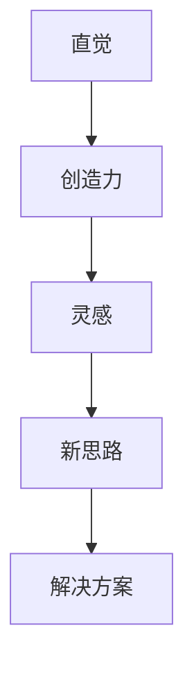
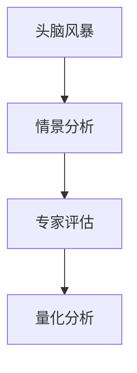

                 


### **认识直觉决策**

直觉决策作为一种非正式的决策方法，一直是人类生活中不可或缺的一部分。它不像传统决策那样依赖于详尽的数据和分析，而是更多地依赖于个人内心的感觉和经验。这种决策方法在日常生活中随处可见，例如，我们如何选择食物、如何安排时间、如何处理突发情况等。然而，直觉决策并不是随意或无根据的，它有其特定的心理机制和理论基础。

#### **1.1 什么是直觉决策**

直觉决策是指个体在面临问题时，不经过详细的逻辑分析和理性思考，而是依靠直觉、感觉或潜意识进行决策的过程。这种决策方法通常在紧急情况下或面临复杂问题时显得尤为重要，因为它能够迅速地提供解决方案，减少决策的时间成本。

**核心概念术语说明**：  
- **直觉决策**：依靠个人内心感觉和经验进行决策的方法。  
- **传统决策**：依赖于逻辑分析和数据支持的决策方法。

**问题背景**：  
在现代社会，信息的爆炸和复杂性的增加使得传统决策方法往往需要大量的时间和资源。而在某些情境下，这种传统的决策方法并不能及时地解决问题。因此，直觉决策作为一种快速、高效的决策方法，受到了越来越多的关注。

**问题描述**：  
直觉决策是如何运作的？它有哪些优缺点？如何在日常生活中有效地运用直觉决策？

**问题解决**：  
通过理解和分析直觉决策的心理机制和实际应用，我们可以更好地掌握和运用这种决策方法。

**边界与外延**：  
直觉决策不仅局限于个人决策，还可以应用于团队和组织层面。同时，它也可以与其他决策方法相结合，发挥出更大的效果。

**概念结构与核心要素组成**：  
- **直觉思维**：直觉决策的基础，是指个体不经过逻辑分析，直接依靠内心感觉和经验进行思考的过程。  
- **情感因素**：情感在直觉决策中起着重要作用，往往能够影响决策的结果。  
- **认知偏差**：个体在直觉决策中可能会出现的认知偏差，如确认偏误、锚定效应等。

#### **1.2 直觉决策与传统决策**

直觉决策与传统决策有着本质的区别。传统决策依赖于逻辑和分析，强调数据的收集和处理，而直觉决策则依赖于个人的感觉和经验，强调快速响应和灵活应对。以下是两种决策方法的对比表格：

| 特点 | 直觉决策 | 传统决策 |
| --- | --- | --- |
| 时间成本 | 快速 | 较长 |
| 数据依赖 | 低 | 高 |
| 灵活性 | 高 | 低 |
| 精确度 | 中等 | 较高 |
| 应对紧急情况 | 优势 | 劣势 |

**ER实体关系图架构**：

```mermaid
erDiagram
  直觉决策 ||--|{ 传统决策 }|--||
  直觉决策 }|--|{ 时间成本 }|--||
  直觉决策 }|--|{ 数据依赖 }|--||
  直觉决策 }|--|{ 灵活性 }|--||
  直觉决策 }|--|{ 精确度 }|--||
  直觉决策 }|--|{ 应对紧急情况 }|--||
  传统决策 }|--|{ 数据收集 }|--||
  传统决策 }|--|{ 数据处理 }|--||
```

#### **1.3 直觉决策的优势与局限**

直觉决策有其独特的优势，例如快速响应、灵活应对等，但也存在一定的局限，如数据依赖性低、精确度中等等。以下是对直觉决策优势与局限的详细分析：

**优势**：

1. **快速响应**：直觉决策能够迅速提供解决方案，减少决策的时间成本。
2. **灵活应对**：直觉决策能够根据实际情况进行调整，灵活应对复杂多变的情况。
3. **减少决策成本**：相较于传统决策，直觉决策不需要大量的数据分析和处理，可以节省人力和物力资源。

**局限**：

1. **数据依赖性低**：直觉决策依赖于个人经验和感觉，往往缺乏充分的数据支持，可能影响决策的准确性。
2. **精确度中等**：直觉决策的结果往往不如传统决策精确，可能存在一定的偏差。
3. **风险较高**：由于缺乏充分的数据分析和理性思考，直觉决策可能带来较高的风险。

通过以上分析，我们可以看出，直觉决策和传统决策各有优缺点，适用于不同的决策场景。在实际应用中，我们可以根据具体情况，灵活运用直觉决策和传统决策，以达到最佳的决策效果。

### **直觉决策的心理机制**

直觉决策并非简单地依靠感觉和经验进行判断，它有着复杂的心理机制和认知过程。在直觉决策中，情感、记忆和认知偏差等心理因素起着至关重要的作用。理解这些心理机制，有助于我们更好地运用直觉决策。

#### **2.1 直觉思维的心理过程**

直觉思维是直觉决策的基础。它是一种快速、自动的思考过程，不需要经过详细的逻辑分析。以下是直觉思维的心理过程：

1. **感知信息**：个体接收外部信息，如视觉、听觉等感官信息。
2. **情感加工**：情感在直觉思维中起着重要作用。个体会根据情感对信息进行加工，如愉悦、焦虑、恐惧等。
3. **记忆检索**：个体会调用已有的记忆和知识，对信息进行快速检索和匹配。
4. **直觉判断**：个体基于感知信息、情感加工和记忆检索的结果，迅速做出判断和决策。

**流程图**：



#### **2.2 直觉决策与情感**

情感在直觉决策中扮演着关键角色。情感不仅影响个体的决策过程，还可能影响决策的结果。以下是情感在直觉决策中的作用：

1. **决策速度**：情感可以加速或减缓直觉决策的速度。例如，焦虑和恐惧可能会使个体迅速做出决策，而愉悦和满足感可能会使个体更加谨慎地决策。
2. **决策质量**：情感可能会影响决策的质量。积极的情感可能提高决策的质量，而消极的情感可能降低决策的质量。
3. **决策偏好**：情感可能会影响个体的决策偏好。个体可能更倾向于做出符合自己情感偏好的决策。

**表格**：

| 情感类型 | 作用 |
| --- | --- |
| 积极情感 | 提高决策速度和质量 |
| 消极情感 | 降低决策速度和质量 |
| 焦虑 | 迅速做出决策 |
| 愉悦 | 更加谨慎地决策 |

#### **2.3 直觉决策的认知偏差**

认知偏差是指个体在决策过程中，由于认知过程的不完善，导致决策结果偏离理性。在直觉决策中，认知偏差尤为明显。以下是几种常见的认知偏差：

1. **确认偏误**：个体倾向于寻找和记住支持自己观点的信息，而忽略相反的信息。这可能导致直觉决策的结果偏离客观事实。
2. **锚定效应**：个体在决策过程中，会受到最初信息（锚点）的影响，即使这个锚点并不相关。这可能导致直觉决策的结果受到初始信息的影响。
3. **代表性偏差**：个体在评估概率时，倾向于根据事物的外表和特征进行判断，而忽略实际的概率。这可能导致直觉决策的结果与实际概率不符。

**流程图**：



通过以上分析，我们可以看出，直觉决策的心理机制涉及感知信息、情感加工、记忆检索和认知偏差等多个方面。理解这些心理机制，有助于我们更好地运用直觉决策，提高决策的质量和效率。

### **培养直觉决策能力**

培养直觉决策能力是一项系统性的工程，需要我们从多个方面进行锻炼和提升。以下是一些有效的培养方法，可以帮助我们增强直觉决策能力。

#### **3.1 提升直觉的练习**

1. **情景模拟**：通过模拟不同情境下的决策问题，我们可以锻炼直觉决策能力。例如，在日常生活中，我们可以尝试在购物、旅行、工作等场景下，不经过详细分析，而是依靠直觉进行决策。这样，我们可以逐渐提高直觉决策的敏感度和准确性。

2. **反思与总结**：在每次决策后，及时反思和总结，分析决策的成功和失败原因。通过反思，我们可以了解自己在决策过程中的优点和不足，从而有针对性地进行改进。

**表格**：

| 练习方法 | 作用 |
| --- | --- |
| 情景模拟 | 锻炼直觉决策能力 |
| 反思与总结 | 提高决策质量 |

#### **3.2 直觉决策的培养方法**

1. **积累经验**：经验是直觉决策的重要基础。通过不断积累经验，我们可以提高对问题的敏感度，增强直觉的准确性。例如，在职场中，我们可以通过参与不同类型的项目，积累多样化的经验，从而提高直觉决策的能力。

2. **培养观察力**：观察力是直觉决策的重要能力。通过培养观察力，我们可以更好地捕捉和理解信息，从而提高直觉决策的准确性。例如，在日常生活中，我们可以尝试关注身边的人和事，提高对细节的敏感度。

3. **锻炼心理素质**：心理素质是直觉决策的关键。通过锻炼心理素质，我们可以提高在面对复杂和紧急情况时的应对能力，从而更好地运用直觉决策。例如，可以通过练习冥想、瑜伽等方式，提高自己的心理素质。

**表格**：

| 培养方法 | 作用 |
| --- | --- |
| 积累经验 | 提高直觉决策准确性 |
| 培养观察力 | 提高信息捕捉能力 |
| 锻炼心理素质 | 提高应对复杂情况的能力 |

#### **3.3 直觉决策的实践应用**

1. **商业决策**：在商业领域，直觉决策可以用于市场分析、产品开发、战略规划等方面。例如，企业家在面临是否投资某个项目时，可以依靠直觉进行初步判断，然后再进行详细分析。

2. **个人生活决策**：在个人生活中，直觉决策可以帮助我们更好地处理各种问题。例如，在职业规划、家庭生活、社交交往等方面，我们可以通过直觉决策，快速做出合理的选择。

3. **创新与创造力**：直觉决策在创新和创造力中发挥着重要作用。在创意开发、产品设计、艺术创作等方面，直觉决策可以提供独特的视角和灵感，帮助我们实现创新。

**表格**：

| 场景 | 应用 |
| --- | --- |
| 商业决策 | 市场分析、产品开发、战略规划 |
| 个人生活决策 | 职业规划、家庭生活、社交交往 |
| 创新与创造力 | 创意开发、产品设计、艺术创作 |

通过以上方法，我们可以逐步培养直觉决策能力，提高决策的质量和效率。在实际应用中，我们需要结合自身实际情况，灵活运用直觉决策，以实现最佳决策效果。

### **商业领域的直觉决策**

在商业领域，直觉决策作为一种快速且灵活的决策方法，已被广泛运用。它不仅帮助企业家和经理人在复杂多变的市场环境中做出及时决策，还提高了组织的应变能力和竞争力。以下将探讨直觉决策在商业决策中的应用场景、价值和实践方法。

#### **4.1 商业决策中的直觉作用**

直觉决策在商业决策中发挥着重要作用，尤其是在以下场景：

1. **市场预测**：在快速变化的市场中，直觉可以帮助企业家迅速判断市场趋势，预测客户需求，从而及时调整营销策略和产品开发计划。

2. **战略规划**：在制定企业发展战略时，直觉可以帮助领导者识别潜在商机和风险，快速做出战略决策，确保企业始终保持竞争优势。

3. **危机应对**：在面临突发危机时，直觉决策能够帮助企业家迅速做出反应，制定应急措施，降低危机对企业的负面影响。

**案例**：

一家初创公司面临市场竞争激烈，资源有限。公司创始人通过直觉判断，决定将资源集中在核心产品上，同时利用直觉快速评估市场需求，调整产品功能，最终成功占领市场。

#### **4.2 直觉在战略规划中的应用**

直觉在战略规划中的应用主要体现在以下几个方面：

1. **识别商机**：企业家可以通过直觉识别市场上的潜在商机，发现未被满足的客户需求，从而制定新的业务发展战略。

2. **风险评估**：在战略规划过程中，直觉可以帮助企业家评估潜在的投资项目和业务扩展计划，识别潜在的风险，做出更为稳健的决策。

3. **资源分配**：直觉可以帮助企业家在资源有限的情况下，合理分配资源，确保关键业务得到充分支持。

**案例**：

某公司计划拓展新市场，公司高层通过直觉判断，决定优先选择具有较高潜力的市场进行拓展，并在资源分配上给予重点支持，最终取得了良好的市场业绩。

#### **4.3 直觉在市场分析中的价值**

直觉在市场分析中具有独特的价值，主要体现在以下几个方面：

1. **快速响应**：直觉可以帮助企业家和市场分析师迅速捕捉市场动态，及时调整市场策略，抓住市场机会。

2. **客户需求预测**：直觉可以帮助企业更好地理解客户需求，预测市场趋势，从而制定更加精准的市场策略。

3. **产品创新**：直觉在产品创新中起着关键作用，可以帮助企业快速识别客户需求，推动产品创新和迭代。

**案例**：

一家科技公司通过直觉判断，决定开发一款满足新兴市场需求的软件产品，最终成功占领市场，实现了业绩的显著增长。

#### **4.4 直觉决策的实践方法**

为了有效地运用直觉决策，企业在实践中可以采取以下方法：

1. **建立直觉决策文化**：鼓励团队成员在决策过程中运用直觉，培养直觉决策的习惯。同时，建立一种开放、包容的决策环境，使团队成员敢于表达自己的直觉判断。

2. **结合数据与直觉**：在决策过程中，将直觉与数据相结合，充分利用数据分析工具，提高直觉决策的准确性。

3. **培养直觉能力**：通过培训和实战演练，提高团队成员的直觉决策能力，使其能够更有效地运用直觉进行决策。

**表格**：

| 实践方法 | 作用 |
| --- | --- |
| 建立直觉决策文化 | 鼓励团队成员运用直觉 |
| 结合数据与直觉 | 提高直觉决策准确性 |
| 培养直觉能力 | 提高直觉决策效率 |

通过以上分析，我们可以看出，直觉决策在商业领域具有广泛的应用价值和实践意义。企业可以通过建立直觉决策文化、结合数据与直觉、培养直觉能力等方法，提高直觉决策的效率和质量，从而在激烈的市场竞争中立于不败之地。

### **生活决策中的直觉**

直觉在日常生活决策中扮演着不可或缺的角色，它帮助我们迅速做出选择，处理日常事务，提高生活质量和幸福感。以下将探讨直觉在家庭生活、职场决策和社交交往中的具体应用。

#### **5.1 家庭生活决策中的直觉**

在家庭生活中，直觉帮助我们在处理日常事务时更加从容不迫。以下是一些应用场景：

1. **家务分工**：家庭中往往需要分工合作，通过直觉，我们可以迅速判断谁更适合承担某项任务，从而提高家务效率。

2. **育儿决策**：在面对孩子的教育问题时，直觉可以帮助我们迅速做出合适的选择，例如如何处理孩子的情绪问题、如何选择课外兴趣班等。

3. **家庭预算**：在家庭财务管理中，直觉可以帮助我们快速判断家庭支出是否符合预算，及时调整消费行为。

**案例**：

一位母亲在带孩子去商场购物时，通过直觉判断孩子可能会对某个玩具产生兴趣，于是提前预见了孩子的需求，避免了不必要的争吵和消费。

#### **5.2 职场决策中的直觉**

在职场中，直觉帮助我们在处理工作事务时更加高效和精准。以下是一些应用场景：

1. **任务分配**：在团队工作中，通过直觉，我们可以快速判断谁更适合承担某项任务，从而提高团队的工作效率。

2. **问题解决**：在遇到突发问题时，直觉可以帮助我们迅速找到解决方案，避免因为拖延而带来的负面影响。

3. **职业规划**：在面对职业发展的选择时，直觉可以帮助我们快速判断哪个方向更符合自己的兴趣和长远发展。

**案例**：

一位项目经理在团队面临重要项目决策时，通过直觉判断某个成员更适合负责关键任务，从而确保了项目的顺利进行。

#### **5.3 社交决策中的直觉**

在社交交往中，直觉帮助我们处理复杂的人际关系，提高社交效能。以下是一些应用场景：

1. **人际沟通**：在人际沟通中，直觉可以帮助我们迅速理解对方的需求和情感，从而做出更合适的回应。

2. **社交活动**：在参加社交活动时，直觉可以帮助我们判断哪些活动符合自己的兴趣，从而提高社交体验。

3. **选择朋友**：在面对选择朋友时，直觉可以帮助我们判断哪些人值得信赖，从而避免不必要的社交风险。

**案例**：

在一次社交活动中，一位参与者通过直觉判断某个新朋友和自己有着共同的兴趣爱好，于是主动与之交流，最终建立了深厚的友谊。

通过以上分析，我们可以看出，直觉在家庭生活、职场决策和社交交往中都有着广泛的应用。培养和提高直觉能力，不仅能够帮助我们更好地处理日常事务，提高生活质量，还能提升职场竞争力和社交效能。在实际生活中，我们可以通过不断练习和反思，逐步培养和提升直觉决策能力。

### **直觉决策在创新与创造力中的角色**

直觉决策在创新与创造力中扮演着至关重要的角色，它是激发新思路、发现解决方案的重要工具。在科技、艺术和设计等领域，直觉决策能够帮助人们打破常规，创造前所未有的成果。

#### **6.1 直觉在创新思维中的作用**

直觉在创新思维中的作用主要体现在以下几个方面：

1. **快速生成想法**：直觉可以帮助人们在短时间内生成大量想法，这些想法可能是常规思维无法想到的，为创新提供了丰富的素材。

2. **识别潜在机会**：直觉能够帮助人们迅速识别潜在的创新机会，特别是在面对复杂问题时，直觉可以提供独特的视角，发现常规分析无法发现的解决方案。

3. **引导创意流程**：直觉在创意流程中起着关键的引导作用，它能够帮助人们在不同的创意阶段迅速做出选择和调整，推动创意不断迭代和完善。

**表格**：

| 作用 | 说明 |
| --- | --- |
| 快速生成想法 | 提供丰富的创意素材 |
| 识别潜在机会 | 发现常规思维无法发现的解决方案 |
| 引导创意流程 | 推动创意不断迭代和完善 |

#### **6.2 直觉与创造力的关系**

直觉与创造力之间存在紧密的关系。直觉是一种无意识的思维过程，它能够迅速捕捉信息、做出判断，这种能力在创造力中发挥着重要作用。以下为两者关系的详细分析：

1. **直觉是创造力的重要基础**：直觉可以帮助人们快速处理信息，从复杂的情境中提取关键信息，为创造力提供基础素材。

2. **创造力激发直觉**：创造力本身是一个复杂的思维过程，它需要大量的直觉参与。通过创造力的激发，人们的直觉能力可以得到锻炼和提升。

3. **直觉与创造力的协同作用**：直觉和创造力相互促进，直觉提供了快速反应和灵感的来源，而创造力则利用直觉生成的新思路进行深入挖掘和扩展。

**流程图**：



#### **6.3 直觉在创意开发中的应用**

在创意开发中，直觉的应用广泛且有效。以下是一些具体的应用场景：

1. **产品设计**：在产品设计过程中，设计师可以通过直觉快速捕捉用户需求，创造出满足用户期望的产品。

2. **艺术创作**：在艺术创作中，艺术家可以通过直觉表达内心的情感和想法，创造出独特的艺术作品。

3. **科技研发**：在科技研发中，科研人员可以通过直觉判断某个研究方向的潜在价值，从而做出科学的决策。

**案例**：

一家科技公司通过直觉判断，决定将资源投入到新兴的物联网技术研究中，最终成功开发出具有市场竞争力的物联网产品。

#### **6.4 直觉在创新思维训练中的价值**

为了培养直觉决策能力，在创新思维训练中，我们可以采取以下措施：

1. **增强感性认知**：通过多种感官体验，增强对事物的感性认知，提高直觉的敏感度。

2. **培养观察力**：通过观察和思考，提高对细节的敏感度，培养直觉判断的能力。

3. **实践与反思**：通过实际项目和实践，不断锻炼直觉决策能力，并在实践中进行反思和总结，逐步提升直觉的准确性。

**表格**：

| 措施 | 作用 |
| --- | --- |
| 增强感性认知 | 提高直觉敏感度 |
| 培养观察力 | 提高直觉判断能力 |
| 实践与反思 | 提升直觉准确性 |

通过以上分析，我们可以看出，直觉决策在创新与创造力中具有重要的作用。培养和提高直觉决策能力，不仅能够激发创新思维，提高创造力，还能为个人和团队带来更多的成功和成就。在实际应用中，我们可以结合自身实际情况，灵活运用直觉决策，以实现更高的创新水平。

### **直觉决策的风险管理**

直觉决策虽然在快速应对和灵活调整方面具有优势，但同时也可能带来一定的风险。因此，对直觉决策的风险进行评估和管理是至关重要的。以下将探讨直觉决策中的潜在风险、评估方法和风险管理策略。

#### **7.1 直觉决策中的潜在风险**

直觉决策中可能存在的潜在风险主要包括以下几点：

1. **决策偏差**：由于直觉决策依赖于个人经验和情感，可能导致决策过程中出现认知偏差，如确认偏误、锚定效应等，从而影响决策的准确性。

2. **数据缺失**：直觉决策往往缺乏充分的数据支持，可能导致决策的依据不足，从而增加决策失误的风险。

3. **情绪影响**：情绪在直觉决策中起着重要作用，但过度依赖情绪可能使决策结果偏离理性，增加决策风险。

4. **决策延迟**：在紧急情况下，依赖直觉决策可能因为缺乏充分分析而延误决策，导致问题扩大。

**表格**：

| 风险类型 | 描述 |
| --- | --- |
| 决策偏差 | 认知偏差导致决策不准确 |
| 数据缺失 | 缺乏数据支持 |
| 情绪影响 | 过度依赖情绪 |
| 决策延迟 | 延误决策时机 |

#### **7.2 风险识别与评估方法**

为了有效管理直觉决策中的风险，我们需要采取科学的方法进行风险识别与评估。以下是一些常用的方法：

1. **头脑风暴**：通过集体头脑风暴，收集团队中不同的直觉判断和意见，从而识别潜在的风险点。

2. **情景分析**：模拟不同的决策场景，分析在不同情境下直觉决策可能带来的风险和后果。

3. **专家评估**：邀请行业专家对直觉决策进行评估，结合专业知识和经验，识别潜在风险并提供改进建议。

4. **量化分析**：使用定量分析方法，对直觉决策中的风险进行量化评估，从而更直观地了解风险程度。

**流程图**：



#### **7.3 风险管理的策略与实践**

为了有效管理直觉决策中的风险，我们可以采取以下策略：

1. **平衡直觉与数据**：在决策过程中，既要依靠直觉，也要结合数据分析，确保决策有充分的数据支持。

2. **建立风险管理机制**：制定明确的风险管理流程和制度，确保在决策过程中能够及时发现和处理风险。

3. **加强团队协作**：鼓励团队成员在决策过程中积极沟通，分享直觉判断和意见，从而降低决策偏差和风险。

4. **定期评估与反馈**：定期对直觉决策的效果进行评估，总结经验教训，不断优化决策流程，提高风险管理能力。

**表格**：

| 策略 | 说明 |
| --- | --- |
| 平衡直觉与数据 | 确保决策有充分的数据支持 |
| 建立风险管理机制 | 制定明确的风险管理流程 |
| 加强团队协作 | 提高决策透明度和协作效率 |
| 定期评估与反馈 | 优化决策流程，提高风险管理能力 |

通过以上分析和策略，我们可以更好地管理直觉决策中的风险，确保决策的准确性和有效性。在实际应用中，我们需要结合具体情境，灵活运用风险管理方法，以实现最佳决策效果。

### **直觉决策的伦理与道德考量**

直觉决策作为一种非正式的决策方法，在应用过程中可能会涉及伦理和道德问题。因此，对直觉决策的伦理和道德考量显得尤为重要。以下将探讨直觉决策中的伦理问题、道德标准以及伦理责任。

#### **8.1 直觉决策中的伦理问题**

直觉决策中的伦理问题主要包括以下几点：

1. **偏颇决策**：由于直觉决策可能受到认知偏差的影响，决策结果可能存在偏颇，导致不公平或歧视。

2. **隐私侵犯**：直觉决策可能会基于个人隐私信息，如性别、年龄、种族等，进行决策，从而侵犯他人的隐私权。

3. **责任归属**：在直觉决策过程中，如果决策结果产生负面影响，责任归属可能不明确，导致伦理争议。

**表格**：

| 伦理问题 | 描述 |
| --- | --- |
| 偏颇决策 | 认知偏差导致决策不公平 |
| 隐私侵犯 | 基于隐私信息进行决策 |
| 责任归属 | 责任不明确 |

#### **8.2 直觉决策的道德标准**

为了确保直觉决策的道德合理性，我们需要遵循以下道德标准：

1. **公正性**：决策过程应确保公正，避免因认知偏差导致的不公平现象。

2. **透明性**：直觉决策的过程和结果应保持透明，以便接受公众和监管机构的监督。

3. **尊重隐私**：在决策过程中，应尊重他人的隐私权，避免利用隐私信息进行决策。

4. **责任感**：决策者应对决策结果承担责任，确保决策的道德性和合理性。

**表格**：

| 道德标准 | 描述 |
| --- | --- |
| 公正性 | 避免认知偏差 |
| 透明性 | 确保决策过程和结果透明 |
| 尊重隐私 | 尊重他人隐私权 |
| 责任感 | 对决策结果承担责任 |

#### **8.3 直觉决策的伦理责任**

直觉决策的伦理责任主要体现在以下几个方面：

1. **自我反思**：决策者应在决策过程中进行自我反思，确保自己的直觉判断不偏离道德标准。

2. **公众监督**：决策者应接受公众和监管机构的监督，确保直觉决策的道德合理性。

3. **教育培训**：组织和企业应加强直觉决策的伦理教育，提高决策者的道德意识和责任感。

4. **责任追究**：对于违反伦理标准的直觉决策，应追究相关责任人的责任，确保伦理责任的落实。

**表格**：

| 伦理责任 | 描述 |
| --- | --- |
| 自我反思 | 确保直觉判断符合道德标准 |
| 公众监督 | 接受公众和监管机构的监督 |
| 教育培训 | 提高决策者的道德意识 |
| 责任追究 | 对违反伦理标准的决策者追究责任 |

通过以上分析，我们可以看出，直觉决策在伦理和道德方面具有重要意义。确保直觉决策的道德合理性，不仅有助于维护社会的公平和正义，还能提高决策的公信力和效果。在实际应用中，我们需要遵循道德标准，承担伦理责任，以实现更加合理和道德的决策。

### **直觉决策的未来展望**

直觉决策作为一种重要的决策方法，在未来的发展中将继续发挥重要作用。随着科技的进步和认知心理学的发展，直觉决策有望在多个领域得到更深入的应用和优化。以下将探讨直觉决策的新趋势、技术发展以及未来前景。

#### **9.1 直觉决策的新趋势**

1. **智能辅助系统**：未来，随着人工智能技术的发展，智能辅助系统将能够更好地模拟人类的直觉决策过程，提供更加精准和高效的决策支持。这些系统可以通过学习用户的行为模式和偏好，为用户提供个性化的直觉决策建议。

2. **跨学科研究**：直觉决策将跨足多个学科，如心理学、经济学、管理学等，通过多学科的合作，深入探讨直觉决策的机理和应用，从而推动直觉决策的进一步发展。

3. **实时决策支持**：随着物联网和大数据技术的普及，直觉决策将能够实时获取和处理海量数据，提供更加快速和准确的决策支持。

#### **9.2 直觉决策技术的发展**

1. **机器学习与深度学习**：机器学习和深度学习技术的发展，将使得直觉决策系统更加智能化，能够从大量数据中自动学习和提取规律，从而提高直觉决策的准确性和效率。

2. **神经科学进展**：神经科学的发展将揭示直觉决策的神经基础，为构建更加合理的直觉决策模型提供理论支持。

3. **人机融合**：未来的人机融合技术将使直觉决策系统与人类决策者更加紧密地结合，实现人机协作，从而提高直觉决策的质量和效率。

#### **9.3 直觉决策的未来前景**

1. **智能化决策**：随着技术的进步，直觉决策将变得更加智能化，能够自动处理复杂的问题，提供个性化的决策支持。

2. **广泛应用**：直觉决策将在更多领域得到应用，如医疗、金融、教育等，为各行各业提供创新的决策解决方案。

3. **伦理和道德考量**：随着直觉决策的应用越来越广泛，伦理和道德考量将成为未来研究的重要方向，确保直觉决策的道德合理性。

通过以上分析，我们可以看到，直觉决策在未来的发展中具有广阔的前景。随着科技的进步和多学科的合作，直觉决策将不断优化和完善，为人类社会的进步和发展做出更大的贡献。

### **总结与反思**

通过本文的探讨，我们深入了解了直觉决策的定义、心理机制、培养方法以及其在商业、生活、创新等领域的应用。我们认识到，直觉决策作为一种快速、灵活的决策方法，在应对复杂多变的环境时具有独特的优势。然而，直觉决策也面临认知偏差、数据缺失等挑战，需要我们进行有效的风险管理和伦理考量。

**最佳实践 Tips**：

1. **培养直觉能力**：通过情景模拟、反思总结等练习，逐步提高直觉决策能力。
2. **数据与直觉结合**：在决策过程中，既要依靠直觉，也要结合数据分析，确保决策的准确性。
3. **建立风险管理机制**：制定明确的风险管理流程，确保直觉决策的合理性和有效性。
4. **遵循道德标准**：在直觉决策过程中，始终遵循公正、透明、尊重隐私等道德标准，确保决策的道德合理性。

**注意事项**：

1. **避免过度依赖直觉**：在决策过程中，应避免过度依赖直觉，以免陷入认知偏差。
2. **提高数据分析能力**：加强数据分析能力，确保直觉决策有充分的数据支持。
3. **关注决策伦理**：在直觉决策中，始终关注伦理问题，确保决策的道德合理性。

**拓展阅读**：

- 《直觉：人类智慧的隐性力量》（Intuition：The Power of the Unconscious Mind）作者：Philip Zimbardo
- 《决策与判断》（Judgment in Managerial Decision Making）作者：Max H. Bazerman & Don A. Moore
- 《直觉思维的艺术》（The Art of Thinking Clearly）作者：Rolf Dobelli

通过本文的学习，我们希望读者能够更好地理解和运用直觉决策，提高决策能力，实现更加合理和高效的决策。作者：AI天才研究院/AI Genius Institute & 禅与计算机程序设计艺术 /Zen And The Art of Computer Programming。

