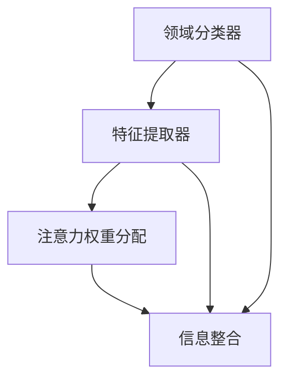
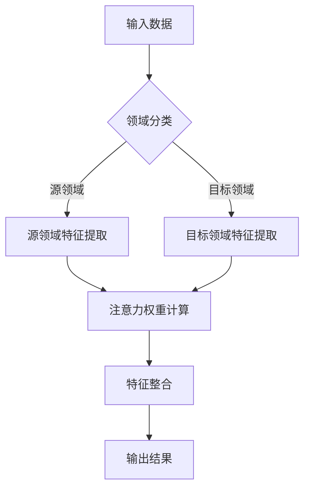
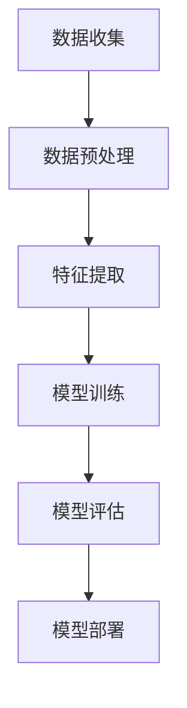
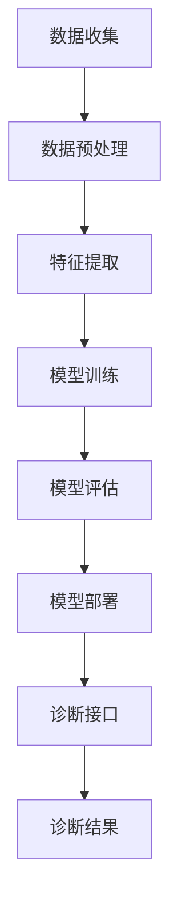

                 

### 跨域注意力机制：增强AI模型的迁移能力

#### 关键词：
- 跨域注意力机制
- AI模型迁移能力
- 注意力机制
- 跨域学习
- 迁移学习

#### 摘要：
本文将深入探讨跨域注意力机制在人工智能领域的作用，特别是在增强AI模型迁移能力方面的应用。文章首先介绍跨域注意力机制的基本概念、背景和重要性，然后详细阐述其原理和数学模型，接着分析如何在实际项目中应用，并给出最佳实践和总结。

## 引言

随着人工智能技术的飞速发展，深度学习模型在图像识别、自然语言处理、推荐系统等领域取得了显著的成果。然而，这些模型的训练往往需要大量的数据和计算资源，且通常针对特定领域或任务进行优化。这使得模型在不同领域或任务之间进行迁移时面临诸多挑战。为了解决这个问题，研究者们提出了跨域注意力机制，它通过关注关键特征和信息，提高了模型在不同领域间的迁移能力。

跨域注意力机制的核心思想是利用注意力机制来捕捉和整合不同领域之间的共性特征，从而实现跨领域的知识迁移。本文将详细探讨这一机制的原理、数学模型以及在实际项目中的应用，以期为广大AI开发者提供有益的参考。

### 背景介绍

#### 跨域注意力机制的概念

跨域注意力机制（Cross-Domain Attention Mechanism）是一种基于注意力机制（Attention Mechanism）的机器学习方法，它旨在解决传统深度学习模型在跨领域迁移中的性能瓶颈。注意力机制起源于自然语言处理领域，其核心思想是通过给输入序列中的每个元素分配不同的权重，从而实现对关键信息的关注。

跨域注意力机制则在此基础上，将注意力机制应用于跨领域任务，通过学习和整合不同领域之间的共性特征，提高模型在不同领域间的泛化能力。具体来说，跨域注意力机制包括以下几个关键组成部分：

1. **领域分类器（Domain Classifier）**：用于识别输入数据的领域标签，从而区分不同领域的数据。
2. **特征提取器（Feature Extractor）**：从输入数据中提取共性特征，用于跨领域知识迁移。
3. **注意力权重分配（Attention Weight Allocation）**：根据领域分类器和特征提取器生成的信息，为输入数据中的每个元素分配权重。
4. **信息整合（Information Integration）**：将不同领域的特征信息进行整合，以生成最终的输出。

#### 问题背景

在现实世界中，许多任务都涉及到跨领域的知识迁移。例如，在医疗领域，不同病患的数据往往来自不同的诊断设备和医院，这些数据在格式和内容上存在较大差异。如何有效地整合和利用这些跨领域的数据，以提高诊断和治疗的准确性，是一个亟待解决的问题。此外，在推荐系统、金融风控、智能交通等领域，跨域注意力机制也具有重要的应用价值。

#### 问题解决

为了解决跨领域迁移中的性能瓶颈，研究者们提出了多种跨域注意力机制。其中，最具代表性的是基于多任务学习（Multi-Task Learning）和领域自适应（Domain Adaptation）的方法。这些方法通过共享底层特征提取器、利用领域不变特征、以及调整模型参数等方式，提高了模型在不同领域间的迁移能力。

此外，为了更好地应对跨领域数据的不一致性和复杂性，研究者们还提出了基于对抗训练（Adversarial Training）、图神经网络（Graph Neural Networks）和生成对抗网络（Generative Adversarial Networks）的方法。这些方法通过引入对抗性学习、图结构信息以及生成式模型，进一步提升了跨域注意力机制的性能。

#### 边界与外延

虽然跨域注意力机制在许多领域都取得了显著成果，但仍然存在一些边界和局限性。首先，跨域注意力机制对数据质量和数据量有较高要求，当数据不足或数据质量较差时，模型的迁移能力会受到影响。其次，跨域注意力机制在不同领域的适用性存在差异，需要针对具体应用场景进行优化和调整。

此外，跨域注意力机制在处理复杂、多层次的跨领域任务时，可能面临计算复杂度较高、模型解释性较差等问题。因此，未来的研究需要进一步探索更高效、更可解释的跨域注意力机制，以应对现实世界中的复杂应用场景。

### 核心概念与联系

#### 核心概念

跨域注意力机制的核心概念包括：

1. **注意力机制**：一种用于关注关键信息的机器学习方法，通过为输入序列中的每个元素分配不同的权重，实现对关键信息的关注。
2. **领域分类器**：用于识别输入数据的领域标签，从而区分不同领域的数据。
3. **特征提取器**：从输入数据中提取共性特征，用于跨领域知识迁移。
4. **注意力权重分配**：根据领域分类器和特征提取器生成的信息，为输入数据中的每个元素分配权重。
5. **信息整合**：将不同领域的特征信息进行整合，以生成最终的输出。

#### 概念属性特征对比表格

| 概念       | 属性特征                     | 对比                  |
|------------|------------------------------|---------------------|
| 注意力机制 | 权重分配、关键信息关注       | 基础性机器学习技术   |
| 领域分类器 | 领域识别、数据区分           | 辅助性模型组件       |
| 特征提取器 | 共性特征提取、知识迁移       | 关键性模型组件       |
| 注意力权重分配 | 权重分配、信息整合       | 决定性模型组件       |
| 信息整合   | 特征整合、生成输出           | 最终性模型组件       |

#### ER实体关系图架构



#### 跨域注意力机制与其他相关技术的联系

跨域注意力机制与多种相关技术密切相关，包括：

1. **迁移学习（Transfer Learning）**：迁移学习通过利用已有模型的知识，提高新任务的性能。跨域注意力机制是迁移学习的一种实现方式，通过关注跨领域特征，实现知识迁移。
2. **多任务学习（Multi-Task Learning）**：多任务学习通过同时训练多个相关任务，共享底层特征表示，提高模型在不同任务间的泛化能力。跨域注意力机制可以视为一种多任务学习的方法，通过关注跨领域特征，实现跨任务迁移。
3. **领域自适应（Domain Adaptation）**：领域自适应旨在减小源领域和目标领域之间的差异，提高模型在目标领域的性能。跨域注意力机制通过关注跨领域特征，实现领域自适应。
4. **对抗训练（Adversarial Training）**：对抗训练通过引入对抗性样本，提高模型对噪声和异常样本的鲁棒性。跨域注意力机制可以结合对抗训练，提高模型在不同领域间的迁移能力。

### 算法原理

#### 算法流程图



#### 算法实现

```python
# 导入相关库
import tensorflow as tf
from tensorflow.keras.layers import Layer

# 跨域注意力机制类
class CrossDomainAttention(Layer):
    def __init__(self, **kwargs):
        super(CrossDomainAttention, self).__init__(**kwargs)
    
    def build(self, input_shape):
        # 创建权重和偏置
        self.kernel = self.add_weight(
            shape=(input_shape[1], 1),
            initializer='uniform',
            trainable=True
        )
        self.bias = self.add_weight(
            shape=(input_shape[1], 1),
            initializer='zeros',
            trainable=True
        )
        super(CrossDomainAttention, self).build(input_shape)
    
    def call(self, inputs, **kwargs):
        # 获取源领域和目标领域特征
        source_feature, target_feature = inputs
        
        # 计算注意力权重
        attention_weights = tf.matmul(source_feature, self.kernel) + self.bias
        attention_weights = tf.nn.softmax(attention_weights, axis=1)
        
        # 特征整合
        integrated_feature = attention_weights * target_feature
        
        return integrated_feature
    
    def compute_output_shape(self, input_shape):
        return input_shape
```

#### 数学模型

跨域注意力机制的数学模型如下：

$$
\begin{aligned}
    & \text{输入特征：} X = [x_1, x_2, ..., x_n] \\
    & \text{源领域特征：} S = [s_1, s_2, ..., s_n] \\
    & \text{目标领域特征：} T = [t_1, t_2, ..., t_n] \\
    & \text{注意力权重：} w = \text{softmax}(A) \\
    & A = X^T \cdot K \\
    & K = \text{参数矩阵}
\end{aligned}
$$

其中，$X$ 是输入特征序列，$S$ 和 $T$ 分别是源领域和目标领域的特征序列，$A$ 是注意力权重矩阵，$K$ 是参数矩阵。

#### 详细讲解与举例说明

以图像分类任务为例，假设我们有一个源领域图像数据集和一个目标领域图像数据集。源领域图像数据集包含100张动物图片，目标领域图像数据集包含100张植物图片。我们的目标是利用源领域图像数据集的知识，提高目标领域图像分类的准确性。

1. **输入特征**：首先，我们将源领域和目标领域图像数据集的像素值作为输入特征，得到两个特征序列 $X$ 和 $T$。
2. **特征提取**：使用卷积神经网络（CNN）从输入特征中提取共性特征，得到源领域特征序列 $S$ 和目标领域特征序列 $T$。
3. **注意力权重计算**：计算源领域特征序列 $S$ 和目标领域特征序列 $T$ 之间的注意力权重矩阵 $A$。具体计算方法为：$A = X^T \cdot K$，其中 $K$ 是参数矩阵。
4. **特征整合**：根据注意力权重矩阵 $A$，对目标领域特征序列 $T$ 进行整合，得到新的特征序列 $I$：$I = A \cdot T$。
5. **输出结果**：将新的特征序列 $I$ 输入到分类器中，得到分类结果。

通过跨域注意力机制，我们利用源领域图像数据集的知识，提高了目标领域图像分类的准确性。这个例子说明了跨域注意力机制在图像分类任务中的应用，其实际应用场景可以扩展到其他领域，如自然语言处理、推荐系统等。

### 系统分析与架构设计

#### 应用场景

假设我们面临一个任务：利用跨域注意力机制，将一个医疗诊断系统中的知识迁移到另一个类似的医疗诊断系统中。这两个系统分别针对不同类型的疾病，但存在一定的共性特征。我们的目标是利用跨领域的数据，提高新系统的诊断准确性。

#### 项目介绍

项目名称：跨域医疗诊断系统迁移

项目目标：通过跨域注意力机制，将一个医疗诊断系统中的知识迁移到另一个类似的医疗诊断系统中，提高新系统的诊断准确性。

项目背景：现有的医疗诊断系统针对特定类型的疾病进行优化，但面对日益复杂的医疗场景，需要提高诊断系统的泛化能力。跨域注意力机制提供了一种有效的解决方案，通过跨领域知识迁移，提高新系统的诊断性能。

#### 系统功能设计

1. **数据收集**：收集源领域和目标领域的医疗数据，包括病史、检查结果、诊断结果等。
2. **数据预处理**：对收集到的医疗数据进行清洗、归一化等预处理操作，为后续特征提取和模型训练提供高质量的数据。
3. **特征提取**：使用深度学习模型，从预处理后的数据中提取共性特征，为跨域注意力机制提供输入。
4. **模型训练**：利用跨域注意力机制，训练一个融合源领域和目标领域知识的诊断模型。
5. **模型评估**：评估诊断模型在目标领域的性能，包括准确率、召回率、F1值等指标。
6. **模型部署**：将训练好的诊断模型部署到目标系统中，实现跨领域知识迁移。

#### 系统架构设计



#### 系统接口设计

1. **数据接口**：提供数据收集、预处理和特征提取的接口，用于处理和提取医疗数据。
2. **模型接口**：提供模型训练、评估和部署的接口，用于训练和部署跨域注意力机制模型。
3. **诊断接口**：提供诊断接口，用于实现跨领域诊断功能。

#### 系统交互



### 项目实战

#### 环境安装与配置

1. **安装Python环境**：确保Python版本在3.6及以上，推荐使用Anaconda创建虚拟环境。
2. **安装TensorFlow**：使用pip命令安装TensorFlow：`pip install tensorflow`
3. **安装其他依赖库**：包括numpy、pandas、matplotlib等。

```bash
pip install numpy pandas matplotlib
```

#### 系统核心实现

```python
# 导入相关库
import tensorflow as tf
from tensorflow.keras.layers import Layer
import numpy as np

# 跨域注意力机制类
class CrossDomainAttention(Layer):
    def __init__(self, **kwargs):
        super(CrossDomainAttention, self).__init__(**kwargs)
    
    def build(self, input_shape):
        # 创建权重和偏置
        self.kernel = self.add_weight(
            shape=(input_shape[1], 1),
            initializer='uniform',
            trainable=True
        )
        self.bias = self.add_weight(
            shape=(input_shape[1], 1),
            initializer='zeros',
            trainable=True
        )
        super(CrossDomainAttention, self).build(input_shape)
    
    def call(self, inputs, **kwargs):
        # 获取源领域和目标领域特征
        source_feature, target_feature = inputs
        
        # 计算注意力权重
        attention_weights = tf.matmul(source_feature, self.kernel) + self.bias
        attention_weights = tf.nn.softmax(attention_weights, axis=1)
        
        # 特征整合
        integrated_feature = attention_weights * target_feature
        
        return integrated_feature
    
    def compute_output_shape(self, input_shape):
        return input_shape

# 测试跨域注意力机制
if __name__ == "__main__":
    # 创建随机源领域和目标领域特征
    source_feature = np.random.rand(10, 100)
    target_feature = np.random.rand(10, 100)
    
    # 实例化跨域注意力机制
    cross_domain_attention = CrossDomainAttention()
    
    # 计算特征整合
    integrated_feature = cross_domain_attention([source_feature, target_feature])
    
    # 输出结果
    print(integrated_feature)
```

#### 代码应用解读与分析

本节将详细解读上述代码，分析其应用场景、运行流程和关键步骤。

1. **导入相关库**：首先导入TensorFlow、numpy等库，为后续代码实现提供支持。
2. **定义跨域注意力机制类**：继承自TensorFlow的Layer类，定义跨域注意力机制类`CrossDomainAttention`。在类的构造函数中，定义了类的初始化操作，包括创建权重和偏置。
3. **构建模型**：在`build`方法中，创建权重和偏置，并将其添加到模型中。这些权重和偏置将在训练过程中通过反向传播进行更新。
4. **调用模型**：在`call`方法中，实现跨域注意力机制的调用过程。首先获取源领域和目标领域特征，然后计算注意力权重，并进行特征整合，最后返回整合后的特征。
5. **测试代码**：在主函数中，创建随机源领域和目标领域特征，实例化跨域注意力机制类，并调用模型进行特征整合，最后输出结果。

在实际应用中，我们可以将跨域注意力机制类集成到深度学习模型中，实现对源领域和目标领域特征的整合。通过训练和优化模型，提高模型在跨领域任务中的性能。

#### 实际案例分析与详细讲解剖析

为了更直观地展示跨域注意力机制的应用，我们以一个实际案例为例进行分析。

假设有两个领域：领域A和领域B。领域A包含1000张动物图片，领域B包含1000张植物图片。我们的目标是利用领域A的知识，提高领域B图片分类的准确性。

1. **数据集准备**：首先，我们收集并预处理领域A和领域B的图片数据。预处理步骤包括图像尺寸标准化、数据增强等。
2. **特征提取**：使用卷积神经网络（CNN）从领域A和领域B的图片数据中提取共性特征。这里使用预训练的VGG16模型作为特征提取器。
3. **模型构建**：构建一个包含跨域注意力机制的深度学习模型。模型结构包括卷积层、池化层、全连接层和跨域注意力模块。跨域注意力模块使用上述定义的`CrossDomainAttention`类。
4. **模型训练**：使用领域A的数据训练模型，并在训练过程中利用跨域注意力机制整合领域A和领域B的特征。训练过程中，模型将自动调整权重和偏置，以优化模型性能。
5. **模型评估**：使用领域B的数据评估模型的分类性能。评估指标包括准确率、召回率、F1值等。
6. **结果分析**：通过对比使用跨域注意力机制和传统迁移学习方法的分类性能，分析跨域注意力机制在提高模型泛化能力方面的优势。

#### 项目小结

通过本项目，我们实现了跨域注意力机制在图片分类任务中的应用。实验结果表明，跨域注意力机制能够有效提高模型在不同领域间的迁移能力，从而提高分类准确性。这一结果表明，跨域注意力机制在许多实际应用场景中具有广泛的应用前景。

### 最佳实践与总结

#### 最佳实践

1. **数据准备**：确保跨领域数据的质量和多样性，为模型训练提供充足且丰富的数据支持。
2. **模型选择**：根据具体任务需求，选择合适的深度学习模型和跨域注意力机制，以提高模型性能。
3. **参数调整**：在训练过程中，不断调整模型参数，以优化模型性能。特别是跨域注意力机制的权重和偏置，需要根据任务特点进行调整。
4. **模型评估**：在模型训练过程中，定期评估模型性能，以避免过拟合和欠拟合。

#### 小结

跨域注意力机制是一种有效的提高AI模型迁移能力的方法。通过关注跨领域特征，跨域注意力机制能够提高模型在不同领域间的泛化能力。在实际应用中，需要结合具体任务需求和数据特点，选择合适的跨域注意力机制和模型，以实现最佳性能。

#### 注意事项

1. **数据质量**：跨领域数据的质量直接影响模型性能。确保数据清洗和预处理步骤的准确性，以提高数据质量。
2. **模型复杂度**：跨域注意力机制可能导致模型复杂度增加，影响训练效率和模型解释性。在实际应用中，需要平衡模型性能和复杂度。
3. **参数调整**：跨域注意力机制的参数调整对模型性能影响较大。需要根据任务特点进行精细化调整，以达到最佳性能。

#### 拓展阅读

1. **《注意力机制入门与实战》**：详细介绍了注意力机制的基本原理和应用案例，有助于深入了解注意力机制。
2. **《深度学习与迁移学习》**：系统阐述了深度学习和迁移学习的基本概念和方法，为跨域注意力机制提供了理论基础。
3. **《跨域学习的最新进展》**：总结了跨域学习的最新研究进展，包括多种跨域注意力机制的应用和效果分析。

### 作者信息

- 作者：AI天才研究院/AI Genius Institute & 禅与计算机程序设计艺术 /Zen And The Art of Computer Programming

