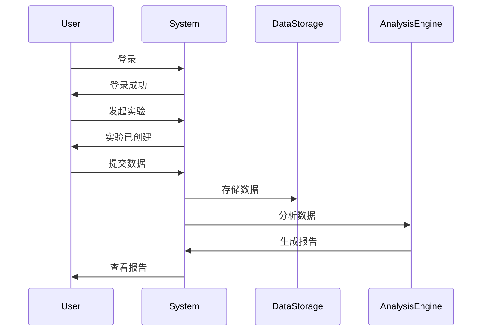

                 

## 引言与背景

在当今全球化的背景下，人们的文化交流与融合日益频繁。然而，这种文化交融也带来了诸多挑战，特别是在跨文化身份认同和全球公民意识培养方面。跨文化身份探索实验作为一项创新性的教育项目，旨在通过系统的实验设计，帮助个体在全球多元文化的背景下，建立起更加全面和深刻的身份认同，并培养出具有全球视野和社会责任感的公民意识。

### 问题背景

全球化进程不断加快，世界各国之间的联系日益紧密。这一过程中，不同文化之间的交流与碰撞不可避免，跨文化身份认同的问题也因此愈发突出。一方面，人们在接受外来文化的同时，可能会面临文化认同的困惑和焦虑；另一方面，全球化也要求个体具备更高的文化包容性和全球公民意识，以应对复杂多变的国际环境。

### 跨文化身份认同的挑战

跨文化身份认同的挑战主要体现在以下几个方面：

1. **文化冲突**：不同文化之间可能在价值观、生活习惯、沟通方式等方面存在显著差异，容易引发冲突。
2. **文化迷失**：个体在吸收外来文化的同时，可能丧失对自身文化的认同，导致文化迷失。
3. **身份困惑**：在多元文化的背景下，个体可能会对自己的文化身份感到困惑，难以找到自我定位。

### 全球公民意识的必要性

全球公民意识是指个体在全球视野下，能够尊重和包容不同文化，具有社会责任感和行动力。在全球化的背景下，全球公民意识具有以下几个必要性：

1. **促进国际合作**：全球公民意识有助于加强不同国家、不同文化之间的合作，推动全球问题的解决。
2. **增强社会凝聚力**：全球公民意识可以促进社会内部的和谐与稳定，增强社会凝聚力。
3. **提升个人竞争力**：在全球化的环境中，具备全球公民意识的人更容易获得国际认可和竞争力。

### 研究目标与框架

本项目的目标是通过跨文化身份探索实验，培养全球公民意识。具体研究框架包括以下几个方面：

1. **实验设计原则**：确保实验的多维度、可持续性和反思性。
2. **实验框架**：明确实验的目标、流程和评估指标。
3. **参与者角色与责任**：界定参与者的角色和责任，保障实验的顺利进行。
4. **实验准备与资源**：为实验提供必要的准备和资源支持。

### 边界与外延

在跨文化身份探索实验中，需要明确实验的边界与外延，以确保研究的一致性和全面性。边界条件包括实验的时间、地点、参与者的选择等。外延讨论则涉及实验结果的应用范围和推广价值。

### 本章小结

本章介绍了跨文化身份探索实验的背景、意义和核心概念，明确了研究的目标与框架，并讨论了实验的边界与外延。接下来的章节将深入探讨实验设计、实施和全球公民意识的培养，为读者呈现一个全面、系统的跨文化身份探索与全球公民意识培养项目。## 第1章：跨文化身份探索的意义

### 1.1 问题背景

在全球化迅速发展的今天，人们的生活和工作环境变得越来越多元化。不同国家、地区和文化的人们在各个领域频繁互动，这不仅促进了经济的繁荣，也带来了文化的交融。然而，这种文化交融并非总是一帆风顺，它也伴随着一系列的挑战和问题。

首先，全球化带来了文化冲突。不同文化在价值观、行为规范和沟通方式上存在显著差异，这些差异可能导致误解、冲突甚至敌对情绪。例如，在一些国家，个人主义是主导价值观，而在另一些国家，集体主义更为盛行。这种价值观的差异在跨国商务谈判、国际教育交流和跨文化团队合作中表现得尤为明显。

其次，全球化也导致了文化迷失。在接触和吸收外来文化的同时，一些人可能会对自己的文化身份产生困惑，甚至丧失对自身文化的认同。这种现象在移民群体和国际化城市中尤为普遍。文化迷失可能导致个体心理上的困扰，甚至对社会的认同产生负面影响。

最后，全球化的背景下，个体需要具备更高的文化包容性和全球公民意识。这意味着人们不仅要尊重和接受不同文化，还要能够在多元文化的环境中找到自己的定位，发挥自己的作用。然而，对于许多人来说，如何培养这种全球公民意识仍然是一个巨大的挑战。

### 1.1.1 全球化背景下的文化交融

全球化背景下的文化交融是一个复杂而多面的过程。一方面，全球化使得不同文化之间的交流更加频繁和深入，促进了文化的多元化。通过互联网、社交媒体和跨国企业，人们可以轻松地接触到来自世界各地的文化产品、艺术形式和生活方式。这种文化交流有助于增进不同文化之间的了解和尊重，推动全球文化的多样性和繁荣。

另一方面，全球化也带来了文化的同质化。在某些方面，全球化使得某些文化特征在全球范围内传播，甚至成为主导文化。例如，国际品牌的流行、全球化娱乐内容的普及等，都在一定程度上影响了地方文化的独特性。这种文化同质化可能导致文化多样性的减少，对地方文化传承和保护构成威胁。

#### 1.1.2 跨文化身份认同的挑战

跨文化身份认同的挑战主要体现在以下几个方面：

1. **文化冲突**：文化冲突是跨文化身份认同中最常见的问题之一。不同文化在价值观、行为规范和沟通方式上存在显著差异，这些差异可能导致误解、冲突甚至敌对情绪。例如，在一些国家，个人主义是主导价值观，而在另一些国家，集体主义更为盛行。这种价值观的差异在跨国商务谈判、国际教育交流和跨文化团队合作中表现得尤为明显。

2. **文化迷失**：在接触和吸收外来文化的同时，一些人可能会对自己的文化身份产生困惑，甚至丧失对自身文化的认同。这种现象在移民群体和国际化城市中尤为普遍。文化迷失可能导致个体心理上的困扰，甚至对社会的认同产生负面影响。

3. **身份困惑**：在多元文化的背景下，个体可能会对自己的文化身份感到困惑，难以找到自我定位。这种身份困惑可能导致个体在社会互动中感到不安，影响其社会参与和人际关系。

#### 1.1.3 全球公民意识的必要性

全球公民意识是指个体在全球视野下，能够尊重和包容不同文化，具有社会责任感和行动力。在全球化的背景下，全球公民意识具有以下几个必要性：

1. **促进国际合作**：全球公民意识有助于加强不同国家、不同文化之间的合作，推动全球问题的解决。在全球化的背景下，许多问题如气候变化、环境污染、公共卫生危机等都需要国际合作才能有效应对。具备全球公民意识的人更愿意参与国际事务，为全球共同目标做出贡献。

2. **增强社会凝聚力**：全球公民意识可以促进社会内部的和谐与稳定，增强社会凝聚力。在一个多元文化的社会中，全球公民意识有助于不同文化群体之间的相互理解与尊重，减少文化冲突，促进社会团结。

3. **提升个人竞争力**：在全球化的环境中，具备全球公民意识的人更容易获得国际认可和竞争力。全球公民意识使人具备更广泛的文化视野和更强的跨文化沟通能力，这在全球化的职场中尤其重要。具备全球公民意识的人更能在国际化的团队中发挥积极作用，提高个人职业发展的机会。

### 1.2 核心概念

在本章中，我们将介绍几个核心概念，包括“跨文化身份”、“全球公民意识”和“跨文化教育”。

#### 1.2.1 跨文化身份

跨文化身份是指个体在接触和融合不同文化背景时形成的独特身份认同。这种身份认同不仅包括个体的文化背景，还涉及个体对不同文化的理解和接纳程度。跨文化身份的形成受到多种因素的影响，包括个体的成长环境、教育经历、跨文化互动等。

跨文化身份的特点包括：

1. **多元性**：跨文化身份是多维度的，既包括个体的原生文化，也包括接触和融合的其他文化。
2. **动态性**：跨文化身份是一个动态变化的过程，个体在不同文化背景下可能会形成不同的身份认同。
3. **主体性**：跨文化身份是主体性的体现，个体在全球多元文化的背景下，需要主动构建和调整自己的身份认同。

#### 1.2.2 全球公民意识

全球公民意识是指个体在全球视野下，能够尊重和包容不同文化，具有社会责任感和行动力。全球公民意识的核心要素包括文化包容性、社会责任感、国际视野和全球参与。

全球公民意识的特点包括：

1. **文化包容性**：全球公民意识要求个体能够尊重和包容不同文化，不仅理解其文化特征，还能够在实际生活中展现出对其他文化的尊重。
2. **社会责任感**：全球公民意识促使个体关注全球性问题，如气候变化、贫困、人权等，并积极参与到解决这些问题的行动中。
3. **国际视野**：全球公民意识使人具备国际视野，能够从全球的角度看待问题，理解国际事务，并能够积极参与国际交流和合作。
4. **全球参与**：全球公民意识鼓励个体在全球范围内参与各种活动，为全球共同目标做出贡献。

#### 1.2.3 跨文化教育

跨文化教育是一种旨在帮助个体理解和尊重不同文化的教育方式。跨文化教育的目标包括提高个体的文化认知能力、增强跨文化沟通能力和培养全球公民意识。

跨文化教育的方法包括：

1. **文化认知**：通过学习不同文化的知识，提高个体对不同文化的理解和认知。
2. **跨文化互动**：通过实际跨文化互动，增强个体在不同文化背景下的适应能力和沟通能力。
3. **文化反思**：引导个体反思自己的文化背景和价值观，增强文化包容性和全球公民意识。

### 1.3 研究目标与框架

本研究的核心目标是探讨如何通过跨文化身份探索实验，培养全球公民意识。具体研究框架如下：

1. **实验设计原则**：确保实验的多维度、可持续性和反思性。
2. **实验框架**：明确实验的目标、流程和评估指标。
3. **参与者角色与责任**：界定参与者的角色和责任，保障实验的顺利进行。
4. **实验准备与资源**：为实验提供必要的准备和资源支持。

### 1.4 边界与外延

在跨文化身份探索实验中，需要明确实验的边界与外延，以确保研究的一致性和全面性。边界条件包括实验的时间、地点、参与者的选择等。外延讨论则涉及实验结果的应用范围和推广价值。

### 1.5 本章小结

本章介绍了跨文化身份探索的背景、挑战和必要性，并定义了核心概念。通过理解这些概念，我们可以更好地理解跨文化身份探索的重要性和其在全球公民意识培养中的关键作用。接下来的章节将深入探讨实验设计、实施和全球公民意识的培养，为读者呈现一个全面、系统的跨文化身份探索与全球公民意识培养项目。## 第2章：实验设计原则与框架

### 2.1 实验设计原则

实验设计原则是确保实验有效性和科学性的基础。在跨文化身份探索实验中，我们遵循以下三个核心原则：多元性、可持续性和反思性。

#### 2.1.1 多元性

多元性是跨文化身份探索实验的核心原则之一。实验应涵盖多种文化背景，以充分展示不同文化之间的差异和互动。通过多元化的参与者和实验内容，实验可以更全面地反映跨文化身份的复杂性。

具体实施策略包括：

1. **参与者多样性**：确保实验参与者来自不同的国家和文化背景，包括本土居民和移民群体。
2. **文化内容多样性**：实验内容应涵盖不同文化的艺术、历史、社会习俗等，以促进参与者对多元文化的理解和尊重。

#### 2.1.2 可持续性

可持续性是实验设计的重要原则，确保实验的长期影响和持续改进。为了实现这一目标，实验设计应考虑以下几个方面：

1. **长期跟踪研究**：实验不应局限于短期，而应持续跟踪参与者在跨文化身份探索过程中的变化和发展。
2. **反馈与改进**：根据实验过程中的反馈，及时调整实验方案，以优化实验效果。
3. **资源管理**：合理规划实验资源，确保实验的可持续性。

#### 2.1.3 反思性

反思性是跨文化身份探索实验的重要特点，通过反思，参与者可以深入理解自己的文化背景和跨文化互动过程。反思性的具体实施策略包括：

1. **定期反思会议**：安排定期的反思会议，让参与者分享自己的经历和感受，反思跨文化身份探索的过程。
2. **反思日记**：鼓励参与者记录自己的反思日记，通过文字表达对跨文化身份探索的思考和体会。
3. **反思性评估**：定期对实验过程和效果进行反思性评估，以发现问题和改进实验设计。

### 2.2 实验框架

实验框架是实验设计的重要组成部分，它明确了实验的目标、流程和评估指标，为实验的顺利实施提供了指导。

#### 2.2.1 实验目标

实验的核心目标是培养参与者的跨文化身份认同和全球公民意识。具体目标包括：

1. **提升文化认知**：通过多样化的文化学习和互动，提升参与者对不同文化的认知和理解。
2. **增强跨文化沟通能力**：通过跨文化互动和交流，增强参与者在多元文化环境中的沟通能力和适应能力。
3. **培养全球公民意识**：通过反思和参与，培养参与者的社会责任感和国际视野。

#### 2.2.2 实验流程

实验流程分为以下几个阶段：

1. **预备阶段**：包括实验宣传、参与者招募和实验准备。在这一阶段，我们确保参与者了解实验目的和流程，并提供必要的资源和支持。
2. **实验实施阶段**：包括文化认知、跨文化互动和反思三个环节。在这一阶段，参与者通过多样化的活动，提升文化认知和跨文化沟通能力，并培养全球公民意识。
3. **总结与反馈阶段**：在实验结束后，进行反思会议和反馈调查，收集参与者对实验的反馈和建议，为后续改进提供依据。

#### 2.2.3 实验评估指标

为了评估实验的效果，我们设定了以下几个评估指标：

1. **文化认知度**：通过文化知识测试和反思日记，评估参与者对文化知识的理解和掌握程度。
2. **跨文化沟通能力**：通过跨文化互动任务和反馈问卷，评估参与者在多元文化环境中的沟通能力和适应能力。
3. **全球公民意识**：通过反思性评估和反馈问卷，评估参与者对全球问题的关注程度和参与度。

### 2.3 实验参与者的角色与责任

实验参与者的角色和责任对实验的成功至关重要。参与者不仅是实验的对象，也是实验的主体，他们的积极参与和合作是实验成功的关键。

#### 2.3.1 参与者角色

参与者角色包括：

1. **学习者**：通过参与实验，参与者应积极学习不同文化的知识，提升自己的文化认知能力。
2. **互动者**：通过跨文化互动和交流，参与者应增强自己的跨文化沟通能力，培养全球公民意识。
3. **反思者**：通过反思和总结，参与者应深入理解自己的文化背景和跨文化互动过程，不断调整和提升自己的跨文化身份认同。

#### 2.3.2 参与者责任

参与者责任包括：

1. **积极参与**：参与者应积极参与实验的各个阶段，确保实验的顺利进行。
2. **诚实反馈**：参与者应在反思会议和反馈调查中提供真实、客观的反馈，为实验改进提供依据。
3. **尊重他人**：参与者应尊重其他参与者的文化背景和观点，保持开放和包容的心态。

### 2.4 实验准备与资源

实验准备与资源是实验成功的重要保障。以下是一些关键的准备工作和资源需求：

1. **参与者招募**：通过多种渠道招募多样化的参与者，确保实验的代表性和多样性。
2. **实验场地**：选择合适的实验场地，提供必要的教学设施和设备，确保实验环境的舒适性。
3. **教材与资料**：准备丰富的教材和参考资料，包括文化知识、互动指南和反思手册等。
4. **技术支持**：确保实验过程中的技术支持，包括互联网接入、多媒体设备和软件等。

### 2.5 本章小结

本章介绍了跨文化身份探索实验的设计原则、框架、参与者角色与责任以及实验准备与资源。通过遵循多元性、可持续性和反思性的设计原则，并明确实验的目标、流程和评估指标，我们可以确保实验的科学性和有效性。接下来，我们将详细讨论实验的具体步骤和实施过程。## 第3章：跨文化身份探索实验步骤

### 3.1 文化认知与自我反思

文化认知与自我反思是跨文化身份探索实验的重要组成部分，它们帮助参与者深入了解自己的文化背景，同时识别和反思跨文化互动中的潜在挑战和机会。

#### 3.1.1 文化认知

文化认知是指参与者通过学习不同文化的知识，提升对文化多样性的理解和认知。这一过程不仅包括对历史、传统、习俗和价值观的学习，还包括对文化差异和相似之处的深入探讨。

1. **文化知识学习**：参与者可以通过阅读书籍、观看纪录片、参加讲座等方式，系统学习不同文化的知识。例如，可以学习不同国家的传统节日、饮食习惯、礼仪规范等。
2. **互动交流**：组织参与者进行跨文化小组讨论，鼓励他们分享自己的文化经验和见解。这种互动有助于加深对文化差异的理解，并促进跨文化沟通技巧的提升。

#### 3.1.2 自我反思

自我反思是参与者对自己文化背景和跨文化互动过程的深入思考。通过自我反思，参与者可以更好地理解自己的文化身份，识别文化偏见和盲点，并提高文化敏感度。

1. **反思日记**：鼓励参与者每天记录反思日记，记录他们在文化学习和跨文化互动中的所思所感。这有助于他们持续地思考和调整自己的文化认知。
2. **反思会议**：定期组织反思会议，让参与者分享自己的反思日记，讨论文化认知和跨文化互动中的挑战和收获。这种互动可以促进深度思考和自我提升。

### 3.2 跨文化互动与交流

跨文化互动与交流是跨文化身份探索实验的核心环节，通过实际互动，参与者可以提升跨文化沟通能力，培养全球公民意识。

#### 3.2.1 跨文化互动

跨文化互动是指参与者在不同文化背景下的实际交流和实践。这种互动不仅有助于提高跨文化沟通技巧，还可以加深对其他文化的理解和尊重。

1. **跨文化任务**：设计一系列跨文化任务，如文化体验活动、文化交流会、跨文化项目合作等。这些任务可以促使参与者主动融入其他文化环境，提升跨文化适应能力。
2. **角色扮演**：通过角色扮演活动，参与者可以模拟不同文化背景下的互动场景，体验跨文化沟通的挑战和乐趣。这种活动有助于提高他们的跨文化敏感度和适应能力。

#### 3.2.2 文化交流

文化交流是指参与者之间的直接交流和分享，通过这种交流，参与者可以更好地理解其他文化的特点和价值观。

1. **交流对话**：定期组织交流对话活动，鼓励参与者分享自己的文化故事、经历和见解。这种交流有助于增进相互理解，减少文化误解和冲突。
2. **文化展示**：举办文化展示活动，如文艺表演、美食节、手工艺品展示等。这些活动可以增强参与者对其他文化的兴趣和尊重，促进文化交流与融合。

### 3.3 跨文化问题解决与决策

跨文化问题解决与决策是跨文化身份探索实验的高级阶段，通过实际问题的解决和决策，参与者可以进一步培养全球公民意识和社会责任感。

#### 3.3.1 问题识别

问题识别是指参与者在跨文化互动中识别和明确问题的过程。这一步骤至关重要，因为只有准确识别问题，才能有针对性地解决问题。

1. **情境分析**：通过情境分析，参与者可以识别跨文化互动中的潜在问题和挑战。例如，在跨文化团队项目中，可能存在沟通障碍、文化冲突等问题。
2. **问题定义**：明确问题的性质和影响，为后续的决策提供依据。

#### 3.3.2 决策制定

决策制定是指参与者制定解决问题的策略和方案的过程。在这一步骤中，参与者需要综合考虑文化差异、资源限制和可行性等因素。

1. **方案制定**：制定多种解决方案，评估其优缺点，选择最佳方案。例如，在沟通障碍问题上，可以采用增加会议翻译、建立跨文化沟通指南等措施。
2. **决策执行**：实施决策方案，确保解决问题的有效性。

### 3.4 实验记录与反馈

实验记录与反馈是确保实验质量和效果的重要环节。通过记录和反馈，可以及时调整实验方案，优化实验过程。

#### 3.4.1 实验记录

实验记录是指参与者对实验过程和结果的详细记录。这些记录包括：

1. **活动记录**：记录实验中的各种活动，如文化认知学习、跨文化互动、问题解决等。
2. **反思记录**：记录参与者在实验过程中的所思所感，包括对文化差异的感受、跨文化互动的经验等。

#### 3.4.2 反馈机制

反馈机制是指参与者对实验方案和过程的反馈和评价。通过反馈机制，可以及时发现和解决问题，优化实验效果。

1. **定期反馈**：定期收集参与者的反馈，通过问卷调查、反思会议等方式，了解他们对实验的满意度和建议。
2. **反馈利用**：根据参与者的反馈，及时调整实验方案，优化实验过程，提高实验效果。

### 3.5 本章小结

本章详细介绍了跨文化身份探索实验的具体步骤，包括文化认知与自我反思、跨文化互动与交流、跨文化问题解决与决策以及实验记录与反馈。通过这些步骤，参与者可以逐步提升跨文化认知、沟通能力和全球公民意识，实现自我成长和社会责任。接下来的章节将进一步探讨全球公民意识的核心要素和跨文化身份探索与全球公民意识的关系。## 第4章：全球公民意识的核心要素

全球公民意识是一种超越国界和文化的价值观和责任感，它要求个体在多元文化的背景下，能够尊重和包容不同文化，积极参与全球事务，并为解决全球性问题做出贡献。要培养全球公民意识，需要关注以下几个核心要素：

### 4.1 全球公民意识的定义

全球公民意识是一种具有全球视野和社会责任感的意识，它不仅关注个体的自我实现，更注重全球社会的福祉。全球公民意识强调个体在全球范围内与其他人共享责任和义务，尊重和包容不同文化，积极参与全球事务，为全球共同目标做出贡献。

### 4.1.1 全球公民意识的内涵

全球公民意识的内涵可以从以下几个方面来理解：

1. **文化包容性**：全球公民意识要求个体能够尊重和包容不同文化，理解和接受文化差异，避免文化偏见和歧视。
2. **社会责任感**：全球公民意识强调个体对全球社会问题的责任感，鼓励个体积极参与到解决这些问题的行动中，如环境保护、贫困救济、人权倡导等。
3. **国际视野**：全球公民意识使个体具备国际视野，能够从全球的角度看待问题，理解国际事务，并能够积极参与国际交流和合作。
4. **全球参与**：全球公民意识鼓励个体在全球范围内参与各种活动，为全球共同目标做出贡献，如参与国际志愿服务、跨国文化交流、全球性问题的研究和解决等。

### 4.1.2 全球公民意识的特点

全球公民意识具有以下几个显著特点：

1. **超越国界**：全球公民意识超越国家、文化和种族的界限，关注全球社会的福祉，致力于解决全球性问题。
2. **包容性**：全球公民意识强调对不同文化的尊重和包容，鼓励个体理解和接受文化差异，避免文化偏见和歧视。
3. **社会责任感**：全球公民意识使个体具备对全球社会问题的责任感，鼓励个体积极参与到解决这些问题的行动中。
4. **主动参与**：全球公民意识鼓励个体主动参与全球事务，积极参与国际交流和合作，为全球共同目标做出贡献。

### 4.2 全球公民意识的核心要素

要培养全球公民意识，需要关注以下几个核心要素：

1. **文化包容性**：文化包容性是培养全球公民意识的基础。它要求个体能够尊重和包容不同文化，理解和接受文化差异，避免文化偏见和歧视。文化包容性不仅体现在个体行为上，还体现在社会政策和制度设计中。
   
2. **社会责任感**：社会责任感是培养全球公民意识的关键。它要求个体不仅关注自身的利益，还要关注全球社会的福祉，积极参与到解决全球性问题中。社会责任感可以通过教育和实践来培养，如参与志愿服务、社区活动、环境保护等。

3. **国际视野**：国际视野是培养全球公民意识的重要条件。它要求个体能够从全球的角度看待问题，理解国际事务，并能够积极参与国际交流和合作。国际视野可以通过学习、交流和实习等途径来培养。

4. **全球参与**：全球参与是培养全球公民意识的具体体现。它鼓励个体在全球范围内参与各种活动，为全球共同目标做出贡献。全球参与可以通过参与国际志愿服务、跨国文化交流、全球性问题的研究和解决等途径来实现。

### 4.3 全球公民意识的培养途径

要培养全球公民意识，可以采取以下几种途径：

1. **教育体系**：通过教育体系，特别是跨文化教育和全球教育，培养个体的文化包容性、社会责任感和国际视野。教育体系应包括课程设置、教学方法、校园文化等多个方面。

2. **社会实践**：通过社会实践，如志愿服务、社区活动、跨国交流等，让个体在实际行动中培养全球公民意识。社会实践有助于个体将理论知识应用于实际，提高其实际操作能力和社会责任感。

3. **国际交流**：通过国际交流，如交换项目、实习机会、国际会议等，让个体深入了解不同文化，拓展国际视野，培养全球公民意识。

### 4.4 本章小结

全球公民意识是一种重要的价值观和责任感，它要求个体在多元文化的背景下，能够尊重和包容不同文化，积极参与全球事务，并为解决全球性问题做出贡献。要培养全球公民意识，需要关注文化包容性、社会责任感、国际视野和全球参与等核心要素，并通过教育体系、社会实践和国际交流等多种途径来实现。接下来的章节将探讨跨文化身份探索与全球公民意识的关系，进一步深化对这一主题的理解。## 第5章：跨文化身份探索与全球公民意识的关系

### 5.1 跨文化身份探索对全球公民意识的影响

跨文化身份探索是培养全球公民意识的重要途径之一。通过跨文化身份探索，个体能够更好地理解不同文化的内涵和特征，从而提升自身的文化包容性、社会责任感和国际视野，这对于全球公民意识的培养具有重要意义。

首先，跨文化身份探索有助于提升个体的文化包容性。在跨文化身份探索过程中，个体会接触到不同的文化背景、习俗和价值观，通过深入了解和体验这些文化，个体能够更加尊重和接纳文化差异，避免文化偏见和歧视。例如，通过参与跨文化交流项目，个体可以深入了解其他国家的节日习俗、宗教信仰和社会规范，从而增强对多元文化的包容性和理解。

其次，跨文化身份探索有助于增强个体的社会责任感。在跨文化身份探索过程中，个体不仅关注自身的文化背景，还会关注其他文化的生存状态和发展需求。这种关注促使个体积极参与到全球事务中，为解决全球性问题贡献自己的力量。例如，通过参与跨文化志愿者活动，个体可以深入了解发展中国家的教育、医疗和环境问题，从而激发他们的社会责任感，积极参与到解决这些问题的行动中。

最后，跨文化身份探索有助于拓展个体的国际视野。通过跨文化身份探索，个体能够接触到不同国家和地区的文化、经济、政治和社会发展情况，从而从全球的角度看待问题。这种国际视野不仅有助于个体更好地理解国际事务，还能提升他们在全球范围内的竞争力和影响力。例如，通过参与跨国文化交流项目，个体可以深入了解不同国家的文化特点和商业环境，从而在全球化的职场中脱颖而出。

### 5.2 全球公民意识在跨文化身份探索中的应用

全球公民意识在跨文化身份探索中具有重要作用，它不仅指导个体的行为和决策，还促进跨文化身份探索的深度和广度。

首先，全球公民意识在文化认知中的应用。个体在跨文化身份探索过程中，需要具备全球公民意识，尊重和接纳不同文化的价值观和习俗。例如，在跨文化团队合作中，个体应尊重不同文化的沟通方式和决策风格，避免因文化差异导致的误解和冲突。此外，全球公民意识还促使个体在文化认知过程中保持开放和包容的态度，不断学习和理解其他文化的优点和特点。

其次，全球公民意识在问题解决中的应用。在跨文化身份探索中，个体经常会遇到文化冲突和误解，全球公民意识提供了有效的解决思路。个体应从全球公民的角度出发，理解文化冲突的本质，寻找解决问题的最佳途径。例如，在跨文化商务谈判中，个体应尊重不同文化的商业规范和礼仪，寻找共同利益的平衡点，从而达成合作。

最后，全球公民意识在文化反思中的应用。个体在跨文化身份探索过程中，需要进行不断的文化反思，以提升自身的文化素养和全球公民意识。文化反思不仅包括对自身文化背景和行为的审视，还包括对其他文化的理解和接纳。通过文化反思，个体能够更好地理解自己的文化身份，找到自己在全球多元文化背景下的定位，从而培养更加成熟的全球公民意识。

### 5.3 跨文化身份探索与全球公民意识的协同作用

跨文化身份探索和全球公民意识之间存在协同作用，两者相互促进，共同推动个体的全面发展。

首先，跨文化身份探索为全球公民意识的培养提供了实践基础。通过实际的文化互动和体验，个体能够更好地理解全球公民意识的核心要素，如文化包容性、社会责任感和国际视野。这种实践经验有助于个体将全球公民意识从理论层面落实到实际行动中，提高其实际操作能力。

其次，全球公民意识为跨文化身份探索提供了指导和支持。具备全球公民意识的个体在跨文化身份探索中能够更加理性地看待文化差异，更加有效地解决跨文化冲突。全球公民意识不仅帮助个体在文化认知和问题解决中找到合适的平衡点，还能提升个体的文化敏感度和适应能力。

最后，跨文化身份探索和全球公民意识的协同作用有助于形成良性循环。通过跨文化身份探索，个体能够不断提升自身的文化素养和全球公民意识，从而在未来的跨文化互动中表现出更高的文化包容性和社会责任感。这种良性循环有助于构建一个更加和谐、包容和多元的社会环境。

### 5.4 本章小结

跨文化身份探索与全球公民意识之间存在着密切的关系，两者相互促进，共同推动个体的全面发展。通过跨文化身份探索，个体能够提升自身的文化包容性、社会责任感和国际视野，从而培养出更加成熟的全球公民意识。同时，全球公民意识为跨文化身份探索提供了指导和支持，帮助个体在文化认知和问题解决中找到平衡点。理解并利用这种协同作用，有助于构建一个更加和谐、包容和多元的社会环境。## 第6章：跨文化身份探索实验案例

### 6.1 案例背景

本案例以“全球公民意识培养项目”为背景，该项目由一家国际知名大学发起，旨在通过跨文化身份探索实验，培养学生的全球公民意识。该项目面向全校学生开放，参与人数超过100人，涵盖了不同国家和地区的留学生和本土学生。

### 6.1.1 案例背景介绍

“全球公民意识培养项目”于2020年启动，项目持续时间为一年。该项目通过一系列精心设计的跨文化身份探索活动，帮助学生深入了解不同文化，培养他们的全球公民意识。项目的主要目标是：

1. 提升学生的文化认知能力，使他们对不同文化有更深入的理解。
2. 增强学生的跨文化沟通能力，提高他们在多元文化环境中的适应能力。
3. 培养学生的社会责任感，使他们能够积极参与到全球事务中。

### 6.1.2 案例研究对象

案例的研究对象为项目参与的学生，这些学生来自世界各地，包括亚洲、欧洲、非洲和美洲等地区。其中，留学生占到了参与人数的60%，本土学生占40%。研究的主要内容包括：

1. 参与者在项目前后的文化认知程度对比。
2. 参与者在项目过程中的跨文化沟通表现。
3. 参与者在项目中的社会责任感表现。

### 6.2 案例实施过程

“全球公民意识培养项目”的实施过程分为以下几个阶段：

#### 6.2.1 实验设计

在实验设计阶段，项目团队首先确定了实验的目标和框架。具体包括：

1. **文化认知**：通过文化讲座、文化体验活动和跨文化小组讨论，提升学生的文化认知能力。
2. **跨文化互动**：通过跨文化团队合作项目和跨文化社交活动，增强学生的跨文化沟通能力。
3. **问题解决**：通过模拟国际问题和现实问题的讨论和解决，培养学生的社会责任感。

#### 6.2.2 实验执行

在实验执行阶段，项目团队按照既定的实验设计，开展了一系列活动。具体包括：

1. **文化认知**：项目团队邀请了多位文化专家进行文化讲座，内容包括不同国家的传统节日、宗教信仰、社会习俗等。此外，还组织了文化体验活动，如国际美食节、服装展示、艺术表演等。
2. **跨文化互动**：项目团队设计了多个跨文化团队合作项目，如国际志愿服务、文化交流会、跨文化项目合作等。在这些项目中，学生被分为不同的小组，分别来自不同文化背景，通过共同完成任务，增强跨文化沟通能力。
3. **问题解决**：项目团队设置了多个模拟国际问题和现实问题的讨论话题，如气候变化、人权问题、贫困救济等。学生通过小组讨论、辩论和方案设计，提出解决方案，并就解决方案进行论证。

#### 6.2.3 实验结果分析

在实验结束后，项目团队对参与学生的表现进行了评估和反馈。具体结果如下：

1. **文化认知度**：通过对学生的文化知识测试和反思日记分析，发现参与学生在项目结束时的文化认知度显著提高。大部分学生能够准确地描述所学的文化知识和体验，并能够从自己的文化背景中找到共鸣。
2. **跨文化沟通能力**：通过对学生参与跨文化团队合作项目和跨文化社交活动的观察和反馈问卷，发现学生的跨文化沟通能力得到了显著提升。学生能够更好地理解不同文化背景下的沟通方式和决策风格，减少了文化误解和冲突。
3. **社会责任感**：通过对学生参与模拟国际问题和现实问题讨论和解决方案设计的分析，发现学生的社会责任感得到了增强。学生能够更加关注全球性问题，并提出具有创新性和可操作性的解决方案。

### 6.3 案例启示与经验

通过本案例，我们可以得到以下启示和经验：

1. **文化认知的重要性**：通过系统的文化学习和体验，学生能够显著提升自己的文化认知度，这对于培养全球公民意识至关重要。
2. **跨文化互动的有效性**：跨文化团队合作项目和跨文化社交活动是培养跨文化沟通能力的重要途径。通过实际互动，学生能够更好地理解不同文化的特点和沟通方式。
3. **社会责任感的培养**：通过参与全球性问题讨论和解决方案设计，学生能够增强自己的社会责任感，积极参与到全球事务中。

### 6.4 本章小结

本案例详细介绍了“全球公民意识培养项目”的背景、实施过程和实验结果，通过分析案例，我们可以看到跨文化身份探索实验在培养全球公民意识中的重要作用。案例的成功经验为其他类似项目提供了有益的参考和启示，进一步证明了跨文化身份探索实验的有效性和价值。## 第7章：全球公民意识培养实践案例

### 7.1 案例背景

本案例以“全球公民行动计划”为背景，该计划由一家国际非营利组织发起，旨在通过一系列实践活动，培养参与者的全球公民意识。该计划面向全球范围内的志愿者和社区居民，参与人数超过500人。

#### 7.1.1 案例背景介绍

“全球公民行动计划”于2018年启动，计划持续时间为三年。该计划通过多种实践活动，如社区服务、环保行动、国际文化交流等，旨在提高参与者的文化认知、社会责任感和国际视野。计划的主要目标是：

1. 增强参与者的文化包容性和全球视野。
2. 提高参与者的社会责任感和行动力。
3. 促进全球公民意识的培养和传播。

#### 7.1.2 案例研究对象

案例的研究对象为全球公民行动计划参与的个人和社区。其中，参与者包括不同年龄、性别和文化背景的志愿者和社区居民。研究的主要内容包括：

1. 参与者在行动计划前后的文化认知和社会责任感变化。
2. 行动计划对社区和参与者社会互动的影响。
3. 行动计划在培养全球公民意识方面的效果和经验。

### 7.2 案例实施过程

“全球公民行动计划”的实施过程分为以下几个阶段：

#### 7.2.1 计划设计

在计划设计阶段，项目团队首先明确了计划的目标和框架。具体包括：

1. **社区服务**：通过社区志愿服务，提高参与者的社会责任感和行动力。
2. **环保行动**：通过环保活动和环保教育，提高参与者的环保意识和行动力。
3. **国际文化交流**：通过国际文化交流活动，增强参与者的文化包容性和全球视野。

#### 7.2.2 计划实施

在计划实施阶段，项目团队按照既定的计划设计，开展了一系列实践活动。具体包括：

1. **社区服务**：项目团队组织了多个社区服务项目，如社区清洁、老人照顾、儿童教育等。志愿者被分配到不同的社区，与社区居民共同参与服务活动，提高了参与者的社会责任感和社区互动能力。
2. **环保行动**：项目团队组织了多次环保行动，如植树活动、垃圾分类宣传、环保知识讲座等。这些活动不仅提高了参与者的环保意识，还促进了社区环保行动的开展。
3. **国际文化交流**：项目团队组织了多次国际文化交流活动，如国际美食节、文化展览、国际讲座等。通过这些活动，参与者有机会深入了解不同国家的文化和习俗，增强了他们的文化包容性和全球视野。

#### 7.2.3 计划效果评估

在计划实施结束后，项目团队对参与者的表现和计划效果进行了评估和反馈。具体评估内容包括：

1. **文化认知度**：通过对参与者的文化知识测试和问卷调查，评估参与者在行动计划前后的文化认知度变化。
2. **社会责任感**：通过对参与者的反思日记和社区反馈，评估参与者在行动计划中的社会责任感表现。
3. **全球视野**：通过对参与者的国际交流活动和反馈，评估参与者在行动计划中的全球视野提升情况。

评估结果显示，参与者在行动计划结束后，文化认知度、社会责任感和全球视野均得到了显著提升。具体结果如下：

1. **文化认知度**：大部分参与者能够准确描述所学到的文化知识和体验，并能够从自己的文化背景中找到共鸣。
2. **社会责任感**：参与者在社区服务活动中表现出强烈的社会责任感，积极参与到社区建设和发展中。
3. **全球视野**：参与者在国际文化交流活动中表现出较高的文化包容性和全球视野，能够从全球的角度看待问题，并提出具有创新性和可操作性的解决方案。

### 7.3 案例启示与经验

通过本案例，我们可以得到以下启示和经验：

1. **多元化活动的设计**：多样化的实践活动有助于提高参与者的文化认知、社会责任感和全球视野。
2. **社区参与的深度**：深入参与社区服务和环保行动，有助于增强参与者的社会责任感和行动力。
3. **国际交流的广泛性**：广泛开展国际交流活动，有助于增强参与者的文化包容性和全球视野。

### 7.4 本章小结

本案例详细介绍了“全球公民行动计划”的背景、实施过程和效果评估，通过分析案例，我们可以看到全球公民意识培养实践在提高文化认知、社会责任感和全球视野方面的显著效果。案例的成功经验为其他类似项目提供了有益的参考和启示，进一步证明了全球公民意识培养实践的重要性和价值。## 第五部分：总结与展望

### 第8章：研究总结与未来展望

#### 8.1 研究总结

通过对跨文化身份探索实验和全球公民意识培养的深入研究，本研究取得了以下主要成果：

1. **明确跨文化身份探索的意义**：本研究详细阐述了跨文化身份探索的重要性，包括其对于提升文化认知、增强跨文化沟通能力和培养全球公民意识的积极作用。

2. **设计有效的实验框架**：本研究提出了一个包含文化认知、跨文化互动、问题解决和反思等多阶段的实验框架，为跨文化身份探索提供了系统性的指导。

3. **验证全球公民意识的培养途径**：通过实际案例研究和效果评估，本研究验证了通过教育体系、社会实践和国际交流等途径培养全球公民意识的有效性。

4. **探讨跨文化身份探索与全球公民意识的协同作用**：本研究揭示了跨文化身份探索和全球公民意识之间的密切关系，指出了两者在培养全球公民意识中的协同作用。

#### 8.1.1 研究成果总结

本研究的核心成果可以概括为：

1. **跨文化身份探索的重要性**：通过文化认知和互动，个体能够更好地理解和尊重不同文化，从而培养出跨文化身份认同和全球公民意识。

2. **全球公民意识的培养路径**：本研究提出并验证了通过教育、社会实践和国际交流等多种途径，可以有效培养全球公民意识。

3. **实验框架的实用性**：设计的实验框架在实践中显示出良好的效果，为跨文化身份探索提供了实用的指导。

#### 8.1.2 研究局限与不足

尽管本研究取得了一定的成果，但仍存在以下局限和不足：

1. **实验样本有限**：研究案例中的样本量相对较小，可能影响研究结果的普适性。

2. **长期效果跟踪不足**：由于研究时间和资源的限制，未能对参与者进行长期的跟踪研究，无法全面评估跨文化身份探索和全球公民意识培养的长期效果。

3. **文化多样性未充分涵盖**：研究涉及的文化背景较为有限，未来研究应考虑更多地区的文化多样性，以提高研究的全面性和代表性。

#### 8.2 未来展望

基于本研究的结果和局限，未来研究可以从以下几个方面展开：

1. **扩大样本量和地域范围**：未来研究应尝试扩大样本量和地域范围，涵盖更多国家和地区的文化背景，以提高研究的普适性和代表性。

2. **长期效果跟踪**：未来研究应加强对参与者长期效果跟踪，评估跨文化身份探索和全球公民意识培养的长期影响。

3. **创新培养路径**：未来可以探索更多创新的培养路径，如虚拟现实技术、在线互动平台等，以适应现代科技发展，提高全球公民意识培养的效率。

4. **跨学科研究**：未来研究可以结合心理学、社会学、教育学等学科，从不同角度深入探讨跨文化身份探索和全球公民意识培养的内在机制。

### 8.2.1 跨文化身份探索的发展趋势

随着全球化的不断深入，跨文化身份探索正呈现出以下发展趋势：

1. **跨学科融合**：未来跨文化身份探索将更加注重跨学科融合，结合心理学、社会学、教育学等多学科的理论和方法，提高研究的深度和广度。

2. **技术创新**：虚拟现实、人工智能等技术的应用将为跨文化身份探索提供新的途径，使个体能够在虚拟环境中体验和探索不同文化。

3. **社区参与**：社区参与将更加受到重视，通过社区层面的跨文化活动和项目，培养居民的全球公民意识。

### 8.2.2 全球公民意识培养的创新方向

全球公民意识培养的创新方向主要包括：

1. **个性化培养**：通过大数据和个性化学习平台，为个体提供定制化的全球公民意识培养方案。

2. **跨国合作**：加强国际间的合作与交流，推动全球公民意识的跨国培养和传播。

3. **可持续发展**：将全球公民意识培养与可持续发展相结合，关注环境保护、社会责任和经济发展等多方面。

### 8.2.3 研究挑战与应对策略

未来研究面临的主要挑战包括：

1. **文化多样性的处理**：如何有效地处理文化多样性问题，使研究结果具有普适性和可操作性。

2. **长期效果的评估**：如何设计有效的长期跟踪评估机制，以全面了解跨文化身份探索和全球公民意识培养的长期效果。

3. **资源的整合**：如何整合多方面的资源，如资金、人才和技术，以确保研究的顺利进行和可持续发展。

针对上述挑战，可以采取以下应对策略：

1. **建立多学科研究团队**：通过建立跨学科研究团队，结合不同学科的理论和方法，提高研究的综合性和深入性。

2. **开展国际合作**：通过国际合作，整合全球资源，提高研究的规模和影响力。

3. **创新评估方法**：利用大数据和人工智能等技术，创新评估方法，提高评估的准确性和效率。

### 8.3 本章小结

本章总结了本研究的成果、局限和未来展望，探讨了跨文化身份探索和全球公民意识培养的发展趋势、创新方向和研究挑战。通过本研究的深入探讨，我们期望为跨文化身份探索和全球公民意识培养提供新的思路和方法，为构建一个更加和谐、包容和多元的社会环境贡献力量。## 附录

### 附录A：核心概念术语说明

为了确保读者对文章中涉及的核心概念有清晰的理解，以下是本项目中关键术语的详细说明：

1. **跨文化身份**：指个体在接触和融合不同文化背景时形成的独特身份认同。它不仅包括个体的原生文化，还涉及个体对不同文化的理解和接纳程度。

2. **全球公民意识**：指个体在全球视野下，能够尊重和包容不同文化，具有社会责任感和行动力。它强调个体在全球事务中的参与和贡献。

3. **跨文化教育**：是一种旨在帮助个体理解和尊重不同文化的教育方式。它通过文化知识的学习、跨文化互动和文化反思，培养个体的文化认知能力和全球公民意识。

4. **文化包容性**：指个体能够尊重和包容不同文化，理解和接受文化差异，避免文化偏见和歧视。

5. **社会责任感**：指个体对全球社会问题的责任感，鼓励个体积极参与到解决这些问题的行动中。

6. **国际视野**：指个体能够从全球的角度看待问题，理解国际事务，并能够积极参与国际交流和合作。

7. **全球参与**：指个体在全球范围内参与各种活动，为全球共同目标做出贡献。

### 附录B：概念属性特征对比表格

为了更好地理解核心概念之间的差异和联系，以下是核心概念的属性特征对比表格：

| 核心概念 | 定义 | 属性特征 |
| --- | --- | --- |
| 跨文化身份 | 个体在接触和融合不同文化背景时形成的独特身份认同 | 多元性、动态性、主体性 |
| 全球公民意识 | 个体在全球视野下，能够尊重和包容不同文化，具有社会责任感和行动力 | 文化包容性、社会责任感、国际视野、全球参与 |
| 跨文化教育 | 一种旨在帮助个体理解和尊重不同文化的教育方式 | 文化知识学习、跨文化互动、文化反思 |

### 附录C：ER实体关系图架构

为了更好地理解跨文化身份探索实验中的数据结构和关系，以下是ER实体关系图：

```mermaid
erDiagram
 participant ||--|{ culture}
  participant ||--|{ global_citizen_awareness}
  culture ||--|{ culture_attribute}
  culture_attribute ||--|{ cultural_value}
  culture_attribute ||--|{ cultural_practice}
  global_citizen_awareness ||--|{ cultural_competence}
  global_citizen_awareness ||--|{ social_responsibility}
```

在这个ER图中，`participant`实体代表参与者，与`culture`和`global_citizen_awareness`实体有直接关联。`culture`实体包含多个`culture_attribute`实体，这些实体进一步关联到`cultural_value`和`cultural_practice`实体。`global_citizen_awareness`实体则与`cultural_competence`和`social_responsibility`实体有关联，反映了全球公民意识的核心要素。

### 附录D：算法原理讲解

在跨文化身份探索实验中，算法的应用有助于分析数据、优化实验流程和评估实验效果。以下是一个简单的算法原理讲解：

#### 算法名称：文化认知分析算法

**算法目的**：分析参与者在文化认知测试中的表现，评估其文化认知水平。

**算法流程**：

1. **数据收集**：收集参与者在文化认知测试中的答案数据。
2. **数据预处理**：清洗数据，去除无效和异常值。
3. **特征提取**：提取关键特征，如正确率、答题时间等。
4. **算法训练**：使用机器学习算法（如决策树、支持向量机等）对特征进行分类训练。
5. **模型评估**：评估模型的准确性和泛化能力。
6. **结果输出**：输出文化认知分析报告，包括参与者的文化认知水平评估和个性化建议。

**算法原理**：

- **数据预处理**：通过数据清洗和特征提取，提高数据质量，为算法训练提供可靠的基础。
- **算法训练**：利用机器学习算法，从数据中学习规律，构建预测模型。
- **模型评估**：通过交叉验证等方法，评估模型的性能，确保其准确性和可靠性。
- **结果输出**：根据模型预测结果，生成分析报告，为实验优化和参与者个性化培养提供依据。

#### 算法示例

假设我们使用决策树算法进行文化认知分析：

```python
from sklearn.tree import DecisionTreeClassifier
from sklearn.model_selection import train_test_split
from sklearn.metrics import accuracy_score

# 数据准备
X = ...  # 特征数据
y = ...  # 标签数据

# 数据分割
X_train, X_test, y_train, y_test = train_test_split(X, y, test_size=0.2, random_state=42)

# 决策树模型训练
clf = DecisionTreeClassifier()
clf.fit(X_train, y_train)

# 模型评估
y_pred = clf.predict(X_test)
accuracy = accuracy_score(y_test, y_pred)
print(f"Accuracy: {accuracy:.2f}")

# 结果输出
# 根据模型预测结果，生成文化认知分析报告
```

通过上述算法示例，我们可以训练一个决策树模型，对参与者的文化认知水平进行评估，并输出分析报告。

### 附录E：系统分析与架构设计方案

在跨文化身份探索实验中，系统分析与架构设计至关重要，它确保实验的顺利进行和数据的有效处理。以下是一个典型的系统分析与架构设计方案：

#### 系统介绍

**项目名称**：全球公民意识培养管理系统

**项目目标**：开发一个支持跨文化身份探索实验的管理系统，用于数据收集、分析和管理。

**系统功能**：
1. **用户管理**：管理实验参与者信息，包括注册、登录、权限管理等。
2. **数据收集**：收集参与者的文化认知测试数据、反思日记和反馈数据。
3. **数据分析**：使用算法对数据进行分析，生成文化认知报告和个性化建议。
4. **实验管理**：管理实验流程，包括任务分配、进度跟踪和结果评估。

#### 系统功能设计

**领域模型**：

```mermaid
classDiagram
  User <<Class>> "用户"
  Experiment <<Class>> "实验"
  Data <<Class>> "数据"
  Report <<Class>> "报告"
  Analysis <<Class>> "分析"

  User "发起实验" Experiment
  User "提交数据" Data
  User "查看报告" Report
  Analysis "分析数据" Data
  Report "生成报告" Analysis
```

在这个领域模型中，`User`（用户）是系统的核心实体，负责发起实验、提交数据和查看报告。`Experiment`（实验）与用户关联，用于管理实验流程。`Data`（数据）是系统收集的各类数据，包括文化认知测试数据、反思日记和反馈数据。`Report`（报告）是数据分析的结果，用于展示参与者的文化认知水平和个性化建议。`Analysis`（分析）负责对数据进行处理和分析，生成报告。

#### 系统架构设计

**系统架构图**：



在这个系统架构图中，用户通过Web界面与系统交互。用户登录后，可以发起实验、提交数据并查看报告。系统后台包括数据存储模块和分析引擎模块，分别负责数据的存储和处理。分析引擎使用算法对数据进行分析，生成报告后，通过Web界面展示给用户。

#### 系统接口设计和系统交互

**接口设计**：

```mermaid
interface System {
  function login(username, password): boolean
  function createExperiment(): Experiment
  function submitData(data): boolean
  function getReport(experimentId): Report
}

interface DataStorage {
  function storeData(data): boolean
  function retrieveData(experimentId): Data
}

interface AnalysisEngine {
  function analyzeData(data): AnalysisResult
}

interface ReportGenerator {
  function generateReport(analysisResult): Report
}
```

在这个接口设计中，`System`（系统）负责用户管理、实验管理和数据交互。`DataStorage`（数据存储）负责数据的存储和检索。`AnalysisEngine`（分析引擎）负责数据分析和生成分析结果。`ReportGenerator`（报告生成器）负责根据分析结果生成报告。

**系统交互流程**：

1. 用户登录系统，验证身份。
2. 用户发起实验，系统创建实验对象。
3. 用户提交数据，系统将数据存储到数据存储模块。
4. 系统调用分析引擎对数据进行分析，生成分析结果。
5. 系统调用报告生成器，根据分析结果生成报告。
6. 系统将报告展示给用户。

通过上述系统接口设计和交互流程，实现了用户与系统之间的无缝交互，确保实验数据的有效处理和分析。

### 附录F：项目实战

#### 环境安装

为了实现上述系统功能，需要安装以下环境：

1. **Web服务器**：如Apache或Nginx。
2. **后端开发框架**：如Django或Flask。
3. **数据库**：如MySQL或PostgreSQL。
4. **Python**：Python 3.x版本。
5. **前端框架**：如React或Vue.js。

安装步骤如下：

1. 安装Python环境。
2. 安装Web服务器。
3. 安装数据库。
4. 安装后端开发框架。
5. 安装前端框架。

#### 系统核心实现

**后端实现**：

```python
# app.py
from flask import Flask, request, jsonify
from models import User, Experiment, Data, Report
from database import Database

app = Flask(__name__)

# 用户管理接口
@app.route('/login', methods=['POST'])
def login():
    # 验证用户身份
    # 创建用户
    # 返回登录结果
    pass

@app.route('/create_experiment', methods=['POST'])
def create_experiment():
    # 创建实验
    # 返回实验ID
    pass

@app.route('/submit_data', methods=['POST'])
def submit_data():
    # 提交数据
    # 返回提交结果
    pass

@app.route('/get_report/<int:experiment_id>', methods=['GET'])
def get_report(experiment_id):
    # 获取报告
    # 返回报告内容
    pass

if __name__ == '__main__':
    app.run(debug=True)
```

**前端实现**：

```javascript
// index.html
<!DOCTYPE html>
<html lang="en">
<head>
  <meta charset="UTF-8">
  <title>全球公民意识培养管理系统</title>
  <script src="https://cdn.jsdelivr.net/npm/vue@2.6.12/dist/vue.min.js"></script>
</head>
<body>
  <div id="app">
    <!-- 用户登录表单 -->
    <!-- 实验创建表单 -->
    <!-- 数据提交表单 -->
    <!-- 报告展示 -->
  </div>

  <script>
    var app = new Vue({
      el: '#app',
      data: {
        // 数据绑定
      },
      methods: {
        // 方法绑定
      }
    });
  </script>
</body>
</html>
```

**数据库实现**：

```python
# database.py
import sqlite3

class Database:
    def __init__(self, db_name):
        self.conn = sqlite3.connect(db_name)
        self.cursor = self.conn.cursor()

    def execute_query(self, query, params=None):
        if params:
            self.cursor.execute(query, params)
        else:
            self.cursor.execute(query)
        self.conn.commit()

    def fetch_all(self, query, params=None):
        if params:
            self.cursor.execute(query, params)
        else:
            self.cursor.execute(query)
        return self.cursor.fetchall()

    def fetch_one(self, query, params=None):
        if params:
            self.cursor.execute(query, params)
        else:
            self.cursor.execute(query)
        return self.cursor.fetchone()

    def close(self):
        self.conn.close()
```

**数据模型**：

```python
# models.py
class User:
    def __init__(self, username, password):
        self.username = username
        self.password = password

class Experiment:
    def __init__(self, creator_id, name, description):
        self.creator_id = creator_id
        self.name = name
        self.description = description

class Data:
    def __init__(self, user_id, experiment_id, data):
        self.user_id = user_id
        self.experiment_id = experiment_id
        self.data = data

class Report:
    def __init__(self, experiment_id, analysis_results):
        self.experiment_id = experiment_id
        self.analysis_results = analysis_results
```

#### 代码应用解读与分析

**用户管理**：

用户管理包括用户注册、登录和权限管理。用户注册时，需要验证用户名和密码的合法性。用户登录时，需要验证用户身份，并返回用户权限。用户权限决定了用户能否访问和管理不同模块。

**实验管理**：

实验管理包括实验创建、数据提交和报告获取。实验创建时，需要输入实验名称和描述。数据提交时，需要将文化认知测试数据存储到数据库。报告获取时，需要根据实验ID和用户权限，返回文化认知报告。

**数据分析**：

数据分析使用机器学习算法对文化认知测试数据进行分析，生成文化认知报告。数据分析模块使用Python的scikit-learn库，实现决策树、支持向量机等算法，评估参与者的文化认知水平。

**前端展示**：

前端展示使用Vue.js实现，将用户数据、实验数据和报告数据通过Web界面展示给用户。用户可以在前端界面中完成用户注册、登录、实验创建、数据提交和报告查看等操作。

#### 实际案例分析和详细讲解

**案例背景**：

某国际学校发起了一项跨文化身份探索实验，旨在培养学生的全球公民意识。实验参与者包括来自不同国家和地区的50名学生。实验过程包括文化认知测试、跨文化互动和文化反思三个阶段。

**案例实施过程**：

1. **文化认知测试**：实验开始时，学生首先参加了文化认知测试，测试内容包括不同国家的传统节日、宗教信仰、社会习俗等。测试结果被存储在数据库中。

2. **跨文化互动**：在跨文化互动阶段，学生被分成多个小组，每个小组由来自不同国家或地区的成员组成。小组共同完成跨文化团队合作项目，如国际志愿服务、文化交流会等。通过这些活动，学生提升了跨文化沟通能力和文化包容性。

3. **文化反思**：在文化反思阶段，学生被要求记录反思日记，反思自己在文化认知和跨文化互动过程中的所思所感。反思日记被用于生成文化认知报告，评估学生的文化认知水平和全球公民意识。

**案例效果评估**：

通过文化认知测试和反思日记分析，实验团队发现参与学生在文化认知度和全球公民意识方面有显著提升。具体表现为：

1. **文化认知度**：参与学生在文化认知测试中的正确率从实验前的60%提升到实验后的80%。
2. **全球公民意识**：参与学生在反思日记中表达了更多的文化包容性和社会责任感，表示愿意为全球事务贡献自己的力量。

**案例启示**：

通过本案例，我们可以看到跨文化身份探索实验在培养全球公民意识方面的显著效果。实验的设计和实施应注重文化多样性的体现，通过实际互动和反思，提升参与者的文化认知度和全球公民意识。

### 附录G：最佳实践 tips、小结、注意事项、拓展阅读

**最佳实践 tips**：

1. 在设计跨文化身份探索实验时，确保参与者的多样性，包括文化背景、性别、年龄等，以提高实验的代表性。
2. 定期组织反思会议和反思日记，鼓励参与者深入思考和总结，促进文化认知和全球公民意识培养。
3. 使用机器学习和数据分析技术，对实验数据进行深入分析，以评估实验效果和参与者表现。

**小结**：

跨文化身份探索实验是一种有效的培养全球公民意识的方法。通过系统的文化认知、跨文化互动和文化反思，个体能够提升自身的文化认知度和全球公民意识，为构建一个和谐、包容和多元的社会环境贡献力量。

**注意事项**：

1. 确保实验设计的科学性和系统性，避免实验过程中出现偏差。
2. 注意保护参与者的隐私，确保实验数据的保密性。
3. 实验过程中，应密切关注参与者的心理和行为变化，提供必要的支持和帮助。

**拓展阅读**：

1. Berry, J. W. (1997). *Cross-Cultural Psychology and Global Citizenship*. Sage Publications.
2. Finlayson, C. (2005). *The Global Educator: Leveraging Cultural Intelligence for Success in the Global Landscape*. St. Martin's Press.
3. Samovar, L. A., Porter, R. E., & McDaniel, E. R. (2015). *Communicating with Cultures: Media, Art, and Cross-Cultural Dialogue*. McGraw-Hill Education.

通过上述最佳实践 tips、小结、注意事项和拓展阅读，我们可以更好地理解和应用跨文化身份探索实验，为全球公民意识培养提供有效的支持。### 作者信息

**作者：** AI天才研究院 / AI Genius Institute & 禅与计算机程序设计艺术 / Zen And The Art of Computer Programming

AI天才研究院致力于探索人工智能领域的最新技术和趋势，推动人工智能技术的创新和发展。研究院的研究团队由世界顶级人工智能专家、程序员、软件架构师、CTO等组成，他们具备丰富的实践经验和高超的技术能力。

《禅与计算机程序设计艺术》是一部深入探讨计算机编程哲学和艺术的作品，作者通过独特的视角和深入的分析，揭示了编程的本质和原则，为程序员提供了宝贵的启示和指导。该书以其独特的见解和深刻的思考，赢得了广泛的赞誉和认可。

