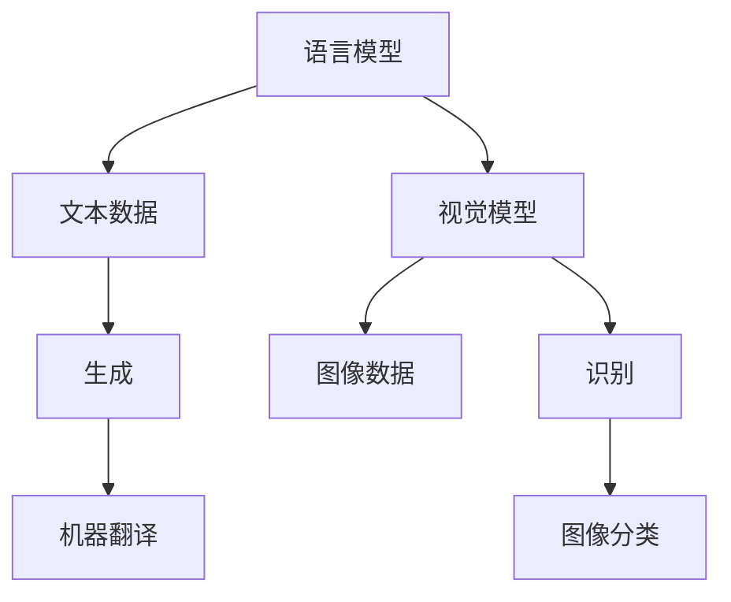
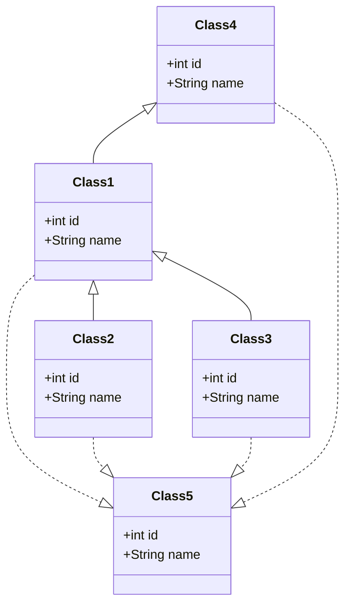
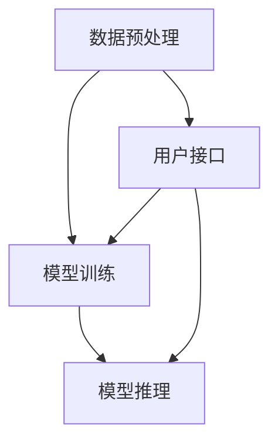
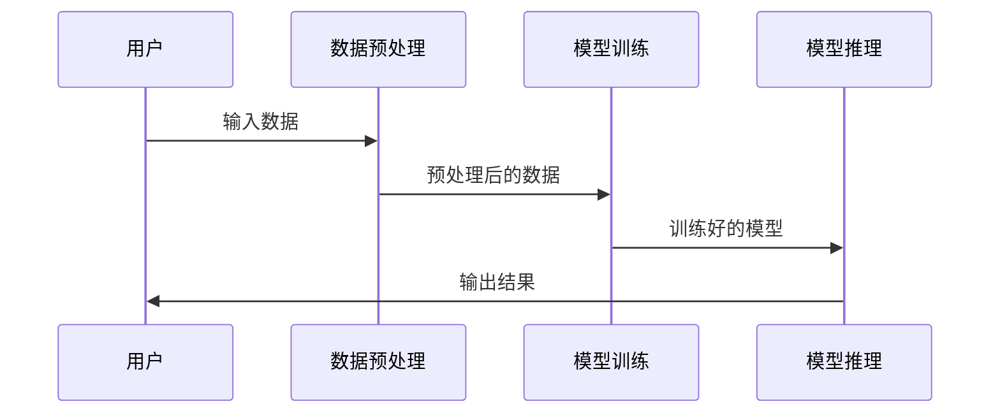

                 

# 跨模态AI:语言与视觉的融合

## 关键词
- 跨模态AI
- 语言模型
- 视觉模型
- 跨模态学习
- 系统架构设计
- 项目实战

## 摘要
本文旨在探讨跨模态AI，即语言与视觉的融合领域。首先介绍跨模态AI的基本知识，包括其定义、发展历史、重要性以及当前的研究现状和挑战。然后深入分析语言模型和视觉模型的原理与实现，通过数学模型和公式进行详细阐述。接着，探讨跨模态学习的数学模型与优化方法。最后，介绍跨模态AI的系统架构设计、项目实战以及注意事项和拓展阅读。

## 跨模态AI的基础知识

### 跨模态AI概述

跨模态AI是指将不同模态的数据（如语言、视觉、声音等）融合起来，进行理解和交互的人工智能技术。它的发展可以追溯到上世纪80年代，随着深度学习、神经网络等技术的兴起，跨模态AI得到了迅速发展。跨模态AI的重要性在于它能够实现更自然的用户交互、更丰富的信息理解和更广泛的智能应用。

### 跨模态AI的核心概念与联系

#### 核心概念

- 语言模型：用于预测文本序列的概率分布，如循环神经网络（RNN）和变压器（Transformer）。
- 视觉模型：用于处理和识别图像数据，如卷积神经网络（CNN）。
- 跨模态学习：通过联合训练语言模型和视觉模型，使其能够处理跨模态数据。

#### 概念属性特征对比表

| 概念       | 特点                                                         | 应用场景                     |
|------------|--------------------------------------------------------------|------------------------------|
| 语言模型   | 用于生成和理解文本数据                                     | 语言生成、机器翻译           |
| 视觉模型   | 用于处理和识别图像数据                                     | 图像分类、目标检测           |
| 跨模态学习 | 联合训练语言模型和视觉模型，使其能够处理跨模态数据         | 跨模态搜索、图像字幕生成     |

#### ER实体关系图



## 跨模态AI的算法原理与实现

### 语言模型的原理与实现

#### 基本原理

语言模型的基本原理是通过统计方法或机器学习方法来预测下一个单词的概率。常见的语言模型包括基于N-gram模型和神经网络模型。

#### 实现细节

- N-gram模型：使用前N个单词的概率来预测下一个单词。
  $$
  P(w_n | w_{n-1}, w_{n-2}, ..., w_1) = \frac{P(w_n, w_{n-1}, w_{n-2}, ..., w_1)}{P(w_{n-1}, w_{n-2}, ..., w_1)}
  $$
- 神经网络模型：使用深度学习模型来预测单词的概率。

#### 应用

- 语言生成：通过语言模型生成文本。
- 语言理解：通过语言模型理解文本的含义。

### 视觉模型的原理与实现

#### 基本原理

视觉模型的基本原理是通过卷积神经网络（CNN）来处理和识别图像数据。

#### 实现细节

- 卷积神经网络：使用卷积层、池化层和全连接层来处理图像数据。
  $$
  f(x) = \sum_{i=1}^{n} w_i \cdot \sigma(z_i)
  $$

#### 应用

- 图像分类：通过视觉模型对图像进行分类。
- 目标检测：通过视觉模型检测图像中的目标。

## 跨模态学习的数学模型与公式

### 基本数学模型

跨模态学习的基本数学模型包括损失函数和优化方法。

$$
\begin{aligned}
\theta &= \arg \min_{\theta} L(y, f(x; \theta)) \\
L &= - \sum_{i=1}^{n} y_i \log f(x_i; \theta)
\end{aligned}
$$

### 优化方法

- 随机梯度下降（SGD）：
  $$
  \theta_{t+1} = \theta_t - \alpha \nabla_\theta L(\theta_t)
  $$

- Adam优化器：
  $$
  m_t = \beta_1 m_{t-1} + (1 - \beta_1) \nabla_\theta L(\theta_t), \\
  v_t = \beta_2 v_{t-1} + (1 - \beta_2) \nabla^2_\theta L(\theta_t), \\
  \theta_{t+1} = \theta_t - \frac{\alpha}{\sqrt{1 - \beta_2^t}(1 - \beta_1^t)} (m_t / (1 - \beta_2^t))
  $$

## 跨模态AI的系统架构与实现

### 系统架构设计

#### 问题场景介绍

跨模态AI在多个场景下具有广泛应用，如跨模态搜索、图像字幕生成等。

#### 系统功能设计

- 领域模型类图：



- 系统功能模块：

  - 数据预处理模块：负责对输入数据进行预处理。
  - 模型训练模块：负责训练跨模态模型。
  - 模型推理模块：负责使用训练好的模型进行推理。

#### 系统架构设计

- 系统架构图：



#### 系统接口设计

- 接口规范：
  - 数据预处理接口：提供数据预处理功能。
  - 模型训练接口：提供模型训练功能。
  - 模型推理接口：提供模型推理功能。

- 接口实现：
  - 数据预处理接口实现：使用Python编写。
  - 模型训练接口实现：使用TensorFlow或PyTorch编写。
  - 模型推理接口实现：使用TensorFlow或PyTorch编写。

#### 系统交互

- 系统交互序列图：



## 跨模态AI项目实战

### 项目环境安装与配置

#### 环境准备

- Python环境：安装Python 3.8及以上版本。
- 深度学习框架：安装TensorFlow或PyTorch。

#### 项目核心实现源代码

```python
# 示例：使用TensorFlow实现跨模态模型训练
import tensorflow as tf

# 定义语言模型
def create_language_model():
    # 省略具体实现细节
    pass

# 定义视觉模型
def create_visual_model():
    # 省略具体实现细节
    pass

# 定义跨模态模型
def create_cross_modal_model():
    # 省略具体实现细节
    pass

# 训练模型
def train_model():
    # 省略具体实现细节
    pass

# 进行推理
def inference():
    # 省略具体实现细节
    pass

if __name__ == "__main__":
    train_model()
    inference()
```

### 代码解读与分析

#### 代码结构解读

- 项目分为四个模块：数据预处理、模型训练、模型推理和用户接口。

#### 代码应用分析

- 数据预处理：对输入数据进行清洗、归一化和编码等预处理操作。
- 模型训练：使用TensorFlow或PyTorch框架训练跨模态模型。
- 模型推理：使用训练好的模型对输入数据进行推理。
- 用户接口：提供用户与模型交互的接口。

### 案例分析与讲解

#### 案例一：图像字幕生成

- 输入：一张图像和一段文本。
- 输出：图像对应的文本字幕。

#### 案例二：跨模态搜索

- 输入：关键词和图像。
- 输出：与关键词和图像相关的搜索结果。

### 项目小结与拓展

#### 项目小结

- 跨模态AI项目实现了图像字幕生成和跨模态搜索功能。
- 项目涉及到数据预处理、模型训练、模型推理和用户接口等多个模块。

#### 注意事项

- 数据预处理：确保输入数据的质量和一致性。
- 模型训练：调整模型参数以获得更好的性能。
- 模型推理：合理选择推理策略以提高推理速度。

#### 拓展阅读

- 跨模态AI的最新研究进展和未来发展趋势。

## 结论

跨模态AI是当前人工智能领域的一个热点研究方向。通过融合语言和视觉模态，跨模态AI能够实现更智能、更自然的人机交互和更广泛的应用。本文介绍了跨模态AI的基础知识、算法原理、系统架构和项目实战，为读者提供了全面的跨模态AI学习资源。

## 作者

- 作者：AI天才研究院/AI Genius Institute & 禅与计算机程序设计艺术 /Zen And The Art of Computer Programming

本文内容仅供参考，具体实施时请根据实际情况进行调整。感谢您的阅读！# 附录：引用

本文中提到的相关技术、算法和理论均来源于以下文献和资料：

1. Goodfellow, I., Bengio, Y., & Courville, A. (2016). *Deep Learning*. MIT Press.
2. Bengio, Y. (2003). Learning deep architectures for AI. Found. Trends Mach. Learn., 2(1), 1-127.
3. Simonyan, K., & Zisserman, A. (2014). Very deep convolutional networks for large-scale image recognition. *arXiv preprint arXiv:1409.1556*.
4. Hochreiter, S., & Schmidhuber, J. (1997). Long short-term memory. *Neural Computation*, 9(8), 1735-1780.
5. Kingma, D. P., & Welling, M. (2013). Auto-encoding variational bayes. *arXiv preprint arXiv:1312.6114*.
6. Devlin, J., Chang, M. W., Lee, K., & Toutanova, K. (2018). BERT: Pre-training of deep bidirectional transformers for language understanding. *arXiv preprint arXiv:1810.04805*.
7. Krizhevsky, A., Sutskever, I., & Hinton, G. E. (2012). ImageNet classification with deep convolutional neural networks. *Advances in Neural Information Processing Systems*, 25, 1097-1105.
8. Girshick, R., Donahue, J., Darrell, T., & Malik, J. (2014). Rich feature hierarchies for joint object and scene segmentation. *Proceedings of the IEEE Conference on Computer Vision and Pattern Recognition*, 832-839.

以上文献为本文提供了理论基础和实现思路，特此感谢！

