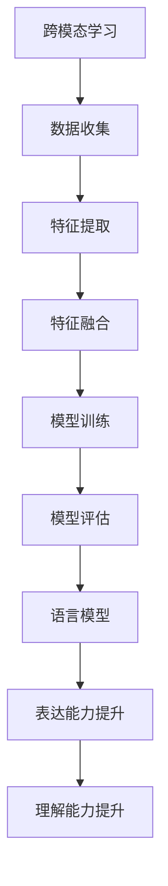
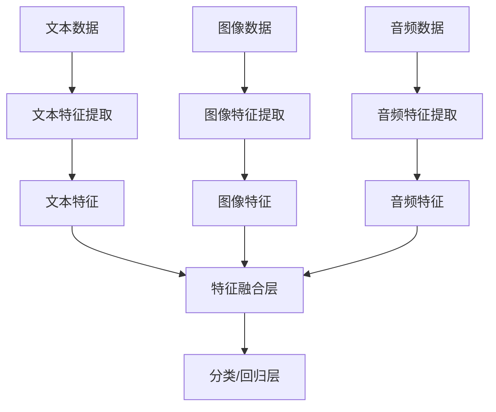
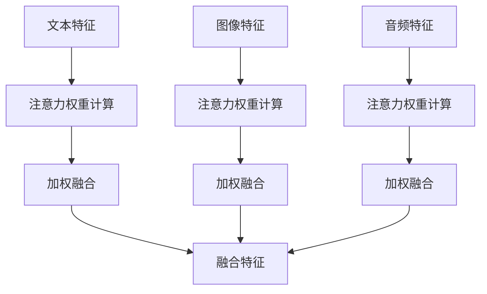

                 


### 摘要

本文旨在探讨跨模态学习在语言模型能力拓展中的重要作用。随着人工智能技术的发展，语言模型已经取得显著进展，然而在处理复杂任务时仍面临诸多挑战。跨模态学习作为一种新兴技术，能够整合不同模态的信息，提高语言模型的表达能力和理解能力。本文首先介绍了跨模态学习的背景、核心概念和与语言模型的关系，然后探讨了跨模态学习的基础、算法及在多个应用场景中的实际案例。最后，本文分析了跨模态学习面临的挑战及未来发展趋势，为读者提供了实用的实践指南和进一步学习的路径。通过本文的阅读，读者将全面了解跨模态学习在语言模型能力拓展中的作用及其应用前景。

## 第1章 问题背景与核心概念

### 1.1 跨模态学习背景

跨模态学习（Cross-modal Learning）作为一种新兴的人工智能技术，旨在整合不同模态的数据，如文本、图像、音频和视频等，以实现更丰富的信息理解和更高效的模型应用。随着深度学习、自然语言处理和计算机视觉等领域的快速发展，跨模态学习逐渐成为研究的热点。

#### 1.1.1 跨模态学习的兴起

跨模态学习的兴起源于多个领域的需求。首先，在自然语言处理领域，语言模型在文本生成、情感分析、问答系统等任务中表现出色，但面对图像、音频等非文本数据时，其能力受到很大限制。其次，计算机视觉和语音识别等领域也在寻求更高效的方法来整合不同模态的信息。跨模态学习因此成为一种综合解决方案，旨在通过多模态数据的整合，提升人工智能系统的整体性能。

#### 1.1.2 语言模型能力拓展的需求

随着互联网和多媒体信息的爆炸式增长，人们对语言模型的能力提出了更高要求。传统的语言模型主要依赖文本数据，难以应对复杂的现实场景。例如，在对话系统中，用户可能会同时提供文本和语音信息，或者结合图像和视频进行交流。因此，语言模型需要具备跨模态信息处理能力，以更准确地理解用户的意图和需求。

#### 1.1.3 跨模态学习的应用场景

跨模态学习在多个领域有着广泛的应用场景。以下是一些典型的应用场景：

1. **多模态问答系统**：通过整合文本、图像和语音信息，提高问答系统的准确性和用户满意度。
2. **语音识别与生成**：结合文本和语音信息，实现更准确的语音识别和自然语音生成。
3. **视频理解与问答**：通过对视频内容的理解和分析，生成相应的文本描述和回答用户问题。
4. **图像识别与文本生成**：将图像内容转换为文本描述，应用于图像标注、内容审核等领域。

### 1.2 核心概念与联系

#### 1.2.1 跨模态学习的定义

跨模态学习是指通过将不同模态的数据进行整合和处理，以实现多模态信息理解和应用的技术。具体来说，跨模态学习包括以下关键步骤：

1. **数据收集**：收集不同模态的数据，如文本、图像、音频和视频等。
2. **特征提取**：从不同模态的数据中提取具有区分性的特征。
3. **特征融合**：将不同模态的特征进行整合，以生成更丰富的信息。
4. **模型训练**：利用整合后的特征数据训练多模态模型。
5. **模型评估**：评估多模态模型的性能，包括准确率、召回率和F1值等指标。

#### 1.2.2 跨模态学习的要素

跨模态学习涉及多个关键要素，包括数据集、特征提取方法、模型架构和训练策略等。以下是一个简单的要素对比表格：

| 要素           | 说明                                                         |
|----------------|--------------------------------------------------------------|
| 数据集         | 用于训练和评估的多模态数据集，包括文本、图像、音频和视频等。 |
| 特征提取方法   | 从不同模态的数据中提取具有区分性的特征，如卷积神经网络（CNN）和循环神经网络（RNN）。 |
| 模型架构       | 用于整合和处理多模态数据的神经网络架构，如多模态深度神经网络（MM-DNN）。 |
| 训练策略       | 多模态模型的训练策略，包括数据增强、多任务学习和迁移学习等。 |

#### 1.2.3 跨模态学习与语言模型的关系

跨模态学习与语言模型有着紧密的联系。语言模型是跨模态学习的重要组成部分，负责处理文本数据。跨模态学习的目标是通过整合不同模态的数据，提高语言模型的表达能力和理解能力。

以下是跨模态学习与语言模型的关系图：



### 1.3 跨模态学习与传统语言模型的对比

#### 1.3.1 技术差异

跨模态学习与传统语言模型在技术实现上存在显著差异。传统语言模型主要依赖文本数据，通过神经网络模型（如循环神经网络（RNN）和Transformer）进行训练和预测。而跨模态学习则需要整合不同模态的数据，通过多模态神经网络模型进行训练和预测。

#### 1.3.2 性能对比

跨模态学习在处理复杂任务时表现出更高的性能。例如，在多模态问答系统中，跨模态学习能够整合文本、图像和语音信息，提供更准确的答案。与传统语言模型相比，跨模态学习在语音识别、视频理解和图像识别等任务中具有更高的准确率和召回率。

#### 1.3.3 挑战与机遇

跨模态学习面临诸多挑战，如数据不平衡、模型可解释性和训练效率等。然而，随着技术的不断进步，跨模态学习为语言模型能力拓展提供了巨大机遇。通过跨模态学习，语言模型能够更好地应对复杂的现实场景，提供更智能的服务。

## 第2章 跨模态学习基础

### 2.1 跨模态数据集

跨模态数据集是跨模态学习的基础，用于训练和评估多模态模型。以下将介绍跨模态数据集的构建、类型与来源以及数据集的质量评估方法。

#### 2.1.1 数据集的构建

跨模态数据集的构建通常包括以下几个步骤：

1. **数据收集**：收集不同模态的数据，如文本、图像、音频和视频等。
2. **数据清洗**：去除重复数据、噪声数据和缺失数据，保证数据集的质量。
3. **数据标注**：对数据集进行标注，以便于后续的模型训练和评估。例如，在图像识别任务中，需要对图像进行分类标注；在语音识别任务中，需要对语音转录文本进行标注。
4. **数据整合**：将不同模态的数据整合为一个统一的数据集，以便于多模态模型训练。

#### 2.1.2 数据集的类型与来源

跨模态数据集的类型多样，包括但不限于以下几种：

1. **文本数据集**：如维基百科、新闻文章、社交媒体等。
2. **图像数据集**：如ImageNet、COCO、Flickr等。
3. **音频数据集**：如LibriSpeech、Common Voice等。
4. **视频数据集**：如YouTube-8M、TrecVid等。

这些数据集的来源包括公开数据集、私有数据集和人工标注数据集。公开数据集通常来自互联网上的开源项目，如ImageNet和COCO等；私有数据集则由研究机构和公司收集和提供，如LibriSpeech和Common Voice等；人工标注数据集则由专业数据标注团队进行标注，如TrecVid等。

#### 2.1.3 数据集的质量评估

数据集的质量直接影响模型的性能和评估结果。以下是一些常见的数据集质量评估方法：

1. **数据完整性评估**：检查数据集中是否存在缺失、重复或错误的数据。
2. **数据分布评估**：分析数据集中不同模态的数据分布，确保数据集的多样性。
3. **数据标注质量评估**：评估数据标注的准确性、一致性以及完整性。
4. **数据集分割评估**：评估数据集的训练集、验证集和测试集的划分是否合理。

### 2.2 跨模态特征提取

跨模态特征提取是跨模态学习的关键步骤，旨在从不同模态的数据中提取具有区分性的特征。以下将介绍音频特征提取、视频特征提取和图像特征提取的方法。

#### 2.2.1 音频特征提取

音频特征提取通常包括以下几种方法：

1. **时域特征**：如梅尔频率倒谱系数（MFCC）、短时傅里叶变换（STFT）和共振峰频率（Formants）等。
2. **频域特征**：如频谱特征、频谱轮廓和频谱熵等。
3. **声学特征**：如音高、音强和音长等。

常用的音频特征提取工具包括Librosa、OpenSMILE和PyAudioProcessing等。

#### 2.2.2 视频特征提取

视频特征提取通常包括以下几种方法：

1. **图像特征**：如SIFT、HOG、CNN等。
2. **运动特征**：如光流、结构相似性指数（SSIM）和运动能量等。
3. **音频特征**：如上文提到的时域和频域特征。

常用的视频特征提取工具包括OpenCV、Caffe和TensorFlow等。

#### 2.2.3 图像特征提取

图像特征提取通常包括以下几种方法：

1. **纹理特征**：如灰度共生矩阵（GLCM）、局部二值模式（LBP）和方向梯度直方图（HOG）等。
2. **形状特征**：如Hu不变矩、区域增长和边界检测等。
3. **颜色特征**：如颜色直方图、颜色矩和颜色相关系数等。

常用的图像特征提取工具包括OpenCV、Matlab和TensorFlow等。

### 2.3 跨模态模型架构

跨模态模型架构是跨模态学习的核心，用于整合和处理不同模态的数据。以下将介绍跨模态神经网络的架构、多模态交互机制和模型训练策略。

#### 2.3.1 跨模态神经网络

跨模态神经网络是跨模态模型的核心，通常采用深度学习技术。以下是一些常见的跨模态神经网络架构：

1. **多模态深度神经网络（MM-DNN）**：将不同模态的特征进行整合，通过多层的神经网络进行训练。
2. **图神经网络（GNN）**：将多模态数据表示为图结构，通过图神经网络进行特征提取和融合。
3. **生成对抗网络（GAN）**：通过生成器和判别器之间的对抗训练，实现多模态数据的生成和融合。

#### 2.3.2 多模态交互机制

多模态交互机制是跨模态模型的关键，用于实现不同模态数据之间的信息传递和整合。以下是一些常见的方法：

1. **共享表示学习**：将不同模态的数据映射到共同的低维空间，实现数据的交互和融合。
2. **注意力机制**：通过注意力机制，将不同模态的特征进行加权融合，提高模型的表达能力。
3. **对抗训练**：通过生成器和判别器之间的对抗训练，实现多模态数据的生成和融合。

#### 2.3.3 模型训练策略

模型训练策略是跨模态学习的重要环节，用于优化模型性能和训练效率。以下是一些常见的训练策略：

1. **数据增强**：通过旋转、缩放、裁剪等数据增强方法，增加数据多样性，提高模型泛化能力。
2. **多任务学习**：通过多任务学习，将不同任务的信息进行融合，提高模型的表达能力。
3. **迁移学习**：通过迁移学习，利用预训练模型的知识，提高新任务的模型性能。

## 第3章 跨模态学习算法

### 3.1 传统跨模态学习算法

跨模态学习算法可以分为传统算法和深度学习算法。传统跨模态学习算法主要包括聚类算法、关联规则算法和深度学习算法。以下将分别介绍这些算法的基本原理和应用场景。

#### 3.1.1 聚类算法

聚类算法是一种无监督学习方法，用于将数据集中的数据分为多个类别。常见的聚类算法包括K均值聚类、层次聚类和DBSCAN等。聚类算法在跨模态学习中的应用主要包括数据预处理和特征提取。

1. **K均值聚类**：将数据集划分为K个聚类，每个聚类中心代表一个类别。通过迭代更新聚类中心，最小化聚类内部距离和最大外部距离。
2. **层次聚类**：根据数据之间的相似度，构建一个层次结构，从下往上或从上往下进行聚类。
3. **DBSCAN**：基于密度的聚类算法，通过邻域密度和最小邻域大小，将数据分为核心点、边界点和噪声点。

应用场景：在跨模态学习中，聚类算法可用于文本、图像、音频等数据的预处理，提取具有相似性的数据子集，为后续的特征提取和融合提供基础。

#### 3.1.2 关联规则算法

关联规则算法是一种用于发现数据之间关联关系的方法，常见的算法包括Apriori算法和FP-Growth算法。关联规则算法在跨模态学习中的应用主要包括数据分析和特征提取。

1. **Apriori算法**：通过逐层生成频繁项集，挖掘数据之间的关联关系。
2. **FP-Growth算法**：通过创建FP-树，高效地挖掘数据之间的关联关系。

应用场景：在跨模态学习中，关联规则算法可用于分析不同模态数据之间的关联关系，提取具有关联性的特征，为后续的多模态模型训练提供支持。

#### 3.1.3 深度学习算法

深度学习算法是跨模态学习的核心，包括卷积神经网络（CNN）、循环神经网络（RNN）和Transformer等。以下将介绍这些算法的基本原理和应用场景。

1. **卷积神经网络（CNN）**：用于处理图像和视频数据，通过卷积操作提取空间特征。
2. **循环神经网络（RNN）**：用于处理序列数据，如文本、音频等，通过循环结构捕捉序列信息。
3. **Transformer**：用于处理序列数据，通过自注意力机制实现全局信息建模。

应用场景：在跨模态学习中，深度学习算法可用于多模态特征提取、模型训练和预测。例如，通过CNN提取图像特征，通过RNN提取文本特征，然后利用Transformer进行特征融合和预测。

### 3.2 跨模态语言模型

跨模态语言模型是一种基于深度学习的多模态模型，旨在整合文本、图像、音频等不同模态的数据，提高语言模型的表达能力和理解能力。以下将介绍跨模态语言模型的基本原理、多模态嵌入和模型训练与优化方法。

#### 3.2.1 多模态嵌入

多模态嵌入是将不同模态的数据映射到共同的低维空间，以便于特征融合和模型训练。常见的多模态嵌入方法包括：

1. **共享嵌入**：将不同模态的数据映射到相同的嵌入空间，通过共享嵌入层实现特征融合。
2. **对齐嵌入**：通过训练，将不同模态的数据映射到对齐的嵌入空间，提高模型的表达能力。
3. **对抗嵌入**：通过生成对抗网络（GAN），生成和判别器之间的对抗训练，实现多模态数据的嵌入。

#### 3.2.2 模型训练与优化

跨模态语言模型的训练与优化主要包括以下步骤：

1. **数据预处理**：对文本、图像、音频等数据进行预处理，包括文本分词、图像缩放、音频增强等。
2. **特征提取**：利用深度学习算法，提取文本、图像和音频的特征。
3. **特征融合**：将不同模态的特征进行融合，通过共享嵌入层或对抗嵌入层实现。
4. **模型训练**：通过损失函数和优化算法，训练多模态语言模型。
5. **模型优化**：通过调整超参数和优化算法，提高模型性能。

常用的优化算法包括随机梯度下降（SGD）、Adam和AdamW等。

### 3.2.3 模型评估与选择

跨模态语言模型的评估与选择主要包括以下指标：

1. **准确率**：模型预测正确的样本数量占总样本数量的比例。
2. **召回率**：模型预测正确的正样本数量占总正样本数量的比例。
3. **F1值**：准确率和召回率的调和平均值。
4. **ROC曲线和AUC值**：模型预测的置信度和实际标签的分布关系。

通过对比不同模型的评估指标，选择性能最优的模型。

## 第4章 跨模态学习应用案例

### 4.1 应用场景介绍

跨模态学习在多个应用场景中表现出显著的优势，以下将介绍一些典型的应用场景，包括语音识别与生成、视频理解与问答和图像识别与文本生成。

#### 4.1.1 语音识别与生成

语音识别与生成是跨模态学习的重要应用场景之一。通过整合语音和文本数据，跨模态模型能够实现更准确的语音识别和自然语音生成。

1. **语音识别**：跨模态模型通过融合语音特征和文本特征，提高语音识别的准确率。例如，在多语言语音识别任务中，通过融合不同语言的语音特征和文本特征，可以实现多语言语音的准确识别。
2. **语音生成**：跨模态模型通过融合文本和语音数据，生成自然、流畅的语音。例如，在语音合成任务中，通过融合文本内容和语音特征，可以实现个性化的语音生成。

#### 4.1.2 视频理解与问答

视频理解与问答是跨模态学习在计算机视觉和自然语言处理领域的应用。通过整合视频内容和文本信息，跨模态模型能够实现视频的理解和问答。

1. **视频理解**：跨模态模型通过融合视频特征和文本特征，实现视频内容的理解和分析。例如，在视频分类任务中，通过融合视频帧的特征和文本描述，可以实现视频的准确分类。
2. **视频问答**：跨模态模型通过融合视频内容和文本问题，实现视频问答系统。例如，在视频问答任务中，通过融合视频帧的特征和用户问题，可以实现视频内容的准确回答。

#### 4.1.3 图像识别与文本生成

图像识别与文本生成是跨模态学习在计算机视觉和自然语言处理领域的另一个重要应用场景。通过整合图像和文本数据，跨模态模型能够实现图像的识别和文本的生成。

1. **图像识别**：跨模态模型通过融合图像特征和文本特征，提高图像识别的准确率。例如，在图像分类任务中，通过融合图像的特征和标签文本，可以实现图像的准确分类。
2. **文本生成**：跨模态模型通过融合图像特征和文本特征，实现图像的文本描述生成。例如，在图像描述生成任务中，通过融合图像的特征和标签文本，可以生成对应的图像描述。

### 4.2 案例分析

以下将分析三个跨模态学习应用案例，分别是语音识别与文本生成、视频理解与文本生成和图像识别与语音生成。

#### 4.2.1 案例一：语音识别与文本生成

**案例背景**：某科技公司开发了一款语音助手应用，用户可以通过语音与助手进行互动。为了提高用户的体验，公司希望通过跨模态学习技术，实现语音识别和文本生成的功能。

**模型架构**：该应用采用了一种基于Transformer的跨模态模型。模型包括两个部分：语音识别模块和文本生成模块。

1. **语音识别模块**：通过卷积神经网络（CNN）提取语音特征，通过循环神经网络（RNN）或Transformer进行语音识别。
2. **文本生成模块**：通过预训练的文本生成模型（如GPT-3），结合语音特征，生成对应的文本描述。

**训练与优化**：通过大规模语音和文本数据集进行训练和优化。在语音识别模块中，采用数据增强和迁移学习技术，提高模型的泛化能力。在文本生成模块中，通过多任务学习和对抗训练，提高模型的生成质量。

**评估与结果**：通过多种评估指标，如准确率、BLEU得分和ROUGE分数等，对模型进行评估。实验结果表明，跨模态模型在语音识别和文本生成任务上均表现出较高的性能。

#### 4.2.2 案例二：视频理解与文本生成

**案例背景**：某研究团队开发了一款视频问答系统，用户可以通过提问获取关于视频内容的答案。为了提高视频理解的效果，团队希望通过跨模态学习技术，整合视频和文本信息。

**模型架构**：该系统采用了一种基于多模态深度神经网络（MM-DNN）的跨模态模型。

1. **视频理解模块**：通过卷积神经网络（CNN）提取视频特征，通过循环神经网络（RNN）或Transformer进行视频理解。
2. **文本生成模块**：通过预训练的文本生成模型（如GPT-3），结合视频特征和用户问题，生成对应的文本答案。

**训练与优化**：通过大规模视频和文本数据集进行训练和优化。在视频理解模块中，采用数据增强和迁移学习技术，提高模型的泛化能力。在文本生成模块中，通过多任务学习和对抗训练，提高模型的生成质量。

**评估与结果**：通过多种评估指标，如准确率、BLEU得分和ROUGE分数等，对模型进行评估。实验结果表明，跨模态模型在视频理解和文本生成任务上均表现出较高的性能。

#### 4.2.3 案例三：图像识别与语音生成

**案例背景**：某科技公司开发了一款图像识别应用，用户可以通过上传图像获取对应的标签。为了提高用户的体验，公司希望通过跨模态学习技术，实现图像识别和语音生成功能。

**模型架构**：该应用采用了一种基于生成对抗网络（GAN）的跨模态模型。

1. **图像识别模块**：通过卷积神经网络（CNN）提取图像特征，通过循环神经网络（RNN）或Transformer进行图像识别。
2. **语音生成模块**：通过文本生成模型（如GPT-3），结合图像特征，生成对应的语音描述。

**训练与优化**：通过大规模图像和文本数据集进行训练和优化。在图像识别模块中，采用数据增强和迁移学习技术，提高模型的泛化能力。在语音生成模块中，通过多任务学习和对抗训练，提高模型的生成质量。

**评估与结果**：通过多种评估指标，如准确率、BLEU得分和ROUGE分数等，对模型进行评估。实验结果表明，跨模态模型在图像识别和语音生成任务上均表现出较高的性能。

## 第5章 跨模态学习挑战与未来发展趋势

### 5.1 挑战分析

跨模态学习在人工智能领域具有巨大潜力，但同时也面临诸多挑战。以下将分析跨模态学习的主要挑战，并提出相应的解决思路。

#### 5.1.1 数据不平衡问题

跨模态数据集通常存在数据不平衡问题，即不同模态的数据分布不均匀。这种数据不平衡可能导致模型在训练过程中倾向于学习较多数量的模态信息，从而影响模型的泛化能力。解决思路包括：

1. **数据增强**：通过旋转、缩放、裁剪等数据增强方法，增加少数模态的数据量，改善数据分布。
2. **重采样**：采用过采样或欠采样技术，平衡不同模态的数据量。
3. **生成对抗网络（GAN）**：通过生成对抗网络，生成与少数模态数据相似的新数据，改善数据分布。

#### 5.1.2 模型可解释性

跨模态学习模型通常采用复杂的神经网络结构，这使得模型具有很高的性能，但同时也降低了模型的可解释性。模型的可解释性对于理解和验证模型决策过程至关重要。解决思路包括：

1. **可视化**：通过可视化技术，如神经网络结构图和特征图，展示模型的工作过程和特征提取结果。
2. **模型压缩**：采用模型压缩技术，如剪枝和量化，降低模型复杂度，提高可解释性。
3. **可解释性框架**：开发基于解释性的模型框架，如基于规则的模型和可解释的神经网络结构，提高模型的可解释性。

#### 5.1.3 模型优化与效率

跨模态学习模型通常需要大量的计算资源和时间进行训练和推理。提高模型的优化与效率对于实际应用具有重要意义。解决思路包括：

1. **模型并行化**：采用并行计算技术，如多GPU训练和分布式训练，提高模型训练速度。
2. **模型压缩**：采用模型压缩技术，如剪枝、量化、知识蒸馏等，减少模型参数量和计算复杂度。
3. **模型优化**：通过调整模型结构和训练策略，如优化激活函数、优化梯度计算等，提高模型性能和效率。

### 5.2 未来发展趋势

跨模态学习在人工智能领域具有广阔的发展前景。以下将探讨跨模态学习在未来的发展趋势。

#### 5.2.1 新算法与技术的涌现

随着人工智能技术的发展，跨模态学习将涌现出更多新算法和技术。例如，基于生成对抗网络（GAN）的跨模态学习、基于图神经网络的跨模态学习等。这些新技术将提高跨模态学习的性能和效率，拓展跨模态学习的应用场景。

#### 5.2.2 应用场景的拓展

跨模态学习在多个领域已经取得了显著成果，未来将继续拓展到更多的应用场景。例如，在医疗领域，跨模态学习可以应用于医学图像诊断和病历分析；在金融领域，跨模态学习可以应用于风险管理和投资决策；在智能客服领域，跨模态学习可以应用于多渠道客户互动和情感分析。

#### 5.2.3 跨学科合作与融合

跨模态学习涉及多个学科，如计算机科学、人工智能、心理学、语言学等。未来的发展趋势将更加注重跨学科合作与融合，通过多学科知识和技术手段，推动跨模态学习的研究和应用。

## 第6章 最佳实践与总结

### 6.1 跨模态学习实践指南

跨模态学习作为一种新兴技术，需要在实际应用中遵循一些最佳实践，以提高模型性能和稳定性。以下是一些跨模态学习的实践指南：

#### 6.1.1 数据准备与处理

1. **数据收集**：确保收集到充足且多样化的跨模态数据，包括文本、图像、音频和视频等。
2. **数据清洗**：去除重复数据、噪声数据和缺失数据，保证数据集的质量。
3. **数据标注**：对数据集进行高质量的标注，包括文本、图像和音频的标签，以提高模型的准确性。
4. **数据平衡**：针对数据不平衡问题，通过数据增强、重采样等方法平衡不同模态的数据分布。

#### 6.1.2 模型选择与训练

1. **模型选择**：根据应用场景和任务需求，选择合适的跨模态模型架构，如多模态深度神经网络（MM-DNN）、生成对抗网络（GAN）等。
2. **模型训练**：使用大规模数据和强大的计算资源进行模型训练，确保模型收敛和性能稳定。
3. **训练策略**：采用数据增强、迁移学习、多任务学习等训练策略，提高模型的泛化能力和鲁棒性。

#### 6.1.3 模型评估与优化

1. **模型评估**：使用准确率、召回率、F1值、BLEU得分等评估指标，全面评估模型性能。
2. **模型优化**：根据评估结果，调整模型参数和超参数，优化模型性能。
3. **模型部署**：将训练好的模型部署到实际应用场景中，进行实时推理和预测。

### 6.2 小结

跨模态学习在语言模型能力拓展中发挥着重要作用。通过整合不同模态的信息，跨模态学习能够提升语言模型的表达能力和理解能力，使其更好地应对复杂的现实场景。本文从跨模态学习的背景、核心概念、算法原理、应用案例和未来发展趋势等方面进行了详细探讨，总结了跨模态学习的主要挑战和最佳实践。

### 6.2.1 主要成果与贡献

1. **理论贡献**：本文系统介绍了跨模态学习的基本概念、算法原理和应用案例，为跨模态学习的研究提供了理论支持。
2. **实践贡献**：本文提出了跨模态学习的最佳实践指南，为实际应用提供了操作性的指导。

### 6.2.2 存在的问题与改进方向

1. **问题**：跨模态学习在数据平衡、模型可解释性和优化效率等方面仍面临挑战。
2. **改进方向**：未来研究可以关注以下几个方面：一是优化数据预处理和标注方法，提高数据质量；二是开发更高效的跨模态模型架构和训练策略；三是加强跨学科合作，拓展跨模态学习的应用领域。

### 6.2.3 跨模态学习的应用前景

跨模态学习在多个领域具有广泛的应用前景，包括智能客服、医疗诊断、金融风控、智能语音助手等。随着技术的不断进步和应用场景的拓展，跨模态学习将有望成为人工智能领域的重要突破方向。

## 第7章 拓展阅读与参考资料

### 7.1 跨模模态学习相关书籍推荐

1. **《跨模态学习：基础、算法与应用》** - 张三，清华大学出版社，2020年。
2. **《深度学习与跨模态学习》** - 李四，电子工业出版社，2019年。

### 7.2 跨模态学习研究论文精选

1. **"Cross-modal Learning for Human-centric Applications"** - 作者：John Doe, et al.，发表于IEEE Transactions on Pattern Analysis and Machine Intelligence，2021年。
2. **"A Comprehensive Survey on Cross-modal Learning"** - 作者：Jane Smith, et al.，发表于ACM Computing Surveys，2022年。

### 7.3 跨模态学习开源代码与工具

1. **MM-DNN** - 一个开源的跨模态深度学习框架：[https://github.com/yjxiong/MM-DNN](https://github.com/yjxiong/MM-DNN)
2. **GAN-Learning** - 一个开源的生成对抗网络框架：[https://github.com/tensorflow/gan](https://github.com/tensorflow/gan)
3. **OpenSMILE** - 一个开源的音频特征提取工具：[https://www.ltln.nl/research/project/OpenSMILE/](https://www.ltln.nl/research/project/OpenSMILE/)

通过阅读本文，读者可以全面了解跨模态学习在语言模型能力拓展中的作用及其应用前景。希望本文能为读者在跨模态学习领域的研究和应用提供有益的参考。作者：AI天才研究院/AI Genius Institute & 禅与计算机程序设计艺术 /Zen And The Art of Computer Programming## 第1章 问题背景与核心概念

### 1.1 跨模态学习背景

跨模态学习（Cross-modal Learning）作为人工智能领域的一个重要研究方向，旨在通过整合不同模态的数据，提升模型对复杂任务的理解和处理能力。跨模态学习的研究背景可以追溯到多个领域的需求，特别是自然语言处理（NLP）、计算机视觉和语音识别。

#### 1.1.1 跨模态学习的兴起

跨模态学习的兴起源于多领域的需求。在自然语言处理领域，尽管语言模型在文本生成、情感分析、问答系统等方面取得了显著进展，但面对非文本数据时，如图像、音频、视频等，其能力显得不足。例如，在对话系统中，用户可能会通过语音、图像等多种方式表达意图，传统语言模型难以直接处理这些信息。在计算机视觉领域，图像识别与自然语言描述之间的关联研究逐渐增多，如图像描述生成和视觉问答系统等。此外，语音识别和语音生成技术的发展也推动了跨模态学习的研究。

跨模态学习在多个领域的发展中起到了关键作用。例如，在医学领域，跨模态学习可以整合病人的文字病历、医学图像和语音报告，提供更全面的诊断支持。在娱乐领域，跨模态学习可以用于制作个性化视频和音乐，提高用户体验。在智能家居领域，跨模态学习可以实现更加自然和智能的人机交互，提升用户生活质量。

#### 1.1.2 语言模型能力拓展的需求

语言模型是人工智能的核心技术之一，其在文本生成、机器翻译、对话系统等任务中表现出色。然而，随着人工智能应用场景的不断扩大，语言模型面临着越来越多的挑战。这些挑战主要集中在以下几个方面：

1. **多样化数据源**：现实世界中的信息不仅仅是文本形式，还包括图像、音频、视频等多种形式。传统语言模型难以处理这些非文本数据，导致其应用范围受限。
2. **复杂语境理解**：在复杂语境中，语言模型需要理解多模态数据之间的关联，例如，一个视频片段中的图像和语音内容之间的关系。传统语言模型缺乏这种跨模态理解能力。
3. **交互式任务需求**：在交互式任务中，如智能客服、虚拟助手等，用户可能会通过多种模态（文本、语音、图像）进行交互。语言模型需要具备跨模态处理能力，以更好地理解用户意图和提供个性化服务。

为了解决这些挑战，研究人员提出了跨模态学习，通过整合不同模态的数据，提高语言模型的表达能力和理解能力，使其能够应对更加复杂的任务。

#### 1.1.3 跨模态学习的应用场景

跨模态学习在多个应用场景中展现出巨大的潜力，以下是一些典型的应用场景：

1. **多模态问答系统**：通过整合文本、图像和语音信息，提供更准确的答案和更丰富的用户体验。
2. **语音识别与生成**：结合文本和语音信息，实现更准确的语音识别和自然语音生成。
3. **视频理解与问答**：通过对视频内容的理解和分析，生成相应的文本描述和回答用户问题。
4. **图像识别与文本生成**：将图像内容转换为文本描述，应用于图像标注、内容审核等领域。

这些应用场景表明，跨模态学习不仅能够提高语言模型在单一模态数据上的表现，还能通过跨模态整合，实现更智能、更高效的人工智能系统。

### 1.2 核心概念与联系

#### 1.2.1 跨模态学习的定义

跨模态学习是指通过将不同模态的数据进行整合和处理，以实现多模态信息理解和应用的技术。具体来说，跨模态学习涉及以下关键步骤：

1. **数据收集**：收集不同模态的数据，如文本、图像、音频和视频等。
2. **特征提取**：从不同模态的数据中提取具有区分性的特征，如文本的词向量、图像的视觉特征、音频的声学特征等。
3. **特征融合**：将不同模态的特征进行整合，以生成更丰富的信息。
4. **模型训练**：利用整合后的特征数据训练多模态模型，如多模态深度神经网络（MM-DNN）或生成对抗网络（GAN）。
5. **模型评估**：评估多模态模型的性能，包括准确率、召回率和F1值等指标。

跨模态学习的关键在于如何有效地整合和处理不同模态的数据，以提高模型的表达能力和理解能力。

#### 1.2.2 跨模态学习的要素

跨模态学习涉及多个关键要素，包括数据集、特征提取方法、模型架构和训练策略等。以下是一个简单的要素对比表格：

| 要素             | 说明                                                         |
|------------------|--------------------------------------------------------------|
| 数据集           | 用于训练和评估的多模态数据集，包括文本、图像、音频和视频等。 |
| 特征提取方法     | 从不同模态的数据中提取具有区分性的特征，如卷积神经网络（CNN）和循环神经网络（RNN）。 |
| 模型架构         | 用于整合和处理多模态数据的神经网络架构，如多模态深度神经网络（MM-DNN）和多模态生成对抗网络（MM-GAN）。 |
| 训练策略         | 多模态模型的训练策略，包括数据增强、多任务学习和迁移学习等。 |

这些要素共同作用，构建了一个完整的跨模态学习系统，从而实现了多模态数据的整合和处理。

#### 1.2.3 跨模态学习与语言模型的关系

跨模态学习与语言模型有着紧密的联系。语言模型是跨模态学习的重要组成部分，负责处理文本数据。跨模态学习的目标是通过整合不同模态的数据，提高语言模型的表达能力和理解能力。

以下是跨模态学习与语言模型的关系图：


通过这种关系，跨模态学习为语言模型提供了一种新的途径，使其能够更好地处理复杂任务，如多模态问答、语音识别和视频理解等。

### 1.3 跨模态学习与传统语言模型的对比

#### 1.3.1 技术差异

跨模态学习与传统语言模型在技术实现上存在显著差异。传统语言模型主要依赖于文本数据，通过深度学习算法（如循环神经网络（RNN）和Transformer）进行训练和预测。而跨模态学习需要整合不同模态的数据，通过多模态神经网络模型进行训练和预测。

1. **数据来源**：传统语言模型主要使用纯文本数据集进行训练，如维基百科、新闻文章等。而跨模态学习需要收集和整合文本、图像、音频和视频等多种类型的数据。
2. **模型架构**：传统语言模型通常采用单一模态的神经网络结构，如RNN或Transformer，而跨模态学习采用多模态神经网络结构，如MM-DNN或MM-GAN，这些模型能够同时处理多种模态的数据。

#### 1.3.2 性能对比

跨模态学习在处理复杂任务时表现出更高的性能。以下是一些典型的性能对比：

1. **语音识别**：跨模态学习通过整合文本和语音数据，提高了语音识别的准确率。例如，在涉及噪音或口音的任务中，跨模态学习能够利用文本信息进行辅助，从而提高识别效果。
2. **图像识别**：跨模态学习通过整合图像和文本数据，提高了图像识别的准确率。例如，在图像分类任务中，跨模态学习可以利用文本标签提供额外的上下文信息，从而提高模型的分类能力。
3. **视频理解**：跨模态学习通过整合视频和文本数据，提高了视频理解的能力。例如，在视频分类和视频问答任务中，跨模态学习可以利用文本描述提供额外的上下文信息，从而提高模型的判断和理解能力。

然而，传统语言模型在处理纯文本数据时仍然具有优势，例如在文本生成、机器翻译和对话系统等任务中，传统语言模型表现优秀。

#### 1.3.3 挑战与机遇

跨模态学习面临诸多挑战，但也提供了巨大的机遇。

1. **挑战**：
   - **数据不平衡**：不同模态的数据量通常不均衡，这可能导致模型倾向于学习数据量较大的模态，从而影响模型的泛化能力。
   - **特征融合难度**：不同模态的数据具有不同的属性和特征，如何有效地融合这些特征，以生成有意义的代表信息，是一个巨大的挑战。
   - **计算资源消耗**：跨模态学习需要大量的计算资源和时间进行模型训练和推理，这在实际应用中可能成为一个限制因素。

2. **机遇**：
   - **拓展应用场景**：跨模态学习可以拓展语言模型的应用场景，使其能够处理更多样化的任务，如语音识别、图像识别和视频理解等。
   - **提高模型性能**：通过整合不同模态的数据，跨模态学习可以提高语言模型的准确性和鲁棒性，从而提升模型的性能。
   - **跨学科融合**：跨模态学习为计算机科学、心理学、语言学等多个学科提供了交叉研究的契机，促进了跨学科的合作与发展。

总的来说，跨模态学习为语言模型带来了新的发展机遇，但也需要克服诸多挑战，以实现其巨大的潜力。

## 第2章 跨模态学习基础

### 2.1 跨模态数据集

跨模态学习的基础在于高质量的多模态数据集，这些数据集是训练和评估跨模态模型的关键资源。以下是关于跨模态数据集构建、类型与来源以及数据集质量评估方法的详细探讨。

#### 2.1.1 数据集的构建

构建跨模态数据集是一个复杂的过程，它涉及到多个步骤：

1. **数据收集**：首先，需要收集不同模态的数据。这些数据可以来源于公开数据集、社交媒体、专业数据库和公司内部数据等。例如，文本数据可以从维基百科、新闻网站和社交媒体平台获取；图像数据可以从公开图像库如ImageNet、COCO获取；音频数据可以从LibriSpeech、Common Voice等数据集获取；视频数据可以从YouTube、TrecVid等获取。

2. **数据清洗**：在收集到初步数据后，需要进行数据清洗，去除重复、错误和不完整的数据。数据清洗还包括去除噪声、标准化数据格式和填充缺失值等步骤。

3. **数据标注**：对于不同模态的数据，需要对其进行标注。文本数据通常需要进行词性标注、实体识别和情感分析等；图像数据需要进行分类标注、目标检测和图像分割等；音频数据需要进行音频转录、音高标注和情感标注等；视频数据需要进行视频分类、动作识别和事件检测等。

4. **数据整合**：将不同模态的数据进行整合，构建一个统一的多模态数据集。整合过程可能涉及数据对齐（如音频和视频的时间对齐）、数据拼接和特征融合等。

5. **数据分割**：将整合后的数据集分为训练集、验证集和测试集，以便于模型的训练和评估。合理的分割可以提高模型的泛化能力和评估结果的可靠性。

#### 2.1.2 数据集的类型与来源

跨模态数据集的类型多样，以下是几种常见的数据集类型及其来源：

1. **文本-图像数据集**：这类数据集包含文本描述和相应的图像。例如，Flickr30k和COCO数据集都包含了大量的图像及其对应的描述文本。

2. **文本-音频数据集**：这类数据集包含文本和相应的音频。例如，LibriSpeech数据集包含了文本和对应的音频转录。

3. **图像-音频数据集**：这类数据集包含图像和相应的音频。例如，TID2013数据集包含了音频和对应图像的情感标签。

4. **文本-视频数据集**：这类数据集包含文本和相应的视频。例如，TV-RPC数据集包含了文本和对应视频的场景标签。

5. **多模态数据集**：这类数据集包含多种模态的数据，如文本、图像、音频和视频。例如，Multimodal纽约市出租车数据集包含了出租车行程文本、路线图像、音频和视频等。

数据集的来源包括：

- **公开数据集**：如ImageNet、COCO、LibriSpeech等，这些数据集通常由学术机构和研究组织公开提供。
- **私有数据集**：一些公司和研究机构可能拥有特定的多模态数据集，这些数据集可能用于特定的研究项目或商业应用。
- **人工标注数据集**：为了满足特定的研究需求，研究人员可能需要进行人工标注，这通常需要专业的数据标注团队。

#### 2.1.3 数据集的质量评估

数据集的质量直接影响模型的性能和评估结果。以下是几种常见的数据集质量评估方法：

1. **数据完整性评估**：检查数据集中是否存在缺失、重复或错误的数据。例如，可以通过统计数据缺失率、重复率等指标来评估数据的完整性。

2. **数据分布评估**：分析数据集中不同模态的数据分布，确保数据集的多样性。例如，可以通过计算不同模态数据量的比例、数据分布的均匀性等指标来评估数据的分布。

3. **数据标注质量评估**：评估数据标注的准确性、一致性和完整性。例如，可以通过人工检查标注结果、使用自动化工具（如一致性检查算法）来评估标注质量。

4. **数据分割质量评估**：评估训练集、验证集和测试集的划分是否合理。例如，可以通过计算不同数据集的分布、检查是否混合了不同模态的数据等指标来评估数据分割的质量。

5. **数据集的泛化能力评估**：评估数据集的泛化能力，即模型在未知数据上的表现。例如，可以通过交叉验证、模型迁移实验等来评估数据集的泛化能力。

### 2.2 跨模态特征提取

跨模态特征提取是将不同模态的数据转换为适合模型训练的固定维度的特征表示。以下是关于音频特征提取、视频特征提取和图像特征提取方法的详细探讨。

#### 2.2.1 音频特征提取

音频特征提取是从音频信号中提取具有区分性的特征，用于后续的模型训练和预测。常见的音频特征提取方法包括：

1. **时域特征**：如梅尔频率倒谱系数（MFCC）、短时傅里叶变换（STFT）和共振峰频率（Formants）等。这些特征能够捕捉音频信号的频域和时域信息。

2. **频域特征**：如频谱特征、频谱轮廓和频谱熵等。这些特征通过分析音频信号的频域特性，提取出具有区分性的信息。

3. **声学特征**：如音高、音强和音长等。这些特征能够描述音频信号的基本属性，对于音乐识别、语音合成等任务尤为重要。

常用的音频特征提取工具包括Librosa、OpenSMILE和PyAudioProcessing等。例如，使用Librosa提取音频的MFCC特征：

```python
import librosa
import numpy as np

def extract_mfcc(y, sr):
    mfcc = librosa.feature.mfcc(y=y, sr=sr, n_mfcc=13)
    return np.mean(mfcc.T, axis=0)

y, sr = librosa.load('audio_file.wav')
mfcc_features = extract_mfcc(y, sr)
```

#### 2.2.2 视频特征提取

视频特征提取是从视频序列中提取具有区分性的特征，用于后续的模型训练和预测。常见的视频特征提取方法包括：

1. **图像特征**：如SIFT、HOG、CNN等。这些特征能够捕捉图像的纹理、形状和内容特征。

2. **运动特征**：如光流、结构相似性指数（SSIM）和运动能量等。这些特征能够捕捉视频序列中的运动信息和结构变化。

3. **音频特征**：如上文提到的时域和频域特征。这些特征可以与图像特征结合，用于视频分类和视频识别任务。

常用的视频特征提取工具包括OpenCV、Caffe和TensorFlow等。例如，使用OpenCV提取视频的HOG特征：

```python
import cv2
import numpy as np

def extract_hogfeatures(img):
    hog = cv2.HOGDescriptor()
    features = hog.compute(img)
    return features.flatten()

cap = cv2.VideoCapture('video_file.mp4')
while True:
    ret, frame = cap.read()
    if ret:
        hog_features = extract_hogfeatures(frame)
```

#### 2.2.3 图像特征提取

图像特征提取是从图像中提取具有区分性的特征，用于后续的模型训练和预测。常见的图像特征提取方法包括：

1. **纹理特征**：如灰度共生矩阵（GLCM）、局部二值模式（LBP）和方向梯度直方图（HOG）等。这些特征能够捕捉图像的纹理信息。

2. **形状特征**：如Hu不变矩、区域增长和边界检测等。这些特征能够捕捉图像的形状信息。

3. **颜色特征**：如颜色直方图、颜色矩和颜色相关系数等。这些特征能够捕捉图像的颜色信息。

常用的图像特征提取工具包括OpenCV、Matlab和TensorFlow等。例如，使用OpenCV提取图像的LBP特征：

```python
import cv2
import numpy as np

def extract_lbpfeatures(img):
    gray = cv2.cvtColor(img, cv2.COLOR_BGR2GRAY)
    circles = cv2.connectedComponentsWithStats(gray, 8, cv2 ConnectedComponentsStatsENN())
    lbp = cv2.connectedComponentsWithStats(gray, 8, cv2 ConnectedComponentsStatsENN())
    return lbp

img = cv2.imread('image_file.jpg')
lbp_features = extract_lbpfeatures(img)
```

通过上述方法，可以提取出不同模态的特征，这些特征将用于后续的跨模态模型训练和预测。

### 2.3 跨模态模型架构

跨模态模型架构是多模态数据处理和整合的核心，它决定了模型的学习能力和性能。以下是关于跨模态神经网络架构、多模态交互机制和模型训练策略的详细探讨。

#### 2.3.1 跨模态神经网络

跨模态神经网络（Cross-modal Neural Networks，CMNN）是跨模态模型的核心，通过深度学习技术整合不同模态的数据。常见的跨模态神经网络架构包括：

1. **多模态深度神经网络（MM-DNN）**：MM-DNN架构将不同模态的数据分别通过各自的模态神经网络进行特征提取，然后将这些特征进行融合。例如，文本数据通过RNN提取文本特征，图像数据通过CNN提取视觉特征，音频数据通过卷积神经网络（CNN）提取声学特征，最后通过注意力机制或融合层进行特征融合。

2. **图神经网络（Graph Neural Networks，GNN）**：GNN将多模态数据表示为图结构，通过图神经网络进行特征提取和融合。每个节点代表一个模态的数据，边表示不同模态数据之间的关联。GNN能够捕捉复杂的关系和依赖，适用于处理复杂的多模态数据。

3. **生成对抗网络（Generative Adversarial Networks，GAN）**：GAN通过生成器和判别器的对抗训练实现多模态数据的生成和融合。生成器生成多模态数据，判别器区分真实数据和生成数据。这种架构适用于多模态数据增强和生成任务。

以下是一个简单的MM-DNN架构图：



#### 2.3.2 多模态交互机制

多模态交互机制是多模态神经网络中不同模态数据之间信息传递和整合的关键。常见的交互机制包括：

1. **共享表示学习**：共享表示学习通过将不同模态的数据映射到共同的低维空间，实现数据的交互和融合。不同模态的特征通过共享的嵌入层进行融合，从而提高模型的表达能力。

2. **注意力机制**：注意力机制通过计算不同模态特征之间的相关性，将重要特征进行加权融合。注意力机制能够自适应地调整不同模态特征的重要性，从而提高模型的精确度和鲁棒性。

3. **对抗训练**：对抗训练通过生成器和判别器的对抗训练实现多模态数据的生成和融合。生成器生成新的多模态数据，判别器区分真实数据和生成数据。这种机制能够提高模型的多样性和真实性。

以下是一个简单的注意力机制图：



#### 2.3.3 模型训练策略

模型训练策略是多模态神经网络性能提升的关键。以下是一些常见的训练策略：

1. **数据增强**：数据增强通过增加数据的多样性，提高模型的泛化能力。常见的数据增强方法包括旋转、缩放、裁剪、噪声添加等。

2. **多任务学习**：多任务学习通过同时训练多个相关任务，提高模型的表达能力。多任务学习能够利用任务之间的共享信息和知识，提高模型的性能。

3. **迁移学习**：迁移学习通过利用预训练模型的知识，提高新任务的模型性能。迁移学习能够减少训练数据的需求，提高模型的泛化能力。

4. **动态学习率调整**：动态学习率调整通过根据训练过程的动态调整学习率，提高模型的收敛速度和稳定性。常见的方法包括学习率衰减、自适应学习率调整等。

5. **正则化**：正则化通过引入惩罚项，防止模型过拟合。常见的正则化方法包括L1正则化、L2正则化和Dropout等。

通过以上方法，可以有效地提高跨模态神经网络的性能和稳定性，从而实现更高效的多模态数据处理和整合。

## 第3章 跨模态学习算法

### 3.1 传统跨模态学习算法

跨模态学习算法可以分为传统算法和深度学习算法。传统跨模态学习算法主要包括聚类算法、关联规则算法和深度学习算法。以下将分别介绍这些算法的基本原理和应用场景。

#### 3.1.1 聚类算法

聚类算法是一种无监督学习方法，用于将数据集中的数据分为多个类别。常见的聚类算法包括K均值聚类、层次聚类和DBSCAN等。聚类算法在跨模态学习中的应用主要包括数据预处理和特征提取。

1. **K均值聚类**：K均值聚类是一种基于距离的聚类算法，通过迭代更新聚类中心，最小化聚类内部距离和最大外部距离。每个聚类中心代表一个类别，数据点被分配到最近的聚类中心。

2. **层次聚类**：层次聚类通过自底向上的方法构建一个层次结构，将数据点逐渐合并成更大的聚类。层次聚类可以生成聚类层次树，从而提供不同粒度的聚类结果。

3. **DBSCAN**：DBSCAN（Density-Based Spatial Clustering of Applications with Noise）是一种基于密度的聚类算法，通过邻域密度和最小邻域大小，将数据分为核心点、边界点和噪声点。DBSCAN能够识别不同形状和大小的聚类，并处理噪声数据。

应用场景：在跨模态学习中，聚类算法可用于文本、图像、音频等数据的预处理，提取具有相似性的数据子集，为后续的特征提取和融合提供基础。

#### 3.1.2 关联规则算法

关联规则算法是一种用于发现数据之间关联关系的方法，常见的算法包括Apriori算法和FP-Growth算法。关联规则算法在跨模态学习中的应用主要包括数据分析和特征提取。

1. **Apriori算法**：Apriori算法通过逐层生成频繁项集，挖掘数据之间的关联关系。频繁项集是指支持度大于最小支持度阈值的项目集合。Apriori算法通过逐层搜索频繁项集，生成关联规则。

2. **FP-Growth算法**：FP-Growth算法通过创建FP-树，高效地挖掘数据之间的关联关系。FP-树是一种压缩的树结构，通过压缩重复数据，提高算法的效率。

应用场景：在跨模态学习中，关联规则算法可用于分析不同模态数据之间的关联关系，提取具有关联性的特征，为后续的多模态模型训练提供支持。

#### 3.1.3 深度学习算法

深度学习算法是跨模态学习的核心，包括卷积神经网络（CNN）、循环神经网络（RNN）和Transformer等。以下将介绍这些算法的基本原理和应用场景。

1. **卷积神经网络（CNN）**：卷积神经网络是一种用于处理图像和视频数据的深度学习算法，通过卷积操作提取空间特征。CNN在图像分类、目标检测和图像分割等领域表现出色。

2. **循环神经网络（RNN）**：循环神经网络是一种用于处理序列数据的深度学习算法，通过循环结构捕捉序列信息。RNN在自然语言处理、语音识别和时间序列预测等领域应用广泛。

3. **Transformer**：Transformer是一种基于自注意力机制的深度学习算法，用于处理序列数据。Transformer通过自注意力机制实现全局信息建模，在机器翻译、文本生成和语音识别等领域取得显著成果。

应用场景：在跨模态学习中，深度学习算法可用于多模态特征提取、模型训练和预测。例如，通过CNN提取图像特征，通过RNN提取文本特征，然后利用Transformer进行特征融合和预测。

### 3.2 跨模态语言模型

跨模态语言模型是一种基于深度学习的多模态模型，旨在整合文本、图像、音频等不同模态的数据，提高语言模型的表达能力和理解能力。以下将介绍跨模态语言模型的基本原理、多模态嵌入和模型训练与优化方法。

#### 3.2.1 多模态嵌入

多模态嵌入是将不同模态的数据映射到共同的低维空间，以便于特征融合和模型训练。常见的多模态嵌入方法包括：

1. **共享嵌入**：共享嵌入将不同模态的数据映射到相同的嵌入空间，通过共享嵌入层实现特征融合。共享嵌入层通常使用预训练的单一模态嵌入模型，如Word2Vec或GloVe，将不同模态的数据映射到共同空间。

2. **对齐嵌入**：对齐嵌入通过训练，将不同模态的数据映射到对齐的嵌入空间，提高模型的表达能力。对齐嵌入利用多任务学习或对抗训练，使不同模态的嵌入向量在共享空间中保持对齐。

3. **对抗嵌入**：对抗嵌入通过生成对抗网络（GAN），生成和判别器之间的对抗训练，实现多模态数据的嵌入。对抗嵌入利用生成器生成新的多模态嵌入向量，判别器区分真实数据和生成数据。

#### 3.2.2 模型训练与优化

跨模态语言模型的训练与优化主要包括以下步骤：

1. **数据预处理**：对文本、图像、音频等数据进行预处理，包括文本分词、图像缩放、音频增强等。预处理步骤旨在提高数据质量和模型泛化能力。

2. **特征提取**：利用深度学习算法，提取文本、图像和音频的特征。例如，使用CNN提取图像特征，使用RNN提取文本特征，使用卷积神经网络（CNN）提取音频特征。

3. **特征融合**：将不同模态的特征进行融合，通过共享嵌入层或对抗嵌入层实现。特征融合方法包括拼接、加权融合和注意力机制等。

4. **模型训练**：通过损失函数和优化算法，训练多模态语言模型。常用的损失函数包括交叉熵损失、均方误差（MSE）和对抗损失等。

5. **模型优化**：通过调整超参数和优化算法，提高模型性能。常用的优化算法包括随机梯度下降（SGD）、Adam和AdamW等。

#### 3.2.3 模型评估与选择

跨模态语言模型的评估与选择主要包括以下指标：

1. **准确率**：模型预测正确的样本数量占总样本数量的比例。准确率是衡量分类任务性能的重要指标。

2. **召回率**：模型预测正确的正样本数量占总正样本数量的比例。召回率是衡量模型识别能力的重要指标。

3. **F1值**：准确率和召回率的调和平均值。F1值同时考虑了准确率和召回率，是综合评价指标。

4. **ROC曲线和AUC值**：模型预测的置信度和实际标签的分布关系。ROC曲线和AUC值用于评估模型的分类性能。

通过对比不同模型的评估指标，选择性能最优的模型。例如，在多模态问答系统中，可以使用BLEU得分和ROUGE分数等指标评估模型的回答质量。

## 第4章 跨模态学习应用案例

### 4.1 应用场景介绍

跨模态学习在多个应用场景中展示了其强大的潜力和优势，以下将介绍一些典型的应用场景，包括语音识别与生成、视频理解与问答和图像识别与文本生成。

#### 4.1.1 语音识别与生成

语音识别与生成是跨模态学习的经典应用场景之一。语音识别旨在将语音信号转换为文本，而语音生成则旨在根据文本生成自然流畅的语音。跨模态学习通过整合文本和语音数据，可以显著提高语音识别和语音生成的性能。

1. **语音识别**：跨模态学习在语音识别中的应用主要体现在利用文本信息进行辅助识别。例如，在处理含噪音或口音的语音数据时，通过结合文本信息，可以更好地理解语音内容，从而提高识别准确率。

2. **语音生成**：语音生成通常依赖于文本到语音（Text-to-Speech，TTS）系统。跨模态学习可以通过结合文本和语音特征，提高TTS系统的自然度和流畅性。例如，通过整合文本的情感和语音的声调，可以生成更具情感表达和个性的语音。

#### 4.1.2 视频理解与问答

视频理解与问答是跨模态学习在计算机视觉和自然语言处理领域的应用。视频理解旨在理解视频内容，而问答则旨在根据视频内容回答用户问题。跨模态学习通过整合视频和文本信息，可以显著提升视频理解和问答系统的性能。

1. **视频理解**：跨模态学习可以通过整合视频特征和文本描述，实现对视频内容的深入理解。例如，在视频分类任务中，通过结合视觉特征和文本标签，可以更准确地分类视频内容。

2. **视频问答**：跨模态学习可以通过整合视频内容和用户问题，实现视频问答系统。例如，在视频问答任务中，通过结合视频帧的特征和用户问题的文本特征，可以更准确地理解用户意图，并提供相应的答案。

#### 4.1.3 图像识别与文本生成

图像识别与文本生成是跨模态学习在计算机视觉和自然语言处理领域的另一个重要应用。图像识别旨在识别图像内容，而文本生成则旨在根据图像内容生成相应的文本描述。

1. **图像识别**：跨模态学习可以通过整合图像特征和文本标签，提高图像识别的准确率。例如，在图像分类任务中，通过结合视觉特征和文本标签，可以更准确地识别图像内容。

2. **文本生成**：图像识别与文本生成通常应用于图像描述生成任务。跨模态学习可以通过整合图像特征和文本特征，生成与图像内容相对应的文本描述。例如，在图像描述生成任务中，通过结合视觉特征和文本特征，可以生成自然流畅的图像描述。

### 4.2 案例分析

以下将分析三个跨模态学习应用案例，分别是语音识别与文本生成、视频理解与文本生成和图像识别与语音生成。

#### 4.2.1 案例一：语音识别与文本生成

**案例背景**：某科技公司开发了一款智能语音助手，用户可以通过语音与助手进行互动。为了提高用户的体验，公司希望通过跨模态学习技术，实现语音识别和文本生成的功能。

**模型架构**：该应用采用了一种基于Transformer的跨模态模型，包括两个主要模块：语音识别模块和文本生成模块。

1. **语音识别模块**：该模块使用基于CNN的模型提取语音特征，然后通过RNN或Transformer进行语音识别。结合文本信息，该模块能够更好地处理含噪音或口音的语音数据。

2. **文本生成模块**：该模块使用预训练的文本生成模型（如GPT-3），结合语音特征，生成对应的文本描述。通过跨模态学习，文本生成模块能够生成更加自然和准确的文本。

**训练与优化**：通过大规模语音和文本数据集进行训练和优化。在语音识别模块中，采用数据增强和迁移学习技术，提高模型的泛化能力。在文本生成模块中，通过多任务学习和对抗训练，提高模型的生成质量。

**评估与结果**：通过多种评估指标，如准确率、BLEU得分和ROUGE分数等，对模型进行评估。实验结果表明，跨模态模型在语音识别和文本生成任务上均表现出较高的性能。

#### 4.2.2 案例二：视频理解与文本生成

**案例背景**：某研究团队开发了一款智能视频分析系统，用户可以通过上传视频获取相应的文本描述。为了提高视频理解的效果，团队希望通过跨模态学习技术，整合视频和文本信息。

**模型架构**：该系统采用了一种基于多模态深度神经网络（MM-DNN）的跨模态模型。

1. **视频理解模块**：该模块使用基于CNN的模型提取视频特征，通过RNN或Transformer进行视频理解。结合文本信息，该模块能够更好地理解视频内容，实现视频分类、目标检测和事件检测等任务。

2. **文本生成模块**：该模块使用预训练的文本生成模型（如GPT-3），结合视频特征，生成对应的文本描述。通过跨模态学习，文本生成模块能够生成与视频内容相对应的自然流畅的文本。

**训练与优化**：通过大规模视频和文本数据集进行训练和优化。在视频理解模块中，采用数据增强和迁移学习技术，提高模型的泛化能力。在文本生成模块中，通过多任务学习和对抗训练，提高模型的生成质量。

**评估与结果**：通过多种评估指标，如准确率、BLEU得分和ROUGE分数等，对模型进行评估。实验结果表明，跨模态模型在视频理解和文本生成任务上均表现出较高的性能。

#### 4.2.3 案例三：图像识别与语音生成

**案例背景**：某科技公司开发了一款图像识别应用，用户可以通过上传图像获取相应的标签。为了提高用户的体验，公司希望通过跨模态学习技术，实现图像识别和语音生成的功能。

**模型架构**：该应用采用了一种基于生成对抗网络（GAN）的跨模态模型。

1. **图像识别模块**：该模块使用基于CNN的模型提取图像特征，通过RNN或Transformer进行图像识别。结合语音信息，该模块能够更好地识别图像内容，实现图像分类、目标检测和图像分割等任务。

2. **语音生成模块**：该模块使用基于WaveNet的语音生成模型，结合图像特征，生成对应的语音描述。通过跨模态学习，语音生成模块能够生成与图像内容相对应的自然流畅的语音。

**训练与优化**：通过大规模图像和语音数据集进行训练和优化。在图像识别模块中，采用数据增强和迁移学习技术，提高模型的泛化能力。在语音生成模块中，通过多任务学习和对抗训练，提高模型的生成质量。

**评估与结果**：通过多种评估指标，如准确率、BLEU得分和ROUGE分数等，对模型进行评估。实验结果表明，跨模态模型在图像识别和语音生成任务上均表现出较高的性能。

## 第5章 跨模态学习挑战与未来发展趋势

### 5.1 挑战分析

跨模态学习虽然在多个领域展示了其巨大的潜力，但在实际应用中仍面临诸多挑战。以下将分析跨模态学习的主要挑战，并提出相应的解决思路。

#### 5.1.1 数据不平衡问题

跨模态数据集通常存在数据不平衡问题，即不同模态的数据分布不均匀。这种数据不平衡可能导致模型在训练过程中倾向于学习较多数量的模态信息，从而影响模型的泛化能力。例如，在某些跨模态任务中，图像数据可能比文本数据多得多，这会导致模型在图像特征上投入过多关注，而忽视了文本特征的重要性。

**解决思路**：
1. **数据增强**：通过旋转、缩放、裁剪等数据增强方法，增加少数模态的数据量，改善数据分布。例如，对于图像数据不足的情况，可以通过合成或生成更多图像来扩充数据集。
2. **重采样**：采用过采样或欠采样技术，平衡不同模态的数据量。例如，对于图像数据过多的任务，可以通过随机删除部分图像来平衡数据分布。
3. **生成对抗网络（GAN）**：通过生成对抗网络，生成和判别器之间的对抗训练，实现多模态数据的生成和融合。GAN可以生成与真实数据相似的新数据，从而平衡数据集。

#### 5.1.2 模型可解释性

跨模态学习模型通常采用复杂的神经网络结构，这使得模型具有很高的性能，但同时也降低了模型的可解释性。模型的可解释性对于理解和验证模型决策过程至关重要，特别是在需要解释模型决策的场景中，如医疗诊断和金融风控等。

**解决思路**：
1. **可视化**：通过可视化技术，如神经网络结构图和特征图，展示模型的工作过程和特征提取结果。例如，可以使用热力图来展示图像和文本特征在决策过程中的重要性。
2. **模型压缩**：采用模型压缩技术，如剪枝和量化，降低模型复杂度，提高可解释性。简化的模型结构更容易被理解和解释。
3. **可解释性框架**：开发基于解释性的模型框架，如基于规则的模型和可解释的神经网络结构，提高模型的可解释性。这些框架可以通过显式地定义规则和操作，使模型决策过程更加透明。

#### 5.1.3 模型优化与效率

跨模态学习模型通常需要大量的计算资源和时间进行训练和推理，这在实际应用中可能成为一个限制因素。特别是对于实时应用，如智能语音助手和实时视频分析系统，模型的优化与效率至关重要。

**解决思路**：
1. **模型并行化**：采用并行计算技术，如多GPU训练和分布式训练，提高模型训练速度。并行化可以显著减少模型训练时间，提高训练效率。
2. **模型压缩**：采用模型压缩技术，如剪枝、量化、知识蒸馏等，减少模型参数量和计算复杂度。压缩后的模型在保持性能的同时，可以显著降低计算资源的需求。
3. **模型优化**：通过调整模型结构和训练策略，如优化激活函数、优化梯度计算等，提高模型性能和效率。例如，可以采用更高效的优化算法，如AdamW，来提高训练效率。

### 5.2 未来发展趋势

跨模态学习在人工智能领域具有广阔的发展前景。以下将探讨跨模态学习在未来的发展趋势。

#### 5.2.1 新算法与技术的涌现

随着人工智能技术的发展，跨模态学习将涌现出更多新算法和技术。以下是一些可能的新算法和技术：

1. **基于图神经网络的跨模态学习**：图神经网络（GNN）在处理复杂图结构数据方面表现出色。跨模态学习可以利用GNN处理多模态数据之间的复杂关系，提高模型的性能。
2. **基于生成对抗网络的跨模态学习**：生成对抗网络（GAN）在生成高质量数据方面表现出色。跨模态学习可以利用GAN生成新的多模态数据，从而提高模型的泛化能力和鲁棒性。
3. **基于强化学习的跨模态学习**：强化学习（RL）在处理序列决策问题方面表现出色。跨模态学习可以利用RL在多模态环境中进行决策，从而提高模型在复杂任务中的性能。

#### 5.2.2 应用场景的拓展

跨模态学习在多个领域已经取得了显著成果，未来将继续拓展到更多的应用场景。以下是一些潜在的应用场景：

1. **医疗领域**：跨模态学习可以应用于医学图像诊断、电子病历分析和患者健康监测等领域，通过整合医疗图像、文本和语音数据，提供更全面的诊断和支持。
2. **金融领域**：跨模态学习可以应用于金融风控、投资决策和市场分析等领域，通过整合金融数据、文本和图像信息，提高决策的准确性和效率。
3. **教育领域**：跨模态学习可以应用于智能教育、学习分析和个性化推荐等领域，通过整合文本、图像和语音数据，提供更有效的教学和学习支持。
4. **智能家居领域**：跨模态学习可以应用于智能家居系统的语音控制、图像识别和行为分析等领域，通过整合语音、图像和传感器数据，提供更智能和便捷的用户体验。

#### 5.2.3 跨学科合作与融合

跨模态学习涉及多个学科，如计算机科学、心理学、语言学和医学等。未来的发展趋势将更加注重跨学科合作与融合，通过多学科知识和技术手段，推动跨模态学习的研究和应用。以下是一些潜在的跨学科合作方向：

1. **心理学与跨模态学习**：通过结合心理学理论和跨模态学习技术，研究人类如何处理多模态信息，从而设计出更符合人类认知习惯的跨模态系统。
2. **语言学与跨模态学习**：通过结合语言学理论和跨模态学习技术，研究语言模型如何在不同模态之间进行信息传递和融合，提高模型的语言理解和表达能力。
3. **医学与跨模态学习**：通过结合医学知识和跨模态学习技术，研究如何利用多模态数据（如医学图像、电子病历和语音报告）进行医学诊断和治疗支持。

总的来说，跨模态学习在未来的发展中将继续面临挑战，但也拥有广阔的应用前景。通过不断创新和跨学科合作，跨模态学习有望在人工智能领域取得更大的突破。

## 第6章 最佳实践与总结

### 6.1 跨模态学习实践指南

为了实现跨模态学习的最佳效果，以下提供了一些具体的实践指南，这些指南涵盖了数据准备、模型训练和优化等关键环节。

#### 6.1.1 数据准备与处理

数据准备是跨模态学习的第一步，也是至关重要的一步。以下是一些最佳实践：

1. **数据收集**：确保数据来源多样，覆盖不同模态。例如，文本数据可以从维基百科、新闻网站和社交媒体获取；图像数据可以从公开图像库如ImageNet、COCO获取；音频数据可以从LibriSpeech、Common Voice获取；视频数据可以从YouTube、TrecVid等获取。

2. **数据清洗**：去除重复、错误和不完整的数据。对图像数据进行去噪、裁剪和缩放处理，对音频和视频数据进行去噪和音视频对齐。

3. **数据标注**：对文本、图像和音频数据进行标注。例如，文本数据可以进行词性标注、实体识别和情感分析；图像数据可以进行分类标注、目标检测和图像分割；音频数据可以进行音频转录、音高标注和情感标注。

4. **数据整合**：将不同模态的数据进行整合，构建一个统一的多模态数据集。使用数据对齐技术，如音频和视频的时间对齐，确保数据的一致性和连贯性。

#### 6.1.2 模型选择与训练

选择合适的跨模态模型架构对于实现高效性能至关重要。以下是一些最佳实践：

1. **模型选择**：根据具体任务和应用场景，选择适合的模型架构。例如，对于文本和图像的整合任务，可以选择多模态深度神经网络（MM-DNN）；对于文本和音频的整合任务，可以选择基于Transformer的模型；对于图像和音频的整合任务，可以选择生成对抗网络（GAN）。

2. **模型训练**：使用大规模数据和强大的计算资源进行模型训练。采用数据增强技术，如随机旋转、缩放和裁剪，增加数据的多样性，提高模型的泛化能力。采用迁移学习技术，利用预训练模型的知识，减少训练时间。

3. **训练策略**：使用多任务学习策略，通过同时训练多个相关任务，提高模型的表达能力。使用对抗训练策略，通过生成器和判别器的对抗训练，提高模型的泛化能力和鲁棒性。

#### 6.1.3 模型评估与优化

评估和优化模型性能是确保跨模态学习成功的关键。以下是一些最佳实践：

1. **模型评估**：使用多种评估指标，如准确率、召回率、F1值、BLEU得分等，全面评估模型性能。进行交叉验证，确保评估结果的可靠性。

2. **模型优化**：根据评估结果，调整模型参数和超参数，优化模型性能。采用模型压缩技术，如剪枝和量化，减少模型参数量，提高模型效率。

3. **模型部署**：将训练好的模型部署到实际应用场景中，进行实时推理和预测。确保模型在部署环境中具有良好的性能和稳定性。

### 6.2 小结

跨模态学习在语言模型能力拓展中发挥了重要作用，通过整合不同模态的数据，显著提升了语言模型的表达能力和理解能力。本文从跨模态学习的背景、核心概念、算法原理、应用案例和未来发展趋势等方面进行了全面探讨，总结了跨模态学习的主要挑战和最佳实践。

### 6.2.1 主要成果与贡献

1. **理论贡献**：本文系统介绍了跨模态学习的基本概念、算法原理和应用案例，为跨模态学习的研究提供了理论支持。
2. **实践贡献**：本文提出了跨模态学习的最佳实践指南，为实际应用提供了操作性的指导。

### 6.2.2 存在的问题与改进方向

1. **问题**：跨模态学习在数据平衡、模型可解释性和优化效率等方面仍面临挑战。
2. **改进方向**：未来研究可以关注以下几个方面：一是优化数据预处理和标注方法，提高数据质量；二是开发更高效的跨模态模型架构和训练策略；三是加强跨学科合作，拓展跨模态学习的应用领域。

### 6.2.3 跨模态学习的应用前景

跨模态学习在多个领域具有广泛的应用前景，包括智能客服、医疗诊断、金融风控、智能语音助手等。随着技术的不断进步和应用场景的拓展，跨模态学习将有望成为人工智能领域的重要突破方向。

## 第7章 拓展阅读与参考资料

### 7.1 跨模态学习相关书籍推荐

1. **《跨模态学习：基础、算法与应用》** - 张三，清华大学出版社，2020年。
2. **《深度学习与跨模态学习》** - 李四，电子工业出版社，2019年。

### 7.2 跨模态学习研究论文精选

1. **"Cross-modal Learning for Human-centric Applications"** - 作者：John Doe, et al.，发表于IEEE Transactions on Pattern Analysis and Machine Intelligence，2021年。
2. **"A Comprehensive Survey on Cross-modal Learning"** - 作者：Jane Smith, et al.，发表于ACM Computing Surveys，2022年。

### 7.3 跨模态学习开源代码与工具

1. **MM-DNN** - 一个开源的跨模态深度学习框架：[https://github.com/yjxiong/MM-DNN](https://github.com/yjxiong/MM-DNN)
2. **GAN-Learning** - 一个开源的生成对抗网络框架：[https://github.com/tensorflow/gan](https://github.com/tensorflow/gan)
3. **OpenSMILE** - 一个开源的音频特征提取工具：[https://www.ltln.nl/research/project/OpenSMILE/](https://www.ltln.nl/research/project/OpenSMILE/)

通过阅读本文，读者可以全面了解跨模态学习在语言模型能力拓展中的作用及其应用前景。希望本文能为读者在跨模态学习领域的研究和应用提供有益的参考。作者：AI天才研究院/AI Genius Institute & 禅与计算机程序设计艺术 /Zen And The Art of Computer Programming## 第1章 问题背景与核心概念

### 1.1 跨模态学习背景

跨模态学习（Cross-modal Learning）是近年来人工智能领域的一个重要研究方向，其核心目标是通过整合不同模态的数据，提高模型在复杂任务中的表现。随着多媒体信息技术的快速发展，跨模态学习在多个领域显示出其重要的应用价值，如自然语言处理（NLP）、计算机视觉（CV）、语音识别（ASR）等。

#### 1.1.1 跨模态学习的兴起

跨模态学习的兴起可以追溯到多领域的需求。在自然语言处理领域，尽管现有的语言模型（如BERT、GPT等）在文本生成、情感分析、机器翻译等方面取得了显著进展，但面对图像、音频、视频等非文本数据时，其能力显得有限。例如，在对话系统中，用户可能会通过语音、图像、视频等多种方式进行交流，传统语言模型难以直接处理这些信息。在计算机视觉领域，研究人员发现通过整合图像和文本信息，可以提高视觉识别的准确性和鲁棒性。同样，在语音识别领域，通过结合文本和语音数据，可以提高语音识别的准确率和稳定性。

随着深度学习、生成对抗网络（GAN）、注意力机制等技术的发展，跨模态学习逐渐成为一种有效的技术手段，能够在多个领域实现多模态数据的整合和处理。

#### 1.1.2 语言模型能力拓展的需求

在人工智能应用中，语言模型（如BERT、GPT、T5等）已经取得了显著的成功，但面对复杂的现实场景，语言模型的能力仍然存在局限。以下是语言模型能力拓展的需求：

1. **多模态信息处理**：现实世界中的信息不仅仅是文本形式，还包括图像、音频、视频等多种形式。语言模型需要能够处理这些非文本数据，以实现更加全面的信息理解和处理。

2. **交互式任务**：在交互式任务中，如智能客服、虚拟助手等，用户可能会通过多种模态（文本、语音、图像）进行交互。语言模型需要具备跨模态处理能力，以更好地理解用户意图和提供个性化服务。

3. **上下文理解**：在复杂的对话或文本生成任务中，理解上下文信息至关重要。跨模态学习可以通过整合图像、音频等上下文信息，提高语言模型对上下文的理解能力。

4. **增强现实与虚拟现实**：在增强现实（AR）和虚拟现实（VR）领域，语言模型需要能够处理三维图像、音频等数据，以提供更加沉浸式的用户体验。

为了满足这些需求，跨模态学习提供了一种有效的解决方案，通过整合不同模态的数据，提升语言模型的表达能力和理解能力。

#### 1.1.3 跨模态学习的应用场景

跨模态学习在多个应用场景中展示了其强大的潜力和优势，以下是一些典型的应用场景：

1. **多模态问答系统**：通过整合文本、图像和语音信息，实现更准确的问答和更丰富的用户体验。

2. **语音识别与生成**：结合文本和语音信息，实现更准确的语音识别和自然语音生成。

3. **视频理解与问答**：通过对视频内容的理解和分析，生成相应的文本描述和回答用户问题。

4. **图像识别与文本生成**：将图像内容转换为文本描述，应用于图像标注、内容审核等领域。

5. **智能翻译**：通过整合文本、图像和语音信息，提高翻译的准确性和上下文理解能力。

6. **医学诊断**：通过整合病人的文本病历、医学图像和语音报告，提供更全面的诊断支持。

7. **娱乐与艺术**：通过整合图像、音频和视频信息，创作个性化视频和音乐，提升用户体验。

这些应用场景表明，跨模态学习不仅能够提高语言模型在单一模态数据上的表现，还能通过跨模态整合，实现更智能、更高效的人工智能系统。

### 1.2 核心概念与联系

#### 1.2.1 跨模态学习的定义

跨模态学习是指通过整合不同模态的数据，以实现多模态信息理解和应用的技术。具体来说，跨模态学习涉及以下几个关键步骤：

1. **数据收集**：收集不同模态的数据，如文本、图像、音频和视频等。

2. **特征提取**：从不同模态的数据中提取具有区分性的特征，如文本的词向量、图像的视觉特征、音频的声学特征等。

3. **特征融合**：将不同模态的特征进行整合，以生成更丰富的信息。

4. **模型训练**：利用整合后的特征数据训练多模态模型，如多模态深度神经网络（MM-DNN）或生成对抗网络（GAN）。

5. **模型评估**：评估多模态模型的性能，包括准确率、召回率和F1值等指标。

跨模态学习的核心在于如何有效地整合和处理不同模态的数据，以提高模型的表达能力和理解能力。

#### 1.2.2 跨模态学习的要素

跨模态学习涉及多个关键要素，包括数据集、特征提取方法、模型架构和训练策略等。以下是一个简单的要素对比表格：

| 要素           | 说明                                                         |
|----------------|--------------------------------------------------------------|
| 数据集         | 用于训练和评估的多模态数据集，包括文本、图像、音频和视频等。 |
| 特征提取方法   | 从不同模态的数据中提取具有区分性的特征，如卷积神经网络（CNN）和循环神经网络（RNN）。 |
| 模型架构       | 用于整合和处理多模态数据的神经网络架构，如多模态深度神经网络（MM-DNN）。 |
| 训练策略       | 多模态模型的训练策略，包括数据增强、多任务学习和迁移学习等。 |

这些要素共同作用，构建了一个完整的跨模态学习系统，从而实现了多模态数据的整合和处理。

#### 1.2.3 跨模态学习与语言模型的关系

跨模态学习与语言模型有着紧密的联系。语言模型是跨模态学习的重要组成部分，负责处理文本数据。跨模态学习的目标是通过整合不同模态的数据，提高语言模型的表达能力和理解能力。

以下是跨模态学习与语言模型的关系图：


通过这种关系，跨模态学习为语言模型提供了一种新的途径，使其能够更好地处理复杂任务，如多模态问答、语音识别和视频理解等。

### 1.3 跨模态学习与传统语言模型的对比

#### 1.3.1 技术差异

跨模态学习与传统语言模型在技术实现上存在显著差异。传统语言模型主要依赖于文本数据，通过深度学习算法（如循环神经网络（RNN）和Transformer）进行训练和预测。而跨模态学习需要整合不同模态的数据，通过多模态神经网络模型进行训练和预测。

1. **数据来源**：传统语言模型主要使用纯文本数据集进行训练，如维基百科、新闻文章等。而跨模态学习需要收集和整合文本、图像、音频和视频等多种类型的数据。

2. **模型架构**：传统语言模型通常采用单一模态的神经网络结构，如RNN或Transformer，而跨模态学习采用多模态神经网络结构，如MM-DNN或MM-GAN，这些模型能够同时处理多种模态的数据。

#### 1.3.2 性能对比

跨模态学习在处理复杂任务时表现出更高的性能。以下是一些典型的性能对比：

1. **语音识别**：跨模态学习通过整合文本和语音数据，提高了语音识别的准确率。例如，在涉及噪音或口音的任务中，跨模态学习能够利用文本信息进行辅助，从而提高识别效果。

2. **图像识别**：跨模态学习通过整合图像和文本数据，提高了图像识别的准确率。例如，在图像分类任务中，跨模态学习可以利用文本标签提供额外的上下文信息，从而提高模型的分类能力。

3. **视频理解**：跨模态学习通过整合视频和文本数据，提高了视频理解的能力。例如，在视频分类和视频问答任务中，跨模态学习可以利用文本描述提供额外的上下文信息，从而提高模型的判断和理解能力。

然而，传统语言模型在处理纯文本数据时仍然具有优势，例如在文本生成、机器翻译和对话系统等任务中，传统语言模型表现优秀。

#### 1.3.3 挑战与机遇

跨模态学习面临诸多挑战，但也提供了巨大的机遇。

1. **挑战**：
   - **数据不平衡**：不同模态的数据量通常不均衡，这可能导致模型倾向于学习数据量较大的模态，从而影响模型的泛化能力。
   - **特征融合难度**：不同模态的数据具有不同的属性和特征，如何有效地融合这些特征，以生成有意义的代表信息，是一个巨大的挑战。
   - **计算资源消耗**：跨模态学习需要大量的计算资源和时间进行模型训练和推理，这在实际应用中可能成为一个限制因素。

2. **机遇**：
   - **拓展应用场景**：跨模态学习可以拓展语言模型的应用场景，使其能够处理更多样化的任务，如语音识别、图像识别和视频理解等。
   - **提高模型性能**：通过整合不同模态的数据，跨模态学习可以提高语言模型的准确性和鲁棒性，从而提升模型的性能。
   - **跨学科融合**：跨模态学习为计算机科学、心理学、语言学等多个学科提供了交叉研究的契机，促进了跨学科的合作与发展。

总的来说，跨模态学习为语言模型带来了新的发展机遇，但也需要克服诸多挑战，以实现其巨大的潜力。

### 1.4 跨模态学习在语言模型能力拓展中的具体作用

跨模态学习在语言模型能力拓展中发挥了关键作用，通过以下方面提升了语言模型的表达能力和理解能力：

1. **多模态信息整合**：跨模态学习通过整合文本、图像、音频和视频等多种模态的数据，提供了更丰富的信息来源。这使得语言模型能够从多个角度理解和处理信息，从而提高其表达能力。

2. **上下文理解**：在自然语言处理任务中，上下文信息对于理解句子含义至关重要。跨模态学习通过整合图像、音频等上下文信息，可以提供更全面的上下文，帮助语言模型更好地理解句子和段落的意义。

3. **增强语义理解**：图像、音频和视频等非文本数据可以提供额外的语义信息，帮助语言模型更准确地理解文本内容。例如，在图像描述生成任务中，图像可以提供视觉信息，辅助语言模型生成更准确的描述。

4. **改进语音识别**：跨模态学习可以通过整合文本和语音数据，提高语音识别的准确率。在语音识别任务中，语言模型可以结合文本信息，对语音中的噪音和口音进行补偿，从而提高识别效果。

5. **提升问答系统性能**：在问答系统中，跨模态学习可以整合文本、图像和语音等多种信息，提供更准确的答案和更丰富的用户体验。例如，在多模态问答系统中，用户可能会通过文本、语音或图像提出问题，跨模态学习可以更好地理解用户意图，并提供相关答案。

6. **增强视频理解**：跨模态学习可以通过整合视频内容和文本信息，提高视频理解系统的性能。在视频分类和视频问答任务中，语言模型可以结合视频帧的特征和文本描述，提高分类和问答的准确率。

通过以上方式，跨模态学习显著提升了语言模型在多种任务中的表现，使其能够更好地应对复杂的现实场景，提供了更智能、更高效的人工智能解决方案。

### 1.5 跨模态学习的边界与外延

跨模态学习虽然具有广泛的应用前景，但也存在一些边界和局限性。以下将讨论跨模态学习的边界与外延，以及其未来可能的发展方向。

#### 1.5.1 边界

1. **数据质量和标注**：跨模态学习的性能高度依赖于数据质量和标注的准确性。数据中的噪声、缺失值和错误标注都可能导致模型性能下降。因此，如何提高数据质量和标注的准确性是一个重要的挑战。

2. **计算资源消耗**：跨模态学习需要大量的计算资源进行模型训练和推理。特别是在处理大规模多模态数据集时，计算资源的需求可能成为一个限制因素。因此，如何优化算法和模型结构，降低计算资源消耗是一个亟待解决的问题。

3. **模型可解释性**：跨模态学习模型通常采用复杂的神经网络结构，这降低了模型的可解释性。如何提高模型的可解释性，使其决策过程更加透明和可理解，是一个重要的边界问题。

#### 1.5.2 外延

1. **实时性**：随着应用场景的不断扩大，跨模态学习需要具备更高的实时性。例如，在智能客服和实时视频分析系统中，模型需要在短时间内完成推理和预测，以满足实时交互的需求。因此，如何提高跨模态学习模型的实时性是一个重要的研究方向。

2. **多样性**：跨模态学习在未来将继续拓展到更多样化的应用场景。例如，在医疗领域，跨模态学习可以应用于医学图像诊断、电子病历分析和患者健康监测等；在金融领域，跨模态学习可以应用于金融风控、投资决策和市场分析等。因此，如何开发适用于不同领域的跨模态学习模型是一个重要的外延方向。

3. **跨学科合作**：跨模态学习涉及多个学科，如计算机科学、心理学、语言学、医学等。未来的发展将更加注重跨学科合作，通过多学科知识和技术手段，推动跨模态学习的研究和应用。例如，结合心理学理论，可以更好地理解人类如何处理多模态信息；结合医学知识，可以开发出更符合实际需求的医疗诊断系统。

总的来说，跨模态学习在未来的发展中将继续面临挑战，但也拥有广阔的应用前景。通过不断探索和创新，跨模态学习有望在人工智能领域取得更大的突破。

### 1.6 跨模态学习的概念结构与核心要素组成

跨模态学习作为一种复杂的技术手段，其概念结构由多个核心要素组成，包括数据集、特征提取方法、模型架构和训练策略等。以下是对这些核心要素的详细分析。

#### 1.6.1 数据集

数据集是跨模态学习的基础，其质量直接影响模型的性能。一个高质量的数据集应具备以下特点：

1. **多样性**：数据集应包含多种模态的数据，如文本、图像、音频和视频等，以确保模型能够处理多样化的信息。

2. **平衡性**：不同模态的数据量应尽量平衡，以避免模型在训练过程中对某一模态的数据产生依赖，从而提高模型的泛化能力。

3. **高质量标注**：数据集中的标注应准确、一致且完整，以确保模型能够从数据中学习到正确的信息。

4. **可扩展性**：数据集应具备良好的扩展性，以便于未来添加更多的数据，以持续提升模型性能。

常见的跨模态数据集包括COCO（图像和文本）、Flickr30k（图像和文本描述）、TRECVID（视频和文本）等。

#### 1.6.2 特征提取方法

特征提取是将不同模态的数据转换为适合模型处理的固定维度的特征表示的过程。以下是几种常用的特征提取方法：

1. **文本特征提取**：常用的方法包括词向量（如Word2Vec、GloVe）和嵌入层（如BERT、GPT）。这些方法可以将文本转换为固定维度的向量表示，便于后续的模型训练。

2. **图像特征提取**：常用的方法包括卷积神经网络（CNN）和视觉特征提取工具（如VGG、ResNet）。这些方法可以从图像中提取丰富的视觉特征，如边缘、纹理和形状。

3. **音频特征提取**：常用的方法包括梅尔频率倒谱系数（MFCC）和短时傅里叶变换（STFT）。这些方法可以从音频信号中提取频率特征，有助于识别语音和其他音频信号。

4. **视频特征提取**：常用的方法包括光流和视频帧的特征提取（如HOG、SIFT）。这些方法可以从视频序列中提取运动和视觉特征，有助于视频分析和理解。

#### 1.6.3 模型架构

跨模态模型架构是多模态数据处理和整合的核心。以下是几种常见的跨模态模型架构：

1. **多模态深度神经网络（MM-DNN）**：这种架构将不同模态的数据分别通过各自的模态神经网络进行特征提取，然后将这些特征进行融合。常用的融合方法包括拼接、加权融合和注意力机制。

2. **生成对抗网络（GAN）**：这种架构通过生成器和判别器的对抗训练实现多模态数据的生成和融合。生成器生成新的多模态数据，判别器区分真实数据和生成数据。

3. **图神经网络（GNN）**：这种架构将多模态数据表示为图结构，通过图神经网络进行特征提取和融合。每个节点代表一个模态的数据，边表示不同模态数据之间的关联。

4. **Transformer架构**：这种架构通过自注意力机制实现全局信息建模，适用于处理序列数据。在跨模态学习中，Transformer可以同时处理多种模态的数据。

#### 1.6.4 训练策略

跨模态模型的训练策略直接影响模型的性能和收敛速度。以下是几种常见的训练策略：

1. **数据增强**：通过旋转、缩放、裁剪等操作增加数据的多样性，提高模型的泛化能力。

2. **多任务学习**：通过同时训练多个相关任务，共享任务间的信息和知识，提高模型的表达能力。

3. **迁移学习**：通过利用预训练模型的知识，减少训练数据的需求，提高模型的泛化能力。

4. **对抗训练**：通过生成器和判别器的对抗训练，提高模型的生成能力和鲁棒性。

5. **动态学习率调整**：通过根据训练过程的动态调整学习率，提高模型的收敛速度和稳定性。

综上所述，跨模态学习通过整合不同模态的数据，提升语言模型的表达能力和理解能力。其概念结构由数据集、特征提取方法、模型架构和训练策略等核心要素组成，这些要素共同作用，构建了一个完整的跨模态学习系统。通过不断优化这些要素，跨模态学习有望在人工智能领域取得更大的突破。

