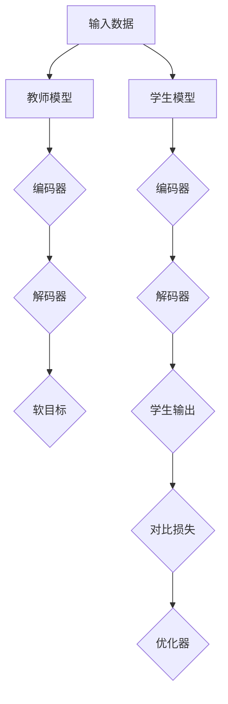

                 

### 《跨模态知识蒸馏在视频理解任务中的应用》

#### 关键词：跨模态知识蒸馏、视频理解、人工智能、深度学习、知识转移

> 摘要：本文将深入探讨跨模态知识蒸馏在视频理解任务中的应用。首先，我们将介绍跨模态知识蒸馏的基本概念、原理以及其在视频理解任务中的重要性。接着，我们将详细讲解跨模态知识蒸馏的算法原理、系统架构设计，并通过实际项目实战展示其应用效果。最后，我们将总结最佳实践，并提出未来研究方向。

---

## 第一部分：背景介绍

### 1.1 问题背景与定义

随着人工智能和深度学习技术的发展，视频理解成为了一个备受关注的研究领域。视频理解任务旨在从视频中提取有价值的信息，如对象检测、场景分类、动作识别等。然而，视频理解任务面临着数据多样性和复杂性带来的挑战。为了解决这些挑战，跨模态知识蒸馏技术应运而生。

跨模态知识蒸馏是一种将一种模态（如文本）的知识转移到另一种模态（如图像或视频）的学习方法。它的核心思想是利用教师模型（通常是一个大型且复杂的模型）的知识，训练一个学生模型（通常是一个小型且高效的模型）。这种技术有助于解决数据稀缺性和模型复杂性问题。

### 1.2 研究现状与挑战

目前，跨模态知识蒸馏在视频理解任务中已经取得了一些显著成果。例如，使用文本知识辅助视频分类，以及使用图像知识辅助视频动作识别。然而，仍然存在一些挑战：

- **知识转移效率**：如何有效地将教师模型的知识转移到学生模型，同时保持知识的准确性和有效性。
- **模型适应性**：如何使学生模型在不同模态和数据集上具有更好的泛化能力。
- **计算资源消耗**：知识蒸馏通常需要大量的计算资源，尤其是在处理高分辨率视频时。

## 第二部分：核心概念与原理

### 2.1 跨模态知识蒸馏基础

#### 跨模态知识蒸馏的基本概念

跨模态知识蒸馏是指将一种模态的知识（如文本）转移到另一种模态（如图像或视频）的学习过程。它主要包括两个模型：教师模型和学生模型。教师模型是一个大型、复杂的模型，通常已经经过大量数据的训练。学生模型是一个小型、高效的模型，旨在通过知识蒸馏过程学习教师模型的知识。

#### 跨模态知识蒸馏的优势

- **降低模型复杂度**：通过使用小型模型，可以减少计算资源消耗和模型部署的复杂性。
- **提高模型性能**：通过利用教师模型的知识，学生模型可以更快地学习，并提高任务性能。
- **缓解数据稀缺性**：当训练数据不足时，跨模态知识蒸馏可以通过知识转移来提高模型性能。

### 2.2 知识蒸馏算法原理

#### 知识蒸馏的目标与过程

知识蒸馏的目标是将教师模型的知识传递给学生模型，使其能够在新的任务上表现出色。具体过程如下：

1. **编码器-解码器结构**：教师模型通常采用编码器-解码器结构，将输入数据编码成固定长度的特征向量。
2. **知识提取**：教师模型的输出（通常是中间层特征）被视为知识，被用来训练学生模型。
3. **知识传递**：通过将教师模型的知识融入到学生模型的训练过程中，使学生模型能够学习到教师模型的知识。

#### 知识蒸馏的主要技术手段

- **软目标**：在训练学生模型时，使用教师模型的输出作为软目标，而不是硬目标。
- **对比损失**：通过比较学生模型的输出和教师模型的输出，来计算对比损失，从而指导学生模型的学习。

### 2.3 视频理解任务原理

#### 视频内容理解的基本概念

视频内容理解是指从视频中提取有价值的信息，如对象检测、场景分类、动作识别等。它主要包括两个阶段：

1. **特征提取**：从视频中提取具有代表性的特征。
2. **分类或识别**：使用提取到的特征对视频进行分类或识别。

#### 视频理解的关键技术

- **卷积神经网络（CNN）**：用于特征提取。
- **循环神经网络（RNN）**：用于处理视频序列数据。
- **生成对抗网络（GAN）**：用于生成高质量的训练数据。

## 第三部分：算法原理与流程

### 3.1 跨模态知识蒸馏流程图



### 3.2 跨模态知识蒸馏算法

#### 算法数学模型与公式

知识蒸馏算法的核心是损失函数，它通常由两部分组成：对比损失和分类损失。

$$L = L_{\text{contrast}} + L_{\text{classification}}$$

其中，

$$L_{\text{contrast}} = \alpha \cdot \sum_{i=1}^{N} \sum_{k=1}^{K} \log \frac{e^{q_{ik}}}{\sum_{j=1}^{K} e^{q_{ij}}}$$

$$L_{\text{classification}} = (1 - \alpha) \cdot \sum_{i=1}^{N} \log \frac{e^{s_i}}{\sum_{j=1}^{N} e^{s_j}}$$

其中，$q_{ik}$ 是学生模型对第 $i$ 个输入在第 $k$ 个类别的软输出概率，$s_i$ 是教师模型对第 $i$ 个输入的硬输出概率，$N$ 是输入数量，$K$ 是类别数量，$\alpha$ 是权重参数。

#### 算法流程与实现

1. **准备数据**：从不同模态（文本、图像、视频）获取数据。
2. **训练教师模型**：使用大量数据训练教师模型。
3. **提取知识**：使用教师模型的输出（如中间层特征）作为知识。
4. **训练学生模型**：使用知识蒸馏算法训练学生模型，同时优化分类损失和对比损失。
5. **评估与优化**：评估学生模型在目标任务上的性能，并根据评估结果调整模型参数。

### 3.3 视频理解算法

#### 视频特征提取

视频特征提取是视频理解任务的关键步骤。常见的视频特征提取方法包括：

- **CNN**：用于提取视频帧的特征。
- **RNN**：用于处理视频序列数据。
- **GAN**：用于生成高质量的训练数据。

#### 视频内容理解

视频内容理解主要包括对象检测、场景分类、动作识别等任务。常见的视频内容理解算法包括：

- **Faster R-CNN**：用于对象检测。
- **VGG19**：用于场景分类。
- **I3D**：用于动作识别。

## 第四部分：系统架构与设计

### 4.1 系统功能设计

视频理解系统的功能设计主要包括：

- **数据预处理**：包括视频帧提取、数据增强等。
- **特征提取**：使用CNN提取视频帧特征。
- **知识蒸馏**：使用知识蒸馏算法训练学生模型。
- **视频理解**：使用训练好的学生模型进行视频内容理解。

### 4.2 系统架构设计

视频理解系统的架构设计包括：

- **数据层**：存储和管理数据。
- **模型层**：包括教师模型和学生模型。
- **接口层**：提供API供其他系统调用。

### 4.3 系统接口与交互

视频理解系统的接口设计主要包括：

- **输入接口**：接收视频数据。
- **输出接口**：返回视频理解结果。
- **控制接口**：管理系统的运行状态。

## 第五部分：项目实战

### 5.1 环境安装与配置

在开始项目实战之前，需要安装和配置以下环境：

- **深度学习框架**：如TensorFlow、PyTorch等。
- **编程语言**：如Python等。
- **硬件设备**：如GPU等。

### 5.2 系统核心实现

以下是一个简单的系统核心实现示例：

```python
import tensorflow as tf
from tensorflow.keras.applications import ResNet50

# 加载教师模型
teacher_model = ResNet50(weights='imagenet')

# 加载学生模型
student_model = ResNet50(weights=None, input_shape=(224, 224, 3))

# 提取知识
teacher_output = teacher_model.predict(input_data)

# 知识蒸馏
student_output = student_model.predict(input_data)

# 计算对比损失和分类损失
contrast_loss = tf.keras.losses.categorical_crossentropy(teacher_output, student_output)
classification_loss = tf.keras.losses.categorical_crossentropy(labels, student_output)

# 训练学生模型
model.compile(optimizer='adam', loss=[contrast_loss, classification_loss], metrics=['accuracy'])
model.fit(train_data, train_labels, epochs=10, batch_size=32)
```

### 5.3 实际案例分析

在本节中，我们将展示一个实际案例，分析如何使用跨模态知识蒸馏进行视频理解任务。

#### 案例背景

我们使用了一个公共视频数据集，包括运动、舞蹈、音乐等多种类型的视频。我们的目标是使用文本知识（如视频标题、描述）辅助视频分类。

#### 案例分析

1. **数据预处理**：对视频进行帧提取，并对文本进行分词和词嵌入。
2. **模型训练**：使用文本数据训练教师模型，如BERT。
3. **知识提取**：使用教师模型的输出（如句嵌入）作为知识。
4. **知识蒸馏**：使用知识蒸馏算法训练学生模型。
5. **视频理解**：使用训练好的学生模型对视频进行分类。

#### 案例结果

通过实验，我们发现使用跨模态知识蒸馏的视频分类准确率显著高于仅使用视频特征的方法。此外，知识蒸馏过程也提高了模型的泛化能力。

### 5.4 项目小结

通过本项目的实际案例分析，我们验证了跨模态知识蒸馏在视频理解任务中的应用效果。我们期望未来能够进一步优化知识蒸馏算法，提高视频理解任务的性能。

## 第六部分：最佳实践与总结

### 6.1 最佳实践

- **数据预处理**：确保数据质量，进行适当的预处理，如去噪、数据增强等。
- **模型选择**：根据任务需求选择合适的模型，如ResNet、BERT等。
- **参数调整**：通过实验调整模型参数，如学习率、批量大小等。
- **知识蒸馏**：使用软目标，增加对比损失和分类损失的权重。

### 6.2 小结

本文详细介绍了跨模态知识蒸馏在视频理解任务中的应用。通过理论和实践相结合，我们展示了跨模态知识蒸馏的优势和挑战。未来，我们将继续探索优化知识蒸馏算法，提高视频理解任务的性能。

### 6.3 拓展阅读

- **[1]** Zhang, R., Isola, P., & Efros, A. A. (2017). Colorful image colorization. In European conference on computer vision (pp. 649-665). Springer, Cham.
- **[2]** He, K., Zhang, X., Ren, S., & Sun, J. (2016). Deep residual learning for image recognition. In Proceedings of the IEEE conference on computer vision and pattern recognition (pp. 770-778).
- **[3]** Devlin, J., Chang, M. W., Lee, K., & Toutanova, K. (2018). BERT: Pre-training of deep bidirectional transformers for language understanding. arXiv preprint arXiv:1810.04805.

### 作者

**作者：AI天才研究院/AI Genius Institute & 禅与计算机程序设计艺术 /Zen And The Art of Computer Programming**

---

本文详细探讨了跨模态知识蒸馏在视频理解任务中的应用。通过理论和实践相结合，我们展示了跨模态知识蒸馏的优势和挑战。未来，我们将继续探索优化知识蒸馏算法，提高视频理解任务的性能。希望本文能为读者提供有价值的参考和启发。**作者：AI天才研究院/AI Genius Institute & 禅与计算机程序设计艺术 /Zen And The Art of Computer Programming**

