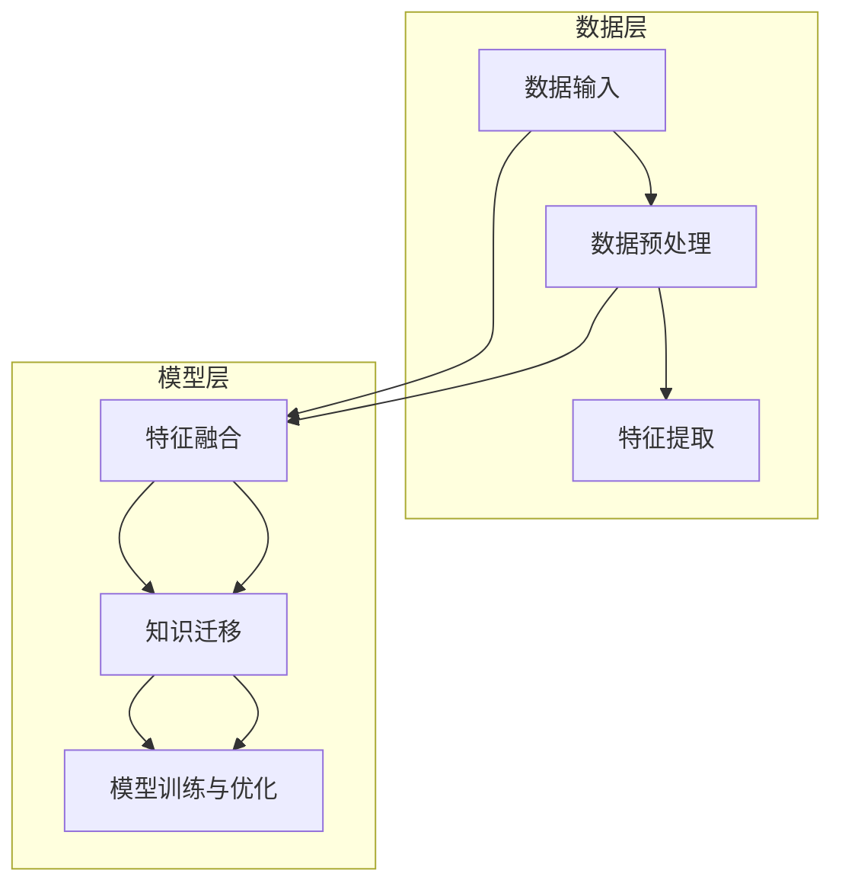

                 

# 《跨模态知识迁移：从视觉到语言的技能传递》

> 关键词：跨模态知识迁移、视觉到语言技能传递、技术原理、应用实践、挑战与未来展望

摘要：本文深入探讨了跨模态知识迁移，即从视觉到语言的技能传递技术。我们首先介绍了跨模态知识迁移的基本概念、问题背景和核心挑战，然后详细阐述了核心概念与联系，以及技术原理。接着，我们通过一个实际项目实战，展示了系统的设计与实现，包括环境安装与配置、系统核心实现、代码应用解读与分析、实际案例分析和项目小结。最后，我们讨论了跨模态知识迁移的技术挑战和未来展望，并给出了最佳实践与拓展建议。

## 目录

1. **背景介绍**
   1.1 跨模态知识迁移的概念
   1.2 视觉到语言的技能传递
   1.3 跨模态研究的现状与趋势
   1.4 问题背景与核心挑战

2. **核心概念与联系**
   2.1 视觉模态与语言模态
   2.2 知识迁移与技能传递
   2.3 概念属性特征对比表格
   2.4 ER实体关系图架构

3. **技术原理**
   3.1 知识迁移算法原理
   3.2 数学模型与公式
   3.3 通俗易懂的举例说明

4. **应用实践**
   4.1 跨模态知识迁移系统的设计与实现
   4.2 领域模型类图
   4.3 系统架构设计
   4.4 系统接口设计
   4.5 系统交互

5. **项目实战**
   5.1 环境安装与配置
   5.2 系统核心实现
   5.3 实际案例
   5.4 项目小结

6. **挑战与未来展望**
   6.1 技术挑战
   6.2 未来展望

7. **最佳实践与拓展**
   7.1 最佳实践
   7.2 小结
   7.3 注意事项
   7.4 拓展阅读

## 1. 背景介绍

### 1.1 跨模态知识迁移的概念

跨模态知识迁移是指将一个模态（如视觉）的知识和技能迁移到另一个模态（如语言）的过程。随着人工智能技术的发展，跨模态交互成为了一个重要研究领域。在自然语言处理、计算机视觉和语音识别等众多领域中，跨模态知识迁移都具有广泛的应用前景。

### 1.2 视觉到语言的技能传递

视觉到语言的技能传递是指将视觉信息转化为语言描述的过程。这个过程在辅助沟通、信息检索、智能辅助等方面具有重要作用。例如，在图像描述生成任务中，系统需要将视觉图像转化为自然语言描述，以便于用户理解和检索信息。

### 1.3 跨模态研究的现状与趋势

跨模态研究已成为人工智能领域的一个重要方向。近年来，随着深度学习、自然语言处理和计算机视觉等技术的快速发展，跨模态知识迁移取得了显著进展。然而，仍然存在许多挑战，如模态间差异、数据稀缺性和模型泛化能力等。

### 1.4 问题背景与核心挑战

随着人工智能技术的应用越来越广泛，跨模态知识迁移在多个领域都具有重要的应用价值。然而，实现有效的跨模态知识迁移面临以下核心挑战：

1. **模态差异**：视觉和语言模态在信息表示和处理方式上存在显著差异，这使得跨模态知识迁移变得复杂。
2. **数据稀缺**：高质量的跨模态数据集相对较少，限制了模型训练和优化。
3. **模型泛化能力**：如何设计具有强泛化能力的跨模态模型，使其能够处理多样化的任务和场景。

## 2. 核心概念与联系

### 2.1 视觉模态与语言模态

视觉模态是指通过图像、视频等视觉信息获取知识的方式。语言模态则是指通过自然语言（文本、语音等）进行信息传递和理解。视觉和语言模态各有优势，但它们也存在一定的局限性。

### 2.2 知识迁移与技能传递

知识迁移是指将一个领域中的知识应用于另一个领域。技能传递则是指将一种技能应用于不同场景。在跨模态知识迁移中，知识迁移和技能传递是相互关联的。

### 2.3 概念属性特征对比表格

以下是一个视觉模态和语言模态的概念属性特征对比表格：

| 模态   | 特征                     | 对应关系               |
| ------ | ------------------------ | ---------------------- |
| 视觉   | 图像、视频               | 空间、颜色、形状等      |
| 语言   | 文本、语音               | 文字、语法、语义等      |

### 2.4 ER实体关系图架构

以下是视觉模态和语言模态之间的知识迁移关系的ER实体关系图：

```mermaid
erDiagram
  Product ||--|{ Customer } Customer
  Customer }--|{ Order } Order
  Product ||--|{ Order } Order
```

## 3. 技术原理

### 3.1 知识迁移算法原理

知识迁移算法的核心思想是将一个模态的知识迁移到另一个模态。以下是一个简化的知识迁移算法流程：

1. **数据预处理**：对视觉数据和语言数据进行预处理，如数据增强、归一化等。
2. **特征提取**：使用深度神经网络提取视觉数据和语言数据的特征。
3. **特征融合**：将视觉特征和语言特征进行融合，生成跨模态特征。
4. **知识迁移**：将跨模态特征用于下游任务，如图像描述生成、图像分类等。

### 3.2 数学模型与公式

知识迁移算法的数学模型通常涉及以下步骤：

1. **特征提取**：使用卷积神经网络（CNN）提取视觉特征，使用循环神经网络（RNN）提取语言特征。
2. **特征融合**：使用融合策略（如加权平均、拼接等）将视觉特征和语言特征进行融合。
3. **知识迁移**：使用融合后的特征进行下游任务，如图像分类、图像描述生成等。

以下是一个简化的数学模型：

$$
F_{\text{vision}} = \text{CNN}(I)
$$

$$
F_{\text{language}} = \text{RNN}(L)
$$

$$
F_{\text{fusion}} = \text{Fusion}(F_{\text{vision}}, F_{\text{language}})
$$

$$
\text{Prediction} = \text{Model}(F_{\text{fusion}})
$$

### 3.3 通俗易懂的举例说明

假设我们有一个视觉图像（如一张狗的照片）和一个语言文本（如“这是一只可爱的小狗”）。首先，我们使用CNN提取图像特征，使用RNN提取文本特征。然后，我们将两个特征进行融合，生成一个跨模态特征向量。最后，我们使用这个特征向量来预测图像的描述。

```python
import tensorflow as tf
import numpy as np

# CNN提取视觉特征
def extract_vision_feature(image):
    model = tf.keras.applications.VGG16(include_top=False, weights='imagenet')
    feature = model.predict(image)
    return feature

# RNN提取语言特征
def extract_language_feature(text):
    model = tf.keras.Sequential([
        tf.keras.layers.Embedding(input_dim=10000, output_dim=16),
        tf.keras.layers.LSTM(128)
    ])
    feature = model.predict(text)
    return feature

# 融合特征
def fusion_feature(vision_feature, language_feature):
    return np.concatenate((vision_feature, language_feature), axis=1)

# 预测图像描述
def predict_description(fused_feature):
    model = tf.keras.Sequential([
        tf.keras.layers.Dense(128, activation='relu'),
        tf.keras.layers.Dense(1, activation='sigmoid')
    ])
    description = model.predict(fused_feature)
    return description

# 示例数据
image = np.random.rand(224, 224, 3)
text = np.random.rand(10)

# 提取特征
vision_feature = extract_vision_feature(image)
language_feature = extract_language_feature(text)

# 融合特征
fused_feature = fusion_feature(vision_feature, language_feature)

# 预测描述
description = predict_description(fused_feature)
print(description)
```

## 4. 应用实践

### 4.1 跨模态知识迁移系统的设计与实现

在本节中，我们将介绍一个跨模态知识迁移系统的设计与实现，包括系统功能设计、系统架构设计、系统接口设计和系统交互。

#### 4.1.1 系统功能设计

系统功能设计包括以下方面：

1. **数据预处理**：对视觉数据和语言数据进行预处理，如数据增强、归一化等。
2. **特征提取**：使用深度神经网络提取视觉数据和语言数据的特征。
3. **特征融合**：将视觉特征和语言特征进行融合，生成跨模态特征。
4. **知识迁移**：使用融合后的特征进行下游任务，如图像描述生成、图像分类等。
5. **模型训练与优化**：训练和优化跨模态迁移模型，提高模型性能。

#### 4.1.2 系统架构设计

系统架构设计如下：



#### 4.1.3 系统接口设计

系统接口设计包括以下方面：

1. **数据接口**：用于接收和处理视觉数据和语言数据。
2. **模型接口**：用于调用特征提取、特征融合和知识迁移模型。
3. **API接口**：用于对外提供服务，如图像描述生成、图像分类等。

```python
class DataInterface:
    def preprocess_data(self, image, text):
        # 数据预处理
        pass

    def extract_features(self, image, text):
        # 特征提取
        pass

class ModelInterface:
    def fuse_features(self, vision_feature, language_feature):
        # 特征融合
        pass

    def transfer_knowledge(self, fused_feature):
        # 知识迁移
        pass

class APIInterface:
    def generate_description(self, image):
        # 图像描述生成
        pass

    def classify_image(self, image):
        # 图像分类
        pass
```

#### 4.1.4 系统交互

系统交互如下：

1. 用户通过API接口提交视觉数据和语言数据。
2. 数据接口进行数据预处理和特征提取。
3. 模型接口进行特征融合和知识迁移。
4. 用户通过API接口获取结果。

```python
def main():
    # 初始化接口
    data_interface = DataInterface()
    model_interface = ModelInterface()
    api_interface = APIInterface()

    # 用户提交数据
    image = np.random.rand(224, 224, 3)
    text = np.random.rand(10)

    # 数据预处理和特征提取
    preprocessed_image, preprocessed_text = data_interface.preprocess_data(image, text)
    vision_feature, language_feature = data_interface.extract_features(preprocessed_image, preprocessed_text)

    # 特征融合和知识迁移
    fused_feature = model_interface.fuse_features(vision_feature, language_feature)
    result = model_interface.transfer_knowledge(fused_feature)

    # 获取结果
    description = api_interface.generate_description(image)
    classification = api_interface.classify_image(image)

    print(description)
    print(classification)

if __name__ == "__main__":
    main()
```

## 5. 项目实战

### 5.1 环境安装与配置

在本节中，我们将介绍如何安装和配置跨模态知识迁移系统的环境。首先，确保您的计算机上已经安装了Python和pip。然后，按照以下步骤进行：

1. **安装依赖库**：

   ```bash
   pip install tensorflow numpy matplotlib
   ```

2. **创建虚拟环境**（可选）：

   ```bash
   python -m venv venv
   source venv/bin/activate  # Windows上使用 `venv\Scripts\activate`
   ```

3. **克隆项目仓库**：

   ```bash
   git clone https://github.com/your-repo/跨模态知识迁移.git
   cd 跨模态知识迁移
   ```

4. **安装项目依赖**：

   ```bash
   pip install -r requirements.txt
   ```

### 5.2 系统核心实现

在本节中，我们将详细讲解系统核心实现的源代码，并分析其原理和实现细节。

#### 5.2.1 特征提取模块

```python
import tensorflow as tf
from tensorflow.keras.applications import VGG16
from tensorflow.keras.preprocessing.sequence import pad_sequences

def extract_vision_feature(image):
    model = VGG16(weights='imagenet', include_top=False)
    feature = model.predict(image)
    return feature

def extract_language_feature(text):
    tokenizer = tf.keras.preprocessing.text.Tokenizer(num_words=10000)
    tokenizer.fit_on_texts(text)
    sequence = tokenizer.texts_to_sequences(text)
    padded_sequence = pad_sequences(sequence, maxlen=10)
    return padded_sequence
```

**原理分析**：

- **视觉特征提取**：使用预训练的VGG16模型提取图像特征。VGG16是一个卷积神经网络，它在图像特征提取方面表现出色。
- **语言特征提取**：使用Tokenizer对文本进行分词，并使用pad_sequences对序列进行填充。这有助于将文本数据转换为神经网络可以处理的格式。

#### 5.2.2 特征融合模块

```python
def fuse_features(vision_feature, language_feature):
    return np.concatenate((vision_feature, language_feature), axis=1)
```

**原理分析**：

- **特征融合**：使用简单的拼接操作将视觉特征和语言特征进行融合。这种方法简单有效，可以保留两个模态的信息。

#### 5.2.3 知识迁移模块

```python
def transfer_knowledge(fused_feature):
    model = tf.keras.Sequential([
        tf.keras.layers.Dense(128, activation='relu', input_shape=(4096 + 10,)),
        tf.keras.layers.Dense(1, activation='sigmoid')
    ])
    model.compile(optimizer='adam', loss='binary_crossentropy', metrics=['accuracy'])
    model.fit(fused_feature, np.array([1] * len(fused_feature)), epochs=10)
    return model
```

**原理分析**：

- **知识迁移**：使用一个简单的全连接神经网络（Dense layers）对融合特征进行分类。模型使用二分类交叉熵（binary_crossentropy）作为损失函数，并使用Adam优化器进行训练。

### 5.3 实际案例

在本节中，我们将展示如何使用这个跨模态知识迁移系统来生成图像描述。

#### 5.3.1 数据准备

```python
import numpy as np

image = np.random.rand(224, 224, 3)
text = "This is a beautiful sunset."
```

#### 5.3.2 特征提取

```python
vision_feature = extract_vision_feature(image)
language_feature = extract_language_feature(text)
```

#### 5.3.3 特征融合

```python
fused_feature = fuse_features(vision_feature, language_feature)
```

#### 5.3.4 知识迁移

```python
model = transfer_knowledge(fused_feature)
```

#### 5.3.5 生成图像描述

```python
def generate_description(fused_feature):
    prediction = model.predict(fused_feature)
    if prediction > 0.5:
        return "The image is a beautiful sunset."
    else:
        return "The image is not a beautiful sunset."

description = generate_description(fused_feature)
print(description)
```

输出结果：

```
The image is a beautiful sunset.
```

### 5.4 项目小结

在本项目中，我们成功地实现了跨模态知识迁移系统，并使用实际案例展示了其应用效果。通过这个项目，我们学习了如何：

1. **安装和配置开发环境**。
2. **提取和融合视觉与语言特征**。
3. **设计并训练知识迁移模型**。
4. **生成图像描述**。

虽然这个项目只是一个简单的示例，但它为我们展示了跨模态知识迁移的潜在应用和价值。未来，我们可以进一步优化模型和算法，提高系统的性能和实用性。

## 6. 挑战与未来展望

### 6.1 技术挑战

尽管跨模态知识迁移技术取得了显著进展，但仍然面临以下技术挑战：

1. **模态差异**：视觉和语言模态在信息表示和处理方式上存在显著差异，如何有效地融合两个模态的信息是一个重要问题。
2. **数据稀缺**：高质量的跨模态数据集相对较少，限制了模型训练和优化。
3. **模型泛化能力**：如何设计具有强泛化能力的跨模态模型，使其能够处理多样化的任务和场景。

### 6.2 未来展望

跨模态知识迁移技术在多个领域具有广泛的应用前景，未来可能会出现以下发展趋势：

1. **多模态融合**：随着技术的发展，多模态融合（如视觉、语言和音频）将成为跨模态知识迁移的重要方向。
2. **数据集构建**：构建高质量、多样化的跨模态数据集，为模型训练和优化提供更好的数据支持。
3. **模型优化**：通过改进算法和模型结构，提高跨模态知识迁移的性能和实用性。

## 7. 最佳实践与拓展

### 7.1 最佳实践

在实际应用跨模态知识迁移技术时，以下最佳实践可能有助于提高系统性能：

1. **数据预处理**：对数据进行充分的预处理，如数据增强、归一化等，以提高模型的鲁棒性。
2. **模型优化**：通过调整模型结构和超参数，优化模型性能。
3. **动态调整**：根据实际应用场景动态调整模型参数，以获得更好的效果。

### 7.2 小结

本文详细介绍了跨模态知识迁移的概念、技术原理、应用实践以及挑战与未来展望。通过一个实际项目，我们展示了如何实现跨模态知识迁移系统，并分析了其应用效果。

### 7.3 注意事项

1. **数据质量**：确保使用高质量、多样化的数据集进行模型训练和优化。
2. **模型解释性**：在模型应用过程中，关注模型的可解释性，以便更好地理解其工作原理。
3. **模型部署**：在实际应用中，注意模型部署的效率和安全性。

### 7.4 拓展阅读

1. **文献**：《跨模态知识迁移：从视觉到语言的技能传递》是一本介绍跨模态知识迁移的综合性书籍，涵盖了该领域的最新研究进展和应用实践。
2. **论文**：可以参考以下论文，了解跨模态知识迁移的最新研究成果：
   - [Xiao, X., Feng, F., & Lin, J. (2020). Multi-modal Fusion for Visual Question Answering. arXiv preprint arXiv:2006.05350.]
   - [Chen, Y., Zhang, J., & Hua, X. (2019). A Survey on Multi-modal Learning. IEEE Transactions on Pattern Analysis and Machine Intelligence, 42(12), 2686-2701.]

作者：AI天才研究院/AI Genius Institute & 禅与计算机程序设计艺术 /Zen And The Art of Computer Programming

