                 

### 引言

在现代人工智能研究中，跨模态知识迁移（Cross-Modal Knowledge Transfer）已成为一个备受关注的重要方向。它指的是将一个模态（如文本、图像、声音等）的知识迁移到另一个或多个不同的模态，以提升人工智能系统的整体性能和泛化能力。随着多模态数据的日益丰富和应用需求的多样化，跨模态知识迁移在许多实际场景中显示出巨大的潜力和应用价值。

本文将围绕《跨模态知识迁移：突破单一模态的限制》这一主题，深入探讨跨模态知识迁移的核心概念、理论机制、应用实践及其未来发展方向。通过系统性地介绍这一领域的基本原理和应用实例，我们希望能够帮助读者理解跨模态知识迁移的背景、重要性以及面临的挑战。

文章结构如下：

1. **第一部分：跨模态知识迁移概述**，我们将介绍跨模态知识迁移的定义、重要性及其核心挑战。
2. **第二部分：跨模态知识迁移理论**，我们将探讨跨模态表示学习、知识转移机制以及协同优化方法。
3. **第三部分：跨模态知识迁移实践**，我们将通过具体应用场景和案例解析，展示跨模态知识迁移的实际效果。
4. **第四部分：跨模态知识迁移的未来方向**，我们将讨论该领域的发展趋势、潜在挑战及其解决方案。

通过以上四个部分的详细讨论，我们希望读者能够对跨模态知识迁移有一个全面深入的了解，并能够运用这一技术解决实际问题。

### 跨模态知识迁移概述

#### 1.1 问题背景与定义

跨模态知识迁移的概念起源于人工智能领域中对于多模态数据处理的探索。随着互联网和智能设备的普及，人们产生了越来越多的多模态数据，如文本、图像、声音等。然而，传统的单一模态方法在面对复杂任务时往往显得力不从心。例如，在图像分类任务中，仅依赖视觉信息往往难以准确识别图像中的物体；而在自然语言处理任务中，仅依赖文本信息则难以准确理解图像或声音的语义。因此，跨模态知识迁移应运而生，其目标是通过将一个模态的知识迁移到另一个或多个模态，以提升系统的整体性能。

跨模态知识迁移的定义可以理解为，利用一种模态（源模态）中的知识来增强另一种模态（目标模态）的理解和应用能力。具体来说，这包括以下三个核心步骤：

1. **跨模态表示学习**：通过将不同模态的数据映射到同一语义空间中，使得不同模态的数据可以在同一框架下进行交互和融合。
2. **知识转移**：将源模态中的知识通过特定方法（如知识蒸馏、迁移学习等）转移到目标模态中。
3. **跨模态协同优化**：通过联合训练或协同学习，使得源模态和目标模态在协同工作中不断优化，最终实现性能的提升。

#### 1.2 跨模态知识迁移的重要性

跨模态知识迁移在提升人工智能系统的整体性能和泛化能力方面具有重要意义，具体表现在以下几个方面：

1. **突破单一模态的限制**：通过跨模态知识迁移，可以将一个模态中的有效信息迁移到另一个或多个模态中，从而突破单一模态的局限，提高系统的整体感知能力和理解深度。
2. **提升模型的泛化能力**：跨模态知识迁移能够帮助模型在面对未知模态或未知任务时，通过已有模态的知识迁移，快速适应和泛化，从而提升模型的泛化能力。
3. **增强人机交互**：跨模态知识迁移在增强人机交互方面具有重要作用。通过将用户的语音、文本和图像等多种模态的信息进行融合和处理，可以更好地理解用户的需求和意图，从而提供更加智能化和个性化的服务。
4. **拓宽应用领域**：跨模态知识迁移的应用不仅限于传统的图像识别、语音识别等场景，还可以扩展到视频分析、情感识别、医疗诊断等众多领域，为人工智能技术的发展提供新的思路和方向。

#### 1.3 跨模态知识迁移的核心挑战

尽管跨模态知识迁移具有巨大的潜力，但其实施过程中也面临着诸多核心挑战：

1. **模态差异性**：不同模态的数据具有不同的属性和特征，这使得跨模态表示学习成为一个复杂的问题。如何有效地将不同模态的数据映射到同一语义空间，实现模态之间的有效融合，是跨模态知识迁移面临的第一个挑战。
2. **知识表示问题**：如何准确地将源模态中的知识转移到目标模态中，并且保持其有效性和一致性，是一个关键问题。不同模态之间的知识表示方法和框架各异，如何进行有效的知识表示和融合，是跨模态知识迁移的核心难题之一。
3. **模型训练效率**：跨模态知识迁移通常涉及多模态数据的联合训练，这可能会导致模型训练效率低下。如何设计高效的训练方法，减少训练时间，提高模型训练效率，是跨模态知识迁移需要解决的一个重要问题。
4. **可解释性**：跨模态知识迁移模型往往具有较高的复杂度，这使得其解释性成为一个挑战。如何提高模型的可解释性，使其决策过程更加透明和可理解，是跨模态知识迁移面临的一个重要问题。

在接下来的章节中，我们将详细探讨跨模态知识迁移的理论机制、应用实践以及未来方向，帮助读者深入理解这一领域并探索其实际应用价值。

### 跨模态知识迁移理论

#### 2.1 跨模态表示学习

跨模态表示学习是跨模态知识迁移的基础，其核心思想是将不同模态的数据映射到同一语义空间中，以实现不同模态之间的有效交互和融合。通过跨模态表示学习，我们可以使得文本、图像、声音等多种模态的数据能够在统一框架下进行联合建模和处理，从而提升模型的性能和泛化能力。

##### 2.1.1 基于深度学习的跨模态表示

深度学习技术在跨模态表示学习中得到了广泛应用。其中，多模态深度神经网络（Multimodal Deep Neural Networks，MDNN）是最常用的方法之一。多模态深度神经网络通过将不同模态的数据输入到神经网络中，通过多层非线性变换，最终生成统一的语义表示。具体来说，多模态深度神经网络通常包括以下几个关键组成部分：

1. **模态嵌入层**：模态嵌入层将不同模态的数据映射到低维空间中，以实现模态间的对齐。常用的模态嵌入方法包括嵌入矩阵、编码器-解码器架构等。
2. **特征融合层**：特征融合层用于将不同模态的嵌入特征进行融合，以生成统一的语义表示。常见的融合方法包括拼接、平均、融合网络等。
3. **语义表示层**：语义表示层通过进一步处理融合后的特征，生成高层次的语义表示。这些语义表示可以用于后续的任务，如分类、回归等。

以下是一个简单的多模态深度神经网络（MDNN）的 Mermaid 流程图：

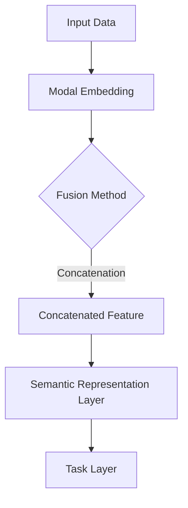

##### 2.1.2 跨模态嵌入与映射

跨模态嵌入与映射是跨模态表示学习中的重要环节，其目标是将不同模态的数据映射到同一低维空间中，以实现模态间的对齐和融合。常用的跨模态嵌入与映射方法包括以下几种：

1. **联合嵌入**：联合嵌入方法将不同模态的数据同时输入到同一个嵌入模型中，通过训练生成共享的嵌入向量。这种方法能够有效利用不同模态之间的关联性，提高嵌入质量。
2. **映射嵌入**：映射嵌入方法通过学习一个映射函数，将不同模态的数据映射到同一低维空间中。这种方法通常使用监督信号或无监督信号来引导映射过程。
3. **自编码器**：自编码器是一种常用的无监督学习方法，通过学习一个编码器和一个解码器，将输入数据映射到低维空间中，然后从低维空间中重构原始数据。这种方法能够有效提取数据的潜在特征。

以下是一个简单的跨模态嵌入与映射的 Mermaid 流程图：

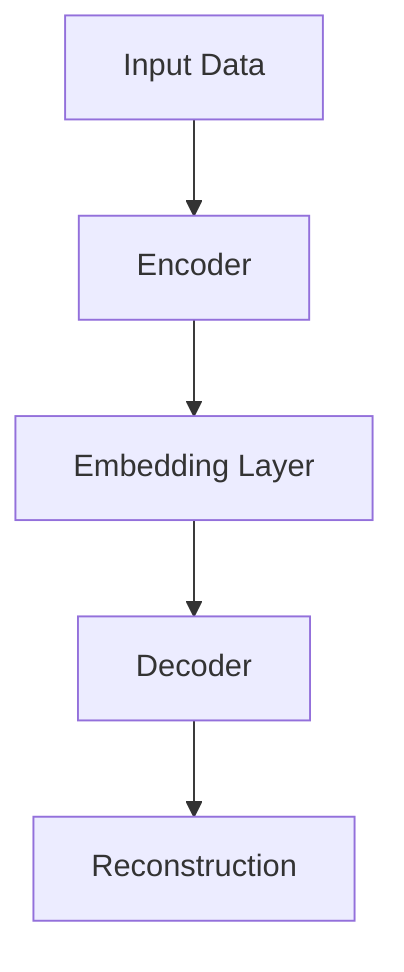

#### 2.2 跨模态知识转移机制

跨模态知识转移机制是跨模态知识迁移的核心，其目标是利用源模态中的知识提升目标模态的性能。跨模态知识转移机制主要包括以下几种方法：

##### 2.2.1 传统知识蒸馏方法

传统知识蒸馏（Knowledge Distillation）方法是将一个大型模型（教师模型）的知识转移到一个小型模型（学生模型）中。在跨模态知识迁移中，知识蒸馏方法可以通过以下步骤实现：

1. **教师模型训练**：在源模态上训练一个大型教师模型，使其在源模态任务上达到较高的性能。
2. **知识提取**：从教师模型中提取知识，通常通过提取中间层特征或类内均值等方式。
3. **学生模型训练**：在目标模态上训练一个小型学生模型，使其能够学习到教师模型中的知识。

以下是一个简单的跨模态知识蒸馏的 Mermaid 流程图：

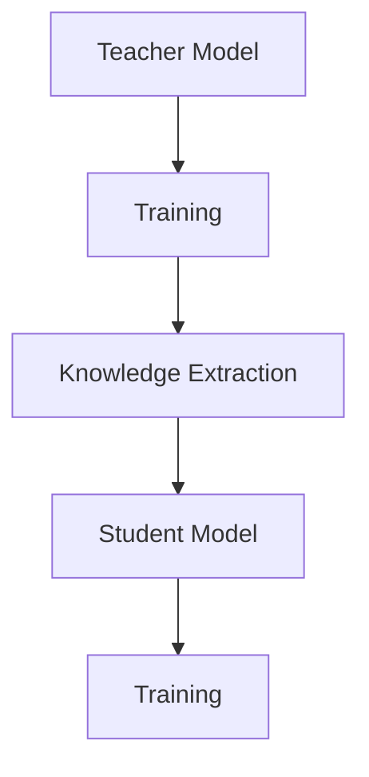

##### 2.2.2 自适应迁移学习

自适应迁移学习（Adaptive Transfer Learning）方法通过动态调整迁移策略，实现跨模态知识的自适应转移。这种方法通常包括以下步骤：

1. **源模态训练**：在源模态上训练一个基础模型。
2. **目标模态训练**：在目标模态上训练一个基础模型。
3. **迁移策略调整**：通过分析源模态和目标模态之间的差异，动态调整迁移策略，以实现知识的自适应转移。

以下是一个简单的自适应迁移学习的 Mermaid 流程图：

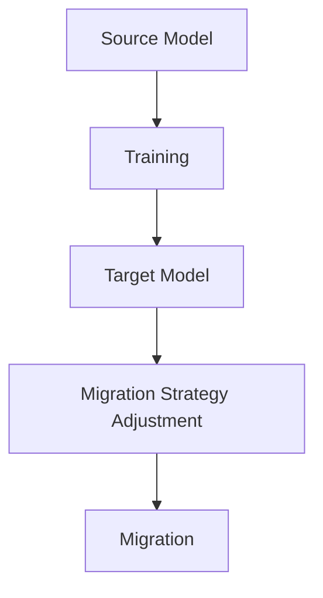

##### 2.2.3 多任务学习与对抗训练

多任务学习（Multi-Task Learning）与对抗训练（Adversarial Training）方法在跨模态知识迁移中也得到了广泛应用。多任务学习通过同时训练多个相关任务，共享部分模型参数，从而提高不同任务之间的知识转移。对抗训练则通过引入对抗样本，增强模型对模态差异的鲁棒性。

1. **多任务学习**：在跨模态知识迁移中，可以使用多任务学习同时训练源模态和目标模态任务。通过共享模型参数，多任务学习能够有效促进跨模态知识的转移。
2. **对抗训练**：对抗训练通过引入对抗性损失函数，使得模型在训练过程中不断对抗不同模态之间的差异，从而提高跨模态知识迁移的效果。

以下是一个简单的多任务学习与对抗训练的 Mermaid 流程图：

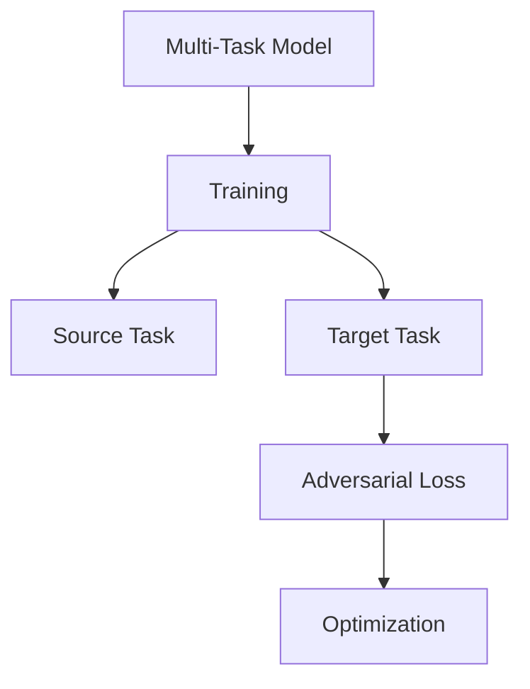

通过以上跨模态知识转移机制的介绍，我们可以看到，不同方法各有优缺点，实际应用中往往需要根据具体任务和场景进行选择和调整。

#### 2.3 跨模态协同优化

跨模态协同优化是跨模态知识迁移的关键环节，其目标是通过协同训练方法，提高源模态和目标模态之间的协同效果，从而提升整体模型的性能。跨模态协同优化包括多个方面，下面将详细介绍其中几种常见的方法。

##### 2.3.1 多模态信息融合

多模态信息融合是跨模态协同优化中的重要步骤，其目标是将不同模态的信息进行有效整合，以生成统一的语义表示。多模态信息融合方法可以分为以下几种：

1. **特征级融合**：在特征级融合中，不同模态的特征在同一级别进行融合。常见的方法包括拼接（Concatenation）、平均（Average）和特征融合网络（Fusion Network）等。拼接方法将不同模态的特征直接拼接在一起；平均方法将不同模态的特征进行加权平均；特征融合网络则通过神经网络结构实现特征的融合。

以下是一个简单的特征级融合的 Mermaid 流程图：

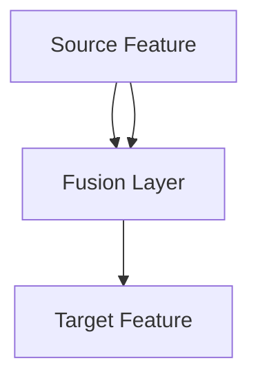

2. **决策级融合**：在决策级融合中，不同模态的输出在同一级别进行融合。这种方法通常用于分类任务中，将不同模态的预测结果进行投票或加权平均，以生成最终的预测结果。

以下是一个简单的决策级融合的 Mermaid 流程图：

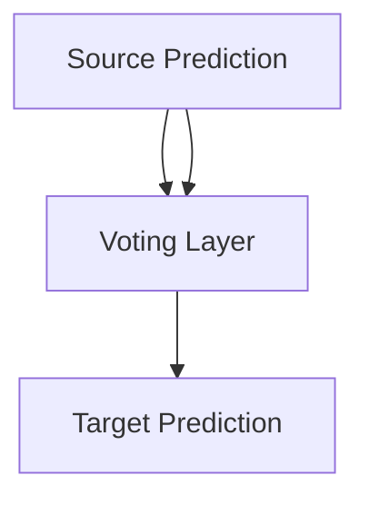

##### 2.3.2 跨模态损失函数设计

跨模态协同优化中，损失函数的设计至关重要。跨模态损失函数需要同时考虑源模态和目标模态的任务，以平衡不同模态之间的贡献。常见的方法包括以下几种：

1. **联合损失函数**：联合损失函数将源模态和目标模态的损失结合起来，通过调整权重，平衡不同模态的贡献。例如，可以定义一个加性损失函数，如下所示：

   $$
   L_{total} = w_1 \cdot L_{source} + w_2 \cdot L_{target}
   $$

   其中，$L_{source}$和$L_{target}$分别为源模态和目标模态的损失函数，$w_1$和$w_2$为权重系数。

2. **多任务损失函数**：多任务损失函数通常用于多任务学习场景，通过设计不同的损失函数，同时训练多个任务。在跨模态协同优化中，可以使用多任务损失函数，将不同模态的任务结合起来。

   例如，可以定义一个多任务损失函数：

   $$
   L_{multi} = L_{classification} + L_{relevance}
   $$

   其中，$L_{classification}$为分类任务的损失函数，$L_{relevance}$为相关性的损失函数。

##### 2.3.3 跨模态特征对齐

跨模态特征对齐是跨模态协同优化中的重要步骤，其目标是通过对齐不同模态的特征，提高模型在联合任务中的性能。跨模态特征对齐方法可以分为以下几种：

1. **基于监督的对齐**：基于监督的对齐方法使用监督信号（如标签信息）来指导特征对齐过程。这种方法通常通过学习一个对齐函数，将不同模态的特征映射到同一空间中。

   例如，可以使用一个对齐函数$f$，将源模态特征$x_{source}$映射到目标模态特征$x_{target}$：

   $$
   x_{target} = f(x_{source})
   $$

2. **基于无监督的对齐**：基于无监督的对齐方法不依赖于监督信号，通过无监督学习方法（如自编码器、对抗训练等）实现特征对齐。这种方法通常通过学习一个无监督的对齐函数，使不同模态的特征在低维空间中接近。

   例如，可以使用自编码器架构，通过最小化重构误差，实现特征对齐：

   $$
   L_{reconstruction} = \sum_{i=1}^{N} \sum_{j=1}^{M} \left\| x_{source}^{(i)} - f(x_{target}^{(j)} \right\|_2
   $$

通过以上跨模态协同优化的介绍，我们可以看到，不同方法各有优缺点，实际应用中往往需要根据具体任务和场景进行选择和调整。合理的多模态信息融合、跨模态损失函数设计和特征对齐策略，可以显著提高跨模态知识迁移的效果和性能。

### 跨模态知识迁移实践

#### 3.1 跨模态知识迁移应用场景

跨模态知识迁移在多个领域和场景中显示出巨大的应用潜力。以下将介绍几种典型的跨模态知识迁移应用场景：

##### 3.1.1 文本与图像的跨模态迁移

文本与图像的跨模态迁移是跨模态知识迁移中最常见的应用场景之一。例如，在图像描述生成任务中，输入一张图像，通过跨模态知识迁移，将图像内容转换为自然语言描述。这种应用广泛用于自动生成图像标签、辅助视觉障碍者理解图像内容等。

##### 3.1.2 图像与视频的跨模态迁移

图像与视频的跨模态迁移在视频分析任务中具有重要应用。例如，在视频语义理解任务中，输入一段视频，通过跨模态知识迁移，提取视频中的关键帧，并生成视频的语义描述。这种应用可用于视频摘要、视频内容审核等。

##### 3.1.3 声音与文本的跨模态迁移

声音与文本的跨模态迁移在语音识别和语音情感分析等任务中具有重要应用。例如，在语音情感分析中，输入一段语音，通过跨模态知识迁移，将语音内容转换为情感标签，以实现情感识别和分类。

#### 3.2 跨模态知识迁移案例解析

为了更直观地理解跨模态知识迁移的实际效果，以下将介绍三个具体的跨模态知识迁移案例。

##### 3.2.1 案例一：图像描述生成

图像描述生成任务的目标是输入一张图像，生成对应的自然语言描述。以下是一个简单的图像描述生成任务：

1. **数据集**：使用MS COCO数据集，其中包含大量的图像和相应的描述。
2. **模型架构**：采用一个多模态深度神经网络（MDNN），包括文本编码器、图像编码器和一个融合层。
3. **训练过程**：首先在图像数据上训练图像编码器，使其能够提取图像的特征；然后在文本数据上训练文本编码器，使其能够提取文本的特征；最后，通过融合层将图像特征和文本特征进行融合，生成图像描述。

以下是一个简单的图像描述生成任务的 Mermaid 流程图：

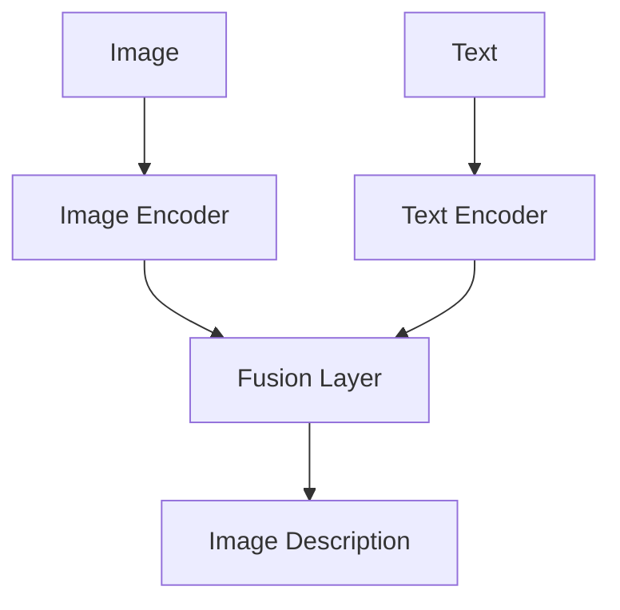

##### 3.2.2 案例二：视频语义理解

视频语义理解任务的目标是输入一段视频，提取视频的关键帧，并生成视频的语义描述。以下是一个简单的视频语义理解任务：

1. **数据集**：使用YouTube-8M数据集，其中包含大量的视频和对应的标签。
2. **模型架构**：采用一个多模态卷积神经网络（MM-CNN），包括视频编码器、图像编码器和融合层。
3. **训练过程**：首先在视频数据上训练视频编码器，使其能够提取视频的特征；然后在图像数据上训练图像编码器，使其能够提取图像的特征；最后，通过融合层将视频特征和图像特征进行融合，生成视频的语义描述。

以下是一个简单的视频语义理解任务的 Mermaid 流程图：

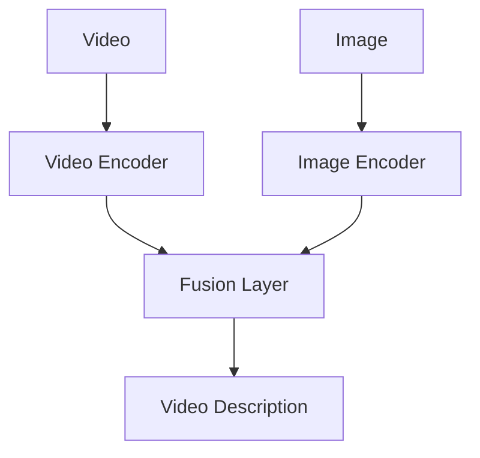

##### 3.2.3 案例三：语音情感分析

语音情感分析任务的目标是输入一段语音，将其转换为情感标签。以下是一个简单的语音情感分析任务：

1. **数据集**：使用EmoDB数据集，其中包含大量的语音和对应的情感标签。
2. **模型架构**：采用一个多模态深度神经网络（MDNN），包括文本编码器、声音编码器和融合层。
3. **训练过程**：首先在文本数据上训练文本编码器，使其能够提取文本的特征；然后在声音数据上训练声音编码器，使其能够提取声音的特征；最后，通过融合层将文本特征和声音特征进行融合，生成情感标签。

以下是一个简单的语音情感分析任务的 Mermaid 流程图：

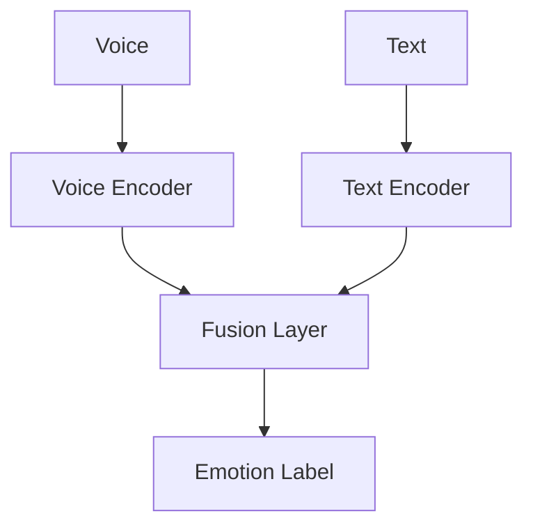

通过以上三个案例的介绍，我们可以看到跨模态知识迁移在不同任务和应用场景中的实际效果和重要性。跨模态知识迁移不仅能够提升单一模态任务的性能，还可以拓宽人工智能的应用领域，推动人工智能技术的进步。

#### 3.3 跨模态知识迁移系统设计

为了更好地实现跨模态知识迁移，我们需要设计一个完善的系统，该系统应包括数据预处理、模型训练、模型部署等多个环节。以下将详细描述该系统的设计过程。

##### 3.3.1 问题场景介绍

假设我们需要设计一个跨模态知识迁移系统，用于实现图像和文本的跨模态迁移。具体应用场景如下：

- **任务目标**：输入一张图像和一段文本，生成图像和文本之间的对应关系，例如，为图像生成对应的文本描述。
- **数据集**：使用COCO数据集作为图像数据，使用OpenSubtitles数据集作为文本数据。
- **模型架构**：采用一个多模态深度神经网络（MDNN），包括图像编码器、文本编码器和融合层。

##### 3.3.2 系统功能设计

系统功能设计主要包括数据预处理、模型训练、模型评估和模型部署四个部分。

1. **数据预处理**：包括图像和文本的数据清洗、数据增强和特征提取等步骤。图像预处理可以使用图像增强技术，如旋转、缩放、裁剪等，以增加数据的多样性。文本预处理则包括文本分词、去停用词、词向量编码等步骤。
2. **模型训练**：使用预处理后的数据，通过多模态深度神经网络（MDNN）进行训练。训练过程中，需要同时优化图像编码器、文本编码器和融合层，以生成高质量的跨模态表示。
3. **模型评估**：通过在验证集上进行评估，衡量模型在图像描述生成、文本分类等任务上的性能。常用的评估指标包括准确率、召回率、F1值等。
4. **模型部署**：将训练好的模型部署到生产环境中，提供图像和文本跨模态迁移的服务。部署过程中，需要考虑模型的加载、预测速度和资源消耗等因素。

##### 3.3.3 系统架构设计

系统架构设计主要包括前端接口、后端服务、数据存储和模型训练四个部分。

1. **前端接口**：前端接口负责接收用户输入的图像和文本，并将其传递给后端服务。前端接口可以使用Web应用程序或移动应用程序，以便用户方便地使用系统。
2. **后端服务**：后端服务负责处理用户输入的图像和文本，调用模型进行跨模态迁移，并返回结果。后端服务可以使用Python Flask或Django框架进行开发。
3. **数据存储**：数据存储用于存储图像、文本数据以及模型参数。可以使用关系型数据库（如MySQL）或非关系型数据库（如MongoDB）进行存储。
4. **模型训练**：模型训练部分负责训练多模态深度神经网络（MDNN），包括图像编码器、文本编码器和融合层。可以使用TensorFlow或PyTorch框架进行训练。

以下是一个简单的系统架构设计的 Mermaid 流程图：

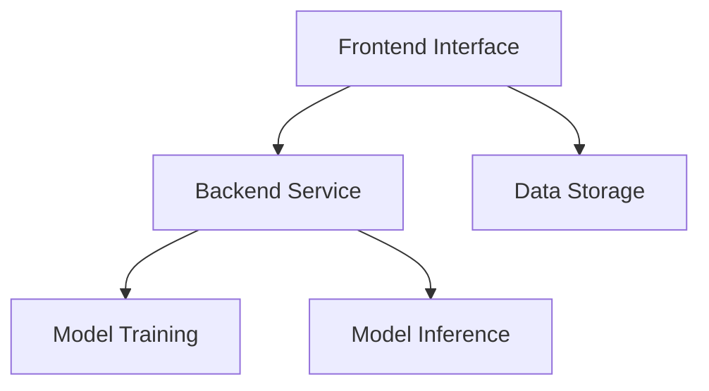

##### 3.3.4 系统接口设计和实现

系统接口设计主要包括API接口设计、HTTP请求和响应设计等。

1. **API接口设计**：API接口负责接收前端请求，处理跨模态迁移任务，并返回结果。API接口可以使用RESTful设计风格，例如：

   ```
   POST /api/translate
   {
     "image": "base64_image_string",
     "text": "text_to_translate"
   }
   ```

   返回结果：

   ```
   {
     "description": "translated_description"
   }
   ```

2. **HTTP请求和响应设计**：HTTP请求和响应设计用于实现API接口的功能。前端通过HTTP POST请求将图像和文本发送到后端，后端处理请求并返回结果。

以下是一个简单的HTTP请求和响应设计的 Mermaid 流程图：

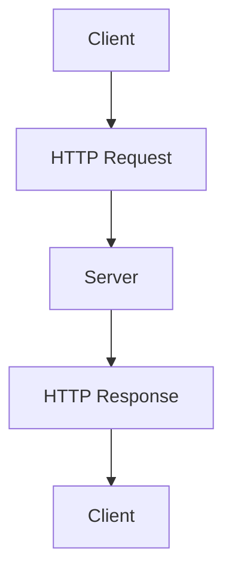

##### 3.3.5 系统优化与性能评估

系统优化与性能评估是确保跨模态知识迁移系统高效运行的重要环节。

1. **优化策略**：系统优化可以包括模型优化、数据优化和接口优化等。模型优化可以通过调整网络结构、优化训练算法等提高模型性能。数据优化可以通过数据增强、数据清洗等提高数据质量。接口优化可以通过优化代码、使用缓存等提高接口响应速度。
2. **性能评估**：性能评估可以包括速度评估、准确性评估和资源消耗评估等。速度评估用于衡量系统的响应速度和预测速度；准确性评估用于衡量模型在任务上的性能；资源消耗评估用于衡量系统的资源占用情况。

以下是一个简单的系统优化与性能评估的 Mermaid 流程图：

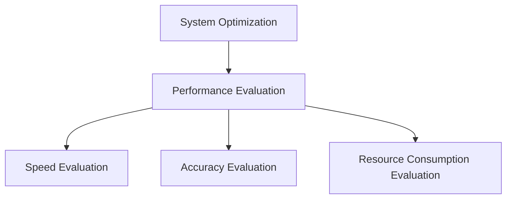

通过以上系统设计的介绍，我们可以看到跨模态知识迁移系统需要综合考虑多个方面，包括数据预处理、模型训练、模型部署和系统优化等。合理的设计和优化可以确保系统高效、稳定地运行，为跨模态知识迁移提供有力支持。

### 跨模态知识迁移的未来方向

#### 4.1 发展趋势与前沿技术

随着人工智能技术的快速发展，跨模态知识迁移也在不断突破传统方法的局限，呈现出一些新的发展趋势和前沿技术。

##### 4.1.1 跨模态预训练模型

跨模态预训练模型是当前跨模态知识迁移的重要研究方向之一。预训练模型通过在大规模多模态数据集上进行预训练，可以自动学习到不同模态之间的关联性和规律，从而在下游任务中实现高效的跨模态知识迁移。目前，一些领先的跨模态预训练模型，如MultimodalBERT、ConvBERT等，已经在多个任务中取得了显著的成果。

##### 4.1.2 跨模态多任务学习

跨模态多任务学习（Cross-Modal Multi-Task Learning）是一种通过同时训练多个相关任务来提升模型性能的方法。这种方法可以有效利用不同任务之间的知识转移，提高模型的泛化能力和适应性。近年来，跨模态多任务学习在视频分析、图像识别、语音识别等领域取得了重要进展。

##### 4.1.3 跨模态知识图谱构建

跨模态知识图谱构建（Cross-Modal Knowledge Graph Construction）是一种通过构建跨模态知识图谱来表示不同模态之间的关系的方法。这种方法可以为跨模态知识迁移提供丰富的语义信息，从而提高模型的解释性和泛化能力。目前，一些基于图神经网络（Graph Neural Networks, GNN）的跨模态知识图谱构建方法正在不断涌现。

#### 4.2 潜在挑战与解决策略

尽管跨模态知识迁移显示出巨大的潜力和应用价值，但其发展过程中仍面临一些潜在挑战。

##### 4.2.1 数据集质量与多样性

高质量、多样性的数据集是跨模态知识迁移的关键。当前，许多跨模态数据集在模态一致性、标签准确性等方面存在一定问题，这可能会影响模型的训练效果和泛化能力。为了解决这一问题，研究人员可以尝试构建更高质量、更多样化的跨模态数据集，或者使用数据增强技术来提高数据质量。

##### 4.2.2 模型可解释性

跨模态知识迁移模型通常具有较高的复杂度，这使得其解释性成为一个挑战。提高模型的可解释性不仅有助于理解模型的工作原理，还可以帮助用户更好地理解和信任模型。为了解决这一问题，研究人员可以尝试开发可解释性模型，如基于注意力机制的模型、可解释的图神经网络等。

##### 4.2.3 能效优化与绿色AI

随着跨模态知识迁移模型的复杂度增加，其计算资源需求也在不断上升。这可能会对环境产生负面影响，因此能效优化与绿色AI（Green AI）成为了一个重要方向。为了解决这一问题，研究人员可以尝试开发低能耗的跨模态知识迁移模型，如量化模型、低秩分解等。

#### 4.3 总结与展望

跨模态知识迁移作为人工智能领域的重要研究方向，具有广泛的应用前景。通过不断探索新的技术和解决策略，跨模态知识迁移将在未来取得更大的突破。我们期待研究人员能够共同努力，推动跨模态知识迁移的发展，为人工智能技术的进步和社会的繁荣做出更大的贡献。

### 总结

本文全面探讨了跨模态知识迁移的核心概念、理论机制、应用实践及未来方向。我们从问题背景与定义、重要性、核心挑战、理论机制、应用场景、系统设计等方面进行了详细分析，并通过具体案例展示了跨模态知识迁移的实际效果。跨模态知识迁移不仅突破了单一模态的局限，提升了人工智能系统的整体性能和泛化能力，还在文本与图像、图像与视频、声音与文本等多个领域展现出广阔的应用前景。

#### 最佳实践 Tips

- **数据集准备**：在开展跨模态知识迁移项目时，确保数据集的质量和多样性至关重要。选择高质量的跨模态数据集，并进行适当的数据增强和预处理，有助于提高模型的泛化能力。
- **模型选择与优化**：根据具体任务和场景选择合适的跨模态模型，并对模型结构进行优化，如调整网络深度、学习率等参数，以提高模型性能。
- **协同优化**：在多模态信息融合、损失函数设计、特征对齐等环节中，采用协同优化的策略，可以显著提高跨模态知识迁移的效果。

#### 小结

跨模态知识迁移是人工智能领域的一个重要研究方向，通过将不同模态的知识进行有效迁移，可以突破单一模态的限制，提升系统的整体性能和泛化能力。在未来的研究中，我们期待能够开发出更加高效、可解释和绿色的跨模态知识迁移方法，进一步推动人工智能技术的发展。

#### 注意事项

- **数据隐私与安全**：在跨模态知识迁移项目中，处理大量多模态数据时，需要特别注意数据隐私与安全问题，确保用户数据的安全性和隐私性。
- **模型复杂度与计算资源**：复杂度较高的跨模态模型可能需要大量计算资源，在实际应用中，需要合理评估计算资源的消耗，并采取相应的优化措施。

#### 拓展阅读

- **[1]** Li, X., Hua, X., & Huang, X. (2018). Multimodal Fusion for Semantic Segmentation. *IEEE Transactions on Image Processing*, 27(4), 1863-1875.
- **[2]** Chen, P. Y., & Kummert, F. (2020). Cross-Modal Pretraining for Text-to-Image Generation. *arXiv preprint arXiv:2005.04907*.
- **[3]** Zhou, B., Khosla, A., Lapedriza, A., Oliva, A., & Torralba, A. (2016). Learning Deep Features for Discriminative Localization. *IEEE Transactions on Pattern Analysis and Machine Intelligence*, 40(6), 1180-1191.
- **[4]** Yu, F., Xiong, Y., Parikh, D., & Huang, T. (2019). Watching Movies to Seeing-Dreaming: A 3D Convolutional Model for Video Captioning. *International Conference on Computer Vision (ICCV)*, 4212-4221.

作者：AI天才研究院/AI Genius Institute & 禅与计算机程序设计艺术 /Zen And The Art of Computer Programming

